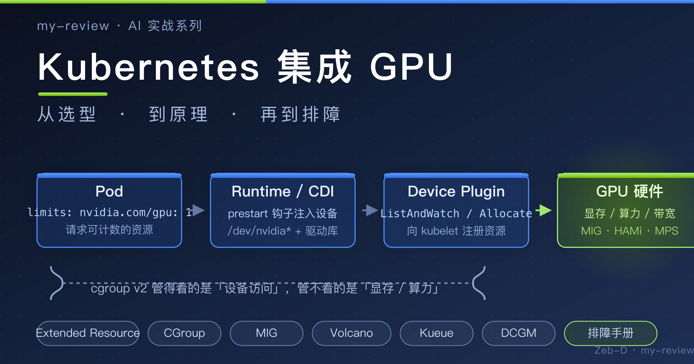
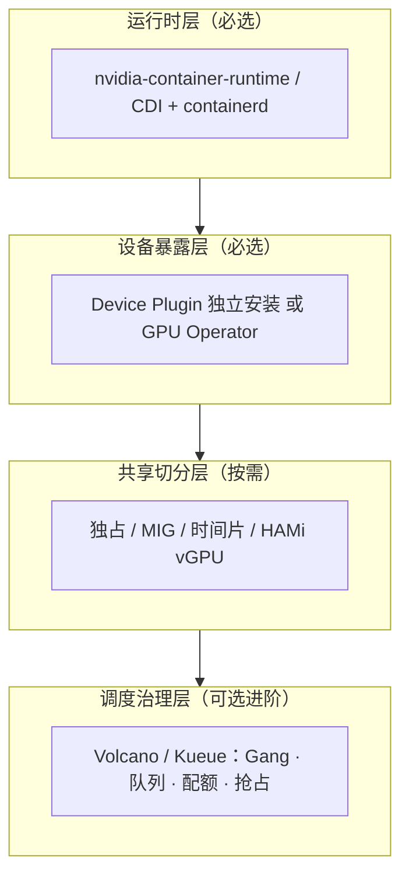
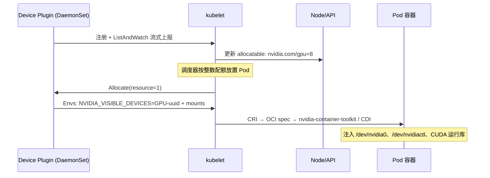
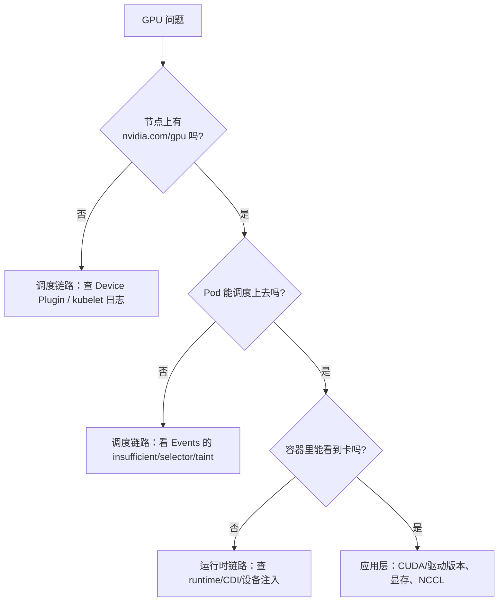

本文章来源于：<https://github.com/Zeb-D/my-review> ，请star 强力支持，你的支持，就是我的动力。



[TOC]

------

## 前言：这篇文章要聊什么

> 本文是两篇公众号文章的拓展与延伸：
>
> 1. 《K8s 里 GPU 是怎么被调度的：Device Plugin + Extended Resource》
> 2. 《AI 时代的 GPU 资源调度：有没有类似 Kubernetes 的标准答案？》
>
> 前一篇讲透了"一张 GPU 是怎么变成 Pod 里可用设备的"底层机制，后一篇讲透了 GPU 调度治理的全景。本文在这两篇的基础上，聚焦一个更工程化的问题：
>
> **如何把 GPU 真正集成进 Kubernetes——从方案选型，到动手操作，到背后的原理，再到最常见的坑。**
>
> 换句话说：**K8s 自己不认识 NVIDIA，也不认识昇腾。那一张 GPU 是怎么变成 Pod 里能用的设备的？集成的时候最容易踩哪些坑？**

很多人以为"K8s 集成 GPU"就是"装个插件、Pod 里写 `nvidia.com/gpu: 1`"这么简单。但生产环境里最常见的三类事故，都源于对集成机制的误读：

1. **容器起来了，但看不到卡**——`runtimeClassName` 没配、运行时没接 NVIDIA 容器运行时；
2. **驱动与 CUDA 版本对不上**——`Failed to initialize NVML: Driver/library version mismatch`；
3. **资源永远 Pending**——Device Plugin 没跑起来、节点没打上异构标签、污点没容忍。

这篇文章的阅读地图：

**选项（第一章）→ 原理（第二章）→ 操作（第三章）→ 排障（第四章）→ 治理（第五章）**。

读者预设：你有 Kubernetes 使用经验，理解 Pod、Deployment、DaemonSet、亲和性、污点容忍这些概念；本文只讲"GPU 这条特殊集成链路"该知道的东西，不再科普基础名词。

------

## 一、选项：Kubernetes 集成 GPU 的方案全景

### 1.1 集成到底涉及哪些层

先建立坐标系。K8s 集成 GPU 不是"装一个插件"那么单一，它横跨四层，每层都有可选项：



- **运行时层**：让容器运行时（containerd）能把宿主机的 GPU 设备、驱动库注入容器。这是"容器里能不能看到卡"的物理基础。
- **设备暴露层**：把 GPU 变成节点上的可调度资源（`nvidia.com/gpu`），由 Device Plugin 完成。**这一层是本文的核心。**
- **共享切分层**：在整卡之上做切分/共享，提高利用率。按隔离性取舍。
- **调度治理层**：Gang 调度、队列配额、抢占——属于"集成之后的治理"，在第五章展开（详见参考文章 2）。

### 1.2 设备暴露层：GPU Operator 还是独立 Device Plugin

这是第一个选择题，也是最常被问的"我应该装哪个"。

| 维度 | 独立 Device Plugin | NVIDIA GPU Operator |
| --- | --- | --- |
| 管理内容 | 只管设备上报与分配 | 驱动 + 运行时 Toolkit + Device Plugin + DCGM + MIG Manager + 验证器，一整套 |
| 驱动安装 | 需自己装（或节点预装） | Operator 自动下发/安装驱动 |
| 异构感知 | 仅暴露 `nvidia.com/gpu` | 额外通过 GFD（GPU Feature Discovery）打产品/显存标签，支持 MIG 资源 |
| 运维成本 | 低（一个 DaemonSet） | 高一些，但换来整栈自动化 |
| 适用 | 已有驱动管理手段的团队 | 生产环境主流选择（省心、整栈一致） |

> 一句话选型：**能接受让 Operator 管驱动，就上 GPU Operator；节点驱动已经有成熟渠道（如自研装机系统、裸金属交付），只想轻量接入，就装独立 Device Plugin。** 两者核心的 Device Plugin 机制完全一致。

### 1.3 运行时层：runtime 还是 CDI

注入设备的实现方式在演进，新装环境建议直接走 **CDI（Container Device Interface）**：

| 方式 | 说明 |
| --- | --- |
| 传统 runtime（`nvidia` runtimeClass） | 通过 prestart OCI hook 在容器启动前注入设备与库 |
| CDI（Container Device Interface） | 设备以"设备描述文件"形式声明，containerd 原生支持，不依赖特殊 runtimeClass |

GPU Operator 新版本默认会配置 CDI（生成 `/etc/cdi/nvidia.yaml`），Pod 里写 `runtimeClassName: nvidia` 依然可用（向后兼容），也可以不指定 runtime、由 CDI 按需注入。理解这个差异，对排障很有帮助——下面 2.4 会展开原理。

### 1.4 共享切分层：独占 / MIG / 时间片 / HAMi

| 方案 | 隔离性 | 粒度 | 适用 | 代价 |
| --- | --- | --- | --- | --- |
| 独占整卡 | 最好 | 整卡 | 大模型训练、高负载推理 | 小任务浪费显存 |
| MIG（硬件切分） | 硬件级隔离 | 固定规格（1g.5gb 等） | 多租户推理 | 规格固定，动态调整需重配；需 Ampere+ |
| 时间片共享 | 无显存隔离 | 整卡分时 | 轻量任务提利用率 | 一个任务 OOM 可能影响邻居 |
| HAMi vGPU（软件切分） | 细粒度显存+算力 | 可定制 | 开发测试、中小模型推理 | 需评估稳定性与故障边界 |

### 1.5 选型决策矩阵（先看这张表，再决定往下读哪章）

| 你的情况 | 建议路线 |
| --- | --- |
| 全新集群，想要整栈自动化 | GPU Operator（含 CDI + DCGM）→ 读第三章 3.3 |
| 已有成熟驱动管理，只想轻量接入 | 独立 Device Plugin → 读第三章 3.2 |
| 一张卡想跑多个小任务 | MIG 或 HAMi → 读第三章 3.7 |
| 想彻底搞懂"为什么" | 第二章（原理）必须读 |
| 已经在跑但问题不断 | 直接跳到第四章（排障） |

------

## 二、原理：GPU 是怎么变成 Pod 里可用设备的

> 这一章是整篇文章的"地基"，也是参考文章 1 的深化展开。K8s 的设备模型可以概括成三句话：
>
> 1. **扩展资源（Extended Resource）**：把 GPU/NPU 注册成节点上可调度的「数量资源」，比如 `nvidia.com/gpu`；
> 2. **Device Plugin**：厂商进程发现本机设备，向 kubelet 汇报容量，并在 Pod 分配时告诉 runtime 怎么把设备挂进容器；
> 3. **调度器只认资源名和个数**：不关心卡型号细节，异构靠不同资源名分成不同池子。
>
> 说白了：**K8s 提供插座标准，厂商插件负责把自家硬件插进去。**

### 2.1 为什么需要这套东西

早期在裸机上跑训练/推理，大家习惯 `nvidia-smi` + Docker `--gpus`。上了 K8s 之后问题就来了：

- 调度器默认只懂 `cpu` / `memory`；
- 不清楚哪台机器还有几张空闲 GPU；
- 就算 Pod 落到了 GPU 节点，容器里也不一定能看见设备。

如果让 kubelet 写死 NVIDIA 逻辑，后面 AMD、昇腾、寒武纪全得改核心代码，这显然不现实。所以社区定了 **Device Plugin 接口**：硬件差异留在插件里，控制面只认「扩展资源」。

### 2.2 扩展资源（Extended Resource）：先变成"可计数的资源"

节点装好 Device Plugin 之后，你会在 Node 状态里看到类似：

```bash
kubectl describe node gpu-node-1 | grep -A5 Allocatable
# Allocatable:
#   cpu:                64
#   memory:             256Gi
#   nvidia.com/gpu:     8
```

这里的 `nvidia.com/gpu` 就是 **Extended Resource**。需要理解的机制要点：

- **它是"数量资源"，只支持整数**。不能写 `0.5` 个 GPU（显存切分/共享是后加的增强模型，靠别的资源名表达，见 3.7）。
- **只能在 `limits` 中声明**，kubelet 会自动把 `requests` 补成与 `limits` 一致。
- **调度器做的是朴素过滤**：找「剩余 `nvidia.com/gpu` >= 1」的节点，扣减像整数配额——节点报 8，你要 1，就剩 7。**不关心卡型号、显存、拓扑。**
- **资源名是字符串约定，不是 K8s 内置枚举**：NVIDIA 常用 `nvidia.com/gpu`，昇腾常见 `huawei.com/Ascend310` / `huawei.com/Ascend910`，AMD 是 `amd.com/gpu`。不同资源名互不混用——`nvidia.com/gpu: 1` 不会落到只有昇腾资源的节点上。
- **异构在 K8s 里的基本含义**：不是一个叫 GPU 的大池子自动挑卡，而是**多个设备池并列存在**。想要"按卡型挑"，得靠节点标签 + `nodeSelector`（见 3.6）。

### 2.3 Device Plugin：设备真正进容器的那一层

扩展资源解决「调度能不能找到节点」；**Device Plugin 解决「找到之后，具体哪张卡、怎么挂进容器」**。

厂商插件一般以 **DaemonSet** 跑在每个 GPU 节点上，通过 gRPC 对接 kubelet。核心接口：

| 接口 | 作用 |
| --- | --- |
| `GetDevicePluginOptions` | 查询插件能力（是否支持拓扑、是否返回 Annotation） |
| `ListAndWatch` | 流式上报本机设备列表与健康状态（`Healthy` / `Unhealthy`） |
| `Allocate` | Pod 需要设备时，返回 `device path / env / mounts`（以及可选 annotation） |
| `GetPreferredAllocation`（可选） | 给出更优的设备组合偏好（如拓扑感知） |

协议细节：

- **注册**：kubelet 在 `/var/lib/kubelet/device-plugins/kubelet.sock` 提供注册端口；插件把自己的 socket（如 `nvidia.sock`）和资源名、最大分配数上报，kubelet 据此更新节点 `capacity` / `allocatable`。
- **健康语义**：插件把某张卡标为 `Unhealthy`，kubelet 会把它从可分配集合里摘掉；**如果插件进程本身挂了，节点上的 GPU 资源会从 Allocatable 里消失**——这是"昨天还能调度、今天全部 Pending"的常见根因。
- **Allocate 的返回值**最终交给 CRI（容器运行时接口），应用在容器里依然走 CUDA/驱动；**K8s 负责的是"分到哪、挂进去"，不是替代驱动栈**。

### 2.4 从 Allocate 到容器内的设备：一次完整的时序

把整条链路串起来看（这是理解一切排障的"地图"）：



关键一环在最后：`Allocate` 返回的环境变量 `NVIDIA_VISIBLE_DEVICES` 指向具体的 GPU UUID，**NVIDIA Container Toolkit** 会在容器创建时做两件事：

1. 把对应的 `/dev/nvidia0`、`/dev/nvidiactl`、`/dev/nvidia-uvm` 等设备节点放进容器；
2. 把宿主机的驱动运行库（`libcuda`、`libnvidia-ml` 等）注入容器，并设置 `LD_LIBRARY_PATH`。

这也是为什么**驱动不用打进镜像**：容器里跑的 CUDA 是"runtime + 用户库"，真正的驱动库由 Toolkit 从宿主机注入。镜像里是 CUDA runtime，节点上是驱动，只要"驱动版本 >= CUDA runtime 所需最低驱动版本"即可。

> **传统 runtime 方式**：Toolkit 以 prestart OCI hook 形式工作，Pod 需要声明 `runtimeClassName: nvidia`。
> **CDI 方式**（新趋势）：设备描述写在 `/etc/cdi/*.yaml`，containerd 原生识别，不再强依赖 runtimeClass。

### 2.5 GPU 与 CGroup：哪些 cgroup 管得着，哪些管不着

理解 GPU 集成，绕不开一个常被误解的问题：**GPU 和 cgroup 到底是什么关系？** 答案很反直觉：**cgroup 几乎管不到 GPU**，而这份"管不着"恰恰解释了排障里大量诡异现象的根源。

#### 2.5.1 cgroup 到底管什么

容器对资源的隔离，最终落在 Linux 的 cgroup 上。以 cgroup v2 为例，控制器包括：

| cgroup 控制器 | 管什么 | 和 GPU 的关系 |
| --- | --- | --- |
| `cpu` | CPU 时间片 | 管不到 GPU 的 SM（流处理器）算力 |
| `memory` | 宿主内存（页缓存/RSS） | **管不到 GPU 显存（VRAM）** |
| `io` | 块设备 IO | 无关 |
| `pids` | 进程数 | 无关 |
| `cpuset` | CPU/NUMA 亲和 | 只能影响"CPU 端"，管不到 GPU 侧的 NVLink/NUMA 拓扑 |
| `devices`（v1）/ eBPF 设备控制器（v2） | 允许/拒绝访问设备节点 | **GPU 设备节点的"访问许可"由它管** |

关键在最后一行：**cgroup 对 GPU 的"管理"，仅限于 device 层——允许或拒绝容器访问 `/dev/nvidia*` 这些设备节点**。算力、显存这两个 GPU 真正的资源维度，cgroup 一概不碰。

#### 2.5.2 设备访问是怎么"放行"的

一个容器能不能打开 `/dev/nvidia0`，取决于两件事：

1. **OCI runtime spec 里 `linux.devices` 声明的设备**——runc/containerd 据此在容器里创建设备节点；
2. **设备 cgroup 规则**——cgroup v1 是 `devices.allow` / `devices.deny` 文件，cgroup v2 则编译成 eBPF 程序挂到设备控制器。

`nvidia-container-toolkit` 的 prestart hook 做的事，就是把这两件事补齐：把 `/dev/nvidia0`、`/dev/nvidiactl`、`/dev/nvidia-uvm` 写进 runtime spec，并向容器所属的设备 cgroup 追加 allow 规则。**"容器里看不到卡"的大部分场景，本质就是这一步没做**（runtime 没配 / CDI 没生效）。

#### 2.5.3 为什么 GPU 显存 OOM 不是"OOMKilled"

这是理解 GPU 集成的第二个关键点。**宿主内存和 GPU 显存，走的是两套完全不同的记账与回收机制**：

| | 宿主内存 | GPU 显存（VRAM） |
| --- | --- | --- |
| 记账方 | 内核（页表 + cgroup memory 控制器） | CUDA 驱动（设备内存分配器） |
| 超限后果 | 内核 OOM killer 杀进程 → 容器 `OOMKilled` | CUDA 返回 `cudaErrorMemoryAllocation` → 应用报 `CUDA error: out of memory` |
| 进程状态 | 被杀 | **通常还活着**，只是 CUDA 调用失败 |
| 是否受 cgroup 限制 | 是（`memory.limit`） | **否** |

排障时必须区分这两者：**`OOMKilled` = 宿主内存问题**（查 `memory.limit` 和 `dmesg` 里的 OOM killer）；**`CUDA error: out of memory` = 显存问题**（查 DCGM 的 `DCGM_FI_DEV_MEMORY_USED` 和卡的显存上限）。**把这两者混为一谈，是 GPU 排障最常见的误区之一。**

#### 2.5.4 那 GPU 的"资源限制"到底靠什么

既然 cgroup 管不到显存和算力，那限制它们靠什么？答案是**分层各管一段**：

| 想限制的维度 | 手段 | 隔离级别 |
| --- | --- | --- |
| GPU 设备访问 | device cgroup / eBPF（运行时放行） | 进程/容器 |
| 显存（硬隔离） | **MIG**（硬件切分） | 硬件实例 |
| 显存（软隔离） | HAMi 等 vGPU（CUDA 层拦截记账） | 进程/容器（无内核级强制） |
| 算力（软限制） | CUDA MPS 的 compute quota、vGPU 算力比例 | 进程/容器（靠用户态调度） |
| CPU / 宿主内存 | cgroup（常规手段） | 进程/容器 |

一句话：**CPU 和宿主内存由内核 cgroup 强制管；GPU 的算力与显存由 CUDA 驱动 + 硬件（MIG）/用户态库（vGPU）管，设备访问许可才归 device cgroup。** 这也是为什么共享 GPU 的"故障边界"（邻居把显存打爆会不会拖垮我）成为选型关键——因为没有任何内核级机制替你兜底，只有 MIG 这种硬件隔离才是"真隔离"。

### 2.6 展望：DRA（动态资源分配）

从 K8s 1.26 引入 alpha 的 **DRA（Dynamic Resource Allocation）**，是设备模型的下一个形态：用 `ResourceClaim` / `ResourceClass` / `ResourceSlice` 描述设备，由**设备驱动控制器**（如 NVIDIA 的 DRA driver）在集群层面做更灵活的分配（支持按显存、按拓扑、甚至分片）。它比"整数配额 + Device Plugin"表达力强得多，但生态还在演进。**当前生产环境的事实标准仍是 Extended Resource + Device Plugin 这套模型**，理解它，是理解 DRA 的地基。

------

## 三、操作：端到端集成实操

### 3.1 前置检查（动手前必看）

```bash
# 节点侧：驱动与内核模块
nvidia-smi                       # 宿主机能看到卡
lspci | grep -i nvidia           # 卡在 PCIe 上可见
cat /proc/driver/nvidia/version  # 驱动版本（Driver Version）

# containerd 侧
ctr version                      # 确认 containerd 存在
nvidia-container-cli info        # Toolkit 是否安装、能否发现设备（装了 toolkit 才有）
```

检查项清单：

- [ ] 宿主机 `nvidia-smi` 正常，驱动版本记录在案；
- [ ] 节点已安装 `nvidia-container-toolkit`（路径 A 必须；GPU Operator 会自动装）；
- [ ] containerd 已注册 `nvidia` runtime（路径 A 必须）；
- [ ] 节点标签/污点规划清楚（GPU 节点通常要 taint，避免 CPU Pod 抢占）。

### 3.2 路径 A：独立 Device Plugin（轻量接入）

**前提**：节点驱动 + NVIDIA Container Toolkit 已就绪。

```bash
# 1. 配置 containerd 的 nvidia runtime（Toolkit 提供自动配置）
sudo nvidia-ctk runtime configure --runtime=docker   # Docker 用
# 或 containerd：
sudo nvidia-ctk runtime configure --runtime=containerd
sudo systemctl restart containerd

# 2. 安装 Device Plugin（DaemonSet，每节点一个）
helm repo add nvdp https://nvidia.github.io/k8s-device-plugin
helm repo update
helm upgrade -i nvdp nvdp/nvidia-device-plugin \
  --namespace nvidia-device-plugin --create-namespace
```

**关键坑**：只装 Device Plugin 而**不配 runtime**，Pod 会被调度到 GPU 节点，但容器里看不到卡——因为 `nvidia-container-runtime` 没接管注入。`runtimeClassName: nvidia` 或 CDI 二者必配其一。

### 3.3 路径 B：NVIDIA GPU Operator（整栈自动化）

GPU Operator 不是一个单体组件，而是一个用 Operator 模式编排的组件集合：

| 子组件 | 职责 |
| --- | --- |
| Node Feature Discovery | 发现 GPU 节点并打标签 |
| driver | 自动下发并安装 NVIDIA 驱动（kmod 方式） |
| toolkit | 安装 nvidia-container-toolkit，配置 CDI / runtime |
| Device Plugin | 暴露 `nvidia.com/gpu` 资源 |
| GFD（GPU Feature Discovery） | 打产品/显存标签，暴露 MIG 扩展资源 |
| DCGM Exporter | 暴露 GPU 观测指标 |
| mig-manager | 管理 MIG 实例 |
| validator | 安装后自检（验证器 Pod 跑 `nvidia-smi`） |

```bash
helm repo add nvidia https://helm.ngc.nvidia.com/nvidia
helm repo update
helm install gpu-operator nvidia/gpu-operator \
  -n gpu-operator --create-namespace \
  --set driver.enabled=true \
  --set toolkit.enabled=true
```

安装后可以等 validator 跑完，或手动验证（见 3.4）。生产建议把 `driver.version` 显式锁到已验证的驱动版本，避免 Operator 升级时驱动跟着漂移。

### 3.4 验证：怎么确认"真的集成好了"

```bash
# 1. 节点层：扩展资源是否注册进调度视图
kubectl get nodes -o custom-columns=\
NAME:.metadata.name,GPU:.status.allocatable.nvidia\.com/gpu

# 2. 组件层：插件是否健康
kubectl get pods -A | grep -i nvidia

# 3. 跑一个真正的 GPU Pod 验真
kubectl apply -f - <<'EOF'
apiVersion: v1
kind: Pod
metadata:
  name: gpu-test
spec:
  restartPolicy: OnFailure
  runtimeClassName: nvidia            # 运行时注入
  containers:
    - name: cuda
      image: nvcr.io/nvidia/cuda:12.4.1-base-ubuntu22.04
      command: ["nvidia-smi"]          # 容器内直接看卡
      resources:
        limits:
          nvidia.com/gpu: "1"          # 只写在 limits
EOF
kubectl logs gpu-test
```

看到 `nvidia-smi` 输出且显示 `NVIDIA_VISIBLE_DEVICES` 对应的卡，说明**运行时注入**通了；`allocatable` 里有 `nvidia.com/gpu`，说明**资源上报**通了。两者都通，集成才算闭环。

### 3.5 异构多厂商：不只 NVIDIA

同一套机制，换厂商就是换"插件 + 资源名 + 驱动栈"：

| 厂商 | 资源名示例 | 集成方式 |
| --- | --- | --- |
| NVIDIA | `nvidia.com/gpu` | k8s-device-plugin / GPU Operator |
| 昇腾（华为） | `huawei.com/Ascend310`、`huawei.com/Ascend910` | Ascend Device Plugin + Ascend Docker Runtime / Operator |
| AMD | `amd.com/gpu` | AMD 官方 K8s Device Plugin（基于 KFD） |
| 寒武纪等 | 各自约定 | 各自插件 |

上层工作负载（Deployment / Job / 各类 CRD）通常只是把对应的 `resources.limits` 写进去。**异构能力取决于集群是否装齐各厂商插件和驱动**，多个资源池并列存在、互不混用。

### 3.6 资源声明与调度约束

```yaml
apiVersion: apps/v1
kind: Deployment
metadata:
  name: llm-inference
  namespace: ai-prod
spec:
  replicas: 2
  selector:
    matchLabels:
      app: llm-inference
  template:
    metadata:
      labels:
        app: llm-inference
    spec:
      runtimeClassName: nvidia          # 传统 runtime 方式（CDI 可省）
      nodeSelector:
        nvidia.com/gpu.product: NVIDIA-A100-SXM4-40GB   # 异构：限定卡型
      tolerations:                       # 容忍 GPU 节点污点
        - key: nvidia.com/gpu
          operator: Exists
          effect: NoSchedule
      containers:
        - name: vllm
          image: registry.example.com/ai/llm-inference:24.08.1
          resources:
            limits:
              nvidia.com/gpu: "1"        # 只能写在 limits
              memory: 32Gi
              cpu: "16"
          volumeMounts:
            - name: dshm
              mountPath: /dev/shm        # DataLoader/vLLM 需要大 /dev/shm
      volumes:
        - name: dshm
          emptyDir:
            medium: Memory
```

要点：

- **GPU 只能在 `limits` 中声明**；
- 异构卡型用 `nodeSelector` + GFD 打的标签（`nvidia.com/gpu.product`）约束；
- GPU 节点一般要 **taint**，Pod 必须 **tolerations** 才能调度上去，防止 CPU Pod 挤占 GPU 节点；
- `/dev/shm` 默认 64MB 往往不够（PyTorch DataLoader / vLLM 都会用到），用 `emptyDir medium: Memory` 放大。

### 3.7 共享与切分实操

**MIG（硬件切分，Ampere+）**：

```bash
# GPU Operator 启用 MIG
helm upgrade -i gpu-operator nvidia/gpu-operator \
  -n gpu-operator \
  --set migManager.enabled=true \
  --set mig.strategy=mixed

# 之后节点上会出现切分后的资源名（由 GFD 暴露）
# nvidia.com/mig-1g.5gb, nvidia.com/mig-2g.10gb ...
```

```yaml
resources:
  limits:
    nvidia.com/mig-1g.5gb: "1"    # 申请一个 1g.5gb 的 MIG 实例
```

**时间片共享**（无显存隔离，轻量任务提利用率）：GPU Operator 通过 Device Plugin 配置实现时间片，多个 Pod 共享一张整卡，`NVIDIA_VISIBLE_DEVICES` 指向同一张卡。

**HAMi vGPU（软件级显存+算力切分）**：以 DaemonSet + MutatingWebhook 方式注入 CUDA 层的切分库，可声明显存大小与算力比例。适合开发测试、中小模型推理。选型时务必把"隔离性/故障边界"写进验收标准——**共享 GPU 上，一个任务把显存打爆，会不会拖垮邻居，往往直接决定方案成不成立**。

------

## 四、排障：常见集成问题与排查手册

> 排障的底层逻辑，是前面原理章的两条主线：**一条是"调度链路"**（扩展资源有没有上报、Pod 有没有被放行），**一条是"运行时链路"**（设备有没有注入、驱动库有没有挂上）。90% 的问题都能归到这两条链路之一。



### 4.1 定位问题的"工具箱"

拿到任何 GPU 集成问题，先按"调度 → 节点 → 插件 → 运行时 → 内核"五层取证，把证据收齐再动手改配置：

```bash
# 1. 调度视角：Pending 的 Pod 卡在哪
kubectl describe pod <pod>            # Events 里的 Insufficient / node selector / taint 是最快线索
kubectl get events --sort-by=.lastTimestamp | tail -20

# 2. 节点视角：GPU 资源在不在
kubectl describe node <node> | grep -A6 Allocatable

# 3. 插件视角：Device Plugin 健康吗
kubectl get pods -n nvidia-device-plugin -o wide
kubectl logs -n nvidia-device-plugin <plugin-pod>

# 4. 运行时视角：容器里到底有没有设备
kubectl exec -it <pod> -- nvidia-smi
kubectl exec -it <pod> -- nvidia-container-cli info   # toolkit 自检：能看到几块卡、什么型号

# 5. 节点内核视角：驱动/设备层有没有报错
dmesg | grep -i -E "nvidia|xid|nvrm"
journalctl -u kubelet -n 100 --no-pager | grep -i -E "device-plugin|nvidia"
```

下面用五个最典型、最容易复现的场景，把"怎么定位、怎么解"讲透。

### 4.2 案例一：容器起来了，但里面看不到 GPU

**症状**：Pod Running，但 `torch.cuda.is_available()` 返回 `False`；容器内 `nvidia-smi` 报 `command not found`，或报 `Failed to initialize NVML: Driver/library version mismatch`。

**定位步骤**：

```bash
# ① 先分清是"工具不在"还是"驱动不在"
kubectl exec -it <pod> -- nvidia-container-cli info
#   输出 NVRM version 等 → toolkit 正常；报 "cannot find libnvidia-ml" → 驱动库没注入
kubectl exec -it <pod> -- ls -l /dev/nvidia*   # 设备节点在不在

# ② 看 runtime 配没配
kubectl get pod <pod> -o jsonpath='{.spec.runtimeClassName}'; echo
#   为空 → 没走 nvidia runtime / CDI
cat /etc/containerd/config.toml | grep -A3 nvidia    # 节点侧看 runtime 注册
```

**根因**：运行时注入没生效——`runtimeClassName: nvidia` 没写、containerd 没注册 nvidia runtime、或走 CDI 但 CDI 文件缺失。此时 Pod 虽然被调度到 GPU 节点、资源也占用了，但**"设备进容器"这一环断了**（对应原理章 2.5.2 的 device cgroup 放行没发生）。

**解法**：

```bash
sudo nvidia-ctk runtime configure --runtime=containerd   # 注册 runtime / 生成 CDI
sudo systemctl restart containerd
# Pod spec 加 runtimeClassName: nvidia；CDI 模式下确认 /etc/cdi/nvidia.yaml 存在
```

> 这个案例的价值：**"调度成功"和"容器可见"是两条独立的链路**。`nvidia.com/gpu` 被分配 ≠ 容器里能访问卡。排障时先分清断在哪条链路上。

### 4.3 案例二：Driver/library version mismatch

**症状**：`nvidia-smi` 报 `Failed to initialize NVML: Driver/library version mismatch`，宿主机和容器里都报；`nvidia-smi` 在 host 上也可能闪退。

**定位步骤**：

```bash
nvidia-smi                              # 大概率同样报错
cat /proc/driver/nvidia/version         # 看驱动版本（NVRM version）
lsmod | grep nvidia                     # 内核模块是否加载
dmesg | grep -i -E "nvidia|NVRM"        # 驱动加载失败的具体原因
```

**根因**：用户态驱动库（`libnvidia-*`）和内核模块（`nvidia.ko`）版本不一致。最常见于**在运行中的节点上升级驱动**：包管理器换了用户态库，但内核模块要重启才生效，期间两者不匹配；另一个常见场景是宿主机驱动版本低于镜像里 CUDA runtime 所需的最低驱动。

**解法**：

```bash
# 临时恢复（一致性校验通过后立即生效）
sudo rmmod nvidia_uvm nvidia_drm nvidia_modeset nvidia 2>/dev/null
sudo modprobe nvidia
nvidia-smi

# 根治
# - 驱动升级后安排节点重启（GPU Operator 管驱动时，锁 driver.version 并走节点滚动）
# - 校验"驱动 >= CUDA runtime 最低要求"：对比 nvidia-smi 的 Driver Version 与镜像 CUDA 版本
```

### 4.4 案例三：Pod 永远 Pending

**症状**：Pod 卡在 `Pending`。这是**最值得学会的一件事：读 `kubectl describe pod` 的 Events**——Events 里的关键词直接决定答案：

| Events 里的典型报错 | 含义 | 解法 |
| --- | --- | --- |
| `0/N nodes are available: N node(s) had insufficient nvidia.com/gpu` | 没有可分配的空闲 GPU | 等队列/释放任务/加节点；检查调度层配额 |
| `N node(s) didn't match Pod's node affinity/selector` | nodeSelector 没匹配上 | 看节点标签：`kubectl get nodes --show-labels \| grep nvidia` |
| `N node(s) had untolerated taint` | 节点有污点、Pod 没容忍 | Pod 加 `tolerations`，或节点去掉污点 |
| 提交时直接被 API 拒绝：`requests must not be specified for extended resources` 之类 | 扩展资源写在了 `requests` | 移到 `limits`（不是调度问题，是准入问题） |
| 资源名拼写错误（提交时报 no such resource / 一直 Pending 且无 GPU 相关 Event） | `nvidia.com/gpu` 拼错、或节点根本没有这个资源 | 核对拼写；确认节点 `allocatable` 里有该资源 |

**关键判断**：Event 里如果**没有** "insufficient GPU" 提示，而是 "didn't match selector" 或 "untolerated taint"，说明是**标签/污点问题，而不是没卡**——两种情况的解法完全不同，别在加卡上浪费时间。

### 4.5 案例四：GPU 资源从节点上"消失"了

**症状**：昨天还能调度，今天 `kubectl get nodes -o custom-columns=NAME:.metadata.name,GPU:.status.allocatable.nvidia\.com/gpu` 显示为空或数量变少；GPU Pod 全部 Pending。

**定位步骤**：

```bash
kubectl get pods -n nvidia-device-plugin -o wide   # 插件 Pod 是否 CrashLoopBackOff
kubectl logs -n nvidia-device-plugin <plugin-pod> --tail=50
journalctl -u kubelet -n 200 --no-pager | grep -i -E "device-plugin|registration"
# kubelet 日志常见："device-plugin: could not connect to device plugin socket" 或注册失败
```

**根因**：**Device Plugin 进程挂掉 = 该节点的 GPU 资源从 Allocatable 里被移除**（这是 kubelet 的设计语义，不是 bug）。常见诱因：插件镜像更新失败、节点内存不足、kubelet 重启后插件未重新注册、插件与 kubelet 版本不兼容。

**解法**：

```bash
kubectl rollout restart -n nvidia-device-plugin ds/nvidia-device-plugin
kubectl wait --for=condition=ready pod -n nvidia-device-plugin -l app.kubernetes.io/name=nvidia-device-plugin --timeout=60s
# 资源恢复后，allocatable 会重新出现 nvidia.com/gpu
```

> 这个案例的启示：**GPU 资源的可用性 = 插件进程的存活**。任何涉及"GPU 突然不能调度"的问题，先看插件和 kubelet 日志，而不是去怀疑卡坏了。

### 4.6 案例五：多机训练 NCCL 通信失败 / 极慢

**症状**：`torchrun --nproc-per-node=8 --nnodes=2` 起不来，日志里 `NCCL connect to 10.x.x.x failed`；或能起来但吞吐只有单机的几分之一。

**定位步骤**：

```bash
# ① 用 NCCL 自己的日志定位，这是最快路径
NCCL_DEBUG=INFO torchrun ... 2>&1 | grep -i -E "connect|ib|socket|ring"
#   "NCCL INFO Using network: IB" → 走 InfiniBand；"Using network: Socket" → 走 TCP

# ② 检查宿主机/容器网络能力
ibstat 2>/dev/null || echo "no IB"                   # InfiniBand 是否存在
kubectl exec -it <pod> -- ip a | grep -E "eth|ib"    # 容器网络接口

# ③ 核对拓扑：Worker 是不是被散到跨交换机的节点
kubectl get nodes --show-labels | grep nvidia
```

**根因**：多机通信链路问题——没有 InfiniBand 却要求走 IB、`NCCL_SOCKET_IFNAME` 指向了错误的网卡、跨交换机拓扑导致通信绕路、防火墙挡了端口。**调度器把 Worker 散落到拓扑很差的节点上（跨交换机）是另一个常见诱因**——这正是"拓扑感知调度"的价值所在。

**解法**：

```bash
# 容器/训练进程里显式指定网络
export NCCL_SOCKET_IFNAME=eth0        # 指对网卡
export NCCL_IB_DISABLE=1              # 没有 IB 时显式关闭，避免误走 IB
# 有 GPU Direct / RDMA 时：NCCL_IB_HCA=mlx5_0:1
# 根治：让调度层做拓扑感知放置（Volcano 的拓扑策略），把多卡任务尽量落在同一 NVSwitch 域
```

### 4.7 快速对照表（补充速查）

| 现象 | 一句根因 | 一句话解法 |
| --- | --- | --- |
| `unknown runtime "nvidia"` | containerd 未注册 nvidia runtime | `nvidia-ctk runtime configure --runtime=containerd` + 重启 |
| `OOMKilled` | **宿主内存**超限（cgroup memory 管得到） | 加大 `memory.limit`；查 `dmesg` OOM killer |
| `CUDA error: out of memory` | **显存**超限（cgroup 管不到） | 查 DCGM 显存指标；换 MIG/降 batch size |
| MIG 资源 `nvidia.com/mig-*` 找不到 | MIG 未启用 / GFD 未跑 / 卡不支持 | 启用 migManager；确认 Ampere+；GFD 暴露 |
| 共享 GPU 下邻居被 OOM 拖垮 | 时间片/HAMi 无严格显存隔离 | 换 MIG 硬件隔离或收窄共享 |
| `dmesg` 出现 XID 错误 | 驱动/硬件故障 | 查 XID 码对应 NVIDIA 文档；查驱动版本与散热 |
| DataLoader/vLLM 报共享内存错误 | `/dev/shm` 只有 64MB | `emptyDir medium: Memory` 挂 `/dev/shm` |

> **最隐蔽的坑**：很多人"容器里跑通了 `nvidia-smi`"就以为集成完成，但生产事故往往出在**验证用镜像和实际业务镜像不一致**（CUDA runtime 版本不同）。验证一定用"要发布的那张业务镜像 + 真实的模型前向反向"，而不是一张万能测试镜像。

------

## 五、进阶：从"能用"到"治理"

> 设备层解决"能不能用"，调度层解决"用得好不好"。这一章把参考文章 2 的调度治理落细：默认调度器差在哪、Volcano 和 Kueue 各自怎么工作、如何选型、以及用什么指标证明"物尽其用"。

### 5.1 为什么默认调度器不够：三个具体场景

**场景一：Gang Scheduling（全有或全无）**

一个分布式训练任务要 8 个 Worker、每个占 4 张卡，共 32 卡。默认调度器是"一个 Pod 一个 Pod 独立调度"的：

```text
时刻 T1：集群只有 16 张卡空闲 → 默认调度器放行 4 个 Worker（占满 16 卡）
时刻 T2：剩下 4 个 Worker 永远等不到 16 张卡 → 整作业无法开始
结果：16 张卡被 4 个干等的 Worker 白白占住，其它作业也被饿死
```

Gang Scheduling 的要求是"**资源全部满足 → 整个作业一起启动；不能满足 → 整个作业继续等待**"。默认调度器没有"作业"这个抽象，做不到。

**场景二：异构 GPU 不是"个数"能表达的**

同样申请 `nvidia.com/gpu: 8`，落在这几种节点的性能差异可能是数量级：

| 放置位置 | 通信路径 | 对训练的影响 |
| --- | --- | --- |
| 同一台 NVSwitch 8 卡服务器 | 全走 NVLink/NVSwitch，几乎无瓶颈 | 最佳 |
| 跨 2 台 4 卡服务器 | 机内走 NVLink + 机间走网络 | 有明显通信开销 |
| 散落在普通以太网节点 | 全走网络 | 可能成为瓶颈 |

默认调度器只认"剩余数量 >= 8"，**根本不看卡型、NVLink 域、NUMA 亲和、InfiniBand**。异构感知（把不同卡型/拓扑变成调度条件）需要专门的调度策略。

**场景三：利用率与公平性**

GPU 集群往往同时存在两类问题：**有的团队长期占着卡但利用率很低，有的团队永远在排队**。这需要队列、配额、空闲借用、优先级、抢占、Binpack 碎片治理——默认调度器一项都没有。

### 5.2 Volcano：批作业调度器怎么工作

Volcano 不是一个"改进版的默认调度器"，而是一套独立的调度语义。它的核心动作：

**Gang Scheduling 的实现**：`Job` 定义 `minAvailable`（最小成员数），Volcano 只调度"整个 gang 能同时满足"的作业。调度器为 gang 里的 Pod 做**联合预留（乐观占位）**——先假设全部 Pod 都能放，逐个为每个 Pod 找节点；一旦发现某个 Pod 找不到位置，**整个 gang 回滚等待**，已占的位置也释放，不会出现"一半 Worker 占卡、一半 Pending"。

**队列模型**：作业提交到某个 queue（对应部门/项目/租户），队列之间按 `deserved` 权重做公平分配（fair-share），并支持**队列间配额借用**——一个队列空闲时，另一个队列可以借用其配额。

**优先级与抢占**：高优先级作业在策略允许时，可以**驱逐低优先级作业的 Pod** 腾出 GPU（配合 checkpoint 断点续训，被驱逐的成本可控）。

**调度策略**：Binpack（集中放置、减少碎片）/ Spread（分散、降单点风险）/ Fair Share（租户公平）/ 拓扑感知（把多卡作业尽量落到同一 NVSwitch 域）。

```yaml
apiVersion: batch.volcano.sh/v1alpha1
kind: Job
metadata:
  name: bert-pretrain
  namespace: ai-train
spec:
  schedulerName: volcano
  minAvailable: 4                 # Gang：凑齐 4 个 Worker 才启动
  queue: research                 # 归属队列（配额/优先级由此决定）
  policies:
    - event: PodEvicted          # 被抢占/驱逐后自动重建（断点续训的配套）
      action: RestartJob
  tasks:
    - replicas: 4
      name: worker
      template:
        spec:
          runtimeClassName: nvidia
          containers:
            - name: worker
              image: registry.example.com/ai/train:24.08.1
              command: ["python", "-m", "app.train"]
              resources:
                limits:
                  nvidia.com/gpu: "8"
          restartPolicy: OnFailure
```

> 与 Kubeflow Training Operator 的 `PyTorchJob` 配合是常见组合：`PyTorchJob` 负责分布式作业编排（自动生成 master/worker 与环境变量），`schedulerName: volcano` 让底层资源分配走 Volcano。

### 5.3 Kueue：把排队与准入留在原生体系

Kueue 的思路完全不同：它**不替换**默认调度器，而是在**工作负载启动之前**做"排队 + 配额判断 + 准入"。核心抽象：

| 抽象 | 作用 | 类比 |
| --- | --- | --- |
| `LocalQueue` | 命名空间内提交任务的入口 | 项目的"提交窗口" |
| `ClusterQueue` | 集群范围的资源池与配额 | 项目的"配额账本" |
| `ResourceFlavor` | 一种资源类型（卡型/区域/节点池） | "A100 池"、"H100 池" |
| `Cohort` | 一组 ClusterQueue，可按规定共享/借用 | "部门资源池" |

**准入流程**（这是理解 Kueue 的关键）：

```text
用户提交 Job / Deployment
  → 挂到 LocalQueue
  → Kueue 找对应的 ClusterQueue，做配额判断
  → 配额不足：作业在 LocalQueue 里排队（默认调度器根本看不到它）
  → 配额满足：Kueue 给工作负载"准入"（标记）
  → 默认调度器才开始真正放置 Pod（Kueue 不参与放置细节）
```

```yaml
apiVersion: kueue.x-k8s.io/v1beta1
kind: ResourceFlavor
metadata:
  name: a100
spec:
  nodeLabels:
    nvidia.com/gpu.product: NVIDIA-A100-SXM4-40GB
---
apiVersion: kueue.x-k8s.io/v1beta1
kind: ClusterQueue
metadata:
  name: cluster-queue-gpu
spec:
  cohort: main                    # 进入同一 cohort，支持配额借用
  resourceGroups:
    - coveredResources: ["cpu", "memory", "nvidia.com/gpu"]
      flavors:
        - name: a100
          resources:
            - name: "cpu"
              nominalQuota: 256
            - name: "memory"
              nominalQuota: 1Ti
            - name: "nvidia.com/gpu"
              nominalQuota: 32
```

**适用判断**：已用默认调度器、希望**低侵入**地补上多租户配额与排队 → Kueue；需要 Gang/优先级/抢占/拓扑这些**批作业完整调度能力** → Volcano。两者能力有交叉，**避免为了"组件齐全"无必要地叠加复杂度**。

### 5.4 三句话选型（综合参考文章 2）

| 场景 | 推荐组合 | 理由 |
| --- | --- | --- |
| K8s 上的分布式训练 | Volcano + PyTorchJob | Gang/队列/抢占/拓扑都是训练刚需 |
| K8s 原生多租户配额 | Kueue + 默认调度器 | 低侵入补排队与配额 |
| 大型 HPC / 裸机训练 | Slurm + NCCL + InfiniBand | 成熟队列/拓扑/运维，云原生生态弱 |
| 训练与推理并存（规模大） | **隔离资源池**：训练池 Volcano / 推理池 KServe+vLLM | 避免批作业抢占在线推理 |

### 5.5 治理指标：怎么证明"物尽其用"

集成了、调度了，还得能证明价值。GPU Operator 自带 DCGM Exporter，把指标暴露给 Prometheus。核心指标与运营含义：

| 指标 | 含义 | 运营用途 |
| --- | --- | --- |
| `DCGM_FI_DEV_GPU_UTIL` | SM 利用率（算力真的用起来没） | 发现"占了卡但算力空转"的作业 |
| `DCGM_FI_DEV_MEMORY_USED` | 显存使用量 | 显存碎片/超卖识别 |
| `DCGM_FI_DEV_POWER_USAGE` / `TEMP` | 功耗 / 温度 | 散热与降频告警 |
| `DCGM_FI_DEV_XID_ERRORS` | 驱动级错误 | 卡故障/驱动不匹配的第一信号 |
| 按 namespace/owner 聚合的利用率与费用 | 谁用多少、值多少钱 | 配额计量 + 成本分摊 |

**治理运营上重点盯四条"空置/错配"规则**：

1. **空转卡**：SM 利用率 < 5% 且持续 1 小时 → 回收或提醒；
2. **显存碎片**：卡被占但 `MEMORY_USED` 不足 50% → 考虑 MIG/HAMi；
3. **供需错配**：H100 空置、A100 排队 → 检查调度策略/配额是否按卡型分池；
4. **排队异常**：队列长期非空但节点有空卡 → 配额/优先级配置有问题。

------

## 六、总结：集成决策清单

回到开篇的问题："那一张 GPU 是怎么变成 Pod 里能用的设备的？"——答案是一条清晰的分层链路：

**驱动/运行时（宿主机准备）→ Device Plugin 上报扩展资源 → 调度器按整数配额放置 → Allocate 返回设备信息 → 容器运行时注入设备与库 → 应用走 CUDA**。

落地时按这张清单自检：

1. **先分层、再选型**：运行时层（runtime/CDI）、设备暴露层（Device Plugin/GPU Operator）、共享层（MIG/时间片/HAMi）、调度层（Volcano/Kueue）各司其职，不要指望一个组件包打天下；
2. **能上 Operator 就上 Operator**：驱动/toolkit/plugin/DCGM/MIG 整栈一致，驱动版本显式锁定；
3. **记住三句机制铁律**：扩展资源只能写 `limits`；资源名是字符串约定、异构即多池；Device Plugin 挂掉会让 GPU 资源从 Allocatable 消失；
4. **必配 runtime 或 CDI**：否则"调度成功"与"容器可见"是两回事（对应排障案例一）；
5. **记住 cgroup 的边界**：CPU/宿主内存归 cgroup，GPU 显存/算力归 CUDA 驱动/硬件（MIG）/用户态库（vGPU）；所以 `OOMKilled` 和 `CUDA error: out of memory` 是两回事；
6. **验证用真实业务镜像**：`nvidia-smi` 通了 ≠ CUDA 版本匹配；
7. **共享切分把"故障边界"写进验收标准**：隔离性往往直接决定方案成不成立；
8. **GPU 节点打 taint + 容忍**，异构卡型用 GFD 标签 + `nodeSelector` 分池；
9. **排障按案例对表**：`kubectl describe pod` 读 Events → `describe node` 看资源 → 插件日志 → 容器内 `nvidia-smi` → `dmesg`，五步取证走一遍（对应第四章五个案例）。

------

## 参考

- 《K8s 里 GPU 是怎么被调度的：Device Plugin + Extended Resource》
  <https://mp.weixin.qq.com/s/Odx19B7HkxcXEotBv7atfw>
- 《AI 时代的 GPU 资源调度：有没有类似 Kubernetes 的标准答案？》
  <https://mp.weixin.qq.com/s/p506j5lfXnEM7mHgvlKY0g>
- Kubernetes 官方文档 Device Plugins：<https://kubernetes.io/docs/concepts/extend-kubernetes/compute-storage-net/device-plugins/>
- NVIDIA GPU Operator 文档：<https://docs.nvidia.com/datacenter/cloud-native/gpu-operator/>
- NVIDIA k8s-device-plugin：<https://github.com/NVIDIA/k8s-device-plugin>
- Volcano：<https://volcano.sh/>
- Kueue：<https://kueue.sigs.k8s.io/>
