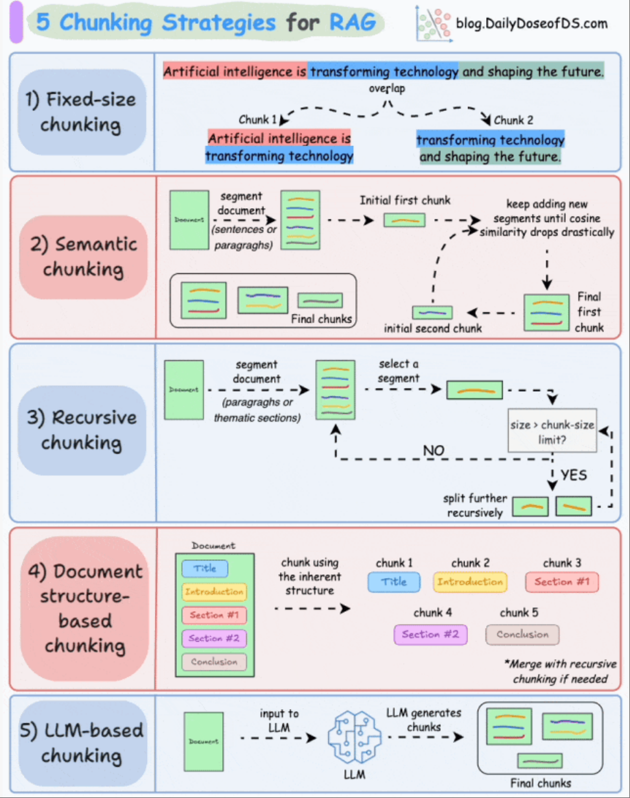
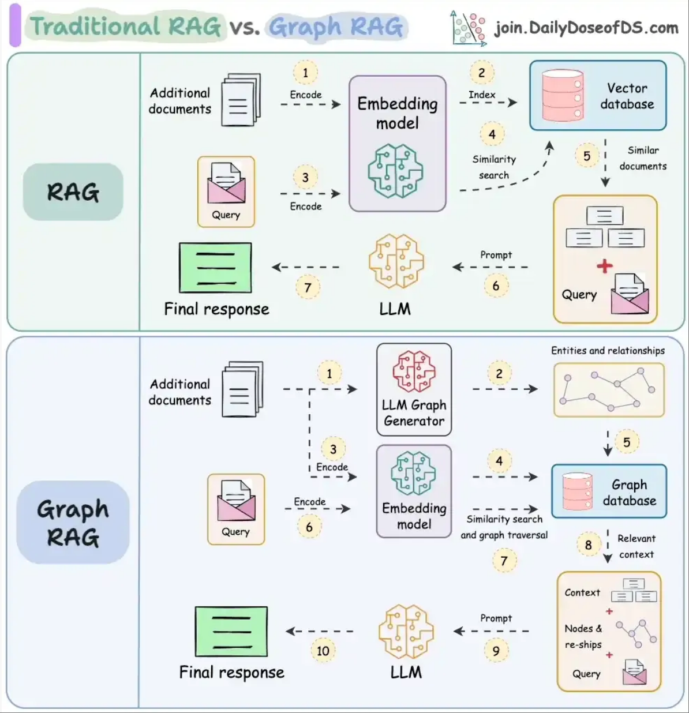
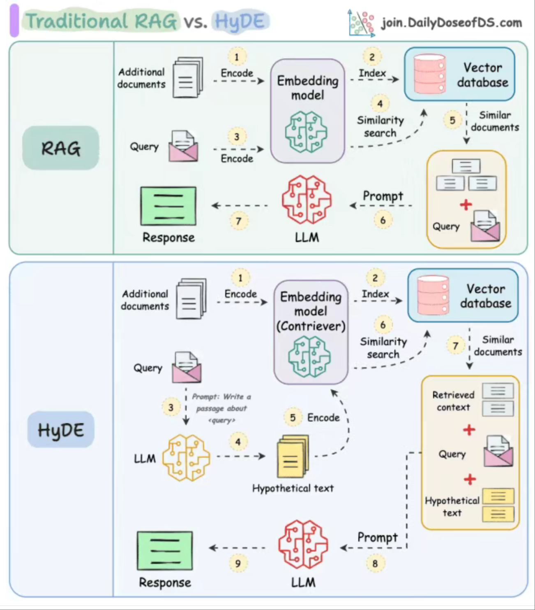
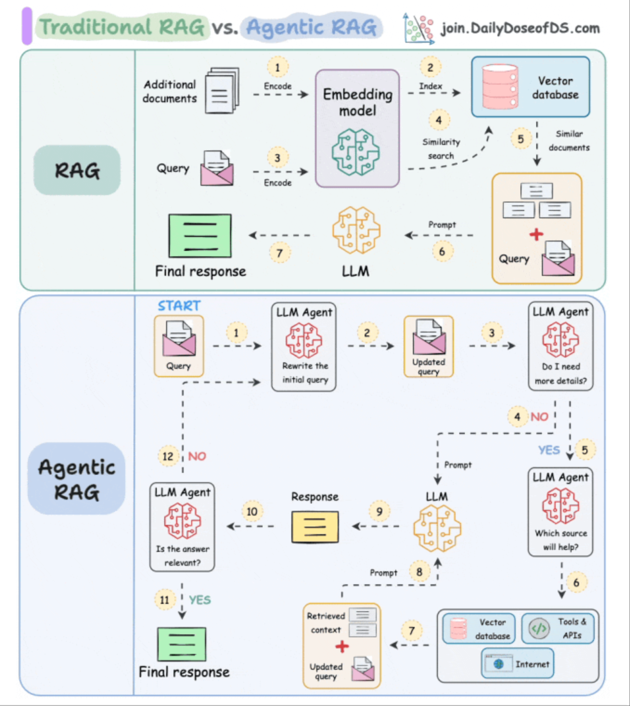

本文章来源于：<https://github.com/Zeb-D/my-review> ，请star 强力支持，你的支持，就是我的动力。

[TOC]

------

作为一个后端架构师，当我辞职闭关入门大模型，在自己会踏入大模型这片深不可测的海域那一刻时，一股莫名的情绪噗哧而来。彼时，我只知道"大模型很火"，却不知这"火"背后是无数矩阵运算与梯度下降的精密舞蹈。

如今回望这段旅程，我明白大模型开发不是一蹴而就的魔法。它需要扎实的工程基础、对原理的深入理解，以及面对无数次失败的耐心。

我们应当不再只关注代码逻辑，更关注数据质量、模型行为和用户体验之间的微妙平衡。

如今，每当我启动训练脚本，看着GPU利用率飙升，损失函数逐渐下降，我仿佛看到无数开发者在代码之海中航行的身影。我们或许渺小，但正是这些微小的努力，正一点点推动着AI技术的边界向前延伸。

### 概念

**检索增强生成（Retrieval-Augmented Generation, RAG）** 是一种结合信息检索与文本生成的先进自然语言处理（NLP）技术，旨在提升大型语言模型（LLM）在生成回答时的准确性、可解释性和时效性。RAG通过从外部知识库中检索相关信息，并将这些信息作为上下文输入给生成模型，从而生成更可靠、更具事实依据的回答。

### RAG 的核心思想

传统语言模型（如GPT系列）依赖于训练时学到的内部知识，存在以下问题：

- 知识固化：无法获取训练数据之后的新信息（如2023年后的事件）。
- 幻觉（Hallucination）：可能生成看似合理但错误的内容。
- 缺乏可解释性：无法追溯答案来源。

**RAG 的解决方案是：**

> 在生成回答前，先从外部知识源中检索与问题相关的文档或段落，再将这些检索到的内容作为上下文输入生成模型，指导其生成答案。

这样，模型既保留了强大的语言生成能力，又具备了动态获取最新、准确信息的能力。

### RAG 的基本架构

RAG 模型通常由两个主要模块组成：

#### 检索器（Retriever）

- 功能：根据用户输入的问题，从大规模文档集合（如维基百科、企业知识库、网页等）中检索出最相关的若干文档或段落。

- 常用技术：

- - DPR（Dense Passage Retriever）：使用双塔结构（question encoder 和 passage encoder）将问题和文档编码为向量，计算相似度。
  - ColBERT、ANCE、Contriever等更先进的稠密检索模型。

- - 稀疏检索：如 BM25（传统信息检索方法）。
  - 稠密检索（Dense Retrieval）：使用向量表示进行语义匹配

#### 生成器（Generator）

- 功能：接收原始问题 + 检索到的文档内容，生成自然语言回答。

- 通常使用预训练的序列到序列（Seq2Seq）模型，如：

- - **BART**
  - **T5**
  - **FLAN-T5**
  - 或基于 LLM 的生成器（如 Llama、ChatGLM 等）

> 生成器的输入 = 用户问题 + 检索到的 top-k 相关段落（拼接或编码后）

#### 5大文本分块策略

Fixed-size Chunking（固定分块）

- **核心思想**：按固定长度（如 256 tokens）分割文本，可重叠（滑动窗口）。
- **优点**：简单高效，适合常规 NLP 任务（如向量检索）。
- **缺点**：可能切断语义连贯性（如句子中途截断）。
- **场景**：BERT 等模型的输入预处理、基础 RAG 系统。

Semantic Chunking（语义分块）

- **核心思想**：基于文本**语义边界**分块（如段落、话题转折点）。

- **实现**：

- - 规则：按标点（句号、段落符）分割；
  - 模型：用嵌入相似度检测语义边界（如 Sentence-BERT）。

- **优点**：保留语义完整性。

- **缺点**：计算成本较高。

- **场景**：精细化问答、摘要生成。

Recursive Chunking（递归分块）

- **核心思想**：分层分割文本（如先按段落→再按句子）。
- **优点**：平衡长度与语义，适配多级处理需求。
- **缺点**：需设计分层规则。
- **场景**：长文档处理（论文、法律文本）。

Document Structure-based Chunking（基于文档结构的分块）

- **核心思想**：利用文档**固有结构**（标题、章节、表格）分块。
- **实现**：解析 Markdown/HTML/PDF 的标签结构。
- **优点**：精准匹配人类阅读逻辑。
- **缺点**：依赖文档格式规范性。
- **场景**：技术手册、结构化报告解析。

LLM-based Chunking（基于大模型的分块）

- **核心思想**：用 LLM（如 GPT-4）动态决定分块策略。

- **方法**：

- - 直接生成分块边界；
  - 指导规则引擎优化（如“将这段话按时间线拆分”）。

- **优点**：灵活适配复杂需求。

- **缺点**：成本高、延迟大。

- **场景**：高价值文本处理（如医疗记录、跨语言内容）。

对比总结

| 策略                | 核心逻辑       | 优势           | 局限性         |
| :------------------ | :------------- | :------------- | :------------- |
| **Fixed-size**      | 固定长度切割   | 高效、通用     | 语义断裂风险   |
| **Semantic**        | 语义边界检测   | 保留上下文     | 计算复杂度高   |
| **Recursive**       | 多级递归分割   | 灵活适配长文本 | 规则设计复杂   |
| **Structure-based** | 文档标签解析   | 精准匹配结构   | 依赖格式标准化 |
| **LLM-based**       | 大模型动态决策 | 智能适应场景   | 成本高、速度慢 |

### RAG 的工作流程

1. 用户提问：例如，“爱因斯坦获得诺贝尔奖是在哪一年？”

2. 检索阶段：

3. - 检索器将问题编码，从知识库中查找相关段落。
   - 返回如：“爱因斯坦因光电效应研究获得1921年诺贝尔物理学奖。”

4. 生成阶段：生成器结合问题和检索到的文本，生成答案：“爱因斯坦于1921年获得诺贝尔奖。”

5. 输出答案，并可附带引用来源（提高可解释性）。

### RAG 的主要优势

| 优势               | 说明                                             |
| ------------------ | ------------------------------------------------ |
| ✅ 减少幻觉         | 回答基于真实文档，降低虚构内容风险               |
| ✅ 支持动态知识更新 | 只需更新知识库，无需重新训练模型                 |
| ✅ 可解释性强       | 可追溯答案来源，便于审计和验证                   |
| ✅ 领域适应性强     | 可用于医疗、法律、金融等专业领域，只需更换知识库 |
| ✅ 成本较低         | 相比训练超大模型，维护知识库更经济               |

### RAG 的应用场景

| 应用场景           | 示例                               |
| ------------------ | ---------------------------------- |
| 智能客服           | 基于产品手册、FAQ 自动生成准确回答 |
| 医疗问答           | 结合医学文献回答患者问题           |
| 法律咨询           | 检索判例、法规生成法律建议         |
| 企业知识库问答     | 查询内部文档、会议纪要等           |
| 教育辅导           | 基于教材内容解答学生问题           |
| 新闻摘要与事实核查 | 检索多源信息生成客观摘要           |

### 典型工具与框架

| 工具                            | 说明                                            |
| ------------------------------- | ----------------------------------------------- |
| **LangChain**                   | 支持 RAG 的主流框架，集成检索、生成、记忆等功能 |
| **LlamaIndex**                  | 专为构建索引和检索优化的框架，适合文档问答      |
| **Haystack（by deepset）**      | 开源 NLP 框架，支持 DPR、FARM 等                |
| **Vespa / Weaviate / Pinecone** | 向量数据库，支持高效相似性搜索                  |
| **Hugging Face Transformers**   | 提供 DPR、BART、T5 等模型实现                   |

### RAG 的挑战与局限

| 挑战               | 说明                                         |
| ------------------ | -------------------------------------------- |
| 检索质量依赖知识库 | 若知识库不完整或过时，效果下降               |
| 检索-生成错位      | 检索到的内容可能不完全匹配问题，导致生成错误 |
| 延迟较高           | 检索 + 生成两阶段增加响应时间                |
| 多跳推理困难       | 复杂问题需多次检索与推理，RAG 原生不支持     |
| 文档噪声           | 检索到的文本可能包含无关或错误信息           |

### RAG 的变体与扩展

RAG-Sequence：对每个检索到的文档分别生成答案，然后选择最优或融合多个答案。

RAG-Token：在生成每个 token 时动态选择最相关的文档，更细粒度控制。

FLARE（Forecasting, Retrieval, and Generation）：预测模型何时可能“不知道”，主动触发检索，提升效率。

Self-RAG / Reflexion-RAG：模型具备“反思”能力，评估生成内容质量，决定是否重新检索。

Hybrid RAG：结合稀疏检索（BM25）与稠密检索（DPR），提升召回率与准确率。

接下来不同的变体进行比对：

#### RAG vs Graph RAG：

| **维度**     | **RAG（检索增强生成）**            | **Graph RAG（图增强检索生成）**    |
| :----------- | :--------------------------------- | :--------------------------------- |
| **知识结构** | 基于**扁平文本**（向量检索）       | 基于**知识图谱**（图结构检索）     |
| **检索方式** | 语义相似度匹配（如BM25/Embedding） | 图遍历（如节点关系推理、路径查询） |
| **优势**     | 简单高效，适合事实型问答           | 擅长**多跳推理**、关系推理         |
| **缺点**     | 难以处理复杂逻辑关系               | 依赖高质量知识图谱，构建成本高     |
| **适用场景** | 问答、文档摘要                     | 复杂推理（如因果分析、事件链推导） |

**核心区别**：

- **RAG** 直接检索文本片段，适合短平快问答；
- **Graph RAG** 利用知识图谱的**结构化关系**，更适合需要逻辑推理的任务（如“某药物的副作用机制是什么？”）。

#### 传统RAG vs HyDE：

传统RAG（Retrieval-Augmented Generation）和HyDE（Hypothetical Document Embeddings）都是检索增强生成（RAG）技术的变体，但它们在检索策略和性能优化上有显著差异。以下是两者的对比：

1. 核心流程对比

| **维度**     | **传统RAG**                         | **HyDE**                                                   |
| :----------- | :---------------------------------- | :--------------------------------------------------------- |
| **检索方式** | 直接对用户查询（Query）进行向量检索 | 先让LLM生成假设答案（Hypothetical Answer），再检索相似文档 |
| **匹配逻辑** | Query-to-Document 相似度匹配        | Answer-to-Document 相似度匹配                              |
| **生成阶段** | 直接使用检索到的文档生成答案        | 结合假设答案+检索文档生成最终答案                          |

**关键区别**：

- 传统RAG依赖查询与文档的语义匹配，但用户问题（如“什么是ML？”）可能与答案（如“机器学习是一种方法”）表述不同，导致检索失败。
- HyDE通过生成假设答案（如“ML是让计算机学习数据的方法”），使嵌入更接近真实答案的语义，从而提高检索精度。

2. 性能对比

| **指标**     | **传统RAG**          | **HyDE**                             |
| :----------- | :------------------- | :----------------------------------- |
| **检索精度** | 较低（依赖查询表述） | 显著提升（如ARAGOG实验显示优于基线） |
| **答案质量** | 可能因检索失败而错误 | 更准确（利用假设答案引导检索）       |
| **计算成本** | 低（仅需一次检索）   | 较高（需LLM生成假设答案）            |

**实验数据**：

- OpenAI测试显示，传统RAG准确率仅45%，HyDE可提升至65%。
- ARAGOG研究表明，HyDE与LLM重排序结合后，检索精度显著优于朴素RAG。

3. 适用场景

| **场景**       | **传统RAG**          | **HyDE**               |
| :------------- | :------------------- | :--------------------- |
| **简单问答**   | 适用（如事实型问题） | 适用，但可能过度复杂   |
| **复杂查询**   | 易失败（表述差异大） | 更优（如多跳推理）     |
| **实时性要求** | 更高效               | 延迟较高（需生成步骤） |

4. 优缺点总结

| **技术**    | **优点**                 | **缺点**                |
| :---------- | :----------------------- | :---------------------- |
| **传统RAG** | 简单、计算成本低         | 检索精度受查询表述限制  |
| **HyDE**    | 检索精度高、适配复杂语义 | 延迟高、依赖LLM生成质量 |

#### 传统RAG vs Agentic RAG：

**传统RAG**

核心流程

- **检索（Retrieval）**：从固定知识库中检索与输入相关的文档片段（如BM25/向量检索）。
- **生成（Generation）**：将检索结果拼接为上下文，输入大模型生成回答。

特点

- **静态处理**：检索与生成分离，无反馈循环。

- **局限性**：

- - 检索结果质量直接限制生成效果；
  - 无法动态优化检索策略；
  - 多跳推理能力弱（需人工设计分步查询）。

**Agentic RAG**

核心思想

将RAG流程赋予**自主决策能力**，通过智能体（Agent）动态管理检索与生成。

关键改进：

- **动态检索**：

- - 基于生成内容的反馈调整检索策略（如改写查询、多轮检索）；
  - 支持复杂查询的**多跳推理**（自动分解子问题并迭代检索）。

- **任务感知**：

- - 根据任务类型（问答、摘要等）选择检索工具或生成策略；
  - 可调用外部API或工具补充知识（如计算、实时数据）。

- **自我验证**：

- - 对生成结果进行事实性检查（如二次检索验证）、逻辑一致性评估。

对比总结

| 维度           | 传统RAG            | Agentic RAG                  |
| :------------- | :----------------- | :--------------------------- |
| **检索方式**   | 单次、静态         | 多轮、动态优化               |
| **推理能力**   | 单跳，依赖人工设计 | 多跳，自主分解任务           |
| **上下文管理** | 固定拼接           | 动态筛选与精炼               |
| **错误处理**   | 无自检机制         | 结果验证与修正               |
| **适用场景**   | 简单问答、文档摘要 | 复杂推理、实时交互、工具调用 |

**演进本质**：Agentic RAG将RAG从“管道流程”升级为“自主决策系统”，更贴近人类问题解决模式。

### 如何构建一个 RAG 系统

步骤概览：

1. **准备知识库**：

2. - 收集文档（PDF、网页、数据库等）
   - 分块（chunking）：将长文档切分为小段（如每段512 token）
   - 向量化：使用嵌入模型（如 BERT、bge、text-embedding-ada-002）生成向量

3. **建立检索系统**：

4. - 使用向量数据库（如 FAISS、Pinecone、Weaviate、Milvus）存储向量
   - 实现检索接口（输入问题 → 返回 top-k 段落）

5. **选择生成模型**：

6. - 可使用开源模型（如 Llama 3、ChatGLM、Qwen）或 API（如 GPT-4）

7. **构建 pipeline**：

8. - 将检索结果与问题拼接，输入生成模型
   - 可加入重排序（rerank）、去重、摘要等后处理

9. **评估与优化**：

10. - 指标：准确率、F1、BLEU、ROUGE、MRR 等
    - 优化：调整 chunk 大小、嵌入模型、检索策略等

