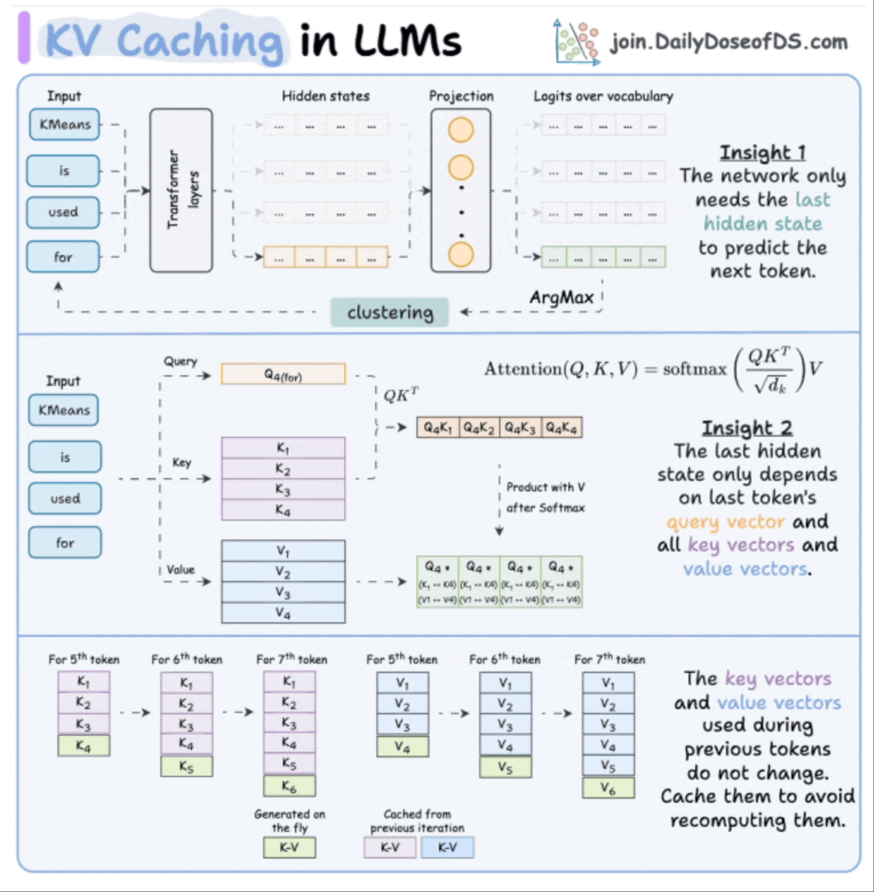

本文章来源于：<https://github.com/Zeb-D/my-review> ，请star 强力支持，你的支持，就是我的动力。

[TOC]

------

**KV Cache**是Transformer推理时的关键优化技术，通过缓存注意力层计算过的键值矩阵（Key-Value），避免对历史token的重复计算，将生成过程的计算复杂度从二次方（O(n²)降至线性（O(n)），显著提升大模型生成速度（3-5倍加速）。它以显存占用为代价（需存储每层的KV矩阵），成为所有主流推理框架（如vLLM、TGI）的核心优化手段，支撑了长文本生成和实时交互的高效实现。
