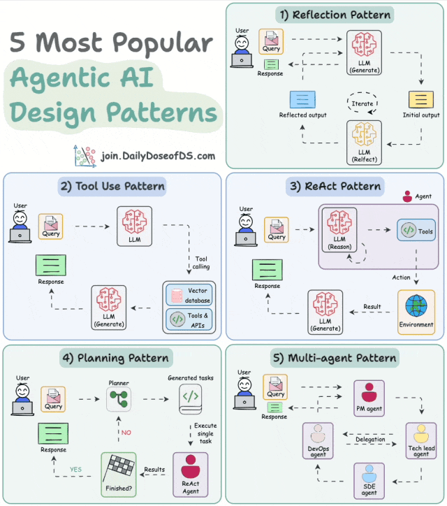
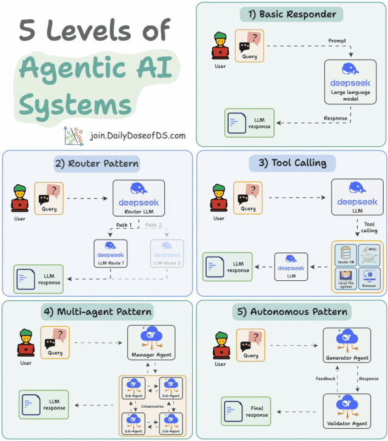

本文章来源于：<https://github.com/Zeb-D/my-review> ，请star 强力支持，你的支持，就是我的动力。

[TOC]

------

### 一、概念

设计模式

Reflection Pattern（反思模式）

**核心思想**：智能体通过**自我评估与迭代修正**优化输出。

**流程**：生成结果 → 分析错误/不足 → 调整策略重新生成。

Tool Use Pattern（工具使用模式）

**核心思想**：智能体调用**外部工具**（如API、计算器、搜索引擎）扩展能力边界。动态选择工具并解析工具返回结果。

ReAct Pattern（推理+行动模式）

核心思想：结合推理（Reasoning）与行动（Action）的交互式决策。

**流程**：

- **Reason**：分析当前状态（如“需要查询天气”）；
- **Act**：执行动作（如调用天气API）；
- 循环直至解决问题。

Planning Pattern（规划模式）

**核心思想**：智能体预先制定**分步计划**再执行，而非即时反应。长期目标分解为子任务，动态调整计划。

Multi-agent Pattern（多智能体模式）

**核心思想**：多个智能体通过**协作/竞争**完成复杂任务。角色分工（如管理者、执行者）、通信机制（如投票、辩论）。

智能体系统的5个等级

| 等级                | 核心能力              | 关键特征             | 典型场景                 |
| :------------------ | :-------------------- | :------------------- | :----------------------- |
| **Basic Responder** | 单轮响应              | 无记忆，固定规则生成 | 简单问答、自动回复       |
| **Router Pattern**  | 任务分类与分发        | 意图识别+预定义路由  | 多技能助手（如小爱同学） |
| **Tool Calling**    | 调用外部工具          | 动态API调用+结果解析 | 实时计算、数据查询       |
| **Multi-agent**     | 多智能体协作/竞争     | 角色分工+通信协议    | 仿真系统、复杂任务分解   |
| **Autonomous**      | 长期目标驱动+自我优化 | 规划+反思+环境适应   | 自动驾驶、AutoGPT        |
