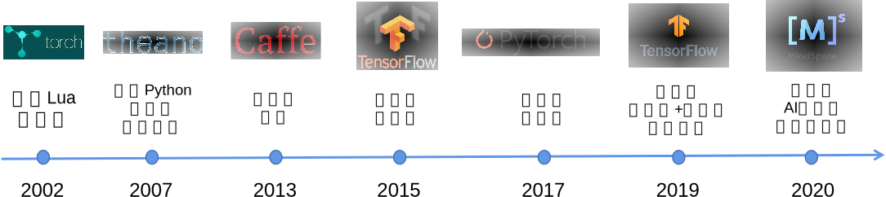

本文章来源于：<https://github.com/Zeb-D/my-review> ，请star 强力支持，你的支持，就是我的动力。

[TOC]

------

### 背景

#### 机器学习系统编程模型的演进



随着机器学习系统的诞生，如何设计易用且高性能的API接口就一直成为了系统设计者首要解决的问题。在早期的机器学习框架中（如图所示），人们选择用Lua（Torch）和Python（Theano）等高层次编程语言来编写机器学习程序。这些早期的机器学习框架提供了机器学习必须的模型定义，自动微分等功能，其适用于编写小型和科研为导向的机器学习应用。

深度神经网络在2011年来快速崛起，很快在各个AI应用领域（计算机视觉、语音识别、自然语言处理等）取得了突破性的成绩。训练深度神经网络需要消耗大量的算力，而以Lua和Python为主导开发的Torch和Theano无法发挥这些算力的最大性能。与此同时，计算加速卡（如英伟达GPU）的通用API接口（例如CUDA C）日趋成熟，且构建于CPU多核技术之上的多线程库（POSIX Threads）也被广大开发者所接受。因此，许多的机器学习用户希望基于C和C++来开发高性能的深度学习应用。这一类需求被Caffe等一系列以C和C++作为核心API的框架所满足。

然而，机器学习模型往往需要针对部署场景、数据类型、识别任务等需求进行深度定制，而这类定制任务需要被广大的AI应用领域开发者所实现。这类开发者的背景多样，往往不能熟练使用C和C++。因此Caffe这一类与C和C++深度绑定的编程框架，成为了制约框架快速推广的巨大瓶颈。

在2015年底，谷歌率先推出了TensorFlow。相比于传统的Torch，TensorFlow提出前后端分离相对独立的设计，利用高层次编程语言Python作为面向用户的主要前端语言，而利用C和C++实现高性能后端。大量基于Python的前端API确保了TensorFlow可以被大量的数据科学家和机器学习科学家接受，同时帮助TensorFlow能够快速融入Python为主导的大数据生态（大量的大数据开发库如Numpy、Pandas、SciPy、Matplotlib和PySpark）。同时，Python具有出色的和C/C++语言的互操作性，这种互操作性已经在多个Python库中得到验证。因此，TensorFlow兼有Python的灵活性和生态，同时也通过C/C++后端得以实现高性能。这种设计在日后崛起的PyTorch、MindSpore和PaddlePaddle等机器学习框架得到传承。

随着各国大型企业开源机器学习框架的出现，为了更高效地开发机器学习应用，基于开源机器学习框架为后端的高层次库Keras和TensorLayerX应运而生，它们提供Python API 可以快速导入已有的模型，这些高层次API进一步屏蔽了机器学习框架的实现细节，因此Keras和TensorLayerX可以运行在不同的机器学习框架之上。

随着深度神经网络的进一步发展，对于机器学习框架编程接口的挑战也日益增长。因此在2020年前后，新型的机器学习框架如MindSpore和JAX进一步出现。其中，MindSpore在继承了TensorFlow、PyTorch的Python和C/C++的混合接口的基础上，进一步拓展了机器学习编程模型从而可以高效支持多种AI后端芯片（如华为Ascend、英伟达GPU和ARM芯片），实现了机器学习应用在海量异构设备上的快速部署。

同时，超大型数据集和超大型深度神经网络崛起让分布式执行成为了机器学习编程框架的核心设计需求。为了实现分布式执行，TensorFlow和PyTorch的使用者需要花费大量代码来将数据集和神经网络分配到分布式节点上，而大量的AI开发人员并不具有分布式编程的能力。因此MindSpore进一步完善了机器学习框架的分布式编程模型的能力，从而让单节点的MindSpore程序可以无缝地运行在海量节点上。

接下来我们来看看MindSpore的工作流模式


### MindSpore入门

#### MindSpore机器学习工作流


机器学习系统编程模型的首要设计目标是：对开发者的整个工作流进行完整的编程支持。一个常见的机器学习任务一般包含如图所示的工作流。这个工作流完成了训练数据集的读取，模型的训练，测试和调试。通过归纳，我们可以将这一工作流中用户所需要自定义的部分通过定义以下API来支持（我们这里假设用户的高层次API以Python函数的形式提供）：

- **数据处理：** 首先，用户需要数据处理API来支持将数据集从磁盘读入。进一步，用户需要对读取的数据进行预处理，从而可以将数据输入后续的机器学习模型中。
- **模型定义：** 完成数据的预处理后，用户需要模型定义API来定义机器学习模型。这些模型带有模型参数，可以对给定的数据进行推理。
- **优化器定义：** 模型的输出需要和用户的标记进行对比，这个对比差异一般通过损失函数（Loss function）来进行评估。因此，优化器定义API允许用户定义自己的损失函数，并且根据损失来引入（Import）和定义各种优化算法（Optimisation algorithms）来计算梯度（Gradient），完成对模型参数的更新。
- **训练：** 给定一个数据集，模型，损失函数和优化器，用户需要训练API来定义一个循环（Loop）从而将数据集中的数据按照小批量（mini-batch）的方式读取出来，反复计算梯度来更新模型。这个反复的过程称为训练。
- **测试和调试：** 训练过程中，用户需要测试API来对当前模型的精度进行评估。当精度达到目标后，训练结束。这一过程中，用户往往需要调试API来完成对模型的性能和正确性进行验证。


#### 环境搭建

https://www.mindspore.cn/install/

由于mindspore有对python版本及平台的要求，所以这里需要安装对应的环境。

本地环境是mac M4、python 3.11。本次环境使用**使用 Pyenv**搭建环境。

确认当前 Python 版本：

```
python3 --version 
```

安装 Python 3.11:

```
brew install python@3.11
brew unlink python@3.12
brew link --force python@3.11
```

安装pyenv

```
# 安装 pyenv（若未安装）
brew install pyenv  # macOS
# 或
curl https://pyenv.run | bash  # Linux

# 安装 Python 3.11
pyenv install 3.11.9

# 全局切换
pyenv global 3.11.9

# 验证
python --version
```

检查版本：

```
pyenv versions
输出示例：
system
* 3.11.9 (set by /Users/lucas/.pyenv/version)

python --version  # 应显示 3.11.x
which python     # 路径应包含 `3.11`
```

确认 Pyenv 安装正确：

```
# 检查 pyenv 是否已初始化
echo $PATH | grep .pyenv/shims

# 如果没有输出，需将以下内容添加到 ~/.zshrc 或 ~/.bashrc
echo 'export PYENV_ROOT="$HOME/.pyenv"' >> ~/.zshrc
echo 'command -v pyenv >/dev/null || export PATH="$PYENV_ROOT/bin:$PATH"' >> ~/.zshrc
echo 'eval "$(pyenv init -)"' >> ~/.zshrc

# 重新加载配置
source ~/.zshrc
```

安装MindSpore：

```
pip install https://ms-release.obs.cn-north-4.myhuaweicloud.com/2.5.0/MindSpore/cpu/aarch64/mindspore-2.5.0-cp311-cp311-macosx_11_0_arm64.whl --trusted-host ms-release.obs.cn-north-4.myhuaweicloud.com -i https://pypi.tuna.tsinghua.edu.cn/simple
```

安装是否成功：

```
python -c "import mindspore;mindspore.set_device(device_target='CPU');mindspore.run_check()"
```

输出：

```
MindSpore version:  2.5.0
The result of multiplication calculation is correct, MindSpore has been installed on platform [CPU] successfully!
```


### 代码示例

#### 模型文件下载

```
# 1. 创建目录（如果不存在）
os.makedirs(DATA_ROOT, exist_ok=True)  # 自动创建所有父目录

# 2. 下载到文件
# 创建目录
os.makedirs(name=DATA_ROOT, exist_ok=True)


# 修正后的下载函数
def download_mnist_file(url, filename):
    gz_path = os.path.join(DATA_ROOT, f"{filename}.gz")
    extracted_path = os.path.join(DATA_ROOT, filename)

    # 下载（使用 request.urlretrieve）
    request.urlretrieve(url, gz_path)

    # 解压
    with gzip.open(gz_path, 'rb') as f_in:
        with open(extracted_path, 'wb') as f_out:
            shutil.copyfileobj(f_in, f_out)
    os.remove(gz_path)  # 删除压缩包


# 文件列表（更新为可靠镜像）
files = {
    "train-images-idx3-ubyte": "https://ossci-datasets.s3.amazonaws.com/mnist/train-images-idx3-ubyte.gz",
    "train-labels-idx1-ubyte": "https://ossci-datasets.s3.amazonaws.com/mnist/train-labels-idx1-ubyte.gz",
    "t10k-images-idx3-ubyte": "https://ossci-datasets.s3.amazonaws.com/mnist/t10k-images-idx3-ubyte.gz",
    "t10k-labels-idx1-ubyte": "https://ossci-datasets.s3.amazonaws.com/mnist/t10k-labels-idx1-ubyte.gz"
}
    for name, url in files.items():
        if not os.path.exists(os.path.join(DATA_ROOT, name)):
            download_mnist_file(url, name)
            print(f"已下载: {name}")
        else:
            print(f"文件已存在: {name}")
```


#### 数据处理

配置好运行信息后，首先讨论数据处理API的设计。这些API提供了大量Python函数支持用户用一行命令即可读入常见的训练数据集（如MNIST，CIFAR，COCO等）。 在加载之前需要将下载的数据集存放在./datasets/MNIST_Data路径中；MindSpore提供了用于数据处理的API模块 mindspore.dataset，用于存储样本和标签。在加载数据集前，通常会对数据集进行一些处理，mindspore.dataset也集成了常见的数据处理方法。 以下代码读取了MNIST的数据是大小为28×28的图片，返回DataSet对象。

```
import mindspore.dataset as ds
DATA_DIR = './datasets/MNIST_Data/train'
mnist_dataset = ds.MnistDataset(DATA_DIR)
```

有了DataSet对象后，通常需要对数据进行增强，常用的数据增强包括翻转、旋转、剪裁、缩放等；在MindSpore中是使用map将数据增强的操作映射到数据集中的，之后进行打乱（Shuffle）和批处理（Batch）。

```

# 1. 数据加载与增强（兼容训练/验证/测试）
def create_mnist_dataset(data_path, batch_size=32, usage="train"):
    """创建MNIST数据集管道

    Args:
        data_path: 数据集根目录（包含MNIST二进制文件）
        batch_size: 批大小
        usage: 数据集类型 ("train"|"test")
    """
    # 检查参数合法性
    if usage not in ["train", "test"]:
        raise ValueError("usage must be 'train' or 'test'")

    # 加载原始数据集
    mnist_ds = ds.MnistDataset(data_path, usage=usage)

    # 定义图像变换
    resize_op = vision.Resize((32, 32), interpolation=vision.Inter.LINEAR)
    rescale_op = vision.Rescale(1.0 / 255.0, 0.0)  # 归一化到[0,1]
    hwc2chw_op = vision.HWC2CHW()  # 转为MindSpore需要的CHW格式

    # 训练集增强（仅对训练数据）
    if usage == "train":
        transform_ops = [
            vision.RandomRotation(degrees=15),
            vision.RandomCrop(28, padding=4),
            resize_op,
            rescale_op,
            hwc2chw_op
        ]
    else:
        transform_ops = [resize_op, rescale_op, hwc2chw_op]

    # 应用变换
    mnist_ds = mnist_ds.map(operations=transform_ops, input_columns="image")
    mnist_ds = mnist_ds.map(operations=transforms.TypeCast(ms.int32), input_columns="label")

    # 批处理与shuffle
    if usage == "train":
        mnist_ds = mnist_ds.shuffle(buffer_size=10000)

    return mnist_ds.batch(batch_size, drop_remainder=True)

```


#### 模型定义

使用MindSpore定义神经网络需要继承mindspore.nn.Cell，神经网络的各层需要预先在__init__方法中定义，然后重载__construct__方法实现神经网络的前向传播过程。 因为输入大小被处理成32×32的图片，所以需要用Flatten将数据压平为一维向量后给全连接层。 全连接层的输入大小为32×32，输出是预测属于0∼9中的哪个数字，因此输出大小为10，下面定义了一个三层的全连接层。

```
mport mindspore.nn as nn


# 2. 定义LeNet-5模型
class LeNet5(nn.Cell):
    def __init__(self):
        super().__init__()
        self.conv1 = nn.Conv2d(1, 6, 5, pad_mode='valid')
        self.conv2 = nn.Conv2d(6, 16, 5, pad_mode='valid')
        self.fc1 = nn.Dense(16 * 5 * 5, 120)
        self.fc2 = nn.Dense(120, 84)
        self.fc3 = nn.Dense(84, 10)
        self.relu = nn.ReLU()
        self.max_pool = nn.MaxPool2d(kernel_size=2, stride=2)
        self.flatten = nn.Flatten()

    def construct(self, x):
        x = self.max_pool(self.relu(self.conv1(x)))
        x = self.max_pool(self.relu(self.conv2(x)))
        x = self.flatten(x)
        x = self.relu(self.fc1(x))
        x = self.relu(self.fc2(x))
        return self.fc3(x)
```


#### 损失函数和优化器

有了神经网络组件构建的模型我们还需要定义**损失函数**来计算训练过程中输出和真实值的误差。**均方误差**(Mean Squared Error，MSE)是线性回归中常用的，是计算估算值与真实值差值的平方和的平均数。 **平均绝对误差**（Mean Absolute Error，MAE）是计算估算值与真实值差值的绝对值求和再求平均。 **交叉熵**（Cross Entropy，CE）是分类问题中常用的，衡量已知数据分布情况下，计算输出分布和已知分布的差值。

有了损失函数，我们就可以通过损失值利用**优化器**对参数进行训练更新。对于优化的目标函数f(x)；先求解其梯度∇f(x)，然后将训练参数W沿着梯度的负方向更新，更新公式为：Wt=Wt−1−α∇(Wt−1)，其中α是学习率，W是训练参数，∇(Wt−1)是方向。 神经网络的优化器种类很多，一类是学习率不受梯度影响的随机梯度下降（Stochastic Gradient Descent）及SGD的一些改进方法，如带有Momentum的SGD；另一类是自适应学习率如AdaGrad、RMSProp、Adam等。

**SGD**的更新是对每个样本进行梯度下降，因此计算速度很快，但是单样本更新频繁，会造成震荡；为了解决震荡问题，提出了带有Momentum的SGD，该方法的参数更新不仅仅由梯度决定，也和累计的梯度下降方向有关，使得增加更新梯度下降方向不变的维度，减少更新梯度下降方向改变的维度，从而速度更快也减少震荡。

自适应学习率**AdaGrad**是通过以往的梯度自适应更新学习率，不同的参数Wi具有不同的学习率。AdaGrad对频繁变化的参数以更小的步长更新，而稀疏的参数以更大的步长更新。因此对稀疏的数据表现比较好。**Adadelta**是对AdaGrad的改进，解决了AdaGrad优化过程中学习率α单调减少问题；Adadelta不对过去的梯度平方进行累加，用指数平均的方法计算二阶动量，避免了二阶动量持续累积，导致训练提前结束。**Adam**可以理解为Adadelta和Momentum的结合，对一阶二阶动量均采用指数平均的方法计算。

MindSpore提供了丰富的API来让用户导入损失函数和优化器。在下面的例子中，计算了输入和真实值之间的softmax交叉熵损失，导入Momentum优化器。

```
		# 损失函数和优化器 
    loss_fn = nn.SoftmaxCrossEntropyWithLogits(sparse=True, reduction='mean')
    optimizer = nn.Momentum(net.trainable_params(), learning_rate=0.01, momentum=0.9)
```


#### 训练

```

# 3. 训练与验证
def train_and_validate():
    # 环境初始化
    ms.set_context(mode=ms.GRAPH_MODE, device_target="CPU")

    # 数据加载
    train_data = create_mnist_dataset("./datasets/MNIST_Data", batch_size=64, usage="train")
    val_data = create_mnist_dataset("./datasets/MNIST_Data", batch_size=64, usage="test")  # 用测试集作验证

    # 模型初始化
    model = LeNet5()

    # 损失函数与优化器
    loss_fn = nn.SoftmaxCrossEntropyWithLogits(sparse=True, reduction='mean')
    optimizer = nn.Momentum(model.trainable_params(), learning_rate=0.01, momentum=0.9)

    # 定义训练步
    def train_step(data, label):
        def forward_fn(data, label):
            logits = model(data)
            loss = loss_fn(logits, label)
            return loss

        loss, grads = ms.value_and_grad(forward_fn, None, optimizer.parameters)(data, label)
        optimizer(grads)
        return loss

    # 训练循环
    epochs = 5
    for epoch in range(epochs):
        # 训练阶段
        model.set_train()
        train_losses = []
        for batch, (data, label) in enumerate(train_data.create_tuple_iterator()):
            loss = train_step(data, label)
            train_losses.append(loss.asnumpy())

            if batch % 100 == 0:
                print(f"Epoch [{epoch + 1}/{epochs}], Step [{batch}], Loss: {loss.asnumpy():.4f}")

        # 验证阶段
        model.set_train(False)
        correct = 0
        total = 0
        for data, label in val_data.create_tuple_iterator():
            outputs = model(data)
            predicted = outputs.argmax(1)
            correct += (predicted == label).sum().asnumpy()
            total += label.shape[0]

        val_acc = 100 * correct / total
        print(f"Epoch [{epoch + 1}/{epochs}], "
              f"Train Loss: {np.mean(train_losses):.4f}, "
              f"Val Acc: {val_acc:.2f}%")


```


#### 测试和验证

测试是将测试数据集输入到模型，运行得到输出的过程。通常在训练过程中，每训练一定的数据量后就会测试一次，以验证模型的泛化能力。MindSpore使用model.eval接口读入测试数据集。

```
# 4. 测试函数
def evaluate_testset():
    # 1. 加载测试数据
    test_data = create_mnist_dataset("./datasets/MNIST_Data", batch_size=64, usage="test")

    # 2. 初始化模型（结构必须与训练时一致）
    model = LeNet5()

    # 3. 加载预训练权重
    try:
        param_dict = ms.load_checkpoint("lenet5.ckpt")
        ms.load_param_into_net(model, param_dict)
        print("权重加载成功")
    except:
        raise FileNotFoundError("找不到权重文件 lenet5.ckpt，请先训练模型")

    # 4. 评估模式
    model.set_train(False)

    # 5. 计算准确率
    correct = 0
    total = 0
    for data, label in test_data.create_tuple_iterator():
        outputs = model(data)
        predicted = outputs.argmax(1)
        correct += (predicted == label).sum().asnumpy()
        total += label.shape[0]

    print(f"测试集准确率: {100 * correct / total:.2f}%")


# 5. 可视化样本
def visualize_samples():
    dataset = create_mnist_dataset("./datasets/MNIST_Data", batch_size=9, usage="train")
    for batch in dataset.create_dict_iterator():
        images = batch["image"]
        labels = batch["label"]

        plt.figure(figsize=(8, 8))
        for i in range(9):
            plt.subplot(3, 3, i + 1)
            plt.imshow(images[i].squeeze(), cmap='gray')
            plt.title(f"Label: {labels[i].asnumpy()}")
            plt.axis('off')
        plt.tight_layout()
        plt.show()
        break  # 只显示一个batch
```


总方法：

```
import mindspore as ms
from mindspore import nn, Tensor
from mindspore.dataset import vision, transforms
import mindspore.dataset as ds
import numpy as np
import matplotlib.pyplot as plt

   
if __name__ == "__main__":
    # 可视化数据样本（可选）
    visualize_samples()

    # 训练与验证 （首先/每次会生成lenet5.ckpt）
    train_and_validate()

    # 测试（需先训练保存模型）
    evaluate_testset()
```


测试日志（首次）：

```
/Users/lucas/PycharmProjects/ai/.venv/bin/python /Users/lucas/PycharmProjects/ai/aiLearning/test.py 
2025-05-02 21:36:32.791 python[78844:84748961] +[IMKClient subclass]: chose IMKClient_Modern
2025-05-02 21:36:32.791 python[78844:84748961] +[IMKInputSession subclass]: chose IMKInputSession_Modern
[WARNING] ME(78844:8467380928,MainProcess):2025-05-02-21:36:38.197.000 [mindspore/context.py:1335] For 'context.set_context', the parameter 'device_target' will be deprecated and removed in a future version. Please use the api mindspore.set_device() instead.
Epoch [1/1], Step [0], Loss: 2.3060
Epoch [1/1], Step [100], Loss: 2.2888
Epoch [1/1], Step [200], Loss: 2.2707
Epoch [1/1], Step [300], Loss: 1.5276
Epoch [1/1], Step [400], Loss: 0.9813
Epoch [1/1], Step [500], Loss: 0.7195
Epoch [1/1], Step [600], Loss: 0.6057
Epoch [1/1], Step [700], Loss: 0.3262
Epoch [1/1], Step [800], Loss: 0.4062
Epoch [1/1], Step [900], Loss: 0.5284
Epoch [1/1], Train Loss: 1.1694, Val Acc: 93.53%
模型权重已保存到 lenet5.ckpt
权重加载成功
测试集准确率: 93.54%

Process finished with exit code 0

```


第二次：

```
/Users/lucas/PycharmProjects/ai/.venv/bin/python /Users/lucas/PycharmProjects/ai/aiLearning/test.py 
2025-05-02 21:43:14.383 python[80109:84756991] +[IMKClient subclass]: chose IMKClient_Modern
2025-05-02 21:43:14.383 python[80109:84756991] +[IMKInputSession subclass]: chose IMKInputSession_Modern
权重加载成功
测试集准确率: 93.53%

Process finished with exit code 0
```

