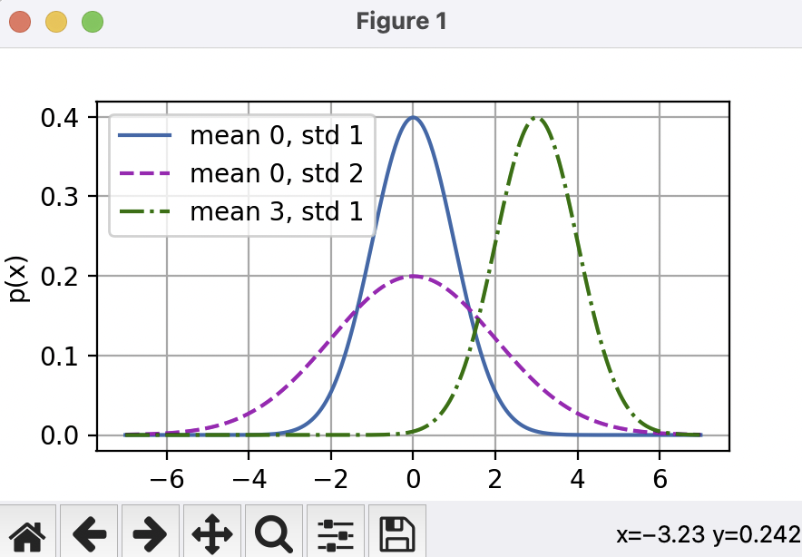

本文章来源于：<https://github.com/Zeb-D/my-review> ，请star 强力支持，你的支持，就是我的动力。

[TOC]

------

### 背景

在学习花书(deep learning)过程中，里面有比较多实战的代码，所以这里打算水一下代码。

其实没有pytorch这个框架，框架还是torch这套。

书中这套代码对框架及版本要求较高。


对应资料如下：

《动手学深度学习（PyTorch版）》配套资源获取链接：
本书配套网站主页：https://d2l.ai/
GitHub项目地址：https://github.com/d2l-ai/d2l-zh
Jupyter记事本下载：https://zh-v2.d2l.ai/d2l-zh.zip
中文版课件：https://github.com/d2l-ai/berkeley-stat-157/tree/master/slides-zh
视频课程及课程PPT：https://courses.d2l.ai/zh-v2/


### 环境准备

python 3.9

torch 1.12.0

torchvision 0.13.0

d2l 0.17.6

本人mac涉及到多个python 版本，所以这里要用pyenv方式进行安装。


```
#安装pyenv
brew install pyenv
brew install pyenv-virtualenv


#将 pyenv 添加到 shell 配置（~/.zshrc 或 ~/.bashrc）：
echo 'export PYENV_ROOT="$HOME/.pyenv"' >> ~/.zshrc
echo 'command -v pyenv >/dev/null || export PATH="$PYENV_ROOT/bin:$PATH"' >> ~/.zshrc
echo 'eval "$(pyenv init -)"' >> ~/.zshrc
echo 'eval "$(pyenv virtualenv-init -)"' >> ~/.zshrc
source ~/.zshrc

#安装 Python 版本
pyenv install 3.9.18

#创建虚拟环境
pyenv virtualenv 3.9.18 pytorch-env
pyenv activate pytorch-env

#安装三个主要的依赖项
pip install torch==1.12.0
pip install torchvision==0.13.0
pip install d2l==0.17.6

#测试安装的版本
python -c "import torch; print(torch.__version__)"
python -c "import torchvision; print(torchvision.__version__)"

```


### 简单使用

现在我们简单使用这三个框架的api，画出一个线性回归的正态分布与平方损失。

```
import math

import numpy as np


def normal(x, mu, sigma):
    p = 1 / math.sqrt(2 * math.pi * sigma ** 2)
    return p * np.exp(-0.5 / sigma ** 2 * (x - mu) ** 2)


if __name__ == "__main__":
    import torch
    import torchvision

    from d2l import torch as d2l
    import matplotlib.pyplot as plt

    # 再次使用numpy进行可视化
    x = np.arange(-7, 7, 0.01)

    # 均值和标准差对
    params = [(0, 1), (0, 2), (3, 1)]
    # 绘制图形
    d2l.plot(x, [normal(x, mu, sigma) for mu, sigma in params],
             xlabel='x', ylabel='p(x)', figsize=(4.5, 2.5),
             legend=[f'mean {mu}, std {sigma}' for mu, sigma in params])

    # 显示图形（如果不在Jupyter中运行）
    plt.show()

```


输出：

```
/Users/lucas/.pyenv/versions/3.9.18/bin/python /Users/lucas/PycharmProjects/ai/deepLearning/linear-regression-demo_test.py 
[-7.   -6.99 -6.98 ...  6.97  6.98  6.99]
2025-05-12 16:06:51.454 python[37063:3567255] +[IMKClient subclass]: chose IMKClient_Modern
```


