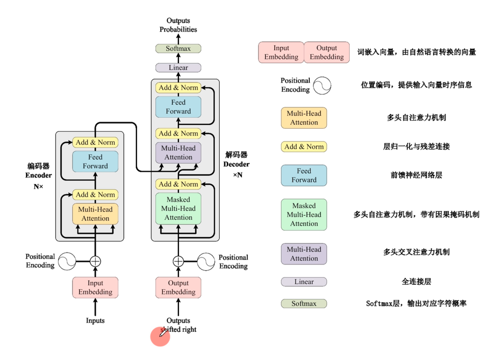

# Transformer 代码实现

> 本文基于 [`transformer_model.py`](tf_model.py) 与 [`transformer总体架构`](transformer总体架构.md) 第 1、2 部分，手写复现论文《`Attention Is All You Need`》的核心组件。
> 编排原则：
> 
> 1. **先思想、后代码**：每个组件都先给出它在论文中的定位与公式，再落到代码逐行；
> 2. **顺序对齐源码**：讲解顺序主要围绕 [`transformer_model.py`](tf_model.py) 的组件定义顺序（自下而上、从零件到整机）；
> 3. **代码为主**：以代码片段、张量形状、易错点为正文主体，理论只做必要铺垫。

---

## 阅读指引

### 0.1 背景

- 通过 [`transformer总体架构`](transformer总体架构.md) 深度解读论文《`Attention Is All You Need`》；
- 本文目标：**手写代码复现论文思想**，而不是直接调用现成框架（如 `nn.Transformer`），以加深理解；
- 论文重点组件总览图：；
- 示例任务：一个简单的「英文 → 中文」翻译（Seq2Seq）示例来串联所有组件。

### 0.2 统一小节模板（每个组件小节都按此五段式展开）

为了让每个组件的讲解节奏一致，后续每一节都按下面五步展开：

1. **定位**：该组件对应总架构文档第几节、在整机中处于什么位置；
2. **公式与思想**：先用数学式 / 类比说明「它解决什么问题」；
3. **代码逐行**：源码位置 + 关键行解释；
4. **张量形状**：输入 / 中间 / 输出形状的流转；
5. **易错点与小结**：常见坑 + 与下一小节的衔接。

### 0.3 组件构建顺序总览

[`transformer_model.py`](tf_model.py) 采用的是**自下而上**的定义顺序——先造零件（注意力、FFN、归一化），再造层（EncoderLayer / DecoderLayer），再造块（Encoder / Decoder），最后组装整机（Transformer / `make_model`）。依赖关系如下：

```
clones (工具)
  └─→ Embeddings → PositionalEncoding
        └─→ attention() → MultiHeadedAttention
              └─→ LayerNorm → PositionwiseFeedForward → SublayerConnection
                    ├─→ EncoderLayer → Encoder
                    └─→ DecoderLayer → Decoder
                          └─→ Generator → Transformer → make_model
```

后面每一节的讲解顺序即按上图自上而下推进，保证「上一个组件的输出，正好是下一个组件的输入或依赖」。

### 论文 ↔ 小节 对照表

| 组件                        | 总架构文档对应             | 论文位置                                          |
| ------------------------- | ------------------- | --------------------------------------------- |
| 依赖与 `DEVICE`              | —                   | —                                             |
| `clones`                  | —                   | —                                             |
| `Embeddings`              | 2.6.1 步骤 2          | §3.4 Embeddings and Softmax                   |
| `PositionalEncoding`      | 2.3 位置编码            | §3.5 Positional Encoding（位置编码公式）              |
| `attention()`             | 1.3 缩放点积注意力         | §3.2.1 Scaled Dot-Product Attention（式 1）      |
| `MultiHeadedAttention`    | 1.6 多头注意力           | §3.2.2 Multi-Head Attention（式 3、图 2）          |
| `LayerNorm`               | 2.2.3 层归一化          | §3.1（Add & Norm 中的层归一化）                       |
| `PositionwiseFeedForward` | 2.2.1 FFN           | §3.3 Position-wise Feed-Forward Networks（式 2） |
| `SublayerConnection`      | 2.2.2 残差 + Pre-Norm | §3.1（残差连接，图 1 的 Add & Norm）                   |
| `EncoderLayer`            | 2.4 Encoder 结构      | §3.1、图 1（左半）                                  |
| `Encoder`                 | 2.4                 | §3.1                                          |
| `DecoderLayer`            | 2.5 Decoder 结构      | §3.1、图 1（右半）                                  |
| `Decoder`                 | 2.5                 | §3.1                                          |
| `Generator`               | 2.6.1 步骤 5          | §3.4 Embeddings and Softmax                   |
| `Transformer`             | 2.1.2 / 2.6.1       | §3 Model Architecture、图 1                     |
| `make_model`              | 2.1.3 整体结构          | §3.1、表 3（Base 超参数）                            |

### 0.5 三大核心公式

为避免每节反复回溯，这里先集中给出全文反复引用的三条公式，后续小节直接引用编号：

- **缩放点积注意力**（第 4 节）：

$$
\mathrm{Attention}(Q,K,V)=\mathrm{softmax}\!\left(\frac{QK^{\top}}{\sqrt{d_k}}\right)V
$$

- **多头注意力**（第 5 节）：

$$
\mathrm{MultiHead}(Q,K,V)=\mathrm{Concat}(\mathrm{head}_1,\dots,\mathrm{head}_h)W^{O},\quad
\mathrm{head}_i=\mathrm{Attention}(QW_i^{Q},KW_i^{K},VW_i^{V})
$$

- **子层通用形式**（第 8 节，本文实现为 Pre-Norm）：

$$
\mathrm{Output}=x+\mathrm{Dropout}\big(\mathrm{Sublayer}(\mathrm{LayerNorm}(x))\big)
$$

---

## 第 1 节　全局准备：依赖、设备与通用工具

### 1.1 定位

在动手实现任何组件之前，先交代两件事：**运行环境**（把张量放到哪块设备上）与**贯穿全文的通用工具**。对应源码 L1–L18（依赖与设备）与 L227–L229（`clones`）。之所以把 `clones` 提前到这里，是因为它在 [`MultiHeadedAttention`](tf_model.py:115)、[`Encoder`](tf_model.py:250)、[`Decoder`](tf_model.py:292) 中都会被调用，先讲清楚可以避免后续反复中断。

### 1.2 依赖

```python
import math
import copy

import config
from torch.autograd import Variable

import torch
import torch.nn as nn
import torch.nn.functional as F
```

- `math`：`sqrt` / `log` 等数学运算（`Embeddings` 的缩放、`attention()` 的 $\sqrt{d_k}$、位置编码的 `div_term`）；
- `copy`：`clones` 与 `make_model` 中做深拷贝；
- `config`：项目级配置（词表、路径等）；
- `torch.autograd.Variable`：位置编码 `forward` 中用 `Variable(..., requires_grad=False)` 包裹 buffer；
- `nn`：所有网络层与参数容器；`F`：`relu` / `softmax` / `log_softmax` 等函数式接口。

### 1.3 设备选择（源码 L11–L18）

```python
gpu_id = ''
device_id = [0]
if gpu_id != "":
    DEVICE = torch.device("cuda:{}".format(gpu_id))
elif torch.backends.mps.is_available():
    DEVICE = torch.device("mps")
else:
    DEVICE = torch.device("cpu")
```

- 三档优先级：显式指定 `cuda:{gpu_id}` → Apple Silicon 的 `mps` → `cpu` 兜底；
- 全文所有组件在实例化时都会 `.to(DEVICE)`（见 `make_model`），因此必须保证**模型与数据位于同一设备**，否则会报 `Expected all tensors to be on the same device`。

### 1.4 通用工具 `clones`（源码 L227–L229）

```python
def clones(module, N):
    """克隆模型块，克隆的模型块参数不共享"""
    return nn.ModuleList([copy.deepcopy(module) for _ in range(N)])
```

- 作用：把同一个模块**深拷贝** N 份，返回 `nn.ModuleList`（可被 PyTorch 正确识别为子模块，从而纳入 `parameters()` 与 `to(device)`）；
- 关键在于 `copy.deepcopy`：如果写成 `[module] * N`，N 个位置会共享**同一份参数**，多层堆叠就退化为「同一层重复计算」，这是最常见的错误；
- 全文两处典型用法：
  - 多头注意力：`clones(nn.Linear(d_model, d_model), 4)`（第 5 节）；
  - 层 / 子层堆叠：`clones(layer, N)`、`clones(SublayerConnection(size, dropout), 2/3)`（第 9–12 节）。

### 1.5 易错点与小结

- `DEVICE` 只是「默认设备」，真正落到各层的是显式 `.to(DEVICE)`；
- `clones` 的深浅拷贝之别是本实现中最容易踩的坑；
- 至此环境与工具已就绪，可以从数据流的第一步 `Embeddings` 开始。

---

## 第 2 节　`Embeddings`：输入词嵌入

### 2.1 定位

`Embeddings` 是整机数据流的第一步，对应总架构文档 2.6.1 节流程的第 2 步前半：**把离散的 token 索引（`input_ids`）转换为连续的稠密向量**。

在 [`transformer_model.py`](tf_model.py:26) 中它的定义如下：

```python
class Embeddings(nn.Module):
    def __init__(self, d_model, vocab):
        super(Embeddings, self).__init__()
        self.lut = nn.Embedding(vocab, d_model)
        self.d_model = d_model

    def forward(self, x):
        return self.lut(x) * math.sqrt(self.d_model)
```

### 2.2 公式与思想

**为什么需要它**：Transformer 的所有计算（点积算相关度、矩阵乘、梯度更新）都建立在**连续实数向量**之上。而 tokenizer 输出的 `input_ids` 只是词表里的整数下标，既无法做点积，也无法求导。因此需要一个「查表」操作，把每个整数下标映射为一个 $d_{model}$ 维向量——这正是词嵌入（Embedding）层的作用。

把它看作一张可学习的查找表 $E\in\mathbb{R}^{V\times d_{model}}$（$V$ 为词表大小），则：

$$
\mathrm{Embed}(x)=\mathrm{Lookup}(x)\times\sqrt{d_{model}}
$$

其中 $\mathrm{Lookup}(x)$ 表示按索引取出行向量，行向量的内容会随训练不断更新——这与 Word2Vec 的思想一脉相承：**语义相近的词，其向量在空间中距离更近**，从而为后续「用点积度量 Query 与 Key 的相关性」提供数学基础。

**为什么要乘以 $\sqrt{d_{model}}$**：`nn.Embedding` 的默认初始化近似 $N(0,1)$，量级较小；而下一节要介绍的**位置编码取值被限制在 $[-1,1]$**。如果直接相加，位置信息会与语义信息量级相当甚至反客为主。乘以 $\sqrt{d_{model}}$ 放大词向量后，二者相加时仍能保持各自的比重，这也是论文中的原始做法。

### 2.3 代码逐行

**`__init__`**：

- `self.lut = nn.Embedding(vocab, d_model)`：创建查找表，形状为 $V\times d_{model}$，是可训练参数；
- `self.d_model = d_model`：保存维度，供 `forward` 中的缩放使用。

**`forward`**：

- `self.lut(x)`：输入 `x` 是形状为 `(batch, seq_len)` 的 **整型张量**，输出形状为 `(batch, seq_len, d_model)`；
- `* math.sqrt(self.d_model)`：逐元素缩放；注意它作用在**计算结果**上，而不是作用在权重参数上。

### 2.4 张量形状

| 阶段            | 形状                          | dtype     | 说明              |
| ------------- | --------------------------- | --------- | --------------- |
| 输入 `x`        | `(batch, seq_len)`          | `int64`   | token 索引        |
| `self.lut(x)` | `(batch, seq_len, d_model)` | `float32` | 查表得到的词向量        |
| 输出            | `(batch, seq_len, d_model)` | `float32` | 缩放后词向量，供与位置编码相加 |

### 2.5 易错点与小结

- **`d_model` 必须全程一致**：它是贯穿全文的「主角维度」，后续的注意力、残差相加、LayerNorm 都要求输入最后一维等于 `d_model`；
- **输入必须是 LongTensor**：`nn.Embedding` 的输入要求是 `int64`，若传 `float` 会直接报类型错误；
- **缩放写在 `forward` 而非参数上**：对输出乘常数等价于对权重乘常数，但写成对输出缩放语义更清晰，也不会污染参数的初始化分布；
- **`vocab` 必须覆盖全部索引**：源语言与目标语言各有一套词表，因此 `make_model` 中会分别用 `src_vocab` 与 `tgt_vocab` 实例化两个 `Embeddings`（详见第 15 节）。

**小结与衔接**：到这里，每个 token 已经获得了携带语义的稠密向量。但自注意力本身**与位置无关**——「agent learns」与「learns agent」在它眼里完全等价。因此，下一节要解决的就是**如何把顺序信息注入进来**：`PositionalEncoding`。

---

## 第 3 节　`PositionalEncoding`：位置编码

### 3.1 定位

对应总架构文档 2.3 节。自注意力对序列元素做的是**全连接式的两两相关度计算**，本身不含任何顺序信息：「agent learns」与「learns agent」在它看来完全等价。因此需要在进入 Encoder / Decoder 之前，把位置信息**加**到词向量上。

### 3.2 公式与思想

论文采用 Sinusoidal 绝对位置编码，直接由固定公式算出、**不参与训练**：

$$
PE_{(pos,2i)}=\sin\!\left(\frac{pos}{10000^{2i/d_{model}}}\right)
$$

$$
PE_{(pos,2i+1)}=\cos\!\left(\frac{pos}{10000^{2i/d_{model}}}\right)
$$

- **偶数维用 sin、奇数维用 cos**；
- 不同维度对应不同频率：维度索引 $i$ 越大，分母越大、频率越低，从而在多个尺度上编码位置；
- 因为是固定公式（而非可训练参数），模型可以**外推到训练时没见过的更长序列**（直到 `max_len` 上限）。

### 3.3 代码逐行

```python
class PositionalEncoding(nn.Module):
    def __init__(self, d_model, dropout, max_len=5000):
        super(PositionalEncoding, self).__init__()
        self.dropout = nn.Dropout(p=dropout)

        pe = torch.zeros(max_len, d_model, device=DEVICE)
        position = torch.arange(0., max_len, device=DEVICE).unsqueeze(1)
        div_term = torch.exp(torch.arange(0., d_model, 2, device=DEVICE) * -(math.log(10000.0) / d_model))

        pe[:, 0::2] = torch.sin(position * div_term)
        pe[:, 1::2] = torch.cos(position * div_term)

        pe = pe.unsqueeze(0)
        self.register_buffer('pe', pe)

    def forward(self, x):
        x = x + Variable(self.pe[:, :x.size(1)], requires_grad=False)
        return self.dropout(x)
```

**`__init__` 逐行**：

- `pe = torch.zeros(max_len, d_model)`：预分配一张 $max\_len \times d_{model}$ 的表，把**所有位置**的编码一次性算好；
- `position = torch.arange(0., max_len).unsqueeze(1)`：形状 `(max_len, 1)` 的列向量，方便与 `div_term` 广播；
- `div_term = torch.exp(arange(0, d_model, 2) * -(log(10000)/d_model))`：把 $\dfrac{1}{10000^{2i/d_{model}}}$ 改写成 $e^{-2i\cdot\ln 10000/d_{model}}$。**因为幂运算比 exp/log 慢，且此处分母带负指数，所以用 exp 实现**；`arange(0, d_model, 2)` 恰好取出所有偶数维度索引 $2i$；
- `pe[:, 0::2] = sin(...)`、`pe[:, 1::2] = cos(...)`：偶数列填 sin、奇数列填 cos；
- `pe.unsqueeze(0)` → `(1, max_len, d_model)`：多出一个 batch 维，便于与 `(batch, seq_len, d_model)` 广播相加；
- `self.register_buffer('pe', pe)`：注册为 **buffer** 而非 `nn.Parameter`。它不参与梯度更新，但会随 `.to(DEVICE)` 一起迁移，也会出现在 `state_dict` 中。

**`forward`**：

- `x + Variable(self.pe[:, :x.size(1)], requires_grad=False)`：按**当前 batch 的实际长度**切片，再逐元素相加；`requires_grad=False` 显式声明位置编码不需要梯度；
- `return self.dropout(x)`：论文在 embedding + 位置编码之后接了一次 dropout。

### 3.4 张量形状

| 阶段                   | 形状                          |
| -------------------- | --------------------------- |
| `pe` 全表              | `(1, max_len, d_model)`     |
| 切片 `pe[:, :seq_len]` | `(1, seq_len, d_model)`     |
| 输入 `x`               | `(batch, seq_len, d_model)` |
| 输出                   | `(batch, seq_len, d_model)` |

### 3.5 易错点与小结

- `max_len=5000` 是硬上限，序列更长会索引越界；
- `register_buffer` 与 `nn.Parameter` 的区别：前者不训练、跟随设备，后者参与训练——位置编码用前者；
- 用**加法**而非拼接：加法不改变维度，保证后续所有层看到的都是 $d_{model}$；
- **衔接**：至此输入侧完成（词向量 + 位置信息）。下一步进入核心——用 Query / Key / Value 计算注意力。

---

## 第 4 节　`attention()`：缩放点积注意力

### 4.1 定位

对应总架构文档 1.1–1.3。这是整个 Transformer 的**唯一计算内核**，多头注意力只是对它做并行包装。

### 4.2 公式与思想

- 三要素：**Query**（我想要什么）、**Key**（我是什么）、**Value**（我提供什么）；
- 从字典类比出发：精确匹配 → 权重化组合 → 用**点积**度量 Query 与 Key 的相关性 → Softmax 归一化 → 对 Value 加权求和；
- 完整公式（0.5 节公式 ①）：

$$
\mathrm{Attention}(Q,K,V)=\mathrm{softmax}\!\left(\frac{QK^{\top}}{\sqrt{d_k}}\right)V
$$

- **Softmax 的双重作用**：把任意实数相似度变成非负、和为 1 的权重；用指数放大高 / 低相似度的差距，让注意力更聚焦；
- **为什么要除 $\sqrt{d_k}$**：当 $d_k$ 较大时，点积结果的方差随 $d_k$ 增大，Softmax 会进入饱和区（输出接近 one-hot），梯度趋近于 0；除以 $\sqrt{d_k}$ 把方差拉回 1 附近，保持梯度稳定。

### 4.3 代码逐行

```python
def attention(query, key, value, mask=None, dropout=None):
    d_k = query.size(-1)
    scores = torch.matmul(query, key.transpose(-2, -1)) / math.sqrt(d_k)

    if mask is not None:
        scores = scores.masked_fill(mask == 0, -1e9)

    p_attn = F.softmax(scores, dim=-1)

    if dropout is not None:
        p_attn = dropout(p_attn)
    return torch.matmul(p_attn, value), p_attn
```

- `d_k = query.size(-1)`：取最后一维，即单个头的维度；
- `torch.matmul(query, key.transpose(-2, -1)) / math.sqrt(d_k)`：先转置 key 的最后两维才能与 query 相乘，再缩放；
- `scores.masked_fill(mask == 0, -1e9)`：把 mask 中为 0 的位置填成 `-1e9`（近似 $-\infty$），Softmax 后这些位置概率 ≈ 0；
- `F.softmax(scores, dim=-1)`：沿**最后一个维度（Key 维）**归一化；
- `torch.matmul(p_attn, value)`：用注意力权重对 Value 加权求和；
- 返回值是**元组** `(加权结果, 注意力矩阵)`。后者不参与主流程，但可用于可视化注意力分布、检查 mask 是否正确。

### 4.4 mask 语义辨析（重点）

- Encoder 只需 **padding mask**：屏蔽一个 batch 中因补齐产生的 `<pad>`，避免把无意义位置计入加权；
- Decoder 需要 **padding mask + sequence mask**：后者是一个上三角掩码，禁止每个位置看到「未来」的 token；
- 一句话概括：**掩码不是删除 token，而是在 Softmax 之前把不该关注的位置概率压到 0**。

### 4.5 张量形状

（此处不涉及多头包装，即 $h=1$）

| 张量                        | 形状                |
| ------------------------- | ----------------- |
| `query` / `key` / `value` | `(..., L, d_k)`   |
| `scores` / `p_attn`       | `(..., L_q, L_k)` |
| 输出                        | `(..., L_q, d_k)` |

### 4.6 易错点与小结

- 用 `-1e9` 而非 `-inf`：避免 `inf - inf = nan` 之类的数值问题；
- `dim=-1` 不能换：注意力一定是在 **Key 维**上归一化；
- `mask == 0` 的语义是「0 表示屏蔽」，因此构造 mask 时要保证「有效位 = 1、无效位 = 0」；
- **衔接**：单头只能拟合一种关系，下一节把 `attention()` 包装成多头并行。

---

## 第 5 节　`MultiHeadedAttention`：多头注意力

### 5.1 定位

对应总架构文档 1.6。一次注意力只能拟合一种相关关系，多头让模型同时在多个「表示子空间」里关注不同关系。

### 5.2 公式与思想

（0.5 节公式 ②）

$$
\mathrm{MultiHead}(Q,K,V)=\mathrm{Concat}(\mathrm{head}_1,\dots,\mathrm{head}_h)W^{O},\quad
\mathrm{head}_i=\mathrm{Attention}(QW_i^{Q},KW_i^{K},VW_i^{V})
$$

工程要点：最直观的实现是准备 $h$ 组 $W_i^Q/W_i^K/W_i^V$，但这样时空复杂度都很高。由于**「矩阵内积再拼接」等价于「拼接矩阵再内积」**，只需 3 个 $d_{model}\times d_{model}$ 的大矩阵（拆成 $h$ 份即等价于 $h$ 组小矩阵），外加一个输出投影 $W^{O}$，即可用一次批量矩阵乘完成所有头。

### 5.3 代码逐行

```python
class MultiHeadedAttention(nn.Module):
    def __init__(self, h, d_model, dropout=0.1):
        super(MultiHeadedAttention, self).__init__()
        assert d_model % h == 0
        self.d_k = d_model // h
        self.h = h
        self.linears = clones(nn.Linear(d_model, d_model), 4)
        self.attn = None
        self.dropout = nn.Dropout(p=dropout)

    def forward(self, query, key, value, mask=None):
        if mask is not None:
            mask = mask.unsqueeze(1)
        nbatches = query.size(0)
        query, key, value = [l(x).view(nbatches, -1, self.h, self.d_k).transpose(1, 2)
                             for l, x in zip(self.linears, (query, key, value))]
        x, self.attn = attention(query, key, value, mask=mask, dropout=self.dropout)
        x = x.transpose(1, 2).contiguous().view(nbatches, -1, self.h * self.d_k)
        return self.linears[-1](x)
```

- `assert d_model % h == 0` + `self.d_k = d_model // h`：保证能均分，每个头分到 $d_k = d_{model}/h$ 维；
- `self.linears = clones(nn.Linear(d_model, d_model), 4)`：4 个同构全连接，前 3 个当 $W^Q/W^K/W^V$，最后一个当 $W^{O}$；
- `mask.unsqueeze(1)`：在 head 维前插一维，使 mask 能广播到 $h$ 个头；
- **拆头**（列表推导同时对 Q/K/V 生效）：
  - `l(x)`：线性投影，`(B, L, d_model)`；
  - `.view(nbatches, -1, self.h, self.d_k)`：把 $d_{model}$ 拆成 `(h, d_k)`；
  - `.transpose(1, 2)`：把 head 维提到 seq 维之前 → `(B, h, L, d_k)`，这样 `attention()` 就能把每个头当作独立的 batch 并行计算；
- `x, self.attn = attention(...)`：一次调用同时完成 $h$ 个头的注意力；
- **拼头**：`x.transpose(1, 2)` 把 head 维换回 → `(B, L, h, d_k)`；`.contiguous()` 让内存连续（`transpose` 后内存不连续，直接 `view` 会报错）；`.view(nbatches, -1, h*d_k)` → `(B, L, d_model)`；
- `self.linears[-1](x)`：用 $W^{O}$ 做输出投影。

### 5.4 张量形状

| 阶段               | 形状                |
| ---------------- | ----------------- |
| 输入 Q / K / V     | `(B, L, d_model)` |
| 线性投影后            | `(B, L, d_model)` |
| `view` 拆头        | `(B, L, h, d_k)`  |
| `transpose(1,2)` | `(B, h, L, d_k)`  |
| 注意力输出            | `(B, h, L, d_k)`  |
| `transpose` 回拼   | `(B, L, h, d_k)`  |
| `view` 合并        | `(B, L, d_model)` |
| 输出投影             | `(B, L, d_model)` |

### 5.5 两种用法辨析（伏笔回收）

同一个类，通过传入不同的 Q / K / V 实现两种注意力：

- **自注意力（Self-Attention）**：`self_attn(x, x, x, mask)` —— Q/K/V 同源（Encoder 层、Decoder 第一子层）；
- **交叉注意力（Cross-Attention）**：`src_attn(x, m, m, src_mask)` —— Q 来自 Decoder，K/V 来自 Encoder 的 `memory`（Decoder 第二子层）。

### 5.6 易错点与小结

- `transpose` 之后必须 `contiguous()` 才能 `view`；
- `mask.unsqueeze(1)` 的插入位置决定了广播是否对齐（在 head 维）；
- `self.attn` 保存下来只是便于调试 / 可视化，不影响计算；
- **衔接**：注意力输出仍需被「包裹」成稳定可堆叠的子层，下一节先从归一化说起。

---

## 第 6 节　`LayerNorm`：层归一化

### 6.1 定位

对应总架构文档 2.2.3。它是让 Transformer 能把层「堆深」的两个支柱之一（另一个是残差连接，见第 8 节）。

### 6.2 公式与思想

- **归一化的目的**：让每层输入的分布稳定，缓解内部协变量偏移，加速收敛；
- **BatchNorm 的缺陷**：小 batch 统计失真、时间维展开失效、变长序列后段无统计量、需保存 / 计算 batch 统计量；
- LayerNorm 与 BatchNorm 的归一化公式完全相同，**区别只在统计维度**：BatchNorm 在 batch 维统计，LayerNorm 在**单个样本的特征维（最后一维）**统计，因此与 batch 大小、序列长度都无关；
- 公式：

$$
y=a\cdot\frac{x-\mu}{\sqrt{\sigma^{2}+\epsilon}}+b
$$

其中 $a,b$ 是可学习的缩放与平移参数，$\epsilon$ 用于防止除零。

### 6.3 代码逐行

```python
class LayerNorm(nn.Module):
    def __init__(self, features, eps=1e-6):
        super(LayerNorm, self).__init__()
        self.a_2 = nn.Parameter(torch.ones(features))
        self.b_2 = nn.Parameter(torch.zeros(features))
        self.eps = eps

    def forward(self, x):
        mean = x.mean(-1, keepdim=True)
        std = x.std(-1, keepdim=True)
        return self.a_2 * (x - mean) / torch.sqrt(std ** 2 + self.eps) + self.b_2
```

- `self.a_2` 初始化为全 1、`self.b_2` 初始化为全 0：初始时 LayerNorm 等价于「仅做标准化」，让网络自行学出需要的缩放 / 平移；
- `x.mean(-1, keepdim=True)` / `x.std(-1, keepdim=True)`：沿最后一维求均值与标准差，`keepdim=True` 保持形状为 `(..., 1)`，才能与 `x` 广播；
- `torch.sqrt(std ** 2 + self.eps)`：用 `std**2`（即方差）而非直接 `std`，与论文写法一致，同样出于数值稳定考虑。

### 6.4 张量形状

对 `(..., d_model)` 在最后一维归一化，**形状不变**。

### 6.5 易错点与小结

- `keepdim=True` 是必须的，否则会广播到错误的维度；
- `a_2` / `b_2` 是 `nn.Parameter`，但它们的 `dim() == 1`，因此不会被 `make_model` 的初始化逻辑影响（详见第 15 节）；
- **衔接**：LayerNorm 是「通用零件」，需要一个统一的容器把子层 + 残差 + 归一化组合起来——先看另一个零件：前馈网络。

---

## 第 7 节　`PositionwiseFeedForward`：逐位置前馈网络

### 7.1 定位

对应总架构文档 2.2.1。如果说注意力是「动态地聚合相关信息」，FFN 就是从聚合结果中**提取更高阶特征**。

### 7.2 公式与思想

$$
\mathrm{FFN}(x)=\max(0,xW_1+b_1)W_2+b_2
$$

- **「逐位置」**：对序列中每个位置**独立**作用，且**所有位置共享同一组权重**——等价于对每个 token 单独过一个 MLP；
- **「先升维、再降维」**：$d_{ff}$ 通常取 $d_{model}$ 的 4 倍（本实现 2048 = 4 × 512），中间的宽通道被认为有助于学到更丰富的特征。

### 7.3 代码逐行

```python
class PositionwiseFeedForward(nn.Module):
    def __init__(self, d_model, d_ff, dropout=0.1):
        super(PositionwiseFeedForward, self).__init__()
        self.w_1 = nn.Linear(d_model, d_ff)
        self.w_2 = nn.Linear(d_ff, d_model)
        self.dropout = nn.Dropout(dropout)

    def forward(self, x):
        return self.w_2(self.dropout(F.relu(self.w_1(x))))
```

- `w_1`：$d_{model}\to d_{ff}$ 升维；`w_2`：$d_{ff}\to d_{model}$ 降维，保证子层输出维度与输入一致（这是残差相加的前提）；
- `forward` 的顺序：`w_1` → `relu` → `dropout` → `w_2`，注意 dropout 放在两次线性之间。

### 7.4 张量形状

| 阶段             | 形状                |
| -------------- | ----------------- |
| 输入             | `(B, L, d_model)` |
| `w_1(x)`       | `(B, L, d_ff)`    |
| relu + dropout | `(B, L, d_ff)`    |
| `w_2(...)`     | `(B, L, d_model)` |

### 7.5 易错点与小结

- ReLU 必须在两次线性之间，否则整体只是线性变换；
- Dropout 只在训练期生效，因此结构示意图中常画省略；
- **衔接**：注意力与 FFN 都是「子层」，下一节用统一的容器把二者与残差、归一化组合起来。

---

## 第 8 节　`SublayerConnection`：残差连接 + 归一化

### 8.1 定位

对应总架构文档 2.2.2 与 2.2.3 的第 (4) 点。它是「能把层堆深」的另一个支柱：把每个子层包一层残差 + 归一化。

### 8.2 公式与思想

- **残差连接**：$\mathrm{Output}=x+\mathrm{Sublayer}(x)$，允许底层信息直达高层，梯度可绕过子模块回传，缓解梯度消失；
- **Pre-Norm vs Post-Norm**：
  - **Post-Norm**：先做残差，再做归一化（论文原图）；
  - **Pre-Norm**：先做归一化，再进子层（**本实现的写法**）；
- 本实现的公式（0.5 节公式 ③）：

$$
\mathrm{Output}=x+\mathrm{Dropout}\big(\mathrm{Sublayer}(\mathrm{LayerNorm}(x))\big)
$$

### 8.3 代码逐行

```python
class SublayerConnection(nn.Module):
    def __init__(self, size, dropout):
        super(SublayerConnection, self).__init__()
        self.norm = LayerNorm(size)
        self.dropout = nn.Dropout(dropout)

    def forward(self, x, sublayer):
        return x + self.dropout(sublayer(self.norm(x)))
```

- `self.norm = LayerNorm(size)`：每个子层配一个**独立的** LayerNorm；
- `forward(x, sublayer)`：`sublayer` 是一个**可调用对象**（lambda / `nn.Module`），先 `norm(x)` 再交给 `sublayer`，最后 dropout 并与 `x` 相加；
- **为什么把 `sublayer` 作为参数注入**：同一个容器既能装多头注意力，也能装 FFN，无需写两个类。这也正是 `EncoderLayer` / `DecoderLayer` 中 `lambda x: self.self_attn(x, x, x, mask)` 这种写法的由来。

### 8.4 张量形状

输入输出形状一致 `(B, L, d_model)`——残差相加要求子层输出与输入同形。

### 8.5 易错点与小结

- 本实现是 **Pre-Norm**：`norm` 在 `sublayer` **之前**；这与论文原图的 Post-Norm 位置相反，但被后续大多数大模型采用；
- `x + dropout(...)` 中的 `x` 是**未归一化**的原始输入，残差通路保持「恒等」；
- **衔接**：零件已齐，开始拼装 `EncoderLayer`。

---

## 第 9 节　`EncoderLayer`：编码器层

### 9.1 定位

对应总架构文档 2.4。它是 Encoder 的重复单元：**一个自注意力子层 + 一个 FFN 子层**，共 **2 个 LayerNorm**，**不需要因果掩码**。

### 9.2 结构与数据流

```
x ──→ SublayerConnection(自注意力) ──→ SublayerConnection(FFN) ──→ 输出
```

### 9.3 代码逐行

```python
class EncoderLayer(nn.Module):
    def __init__(self, size, self_attn, feed_forward, dropout):
        super(EncoderLayer, self).__init__()
        self.self_attn = self_attn
        self.feed_forward = feed_forward
        self.sublayer = clones(SublayerConnection(size, dropout), 2)
        self.size = size

    def forward(self, x, mask):
        x = self.sublayer[0](x, lambda x: self.self_attn(x, x, x, mask))
        return self.sublayer[1](x, self.feed_forward)
```

- `self.sublayer = clones(SublayerConnection(size, dropout), 2)`：**2 个独立的 `SublayerConnection`**（各自持有独立的 LayerNorm 参数），不能复用同一个实例；
- `self.sublayer[0](x, lambda x: self.self_attn(x, x, x, mask))`：把「自注意力（Q = K = V）」作为子层传入；
- `self.sublayer[1](x, self.feed_forward)`：FFN 本身是 `nn.Module`，可直接作为可调用对象传入；
- 注意第一个子层的输出 `x` 直接作为第二个子层的输入。

### 9.4 张量形状

`(B, L_src, d_model)` 进出不变。

### 9.5 易错点与小结

- 只有 **2** 个 `sublayer`（对比 `DecoderLayer` 的 3 个）；
- `mask` 只传一个：Encoder 使用 **padding mask**；
- **衔接**：把这些层堆 $N$ 次并加一次收尾归一化，就是 `Encoder`。

---

## 第 10 节　`Encoder`：编码器

### 10.1 定位

对应总架构文档 2.4：$N$ 个 `EncoderLayer` 堆叠（论文 $N=6$），堆叠后再做一次 LayerNorm。

### 10.2 代码逐行

```python
class Encoder(nn.Module):
    def __init__(self, layer, N):
        super(Encoder, self).__init__()
        self.layers = clones(layer, N)
        self.norm = LayerNorm(layer.size)

    def forward(self, x, mask):
        for layer in self.layers:
            x = layer(x, mask)
        return self.norm(x)
```

- `clones(layer, N)`：深拷贝出 $N$ 个**参数独立**的 `EncoderLayer`；
- `LayerNorm(layer.size)`：堆叠完成后统一归一化一次。因为 `SublayerConnection` 是 Pre-Norm，最后一层输出尚未被归一化，需要补一次；
- `forward`：逐层传递同一个 `mask`（Encoder 只有 padding mask）。

### 10.3 张量形状

输入输出均为 `(B, L_src, d_model)`，输出即 `memory`。

### 10.4 易错点与小结

- 末尾 `norm` 不能省：它是 Pre-Norm 结构配套的收尾；
- Encoder 只接受一个 `mask`——因为它做的是双向自注意力；
- **衔接**：Encoder 产出 `memory`，接下来看消费它的 `Decoder`。

---

## 第 11 节　`DecoderLayer`：解码器层

### 11.1 定位

对应总架构文档 2.5。比 `EncoderLayer` **多一个交叉注意力子层**，共 **3 个 LayerNorm**。

### 11.2 结构与数据流

```
x ─→ SC(掩码自注意力, tgt_mask) ─→ SC(交叉注意力, memory, src_mask) ─→ SC(FFN) ─→ 输出
```

- 第 1 子层：掩码自注意力，Q = K = V = x，只使用「当前及之前」的信息；
- 第 2 子层：交叉注意力，**Q 来自 Decoder、K/V 来自 Encoder 的 `memory`**；
- 第 3 子层：FFN。

### 11.3 代码逐行

```python
class DecoderLayer(nn.Module):
    def __init__(self, size, self_attn, src_attn, feed_forward, dropout):
        super(DecoderLayer, self).__init__()
        self.size = size
        self.self_attn = self_attn
        self.src_attn = src_attn
        self.feed_forward = feed_forward
        self.sublayer = clones(SublayerConnection(size, dropout), 3)

    def forward(self, x, memory, src_mask, tgt_mask):
        m = memory
        x = self.sublayer[0](x, lambda x: self.self_attn(x, x, x, tgt_mask))
        x = self.sublayer[1](x, lambda x: self.src_attn(x, m, m, src_mask))
        return self.sublayer[2](x, self.feed_forward)
```

- 构造函数接收**两个注意力模块**：`self_attn`（自注意力）与 `src_attn`（交叉注意力），它们是**两套独立参数**（见第 15 节 `make_model`）；
- `m = memory`：只是别名，强调 K/V 都来自 Encoder 输出；
- `self.sublayer[1](x, lambda x: self.src_attn(x, m, m, src_mask))`：Q = `x`（Decoder 侧），K = V = `m`（Encoder 侧）——**这就是交叉注意力**；
- 两类 mask 分别传给两个注意力子层。

### 11.4 张量形状

| 张量              | 形状                     |
| --------------- | ---------------------- |
| `x`（Decoder 输入） | `(B, L_tgt, d_model)`  |
| `memory`        | `(B, L_src, d_model)`  |
| 注意力分数（交叉）       | `(B, h, L_tgt, L_src)` |

### 11.5 易错点与小结

- **mask 不要传错**：`tgt_mask` 给自注意力（含因果掩码），`src_mask` 给交叉注意力（只需 padding mask）；
- 交叉注意力**不需要因果掩码**：Encoder 的输出是完整可见的，无需屏蔽「未来」；
- **衔接**：把 `DecoderLayer` 堆 $N$ 次即得 `Decoder`。

---

## 第 12 节　`Decoder`：解码器

### 12.1 定位

$N$ 个 `DecoderLayer` 堆叠，结构与 `Encoder` 类高度对称。

### 12.2 代码逐行

```python
class Decoder(nn.Module):
    def __init__(self, layer, N):
        super(Decoder, self).__init__()
        self.layers = clones(layer, N)
        self.norm = LayerNorm(layer.size)

    def forward(self, x, memory, src_mask, tgt_mask):
        for layer in self.layers:
            x = layer(x, memory, src_mask, tgt_mask)
        return self.norm(x)
```

- 与 `Encoder` 的唯一差别：`forward` 多接收 `memory` 与 `src_mask`，并逐层向下传递；
- 每个 `DecoderLayer` 都拿到**同一份** `memory`（而不是只给第一层）。

### 12.3 张量形状

输入 `(B, L_tgt, d_model)`、`memory` 为 `(B, L_src, d_model)`，输出 `(B, L_tgt, d_model)`。

### 12.4 易错点与小结

- 与 `Encoder` 的对比记忆：**Encoder 只有「自我」注意力，Decoder 多了「对外」注意力**；
- `memory` 在每一层都被复用，这正是「交叉注意力是 Encoder / Decoder 唯一通道」的代码体现；
- **衔接**：Decoder 输出仍是隐藏状态，需要 `Generator` 映射到词表。

---

## 第 13 节　`Generator`：输出层

### 13.1 定位

对应总架构文档 2.6.1 步骤 5：把隐藏状态映射到词表维度，得到下一个 token 的概率分布。

### 13.2 公式与思想

- 线性映射到词表：$\mathrm{logits}=xW$，其中 $W\in\mathbb{R}^{d_{model}\times V}$；
- 再取 `log_softmax`：与常用的 `NLLLoss` 配套（`NLLLoss` 期望输入已经是 log 概率）；
- 为什么不「先 `softmax` 再取 `log`」：`log_softmax` 内部做了数值稳定的处理，避免 `log(0)` 与精度损失。

### 13.3 代码逐行

```python
class Generator(nn.Module):
    def __init__(self, d_model, vocab):
        super(Generator, self).__init__()
        self.proj = nn.Linear(d_model, vocab)

    def forward(self, x):
        return F.log_softmax(self.proj(x), dim=-1)
```

### 13.4 张量形状

`(B, L_tgt, d_model)` → `(B, L_tgt, tgt_vocab)`。

### 13.5 易错点与小结

- `dim=-1`：在词表维上归一化；
- 注意 `vocab` 用的是**目标语言词表**（`tgt_vocab`）；
- 训练期一次算完整序列，推理期只取「最后一个位置」的输出再采样；
- **衔接**：万事俱备，下一节把 Encoder / Decoder / 两个 Embedding / Generator 组装成 `Transformer`。

---

## 第 14 节　`Transformer`：整机组装

### 14.1 定位

对应总架构文档 2.1.2 与 2.6.1：把五大部件组装成完整模型，并以 `encode` / `decode` / `forward` 三个方法暴露数据流。

### 14.2 代码逐行

```python
class Transformer(nn.Module):
    def __init__(self, encoder, decoder, src_embed, tgt_embed, generator):
        super(Transformer, self).__init__()
        self.encoder = encoder
        self.decoder = decoder
        self.src_embed = src_embed
        self.tgt_embed = tgt_embed
        self.generator = generator

    def encode(self, src, src_mask):
        return self.encoder(self.src_embed(src), src_mask)

    def decode(self, memory, src_mask, tgt, tgt_mask):
        return self.decoder(self.tgt_embed(tgt), memory, src_mask, tgt_mask)

    def forward(self, src, tgt, src_mask, tgt_mask):
        return self.decode(self.encode(src, src_mask), src_mask, tgt, tgt_mask)
```

- `encode`：`src` 先过 `src_embed`（词嵌入 + 位置编码），再进 Encoder → `memory`；
- `decode`：`tgt` 先过 `tgt_embed`，再连同 `memory` 进 Decoder；
- `forward`：**先 encode、再把结果作为 `memory` 传入 decode**——这正是「先理解、再生成」的代码落地。

### 14.3 数据流串联（对应总架构 2.6.1 五步）

```
input_ids
  → src_embed（Embeddings + PositionalEncoding）
  → N × EncoderLayer
  → memory
  → N × DecoderLayer（每层都用 memory）
  → Generator
  → 下一个 token 的概率分布
```

### 14.4 易错点与小结

- `memory` 被送到 Decoder **每一层**，不只是第一层；
- 两个 Embedding 是**独立的**（源 / 目标词表不同），但共享同一套位置编码逻辑；
- **衔接**：这些部件在 `make_model` 中被一次性装配并初始化。

---

## 第 15 节　`make_model`：装配与初始化

### 15.1 定位

工厂函数：一次性实例化所有组件、组装成 `Transformer`，并对参数做统一初始化。

### 15.2 代码逐行

```python
def make_model(src_vocab, tgt_vocab, N=6, d_model=512, d_ff=2048, h=8, dropout=0.1):
    c = copy.deepcopy
    attn = MultiHeadedAttention(h, d_model).to(DEVICE)
    ff = PositionwiseFeedForward(d_model, d_ff, dropout).to(DEVICE)
    position = PositionalEncoding(d_model, dropout).to(DEVICE)

    model = Transformer(
        Encoder(EncoderLayer(d_model, c(attn), c(ff), dropout).to(DEVICE), N).to(DEVICE),
        Decoder(DecoderLayer(d_model, c(attn), c(attn), c(ff), dropout).to(DEVICE), N).to(DEVICE),
        nn.Sequential(Embeddings(d_model, src_vocab).to(DEVICE), c(position)),
        nn.Sequential(Embeddings(d_model, tgt_vocab).to(DEVICE), c(position)),
        Generator(d_model, tgt_vocab)).to(DEVICE)

    for p in model.parameters():
        if p.dim() > 1:
            nn.init.xavier_uniform_(p)
    return model.to(DEVICE)
```

- `c = copy.deepcopy`：先构造「模板」 `attn` / `ff` / `position`，再用 `c(...)` 拷贝给每一处。**模板本身不会被直接放进模型**，否则所有层会共享同一份参数（又回到 `clones` 那个坑）；
- `EncoderLayer(d_model, c(attn), c(ff), dropout)`：每层一份独立的注意力与 FFN；
- `DecoderLayer(d_model, c(attn), c(attn), c(ff), dropout)`：注意这里有**两个 `c(attn)`**——自注意力与交叉注意力各一份参数，不能共用；
- `nn.Sequential(Embeddings(d_model, src_vocab), c(position))`：把「词嵌入 → 位置编码」打包成一个模块，正好对应 `Transformer.encode` 里的 `src_embed(src)`；
- 初始化：只对 `p.dim() > 1` 的参数做 `xavier_uniform_`（即权重矩阵）。偏置与 LayerNorm 的 $\alpha/\beta$ 都是 1 维，保持默认初始化；
- 默认超参数 `N=6, d_model=512, d_ff=2048, h=8, dropout=0.1` 与论文一致（`d_ff = 4 × d_model`）。

### 15.3 参数规模直觉

- 多头注意力：4 个 $512\times512$ 矩阵；
- FFN：$512\times2048 + 2048\times512$；
- 每层还有 LayerNorm 的 2 / 3 组参数；Encoder 与 Decoder 各 6 层。

### 15.4 易错点与小结

- `c(...)` 必须用在**把模块放进模型之前**，顺序不能颠倒；
- `Generator` 用的是 `tgt_vocab`；`src_embed` 用 `src_vocab`、`tgt_embed` 用 `tgt_vocab`；
- **衔接**：模型已就绪，另外一篇文章用完整的数据流把它串起来，并说明训练 / 推理的差异。

---

## 第 16 节　完整数据流走查与训练 / 推理差异（收束）

### 16.1 端到端形状流转

| 步骤          | 张量                        | 形状                          |
| ----------- | ------------------------- | --------------------------- |
| 输入 id       | `src` / `tgt`             | `(B, L_src)` / `(B, L_tgt)` |
| 词嵌入 + 位置编码  | `src_embed` / `tgt_embed` | `(B, L, d_model)`           |
| Encoder × N | `memory`                  | `(B, L_src, d_model)`       |
| Decoder × N | hidden                    | `(B, L_tgt, d_model)`       |
| Generator   | log 概率                    | `(B, L_tgt, V_tgt)`         |
| 与标签比较       | loss                      | 标量                          |

### 16.2 mask 的构造与使用

结合第 4 节 `attention()` 中 `masked_fill(mask == 0, -1e9)` 的语义，mask 的构造与尺寸如下：

- **padding mask**：由 `src != PAD` 得到，形状 `(B, 1, L_src)`；经多头注意力内部的 `mask.unsqueeze(1)` 变为 `(B, 1, 1, L_src)`，广播到所有 query 位置与所有头；
- **sequence mask（因果 / 上三角掩码）**：可由 `torch.triu(torch.ones(1, L, L), diagonal=1) == 0` 得到，结果为下三角（含对角线）为 True 的布尔矩阵，形状 `(1, L, L)`；
- **`tgt_mask` = padding mask & sequence mask**：形状广播为 `(B, L_tgt, L_tgt)`；
- 二者最终都在 `attention()` 中被 `masked_fill` 消费，与第 4 节的语义完全对应。

### 16.3 训练并行 vs 推理自回归

- **训练期**：目标序列一次性并行送入 Decoder，由因果掩码保证每个位置只依赖其之前的位置；
- **推理期**：未来 token 尚未生成，只能逐个 token 自回归生成，每生成一个就追加到输入再预测下一个；
- 这种「训练并行、推理串行」的差异，正是掩码自注意力同时承担训练效率与生成正确性的原因。

### 16.4 与总架构文档的对照小结

| 总架构文档知识点    | 本文实现                                        |
| ----------- | ------------------------------------------- |
| 1.3 缩放点积注意力 | `attention()`（第 4 节）                        |
| 1.5 掩码自注意力  | `mask` 参数 + `masked_fill`（第 4 节 / 第 16.2 节） |
| 1.6 多头注意力   | `MultiHeadedAttention`（第 5 节）               |
| 2.2.1 前馈网络  | `PositionwiseFeedForward`（第 7 节）            |
| 2.2.2 残差连接  | `SublayerConnection`（第 8 节）                 |
| 2.2.3 层归一化  | `LayerNorm`（第 6 节）                          |
| 2.3 位置编码    | `PositionalEncoding`（第 3 节）                 |
| 2.4 Encoder | `EncoderLayer` / `Encoder`（第 9–10 节）        |
| 2.5 Decoder | `DecoderLayer` / `Decoder`（第 11–12 节）       |
| 2.6.1 完整数据流 | `Transformer.forward`（第 14 节 / 第 16.1 节）    |

### 16.5 与论文的差异点（留给后续扩展）

- 本实现采用 **Pre-Norm** 布局，而论文原图为 Post-Norm；
- `Generator` 直接输出 `log_softmax`，便于配合 `NLLLoss`；论文用 softmax 后再接交叉熵；
- 后面实现 Label Smoothing、学习率 warmup、beam search 等训练 / 解码技巧；
