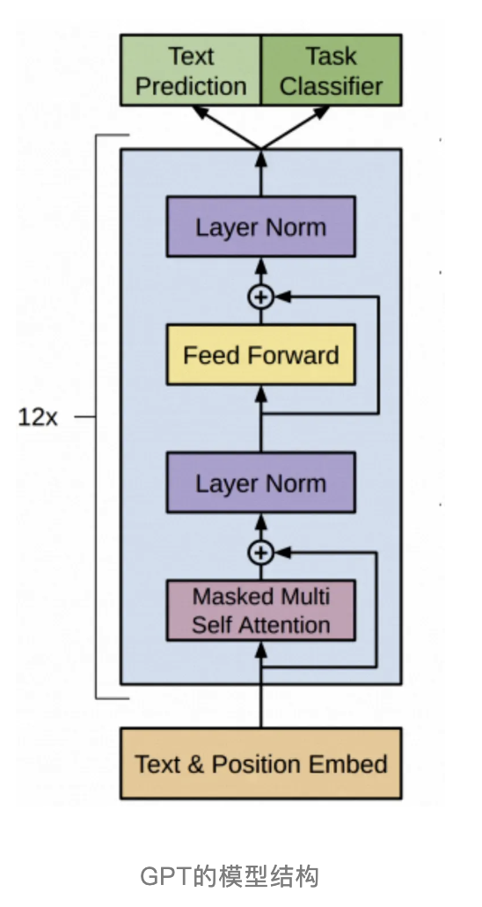
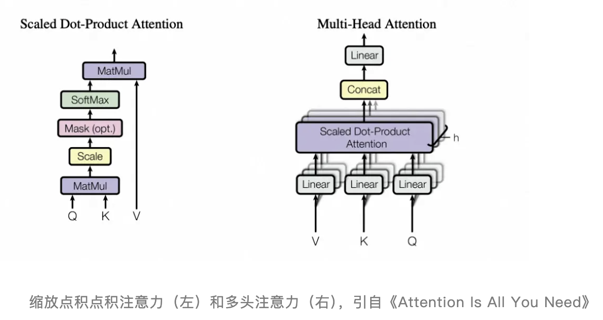

本文章来源于：<https://github.com/Zeb-D/my-review> ，请star 强力支持，你的支持，就是我的动力。

[TOC]

------

### 背景

在探索人工智能的深海中，提示词（Prompt）是引导大模型输出的灯塔。

为什么是灯塔，大规模语言模型（LLM, Large Language Models）扮演着越来越重要的角色。然而，想要真正发挥这些模型的强大能力，关键在于如何向模型输入明确、详细且符合预期的指令

Prompt，作为一种结构化的输入序列，不仅为模型提供任务要求和背景信息，更在很大程度上决定了模型输出的质量与相关性。一个设计优秀的Prompt，能够最大程度地减少误解，使得模型理解用户的需求并生成高质量的响应。

### 什么是Prompt

**Prompt（提示词）** 是用户输入给AI模型的指令或问题，用于引导模型生成特定的回答或执行任务。它可以是一个问题、一段描述、一个关键词，甚至是带有特定格式的文本。Prompt的设计直接影响AI的输出质量。

Prompt 的核心作用

1. **引导AI输出**：告诉模型你需要什么，比如回答问题、写文章、翻译、编程等。
2. **控制输出风格**：通过调整Prompt，可以影响AI的回答方式（如正式、幽默、简洁等）。
3. **优化结果质量**：好的Prompt能减少无关信息，提高准确性和相关性。

### 为什么需要Prompt

直接回答这个问题可能会有些抽象，比如你直接问AI会告诉一堆应用场景。

此处引入ICIO框架，ICIO的核心思想，是通过明确定义任务的各个方面，来提高AI响应时的效率和准确性。它是业内广泛认为最为简单且易于遵循的提示框架，因其简单性而受到青睐。

在ICIO的框架的设计中，Prompt可能包含四要素：

- Instruction（指令）：这是最重要的部分，它直接告诉模型需要执行的具体任务。
- Context（上下文/背景）：上下文提供了任务执行所需的背景信息，帮助模型理解任务的情景和环境。
- Input Data（输入数据）：输入数据是模型需要处理的具体信息。
- Output Indicator（输出指示器）：输出指示器告诉模型用户期望的输出类型或格式。

其中除了指令以外，其他要素都是可选的，说明指令对于大模型来说是最重要的，其他要素都是对指令的补充。这意味着：

提示词最基本的作用是沟通和引导，其核心是要清晰地传达用户的意图，而上下文和输入输出等内容，是对意图的补充，帮助大模型更快、更准确地理解意图。

以下是需要Prompt的深层原因和实际价值：

AI模型本质是被动的“工具”

- 像ChatGPT、MidJourney这类生成式AI，本身没有自主意图，它们依赖用户的输入（Prompt）来激活并明确任务。
- **类比**：AI像一台超级计算机，而Prompt是用户输入的“指令代码”。没有Prompt，AI无法知道你要它做什么。

解决“模糊性”问题

- 自然语言充满歧义，同样的词汇在不同场景下含义不同。Prompt通过具体描述减少歧义。
- **例子**：
  - ❌ 模糊Prompt：“写一篇关于苹果的文章。”
    （AI可能写水果公司Apple，也可能写水果苹果。）
  - ✅ 明确Prompt：“写一篇关于苹果公司（Apple Inc.）发展历史的科普文章，重点介绍iPhone的创新。”

控制输出的风格、格式和深度

- 通过Prompt，用户可以精确指定AI回答的**长度**（如“用100字解释”）、**风格**（如“用幽默的口吻”）、**格式**（如“用Markdown列表”）。
- **例子**：
  - “用小学生能听懂的语言解释光合作用。”
  - “用学术论文的严谨风格总结气候变化的影响。”

提高效率，减少试错成本

- 糟糕的Prompt可能导致AI生成无关内容，浪费时间和计算资源。好的Prompt能一步到位。
- **对比**：
  - ❌ 低效Prompt：“告诉我一些经济学的知识。”（输出可能过于宽泛）
  - ✅ 高效Prompt：“用3个关键理论解释供需关系，并各举一个现实案例。”

解锁AI的进阶能力

- 复杂的任务（如代码生成、多轮推理）需要结构化Prompt引导AI分步骤思考。
- 例子（Chain-of-Thought Prompting）

适应不同场景的灵活性

- 同一模型通过调整Prompt可扮演不同角色（教师、编剧、程序员等），满足多样化需求。
- **例子**：
  - 医疗咨询：“作为虚拟医生，列出流感症状和家庭护理建议。”
  - 商业分析：“假设你是市场顾问，分析新能源汽车行业的SWOT。”

弥补AI的局限性

- AI可能生成错误或偏见内容，通过Prompt可以约束输出范围。
- **例子**：
  - “回答时仅基于2023年后的可靠数据。”
  - “不要提供医疗诊断，仅给出一般健康建议。”

人机协作的“对齐”工具

- Prompt帮助将人类意图“翻译”成AI可理解的任务，确保输出符合预期。
- **类比**：就像导演给演员说戏，Prompt是用户对AI的“执导”。

Prompt的终极价值

- **低成本高效能**：无需重新训练模型，仅优化Prompt即可提升效果。
- **民主化AI使用**：即使非技术人员，也能通过学习Prompt技巧驾驭AI。

### prompt 存在的问题

#### 模型自身问题:

Prompt 存在的问题包括了准确性、相关性和偏见性。

由于模型是根据训练数据来学习的，如果训练数据存在偏见或质量问题，那么模型生成的内容也可能会受到这些问题的影响。

此外，模型有时也会产生与提示不相关的内容，或者理解不准确，从而导致输出结果的质量下降。

#### 使用者问题:

1. 缺乏系统性，依赖个人经验“只有方法，没有语法

2. 灵活性，他人分享的不好修改：通过引入变量元素，提升复用性

3. 偏好分布：与生产环境的的数据密切相关，需要增加评测工具

4. 不同模型间存在差异：模型之间方法相同，但是内容不能公用“

### Prompt的运行过程

**1.接收输入**

- 用户或系统向语言模型提供一个Prompt，这个Prompt包含任务指令、背景信息、示例以及格式说明。
- 例如，Prompt 可以是：“写一篇关于气候变化的文章，包括其原因、影响和解决方案。”

**2.文本处理与编码**

- 模型首先对输入的Prompt进行预处理，包括分词（tokenization）和编码（encoding）。
- 预处理过程将文本转换为一系列的词汇ID（token IDs），这些IDs会传递到Embedding层，进行进一步处理。

**3.模型计算**

- 编码后的文本输入到基于Transformer架构的神经网络中。Transformer架构包括多个层的自注意力机制（Self-Attention Mechanism）和前馈神经网络（Feed-Forward Neural Network）。
- 在自注意力机制层，模型能够考虑输入序列中每个词汇与其他词汇的关系，计算注意力权重（Attention Weights），从而捕捉远距离依赖关系。
- 随后，前馈神经网络层对自注意力层的输出进行非线性变换，以生成新的表示。
- 多个Transformer层堆叠在一起，使模型逐步构建对输入Prompt的深层理解。
- 位置编码（Positional Encoding）也被添加，以补充位置信息，因为自注意力机制本身不区分词汇的位置顺序。

**4.生成输出**

- 模型根据计算结果，从生成的概率分布中采样下一个词汇。每个生成的词汇会迭代地输入回模型，以生成后续词汇。这个过程持续进行，直到满足输出条件（例如达到预定句子长度或遇到特殊结束符）。
- 这一过程称为解码（Decoding），可以使用贪心搜索（Greedy Search）、束搜索（Beam Search）或其他采样方法（如随机采样和核采样），以生成最优的文本输出。

**5.格式调整与后处理**

- 生成的输出文本可能需要进一步的格式调整和后处理，以确保符合Prompt要求的输出格式和风格。例如，可能需要删除冗余内容、调整空格或修正拼写错误。
- 如果Prompt要求生成不超过200字的摘要，则可以在后处理步骤中对生成文本进行截取，同时确保摘要完整和连贯。

### Prompt 工程是什么

提示工程(Prompt Engingering)，也被称为在上下文中提示，是指如何与LLM 通信的方法，以引导其行为为期望的结果，而无需更新模型权重。

提示工程关注提示词的开发和优化，帮助用户将大模型用于各场景和研究领域，这是一门经验科学，Prompt Engingering,的效果在不同模型之间可能有很大差异，因此需要大量的试验和启发。

因此，提示工程旨在获取这些提示并帮助模型在其输出中实现高准确度和相关性，掌握提示工程相关技能将有助于用户更好地了解大型语言模型的能力和局限性。特别地，

矢量数据库、agent 和 prompt pipeline 已经被用作在对话中，作为向 LLM 提供相关上下文数据的途径。

提示工程不仅仅是关于设计和研发提示词。它包含了与大语言模型交互和研发的各种技能和技术。提示工程在实现和大语言模型交互、对接，以及理解大语言模型能力方面都起着重要作用。

用户可以通过提示工程来提高大语言模型的安全性，也可以赋能大语言模型，比如借助专业领域知识和外部工具来增强大语言模型能力。

例如，流水线、Agent 代理、CoT思维链等基于 LLM 的实现都是以某种形式的提示工程为前提的。

提示工程涉及选择、编写和组织提示，以便获得所需的输出，主要包括以下方面:

Prompt 格式:	确定 prompt 的结构和格式，例如，问题形式、描述形式、关键词形式等。

Prompt 内容:	选择合适的词语、短语或问题，以确保模型理解用户的意图。

Prompt 上下文:	考虑前文或上下文信息，以确保模型的回应与先前的对话或情境相关。↔

Prompt 编写技巧:	使用清晰、简洁和明了的语言编写 prompt，以准确传达用户的需求。←

Prompt 优化:	在尝试不同 prompt 后，根据结果对 prompt 进行调整和优化，以获得更满意的回应。

Prompt Engineer 的过程和机器学习的过程类似，都需要经过迭代的过程。

从一个想法出发，通过一个基础的实现，在接近真实数据的测试集合上完成验证，分析失败的 case;不断重复这个过程，直到 100%满足的你的场景。

### Prompt 结构

#### Context 上下文(可选)

上下文和背景信息可以帮助更好地理解如何创建高质量的提示，引导生成型人工智能模型产生准确、高效和有针对性的回应。它包含了充分的上下文和背景信息，具体的任务目标和预期输出，并明确了任何必要的细节、限制条件和目标读者或用户群体。一个优秀的提示能有效减少歧义，使模型能够在总览复杂信息并做出最佳回应时表现出色。

包括以下几个方面：角色、任务、知识

**1.角色和身份**

- 明确任务请求者的角色（例如：学生、研究员、产品经理）。
- 了解请求者身份有助于定制答案的专业性和语调。

**2. 任务的具体目标**

- 明确需要完成的任务或回答的问题。
- 包含具体的细节和预期输出。

**3. 相关历史和现状**

- 提供与任务相关的背景历史，例如之前的研究、项目进度或市场状况。
- 涉及当前的环境或条件，包括任何变化或影响因素。

**4. 特定要求和条件**

- 明确任务的具体要求和条件（例如：字数限制、格式要求、时间限制）。
- 说明任何必须满足的约束条件。

**5. 读者或受众**

- 阐明回答的目标受众。
- 调整回答的复杂性和语言风格以适应特定读者。

#### Instruction 命令(必选)

在设计一个有效的PROMPT时，需要具体而清晰地阐明你的预期结果和要求。这包括明确PROMPT的整体目标和具体希望进行的任务，例如生成文本、回答问题、翻译语言或进行情感分析等。通过使用清晰、简洁和准确的语言，有助于缩小模型的输出范围，减少误解和生成不相关内容的风险，从而提高生成内容的质量和相关性。

1. 步骤

2. 思维链

3. 示例

#### input data 输入数据(必选)

输入格式是指模型接收的原始数据的结构和形式。明确的输入格式定义了数据应该如何组织和呈现，以确保模型能够正确解析和理解这些数据。输出格式是指模型生成结果的预期结构和形式。明确的输出格式定义了模型应该如何组织和呈现生成的内容，以满足特定的需求或标准。

例如：

- 文本格式（如长篇回答、摘要）
- 结构化数据格式（如JSON、XML、CSV）
- 编码数据格式（如源代码）
- 模版：模板是一个预先定义的格式或结构，用于指导模型生成输出。

#### prompt 设计的结构

用户输入:	将用户输入的内容拼接到 prompt 中，提交给大模型

身份定义:	定义大模型扮演角色，帮助大模型理解指令

背景说明:	明确对话发生的背景信息，帮助大模型理解指令。

字段说明:	说明要提取的字段的含义，以及字段存在的枚举值

输出示例:	输出内容示例

心得:

流程简单:	过于复杂的流程会增加大模型出错概率，应该尽量减少流程

理解语义:	必须要强烈的语气来告诉大模型要干什么。

多肯定:	多用肯定句，告诉大模型要做什么，不是限制大模型不做什么

结合功能:	要结合功能流程设计 prompt，不能期望一次与大模型的交互解决一切问题←

### Prompt 构建的原则

#### 清晰和明确的指令

1. 模型的提示词需要清晰明确，避免模糊性和歧义。

​		清晰性意味着提示词要直接表达出想要模型执行的任务，比如“生成一篇关于气候变化影响的文章”，
而不是仅仅说“写一篇文章”。

​		明确性则是指要具体说明任务的细节比如文章的风格、长度、包含的关键点等。这样，模型就可以更精确地理解任务要求，并产生与之相匹配的输出。
​		

2. 除了语言上要清晰，也可以使用标点符号来给模型更清晰的指令 ，可以使用，尽量是把任务要求和用户输入用分隔符来隔开

3. 可以使用一些样例数据来指引模型输出，规范模型的输出格式

#### 给模型思考的时间

这里的“时间”是比喻性的，意味着应该给模型足够的信息，让它能够基于充足的上下文来产生回应。

这可能涉及到提供额外的描述，或者在复杂任务中分步骤引导模型。

我们要充分引导大模型的思考路径，让模型沿着正确的道路得出正确的答案，这就是分步骤引导大模型思考：

1. 基于充足的上下文要求来产生回应

2. 在复杂任务中分步骤引导模型。

### 什么是优质Prompt

优质的Prompt，可以清晰地传达用户的意图。

那么如何做到清晰呢？

当A的提问话术为“我配XXXX吗？”，B应当如何思考。

**A的预期**

理想情况下，B会在脑海中构建一个关于这个问题的上下文框架，根据A的人物性格特性，理解到A的这种表达方式是想要B为自己做一些事情，更多是期待获得某种情感上的回应，进而基于这个框架来形成回答：“没问题，你想要的我都会帮你实现”。

**B的回答**

如果B的回复，是告诉A你想要的也可以自己来实现。这个回答可能会让A不高兴，因为B没有真正理解A的意图，A实际上是希望B能帮忙做XXXX。

可以看出，在这个语境中，我们的GPT B的关注点，落在了“事件”上，而非“配”上，导致B误以为A是简单的想要XXXX，进而导致了其不符合预期的输出。

这种预期上的差异，一方面来源于GPT B的性能不足，另一方面是A的Prompt不够好，导致B对上下文中信息的捕捉不够充分，进而没能充分理解A的意图。所以，要想做到清晰，指令很重要，而指令背后的上下文，也很重要。

### 提示词工程的十大认知误区

#### 误区1：提示词工程很简单，随便学学就行

**许多人误以为提示词工程十分简单，认为稍微了解即可胜任。**实际上，这种认知如同认为软件工程仅是“高内聚、低耦合”或“CRUD”操作一样，虽然这些概念表面上易于理解，但在实际操作中却充满了挑战。许多程序在实践中常常暴露出缺乏可拓展性和可维护性的问题，性能也往往不尽如人意。要克服这些问题，除了掌握基础知识，还必须深入理解设计模式和学习各种框架，才能真正将理论转化为高质量的实践。

#### 误区2：提示词工程可以解决一切问题

**提示词工程并非万能。**

提示词效果的上限由模型能力和提示词编写者的水平共同决定。如果模型能力不足，即使提示词编写得再好，最终结果也难以令人满意。反之，如果模型能力强大，但提示词编写不到位，效果同样会大打折扣。

此外，并非所有问题都能通过提示词工程解决。有些任务可能需要通过模型微调来实现更好的效果，而有些问题可能无论怎么优化提示词都无法得到理想的结果，这时就需要考虑进一步拆解任务。

#### 误区3：一套提示词适合所有场景和模型

**一套提示词往往无法适应所有场景**，我们需要掌握提示词工程的技巧，灵活调整提示词以适应个性化的需求。在业务应用中，根据不同场景使用不同的提示词是至关重要的。

此外，不同模型在指令理解和推理能力上各有差异。一些在某个模型上效果良好的提示词，可能在另一个模型上表现不佳，因此需要针对不同模型进行适当的调整。

#### 误区4：提示词越复杂越好

“大道至简”，复杂的提示词并不意味着效果更好。提示词的核心任务是明确传达需求，如果写得过于复杂，反而容易让模型无法抓住重点，甚至导致误解。

提示词如果过于复杂或过长可能存在如下问题：

1. **上下文混乱：**当提示词过长时，模型可能难以保持上下文的清晰性，容易在生成的内容中偏离原本的主题或语义，从而导致结果不准确或不相关。

2. **性能下降：**过长的提示词会增加模型的计算量，可能导致响应速度变慢，特别是在资源受限的环境中，这种影响会更加明显。

3. **信息冗余：**提示词过长可能包含过多的冗余信息，使得模型难以识别和提取最相关的部分，从而影响输出质量。

4. **生成内容的长度受限：**模型的生成长度通常是有限的，如果提示词过长，模型可能会减少生成内容的长度，导致输出结果无法覆盖全部所需内容。

5. **引发误解：**提示词过长且结构复杂，可能导致模型在理解提示词时出现偏差，从而产生与预期不符的结果。

此外，有些人特别偏爱某个特定的提示词框架，不管啥场景都喜欢用同一个框架，有时候会适得其反。每种提示词框架都有自己的适用场景，我们需要根据场景选择最适合的提示词框架。

对于简单任务，简洁明了的提示词往往更有效；对于复杂任务，使用结构化的提示词能帮助模型更清晰地理解和执行任务。

#### 误区5：提示词的示例越多越好

示例并非越多越好。

对于模型已经熟练掌握的任务，无需提供额外示例。即使在需要示例的情况下，数量也不宜过多。如果示例不够精准或存在错误，反而会影响模型的表现。对于相似的示例，提供一个即可，多个同质化示例并不会带来额外的效果提升。

因此，提示词示例应该遵循由少到多。示例的构造应注重正确性、代表性和多样性，而非数量。

#### 误区6：提示词中加要求模型就会听

不同模型的指令理解能力有所不同，提示词中的要求并不总能得到模型的完全执行。为了提高模型的响应效果，可能需要结合其他策略，如使用更高级的模型或在提示词中加入具体的示例。

#### 误区7：提示词设计好了就不需要改

就像程序员写代码一样，编写完代码以后还需要维护，如果代码出现 BUG 或者新的需求出现就需要对代码进行修改。

同样地，提示词的编写不是一蹴而就的过程。
在实际应用中，提示词常常需要根据个性化需求或遇到的 Bad Case 进行调优。提示词工程本质上是一个持续获取反馈并不断优化的过程。

#### 误区8：提示词一定要手动编写

如今，许多平台已支持自动生成提示词功能，用户只需描述需求，平台即可自动编写提示词，网上也有丰富的提示词模板可供复制使用。因此，并非所有提示词都必须手动编写。

然而，这并不意味着提示词工程已变得不重要。只有清晰表达需求，模型才能生成高质量的提示词。此外，掌握提示词工程的技能依然至关重要，因为它赋予我们调优自动生成提示词的能力，从而更好地满足实际需求。

自动化提示词编写固然提高了效率，但我们仍需具备提示词调优的能力，以确保最终效果的精准性和适用性。

#### 误区9：提示词自己测试效果不错，线上就应该很好

测试效果并不等同于线上表现。自测时，测试用例可能会较为简单，测试用例的数量也可能偏少或者缺乏代表性，而线上应用的用例可能更加多样且复杂，因此效果可能不如预期。

为了获得更客观的评测结果，测试时应构建更具代表性和多样化的用例，涵盖不同的复杂度。避免因过度乐观或悲观而影响判断。

#### 误区10：提示词写好就行，用户输入不重要

**提示词的质量固然重要，但用户输入的内容同样关键。**就像医生诊断时，若病人描述的症状不准确，医生难以作出正确判断并对症下药。同样，若用户输入的信息存在歧义或不完整，即使提示词编写得再好，模型也难以得出理想的结果。

因此，需要重视对用户输入信息的准确性和完整性校验，高质量的提示词和高质量的用户输入相辅相成，才能确保模型的最佳表现。

### GPT如何理解Prompt

#### GPT的结构

上图是GPT模型的基本结构，GPT模型源自于Transformer模型。由于Transformer模型最初的设计是进行类似文本翻译的序列到序列的任务，而GPT模型的目标是进行预测性的生成式任务，比如预测下一个单词的概率分布，并不需要Encoder来处理输入序列，因此进行了简化。

GPT模型使用了Transformer的解码器部分，且舍弃了解码器中的交叉注意力层，但是保留了最核心的两层

- 掩码多头自注意力层（Masked Multi Self Attention Layers，对应Transformer的Masked Multi-Head Attention，简称MHA）
- 前置反馈网络层（Feed Forward Networks Layers，简称FFN）

其中，自注意力层的功能是理解输入内容，它使模型能够在处理序列时捕捉到输入数据之间的依赖关系和上下文信息，GPT亮亮对麦琳情绪的捕捉就在此发生。FFN层会对自注意力层的输出进行进一步的非线性变换，以提取更高级别的特征，类似于我们的大脑在思考如何回应，进而基于已有的信息和知识，产生新的内容。

本篇并不打算深入讨论FFN，因为在FNN层，Prompt对大模型输出的影响是通过自注意力层的输出间接产生的，且FNN层的非线性变换很难用语言表述清楚。

而在自注意力层，Prompt的影响相对可以解释，其重点在于：Prompt会影响自注意力层对上下文信息的捕捉。

#### 自注意力机制

**掩码多头自注意力层是如何捕捉上下文信息的？**

在一次大模型的执行过程中，Prompt首先会通过Tokenization（分词）形成一个token（词元）序列，首先通过Embedding（词嵌入）转变成高维空间中的向量。在向量空间中，每一个点代表一个实体，可以是单词、短语、句子等任何需要被AI处理的数据，这些点在向量空间中的位置和分布反映了实体之间的相似性和关系，其所在空间的每一个方向都代表了数据的某种属性或特征。

Embedding产生的原始的向量的语义，就是词本身的语义，但是在不同的上下文语境中，相同的词也会有不同的含义。比如“苹果”这个词，在“苹果公司的财报”、“苹果的口感”这两句话中，分别代表着苹果公司和水果。因此大模型需要对原始向量“苹果”，基于上下文中“公司”、“财报”、“口感”等信息，来进行向量的调整，丰富其语义。

**Prompt对上下文信息的理解，就体现在如何基于原始向量产生新向量的过程中。**

为了实现这种能力，GPT引入了自注意力机制，它是GPT的自注意力层的核心，它的核心思想是模仿人类的注意力，即在处理大量信息时，能够聚焦于当前任务最相关的部分，而忽略其他不太重要的信息。

通过自注意力机制的计算，序列中的每一个token都会评估其他token对于丰富自身信息的重要性，来得到其与其他token的注意力权重。

举个例子，输入“有一天，一位勇敢的探险家”来要求GPT进行文章续写，对于其中token“探险家”而言，它会去评估“有一天”、“一位”、“勇敢的”对于自身的重要性，发现从语义、语法等角度分析，“勇敢的”对于自身的内容理解相对重要，就会给其赋予更高的权重，此时我们可以说，“探险家”注意到了“勇敢的”。

回归到Prompt对模型输出的影响上，我们可以认为：**Prompt的不同部分对输出结果影响的大小，主要体现在注意力权重的分配上。**

##### 单头注意力（缩放点积注意力）

上图来自于论文《Attention Is All You Need》中对于注意力的描述，其中Multi-Head Attention（简称MHA）就是我们平时说的注意力层。多头注意力是由多个并行运行的缩放点积注意力组成，其中缩放点积注意力的目的，是帮助模型在大量数据中快速找到并专注于那些对当前任务最有价值的信息。换句话说，就是计算注意力大小的权重。

缩放点积注意力的过程，可以概括为：

1.首先通过给予输入数据形成的嵌入矩阵与Wq、Wk、Wv的权重矩阵分别相乘，获得Q、K、V三个矩阵。

2.通过Q与K的点积运算结果来评估不同词元之间的相似度。

3.进行掩码操作，避免当前词元之后的词元的上下文信息对当前词元产生影响（GPT属于因果解码器，这种掩码方式体现了因果解码器的基本特性）。

4.进行归一化操作，将点积形式的权重转化为总和为1的注意力分布。

5.最后将注意力分布与K所对应的V相乘，加权求和，得到一个矩阵向量，该向量就是我们所希望求解的上下文向量。

有些抽象？别急，让我们来一步一步慢慢分析。

在论文中，对于缩放点积注意力的计算过程，选择了使用一个非常简洁的公式来表达，如下图：
$$
$\text{Attention}(Q, K, V) = \text{softmax}\left(\frac{QK^T}{\sqrt{d_k}}\right)V$
$$
缩放点积注意力机制公式

如何理解这个公式？首先，我们输入的token序列，在经过词嵌入后会形成嵌入矩阵X，并与模型通过预训练获得的Wq、Wk、Wv这三个权重矩阵分别相乘，分别获得三个核心的矩阵向量Q、K、V。

QKV计算公式，引自《A Survey of Large Language Models》：
$$
\begin{aligned}
Q &= X W^Q \\
K &= X W^K \\
V &= X W^V
\end{aligned}
$$

$$
\begin{aligned}
\text{输入矩阵} &\quad X = [x_1; x_2; \dots; x_n] \in \mathbb{R}^{n \times d_{\text{model}}} \\
\text{查询矩阵} &\quad Q = X W^Q \quad (W^Q \in \mathbb{R}^{d_{\text{model}} \times d_k}) \\
\text{键矩阵} &\quad K = X W^K \quad (W^K \in \mathbb{R}^{d_{\text{model}} \times d_k}) \\
\text{值矩阵} &\quad V = X W^V \quad (W^V \in \mathbb{R}^{d_{\text{model}} \times d_v})
\end{aligned}
$$

						

他们分别代表着什么？我们继续以“有一天，一位勇敢的探险家”这句话举例：

Q代表了模型当前的“问题”或“需求”。比如，在“探险家”这个token上，Q代表“和探险家最相关的信息点是什么”?

K代表了每个token之间相关性的关键信息，这些信息可能包括token的语义信息、语法角色或其他与任务相关的信息。比如，在“勇敢的”这个token上，K可能在语义上与“冒险”、“勇气”相关联，在语法上与“修饰语”相关联，在情感上与“积极”相关联。这些都属于关键信息。

V代表了K所标识的关键信息的具体“回应”或“扩展”， 可以认为它是K背后的详细信息。在“探险家”这个token上，如果Q是“和探险家最相关的信息点是什么”，那么V向量将提供与“探险家”直接相关的上下文信息，比如探险家的行为、特征或相关事件。

用图书馆中查找书籍来举例，也许会更通俗一点。有一天，你刚看完《流浪地球》，心潮澎湃，希望去找一些与科幻有关的书，此时：

- Q：代表了你的需求，比如“我希望找一些和科幻有关的书”；
- K：代表了书籍的特征，比如我最喜欢的《三体》这本书，就包含了“科幻”、“社会批判”、“宇宙社会学”等标签；
- V：代表了书籍的内容，你通过特征找到了《三体》，知道了它的作者是刘慈欣，内容摘要、以及它几十万字的精彩内容；

那么这三个向量是如何得到注意力的权重的？

让我们来到“探险家”的计算过程中。“探险家”所提供的Q，会分别与序列中的其他token的K计算点积，获得与其他token的语义相似度，进而得到注意力的分数，公式如下（T是矩阵转置，目的是匹配矩阵的维度，dk是K的维度，除以其平方根是为了缩放点积，确保数值稳定）

注意力分数公式：


$$
\text{AttentionScores}(Q, K) = \text{softmax}\left(\frac{QK^T}{\sqrt{d_k}}\right) V
$$
有可能，“探险家”由于其也具有“冒险”、“勇气”等关键特征，其与“勇敢的”的点积相对更大，那么其在归一化后的占比也会更高，在GPT的理解中，“勇敢的”对于“探险家”而言，就更重要。

另外说明一下，各位也许会看到“注意力函数”的描述。注意力函数有两种，“点积注意力”和“加性注意力”。Transformer团队在论文中明确提及，选择点积注意力，因为它在计算上高效且能稳定梯度，同时能够捕捉序列中元素间的长距离依赖关系。

之后进行掩码（Mask），由于在因果解码器中，当前词元是无法看到自身之后的词元的，所以需要将当前词元之后的所有点积置为负无穷，以便使其在归一化后的占比为零。

这个分布，就叫做注意力分布，对应着下面表格中“探险家”所对应的那一列。它代表着从“探险家”的视角出发，每一个token对于自身内容理解的重要程度。

一个可能的softmax后的概率分布（GPT生成，数值通过模拟产生)：

| Key \ Query | 有一天 | 一位 | 勇敢的 | 探险家 |
| ----------- | ------ | ---- | ------ | ------ |
| 有一天      | 1      | 0.13 | 0.03   | 0.02   |
| 一位        | 0      | 0.87 | 0.1    | 0.05   |
| 勇敢的      | 0      | 0    | 0.87   | 0.08   |
| 探险家      | 0      | 0    | 0      | 0.05   |

softmax后获得的权重，会分别与每一个K对应的V相乘，通过注意力权重加权求和，就可以得到一个向量，称为上下文向量。

上下文向量的计算：


$$
\mathbf{Output} = \text{AttentionScores}(Q, K)* V = \text{softmax}\left(\frac{QK^T}{\sqrt{d_k}}\right) V
$$
													

上下文向量，就是Attention(Q, K, V)求解出来的值，其中包含了序列中与当前元素最相关的信息，可以认为是GPT在结合了上下文的信息后，对Prompt的理解的一种表示。

##### 多头注意力（MHA）

注意力机制并没有结束，上面只是对于单头注意力的分析。在论文中提到

> Multi-head attention allows the model to jointly attend to information from different representation subspaces at different positions. With a single attention head, averaging inhibits this

这段表述的意思是，多头注意力允许模型同时关注不同表示子空间中的信息，使用单个注意力头时，平均会抑制这一点。

因此Transformer引入了多头注意力，这里的多头，指的是注意力函数实例。可以理解为，不同的头，他们的Wq、Wk、Wv都不同，也就是词元会从不同角度去发问，同时表达出不同角度的特征。这对于充分捕获上下文信息，是有帮助的。

| 模型     | 类别            | 大小   | 归一化    | 位置编码            | 激活函数 | L     | N     | H         |
| -------- | --------------- | ------ | --------- | ------------------- | -------- | ----- | ----- | --------- |
| GPT-3    | Decoder-only    | 175B   | LayerNorm | Learned Embedding   | GeLU     | 96    | 96    | 12288     |
| LLaMA    | Decoder-only    | 7B-65B | RMSNorm   | Rotary (RoPE)       | SwiGLU   | 32-80 | 32-64 | 4096-8192 |
| PaLM     | Decoder-only    | 540B   | LayerNorm | Relative (T5-style) | GeLU     | 118   | 48    | 18432     |
| BLOOM    | Decoder-only    | 176B   | LayerNorm | ALiBi               | GeLU     | 70    | 112   | 14336     |
| OPT      | Decoder-only    | 175B   | LayerNorm | Learned Embedding   | ReLU     | 96    | 96    | 12288     |
| GPT-NeoX | Decoder-only    | 20B    | LayerNorm | Rotary (RoPE)       | GeLU     | 44    | 64    | 6144      |
| T5       | Encoder-Decoder | 11B    | LayerNorm | Relative            | ReLU     | 24    | 32    | 1024      |
| BERT     | Encoder-only    | 340M   | LayerNorm | Absolute            | GeLU     | 24    | 16    | 1024      |

大语言模型架构配置表，其中N代表头数，引自《A Survey of Large Language Models》

目前的大模型，上图是从《大语言模型概述》中摘录的配置表，可以看到都是多头注意力机制（实际上大家使用的是在MHA的基础上进行性能优化的版本，比如分组多头注意力GQA，多查询注意力MQA）。N代表头数，可以看到GPT-3中有96个头。

多头注意力公式：


$$
\text{MultiHead}(Q, K, V) = \text{Concat}(\text{head}_1, \dots, \text{head}_h)W^O
\newline
\text{where head}_i = \text{Attention}(QW_i^Q, KW_i^K, VW_i^V) = \text{softmax}\left(\frac{QW_i^Q (KW_i^K)^T}{\sqrt{d_k}}\right) VW_i^V
$$

每个头都按照缩放点积注意力的方式进行运算后，会将他们的上下文向量，基于输出投影矩阵Wo进行变换。论文中提到，由于每个头的维度降低，总的计算成本与具有完整维度的单头注意力相似。所以性能上相对于单头注意力并没有太大影响。

再之后，就是基于理解进行作答，这部分并不是本文关注的重点，简单概括下：就是将上下文向量传入前置反馈层（FNN），经过两次线性变化加一次激活函数来提取更深层次的特征，再通过残差连接和归一化来加速收敛。最后在输出层通过对线性变换后计算生成的logits进行归一化，来得到下一个词的概率分布，通过解码策略来选择具体的token，然后将输出的token作为Prompt的一部分再来一轮，由此往复，直至完成作答。

其中输出层涉及到了大模型的解码策略，其中GPT提供了常见的temperature、top-p等参数，这些参数的设定同样会影响模型输出的结果。

