# 关于序列转导模型的一些演进

## 什么是序列转导模型？

序列转导模型是自然语言处理、语音识别、文本生成等领域的核心框架。它负责将输入序列映射为输出序列，典型任务包括机器翻译、语音识别、文本摘要、对话生成等。常见模型从统计时代的 HMM、CRF，发展到神经网络时代的 RNN、LSTM、Seq2Seq、Attention、Transformer，再到当前的大语言模型。理解序列转导模型，有助于把握从 N-gram 到 RNN，再到 Transformer 的完整技术演进路线。

### 概念

**序列转导模型**是指将输入序列映射为输出序列的模型。给定输入序列：

$$
X = (x_1, x_2, \cdots, x_T)
$$

模型需要生成输出序列：

$$
Y = (y_1, y_2, \cdots, y_U)
$$

其中，输入长度 $T$ 和输出长度 $U$ 可以不同。序列转导模型的目标通常是学习条件概率：

$$
P(Y \mid X) = \prod_{t=1}^{U} P(y_t \mid y_{<t}, X)
$$

或者学习一个映射函数：

$$
f: \mathcal{X}^* \rightarrow \mathcal{Y}^*
$$

这里的 $\mathcal{X}^*$ 和 $\mathcal{Y}^*$ 分别表示输入和输出序列空间。

与普通分类任务不同，序列转导模型具有三个关键特点：

1. **输入和输出都是变长序列**：输入长度和输出长度不必相同。
2. **输出内部存在依赖关系**：当前输出词往往依赖之前生成的输出词。
3. **需要解码与搜索**：模型通常输出每一步的概率分布，再通过贪心搜索、束搜索等方法得到最终序列。

因此，序列转导模型不仅要理解输入，还要逐步生成输出，是机器翻译、语音识别、文本摘要等任务的核心框架。

### 典型任务

| 任务         | 输入     | 输出     | 说明               |
| ---------- | ------ | ------ | ---------------- |
| 机器翻译       | 源语言句子  | 目标语言句子 | 将一种语言翻译为另一种语言    |
| 语音识别       | 语音特征序列 | 文本序列   | 将声音转换为文字         |
| 文本摘要       | 长文本    | 短摘要    | 输入长序列，输出压缩后的短序列  |
| 对话生成       | 对话历史   | 回复文本   | 根据上下文生成下一句回复     |
| 语法纠错       | 错误句子   | 正确句子   | 输入和输出长度接近，但内容需改写 |
| 序列标注       | 词序列    | 标签序列   | 如命名实体识别、词性标注     |
| 语音合成       | 文本序列   | 声学特征序列 | 文本到语音的序列转导       |
| OCR / 手写识别 | 图像特征序列 | 文本序列   | 图像中的文字识别         |
| 图像描述       | 图像特征   | 描述文本   | 图像到文本的序列生成       |
| 代码生成       | 自然语言描述 | 代码序列   | 根据需求生成程序代码       |
| 问答生成       | 问题与上下文 | 答案序列   | 生成式问答可视为序列转导     |

这些任务的共同点是：输入和输出都可以看作序列，且输出元素之间存在顺序和依赖关系。

### 常见模型

#### 统计时代模型

在深度学习兴起之前，序列转导主要依赖统计模型：

- **隐马尔可夫模型（HMM）**：常用于语音识别和序列标注，属于生成式模型。
- **条件随机场（CRF）**：常用于命名实体识别、词性标注等序列标注任务，属于判别式模型。
- **IBM Models**：统计机器翻译中的词对齐模型。
- **短语翻译模型**：基于短语的统计机器翻译，通过短语对齐和语言模型生成译文。

这些模型通常需要人工设计特征，并且难以捕捉长距离依赖。

#### 神经序列转导模型

随着深度学习发展，神经网络逐渐成为序列转导的主流。

- **RNN / LSTM**：引入隐藏状态和记忆机制，可以处理变长序列。
- **Seq2Seq（Encoder-Decoder）**：由编码器和解码器组成，编码器读取输入序列，解码器生成输出序列。
- **Attention Seq2Seq**：在编码器-解码器之间加入注意力机制，缓解固定长度向量压缩带来的信息瓶颈。
- **Transformer**：完全基于自注意力机制，可并行计算，能建模长距离依赖，是当前序列转导的主流架构。
- **CTC**：连接时序分类，常用于语音识别，无需显式对齐输入和输出。
- **RNN Transducer（RNN-T）**：常用于流式语音识别。
- **Conformer**：结合卷积与 Transformer，广泛用于语音识别。
- **非自回归模型**：如 NAT、Mask-Predict，通过并行生成加速解码。

#### 大模型时代的序列转导

当前，大规模预训练模型进一步统一了序列转导任务：

- **T5**：将所有 NLP 任务统一为“文本到文本”的序列转导。
- **BART**：基于去噪自编码器的序列到序列模型。
- **GPT 系列**：自回归语言模型，通过提示完成翻译、摘要、问答等序列转导任务。
- **LLaMA、Qwen、ChatGLM 等大语言模型**：通过指令微调，可处理多种通用序列转导任务。

### 常见模型对比

| 模型                | 上下文范围    | 是否具备记忆   | 是否适合变长序列 | 主要局限      |
| ----------------- | -------- | -------- | -------- | --------- |
| FNN               | 固定窗口     | 无        | 较弱       | 无法捕捉长距离依赖 |
| RNN               | 理论任意长    | 有隐藏状态    | 是        | 梯度消失 / 爆炸 |
| LSTM              | 理论任意长    | 有细胞状态与门控 | 是        | 串行计算、参数较多 |
| Seq2Seq LSTM      | 输入输出均可变长 | 有        | 是        | 信息压缩瓶颈    |
| Attention Seq2Seq | 输入输出均可变长 | 有        | 是        | 计算量较大     |
| Transformer       | 全局可见     | 通过自注意力建模 | 是        | 计算复杂度较高   |
| CTC               | 输入输出可不对齐 | 有        | 是        | 依赖条件独立假设  |
| 大语言模型             | 长上下文     | 通过注意力建模  | 是        | 推理成本高     |

### 关键挑战

序列转导模型通常面临以下挑战：

1. **变长对齐**：输入和输出长度不同，需要学习对齐关系。
2. **长距离依赖**：输出可能依赖输入中较早的信息。
3. **exposure bias**：训练时使用真实前文，推理时使用模型生成的前文，可能造成误差累积。
4. **解码搜索**：需要在指数级搜索空间中寻找较优输出序列。
5. **评价困难**：生成任务常用 BLEU、ROUGE、WER 等指标，但自动指标与人类判断并不完全一致。

---

## 语言模型架构演进

**语言模型 (Language Model, LM)** 是自然语言处理的核心，其根本任务是计算一个词序列（即一个句子）出现的概率。一个好的语言模型能够告诉我们什么样的句子是通顺的、自然的。在多智能体系统中，语言模型是智能体理解人类指令、生成回应的基础。本节将回顾从经典的统计方法到现代深度学习模型的演进历程，为理解后续的 Transformer 架构打下坚实的基础。

回到正文，接下来将从一些主流的网络模型展开其架构。

### N-gram

#### N-gram 的思想

在深度学习兴起之前，统计方法是语言模型的主流。其核心思想是，一个句子出现的概率，等于该句子中每个词出现的条件概率的连乘。对于一个由词 $w_1, w_2, \cdots, w_m$ 构成的句子 $S$，其概率 $P(S)$ 可以表示为：

$$
P(S) = P(w_1, w_2, \cdots, w_m) = P(w_1) \cdot P(w_2 \mid w_1) \cdot P(w_3 \mid w_1, w_2) \cdots P(w_m \mid w_1, \cdots, w_{m-1})
$$

这个公式被称为概率的链式法则。然而，直接计算这个公式几乎是不可能的，因为像 $P(w_m \mid w_1, \cdots, w_{m-1})$ 这样的条件概率太难从语料库中估计了，词序列 $w_1, \cdots, w_{m-1}$ 可能从未在训练数据中出现过。

<div align="center">  
  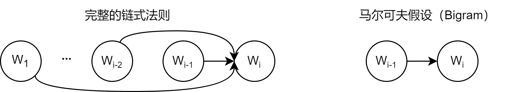
  <p>图 3.1 马尔可夫假设示意图</p>  
</div>

为了解决这个问题，研究者引入了**马尔可夫假设 (Markov Assumption)**。其核心思想是：我们不必回溯一个词的全部历史，可以近似地认为，一个词的出现概率只与它前面有限的 $n-1$ 个词有关，如图 3.1 所示。基于这个假设建立的语言模型，我们称之为 **N-gram 模型**。这里的 "N" 代表我们考虑的上下文窗口大小。让我们来看几个最常见的例子来理解这个概念：

- **Bigram（当 N=2 时）**：这是最简单的情况，我们假设一个词的出现只与它前面的一个词有关。因此，链式法则中复杂的条件概率 $P(w_i \mid w_1, \cdots, w_{i-1})$ 就可以被近似为更容易计算的形式：

$$
P(w_i \mid w_1, \cdots, w_{i-1}) \approx P(w_i \mid w_{i-1})
$$

- **Trigram（当 N=3 时）**：类似地，我们假设一个词的出现只与它前面的两个词有关：

$$
P(w_i \mid w_1, \cdots, w_{i-1}) \approx P(w_i \mid w_{i-2}, w_{i-1})
$$

这些概率可以通过在大型语料库中进行**最大似然估计 (Maximum Likelihood Estimation, MLE)** 来计算。这个术语听起来很复杂，但其思想非常直观：最可能出现的，就是我们在数据中看到次数最多的。例如，对于 Bigram 模型，我们想计算在词 $w_{i-1}$ 出现后，下一个词是 $w_i$ 的概率 $P(w_i \mid w_{i-1})$。根据最大似然估计，这个概率可以通过简单的计数来估算：

$$
P(w_i \mid w_{i-1}) = \frac{\text{Count}(w_{i-1}, w_i)}{\text{Count}(w_{i-1})}
$$

这里的 `Count()` 函数就代表“计数”：

- $\text{Count}(w_{i-1}, w_i)$：表示词对 $(w_{i-1}, w_i)$ 在语料库中连续出现的总次数。
- $\text{Count}(w_{i-1})$：表示单个词 $w_{i-1}$ 在语料库中出现的总次数。

公式的含义就是：我们用“词对 $\text{Count}(w_{i-1}, w_i)$ 出现的次数”除以“词 $\text{Count}(w_{i-1})$ 出现的总次数”，来作为 $P(w_i \mid w_{i-1})$ 的一个近似估计。

为了让这个过程更具体，我们来手动进行一次计算。假设我们拥有一个仅包含以下两句话的迷你语料库：`lucas agent learns`、`lucas agent works`。我们的目标是：使用 Bigram（N=2）模型，估算句子 `lucas agent learns` 出现的概率。根据 Bigram 的假设，我们每次会考察连续的两个词（即一个词对）。

**第一步：计算第一个词的概率** $P(\text{lucas})$。这是 `lucas` 出现的次数除以总词数。`lucas` 出现了 2 次，总词数是 6。

$$
P(\text{lucas}) = \frac{\text{总语料中 "lucas" 的数量}}{\text{总语料的词数}} = \frac{2}{6} \approx 0.333
$$

**第二步：计算条件概率** $P(\text{agent} \mid \text{lucas})$。这是词对 `lucas agent` 出现的次数除以 `lucas` 出现的总次数。`lucas agent` 出现了 2 次，`lucas` 出现了 2 次。

$$
P(\text{agent} \mid \text{lucas}) = \frac{\text{Count}(\text{lucas agent})}{\text{Count}(\text{lucas})} = \frac{2}{2} = 1
$$

**第三步：计算条件概率** $P(\text{learns} \mid \text{agent})$。这是词对 `agent learns` 出现的次数除以 `agent` 出现的总次数。`agent learns` 出现了 1 次，`agent` 出现了 2 次。

$$
P(\text{learns} \mid \text{agent}) = \frac{\text{Count}(\text{agent learns})}{\text{Count}(\text{agent})} = \frac{1}{2} = 0.5
$$

**最后：将概率连乘。** 所以，整个句子的近似概率为：

$$
P(\text{lucas agent learns}) \approx P(\text{lucas}) \cdot P(\text{agent} \mid \text{lucas}) \cdot P(\text{learns} \mid \text{agent}) \approx 0.333 \cdot 1 \cdot 0.5 \approx 0.167
$$

```python
import collections

if __name__ == "__main__":
    # 示例语料库，与上方案例讲解中的语料库保持一致
    corpus = "lucas agent learns lucas agent works"
    tokens = corpus.split()
    total_tokens = len(tokens)

    # --- 第一步:计算 P(lucas) ---
    count_lucas = tokens.count('lucas')
    p_lucas = count_lucas / total_tokens
    print(f"第一步: P(lucas) = {count_lucas}/{total_tokens} = {p_lucas:.3f}")

    # --- 第二步:计算 P(agent|lucas) ---
    # 先计算 bigrams 用于后续步骤
    bigrams = zip(tokens, tokens[1:])
    bigram_counts = collections.Counter(bigrams)
    count_lucas_agent = bigram_counts[('lucas', 'agent')]
    # count_lucas 已在第一步计算
    p_agent_given_lucas = count_lucas_agent / count_lucas
    print(f"第二步: P(agent|lucas) = {count_lucas_agent}/{count_lucas} = {p_agent_given_lucas:.3f}")

    # --- 第三步:计算 P(learns|agent) ---
    count_agent_learns = bigram_counts[('agent', 'learns')]
    count_agent = tokens.count('agent')
    p_learns_given_agent = count_agent_learns / count_agent
    print(f"第三步: P(learns|agent) = {count_agent_learns}/{count_agent} = {p_learns_given_agent:.3f}")

    # --- 最后:将概率连乘 ---
    p_sentence = p_lucas * p_agent_given_lucas * p_learns_given_agent
    print(
        f"最后: P('lucas agent learns') ≈ {p_lucas:.3f} * {p_agent_given_lucas:.3f} * {p_learns_given_agent:.3f} = {p_sentence:.3f}")
```

输出结果：

```text
第一步: P(lucas) = 2/6 = 0.333
第二步: P(agent|lucas) = 2/2 = 1.000
第三步: P(learns|agent) = 1/2 = 0.500
最后: P('lucas agent learns') ≈ 0.333 * 1.000 * 0.500 = 0.167
```

N-gram 模型虽然简单有效，但有两个致命缺陷：

1. **数据稀疏性 (Sparsity)**：如果一个词序列从未在语料库中出现，其概率估计就为 0，这显然是不合理的。虽然可以通过平滑 (Smoothing) 技术缓解，但无法根除。
2. **泛化能力差**：模型无法理解词与词之间的语义相似性。例如，即使模型在语料库中见过很多次 `agent learns`，它也无法将这个知识泛化到语义相似的词上。当我们计算 `robot learns` 的概率时，如果 `robot` 这个词从未出现过，或者 `robot learns` 这个组合从未出现过，模型计算出的概率也会是零。模型无法理解 `agent` 和 `robot` 在语义上的相似性。

### FNN

#### 神经网络语言模型与词嵌入

N-gram 模型的根本缺陷在于它将词视为孤立、离散的符号。为了克服这个问题，研究者们转向了神经网络，并提出了一种思想：用连续的向量来表示词。2003 年，Bengio 等人提出的**前馈神经网络语言模型 (Feedforward Neural Network Language Model)** 是这一领域的里程碑。

其核心思想可以分为两步：

1. **构建一个语义空间**：创建一个高维的连续向量空间，然后将词汇表中的每个词都映射为该空间中的一个点。这个点（即向量）就被称为**词嵌入 (Word Embedding)** 或词向量。在这个空间里，语义上相近的词，它们对应的向量在空间中的位置也相近。例如，`agent` 和 `robot` 的向量会靠得很近，而 `agent` 和 `apple` 的向量会离得很远。
2. **学习从上下文到下一个词的映射**：利用神经网络的强大拟合能力，来学习一个函数。这个函数的输入是前 $n-1$ 个词的词向量，输出是词汇表中每个词在当前上下文后出现的概率分布。

<div align="center">  
    
  <p>图 3.2 神经网络语言模型架构示意图</p>  
</div>

如图 3.2 所示，在这个架构中，词嵌入是在模型训练过程中自动学习得到的。模型为了完成“预测下一个词”这个任务，会不断调整每个词的向量位置，最终使这些向量能够蕴含丰富的语义信息。一旦我们将词转换成了向量，我们就可以用数学工具来度量它们之间的关系。最常用的方法是**余弦相似度 (Cosine Similarity)**，它通过计算两个向量夹角的余弦值来衡量它们的相似性。

$$
\text{similarity}(\vec{a}, \vec{b}) = \cos(\theta) = \frac{\vec{a} \cdot \vec{b}}{|\vec{a}|\,|\vec{b}|}
$$

这个公式的含义是：

- 如果两个向量方向完全相同，夹角为 0°，余弦值为 1，表示完全相关。
- 如果两个向量方向正交，夹角为 90°，余弦值为 0，表示毫无关系。
- 如果两个向量方向完全相反，夹角为 180°，余弦值为 -1，表示完全负相关。

通过这种方式，词向量不仅能捕捉到“同义词”这类简单的关系，还能捕捉到更复杂的类比关系。

一个著名的例子展示了词向量捕捉到的语义关系：`vector('King') - vector('Man') + vector('Woman')` 这个向量运算的结果，在向量空间中与 `vector('Queen')` 的位置惊人地接近。这好比在进行语义的平移：我们从“国王”这个点出发，减去“男性”的向量，再加上“女性”的向量，最终就抵达了“女王”的位置。这证明了词嵌入能够学习到“性别”、“皇室”这类抽象概念。

```python
import numpy as np

# 假设我们已经学习到了简化的二维词向量
embeddings = {
    "king": np.array([0.9, 0.8]),
    "queen": np.array([0.9, 0.2]),
    "man": np.array([0.7, 0.9]),
    "woman": np.array([0.7, 0.3]),
}


def cosine_similarity(vec1, vec2):
    dot_product = np.dot(vec1, vec2)
    norm_product = np.linalg.norm(vec1) * np.linalg.norm(vec2)
    return dot_product / norm_product


# king - man + woman
result_vec = embeddings["king"] - embeddings["man"] + embeddings["woman"]

# 计算结果向量与 "queen" 的相似度
sim = cosine_similarity(result_vec, embeddings["queen"])

print(f"king - man + woman 的结果向量: {result_vec}")
print(f"该结果与 'queen' 的相似度: {sim:.4f}")
```

输出结果：

```text
king - man + woman 的结果向量: [0.9 0.2]
该结果与 'queen' 的相似度: 1.0000
```

神经网络语言模型通过词嵌入，成功解决了 N-gram 模型的泛化能力差的问题。然而，它仍然有一个类似 N-gram 的限制：上下文窗口是固定的。它只能考虑固定数量的前文，这为能处理任意长序列的循环神经网络埋下了伏笔。

### RNN

#### 循环神经网络（RNN）

前一节的神经网络语言模型虽然引入了词嵌入解决了泛化问题，但它和 N-gram 模型一样，上下文窗口是固定大小的。为了预测下一个词，它只能看到前 $n-1$ 个词，再早的历史信息就被丢弃了。这显然不符合我们人类理解语言的方式。为了打破固定窗口的限制，**循环神经网络 (Recurrent Neural Network, RNN)** 应运而生，其核心思想非常直观：为网络增加“记忆”能力。

传统神经网络算法存在局限：

- **输入输出一一对应**：传统神经网络算法通常是一个输入对应一个输出，这种严格的对应关系限制了其在处理复杂任务时的灵活性。
- **输入之间的独立性**：在传统神经网络算法中，不同的输入之间被视为相互独立的，没有考虑到它们之间的关联性。

<div align="center">
  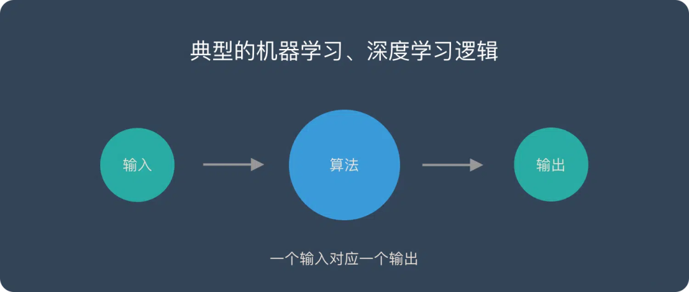
  <p>图 3.3 RNN 解决的问题</p>
</div>

RNN 的解决思路：

- **序列数据处理**：RNN 能够处理**多个输入对应多个输出**的情况，尤其适用于序列数据，如时间序列、语音或文本，其中每个输出与**当前的及之前的输入都有关**。
- **循环连接**：RNN 中的循环连接使得网络能够**捕捉输入之间的关联性**，从而利用先前的输入信息来影响后续的输出。

#### 网络构成

- **输入层**：接收输入数据，并将其传递给隐藏层。输入不仅仅是静态的，还包含着序列中的历史信息。
- **隐藏层**：核心部分，捕捉时序依赖性。隐藏层的输出不仅取决于当前的输入，还取决于前一时刻的隐藏状态。
- **输出层**：根据隐藏层的输出生成最终的预测结果。

<div align="center">
  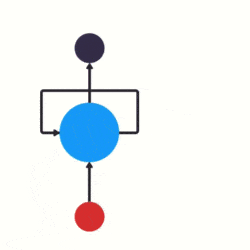
  <p>图 3.4 输入层 - 隐藏层 - 输出层</p>
</div>

<div align="center">
  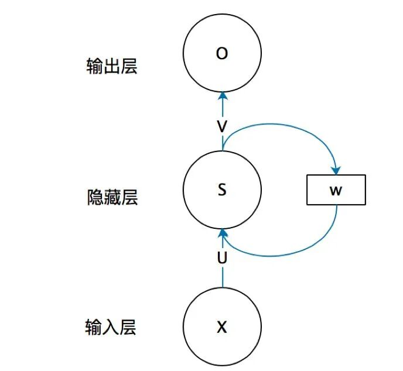
  <p>图 3.5 RNN 网络结构</p>
</div>

#### RNN 核心公式回顾

$$
h_t = \tanh(W_{xh}\,x_t + W_{hh}\,h_{t-1} + b_h)
$$

$$
\hat{y}_t = W_{hy}\,h_t + b_y
$$

$$
P(y_t) = \text{softmax}(\hat{y}_t)
$$

其中 $x_t$ 是当前输入，$h_{t-1}$ 是上一时刻隐藏状态，$h_t$ 是当前隐藏状态。

如图 3.6 所示，RNN 的设计引入了一个**隐藏状态 (Hidden State)** 向量，我们可以将其理解为网络的短期记忆。在处理序列的每一步，网络都会读取当前的输入词，并结合它上一刻的记忆（即上一个时间步的隐藏状态），然后生成一个新的记忆（即当前时间步的隐藏状态）传递给下一刻。这个循环往复的过程，使得信息可以在序列中不断向后传递。

<div align="center">
  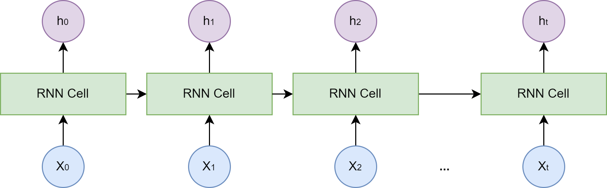
  <p>图 3.6 RNN 结构示意图</p>
</div>

#### 意图识别示例

下面通过一个具体的案例来看看 RNN 的基本原理。例如，用户说了一句 “what time is it?”，**需要判断用户的说话意图，是问时间，还是问天气？**

- **输入层**：先对句子 “what time is it?” 进行分词，然后按照顺序输入。

<div align="center">
  
  <p>图 3.7 对句子进行分词</p>
</div>

- **隐藏层**：在此过程中，我们注意到前面的所有输入都对后续的输出产生了影响。隐藏层不仅考虑了当前的输入，还综合了之前所有的输入信息，**能够利用历史信息来影响未来的输出**。

<div align="center">
  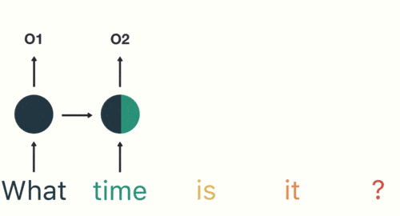
  <p>图 3.8 前面所有的输入都对后续的输出产生了影响</p>
</div>

- **输出层**：生成最终的预测结果：Asking for the time。

<div align="center">
  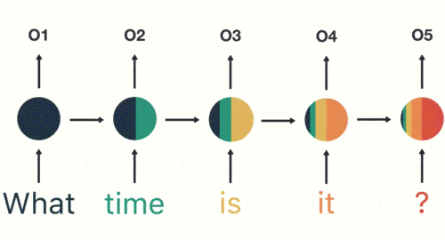
  <p>图 3.9 输出结果：Asking for the time</p>
</div>

```python
import numpy as np


def softmax(x):
    x = x - np.max(x, axis=-1, keepdims=True)
    exp_x = np.exp(x)
    return exp_x / np.sum(exp_x, axis=-1, keepdims=True)


class RNNCell:
    def __init__(self, input_size, hidden_size, output_size):
        self.input_size = input_size
        self.hidden_size = hidden_size
        self.output_size = output_size

        # 输入到隐藏状态
        self.W_xh = np.random.randn(input_size, hidden_size) * 0.1
        # 上一隐藏状态到当前隐藏状态
        self.W_hh = np.random.randn(hidden_size, hidden_size) * 0.1
        # 隐藏状态到输出
        self.W_hy = np.random.randn(hidden_size, output_size) * 0.1

        self.b_h = np.zeros((1, hidden_size))
        self.b_y = np.zeros((1, output_size))

    def forward(self, x_t, h_prev):
        # x_t: (batch, input_size)
        # h_prev: (batch, hidden_size)
        h_t = np.tanh(x_t @ self.W_xh + h_prev @ self.W_hh + self.b_h)
        y_t = h_t @ self.W_hy + self.b_y
        probs = softmax(y_t)
        return h_t, probs


class SimpleRNN:
    def __init__(self, input_size, hidden_size, output_size):
        self.cell = RNNCell(input_size, hidden_size, output_size)
        self.hidden_size = hidden_size

    def forward(self, inputs, h0=None):
        # inputs: (seq_len, batch, input_size)
        seq_len, batch, _ = inputs.shape

        if h0 is None:
            h0 = np.zeros((batch, self.hidden_size))

        h = h0
        h_states = []
        outputs = []

        for t in range(seq_len):
            h, probs = self.cell.forward(inputs[t], h)
            h_states.append(h)
            outputs.append(probs)

        h_states = np.stack(h_states, axis=0)  # (seq_len, batch, hidden_size)
        outputs = np.stack(outputs, axis=0)    # (seq_len, batch, output_size)
        return h_states, outputs


# -------------------------
# 运行示例
# -------------------------
np.random.seed(0)

seq_len = 5
batch_size = 2
input_size = 4
hidden_size = 6
output_size = 3

rnn = SimpleRNN(input_size, hidden_size, output_size)
inputs = np.random.randn(seq_len, batch_size, input_size)

h_states, outputs = rnn.forward(inputs)

print("输入形状:", inputs.shape)
print("隐藏状态序列形状:", h_states.shape)
print("输出概率序列形状:", outputs.shape)
print("第一个时间步、第一个样本的输出概率:", outputs[0, 0])
print("第一个时间步、第一个样本的预测类别:", np.argmax(outputs[0, 0]))
```

输出结果：

```text
输入形状: (5, 2, 4)
隐藏状态序列形状: (5, 2, 6)
输出概率序列形状: (5, 2, 3)
第一个时间步、第一个样本的输出概率: [0.34190833 0.32406427 0.3340274 ]
第一个时间步、第一个样本的预测类别: 0
```

然而，标准的 RNN 在实践中存在一个严重的问题：**长期依赖问题 (Long-term Dependency Problem)**。在训练过程中，模型需要通过反向传播算法根据输出端的误差来调整网络深处的权重。

对于 RNN 而言，序列的长度就是网络的深度。当序列很长时，梯度在从后向前传播的过程中会经过多次连乘，这会导致梯度值快速趋向于零（**梯度消失**）或变得极大（**梯度爆炸**）。梯度消失使得模型无法有效学习到序列早期信息对后期输出的影响，即难以捕捉长距离的依赖关系。

#### 从 RNN 到 LSTM

标准 RNN 的梯度可以写成沿时间的连乘：

$$
\frac{\partial h_t}{\partial h_k} = \prod_{i=k+1}^{t} \frac{\partial h_i}{\partial h_{i-1}}, \quad \frac{\partial h_i}{\partial h_{i-1}} = \mathrm{diag}\big(1 - h_i^2\big) W_{hh}
$$

<div align="center">
  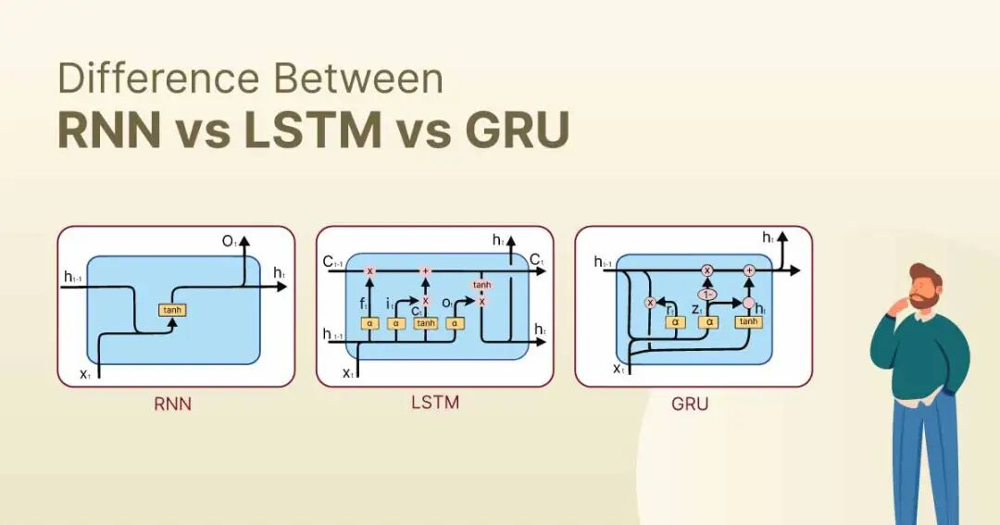
  <p>图 3.10 RNN 的优化算法</p>
</div>

RNN 的优化主要围绕以下两个问题展开：

- **处理长序列数据**：RNN 在处理长序列数据时，很难记住很久之前的输入信息。就像你试图回忆几年前的某件事情，可能会觉得很难。LSTM 通过引入“细胞状态”这个概念，就像一个记事本，可以一直记住前面的信息，解决了这个问题。
- **梯度消失和爆炸**：想象一下，你正在爬楼梯，后面的楼梯突然消失了，这就是 RNN 在处理时间序列数据时面临的问题。LSTM 通过引入“门控机制”，即一种选择性记忆的方式，保留重要信息并忽略不重要信息。说人话就是，敲黑板、划重点。

<div align="center">
  
  <p>图 3.11 RNN 与 LSTM 对比</p>
</div>

### LSTM

为了解决长期依赖问题，**长短时记忆网络 (Long Short-Term Memory, LSTM)** 被设计出来。LSTM 是一种特殊的 RNN，其核心创新在于引入了**细胞状态 (Cell State)** 和一套精密的**门控机制 (Gating Mechanism)**。

<div align="center">
  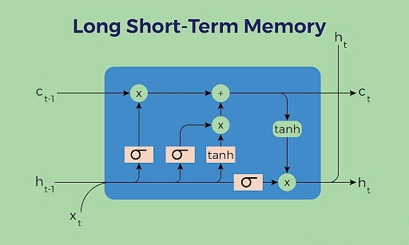
  <p>图 3.12 LSTM 总览</p>
</div>

细胞状态可以看作是一条独立于隐藏状态的信息通路，允许信息在时间步之间更顺畅地传递。门控机制则是由几个小型神经网络构成，它们可以学习如何有选择地让信息通过，从而控制细胞状态中信息的增加与移除。这些门包括：

- **遗忘门 (Forget Gate)**：决定从上一时刻的细胞状态中丢弃哪些信息。
- **输入门 (Input Gate)**：决定将当前输入中的哪些新信息存入细胞状态。
- **输出门 (Output Gate)**：决定根据当前的细胞状态，输出哪些信息到隐藏状态。

#### LSTM 的本质

RNN 面临的核心问题是短时记忆与梯度消失 / 梯度爆炸，这正是 LSTM 要解决的。

##### 短时记忆问题

- **描述**：RNN 在处理长序列时，由于信息的传递是通过隐藏状态进行的，随着时间的推移，较早时间步的信息可能会在传递到后面的时间步时逐渐消失或被覆盖。
- **影响**：这导致 RNN 难以捕捉和利用序列中的长期依赖关系，从而限制了其在处理复杂任务时的性能。

##### 梯度消失 / 梯度爆炸问题

- **描述**：在 RNN 的反向传播过程中，梯度会随着时间步的推移而逐渐消失（变得非常小）或爆炸（变得非常大）。
- **影响**：梯度消失使得 RNN 在训练时难以学习到长期依赖关系，因为较早时间步的梯度信息在反向传播到初始层时几乎为零。梯度爆炸则可能导致训练过程不稳定，权重更新过大，甚至导致数值溢出。

其根源同样在于 BPTT 中梯度的连乘：

$$
\frac{\partial h_t}{\partial h_k} = \prod_{i=k+1}^{t} \frac{\partial h_i}{\partial h_{i-1}}, \quad \frac{\partial h_i}{\partial h_{i-1}} = \mathrm{diag}\big(1 - h_i^2\big) W_{hh}
$$

<div align="center">
  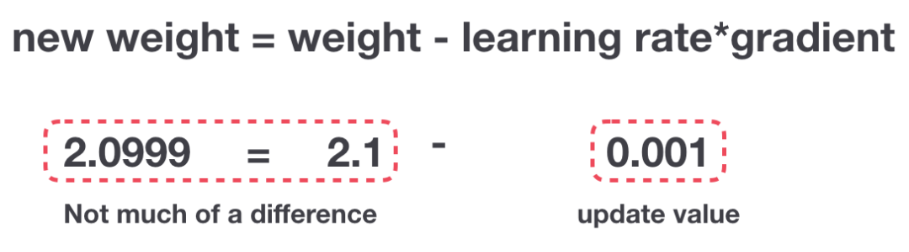
  <p>图 3.13 梯度更新规则</p>
</div>

LSTM 的解决思路：大脑和 LSTM 在处理信息时都选择性地保留重要信息，忽略不相关细节，并据此进行后续处理。这种机制使它们能够高效地处理和输出关键信息。

<div align="center">
  
  <p>图 3.14 大脑记忆机制</p>
</div>

- **大脑记忆机制**：当浏览评论时，大脑倾向于记住重要的关键词。无关紧要的词汇和内容容易被忽略。回忆时，大脑提取并表达主要观点，忽略细节。
- **LSTM 门控机制**：LSTM 通过输入门、遗忘门和输出门选择性地保留或忘记信息，使用保留的相关信息来进行预测，类似于大脑提取并表达主要观点。

#### 从 RNN 隐藏状态到 LSTM

RNN 工作原理：第一个词被转换成了机器可读的向量，然后 RNN 逐个处理向量序列。

<div align="center">
  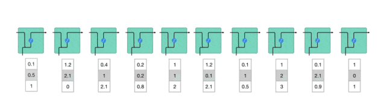
  <p>图 3.15 逐一处理矢量序列</p>
</div>

隐藏状态的传递：

- **过程描述**：在处理序列数据时，RNN 将前一时间步的隐藏状态传递给下一个时间步。
- **作用**：隐藏状态充当了神经网络的“记忆”，它包含了网络之前所见过的数据的相关信息。
- **重要性**：这种传递机制使得 RNN 能够捕捉序列中的时序依赖关系。

<div align="center">
  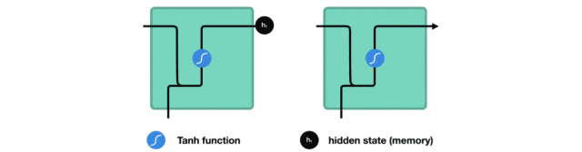
  <p>图 3.16 将隐藏状态传递给下一个时间步</p>
</div>

隐藏状态的计算：

- **细胞结构**：RNN 的一个细胞接收当前时间步的输入和前一时间步的隐藏状态。
- **组合方式**：当前输入和先前隐藏状态被组合成一个向量，这个向量融合了当前和先前的信息。
- **激活函数**：组合后的向量经过一个 tanh 激活函数的处理，输出新的隐藏状态。

<div align="center">
  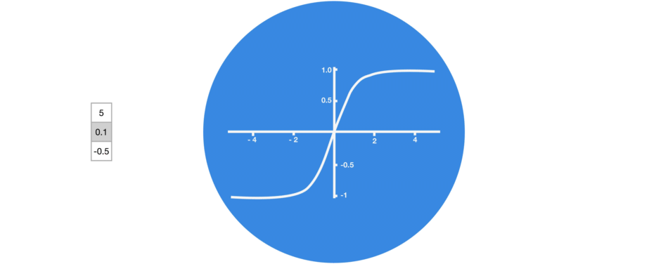
  <p>图 3.17 tanh 激活函数（区间 -1～1）</p>
</div>

<div align="center">
  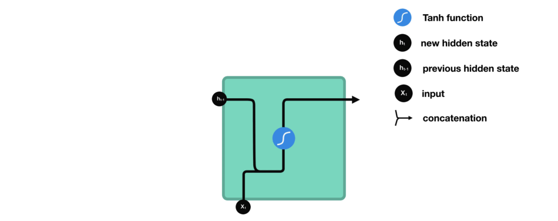
  <p>图 3.18 输出新的隐藏状态</p>
</div>

#### LSTM 工作原理

<div align="center">
  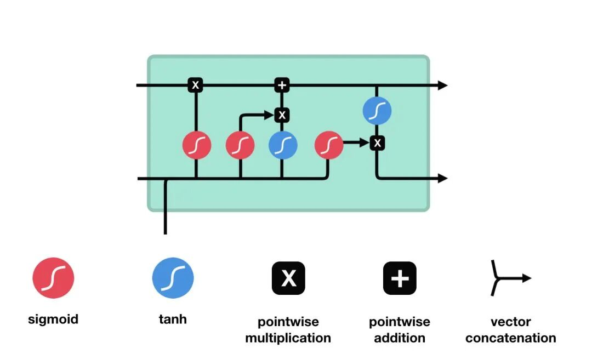
  <p>图 3.19 LSTM 工作原理</p>
</div>

#### LSTM 的细胞结构和运算

LSTM 通过门控机制对细胞状态进行读、写与重置。

##### 输入门

**作用**：决定哪些新信息应该被添加到记忆单元中。

**组成**：输入门由一个 sigmoid 激活函数和一个 tanh 激活函数组成。sigmoid 函数决定哪些信息是重要的，而 tanh 函数则生成新的候选信息。

**运算**：输入门的输出与候选信息相乘，得到的结果将在记忆单元更新时被考虑。

<div align="center">
  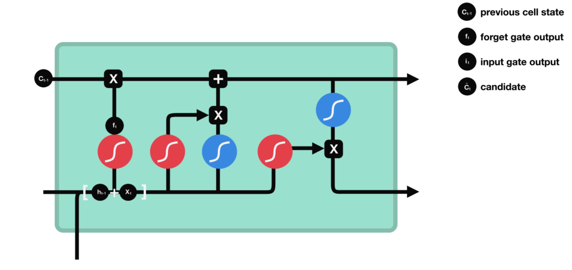
  <p>图 3.20 输入门（sigmoid 激活函数 + tanh 激活函数）</p>
</div>

##### 遗忘门

**作用**：决定哪些旧信息应该从记忆单元中遗忘或移除。

**组成**：遗忘门仅由一个 sigmoid 激活函数组成。

<div align="center">
  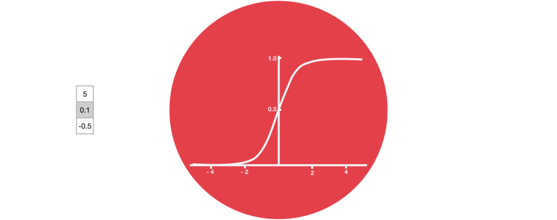
  <p>图 3.21 sigmoid 激活函数（区间 0～1）</p>
</div>

**运算**：sigmoid 函数的输出直接与记忆单元的当前状态相乘，用于决定哪些信息应该被保留，哪些应该被遗忘。输出值越接近 1 的信息将被保留，而输出值越接近 0 的信息将被遗忘。

<div align="center">
  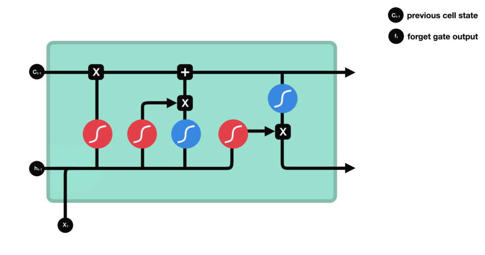
  <p>图 3.22 遗忘门（sigmoid 激活函数）</p>
</div>

##### 输出门

**作用**：决定记忆单元中的哪些信息应该被输出到当前时间步的隐藏状态中。

**组成**：输出门同样由一个 sigmoid 激活函数和一个 tanh 激活函数组成。sigmoid 函数决定哪些信息应该被输出，而 tanh 函数则处理记忆单元的状态以准备输出。

**运算**：sigmoid 函数的输出与经过 tanh 函数处理的记忆单元状态相乘，得到的结果即为当前时间步的隐藏状态。

<div align="center">
  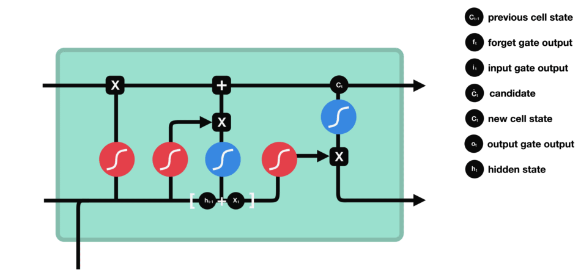
  <p>图 3.23 输出门（sigmoid 激活函数 + tanh 激活函数）</p>
</div>

#### LSTM 核心公式

LSTM 在每一个时间步 $t$ 接收当前输入 $x_t$、上一时刻隐藏状态 $h_{t-1}$ 和上一时刻细胞状态 $C_{t-1}$，并计算新的 $h_t$ 与 $C_t$。其核心公式如下。

**遗忘门：决定丢弃哪些旧信息**

$$
f_t = \sigma(W_f [h_{t-1}, x_t] + b_f)
$$

**输入门：决定写入哪些新信息**

$$
i_t = \sigma(W_i [h_{t-1}, x_t] + b_i)
$$

**候选细胞状态：生成新的候选记忆**

$$
\tilde{C}_t = \tanh(W_C [h_{t-1}, x_t] + b_C)
$$

**细胞状态更新：旧记忆按遗忘门保留，新候选按输入门写入**

$$
C_t = f_t \odot C_{t-1} + i_t \odot \tilde{C}_t
$$

**输出门：决定当前细胞状态中哪些部分输出到隐藏状态**

$$
o_t = \sigma(W_o [h_{t-1}, x_t] + b_o)
$$

**隐藏状态更新**

$$
h_t = o_t \odot \tanh(C_t)
$$

其中 $\sigma$ 是 Sigmoid 函数，$\tanh$ 是双曲正切函数，$\odot$ 表示逐元素相乘，$[h_{t-1}, x_t]$ 表示向量拼接。

与标准 RNN 相比，LSTM 的细胞状态像一条“信息高速公路”，门控机制则像开关，能够缓解梯度消失问题，使模型更容易捕捉长距离依赖。不过，LSTM 仍然需要按时间步串行计算，难以像 Transformer 那样充分并行化。

下面给出一个可运行的 NumPy 版 LSTM 单元前向传播示例。代码中分别为输入门、遗忘门、输出门与候选状态维护独立的权重矩阵，其中 $g$ 对应候选细胞状态 $\tilde{C}_t$。

```python
import numpy as np

def sigmoid(x):
    return 1 / (1 + np.exp(-x))

class LSTMCell:
    def __init__(self, input_size, hidden_size):
        self.input_size = input_size
        self.hidden_size = hidden_size
        scale = 0.1
        # 输入到门的权重
        self.W_i = np.random.randn(hidden_size, input_size) * scale
        self.W_f = np.random.randn(hidden_size, input_size) * scale
        self.W_o = np.random.randn(hidden_size, input_size) * scale
        self.W_g = np.random.randn(hidden_size, input_size) * scale
        # 隐藏状态到门的权重
        self.U_i = np.random.randn(hidden_size, hidden_size) * scale
        self.U_f = np.random.randn(hidden_size, hidden_size) * scale
        self.U_o = np.random.randn(hidden_size, hidden_size) * scale
        self.U_g = np.random.randn(hidden_size, hidden_size) * scale
        # 偏置
        self.b_i = np.zeros((hidden_size, 1))
        self.b_f = np.zeros((hidden_size, 1))
        self.b_o = np.zeros((hidden_size, 1))
        self.b_g = np.zeros((hidden_size, 1))

    def forward(self, x_t, h_prev, c_prev):
        # x_t: (input_size, 1)
        i_t = sigmoid(self.W_i @ x_t + self.U_i @ h_prev + self.b_i)
        f_t = sigmoid(self.W_f @ x_t + self.U_f @ h_prev + self.b_f)
        o_t = sigmoid(self.W_o @ x_t + self.U_o @ h_prev + self.b_o)
        g_t = np.tanh(self.W_g @ x_t + self.U_g @ h_prev + self.b_g)
        c_t = f_t * c_prev + i_t * g_t
        h_t = o_t * np.tanh(c_t)
        return h_t, c_t, (i_t, f_t, o_t, g_t)

if __name__ == '__main__':
    # 示例
    np.random.seed(42)
    input_size, hidden_size = 4, 5
    lstm = LSTMCell(input_size, hidden_size)
    x_t = np.random.randn(input_size, 1)
    h_prev = np.zeros((hidden_size, 1))
    c_prev = np.zeros((hidden_size, 1))
    h_t, c_t, gates = lstm.forward(x_t, h_prev, c_prev)
    print("h_t shape:", h_t.shape)
    print("c_t shape:", c_t.shape)
    print("遗忘门 f_t:", gates[1].ravel())
```

输出结果：

```text
h_t shape: (5, 1)
c_t shape: (5, 1)
遗忘门 f_t: [0.50876953 0.52443486 0.53524803 0.48571138 0.58243442]
```

#### 应用：机器翻译

<div align="center">
  
  <p>图 3.24 机器翻译</p>
</div>

**应用描述**：LSTM 在机器翻译中用于将源语言句子自动翻译成目标语言句子。

**关键组件**：

- **编码器（Encoder）**：一个 LSTM 网络，负责接收源语言句子并将其编码成一个固定长度的上下文向量。
- **解码器（Decoder）**：另一个 LSTM 网络，根据上下文向量生成目标语言的翻译句子。

**流程**：

1. **源语言输入**：将源语言句子分词并转换为词向量序列。
2. **编码**：使用编码器 LSTM 处理源语言词向量序列，输出上下文向量。
3. **初始化解码器**：将上下文向量作为解码器 LSTM 的初始隐藏状态。
4. **解码**：解码器 LSTM 逐步生成目标语言的词序列，直到生成完整的翻译句子。
5. **目标语言输出**：将解码器生成的词序列转换为目标语言句子。

**优化**：通过比较生成的翻译句子与真实目标句子，使用反向传播算法优化 LSTM 模型的参数，以提高翻译质量。

#### 应用：情感分析

<div align="center">
  
  <p>图 3.25 情感分析</p>
</div>

**应用描述**：LSTM 用于对文本进行情感分析，判断其情感倾向（积极、消极或中立）。

**关键组件**：

- **LSTM 网络**：接收文本序列并提取情感特征。
- **分类层**：根据 LSTM 提取的特征进行情感分类。

**流程**：

1. **文本预处理**：将文本分词、去除停用词等预处理操作。
2. **文本表示**：将预处理后的文本转换为词向量序列。
3. **特征提取**：使用 LSTM 网络处理词向量序列，提取文本中的情感特征。
4. **情感分类**：将 LSTM 提取的特征输入到分类层进行分类，得到情感倾向。
5. **输出**：输出文本的情感倾向（积极、消极或中立）。

**优化**：通过比较预测的情感倾向与真实标签，使用反向传播算法优化 LSTM 模型的参数，以提高情感分析的准确性。

### GRU

GRU（Gated Recurrent Unit，门控循环单元）是 LSTM 的简化变体。它把 LSTM 中的遗忘门和输入门合并为一个**更新门** $z_t$，并引入一个**重置门** $r_t$，从而在保持长距离依赖建模能力的同时减少参数量。

#### 从 LSTM 到 GRU

- **结构和参数简化**：GRU 相比于 LSTM，结构和参数都简化了。这意味着 GRU 需要的存储空间更小，计算速度更快。
- **计算效率提升**：GRU 相比于 LSTM，计算更高效。这在需要快速响应或计算资源有限的场景中非常有用。

<div align="center">
  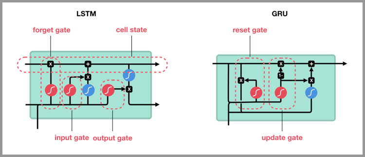
  <p>图 3.26 LSTM 与 GRU 对比</p>
</div>

#### GRU 核心公式

GRU 在时间步 $t$ 的核心公式如下：

$$
z_t = \sigma(W_z [h_{t-1}, x_t] + b_z)
$$

$$
r_t = \sigma(W_r [h_{t-1}, x_t] + b_r)
$$

$$
\tilde{h}_t = \tanh(W_{xn} x_t + W_{hn} (r_t \odot h_{t-1}) + b_n)
$$

$$
h_t = (1 - z_t) \odot \tilde{h}_t + z_t \odot h_{t-1}
$$

其中：

- $x_t$ 是当前输入；
- $h_{t-1}$ 是上一时刻隐藏状态；
- $z_t$ 是更新门，控制旧状态与新候选状态的比例；
- $r_t$ 是重置门，控制上一时刻隐藏状态被保留多少；
- $\tilde{h}_t$ 是候选隐藏状态；
- $\sigma$ 是 Sigmoid 函数；
- $\odot$ 表示逐元素相乘。

下面给出 NumPy 手写版 GRU 前向传播代码，可直接运行。

```python
import numpy as np

def sigmoid(x):
    return 1.0 / (1.0 + np.exp(-x))

def softmax(x):
    x = x - np.max(x, axis=-1, keepdims=True)
    exp_x = np.exp(x)
    return exp_x / np.sum(exp_x, axis=-1, keepdims=True)

class GRUCell:
    def __init__(self, input_size, hidden_size):
        self.input_size = input_size
        self.hidden_size = hidden_size
        scale = 1.0 / np.sqrt(hidden_size)

        # 更新门 z_t：输入 x_t 与上一隐藏状态 h_{t-1} 拼接后计算
        self.W_z = np.random.randn(input_size + hidden_size, hidden_size) * scale
        self.b_z = np.zeros((1, hidden_size))

        # 重置门 r_t：输入 x_t 与上一隐藏状态 h_{t-1} 拼接后计算
        self.W_r = np.random.randn(input_size + hidden_size, hidden_size) * scale
        self.b_r = np.zeros((1, hidden_size))

        # 候选隐藏状态：x_t 与 (r_t * h_{t-1}) 分别做线性变换
        self.W_xn = np.random.randn(input_size, hidden_size) * scale
        self.W_hn = np.random.randn(hidden_size, hidden_size) * scale
        self.b_n = np.zeros((1, hidden_size))

    def forward(self, x_t, h_prev):
        # x_t: (batch, input_size)
        # h_prev: (batch, hidden_size)

        concat = np.concatenate([x_t, h_prev], axis=1)

        z_t = sigmoid(concat @ self.W_z + self.b_z)
        r_t = sigmoid(concat @ self.W_r + self.b_r)

        n_t = np.tanh(
            x_t @ self.W_xn +
            (r_t * h_prev) @ self.W_hn +
            self.b_n
        )

        h_t = (1.0 - z_t) * n_t + z_t * h_prev
        return h_t


class SimpleGRU:
    def __init__(self, input_size, hidden_size, output_size):
        self.cell = GRUCell(input_size, hidden_size)
        self.hidden_size = hidden_size

        # 隐藏状态到输出层
        self.W_hy = np.random.randn(hidden_size, output_size) * 0.1
        self.b_y = np.zeros((1, output_size))

    def forward(self, inputs, h0=None):
        # inputs: (seq_len, batch, input_size)
        seq_len, batch, _ = inputs.shape

        if h0 is None:
            h0 = np.zeros((batch, self.hidden_size))

        h = h0
        h_states = []
        outputs = []

        for t in range(seq_len):
            h = self.cell.forward(inputs[t], h)
            y = h @ self.W_hy + self.b_y
            probs = softmax(y)

            h_states.append(h)
            outputs.append(probs)

        h_states = np.stack(h_states, axis=0)  # (seq_len, batch, hidden_size)
        outputs = np.stack(outputs, axis=0)    # (seq_len, batch, output_size)
        return h_states, outputs


# -------------------------
# 运行示例
# -------------------------
np.random.seed(42)

seq_len = 5
batch_size = 2
input_size = 4
hidden_size = 6
output_size = 3

gru = SimpleGRU(input_size, hidden_size, output_size)
inputs = np.random.randn(seq_len, batch_size, input_size)

h_states, outputs = gru.forward(inputs)

print("输入形状:", inputs.shape)
print("隐藏状态序列形状:", h_states.shape)
print("输出概率序列形状:", outputs.shape)
print("第一个时间步、第一个样本的输出概率:", outputs[0, 0])
print("第一个时间步、第一个样本的预测类别:", np.argmax(outputs[0, 0]))
```

输出结果：

```text
输入形状: (5, 2, 4)
隐藏状态序列形状: (5, 2, 6)
输出概率序列形状: (5, 2, 3)
第一个时间步、第一个样本的输出概率: [0.33253855 0.32316708 0.34429437]
第一个时间步、第一个样本的预测类别: 2
```
