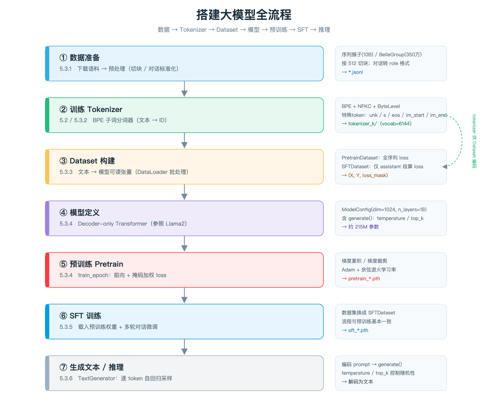

# 基于 Transformer 的大模型训练与推理实践

---

## 一、阅读指引

> 本文基于[transformer架构代码实现](./transformer代码实现.md) 前提下，把训练与推理流程接着跑完。

### 1.1 搭建大模型流程图

#### 1.1.1 核心要点

- **大模型的本质是一个自回归语言模型**：给定前文，预测下一个 token。用公式表达就是 $p(x)=\prod_{t=1}^{T}p(x_t \mid x_{<t})$。所有工程代码，最终都在为"让这个条件概率更准"服务。
- **两种常见形态**：Decoder-only（只有解码器，如 GPT/Llama）与 **Encoder-Decoder（Seq2Seq，如翻译模型）**。本文代码属于后者——把英文"读懂"再"译成"中文。
- **训练 = 让预测分布逼近真实分布**：用**交叉熵**度量两者差距，反向传播把梯度回灌到参数上。
- **两阶段范式**：
  - **预训练（自监督）**：用海量无标注文本，让模型学会语言规律；
  - **微调 / SFT（有监督）**：用带标注的（输入, 输出）对，让模型学会"按指令/任务"作答。
- **一条主线贯穿全部代码**：`原始语料 → 分词(Tokenizer) → 数据集(Dataset) → 模型(Model) → 训练(Train) → 推理(Infer)`。后面 1.2、1.3 就是把这条主线拆开看。

#### 1.1.2 流程图与读图方法

<div align='center'>
    
    <p>图 5-1　搭建大模型全流程</p>
</div>

**图的读法**：主干是一条**自下而上的流水线**——数据准备好之后，先训练出 Tokenizer，再用 Tokenizer 把文本编码成离散 ID，进而拼成 `(X, Y, loss_mask)` 这样的训练样本，最后才交给模型做「预训练 → SFT → 推理」。左侧是七个阶段，右侧是该阶段的**输入依赖与产物**（产物即下一阶段的输入，因此顺序不可颠倒）。

**七个阶段与章节、对应代码文件对照**：

| 步骤  | 阶段           | 核心代码 / 关键点                                                                                                                                                                                                                  |
| --- | ------------ | --------------------------------------------------------------------------------------------------------------------------------------------------------------------------------------------------------------------------- |
| ①   | 数据准备         | 语料经分词后由 `MTDataset`（`tools/data_loader.py`）读取，在 [`train_main.py`](train_main.py:200) 的 `run()` 中装配 train/dev/test 三份数据集                                                                                                     |
| ②   | 训练 Tokenizer | [`tokenize.py`](tokenize.py:7) 的 `train()` / [`run()`](tokenize.py:27) / [`test1()`](tokenize.py:47)；BPE，`pad/unk/bos/eos = 0/1/2/3` → `eng.model`、`chn.model`                                                              |
| ③   | Dataset 构建   | [`train_main.py`](train_main.py:208) `DataLoader(..., collate_fn=MTDataset.collate_fn)` → 产出 `src / trg / trg_y / src_mask / trg_mask / ntokens`                                                                            |
| ④   | 模型定义         | [`transformer_model.py`](transformer_model.py:343) `make_model()` → `Transformer`（Encoder / Decoder 各 N 层）+ `Generator`                                                                                                     |
| ⑤   | 预训练 / 训练     | [`train_main.py`](train_main.py:101) `train()`、[`train_main.py`](train_main.py:34) `run_epoch()`；[`train_utils.py`](train_utils.py:5) `MultiGPULossCompute`、[`train_utils.py`](train_utils.py:105) `get_std_opt`（`NoamOpt`） |
| ⑥   | 微调 / 续训      | [`train_main.py`](train_main.py:221) `resume_path` 载入已有权重继续训练；产物 `best_bleu_*.pth` / `last_bleu_*.pth`                                                                                                                      |
| ⑦   | 生成文本 / 推理    | [`translate_main.py`](translate_main.py:14) `translate()` → `beam_search` + `decode_ids` 束搜索推理                                                                                                                              |

> **流程图与本文代码的对应关系**：
> 
> 图 5-1 描述的是**通用的搭建范式**；
> 
> 本文的五个代码文件是同一范式在 **Seq2Seq 机器翻译**上的落地：
> 
> 阶段 ② → `tokenize.py`；
> 
> 阶段 ③～⑤ → `train_main.py` + `train_utils.py` + `transformer_model.py`；
> 
> 阶段 ⑦ → `translate_main.py`。
> 
> 本章节以"训练主线 + 推理入口"为轴展开。

### 1.2 代码全局运行流程

#### 1.2.1 核心要点（先理解"训练在做什么"）

- **Seq2Seq 的工作方式**：Encoder 把源语言序列压缩成一组上下文表示（代码里叫 `memory`），Decoder 再以 `memory` 为条件、自回归地生成目标语言。这是"先理解、再生成"。
- **Teacher Forcing（教师强制）**：训练时 Decoder 的每一步输入不喂"自己上一步的预测"，而是喂**真实的目标 token**（代码中的 `trg`），预测目标是**右移一位**的真实 token（`trg_y`）。它让训练更稳定、可并行。
- **训练循环的标准五步**（几乎所有深度学习训练代码都是这五步）：
  1. **前向**：`out = model(...)`；
  2. **算损失**：`loss = criterion(out, target)`；
  3. **反向**：`loss.backward()` 求梯度；
  4. **更新**：`optimizer.step()` 按梯度改参数；
  5. **清零**：`optimizer.zero_grad()` 清掉累积梯度。
     本文代码把这五步中"算损失 + 反向 + 更新 + 清零"**封装**进了 [`MultiGPULossCompute.__call__()`](train_utils.py:14)。
- **训练与推理的关键差异**：
  - 训练有真实答案，用 `trg` 做 teacher forcing；推理**没有答案**，必须把自己上一步的输出接回来（自回归）；
  - 训练需要梯度；推理用 `torch.no_grad()` 关闭梯度以省显存；
  - 推理要"挑词"，常用 **束搜索（beam search）** 而非贪心。
- **两个必须区分的句柄**：`model` 是原始模型，`model_par` 是多卡包装（`DataParallel`）后的模型；训练走 `model_par`，保存与评估走 `model`。

#### 1.2.2 代码运行流程

```
【前置】tokenize.py —— 产出分词器（对应图 5-1 阶段 ②）
  run() ──► train(corpus.en) ─┐
         └► train(corpus.ch) ─┴─► eng.model / chn.model (+ .vocab)

【主线】train_main.py —— 训练与评估（对应图 5-1 阶段 ③～⑤）
  __main__ ─► run(config.resume_path)
      │
      ├─ ① MTDataset(train/dev/test) ─► DataLoader(collate_fn)         ← 数据装配
      ├─ ② make_model(...)                    ← transformer_model.py            ← 模型装配
      ├─ ③ torch.nn.DataParallel(model)
      ├─ ④ CrossEntropyLoss(ignore_index=0, reduction='sum')           ← 损失装配
      ├─ ⑤ get_std_opt(model)                 ← train_utils.py         ← 优化器装配
      └─ ⑥ train(train_loader, dev_loader, model, model_par, criterion, optimizer)
             │
             └─ for epoch in 1..epoch_num:                              ← epoch 循环
                  ├─ model.train() ─► run_epoch(train, model_par,
                  │        MultiGPULossCompute(generator, criterion, device_id, optimizer), is_train=True)
                  │            └─ for batch: 搬运设备 → model(...) → loss_compute(out, trg_y, ntokens)
                  │                   └─ MultiGPULossCompute.__call__: generator+loss → backward → opt.step
                  ├─ model.eval()  ─► run_epoch(dev, model_par,
                  │        MultiGPULossCompute(..., None))            # opt=None，只算损失
                  ├─ evaluate(dev, model)  ─► beam_search + sacrebleu  ← 评估
                  ├─ if bleu > best  ─► torch.save(best_bleu_*.pth)    ← 择优保存
                  └─ if last epoch   ─► torch.save(last_bleu_*.pth)    ← 末轮保存

【推理】translate_main.py —— 用训练好的权重做翻译（对应图 5-1 阶段 ⑦）
  __main__ ─► translate_example()
      ├─ english_tokenizer_load() / chinese_tokenizer_load()          ← 阶段 ② 产物
      ├─ make_model(...) ─► torch.load(config.translate_model_path) ─► model.eval()
      └─ while True: input 英文句子
             └─ one_sentence_translate(): [BOS] + EncodeAsIds + [EOS] ─► translate()
                    └─ src_mask = (src != 0) ─► beam_search ─► decode_ids ─► 中文
```

**一句话概括**：`train_main.py` 把「数据 → 模型 → 损失 → 优化器」四样东西装配好，交给 `train()` 做 epoch 调度，`train()` 再委托 `run_epoch()` 逐批执行「前向 → 损失 → 反向 → 更新」；训练结束后，`translate_main.py` 用**同一套 `make_model` 与分词器**把权重加载起来做推理。

**从文本到 ID、再到翻译结果的完整链路**（把"分词 → 前向 → 解码"串起来）：

```
英文句子 ──english_tokenizer.EncodeAsIds()──► 英文 ID 序列(含 BOS/EOS)
                                                │
                    ┌───────────────────────────┘
                    ▼
            make_model 构造的 Transformer
                    │  Encoder: 源语言 → memory
                    │  Decoder: memory + 已生成前缀 → 词表分布
                    ▼
            生成中文 ID 序列 ──beam_search──► chinese_tokenizer.decode_ids()──► 中文句子
```

**五个文件的职责与调用关系**：

| 文件                                             | 角色                  | 关键符号                                                               | 被谁调用                                     |
| ---------------------------------------------- | ------------------- | ------------------------------------------------------------------ | ---------------------------------------- |
| [`tokenize.py`](tokenize.py)                   | 训练前置：训练 BPE 分词器     | `train()` / `run()` / `test1()`                                    | 独立运行，产物供训练与推理共用                          |
| [`train_main.py`](train_main.py)               | **训练主线：编排一切**       | `run_epoch()` / `train()` / `evaluate()` / `test()` / `run()`      | `__main__`                               |
| [`translate_main.py`](translate_main.py)       | **推理入口：单句翻译**       | `translate()` / `one_sentence_translate()` / `translate_example()` | `__main__`                               |
| [`train_utils.py`](train_utils.py)             | 训练工具：损失计算 + 学习率调度   | `MultiGPULossCompute` / `NoamOpt` / `get_std_opt`                  | 被 `train_main.py` 调用                     |
| [`transformer_model.py`](transformer_model.py) | 模型底座：Transformer 组装 | `make_model()` / `Transformer` / `Generator`                       | 被 `train_main.py`、`translate_main.py` 调用 |

#### 1.2.3 文件列表

```text
tree .
\.
├── config.py # 代码运行的配置参数
├── data
│   ├── corpus.ch
│   ├── corpus.en
│   ├── train # 训练后的模型
│   │   ├── exp
│   │   │   └── weights
│   │   │       └── best_bleu_26.30.pth
│   │   ├── exp3
│   │   │   └── weights
│   │   │       ├── best_bleu_18.87.pth
│   │   │       └── last_bleu_18.87.pth
│   │   └── exp33
│   │       └── weights
│   │           ├── best_bleu_9.36.pth
│   │           └── last_bleu_9.36.pth
├── dataset # 数据来自 https://www.statmt.org/wmt18/translation-task.html
│   ├── dev.json
│   ├── test.json
│   └── train.json
├── json_unicode_preview_corpus.py # 数据是否满足，再分割到语种文件
├── model      # transformer 框架
│   ├── transformer_model.py
│   ├── train_utils.py
├── tokenizer # 向量化
│   ├── chn.vocab
│   ├── eng.model
│   ├── eng.vocab
│   └── tokenize.py
├── tools
├── train_main.py # 训练入口
└── translate_main.py # 推理入口
```

### 1.3 数据准备

#### 1.3.1 核心要点

先理解"数据为什么是这个形状"

- **为什么必须分词**：神经网络只能吃数字。Tokenization 就是把字符串切成**子词（subword）**并映射为整数 ID。词表太小则粒度粗、OOV 多；词表太大则 embedding 参数膨胀——子词是二者的折中。
- **BPE（Byte Pair Encoding）的核心思想**：从字符开始，**反复合并出现频率最高的相邻符号对**，直到达到目标词表大小。高频串（如 `low`+`er`）自然被合并成整块，低频词则被拆成更小的已知子词，从而**缓解 OOV**。
- **特殊 token 的语义**（这是全篇最重要的一条约定）：
  - `pad`：把不同长度的句子补齐成同一长度；
  - `unk`：未登录词；
  - `bos` / `eos`：序列的开始与结束，**解码时必须靠 `eos` 判停**；
  - 本文代码固定为 `pad_id=0, unk_id=1, bos_id=2, eos_id=3`。
- **变长序列如何进 batch**：按 batch 内最大长度**右侧补齐（padding）**，同时生成 **mask** 告诉模型"哪些是补齐的、不算数"：
  - **padding mask**：屏蔽补齐位（Encoder 与 Decoder 都用）；
  - **因果 mask（causal/sequence mask）**：Decoder 用，防止"看到未来"。
- **监督信号怎么来（Self-Supervised 的构造技巧）**：把一条完整 ID 序列**错开一位**切成两段——`X = id[:-1]` 作为输入、`Y = id[1:]` 作为预测目标；再用有效 token 数 `ntokens` 去归一化损失，保证不同批次损失可比。

#### 1.3.2 训练分词器

> 对应图 5-1 阶段 ②。产物是**训练与推理共用的同一套词表**，必须先于一切训练执行。

代码：

```python
import sentencepiece as spm

def train(input_file, vocab_size, model_name, model_type, character_coverage):
    args = [
        f"--input={input_file}",
        f"--model_prefix={model_name}",
        f"--vocab_size={vocab_size}",
        f"--model_type={model_type}",
        f"--character_coverage={character_coverage}",
        "--pad_id=0",
        "--unk_id=1",
        "--bos_id=2",
        "--eos_id=3"
    ]
    cmd = " ".join(args)

    # 开始训练，会在当前目录下生成 <model_name>.model / <model_name>.vocab
    spm.SentencePieceTrainer.Train(cmd)
```

**代码流程**：

- [`train()`](tokenize.py:7)：用 `SentencePieceTrainer.Train` + 字符串参数列表产出 `<model_name>.model` / `.vocab`；`.model` 是"分词器大脑"，同时保存了**切分规则与 ID 映射**；
- [`run()`](tokenize.py:27)：分别训练英文 `eng`、中文 `chn` 两个分词器（中英字符集差异大，通常分开训练）；
- [`test1()`](tokenize.py:47)：加载 `chn.model`，用 `EncodeAsPieces` 看切分、用 `EncodeAsIds` 看 ID —— 这一步是**验证"文本 ⇄ ID"双向可逆**的关键。
- **关键约定**：`--pad_id=0 --unk_id=1 --bos_id=2 --eos_id=3` —— 这套 ID 约定会一路影响后面的 mask、损失计算与推理的束搜索。

**从文本到 ID、再回到文本（tokenize 的作用与去向）**：

```
文本 "我爱你" ──EncodeAsIds──► [45, 891, 1024] ──喂给模型──► 生成 ID ──decode_ids──► "我爱你们"
                      ▲                                              │
                      └──────────── 同一份 chn.model 保证两侧一致 ──────┘
```

**配置对照**：

| 语言  | 输入                  | vocab_size | model_type | character_coverage |
| --- | ------------------- | ---------- | ---------- | ------------------ |
| 英文  | `../data/corpus.en` | 32000      | bpe        | 1.0                |
| 中文  | `../data/corpus.ch` | 32000      | bpe        | 0.9995             |

> `character_coverage=1.0` 表示英文覆盖面要求 100%；中文取 `0.9995` 是因为汉字极多，允许少量冷僻字映射为 `unk`，以换取更紧凑的词表。

这两个token文件的部分内容：

```text
<pad>    0
<unk>    0
<s>    0
</s>    0
——    -0
经济    -1
国家    -2
美国    -3
▁但    -4
```

```text
<pad>    0
<unk>    0
<s>    0
</s>    0
▁t    -0
in    -1
▁a    -2
he    -3
re    -4
on    -5
```

#### 1.3.3 Dataset 构建

> 对应图 5-1 阶段 ③。它把"句子对"变成"可直接前向的张量批次"。

**代码流程**：读语料 → 分词 → 按 batch 内最大长度 padding → 生成 mask → 拆出 `X / Y(=trg_y)` 与有效 token 数 `ntokens`。

这一步由 [`collate_fn`](train_main.py:209) 完成，产物字段与 1.2 流程图里 `run_epoch` 消费的完全对应：

| 字段         | 形状                  | 含义                              |
| ---------- | ------------------- | ------------------------------- |
| `src`      | `(B, L_src)`        | 源语言（英文）ID 序列，含 padding          |
| `trg`      | `(B, L_tgt)`        | 目标语言 ID 序列（teacher forcing 的输入） |
| `trg_y`    | `(B, L_tgt)`        | 右移一位的目标 ID（真实标签）                |
| `src_mask` | `(B, 1, L_src)`     | 屏蔽源语言 padding                   |
| `trg_mask` | `(B, L_tgt, L_tgt)` | 屏蔽 padding + 防看未来的因果掩码          |
| `ntokens`  | 标量                  | batch 内有效 token 数，用于损失归一化       |

> **红线**：`pad_id=0`（1.3.2）必须与 [`CrossEntropyLoss(ignore_index=0)`](train_main.py:238)、`src != 0` 的 mask 逻辑（[`train_main.py`](train_main.py:159)、[`translate_main.py`](translate_main.py:25)）**严格一致**。只要有一处不一致，padding 就会被当作真实 token 参与损失或注意力计算，训练必然出问题。
> 
> - **词表与配置脱节**：`config.src_vocab_size / tgt_vocab_size` 必须与分词器实际词表大小一致，否则 `Embedding` 越界。
> - **padding 方向**：右侧补齐最省事，但要注意 `ntokens` 与 mask 的配合；若改用左侧补齐，`bos/eos` 的相对位置会变，解码逻辑需同步调整。
> - **中英分词器别弄混**：源端用英文分词器编码、目标端用中文分词器解码，搞反会得到"看起来像 ID 的乱码"。


#### 1.3.4 主要代码

```python
def subsequent_mask(size):
    """
    该函数生成一个遮蔽矩阵，防止解码时看到未来的词（自回归）。
    目的是为了在训练解码器时，确保每个位置的预测只能基于当前及之前的词。
    """
    # 生成一个形状为 (1, size, size) 的矩阵
    attn_shape = (1, size, size)

    # 创建上三角矩阵（右上角为1，左下角为0）
    subsequent_mask = np.triu(np.ones(attn_shape), k=1).astype('uint8')

    # 返回一个右上角(不含主对角线)为全False，左下角(含主对角线)为全True的subsequent_mask矩阵
    return torch.from_numpy(subsequent_mask) == 0


class Batch:
    """
    Class for holding a batch of data with corresponding masks during training.
    该类用于存储一个训练批次的数据，包括源语言和目标语言的文本、token以及mask。
    """
    def __init__(self, src_text, trg_text, src, trg=None, pad=0):
        """
            初始化Batch类，生成对应的源语言和目标语言数据
            :param src_text: 源语言（英语）的文本
            :param trg_text: 目标语言（中文）的文本
            :param src: 源语言的输入数据（tensor格式）
            :param trg: 目标语言的输入数据（tensor格式），如果有
            :param pad: padding值（用于填充句子时的标记）
        """
        self.src_text = src_text  # 源语言文本
        self.trg_text = trg_text  # 目标语言文本
        src = src.to(DEVICE)   # 将源语言数据移到指定设备（GPU/CPU）
        self.src = src  # 保存源语言数据
        # 对于当前输入的句子非空部分进行判断成bool序列
        # 并在seq length前面增加一维，形成维度为 1×seq length 的矩阵
        self.src_mask = (src != pad).unsqueeze(-2)  # 生成源语言的mask，屏蔽padding部分

        # 如果输出目标不为空，则需要对decoder要使用到的target句子进行mask
        if trg is not None:
            trg = trg.to(DEVICE)  # 将目标语言数据移到指定设备
            # decoder训练时应预测输出的target结果，目标语言的输入部分（去掉最后一个词，因为是要预测的目标）
            self.trg = trg[:, :-1]
            # 目标语言的输出部分（从第二个词开始，是目标预测的结果）
            self.trg_y = trg[:, 1:]
            # 将target输入部分进行attention mask，创建目标语言的mask
            self.trg_mask = self.make_std_mask(self.trg, pad)
            # 将应输出的target结果中实际的词数进行统计
            self.ntokens = (self.trg_y != pad).data.sum()

    # Mask掩码操作
    @staticmethod
    def make_std_mask(tgt, pad):
        """
        创建目标语言的mask，屏蔽padding和未来的词
        :param tgt: 目标语言的token序列
        :param pad: padding标记
        :return: 目标语言的mask
        """
        tgt_mask = (tgt != pad).unsqueeze(-2)   # 为目标语言中的非pad部分生成mask
        # 添加后续词的遮蔽
        tgt_mask = tgt_mask & Variable(subsequent_mask(tgt.size(-1)).type_as(tgt_mask.data))
        return tgt_mask  # 返回目标语言的mask


# 这是一个用于机器翻译任务的数据集类(MTDataset)，它继承自PyTorch的Dataset类。
class MTDataset(Dataset):
    """
        自定义数据集类，用于加载机器翻译任务中的数据。该类继承自PyTorch的Dataset类。
        主要功能包括：加载英文和中文句子，使用分词器进行分词，将句子转换为token ID，并填充句子长度。
    """
    def __init__(self, data_path):
        """
            初始化函数，加载数据集和分词器
            :param data_path: 数据集文件路径（json格式）
        """
        self.out_en_sent, self.out_cn_sent = self.get_dataset(data_path, sort=True)  # 获取并排序中英文句子
        self.sp_eng = english_tokenizer_load()  # 加载英文分词器
        self.sp_chn = chinese_tokenizer_load()  # 加载中文分词器
        self.PAD = self.sp_eng.pad_id()  # 获取PAD标记ID
        self.BOS = self.sp_eng.bos_id()  # 获取BOS标记ID（开始符）
        self.EOS = self.sp_eng.eos_id()  # 获取EOS标记ID（结束符）

    @staticmethod
    def len_argsort(seq):
        """
        对句子按照长度进行排序，并返回排序后句子的索引位置。
        :param seq: 需要排序的句子（列表形式）
        :return: 排序后的索引列表
        """
        return sorted(range(len(seq)), key=lambda x: len(seq[x]))

    def get_dataset(self, data_path, sort=False):
        """
        获取数据集，并根据英文句子长度对数据进行排序。
        :param data_path: 数据集的路径
        :param sort: 是否对数据按英文句子长度进行排序
        :return: 英文句子列表和中文句子列表
        """
        dataset = json.load(open(data_path, 'r',encoding="utf-8"))  # 读取json格式的数据集
        out_en_sent = []
        out_cn_sent = []
        for idx, _ in enumerate(dataset):
            out_en_sent.append(dataset[idx][0])  # 英文句子
            out_cn_sent.append(dataset[idx][1])  # 中文句子
        if sort:
            sorted_index = self.len_argsort(out_en_sent)  # 按照英文句子长度排序
            out_en_sent = [out_en_sent[i] for i in sorted_index]  # 根据排序后的索引重新排列英文句子
            out_cn_sent = [out_cn_sent[i] for i in sorted_index]  # 根据排序后的索引重新排列中文句子
        return out_en_sent, out_cn_sent   # 返回排序后的英文和中文句子列表

    def __getitem__(self, idx):
        """
        获取指定索引的英文和中文句子。
        :param idx: 数据索引
        :return: 英文和中文句子对
        """
        eng_text = self.out_en_sent[idx]  # 获取英文句子
        chn_text = self.out_cn_sent[idx]  # 获取中文句子
        return [eng_text, chn_text]

    def __len__(self):
        """
            返回数据集的大小（句子的数量）
        """
        return len(self.out_en_sent)

    def collate_fn(self, batch):
        """
            定义如何将数据样本合并成一个batch，进行填充、编码等操作。
            :param batch: 一个batch的样本
            :return: 返回处理后的Batch对象
        """
        # 从batch中提取英文和中文文本
        src_text = [x[0] for x in batch]
        tgt_text = [x[1] for x in batch]

        # 对英文和中文句子进行分词，并加上BOS和EOS标记
        src_tokens = [[self.BOS] + self.sp_eng.EncodeAsIds(sent) + [self.EOS] for sent in src_text]
        tgt_tokens = [[self.BOS] + self.sp_chn.EncodeAsIds(sent) + [self.EOS] for sent in tgt_text]

        # 对英文和中文句子进行填充，保证每个句子的长度相同
        batch_input = pad_sequence([torch.LongTensor(np.array(l_)) for l_ in src_tokens],
                                   batch_first=True, padding_value=self.PAD)
        batch_target = pad_sequence([torch.LongTensor(np.array(l_)) for l_ in tgt_tokens],
                                    batch_first=True, padding_value=self.PAD)

        # 返回一个Batch对象，包含源语言和目标语言的文本、token和mask
        return Batch(src_text, tgt_text, batch_input, batch_target, self.PAD)
```

---

## 二、训练主线

> 第二层是全文核心：**训练这条链路**。
> 按"运行时由外向内"分成 **5 组**：
> **2.1 启动与装配** → **2.2 训练循环** → **2.3 损失/反向/学习率** → **2.4 评估/测试/保存** → **2.5 工程细节**。

### 2.1 启动与装配（`run()` 之前）

> **核心要点**：训练 = 把「数据、模型、损失、优化器」四要素装配好再交给循环。装配阶段**不做计算，只做"接线"**；接错一根线，后面的循环再正确也白搭。

#### 2.1.1 依赖导入与环境准备

**核心要点**：

- 训练与推理能共用一套代码，根因是**分词器把"文本 ⇄ ID"变成互逆映射**：编码（`EncodeAsIds`）供模型输入，解码（`decode_ids`）把模型的 ID 输出还原成文本。**模型全程只认 ID**。
- `config` 是**超参的单一来源**：数据路径、设备、词表大小、层数等集中管理，杜绝"训练/推理各写一遍导致不一致"。

**tokenize 的过程、作用，以及"如何到 decode"**：

```
训练侧:  文本 ─EncodeAsIds─► ID ─Embedding─► 向量 ─模型─► 词表分布 ─CrossEntropy─► 梯度
                                                            │
推理侧:  英文 ─EncodeAsIds─► ID ─模型(no_grad)─► 生成 ID ─decode_ids─► 中文
                                                            ▲
                                    两端必须加载同一份 .model（ID 语义才对齐）
```

**易错点**：`config.device` 决定后续所有 `.to(...)` 的去向；漏掉 `logging` 配置会让训练日志难以定位问题。

训练入口代码：

```python
def run(resume_path: str = ""):
    # 创建训练数据集和开发数据集
    # 使用MTDataset类分别加载训练数据和开发数据
    train_dataset = MTDataset(config.train_data_path)  # 初始化训练数据集，使用配置中指定的训练数据路径
    dev_dataset = MTDataset(config.dev_data_path)  # 初始化开发数据集，使用配置中指定的开发数据路径
    test_dataset = MTDataset(config.test_data_path)

    # 创建训练数据加载器，用于训练过程中批量加载数据
    # shuffle=True 表示在每个epoch开始时会打乱数据顺序，以增加模型的泛化能力
    # batch_size=config.batch_size 表示每个批次的样本数量，具体值由配置文件决定
    # collate_fn=train_dataset.collate_fn 表示自定义的数据整理函数，用于处理每个批次的数据
    train_dataloader = DataLoader(train_dataset, shuffle=True, batch_size=config.batch_size,
                                  collate_fn=train_dataset.collate_fn)
    dev_dataloader = DataLoader(dev_dataset, shuffle=False, batch_size=config.batch_size,
                                collate_fn=train_dataset.collate_fn)
    test_dataloader = DataLoader(test_dataset, shuffle=False, batch_size=config.batch_size,
                                 collate_fn=train_dataset.collate_fn)

    # 初始化模型
    model = make_model(config.src_vocab_size, config.tgt_vocab_size, config.n_layers,
                       config.d_model, config.d_ff, config.n_heads, config.dropout)

    print("Model device next:", next(model.parameters()).device)

    if resume_path:
        if os.path.isfile(resume_path):
            # 加载到 CPU 后再拷贝到模型所在设备，避免保存时设备不一致
            state_dict = torch.load(resume_path, map_location=config.device)
            model.load_state_dict(state_dict)
            logging.info(f"已加载预训练权重：{resume_path}")
        else:
            logging.warning(f"指定的权重文件不存在，将从头训练：{resume_path}")
    else:
        logging.info("未指定预训练权重，从头开始训练。")

    #  将模型包装成数据并行模式,这样可以在多个GPU上并行处理数据，提高训练效率
    model_par = torch.nn.DataParallel(model)

    # 训练阶段，选择损失函数和优化器
    # CrossEntropyLoss是常见的分类问题损失函数，ignore_index=0表示忽略填充部分
    # reduction='sum'表示计算损失时会对所有token的损失求和
    criterion = torch.nn.CrossEntropyLoss(ignore_index=0, reduction='sum')

    # 调用get_std_opt函数获取标准的Noam优化器，这通常包括学习率调度器（如预热后衰减）
    optimizer = get_std_opt(model)

    # 开始训练
    train(train_dataloader, dev_dataloader, model, model_par, criterion, optimizer)
    # test(test_dataloader, model, criterion)
```

#### 2.1.3 `run()` ①：数据装配 —— `MTDataset` 与 `DataLoader`

**核心要点**：

- `Dataset` 定义"一条样本长什么样"，`DataLoader` 定义"怎么组批、怎么打乱、怎么并行取数"；
- **训练集 shuffle、验证/测试集不 shuffle**：前者打散样本顺序以增强泛化，后者保证指标可复现。

**代码流程**：三份 `MTDataset`（train/dev/test）→ 训练集 `shuffle=True`、`dev/test` 为 `False` → `batch_size=config.batch_size` → [`collate_fn=train_dataset.collate_fn`](train_main.py:209) 负责变长句子 padding 与 mask 生成。

**易错点**：`collate_fn` 必须三处一致（都用同一套整理逻辑），否则训练与验证的 mask 约定会漂移。

#### 2.1.4 `run()` ②：模型装配与权重恢复

**核心要点**：

- **续训 / 迁移的本质**是"用 `state_dict`（参数名 → 张量）覆盖模型参数"，因此**结构定义必须先一致**，键名才能对上；
- `DataParallel` 在 batch 维切分数据实现单机多卡并行（各卡持有参数副本，梯度汇总到主卡）。

**代码流程**：[`make_model(...)`](train_main.py:216) → `print` 模型所在设备 → 续训分支（[L221–230](train_main.py:221)）：`torch.load(resume_path, map_location=config.device)` 再 `load_state_dict`；文件缺失则告警并从零训练 → [`DataParallel(model)`](train_main.py:233)。

**易错点**：`map_location` 解决"保存设备 ≠ 加载设备"；务必分清 `model`（原始）与 `model_par`（包装）。

#### 2.1.5 `run()` ③：损失与优化器装配

**核心要点**：

- **交叉熵**衡量"预测分布与真实 one-hot 的差距"，是语言建模的标准损失；
- `ignore_index=0` 让 **padding 位置不产生梯度**；`reduction='sum'` 先求和，之后按 `ntokens` 归一；
- 优化器决定"拿到梯度后怎么走"；本文用 **Noam 调度 + Adam**（见 2.3.2）。

**代码流程**：[`CrossEntropyLoss(ignore_index=0, reduction='sum')`](train_main.py:238) → [`get_std_opt(model)`](train_main.py:241) → [`train(...)`](train_main.py:244)；`test(...)` 被注释，训练/测试分离。

**易错点**：`reduction='sum'` 必须与 `run_epoch` 的 `total_loss / total_tokens` 配套，否则 loss 数量级会随 batch 大小漂移。

### 2.2 训练循环

> **核心要点**：训练是**两层循环**——外层 epoch 决定"数据过几遍"，内层 batch 决定"一次喂多少、何时更新参数"。

代码：

```python
def train(train_data, dev_data, model, model_par, criterion, optimizer):
    """训练并保存模型"""
    # best_bleu_score初始化
    best_bleu_score = -float('inf')  # 初始最佳BLEU分数为负无穷
    # 创建保存权重的路径
    exp_folder, weights_folder = create_exp_folder()

    # 开始训练循环，迭代每个epoch
    for epoch in range(1, config.epoch_num + 1):
        logging.info(f"第{epoch}轮模型训练与验证")
        # 设置模型为训练模式
        model.train()
        # 进行一个epoch的训练，返回当前的训练损失
        train_loss = run_epoch(train_data, model_par,
                               MultiGPULossCompute(model.generator, criterion, config.device_id, optimizer), True)

        # 设置模型为评估模式（即不计算梯度，优化）
        model.eval()
        # 进行一个epoch的验证，返回当前的验证损失
        dev_loss = run_epoch(dev_data, model_par,
                             MultiGPULossCompute(model.generator, criterion, config.device_id, None))

        # 计算模型在验证集（dev_data）上的BLEU分数
        bleu_score = evaluate(dev_data, model)
        logging.info(
            f"Epoch: {epoch}, train_loss: {train_loss:.3f}, val_loss: {dev_loss:.3f}, Bleu Score: {bleu_score:.2f}\n")

        # 如果当前epoch的模型的BLEU分数更优，则保存最佳模型
        if bleu_score > best_bleu_score:
            # 如果之前已存在最优模型，先删除
            if best_bleu_score != -float('inf'):
                old_model_path = f"{weights_folder}/best_bleu_{best_bleu_score:.2f}.pth"
                if os.path.exists(old_model_path):
                    os.remove(old_model_path)

            model_path_best = f"{weights_folder}/best_bleu_{bleu_score:.2f}.pth"
            # 保存当前模型的状态字典到指定路径
            torch.save(model.state_dict(), model_path_best)
            # 更新最佳BLEU分数
            best_bleu_score = bleu_score
            # 记录最佳模型保存信息到日志

        # 保存当前模型（最后一次训练）
        if epoch == config.epoch_num:  # 判断是否达到设定的训练轮数
            model_path_last = f"{weights_folder}/last_bleu_{bleu_score:.2f}.pth"  # 构建模型保存路径，包含BLEU分数
            torch.save(model.state_dict(), model_path_last)  # 保存模型的状态字典
```

#### 2.2.1 `train()`：epoch 级调度

**核心要点**：

- **`model.train()` / `model.eval()` 切换的是"行为模式"，不是参数**：影响 Dropout、BatchNorm 等层的计算方式（评估时 Dropout 关闭）；
- **模型选择（model selection）**：以验证集 BLEU 为准则保留最优模型，防止只是"记住了训练集"。

**代码流程**：

- `best_bleu_score = -float('inf')`（[L104](train_main.py:104)）保证首轮必存；
- [`create_exp_folder()`](train_main.py:106) 建实验目录；
- `for epoch in range(1, config.epoch_num + 1)`（[L109](train_main.py:109)）：
  - **训练单轮**：`model.train()` → `run_epoch(train_data, model_par, MultiGPULossCompute(..., optimizer), True)`（传 `optimizer` ⇒ 会反向更新）；
  - **验证单轮**：`model.eval()` → `run_epoch(dev_data, model_par, MultiGPULossCompute(..., None))`（`opt=None` ⇒ 只前向）；
  - **评估**：[`evaluate(dev_data, model)`](train_main.py:124)（见 2.4.1）；
  - **择优保存**（[L129–140](train_main.py:129)）：`bleu > best` 时先删旧最优文件，再存 `best_bleu_{score}.pth`。

**易错点**：`run_epoch` **不自带**模式切换，顺序颠倒会让验证阶段 Dropout 仍生效。

#### 2.2.2 `run_epoch()`：单轮批次执行

**核心要点**：

- 训练"五步"中，本函数承担**前向 + 触发损失计算**，而 backward / step 被封装进 `loss_compute`（见 2.3.1）；
- **先按有效 token 累加、最后一次性平均**（而非对每个 batch 分别平均），避免 batch 长度差异带来的加权偏差。

核心代码：

```python
def run_epoch(data, model, loss_compute, is_train=False, use_profiler=False):
    total_tokens = 0.  # 初始化token的总数
    total_loss = 0.  # 初始化总损失

    # 如果需要 profiler，初始化
    if use_profiler:
        prof = profile(
            activities=[ProfilerActivity.CPU, ProfilerActivity.PrivateUse1],  # 根据设备选择
            record_shapes=True,
            profile_memory=True,  # 可选，查看内存占用
            with_stack=True  # 可选，跟踪调用栈
        )
        prof.start()

    # 遍历整个数据集（数据为batch的形式）
    for step, batch in enumerate(tqdm(data)):  # tqdm用于显示处理进度条

        # 把数据移到设备
        src = batch.src.to(config.device)
        trg = batch.trg.to(config.device)
        trg_y = batch.trg_y.to(config.device)
        src_mask = batch.src_mask.to(config.device)
        trg_mask = batch.trg_mask.to(config.device)
        ntokens = batch.ntokens

        # 模型前向传播，得到预测结果out
        # batch.src：输入的源语言数据，batch.trg：目标语言数据，batch.src_mask：源语言mask，batch.trg_mask：目标语言mask
        out = model(src, trg, src_mask, trg_mask)

        # 使用loss_compute计算损失
        # batch.trg_y：目标输出数据，batch.ntokens：非填充部分的token数量（有效token数量）
        loss = loss_compute(out, trg_y, ntokens)

        # 累加损失和有效tokens的数量
        total_loss += loss
        total_tokens += batch.ntokens

        # 释放中间变量，防止显存累积
        del out, loss, src, trg, trg_y, src_mask, trg_mask

        # 定期清空 MPS 缓存
        if is_train and step % 50 == 0 and config.device.type == 'mps':
            torch.mps.empty_cache()


    if use_profiler:
        print_memory()
        prof.stop()
        print(prof.key_averages().table(sort_by="self_cpu_time_total", row_limit=20))
        # 也可以保存 chrome trace 文件
        prof.export_chrome_trace("trace.json")

    # 返回每个token的平均损失
    return total_loss / total_tokens
```

**代码流程**：

- 累积器 `total_loss / total_tokens`；
- 可选 profiler；
- `for step, batch in enumerate(tqdm(data))`；
- **数据搬运**：`src / trg / trg_y / src_mask / trg_mask` 全部 `.to(config.device)`，`ntokens = batch.ntokens`；
- **前向**：`out = model(src, trg, src_mask, trg_mask)`；
- **损失**：`loss = loss_compute(out, trg_y, ntokens)`；
- **累加**：`total_loss += loss; total_tokens += batch.ntokens`；
- **显存管理**：`del out, loss, ...`；`step % 50 == 0` 且 MPS 时 `torch.mps.empty_cache()`；
- **返回**：`total_loss / total_tokens`，即每 token 平均损失。

**张量流转**：`src:(B,L_src)`、`trg/trg_y:(B,L_tgt)`、`src_mask:(B,1,L_src)`、`trg_mask:(B,L_tgt,L_tgt)`；`out:(B,L_tgt,d_model)` → 经 `generator` 后 `(B,L_tgt,V)`。

**易错点**：`ntokens` 取 `batch` 值而非 `out` 的 sum（后者含 padding）；`del` 后若还引用该变量会报错，注意释放时机。

### 2.3 损失、反向与学习率

#### 2.3.1 `MultiGPULossCompute`：损失 + 反向 + 更新

**核心要点**：

- 它把训练循环"五步"中的**后四步打包成一个可调用对象**，于是 `run_epoch` 只需关心"前向 + 调用"——这是**关注点分离**；
- **`opt` 是否为 `None` 就是"训练/评估"的总开关**：同一个类承担两种用途，避免复制两份循环代码；
- **归一化（normalize）**：先除以 `ntokens` 得到平均损失用于反向，再乘回 `ntokens` 返回总损失，使"平均"与"求和"两种口径在接口上自洽。

核心代码：

```python
class MultiGPULossCompute:
    def __init__(self, generator, criterion, devices, opt=None, chunk_size=5):
        self.generator = generator
        # 注意：不要提前复制 criterion，单设备时直接使用即可
        self.criterion = criterion
        self.opt = opt
        self.devices = devices
        self.chunk_size = chunk_size

    def __call__(self, out, targets, normalize):
        # 如果只有一个设备（如 MPS 或 CPU），使用单设备路径
        if len(self.devices) == 1:
            # 前向计算
            logits = self.generator(out)
            # 计算损失（与多 GPU 分支保持一致的处理方式）
            loss = self.criterion(
                logits.contiguous().view(-1, logits.size(-1)),
                targets.contiguous().view(-1)
            ) / normalize

            if self.opt is not None:
                loss.backward()
                self.opt.step()
                self.opt.optimizer.zero_grad()

            return loss.item() * normalize

        # 多 GPU 分支（保持原逻辑不变）
        total = 0.0
        generator = nn.parallel.replicate(self.generator, devices=self.devices)
        out_scatter = nn.parallel.scatter(out, target_gpus=self.devices)
        out_grad = [[] for _ in out_scatter]
        targets = nn.parallel.scatter(targets, target_gpus=self.devices)

        chunk_size = self.chunk_size
        for i in range(0, out_scatter[0].size(1), chunk_size):
            out_column = [[Variable(o[:, i:i + chunk_size].data,
                                    requires_grad=self.opt is not None)]
                          for o in out_scatter]

            gen = nn.parallel.parallel_apply(generator, out_column)

            y = [(g.contiguous().view(-1, g.size(-1)),
                  t[:, i:i + chunk_size].contiguous().view(-1))
                 for g, t in zip(gen, targets)]
            loss = nn.parallel.parallel_apply(self.criterion, y)

            l_ = nn.parallel.gather(loss, target_device=self.devices[0])
            l_ = l_.sum() / normalize
            total += l_.data

            if self.opt is not None:
                l_.backward()
                for j, l in enumerate(loss):
                    out_grad[j].append(out_column[j][0].grad.data.clone())

        if self.opt is not None:
            out_grad = [Variable(torch.cat(og, dim=1)) for og in out_grad]
            o1 = out
            o2 = nn.parallel.gather(out_grad, target_device=self.devices[0])
            o1.backward(gradient=o2)
            self.opt.step()
            self.opt.optimizer.zero_grad()

        return total * normalize

class NoamOpt:
    def __init__(self, model_size, factor, warmup, optimizer):
        """
            初始化优化器包装类
            :param model_size: 模型的大小，通常是d_model的大小，用于计算学习率
            :param factor: 用于计算学习率的因子（通常是学习率的初始值）
            :param warmup: 预热步数，决定学习率从较小值到较大值的增长速度
            :param optimizer: 实际使用的优化器（例如Adam、SGD等）
        """
        self.optimizer = optimizer  # 存储实际的优化器（如Adam）
        self._step = 0  # 当前训练的步数
        self.warmup = warmup  # 预热步数
        self.factor = factor  # 学习率的因子
        self.model_size = model_size  # 模型的大小（通常是d_model，决定学习率的尺度）
        self._rate = 0  # 当前的学习率

    def step(self):
        """更新优化器的参数和学习率"""
        self._step += 1  # 增加当前步数
        rate = self.rate()  # 计算当前的学习率
        # 更新优化器中所有参数的学习率
        for p in self.optimizer.param_groups:
            p['lr'] = rate  # 设置当前学习率
        self._rate = rate  # 更新学习率
        self.optimizer.step()  # 执行一次优化步骤（更新参数）

    def rate(self, step=None):
        """根据当前步数计算学习率"""
        # 如果没有传入step，使用当前步数
        if step is None:
            step = self._step
        # 学习率计算公式：factor * (model_size ** -0.5) * min(step ** -0.5, step * warmup ** -1.5)
        return self.factor * (self.model_size ** (-0.5) * min(step ** (-0.5), step * self.warmup ** (-1.5)))

def get_std_opt(model):
    # 创建并返回一个NoamOpt优化器，包含Adam优化器作为基础
    return NoamOpt(model.src_embed[0].d_model, 1, 10000,
                   torch.optim.Adam(model.parameters(), lr=0, betas=(0.9, 0.98), eps=1e-9))
```

**代码流程**：

- 构造签名 `__init__(self, generator, criterion, devices, opt=None, chunk_size=5)`；
- **单设备分支**（`len(devices)==1`，MPS/CPU 走这条）：`logits = generator(out)` → `criterion(logits.view(-1,V), targets.view(-1)) / normalize` → 若 `opt` 非空则 `loss.backward() → opt.step() → opt.optimizer.zero_grad()` → `return loss.item() * normalize`；
- **多 GPU 分支**：`replicate / scatter` 分发 → 按 `chunk_size` 切列 `parallel_apply` → `gather` 回主设备 → `o1.backward(gradient=o2)`。

**在训练过程中的作用**：它是**梯度真正被计算并写回参数的唯一位置**。`run_epoch` 只负责前向与记账；训练能否收敛，取决于这里 `loss.backward() → optimizer.step()` 是否正确执行。

**易错点**：`opt.optimizer.zero_grad()` 里的 `opt` 是 `NoamOpt`（下一节），清梯度要经 `.optimizer` 取到真正的 `Adam`。

#### 2.3.2 `NoamOpt` / `get_std_opt`：学习率调度

**核心要点**：

- **为什么需要 warmup**：训练初期参数随机、梯度方向噪声大，直接用大学习率易发散；先小步预热、再放大、后期衰减，是 Transformer 的经典做法；
- 公式同时包含"预热（∝ step）"与"衰减（∝ $\sqrt{step}$ 的倒数）"两项，取 `min` 即自动切换阶段。

**核心公式**（[`rate()`](train_utils.py:97)）：

$$
lr = factor \cdot model\_size^{-0.5} \cdot \min\left(step^{-0.5},\; step \cdot warmup^{-1.5}\right)
$$

**代码流程**：`step()`：`_step += 1` → 算 `rate` → 写回所有 `param_groups['lr']` → `optimizer.step()`；

`get_std_opt`：`factor=1, warmup=10000`，底层 `Adam(lr=0, betas=(0.9,0.98), eps=1e-9)`。

**在训练过程中的作用**：底层 Adam 初始 `lr=0`，**真正的学习率由 `NoamOpt` 每一步注入**——它就是 2.3.1 中 `opt.step()` 的实际含义；因此"直接调 `optimizer.step()`"会退化成学习率恒 0。

**易错点**：绕过 `NoamOpt.step()` 会静默失效（不报错但不学习）；可与第五章的 `get_lr()`（warmup + 余弦退火）对照理解两种调度策略。

### 2.4 评估、测试与保存

#### 2.4.1 `evaluate()`：束搜索 + BLEU

**核心要点**：

- **BLEU 的定义**：比较模型译文与参考译文的 **n-gram 重合度**（常用 1~4-gram），并对过短译文施加**长度惩罚（brevity penalty）**；取值 0~100，越高越好；
- **BLEU 的作用**：机器翻译主流的**语料级**自动评价指标——单句得分噪声大，故需跑完整个验证集再计算；它同时是 2.2.1 中"择优保存"的判据；
- **束搜索（beam search）**：每步保留概率最高的 `beam_size` 条候选路径，最后取整体概率最高的一条，比贪心更可能逼近全局最优。

核心代码：

```python
def evaluate(data, model):
    """在data上用训练好的模型进行预测，打印模型翻译结果"""
    sp_chn = chinese_tokenizer_load()  # 加载中文分词器
    trg = []  # 存储目标句子（真实句子）
    res = []  # 存储模型翻译的结果
    with torch.no_grad():  # 禁用梯度计算，节省内存和计算
        # 在data的英文数据长度上遍历下标
        for step, batch in enumerate(tqdm(data)):  # 使用tqdm显示进度条
            cn_sent = batch.trg_text  # 获取当前批次的中文句子
            src = batch.src.to(config.device)  # 获取当前批次的源语言（英文）句子
            src_mask = (src != 0).unsqueeze(-2)  # 为源语言句子创建mask，排除padding部分

            # 使用束搜索生成模型翻译结果
            decode_result, _ = beam_search(model, src, src_mask, config.max_len,
                                           config.padding_idx, config.bos_idx, config.eos_idx,
                                           config.beam_size, config.device)

            # `decode_result`是一个包含多个翻译结果的列表，取最优结果
            decode_result = [h[0] for h in decode_result]
            # 解码后的id转为中文句子
            translation = [sp_chn.decode_ids(_s) for _s in decode_result]
            trg.extend(cn_sent)  # 将当前批次的真实句子添加到`trg`中
            res.extend(translation)  # 将模型的翻译结果添加到`res`中

            # 释放中间张量
            del src, src_mask, decode_result
            if step % 50 == 0 and config.device.type == 'mps':
                torch.mps.empty_cache()  # 注意：频繁调用会拖慢速度，不建议每步都调

    # 计算BLEU分数，使用SacreBLEU工具库
    trg = [trg]  # 真实目标句子
    bleu = sacrebleu.corpus_bleu(res, trg, tokenize='zh')  # 计算BLEU分数
    return float(bleu.score)  # 返回BLEU分数
```

**代码流程**：`chinese_tokenizer_load()` → `torch.no_grad()` → [`src_mask = (src != 0).unsqueeze(-2)`]→ [`beam_search(...)`] → `[h[0] for h in decode_result]` 取最优 → `sp_chn.decode_ids(...)` → 累积 `trg/res` → [`sacrebleu.corpus_bleu(res, trg, tokenize='zh')`]。

**与推理的关系**：这里的 `beam_search + decode_ids` 与推理逻辑同源，只是评估要跑全量数据并计算指标。

**易错点**：`trg = [trg]` 再包裹是 sacrebleu 的"多参考"约定；`tokenize='zh'` 必须显式指定，否则中文会被按英文切分导致分数失真。


### 3.1 `Transformer`：对外接口

**核心要点**：Encoder 把源语言压缩为上下文表示 `memory`（一次前向即可），Decoder 以 `memory` 为条件自回归生成——这正是"先理解、再生成"。

**代码流程**：

- `forward`：`decode(encode(src, src_mask), src_mask, tgt, tgt_mask)` —— 直接对应 2.2.2 里的 `model(src, trg, src_mask, trg_mask)`；
- `encode` 产出 `memory`；`decode` 用 `tgt_embed(tgt)` 与 `memory` 做交叉注意力；
- 推理时 `beam_search` 反复调用 `encode` / `decode`（**无 teacher forcing**，训练时才有）。

**具体的数据链路流程：一个"英文 + 中文"句子对如何训练成一个 Transformer**：

```
(英文, 中文)
   │ 分词
   ▼
src_ids(英文ID)                                    tgt_ids(中文ID)
   │                                                  │
   │                                   X = tgt_ids[:-1]   Y = tgt_ids[1:]      ← 错开一位
   │                                                  │
   ▼                                                  ▼
[Encoder] Embedding + 位置编码              [Decoder] Embedding + 位置编码
   │  N× EncoderLayer(自注意力 + FFN)          │  N× DecoderLayer(掩码自注意力 + 交叉注意力 + FFN)
   ▼                                          │            ▲
 memory (B, L_src, d_model) ──────────────────┘            │ 交叉注意力的 K/V 来自 memory
                                                           ▼
                                          Decoder hidden (B, L_tgt, d_model)
                                                           │
                                                 Generator: Linear → vocab
                                                           ▼
                                               logits/prob (B, L_tgt, V)
                                                           │ 与 Y 做 CrossEntropy(ignore_index=0)
                                                           ▼
                                            loss → backward → optimizer.step()
```

> 关键点：**右移一位**（`X = tgt_ids[:-1]`、`Y = tgt_ids[1:]`）就是语言建模监督信号的来源；`trg_mask` 保证 Decoder 在位置 $t$ 只能看到 $\le t$ 的信息。


训练日志如下：

由于本地只有mps这个卡 容易导致训练慢收敛慢，个人也想研究下本地运行正宗的显卡，有兴趣的朋友可以私我下然后一起学习下。

```text

lucas@192 ~ % cd /Users/lucas/PycharmProjects/ai/transformers_learning && PYTHONUNBUFFERED=1 /Users/lucas/.penv/bin/python3.13 train_main.py
mps
2.14.0
Model device next: mps:0
2026-09-10 09:34:55,908-root-INFO-第1轮模型训练与验证
100%|████████████████████████████████████| 11059/11059 [24:43<00:00,  7.46it/s]
100%|██████████████████████████████████████| 1580/1580 [00:42<00:00, 37.46it/s]
 79%|████████████████████████████▌       | 1252/1580 [1:43:37<58:29, 10.70s/it]
 92%|█████████████████████████████████▏  | 1457/1580 [2:36:52<38:11, 18.63s/it]
 94%|█████████████████████████████████▊  | 1486/1580 [2:45:52<29:15, 18.68s/it]
100%|████████████████████████████████████| 1580/1580 [3:20:47<00:00,  7.63s/it]
2026-09-10 13:21:11,256-root-INFO-Epoch: 1, train_loss: 7.500, val_loss: 6.781, Bleu Score: 2.51

2026-09-10 13:21:11,692-root-INFO-第2轮模型训练与验证
100%|████████████████████████████████████| 11059/11059 [24:22<00:00,  7.56it/s]
100%|██████████████████████████████████████| 1580/1580 [00:41<00:00, 38.11it/s]
 82%|█████████████████████████████▌      | 1297/1580 [1:33:24<51:56, 11.01s/it]
 91%|████████████████████████████████▊   | 1441/1580 [2:03:49<29:34, 12.77s/it]
100%|████████████████████████████████████| 1580/1580 [2:47:42<00:00,  6.37s/it]
2026-09-10 16:33:59,703-root-INFO-Epoch: 2, train_loss: 6.497, val_loss: 6.194, Bleu Score: 6.60

2026-09-10 16:34:00,141-root-INFO-第3轮模型训练与验证
100%|████████████████████████████████████| 11059/11059 [24:52<00:00,  7.41it/s]
100%|██████████████████████████████████████| 1580/1580 [00:42<00:00, 36.75it/s]
 40%|██████████████▊                      | 632/1580 [21:22<1:02:00,  3.92s/it]
 69%|███████████████████████▎          | 1083/1580 [1:04:22<1:12:12,  8.72s/it]
 92%|█████████████████████████████████▏  | 1459/1580 [2:08:46<30:01, 14.89s/it]
100%|████████████████████████████████████| 1580/1580 [2:45:20<00:00,  6.28s/it]
2026-09-10 19:44:58,986-root-INFO-Epoch: 3, train_loss: 6.081, val_loss: 5.933, Bleu Score: 9.36

```


---

## 三、推理入口

> **核心要点**：推理与训练的最大区别是**没有标准答案**——必须自回归地"用自己上一步的输出当下一步的输入"，并在结束时靠 `eos` 判停。
> 
> 因此推理代码关注三件事：
> ① 关闭梯度（`no_grad`）；
> ② 关闭随机性（`eval`）；
> ③ 选一条好的解码路径（束搜索）。

核心代码：

```python
def translate(src, model, chn_tokenizer):
    """用训练好的模型进行预测单句，打印模型翻译结果"""

    # 注意：模型和分词器已在外部预先加载，这里不再重复加载，避免每次翻译都从磁盘读取。
    # 原代码中在此处加载中文分词器和模型权重，现已移至 translate_example 中统一初始化。

    with torch.no_grad():  # 禁用梯度计算，以节省内存
        # 模型已设置为评估模式，这里再次确保（也可以省略）
        model.eval()

        # 创建源句子的掩码（mask），以确保填充的部分不会参与计算
        src_mask = (src != 0).unsqueeze(-2)

        # 使用束搜索（beam search）进行解码
        decode_result, _ = beam_search(
            model,
            src,
            src_mask,
            config.max_len,  # 最大翻译长度
            config.padding_idx,  # 填充符号的索引
            config.bos_idx,  # 句子开始符号的索引
            config.eos_idx,  # 句子结束符号的索引
            config.beam_size,  # 束搜索的大小
            config.device  # 设备（CPU或GPU）
        )

        # 从解码结果中提取最优结果
        decode_result = [h[0] for h in decode_result]

        # 使用中文分词器将解码结果的id转化为实际的中文词语
        translation = [chn_tokenizer.decode_ids(_s) for _s in decode_result]

        # # 打印并返回翻译结果的第一句
        # print(translation[0])
        return translation[0]


def one_sentence_translate(sent, model, en_tokenizer, chn_tokenizer, BOS, EOS):
    """翻译单句英文"""

    # 注意：模型和分词器已作为参数传入，不再在函数内部重复创建和加载。
    # 原代码中在此处初始化模型、加载分词器等操作已移至 translate_example 中，只执行一次。

    # 将输入的句子转化为token IDs，添加BOS和EOS标记
    src_tokens = [[BOS] + en_tokenizer.EncodeAsIds(sent) + [EOS]]

    # 将句子转换为长整型Tensor，并发送到指定的设备（如GPU或CPU）
    batch_input = torch.LongTensor(np.array(src_tokens)).to(config.device)

    # 调用translate函数进行翻译
    return translate(batch_input, model, chn_tokenizer)


def translate_example():
    """单句翻译示例"""
    # 示例句子（原代码中的孤立字符串，保留）
    "The government has implemented various policies to improve the living standards of its citizens."
    "政府实施了诸多政策，改善公民的生活水平。"

    # ========== 性能优化：预先加载模型、权重和分词器（只执行一次） ==========
    # 1. 加载分词器
    en_tokenizer = english_tokenizer_load()
    chn_tokenizer = chinese_tokenizer_load()
    BOS = en_tokenizer.bos_id()  # 获取开始符号（BOS）的ID，通常是2
    EOS = en_tokenizer.eos_id()  # 获取结束符号（EOS）的ID，通常是3

    # 2. 构建模型并加载权重
    model = make_model(
        config.src_vocab_size,  # 源语言词汇表大小
        config.tgt_vocab_size,  # 目标语言词汇表大小
        config.n_layers,  # 模型的层数
        config.d_model,  # 模型的维度（通常是隐藏层的大小）
        config.d_ff,  # 前馈网络的维度
        config.n_heads,  # 注意力头的数量
        config.dropout  # dropout比率
    )
    # 加载训练好的模型权重，并移动到指定设备
    model.load_state_dict(torch.load(config.translate_model_path, map_location=config.device))
    model.to(config.device)
    model.eval()  # 设置为评估模式

    # ========== 循环翻译 ==========
    while True:  # 使用循环，让用户可以反复输入句子
        # 提示用户输入英文句子
        sent = input("请输入英文句子进行翻译（输入 q! 退出）：")

        # 判断是否退出
        if sent.strip() == "q!":
            print("已退出翻译程序。")
            break

        # 跳过空输入
        if not sent.strip():
            print("输入为空，请重新输入。")
            continue

        # 调用翻译函数进行翻译（传入预加载的模型和分词器）
        translation = one_sentence_translate(sent, model, en_tokenizer, chn_tokenizer, BOS, EOS)
        print("翻译结果：", translation)


if __name__ == "__main__":
    import os

    os.environ['CUDA_VISIBLE_DEVICES'] = '0'
    import warnings

    warnings.filterwarnings('ignore')
    translate_example()
```

### 3.1 `translate()`：单次束搜索推理

**核心要点**：mask 必须与训练时**完全一致**，否则模型看到的"有效位置"不同，输出会漂移。

**代码流程**：

- `with torch.no_grad():` + `model.eval()`—— 禁用梯度、关闭 Dropout；
- [`src_mask = (src != 0).unsqueeze(-2)`]：与 2.4.1 一致的 padding mask；
- [`beam_search(model, src, src_mask, config.max_len, config.padding_idx, config.bos_idx, config.eos_idx, config.beam_size, config.device)`]：把 9 个推理超参显式传入；
- `[h[0] for h in decode_result]` 取每条样本的最优假设；
- `chn_tokenizer.decode_ids(_s)`：ID → 中文；`return translation[0]`。

**易错点**：`config.bos_idx / eos_idx / padding_idx` 必须与 1.3 的 `0/1/2/3` 一致，否则起止判定失效（表现为"停不下来"或"一上来就停"）。

### 3.2 `one_sentence_translate()`：单句预处理

**核心要点**：训练数据的 `bos/eos` 由 `collate_fn` 自动加，而**推理输入是裸句子**，必须手工补上，保持与训练分布一致。

**代码流程**：[`src_tokens = [[BOS] + en_tokenizer.EncodeAsIds(sent) + [EOS]]`] → `torch.LongTensor(...).to(config.device)` → 调 `translate()`。

**易错点**：外层多套一层 `[]` 是为了凑出 batch 维 `(1, L)`；漏掉会因少一个维度而报错。

### 3.3 `translate_example()`：装配与交互循环

**核心要点**：**加载一次、复用多次**——模型与分词器是"重"资源，放进循环体是常见性能反模式（`[L54–55 注释](translate_main.py:54)` 正说明了这一点）。

**代码流程**：

- **先加载一次**：`english_tokenizer_load()` / `chinese_tokenizer_load()`；`BOS = en_tokenizer.bos_id()`、`EOS = en_tokenizer.eos_id()`；
- **模型装配**：[`make_model(...)`] → [`torch.load(config.translate_model_path, map_location=config.device)`]→ `model.to(config.device)` → `model.eval()`；
- **交互循环**：`input()` 读英文，`q!` 退出，空输入跳过，否则 `one_sentence_translate()` 并打印；
- **入口**：`os.environ['CUDA_VISIBLE_DEVICES']='0'` → 忽略告警 → `translate_example()`。

**易错点**：`make_model` 的超参（`config.n_layers / d_model / d_ff / n_heads / dropout`）必须与训练时一致，否则 `load_state_dict` 失败。

### 3.4 `Generator`：接到损失函数上的最后一层

**核心要点**：它把模型内部维度 `d_model` 投影到**词表维度 `V`**，得到"下一个词"的分布——这是"连续向量 → 离散词"的出口。

**代码流程**：`Linear(d_model → vocab)` + `log_softmax`；训练时其输出即 `MultiGPULossCompute` 的 `generator(out)` 输入。

**具体的数据链路流程：一个英文句子如何一步步变成中文**：

```
英文 "The government has implemented various policies."
   │ english_tokenizer.EncodeAsIds + [BOS]/[EOS]
   ▼
src_ids (1, L_src)
   │
   ▼ Encoder（只需一次前向）
 memory (1, L_src, d_model)
   │
   ├────────────────────────────────┐
   ▼ 自回归循环（beam_search）        │ 每一步都把 memory 作为交叉注意力的 K/V
 Decoder 当前前缀 [BOS, 已生成词...]  │
   │                                │
   ▼                                │
 hidden (1, t, d_model) ◄───────────┘
   │
   ▼ Generator: Linear(d_model→V) + log_softmax
 词表概率分布 (1, V)
   │ 取当前步分布，beam 保留 top-k 路径并选优出下一个词
   ▼
 追加到前缀 → 重复，直到生成 EOS 或达到 max_len
   │
   ▼
中文 ID 序列 ──chinese_tokenizer.decode_ids()──► 中文句子
```

> 关键点：训练时 Decoder **一次性**看到整句真实前缀（teacher forcing，可并行）；推理时只能**一步一步**生成，每步的输入是上一步的输出（自回归，必须串行）。这正是"训练快、推理慢"的根源。

**易错点**：`log_softmax` 与损失函数的搭配——若再套 `CrossEntropyLoss`（其内部自带 log-softmax），会出现"取两次 log"的口径问题，训练与推理需确认一致（本文沿用源码既有实现）。


推理日志如下：

这个是bleu分数为26.30的效果。

```text
/Users/lucas/.penv/bin/python /Users/lucas/PycharmProjects/ai/transformers_learning/translate_main.py 
mps
请输入英文句子进行翻译（输入 q! 退出）：what's is the policy?
翻译结果： 什么是政策?
请输入英文句子进行翻译（输入 q! 退出）：The government has implemented various policies to improve the living standards of its citizens.
翻译结果： 政府实施了一系列政策改善国民的生活水平。
请输入英文句子进行翻译（输入 q! 退出）：q!
已退出翻译程序。
```
