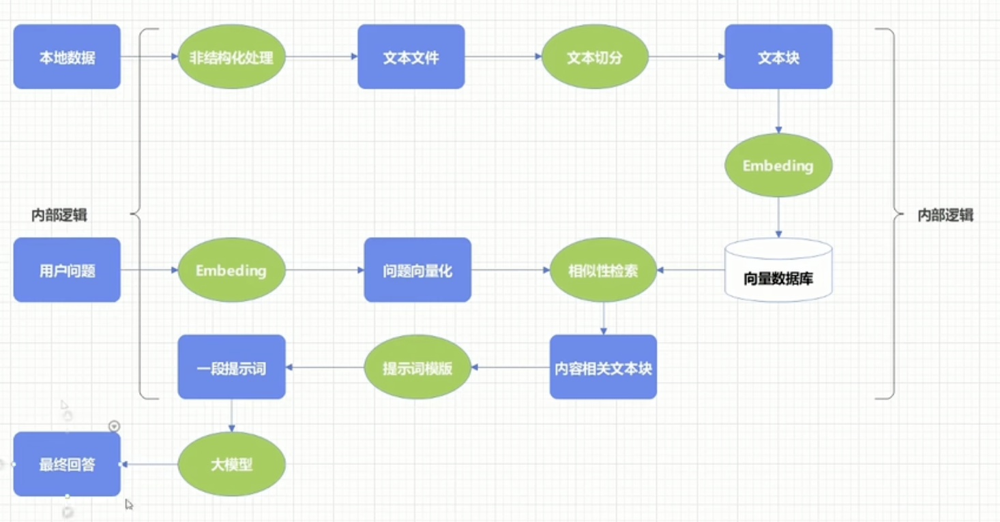

本文章来源于：<https://github.com/Zeb-D/my-review> ，请star 强力支持，你的支持，就是我的动力。

[TOC]

------

### 背景

本文主要的目的就是介绍大模型领域的名词及核心概念，从而避免在各种大模型信息之中不知道这个是什么。

其实大模型领域这些名词也好，概念也好，我们简单对他们理解下就是该领域的一些技术栈。

希望通过本文能帮助更多的人了解甚至进入大模型领域，去卷下他们的饭碗，毕竟你们的饭碗也要被大模型给卷没了。haha... 提前恭祝各位佬们好好渡过此劫。

那么接下来从大局上了解下大模型领域的全貌。

### 推荐经典书籍和资料

入门一个领域，必然要简单的系统性学习下相关知识，避免咱们的记忆细胞遗忘，俗话说，知识是存在立体的，那么如何把接触过的知识点组织称面、体，那就需要系统性学习了。

不想系统性学习的佬们这块可以跳过本节。

#### 机器学习基础

- 《机器学习》（西瓜书）
  - 适用：全面入门机器学习基础理论。
  - 另外，它的理论范围比《深度学习》更广，前期先建议泛读，然后在花书的时候结合编码细读。
  - 网上部份大佬的学习笔记：https://github.com/Tsingke/Machine-Learning_ZhouZhihua

#### 神经网络与深度学习基础

- 《深度学习》（花书）
  - Ian Goodfellow 等著，涵盖神经网络基础、概率模型、优化算法等核心理论。
  - 适用：全面入门深度学习原理。
- 《神经网络与深度学习》（邱锡鹏）
  - 中文教材，结合数学推导与 PyTorch 实现，适合系统学习。
  - 适用：理论与实践结合。
  - 线上一些动态演示：https://playground.tensorflow.org/

花书会简单讲些线性代数、微积分、概率论，所以需要大家要一定的这三者的基础。

#### 训练方法与优化

- 《Deep Learning Optimization: Algorithms and Theory》
  - 聚焦深度学习中的优化问题，包括 SGD、Adam 等优化器原理。
  - 适用：深入理解训练过程。
- 《Dive into Deep Learning》（动手学深度学习），另外一本花书。
  - 开源电子书，含 PyTorch 实现的预训练与微调案例。
  - 地址：[d2l.ai](https://d2l.ai/)  ，这里会有电子版书
  - 网上大佬的笔记：https://github.com/monkeyDemon/Learn_Dive-into-DL-PyTorch

#### Transformer 与大模型架构

- 《Attention Is All You Need》（原始论文）
  - 直接阅读 Transformer 的奠基性论文，理解自注意力机制。
  - 地址：[arXiv](https://arxiv.org/abs/1706.03762)
- 《Hands-On Machine Learning with Scikit-Learn, Keras, and TensorFlow》
  - 第 22 章详细讲解 Transformer 架构与实现。
  - 适用：实战派学习大模型架构。

#### 评估与应用

- 《Natural Language Processing with Transformers》
  - 基于 Hugging Face 库讲解大模型在 NLP 中的应用，含评估指标详解。
  - 适用：快速上手大模型应用开发。
- 《Speech and Language Processing》（第 3 版草稿）
  - 第 10 章介绍语言模型评估方法（困惑度、人类评估等）。
  - 地址：[SLP3](https://web.stanford.edu/~jurafsky/slp3/)

#### 伦理与安全

- 《Artificial Intelligence: A Modern Approach》（第 4 版）
  - 第 28 章讨论 AI 伦理，包括偏见、公平性与对抗攻击。
  - 适用：全面了解 AI 安全挑战。
- 《Human Compatible: Artificial Intelligence and the Problem of Control》
  - 从哲学与工程角度探讨 AI 对齐人类价值观的问题。
  - 适用：思考大模型的社会影响。

#### 进阶资源

- 国外的在线课程
  - CS224N（斯坦福大学自然语言处理）：Transformer、预训练模型。
  - CS231N（斯坦福大学计算机视觉）：神经网络基础。
- 国内的在线课程
  - B站比较多，注意看系列课的课名，看看会讲哪些
- 论文阅读
  - GPT 系列、BERT、T5 等模型的原始论文（arXiv 搜索）。
  - 推荐工具：[Papers with Code](https://paperswithcode.com/)（跟踪 SOTA）。
- 网站
  - Llm 可视化：https://bbycroft.net/llm
  - 神经网络可视化：https://playground.tensorflow.org/
  - Ollama 推理模型：https://ollama.com/   有比较多的训练好的模型
  - Huggingface 官网：https://huggingface.co/   有比较多的训练好的模型

#### 学习建议

- **入门路径**：先读《深度学习》或《动手学深度学习》，再深入 Transformer 论文与应用。
- **实践优先**：通过 Hugging Face 库尝试微调 BERT/GPT，结合《Natural Language Processing with Transformers》。
- **查漏补缺**：根据方向选择细分领域的书籍（如优化、伦理）。

### 代码框架

#### 基础框架（底层计算与模型构建）

##### 张量计算核心

| 框架           | 作用特性                                              | 典型应用场景                 | 生态关联                |
| -------------- | ----------------------------------------------------- | ---------------------------- | ----------------------- |
| **NumPy**      | 多维数组运算，Python 科学计算基石，C 语言底层优化     | 算法原型开发、数据预处理     | PyTorch/TensorFlow 依赖 |
| **PyTorch**    | 动态计算图，自动微分，丰富的 NN 模块库，调试友好      | 研究原型开发、自定义模型     | Hugging Face 原生支持   |
| **TensorFlow** | 静态计算图，编译优化，Keras 高级 API，端到端部署方案  | 工业级模型部署、移动端推理   | TensorFlow Serving 集成 |
| **JAX**        | 基于 NumPy 的函数式编程，支持 JIT 编译和 GPU/TPU 加速 | 高性能算法研究、定制训练流程 | Flax/Linen 框架依赖     |

##### 基础框架扩展

| 框架               | 作用特性                                                 | 典型应用场景           |
| ------------------ | -------------------------------------------------------- | ---------------------- |
| **SciPy**          | 基于 NumPy 的科学计算库，提供优化、积分、信号处理等算法  | 数值优化、模型评估     |
| **Pandas**         | 表格数据处理，支持高性能数据读写和统计分析               | 数据清洗、特征工程     |
| **Scikit - learn** | 经典机器学习算法库，提供分类、回归、聚类等模型及评估工具 | 传统 ML 任务、特征提取 |

#### 训练框架（模型训练与优化）

##### 预训练与微调工具

| 框架                          | 作用特性                                                     | 典型应用场景          | 资源需求                |
| ----------------------------- | ------------------------------------------------------------ | --------------------- | ----------------------- |
| **Hugging Face Transformers** | 提供 100 + 预训练模型，统一 API 接口，支持多模态模型         | 快速微调、跨模型对比  | 单卡 GPU 即可           |
| **DeepSpeed**                 | 微软开发的大规模训练优化框架，支持 ZeRO 优化、梯度累积、混合精度训练 | 10B + 参数模型训练    | 多卡 GPU/TPU 集群       |
| **Megatron - LM**             | NVIDIA 开发的超大规模 Transformer 训练框架，支持张量并行和管道并行 | 千亿参数模型训练      | 专用 GPU 集群（如 DGX） |
| **PEFT**                      | 参数高效微调库，支持 LoRA、QLoRA、Adapter 等轻量级微调方法   | 消费级 GPU 微调大模型 | RTX 3090 及以上         |

##### 训练流程管理

| 框架         | 作用特性                                                    | 典型应用场景       |
| ------------ | ----------------------------------------------------------- | ------------------ |
| **WandB**    | 实验跟踪与可视化，支持指标记录、模型版本管理、超参数调优    | 大规模实验管理     |
| **MLflow**   | 端到端机器学习生命周期管理，支持模型训练、打包、部署        | 企业级 ML 流程管理 |
| **Datasets** | Hugging Face 的数据加载与处理库，支持并行加载、缓存、批处理 | 大规模数据集管理   |

#### 推理框架

##### 高性能推理引擎

| 框架                        | 作用特性                                                     | 硬件支持   | 延迟优化                  |
| --------------------------- | ------------------------------------------------------------ | ---------- | ------------------------- |
| **ONNX Runtime**            | 跨平台推理引擎，支持 CPU/GPU/TPU，模型格式转换（PyTorch → ONNX） | 全平台     | INT8 量化（3 - 5x 加速）  |
| **TensorRT**                | NVIDIA GPU 专用推理优化器，支持网络层融合、动态形状、精度校准 | NVIDIA GPU | INT8 量化（5 - 10x 加速） |
| **vLLM**                    | 专为 LLM 设计的推理框架，支持 PagedAttention、连续批处理、KV 缓存优化 | NVIDIA GPU | 吞吐量提升 10 - 20x       |
| **Triton Inference Server** | 多模型服务部署，支持动态批处理、模型集成、自动扩缩容         | CPU/GPU    | 多模型资源调度优化        |

##### 轻量级部署方案

| 框架                    | 作用特性                                                     | 目标设备   | 典型场景           |
| ----------------------- | ------------------------------------------------------------ | ---------- | ------------------ |
| **TensorFlow Lite**     | 移动端推理优化，支持 Android/iOS，模型量化与压缩             | 移动设备   | 手机端 AI 应用     |
| **ONNX Runtime Mobile** | 轻量级移动端推理引擎，支持 ARM 架构，低内存占用              | 嵌入式设备 | 智能摄像头、无人机 |
| **llama.cpp**           | LLaMA 模型纯 C/C++ 实现，支持 CPU 推理，量化后可在 MacBook 运行 | 消费级设备 | 本地私人 AI 助手   |

#### 应用框架（AI 系统构建）

##### Agent 与工具链

| 框架          | 作用特性                                                     | 核心组件                | 典型应用               |
| ------------- | ------------------------------------------------------------ | ----------------------- | ---------------------- |
| **LangChain** | 构建基于 LLM 的应用框架，支持模型集成、工具调用、记忆管理、Agent 系统 | Chains, Agents, Memory  | 知识库问答、多工具协同 |
| **AutoGPT**   | 基于任务分解的自主 Agent 框架，支持长期规划和执行            | Task Planner, Executor  | 自动化项目管理         |
| **BabyAGI**   | 简化版任务优先级管理 Agent，专注于任务调度和执行             | Task Queue, Prioritizer | 多步骤推理任务         |

##### 向量检索与知识增强

| 框架           | 作用特性                                                    | 检索方式              | 数据规模   |
| -------------- | ----------------------------------------------------------- | --------------------- | ---------- |
| **Chroma**     | 轻量级向量数据库，支持语义搜索和过滤，与 LangChain 无缝集成 | 向量相似度检索        | 百万级向量 |
| **Weaviate**   | 支持多模态检索的向量数据库，支持文本、图像、音频混合查询    | 混合检索              | 亿级向量   |
| **LlamaIndex** | 知识索引框架，支持文档加载、索引构建、检索增强生成          | 语义检索 + 上下文注入 | 企业知识库 |

#### 框架选型决策树

1. **基础开发**：
   - 快速原型 → PyTorch + NumPy
   - 高性能计算 → JAX + XLA
   - 工业部署 → TensorFlow + Keras
2. **模型训练**：
   - 中小模型微调 → Hugging Face Transformers + PEFT
   - 百亿参数训练 → DeepSpeed + Megatron - LM
   - 实验管理 → WandB + MLflow
3. **推理部署**：
   - 实时服务 → TensorRT + Triton
   - 大模型在线 → vLLM + FlashAttention
   - 移动端 → TensorFlow Lite + ONNX Runtime Mobile
4. **应用构建**：
   - Agent 系统 → LangChain + AutoGPT
   - 知识问答 → LlamaIndex + Chroma

### 主流 AI 应用网站

部分大家经常性用到的一些网站。

#### 文字生成类

##### 通用大模型

- **ChatGPT**
  - **特性**：多轮对话、代码生成、创意写作、跨领域知识问答
  - **场景**：内容创作、编程辅助、日常问答
  - **官网**：https://chat.openai.com/
- **Claude 3**
  - **特性**：长文本处理（100k tokens）、文件分析、安全对齐
  - **场景**：学术研究、报告撰写、敏感内容处理
  - **官网**：https://claude.ai/
- **豆包**
  - **特性**：中文知识问答、行业知识库、多模态生成
  - **场景**：知识检索、多模态交互
  - **官网**：https://www.doubao.com/

##### 垂直领域应用

- **Jasper**
  - **特性**：营销文案生成（广告、标题、产品描述）
  - **场景**：电商、社交媒体运营、内容营销
  - **官网**：https://www.jasper.ai/
- **GitHub Copilot**
  - **特性**：上下文感知代码补全（Python、Java 等）
  - **场景**：软件开发、编程提效、代码解释
  - **官网**：https://github.com/features/copilot

#### 音频生成类

##### 语音合成

- **ElevenLabs**
  - **特性**：高精度语音克隆（仅需 30 秒样本）、情感调整、多语言支持
  - **场景**：有声书、播客、虚拟主播、语音助手
  - **官网**：https://elevenlabs.io/
- **Google Text - to - Speech**
  - **特性**：200+ voices、多语言支持、API 接入方便
  - **场景**：无障碍应用、智能设备语音交互、自动语音播报
  - **官网**：https://cloud.google.com/text - to - speech

##### 音乐生成

- AIVA
  - **特性**：AI 作曲（古典、流行、游戏音乐）、版权授权
  - **场景**：影视配乐、游戏开发、背景音乐创作
  - **官网**：https://www.aiva.ai/

#### 视频生成类

##### AI 生成视频

- **Runway ML**
  - **特性**：综合性 AI 视频工具（文本转视频、视频修复、风格迁移）
  - **场景**：影视特效、广告制作、创意视频生成
  - **官网**：https://runway.ml/
- **Pika 1.0**
  - **特性**：高分辨率视频生成（1080p+）、复杂场景和动作支持
  - **场景**：虚拟场景展示、动画预告片、短视频内容创作
  - **官网**：https://pika.art/

##### 视频编辑与处理

- **Descript**
  - **特性**：语音转文字、自动剪辑、AI 生成字幕
  - **场景**：播客后期、短视频制作、视频内容整理
  - **官网**：https://www.descript.com/
- **D-ID**
  - **特性**：文本驱动人物视频生成、自定义形象、唇形同步
  - **场景**：企业宣传、社交媒体内容、虚拟主播
  - **官网**：https://www.d-id.com/

##### 多模态生成类

- **MidJourney**
  - **特性**：文本生成高质量图像（艺术风格强）
  - **场景**：插画设计、游戏美术、广告创意
  - **官网**：https://www.midjourney.com/
- **Stable Diffusion WebUI**
  - **特性**：开源图像生成、自定义模型和参数
  - **场景**：科研实验、个性化创作、图像编辑
  - **官网**：https://github.com/AUTOMATIC1111/stable-diffusion-webui

### 大模型全生命周期的核心概念

#### 数据工程阶段

##### 数据收集

- **网络爬虫**（https://scrapy.org/）
  - **概念**：自动获取网页内容的程序
  - **特性**：高效抓取、支持分布式、需处理反爬机制
  - **原理**：通过 HTTP 请求获取 HTML，解析后提取目标数据
  - **场景**：新闻聚合、电商商品信息采集
- **数据标注平台**（https://labelstud.io/）
  - **概念**：用于人工标注数据的工具
  - **特性**：支持多模态标注、团队协作、标注流程管理
  - **场景**：图像分类标注、文本情感分析标注

##### 数据清洗

- **文本降噪**★

  - **概念**：去除文本中的噪声（如 HTML 标签、特殊符号）

  - **特性**：提升文本质量，减少模型训练干扰

  - 开发步骤

    ：

    1. 使用正则表达式过滤特殊字符
    2. 通过 BeautifulSoup 解析 HTML 标签
    3. 利用 NLP 工具识别并纠正拼写错误

- **数据去重**★

  - **概念**：识别并移除数据集中的重复样本
  - **特性**：减少冗余计算，避免模型过拟合
  - 开发步骤：
    1. 使用哈希函数生成数据指纹
    2. 基于相似度算法（如 SimHash）检测近似重复

### 

#### 模型设计阶段

##### 架构选择

- **Transformer**（https://arxiv.org/abs/1706.03762）★
  - **概念**：基于自注意力机制的深度学习架构
  - **特性**：长序列建模能力强、并行计算效率高
  - 开发步骤：
    1. 实现多头自注意力机制
    2. 构建前馈神经网络
    3. 添加残差连接和层归一化
- **Vision Transformer (ViT)**（https://arxiv.org/abs/2010.11929）
  - **概念**：将 Transformer 应用于计算机视觉任务
  - **特性**：减少对卷积的依赖，直接处理图像块

#### 预训练阶段

##### 预训练目标

- 掩码语言模型（MLM）★
  - **概念**：随机掩码输入中的部分 token，模型预测被掩码的 token
  - **特性**：双向语言理解能力强
  - 开发步骤：
    1. 按 15% 的比例随机选择 token 进行掩码
    2. 80% 的概率替换为 [MASK]，10% 替换为随机 token，10% 保持不变
    3. 训练模型预测被掩码的 token
- **自回归语言模型（AR）**
  - **概念**：基于历史 token 预测下一个 token
  - **特性**：生成能力强，适合文本生成任务

##### 分布式训练

- **数据并行**（https://pytorch.org/tutorials/intermediate/ddp_tutorial.html）★
  - **概念**：将批次数据分割到多个设备，每个设备保存完整模型
  - **特性**：实现简单，适合大多数场景
  - 开发步骤：
    1. 初始化分布式环境
    2. 包装模型为 DistributedDataParallel
    3. 分割数据并分发到各设备
- **模型并行**（https://github.com/NVIDIA/Megatron - LM）
  - **概念**：将模型参数分割到多个设备
  - **特性**：适合超大规模模型训练

#### 微调阶段

##### 参数高效微调

- **LoRA（Low - Rank Adaptation）**（https://github.com/huggingface/peft）★
  - **概念**：通过添加低秩矩阵来微调模型，冻结原始参数
  - **特性**：内存占用少，微调效率高
  - 开发步骤：
    1. 安装 PEFT 库：`pip install peft`
    2. 加载预训练模型
    3. 配置 LoRA 参数（如秩 r=8）并应用到模型
    4. 仅训练 LoRA 参数
- **Adapter**（https://arxiv.org/abs/1902.00751）
  - **概念**：在模型各层间添加小型适应层进行微调
  - **特性**：参数效率高，支持多任务适应

##### 全参数微调

- **概念**：更新模型的所有参数以适应特定任务
- **特性**：效果好但资源消耗大，需大量 GPU 内存
- **原理**：在特定领域数据上继续训练预训练模型
- 工具：
  - Hugging Face Transformers（https://huggingface.co/）：支持多种模型微调

#### 评估阶段

##### 自动评估

- **BLEU（Bilingual Evaluation Understudy）**
  - **概念**：评估机器翻译质量的指标
  - **特性**：计算速度快，与人类判断有一定相关性
  - **范围**：0 - 1，值越高越好
- **ROUGE（Recall - Oriented Understudy for Gisting Evaluation）**
  - **概念**：评估文本摘要质量的指标
  - **特性**：基于重叠 n - gram 计算召回率

#### 

##### 人工评估

- AB 测试★
  - **概念**：比较两个模型输出的优劣
  - **特性**：结果可靠，但成本高
  - 开发步骤：
    1. 准备测试数据集和评估标准
    2. 随机将用户分为两组，分别使用不同模型
    3. 收集用户反馈，比较两组表现

#### 部署阶段

##### 模型压缩

- **量化**（https://github.com/facebookresearch/llama.cpp）★
  - **概念**：将 32 位浮点数压缩为低精度格式（如 8 位整数、4 位整数）
  - **特性**：减小模型体积，加速推理
  - 开发步骤：
    1. 选择量化方法（如 GPTQ、AWQ）
    2. 安装量化工具库
    3. 对模型进行量化处理
    4. 验证量化后模型的性能
- **剪枝**（https://arxiv.org/abs/1810.05270）
  - **概念**：移除模型中不重要的连接或神经元
  - **特性**：降低计算复杂度，可能影响精度

#####  边缘部署

- TensorFlow Lite🌟（https://www.tensorflow.org/lite）
  - **概念**：专为移动和边缘设备优化的轻量级推理框架
  - 特性：
    - 模型压缩：支持量化、剪枝
    - 低内存占用：适合 Android/iOS 设备
  - **场景**：手机端 AI 应用（如拍照翻译、实时美颜）

#### 推理阶段

##### 推理优化

- **KV 缓存复用**🌟（https://arxiv.org/abs/2305.08891）
  - **概念**：在自回归生成中缓存历史键值对，避免重复计算
  - **特性**：减少计算量，显著提升生成速度（尤其长文本）
  - 开发步骤：
    1. 在模型初始化时配置 KV 缓存参数
    2. 在生成过程中复用已计算的键值对
    3. 支持动态调整缓存大小
- **Speculative Decoding**🌟（https://arxiv.org/abs/2302.01318）
  - **概念**：使用轻量级模型预生成 token，主模型验证后接受
  - **特性**：并行加速生成过程，降低延迟

##### 推理引擎

- **TensorRT**🌟（https://developer.nvidia.com/tensorrt）
  - **概念**：NVIDIA 开发的高性能推理优化器
  - 特性：
    - 网络层融合：合并卷积、激活函数等操作
    - 精度校准：支持 INT8/FP16 量化
  - **场景**：NVIDIA GPU 上的实时推理（如自动驾驶、视频流处理）
- **ONNX Runtime**🌟（https://onnxruntime.ai/）
  - **概念**：跨平台推理引擎，支持 CPU/GPU/TPU
  - 特性：
    - 模型格式转换：支持 PyTorch、TensorFlow 转 ONNX
    - 硬件加速：集成 DirectML（Windows）、OpenVINO（Intel）等后端

##### 批处理策略

- **静态批处理**🌟
  - **概念**：固定批次大小进行推理
  - **特性**：实现简单，但可能导致资源浪费（如请求长度差异大）
- **动态批处理**🌟（https://triton-inference-server.readthedocs.io/en/latest/）
  - **概念**：实时合并不同请求，动态调整批次形状
  - **特性**：提高吞吐量，适合请求密集型服务
  - **工具**：NVIDIA Triton Inference Server

##### 推理阶段关键技术指标

| 指标         | 定义                      | 作用         | 优化方法                                |
| ------------ | ------------------------- | ------------ | --------------------------------------- |
| **延迟**     | 单个请求的响应时间        | 评估实时性   | KV 缓存、批处理、量化                   |
| **吞吐量**   | 单位时间内处理的请求数    | 评估服务效率 | 动态批处理、多模型并行部署              |
| **显存占用** | 推理过程中占用的 GPU 内存 | 评估部署成本 | 模型量化、内存优化（如 PagedAttention） |

##### 典型推理优化工具链

| 工具           | 类型       | 特性                                          | 官网                                       |
| -------------- | ---------- | --------------------------------------------- | ------------------------------------------ |
| **vLLM**🌟      | 推理引擎   | 支持 PagedAttention、连续批处理，LLM 专用优化 | https://vllm.ai/                           |
| **Triton**🌟    | 推理服务器 | 支持多模型管理、动态批处理、自动扩缩容        | https://triton-inference-server.github.io/ |
| **llama.cpp**🌟 | CPU 推理库 | LLaMA 模型纯 C/C++ 实现，支持量化后 CPU 推理  | https://github.com/ggerganov/llama.cpp     |

#### 应用开发阶段

##### Agent 系统

- **ReAct 框架**（https://react-lm.github.io/）★
  - **概念**：结合推理（Reasoning）和行动（Action）的 Agent 架构
  - **特性**：可解释性强，能利用外部工具
  - 开发步骤：
    1. 定义可用工具（如搜索引擎、计算器）
    2. 设计思维提示模板（如 “需要查找 [信息]，调用 [工具]”）
    3. 实现推理 - 行动循环
    4. 后处理工具返回结果
- **LangChain**（https://python.langchain.com/）
  - **概念**：构建基于 LLM 的应用框架
  - **特性**：支持模型集成、工具链、记忆管理

##### Prompt engineer(提示词工程)

- 目的与应用
  这一领域的主要目的是通过改进交互方式，提高与 AI 系统沟通的质量和效率。
- 定义
  Prompt Engineering 指的是在与人工智能系统交互时，如何精心设计和优化输入语句(prompts)的过程。这个过程关注于如何构造问题或命令，以从 AI 系统获取最有效和相关的回应。
- 关键性质
  Prompt Engineering 重视语言的选择、上下文的应用，以及用户意图的明确表达。通过细致调整输入语句，可以优化 AI的理解和响应，从而提升整体的交互体验。
- Prompt engineer 提示词工程技巧
  - 清晰与具体性
    制定prompt时，需明确具体的信息需求，如主题的深度和范围。
  - 上下文的使用
    适当的上下文能提高回答质量，尤其是在询问特定地区或时间相关的问题时。
  - 避免歧义
    使用清晰、直接的语言，以减少误解，尤其在问题本身含有歧义时。

##### RAG(检索增强生成)

- 结合检索与生成
  RAG 融合了信息检索和文本生成两种技术，先从大数据中检索信息，再基于这些信息生成文本。
- 增强生成质量
  通过使用检索到的相关信息，RAG 旨在提高文本生成的相关性、准确性和深度。
- 应用于复杂查询
  RAG 特别适用于需要广泛知识和深度理解的复杂查询，能够提供更丰富、更精确的回答。

##### Al agent (AI代理人)

通向AGI(通用人工智能)的工具

- 信息检索与决策

  ​	AIAgents 是设计用来感知环境、做出决策并自主行动以实现特定目标的软件程序或系统。它们通过内部模型来考虑除当前输入之外的一些上下文，从而做出更为明智的决策。

- 目标导向

  ​	这些智能体可以像规划者一样，设定特定的目标或目的，并在当前状态、所需达到的目标以及达到这些目标的一系列行动之间进行选择。

#### 关键技术指标

| 指标       | 定义                   | 作用           | 计算方式                 |
| ---------- | ---------------------- | -------------- | ------------------------ |
| **参数量** | 模型中可训练参数的总数 | 衡量模型规模   | 统计所有可训练权重的数量 |
| **FLOPs**  | 浮点运算次数           | 评估计算复杂度 | 与模型结构和输入长度相关 |
| **吞吐量** | 单位时间内处理的样本数 | 评估推理效率   | 样本数 / 处理时间        |
| **延迟**   | 单个请求的响应时间     | 评估实时性     | 从请求到响应的时间差     |

#### 伦理与安全

##### 偏见检测

- **WEAT（Word Embedding Association Test）**
  - **概念**：检测词嵌入中的性别、种族等偏见
  - **原理**：计算目标词与属性词之间的关联强度
- **Fairlearn**（https://fairlearn.org/）
  - **概念**：微软开发的公平性评估工具包
  - **特性**：支持多种偏见检测和缓解方法

##### 水印技术

- A Watermark for Large Language Models（https://arxiv.org/abs/2301.10226）
  - **原理**：在生成文本中嵌入统计上可检测的模式
  - **特性**：不可感知，可验证生成内容来源

#### 行业应用

##### 医疗

- 辅助诊断
  - **案例**：使用 BioGPT 分析医学影像和病历数据
  - **技术栈**：医学专用大模型 + 知识图谱

##### 金融

- 风险评估
  - **案例**：基于新闻和财报数据预测企业信用风险
  - **技术栈**：文本分析 + 时间序列模型

#### 典型工具链

##### 数据处理

- Datasets（https://huggingface.co/docs/datasets/index）
  - **特性**：支持多种格式，高效加载和处理大规模数据集

##### 模型训练

- DeepSpeed（https://www.deepspeed.ai/）
  - **特性**：支持 ZeRO 优化、梯度累积、混合精度训练

##### 推理部署

- vLLM（https://vllm.ai/）
  - **特性**：专为 LLM 设计，支持 PagedAttention 和连续批处理

#### 前沿技术

##### 多模态

- CLIP（Contrastive Language - Image Pretraining）（https://openai.com/research/clip）
  - **概念**：跨模态对比学习模型
  - **特性**：理解图像和文本之间的关联

##### 强化学习

- RLHF（Reinforcement Learning from Human Feedback）（https://arxiv.org/abs/2203.02155）
  - **概念**：基于人类反馈的强化学习
  - **特性**：优化模型输出符合人类偏好

