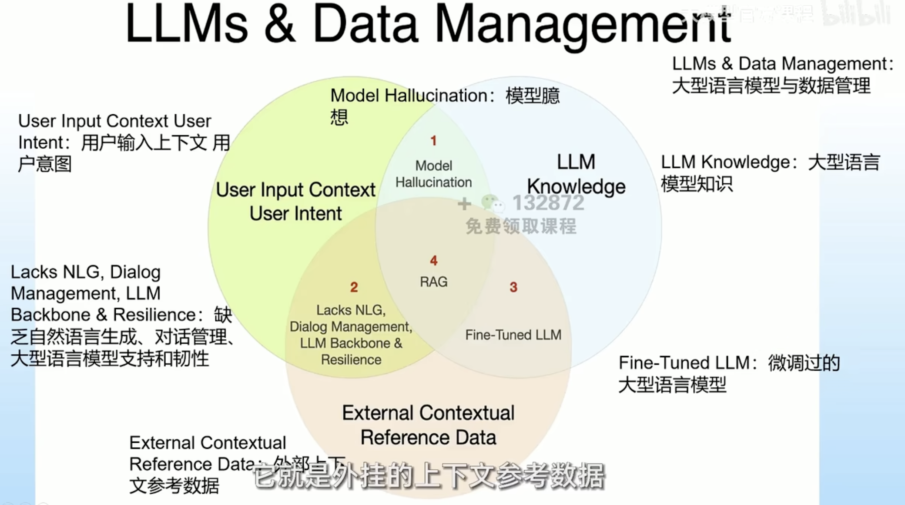

本文章来源于：<https://github.com/Zeb-D/my-review> ，请star 强力支持，你的支持，就是我的动力。

[TOC]

------

### 背景

大语言模型在各种自然语言处理（NLP）任务中取得了卓越的性能，对于大模型的研究也在持续中，包括LLMs的内部机制、训练策略、架构设计、分部署训练等。随随着大模型参数的指数级增长和训练计算能力的提升，即模型规模的扩大，大模型展现出了许多涌现能力（Emergent Abilities），例如上下文学习、按指令执行能力、逐步推理能力等，这些都是小语言模型（如BERT）所不具备的，同时也带来了一些弊病，比如幻觉。如何快速了解并且深入研究大模型就成了一项重要的课题。

### 名称解释

#### 知识库

知识库的定义
存储知识和信息的系统

知识库的分类
传统知识库和AI知识库

AI知识库的特点
与LLM结合，AI系统更好地利用本地知识来响应查询和执行任务

#### Embeding

嵌入，又称向量化，矢量化

向量化表示
Embedding是将文本数据(如单词、短语或整个文档)转换为数值向量的过程。这些数值向量捕捉到了文本项的语义和语法特征使得计算机能够处理文本数据。

维度降低
通过embedding，可以将每个文本项表示为一个较低维度的稠密向量，这些向量在较小的维度空间内保持了原始数据的重要特征。

语义关系

embedding向量能够编码语义信息，使得语义上相似的词汇在向量空间中彼此接近。这一特性使得embedding在信息检索、文本分类、情感分析等任务中非常有效。

#### Prompt engineer(提示词工程)

目的与应用
这一领域的主要目的是通过改进交互方式，提高与 AI 系统沟通的质量和效率。

定义
Prompt Engineering 指的是在与人工智能系统交互时，如何精心设计和优化输入语句(prompts)的过程。这个过程关注于如何构造问题或命令，以从 AI 系统获取最有效和相关的回应。

关键性质
Prompt Engineering 重视语言的选择、上下文的应用，以及用户意图的明确表达。通过细致调整输入语句，可以优化 AI的理解和响应，从而提升整体的交互体验。

#### Prompt engineer 提示词工程技巧

清晰与具体性
制定prompt时，需明确具体的信息需求，如主题的深度和范围。

上下文的使用
适当的上下文能提高回答质量，尤其是在询问特定地区或时间相关的问题时。

避免歧义
使用清晰、直接的语言，以减少误解，尤其在问题本身含有歧义时。

#### RAG(检索增强生成)

结合检索与生成
RAG 融合了信息检索和文本生成两种技术，先从大数据中检索信息，再基于这些信息生成文本。

增强生成质量
通过使用检索到的相关信息，RAG 旨在提高文本生成的相关性、准确性和深度。

应用于复杂查询
RAG 特别适用于需要广泛知识和深度理解的复杂查询，能够提供更丰富、更精确的回答。

#### Finetuning(微调)

模型优化
微调是对预训练的人工智能模型进行进一步训练，以便它更好地适应特定的任务或数据集。

数据适应性
通过使用特定领域或任务的数据，微调调整模型的参数使其更适合于该特定环境。

性能提升
微调的目的是提高模型在特定任务上的表现，比如提升精度、减少错误率或提高处理速度。

#### Al agent (AI代理人)

通向AGI(通用人工智能)的工具

信息检索与决策
AIAgents 是设计用来感知环境、做出决策并自主行动以实现特定目标的软件程序或系统。它们通过内部模型来考虑除当前输入之外的一些上下文，从而做出更为明智的决策。

目标导向
这些智能体可以像规划者一样，设定特定的目标或目的，并在当前状态、所需达到的目标以及达到这些目标的一系列行动之间进行选择。

#### 人工智能技术的挑战

数据隐私保护
保护学生个人信息的安全

技术依赖性

对人工智能技术的依赖和应用能力

人机互动

有效整合人与机器的互动方式

#### Langchain

通用大模型无法回答专业领域内容

### 大模型的涌现能力

随着模型规模的不断扩展，下游任务的性能和样本效率得到了显著的提高。但是当模型的大小突破某个临界规模的时候，开始出现一些意想不到的能力，展示出一些意外的、更为复杂的能力和特性，模型能够自动地从原始训练数据中学习并发现新的、更为高级的特征和模式，这种能力通常被称为“涌现能力”。拥有涌现能力的机器学习模型被认为是在独立意义上更为强大的大型模型，这也是它们与小型模型最为显著的区别。

- 上下文学习能力(In-context learning)

指模型能够通过给定的自然语言指令和任务示例,生成预期的输出,而无需额外训练或梯度更新。这种能力在GPT-3等大规模模型中表现明显[1]。

- 按指令执行能力(Instruction following)

通过对多任务数据集进行指令微调,大模型能够遵循新任务的指令,在未见任务上表现良好,展现出改进的泛化能力。当模型规模达到一定程度(如68B参数)时,这种能力会显著提升[1]。

- 逐步推理能力(Step-by-step reasoning)

借助思维链(Chain-of-Thought)提示策略,大模型可以利用中间推理步骤来解决复杂的多步推理任务,如数学词问题等。当模型规模超过60B时,这种能力会显著增强[1]。

- 知识推理和迁移能力

大模型能够在看似不相关的任务之间进行知识迁移和推理,表现出通用的推理能力[2]。

当然也有研究指出,所谓的"涌现能力"可能只是由于研究者选择的非线性、非连续的评估指标所导致,如果使用线性、连续的指标,涌现现象可能会消失。因此,对于大模型的涌现能力是否真实存在还有一定争议。

### 对NLP的影响

回到NLP领域的深度学习时代，在最近10年有两次重要的研究范式的改变。

**从深度学习到预训练模型**

这个时间段主要从深度学习引入NLP到GPT3.0出现之前。在Bert和GPT模型之前，NLP领域主要采用深度学习，核心技术包括改进的LSTM和CNN模型作为特征提取器，以及Sequence to Sequence（encoder-decoder）+Attention作为主要技术框架。这些技术的主要研究目标是增加模型层深度和参数容量，但效果不尽理想，主要原因是数据量有限和特征提取器表达能力不足。Bert和GPT的出现代表了NLP领域的技术飞跃，改变了研究范式，导致部分子领域技术衰退，同时NLP技术方法和框架趋向统一。

这会带来两方面的影响：

1.中间任务的消亡

NLP涵盖多个子领域，可分为中间任务和最终任务两类。中间任务如分词、词性标注等并不直接满足实际需求，而最终任务如文本分类、机器翻译则直接服务于用户。随着Bert/GPT的出现，中间任务的必要性逐渐减弱，因为这些模型已经通过预训练学得了语言学特征，使得直接解决最终任务成为可能，无需专门建模中间过程。

2.技术路线的统一

NLP任务可以分为自然语言理解和自然语言生成两类。自然语言理解包括文本分类等，而自然语言生成包括聊天机器人、机器翻译等。自从Bert/GPT出现后，NLP技术呈现了统一趋势，特征抽取器从LSTM/CNN转向Transformer，而各种NLP任务采用了两阶段模式：模型预训练+Fine-tuning或Zero/Few Shot Prompt。这种趋势也在其他领域中得到了延伸，Transformer模型正逐步替代其他模型，形成了两种预训练模型框架，即Bert模式和GPT模式。

**从预训练模型到通用人工智能**

大约从GPT3.0问世一直持续到现在，而ChatGPT是转变中的关键节点。在InstructGPT出现之前，LLM处于转变前的过渡期。

过渡期是从GPT 3.0出现一直持续到现在，其中以“自回归语言模型+Prompting”模式为主导。虽然Bert模式在早期技术框架中更被看好，但随着技术发展，LLM模型几乎全面采用类似GPT 3.0的模式。这种转变源于两个原因：首先，生成模型更适合零示例提示和少数示例提示方式；其次，这种模式统一了自然语言理解和自然语言生成任务的外在表现形式。这种趋势的下一个阶段可能是更加自然的任务描述方式，同时LLM模型能够完全理解并适应。这种技术的代表是ChatGPT，它以Instruct模式取代了Prompting，带来了新的技术范式转换和影响。

1.**让LLM适配人的新型交互接口**

ChatGPT在接口层面实现了LLM与人的适配，注入了人类偏好知识，提升了LLM的易用性和用户体验。其最大贡献是基本实现了理想LLM的接口层，使LLM适配人类的习惯命令表达方式，增加了LLM的听懂人话和礼貌性，提高了用户体验。这种人机接口技术更符合人类表达习惯，将激发后续LLM模型在易用性方面的进一步工作。

2.**很多NLP子领域不再具备独立研究价值**

这次范式转换将很多NLP子领域纳入LLM技术体系，导致它们逐步失去独立研究的价值。随着LLM模型规模增大，很多领域问题会被解决，未来技术发展趋势是追求更大规模的LLM模型。判断领域是否需独立研究可考虑LLM效果是否超过人类表现或模式效果对比。这对NLP领域的研究者意味着要选择继续研究领域问题还是投入LLM模型建设，需要考虑有能力、有条件去做LLM建设的机构。

3.**更多NLP之外的研究领域将被纳入LLM技术体系**

现在是追求领域无关通用人工智能模型的时候了，即使LLM目前在NLP表现出色，也不应限制其任务范围。ChatGPT展示了这一可行性，未来LLM将吸纳更多领域并成为通用人工智能的一部分。图像处理和多模态任务也会逐步融入LLM，尽管这可能进展较慢，因为图像领域仍需深入研究。除此之外，更多领域也会融入理想LLM，这是一个具有高价值的研究主题。主流技术进展可分为LLM吸收知识和人机接口两大类，其中包括In Context Learning和Instruct模式等技术。

### 大模型机制

参考资料：https://mp.weixin.qq.com/s/CsYzQUQKs98_yf0lWVWhpA
