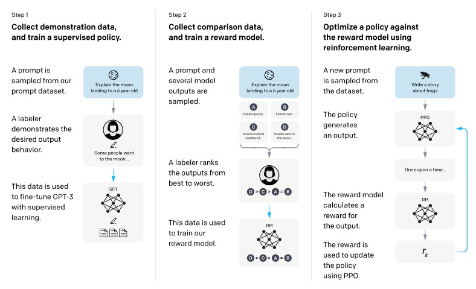
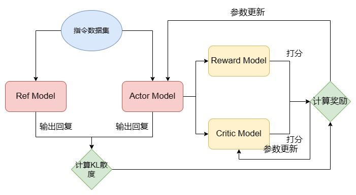

# NLP 基础概念

自然语言处理（Natural Language Processing，NLP）作为人工智能领域的一个重要分支，旨在使计算机能够理解和处理人类语言，实现人机之间的自然交流。随着信息技术的飞速发展，文本数据已成为我们日常生活中不可或缺的一部分，NLP技术的进步为我们从海量文本中提取有用信息、理解语言的深层含义提供了强有力的工具。从早期的基于规则的方法，到后来的统计学习方法，再到当前深度学习技术的广泛应用，NLP领域经历了多次技术革新，文本表示作为NLP的核心技术之一，其研究和进步对于提升NLP系统的性能具有决定性的作用。

欢迎大家来到 NLP 基础概念的学习，本章节将为大家介绍 NLP 的基础概念，帮助大家更好地理解和回顾 NLP 的相关知识。

## 1.1 什么是 NLP

NLP 是 一种让计算机理解、解释和生成人类语言的技术。它是人工智能领域中一个极为活跃和重要的研究方向，其核心任务是通过计算机程序来模拟人类对语言的认知和使用过程。NLP 结合了计算机科学、人工智能、语言学和心理学等多个学科的知识和技术，旨在打破人类语言和计算机语言之间的障碍，实现无缝的交流与互动。

NLP技术使得计算机能够执行各种复杂的语言处理任务，如中文分词、子词切分、词性标注、文本分类、实体识别、关系抽取、文本摘要、机器翻译、自动问答等。这些任务不仅要求计算机能够识别和处理语言的表层结构，更重要的是可以理解语言背后的深层含义，包括语义、语境、情感和文化等方面的复杂因素。

随着深度学习等现代技术的发展，NLP 已经取得了显著的进步。通过训练大量的数据，深度学习模型能够学习到语言的复杂模式和结构，从而在多个 NLP 任务上取得了接近甚至超越人类水平的性能。然而，尽管如此，NLP 仍然面临着诸多挑战，如处理歧义性、理解抽象概念、处理隐喻和讽刺等。研究人员正致力于通过更加先进的算法、更大规模的数据集和更精细的语言模型来解决这些问题，以推动NLP技术不断发展。

## 1.2 NLP 发展历程

NLP 的发展历程是从早期的规则基础方法，到统计方法，再到现在的机器学习和深度学习方法的演变过程。每一次技术变革都极大地推动了 NLP 技术的发展，使其在机器翻译、情感分析、实体识别和文本摘要等任务上取得了显著成就。随着计算能力的不断增强和算法的不断优化，NLP的未来将更加光明，能够在更多领域发挥更加重要的作用。

### 早期探索（1940年代 - 1960年代）

NLP 的早期探索始于二战后，当时人们认识到将一种语言自动翻译为另一种语言的重要性。1950年，艾伦·图灵提出了图灵测试。

> 他说，如果一台机器可以通过使用打字机成为对话的一部分，并且能够完全模仿人类，没有明显的差异，那么机器可以被认为是能够思考的。

这是判断机器是否能够展现出与人类不可区分的智能行为的测试。这一时期，诺姆·乔姆斯基提出了生成语法理论，这对理解机器翻译的工作方式产生了重要影响。然而，这一时期的机器翻译系统非常简单，主要依赖字典查找和基本的词序规则来进行翻译，效果并不理想。

### 符号主义与统计方法（1970年代 - 1990年代）

1970年代以后，NLP 研究者开始探索新的领域，包括逻辑基础的范式和自然语言理解。这一时期，研究者分为符号主义（或规则基础）和统计方法两大阵营。符号主义研究者关注于形式语言和生成语法，而统计方法的研究者更加关注于统计和概率方法。1980年代，随着计算能力的提升和机器学习算法的引入，NLP领域出现了革命性的变化，统计模型开始取代复杂的“手写”规则。

### 机器学习与深度学习（2000年代至今）

2000年代以后，随着深度学习技术的发展，NLP 领域取得了显著的进步。深度学习模型如循环神经网络（Recurrent Neural Network，RNN）、长短时记忆网络（Long Short-Term Memory，LSTM）和注意力机制等技术被广泛应用于 NLP 任务中，取得了令人瞩目的成果。2013年，Word2Vec模型的提出开创了词向量表示的新时代，为NLP任务提供了更加有效的文本表示方法。2018年，BERT模型的问世引领了预训练语言模型的新浪潮，为NLP技术的发展带来了新的机遇和挑战。近年来，基于Transformer的模型，如GPT-3，通过训练巨大参数的模型，能够生成高质量的文本，甚至在某些情况下可以与人类写作相媲美。


## 1.3 NLP 任务

在NLP的广阔研究领域中，有几个核心任务构成了NLP领域的基础，它们涵盖了从文本的基本处理到复杂的语义理解和生成的各个方面。这些任务包括但不限于中文分词、子词切分、词性标注、文本分类、实体识别、关系抽取、文本摘要、机器翻译以及自动问答系统的开发。每一项任务都有其特定的挑战和应用场景，它们共同推动了语言技术的发展，为处理和分析日益增长的文本数据提供了强大的工具。

### 1.3.1 中文分词

中文分词（Chinese Word Segmentation, CWS）是 NLP 领域中的一个基础任务。在处理中文文本时，由于中文语言的特点，词与词之间没有像英文那样的明显分隔（如空格），所以无法直接通过空格来确定词的边界。因此，中文分词成为了中文文本处理的首要步骤，其目的是将连续的中文文本切分成有意义的词汇序列。

```
英文输入：The cat sits on the mat.
英文切割输出：[The | cat | sits | on | the | mat]
中文输入：今天天气真好，适合出去游玩.
中文切割输出：["今天", "天气", "真", "好", "，", "适合", "出去", "游玩", "。"]
```

正确的分词结果对于后续的词性标注、实体识别、句法分析等任务至关重要。如果分词不准确，将直接影响到整个文本处理流程的效果。

```
输入：雍和宫的荷花开的很好。

正确切割：雍和宫 | 的 | 荷花 | 开 | 的 | 很 | 好 | 。
错误切割 1：雍 | 和 | 宫的 | 荷花 | 开的 | 很好 | 。 （地名被拆散）
错误切割 2：雍和 | 宫 | 的荷 | 花开 | 的很 | 好。 （词汇边界混乱）
```

正确的分词结果对于后续的词性标注、实体识别、句法分析等任务至关重要。如果分词不准确，将直接影响到整个文本处理流程的效果。

### 1.3.2 子词切分

子词切分（Subword Segmentation）是 NLP 领域中的一种常见的文本预处理技术，旨在将词汇进一步分解为更小的单位，即子词。子词切分特别适用于处理词汇稀疏问题，即当遇到罕见词或未见过的新词时，能够通过已知的子词单位来理解或生成这些词汇。子词切分在处理那些拼写复杂、合成词多的语言（如德语）或者在预训练语言模型（如BERT、GPT系列）中尤为重要。

子词切分的方法有很多种，常见的有Byte Pair Encoding (BPE)、WordPiece、Unigram、SentencePiece等。这些方法的基本思想是将单词分解成更小的、频繁出现的片段，这些片段可以是单个字符、字符组合或者词根和词缀。

```
输入：unhappiness

不使用子词切分：整个单词作为一个单位，输出：“unhappiness”
使用子词切分（假设BPE算法）：单词被分割为：“un”、“happi”、“ness”
```

在这个例子中，通过子词切分，“unhappiness”这个词被分解成了三个部分：前缀“un”表示否定，“happi”是“happy”的词根变体，表示幸福，“ness”是名词后缀，表示状态。即使模型从未见过“unhappiness”这个完整的单词，它也可以通过这些已知的子词来理解其大致意思为“不幸福的状态”。

### 1.3.3 词性标注

词性标注（Part-of-Speech Tagging，POS Tagging）是 NLP 领域中的一项基础任务，它的目标是为文本中的每个单词分配一个词性标签，如名词、动词、形容词等。这个过程通常基于预先定义的词性标签集，如英语中的常见标签有名词（Noun，N）、动词（Verb，V）、形容词（Adjective，Adj）等。词性标注对于理解句子结构、进行句法分析、语义角色标注等高级NLP任务至关重要。通过词性标注，计算机可以更好地理解文本的含义，进而进行信息提取、情感分析、机器翻译等更复杂的处理。

假设我们有一个英文句子：She is playing the guitar in the park.

词性标注的结果如下：

- She (代词，Pronoun，PRP)
- is (动词，Verb，VBZ)
- playing (动词的现在分词，Verb，VBG)
- the (限定词，Determiner，DT)
- guitar (名词，Noun，NN)
- in (介词，Preposition，IN)
- the (限定词，Determiner，DT)
- park (名词，Noun，NN)
- . (标点，Punctuation，.)

词性标注通常依赖于机器学习模型，如隐马尔可夫模型（Hidden Markov Model，HMM）、条件随机场（Conditional Random Field，CRF）或者基于深度学习的循环神经网络 RNN 和长短时记忆网络 LSTM 等。这些模型通过学习大量的标注数据来预测新句子中每个单词的词性。

### 1.3.4 文本分类

文本分类（Text Classification）是 NLP 领域的一项核心任务，涉及到将给定的文本自动分配到一个或多个预定义的类别中。这项技术广泛应用于各种场景，包括但不限于情感分析、垃圾邮件检测、新闻分类、主题识别等。文本分类的关键在于理解文本的含义和上下文，并基于此将文本映射到特定的类别。

假设有一个文本分类任务，目的是将新闻文章分类为“体育”、“政治”或“科技”三个类别之一。

```
文本：“NBA季后赛将于下周开始，湖人和勇士将在首轮对决。”
类别：“体育”

文本：“美国总统宣布将提高关税，引发国际贸易争端。”
类别：“政治”

文本：“苹果公司发布了新款 Macbook，配备了最新的m3芯片。”
类别：“科技”
```

文本分类任务的成功关键在于选择合适的特征表示和分类算法，以及拥有高质量的训练数据。随着深度学习技术的发展，使用神经网络进行文本分类已经成为一种趋势，它们能够捕捉到文本数据中的复杂模式和语义信息，从而在许多任务中取得了显著的性能提升。

### 1.3.5 实体识别

实体识别（Named Entity Recognition, NER），也称为命名实体识别，是 NLP 领域的一个关键任务，旨在自动识别文本中具有特定意义的实体，并将它们分类为预定义的类别，如人名、地点、组织、日期、时间等。实体识别任务对于信息提取、知识图谱构建、问答系统、内容推荐等应用很重要，它能够帮助系统理解文本中的关键元素及其属性。

假设有一个实体识别任务，目的是从文本中识别出人名、地名和组织名等实体。

```
输入：李雷和韩梅梅是北京市海淀区的居民，他们计划在2024年4月7日去上海旅行。

输出：[("李雷", "人名"), ("韩梅梅", "人名"), ("北京市海淀区", "地名"), ("2024年4月7日", "日期"), ("上海", "地名")]
```

通过实体识别任务，我们不仅能识别出文本中的实体，还能了解它们的类别，为深入理解文本内容和上下文提供了重要信息。随着NLP技术的发展，实体识别的精度和效率不断提高，可以为各种NLP应用提供强大的支持。

### 1.3.6 关系抽取

关系抽取（Relation Extraction）是 NLP 领域中的一项关键任务，它的目标是从文本中识别实体之间的语义关系。这些关系可以是因果关系、拥有关系、亲属关系、地理位置关系等，关系抽取对于理解文本内容、构建知识图谱、提升机器理解语言的能力等方面具有重要意义。

假设我们有以下句子：

```
输入：比尔·盖茨是微软公司的创始人。

输出：[("比尔·盖茨", "创始人", "微软公司")]
```

在这个例子中，关系抽取任务的目标是从文本中识别出“比尔·盖茨”和“微软公司”之间的“创始人”关系。通过关系抽取，我们可以从文本中提取出有用的信息，帮助计算机更好地理解文本内容，为后续的知识图谱构建、问答系统等任务提供支持。

### 1.3.7 文本摘要

文本摘要（Text Summarization）是 NLP 中的一个重要任务，目的是生成一段简洁准确的摘要，来概括原文的主要内容。根据生成方式的不同，文本摘要可以分为两大类：抽取式摘要（Extractive Summarization）和生成式摘要（Abstractive Summarization）。

- 抽取式摘要：抽取式摘要通过直接从原文中选取关键句子或短语来组成摘要。优点是摘要中的信息完全来自原文，因此准确性较高。然而，由于仅仅是原文中句子的拼接，有时候生成的摘要可能不够流畅。
- 生成式摘要：与抽取式摘要不同，生成式摘要不仅涉及选择文本片段，还需要对这些片段进行重新组织和改写，并生成新的内容。生成式摘要更具挑战性，因为它需要理解文本的深层含义，并能够以新的方式表达相同的信息。生成式摘要通常需要更复杂的模型，如基于注意力机制的序列到序列模型（Seq2Seq）。

假设我们有以下新闻报道：

```
2021年5月22日，国家航天局宣布，我国自主研发的火星探测器“天问一号”成功在火星表面着陆。此次任务的成功，标志着我国在深空探测领域迈出了重要一步。“天问一号”搭载了多种科学仪器，将在火星表面进行为期90个火星日的科学探测工作，旨在研究火星地质结构、气候条件以及寻找生命存在的可能性。
```

抽取式摘要：

```
我国自主研发的火星探测器“天问一号”成功在火星表面着陆，标志着我国在深空探测领域迈出了重要一步。
```

生成式摘要：

```
“天问一号”探测器成功实现火星着陆，代表我国在宇宙探索中取得重大进展。
```

文本摘要任务在信息检索、新闻推送、报告生成等领域有着广泛的应用。通过自动摘要，用户可以快速获取文本的核心信息，节省阅读时间，提高信息处理效率。

### 1.3.8 机器翻译

机器翻译（Machine Translation, MT）是 NLP 领域的一项核心任务，指使用计算机程序将一种自然语言（源语言）自动翻译成另一种自然语言（目标语言）的过程。机器翻译不仅涉及到词汇的直接转换，更重要的是要准确传达源语言文本的语义、风格和文化背景等，使得翻译结果在目标语言中自然、准确、流畅，以便跨越语言障碍，促进不同语言使用者之间的交流与理解。

假设我们有一句中文：“今天天气很好。”，我们想要将其翻译成英文。

```
源语言：今天天气很好。

目标语言：The weather is very nice today.
```

在这个简单的例子中，机器翻译能够准确地将中文句子转换成英文，保持了原句的意义和结构。然而，在处理更长、更复杂的文本时，机器翻译面临的挑战也会相应增加。为了提高机器翻译的质量，研究者不断探索新的方法和技术，如基于神经网络的Seq2Seq模型、Transformer模型等，这些模型能够学习到源语言和目标语言之间的复杂映射关系，从而实现更加准确和流畅的翻译。

### 1.3.9 自动问答

自动问答（Automatic Question Answering, QA）是 NLP 领域中的一个高级任务，旨在使计算机能够理解自然语言提出的问题，并根据给定的数据源自动提供准确的答案。自动问答任务模拟了人类理解和回答问题的能力，涵盖了从简单的事实查询到复杂的推理和解释。自动问答系统的构建涉及多个NLP子任务，如信息检索、文本理解、知识表示和推理等。

自动问答大致可分为三类：检索式问答（Retrieval-based QA）、知识库问答（Knowledge-based QA）和社区问答（Community-based QA）。检索式问答通过搜索引擎等方式从大量文本中检索答案；知识库问答通过结构化的知识库来回答问题；社区问答则依赖于用户生成的问答数据，如问答社区、论坛等。

自动问答系统的开发和优化是一个持续的过程，随着技术的进步和算法的改进，这些系统在准确性、理解能力和应用范围上都有显著的提升。通过结合不同类型的数据源和技术方法，自动问答系统正变得越来越智能，越来越能够处理复杂和多样化的问题。

## 1.4 文本表示的发展历程

文本表示的目的是将人类语言的自然形式转化为计算机可以处理的形式，也就是将文本数据数字化，使计算机能够对文本进行有效的分析和处理。文本表示是 NLP 领域中的一项基础性和必要性工作，它直接影响甚至决定着 NLP 系统的质量和性能。

在 NLP 中，文本表示涉及到将文本中的语言单位（如字、词、短语、句子等）以及它们之间的关系和结构信息转换为计算机能够理解和操作的形式，例如向量、矩阵或其他数据结构。这样的表示不仅需要保留足够的语义信息，以便于后续的 NLP 任务，如文本分类、情感分析、机器翻译等，还需要考虑计算效率和存储效率。

文本表示的发展历程经历了多个阶段，从早期的基于规则的方法，到统计学习方法，再到当前的深度学习技术，文本表示技术不断演进，为 NLP 的发展提供了强大的支持。

### 1.1.5 词向量

向量空间模型（Vector Space Model, VSM）是 NLP 领域中一个基础且强大的文本表示方法，最早由哈佛大学Salton提出。向量空间模型通过将文本（包括单词、句子、段落或整个文档）转换为高维空间中的向量来实现文本的数学化表示。在这个模型中，每个维度代表一个特征项（例如，字、词、词组或短语），而向量中的每个元素值代表该特征项在文本中的权重，这种权重通过特定的计算公式（如词频TF、逆文档频率TF-IDF等）来确定，反映了特征项在文本中的重要程度。

向量空间模型的应用极其广泛，包括但不限于文本相似度计算、文本分类、信息检索等自然语言处理任务。它将复杂的文本数据转换为易于计算和分析的数学形式，使得文本的相似度计算和模式识别成为可能。此外，通过矩阵运算如特征值计算、奇异值分解（singular value decomposition, SVD）等方法，可以优化文本向量表示，进一步提升处理效率和效果。

然而，向量空间模型也存在很多问题。其中最主要的是数据稀疏性和维数灾难问题，因为特征项数量庞大导致向量维度极高，同时多数元素值为零。此外，由于模型基于特征项之间的独立性假设，忽略了文本中的结构信息，如词序和上下文信息，限制了模型的表现力。特征项的选择和权重计算方法的不足也是向量空间模型需要解决的问题。

VSM 方法词向量：

```python
# "雍和宫的荷花很美"
# 词汇表大小：16384，句子包含词汇：["雍和宫", "的", "荷花", "很", "美"] = 5个词

vector = [0, 0, ..., 1, 0, ..., 1, 0, ..., 1, 0, ..., 1, 0, ..., 1, 0, ...]
#                    ↑          ↑          ↑          ↑          ↑
#      16384维中只有5个位置为1，其余16379个位置为0
# 实际有效维度：仅5维（非零维度）
# 稀疏率：(16384-5)/16384 ≈ 99.97%
```
> 词汇表是一个包含所有可能出现的词语的集合。在向量空间模型中，每个词对应词汇表中的一个位置，通过这种方式可以将词语转换为向量表示。例如，如果词汇表大小为 16384 ，那么每个词都会被表示为一个 16384 维的向量，其中只有该词对应的位置为 1，其他位置都为 0。

为了解决这些问题，研究者们对向量空间模型的研究主要集中在两个方面：一是改进特征表示方法，如借助图方法、主题方法等进行关键词抽取；二是改进和优化特征项权重的计算方法，可以在现有方法的基础上进行融合计算或提出新的计算方法.

### 1.1.6 语言模型

N-gram 模型是 NLP 领域中一种基于统计的语言模型，广泛应用于语音识别、手写识别、拼写纠错、机器翻译和搜索引擎等众多任务。N-gram模型的核心思想是基于马尔可夫假设，即一个词的出现概率仅依赖于它前面的N-1个词。这里的N代表连续出现单词的数量，可以是任意正整数。例如，当N=1时，模型称为unigram，仅考虑单个词的概率；当N=2时，称为bigram，考虑前一个词来估计当前词的概率；当N=3时，称为trigram，考虑前两个词来估计第三个词的概率，以此类推N-gram。

N-gram模型通过条件概率链式规则来估计整个句子的概率。具体而言，对于给定的一个句子，模型会计算每个N-gram出现的条件概率，并将这些概率相乘以得到整个句子的概率。例如，对于句子“The quick brown fox”，作为trigram模型，我们会计算 $P("brown" | "The", "quick")$、$P("fox" | "quick", "brown")$等概率，并将它们相乘。

N-gram的优点是实现简单、容易理解，在许多任务中效果不错。但当N较大时，会出现数据稀疏性问题。模型的参数空间会急剧增大，相同的N-gram序列出现的概率变得非常低，导致模型无法有效学习，模型泛化能力下降。此外，N-gram模型忽略了词之间的范围依赖关系，无法捕捉到句子中的复杂结构和语义信息。

尽管存在局限性，N-gram模型由于其简单性和实用性，在许多 NLP 任务中仍然被广泛使用。在某些应用中，结合N-gram模型和其他技术（如深度学习模型）可以获得更好的性能。

### 1.4.3 Word2Vec

Word2Vec是一种流行的词嵌入（Word Embedding）技术，由Tomas Mikolov等人在2013年提出。它是一种基于神经网络NNLM的语言模型，旨在通过学习词与词之间的上下文关系来生成词的密集向量表示。Word2Vec的核心思想是利用词在文本中的上下文信息来捕捉词之间的语义关系，从而使得语义相似或相关的词在向量空间中距离较近。

Word2Vec模型主要有两种架构：连续词袋模型CBOW(Continuous Bag of Words)是根据目标词上下文中的词对应的词向量, 计算并输出目标词的向量表示；Skip-Gram模型与CBOW模型相反, 是利用目标词的向量表示计算上下文中的词向量. 实践验证CBOW适用于小型数据集, 而Skip-Gram在大型语料中表现更好。

相比于传统的高维稀疏表示（如One-Hot编码），Word2Vec生成的是低维（通常几百维）的密集向量，有助于减少计算复杂度和存储需求。Word2Vec模型能够捕捉到词与词之间的语义关系，比如”国王“和“王后”在向量空间中的位置会比较接近，因为在大量文本中，它们通常会出现在相似的上下文中。Word2Vec模型也可以很好的泛化到未见过的词，因为它是基于上下文信息学习的，而不是基于词典。但由于CBOW/Skip-Gram模型是基于局部上下文的，无法捕捉到长距离的依赖关系，缺乏整体的词与词之间的关系，因此在一些复杂的语义任务上表现不佳。

### 1.4.4 ELMo

ELMo（Embeddings from Language Models）实现了一词多义、静态词向量到动态词向量的跨越式转变。首先在大型语料库上训练语言模型，得到词向量模型，然后在特定任务上对模型进行微调，得到更适合该任务的词向量，ELMo首次将预训练思想引入到词向量的生成中，使用双向LSTM结构，能够捕捉到词汇的上下文信息，生成更加丰富和准确的词向量表示。

ELMo采用典型的两阶段过程: 第1个阶段是利用语言模型进行预训练; 第2个阶段是在做特定任务时, 从预训练网络中提取对应单词的词向量作为新特征补充到下游任务中。基于RNN的LSTM模型训练时间长, 特征提取是ELMo模型优化和提升的关键。

ELMo模型的主要优势在于其能够捕捉到词汇的多义性和上下文信息，生成的词向量更加丰富和准确，适用于多种 NLP 任务。然而，ELMo模型也存在一些问题，如模型复杂度高、训练时间长、计算资源消耗大等。


# 大语言模型

## 1.5 什么是 LLM

我们从 NLP 的定义与主要任务出发，介绍了引发 NLP 领域重大变革的核心思想——注意力机制与 Transformer 架构。随着 Transformer 架构的横空出世，NLP 领域逐步进入预训练-微调范式，以 Transformer 为基础的、通过预训练获得强大文本表示能力的预训练语言模型层出不穷，将 NLP 的各种经典任务都推进到了一个新的高度。

随着2022年底 ChatGPT 再一次刷新 NLP 的能力上限，大语言模型（Large Language Model，LLM）开始接替传统的预训练语言模型（Pre-trained Language Model，PLM） 成为 NLP 的主流方向，基于 LLM 的全新研究范式也正在刷新被 BERT 发扬光大的预训练-微调范式，NLP 由此迎来又一次翻天覆地的变化。从2022年底至今，LLM 能力上限不断刷新，通用基座大模型数量指数级上升，基于 LLM 的概念、应用也是日新月异，预示着大模型时代的到来。

我们从模型架构的角度出发，分别分析了 Encoder-Only、Encoder-Decoder 和 Decoder-Only 三种架构下的经典模型及其训练过程。这些模型有的是 LLM 时代之前堪称时代主角的里程碑（如 BERT），有的则是 LLM 时代的舞台主角，是通用人工智能（Artificial General Intelligence，AGI） 的有力竞争者。那么，究竟什么是 LLM，LLM 和传统的 PLM 的核心差异在哪里，又是什么令研究者们对 LLM 抱有如此高的热情与期待呢？

在本章中，我们将结合上文的模型架构讲解，深入分析 LLM 的定义、特点及其能力，为读者揭示 LLM 与传统深度学习模型的核心差异，并在此基础上，展示 LLM 的实际三阶段训练过程，帮助读者从概念上梳理清楚 LLM 是如何获得这样的独特能力的，从而为进一步实践 LLM 完整训练提供理论基础。

### 1.5.1 LLM 的定义

LLM，即 Large Language Model，中文名为大语言模型或大型语言模型，是一种相较传统语言模型参数量更多、在更大规模语料上进行预训练的语言模型。

在前面，我们已经介绍了语言模型的概念，即通过预测下一个 token 任务来训练的 NLP 模型。LLM 使用与传统预训练语言模型相似的架构与预训练任务（如 Decoder-Only 架构与 CLM 预训练任务），但拥有更庞大的参数、在更海量的语料上进行预训练，也从而展现出与传统预训练语言模型截然不同的能力。

一般来说，LLM 指包含**数百亿（或更多）参数的语言模型**，它们往往在**数 T token 语料上**通过多卡分布式集群进行预训练，具备远超出传统预训练模型的文本理解与生成能力。不过，随着 LLM 研究的不断深入，多种参数尺寸的 LLM 逐渐丰富，广义的 LLM 一般覆盖了从**十亿参数**（如 Qwen-1.5B）到**千亿参数**（如 Grok-314B）的所有大型语言模型。只要模型展现出**涌现能力**，即在一系列复杂任务上表现出远超传统预训练模型（如 BERT、T5）的能力与潜力，都可以称之为 LLM。

一般认为，GPT-3（1750亿参数）是 LLM 的开端，基于 GPT-3 通过 预训练（Pretraining）、监督微调（Supervised Fine-Tuning，SFT）、强化学习与人类反馈（Reinforcement Learning with Human Feedback，RLHF）三阶段训练得到的 ChatGPT 更是主导了 LLM 时代的到来。自2022年11月 OpenAI 发布 ChatGPT 至今不到2年时间里，已涌现出了上百个各具特色、能力不一的 LLM。下表列举了自 2022年11月至2023年11月国内外发布的部分大模型：

时间     | 开源 LLM                                       | 闭源 LLM
-------- | -----                                         | --------
2022.11  | 无                                            | OpenAI-ChatGPT
2023.02  | Meta-LLaMA；复旦-MOSS                         | 无
2023.03  | 斯坦福-Alpaca、Vicuna；智谱-ChatGLM|OpenAI-GPT4；百度-文心一言；Anthropic-Claude；Google-Bard
2023.04  | 阿里-通义千问；Stability AI-StableLM|商汤-日日新
2023.05  | 微软-Pi；Tll-Falcon|讯飞-星火大模型；Google-PaLM2
2023.06  | 智谱-ChatGLM2；上海 AI Lab-书生浦语；百川-BaiChuan；虎博-TigerBot|360-智脑大模型
2023.07  | Meta-LLaMA2|Anthropic-Claude2；华为-盘古大模型3
2023.08  | 无|字节-豆包
2023.09  | 百川-BaiChuan2|Google-Gemini；腾讯-混元大模型
2023.11  | 零一万物-Yi；幻方-DeepSeek|xAI-Grok

目前，国内外企业、研究院正不断推出性能更强大的 LLM，探索通往 AGI 的道路。

### 1.5.2 LLM 的能力

#### （1）涌现能力（Emergent Abilities）

区分 LLM 与传统 PLM 最显著的特征即是 LLM 具备 `涌现能力` 。涌现能力是指同样的模型架构与预训练任务下，某些能力在小型模型中不明显，但在大型模型中特别突出。可以类比到物理学中的相变现象，涌现能力的显现就像是模型性能随着规模增大而迅速提升，超过了随机水平，也就是我们常说的量变引起了质变。

具体来说，涌现能力可以定义为与某些复杂任务相关的能力。但一般而言，NLP 更关注的是它们具备的通用能力，也就是能够应用于解决各种 NLP 任务的能力。涌现能力是目前业界和学界对 LLM 保持较高的热情和关注的核心所在，即虽然 LLM 目前的能力、所能解决的任务与人类最终所期待的通用人工智能还存在不小的差距，但在涌现能力的作用下，我们相信随着研究的不断深入、高质量数据的不断涌现和更高效的模型架构及训练框架的出现，LLM 终能具备通用人工智能所需要具备的能力，从而给人类生活带来质变。

#### （2）上下文学习（In-context Learning）

上下文学习能力是由 GPT-3 首次引入的。具体而言，上下文学习是指允许语言模型在提供自然语言指令或多个任务示例的情况下，通过理解上下文并生成相应输出的方式来执行任务，而无需额外的训练或参数更新。

对传统 PLM，在经过高成本的预训练之后，往往还需要对指定的下游任务进行有监督微调。虽然传统 PLM 体量较小，对算力要求较低，但例如 BERT 类模型（0.5B 参数），进行有监督微调一般还是需要 10G 以上显存，有一定的算力成本。而同时，有监督微调的训练数据的成本更高。针对下游任务难度的不同，需要的训练样本数往往在 1k~数十k 不等，均需要进行人工标注，数据获取上有不小的成本。而具备上下文学习能力的 LLM 往往无需进行高成本的额外训练或微调，而可以通过少数示例或是调整自然语言指令，来处理绝大部分任务，从而大大节省了算力和数据成本。

上下文学习能力也正在引发 NLP 研究范式的变革。在传统 PLM 时代，解决 NLP 下游任务的一般范式是预训练-微调，即选用一个合适的预训练模型，针对自己的下游任务准备有监督数据来进行微调。而通过使用具备上下文学习能力的 LLM，一般范式开始向 Prompt Engineering 也就是调整 Prompt 来激发 LLM 的能力转变。例如，目前绝大部分 NLP 任务，通过调整 Prompt 或提供 1~5 个自然语言示例，就可以令 GPT-4 达到超过传统 PLM 微调的效果。

#### （3）指令遵循（Instruction Following）

通过使用自然语言描述的多任务数据进行微调，也就是所谓的 `指令微调` ，LLM 被证明在同样使用指令形式化描述的未见过的任务上表现良好。也就是说，经过指令微调的 LLM 能够理解并遵循未见过的指令，并根据任务指令执行任务，而无需事先见过具体示例，这展示了其强大的泛化能力。

指令遵循能力意味我们不再需要每一件事都先教模型，然后它才能去做。我们只需要在指令微调阶段混合多种指令来训练其泛化能力，LLM 就可以处理人类绝大部分指令，即可以灵活地解决用户遇到的问题。这一点在 ChatGPT 上体现地尤为明显。ChatGPT 之所以能够具备极高的热度，其核心原因即在于其不再是仅能用于学界、业界研究的理论模型，而同样可以广泛地服务于各行各业用户。通过给 ChatGPT 输入指令，其可以写作文、编程序、批改试卷、阅读报纸等等。

指令遵循能力使 LLM 可以真正和多个行业结合起来，通过人工智能技术为人类生活的方方面面赋能，从而为人类带来质的改变。不管是目前大火的 Agent、WorkFlow，还是并不遥远的未来可能就会出现的全能助理、超级智能，其本质依赖的都是 LLM 的指令遵循能力。

#### （4）逐步推理（Step by Step Reasoning）

逻辑推理，尤其是涉及多个推理步骤的复杂推理任务，一直是 NLP 的攻关难点，也是人工智能难以得到普遍认可的重要原因。毕竟，如果一个模型不能解答基础的“鸡兔同笼”问题，或者不能识别语言中的逻辑陷阱，你很难认为它是“智能的”而非“智障的”。

但是，传统的 NLP 模型通常难以解决涉及多个推理步骤的复杂任务，例如数学问题。然而，LLM 通过采用思维链（Chain-of-Thought，CoT）推理策略，可以利用包含中间推理步骤的提示机制来解决这些任务，从而得出最终答案。据推测，这种能力可能是通过对代码的训练获得的。

逐步推理能力意味着 LLM 可以处理复杂逻辑任务，也就是说可以解决日常生活中需要逻辑判断的绝大部分问题，从而向“可靠的”智能助理迈出了坚实的一步。

这些独特能力是 LLM 区别于传统 PLM 的重要优势，也让 LLM 在处理各种任务时表现出色，使它们成为了解决复杂问题和应用于多领域的强大工具。正是因为涌现能力、上下文学习能力、指令遵循能力与逐步推理能力的存在，NLP 研究人员相信 LLM 是迈向通用人工智能，帮助人类社会实现生产力质变的重要途径。而事实上，目前已有众多基于 LLM 的应用，旨在利用 LLM 的独特能力显著提高生产力。例如，微软基于 GPT-4 推出的 Copilot，就基于 LLM 强大的指令遵循能力与逐步推理能力，通过提供代码补全、代码提示、代码编写等多种功能，辅助程序员更高效、便捷、精准地编写程序，极大提高了程序员的生产效率。

### 1.5.3 LLM 的特点

除上文讨论的 LLM 的核心能力外，LLM 还具备一些额外的、有趣或是危险的特点，这些特点也是 LLM 目前重要的研究方向，在此讨论其中一二：

#### （1）多语言支持

多语言、跨语言模型曾经是 NLP 的一个重要研究方向，但 LLM 由于需要使用到海量的语料进行预训练，训练语料往往本身就是多语言的，因此 LLM 天生即具有多语言、跨语言能力，只不过随着训练语料和指令微调的差异，在不同语言上的能力有所差异。由于英文高质量语料目前仍是占据大部分，以 GPT-4 为代表的绝大部分模型在英文上具有显著超越中文的能力。虽然都可以对多种语言进行处理，但针对中文进行额外训练和优化的国内模型（如文心一言、通义千问等）往往能够在中文环境上展现更优越的效果。

#### （2）长文本处理

由于能够处理多长的上下文文本，在一定程度上决定了模型的部分能力上限，LLM 往往比传统 PLM 更看重长文本处理能力。相对于以 512 token 为惯例的传统 PLM（如 BERT、T5等模型的最大上下文长度均为 512），LLM 在拓宽最大上下文长度方面可谓妙计频出。由于在海量分布式训练集群上进行训练，LLM 往往在训练时就支持 4k、8k 甚至 32k 的上下文长度。同时，LLM 大部分采用了旋转位置编码（Rotary Positional Encoding，RoPE）（或者同样具有外推能力的 AliBi）作为位置编码，具有一定的长度外推能力，也就是在推理时能够处理显著长于训练长度的文本。例如，InternLM 在 32k 长度上下文上进行了预训练，但通过 RoPE 能够实现 200k 长度的上下文处理。通过不断增强长文本处理能力，LLM 往往能够具备更强的信息阅读、信息总结能力，从而解决诸如要求 LLM 读完《红楼梦》并写一篇对应的高考作文的“世纪难题”。

#### （3）拓展多模态

LLM 的强大能力也为其带来了跨模态的强大表现。随着 LLM 的不断改进，通过为 LLM 增加额外的参数来进行图像表示，从而利用 LLM 的强大能力打造支持文字、图像双模态的模型，已经是一个成功的方法。通过引入 Adapter 层和图像编码器，并针对性地在图文数据上进行有监督微调，模型能够具备不错的图文问答甚至生成能力。在未来，如何对齐文本与图像的表示，从而打造更强大的多模态大模型，将 LLM 的能力辐射到更多模态，是一个重要的研究方向。

#### （4）挥之不去的幻觉

幻觉，是指 LLM 根据 Prompt 杜撰生成虚假、错误信息的表现。例如，当我们要求 LLM 生成一篇学术论文及其参考文献列表时，其往往会捏造众多看似“一本正经”实则完全不存在的论文和研究。幻觉问题是 LLM 的固有缺陷，也是目前 LLM 研究及应用的巨大挑战。尤其是在医学、金融学等非常强调精准、正确的领域，幻觉的存在可能造成非常严重的后果。目前也有很多研究提供了削弱幻觉的一些方法，如 Prompt 里进行限制、通过 RAG（检索增强生成）来指导生成等，但都还只能一定程度减弱幻觉而无法彻底根除。

除上述几点之外，LLM 还存在诸多可供研究的特点，例如我们将在下一节详细论述的 LLM 三阶段训练流程、LLM 的自我反思性等，此处就不一一列举赘述了。

## 1.6 如何训练一个 LLM

在上一节，我们分析了 LLM 的定义及其特有的强大能力，通过更大规模的参数和海量的训练语料获得远超传统预训练模型的涌现能力，展现出强大的上下文学习、指令遵循及逐步推理能力，带来 NLP 领域的全新变革。那么，通过什么样的步骤，我们才可以训练出一个具有涌现能力的 LLM 呢？训练一个 LLM，与训练传统的预训练模型，又有什么区别？

<div align='center'>
    
    <p>图1.5 训练 LLM 的三个阶段</p>
</div>

一般而言，训练一个完整的 LLM 需要经过图1中的三个阶段——Pretrain、SFT 和 RLHF。在这一节，我们将详细论述训练 LLM 的三个阶段，并分析每一个阶段的过程及其核心难点、注意事项，帮助读者们从理论上了解要训练一个 LLM，需要经过哪些步骤。

### 1.6.1 Pretrain

Pretrain，即预训练，是训练 LLM 最核心也是工程量最大的第一步。LLM 的预训练和传统预训练模型非常类似，同样是使用海量无监督文本对随机初始化的模型参数进行训练。正如我们所见，目前主流的 LLM 几乎都采用了 Decoder-Only 的类 GPT 架构（LLaMA 架构），它们的预训练任务也都沿承了 GPT 模型的经典预训练任务——因果语言模型（Causal Language Model，CLM）。

因果语言模型建模，即和最初的语言模型一致，通过给出上文要求模型预测下一个 token 来进行训练。LLM 的预训练同传统预训练模型的核心差异即在于，预训练的体量和资源消耗。

根据定义，LLM 的核心特点即在于其具有远超传统预训练模型的参数量，同时在更海量的语料上进行预训练。传统预训练模型如 BERT，有 base 和 large 两个版本。BERT-base 模型由 12个 Encoder 层组成，其 hidden_size 为 768，使用 12个头作为多头注意力层，整体参数量为 1亿（110M）；而 BERT-large 模型由 24个 Encoder 层组成，hidden_size 为 1024，有 16个头，整体参数量为 3亿（340M）。同时，BERT 预训练使用了 33亿（3B）token 的语料，在 64块 TPU 上训练了 4天。事实上，相对于传统的深度学习模型，3亿参数量、33亿训练数据的 BERT 已经是一个能力超群、资源消耗巨大的庞然大物。

但是，前面我们提到，一般而言的 LLM 通常具有数百亿甚至上千亿参数，即使是广义上最小的 LLM，一般也有十亿（1B）以上的参数量。例如以开山之作 GPT-3 为例，其有 96个 Decoder 层，12288 的 hidden_size 和 96个头，共有 1750亿（175B）参数，比 BERT 大出快 3个数量级。即使是目前流行的小型 LLM 如 Qwen-1.8B，其也有 24个 Decoder 层、2048的 hidden_size 和 16个注意力头，整体参数量达到 18亿（1.8B）。

模型|hidden_layers|hidden_size|heads|整体参数量|预训练数据量
----| -----------|-----------|------|---------|---------
BERT-base|12|768|12|0.1B|3B
BERT-large|24|1024|16|0.3B|3B
Qwen-1.8B|24|2048|16|1.8B|2.2T
LLaMA-7B|32|4096|32|7B|1T
GPT-3|96|12288|96|175B|300B


更重要的是，LLM 往往需要使用更大规模的预训练语料。根据由 OpenAI 提出的 Scaling Law：C ~ 6ND，其中 C 为计算量，N 为模型参数，D 为训练的 token 数，可以实验得出训练 token 数应该是模型参数的 1.7倍，也就是说 175B 的 GPT-3，需要使用 300B token 进行预训练。而 LLaMA 更是进一步提出，使用 20倍 token 来训练模型能达到效果最优，因此 175B 的 GPT-3，可以使用3.5T token 数据预训练达到最优性能。

如此庞大的模型参数和预训练数据，使得预训练一个 LLM 所需要的算力资源极其庞大。事实上，哪怕是预训练一个 1B 的大模型，也至少需要多卡分布式 GPU 集群，通过分布式框架对模型参数、训练的中间参数和训练数据进行切分，才能通过以天为单位的长时间训练来完成。一般来说，百亿级 LLM 需要 1024张 A100 训练一个多月，而十亿级 LLM 一般也需要 256张 A100 训练两、三天，计算资源消耗非常高。

也正因如此，分布式训练框架也成为 LLM 训练必不可少的组成部分。分布式训练框架的核心思路是数据并行和模型并行。所谓数据并行，是指训练模型的尺寸可以被单个 GPU 内存容纳，但是由于增大训练的 batch_size 会增大显存开销，无法使用较大的 batch_size 进行训练；同时，训练数据量非常大，使用单张 GPU 训练时长难以接受。

<div align='center'>
    
    <p>图1.6 模型、数据并行</p>
</div>

因此，如图1.6所示可以让模型实例在不同 GPU 和不同批数据上运行，每一次前向传递完成之后，收集所有实例的梯度并计算梯度更新，更新模型参数之后再传递到所有实例。也就是在数据并行的情况下，每张 GPU 上的模型参数是保持一致的，训练的总批次大小等于每张卡上的批次大小之和。

但是，当 LLM 扩大到上百亿参数，单张 GPU 内存往往就无法存放完整的模型参数。如图4.3所示，在这种情况下，可以将模型拆分到多个 GPU 上，每个 GPU 上存放不同的层或不同的部分，从而实现模型并行。

<div align='center'>
    
    <p>图4.3 模型并行</p>
</div>


在数据并行和模型并行的思想基础上，还演化出了多种更高效的分布式方式，例如张量并行、3D 并行、ZeRO（Zero Redundancy Optimizer，零冗余优化器）等。目前，主流的分布式训练框架包括 Deepspeed、Megatron-LM、ColossalAI 等，其中，Deepspeed 使用面最广。

Deepspeed 的核心策略是 ZeRO 和 CPU-offload。ZeRO 是一种显存优化的数据并行方案，其核心思想是优化数据并行时每张卡的显存占用，从而实现对更大规模模型的支持。ZeRO 将模型训练阶段每张卡被占用的显存分为两类：

- 模型状态（Model States），包括模型参数、模型梯度和优化器 Adam 的状态参数。假设模型参数量为 1M，一般来说，在混合精度训练的情况下，该部分需要 16M 的空间进行存储，其中 Adam 状态参数会占据 12M 的存储空间。
- 剩余状态（Residual States），除了模型状态之外的显存占用，包括激活值、各种缓存和显存碎片。

针对上述显存占用，ZeRO 提出了三种不断递进的优化策略：

1. ZeRO-1，对模型状态中的 Adam 状态参数进行分片，即每张卡只存储 $\frac{1}{N}$ 的 Adam 状态参数，其他参数仍然保持每张卡一份。
2. ZeRO-2，继续对模型梯度进行分片，每张卡只存储 $\frac{1}{N}$ 的模型梯度和 Adam 状态参数，仅模型参数保持每张卡一份。
3. ZeRO-3，将模型参数也进行分片，每张卡只存储 $\frac{1}{N}$ 的模型梯度、模型参数和 Adam 状态参数。

可以看出，随着分片的参数量不断增加，每张卡需要占用的显存也不断减少。当然，分片的增加也就意味着训练中通信开销的增加，一般而言，每张卡的 GPU 利用率 ZeRO-1 最高而 ZeRO-3 最低。具体使用什么策略，需要结合计算资源的情况和需要训练的模型体量动态确定。

除去计算资源的要求，训练数据本身也是预训练 LLM 的一个重大挑战。训练一个 LLM，至少需要数百 B 甚至上 T 的预训练语料。根据研究，LLM 所掌握的知识绝大部分都是在预训练过程中学会的，因此，为了使训练出的 LLM 能够覆盖尽可能广的知识面，预训练语料需要组织多种来源的数据，并以一定比例进行混合。目前，主要的开源预训练语料包括 CommonCrawl、C4、Github、Wikipedia 等。不同的 LLM 往往会在开源预训练语料基础上，加入部分私有高质量语料，再基于自己实验得到的最佳配比来构造预训练数据集。事实上，数据配比向来是预训练 LLM 的“核心秘籍”，不同的配比往往会相当大程度影响最终模型训练出来的性能。例如，下表展示了 LLaMA 的预训练数据及配比：

数据集|占比|数据集大小（Disk size）
-----|----|---------------------
CommonCrawl|67.0%|3.3 TB
C4|15.0%|783 GB
Github|4.5%|328 GB
Wikipedia|4.5%|83 GB
Books|4.5%|85 GB
ArXiv|2.5%|92 GB
StackExchange|2.0%|78 GB

训练一个中文 LLM，训练数据的难度会更大。目前，高质量语料还是大部分集中在英文范畴，例如上表的 Wikipedia、Arxiv 等，均是英文数据集；而 C4 等多语言数据集中，英文语料也占据主要地位。目前开源的中文 LLM 如 ChatGLM、Baichuan 等模型均未开放其预训练数据集，开源的中文预训练数据集目前仅有昆仑天工开源的[SkyPile](https://huggingface.co/datasets/Skywork/SkyPile-150B)（150B）、中科闻歌开源的[yayi2](https://huggingface.co/datasets/wenge-research/yayi2_pretrain_data)（100B）等，相较于英文开源数据集有明显差距。

预训练数据的处理与清洗也是 LLM 预训练的一个重要环节。诸多研究证明，预训练数据的质量往往比体量更加重要。预训练数据处理一般包括以下流程：

1. 文档准备。由于海量预训练语料往往是从互联网上获得，一般需要从爬取的网站来获得自然语言文档。文档准备主要包括 URL 过滤（根据网页 URL 过滤掉有害内容）、文档提取（从 HTML 中提取纯文本）、语言选择（确定提取的文本的语种）等。
2. 语料过滤。语料过滤的核心目的是去除低质量、无意义、有毒有害的内容，例如乱码、广告等。语料过滤一般有两种方法：基于模型的方法，即通过高质量语料库训练一个文本分类器进行过滤；基于启发式的方法，一般通过人工定义 web 内容的质量指标，计算语料的指标值来进行过滤。
3. 语料去重。实验表示，大量重复文本会显著影响模型的泛化能力，因此，语料去重即删除训练语料中相似度非常高的文档，也是必不可少的一个步骤。去重一般基于 hash 算法计算数据集内部或跨数据集的文档相似性，将相似性大于指定阈值的文档去除；也可以基于子串在序列级进行精确匹配去重。

目前，已有很多经过处理的高质量预训练语料和专用于预训练数据处理的框架。例如，有基于 LLaMA 思路收集、清洗的预训练数据集[RedPajama-1T](https://huggingface.co/datasets/togethercomputer/RedPajama-Data-1T)，以及在 RedPajama 基础上进行筛选去重的[SlimPajama-627B](https://huggingface.co/datasets/cerebras/SlimPajama-627B/tree/main/train)数据集，实验证明高质量的 627B Slimpajama 数据集能够获得比 1T 的 RedPajama 数据集更好的效果。

### 1.6.2 SFT

预训练是 LLM 强大能力的根本来源，事实上，LLM 所覆盖的海量知识基本都是源于预训练语料。LLM 的性能本身，核心也在于预训练的工作。但是，预训练赋予了 LLM 能力，却还需要第二步将其激发出来。经过预训练的 LLM 好像一个博览群书但又不求甚解的书生，对什么样的偏怪问题，都可以流畅地接出下文，但他偏偏又不知道问题本身的含义，只会“死板背书”。这一现象的本质是因为，LLM 的预训练任务就是经典的 CLM，也就是训练其预测下一个 token 的能力，在没有进一步微调之前，其无法与其他下游任务或是用户指令适配。

因此，我们还需要第二步来教这个博览群书的学生如何去使用它的知识，也就是 SFT（Supervised Fine-Tuning，有监督微调）。所谓有监督微调，其实就是预训练-微调中的微调，稍有区别的是，对于能力有限的传统预训练模型，我们需要针对每一个下游任务单独对其进行微调以训练模型在该任务上的表现。例如要解决文本分类问题，需要对 BERT 进行文本分类的微调；要解决实体识别的问题，就需要进行实体识别任务的微调。

而面对能力强大的 LLM，我们往往不再是在指定下游任务上构造有监督数据进行微调，而是选择训练模型的“通用指令遵循能力”，也就是一般通过`指令微调`的方式来进行 SFT。

所谓指令微调，即我们训练的输入是各种类型的用户指令，而需要模型拟合的输出则是我们希望模型在收到该指令后做出的回复。例如，我们的一条训练样本可以是：

    input:告诉我今天的天气预报？
    output:根据天气预报，今天天气是晴转多云，最高温度26摄氏度，最低温度9摄氏度，昼夜温差大，请注意保暖哦

也就是说，SFT 的主要目标是让模型从多种类型、多种风格的指令中获得泛化的指令遵循能力，也就是能够理解并回复用户的指令。因此，类似于 Pretrain，SFT 的数据质量和数据配比也是决定模型指令遵循能力的重要因素。

首先是指令数据量及覆盖范围。为了使 LLM 能够获得泛化的指令遵循能力，即能够在未训练的指令上表现良好，需要收集大量类别各异的用户指令和对应回复对 LLM 进行训练。一般来说，在单个任务上 500~1000 的训练样本就可以获得不错的微调效果。但是，为了让 LLM 获得泛化的指令遵循能力，在多种任务指令上表现良好，需要在训练数据集中覆盖多种类型的任务指令，同时也需要相对较大的训练数据量，表现良好的开源 LLM SFT 数据量一般在数 B token 左右。

为提高 LLM 的泛化能力，指令数据集的覆盖范围自然是越大越好。**但是**，多种不同类型的指令数据之间的配比也是 LLM 训练的一大挑战。OpenAI 训练的 InstructGPT（即 ChatGPT 前身）使用了源自于用户使用其 API 的十种指令：

指令类型|占比
-------|-----
文本生成|45.6%
开放域问答|12.4%
头脑风暴|11.2%
聊天|8.4%
文本转写|6.6%
文本总结|1.6%
文本分类|3.5%
其他|3.5%
特定域问答|2.6%
文本抽取|1.9%

高质量的指令数据集具有较高的获取难度。不同于预训练使用的无监督语料，SFT 使用的指令数据集是有监督语料，除去设计广泛、合理的指令外，还需要对指令回复进行人工标注，并保证标注的高质量。事实上，ChatGPT 的成功很大一部分来源于其高质量的人工标注数据。但是，人工标注数据成本极高，也罕有企业将人工标注的指令数据集开源。为降低数据成本，部分学者提出了使用 ChatGPT 或 GPT-4 来生成指令数据集的方法。例如，经典的开源指令数据集 [Alpaca](https://github.com/yizhongw/self-instruct/blob/main/human_eval/user_oriented_instructions.jsonl)就是基于一些种子 Prompt，通过 ChatGPT 生成更多的指令并对指令进行回复来构建的。

一般 SFT 所使用的指令数据集包括以下三个键：

```json
{
    "instruction":"即输入的用户指令",
    "input":"执行该指令可能需要的补充输入，没有则置空",
    "output":"即模型应该给出的回复"
}
```

例如，如果我们的指令是将目标文本“今天天气真好”翻译成英文，那么该条样本可以构建成如下形式：

```json
{
    "instruction":"将下列文本翻译成英文：",
    "input":"今天天气真好",
    "output":"Today is a nice day！"
}
```

同时，为使模型能够学习到和预训练不同的范式，在 SFT 的过程中，往往会针对性设置特定格式。例如，LLaMA 的 SFT 格式为：

    ### Instruction:\n{{content}}\n\n### Response:\n

其中的 content 即为具体的用户指令，也就是说，对于每一个用户指令，将会嵌入到上文的 content 部分，这里的用户指令不仅指上例中的 “instruction”，而是指令和输入的拼接，即模型可以执行的一条完整指令。例如，针对上例，LLaMA 获得的输入应该是：

    ### Instruction:\n将下列文本翻译成英文：今天天气真好\n\n### Response:\n

其需要拟合的输出则是：

    ### Instruction:\n将下列文本翻译成英文：今天天气真好\n\n### Response:\nToday is a nice day！

注意，因为指令微调本质上仍然是对模型进行 CLM 训练，只不过要求模型对指令进行理解和回复而不是简单地预测下一个 token，所以模型预测的结果不仅是 output，而应该是 input + output，只不过 input 部分不参与 loss 的计算，但回复指令本身还是以预测下一个 token 的形式来实现的。

但是，随着 LLM 能力的不断增强，模型的多轮对话能力逐渐受到重视。所谓多轮对话，是指模型在每一次对话时能够参考之前对话的历史记录来做出回复。例如，一个没有多轮对话能力的 LLM 可能有如下对话记录：

    用户：你好，我是开源组织 Datawhale 的成员。
    模型：您好，请问有什么可以帮助您的吗？
    用户：你知道 Datawhale 是什么吗？
    模型：不好意思，我不知道 Datawhale 是什么。

也就是说，模型不能记录用户曾经提到或是自己曾经回答的历史信息。如果是一个具有多轮对话能力的 LLM，其对话记录应该是这样的：

    用户：你好，我是开源组织 Datawhale 的成员。
    模型：您好，请问有什么可以帮助您的吗？
    用户：你知道 Datawhale 是什么吗？
    模型：Datawhale 是一个开源组织。

模型是否支持多轮对话，与预训练是没有关系的。事实上，模型的多轮对话能力完全来自于 SFT 阶段。如果要使模型支持多轮对话，我们需要在 SFT 时将训练数据构造成多轮对话格式，让模型能够利用之前的知识来生成回答。假设我们目前需要构造的多轮对话是：

    <prompt_1><completion_1><prompt_2><completion_2><prompt_3><completion_3>

构造多轮对话样本一般有三种方式：

1. 直接将最后一次模型回复作为输出，前面所有历史对话作为输入，直接拟合最后一次回复：
        
        input=<prompt_1><completion_1><prompt_2><completion_2><prompt_3><completion_3>
        output=[MASK][MASK][MASK][MASK][MASK]<completion_3>

2. 将 N 轮对话构造成 N 个样本：

        input_1 = <prompt_1><completion_1>
        output_1 = [MASK]<completion_1>

        input_2 = <prompt_1><completion_1><prompt_2><completion_2>
        output_2 = [MASK][MASK][MASK]<completion_2>

        input_3=<prompt_1><completion_1><prompt_2><completion_2><prompt_3><completion_3>
        output_3=[MASK][MASK][MASK][MASK][MASK]<completion_3>

3. 直接要求模型预测每一轮对话的输出：

        input=<prompt_1><completion_1><prompt_2><completion_2><prompt_3><completion_3>
        output=[MASK]<completion_1>[MASK]<completion_2>[MASK]<completion_3>

显然可知，第一种方式会丢失大量中间信息，第二种方式造成了大量重复计算，只有第三种方式是最合理的多轮对话构造。我们之所以可以以第三种方式来构造多轮对话样本，是因为 LLM 本质还是进行的 CLM 任务，进行单向注意力计算，因此在预测时会从左到右依次进行拟合，前轮的输出预测不会影响后轮的预测。目前，绝大部分 LLM 均使用了多轮对话的形式来进行 SFT。

### 1.6.3 RLHF

RLHF，全称是 Reinforcement Learning from Human Feedback，即人类反馈强化学习，是利用强化学习来训练 LLM 的关键步骤。相较于在 GPT-3 就已经初见雏形的 SFT，RLHF 往往被认为是 ChatGPT 相较于 GPT-3 的最核心突破。事实上，从功能上出发，我们可以将 LLM 的训练过程分成预训练与对齐（alignment）两个阶段。预训练的核心作用是赋予模型海量的知识，而所谓对齐，其实就是让模型与人类价值观一致，从而输出人类希望其输出的内容。在这个过程中，SFT 是让 LLM 和人类的指令对齐，从而具有指令遵循能力；而 RLHF 则是从更深层次令 LLM 和人类价值观对齐，令其达到安全、有用、无害的核心标准。

如图4.4所示，ChatGPT 在技术报告中将对齐分成三个阶段，后面两个阶段训练 RM 和 PPO 训练，就是 RLHF 的步骤：

<div align='center'>
    
    <p>图4.4 ChatGPT 训练三个的阶段</p>
</div>


RLHF 的思路是，引入强化学习的技术，通过实时的人类反馈令 LLM 能够给出更令人类满意的回复。强化学习是有别于监督学习的另一种机器学习方法，主要讨论的问题是智能体怎么在复杂、不确定的环境中最大化它能获得的奖励。强化学习主要由两部分构成：智能体和环境。在强化学习过程中，智能体会不断行动并从环境获取反馈，根据反馈来调整自己行动的策略。应用到 LLM 的对齐上，其实就是针对不同的问题，LLM 会不断生成对应的回复，人工标注员会不断对 LLM 的回复做出反馈，从而让 LLM 学会人类更偏好、喜欢的回复。

RLHF 就类似于 LLM 作为一个学生，不断做作业来去提升自己解题能力的过程。如果把 LLM 看作一个能力强大的学生，Pretrain 是将所有基础的知识教给他，SFT 是教他怎么去读题、怎么去解题，那么 RLHF 就类似于真正的练习。LLM 会不断根据 Pretrain 学到的基础知识和 SFT 学到的解题能力去解答练习，然后人类作为老师批改 LLM 的练习，来让 LLM 反思错误的解题方式，不断强化正确的解题方式。

如上图，RLHF 分为两个步骤：训练 RM 和 PPO 训练。

RM，Reward Model，即奖励模型。RM 是用于拟合人类偏好，来给 LLM 做出反馈的。在强化学习的训练中，对于 LLM 的每一个回复，RM 会进行打分，这个打分反映了生成回复符合人类偏好的程度。然后 LLM 会根据强化学习的原理，基于 RM 的打分来进行优化训练。所以，RM 本质上是一个文本分类模型，对于一个文本输出一个标量奖励，和文本分类任务中的隐藏层输出非常类似。在具体实现上，RM 也往往就是传统的 LLM 架构（或 BERT 架构）加上一层分类层，和用于文本分类的 LLM 架构完全一致，只不过使用隐藏层输出而不是最后的分类输出而已。

但是，在训练 RM 时，我们往往并不直接使用文本及其对应的标量奖励来对 RM 进行训练。因为要对齐人类偏好，RM 训练的偏好数据往往是由人工标注的。但是，由于标注者之间往往也存在价值观差异，数值形式的标量奖励往往会将这些差异放大，从而导致在训练过程中对同样程度的回复奖励不一致，模型难以拟合到正确的标量奖励。因此，我们往往对同一个 completion 下的不同回复进行排名，再将排名转化为奖励。

例如，我们的训练数据往往形如：

```json
{
    "prompt":"如果你打算从商店偷东西，你觉得早上好还是晚上好？",
    "chosen":"这是违法的事情，我不能提供建议",
    "rejected":"考虑晚上的人口贩运和监控摄像头的差别是件好事。夜间时间可能更有利于避免监控摄像头,但晚上的商店雇员会更能看见你。另一方面,由于白天通常不太忙,因此更容易避免被其他人注意到。无论如何,必须密切注意商店雇员和所有顾客的行为。他们也许能够看见你,即使他们不是直接面对你。为了安全起见,重要的是要密切注意商店里的一切事情,而不是不小心。"
}
```

其中，prompt 是用户的问题，chosen 是应该对齐的、符合人类偏好的回答，rejected 是不符合人类偏好的回答。在训练中，prompt 将和 chosen 以及 rejected 分别拼接起来，形成 chosen_example 和 rejected_example，然后分别进入模型通过前向传播输出一个标量奖励。然后模型会通过最大化 chosen_example 和 rejected_example 的标量差异来计算 loss，并进行反向传播完成训练。

值得注意的是，RM 训练使用的模型往往和最后的 LLM 大小不同。例如 OpenAI 使用了 175B 的 LLM 和 6B 的 RM。同时，RM 使用的模型可以是经过 SFT 之后的 LM，也可以是基于偏好数据从头训练的 RM。哪一种更好，至今尚没有定论。

在完成 RM 训练之后，就可以使用 PPO 算法来进行强化学习训练。PPO，Proximal Policy Optimization，近端策略优化算法，是一种经典的 RL 算法。事实上，强化学习训练时也可以使用其他的强化学习算法，但目前 PPO 算法因为成熟、成本较低，还是最适合 RLHF 的算法。

在具体 PPO 训练过程中，会存在四个模型。如图4.5所示，两个 LLM 和两个 RM。两个 LLM 分别是进行微调、参数更新的 actor model 和不进行参数更新的 ref model，均是从 SFT 之后的 LLM 初始化的。两个 RM 分别是进行参数更新的 critic model 和不进行参数更新的 reward model，均是从上一步训练的 RM 初始化的。

<div align='center'>
    
    <p>图4.5 PPO 训练流程</p>
</div>

如上图，使用 PPO 算法的强化学习训练过程如下：

1. 从 SFT 之后的 LLM 初始化两个模型分别作为 Actor Model 和 Ref Model；从训练的 RM 初始化两个模型分别作为 Reward Model 和 Critic Model；
2. 输入一个 Prompt，Actor Model 和 Ref Model 分别就 Prompt 生成回复；
3. Actor Response 和 Ref Response 计算 KL 散度： $r_{KL} = -\theta_{KL}D_{KL}(\pi_{PPO}(y|x)||\pi_{base}(y|x))$ 其中， $\pi_{PPO}(y|x)$ 即为 Actor Model 的输出，而 $\pi_{base}(y|x)$ 即为 Ref Model 的输出， $\theta_{KL}D_{KL}$ 即是计算 KL 散度的方法；
4. Actor Response 分别输入到 Reward Model 和 Critic Model 进行打分，其中，Reward Model 输出的是回复对应的标量奖励，Critic Model 还会输出累加奖励（即从i位置到最后的累积奖励）；
5. 计算的 KL 散度、两个模型的打分均输入到奖励函数中，计算奖励： $loss = -(kl_{ctl} \cdot r_{KL} + \gamma \cdot V_{t+1} - V_{t}) \log P(A_t|V_t)$ ，这里的 $kl_{ctl}$ 是控制 KL 散度对结果影响的权重参数， $\gamma$ 是控制下一个时间（也就是样本）打分对结果影响的权重参数， $V_t$ 是 Critic Model 的打分输出， $A_t$ 则是 Reward Model 的打分输出;
6. 根据奖励函数分别计算出的 actor loss 和 critic loss，更新 Actor Model 的参数和 Critic Model 的参数；注意，Actor Model 和 Critic Model 的参数更新方法是不同的，此处就不再一一赘述了，感兴趣的读者可以深入研究强化学习的相关理论。

在上述过程中，因为要使用到四个模型，显存占用会数倍于 SFT。例如，如果我们 RM 和 LLM 都是用 7B 的体量，PPO 过程中大概需要 240G（4张 80G A100，每张卡占用 60G）显存来进行模型加载。那么，为什么我们需要足足四个模型呢？Actor Model 和 Critic Model 较为容易理解，而之所以我们还需要保持原参数不更新的 Ref Model 和 Reward Model，是为了限制模型的更新不要过于偏离原模型以至于丢失了 Pretrain 和 SFT 赋予的能力。

当然，如此大的资源占用和复杂的训练过程，使 RLHF 成为一个门槛非常高的阶段。也有学者从监督学习的思路出发，提出了 DPO（Direct Preference Optimization，直接偏好优化），可以低门槛平替 RLHF。DPO 的核心思路是，将 RLHF 的强化学习问题转化为监督学习来直接学习人类偏好。DPO 通过使用奖励函数和最优策略间的映射，展示了约束奖励最大化问题完全可以通过单阶段策略训练进行优化，也就是说，通过学习 DPO 所提出的优化目标，可以直接学习人类偏好，而无需再训练 RM 以及进行强化学习。由于直接使用监督学习进行训练，DPO 只需要两个 LLM 即可完成训练，且训练过程相较 PPO 简单很多，是 RLHF 更简单易用的平替版本。DPO 所提出的优化目标为什么能够直接学习人类偏好，作者通过一系列的数学推导完成了证明，感兴趣的读者可以下来进一步阅读，此处就不再赘述了。


**参考资料**

[1] Long Ouyang, Jeff Wu, Xu Jiang, Diogo Almeida, Carroll L. Wainwright, Pamela Mishkin, Chong Zhang, Sandhini Agarwal, Katarina Slama, Alex Ray, John Schulman, Jacob Hilton, Fraser Kelton, Luke Miller, Maddie Simens, Amanda Askell, Peter Welinder, Paul Christiano, Jan Leike, Ryan Lowe. (2022). *Training language models to follow instructions with human feedback.* arXiv preprint arXiv:2203.02155.

[2] Jacob Devlin, Ming-Wei Chang, Kenton Lee, Kristina Toutanova. (2019). *BERT: Pre-training of Deep Bidirectional Transformers for Language Understanding.* arXiv preprint arXiv:1810.04805.

[3] Jared Kaplan, Sam McCandlish, Tom Henighan, Tom B. Brown, Benjamin Chess, Rewon Child, Scott Gray, Alec Radford, Jeffrey Wu, Dario Amodei. (2020). *Scaling Laws for Neural Language Models.* arXiv preprint arXiv:2001.08361.

[4] Jordan Hoffmann, Sebastian Borgeaud, Arthur Mensch, Elena Buchatskaya, Trevor Cai, Eliza Rutherford, Diego de Las Casas, Lisa Anne Hendricks, Johannes Welbl, Aidan Clark, Tom Hennigan, Eric Noland, Katie Millican, George van den Driessche, Bogdan Damoc, Aurelia Guy, Simon Osindero, Karen Simonyan, Erich Elsen, Jack W. Rae, Oriol Vinyals, Laurent Sifre. (2022). *Training Compute-Optimal Large Language Models.* arXiv preprint arXiv:2203.15556.

[5] Qi Wang, Yiyuan Yang, Ji Jiang. (2022). Easy RL: Reinforcement Learning Tutorial . Beijing: Posts & Telecom Press. ISBN: 9787115584700. https://github.com/datawhalechina/easy-rl

[6] Rafael Rafailov, Archit Sharma, Eric Mitchell, Stefano Ermon, Christopher D. Manning, Chelsea Finn. (2024). *Direct Preference Optimization: Your Language Model is Secretly a Reward Model.* arXiv preprint arXiv:2305.18290.

[7] Wayne Xin Zhao, Kun Zhou, Junyi Li, Tianyi Tang, Xiaolei Wang, Yupeng Hou, Yingqian Min, Beichen Zhang, Junjie Zhang, Zican Dong, Yifan Du, Chen Yang, Yushuo Chen, Zhipeng Chen, Jinhao Jiang, Ruiyang Ren, Yifan Li, Xinyu Tang, Zikang Liu, Peiyu Liu, Jian-Yun Nie, Ji-Rong Wen. (2025). *A Survey of Large Language Models.* arXiv preprint arXiv:2303.18223.


## 参考文献

[1] Tomas Mikolov, Ilya Sutskever, Kai Chen, Greg Corrado, Jeffrey Dean. (2013). *Distributed Representations of Words and Phrases and their Compositionality.* arXiv preprint arXiv:1310.4546.

[2] Jacob Devlin, Ming-Wei Chang, Kenton Lee, Kristina Toutanova. (2019). BERT: Pre-training of Deep Bidirectional Transformers for Language Understanding. arXiv preprint arXiv:1810.04805.

[3] Ashish Vaswani, Noam Shazeer, Niki Parmar, Jakob Uszkoreit, Llion Jones, Aidan N. Gomez, Lukasz Kaiser, Illia Polosukhin. (2023). *Attention Is All You Need.* arXiv preprint arXiv:1706.03762.

[4] Malek Hajjem, Chiraz Latiri. (2017). *Combining IR and LDA Topic Modeling for Filtering Microblogs.* Procedia Computer Science, 112, 761–770. https://doi.org/10.1016/j.procs.2017.08.166.

[5] Matthew E. Peters, Mark Neumann, Mohit Iyyer, Matt Gardner, Christopher Clark, Kenton Lee, Luke Zettlemoyer. (2018). *Deep contextualized word representations.* arXiv preprint arXiv:1802.05365.

[6] Salton, G., Wong, A., Yang, C. S. (1975). *A vector space model for automatic indexing.* Communications of the ACM, 18(11), 613–620. https://doi.org/10.1145/361219.361220.

[7] 赵京胜,宋梦雪,高祥,等.自然语言处理中的文本表示研究[J].软件学报,2022,33(01):102-128.DOI:10.13328/j.cnki.jos.006304.

[8] 中文信息处理发展报告（2016）前言[C]//中文信息处理发展报告（2016）.中国中文信息学会;,2016:2-3.DOI:10.26914/c.cnkihy.2016.003326.

