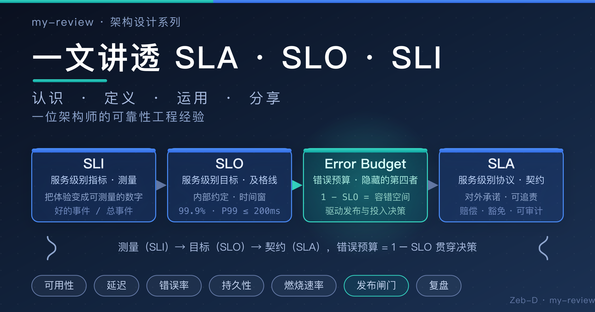

本文章来源于：[https://github.com/Zeb-D/my-review](https://github.com/Zeb-D/my-review) ，请star 强力支持，你的支持，就是我的动力。



[TOC]

---

### 引言

在云原生与微服务成为主流的今天，**SLA、SLO、SLI** 这三个词越来越频繁地出现在各种稳定性会议、架构评审和技术分享里。它们看起来只是三个缩写，却几乎贯穿了产品、研发、运维、架构、商务所有角色的日常工作。

很多团队对它们的理解是"知道个大概，但说不清楚区别"，更谈不上系统地运用：有人把 SLA 当 SLO 用，有人把"可用性 99.9%"挂在嘴边却从没算清楚它到底承诺了什么，还有人把指标定了一大堆，最终却没人看、没人管。

作为一位长期在一线做稳定性与架构设计的工程师，这篇文章我想以"认识 → 定义 → 运用 → 分享"的脉络，把我对这三个词的理解、定义、落地方法和踩过的坑，系统地讲清楚。这篇文章写给资深工程师、专家和架构师，所以我会尽量少谈概念本身，多讲"它们到底怎么用、用的时候要注意什么"。

---

## 第一篇 · 为什么软件/系统绕不开这三个词

### 1.1 从一个线上事故说起

先讲一个我经历过的场景。

某次电商大促，凌晨两点，值班群里突然炸了：某核心下单接口的**错误率**从 0.1% 飙到了 35%，监控大盘上一片飘红，告警刷屏。

然而，有意思的是——系统"活着"。数据库没挂，服务没重启，CPU 内存都正常，链路追踪显示大部分调用都能正常返回。但用户侧的真实感受是：**页面转圈、下单失败、优惠券领不了**。

那天我们复盘了很久，最后得出了一个扎心的结论：

> 我们一直在监控"系统是否活着"，却从没认真定义过"用户认为的服务到底好不好"。

我们有一堆监控指标：CPU、内存、QPS、错误率、RT……但没有人能回答三个最基础的问题：

1. **用户关心的"好"到底是什么？**
2. **好到什么程度算"达标"？**
3. **如果没达标，我们该承担什么、该做什么？**

这三个问题，正是 **SLI、SLO、SLA** 要回答的。它们不是三个学术名词，而是三个**把"可靠性"从感觉变成共识**的工具。

### 1.2 云原生时代的可靠性困境

在单体时代，一个系统就一个进程、一台（或几台）机器，运维关心的是"这台机器有没有挂"。可用性的概念很朴素：进程在跑，端口在听，就算"可用"。

但在云原生时代，事情完全变了：

- **组件数量爆炸**：一个请求链路可能横跨网关、鉴权、业务、缓存、消息、存储十几个服务；
- **依赖深度增加**：每个服务背后还有第三方 API、云厂商组件、跨机房网络；
- **故障会放大**：任何一个环节抖动，都可能被放大成用户侧的整体不可用（所谓"雪崩"）；
- **动态性增强**：容器随时迁移、弹性伸缩、灰度发布，系统的"边界"是模糊的。

在这种背景下，"可用性 99.9%" 这种单一百分比几乎失去了描述能力——因为它既没说清**对谁可用**（是运维视角还是用户视角），也没说清**什么样的行为算可用**，更没说清**在什么时间窗口内**。

可靠性不再是"一个百分比"，而是一套需要**分层定义、多方对齐、持续度量**的工程体系。这正是 SLI/SLO/SLA 要解决的。

### 1.3 三个名字的来历与 Google SRE 的推动

这几个概念并非新鲜事物。

**SLA（Service Level Agreement，服务级别协议）** 的历史最久，它本质上是**商务契约**：电信运营商、云厂商很早就用它来约定服务标准与违约赔偿。

而 **SLI（Service Level Indicator）** 与 **SLO（Service Level Objective）** 被广泛认知，很大程度上要归功于 **Google SRE（Site Reliability Engineering）** 的推广。2016 年，Google 发布《Site Reliability Engineering》一书，系统性地把 SRE 的理念公之于众，其中专门有一章讲"Service Level Objectives"。

Google SRE 的核心主张非常朴素，却极具颠覆性：

> **可靠性不是越高越好，而是"够好就行"。**

他们用 SLO 把"够好"定义成可量化的数字，再用 **错误预算（Error Budget）** 把"追求可靠"与"追求创新"这两件天然矛盾的事统一起来。

此后，这套方法论被 Netflix、LinkedIn、Spotify 等众多公司采纳，也逐渐成为 CNCF 生态（Prometheus、Grafana 等）中可靠性实践的标准语言。今天，几乎任何一家认真做稳定性的公司，都绕不开这三个词。

### 1.4 为什么产品服务绕不开（本篇核心）

在我看来，这三个词之所以"绕不开"，是因为它们分别服务于三方利益相关者，恰好构成了产品服务完整闭环的三块拼图：

**第一块：用户要体验 —— SLI 把"好不好用"变成数字**

用户不会关心你的 CPU 是多少、有没有做限流降级，他只关心"我点一下能不能成"。SLI 的价值在于：**把用户可感知的体验，翻译成可测量的指标**。没有 SLI，你连"好不好"都无法客观描述。

**第二块：商务要承诺 —— SLA 把"靠不靠谱"变成契约**

当你要把服务卖给客户、或跟合作伙伴对接时，对方需要一个"你凭什么说你靠谱"的量化依据。SLA 的价值在于：**把可靠性变成可追责、可赔偿的正式契约**。没有 SLA，商务层面就没有信任基础。

**第三块：工程要决策 —— SLO/错误预算把"稳不稳定"变成取舍依据**

研发和运维每天都要做大量取舍：这个版本能不能上？这个重构要不要做？这个优化值不值得投入？SLO 和错误预算的价值在于：**给这些决策一个客观的、可量化的依据**，而不是靠拍脑袋和吵架。

> 一句话总结：
> 
> **SLI 回答"怎么算好"，SLO 回答"好到什么程度算达标"，SLA 回答"没达标怎么办"。**
> 
> 三块拼图合在一起，才让产品、商务、研发三方有了**共同语言**——这就是为什么绕不开。

---

## 第二篇 · 定义与联系

### 2.1 SLI：把体验变成可测量的数字

**SLI（Service Level Indicator，服务级别指标）** 是对某个服务质量维度（如可用性、延迟、错误率）的**量化测量**。

它的定义有一个非常经典的通用公式：

> **SLI = 好的事件数量 / 总事件数量**

也就是说，任何一个 SLI，本质上都是"满足条件的样本 / 全部样本"的比例。

常见的 SLI 维度包括：

| 维度                | 含义      | 典型示例           |
| ----------------- | ------- | -------------- |
| 可用性（Availability） | 服务可用的比例 | 请求成功率 ≥ 99.9%  |
| 延迟（Latency）       | 响应快慢    | P99 延迟 ≤ 200ms |
| 吞吐（Throughput）    | 处理能力    | QPS 达到某个值      |
| 错误率（Error Rate）   | 出错的比例   | 5xx 占比 ≤ 0.1%  |
| 持久性（Durability）   | 数据不丢失   | 写入后 24h 内不丢    |

设计 SLI 最关键的原则是：**从用户视角出发**。很多团队犯的错是"有什么指标就定什么"，结果定了一堆 CPU、内存、GC 指标——这些对运维有用，但对"用户觉得好不好"没有任何直接意义。

举几个"以用户为中心"的例子：

- 对支付服务，用户关心的是"这笔钱到底扣没扣对"，SLI 应该是**交易成功率**，而不是"服务器返回 200 的比例"；
- 对搜索服务，用户关心"能不能搜到想要的结果"，SLI 应该是**检索有效性**（返回了非空且相关的结果），而不只是"接口没报错"；
- 对消息服务，用户关心"消息到底有没有送达"，SLI 应该是**端到端送达率**，而不是"broker 接收成功"。

> 额外知识：
> 
> 判断一个 SLI 好不好，可以问三个问题：
> 
> 1. 它是否反映**用户可感知**的质量？
> 2. 它是否**可被持续、自动地测量**？
> 3. 它是否**简单到能写进一句话**向别人解释清楚？
> 
> 三个都满足，才是一个好的 SLI。

### 2.2 SLO：给指标设定一条"及格线"

**SLO（Service Level Objective，服务级别目标）** 是为 SLI 设定的**目标值**，它是"我们承诺自己的服务水平要有多好"的具体化。

比如：

- "99.9% 的请求在 200ms 内返回"（延迟类 SLO）
- "99.95% 的请求成功"（可用性类 SLO）
- "月度数据持久性 99.999999999%"（持久性类 SLO）

一个完整的 SLO 通常包含三个要素：

1. **指标（SLI）**：度量什么；
2. **目标值（Target）**：好到什么程度，通常用百分比表达；
3. **时间窗（Window）**：在什么周期内统计，常见的有滚动 30 天、滚动 90 天、自然季度。

为什么必须有时间窗？因为任何系统都会有偶发抖动，**SLO 允许短时间的超标，只要在时间窗内整体达标即可**。没有时间窗的 SLO 是不可执行的——你会被每一次抖动绑架。

这里要特别强调一个观点，这也是 Google SRE 方法论的核心：

> **SLO 不是"目标越高越好"，而是"与成本、风险、业务价值匹配的、够好的目标"。**

把一个本不需要 99.99% 的服务做到 99.99%，意味着巨额的成本和复杂度，却可能只换来用户感知不到的收益。这本质上是一个**商业决策**，而不只是技术决策。

### 2.3 SLA：对外承诺的商业契约

**SLA（Service Level Agreement，服务级别协议）** 是与**外部客户**签订的、具有法律或商务约束力的**正式契约**。

它与 SLO 最本质的区别在于：

|      | SLO      | SLA         |
| ---- | -------- | ----------- |
| 性质   | 内部目标     | 对外契约        |
| 约束力  | 对团队自己    | 对客户，通常有赔偿条款 |
| 受众   | 研发、运维、产品 | 商务、客户       |
| 缺失后果 | 内部管理问题   | 违约、赔偿、法律风险  |

一个完整的 SLA 通常包含：

1. **范围**：覆盖哪些服务、哪些功能；
2. **指标与目标**：以 SLO 为内核，写明承诺的水平；
3. **时间窗**：统计周期与结算方式；
4. **赔偿条款**：未达标时如何补偿（通常以服务抵扣金、折扣等形式）；
5. **豁免条款**：哪些情况不算违约（如客户自身原因、不可抗力、计划内维护等）。

**关键点**：SLA 的承诺必须**以可度量的 SLO 为支撑**。也就是说，SLA 里写的每一个百分比，都必须能在监控系统里被真实测量、被审计复核。**写进 SLA 的数字，必须是你真的能做到的**——这是很多团队容易忽略、也容易踩坑的地方。

### 2.4 隐藏的第四者：错误预算（Error Budget）

前三个词是"明面上"的，但真正让整套体系运转起来的，是第四个隐藏概念：**错误预算（Error Budget）**。

它的定义极其简单：

> **错误预算 = 1 - SLO**

如果 SLO 是 99.9%，那么错误预算就是 0.1%——也就是在时间窗内，系统**允许犯错的空间**。

例如，一个 30 天滚动窗口、SLO 为 99.9% 的服务，一个月允许不可用时长约为：

```
30 天 × 24 小时 × 60 分钟 × (1 - 99.9%)
= 43200 分钟 × 0.1%
= 43.2 分钟
```

也就是说，这个月系统可以累计不可用 43 分钟，仍然达标。

错误预算的价值在于：**它把"可靠"和"创新"从对立变成可管理的取舍**。

- 当错误预算**富余**时，说明系统可靠性表现很好，可以**大胆发布、灰度、做实验**——即使偶尔引入一些小故障，也在预算之内；
- 当错误预算**告急**（接近耗尽）时，说明可靠性风险很高，此时应该**冻结发布、优先修复稳定性**——把剩下的预算当作"救命粮"。

这就是 Google SRE 著名的"发布闸门"机制。它把一个原本靠"开会吵、拍脑袋"的决策，变成了一个**客观、自动、可执行的规则**。

### 2.5 厘清三者的联系与区别（本篇重点）

把四个概念放在一起看，关系其实非常清晰：

```
SLI（测量）→ 用数字描述"现在多好"
   ↓
SLO（目标）→ 约定"应该多好"（内部）
   ↓
SLA（契约）→ 承诺"达不到怎么办"（对外）
   ↓
错误预算（1 - SLO）→ 用来做发布/投入决策的"容错空间"
```

它们的关系可以这样理解：

- **SLI 是原材料**：没有测量，一切都无从谈起；
- **SLO 是目标**：从 SLI 中挑出关键项，设定目标值；
- **SLA 是承诺**：把部分 SLO 拿出来，以契约形式承诺给客户；
- **错误预算 是管理工具**：用"剩余容错空间"驱动工程决策。

这里必须纠正几个非常常见的误解：

**误解一：SLA 就是 SLO**

这是最普遍的误解。SLO 是内部目标，SLA 是对外契约。很多公司"没有 SLA"不是因为没有 SLO，而是因为**还没有勇气把内部目标升级成对外承诺**。反过来，也绝不应该把 SLA 的条款随意套用到内部团队之间。

**误解二：SLO 定得越高越好**

99.99% 和 99.9% 表面只差一个 9，运维成本可能差一个数量级。SLO 应该**匹配业务价值与成本**，而不是追求数字好看。过度承诺的 SLO 会让团队陷入"为指标而活"的困境。

**误解三：百分比就是一切**

"99.9%" 只是个数字，它不告诉你**对谁、在什么时间窗、用什么口径**。脱离用户视角和统计口径谈百分比，毫无意义。同样是 99.9%，滚动 30 天和自然季度，含义完全不同。

**误解四：SLI 越多越好**

指标一旦泛滥，就会没人看、没人信。**少而精**才是原则：每个服务挑 2~4 个用户最关心的 SLI 即可。

---

## 第三篇 · 运用：不同角色如何用好这三个词

### 3.1 5W1H 总览速查表

不同角色的职责不同，对这三个词的运用重点也完全不同。先给一张总览表，后面各节逐一展开：

| 角色       | 用哪些          | What        | Why         | When       | Where     | How          |
| -------- | ------------ | ----------- | ----------- | ---------- | --------- | ------------ |
| 产品 / 业务  | SLO、SLA      | 把可靠性翻译成业务语言 | 让"可靠"可对外表达  | 版本规划、上线评审  | 需求评审、对客沟通 | 参与定目标、写进需求   |
| 研发       | SLI、SLO、错误预算 | 用指标验证自己的改动  | 让优化/发布有依据   | 开发、发布、重构前  | 代码变更、发布决策 | 跑 SLI、看预算余量  |
| 测试 / QA  | SLO、SLI      | 把 SLO 当验收标准 | 让"稳定"可持续验证  | 回归、压测、上线前  | 测试计划、验收   | 用 SLI 做门槛、回归 |
| SRE / 运维 | SLI、SLO、错误预算 | 采集、聚合、告警    | 让"达标"可观测可预警 | 7×24 值班、复盘 | 监控、告警、值班  | 燃烧速率告警、闭环    |
| 架构师      | SLI、SLO      | 反推架构取舍      | 让技术决策有量化依据  | 架构评审、方案设计  | 架构评审、技术选型 | 用 SLO 算成本收益  |
| 商务 / 管理  | SLA          | 对外签约、成本核算   | 让可靠变现、风险可控  | 签约、季度复盘    | 合同条款、汇报   | 定赔偿/豁免、审计达标  |

### 3.2 产品与业务角色

**用哪些**：SLO、SLA 为主，SLI 为辅。

**5W1H 怎么用**：

- **What**：产品需要把"服务好不好"定义成业务能听懂的语言，例如"用户下单成功率 99.9%"；
- **Why**：因为可靠性是用户体验的一部分，产品必须能对外（客户、老板）表达"我们多靠谱"；
- **When**：在版本规划、需求评审、上线评审时，提出可靠性诉求；
- **Where**：把可靠性要求写进需求文档、对客方案、商务承诺中；
- **Who**：产品经理是"用户代言人"，负责把用户体验转化为指标诉求，并参与 SLO 目标确认；
- **How**：与研发/SRE 一起确定 SLO 目标，并推动"承诺必须可测量"。

**注意点**：

- 指标要**可解释**：产品对外说的每个数字，都要能讲清楚"它代表什么用户场景"；
- 别把内部 SLO 直接写进合同：对外 SLA 要由商务与 SRE 共同评估，不能产品一个人拍板；
- 承诺要**匹配真实能力**：定目标前先看看现状和错误预算，别为了拿下客户而过度承诺。

### 3.3 研发角色

**用哪些**：SLI、SLO、错误预算。

**5W1H 怎么用**：

- **What**：研发要理解自己负责的服务有哪些 SLI，改动会如何影响它们；
- **Why**：因为"我改完代码服务稳不稳"不该靠感觉，而该靠指标说话；
- **When**：在每次代码变更、发布、重构、性能优化前，先看指标基线；
- **Where**：在开发自测、代码评审、发布审批环节落地；
- **Who**：每个研发都是 SLI 的第一责任人；
- **How**：发布前对比 SLI 基线、评估是否消耗错误预算，用数据验证改动没有退化。

**注意点**：

- 别**过度优化**个别指标：为把 P99 从 95ms 压到 90ms 而引入巨大复杂度，往往得不偿失，先看错误预算是否告急；
- 别**只盯 P99**：P99 只代表长尾，要结合 P50/错误率/成功率看整体，警惕"P99 好看但错误率超标"；
- 预算耗尽时**优先稳定性**：错误预算快用完时，新功能发布要慎重，先做稳定性投入。

### 3.4 测试 / QA 角色

**用哪些**：SLO 为主，SLI 作为验收指标。

**5W1H 怎么用**：

- **What**：把 SLO 当作"可持续的验收标准"，而不是一次性功能测试；
- **Why**：因为功能正确 ≠ 服务达标，稳定性需要持续验证；
- **When**：在回归测试、性能压测、上线前评估环节使用；
- **Where**：测试计划、验收清单、发布门槛；
- **Who**：QA 负责把 SLO 落地为可执行的验证动作，并与研发核对基线；
- **How**：压测时按 SLO 目标设门槛（如"压测环境下 P99 不得高于目标值"），回归时关注 SLI 是否退化。

**注意点**：

- SLO 是**持续过程**，不是一次功能测试：不能"测过就行"，要建立周期性回归机制；
- 注意**压测环境与生产环境的差异**：压测的 SLI 只能作参考，最终要以生产实测为准；
- 别把 SLO 与**功能验收**混为一谈：功能验收看"对不对"，SLO 看"稳不稳"，两者都要。

### 3.5 SRE / 运维角色

**用哪些**：SLI、SLO、错误预算。

**5W1H 怎么用**：

- **What**：SRE 负责采集 SLI、聚合计算、设定告警、驱动闭环；
- **Why**：因为"是否达标"必须被持续、自动地观测，才能及时预警和响应；
- **When**：7×24 值班监控、故障响应、事后复盘全流程使用；
- **Where**：监控大盘、告警规则、值班策略、故障复盘；
- **Who**：SRE 是 SLO 体系的"守门人"，负责保证指标真实、告警有效；
- **How**：用 Prometheus/Grafana 等采集聚合 SLI，用**燃烧速率（Burn Rate）** 设计告警，故障后核对错误预算消耗。

**注意点**：

- 避免**告警疲劳**：告警要跟 SLO 挂钩，别把所有指标异常都报警，否则真正重要的会被淹没；
- 告警要能**追溯到 SLO**：每个告警都要能回答"它对应哪个 SLO、烧了多少预算"；
- 别只"报火"不闭环：告警触发后要有值班响应、故障定位、预算核对、复盘改进的完整链路。

> 额外知识 · 燃烧速率（Burn Rate）告警
> 
> 燃烧速率 = 错误预算的消耗速度。例如 SLO 为 99.9%（错误预算 0.1%），如果过去 1 小时错误率达到 1%，那么燃烧速率 = 1% / 0.1% = 10 倍。
> 
> Google SRE 建议的两档告警：
> 
> - **Page 级**：燃烧速率 ≥ 14.4（对应 1 小时内烧光 1/24 预算），需要立即响应；
> - **Ticket 级**：燃烧速率 ≥ 6（对应 6 小时内烧光 1/24 预算），需要尽快处理。
> 
> 这样设计的好处是：**无论故障发生在窗口的哪个阶段，告警触发时总能及时介入，避免"最后一天才发现预算耗尽"**。

### 3.6 架构师角色

**用哪些**：SLI、SLO。

**5W1H 怎么用**：

- **What**：架构师要用 SLI/SLO 反推架构取舍，让技术决策有量化依据；
- **Why**：因为架构评审里"要不要上缓存、要不要做异步化、要不要多机房容灾"，本质都是"花多少成本换多少可靠性"的权衡，SLO 就是权衡的标尺；
- **When**：在架构评审、技术选型、容量规划、容灾设计时使用；
- **Where**：架构设计文档、技术方案评审、预算与成本核算；
- **Who**：架构师牵头，联合 SRE 与业务共同确定目标；
- **How**：先明确服务必须达成的 SLO，再反推架构需要哪些能力（如 99.9% 不需要跨机房容灾，99.99% 可能就需要），最后核算成本是否可接受。

**注意点**：

- 目标与成本要**匹配**：别为一个 99.9% 就够的服务，设计 99.999% 的架构——成本是实打实的；
- 别被指标**绑架**做错误决策：SLO 是决策依据之一，不是唯一依据，还要综合业务、团队、成本；
- 考虑**长期演进**：SLO 会随业务阶段变化，架构设计要为未来目标预留演进空间，避免"推到重来"。

### 3.7 商务 / 管理层角色

**用哪些**：SLA 为主。

**5W1H 怎么用**：

- **What**：把可靠性转化为商业价值，用 SLA 对外签约、做成本核算；
- **Why**：因为对外承诺需要量化、可追责，SLA 是建立客户信任的基础；
- **When**：在签约、合同续期、季度/年度复盘时使用；
- **Where**：商务合同条款、服务水平报告、客户汇报；
- **Who**：商务负责签约，管理层负责背书与资源投入；
- **How**：与 SRE 一起评估承诺可行性，设计赔偿与豁免条款，定期审计达标情况并向客户汇报。

**注意点**：

- 承诺要**可兑现**：写进 SLA 的每个数字，都必须有监控支撑、能被审计复核；
- 赔偿条款要**量化**：明确未达标的补偿方式（抵扣金、折扣、免费时长），避免模糊不清引发纠纷；
- 别签**做不到的 SLA**：在签约前用真实数据评估，把风险留足，必要时分档承诺（不同客户不同等级）。

### 3.8 协作篇：统一语言

前面讲了各角色"各自怎么用"，但实践中最大的难点，往往是**协作**。几个高频问题：

- **SLI 由谁采集**：通常由 SRE 负责建立采集与聚合体系，但**口径**（怎么算成功、怎么算超时）需要研发与产品一起确认；
- **SLO 由谁拍板**：SLO 本质是商业决策，应由**产品 + 架构 + SRE 三方**共同确定，而不是某一方独断；
- **SLA 由谁背书**：对外 SLA 必须由**商务 + SRE + 管理层**共同评估，确保可兑现、有资源保障；
- **如何避免"各说各话"**：建立统一的 **SLO 评审节奏**（如每季度评审一次），用一张 SLO 清单（服务 × SLI × 目标 × 当前状态 × 责任人）作为团队的"单一事实来源"。

> 经验之谈：
> 
> 一个团队从"没有 SLO"到"用好 SLO"，最大的障碍往往不是工具，而是**谁负责、谁拍板**没有定清楚。
> 
> 只要明确了"SLO 清单由 SRE 维护、目标由三方评审、发布由错误预算把关"，整个体系就能转起来。

---

## 第四篇 · 架构师的经验分享

### 4.1 我踩过的坑：常见误区

这些年落地 SLO 体系，我踩过不少坑，也见过很多团队重复踩，挑几个最典型的分享：

**坑一：指标堆砌，越多越好**

一开始我们给核心服务定了十几个 SLI：成功率、错误率、P50、P95、P99、GC 次数、线程池活跃数……结果一个月后，没人看大盘了。指标一旦泛滥就失去了意义。后来砍到每个服务 3 个核心 SLI，反而所有人都会关注。

**坑二：目标拍脑袋，脱离现实**

有次架构评审，业务方张嘴就要"99.99% 可用性"，理由仅仅是"别人都这么承诺"。当时服务还经常半夜重启，99.9% 都悬。拍脑袋定目标的结果，是团队为了凑指标疲于奔命，最后目标沦为笑话。**目标必须基于现状和成本，分阶段提升。**

**坑三：只定不查，SLO 形同虚设**

定了 SLO 却没有接监控、没有设告警、没有定期复盘，等于没定。我见过有团队 SLO 写在文档里，半年没人看，直到客户投诉才发现早就超标了。**SLO 必须闭环：定 → 量 → 警 → 复。**

**坑四：用 SLO 吓唬团队**

有的管理者把 SLO 当成"问责工具"，超标就追责，导致团队为了保指标不敢发布、不敢重构，甚至**造假数据**。这是对 SLO 最大的误用。SLO 是**决策工具**，不是**绩效考核**——它的目的是暴露风险、指导取舍，而不是惩罚。

**坑五：SLI 脱离用户视角**

定 SLI 时只看"技术上有啥指标"，不看"用户关心什么"。最典型的是把"服务器 200 响应比例"当可用性——可用户看到的是"页面白屏"，因为前端渲染失败了。**SLI 一定要从用户可感知的维度定义。**

### 4.2 实战案例复盘

分享三个一线场景，讲 SLO 是怎么实实在在改变决策的。

**案例一：电商大促**

某电商平台的核心下单链路，SLO 定为"成功率 99.95%，P99 ≤ 300ms"。

大促前做容量规划时，架构师用 SLO 反推：按 99.95% 目标，单机 QPS 压到多少、需要多少副本、依赖的服务要什么保障，全部量化。大促期间用**燃烧速率告警**监控，某缓存集群抖动时，告警第一时间触发，值班团队在错误预算耗尽前完成了降级切换。最终大促结束，预算消耗在可控范围内，复盘时有据可依。

**教训**：SLO 让大促这种高压力场景从"赌运气"变成了"算得清"。

**案例二：金融转账链路**

金融场景对数据一致性和持久性要求极高，团队为转账服务定义了"端到端到账成功率"和"数据持久性 99.999999999%"两个 SLI。

有一次灰度发布引入缺陷，导致部分转账"卡单"。由于 SLI 是从用户视角定义（端到端到账，而非"数据库写入成功"），缺陷很快被监控暴露出来，团队随即触发**发布闸门**——错误预算告急，冻结后续发布，全力修复并做了补偿对账。

**教训**：**用户视角的 SLI** 能捕捉到"技术指标看似正常、用户却受损"的隐蔽故障。

**案例三：中间件团队**

某个消息中间件团队，为多个业务方提供服务。他们定义了对外 SLA（如"月度送达率 ≥ 99.9%"），同时维护一份内部 SLO 清单（不同业务方分档：核心业务 99.95%，普通业务 99.9%）。

每当某个业务方投诉，团队先看 SLI 数据，用**数据说话**而非互相扯皮：到底是消息真的丢了，还是对方消费逻辑有 bug？SLA 的赔偿条款也逼着团队把每个承诺都接上了监控审计。

**教训**：**SLA 对内推动了监控建设，对外建立了信任**，还避免了大量无意义的扯皮。

### 4.3 不同业务的差异化打法

SLO 不是放之四海而皆准的模板，不同业务需要不同的侧重：

| 行业 / 业务  | 核心关注    | SLO 侧重          | 常见目标档位         |
| -------- | ------- | --------------- | -------------- |
| 互联网 ToC  | 用户体验    | 延迟、成功率          | 99.9% ~ 99.99% |
| 金融 / 支付  | 数据一致与持久 | 端到端成功率、持久性      | 99.99%+，持久性极高  |
| ToB / 政企 | 契约与合规   | 可用性、服务报告        | 99.9%+，重 SLA   |
| IoT / 边缘 | 连接与吞吐   | 连接成功率、消息可靠      | 分场景，容忍离线       |
| 中间件 / 平台 | 多租户分档   | 分档 SLO + 对外 SLA | 核心高、普通低        |

**要点**：先识别"用户最不能容忍什么"，再定义 SLI 和 SLO。金融最不能容忍"丢钱"，IoT 最不能容忍"连不上"，互联网最不能容忍"卡"——SLO 要围绕"最痛的点"来定。

### 4.4 最佳实践清单（可照抄）

给想落地 SLO 体系的团队一份可照抄的 checklist：

**第一步：定指标（SLI）**

- [ ] 从用户视角挑 2~4 个核心 SLI（成功率、延迟、错误率、持久性等）
- [ ] 明确统计口径：什么算"好"，什么算"失败"
- [ ] 确认数据来源可自动采集

**第二步：定目标（SLO）**

- [ ] 目标基于现状与成本，分阶段设定
- [ ] 明确时间窗（滚动 30 天 / 90 天）
- [ ] 明确各业务/服务分档目标
- [ ] 由产品 + 架构 + SRE 三方评审确认

**第三步：接监控**

- [ ] 用 Prometheus/Grafana 等采集并聚合 SLI
- [ ] 建立 SLO 仪表盘，可视化预算消耗
- [ ] 每个服务维护一张 SLO 清单（服务 × SLI × 目标 × 当前 × 负责人）

**第四步：建告警**

- [ ] 用燃烧速率（Burn Rate）设计 Page / Ticket 两级告警
- [ ] 告警能追溯到具体 SLO
- [ ] 制定值班响应与升级机制

**第五步：做复盘**

- [ ] 定期（周/月/季度）复盘 SLO 达标情况
- [ ] 故障后核对错误预算消耗并输出复盘报告
- [ ] 用预算状态驱动发布决策（告急冻结、富余放开）
- [ ] 季度评审，必要时调整目标

### 4.5 写给架构师们的话

作为架构师，我对这套体系的最终体会有几点，也当是这篇文章的收尾：

1. **SLO 是架构师最好的"决策标尺"**。架构评审里最难的从来不是"哪个方案好"，而是"多花 10 倍成本换来的可靠性，值不值"。有了 SLO，这个问题就变成了可计算的账。
2. **从"追求可用性数字"到"以用户为中心的可靠性文化"**。SLO 的最终目标不是让数字好看，而是让整个团队**围绕用户价值做取舍**——该投入的地方投入，不必过度的地方及时收手。
3. **SLO 是"活"的，要持续迭代**。它随业务阶段、用户规模、成本结构而变化，需要定期评审、动态调整，而不是定一次用三年。
4. **工具不是重点，共识才是**。Prometheus、Grafana 都只是手段。真正让 SLO 起作用的，是产品、研发、运维、商务之间建立起的那套**共同语言**。

---

### 结语

最后，用三句话分别记住这三个词，也记住它们的关系：

- **SLI（Service Level Indicator）**：怎么算好——把用户体验变成可测量的数字；
- **SLO（Service Level Objective）**：好到什么程度算达标——内部约定"够好的目标"；
- **SLA（Service Level Agreement）**：没达标怎么办——对外承诺的正式契约。

而把它们串起来的，是那个隐藏的第四者——**错误预算（Error Budget）**：用"剩余容错空间"来驱动每一次发布与投入决策。

> 留一个开放式思考题给你：
> 
> 你的核心服务，现在能回答"用户认为的服务到底好不好、好到什么程度、没达标怎么办"这三个问题吗？
> 
> 如果答不上来，也许正是引入 SLI/SLO/SLA 的时候了。
