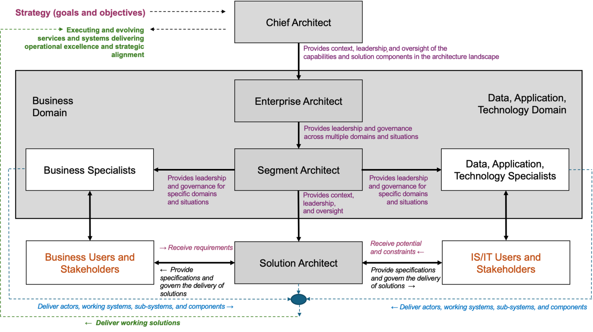
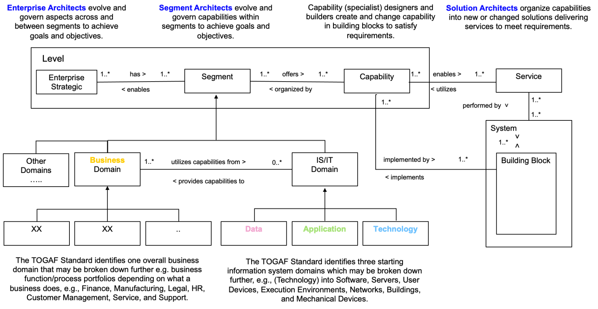

本文章来源于：<https://github.com/Zeb-D/my-review> ，请star 强力支持，你的支持，就是我的动力。

[TOC]

------

参考：https://pubs.opengroup.org/togaf-standard/architecture-roles-and-skills/index.html

### 概念

“建筑”是一个众所周知的术语，最初用于指建筑物的建造和更广泛的环境。韦氏词典在其定义中包含了以下短语：

- 建筑艺术或科学
- 统一或连贯的形式或结构
- 建筑产品或作品
-  计算机或计算机系统组件的组织和集成方式[[1\]](https://pubs.opengroup.org/togaf-standard/architecture-roles-and-skills/index.html#_ftn1)

从这些短语中我们可以看出，随着信息系统的重要性日益增长，该术语最近也开始被专门应用于信息系统。架构本质上理解形态、规范和治理。它为组件的创建、更改以及集成到子系统和提供企业相关服务的系统中提供了基础。

ISO/IEC/IEEE 42010:2022 [ [ISO 42010](https://pubs.opengroup.org/togaf-standard/architecture-roles-and-skills/index.html#ref_ISO42010) ] 将“架构”定义为：

*“实体在其环境中的基本概念或属性，以及该实体及其相关生命周期过程的实现和演化的管理原则。”*

TOGAF 标准涵盖但并不严格遵循 ISO/IEC/IEEE 42010:2022 术语。除了 ISO/IEC/IEEE 42010:2022 [ [ISO 42010](https://pubs.opengroup.org/togaf-standard/architecture-roles-and-skills/index.html#ref_ISO42010) ] 对“架构”的定义外，TOGAF 标准还根据具体情况定义了第二层含义：

*“组件的结构、它们的相互关系以及控制其设计和随时间演变的原则和准则。”*

TOGAF 标准将企业视为一个系统，并努力在推广来自相关标准的概念和术语与大多数使用该标准的人熟悉的普遍接受的术语之间取得平衡。

TOGAF 标准将这些概念整合在一起，涵盖了企业架构全景的完整范围，包括所有组件及其创建、组织、治理和演进。它提供了三个主要的视角来管理这些视角：

- 完整的**企业**及其整体结构
- 企业中具有一致性且能够得到有效治理和发展的特定**部分（相关要素）**
- 利用细分市场中的组件来删除、更改或引入新解决方案及其相关子系统、系统和服务的特定**解决方案**

它为企业内部元素的创建、实施和运行提供了指导和监督，但并未描述如何实际构建、部署和运行系统和服务。这是相关业务、技术和服务管理专业人员的工作。TOGAF 标准提到了这些其他角色以及他们如何与架构角色协作，但具体细节留给了为这些角色和技能提供领导的相关专业人员和协会。

通过这种方式，TOGAF 标准提供了一种方法来处理所有级别的架构并执行所需的主要角色，以提供不断发展的架构景观，满足企业的目标、目的及其特定要求。

### 架构师角色和技能：企业架构实践的基础

一旦理解了企业架构的整体概念和架构角色，组织此类实践的初始阶段就相对容易了。本文档提供了用于组织架构实践并进行长期管理的角色和技能信息。

正如整个 TOGAF 标准的情况一样，该标准并不强制要求如何做到这一点，而是期望在应用于每个特定情况时会有相当多的定制和组织协调。[[2\]](https://pubs.opengroup.org/togaf-standard/architecture-roles-and-skills/index.html#_ftn2) TOGAF 标准是描述性的，而非规定性的，它提供了一种可用于支撑企业架构全景管理的说明性方法。在某些情况下，所说明的方法或模型将被直接采用；在其他情况下，则可能会进行重大修改。在这样做时，请记住，TOGAF 标准的说明基于长期积累的最佳实践，并根据我们业务和技术环境的最新变化不断进行评估。

*（请注意，在建立架构实践时，更困难的方面通常是证明、解释并将该实践与企业的其他部分进行整合。本文档未解决这些问题，但在 The Open Group 关于架构实践的设置和建立的文档中已解决。）*

为了建立有效的架构实践，需要：

- 获得相关利益相关者的明确授权（不同组织会有所不同）
- 识别和定义所需的架构能力，同时将必要的员工角色、技能和经验与企业需要执行的架构任务相结合，无论这些任务是在企业内部执行还是在外部执行；例如，作为咨询工作的一部分
- 正式认可建筑师的技能和能力，作为建立和维护专业建筑组织任务的一部分
- 为架构师提供能力发展路径，以确保最低能力水平，并确保获得认证的架构师执行的架构活动达到可接受的水平

一套明确定义的角色和技能使您能够：

- 简化招聘组织、咨询公司和职业介绍所之间的沟通
- 为建筑师的培养和分配提供一致的决策标准
- 避免浪费时间评估那些诚心申请但仍然缺乏雇主要求的技能和/或经验的候选人
- 确定能够胜任架构师职位且可能被忽视的员工
- 使员工能够根据一系列所需技能进行自我评估，以制定自己的培训和职业规划，并在适当的情况下提供指导支持
- 根据常见的技能差距，评估人才水平以及应该在哪些方面进行培训投资
- 为未来建筑师建立稳定的基础，并通过明确的指导来培养他们
- 建立稳定的未来架构师基础，并确定那些即将做好准备的人，以便应用有限的指导资源
- 为有抱负的建筑师提供职业道路，提高员工满意度，并提高员工保留率

通过定义 TOGAF 标准中定义的各种架构角色的架构技能和熟练程度，架构技能框架可以显著减少首次建立实践的时间、成本和风险，并避免“重复造轮子”。已经拥有企业架构实践的企业能够制定企业范围的规范，并更轻松地招聘员工或聘请外部顾问。

### 架构角色

本指南阐述了企业在初步阶段制定架构实践时可能考虑的事项。架构师角色和技能的识别通常与企业的其他部门（例如人力资源 (HR)）协同进行，并且参考了许多行业框架（例如信息时代技能 (SFIA)）用于其他目的。

有必要为“工作、角色和任务分配”等术语提供上下文，因为这些术语在很多不同的上下文中都有使用。本指南内容如下：

- 工作是指通常通过正式雇佣合同达成一致的职位
- 角色是指通常通过一组相关技能执行的预期活动
- 任务是指指派某人在其工作和角色范围内执行的一项工作（但并非总是如此）

本指南认识到，在许多企业中，可能存在人员扮演多个角色，也可能存在多个人员只扮演一个角色的情况。本指南提供了一个说明性起点，识别了企业架构实践中最重要的角色，您可以根据企业的具体需求定制这些角色。

TOGAF 标准提供了一组示例角色，这些角色在企业架构景观的演进和治理中非常有价值。它们支持在不同影响层面上进行有效的决策。之前介绍了企业、细分市场和解决方案三个主要视角。这些视角如图所示，下文将介绍一些其他视角。

首席架构师是企业架构师的一个特例，负责将企业架构视图融入企业更广泛的战略和运营环境。该职位的主要职责是政治性和协作性、说服性和战略性。其职责是确保企业理解良好理解和治理的架构的重要性，以及它如何改善业务运营和变革。

其他专家角色在细分市场（业务和/或技术为重点）内开展更细致的工作，在细分市场架构师的领导下，融入丰富的知识和专业技能，以创建、发展、实施和集成由该细分市场提供和监督的各种组件、子系统、系统和服务。解决方案架构师负责实施新的和/或变更的解决方案，以满足特定需求，并以企业和细分市场层面确定的卓越架构为指导。

用户和利益相关者代表企业内部从事或影响业务或技术的其他角色。服务和解决方案的变更通常针对这些角色，以响应他们所确定的特定需求。

TOGAF 标准并未提供关于专家、用户和利益相关者角色的具体细节。这些内容可以在针对这些角色的众多不同专业框架和协会中找到。

[图 1](https://pubs.opengroup.org/togaf-standard/architecture-roles-and-skills/index.html#_Ref159400747)展示了处于中心垂直关系的三个主要架构角色（首席架构师是其中的一个特例）。从首席架构师，到企业架构师，再到细分架构师，对架构全景图中特定元素的理解、领导和治理更加细致，从而能够实现合理的决策分级。大多数组织都设有三到七个级别的管理和控制层级。企业通常会尽量减少这些层级的数量。TOGAF 标准提供了一个包含最低三个差异化级别的模型，如果您需要处理更多级别的塑造和治理问题，可以从中扩展您的模型。下文将更详细地介绍这些角色。

#### 首席建筑师

首席架构师是一位经验丰富、成就卓著的专业人士，负责沟通并获得企业及其市场（无论是作为内部员工还是外部顾问/资源）对重大技术和业务变革及绩效改进的承诺。

他们致力于在最高层级开展工作，在高管和董事会成员之间就有效架构全景的性质和必要性达成共识。他们以所有高管及其直接下属能够理解的方式传达最新的业务和技术概念及理念，并与企业的战略和运营目标清晰关联并相融合。

当遇到动态、不断发展和/或复杂性、范围或解决方案新颖的情况时，他们能够有效运作。他们推动并倡导跨多个领域的变革路线图，塑造架构景观的结构和发展，并对架构景观及其对业务服务交付的影响及其治理承担最终责任和监督。

他们的主要职责是创造条件，有效响应企业所需的战略变革。他们带领企业架构师、细分架构师、解决方案架构师以及各类专家，创建、实施和运营所需的服务和解决方案，确保企业在不断变化的市场中有效运营。

活动可能包括但不限于：

- 支持并促进业务战略的发展
- 将业务和技术战略、目标和宗旨转化为运营模式的相关变化
- 评估当前能力并确定实现业务和技术战略、目标和目的所需的能力变化
- 通过多种渠道和机制与企业领导层进行沟通和协作，确保他们了解并及时了解架构路线图
- 引领并提供架构景观的总体背景和形状，确保架构模型和视图体现关键目标、宗旨和原则，并描述组织的未来状态以实现其成功发展。
  在大多数情况下，他们作为企业架构领导者或企业架构从业者领导其他人并提供有关整体格局的决策。
- 负责架构景观演变的最大、最复杂、最危险的变化以及相关的解决方案和服务
- 识别、记录和传达主要制约因素、原则和政策
- 通过领导、指导和培训，开发、支持和支持架构团队中的企业架构师、细分架构师和解决方案架构师
- 让企业了解相关的变革驱动因素，并监督与架构格局变化相关的治理活动

关键利益相关者可能包括但不限于：

- 执行领导和董事会成员
- 高级商业领袖
- 高级客户/用户代表
- 业务部门负责人
- 产品所有者和经理
- 变革经理
- 项目和项目经理
- 投资组合经理
- 细分建筑师
- 解决方案架构师
- 业务和技术专家
- 相关细分行业领袖
- 对企业架构以及有效解决方案和服务交付感兴趣的任何其他利益相关者（包括所有相关用户类型）

衡量成功的潜在关键绩效指标 (KPI)：

- 利益相关者满意度得分 => 5 分中的 3 分（等级 1 = 差；5 = 优秀，目标得分平均或以上。）
- 服务交付并被接受达到或优于计划的服务水平
- 企业在技术使用方面外部基准处于（xxx）四分位数
- 外部基准为（xxx）四分位数，用于比较年度市场发展的类似规模
- 新的和变更的解决方案在商定的时间、资源和成本界限内交付并签署（必须正确设置界限以反映与特定变更相关的潜在变化）

#### 企业架构师

企业架构师是经验丰富、成就卓著的专业人士，负责在整个企业和市场中创造、领导和交付重大的技术和业务变革。

他们负责发起、推动并负责主要工作，与最高层进行沟通，并通过信息系统负责整体业务服务的交付，并精通多个关键技术和/或业务领域。他们拥有卓越的交付业绩，与关键利益相关者建立了稳固的工作关系，并乐于指导和辅导他人。

当遇到的情况是动态的、不断发展的，并且/或者在复杂性、范围或解决方案方面与以往相比有所创新，并且情况和范围不限于任何特定的解决方案方面或细分市场（例如，不限于需求/分析/设计/交付生命周期的特定部分、特定市场或单个产品或技术）时，架构师能够有效地运作。他们为跨多个细分市场的变更创建路线图，定义塑造架构景观的原则和政策，并监督架构变更的治理流程。

他们的主要职责是创造和发展解决方案组件的集成、互操作性和治理条件，引导细分架构师、解决方案架构师和各种专家创建、实施和运营所需的服务和解决方案，以使他们的企业在不断发展的市场中保持有效参与者的地位。

活动可能包括但不限于：

- 将业务和技术战略及目标转化为运营模式的相关变化
- 评估当前能力并确定实现业务和技术战略和目标所需的能力变化
- 描述交付有效产品和服务所需的相互关系（人员、组织、服务、流程、数据、信息、技术和外部环境之间的关系）
- 创建和发展体现描述企业未来状态的关键原则的架构模型和视图，并使其能够在整个架构景观中成功演进
- 定义、传达和实施企业架构工作实践，以支持和实现迭代和敏捷工作
- 识别、记录和传达定义、确保和管理架构景观（其各个组件中实现的服务环境）有效演变所必需的约束、原则和政策
- 通过领导、指导和辅导，开发、领导、支持和支持架构团队中的细分架构师和解决方案架构师
- 为企业提供相关变革驱动因素的意识，并参与与架构格局变化相关的治理活动

关键利益相关者可能包括但不限于：

- 首席建筑师
- 业务部门负责人
- 客户/用户代表
- 产品所有者和经理
- 变革经理
- 项目和项目经理
- 投资组合经理
- 细分建筑师
- 解决方案架构师
- 业务和技术专家
- 相关细分行业领袖
- 对企业架构以及有效解决方案和服务交付感兴趣的任何其他利益相关者（包括所有相关用户类型）

衡量成功的潜在KPI：

- 利益相关者满意度得分 => 5 分中的 3 分（等级 1 = 差；5 = 优秀，目标得分平均或以上。）
- 服务交付并被接受达到或优于计划的服务水平
- 企业在技术使用方面外部基准处于（xxx）四分位数
- 新的和变更的解决方案在商定的时间、资源和成本界限内交付并签署（必须正确设置界限以反映与特定变更相关的潜在变化）

#### 细分架构师（业务和技术）

段是用于管理和控制目的的、连贯的功能分组，通常作为功能组合或特定的变更程序进行管理。TOGAF 标准也使用了域的概念。域用于反映企业需要管理的任何有用的功能分组；它包含四个特定的与信息服务 (IS)/互联网技术 (IT) 相关的、基于段的视点，这些视点在管理包含信息系统的架构景观时非常有用。这四个特定的段分别称为业务、应用、数据和技术领域。

细分架构师是经验丰富且成就卓著的专业人士，负责企业及其市场内一个或多个业务或技术细分所提供的功能。

他们塑造和管理实施这些领域产品和服务所需的系统、子系统和组件。他们制定细分领域发展的路线图，并确保最新的业务和技术方案得到充分考虑和有效利用。他们确定所需的政策和标准，以确保各细分领域的组件有效、高效且合法。他们与其他架构师高效便捷地协作，确保整体环境能够以良好互联的方式运行。

当遇到的情况是动态的、不断发展的，或在复杂性、范围或解决方案方面较以往更新颖时，他们能够有效地运作。他们负责监督与某个细分市场相关的所有系统、子系统和组件的开发，确保它们符合用途、合法合规，并遵循所需的政策和标准。

他们的主要职责是为某个（些）部门内的系统、子系统和组件的创建、集成、互操作性和发展创造条件，确保技术/业务专家和解决方案架构师清楚自己的角色，了解如何有效地协同工作，并提供可实现企业及其客户所需的端到端业务服务水平的组件和构建块。

活动可能包括但不限于：

- 将业务和技术战略及目标转化为相关业务和/或技术部门的相关变化
- 评估当前能力并确定实现相关业务和/或技术部门的业务和技术战略和目标所需的能力变化
- 描述在相关业务和/或技术领域提供有效产品和服务所需的相互关系（人员、组织、服务、流程、数据、信息、技术和外部环境之间的相互关系）
- 创建、迭代和维护体现描述组织未来状态的关键原则的架构模型和视图，并确保其在相关业务和/或技术领域的成功发展
- 实施架构工作实践，以支持并实现相关业务和/或技术领域的迭代和敏捷工作
- 识别、记录和传达定义、确保和管理架构景观（其在各个构建块中实现的服务环境）在相关业务和/或技术领域的有效演变所需的约束、政策和标准
- 通过领导、指导和培训，培养、领导、支持和支持架构团队中相关业务和/或技术领域的技术/业务专家和解决方案架构师

关键利益相关者可能包括但不限于：

- 首席建筑师
- 相关业务板块负责人
- 客户/用户代表
- 相关经营者
- 相关产品负责人和经理
- 变革经理
- 项目和项目经理
- 投资组合经理
- 企业架构师
- 细分建筑师
- 解决方案架构师
- 相关业务和技术专家
- 相关细分行业领袖
- 对企业架构以及有效解决方案和服务交付感兴趣的任何其他利益相关者（包括所有相关用户类型）

衡量成功的潜在KPI：

- 利益相关者满意度得分 => 5 分中的 3 分（等级 1 = 差；5 = 优秀，目标得分平均或以上。）
- 服务（与某个部门监管的要素相关）交付并被接受，达到或超过计划的服务水平
- 该细分市场的外部基准为相关细分市场的业务/技术能力和架构处于（xxx）四分位数
- 新的和变更的解决方案在商定的时间、资源和成本界限内交付并签署（必须正确设置界限以反映与特定变更相关的潜在变化）

#### 解决方案架构师

解决方案架构师是经验丰富且成就卓著的专业人士，负责为企业及其市场提供新的和/或改变的功能。

他们根据特定要求（也实现更高层次的目标和目的）塑造和管理所需的解决方案，在期望的时间范围内提供指定的服务水平。

他们明确解决方案所需的系统、子系统和组件及其互操作性，并将它们纳入整合的变更路线图，通过一系列可实施的过渡架构（价值驱动的可交付工作单元）实现所需的演进。他们确保最新的业务和技术方案得到充分考虑并有效利用。

当遇到的情况是动态的、不断发展的，或在复杂性、范围或解决方案方面较以往更新颖时，他们能够有效地运作。他们监督所有新的和不断变化的解决方案的规范、开发和实施，确保相关原则、政策和标准应用于解决方案，并确保解决方案符合目的、有效、高效且合法。

他们的主要职责是为解决方案的规范、创建、集成和互操作性创造协作条件，确保技术/业务专家、实施人员和运维人员明确各自的角色，了解如何有效地协同工作，并能够交付达到预期端到端业务服务水平的系统、子系统和组件。这种理解建立在解决方案架构师与所有业务/技术部门及其他利益相关者充分沟通的基础上，充分了解他们的顾虑、需求和期望。

活动可能包括但不限于：

- 指定服务、流程、组织结构、运营模式和技术的变更，包括生产环境中解决方案的计划运营、维护和发展
- 确保现有和计划的解决方案组件与相关架构、策略、政策、标准和实践兼容
- 充分考虑解决方案的安全性、隐私性和测试要求
- 明确识别与不同解决方案拓扑（例如，内部部署和外部解决方案和服务）、系统、子系统以及每个正在指定和实施的变更的组件相关的优势和问题
- 为每个主要产品和/或服务变更及其组成过渡架构创建、发展并确保目标架构路线图的实施
- 提供指导和基于风险的治理以支持解决方案的实施，包括管理变更请求和任何必要的规范偏差
- 确保所有利益相关者能够有效沟通和协作，以提供有针对性的解决方案和服务以及预期的服务水平

关键利益相关者可能包括但不限于：

- 企业架构师
- 相关业务板块负责人
- 高级客户/用户代表
- 相关经营者
- 相关产品负责人和经理
- 变革经理
- 项目和项目经理
- 投资组合经理
- 细分建筑师
- 解决方案架构师
- 相关业务和技术专家
- 相关域名行业领导者
- 对企业架构以及有效解决方案和服务交付感兴趣的任何其他利益相关者（包括所有相关用户类型）

衡量成功的潜在KPI：

- 利益相关者满意度得分 => 5 分中的 3 分（等级：1 = 差；5 = 优秀，目标得分平均或以上。）
- 服务变更交付并被接受，达到或优于目标解决方案的计划服务水平
- 在商定的时间、资源和成本范围内交付并签署解决方案（必须正确设置边界以反映与特定变化相关的潜在变化）

### 技能和熟练程度

架构团队的技能组合需要包括以下主要类别的技能：

- 应用
- 
  通常包括应用程序管理、应用程序编程接口 (API) 模式、软件设计原则等。

- 建筑学
- 
  通常包括建模、构建块设计、高级设计、角色定义、架构原则设计、高级迁移规划、架构构建块管理、系统开发和集成方法、安全架构、架构模式（微服务架构 (MSA) 等）、需求管理、治理等。

- 商业
- 
  通常包括企业组织知识、商业案例、业务流程、战略规划等。

- 改变
- 
  通常包括管理业务变更、项目管理方法和工具等。

- 数据
- 
  通常包括数据分析、数据交换和数据管理。

- 通用的
- 
  通常包括领导能力、团队合作能力、人际交往能力等。

- 合法的
- 
  通常包括数据保护法、合同法、采购法、欺诈法等。

- 技术
- 
  通常包括计算、存储和网络基础设施等。

[表 1](https://pubs.opengroup.org/togaf-standard/architecture-roles-and-skills/index.html#_Ref158297256)显示了熟练程度。[表 2](https://pubs.opengroup.org/togaf-standard/architecture-roles-and-skills/index.html#_Ref158297265)显示了与技能类别和架构师角色相关的熟练程度。

**表 1：熟练程度**

| **层数** | **级别名称** | **级别描述**                                                 |
| -------- | ------------ | ------------------------------------------------------------ |
| 1        | 背景         | 有一定的理解，但依赖于专家。                                 |
| 2        | 意识到的     | 理解问题并能在专家的支持下解决问题。                         |
| 3        | 知识渊博     | 良好的细节能够实现有效的决策，在困难的情况下需要专家的投入。 |
| 4        | 专家         | 经验丰富，实践和应用知识。                                   |

**表 2：技能/架构角色矩阵**

| **技能类别** | **技能子类别**                   | **企业架构师** | **业务领域架构师** | **数据域架构师** | **应用领域架构师** | **技术领域架构师** | **解决方案架构师** |
| ------------ | -------------------------------- | -------------- | ------------------ | ---------------- | ------------------ | ------------------ | ------------------ |
| 应用         | 人工智能（AI）和专家系统         | 3              | 3                  | 3                | 3                  | 2                  | 2                  |
| 应用         | 应用程序开发                     | 3              | 2                  | 2                | 3                  | 2                  | 3                  |
| 应用         | 应用程序建模                     | 3              | 2                  | 2                | 3                  | 2                  | 2                  |
| 应用         | 应用程序安全                     | 3              | 2                  | 2                | 3                  | 3                  | 3                  |
| 应用         | 集成和互操作性                   | 3              | 2                  | 3                | 4                  | 3                  | 4                  |
| 应用         | 乐观/悲观模式                    | 4              | 3                  | 4                | 4                  | 3                  | 4                  |
| 应用         | 编程                             | 3              | 2                  | 2                | 3                  | 2                  | 2                  |
| 应用         | （微观/宏观）面向服务架构（SOA） | 4              | 3                  | 2                | 4                  | 2                  | 4                  |
| 商业         | 预算管理                         | 3              | 3                  | 2                | 2                  | 2                  | 2                  |
| 商业         | 业务能力建模                     | 3              | 4                  | 2                | 2                  | 2                  | 3                  |
| 商业         | 商业案例                         | 3              | 3                  | 2                | 2                  | 2                  | 2                  |
| 商业         | 商业文化                         | 3              | 3                  | 2                | 2                  | 2                  | 2                  |
| 商业         | 商业信息管理                     | 3              | 3                  | 2                | 2                  | 2                  | 2                  |
| 商业         | 业务指标                         | 3              | 3                  | 2                | 2                  | 2                  | 2                  |
| 商业         | 业务流程设计                     | 3              | 3                  | 2                | 2                  | 2                  | 2                  |
| 商业         | 业务流程管理                     | 3              | 3                  | 2                | 2                  | 2                  | 2                  |
| 商业         | 业务场景                         | 3              | 3                  | 2                | 2                  | 2                  | 3                  |
| 商业         | 商业服务开发                     | 3              | 4                  | 2                | 2                  | 2                  | 2                  |
| 商业         | 整合共享                         | 3              | 3                  | 2                | 2                  | 2                  | 2                  |
| 商业         | 遗产管理                         | 3              | 3                  | 2                | 2                  | 2                  | 2                  |
| 商业         | 组织设计                         | 3              | 3                  | 2                | 2                  | 2                  | 2                  |
| 商业         | 角色设计                         | 3              | 3                  | 2                | 2                  | 2                  | 2                  |
| 商业         | 安全和资产管理                   | 3              | 3                  | 2                | 2                  | 2                  | 2                  |
| 商业         | 战略规划                         | 3              | 3                  | 2                | 2                  | 2                  | 2                  |
| 商业         | 愿景                             | 3              | 3                  | 3                | 3                  | 3                  | 3                  |
| 改变         | 管理变革                         | 3              | 3                  | 3                | 3                  | 3                  | 3                  |
| 改变         | 价值管理                         | 3              | 3                  | 3                | 3                  | 3                  | 3                  |
| 改变         | 工作包管理                       | 3              | 3                  | 3                | 3                  | 3                  | 3                  |
| 改变         | 变革治理                         | 3              | 3                  | 3                | 3                  | 3                  | 3                  |
| 数据         | 分析数据                         | 3              | 2                  | 3                | 2                  | 2                  | 2                  |
| 数据         | 大数据                           | 3              | 2                  | 3                | 2                  | 2                  | 2                  |
| 数据         | 数据治理                         | 3              | 2                  | 4                | 2                  | 2                  | 2                  |
| 数据         | 数据集成                         | 3              | 2                  | 4                | 3                  | 3                  | 3                  |
| 数据         | 数据迁移                         | 3              | 2                  | 4                | 2                  | 2                  | 3                  |
| 数据         | 数据建模                         | 3              | 2                  | 3                | 2                  | 2                  | 2                  |
| 数据         | 数据安全                         | 3              | 3                  | 4                | 3                  | 3                  | 3                  |
| 数据         | 主数据管理                       | 3              | 3                  | 4                | 3                  | 3                  | 3                  |
| 数据         | 运营数据                         | 3              | 2                  | 3                | 2                  | 2                  | 2                  |
| 建筑学       | 广阔而专注的视角                 | 4              | 3                  | 3                | 3                  | 3                  | 3                  |
| 建筑学       | 广泛的通用建模                   | 4              | 3                  | 3                | 3                  | 3                  | 3                  |
| 建筑学       | 决策                             | 4              | 3                  | 3                | 3                  | 3                  | 4                  |
| 建筑学       | 通用集成和互操作性               | 4              | 3                  | 3                | 3                  | 3                  | 3                  |
| 建筑学       | 通用标准和法规                   | 4              | 3                  | 3                | 3                  | 3                  | 2                  |
| 建筑学       | 原理定义                         | 4              | 3                  | 3                | 3                  | 3                  | 2                  |
| 建筑学       | 路线图                           | 4              | 3                  | 3                | 3                  | 3                  | 3                  |
| 建筑学       | 战略融入建筑                     | 4              | 3                  | 3                | 3                  | 3                  | 2                  |
| 建筑学       | 观点与看法                       | 4              | 3                  | 3                | 3                  | 3                  | 3                  |
| 通用的       | 影响                             | 4              | 3                  | 3                | 3                  | 3                  | 3                  |
| 通用的       | 人际                             | 4              | 3                  | 3                | 3                  | 3                  | 3                  |
| 通用的       | 领导                             | 4              | 3                  | 3                | 3                  | 3                  | 3                  |
| 通用的       | 逻辑分析                         | 3              | 3                  | 3                | 3                  | 3                  | 3                  |
| 通用的       | 口头交流                         | 3              | 3                  | 3                | 3                  | 3                  | 3                  |
| 通用的       | 风险管理                         | 3              | 3                  | 3                | 3                  | 3                  | 3                  |
| 通用的       | 利益相关者管理                   | 3              | 3                  | 3                | 3                  | 3                  | 3                  |
| 通用的       | 团队合作                         | 4              | 3                  | 3                | 3                  | 3                  | 3                  |
| 通用的       | 训练                             | 3              | 3                  | 3                | 3                  | 3                  | 3                  |
| 通用的       | 书面沟通                         | 3              | 3                  | 3                | 3                  | 3                  | 3                  |
| 技术         | 数据中心                         | 2              | 2                  | 2                | 2                  | 4                  | 4                  |
| 技术         | 设备                             | 2              | 2                  | 2                | 2                  | 4                  | 2                  |
| 技术         | 集成和互操作性                   | 3              | 2                  | 2                | 2                  | 4                  | 2                  |
| 技术         | 位置、安全和目录服务             | 2              | 2                  | 2                | 2                  | 3                  | 2                  |
| 技术         | 网络拓扑                         | 3              | 2                  | 2                | 2                  | 3                  | 2                  |
| 技术         | 网络                             | 2              | 2                  | 2                | 2                  | 4                  | 2                  |
| 技术         | 操作系统和服务                   | 2              | 2                  | 2                | 2                  | 3                  | 2                  |
| 技术         | 物理安全                         | 3              | 2                  | 2                | 2                  | 3                  | 2                  |
| 合法的       | 合同                             | 3              | 3                  | 3                | 3                  | 3                  | 3                  |
| 合法的       | 数据保护                         | 3              | 3                  | 4                | 3                  | 3                  | 3                  |
| 合法的       | 欺诈与公平交易                   | 3              | 3                  | 3                | 3                  | 3                  | 3                  |
| 合法的       | 采购                             | 2              | 2                  | 2                | 2                  | 2                  | 3                  |
| 合法的       | 风险                             | 3              | 3                  | 3                | 3                  | 3                  | 3                  |
| 合法的       | 规则                             | 3              | 3                  | 3                | 3                  | 3                  | 3                  |
| 全部的       |                                  | 222            | 194                | 190              | 185                | 189                | 186                |
| 意思是       |                                  | 3.13           | 2.7                | 2.7              | 2.6                | 2.6                | 2.6                |
| 4级人数      |                                  | 15             | 2                  | 7                | 3                  | 4                  | 5                  |
| 3级数量      |                                  | 50             | 四十八             | 三十四           | 三十七             | 三十九             | 三十四             |
| 2级数量      |                                  | 6              | 21                 | 三十             | 31                 | 二十八             | 三十二             |
| 1级数量      |                                  | 0              | 0                  | 0                | 0                  | 0                  | 0                  |
| 技能总数     |                                  | 71             | 71                 | 71               | 71                 | 71                 | 71                 |

### 概括

架构角色、技能和熟练程度使得架构实践的创建和操作能够更好、更轻松，并提高架构师在更广泛的业务环境中的理解和效率。

此模型/形状是建议的起点，用于开发最适合特定企业的方法。请确保根据您的具体需求对其进行调整和定制，以获得最佳结果和持续的有效性。

------

### 附录 A： Open Group 认证架构师计划

Open Group Open Professions 计划以认证架构师计划 (Open CA) 的形式提供基于经验的认证，评估专业架构师所需的技能和经验。

以下学科可获得建筑认证：

- 业务架构
- 数字建筑
- 企业架构
- 解决方案/IT架构

根据建筑师经验的长度和特点，认证分为三个级别：

- 1 级：认证架构师——能够在协助/监督下担任有贡献的架构师，并具备广泛的适当技能
- 2 级：大师级认证架构师——能够独立担任首席架构师，并负责交付解决方案
- 第 3 级：杰出建筑师——展现领导力、影响力、深度和广度