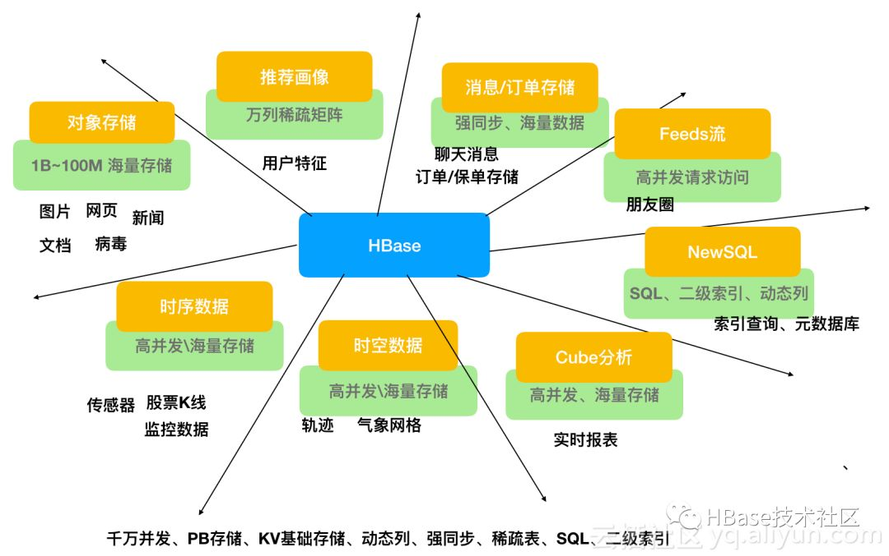
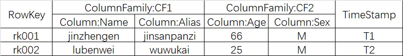
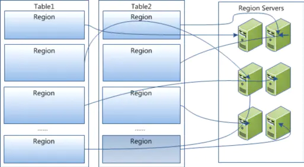
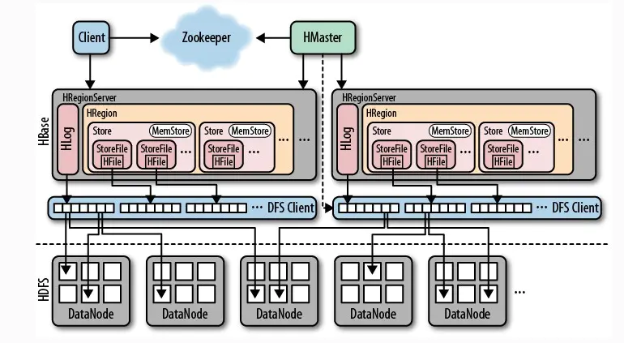
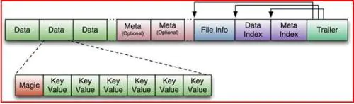
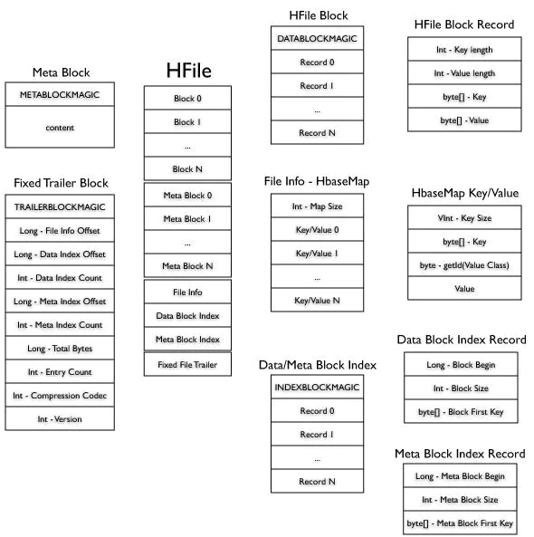
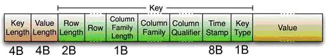
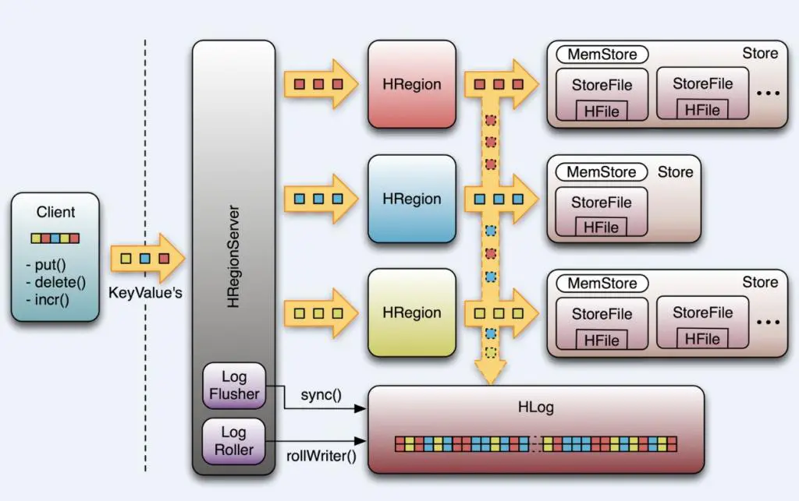
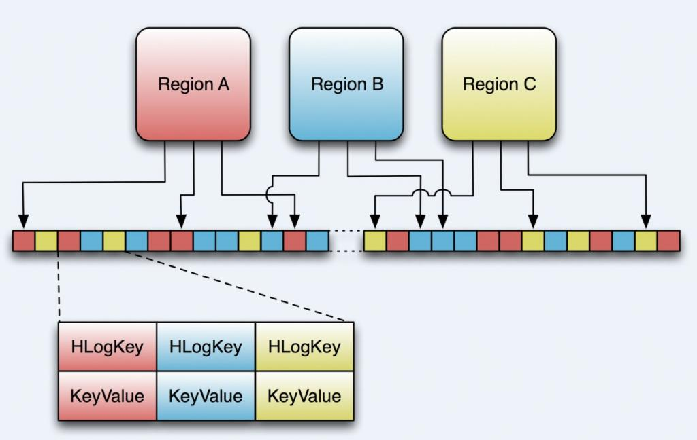

本文章来源于：<https://github.com/Zeb-D/my-review> ，请star 强力支持，你的支持，就是我的动力。

[TOC]

------

## 概述

HBase作为NoSQL的一员，在性能上不如memcached和redis，但是持久化存储方面比内存NoSQL强。作为文档型NoSQL在分布式存储上比mongo做sharding和MapReduce分析方便多。

HBase是一个分布式存储、数据库引擎，可以支持千万的QPS、PB级别的存储。

## 场景

HBase可以说是一个数据库，也可以说是一个存储。拥有双重属性的HBase天生就具备广阔的应用场景。在最近的一些版本中，引入了OffHeap降低gc影响，优化链路延迟，提供Replica等可以满足在线的需求。引入MOB，可以存储10M左右的对象，完全适应了对象存储。另外由于自身的并发能力、存储能力，可以说是具有最为竞争力的引擎



- 对象存储：我们知道不少的头条类、新闻类的的新闻、网页、图片存储在HBase之中，一些病毒公司的病毒库也是存储在HBase之中
- 时序数据：HBase之上有OpenTSDB模块，可以满足时序类场景的需求
- 推荐画像：特别是用户的画像，是一个比较大的稀疏矩阵，蚂蚁的风控就是构建在HBase之上
- 时空数据：主要是轨迹、气象网格之类，滴滴打车的轨迹数据主要存在HBase之中，另外在技术所有大一点的数据量的车联网企业，数据都是存在HBase之中
- CubeDB OLAP：Kylin一个cube分析工具，底层的数据就是存储在HBase之中，不少客户自己基于离线计算构建cube存储在hbase之中，满足在线报表查询的需求
- 消息/订单：在电信领域、银行领域，不少的订单查询底层的存储，另外不少通信、消息同步的应用构建在HBase之上
- Feeds流：典型的应用就是xx朋友圈类似的应用
- NewSQL：之上有Phoenix的插件，可以满足二级索引、SQL的需求，对接传统数据需要SQL非事务的需求

 更多的场景需要不断挖掘


## 架构

### 逻辑存储模型

HBase以表的形式存储数据，表由行和列组成。列划分为若干个列族，如下图所示：



RowKey：Hbase使用Rowkey来唯一的区分某一行的数据。如图中"rk001"

  列族：Hbase通过列族划分数据的存储，列族下面可以包含任意多的列，实现灵活的数据存取。Hbase的列族不是越多越好，官方推荐的是列族最好小于或者等于3。我们使用的场景一般是1个列族。如图中的“CF1”列族，下面包含两个列："Name"和"Alias"。

  时间戳：TimeStamp对Hbase来说至关重要，因为它是实现Hbase多版本的关键。在Hbase中使用不同的timestame来标识相同rowkey行对应的不通版本的数据。

  Cell：HBase 中通过 rowkey 和 columns 确定的为一个存储单元称为 cell。每个 cell 都保存着同一份 数据的多个版本。版本通过时间戳来索引。


### 物理存储模型

  HBase的物理存储模型如下图：




在HBase中，数据以表的形式存储，表由很多行组成，每一行由Row key（行键）以及一个或多个的列值组成。

当表有很多很多的Row时，我们把这个表按某些规则（比如每500条）拆分成很多部分，那么拆分后的每一部分就是所谓的HRegion，这个HRegion作为一个整体被HMaster分配到某一个RegionServer中。

可以这样理解，把HMaster想象成一个老大，他把HRegion给分配到某一个服务器上，这样一来，一个表就被分成多个HRegion并可能分配到了不同的RegionServer上。

我们刚说HRegion是一个整体，意思是他不能再继续往下分割了，他必须在一个RegionServer上。


### 总体架构

  HBase的总体结构图如下：



包括了HMaster、HRegionSever、HRegion、HLog、Store、MemStore、StoreFile、HFile等。

HBase底层依赖HDFS，通过DFS Cilent进行HDFS操作。HMaster负责把HRegion分配给HRegionServer，每一个HRegionServer可以包含多个HRegion，多个HRegion共享HLog，HLog用来做灾难恢复。

每一个HRegion由一个或多个Store组成，一个Store对应表的一个列族，每个Store中包含与其对应的MemStore以及一个或多个StoreFile（是实际数据存储文件HFile的轻量级封装），MemStore是在内存中的，保存了修改的数据，MemStore中的数据写到文件中就是StoreFile。


#### HMaster

  HMaster的主要功能有：

-  把HRegion分配到某一个RegionServer。
-  有RegionServer宕机了，HMaster可以把这台机器上的Region迁移到active的RegionServer上。
-  对HRegionServer进行负载均衡。
-  通过HDFS的dfs client接口回收垃圾文件（无效日志等）

 注：HMaster没有单点问题，HBase中可以启动多个HMaster，通过Zookeeper的Master Election机制保证总有一个Master运行。


#### HRegionServer

-   维护HMaster分配给它的HRegion，处理对这些HRegion的IO请求，也就是说客户端直接和HRegionServer打交道。（从图中也能看出来）
- 负责切分正在运行过程中变得过大的HRegion


#### HRegion

每个HRegion由多个Store构成，每个Store保存一个列族（Columns Family），表有几个列族，则有几个Store，每个Store由一个MemStore和多个StoreFile组成，MemStore是Store在内存中的内容，写到文件后就是StoreFile。StoreFile底层是以HFile的格式保存。


#### HLog

   HLog(WAL log)：WAL意为write ahead log（预写日志），用来做灾难恢复使用，HLog记录数据的变更，包括序列号和实际数据，所以一旦region server 宕机，就可以从log中回滚还没有持久化的数据。


#### HFile

   HBase的数据最终是以HFile的形式存储在HDFS中的，HBase中HFile有着自己的格式。


## 详解

### HFile

#### what

HFile是HBase中KeyValue数据的存储格式(这里不要把KeyValue想成Map的那种形式，理解起来会好一点)，HFile是Hadoop的二进制格式文件，实际上StoreFile就是对HFile做了轻量级包装，即StoreFile底层就是HFile 。



HFile由六部分组成：

- **Data**（数据块）：保存表中的数据（KeyValue的形式），这部分可以被压缩。由多个block(块)组成，每个块的格式为：

  ```
  [块头] + [key长] + [value长] + [key] + [value]。
  ```

- **Meta** （元数据块）：存储用户自定义KeyValue。元数据是key-value类型的值，但元数据快只保存元数据的value值，元数据的key值保存在第五项（元数据索引块）中。该块由多个元数据值组成。

- **File Info**：定长；记录了文件的一些元信息，例如：AVG_KEY_LEN,AVG_VALUE_LEN, LAST_KEY, COMPARATOR, MAX_SEQ_ID_KEY等。

  ```
  fileInfo是以key值排序key-value类型的值。基本格式为：
  keyValue元素的个数 +
  （key + value类型id + value） +
  （key + value类型id + value） +
   ……
  ```

- **Data Index**（数据块索引）：记录了每个Data块的起始索引。

  ```
  该块的组成为：
  索引块头 +
  （数据块在文件中的偏移 + 数据块长 + 数据块的第一个key） +
  （数据块在文件中的偏移 + 数据块长 + 数据块的第一个key） +
  ……
  ```

- **Meta Index**（元数据块索引）：记录了每个Meta块的起始索引。

  ```
  该块组成格式同数据块索引，只是某部分的意义不一样，组成格式：
  索引块头 +
  （元数据在文件中的偏移 + 元数据value长 + 元数据key） +
  （元数据在文件中的偏移 + 元数据value长 + 元数据key） +
  ……
  ```

- **Trailer**：定长；用于指向其他数据块的起始点。

  ```
  该块记录了其他各块在hfile文件中的偏移信息和其他一些元信息。组成格式如下：
  文件尾 +
  Fileinfo偏移 +
  数据块索引偏移 +
  数据块索引个数 +
  元数据索引偏移 +
  元数据索引个数 +
  数据块中未压缩数据字节数 +
  数据块中全部数据的key-value个数 +
  压缩代码标识 +
  版本标识
  ```

  

**我的理解** ： Trailer中有指向其他数据块的“指针”，通过Trailer能找到File Info，Data Index， Meta Index，然后通过Data Index和 Meta Index又能找到对应的数据块和元数据块。

同时这里有幅图不错，建议认真看下这幅图，很好懂：



#### Data结构

提到HFile中有Data（数据块）部分，Data的结构又是如何的呢？


数据块组成图如下：

| Data Block Magic{'D', 'A', 'T', 'A', 'B', 'L', 'K', 42 } |         |      |       |
| -------------------------------------------------------- | ------- | ---- | ----- |
| key长                                                    | value长 | key  | value |
| key长                                                    | value长 | key  | value |
| ……                                                       |         |      |       |
| key长                                                    | value长 | key  | value |
| Data Block Magic{'D', 'A', 'T', 'A', 'B', 'L', 'K', 42 } |         |      |       |
| key长                                                    | value长 | key  | value |
| key长                                                    | value长 | key  | value |
| ……                                                       |         |      |       |
| key长                                                    | value长 | key  | value |
| Blocks ……                                                |         |      |       |

数据块部分由多个block块组成，每个数据块由块头 + 多个cell(key-value对)集合组成，如上图。每个数据块的大小在创建表的列族的时候可以指定，默认为（64 * 1024）。

1. 块大小的设定由HColumnDescriptor.setBlockSize(int)指定，默认（64 * 1024）。
2.   **块大小设置，块设置的越小，访问速度越快，但数据块索引越大，消耗的内存越多。因为在加载HFile时会把数据块索引全部加载到内存中。**

数据块组成说明：

1. **Data Block Magic** – 数据块头，8字节，固定字节如下：{'D', 'A', 'T', 'A', 'B', 'L', 'K', 42 }。

2. **key**长 – 4字节整型，记录每个cell的key的长度。

3. **value**长 – 4字节整型，记录每个cell的value的长度。

4. **key** – cell的key值，byte[]类型，组成如下：

   **rowKey**的长（2字节）+ rowKey + family的长（1字节） + family + qualify + timestampe(8字节) + keyType类型（1字节）**

   1）rowKey的长度不能大于0x7fff(32767).

   2）rowKey不能为空。

   3）family(列族)的长度不能大于0x7f(127)

   4）qualify(限定符)的长度不能大于（0x7fffffff(2147483647) – row长度 – family长度）。

5. **value** – cell的value值，byte[]类型，value值不能为空。


**例如：**在hbase中有一个表（student）,其中有一个列族（info），该列族不压缩。其中的rowkey用学号表示，现在插入一个记录（rowkey='033', qualify='age', value='19'）。那么该记录将被表示成一个cell(key-value对)保存到HFile中，那么该cell在HFile中的内容如下:

| **项**  | **字节表示**                                                 |
| ------- | ------------------------------------------------------------ |
| key长   | {0,0,0,24}                                                   |
| value长 | {0,0,0,2}                                                    |
| key     | {0,3}+{'0', '3', '3'}+{4}+{'i', 'n', 'f', 'o'}+{'a', 'g', 'e'}+{0,0,0,0,0,0,0,8}+{4} |
| value   | {'1', '9'}                                                   |

问题：

1. 块大小的设置策略？

2. keyType的说明？

3. compress压缩的说明？


**KeyValue结构**



包含了：key length, value length, 紧接着是Key部分：开始是固定长度的数值，表示RowKey的长度，紧接着是 RowKey，然后是固定长度的数值，表示Family的长度，然后是Family，接着是Qualifier，然后是两个固定长度的数值，表示Time Stamp和Key Type（Put/Delete）。Value部分没有这么复杂的结构，就是纯粹的二进制数据了。

举个栗子：
 执行这条语句：`Put #1: rowkey=row1, cf:attr1=value1`。KeyValue的核心部分将会是这样：

 rowlength -----------→ 4（row1长度）

 row -----------------→ row1

 columnfamilylength --→ 2

 columnfamily --------→ cf

 columnqualifier -----→ attr1

 timestamp -----------→ server time of Put

 keytype -------------→ Put


**元数据块详解**

每个元数据是key-value类型的值，新增的元数据会按照从小到大的顺序排序。

在StoreFile中，如果使用BloomFilter,则StoreFile将会把BloomFilter的信息保存到HFile中的元数据中， 元数据块中只保存元数据的value值，key值保存在元数据索引块中。格式如下：

| **Meta** Block Magic{'M', 'E', 'T', 'A', 'B', 'L', 'K', 99 } |
| ------------------------------------------------------------ |
| Meta Data Value                                              |
| **Meta** Block Magic{'M', 'E', 'T', 'A', 'B', 'L', 'K', 99 } |
| Meta Data Value                                              |
| ……                                                           |

每个元数据由元数据头+元数据值组成。

 

#### FileInfo详解

fileInfo中保存的信息为key-value类型的值，其中key与value都是byte[]类型。每个新增的值在内部都以值key顺序从小到大进行排序。fileInfo保存了与该HFile相关的一些信息，其中有系统保留的一些固定的值，这些值的key以”hfile.”为前缀。也可以保存用户自定义的一些值，但这些值的key不能以”hfile.”开头。其中系统内部保留的一些值如下：

| **项**        | **key**（字符串表示，实际以二进制存储） | **value**                                                    |
| ------------- | --------------------------------------- | ------------------------------------------------------------ |
| LASTKEY       | hfile.LASTKEY                           | 该HFile中的数据块中的最后一个值的key, 该值如果为空则不进行保存 |
| AVG_KEY_LEN   | hfile.AVG_KEY_LEN                       | 该HFile中的数据块中的所有值key的平均长度。                   |
| AVG_VALUE_LEN | hfile.AVG_VALUE_LEN                     | 该HFile中的数据块中的所有值value的平均长度。                 |
| COMPARATOR    | hfile.COMPARATOR                        | 在HFile中的数据块中的值都是以值的key进行排序来存放的，而key的组成比较复杂，这就需要一个key的比较器类，而该值保存了key值比较器的类的名称。 |

 fileInfo在HFile中的格式如下：

| filInfo中所有值(key-value对)的个数，整型 |               |       |
| ---------------------------------------- | ------------- | ----- |
| key                                      | value类型标识 | value |
| key                                      | value类型标识 | value |
| ……                                       |               |       |

fileInfo各项说明：

1. filInfo中所有值(key-value对)的个数，整型，四字节。

2. key值，保存fileInfo中值得key值。在HFile中的组成为

**key**长+key

**其中key长以压缩的整型保存，整型类型包括(byte,short,int,long)，如果该整数用i表示，详细说明如下：**

**1.**   **当-112 <= i <= 127 时，用一个字节保存实际值。**

**2.**   **其他情况下，第一个字节表示该整型与正负与该整数占字节长度，随后存储的是从该整数补码的高位算起的第一个非0字节的所有值。如果第一个字节为v，详细说明如下：**

​	**a)**    **当-120<=i<=-113时，表示该值为正数，该数所占字节为-(v+112)**

​	**b)**   **当-128<=i<=-121时，表示该值为负数，该数所占字节为-(v+120)**

**例如：**

| **原始值** | 压缩后，以字节表示 | **说明**                                                     |
| ---------- | ------------------ | ------------------------------------------------------------ |
| -87        | {-87}              | 第一种情况                                                   |
| 127        | {127}              | 第一种情况                                                   |
| -1246      | {-122} + {4, -35}  | 第二种情况的b类型。{-122}表示该数为负数，并且所占字节长度为-(-122+120)=2字节。其中{4,-35}保存的是-1246的补码1245的第一个非0字节开始的所有字节。1245的16进制为0x04DD,非0字节共2个，第一个为0x04(4)，第二个为0xDD(-35)，组合一起为{-122, 4,-35} |
| 130        | {-113} + {-126}    | 第二种情况的a类型。{-113}表示该数为正数，并且所占字节长度为-(-113+112)=1字节。其中{-126}保存的是130的补码130的第一个非0字节开始的所有字节。130的16进制为0x04DD,非0字节共2个，第一个为0x04(4)，第二个为0x82(-126)，组合一起为{-113, -126} |

3. value值，保存fileInfo中值的value值。在HFile中的组成为

**value**长+value

**其中value长以压缩的整型保存，压缩整型具体格式参考key值中关于压缩整型的说明。**

 

#### 数据块索引

数据块索引保存的是每一个数据块在HFile文件中的位置、大小信息以及每个块的第一个cell的key值。格式如下：

| Index Block Magic{'I', 'D', 'X', 'B', 'L', 'K', 41, 43 } |            |                 |
| -------------------------------------------------------- | ---------- | --------------- |
| block offset                                             | block size | block first key |
| block offset                                             | block size | block first key |
| ……                                                       |            |                 |
| block offset                                             | block size | block first key |

格式各项说明：

1. block offset 块在HFile中偏移，long(8字节)。

2. block size 块大小，int(4字节)。

3. block first key 块中第一个cell(key-value)值得key.该值的组成为（key的长（压缩整型表示）+key值）

 

#### 元数据块索引

该数据块的格式与数据库索引相同，元数据块索引保存的是每一个元数据在HFile文件中的位置、大小信息以及每个元数据的key值。格式如下：

| Index Block Magic{'I', 'D', 'X', 'B', 'L', 'K', 41, 43 } |           |           |
| -------------------------------------------------------- | --------- | --------- |
| meta offset                                              | meta size | meta name |
| meta offset                                              | meta size | meta name |
| ……                                                       |           |           |
| meta offset                                              | meta size | meta name |

格式各项说明：

1. meta offset 元信息在HFile中偏移，long(8字节)。

2. meta size 元信息数据大小，int(4字节)。

3. meta name 元信息中的key值.该值的组成为（key的长（压缩整型表示）+key值）

 

#### 文件尾

文件尾主要保存了该HFile的一些基本信息。格式比较简单，如下：

| Trailer Block Magic{'T', 'R', 'A', 'B', 'L', 'K', 34, 36 } |
| ---------------------------------------------------------- |
| FileInfo Offset (long)                                     |
| Data Index Offset (long)                                   |
| Data Index Count (int)                                     |
| Meta Index Offset (long)                                   |
| Meta Index Count (int)                                     |
| Total Uncompressed Bytes (long)                            |
| Entry Count (int)                                          |
| Compression Codec (int)                                    |
| Version (int)                                              |

说明如下：

1. FileInfo Offset – FileInfo信息在HFile中的偏移。long(8字节)。

2. DataIndex Offset – 数据块索引在HFile中的偏移。long(8字节)。

3. DataIndex Count – 数据块索引的个数。int(4字节)。

4. MetaIndex Offset – 元数据索引块在HFile中的偏移。long(8字节)。

5. MetaIndex Count – 元数据索引块的个数。int(4字节)。

6. TotalUncompressedBytes – 未压缩的数据块部分的总大小。long(8字节)。

7. Entry Count – 数据块中所有cell（key-value）的个数。int(4字节)

8. Compression Codec – 压缩算法为enum类型，该值表示压缩算法代码。（LZO-0，GZ-1，NONE-2）,int(4字节)

9. Version – 版本信息。当前该版本值为1. int(4字节)。


### HLog

HLog是用来做灾难恢复的，为什么这么说呢？假设没有HLog，我们进行一个写请求，会首先写到MemStore上，等到Memstore到达一定容量后，才会flush到storefile中。但是如果在这之前主机断电了呢？那这部分操作的数据全丢失了。这显然不是我们想到的结果，于是有了HLog，当发起一个写请求时，会先往HLog中写再往MemStore中写，成功后（此时还没被存到sotrefile）就给客户端一个写入成功的response。




WAL最重要的作用是灾难恢复。和MySQL 的BIN log类似，它记录所有的数据改动。一旦服务器崩溃，通过重放log，我们可以恢复崩溃之前的数据。这也意味如果写入WAL失败，整个操作将认为失败。

首先，客户端初始化一个可能对数据改动的操作，如put(Put),delete(Delete) 和 incrementColumnValue()。这些操作都将被封装在一个KeyValue对象实例中，通过RPC 调用发送给HRegionServer(最好是批量操作)。 一旦达到一定大小，HRegionServer 将其发送给HRegion。这个过程中，数据会首先会被写入WAL，之后将被写到实际存放数据的MemStore中。

当MemStore到达一定大小，或者经过一段时间后，数据将被异步地写入文件系统中。然而，在两次写入文件系统之间的数据，是保留在内存中的。如果这个时候系统崩溃，那数据···，别急，我们有WAL！


简单总结：

> HLog文件就是一个普通的Hadoop Sequence File(也是KeyValue形式，与前面的数据块中的KeyValue类比)，
>
> Sequence File 的Key是HLogKey对象，HLogKey中记录了写入数据的归属信息，除了table和region名字外，
>
> 同时还包括 sequence number和timestamp，timestamp是“写入时间”，sequence number的起始值为0，或者是最近一次存入文件系统中sequence number。
>
> HLog Sequece File的Value是HBase的KeyValue对象，即对应HFile中的KeyValue。包括：row，column family, qualifier, timestamp, value，以及“Key Type”（比如PUT或DELETE)


#### 重要的类

**HLog**

HLog是实现WAL的类。一个HRegionServer对应一个HLog实例。当HRegion初始化时，HLog将作为一个参数传给HRegion的构造函数。

HLog最核心的是调用doWrite的append() 方法，前面提到的可能对数据改动的操作都就将首先调用这个方法。出于性能的考虑，put(), delete() 和incrementColumnValue()有一个开关函数setWriteToWAL(boolean) ， 设为false将禁用WAL。这是为什么上图中向下的箭头是虚线的原因。默认时候当然需要WAL，但是假如你运行一个数据导入的MapReduce Job，你可以通过关闭WAL获得性能上的提升。

另一个重要的特性是HLog将通过“sequence number”追踪数据改变。它内部使用AtomicLong保证线程安全。sequence number的起始值为0，或者是最近一次存入文件系统中sequence number。Region打开存储文件，读取每个HFile中的最大的sequence number，如果该值大于HLog 的sequence number, 就将它作为HLog 的sequence number的值。最后，HLog将得到上次存入文件和继续记log的点。过会，我们将看到它的应用。



上图表示了3个不同的region，每一个负责一段rowkey的范围。这些region将共享同一个HLog实例，我们可以看出，从不同region来的数据写入WAL的顺序是不确定的。在后面我们会再详细的介绍。

最后，Hlog利用HMaster恢复和切分一个由一个崩溃的HRegionServery遗留下来的Log。之后，重新部署regions。

**HLogKey**

WAL使用Hadoop的SequenceFile,它将记录存储为key/values 的数据集。对于WAL，key是一个HLogKey的实例。 KeyValue不仅包括row，column family, qualifier, timestamp, value, 还包括“Key Type”—派上用场啦， 这里，可以用Key Type代表一个“put”或“delete”操作。

但是，哪里去存放KeyValue的归属信息，比如region或者表名呢？这些存放在HLogKey中。同时还包括 sequence number，和“写入时间”， 是一个记录数据何时写入到log的时间戳。

**LogFlusher**

前面提到，数据以KeyValue形式到达HRegionServer，将写入WAL，之后，写入一个SequenceFile。看过去没问题，但是因为数据流在写入文件系统时，经常会缓存以提高性能。这样，有些本以为在日志文件中的数据实际在内存中。这里，我们提供了一个LogFlusher的类。它调用HLog.optionalSync(),后者根据“hbase.regionserver.optionallogflushinterval”(默认是10秒)，定期调用Hlog.sync()。另外，HLog.doWrite()也会根据“hbase.regionserver.flushlogentries”(默认100秒)定期调用Hlog.sync()。Sync() 本身调用HLog.Writer.sync()，它由SequenceFileLogWriter实现。

**LogRoller**

Log的大小通过$HBASE_HOME/conf/hbase-site.xml 的“hbase.regionserver.logroll.period”限制，默认是一个小时。所以每60分钟，会打开一个新的log文件。久而久之，会有一大堆的文件需要维护。首先，LogRoller调用HLog.rollWriter()，定时滚动日志，之后，利用HLog.cleanOldLogs()可以清除旧的日志。它首先取得存储文件中的最大的sequence number，之后检查是否存在一个log所有的条目的“sequence number”均低于这个值，如果存在，将删除这个log。

> 这里解释下你可能在log中看到的令人费解的内容：
>
> ```
> 2009-12-15 01:45:48,427 INFO org.apache.hadoop.hbase.regionserver.HLog: Too`
> `many hlogs: logs=130, maxlogs=96; forcing flush of region with oldest edits:`
> `foobar,1b2dc5f3b5d4,1260083783909
> ```
>
> 这里，我们看到，log file的数目超过了log files的最大值。这时，会强制调用flush out 以减少log的数目。
>
> “hbase.regionserver.hlog.blocksize”和“hbase.regionserver.logroll.multiplier”两个参数默认将在log大小为SequenceFile(默认为64MB)的95%时回滚。所以，log的大小和log使用的时间都会导致回滚，以先到达哪个限定为准

**Replay**

 当HRegionServer启动，打开所管辖的region，它将检查是否存在剩余的log文件，如果存在，将调用Store.doReconstructionLog()。重放一个日志只是简单地读入一个日志，将日志中的条目加入到Memstore中。最后，flush操作将Memstore中数据flush到硬盘中。

旧日志往往由region server 崩溃所产生。当HMaster启动或者检测到region server 崩溃，它将日志文件拆分为多份文件，将其存储在region所属的文件夹。之后，根据上面提到的方法，将日志重放。需要指出的是，崩溃的服务器中的region只有在日志被拆分和拷贝之后才能被重新分配。拆分日志利用HLog.splitLog()。旧日志被读入主线程内存中，之后，利用线程池将其写入所有的region文件夹中，一个线程对应于一个region。


#### 问题

1. 为什么要一个RegionServer 对应于一个HLog。为什么不是一个region对应于一个log file？

引用BigTable中的一段话，

> 如果我们每一个“tablet”（对应于HBase的region）都提交一个日志文件，会需要并发写入大量的文件到GFS，这样，根据每个GFS server所依赖的文件系统，写入不同的日志文件会造成大量的磁盘操作。

HBase依照这样的原则。在日志被回滚和安全删除之前，将会有大量的文件。如果改成一个region对应于一个文件，将会不好扩展，迟早会引发问题。


2. 潜在问题

   1)   当server崩溃，HBase需要将其log切分成合适的片。然而，由于所有的条目混杂在日志中，HMaster只有在将log完全分配到每一个server后，才能将崩溃server中的region重新分配。这个时间可能很长。

   2)   数据安全。你希望能保存你所有的数据，虽然你能将flush的时间调到尽可能的低，你依然依赖于上面提到的文件系统。那些用于存储数据依旧有可能没写到磁盘而发生数据丢失。

很明显，需要log来保证数据安全。最好是能让一个日志保持1个小时（或长）的打开状态。当数据来时，将新的key/value对写入SequenceFile中，并定期flush数据到磁盘中。但是Hadoop不是这样工作的。他提供了一个API，允许打开一个文件，写入大量的数据，然后马上关闭文件，成为一个对其他人只读的文件。只有当文件关闭时才是对其他人可读的。那么，如果一个进程在写入文件时僵死，那么，数据很可能会丢失。因此，我们需要一个功能，能取到一个离崩溃服务器写入数据尽可能近的点。


> **插曲： HDFS append**，hflush，hsync，sync ...
>
> 这些都起源于HADOOP-1700。Hadoop 0.19没有能解决这个问题。这个问题后来又成为HADOOP-4379或HDFS-200，并实现了syncFS(),后者可以同步文件的改变。同时，HBase-1470中，将这个API开放，但是依然没有解决这个问题。
>
> 之后是HDFS-265，重新提出append的方案，并引入Syncable的接口，开放hsync()和hflush()。
>
> SequenceFile.Writer.sync()和上面的并不相同。 它只是将一个同步标记写入文件，以方便数据恢复。

虽然append对于HDFS很有用，但并没有用在HBase中。HBase用了hflush，它可以在log写完成后将所有数据写入磁盘。当服务器崩溃，我们可以安全地将“脏”文件读到最后一次改动。Hadoop 0.19.0中，利用Hadoop fsck /可以根据HBase打开的日志文件数目报告DFS的破损程度。

结论是，在Hadoop 0.21.0之前，你非常容易遇到数据丢失。在Hadoop 0.21.0之后，你将得到顶尖的系统。