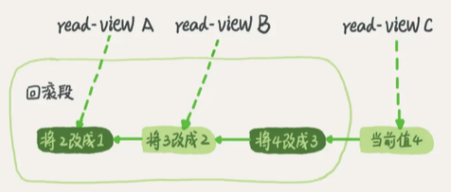

本文章来源于：<https://github.com/Zeb-D/my-review> ，请star 强力支持，你的支持，就是我的动力。

[TOC]

------

### 背景

以下测试环境为`docker run -p 3306:3306 -v /data/docker/mysql/data:/var/lib/mysql:rw --name ydMysql -e MYSQL_ROOT_PASSWORD=yd_mysql -d mysql:8.0`

谈起MySQL的ACID这四个特性，大家都能张口说出它的概念，但又有多少人知道它又和几个MySQL组件有关系的，ACID特性是基于MySQL存储引擎中InnoDB实现的；

它涉及到较多组件，MySQL 引入了WAL（write ahead log）技术，是基于真实数据进行CRUD要进行随机IO，众所周知，一些redo log、undo log、binlog 跟大众一样，使用了MMP技术进行顺序写IO，中间也会加入了一些change buffer技术；

另外这些的实现是围绕着ACID不同的特性；


#### ACID特性

ACID是衡量事务的四个特性：

- 原子性（Atomicity，或称不可分割性）
- 一致性（Consistency）
- 隔离性（Isolation）
- 持久性（Durability）

按照严格的标准，只有同时满足ACID特性才是事务；但是在各大数据库厂商的实现中，真正满足ACID的事务少之又少。例如MySQL的NDB Cluster事务不满足持久性和隔离性；

InnoDB默认事务隔离级别是可重复读，不满足隔离性；Oracle默认的事务隔离级别为READ COMMITTED，不满足隔离性……因此与其说**ACID**是事务必须满足的条件，不如说它们是衡量事务的四个维度。


#### 事务的启动方式

MySQL 的事务启动方式有以下几种：

1、显式启动事务语句， begin 或 start transaction。配套的提交语句是 commit，回滚语句是 rollback。		

```
start transaction;
……  #一条或多条sql语句
commit;
```

2、set autocommit=0，这个命令会将这个线程的自动提交关掉。意味着如果你只执行一个 select 语句，这个事务就启动了，而且并不会自动提交。这个事务持续存在直到你主动执行 commit 或 rollback 语句，或者断开连接。`需要注意的是，autocommit参数是针对连接的，在一个连接中修改了参数，不会对其他连接产生影响。`

```
mysql> show variables like 'autocommit';
+---------------+-------+
| Variable_name | Value |
+---------------+-------+
| autocommit    | ON    |
+---------------+-------+
1 row in set (0.00 sec)

mysql>
mysql> set autocommit=0;
Query OK, 0 rows affected (0.00 sec)

mysql> show variables like 'autocommit';
+---------------+-------+
| Variable_name | Value |
+---------------+-------+
| autocommit    | OFF   |
+---------------+-------+
1 row in set (0.00 sec)
```

有些客户端连接框架会默认连接成功后先执行一个 set autocommit=0 的命令，由此就导致接下来的查询都在事务中，如果是长连接，就导致了意外的长事务。

> **特殊操作**
>
> 在MySQL中，存在一些特殊的命令，如果在事务中执行了这些命令，会马上强制执行commit提交事务；如DDL语句(create table/drop table/alter/table)、lock tables语句等等。
>
> 不过，常用的select、insert、update和delete命令，都不会强制提交事务。

3、commit work and chain

提交事务并自动启动下一个事务，这样也省去了再次执行 begin 语句的开销。同时带来的好处是从程序开发的角度明确地知道每个语句是否处于事务中。

> 1、显示的开启事务有利于避免长事务，因为长事务出现的重要原因是程序员的误用
>
> 2、在开发过程中，尽可能的减小事务范围，少用长事务，如果无法避免，保证逻辑日志空间足够用，并且支持动态日志空间增长。监控Innodb_trx表，发现长事务报警。

4、避免长事务

开发侧：

> 1.确认是否使用了 set autocommit=0。这个确认工作可以在测试环境中开展，把 MySQL 的 general_log 开起来，然后随便跑一个业务逻辑，通过 general_log 的日志来确认。一般框架如果会设置这个值，也就会提供参数来控制行为，你的目标就是把它改成 1。
>
> 2.确认是否有不必要的只读事务。有些框架会习惯不管什么语句先用 begin/commit 框起来。我见过有些是业务并没有这个需要，但是也把好几个 select 语句放到了事务中。这种只读事务可以去掉。
>
> 3.业务连接数据库的时候，根据业务本身的预估，通过 SET MAX_EXECUTION_TIME 命令，来控制每个语句执行的最长时间，避免单个语句意外执行太长时间。

监控侧：

> 1.监控 information_schema.Innodb_trx 表，设置长事务阈值，超过就报警 / 或者 kill；
>
> 2.Percona 的 pt-kill 这个工具不错，推荐使用；
>
> 3.在业务功能测试阶段要求输出所有的 general_log，分析日志行为提前发现问题；
>
> 4.如果使用的是 MySQL 5.6 或者更新版本，把 innodb_undo_tablespaces 设置成 2（或更大的值）。如果真的出现大事务导致回滚段过大，这样设置后清理起来更方便。


### 解析ACID

在说明原子性原理之前，首先介绍一下MySQL的事务日志。

MySQL的日志有很多种，如二进制日志、错误日志、查询日志、慢查询日志等，此外InnoDB存储引擎还提供了两种事务日志：redo log(重做日志)和undo log(回滚日志)。

其中redo log用于保证事务持久性；undo log则是事务原子性和隔离性实现的基础。

先给出ACID特性及其实现原理：

- 原子性：语句要么全执行，要么全不执行，是事务最核心的特性，事务本身就是以原子性来定义的；实现主要基于undo log
- 持久性：保证事务提交后不会因为宕机等原因导致数据丢失；实现主要基于redo log
- 隔离性：保证事务执行尽可能不受其他事务影响；InnoDB默认的隔离级别是RR，RR的实现主要基于锁机制（包含next-key lock）、MVCC（包括数据的隐藏列、基于undo log的版本链、ReadView）
- 一致性：事务追求的最终目标，一致性的实现既需要数据库层面的保障，也需要应用层面的保障


#### 原子性

##### 定义

原子性是指一个事务是一个不可分割的工作单位，其中的操作要么都做，要么都不做；如果事务中一个sql语句执行失败，则已执行的语句也必须回滚，数据库退回到事务前的状态。

##### 实现原理：undo log

实现原子性的关键，是当事务回滚时能够撤销所有已经成功执行的sql语句。

InnoDB实现回滚，靠的是undo log：当事务对数据库进行修改时，InnoDB会生成对应的undo log；

如果事务执行失败或调用了rollback，导致事务需要回滚，便可以利用undo log中的信息将数据回滚到修改之前的样子。

undo log属于逻辑日志，它记录的是sql执行相关的信息。

> 当发生回滚时，InnoDB会根据undo log的内容做与之前相反的工作：对于每个insert，回滚时会执行delete；对于每个delete，回滚时会执行insert；对于每个update，回滚时会执行一个相反的update，把数据改回去。
>
> 以update操作为例：当事务执行update时，其生成的undo log中会包含被修改行的主键(以便知道修改了哪些行)、修改了哪些列、这些列在修改前后的值等信息，回滚时便可以使用这些信息将数据还原到update之前的状态。

回滚日志总不能一直保留吧，什么时候删除呢？

在不需要的时候才删除。也就是说，系统会判断，当没有事务再需要用到这些回滚日志时，回滚日志会被删除。

就是当系统里没有比这个回滚日志更早的 read-view 的时候。

> 注意：尽量不要使用长事务。
>
> 1、长事务意味着系统里面会存在很老的事务视图。
>
> 由于这些事务随时可能访问数据库里面的任何数据，所以这个事务提交之前，数据库里面它可能用到的回滚记录都必须保留，这就会导致大量占用存储空间。
>
> 2、长事务还占用锁资源，也可能拖垮整个库，这个我们会在后面讲锁的时候展开。


#### 持久性

##### 定义

持久性是指事务一旦提交，它对数据库的改变就应该是永久性的。接下来的其他操作或故障不应该对其有任何影响。

##### 实现原理：redo log

InnoDB作为MySQL的存储引擎，数据是存放在磁盘中的，但如果每次读写数据都需要磁盘IO，效率会很低。

为此，InnoDB提供了缓存(Buffer Pool)，Buffer Pool中包含了磁盘中部分数据页的映射，作为访问数据库的缓冲：当从数据库读取数据时，会首先从Buffer Pool中读取，如果Buffer Pool中没有，则从磁盘读取后放入Buffer Pool；当向数据库写入数据时，会首先写入Buffer Pool，Buffer Pool中修改的数据会定期刷新到磁盘中（这一过程称为刷脏）。

Buffer Pool的使用大大提高了读写数据的效率，但是也带了新的问题：如果MySQL宕机，而此时Buffer Pool中修改的数据还没有刷新到磁盘，就会导致数据的丢失，事务的持久性无法保证。

于是，redo log被引入来解决这个问题：

1、当数据修改时，除了修改Buffer Pool中的数据，还会在redo log记录这次操作；

2、当事务提交时，会调用fsync接口对redo log进行刷盘。如果MySQL宕机，重启时可以读取redo log中的数据，对数据库进行恢复。

redo log采用的是WAL（Write-ahead logging，预写式日志），所有修改先写入日志，再更新到Buffer Pool，保证了数据不会因MySQL宕机而丢失，从而满足了持久性要求。

既然redo log也需要在事务提交时将日志写入磁盘，为什么它比直接将Buffer Pool中修改的数据写入磁盘(即刷脏)要快呢？主要有以下两方面的原因：

（1）刷脏是随机IO，因为每次修改的数据位置随机，但写redo log是追加操作，属于顺序IO。

（2）刷脏是以数据页（Page）为单位的，MySQL默认页大小是16KB，一个Page上一个小修改都要整页写入；而redo log中只包含真正需要写入的部分，无效IO大大减少。

> 对于redo log与binlog可以看看[mysql-innodb架构解析.md](./mysql-innodb架构解析.md#redo log与binlog)


#### 隔离性

##### 定义

**与原子性、持久性侧重于研究事务本身不同，隔离性研究的是不同事务之间的相互影响。**

隔离性是指，事务内部的操作与其他事务是隔离的，并发执行的各个事务之间不能互相干扰。

严格的隔离性，对应了事务隔离级别中的Serializable (可串行化)，但实际应用中出于性能方面的考虑很少会使用可串行化。

 

隔离性追求的是并发情形下事务之间互不干扰。简单起见，我们主要考虑最简单的读操作和写操作(加锁读等特殊读操作会特殊说明)，那么隔离性的探讨，主要可以分为两个方面：

- (一个事务)写操作对(另一个事务)写操作的影响：锁机制保证隔离性
- (一个事务)写操作对(另一个事务)读操作的影响：MVCC保证隔离性


##### 锁机制

首先来看两个事务的写操作之间的相互影响。隔离性要求同一时刻只能有一个事务对数据进行写操作，InnoDB通过锁机制来保证这一点。

锁机制的基本原理可以概括为：

1、事务在修改数据之前，需要先获得相应的锁；

2、获得锁之后，事务便可以修改数据；该事务操作期间，这部分数据是锁定的，其他事务如果需要修改数据，需要等待当前事务提交或回滚后释放锁。


**行锁与表锁**

按照粒度，锁可以分为表锁、行锁以及其他位于二者之间的锁。表锁在操作数据时会锁定整张表，并发性能较差；行锁则只锁定需要操作的数据，并发性能好。但是由于加锁本身需要消耗资源(获得锁、检查锁、释放锁等都需要消耗资源)，因此在锁定数据较多情况下使用表锁可以节省大量资源。MySQL中不同的存储引擎支持的锁是不一样的，例如MyIsam只支持表锁，而InnoDB同时支持表锁和行锁，且出于性能考虑，绝大多数情况下使用的都是行锁。

**如何查看锁信息**

有多种方法可以查看InnoDB中锁的情况，例如：

```
select * from performance_schema.data_locks; #锁的概况
show engine innodb status; #InnoDB整体状态，其中包括锁的情况
```

下面来看一个例子：

```
mysql> create table students(
    -> id int(11) not null auto_increment primary key,
    -> balance int(20) not null default 0
    -> )ENGINE=InnoDB DEFAULT CHARSET=utf8;
Query OK, 0 rows affected, 3 warnings (0.02 sec)
```

```
#在事务A中执行：
start transaction;
update students SET balance = 1000 where id = 1;
#在事务B中执行：
start transaction;
update students SET balance = 2000 where id = 1;
```

此时查看锁的情况：

```
mysql> select ENGINE_LOCK_ID,ENGINE_TRANSACTION_ID,THREAD_ID,OBJECT_NAME,LOCK_MODE,LOCK_TYPE from performance_schema.data_locks;
+---------------------------------------+-----------------------+-----------+-------------+---------------+-----------+
| ENGINE_LOCK_ID                        | ENGINE_TRANSACTION_ID | THREAD_ID | OBJECT_NAME | LOCK_MODE     | LOCK_TYPE |
+---------------------------------------+-----------------------+-----------+-------------+---------------+-----------+
| 140402510761984:1067:140402413879680  |                  1814 |        46 | students    | IX            | TABLE     |
| 140402510761176:1067:140402413873584  |                  1813 |        45 | students    | IX            | TABLE     |
| 140402510761176:2:4:2:140402413870592 |                  1813 |        45 | students    | X,REC_NOT_GAP | RECORD    |
+---------------------------------------+-----------------------+-----------+-------------+---------------+-----------+
3 rows in set (0.00 sec)
```

show engine innodb status查看锁相关的部分：

```
TRANSACTIONS
------------
Trx id counter 1815
Purge done for trx's n:o < 1811 undo n:o < 0 state: running but idle
History list length 0
LIST OF TRANSACTIONS FOR EACH SESSION:
---TRANSACTION 421877487471024, not started
0 lock struct(s), heap size 1128, 0 row lock(s)
---TRANSACTION 421877487470216, not started
0 lock struct(s), heap size 1128, 0 row lock(s)
---TRANSACTION 1814, ACTIVE 129 sec
1 lock struct(s), heap size 1128, 1 row lock(s)
MySQL thread id 9, OS thread handle 140402348717824, query id 254 localhost root
---TRANSACTION 1813, ACTIVE 136 sec
2 lock struct(s), heap size 1128, 1 row lock(s), undo log entries 1
MySQL thread id 8, OS thread handle 140402349774592, query id 257 localhost root starting
show engine innodb status
```

通过上述命令可以查看事务1814和1813占用锁的情况；其中lock_type为RECORD，代表锁为行锁(记录锁)；lock_mode为X，代表排它锁(写锁)。

除了排它锁(写锁)之外，MySQL中还有共享锁(读锁)的概念。由于本文重点是MySQL事务的实现原理，因此对锁的介绍到此为止，后续会专门写文章分析MySQL中不同锁的区别、使用场景等，


##### 脏读、不可重复读和幻读

首先来看并发情况下，读操作可能存在的三类问题：

（1）脏读：当前事务(A)中可以读到其他事务(B)未提交的数据（脏数据），这种现象是脏读。举例如下（以账户余额表为例）：

| time | transaction A                                                | transaction B                                    |
| ---- | ------------------------------------------------------------ | ------------------------------------------------ |
| t1   | start transaction;                                           | start transaction;                               |
| t2   |                                                              | update students SET balance = 1000 where id = 1; |
| t3   | select balance from students  where id=1;<br /> ---- balance = 1000 |                                                  |
| t4   |                                                              | commit                                           |
|      | **脏读**                                                     |                                                  |


（2）不可重复读：在事务A中先后两次读取同一个数据，两次读取的结果不一样，这种现象称为不可重复读。脏读与不可重复读的区别在于：前者读到的是其他事务未提交的数据，后者读到的是其他事务已提交的数据。举例如下：

| time | transaction A                                                | transaction B                                    |
| ---- | ------------------------------------------------------------ | ------------------------------------------------ |
| t1   | start transaction;                                           | start transaction;                               |
| t2   | select balance from students  where id=1;<br /> ---- balance = 1000 |                                                  |
| t3   |                                                              | update students SET balance = 2000 where id = 1; |
| t4   |                                                              | commit                                           |
| t5   | select balance from students  where id=1;<br /> ---- balance = 2000 |                                                  |
|      | **不可重复读**                                               |                                                  |


（3）幻读：在事务A中按照某个条件先后两次查询数据库，两次查询结果的条数不同，这种现象称为幻读。不可重复读与幻读的区别可以通俗的理解为：前者是数据变了，后者是数据的行数变了。举例如下：


| time | transaction A                                                | transaction B                     |
| ---- | ------------------------------------------------------------ | --------------------------------- |
| t1   | start transaction;                                           | start transaction;                |
| t2   | select id from students  where id <=5;<br /> ---- id=1       |                                   |
| t3   |                                                              | insert into students values(2,0); |
| t4   |                                                              | commit                            |
| t5   | select id from students  where id <=5;<br /> ---- id=1<br /> ---- id=2 |                                   |
|      | **幻读**                                                     |                                   |


##### 事务隔离级别

SQL标准中定义了四种隔离级别，并规定了每种隔离级别下上述几个问题是否存在。一般来说，隔离级别越低，系统开销越低，可支持的并发越高，但隔离性也越差。隔离级别与读问题的关系如下：

| 事务隔离级别                 | 脏读 | 不可重复读 | 幻读 |
| ---------------------------- | ---- | ---------- | ---- |
| 读未提交（read-uncommitted） | 是   | 是         | 是   |
| 不可重复读（read-committed） | 否   | 是         | 是   |
| 可重复读（repeatable-read）  | 否   | 否         | 是   |
| 串行化（serializable）       | 否   | 否         | 否   |

在实际应用中，**读未提交**在并发时会导致很多问题，而性能相对于其他隔离级别提高却很有限，因此使用较少。**可串行化**强制事务串行，并发效率很低，只有当对数据一致性要求极高且可以接受没有并发时使用，因此使用也较少。因此在大多数数据库系统中，默认的隔离级别是读已提交(如Oracle)**或**可重复读（后文简称RR）。

可以通过如下两个命令分别查看全局隔离级别和本次会话的隔离级别：

```
mysql> select @@global.transaction_isolation;
+--------------------------------+
| @@global.transaction_isolation |
+--------------------------------+
| REPEATABLE-READ                |
+--------------------------------+
1 row in set (0.00 sec)
mysql> select @@transaction_isolation;
+-------------------------+
| @@transaction_isolation |
+-------------------------+
| REPEATABLE-READ         |
+-------------------------+
1 row in set (0.01 sec)
```

InnoDB默认的隔离级别是RR，后文会重点介绍RR。需要注意的是，在SQL标准中，RR是无法避免幻读问题的，但是InnoDB实现的RR避免了幻读问题。


##### MVCC

RR解决脏读、不可重复读、幻读等问题，使用的是MVCC：MVCC全称Multi-Version Concurrency Control，即多版本的并发控制协议。


MVCC最大的优点是读不加锁，因此读写不冲突，并发性能好。

InnoDB实现MVCC，多个版本的数据可以共存，主要基于以下技术及数据结构：

1）隐藏列：InnoDB中每行数据都有隐藏列，隐藏列中包含了本行数据的事务id、指向undo log的指针等。

2）基于undo log的版本链：前面说到每行数据的隐藏列中包含了指向undo log的指针，而每条undo log也会指向更早版本的undo log，从而形成一条版本链。

3）ReadView：通过隐藏列和版本链，MySQL可以将数据恢复到指定版本；但是具体要恢复到哪个版本，则需要根据ReadView来确定。所谓ReadView，是指事务（记做事务A）在某一时刻给整个事务系统（trx_sys）打快照，之后再进行读操作时，会将读取到的数据中的事务id与trx_sys快照比较，从而判断数据对该ReadView是否可见，即对事务A是否可见。

trx_sys中的主要内容，以及判断可见性的方法如下：

- low_limit_id：表示生成ReadView时系统中应该分配给下一个事务的id。如果数据的事务id大于等于low_limit_id，则对该ReadView不可见。
- up_limit_id：表示生成ReadView时当前系统中活跃的读写事务中最小的事务id。如果数据的事务id小于up_limit_id，则对该ReadView可见。
- rw_trx_ids：表示生成ReadView时当前系统中活跃的读写事务的事务id列表。如果数据的事务id在low_limit_id和up_limit_id之间，则需要判断事务id是否在rw_trx_ids中：如果在，说明生成ReadView时事务仍在活跃中，因此数据对ReadView不可见；如果不在，说明生成ReadView时事务已经提交了，因此数据对ReadView可见。

##### MVCC ReadView实现

在 MySQL 中，实际上每条记录在更新的时候都会同时记录一条回滚操作。记录上的最新值，通过回滚操作，都可以得到前一个状态的值。

假设一个值从 1 被按顺序改成了 2、3、4，在回滚日志里面就会有类似下面的记录：



当前值是 4，但是在查询这条记录的时候，不同时刻启动的事务会有不同的 read-view。如图中看到的，在视图 A、B、C 里面，这一个记录的值分别是 1、2、4，同一条记录在系统中可以存在多个版本，就是数据库的多版本并发控制（MVCC）。对于 read-view A，要得到 1，就必须将当前值依次执行图中所有的回滚操作得到。

同时你会发现，即使现在有另外一个事务正在将 4 改成 5，这个事务跟 read-view A、B、C 对应的事务是不会冲突的。


下面以RR隔离级别为例，结合前文提到的几个问题分别说明。

（1）脏读：

| time | transaction A                                                | transaction B                                    |
| ---- | ------------------------------------------------------------ | ------------------------------------------------ |
| t0   | start transaction;                                           | start transaction;                               |
| t1   | select balance from students  where id=1;<br /> ---- balance = 0 |                                                  |
| t2   |                                                              | update students SET balance = 1000 where id = 1; |
| t3   | select balance from students  where id=1;<br /> ---- balance = 0 |                                                  |
| t4   |                                                              | commit                                           |
|      | **避免了脏读**                                               |                                                  |

当事务A在T4时刻读取id=1的余额前，会生成ReadView，由于此时事务B没有提交仍然活跃，因此其事务id一定在ReadView的rw_trx_ids中，因此根据前面介绍的规则，事务B的修改对ReadView不可见。接下来，事务A根据指针指向的undo log查询上一版本的数据，得到id=1的余额为1000。这样事务A就避免了脏读。


（2）不可重复读：

| time | transaction A                                                | transaction B                                    |
| ---- | ------------------------------------------------------------ | ------------------------------------------------ |
| t1   | start transaction;                                           | start transaction;                               |
| t2   | select balance from students  where id=1;<br /> ---- balance = 1000 |                                                  |
| t3   |                                                              | update students SET balance = 2000 where id = 1; |
| t4   |                                                              | commit                                           |
| t5   | select balance from students  where id=1;<br /> ---- balance = 1000 |                                                  |
|      | **避免了不可重复读**                                         |                                                  |

当事务A在T2时刻读取id=1的余额前，会生成ReadView。

此时事务B分两种情况讨论：

一种是如表格所示，事务已经开始但没有提交，此时其事务id在ReadView的rw_trx_ids中；

一种是事务B还没有开始，此时其事务id大于等于ReadView的low_limit_id。无论是哪种情况，根据前面介绍的规则，事务B的修改对ReadView都不可见。

当事务A在T5时刻再次读取id=1的余额时，会根据T2时刻生成的ReadView对数据的可见性进行判断，从而判断出事务B的修改不可见；因此事务A根据指针指向的undo log查询上一版本的数据，得到id=1的余额为1000，从而避免了不可重复读。


（3）幻读：

| time | transaction A                                                | transaction B                     |
| ---- | ------------------------------------------------------------ | --------------------------------- |
| t1   | start transaction;                                           | start transaction;                |
| t2   | select id from students  where id <=5;<br /> ---- id=1       |                                   |
| t3   |                                                              | insert into students values(2,0); |
| t4   |                                                              | commit                            |
| t5   | select id from students  where id <=5;<br /> ---- id=1<br /> |                                   |
|      | **避免了幻读**                                               |                                   |

MVCC避免幻读的机制与避免不可重复读非常类似。

当事务A在T2时刻读取id<=5的用户余额前，会生成ReadView。此时事务B分两种情况讨论：

一种是如图中所示，事务已经开始但没有提交，此时其事务id在ReadView的rw_trx_ids中；

一种是事务B还没有开始，此时其事务id大于等于ReadView的low_limit_id。无论是哪种情况，根据前面介绍的规则，事务B的修改对ReadView都不可见。

当事务A在T5时刻再次读取id<=5的用户余额时，会根据T2时刻生成的ReadView对数据的可见性进行判断，从而判断出事务B的修改不可见。因此对于新插入的数据lisi(id=2)，事务A根据其指针指向的undo log查询上一版本的数据，发现该数据并不存在，从而避免了幻读。


**扩展**

前面介绍的MVCC，是RR隔离级别下“非加锁读”实现隔离性的方式。下面是一些简单的扩展。

（1）读已提交（RC）隔离级别下的非加锁读

RC与RR一样，都使用了MVCC，其主要区别在于：

RR是在事务开始后第一次执行select前创建ReadView，直到事务提交都不会再创建。根据前面的介绍，RR可以避免脏读、不可重复读和幻读。

RC每次执行select前都会重新建立一个新的ReadView，因此如果事务A第一次select之后，事务B对数据进行了修改并提交，那么事务A第二次select时会重新建立新的ReadView，因此事务B的修改对事务A是可见的。因此RC隔离级别可以避免脏读，但是无法避免不可重复读和幻读。

（2）加锁读与next-key lock

按照是否加锁，MySQL的读可以分为两种：

一种是非加锁读，也称作快照读、一致性读，使用普通的select语句，这种情况下使用MVCC避免了脏读、不可重复读、幻读，保证了隔离性。

另一种是加锁读，查询语句有所不同，如下所示：

```
#共享锁读取
select ...lock  in share mode
#排它锁读取
select ... for update
```

加锁读在查询时会对查询的数据加锁（共享锁或排它锁）。

由于锁的特性，当某事务对数据进行加锁读后，其他事务无法对数据进行写操作，因此可以避免脏读和不可重复读。而避免幻读，则需要通过next-key lock。

next-key lock是行锁的一种，实现相当于record lock(记录锁) + gap lock(间隙锁)；

其特点是不仅会锁住记录本身(record lock的功能)，还会锁定一个范围(gap lock的功能)。

因此，加锁读同样可以避免脏读、不可重复读和幻读，保证隔离性。


##### 总结

概括来说，InnoDB实现的RR，通过锁机制（包含next-key lock）、MVCC（包括数据的隐藏列、基于undo log的版本链、ReadView）等，实现了一定程度的隔离性，可以满足大多数场景的需要。

不过需要说明的是，RR虽然避免了幻读问题，但是毕竟不是Serializable，不能保证完全的隔离；


#### 一致性

##### 基本概念

一致性是指事务执行结束后，**数据库的完整性约束没有被破坏，事务执行的前后都是合法的数据状态。**

数据库的完整性约束包括但不限于：实体完整性（如行的主键存在且唯一）、列完整性（如字段的类型、大小、长度要符合要求）、外键约束、用户自定义完整性（如转账前后，两个账户余额的和应该不变）。

#####  实现

可以说，一致性是事务追求的最终目标：前面提到的原子性、持久性和隔离性，都是为了保证数据库状态的一致性。此外，除了数据库层面的保障，一致性的实现也需要应用层面进行保障。

实现一致性的措施包括：

- 保证原子性、持久性和隔离性，如果这些特性无法保证，事务的一致性也无法保证
- 数据库本身提供保障，例如不允许向整形列插入字符串值、字符串长度不能超过列的限制等
- 应用层面进行保障，例如如果转账操作只扣除转账者的余额，而没有增加接收者的余额，无论数据库实现的多么完美，也无法保证状态的一致


### 参考资料

> 《MySQL技术内幕：InnoDB存储引擎》
>
> 《高性能MySQL》
>
> 《MySQL运维内参》
>
> https://www.cnblogs.com/kismetv/p/10331633.html
>
> https://dev.mysql.com/doc/refman/5.6/en/glossary.html#glos_acid
>
> https://dev.mysql.com/doc/refman/5.6/en/innodb-next-key-locking.html
>
> http://blog.sina.com.cn/s/blog_499740cb0100ugs7.html
>
> https://mp.weixin.qq.com/s/2dwGBTmu_da2x-HiHlN0vw
>
> http://www.cnblogs.com/chenpingzhao/p/5065316.html
>
> https://juejin.im/entry/5ba0a254e51d450e735e4a1f
>
> http://hedengcheng.com/?p=771
>
> http://mysql.taobao.org/monthly/2018/03/01/
>
> https://blog.csdn.net/nmjhehe/article/details/98470570
>
> https://elsef.com/2019/03/10/MySQL%E5%A6%82%E4%BD%95%E8%A7%A3%E5%86%B3%E5%90%84%E7%A7%8D%E4%B8%8D%E6%AD%A3%E5%B8%B8%E8%AF%BB/
>
> https://www.zhihu.com/question/372905832
