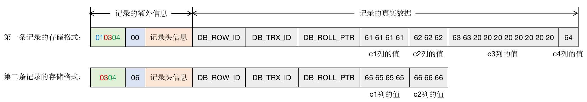
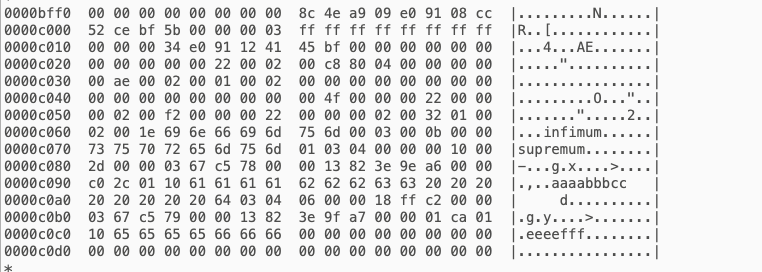
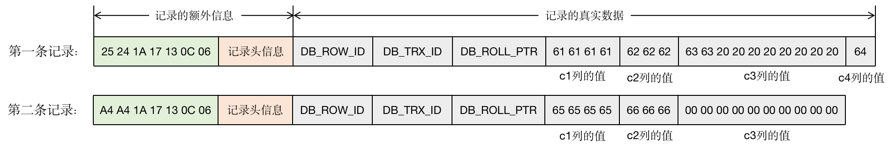
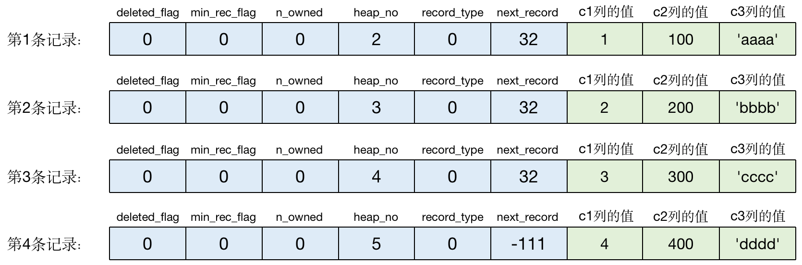
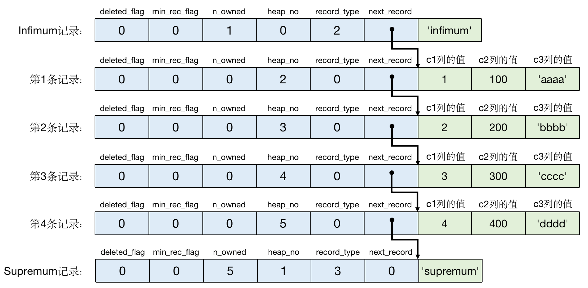
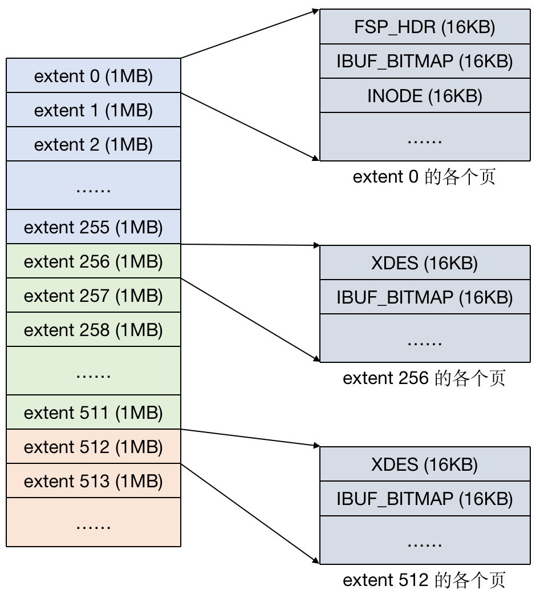

本文章来源于：<https://github.com/Zeb-D/my-review> ，请star 强力支持，你的支持，就是我的动力。

[TOC]

------

## 背景

我们都知道，InnoDB 是 MySQL 默认的存储引擎，那么它对于数据时如何处理的呢？


InnoDB 是一个将表中的数据存储到磁盘上的存储引擎，所以即使关机后重启我们的数据还是存在的。而真正处理数据的过程是发生在内存中的，所以需要把磁盘中的数据加载到内存中，如果是处理写入或修改请求的话，还需要把内存中的内容刷新到磁盘上。


而我们知道读写磁盘的速度非常慢，和内存读写差了几个数量级，所以当我们想从表中获取某些记录时，InnoDB 存储引擎需要一条一条的把记录从磁盘上读出来吗？这势必会耗费大量的时间。


因此，InnoDB 采取的方式是：将数据划分为若干个页，以页作为磁盘和内存之间交互的基本单位，InnoDB 中页的大小一般为 **16KB**（可以理解为 B+Tree 一个叶子节点存放的数据大小）。也就是在一般情况下，一次最少从磁盘中读取 16KB 的内容到内存中，一次最少把内存中的 16KB 内容刷新到磁盘中。


> 万物皆文件，平时用惯了MySQL一些API（包括sql），那么让我们看看它的背后是如何支撑这些的？


# 一、InnoDB 行格式

​	我们平时都是以记录为单位向表中插入数据的，这些记录在磁盘上的存放形式就被称为行格式或者行记录格式。目前 InnoDB 存储引擎支持 4 种不同类型的行格式，分别是 COMPACT、REDUNDANT、DYNAMIC 以及 COMPRESSED。

## 1 指定行格式的语法

```
CREATE TABLE 表名 （列信息）ROW_FORMAT=行格式名称;
ALTER TABLE 表名 ROW_FROMAT=行格式名称;
```

为了方便演示，创建一个用于演示的表，如下所示：

```
# 建表

CREATE TABLE row_format_demo (
	c1 VARCHAR(10),
	c2 VARCHAR(10) NOT NULL,
	c3 CHAR(10),
	c4 VARCHAR(10)
)CHARSET=ascii ROW_FORMAT=COMPACT;

# 这里字符集采用 ascii，这种字符集只包括空格、标点符号、数字、字母以及一些不可见字符，并且每一个字符都是占用 1 字节。

# 插入两条数据

INSERT INTO 
	row_format_demo (c1, c2, c3, c4) 
VALUES 
	('aaaa', 'bbb', 'cc', 'd'), 
	('eeee', 'fff', 'NULL', 'NULL');
```


## 2 COMPACT行格式




COMPACT 行格式示意图

从 COMPACT 行格式的示意图中可以看出，一条记录其实被分为记录的额外信息和记录的真实数据两大部分。

### 2.1 记录的额外信息

​	这部分信息是为了更好地管理记录而不得不额外添加的信息。这些信息分为 3 个部分，分别是变长字段长度列表、NULL值列表和记录头信息。

#### 2.1.1 变长字段长度列表

​	各个变长字段的真实数据所占用的字节数以十六进制的形式按照列顺序的逆序存放在变长字段长度列表中。第一条记录的变长字段长度列表存储的值如下图所示：





第一条记录的存储格式

​	由于第一条记录中 c1、c2 和 c4 这三个字段中存储的字符串都比较短，所以用 1 个字节就可以表示字段存储的真实数据所占用的字节数了。但是如果字段存储的内容占用的字节数比较多，可能就需要用 2 字节来表示了。至于用 1 字节还是 2 字节，InnoDB 是这样规定的：

●假设某个字符集表示一个字符最多需要 W 字节。（可以通过执行 show charset；语句查看）

●对于变长类型 VARCHAR(M) 来说，这种类型表示最多能存储 M 个字符。那么，这种类型存储的数据最多占用 M × W 字节。

●假设该变长字段世纪存储的数据占用 L 字节。

规则如下：

●如果 M ×  W ≤ 255，那么使用 1 字节来表示真实数据占用的字节数。

●如果 M × W > 255，则分两种情况：

○如果 L ≤ 127，则使用 1 字节来表示；

○如果 L > 127，则使用 2 字节来表示。

> 总结一下就是：如果该变长字段允许存储的最大字节数超过 255 字节，并且真实数据占用的字节数超过 127 字节，则使用 2 字节来表示真实数据占用的字节数，否则使用 1 字节来表示。

​	InnoDB在读取记录的变长字段长度列表时，会先查看表结构。如果某个变长字段允许存储的最大字节数大于 255，那么，怎么区分它正在读的某个字节是一个单独的字节来表示字段长度还是用 2 字节表示字段长度时其中的一个字节呢？其实在设计的时候，使用了该字节的第一个二进制位作为标志位：

●如果该字节的第一个位为 0，则该字节表示一个变长字段的长度；

●如果该字节的第一个位为 1，则需要两个字节来表示字段长度，该字节只是其中的一个字节。

另外需要注意的是：

●对于一条记录来说，如果某个字段占用的字节数非常多，那么 InnoDB 有可能把该字段的值的一部分数据存放到溢出页中。这样的话，该字段在记录的变长字段长度列表中只存储留在本页面中的数据的长度。

●变长字段长度列表中只存储值不为 NULL 的字段的内容长度。



第二条记录的存储格式

●不是所有记录都有变长字段长度列表的，如果表中所有字段都不是变长的数据类型，或者有变长数据类型的字段，但值都是 NULL 的话，就不需要变长字段长度列表。

#### 2.1.2 NULL 值列表

​	COMPACT 行格式设计了 NULL 值列表来统一管理记录中值为 NULL 的列，将值为 NULL 的列在 NULL 值列表中标识出来。具体的处理过程如下：

●首先统计表中允许存储 NULL 值的列。统计的时候主键以及用 NOT NULL 修饰的列是不需要统计的。

●如果表中没有允许存储 NULL 值的列，那么该条记录就不会有 NULL 值列表，否则将每个允许存储 NULL 值的列对应一个二进制位，二进制位按照列顺序的逆序排列。二进制位表示的意义如下：

○二进制位的值为 1 时，代表该列的值为 NULL；

○二进制位的值为 0 时，代表该列的值不为 NULL。






○NULL 值列表必须用整数个字节的位来表示，如果使用的二进制位个数不是整数个字节，则在该字节的高位补 0。




填充了 NULL 值列表后的示意图


#### 2.1.3 记录头信息

​	记录头信息由固定的 5 字节组成，用于描述记录的一些属性。5 字节共 40 个二进制位，不同的位代表不同的意思。




记录头信息示意图

| 名称         | 大小（位） | 描述                                                         |
| :----------- | :--------- | :----------------------------------------------------------- |
| 预留位1      | 1          | 没有使用                                                     |
| 预留位2      | 1          | 没有使用                                                     |
| deleted_flag | 1          | 标记该记录是否被删除                                         |
| min_rec_flag | 1          | B+ 树的每层非叶子节点中最小的目录项目记录都会添加该标记      |
| n_owned      | 4          | 一个页面中的记录会被分成若干个组，每个组中有一个记录是“带头大哥“，其余的记录都是”小弟“。”带头大哥“记录的 n_owned 值表示该组中所有的记录条数，“小弟”记录的 n_owned 值都为 0 |
| heap_no      | 13         | 表示当前记录在页面堆中的相对位置                             |
| record_type  | 3          | 表示当前记录的类型，0 表示普通记录，1 表示 B+ 树非叶子节点的目录项记录，2 表示 Infimum 记录，3 表示Supremum 记录 |
| next_record  | 16         | 表示下一条记录的相对位置                                     |

### 2.2 记录的真实数据

​	对于存储引擎是 InnoDB 的表来说，MySQL 会为每条记录添加一些隐藏列：

| 列名        | 是否必需 | 占用空间 | 描述                    |
| :---------- | :------- | :------- | :---------------------- |
| DB_ROW_ID   | 否       | 6字节    | 行 ID，唯一标识一条记录 |
| DB_TRX_ID   | 是       | 6字节    | 事物 ID                 |
| DB_ROLL_PTR | 是       | 7字节    | 回滚指针                |

加上真实数据后，两条记录如下图所示：



根据以上我们的分析，我们通过hexdump（或者用notepad++ 插件方式HEX-editor）指令来分析一下示例表的数据文件。结果如下：这里只截了一部分，即包含行数据的部分。

> 文件位置在，mysql data 目录下，按照数据库名称为文件夹，表名为文件名，
>
> 比如test数据库的row_format_demo表，对应表数据在 data/test目录找到row_format_demo.ibd



因此我们可以得到前两行的行记录为： 

| 说明   | 变长字段 | NULL值列表 | 记录头信息      | row_id             | trx_id            | roll_pointer         | c1列        | c2列     | c3列                          | c4列 |
| ------ | -------- | ---------- | --------------- | ------------------ | ----------------- | -------------------- | ----------- | -------- | ----------------------------- | ---- |
| 第一行 | 01 03 04 | 00         | 00 00 10 00  2d | 00 00 03 67 c5 78  | 00 00 13 82 3e 9e | a6 00 00 c0 2c 01 10 | 61 61 61 61 | 62 62 62 | 63 63 20 20 20 20 20 20 20 20 | 64   |
| 第二行 | 03 04    | 06         | 00 00 18 ff c2  | 00 00  03 67 c5 79 | 00 00 13 82 3e 9f | a7 00 00 01 ca 01 10 | 65 65 65 65 | 66 66 66 |                               |      |


### 2.3 CHAR(M) 列的存储格式

​	对于 CHAR(M) 类型的列来说，当采用的是定长编码字符集时，该列占用的字节数不会记录到变长字段长度列表中；而如果采用的是变长编码字符集时，该列占用的字节数会被记录到变长字段长度列表中。

​	另外还有一点需要注意，在 COMPACT 行格式下，采用变长编码字符集时，CHAR(M) 类型的列要求至少占用 M 个字节长度。这样的话，在将来更新该列的值时，如果新值的字节长度大于旧值但不大于 M 字节时，可以在该记录处直接更新，不需要重新分配新的记录空间，一定程度上避免了内存碎片的产生。





​		第一条记录在不同字符集下变长字段长度列表的变化


## 3 REDUNDANT 行格式



									REDUNDANT 行格式示意图


### 3.1 记录的额外信息

#### 3.1.1 字段长度偏移列表

​	字段长度偏移列表存储的偏移量指的是每个列的值占用的空间在记录的真实数据处结束的位置。

​	字段长度偏移列表与变长字段长度列表相比，有两处不同：

●没有“变长”两个字，意味着 REDUNDANT 行格式会把该条记录中所有列（包括隐藏列）的长度信息都按照列顺序的逆序存储到字段长度偏移列表中；

●多了“偏移”两个字，意味着字段长度偏移列表不是记录字段存储值的长度，而是采用两个相邻偏移量的差值来计算各个列值的长度。



REDUNDANT 行格式下两条记录的具体格式


#### 3.1.2 记录头信息

​	REDUNDANT 行格式的记录头信息占用 6 字节，总共 48 个二进制位。

| 名称            | 大小（位） | 描述                                                         |
| :-------------- | :--------- | :----------------------------------------------------------- |
| 预留位1         | 1          | 没有使用                                                     |
| 预留位2         | 1          | 没有使用                                                     |
| deleted_flag    | 1          | 标记该记录是否被删除                                         |
| min_rec_flag    | 1          | B+ 树的每层非叶子节点中最小的目录项目记录都会添加该标记      |
| n_owned         | 4          | 一个页面中的记录会被分成若干个组，每个组中有一个记录是“带头大哥“，其余的记录都是”小弟“。”带头大哥“记录的 n_owned 值表示该组中所有的记录条数，“小弟”记录的 n_owned 值都为 0 |
| heap_no         | 13         | 表示当前记录在页面堆中的相对位置                             |
| n_field         | 10         | 表示记录中列的数量                                           |
| 1byte_offs_flag | 1          | 标记字段长度偏移列表中每个列对应的偏移量是使用 1 字节还是 2 字节来表示的。值为 1 时，表示使用 1 字节存储偏移量；值为 0 时，表示使用 2 字节存储偏移量。 |
| next_record     | 16         | 表示下一条记录的相对位置                                     |

与 COMPACT 行格式的记录头信息相比，有两处不同：

●REDUNDANT 行格式多了 n_field 和 1byte_offs_flag 两个属性；

●REDUNDANT 行格式没有 record_type 这个属性。

#### 3.1.3 1byte_offs_flag 的值怎么确定

●记录的真实数据占用的存储空间不大于 127 字节时，每个列对应的偏移量占用 1 字节。

●当记录的真实数据占用的存储空间大于 127 字节，但是不大于 32767 字节时，每个列对应的偏移量占用 2 字节。

●如果记录的真实数据占用的存储空间大于 32767 字节，此时该记录的一部分已经存储到溢出页中，在本页只保留前 768 字节和 20 字节的溢出页的地址。这种情况下，也是使用 2 字节来表示每个列对应的偏移量。

一个字节表示的范围是 0～255，为什么大于 127 就要采用 2 字节呢？这是为了对值为 NULL 的列进行特殊处理。

#### 3.1.4 REDUNDANT 行格式中 NULL 值的处理

​	REDUNDANT 行格式中是没有 NULL 值列表的，但是在字段长度偏移列表中，将每个列对应的偏移量值的第一个比特位作为该条记录中该列是否为 NULL 值的标识，如果偏移量的第一个比特位为 1，那么该列的值为 NULL，否则该列的值不为 NULL。

​	但是，对于值为 NULL 的列来说，该列的数据类型是否为变长类型决定了该列在记录中的真实数据中的存储方式：

●如果存储 NULL 值的列是定长类型的，比如 CHAR(M)，则在记录的真实数据中也会记录该列，并且用 0x00 填充。如第二条记录中，c3 列对应的偏移量为 0xA4，对应的二进制为 10100100，最高位为 1，说明 c3 列值为 NULL。去掉最高位后变成 0100100，对应的十进制值为 36，而 c2 列对应的偏移量为 1A，对应的十进制值为 26，所以 c3 列占用的存储空间为 36 - 26 = 10 字节。

●如果存储 NULL 值的列是变长的数据类型，则不在记录的真实数据中记录该列。如第二条记录中的 c4 列，偏移量为 0xA4，与 c3 列的偏移量相同，以为着 c4 列不在记录的真实数据出占用任何存储空间。

#### 3.1.5 CHAR(M) 列的存储格式

​	不管使用什么字符集，只要使用 CHAR(M) 类型，那么该列在真实数据处占用的存储空间为 M ×  W 个字节（M 和 W 在上文中有解释）。这样虽然避免了在更新数据时，为记录申请新的存储空间，但是也可能会浪费一些存储空间。

## 4 溢出列

​	在 COMPACT 行格式和 REDUNDANT 行格式下，如果一条记录的某个列中存储的数据占用的字节数非常多，那么在记录的真实数据中只会存储该列的一部分数据（前768字节），剩余的数据分散存储在几个其他的页中，然后在记录的真实数据处用 20 字节存储指向这些页面的地址，当然也会记录在其他页面中的数据所占用的字节数。这个需要其他页面来存储数据的列就成为溢出列，而存储 768 字节外的数据的页面就成为溢出页。

## 5 DYNAMIC 行格式和 COMPRESSED 行格式

​	MySQL5.7版本的默认行格式就是 DYNAMIC。DYNAMIC 和 COMPRESSED 这两种行格式与 COMPACT 行格式很相似，只是在处理溢出列的数据时有点不同，它们不会在记录的真实数据中存储该溢出列的前 768 字节，而是把该列的所有真实 数据都存储到溢出页中，只是在记录的真实数据处存储 20 字节大小的指向溢出页的地址。而 COMPRESSED 行格式与 DYNAMIC 行格式的不同之处是：COMPRESSED 行格式会采用压缩算法对页面进行压缩，以节省空间。


# 二、InnoDB的数据页结构

​	页是 InnoDB 管理存储空间的基本单位，一个页的大小一般是 16KB。

## 1 数据页的结构

​	数据页主要划分为 7 个部分，如下图所示：






## 2 记录在页中的存储






### 2.1 记录头信息

为了方便演示，创建一个用于演示的表，如下所示：

```
# 建表
CREATE TABLE page_demo (
	c1 INT,
	c2 INT,
	c3 VARCHAR(10000),
    PRIMARY KEY (c1)
)CHARSET=ascii ROW_FORMAT=COMPACT;

# 这里字符集采用 ascii，这种字符集只包括空格、标点符号、数字、字母以及一些不可见字符，并且每一个字符都是占用 1 字节。

# 插入4条数据
INSERT INTO 
	page_demo (c1, c2, c3) 
VALUES 
	(1, 100, 'aaaa'), 
	(2, 200, 'bbbb'),
	(3, 300, 'cccc'),
	(4, 400, 'dddd');
```

现在我们主要介绍记录头信息部分，所以将行格式简化一下，如下图所示：






那么，四条记录的都示意图如下所示，为了方便，所有数值均用十进制表示。




●deleted_flag：这个属性是用来标记当前记录是否被删除，值为 0 表示没有被删除，值为 1 表示记录已经被删除。记录被删除后不会真正将该条记录从磁盘上移除，因为移除后，还需要重新排列其他的记录，这样会带来性能上的消耗。

●min_rec_flag：这个属性这个以后介绍索引的时候再详细介绍。

●heap_no：记录在 User Records 中的相对位置。heap_no 的 0 和 1 这两个值比较特殊，InnoDB 默认给每个数据页加了两条虚拟记录，一条代表页面的最小记录（Infimum记录），另一条代表页面的最大记录（Supremum记录），这两条虚拟记录存储在页面的 Infimum + Supremum 部分。这里记录的大小是以记录的主键的大小做为判断依据的，并且规定任何用户记录都比 Infimum 记录大，比 Supremum 记录小。还有一点需要注意的是，heap_no 的值在分配之后就不会发生改变了，即使这条记录被删除也不会改变。

●record_type：这个属性用于区分当前记录的类型，上面表格有介绍。

●next_record：这个属性表示从当前记录的真实数据到下一条记录的真实数据的距离。如果值为正数，说明下一条记录在当前记录的后面；如果值为负数，说明下一条记录在当前记录的前面。需要注意的是，记录的前后位置不是按记录插入的先后顺序排列的，而是按照主键值由小到大的顺序来排列记录的前后顺序的。注意到 next_record 指针的指的位置上在记录头信息和记录的真实数据之间，这样设计的目的是：在这个位置，向左可以读取记录头信息，向右可以读取记录的真实数据。next_record 指针指在这个位置，也解释了为什么前面说的变长字段长度列表、NULL 值列表和字段长度偏移列表都是按照列顺序的逆序排列的，这样可以使记录中位置靠前的列和它们对应的字段长度信息在内存中的距离更近，从而提高高速缓存的命中率。





当然各位也可以通过代码读取：

```
import os

def get_innodb_page_type():
    f=open("page_demo.ibd",'rb')
    # 计算该表空间有多少页,以一页16K计算
    fsize=os.path.getsize(f.name) // (1024 * 16)
    # 遍历页数
    for i in range(fsize):
        # 每次读16K
        page=f.read(1024 * 16)
        # 取File Header中的FIL_PAGE_OFFSET
        page_offset=page[4:(4+4)].hex()
        # 取File Header中FIL_PAGE_TYPE
        page_type=page[24:(24+2)].hex()
        # 判断是否为数据页
        if page_type == '45bf':
            page_level=page[(38+26):(38+26+2)]
            print("page offset %s, page type <%s>, page level <%s>" %(page_offset,page_type,page_level))
        else:
            print("page offset %s, page type <%s>" %(page_offset,page_type))

if __name__ == '__main__':
	get_innodb_page_type()
```


## 3 Page Directory（页目录）

​	上文说到，页中的记录会按照主键由大到小串联成一个单链表，那么怎么在页中根据主键值查找某条记录呢？InnoDB 结合了目录以及二分查找算法的思想：

●将除了已被删除的记录外的所有记录（包括 Infimum 和 Supremum 记录）分成划分成几个组；

●每个组中最大的那条记录相当于“带头大哥”，组内其余记录相当于“小弟”。这个“带头大哥”记录的头信息中的 n_owned 属性就会记录该组内共有多少条记录，而“小弟”记录的头信息中的 n_owned 属性的值为 0；

●将每个组中的”带头大哥“在页面中的偏移量取出来，这些偏移量按顺序存储起来，就形成了页目录（Page Directory）。页目录中这些偏移量称为槽（Slot），每个槽占用 2 个字节，并且槽对应的记录越小，这个槽的位置就越靠近 File Trailer。

●Infimum 和 Supremum 记录的头信息中的 n_owned 属性比较特殊：●Infimum 记录独自成一个组，所以 Infimum 记录的头信息中的 n_owned 属性值为 1；●因为 Supremum 记录是页中最大的记录，所以 Supremum 记录永远是“带头大哥”。

InnoDB 对每个组中记录的数量是有规定的：

●Infimum 记录独自成一个组；

●Supremum 记录所在的组的记录条数为 1～8 条；

●其余分组中记录条数为 4～8 条；

●在插入一条用户记录时，都会从页目录中找到对应记录的主键值比待插入记录的主键值大且差值最小的槽，将槽对应记录的 n_owned 属性值加 1，表示组内新增了一条记录，直到该组中的记录数等于 8；

●当一个组内的记录数等于 8 后，此时如果再插入新记录，就会将这个组拆分成两个组，其中一个组有 4 条记录，另一个组有 5 条记录。

所以在页中根据主键值查找某条记录大致是这样做的：首先用过二分法确定记录所在的分组对应的槽，然后找到槽所在分组中主键最小的那条记录（上一个槽对应记录的下一条记录），然后通过记录的 next_record 属性遍历槽所在的组中的记录。

## 4 Page Header（页面头部）

页面头部记录了数据页中记录的状态信息，固定占用 56 字节的存储空间，其包含的信息如下所示：

| 状态名称          | 占用空间大小 | 描述                                                         |
| :---------------- | :----------- | :----------------------------------------------------------- |
| PAGE_N_DIR_SLOTS  | 2字节        | 在页目录中的槽数量                                           |
| PAGE_HEAP_TOP     | 2字节        | 还未使用的空间最小地址，意味着从该地址之后就是Free Space     |
| PAGE_N_HEAP       | 2字节        | 第 1 位表示本记录是否为紧凑型的记录，剩余的 15 位表示本页的堆中记录的数量（包括Infimum 和 Supremum 记录以及标记为“已删除”的记录） |
| PAGE_FREE         | 2字节        | 各个已删除的记录通过 next_record 组成一个单向链表，这个单向链表中的记录占用的存储空间可以被重新利用；PAGE_FREE 表示该链表头节点对应记录在页面中的偏移量。 |
| PAGE_GARBAGE      | 2字节        | 已删除记录占用的字节数                                       |
| PAGE_LAST_INSERT  | 2字节        | 最后插入记录的位置                                           |
| PAGE_DIRECTION    | 2字节        | 记录插入的方向                                               |
| PAGE_N_DIRECTION  | 2字节        | 一个方向连续插入的记录数量                                   |
| PAGE_N_RECS       | 2字节        | 该页中用户记录的数量（不包括Infimum 和 Supremum 记录以及已删除的记录） |
| PAGE_MAX_TRX_ID   | 8字节        | 修改当前页的最大事物 id，该值仅在二级索引页面中定义          |
| PAGE_LEVEL        | 2字节        | 当前页在 B+ 树中所处的层级                                   |
| PAGE_INDEX_ID     | 8字节        | 索引 ID，表示当前页属于哪个索引                              |
| PAGE_BTR_SEG_LEAF | 10字节       | B+ 树叶子节点段的头部信息，仅在 B+ 树的根页面中定义          |
| PAGE_BTR_SEG_TOP  | 10字节       | B+ 树非叶子节点段的头部信息，仅在 B+ 树的根页面中定义        |



## 5 File Header（文件头部）

​	Page Header 是专门用户数据页的，而 File Header 则是各种类型的页都有，也是用于描述各种页的信息，固定占用 38 字节的存储空间，其包含的信息如下所示：

| 状态名称                         | 占用空间大小 | 描述                                                         |
| :------------------------------- | :----------- | :----------------------------------------------------------- |
| FIL_PAGE_SPACE_OR_CHKSUM         | 4字节        | 当 MySQL 的版本低于 4.0.14 时，该属性表示本页面所在的表空间 ID；在之后的版本中，该属性表示页的校验和 |
| FIL_PAGE_OFFSET                  | 4字节        | 页号：能唯一定位一个页                                       |
| FIL_PAGE_PREV                    | 4字节        | 上一个页的页号                                               |
| FIL_PAGE_NEXT                    | 4字节        | 下一个页的页号                                               |
| FIL_PAGE_LSN                     | 8字节        | 页面被最后修改时对应的LSN（Log Sequence Number，日志序列号）值 |
| FIL_PAGE_TYPE                    | 2字节        | 该页的类型                                                   |
| FIL_PAGE_FILE_FLUSH_LSN          | 8字节        | 仅在系统表空间的第一个页中定义，代表文件至少被刷新到了对应的 LSN 值 |
| FIL_PAGE_ARCH_LOG_NO_OR_SPACE_ID | 4字节        | 页属于哪个表空间                                             |



## 6 File Trailer（文件尾部）

​	InnoDB 最终会以页为单位将数据存储到磁盘上，但是磁盘速度太慢。这个 File Trailer 就可以配合 File Header 来对数据页进行校验。

​	File Trailer 也是所有类型的页面都拥有的，占了 8 字节的空间，前 4 字节代表页的校验和，在将页刷到磁盘前会把页面的校验和算出来，存储到 File Header 的 FIL_PAGE_SPACE_OR_CHKSUM 中，因为 File Header 在页面头部，所以先被刷新到磁盘，当写完后，这个校验和也会被写到 File Trailer 中，如果页刷新成功，那么 File Header 和 File Trailer 的校验和应该是一样的。

​	后面 4 字节 代表页面被最后修改时对应的 LSN 的后 4 字节，正常情况下也会和 File Header 中 FIL_PAGE_LSN 属性值的后 4 字节相同，这个部分也是用于校验页的完整性的。



# 三、InnoDB 的表空间

​	InnoDB 支持许多种类型的表空间，像系统表空间、独立表空间等等。我们这里主要是介绍独立表空间。

## 1 独立表空间

​	每个独立表空间对应着文件系统中一个名为“表名.ibd”的实际文件，可以把表空间想象成一个存放着很多页的容器。表空间中每一个页都对应着一个页号，存放在 File Header 中的 FIL_PAGE_OFFSET 属性中，可以通过页号快速定位到指定的页面。FIL_PAGE_OFFSET 占用 4 字节的存储空间，所以一个表空间最多可以拥有 2^32 次方个页，按照每个页默认 16KB 来算，一个表空间最多支持 64TB 的数据。

### 1.1 区、组的概念

​	表空间最多可以拥有 2^32 个页面，为了更好地管理这些页面，就提出了区（extent）和组的概念。对于 16KB 的页来说，连续的 64 个页就是一个区，算下来一个区占用 1MB 存储空间，然后每 256 个区被划分成一个组。





​	第一个组最开始的 3 个页面的类型是固定的，分别是 FSP_HDR、IBUF_BITMAP 和 INODE，之后其他组最开始的 2 个页面也是固定的，分别是 XDES 和 IBUF_BITMAP。








●FSP_HDR：这个类型的页面上用来记录整个表空间的一些属性一个自己所在组的所有区的属性。整个表空间只有一个 FSP_HDR 页。

●IBUF_BITMAP：这个类型的页面用来存储关于 Change Buffer 的一些信息。

●INODE：这个页面用来存储许多 INODE Entry 这种数据结构的数据。

●XDES：用来记录本组 256 个区的属性。FSP_HDR 页面跟这种页面类似，只不过 FSP_HDR 多了存储整个表空间的信息的数据。

​     

为什么要引入区这个概念？

我们知道 B+ 树中，每一层的页都会形成一个双向链表，如果以页为单位来分配存储空间，那么双向链表中相邻的两个页之间的物理位置不连续，这样在范围查找或者全表扫描时，就会产生随机 I/O，影响性能。

引入区之后，一个区就是物理位置相连的 64 个页，在数据非常大的时候，为某个索引分配空间就是以区为单位进行分配的，这样虽然可能造成空间浪费，但是可以减少很多随机 I/O。

所以引入区的概念，就是为了让逻辑上相邻的页，在物理上也尽量相邻。


### 1.2 段的概念

​	B+ 树在执行查询的时候，其实就是扫描叶子节点的记录，如果一个节点就是一个数据页，如果不区分叶子节点和非叶子节点，将这两种节点都放到同一个区中，扫描的效率就会大打折扣，所以一个区不会有相同类型的节点。

​	段（segment）就是一个索引中存放相同类型节点的区的集合，也就是说存放叶子节点的区的集合是一个段，存放非叶子节点的区的集合也是一个段。

​	默认情况下，一个表会有一个聚簇索引，一个索引有两个段，如果段是以区为单位申请空间的话，那么一个段至少占用 2MB，这样的话，对于记录很少的表来说，相当浪费存储空间，所以提出了碎片区的概念。在碎片区中，有些页属于段 A，有些页属于段 B，有些还没使用的页不属于任何段。为某个段分配存储空间的策略：

●在刚开始想表中插入数据的时候，段是从某个碎片区中以单个页面来分配存储空间的；

●当段占用的空间超过 32 个碎片区后，就会以完整的区为单位来分配存储空间，而原先分配的碎片区的数据页会继续占用。


段其实不对应表空间中某一个连续的物理区域，而是一个逻辑上的概念。


## 2 系统表空间

系统表空间的结构和独立表空间基本类似，只不过由于整个 MySQL 进程只有一个系统表空间，在系统表空间中会额外记录一些有关整个系统信息的页面，所以会比独立表空间多出一些记录这些信息的页面，相当于是表空间之首，所以它的表空间 ID（Space ID）是 0。


系统表空间和独立表空间的前三个页面的类型是一致的，只是页号为 3～7 的页面是系统表空间特有的。分别包括：

系统表空间的 extent 1 和 extent 2 这两个区，也就是页号从 64~191 这 128 个页面被称为 Doublewrite buffer，也就是**双写缓冲区**。


### 问几个问题

欢迎大家公众号（架构师那些事儿）留言交流～～

Q0：看完后，这三大格式的存储实践文件，你能找到吗？是哪几个？


Q1：现在你知道这三大格式的存储数据排列（结构）方式，那么本文其他格式是否对了？哪方面呢？


Q2：如果让你联想之前mysql文章系列，你会想起哪篇文章呢？它们之际有什么关联？