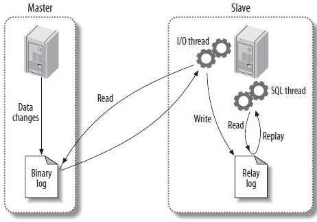
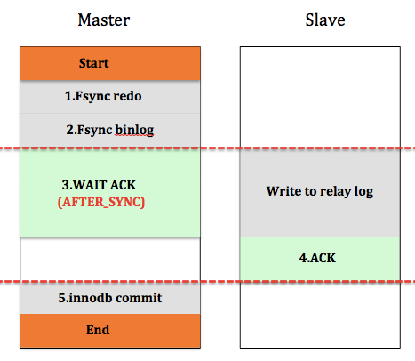

本文章来源于：<https://github.com/Zeb-D/my-review> ，请star 强力支持，你的支持，就是我的动力。

[TOC]

------

### 背景

主从复制引入是为了解决数据一致性的问题，之前一篇文章[MySQL--几种高可用方案](./MySQL--几种高可用方案.md) 聊了好几种方案，但这些都依赖于mysql master需要将数据同步到slave节点，才能保证后面的灾备恢复；

如果讲到mysql 如何把数据同步到slave节点，网上有一堆资料手把手教你如何配置，还包括各种数据流；

复制对于mysql的重要性不言而喻，mysql集群的负载均衡，读写分离和高可用都是基于复制实现。

下文主要从4个复制方案展开，mysql的异步复制，半同步复制、并行复制、第三方复制工具，最后会给出些基于线上故障案例得到半同步复制一些理解。

由于生产环境中，innodb存储引擎支持事务，并且行级复制使用广泛，所以下文的讨论都是基于这种假设。


### 复制方案

#### 异步复制

异步复制是mysql自带的最原始的复制方式，主库和备库成功建立起复制关系后，在备库上会有一个IO线程去主库拉取binlog，并将binlog写到本地，就是图中的Relay log，然后备库会开启另外一个SQL线程去读取回放Relay log，通过这种方式达到Master-Slave数据同步的目的。

通常情况下，Slave是只读的，可以承担一部分读流量，而且可以根据实际需要，添加一个或多个Slave，这样在一定程度上可以缓解主库的读压力；

另一方面，若Master出现异常(crash，硬件故障等)，无法对外提供服务，此时Slave可以承担起Master的重任，避免了单点的产生，所以复制就是为容灾和提高性能而生。




#### 半同步复制

一般情况下，异步复制就已经足够应付了，但由于是异步复制，备库极有可能是落后于主库，特别是极端情况下，我们无法保证主备数据是严格一致的(即使我们观察到Seconds Behind Master 这个值为0)。

比如，当用户发起commit命令时，Master并不关心Slave的执行状态，执行成功后，立即返回给用户。

试想下，若一个事务提交后，Master成功返回给用户后crash，这个事务的binlog还没来得及传递到Slave，那么Slave相对于Master而言就少了一个事务，此时主备就不一致了。

对于要求强一致的业务是不可以接受的，半同步复制就是为了解决数据一致性而产生的。


##### 为什么叫半同步复制？

先说说同步复制，所谓同步复制就是一个事务在Master和Slave都执行后，才返回给用户执行成功。

这里核心是说Master和Slave要么都执行，要么都不执行，涉及到2PC(2 Phrase Commit)。

而MySQL只实现了本地redo-log和binlog的2PC，但并没有实现Master和Slave的2PC，所以不是严格意义上的同步复制。而MySQL半同步复制不要求Slave执行，而仅仅是接收到日志后，就通知Master可以返回了。

这里关键点是Slave接受日志后是否执行，若执行后才通知Master则是同步复制，若仅仅是接受日志成功，则是半同步复制。

对于Mysql而言，我们谈到的日志都是binlog，对于其他的关系型数据库可能是redo log或其他日志。 


##### 与异步复制对比

相对于异步复制，半同步复制要求执行的每一个事务，都要求至少有一个备库成功接收后，才返回给用户。实现原理也很简单，主库本地执行完毕后，等待备库的响应消息(包含最新备库接收到的binlog(file,pos))，接收到备库响应消息后，再返回给用户，这样一个事务才算真正完成。

在主库实例上，有一个专门的线程(ack_receiver)接收备库的响应消息，并以通知机制告知主库备库已经接收的日志，可以继续执行。


##### 半同步复制如何实现？

半同步复制实现的关键点是Master对于事务提交过程特殊处理。

目前实现半同步复制主要有两种模式，AFTER_SYNC模式和AFTER_COMMIT模式。

两种方式的主要区别在于是否在存储引擎提交后等待Slave的ACK。

先来看看AFTER_COMMIT模式，如图，Start和End分别表示用户发起Commit命令和Master返回给用户的时间点，中间部分就是整个Commit过程Master和Slave做的事情。

> 具体实现见本文后面章节


Master提交时，会首先将该事务的redo log刷入磁盘，然后将事务的binlog刷入磁盘(这里其实还涉及到两阶段提交的问题，这里不展开讲)，

然后进入innodb commit流程，这个步骤主要是释放锁，标记事务为提交状态(其他用户可以看到该事务的更新)，这个过程完成后，等待Slave发送的ACK消息，等到Slave的响应后，Master才成功返回给用户。看到图中红色虚线部分，这段是Master和Slave的同步逻辑，是Master-Slave一致性的保证。


##### 半同步复制是否能保证不丢数据？

我们通过几种场景来简单分析下。

第一种情况：假设Master第1，2步执行成功后，binlog还没来得及传递给Slave，此时Master挂了，Slave作为新Master提供服务，那么备库比主库要少一个事务(因为主库的redo 和binlog已经落盘)，但是不影响用户，对于用户而言，这个事务没有成功返回，那么提交与否，用户都可以接受，用户一定会进行异常捕获而重试。

第二种情况：假设第3步innodb commit执行成功后，binlog还没来得及传递给Slave，此时Master挂了，此时与第一种情况一样，备库比主库少一个事务，但是其他用户在3执行完后，可以看到该事务的更新，而切换到备库后，却发现再次读这个更新又没了，这个就发生了“幻读”，如果其他事务依赖于这个更新，则会对业务逻辑产生影响。

对于第二种情况产生的影响，AFTER_SYNC模式可以解决这一问题。与AFTER_COMMIT相比，master在AFTER_SYNC模式下，Fsync binlog后，就开始等待SLAVE同步。

那么在进行第5步innodb commit后，即其它事务能看到该事务的更新时，Slave已经成功接收到binlog，即使发生切换，Slave拥有与Master同样的数据，不会发生“幻读”现象。但是对于上面描述的第一种情况，结果是一样的。

所以，在极端情况下，半同步复制的Master-Slave会有一个事务不一致，但是对于用户而言，由于这个事务并没有成功返回给用户，所以无论事务提交与否都是可以接受的，用户有必要进行查询或重试，判读是否更新成功。或者我们想想，对于单机而言，若事务执行成功后，返回给用户时，网络断了，用户也是面临一样的问题，所以，这不是半同步复制的问题。对于提交返回成功的事务，版同步复制保证Master-Slave一定是一致的，从这个角度来看，半同步复制不会丢数据，可以保证Master-Slave的强一致性。图3是AFTER_SYNC模式，事务提交过程。




#### 并行复制

半同步复制解决了Master-Slave的强一致问题，那么性能问题呢？从[异步复制]图中可以看到参与复制的主要有两个线程：IO线程和SQL线程，分别用于拉取和回放binlog。

对于Slave而言，所有拉取和解析binlog的动作都是串行的，相对于Master并发处理用户请求，在高负载下， 若Master产生binlog的速度超过Slave消费binlog的速度，导致Slave出现延迟。

如并行复制下图，可以看到，Users和Master之间的管道远远大于Master和Slave之间的管道。


那么如何并行化，并行IO线程，还是并行SQL线程？

其实两方面都可以并行，但是并行SQL线程的收益更大，因为SQL线程做的事情更多(解析，执行)。

并行IO线程，可以将从Master拉取和写Relay log分为两个线程；

并行SQL线程则可以根据需要做到库级并行，表级并行，事务级并行。

库级并行在mysql官方版本5.6已经实现。

如下图，并行复制框架实际包含了一个协调线程和若干个工作线程，协调线程负责分发和解决冲突，工作线程只负责执行。图中，DB1，DB2和DB3的事务就可以并发执行，提高了复制的性能。有时候库级并发可能不够，需要做表级并发，或更细粒度的事务级并发。


并行复制如何处理冲突？

并发的世界是美好的，但不能乱并发，否则数据就乱了。

Master上面通过锁机制来保证并发的事务有序进行，那么并行复制呢？

Slave必需保证回放的顺序与Master上事务执行顺序一致，因此只要做到顺序读取binlog，将不冲突的事务并发执行即可。

对于库级并发而言，协调线程要保证执行同一个库的事务放在一个工作线程串行执行；

对于表级并发而言，协调线程要保证同一个表的事务串行执行；对于事务级而言，则是保证操作同一行的事务串行执行。


是否粒度越细，性能越好？

这个并不是一定的。相对于串行复制而言，并行复制多了一个协调线程。协调线程一个重要作用是解决冲突，粒度越细的并发，可能会有更多的冲突，最终可能也是串行执行的，但消耗了大量的冲突检测代价。


#### 第三方复制工具

为什么会出现第三方复制工具？

第三方复制工具的出现一定是内嵌的复制功能不能满足用户需求，就像半同步复制和并行复制从无到有一样。既然现在mysql复制已经做地这么好了，为什么还有第三方复制工具，我能想到最重要的一点是异构复制。

在异构数据源迁移场景下，内嵌复制是无能为力的，第三方复制工具通过解析源端的数据库日志，然后在目的端回放，就能达到同步的目的，比如大名鼎鼎的GoldenGate就是一个例子。

第三方复制工具同样能很好地实现并发，在并行复制出现之前，这也是一个巨大的优势。另一方面，就是可以统一下游，避免所有下游都跑到DB上拉binlog，增大DB负载。


### 半同步复制线上问题排查

#### 问题背景

默认情况下，线上的mysql复制都是异步复制，因此在极端情况下，主备切换时，会有一定的概率备库比主库数据少，因此切换后，我们会通过工具进行回滚回补，确保数据不丢失。

半同步复制则要求主库执行每一个事务，都要求至少一个备库成功接收后，才真正执行完成，因此可以保持主备库的强一致性。

为了确保主备库数据强一致，减少数据丢失，尝试在生产环境中开启mysql的复制的半同步(semi-sync)特性。

实际操作过程中，发现大部分实例半同步都可以正常运行，但有少部分实例始终开不起来(只能以普通复制方式运行)，更奇葩的是同一个主机的两个实例，一个能开启，一个不能。最终定位的问题也很简单，但排查出来还是花了一番功夫，下文将描述整个问题的排查过程。


#### 问题分析

上文简单介绍了不止半同步复制的方案原理，现在来看看具体问题。

在主备库打开半同步开关后，问题实例的状态变量"Rpl_semi_sync_master_status"始终是OFF，表示复制一直运行在普通复制的状态。

##### (1).修改`rpl_semi_sync_master_timeout`参数。

​     半同步复制参数中有一个`rpl_semi_sync_master_timeout`参数，用以控制主库等待备库响应消息的时间，如果超过该值，则认为备库一直没有收到(备库可能挂了，也可能备库执行很慢，较主库相差很远)，这个时候复制会切换为普通复制，避免主库的执行事务长时间等待。线上这个值默认是50ms，简单想是不是这个值太小了，遂将其改到10s，但问题依然不解。


##### (2).打印日志

​      排查问题最简单最笨的方法就是打日志，看看到底是哪个环节出了问题。

主库和备库分别有`rpl_semi_sync_master_trace_level`和`rpl_semi_sync_slave_trace_level`参数来控制半同步复制打印日志。将两个参数值设置为80(64+16)，记录详细日志信息，以及进出的函数调用。

```
master:
2016-01-04 18:00:30 13212 [Note] ReplSemiSyncMaster::updateSyncHeader: server(-1721062019), (mysql-bin.000006, 500717950) sync(1), repl(1)
2016-01-04 18:00:40 13212 [Warning] Timeout waiting for reply of binlog (file: mysql-bin.000006, pos: 500717950), semi-sync up to file , position 0.
2016-01-04 18:00:40 13212 [Note] Semi-sync replication switched OFF.

slave:
2016-01-04 18:00:30 38932 [Note] ---> ReplSemiSyncSlave::slaveReply enter
2016-01-04 18:00:30 38932 [Note] ReplSemiSyncSlave::slaveReply: reply (mysql-bin.000006, 500717950)
2016-01-04 18:00:30 38932 [Note] <--- ReplSemiSyncSlave::slaveReply exit (0)
```


> 从master日志可以看到在2016-01-04 18:00:30时，主库设置了半同步标记，并开始等待备库的响应，等待10s后，仍然没有收到响应，则认为超时，遂将半同步模式关闭，切换为普通模式。
>
> 但从slave日志来看，在2016-01-04 18:00:30已经将(mysql-bin.000006, 500717950)发送给主库，表示已经收到该日志。这就说明，master日志已经打了semi-sync标，slave收到了日志，并且也回了包，master也确实等了10s，就是没有收到包，所以就切换为普通复制。

现在问题就变成了，为什么master没有收到？


##### (3)select函数

> 主库实例上有一个专门接收响应包的线程(ack_receiver)，它通过select函数监听socket，发现有slave的响应消息后，读取消息，通知工作线程可以继续执行。

那么问题是不是出现在select函数上面？

因为select是一个系统调用，一直没有怀疑，但已经跟到这里来了，那就得看看。与select函数相关的有几个重要的宏定义和说明。主要实现在`/usr/include/bits/typesizes.h，/usr/include/bits/select.h和/usr/include/sys/select.h这三个文件`中。

```
FD_ZERO(fd_set *fdset)：清空fdset与所有文件句柄的联系。FD_SET(int fd, fd_set *fdset)：建立文件句柄fd与fdset的联系。FD_CLR(int fd, fd_set *fdset)：清除文件句柄fd与fdset的联系。FD_ISSET(int fd, fd_set *fdset)：检查fdset联系的文件句柄fd是否可读写，当>0表示可读写。array
{
__fd_mask __fds_bits[__FD_SETSIZE / __NFDBITS]; 1024/64=16 (long int)
}fd_set

#define __FD_SET_SIZE 1024

typedef long int __fd_mask; //8个字节
#define __NFDBITS (8 * (int) sizeof (__fd_mask)) // 64位
#define __FDMASK(d)    ((__fd_mask) 1 << ((d) % __NFDBITS)) //fd%64=N,则在第N位设置为1
#define __FDELT(d)    ((d) / __NFDBITS) //表示在第几个long int
#define __FDS_BITS(set) ((set)->__fds_bits) 
#define __FD_SET(d, set) (__FDS_BITS (set)[__FDELT (d)] |= __FDMASK (d))
#define __FD_CLR(d, set) (__FDS_BITS (set)[__FDELT (d)] &= ~__FDMASK (d))
#define __FD_ISSET(d, set) \
((__FDS_BITS (set)[__FDELT (d)] & __FDMASK (d)) != 0)
```


> 大家需要对IO模型的select 模式了解下：
>
> 通过FD_SET可以设置我们想要监听的句柄，句柄信息存储在fd_set位数组中，数组元素的个数由__FD_SETSIZE/64决定，对于__FD_SETSIZE=1024而言，整个数组只有16个long int。
>
> 每个句柄占有一个位，就是1024个位，可以存储1024个句柄。假设句柄值为138，那么138/64=2,138%64=10，那么这个句柄在数组的标示在第2个long int的第10位置1。

那么如果句柄值超出1024呢，这里不就溢出了？仔细对比了下代码，发现根本就没有容错判断，如果句柄值超过1024就一定会溢出。

由于select函数是遍历数组中的每个位，然后去判断该句柄是否可读可写，因此对于超过1024的句柄，永远也不会去判断，因此主库永远不知道备库是否发送了响应包。


##### (4)验证

上面只是理论分析，如果实际运行的实例句柄确实是超过了1024，那么问题就定位到了。

1.得到mysql进程mysql-pid

```
ps –aux | grep mysqld | grep port
```

2.gdb attach到该进程

```
gdb –p mysql-pid
```

3.找到ack_receive线程，并切换

```
info thread
thread thread_id
```

4.打印socket的值，这里fd值为2344。


##### (5)如何解

​     我们看到了由于__FD_SETSIZE的定义，一般是1024，导致select函数最多只能监听1024个句柄，并且最大句柄值不超过1024。

第一种方法是调大该参数，但这种方法需要重新编译linux内核。而且由于select机制，每次都需要遍历 的每一位来判断句柄上是否有消息到来，因此如果设置很大，将导致效率非常低。select是一种比较老的IO复用机制，比较先进的poll，epoll都有类似的功能，并且更强大，也没有句柄总数和最大句柄的限制，通过poll或者epoll实现监听这部分功能，就可以彻底解决问题。有关select，poll，epoll等机制，大家可以去网上查资料，这里不展开讨论。

第二种临时解决方法，前面提到的方法要么需要重新编译linux内核，要么需要改mysql内核代码，这里提供一种临时的解决方法。可以在slave端执行stop slave，start slave命令，重建主库与备库的socket连接，只要1-1024的fd没有被全部使用，新建的socket fd就有机会小于1024，这样select机制不会出问题，半同步也就能正常运行。但如果1-1024的fd全部被长连接使用，那么这种方法就无能为力了。


##### (6)官方版本

​     看了最新oracle官方版本git上5.7的源代码，这块也是用select来实现的，所以也存在类似的问题。当然，由于句柄号有复用机制，当实例上连接数很少，或者长连接不多时，不容易出现fd>1024的情况，所以这个bug不是很容易出现，但问题是普遍存在的。


##### (7)问题延伸

​     问题定位后，另外一个问题还困扰我了半天。

因为mysql内核中有监听的部分有3块，

1是监听端口的select，

2是线程池的监听epoll，

3是半同步的select监听。

slave binlog dump的线程就是普通的工作线程，而工作线程的socket会受epoll的监听，这样一来，binlog dump的socket会同时受半同步的select监听和线程池的epoll监听，这不乱了吗？

后来仔细看了看代码，才发现线程池的epoll监听采用的是EPOLLONESHOT模式，每次接收消息后会解绑，需要重新注册，因此不会出现同一个句柄被两种监听机制同时监听的情况。


### 半同步数据链路分析

上面我们讲了默认情况下的mysql复制都是异步复制，mysql通过参数来控制semi-sync开关。

#### 配置开启

具体而言，主库上通过rpl_semi_sync_master_enabled参数控制，备库上通过rpl_semi_sync_slave_enabled参数控制，打开这两个参数后，mysql semi-sync的特性就打开了。

注意对于备库而言，为了保证半同步立即生效，需要重启slave的IO线程。

另外，还有一个比较重要的参数是rpl_semi_sync_master_timeout，这个参数用于控制master等待semi-slave ack报文的时间，单位是毫秒，默认是10000。master等待超时，则切换为普通的异步复制。

```
master:
set global rpl_semi_sync_master_enabled=1;
set global rpl_semi_sync_master_timeout=xxx;

slave:
stop slave io_thread;
set global rpl_semi_sync_slave_enabled=1;
start slave io_thread;
```

另外需要注意的是，打开了上述两个参数只说明master-slave已经具备打开semi-sync的基本条件了，但复制是否依照半同步运行，还需要根据Rpl_semi_sync_master_status的状态值确定。

因为比如slave较master有很大延迟(超过rpl_semi_sync_master_timeout)，那么复制切换为普通复制。

对于需要调试代码的童鞋而言，rpl_semi_sync_master_trace_level和rpl_semi_sync_slave_trace_level非常重要，通过设置level取值，可以打印日志记录半同步的详细过程，方便定位问题。


#### 实现链路

semi-sync（半同步复制）说到底也是一种复制，只不过是在普通的复制基础上，添加了一些步骤来实现。因此semi-sync并没有改变复制的基本框架，我们的讨论也从master，slave两方面展开。

##### 1.master(主库)

主库上面主要包含三个部分：

(1).负责与slave-io线程对接的binlog dump线程，将binlog发送到slave；

(2).主库上写事务的工作线程；

(3).收取semi-slave报文的ack_receiver线程。


##### (1).binlog dump流程

主要执行逻辑在mysql_binlog_send函数中。

1.判断slave是否是semi_slave，调用add_slave将semi-slave加入到ack_receiver线程的监听队列中。

判断的逻辑是slave对应的会话上是否设置了参数rpl_semi_sync_slave；

2.根据slave的请求偏移和binlog文件，从指定位点读取binlog；

3.根据文件和位点，捞binlog文件中的数据；

4.调用updateSyncHeader设置数据包头semi-sync标记；

根据实时semi-sync运行状态来确定是否设置(这个状态由ack_receiver线程根据是否及时收到slave-ack报文设置)

5.调用my_net_write发送binlog；

6.调用net_flush确认网络包发送出去

如果当前所有产生的binlog已经处理完，需调用wait_for_update_bin_log等待binlog更新。


##### (2).半同步事务提交流程

mysql5.6以后提交采用组提交方式，主要分为三个阶段，每个阶段有一个队列，增加semi-sync后，又增加了一个semi-sync阶段。

1.flush阶段：
队列能保证写binlog的顺序与innodb-commit的顺序一致。通过队列，可以保证顺序写每个事务的binlog-cache，然后只进行一次write操作(flush_cache_to_file)。flush阶段后，如果sync_binlog不是1，则通知master有新binlog产生；如果sync_binlog为1，则等待sync阶段后，再通知dump线程有新binlog产生。这里我理解是因为如果不为1，则可能没有后续的sync阶段，而操作系统缓存也有binlog数据，所以可以在flush阶段后通知；而对于sync_binlog为1的情况，可以保证主库的binlog先落地，永远比备库多。但如果sync_binlog不为1，比如1000，则主机异常情况下，则可能出现备库的binlog比主库还多的情况。根据sync_binlog的设置，确认是否要跳过sync阶段。

2.sync阶段：
sync_binlog_file

3.semi_sync阶段：
call_after_sync,等待备库应答。调用cond_timewait等待条件变量&COND_binlog_send_，注意这里只是leader线程在等，将leader线程唤醒后，才会结束semi_sync阶段，进而唤醒其它的follower线程。_

4.commit阶段：

innodb-commit waitAfterCommit，等待备库应答。调用cond_timewait等待条件变量&COND_binlog_send_ 。

最终我们根据semi-sync复制模式的设置(AFTER_COMMIT,AFTER_SYNC)，来确定是第(3)步还是第(4)步进行等待。

(3).接收slave-ack报文流程

这个流程的工作主要在ack_receiver线程中，这个线程的主要作用是监听semi-slave的ack包，确认master-slave链路是否工作在半同步状态，并根据实际运行状态将普通复制与半同步复制进行切换。

打开主库rpl_semi_sync_master_enabled参数后，该线程启动，关闭参数后，该线程消亡。
master流程如下：

1.遍历semi-slave数组；

2.通过select函数监听每个slave是否有网络包过来；

3.调用my_net_read读取包数据；

4.调用reportReplyPacket处理semi-sync复制状态；

若备库已经获取了最新的binlog位点，则唤醒等待的工作线程；

5.调用reportReplyBinlog唤醒等待的线程，mysql_cond_broadcast(&COND_binlog_send_);


2.slave(备库)

主要实现在(handle_slave_io)

1.启动io-thread后，调用safe_connect建立与master的连接；

2.调用request_dump函数处理请求binlog逻辑：

​	(1).执行命令SET @rpl_semi_sync_slave= 1，设置一个局部变量，通过这个参数标记slave为semi-slave；

​	(2).发送命令COM_BINLOG_DUMP请求日志
循环从master端收取日志，处理日志

```
{
　　1.调用read_event，从master端收取日志(如果没有网络包，会阻塞等待)
　　2.调用slaveReadSyncHeader，确定网络包头是否有semi-sync标记
　　3.调用queue_event将日志写入relay-log，在这个过程中会过滤自身server-id的日志
　　4.如果有semi-sync标记，调用slaveReply函数，发送ack报文
}
```


### 问几个问题

欢迎大家公众号留言交流～～

Q1：你们线上用mysql是否有灾备即HA高可用集群，那么背后是怎么同步数据的？


Q2：为什么本文重点介绍的是半同步复制？它和其他两种有哪些优劣势？


Q3：你觉得如果设计一种复制方案，你认为需要考虑到哪些线上场景？