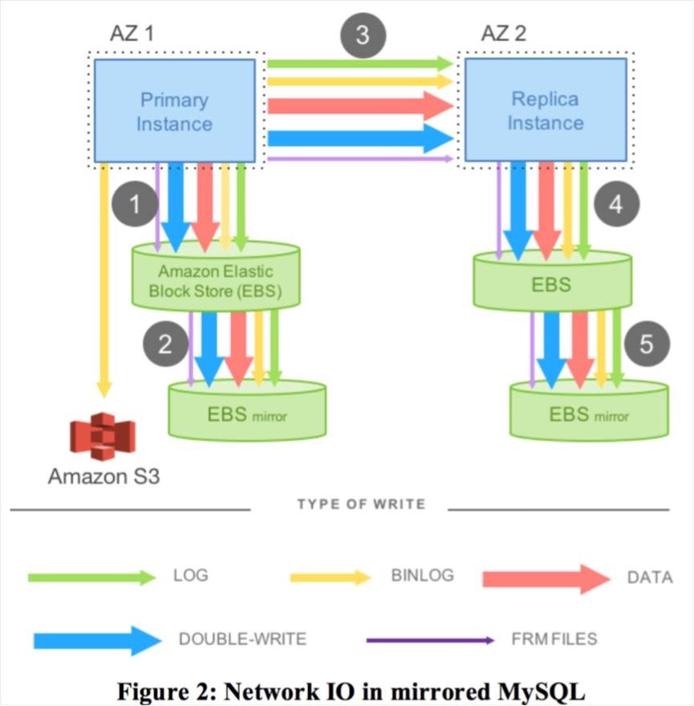
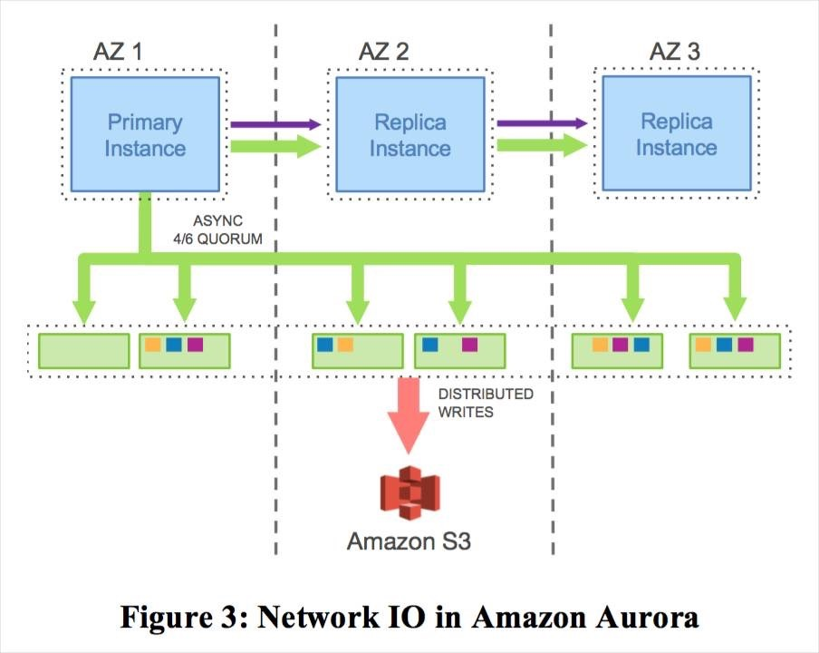
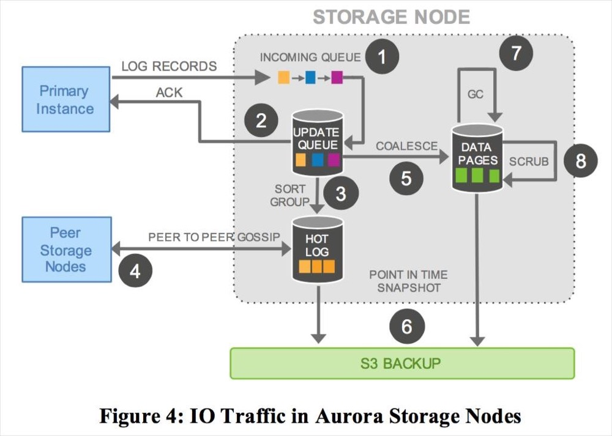

本文章来源于：<https://github.com/Zeb-D/my-review> ，请star 强力支持，你的支持，就是我的动力。

[TOC]

------

### 背景

在[MySQL--几种高可用方案](./MySQL--几种高可用方案.md) 留了一个问题，里面提到*“Q3：你觉得云厂商RDS实现高可用需要注意哪些问题？”*，

平时我们云上服务器很少自己去部署RDS（mysql），一般会选择使用云厂商提供的RDS服务，比如国内阿里叫PolarDB、AWS叫Aurora、微软的是？？

对此，云上RDS服务一般需要重点考虑的灾备恢复、水平扩展以及性能方面；

在云上环境下，存储计算分离作为解决系统弹性和伸缩性的方案越来越普遍。

广义来说，任何数据库，底下文件系统挂一个分布式存储，即可以认为做到了存储计算分离。

通过存储计算分离，可以透明添加存储节点，剔除故障节点，进行故障切换，扩展存储空间等。

在这个背景下，IO不再成为数据库的瓶颈，因为IO压力可以打散在多个存储节点上，反而是网络成为瓶颈，因为数据库实例与所有存储节点的交互都需要通过网络，尤其是为了提升数据库性能，数据库实例与存储节点可能是并行交互的，这进一步加重了网络压力。传统数据库中的IO操作是需要同步执行的，当需要进行IO等待时，这往往会导致线程上下文切换，影响数据库性能。

比如IO读操作，当需要访问一个数据页时，如果在缓冲池没有命中，则需要进行磁盘IO，那么读线程需要等待IO完成才能继续其它操作，同时这种动作可能会进一步引发刷脏页等。

另外一个我们熟悉场景是事务提交操作(IO写操作)，事务提交成功返回前一定要等待事务对应日志刷盘才能返回，由于事务是串行提交，因此其它事务也必须同步等待这个事务提交。 **传统数据库中的两阶段事务尤其不适合与分布式云环境，因为二阶段提交协议对系统中参与的节点和网络要求很高，自身容错能力有限，这点与大规模分布式云环境中，软件和硬件故障是常态的特征是矛盾的。**

### PolarDB

PolarDB是阿里巴巴自研的新一代云原生关系型数据库，在存储计算分离架构下，利用了软硬件结合的优势，为用户提供具备极致弹性、海量存储、高性能、低成本的数据库服务。

X-Engine是阿里巴巴自研的新一代存储引擎，作为AliSQL的核心引擎之一已广泛用于阿里巴巴集团核心业务，包括交易历史库，钉钉历史库，图片空间等。

X-Engine基于LSM-tree架构，其核心特征是数据以追加写方式写入，高压缩低成本，适用于写多读少，有低成本诉求的业务场景。

传统MySQL基于binlog复制的主备架构有它的局限性，包括存储空间有限，备份恢复慢，主备复制延迟等问题，为了解决用户对于云上RDS(X-Engine)大容量存储，以及弹性伸缩的诉求，PolarDB推出了历史库(基于X-Engine引擎的一写多读)产品，支持物理复制，提供一写多读的能力，目前已经在阿里云官网售卖。

PolarDB(X-Engine)基于LSM-tree结构的存储引擎实现数据库的一写多读能力。

本节文章主要参考*《X-Engine: An Optimized Storage Engine for Large-scale E-commerce Transaction Processing》* 这是一篇有关X-Engine的核心技术可以参考发表在Sigmod19的论文。

#### LSM-tree数据库引擎

LSM-Tree全称是Log Structured Merge Tree，是一种分层，有序，面向磁盘设计的数据结构，其核心思想是利用磁盘批量的顺序写要比随机写性能高的特点，将所有更新操作都转化为追加写方式，提升写入吞吐。LSM-tree类的存储引擎最早源于Google三驾马车之一的BigTable的存储引擎以及它的开源实现LevelDB。

LSM-tree存储引擎有几个特点，首先增量数据像日志一样，通过追加方式写入，顺序落盘；其次，数据按照key来进行有序组织，这样在内存和磁盘中会形成一颗颗小的“有序树”；最后，各个“有序树”可以进行归并，将内存中的增量数据迁移到磁盘上，磁盘上的多个“有序树”可以进行归并，优化树的形状，整个LSM-tree是一个有序的索引组织结构。

在云原生数据库时代，一写多读技术已被广泛应用于生产环境中，主要云产商都有其标杆产品，典型代表包括亚马逊的Aurora，阿里云的PolarDB以及微软云的Socrates。

它的核心思想是计算存储分离，将有状态的数据和日志下推到分布式存储，计算节点无状态，多个计算节点共享一份数据，数据库可以低成本快速扩展读性能。

Aurora是这个领域的开山鼻祖，实现了业内第一个一写多读的数据库，计算节点Scale up，存储节点Scale out，并将日志模块下推到存储层，计算节点之间，计算与存储节点之间传输redo日志，计算节点基于Quorum协议写多副本保证可靠性，存储层提供多版本页服务。

PolarDB与Aurora类似，也采用了存储计算分离架构，与Aurora相比，PolarDB它自己的特色，存储基座是一个通用的分布式文件系统，大量采用OS-bypass和zero-copy技术，存储的多副本一致性由ParallelRaft协议保证。PolarDB计算节点与存储节点同时传输数据页和redo日志，计算节点与计算节点之间只传递位点信息。

与Aurora的“日志即数据库”理念一样，Socrates的节点之间只传输redo日志，也实现了多版本页服务，它的特点是将数据库存储层的持久性与可用性分开，抽象出一套日志服务。整个数据库分为3层，一层计算服务，一层page server服务和一层日志服务，这样设计的好处是可以分层进行优化，提供更灵活和细粒度的控制。

虽然Aurora，PolarDB和Socrates在设计上各有特点，但它们都共同践行了存储计算分离思想，数据库层面提供一写多读的能力。

深入到存储引擎这一层来说，这几个产品都是基于B+tree的存储引擎，如果基于LSM-tree存储引擎来做呢？

LSM-tree有它自己的特点，追加顺序写，数据分层存储，磁盘上数据块只读更有利于压缩。

X-Engine引擎云上产品RDS(X-Engine)已经充分发挥了LSM-tree高压缩低成本特点，同样的数据量，存储空间只占到RDS(InnoDB)的1/3甚至更少，RDS(X-Engine)传统的主备架构，依然面临着主备复制延迟大，备份恢复慢等问题。基于LSM-tree引擎实现一写多读，不仅计算资源和存储资源解耦，多个节点共享一份数据还能进一步压缩存储成本。

基于LSM-tree引擎实现一写多读面临着与B+tree引擎不一样的技术挑战，首先是存储引擎日志不一样，LSM-tree引擎是双日志流，需要解决双日志流的物理复制问题；

其次是数据组织方式不一样，LSM-tree引擎采用分层存储，追加写入新数据，需要解决多个计算节点一致性物理快照以及Compation问题。

最后，作为数据库引擎，还需要解决一写多读模式下DDL的物理复制问题。同时，为了产品化，充分发挥B+tree引擎和LSM-tree引擎的各自优势，还面临着新的挑战，即如何在一个数据库产品中同时实现两个存储引擎(InnoDB,X-Engine)的一写多读。

#### PolarDB整体架构 

PolarDB支持X-Engine引擎后，X-Engine引擎与InnoDB引擎仍然独立存在。两个引擎各自接收写入请求，数据和日志均存储在底层的分布式存储上，其中idb文件表示的是InnoDB的数据文件，sst文件表示的是X-Engine的数据文件。

这里最主要的点在于InnoDB与XEngine共享一份redo日志，X-Engine写入时，将wal日志嵌入到InnoDB的redo中，Replica节点和Standby节点在解析redo日志后，分发给InnoDB引擎和XEngine引擎分别回放进行同步。

PolarDB(X-Engine)架构图 

#### X-Engine引擎架构

X-Engine引擎采用LSM-tree结构，数据以追加写的方式写入内存，并周期性物化到磁盘上，内存中数据以memtable形式存在，包括一个活跃的active memtable和多个静态的immutable。

磁盘上数据分层存储，总共包括3层，L0，L1和L2，每一层数据按块有序组织。X-Engine最小空间分配单位是一个extent，默认是2M，每个extent包含若干个block，默认是16k。

数据记录紧凑存储在block中，由于追加写特点，磁盘上的数据块都是只读的，因此X-Engine引擎可以默认对block进行压缩，另外block中的记录还会进行前缀编码，综合这些使得X-Engine的存储空间相对于InnoDB引擎只有1/3，部分场景(比如图片空间)甚至能压缩到1/7。

有利就有弊，追加写带来了写入优势，对于历史版本数据需要通过Compaction任务来进行回收。有关X-Engine的核心技术可以参考发表在Sigmod19的论文，*《X-Engine: An Optimized Storage Engine for Large-scale E-commerce Transaction Processing》*

X-Engine整体架构

#### 物理复制架构 

物理复制的核心是通过引擎自身的日志来完成复制，避免写额外的日志带来的成本和性能损失。

MySQL原生的复制架构是通过binlog日志进行复制，写事务需要同时写引擎日志和binlog日志，这带来的问题是一方面单个事务在关键写路径上需要写两份日志，写性能受制于二阶段提交和binlog的串行写入，另一方面binlog复制是逻辑复制，复制延迟问题也使得复制架构的高可用，以及只读库的读服务能力大打折扣，尤其是在做DDL操作时，这个延迟会进一步放大。

在InnoDB中有redo和undo两种日志，undo日志可以理解为一种特殊的“data”，所以实际上InnoDB的所有操作都能通过redo日志来保证持久性。

因此，在进行复制时，只需要在主从节点复制redo日志即可。X-Engine引擎包含两种日志，一种是wal日志(WriteAheadLog)，用于记录前台的事务的操作；另一种是Slog(StorageLog)，用于记录LSM-tree形状变化的操作，主要指Compaction/Flush等。

wal日志保证了前台事务的原子性和持久性，Slog则保证了X-Engine内部LSM-tree形状变化的原子性和持久性，这两个日志缺一不可，都需要复制同步。

#### 共享存储下的物理复制

Primary-Replica物理复制架构

LSM-tree引擎一写多读的能力是对PolarDB进行功能增强，体现在架构层面就是充分利用已有的复制链路，包括Primary->Replica传递日志信息链路和Replica->Primary传递协同控制信息链路。InnoDB事务由若干个mtr(Mini-Transaction)组成，写入redo日志的最小单位是mtr。

我们在Innodb的redo日志新增一种日志类型用于表示X-Engine日志，将X-Engine的事务内容作为一个mtr事务写入到redo日志中，这样Innodb的redo和X-Engine的wal日志能共享一条复制链路。

由于Primary和Replica共享一份日志和数据，Dump_thread只需要传递位点信息，由Replica根据位点信息去读redo日志。Replica解析日志，根据日志类型来分发日志给不同的回放引擎，这种架构使得所有复制框架与之前的复制保持一致，只需要新增解析、分发X-Engine日志逻辑，新增X-Engine的回放引擎，充分与InnoDB引擎解耦。

由于LSM-tree追加写特点，内存memtable中数据会周期性的Flush到磁盘，为了保证Primary和Replica读到一致性物理视图，Primary和Replica需要同步SwitchMemtable，需要新增一条SwitchMemtable控制日志来协调。redo日志持久化后，Primary通过日志方式将位点信息主动推送给Replica，以便Replica及时回放最新的日志，减少同步延迟。对于Slog日志，既可以采用类似于redo的日志方式来主动“push”方式来同步位点，也可以采用Replica主动“pull”的方式来同步。SLog是后台日志，相对于前台事务回放实时性要求不高，不必要将redo位点和SLog位点都放在一条复制链路增加复杂性，所以采用了Replica的“pull”的方式来同步SLog。

#### 灾备集群间的物理复制

****

Primary-Standby物理复制架构

与共享集群复制不同，灾备集群有独立一份存储，Primary—>Standby需要传递完整的redo日志。Stanby与Replica区别在于日志来源不同，Replica从共享存储上获取日志，Standy从复制链路获取日志，其它解析和回放路径是一样的。

是否将Slog日志作为redo日志一部分传递给Standby是一个问题，Slog日志由Flush/Compaction动作产生，记录的是LSM-tree形状的物理变化。

如果也通过redo日志链路同步给Standby，会带来一些复杂性：

一方面是X-Engine内部写日志的方式需要改动，需要新增新增文件操作相关的物理日志来确保主从物理结构一致，故障恢复的逻辑也需要适配；

另一方面，Slog作为后台任务的操作日志，意味着复制链路上的所有角色都需要同构；如果放弃同构，那么Standy节点可能会触发Flush/Compaction任务写日志，这与物理复制中，只允许Primary写日志是相违背的。

实际上，Slog同步写入到redo log中不是必须的，因为Slog是后台日志，这个动作不及时回放并不影响数据视图的正确性，因此，复制链路上只包含redo日志(X-Engine wal日志和InnoDB redo日志)，Standby自己控制Flush/Compaction产生Slog日志，这样Standby也不必与Primary节点物理同构，整个架构与现有体系相匹配，同时也更加灵活。

#### 并行物理复制加速 

X-Engine的事务包括两个阶段，第一个阶段是读写阶段，这个阶段事务操作数据会缓存在事务上下文中，第二阶段是提交阶段，将操作数据写入到redo日志持久化，随后写到memtable中供读操作访问。

对于Standby/Replica节点而言，回放过程与Primary节点类似，从redo中解析到事务日志，然后将事务回放到memtable中。

事务之间不存在冲突，通过Sequence版本号来确定可见性。并行回放的粒度是事务，需要处理的一个关键问题就是可见性问题。事务串行回放时，Sequence版本号都是连续递增的，事务可见性不存在问题。

在并行回放场景下，我们仍然需要保序，通过引入“滑动窗口”机制，只有连续一段没有空洞的Sequence才能推进全局的Sequence版本号，这个全局Sequence用于读操作获取快照。

并行复制框架

一写多读架构下，为了保证同一数据库实例的Primary、Replica、Standby三个角色的内存镜像完全一致，新增了一种SwitchMemtableLog，该Log Record在RW的switch_memtable过程中产生，因此RO、Standby不再主动触发switch_memtable操作，而是通过从RW上同步SwitchMemtableLog进行switch_memtable。

SwitchMemtable操作是一个全局的屏障点，以防止当前可写memtable在插入过程中switch从而导致数据错乱。另外，对于2PC事务，并发控制也需要做适配。一个2PC事务除了数据本身的日志，还包括BeginPrepare、EndPrepare、Commit、Rollback四类日志，写入过程中保证BeginPrepare和EndPrepare写入到一个WriteBatch中并顺序落盘，因此可以保证同一个事务的Prepare日志都会被解析到一个ReplayTask中。

在并行回放过程中，由于无法保证Commit或Rollback日志一定后于Prepare日志被回放，因此如果Commit、Rollback日志先于Prepare日志被回放，那么在全局的recovered_transaction_map中插入一个key对xid的空事务，对应的事务状态为Commit或Rollback；

随后Prepare日志完成回放时，如果发现recovered_transaction_map中已经存在对应的事务，那么可以根据事务的状态来决定直接提交事务还是丢弃事务。

对于B+Tree的物理复制，LSM-tree的物理复制并不是真正的“物理”复制。因为B+Tree传递的redo的内容是数据页面的修改，而LSM-tree传递的redo内容是KeyValue值。

这带来的结果是，B+tree物理复制可以基于数据页粒度做并发回放，而LSM-tree的物理复制是基于事务粒度的并发回放。

B+tree并发回放有它自身的复杂性，比如需要解决系统页回放与普通数据页回放先后顺序问题，并且还需要解决同一个mtr中多个数据页并发回放可能导致的物理视图不一致问题。

LSM-tree需要解决多个节点在同样位置SwitchMemtable，以及2PC事务回放等问题。

#### MVCC(多版本并发控制) 

物理复制技术解决了数据同步的问题，为存储计算分离打下了基础。为了实现弹性，动态升降配，增删只读节点的能力，需要只读节点具备一致性读的能力，另外RW节点和RO节点共享一份数据，历史版本回收也是必需要考虑的问题。

##### 一致性读

X-Engine提供快照读的能力，通过多版本机制来实现读写不互斥效果。从上述的X-Engine架构图可以看到，X-Engine的数据实际上包括了内存和磁盘两部分，不同于InnoDB引擎内存中page是磁盘上page的缓存，X-Engine中内存数据与磁盘数据完全异构，一份“快照”需要对应的是内存+磁盘数据。X-Engine采用追加写方式，新数据进来会产生新的memtable，后台任务做flush/compaction任务也会产生新的extent。

那么如何获取一致性视图呢？X-Engine内部实际上是通过MetaSnapshot+Snapshot来管理，首先每个MetaSnapshot对应一组memtable和L0，L1, L2的extents，这样在物理上确定了数据范围，然后通过Snapshot来处理行级版本的可见性，这里的Snapshot实际上就是一个事务提交序列号Sequence。不同于InnoDB事务编号采用开始序，需要通过活跃事务视图来判断记录的可见性；

X-Engine事务采用提交序，每条记录有一个唯一递增序列号Sequence，判断行级版本的可见性只需要比较Sequence即可。

在一写多读的模式下，Replica节点与Primary节点共享一份磁盘数据，而磁盘数据是有内存中数据定期dump出来的，因此需要保证Primary和Replica节点有相同的切memtable位点，从而保证数据视图的一致性。

##### 一写多读下的Compaction

在一写多读场景下，Replica可以通过类似于Primary的快照机制来实现快照读，需要处理的问题是历史版本回收问题。

历史版本的回收，依赖于Compaction任务来完成，这里的回收包括两部分：

一部分MetaSnapshot的回收，主要确认哪些memtable和extents可以被物理回收掉，

另一部分是行级多版本回收，这里主要是确认哪些历史版本行可以被回收掉。

对于MetaSnapshot的回收，Primary会收集所有Replica节点上的最小不再使用的MetaSnapshot版本号，X-Engine引擎的每个索引都是一个LSM-tree，因此汇报MetaSnaphot版本号是索引粒度的。

Primary收集完MetaSnapshot版本号，计算最小可以回收的MetaSnapshot进行资源回收操作，回收操作以Slog日志的方式同步给Replica节点。

Replica节点在回放日志进行资源回收时，需要将内存和磁盘资源分开，内存资源在各个节点是独立的，磁盘资源是共享的，因此Replica节点的内存资源可以独立释放，而磁盘资源则统一由Primary节点来释放。

对于行级多版本的回收，同样需要由Primary节点收集所有Replica节点最小序列号Sequence，由Primary节点通过Compaction任务来消除。这块汇报链路复用PolarDB的ACK链路，只是新增了X-Engine的汇报信息。

#### DDL的物理复制如何实现 

物理复制相对于逻辑复制一个关键优势在于DDL，对于DDL而言，逻辑复制可以简单理解为复制SQL语句，DDL在从库上会重新再执行一遍。逻辑复制对于比较重的DDL操作，比如Alter table影响非常大，一个Alter变更操作在主库执行需要半小时，那么复制到从库也需要再执行半小时，那么主从延迟最大可能就会是1个小时，这个延迟对只读库提供读服务产生严重影响。

#### Server层复制

DDL操作同时涉及到Server层和引擎层，包括字典，缓存以及数据。

最基础的DDL操作，比如
Create/Drop操作，在一写多读架构下，要考虑数据与数据字典，数据与字典缓存一致性等问题。

一写多读的基础是物理复制，物理复制日志只在引擎层流动，不涉及到Server层，因此需要新增日志来解决DDL操作导致的不一致问题。

我们新增了meta信息变更的日志，并作为redo日志的一部分同步给从节点，这个meta信息变更日志主要包括两部分内容，一个是字典同步，主要是同步MDL锁，确保Primary/Replica节点字典一致；另一个是字典缓存同步，Replica上的内存是独立的，Server层缓存的字典信息也需要更新，因此要新增日志来处理，比如Drop Table/Drop db/Upate function/Upate precedure等操作。

另外，还需要同步失效Replica的QueryCache，避免使用错误的查询缓存。

#### 引擎层复制

X-Engine引擎与InnoDB引擎一样是索引组织表，在X-Engine内部，每个索引都是一个LSM-tree结构，内部称为Subtable，所有写入都是在Subtable中进行，Subtable的生命周期与DDL操作紧密相关。

用户发起建表动作会产生Subtable，这个是物理LSM-tree结构的载体，然后才能有后续的DML操作；同样的，用户发起删表动作后，所有这个Subtable的DML操作都应该执行完毕。

Create/Drop Table操作涉及到索引结构的产生和消亡，会同时产生redo控制日志和SLog日志，在回放时，需要解决redo控制日志和SLog日志回放的时序问题。

这里我们将对应Subtable的redo日志的LSN位点持久化到SLog中，作为一个同步位点，Replica回放时，两个回放链路做协调即可，redo日志记录的是前台操作，Slog记录的是后台操作，因此两个链路做协同时，需要尽量避免redo复制链路等待Slog复制链路。

比如，对于Create操作，回放Slog时，需要等待对应的redo日志的LSN位点回放完毕才推进；对于DROP操作，回放SLog也需要协同等待，避免回放前台事务找不到Subtable。

#### OnlineDDL复制技术

对于Alter Table操作，X-Engine实现了一套OnlineDDL机制，详细实现原理可以参考内核月报。在一写多读架构下，X-Engine引擎在处理这类Alter操作时采用了物理复制，实际上对于Replica而言，由于是同一份数据，并不需要重新生成物理extent，只需要同步元信息即可。

对于Standby节点，需要通过物理extent复制来重新构建索引。DDL复制时，实际上包含了基线和增量部分。DDL复制充分利用了X-Engine的分层存储以及LSM-tree结构追加写特点，在获取快照后，利用快照直接构建L2作为基线数据，这部分数据以extent块复制形式，通过redo通道传递给Standby，而增量数据则与普通的DML事务一样，所以整个操作都是通过物理复制进行，大大提高了复制效率。

这里需要限制的仅仅是在Alter操作过程中，禁止做到L2的compaction即可。整个OnlineDDL过程与InnoDB的OnlineDDL流程类似，也是包括3个阶段，prepare阶段，build阶段和commit阶段，其中prepare阶段需要获取快照，commit阶段元数据生效，需要通过MDL锁来确保字典一致。

与基于B+tree的OnlineDDL复制相比，基线部分，B+tree索引复制的是物理页，而LSM-tree复制的是物理extent；增量部分B+tree索引是通过记增量日志，回放增量日志到数据页写redo日志进行同步，LSM-tree则是通过DML前台操作写redo的方式同步。

OnlineDDL复制

#### 双引擎技术 

##### Checkpoint位点推进

通过wal-in-redo技术，我们将X-Engine的wal日志嵌入到了InnoDB的redo中，首先要处理的一个问题就是redo日志的回收问题。日志回收首先涉及到一个位点问题，融合进redo日志后，X-Engine内部将RecoveryPoint定义为，lsn表示redo日志的位点，Sequence为对应的X-Engine的事务的版本号。Redo日志回收与Checkpoint(检查点)强相关，确保Checkpoint位点及时推进是需要考虑的问题，否则redo日志的堆积一方面影响磁盘空间，另一方面也影响恢复速度。这里有一个基本的原则是，Checkpoint=min(innodb-ckpt-lsn, xengine-ckpt-lsn)，xengine-ckpt-lsn就是来源于X-Engine的RecoveryPoint，确保任何引擎有内存数据没有落盘时，对应的redo日志不能被清理。为了避免X-Engine的checkpoint推进影响整体位点推进，内部会确保xengine-ckpt-lsn与全局的redo-lsn保持一定的阀值，超过阀值则会强制将memtable落盘，推进检查点。

##### 数据字典与DDL

X-Engine作为一个数据库引擎有自己独立的字典，InnoDB也有自己的字典，两份字典在一个系统里面肯定会存在问题。为了解决问题，这里有两种思路，一是X-Engine仍然保留自己的数据字典，在做DDL时，通过2PC事务来保证一致性，这带来的问题是需要有协调者。一般情况下，MySQL的协调者是binlog日志，在binlog关闭时是tclog日志。显然，从功能和性能角度，我们都不会强依赖binlog日志。

我们采用了另外一种思路，X-Engine不再用自身引擎存储元数据，所有元数据均通过InnoDB引擎持久化，X-Engine元数据实际上是InnoDB字典的一份缓存，那么在做DDL变更时，元数据部分实际上只涉及InnoDB引擎，通过事务能保证DDL的原子性。

通过元数据归一化我们解决了元数据的原子性问题，但X-Engine数据和InnoDB元数据如何保证一致也是个问题。比如一个DDL操作，alter table xxx engine = xengine，这个DDL是将innodb表转为xengine表，由于表结构变更是Innodb字典修改，数据是在修改X-Engine，是一个跨引擎事务，跨引擎事务需要通过协调者保证一致性。

为了避免引入binlog作为协调者依赖，tclog作为协调者没有经过大规模生产环境验证，我们选择了另外一种处理方式，具体来说，在涉及跨引擎事务时，优先提交X-Engine事务，然后再提交InnoDB事务。对于DDL来说，就是“先数据，后元数据”，元数据提交了，才真正表示这个DDL完成。如果中途失败，则结合“延迟删除”的机制，来保证垃圾数据能被最终清理掉，通过一个后台任务来周期性的对比X-Engine数据与InnoDB的字典，以InnoDB字典为准，结合X-Engine内存元信息，确认这部分数据是否有用。

##### CrashRecovery

X-Engine与InnoDB引擎一样是MySQL的一个插件，X-Enigne作为一个可选的插件，启动顺序在Innodb之后。每个引擎在恢复阶段都需要通过redo日志来将数据库恢复到宕机前状态。

在双引擎形态下，所有redo都在InnoDB中，那意味着无论是InnoDB引擎还是X-Engine引擎在读取日志恢复时，都需要扫描整个redo日志，相当于整个恢复阶段扫描了两遍redo，这可能使得整个宕机恢复过程非常长，降低了系统的可用性。

为了解决这个问题，我们将X-Engine的恢复阶段细分，并且调整引擎的启动顺序，在InnoDB启动前，先完成X-Engine的初始化以及Slog等恢复过程，处于恢复redo的状态。

在InnoDB启动时，根据类型将日志分发X-Engine引擎，整个流程与正常同步redo日志的过程一致。当redo日志分发完毕，相当于InnoDB引擎和X-Engine引擎自身的宕机恢复过程已经完成，然后走正常XA-Recovery和Post-Recovery阶段即可，这个流程与之前保持一致。

##### HA

PolarDB支持双引擎后，整个升降级流程中都会嵌套有X-Engine引擎的逻辑，比如在Standby升级为RW前，需要确保X-Engine的回放流水线完成，并将未决的事务保存起来，以便后续通过XA_Recovery继续推进。

RW降级为Standby的时候需要等待X-Engine写流水线回放，同时如果还残留有未决事务，需要在切换过程中将这部分未决事务遍历出来存入Recovered_transactions_集合供后续并发回放使用。

#### LSM-tree VS B+tree

上节我们详细描述了基于LSM-tree架构的存储引擎，实现一写多读所需要的关键技术，并结合PolarDB双引擎介绍了一些工程实现。现在我们跳出来看看基于B+tree和基于LSM-tree两种数据组织结构在实现技术上的对比。首先要回到一个基本点，B+tree是原地更新，而LSM-tree是追加写，这带来的区别就是B+tree的数据视图在内存和外存一个缓存映射关系，而LSM-tree是一个叠加的关系。

因而需要面对的技术问题也不同，B+tree需要刷脏，需要有double-write(在PolarFS支持16k原子写后，消除了这个限制)；LSM-tree需要Compaction来回收历史版本。

在一写多读的模式下面临的问题也不一样，比如，B+tree引擎复制是单redo日志流，LSM-tree引擎是双日志流；B+tree在处理并行回放时，可以做到更细粒度的页级并发，但是需要处理SMO(SplitMergeOperation)问题，避免读节点读到“过去页”或是“未来页”。

而LSM-tree是事务级别的并发，为了保证RW和RO节点“内存+磁盘”的一致性视图，需要RW和RO在相同的位点做Switch Memtable。下表以InnoDB引擎和X-Engine引擎为例，列出了一些关键的区别点。

#### LSM-tree引擎业内发展状况

目前业内LSM-tree类型引擎比较热的是Rocksdb，它的主要应用场景是作为一个KeyValue引擎使用。Facebook将Rocksdb引擎引入到了他们的MySQL8.0分支，类似于X-Engine之于AliSQL，主要服务于他们的用户数据库UDB业务，存储用户数据和消息数据，采用的仍然是基于binlog的主备复制结构，目前没有看到有做存储计算分离，以及一写多读的事情。

另外，github上有一个rocksdb-cloud项目，将rocksdb作为底座，架在AWS等云服务上提供NoSQL接口服务，相当于做了存储计算分离，但并不支持物理复制和一写多读。

在数据库领域，阿里巴巴的Oceanbase和谷歌的Spanner的底层存储引擎都是基于LSM-tree结构，这显示了LSM-tree作为数据库引擎的可行性，这两个数据库都是基于Share-Nothing的架构。

基于Share-Storage的数据库，到目前为止还没有成熟的产品，PolarDB(X-Engine)是业内第一个基于LSM-tree结构的实现的一写多读方案，对于后来者有很好的借鉴意义，LSM-tree这种结构天然将内存和磁盘存储分离，我们充分利用了磁盘存储只读的特点，通过压缩将其成本优势发挥出来，结合一写多读的能力，将成本优势发挥到极致。

#### 未来展望

PolarDB(X-Engine)解决方案很好解决了用户的归档存储问题，但目前来看还不够彻底。第一，技术上虽然PolarDB支持了双引擎，但我们还没有充分将两个引擎结合起来。

一个可行的思路是在线归档一体化，用户的在线数据采用默认的引擎InnoDB，通过设定一定的规则，PolarDB内部自动将部分历史数据进行归档并转换为X-Engine引擎存储，整个过程对用户透明。

第二，目前的存储都落在PolarDB的高性能存储PolarStore上，为了进一步降低成本，X-Engine引擎可以将部分冷数据存储在OSS上，这个对于分层存储是非常友好和自然的。

实际上，基于LSM-tree的存储引擎有很强的可塑性，我们目前的工作只是充分发挥了存储优势，未来还可以对内存中数据结构进行进一步探索，比如做内存数据库等都是可以探索的方向。

### Aurora

Amazon在SIGMOD 2017发表了论文[***《Amazon Aurora: DesignConsiderations for High Throughput Cloud-Native Relational Databases》***]，第一次公开介绍了Aurora的设计理念和内部实现，大家可以找下这篇论文，下文开始对论文的解读。

里面讲了比较多的事情，比如：

**传统数据库写放大问题：**

我们看看在传统数据库中写的流程。以单机MySQL为例，执行写操作会导致日志落盘，同时后台线程也会异步将脏页刷盘，另外为了避免页断裂，进行刷脏页的过程还需要将数据页写入double-write区域。

如果考虑生产环境中的主备复制，如图2所示，AZ1和AZ2分别部署一个MySQL实例做同步镜像复制，底层存储采用Elastic Block Store(EBS)，并且每个EBS还有自己的一份镜像，另外部署Simple Storage Service(S3)进行redo日志和binlog日志归档，以支持基于时间点的恢复。

从流程上来看，每个步骤都需要传递5种类型的数据，包括redo，binlog，data-page，double-write和frm元数据。

由于是基于镜像的同步复制，这里我理解是Distributed Replicated Block Device(DRBD)，因此**图中的1，3，5步骤是顺序的，这种模型响应时间非常糟糕，因为要进行4次网络IO，且其中3次是同步串行的。从存储角度来看，数据在EBS上存了4份，需要4份都写成功才能返回。** 

所以在这种架构下，无论是IO量还是串行化模型都会导致性能非常糟糕。

#### 概要

本文介绍的Aurora是一个云上环境全新的数据库服务可以很好的解决上述传统数据库遇到的问题。 **它基于存储计算分离的架构，并将回放日志部分下推到分布式存储层，存储节点与数据库实例(计算节点)松耦合，并包含部分计算功能。** 

Aurora体系下的数据库实例仍然包含了大部分核心功能，比如查询处理，事务，锁，缓存管理，访问接口和undo日志管理等；但redo日志相关的功能已经下推到存储层，包括日志处理，故障恢复，备份还原等。

Aurora相对于传统数据库有三大优势：

> 首先，底层数据库存储是一个分布式存储服务，可以轻松应对故障；
>
> 其次，数据库实例往底层存储层只写redo日志，因此数据库实例与存储节点之间的网络压力大大减小，这为提升数据库性能提供了保障；
>
> 第三，将部分核心功能(故障恢复，备份还原)下推到存储层，这些任务可以在后台不间歇地异步执行，并且不影响前台用户任务。

下文会详细介绍Aurora如何实现这些功能，主要包括三大块：

1. 如何基于Quorum模型保证底层存储的一致性

2. 如何将redo日志相关的功能下推到存储层

3. 如何消除同步点，分布式存储下如何做检查点和故障恢复

#### 存储计算分离

##### 日志处理下放到存储层

> 传统数据库中，修改一个数据页，会同步产生对应的redo日志，基于数据页的前镜像回放redo日志可以得到数据页的后镜像。事务提交时，需要事务对应的redo日志都写盘成功后才能返回。

在Aurora中，所有的写类型只有一种，那就是redo日志，任何时候都不会写数据页。存储节点接收redo日志，基于旧版本数据页回放日志，可以得到新版本的数据页。

为了避免每次都从头开始回放数据页变更产生的redo日志，存储节点会定期物化数据页版本。

如上图所示， Aurora由跨AZ的一个主实例和多个副本实例组成，主实例与副本实例或者存储节点间只传递redo日志和元信息。主实例并发向6个存储节点和副本实例发送日志，当4/6的存储节点应答后，则认为日志已经持久化，对于副本实例，则不依赖其应答时间点。 

从sysbench测试(100G规模，只写场景，压测30分钟)的数据来看，Aurora是基于镜像MySQL吞吐能力的35倍，每个事务的日志量比基于镜像MySQL日志量要少7.7倍。

再来看看故障恢复速度，传统数据库宕机重启后，恢复从最近的一个检查点开始，读取检查点后的所有redo日志进行回放，确保已经提交的事务对应的数据页得到更新。

在Aurora中，redo日志相关的功能下推到存储层，回放日志的工作可以一直在后台做。任何一次读磁盘IO操作，如果数据页不是最新版本，都会触发存储节点回放日志，得到新版本的数据页。

因此类似传统数据库的故障恢复操作实质在后台一直不断地进行，而真正进行故障恢复时，需要做的事情很少，所以故障恢复的速度非常快。

##### 存储服务设计关键点

Aurora存储服务设计的一个关键原则是减少前台用户写的响应时间，因此将尽可能多的操作移到后台异步执行，并且存储节点会根据前台的请求压力，自适应分配资源做不同的工作。

比如，当前台请求很繁忙时，存储节点会减缓对旧版本数据页的回收。传统数据库中，后台线程需要不断地推进检查点，避免故障恢复时间消耗的时间过长，但会影响前台用户请求处理能力；

 对于Aurora而言，分离的存储服务层使得后台线程推进检查点动作完全不影响数据库实例，并且是推进地越快，越有利于前台的磁盘IO读操作(减少了回放日志过程)。

 Aurora写基于Quorum模型，存储分片后，按片达成多数派即可返回，由于分布足够离散，少数的磁盘IO压力大也不会影响到整体的写性能。

如上图所示，图中详细介绍了主要的写流程：

> 1. 存储节点接收数据库实例的日志，并追加到内存队列；
> 2. 将日志在本地持久化成功后，给实例应答；
> 3. 按分片归类日志，并确认丢失了哪些日志；
> 4. 与其它存储节点交互，填充丢失的日志；
> 5. 回放日志生成新的数据页；
> 6. 周期性地备份数据页和日志到S3系统；
> 7. 周期性地回收过期的数据页版本；
> 8. 周期性地对数据页进行CRC校验。

上述所有写相关的操作只有第1)和第2)步是串行同步的，会直接影响前台请求的响应时间，其它操作都是异步的。

#### 可扩展高可用存储

##### 复制和容错处理

Aurora存储层的复制基于Quorum协议（后面会专门出个来讲分布式相关知识），假设复制拓扑中有V个节点，每个节点有一个投票权，读 或 写 必须拿到Vr 或 Vw个投票才能返回。

为了满足一致性，需要满足两个条件：

> - 首先Vr + Vw > V，这个保证了每次读都能读到拥有最新数据的节点；
>
> - 第二，Vw > V/2，每次写都要保证能获取到上次写的最新数据，避免写冲突。比如V=3，那么为了满足上述两个条件，Vr=2，Vw=2。

为了保证各种异常情况下的系统高可用，Aurora的数据库实例部署在3个不同AZ(AvailablityZone)，每个AZ包含了2个副本，总共6个副本，每个AZ相当于一个机房，是一个独立的容错单元，包含独立的电源系统，网络，软件部署等。

结合Quorum模型以及前面提到的两条规则， V=6，Vw=4，Vr=3，Aurora可以容忍任何一个AZ出现故障，不会影响写服务；任何一个AZ出现故障，以及另外一个AZ中的一个节点出现故障，不会影响读服务且不会丢失数据。

##### 分片管理

通过Quorum协议，Aurora可以保证只要AZ级别的故障(火灾，洪水，网络故障)和节点故障(磁盘故障，掉电，机器损坏)不同时发生，就不会破坏协议本身，数据库可用性和正确性就能得到保证。

那么，如果想要数据库“永久可用”，问题变成如何降低两类故障同时发生的概率。

由于特定故障发生的频率(MTTF, Mean Time to Fail)是一定的，为了减少故障同时发生的概率，可以想办法提高故障的修复时间(MTTR,Mean Time To Repair)。

Aurora将存储进行分片管理，每个分片10G，6个10G副本构成一个PGs(Protection Groups)。Aurora存储由若干个PGs构成，这些PGs实际上是EC2(AmazonElastic Compute Cloud)服务器+本地SSD磁盘组成的存储节点构成，目前Aurora最多支持64T的存储空间。

分片后，每个分片作为一个故障单位，在10Gbps网络下，一个10G的分片可以在10s内恢复，因此当前仅当10s内同时出现大于2个的分片同时故障，才会影响数据库服务的可用性，实际上这种情况基本不会出现。 **通过分片管理，巧妙提高了数据库服务的可用性。**

##### 轻量级运维

基于分片管理，系统可以灵活应对故障和运维。比如，某个存储节点的磁盘IO压力比较大，可以人为将这个节点剔除，并快速新加一个节点到系统。

另外，在进行软件升级时，同样可以临时将存储节点剔除，待升级完毕后再将节点加入到系统。所有这些故障和运维管理都是分片粒度滚动进行的，对于用户完全透明。

#### 一致性原理

这节主要介绍Aurora如何在不利用2PC协议的情况下，如何通过在读副本，存储节点间传递redo日志保证数据一致性。

> 首先，我们会介绍如何做到在故障恢复时不需要回放redo日志；
>
> 其次，我们会介绍常见的操作，比如读，写和事务提交操作，然后会介绍Aurora如何保证从数据库副本实例读取的数据处于一致的状态；

最后会详细介绍故障恢复的流程。

##### 日志处理

目前市面上几乎所有的数据库都采用WAL(Write Ahead Logging)日志模型，任何数据页的变更，都需要先写修改数据页对应的redo日志，Aurora基于MySQL改造当然也不例外。

在实现中，每条redo日志拥有一个全局唯一的Log Sequence Number(LSN)。

为了保证多节点数据的一致性，我们并没有采用2PC协议，因为2PC对错误的容忍度太低，取而代之的是，我们基于Quorum协议来保证存储节点的一致性。

由于在生产环境中，各个节点可能会缺少部分日志，各个存储节点利用gossip协议补全本地的redo日志。 **在正常情况下，数据库实例处于一致的状态，进行磁盘IO读时，只需要访问redo日志全的存储节点即可；但在故障恢复过程中，需要基于Quorum协议进行读操作，重建数据库运行时的一致状态。** 

数据库实例中活跃着很多事务，事务的开始顺序与提交顺序也不尽相同。当数据库异常宕机重启时，数据库实例需要确定每个事务最终要提交还是回滚。

这里介绍下Aurora中存储服务层redo日志相关几个关键的概念。Volumn Complete LSN(VCL)，表示存储服务拥有VCL之前的所有完整的日志。在故障恢复时，所有LSN大于VCL的日志都要被截断。

ConsistencyPoint LSNs(CPLs)，对于MySQL(InnoDB)而言，如下图所示， **每个事务在物理上由多个mini-transaction组成，而每个mini-transaction是最小原子操作单位，比如B树分裂可能涉及到多个数据页的修改，那么这些页修改对应的对应一组日志就是原子的，重做日志时，也需要以mini-transaction为单位。** 

CPL表示一组日志中最后的一条日志的LSN，一个事务由多个CPL组成，所以称之为CPLs。Volumn Durable LSN(VDL)表示已持久化的最大LSN，是所有CPLs中最大的LSN，VDL<=VCL，为了保证不破坏mini-transaction原子性，所有大于VDL的日志，都需要被截断。比如，VCL是1007，LSN为900，1000，1100是CPLs，那么我们需要截断1000以前的日志。 

VDL表示了数据库处于一致状态的最新位点，在故障恢复时，数据库实例以PG为单位确认VDL，截断所有大于VDL的日志。

##### 基本操作

###### Reads

在Aurora中，与大多数数据库一样，数据页的请求一般都从缓冲池中获得，当缓冲池中对应的数据页不存在时，才会从磁盘中获取。如果缓冲池满了，根据特定的淘汰算法(比如LRU)，系统会选择将一个数据页淘汰置换出去，如果被置换的数据页被修改过，则首先需要将这个数据页刷盘，确保下次访问这个页时，能读到最新的数据。但是Aurora不一样，淘汰出去的数据页并不会刷盘写出，而是直接丢弃。 **这就要求Aurora缓冲池中的数据页一定有最新数据，被淘汰的数据页的page-LSN需要小于或等于VDL。(注意，这里论文中描述有问题，page-LSN<=VDL才能被淘汰，而不是大于等于)** 这个约束保证了两点：1.这个数据页所有的修改都已经在日志中持久化，2.当缓存不命中时，通过数据页和VDL总能得到最新的数据页版本。

**在正常情况下，进行读操作时并不需要达成Quorum。当数据库实例需要读磁盘IO时，将当前最新的VDL作为一致性位点read-point，并选择一个拥有所有VDL位点的日志的节点作为请求节点，这样只需要访问这一个节点即可得到数据页的最新版本。** 从实现上来看，因为所有数据页通过分片管理，数据库实例记录了存储节点管理的分片以及SCL信息，因此进行IO操作时，通过元信息可以知道具体哪个存储节点有需要访问的数据页，并且SCL>read-point。数据库实例接收客户端的请求，以PG为单位计算Minimum Read Point LSN，在有读副本实例的情况下，每个实例都都可以作类似的计算得到位点，实例之间通过gossip协议得到全局的per-Group MRPL，称之为PGMRPL。PGMRPL是全局read-point的低水位，每个存储节点根据PGMRPL，不断推进数据页版本，并回收不再使用的日志。

###### Writes

**在Aurora中，数据库实例向存储节点传递redo日志，达成多数派后将事务标记为提交状态，然后推进VDL，使数据库进入一个新的一致状态。** 

在任何时刻，数据库中都会并发运行着成千上万个事务，每个事务的每条redo日志都会分配一个唯一的LSN，这个LSN一定大于当前最新的VDL，为了避免前台事务并发执行太快，而存储服务的VDL推进不及时，我们定义了LSN Allocation Limit(LAL)，目前定义的是10,000,000，这个值表示新分配LSN与VDL的差值的最大阀值，设置这个值的目的是避免存储服务成为瓶颈，进而影响后续的写操作。

由于底层存储按segment分片，每个分片管理一部分页面，当一个事务涉及的修改跨多个分片时，事务对应的日志被打散，每个分片只能看到这个事务的部分日志。

 **为了确保各个分片日志的完整性，每条日志都记录前一条日志的链接，通过前向链接确保分片拥有了完整的日志。Segment Complete LSN(SCL)表示分片拥有完整日志的位点，存储节点相互间通过gossip协议来弥补本地日志空洞，推进SCL** 。

###### Commits

在Aurora中，事务提交是完全异步的。每个事务由若干个日志组成，并包含有一个唯一的“commit LSN”，工作线程处理事务提交请求时，将事务相关的日志提交到持久化队列并将事务挂起，并继续处理其它数据库请求。

 **当VDL的位点大于事务的commit LSN时，表示这个事务redo日志都已经持久化，可以向客户端回包，通知事务已经成功执行。在Aurora中，有一个独立的线程处理事务成功执行的回包工作，因此，从整个提交流程来看，所有工作线程不会因为事务提交等待日志推进而堵塞** ，他们会继续处理新的请求，通过这种异步提交方式，大大提高了系统的吞吐。这种异步化提交思想目前比较普遍，AliSQL也采用类似的方式。

###### Replicas

**在Aurora中，写副本实例和至多15个读副本实例共享一套分布式存储服务，因此增加读副本实例并不会消耗更多的磁盘IO写资源和磁盘空间。这也是共享存储的优势，零存储成本增加新的读副本。**读副本和写副本实例间通过日志同步。写副本实例往存储节点发送日志的同时向读副本发送日志，读副本按日志顺序回放， **如果回放日志时，对应数据页不在缓冲池中，则直接丢弃。可以丢弃的原因在于，存储节点拥有所有日志，当下次需要访问这个数据页时，存储节点根据read-point，可以构造出特定的数据页版本** 需要说明的是，写副本实例向读副本发送日志是异步的，写副本执行提交操作并不受读副本的影响。

副本回放日志时需要遵守两个基本原则：

> 1).回放日志的LSN需要小于或等于VDL，
>
> 2).回放日志时需要以MTR为单位，确保副本能看到一致性视图。
>
> 在实际场景下，读副本与写副本的延时不超过20ms。

##### 故障恢复

大多数数据库基于经典的ARIES协议处理故障恢复，通过WAL机制确保故障时已经提交的事务持久化，并回滚未提交的事务。这类系统通常会周期性地做检查点，并将检查点信息计入日志。故障时，数据页中同时可能包含了提交和未提交的数据，因此，在故障恢复时，系统首先需要从上一个检查点开始回放日志，将数据页恢复到故障时的状态，然后根据undo日志回滚未交事务。

从故障恢复的过程来看， **故障恢复是一个比较耗时的操作，并且与检查点操作频率强相关。通过提高检查点频率，可以减少故障恢复时间，但是这直接会影响系统处理前台请求吞吐，所以需要在检查点频率和故障恢复时间做一个权衡，而在Aurora中不需要做这种权衡。**

传统数据库中，故障恢复过程通过回放日志推进数据库状态，重做日志时整个数据库处于离线状态。

**Aurora也采用类似的方法，区别在于将回放日志逻辑下推到存储节点，并且在数据库在线提供服务时在后台常态运行。** 因此，当出现故障重启时，存储服务能快速恢复，即使在10wTPS的压力下，也能在10s以内恢复。数据库实例宕机重启后，需要故障恢复来获得运行时的一致状态，实例与Read Quorum个存储节点通信，这样确保能读到最新的数据，并重新计算新的VDL，超过VDL部分的日志都可以被截断丢弃。在Aurora中，对于新分配的LSN范围做了限制，LSN与VDL差值的范围不能超过10,000,000，这个主要是为了避免数据库实例上堆积过多的未提交事务，因为数据库回放完redo日志后还需要做undo recovery，将未提交的事务进行回滚。

在Aurora中，收集完所有活跃事务后即可提供服务，整个undo recovery过程可以在数据库online后再进行。

#### 云上Aurora体系

在社区InnoDB中，一个写操作会修改缓冲池中数据页内容，并将对应的redo日志按顺序写入WAL。事务提交时，WAL协议约定对应事务的日志需要持久化后才能返回。实际上，为了防止页断裂，缓冲池中修改的数据页也会写入double-write区域。数据页的写操作在后台进行，一般是在页面置换或是做检查点过程中发生。InnoDB除了IO子系统，还包括事务子系统，锁管理系统，B+Tress实现以及MTR等。MTR约定了最小事务，MTR中的日志必需以原子的方式执行(比如B+Tree分裂或合并相关的数据页)。

数据库引擎基于社区版InnoDB引擎改进，将磁盘IO读写分离到存储服务层。redo日志按照PG划分，每个MTR的最后一条日志是一致性位点。与社区的MySQL版本一样，支持标准的隔离级别和快照读。

Aurora数副本实例不断从写副本实例获取事务开始和提交信息，并利用该信息提供快照读功能。 **数据库实例与存储服务层相互独立，存储服务层向上为数据库实例提供统一的数据视图，数据库实例从存储服务层获取数据与从本地读取数据一样。** 

下图展示了云上Aurora的部署架构，Aurora利用AmazonRelational Database Service (RDS)来管理元数据。RDS在每个实例部署一个agent，称之为Host Manager(HM)。

HM监控集群的健康状况并确定是否需要做异常切换，或者是一个实例是否需要重建。每个集群由一个写副本，0个或多个读副本组成。所有实例在都一个物理Region(比如美国东部，美国西部)，一般是跨AZ部署，并且分布式存储服务层也在同一个Region。为了保证安全，我们在数据库层，应用层和存储层做了隔离。实际上，数据库实例通过3类Amazon Virtual Private Cloud (VPC)网络可以相互通信。通过应用层VPC，应用程序可以访问数据库；通过RDS VPC，数据库可以和管控节点交互；通过存储层VPC，数据库可以和存储服务节点交互。
存储服务实际上是由一组EC2集群构成，这个集群横跨至少3个AZ，对多个用户提供存储，读写IO，备份恢复等服务。

存储节点管理本地SSD并与数据库实例和其它存储节点交互，备份/还原服务不断备份新数据到S3，在必要时从S3还原数据。存储服务的管控系统借助Amazon DynamoDB服务作为持久化存储，存储内容包括配置，元数据信息，备份到S3数据的信息等。

为了保证存储服务高可用，整个系统需要在异常影响到用户之前，主动快速发现问题。系统中的所有关键操作都被监控，一旦性能或者可用性方面出现问题，则立即会产生报警。

 

#### 其他方面

##### 性能数据

性能数据我这里不一一展开了，具体数据大家可以参考原论文。

##### 实践经验

我们发现越来越多的应用迁移到Aurora集群，他们有一些共通点，我们希望抽象出一些典型的场景，并总结经验。

##### 多租户

Aurora很多用户都在做Software-as-a-Service(SaaS)服务，这些服务底层存储模型一般比较稳定，通过多个用户共享一个数据库实例来减少成本。这种模式下，数据库实例上会有大量的表，导致元数据暴增，这加大了字典管理的负担。

这种架构下，用户一般会面临解决三类问题：

1. 维持实例上较高的吞吐和并发，
2. 能够灵活应对磁盘空间问题，提前评估磁盘空间并具备快速的扩展能力，
3. 不同租户间的影响要控制在最小。Aurora能完美解决这三类问题。

##### 表结构升级

由于表结构升级往往伴随着锁表和拷表，持续时间也比较长，而DDL是一个日常操作，因此需要有一套高效的online DDL机制。主要包括2点：

1. schema多版本，每个数据页都存储当时的schema信息，页内数据可以通过schema信息解析，

2. 对于修改的page采用modify-on-write机制来减少影响。

##### 软件升级

由于用户使用Aurora实例通常只有一个主实例，因此发生任何问题都特别严重。Aurora中，所有的持久化数据都在存储层，数据库实例的状态信息可以借助存储层和元数据获得，因此可以很方便的构造一个新的数据库实例，为了提高软件升级效率，我们通过Zero-Downtime Patch (ZDP)来滚动升级

#### 小结

Aurora诞生的原因是在弹性伸缩的云环境下，传统的高吞吐OLTP数据库既不能保证可用性，又不能保证持久性。 Aurora的关键点在于将传统数据库中的存储与计算分离：

- 将日志部分下推到一个独立的分布式存储服务层。
  - 由于这种分离架构下，所有IO操作都是通过网络，网络将成为最大的瓶颈，因此Aurora集中精力优化网络以便提高系统吞吐能力。

- Aurora依靠Quorum模型，在性能影响可控的前提下，解决云环境下的各种异常错误。

在Aurora中，日志处理技术减少了I/O写放大，异步提交协议避免了同步等待，同时分离的存储服务层还避免了离线故障恢复和检查点操作。 Aurora的存储计算分离方案使得系统整体架构非常简单，而且方便未来的演进。

#### Q&A

1. 一般了解到的Quorum算法只需要满足Vr + Vw > N即可，为啥Aurora还需要满足第2个条件？

从文中了解到Aurora中Quorum算法需要满足两个条件：

a).Vr + Vw > N，NWR算法，确保读和写有交集，能读到最新写入的数据。

​	Quorum算法的基本含义是确保读副本数与写副本数有交集，能读到最新写入的数据。

b).Vw > N/2，避免更新冲突。

​	Aurora加入第二条约束主要是为了保证每次写入集合都与上次写入的节点集合有交集，确保能读到最近一次的更新，这样日志能够以自增的方式追加，确保不会丢失更新。

从另外一个角度来说，写副本数设置为Vw > N/2也间接在读写性能做了均衡。假设N=5，W=1，R=5，满足第一个条件，每次写入一个节点即可返回成功，那么读取时则需要读取5个副本，才能拿到最新的数据。

**2.每个segment分片是10G，如果事务跨多个segment分片如何处理？** 

每个事务实际是有若干个MTR(mini-transaction)构成，MTR是InnoDB中修改物理块的最小原子操作单位，MTR的redo日志作为一个整体写入到全局redo日志区。

在Aurora中存储按照segment分片管理，发送日志时，也按分片归类后发送，那么就存在一种情况，一个MTR跨多个segement分片，MTR日志被打散的情况。本质上来说，这种情况也不存在问题，因为 **事务提交时，如果事务跨多个segment分片，则会需要多个PG都满足Quorum协议才返回，进而推进VDL。所以如果VDL超过了事务的commit-LSN，则表示事务涉及到的日志已经全部持久化，不会存在部分segment日志丢失的问题，所以能够保证事务持久性。**

**3.Aurora读副本如何实现MVCC？** 

在Aurora中，写副本实例往存储节点发送日志的同时会传递日志到读副本实例，读副本以MTR为单位回放日志；与此同时，写副本还会将事务开始和提交的信息传递给读副本，这样在读副本实例上也能构造出活跃的事务视图。在读副本上执行读操作时，会依据活跃事务视图作为记录可见习判断依据，进而能读到合适版本的数据。当然，Aurora读副本与写副本之间是异步复制，至多有20ms的延迟，因此在Aurora读副本上可能不能读到最新的提交数据。

**4.为什么Aurora有成本优势？** 

Aurora中，多个数据库实例(写副本+多个读副本)共享一个分布式存储层。

对于数据库引擎而言，整个存储服务一个大的资源池，用户根据需求申请存储空间，最小粒度是10G，相对于单个实例的本地存储，存储空间利用率大大提升，而且非常方便扩展。

另一方面，所有数据库引擎公用一份存储，零存储成本增加数据库引擎，能大幅降低成本。

**5.Aurora的优势和缺陷？** 

优势：

- 存储节点，计算节点弹性伸缩，按需配比
-  一份存储，对接多个计算节点，多租户存储服务，成本低。
- 只传递日志，巧妙的解决写放大问题。
- 实例快速故障恢复
- 架构简单，通过多副本能快速扩展读能力，单个写副本则巧妙地避免了分布式事务等复杂实现。

缺陷：

- 适合于读多写少的应用，写水平扩展依赖于中间件方案。
- SQL层与社区版MySQL一样，复杂查询能力(比如OLAP场景)较弱。
- 单个写副本，无分区多点写能力(用户维度+时间维度)
- 总容量有上限，64TB

**6.Aurora与Spanner的异同点？** 

从对比来看，Aurora与Spanner走的两条不同的路线，Aurora以市场用户为导向，所以选择全面兼容MySQL/PostgreSQL,用户可以无缝迁移到Aurora。

另外就是，Aurora基于MySQL修改，并通过共享存储方案避免了二阶段提交，分布式事务等复杂的实现，因此开发周期相对较短，也更容易出成果。

反观Spanner，是一个重新设计的数据库，无论是基于Paxos的强同步还是分布式事务的支持，以及利用TrueTime机制实现全局一致性读等都是比较复杂的实现，功能非常强大，但是在SQL兼容性这块确做地不够好，这也可以解释为什么Aurora广泛用于云上业务，而Spanner则更多地是在Google内部使用，相信即使Spanner现在开放了云版本，其SQL兼容性也是一个很大的挑战。当然Aurora本身的数据库引擎就是MySQL，其对于复杂查询的短板还需要持续改进和优化。

### 参考资料

本文主要进行部分学习后的阐述，需要耐得住寂寞学习～

> https://www.cnblogs.com/cchust/p/15745517.html
>
> https://www.cnblogs.com/cchust/p/7476876.html