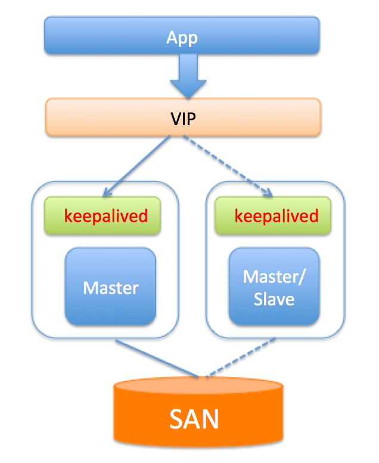
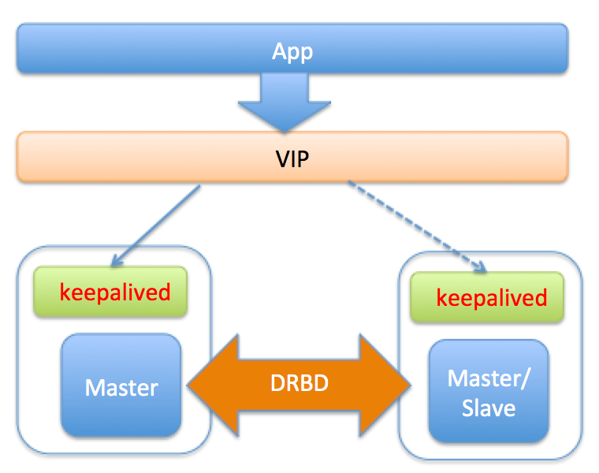
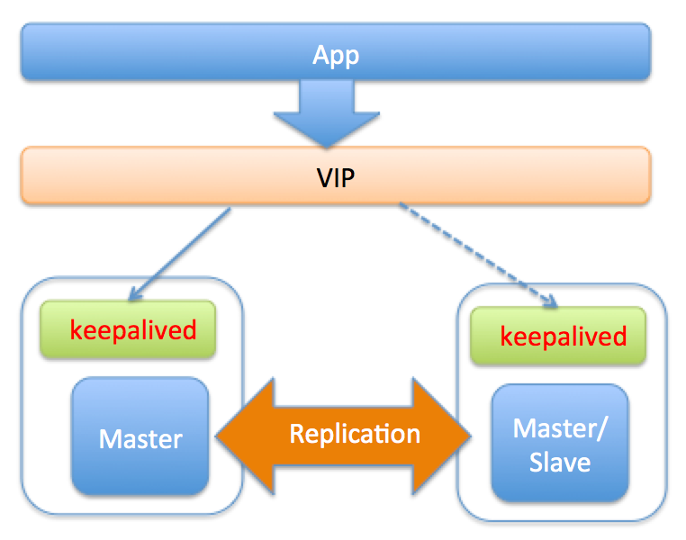
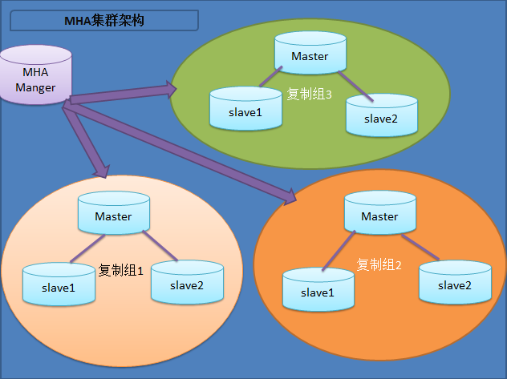
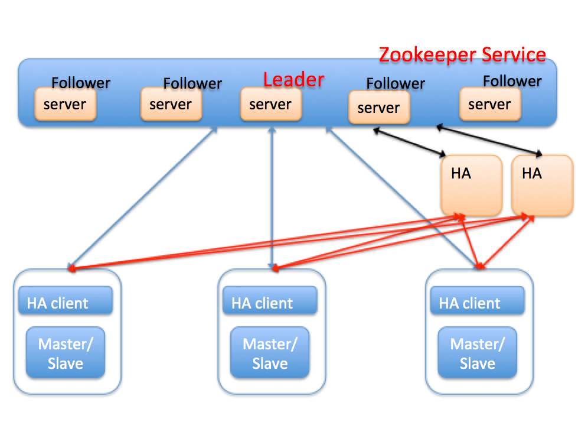
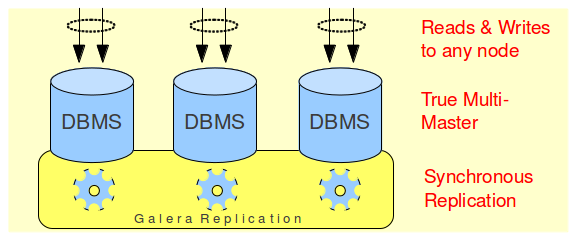
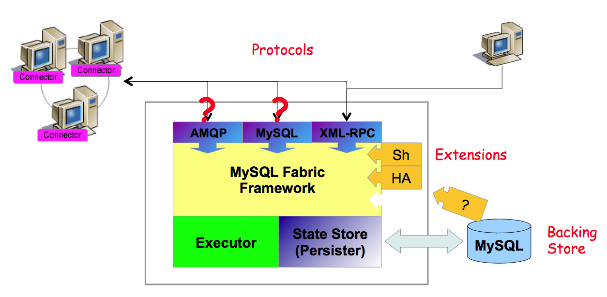

本文章来源于：<https://github.com/Zeb-D/my-review> ，请star 强力支持，你的支持，就是我的动力。

[TOC]

------

### 背景

之前比较多文章都是基于mysql 单节点的元素进行分析的，但面试的时候，动不动`三高`问题（如高可用、高并发、高性能），可能大家很少遇到过，但在高级／专家碰到概率比较高。

本文限定范围是mysql 相关，不包括某些云厂商改造过后的RDS产品（如aws aurora是采用存储计算分离方式）；

### 高可用的定义

高可用架构对于互联网服务基本是标配，无论是应用服务还是数据库服务都需要做到高可用。

一般而言，衡量高可用做到什么程度可以通过一年内服务不可用时间作为参考即SLA，要做到3个9的可用性，一年内只能累计有8个小时不可服务，而如果要做到5个9的可用性，则一年内只能累计5分钟服务中断。

对于一个系统而言，可能包含很多模块，比如前端应用，缓存，数据库，搜索，消息队列等，每个模块都需要做到高可用，才能保证整个系统的高可用。

对于数据库服务而言，高可用可能更复杂，对用户的服务可用，不仅仅是能访问，还需要有正确性保证，因此讨论数据库的高可用方案时，一般会同时考虑方案中数据一致性问题。

今天这篇文章主要讨论MySQL数据库的高可用方案，介绍每种方案的特性以及优缺点，本文是对各种方案的总结，希望抛砖引玉，和大家一起讨论。

### 基于共享存储的方案SAN

#### 方案介绍

SAN(Storage Area Network)简单点说就是可以实现网络中不同服务器的数据共享，共享存储能够为数据库服务器和存储解耦。使用共享存储时，服务器能够正常挂载文件系统并操作，如果服务器挂了，备用服务器可以挂载相同的文件系统，执行需要的恢复操作，然后启动MySQL。

共享存储的架构如下:

#### 优点

1.可以避免存储外的其它组件引起的数据丢失。

2.部署简单，切换逻辑简单，对应用透明。

3.保证主备数据的强一致。

#### 限制或缺点

1.共享存储是单点，若共享存储挂了，则会丢失数据。

2.价格比价昂贵。

### 基于磁盘复制的方案 DRBD

#### 方案介绍

DRBD(Distributed Replicated Block Device)是一种磁盘复制技术，可以获得和SAN类似的效果。

DBRD是一个以linux内核模块方式实现的块级别同步复制技术。

它通过网卡将主服务器的每个块复制到另外一个服务器块设备上，并在主设备提交块之前记录下来。

DRBD与SAN类似，也是有一个热备机器，开始提供服务时会使用和故障机器相同的数据，只不过DRBD的数据是复制存储，不是共享存储。DRBD的架构图如下：

#### 优点

1.切换对应用透明

2.保证主备数据的强一致。

#### 限制或缺点

1.影响写入性能，由于每次写磁盘，实质都需要同步到网络服务器。

2.一般配置两节点同步，可扩展性比较差

3.备库不能提供读服务，资源浪费

### 基于主从复制(单点写)方案

前面讨论的两种方案分别依赖于底层的共享存储和磁盘复制技术，来解决MYSQL服务器单点和磁盘单点的问题。而实际生产环境中，高可用更多的是依赖MySQL本身的复制，通过复制为Master制作一个或多个热副本，在Master故障时，将服务切换到热副本。

下面的几种方案都是基于主从复制的方案，方案由简单到复杂，功能也越来越强大，实施难度由易到难，各位可以根据实际情况选择合适的方案。

#### keepalived/heartbeat

##### 方案介绍

​      keepalived是一个HA软件，它的作用是检测服务器(web服务器，DB服务器等)状态，检查原理是模拟网络请求检测，检测方式包括HTTP_GET|SSL_GET|TCP_CHECK|SMTP_CHECK|MISC_CHECK等，对于DB服务器而言，主要就是IP,端口(TCP_CHECK)，但这可能不够(比如DB服务器ReadOnly)，因此keepalived也支持自定义脚本。

keepalived基于VRRP协议来实现高可用：

> 分别在主、从服务器上安装keepalived的软件，并配置同样的VIP，VIP层将真实IP屏蔽，应用服务器通过访问VIP来获取DB服务。
>
> Master定时向其它各个Slave keepalived服务发送心跳包(当不发送心跳包时，则认为主挂了，需要重新选主)，所有的服务器配置指向同一个VIP，正常情况下，应用访问VIP时，即访问的是master配置指向的真实IP；
>
> 而如果master所在keepalived服务挂了，则基于VRRP协议会重新选一个keepalived Master来提供服务，在这种情况下，如果master上的DB正常，而且上面有长连接，则会造成双写；
>
> keepalived通过监听来确认服务器的状态，如果发现服务器故障，则将故障服务器从系统中剔除(通过关掉自身的keepalived服务实现)；
>
> 当Master故障时，keepalived感知，并将Slave提升主，继续提供服务对应用层透明。

keepalived的高可用架构如下图：

##### 优点

1. 安装配置简单
2. Master故障时，Slave快速切换提供服务，并且对应用透明。

##### 限制或缺点

1.需要主备的IP在同一个网段。

2.提供的检测机制比较弱，需要自定义脚本来确定Master是否能提供服务，比如更新心跳表等。

3.无法保证数据的一致性，原生的MySQL采用异步复制，若Master故障，Slave数据可能不是最新，导致数据丢失，因此切换时要考虑Slave延迟的因素，确定切换策略。对于强一致需求的场景，可以开启(semi-sync)半同步，来减少数据丢失。

4.keepalived软件自身的HA无法保证。

#### MHA

##### 方案介绍

MHA(Master High Availability)是一位日本MySQL大牛用Perl写的一套MySQL故障切换方案，来保证数据库的高可用，MHA通过从宕机的主服务器上保存二进制日志来进行回补，能在最大程度上减少数据丢失。

MHA由两部分组成：MHA Manager（管理节点）和MHA Node（数据节点）。

MHA可以单独部署在一台独立的机器上管理多个master-slave集群，MHA Node运行在每台MySQL服务器上，主要作用是切换时处理二进制日志，确保切换尽量少丢数据。

MHA Manager会定时探测集群中的master节点，当master出现故障时，它可以自动将最新数据的slave提升为新的master，然后将所有其他的slave重新指向新的master，整个故障转移过程对应用程序完全透明。MHA的架构如下：

MHA failover过程：
a.检测到 Master 异常，进行一系列判断，最后确定 Master 宕掉；

b.检查配置信息，罗列出当前架构中各节点的状态；

c.根据定义的脚本处理故障的 Master，VIP漂移或者关掉mysqld服务；

d.所有 Slave 比较位点，选出位点最新的 Slave，再与 Master 比较并获得 binlog 的差异，copy 到管理节点；

e.从候选节点中选择新的 Master，新的 Master 会和位点最新的 Slave 进行比较并获得 relaylog 的差异；

f.管理节点把 binlog 的差异 copy 到新 Master，新 Master 应用 binlog 差异和 relaylog 差异，最后获得位点信息，并接受写请求(read_only=0)；

g.其他 Slave 与位点最新的 Slave 进行比较，并获得 relaylog 的差异，copy 到对应的 Slave；

h.管理节点把 binlog 的差异 copy 到每个 Slave，比较 Exec_Master_Log_Pos 和 Read_Master_Log_Pos，获得差异日志；

i.每个Slave应用所有差异日志，然后 reset slave 并重新指向新 Master；

j.新 Master reset slave 来清除 Slave 信息。

##### 优点

1. 代码开源，方便结合业务场景二次开发
2. 故障切换时，可以修复多个Slave之间的差异日志，最终使所有Slave保持数据一致，然后从中选择一个充当新的Master，并将其它Slave指向它。
3. 可以灵活选择VIP方案或者全局目录数据库方案(更改Master IP映射)来进行切换。

##### 缺点

1.无法保证强一致，因为从故障Master上保存二进制日志并不总是可行，比如Master磁盘坏了，或者SSH认证失败等。

2.只支持一主多从架构，要求一个复制集群中必须最少有三台数据库服务器，一主二从，即一台充当master，一台充当备用master，另外一台充当从库。

3.采用全局目录数据库方案切换时，需要应用感知变化，因此对应用不透明，因此要保持切换对应用透明，依然依赖于VIP。

4.不适用于大规模集群部署，配置比较复杂。

5.MHA管理节点本身的HA无法保证。

#### 基于zookeeper的高可用

##### 方案介绍

​      从前面的讨论可以看到，无论是keepalived方案还是MHA方案，都无法解决HA软件自身的高可用问题，因为HA本身是单点。

那么如果将HA也引入多个副本呢？那么又带来新的问题：

> 1.HA软件之间如何保证强同步。
>
> 2.如何确保不会有多个HA同时进行切换动作。

这两个问题实质都分布式系统一致性问题，为此，可以为HA软件引入类似Paxos，Raft这样的分布式一致性协议，保证HA软件的可用性。

> 具体可见本人关于zooKeeper的分享，部分简要如下：
>
> zooKeeper是一个典型的发布/订阅模式的分布式数据管理与协调框架，通过zookeeper中丰富的数据节点类型进行交叉使用，配合watcher事件通知机制，可以方便地构建一系列分布式应用涉及的核心功能，
>
> 比如：数据发布/订阅，负载均衡，分布式协调/通知，集群管理，Master选举，分布式锁和分布式队列等。zookeeper是一个很大话题，大家可以google去找更多的信息；

这里主要讨论zookeeper如何解决HA自身可用性问题。架构图如下：

图中每个MySQL节点上面部署了一个HA client，用于实时向zookeeper汇报本地节点的心跳状态，比如主库crash，通过修改zookeeper(以下简称zk)上的节点信息，来通知HA。

HA节点在zk上注册监听事件，当zk节点发生变化时会自动让HA感知，HA节点可以部署一个或多个，主要用于容灾。

HA节点之间通过zookeeper服务来实现数据的一致性，通过分布式锁保证多个HA节点不会同时对一个主从节点进行切换。

HA本身是无状态的，所有MySQL节点状态信息全部保存在zookeeper服务器上，切换时，HA会对MySQL节点进行复检，然后切换。

我们看看引入zookeeper后的切换流程：

a.HA client 检测到 Master 异常，进行一系列判断，最后确定 Master 宕掉；

b.HA client 删除 Master在zk上的节点信息；

c.由于监听机制，HA会感知到有节点被删除；

d.HA对MySQL节点进行复检，比如建立连接，更新心跳表等；

e.确认异常后，则进行切换。

我们再看看这种架构下，是否能保证HA自身的高可用

- 如果HA-client本身挂了，MySQL节点正常？
  - HA-Client管理的MySQL节点无法与zookeeper保持心跳，zk服务将节点删除，HA会感知到这种变化，准备尝试一次切换，切换前，会进行复检，复检时发现MySQL节点是OK的，则不会切换。

- MySQL节点与zookeeper的网络断了，那么表现如何？
  - 由于HA-Client与节点在同一台主机，因此HA-client无法再定时向zk汇报心跳，zk会将对应的MySQL节点信息删除，HA尝试复检，依然失败，则进行切换。

- HA挂了，表现如何？
  - 由于HA无状态，并且有多个副本，因此一个HA挂了，不会对整个系统造成影响。

##### 优点

1. 保证了整个系统的高可用
2. 主从的强一致依赖于MySQL本身，比如半同步，或者外围工具的回补策略，类似MHA。
3. 扩展性非常好，可以管理大规模集群。

##### 缺点

1.引入zk，整个系统变得复杂。

#### 基于Cluster(多点写)方案

第3节讨论的方案基本是目前业内使用的主流方案，这类方案的特点是，单点写。

虽然我们可以借助中间件进行分片(sharding)，但是对于同一份数据，依然只允许一个节点写，从这个角度来说，上面的方案是伪分布式。

下面讨论的两种方案算是真正分布式，同一个数据理论上可以在多个节点写入，类似于Oracle的RAC，EMC的GreenPlum这种分布式数据库。

在MySQL领域，主要提供了2种解决方案：基于Galera的PXC和NDB Cluster。

MySQL Cluster实现基于NDB存储引擎，使用很多局限性，而PXC是基于innodb引擎，虽然也有局限性，但由于目前innodb使用非常广泛，所以有一定的参考价值。

目前比如去哪儿公司在他们的生产环境中使用了PXC方案。

PXC(Percona XtraDB Cluster)的架构图如下：

##### 优点

1.准同步复制

2.多个可同时读写节点，可实现写扩展，较分片方案更进一步

3.自动节点管理

4.数据严格一致

5.服务高可用

##### 缺点

1.只支持innodb引擎

2.所有表都要有主键

3.由于写要同步到其它节点，存在写扩大问题

4.非常依赖于网络稳定性，不适用于远距离同步

#### 基于中间件proxy的方案

准确地来说，中间件与高可用没有特别大的关系，因为切换都是在数据库层完成，但引入中间层后，使得对应用更透明。

在引入中间件之前，所有的方案，基本都依赖于VIP漂移机制，或者不依赖于VIP又不能保证对应用透明。

通过加入中间件层，可以同时实现对应用透明和高可用。此外中间层还可以做sharding，方便写扩展。

proxy的方案很多，比如mysql自带的mysql-proxy和fabric，阿里巴巴的cobar和tddl等。我们以fabric为例，其架构图如下:

应用都请求 Fabric 连接器，然后通过使用 XML-RPC 协议访问 Fabric 节点， Fabric 节点依赖于备用存储 (backing store)，里面存储整个 HA 集群的元数据信息。

连接器读取 backing store 的信息，然后将元数据缓存到 cache，这样做的好处就是减少每次建立连接时与管理节点交互所带来的开销。

Fabric 节点可管理多个 HA Group，每个 HA Group 里有一个 Primary 和多个 Secondary(slave)，当 Primary 异常的时候会从 Secondary 中选出最合适的节点提升为新 Primary，其余 Secondary 都将重新指向新 Primary。

这些都是自动操作，对业务是无感知的，HA 切换之后还需要通知连接器更新的元数据信息。

##### 优点

1.切换对应用透明

2.可扩展性强，方便分片扩展

3.可以跨机房部署切换

##### 缺点

1.是一个比较新的组件，没有很多实际应用场景

2.没有解决强一致问题，主备强一致性依赖于MySQL自身(半同步)，以及回滚回补机制。

### 总结

以上介绍了目前MySQL几种典型的高可用架构，包括基于共享存储方案，基于磁盘复制方案和基于主从复制的方案。对于主从复制方案，分别介绍了keepalived，MHA以及引入zookeeper的方案。

对于每种方案，都从持续可用，数据强一致性，以及切换对应用的透明性进行说明。

个人觉得基于MySQL主从复制的方案是主流，也非常成熟，引入中间件和引入zookeeper虽然能将系统的可用性做地更好，可支撑的规模更大，但也对研发和运维也提出了更高的要求。

因此，在选择方案时，要根据业务场景和运维规模做抉择。

### 留几问题

欢迎大家一起留言交流～～

Q1：如果大数据量存储且有一定的IO的业务，那么你觉得哪种HA方案比较好？

Q2：你认为主从复制方案主要为了解决哪个问题？

Q3：你觉得云厂商RDS实现高可用需要注意哪些问题？