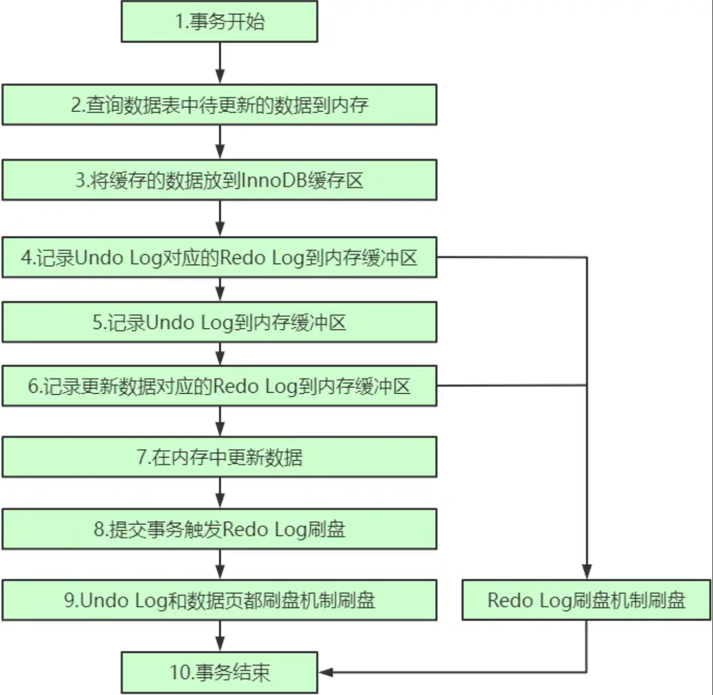

本文章来源于：<https://github.com/Zeb-D/my-review> ，请star 强力支持，你的支持，就是我的动力。

[TOC]

------

### 背景

平时的工作中，不知道你有没有遇到过这样的场景，一条 SQL 语句，正常执行的时候特别快，但是有时也不知道怎么回事，它就会变得特别慢，并且这样的场景很难复现，它不只随机，而且持续时间还很短。

> 因为在执行flush操作 什么时候会flush 
>
> 1.redolog写满了，需要腾出新的空间写数据，这个场景，对应的就是 InnoDB 的 redo log 写满了。这时候系统会停止所有更新操作，把 checkpoint 往前推进，redo log 留出空间可以继续写。
>
> 2.内存满了，需要处理脏页给新的数据页用 
>
> 3.mysql空闲的时候 
>
> 4.mysql关闭前

当内存数据页跟磁盘数据页内容不一致的时候，我们称这个内存页为“脏页”。内存数据写入到磁盘后，内存和磁盘上的数据页的内容就一致了，称为“干净页”。


### 性能分析

上面四种场景对性能的影响。

其中，第三种情况是属于 MySQL 空闲时的操作，这时系统没什么压力，而第四种场景是数据库本来就要关闭了。这两种情况下，你不会太关注“性能”问题。所以这里，我们主要来分析一下前两种场景下的性能问题。

第一种是“redo log 写满了，要 flush 脏页”，这种情况是 InnoDB 要尽量避免的。因为出现这种情况的时候，整个系统就不能再接受更新了，所有的更新都必须堵住。如果你从监控上看，这时候更新数会跌为 0。

第二种是“内存不够用了，要先将脏页写到磁盘”，这种情况其实是常态。


InnoDB 用缓冲池（buffer pool）管理内存，缓冲池中的内存页有三种状态：

> 第一种是，还没有使用的；第二种是，使用了并且是干净页；第三种是，使用了并且是脏页。

InnoDB 的策略是尽量使用内存，因此对于一个长时间运行的库来说，未被使用的页面很少。

而当要读入的数据页没有在内存的时候，就必须到缓冲池中申请一个数据页。

这时候只能把最久不使用的数据页从内存中淘汰掉：如果要淘汰的是一个干净页，就直接释放出来复用；但如果是脏页呢，就必须将脏页先刷到磁盘，变成干净页后才能复用。


所以，刷脏页虽然是常态，但是出现以下这两种情况，都是会明显影响性能的：

一个查询要淘汰的脏页个数太多，会导致查询的响应时间明显变长；

日志写满，更新全部堵住，写性能跌为 0，这种情况对敏感业务来说，是不能接受的。

所以，InnoDB 需要有控制脏页比例的机制，来尽量避免上面的这两种情况。


### 刷脏页的控制策略

#### innodb_io_capacity 

这就要用到 innodb_io_capacity 这个参数了，它会告诉 InnoDB 你的磁盘能力。这个值我建议你设置成磁盘的 IOPS。磁盘的 IOPS 可以通过 fio 这个工具来测试，下面的语句是我用来测试磁盘随机读写的命令：

```
fio -filename=$filename -direct=1 -iodepth 1 -thread -rw=randrw -ioengine=psync -bs=16k -size=500M -numjobs=10 -runtime=10 -group_reporting -name=mytest 
```

其实，因为没能正确地设置 innodb_io_capacity 参数，而导致的性能问题也比比皆是。

> 之前，就曾有其他公司的开发负责人找我看一个库的性能问题，说 MySQL 的写入速度很慢，TPS 很低，但是数据库主机的 IO 压力并不大。经过一番排查，发现罪魁祸首就是这个参数的设置出了问题。
>
> 他的主机磁盘用的是 SSD，但是 innodb_io_capacity 的值设置的是 300。于是，InnoDB 认为这个系统的能力就这么差，所以刷脏页刷得特别慢，甚至比脏页生成的速度还慢，这样就造成了脏页累积，影响了查询和更新性能。


#### innodb_max_dirty_pages_pct 

如果刷太慢，会出现什么情况？首先是内存脏页太多，其次是 redo log 写满。

InnoDB 的刷盘速度就是要参考这两个因素：一个是脏页比例，一个是 redo log 写盘速度。

InnoDB 会根据这两个因素先单独算出两个数字。

参数 innodb_max_dirty_pages_pct 是脏页比例上限，默认值是 75%。InnoDB 会根据当前的脏页比例（假设为 M），算出一个范围在 0 到 100 之间的数字，计算这个数字的伪代码类似这样：

```
F1(M)
{
  if M>=innodb_max_dirty_pages_pct then
      return 100;
  return 100*M/innodb_max_dirty_pages_pct;
}
```

InnoDB 每次写入的日志都有一个序号，当前写入的序号跟 checkpoint 对应的序号之间的差值，我们假设为 N。InnoDB 会根据这个 N 算出一个范围在 0 到 100 之间的数字，这个计算公式可以记为 F2(N)。F2(N) 算法比较复杂，你只要知道 N 越大，算出来的值越大就好了。

然后，根据上述算得的 F1(M) 和 F2(N) 两个值，取其中较大的值记为 R，之后引擎就可以按照 innodb_io_capacity 定义的能力乘以 R% 来控制刷脏页的速度。


刷脏页的过程是要将内存页写入磁盘。所以，无论是你的查询语句在需要内存的时候可能要求淘汰一个脏页，还是由于刷脏页的逻辑会占用 IO 资源并可能影响到了你的更新语句，都可能是造成你从业务端感知到 MySQL“抖”了一下的原因。

要尽量避免这种情况，你就要合理地设置 innodb_io_capacity 的值，并且平时要多关注脏页比例，不要让它经常接近 75%。

其中，脏页比例是通过 `Innodb_buffer_pool_pages_dirty/Innodb_buffer_pool_pages_total `得到的，具体的命令参考下面的代码：

```
mysql> select VARIABLE_VALUE into @a from global_status where VARIABLE_NAME = 'Innodb_buffer_pool_pages_dirty';
select VARIABLE_VALUE into @b from global_status where VARIABLE_NAME = 'Innodb_buffer_pool_pages_total';
select @a/@b;
```


#### innodb_flush_neighbors

MySQL 中的一个机制，可能让你的查询会更慢：在准备刷一个脏页的时候，如果这个数据页旁边的数据页刚好是脏页，就会把这个“邻居”也带着一起刷掉；而且这个把“邻居”拖下水的逻辑还可以继续蔓延，也就是对于每个邻居数据页，如果跟它相邻的数据页也还是脏页的话，也会被放到一起刷。

在 InnoDB 中，innodb_flush_neighbors 参数就是用来控制这个行为的，值为 1 的时候会有上述的“连坐”机制，值为 0 时表示不找邻居，自己刷自己的。

找“邻居”这个优化在机械硬盘时代是很有意义的，可以减少很多随机 IO。机械硬盘的随机 IOPS 一般只有几百，相同的逻辑操作减少随机 IO 就意味着系统性能的大幅度提升。

而如果使用的是 SSD 这类 IOPS 比较高的设备的话，我就建议你把 innodb_flush_neighbors 的值设置成 0。因为这时候 IOPS 往往不是瓶颈，而“只刷自己”，就能更快地执行完必要的刷脏页操作，减少 SQL 语句响应时间。

> 在 MySQL 8.0 中，innodb_flush_neighbors 参数的默认值已经是 0 了。


#### 小结

> Q：一个内存配置为 128GB、innodb_io_capacity 设置为 20000 的大规格实例，正常会建议你将 redo log 设置成 4 个 1GB 的文件。
>
> 但如果你在配置的时候不慎将 redo log 设置成了 1 个 100M 的文件，会发生什么情况呢？又为什么会出现这样的情况呢？
>
> A：每次事务提交都要写 redo log，如果设置太小，很快就会被写满，也就是下面这个图的状态，这个“环”将很快被写满，write pos 一直追着 checkPoint；你看到的现象就是磁盘压力很小，但是数据库出现间歇性的性能下跌。
>
> 在这种情况下，连 change buffer 的优化也失效了。因为 checkpoint 一直要往前推，这个操作就会触发 merge 操作，然后又进一步地触发刷脏页操作；


> redo log是关系型数据库的核心,保证了ACID里的D。所以redo log是牵一发而动全身的操作
>
> 当内存数据页跟磁盘数据页不一致的时候,把内存页称为'脏页'。如果redo log
>
> 设置得太小,redo log写满.那么会涉及到哪些操作呢,我认为是以下几点:
>
> 1.把相对应的数据页中的脏页持久化到磁盘,checkpoint往前推
>
> 2.由于redo log还记录了undo的变化,undo log buffer也要持久化进undo log
>
> 3.当innodb_flush_log_at_trx_commit设置为非1,还要把内存里的redo log持久化到磁盘上
>
> 4.redo log还记录了change buffer的改变,那么还要把change buffer purge到idb
>
> 以及merge change buffer.merge生成的数据页也是脏页,也要持久化到磁盘
>
> 上述4种操作,都是占用系统I/O,影响DML,如果操作频繁,会导致'抖'得向现在我们过冬一样。
>
> 但是对于select操作来说,查询时间相对会更快。因为系统脏页变少了,不用去淘汰脏页,直接复用干净页即可。还有就是对于宕机恢复,速度也更快,因为checkpoint很接近LSN,恢复的数据页相对较少
>
> 所以要控制刷脏的频率,频率快了,影响DML I/O,频率慢了,会导致读操作耗时长。


### 刷脏流程

执行流程：



MySQL在事务执行的过程中，会记录相应SQL语句的UndoLog 和 Redo Log，然后在内存中更新数据并形成数据脏页。接下来RedoLog会根据一定规则触发刷盘操作，Undo Log 和数据脏页则通过刷盘机制刷盘。

事务提交时，会将当前事务相关的所有Redo Log刷盘，只有当前事务相关的所有Redo Log 刷盘成功，事务才算提交成功。


恢复流程：


