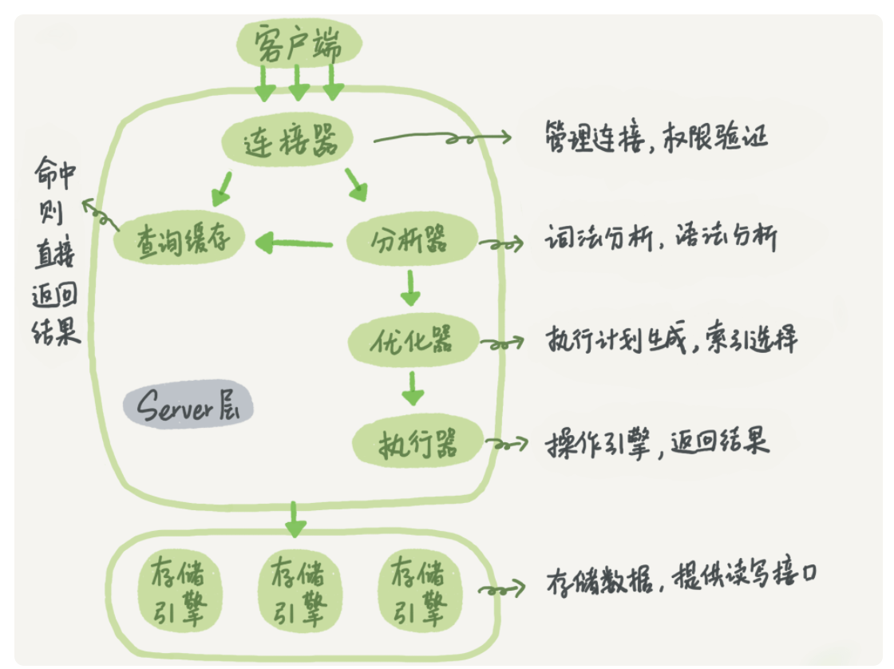

本文章来源于：<https://github.com/Zeb-D/my-review> ，请star 强力支持，你的支持，就是我的动力。

[TOC]

------

### 背景

未防止出现`不识庐山真面目，只缘身在此山中`，工作中存储设计是必不可少的，那么MySQL使用的概率还是比较大的；

从全局中去认识，再回到细节功能实现，这样更难达到完美的知识系统性学习；

看看里面都有哪些“零件”，希望借由这个拆解过程，让你对 MySQL 有更深入的理解。这样当我们碰到 MySQL 的一些异常或者问题时，就能够直戳本质，更为快速地定位并解决问题。


### MySQL的基本架构



众所周知，MySQL采用存储计算分离，分为 Server 层和存储引擎层两部分。

从图可知，Server 层包括连接器、查询缓存、分析器、优化器、执行器等，涵盖 MySQL 的大多数核心服务功能，以及所有的内置函数（如日期、时间、数学和加密函数等），所有跨存储引擎的功能都在这一层实现，比如存储过程、触发器、视图等。

而存储引擎层负责数据的存储和提取。其架构模式是插件式的，支持 InnoDB、MyISAM、Memory 等多个存储引擎。

现在从 MySQL 5.5.5 版本开始成为了默认存储引擎是InnoDB，意味着 create table 建表的时候，如果不指定引擎类型，默认使用的就是 InnoDB。

不过，你也可以通过指定存储引擎的类型来选择别的引擎，比如在 create table 语句中使用 engine=memory, 来指定使用内存引擎创建表。不同存储引擎的表数据存取方式不同，支持的功能也不同，在后面的文章中，我们会讨论到引擎的选择。

接下来重点熟悉下MySQL 以及 InnoDB 在执行sql会遇到哪些组件或者模块。后面我会出篇内容索引方便大家从0到1的复习。

可能网上各位大神有比较多相似文章（比如一条sql的流畅是什么样的），它只是本文的一些子内容；毕竟MySQL涉及到比较多的日志模块；


#### 连接器

第一步，你会先连接到这个数据库上，这时候接待你的就是连接器。连接器负责跟客户端建立连接、获取权限、维持和管理连接。

我们一般用对应语言进行链接（比如JDBC），当然官网也提供的连接命令一般是这么写的：

```
mysql -h$ip -P$port -u$user -p
```

输完命令之后，你就需要在交互对话里面输入密码。虽然密码也可以直接跟在 -p 后面写在命令行中，但这样可能会导致你的密码泄露。


在完成经典的 TCP 握手后，连接器就要开始认证你的身份，这个时候用的就是你输入的用户名和密码。

如果用户名或密码不对，你就会收到一个"Access denied for user"的错误，然后客户端程序结束执行。如果用户名密码认证通过，连接器会到权限表里面查出你拥有的权限。

之后，这个连接里面的权限判断逻辑，都将依赖于此时读到的权限。

> 可能有人会问：
>
> 一个用户成功建立连接后，此时用管理员账号对这个用户的权限做了修改，也不会影响已经存在连接的权限。
>
> 修改完成后，只有再新建的连接才会使用新的权限设置。
>
> 连接完成后，如果你没有后续的动作，这个连接就处于空闲状态，你可以在 show processlist 命令中看到它，其中的 Command 列显示为“Sleep”的这一行，就表示现在系统里面有一个空闲连接。


客户端如果太长时间没动静，连接器就会自动将它断开。这个时间是由参数 wait_timeout 控制的，默认值是 8 小时。

如果在连接被断开之后，客户端再次发送请求的话，就会收到一个错误提醒： Lost connection to MySQL server during query。这时候如果你要继续，就需要重连，然后再执行请求了。

数据库里面，长连接是指连接成功后，如果客户端持续有请求，则一直使用同一个连接。

短连接则是指每次执行完很少的几次查询就断开连接，下次查询再重新建立一个。建立连接的过程通常是比较复杂的，所以我建议你在使用中要尽量减少建立连接的动作，也就是尽量使用长连接。


**但是**全部使用长连接后，有些时候 MySQL 占用内存涨得特别快，这是因为 MySQL 在执行过程中临时使用的内存是管理在连接对象里面的。

这些资源会在连接断开的时候才释放。所以如果长连接累积下来，可能导致内存占用太大，被系统强行杀掉（OOM），从现象看就是 MySQL 异常重启了。

怎么解决这个问题呢？你可以考虑以下两种方案。

> 1、定期断开长连接。使用一段时间，或者程序里面判断执行过一个占用内存的大查询后，断开连接，之后要查询再重连。
>
> 2、如果你用的是 MySQL 5.7 或更新版本，可以在每次执行一个比较大的操作后，通过执行 mysql_reset_connection 来重新初始化连接资源。这个过程不需要重连和重新做权限验证，但是会将连接恢复到刚刚创建完时的状态。
>
> 3、更多的是我们使用框架连接MySQL的url有参数来控制连接有效性；


#### 查询缓存

连接建立完成后，你就可以执行 select 语句了。

执行逻辑就会来到第二步：查询缓存。

MySQL 拿到一个查询请求后，会先到查询缓存看看，之前是不是执行过这条语句。

之前执行过的语句及其结果可能会以 key-value 对的形式，被直接缓存在内存中。

key 是查询的语句，value 是查询的结果。如果你的查询能够直接在这个缓存中找到 key，那么这个 value 就会被直接返回给客户端。如果语句不在查询缓存中，就会继续后面的执行阶段。执行完成后，执行结果会被存入查询缓存中。


你可以看到，如果查询命中缓存，MySQL 不需要执行后面的复杂操作，就可以直接返回结果，这个效率会很高。

> 需要注意的是，


但是大多数情况下我会建议你不要使用查询缓存，为什么呢？因为查询缓存往往弊大于利。

> 1。缓存需要语句完全相等，包括参数。
>
> 2。表更新后就会失效 因此，只有在表更新频率不高，查询语句完全一致的情况下，可以手动开启缓存，其他一律关闭。 
>
> 注意：这个缓存要主动开启，在最新的版本是有废弃的现象。特别是mysql8之后，取消了缓存功能。


#### 分析器

首先，MySQL 需要知道你要做什么，因此需要对 SQL 语句做解析。

> 简单来说，这条要从哪里取出什么数据，
>
> 会像高级编程语言编译器的职责一样，词法分析、语义分析


分析器先会做“词法分析”。你输入的是由多个字符串和空格组成的一条 SQL 语句，MySQL 需要识别出里面的字符串分别是什么，代表什么。

MySQL 从你输入的"select"这个关键字识别出来，这是一个查询语句。它也要把字符串“T”识别成“表名 T”，把字符串“ID”识别成“列 ID”。

做完了这些识别以后，就要做“语法分析”。根据词法分析的结果，语法分析器会根据语法规则，判断你输入的这个 SQL 语句是否满足 MySQL 语法。

如果你的语句不对，就会收到`“You have an error in your SQL syntax”`的错误提醒，比如下面这个语句 select 少打了开头的字母“s”。

```
mysql> select * from t1 where ID=1;

ERROR 1064 (42000): You have an error in your SQL syntax; check the manual that corresponds to your MySQL server version for the right syntax to use near 'select * from t1 where ID=1' at line 1
```


一般语法错误会提示第一个出现错误的位置，所以你要关注的是紧接“use near”的内容。

> 分析器： 
>
> 1.识别传进来的字符串 
>
> 2.根据传进来的字符串用语法规则进行判断 
>
> 3.如果有错误，将会收到You have an error in your SQL syntax的报错


#### 优化器

经过了分析器，在开始执行之前，还要先经过优化器的处理。

> 一条sql执行的方法有比较多，此时优化器作用会寻找相对优解（不一定百分百对）


优化器是在表里面有多个索引的时候，决定使用哪个索引；或者在一个语句有多表关联（join）的时候，决定各个表的连接顺序。


比如你执行下面这样的语句，这个语句是执行两个表的 join：

```
mysql> select * from t1 join t2 using(ID)  where t1.c=10 and t2.d=20;
```

既可以先从表 t1 里面取出 c=10 的记录的 ID 值，再根据 ID 值关联到表 t2，再判断 t2 里面 d 的值是否等于 20。也可以先从表 t2 里面取出 d=20 的记录的 ID 值，再根据 ID 值关联到 t1，再判断 t1 里面 c 的值是否等于 10。


这两种执行方法的逻辑结果是一样的，但是执行的效率会有不同，而优化器的作用就是决定选择使用哪一个方案。

> 如果连接字段没有索引的话，先将t1表的c=10的行和t2表b=20的进行全表扫描，得到小的数据放入到join_buffer中，然后全表扫描另外一张表，将其和内存中的行进行匹配

优化器阶段完成后，这个语句的执行方案就确定下来了，然后进入执行器阶段。


#### 执行器

MySQL 通过优化器知道了该怎么做，于是就进入了执行器阶段，开始执行语句。

开始执行的时候，

要先判断一下你对这个表 T 有没有执行查询的权限，如果没有，就会返回没有权限的错误，

如下所示 (在工程实现上，如果命中查询缓存，会在查询缓存返回结果的时候，做权限验证。查询也会在优化器之前调用 precheck 验证权限)。

```
mysql> select * from T where ID=10;
ERROR 1142 (42000): SELECT command denied to user 'b'@'localhost' for table 'T'
```


如果有权限，就打开表继续执行。


打开表的时候，执行器就会根据表的引擎定义，去使用这个引擎提供的接口。


比如我们这个例子中的表 T 中，ID 字段没有索引，那么执行器的执行流程是这样的：

1、调用 InnoDB 引擎接口取这个表的第一行，判断 ID 值是不是 10，如果不是则跳过，如果是则将这行存在结果集中；

2、调用引擎接口取“下一行”，重复相同的判断逻辑，直到取到这个表的最后一行。

3、执行器将上述遍历过程中所有满足条件的行组成的记录集作为结果集返回给客户端。

至此，这个语句就执行完成了。

> 对于有索引的表，执行的逻辑也差不多。
>
> 第一次调用的是“取满足条件的第一行”这个接口，之后循环取“满足条件的下一行”这个接口，这些接口都是引擎中已经定义好的。


你会在数据库的慢查询日志中看到一个 rows_examined 的字段，表示这个语句执行过程中扫描了多少行。

> 这个值就是在执行器每次调用引擎获取数据行的时候累加的。
>
> 在有些场景下，执行器调用一次，在引擎内部则扫描了多行，因此引擎扫描行数跟 rows_examined 并不是完全相同的。


### 日志模块

MySQL 整体来看，其实就有两块：

一块是 Server 层，它主要做的是 MySQL 功能层面的事情；

还有一块是引擎层，负责存储相关的具体事宜。


redo log 是 InnoDB 引擎特有的日志，而 Server 层也有自己的日志，称为 binlog（归档日志）。


为什么会有两份日志呢？

因为最开始 MySQL 里并没有 InnoDB 引擎。MySQL 自带的引擎是 MyISAM，但是 MyISAM 没有 crash-safe 的能力，binlog 日志只能用于归档。

而 InnoDB 是另一个公司以插件形式引入 MySQL 的，既然只依靠 binlog 是没有 crash-safe 能力的，所以 InnoDB 使用另外一套日志系统——也就是 redo log 来实现 crash-safe 能力。


这两种日志有以下三点不同。

我们知道，在MySQL中还存在binlog(二进制日志)也可以记录写操作并用于数据的恢复，但二者是有着根本的不同的：

（1）作用不同：redo log是用于crash recovery的，保证MySQL宕机也不会影响持久性；binlog是用于point-in-time recovery的，保证服务器可以基于时间点恢复数据，此外binlog还用于主从复制。

（2）层次不同：redo log是InnoDB存储引擎实现的，而binlog是MySQL的服务器层(可以参考文章前面对MySQL逻辑架构的介绍)实现的，同时支持InnoDB和其他存储引擎。

（3）内容不同：redo log是物理日志，内容基于磁盘的Page；binlog的内容是二进制的，根据binlog_format参数的不同，可能基于sql语句、基于数据本身或者二者的混合。

（4）写入时机不同：binlog在事务提交时写入；redo log的写入时机相对多元：

- 前面曾提到：当事务提交时会调用fsync对redo log进行刷盘；这是默认情况下的策略，修改innodb_flush_log_at_trx_commit参数可以改变该策略，但事务的持久性将无法保证。
- 除了事务提交时，还有其他刷盘时机：如master thread每秒刷盘一次redo log等，这样的好处是不一定要等到commit时刷盘，commit速度大大加快。


#### binlog 作用

当需要恢复到指定的某一秒时，比如某天下午两点发现中午十二点有一次误删表，需要找回数据，那你可以这么做：

首先，找到最近的一次全量备份，如果你运气好，可能就是昨天晚上的一个备份，从这个备份恢复到临时库；

然后，从备份的时间点开始，将备份的 binlog 依次取出来，重放到中午误删表之前的那个时刻。


#### 更新流程

来看执行器和 InnoDB 引擎在执行这个简单的 update 语句时的内部流程。

1、执行器先找引擎取 ID=2 这一行。ID 是主键，引擎直接用树搜索找到这一行。如果 ID=2 这一行所在的数据页本来就在内存中，就直接返回给执行器；否则，需要先从磁盘读入内存，然后再返回。

2、执行器拿到引擎给的行数据，把这个值加上 1，比如原来是 N，现在就是 N+1，得到新的一行数据，再调用引擎接口写入这行新数据。

3、引擎将这行新数据更新到内存中，同时将这个更新操作记录到 redo log 里面，此时 redo log 处于 prepare 状态。然后告知执行器执行完成了，随时可以提交事务。

4、执行器生成这个操作的 binlog，并把 binlog 写入磁盘。执行器调用引擎的提交事务接口，引擎把刚刚写入的 redo log 改成提交（commit）状态，更新完成。


#### 两阶段提交

最后三步看上去有点“绕”，将 redo log 的写入拆成了两个步骤：prepare 和 commit，这就是"两阶段提交"。

为什么必须有“两阶段提交”呢？这是为了让两份日志之间的逻辑一致。

binlog 会记录所有的逻辑操作，并且是采用“追加写”的形式。

如果你的 DBA 承诺说半个月内可以恢复，那么备份系统中一定会保存最近半个月的所有 binlog，同时系统会定期做整库备份。这里的“定期”取决于系统的重要性，可以是一天一备，也可以是一周一备。


由于 redo log 和 binlog 是两个独立的逻辑，如果不用两阶段提交，要么就是先写完 redo log 再写 binlog，或者采用反过来的顺序。我们看看这两种方式会有什么问题。

仍然用前面的 update 语句来做例子。假设当前 ID=2 的行，字段 c 的值是 0，再假设执行 update 语句过程中在写完第一个日志后，第二个日志还没有写完期间发生了 crash，会出现什么情况呢？

1、先写 redo log 后写 binlog。假设在 redo log 写完，binlog 还没有写完的时候，MySQL 进程异常重启。由于我们前面说过的，redo log 写完之后，系统即使崩溃，仍然能够把数据恢复回来，所以恢复后这一行 c 的值是 1。但是由于 binlog 没写完就 crash 了，这时候 binlog 里面就没有记录这个语句。因此，之后备份日志的时候，存起来的 binlog 里面就没有这条语句。然后你会发现，如果需要用这个 binlog 来恢复临时库的话，由于这个语句的 binlog 丢失，这个临时库就会少了这一次更新，恢复出来的这一行 c 的值就是 0，与原库的值不同。

2、先写 binlog 后写 redo log。如果在 binlog 写完之后 crash，由于 redo log 还没写，崩溃恢复以后这个事务无效，所以这一行 c 的值是 0。但是 binlog 里面已经记录了“把 c 从 0 改成 1”这个日志。所以，在之后用 binlog 来恢复的时候就多了一个事务出来，恢复出来的这一行 c 的值就是 1，与原库的值不同。


#### 恢复过程

恢复的时候的大致步骤可能如下，摘取下来仅供做设计思想的参考：

Step1. 按顺序扫描redolog，如果redolog中的事务既有prepare标识，又有commit标识，就直接提交（复制redolog disk中的数据页到磁盘数据页） 

Step2 .如果redolog事务只有prepare标识，没有commit标识，则说明当前事务在commit阶段crash了，binlog中当前事务是否完整未可知，此时拿着redolog中当前事务的XID（redolog和binlog中事务落盘的标识），去查看binlog中是否存在此XID 

​	a. 如果binlog中有当前事务的XID，则提交事务（复制redolog disk中的数据页到磁盘数据页）

​	b. 如果binlog中没有当前事务的XID，则回滚事务（使用undolog来删除redolog中的对应事务）
