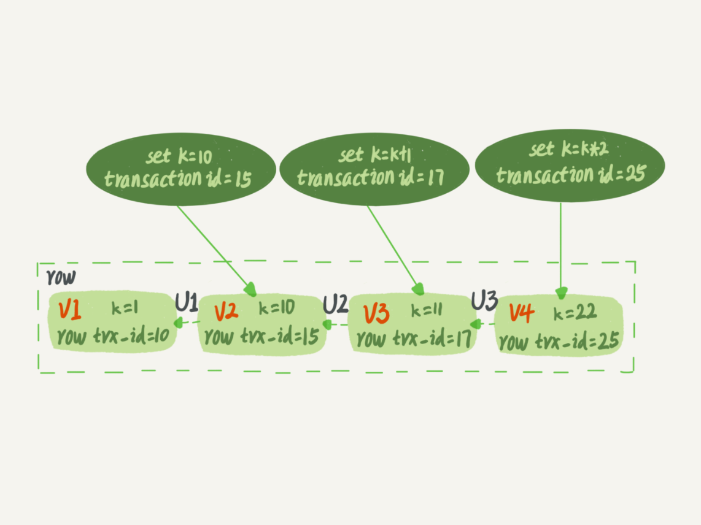

本文章来源于：<https://github.com/Zeb-D/my-review> ，请star 强力支持，你的支持，就是我的动力。

[TOC]

------

MySQL 里面的锁大致可以分成全局锁、表级锁和行锁三类，全局锁和表级锁实在server层实现的。

### 全局锁

全局锁就是对整个数据库实例加锁。MySQL 提供了一个加全局读锁的方法，命令是 Flush tables with read lock (FTWRL)。当你需要让整个库处于只读状态的时候，可以使用这个命令，之后其他线程的以下语句会被阻塞：数据更新语句（数据的增删改）、数据定义语句（包括建表、修改表结构等）和更新类事务的提交语句。

如果执行flush tables with read lock命令行窗口退出后，则数据库会恢复为执行该命令之前的状态。

unlock tables可以解除。

全局锁的典型使用场景是，做全库逻辑备份。也就是把整库每个表都 select 出来存成文本。以前有一种做法，是通过 FTWRL 确保不会有其他线程对数据库做更新，然后对整个库做备份。注意，在备份过程中整个库完全处于只读状态。

但是让整库都只读：

如果你在主库上备份，那么在备份期间都不能执行更新，业务基本上就得停摆；

如果你在从库上备份，那么备份期间从库不能执行主库同步过来的 binlog，会导致主从延迟。

官方自带的逻辑备份工具是 mysqldump。当 mysqldump 使用参数–single-transaction 的时候，导数据之前就会启动一个事务，来确保拿到一致性视图。而由于 MVCC 的支持，这个过程中数据是可以正常更新的。

> mysqldump -h127.0.0.1 -uroot -p123456 --single-transaction --default-character-set=utf8 accounting_global zg_tenant_entity > /tmp/ccc.sql

为什么还需要 FTWRL 呢？一致性读是好，但前提是引擎要支持这个隔离级别。

比如，对于 MyISAM 这种不支持事务的引擎，如果备份过程中有更新，总是只能取到最新的数据，那么就破坏了备份的一致性。这时，我们就需要使用 FTWRL 命令了。

所以，single-transaction 方法只适用于所有的表使用事务引擎的库。如果有的表使用了不支持事务的引擎，那么备份就只能通过 FTWRL 方法。这往往是 DBA 要求业务开发人员使用 InnoDB 替代 MyISAM 的原因之一。

既然要全库只读，为什么不使用 set global readonly=true 的方式呢？确实 readonly 方式也可以让全库进入只读状态，但我还是会建议你用 FTWRL 方式，主要有两个原因：

一是，在有些系统中，readonly 的值会被用来做其他逻辑，比如用来判断一个库是主库还是备库。因此，修改 global 变量的方式影响面更大，我不建议你使用。

二是，在异常处理机制上有差异。如果执行 FTWRL 命令之后由于客户端发生异常断开，那么 MySQL 会自动释放这个全局锁，整个库回到可以正常更新的状态。而将整个库设置为 readonly 之后，如果客户端发生异常，则数据库就会一直保持 readonly 状态，这样会导致整个库长时间处于不可写状态，风险较高。

业务的更新不只是增删改数据（DML)，还有可能是加字段等修改表结构的操作（DDL）。不论是哪种方法，一个库被全局锁上以后，你要对里面任何一个表做加字段操作，都是会被锁住的。

### 表级锁

MySQL 里面表级别的锁有两种：一种是表锁，一种是元数据锁（meta data lock，MDL)。

表锁的语法是 lock tables … read/write。与 FTWRL 类似，可以用 unlock tables 主动释放锁，也可以在客户端断开的时候自动释放。需要注意，lock tables 语法除了会限制别的线程的读写外，也限定了本线程接下来的操作对象。

举个例子, 如果在某个线程 A 中执行 lock tables t1 read, t2 write; 这个语句，则其他线程写 t1、读写 t2 的语句都会被阻塞。同时，线程 A 在执行 unlock tables 之前，也只能执行读 t1、读写 t2 的操作。连写 t1 都不允许，自然也不能访问其他表。在还没有出现更细粒度的锁的时候，表锁是最常用的处理并发的方式。而对于 InnoDB 这种支持行锁的引擎，一般不使用 lock tables 命令来控制并发，毕竟锁住整个表的影响面还是太大。

另一类表级的锁是 MDL（metadata lock)。MDL 不需要显式使用，在访问一个表的时候会被自动加上。MDL 的作用是，保证读写的正确性。你可以想象一下，如果一个查询正在遍历一个表中的数据，而执行期间另一个线程对这个表结构做变更，删了一列，那么查询线程拿到的结果跟表结构对不上，肯定是不行的。

因此，在 MySQL 5.5 版本中引入了 MDL，当对一个表做增删改查操作的时候，加 MDL 读锁；当要对表做结构变更操作的时候，加 MDL 写锁。

读锁之间不互斥，因此你可以有多个线程同时对一张表增删改查。

读写锁之间、写锁之间是互斥的，用来保证变更表结构操作的安全性。因此，如果有两个线程要同时给一个表加字段，其中一个要等另一个执行完才能开始执行。

虽然 MDL 锁是系统默认会加的，但却是你不能忽略的一个机制。比如下面这个例子，我经常看到有人掉到这个坑里：给一个小表加个字段，导致整个库挂了。

你肯定知道，给一个表加字段，或者修改字段，或者加索引，需要扫描全表的数据。在对大表操作的时候，你肯定会特别小心，以免对线上服务造成影响。而实际上，即使是小表，操作不慎也会出问题。我们来看一下下面的操作序列，假设表 t 是一个小表。

| sessionA                    | sessionB        | sessionC                               | sessionD                       |
| --------------------------- | --------------- | -------------------------------------- | ------------------------------ |
| begin; select * from T |                 |                                        |                                |
|                             | select * from T |                                        |                                |
|                             |                 | alter table T add F int (blocked) |                                |
|                             |                 |                                        | select * from T (blocked) |

我们可以看到 session A 先启动，这时候会对表 t 加一个 MDL 读锁。由于 session B 需要的也是 MDL 读锁，因此可以正常执行。

之后 session C 会被 blocked，是因为 session A 的 MDL 读锁还没有释放，而 session C 需要 MDL 写锁，因此只能被阻塞。如果只有 session C 自己被阻塞还没什么关系，但是之后所有要在表 t 上新申请 MDL 读锁的请求也会被 session C 阻塞。

如果某个表上的查询语句频繁，而且客户端有重试机制，也就是说超时后会再起一个新 session 再请求的话，这个库的线程很快就会爆满。

> 申请MDL锁的操作会形成一个队列，队列中写锁获取优先级高于读锁。一旦出现写锁等待，不但当前操作会被阻塞，同时还会阻塞后续该表的所有操作。
>
> 事务一旦申请到MDL锁后，直到事务执行完才会将锁释放。（这里有种特殊情况如果事务中包含DDL操作，mysql会在DDL操作语句执行前，隐式提交commit，以保证该DDL语句操作作为一个单独的事务存在，同时也保证元数据排他锁的释放

事务中的 MDL 锁，在语句执行开始时申请，但是语句结束后并不会马上释放，而会等到整个事务提交后再释放。

**如何安全地给小表加字段？**

1、首先我们要解决长事务，事务不提交，就会一直占着 MDL 锁。在 MySQL 的 information_schema 库的 innodb_trx 表中，你可以查到当前执行中的事务。如果你要做 DDL 变更的表刚好有长事务在执行，要考虑先暂停 DDL，或者 kill 掉这个长事务。

2、比较理想的机制是，在 alter table 语句里面设定等待时间，如果在这个指定的等待时间里面能够拿到 MDL 写锁最好，拿不到也不要阻塞后面的业务语句，先放弃。之后开发人员或者 DBA 再通过重试命令重复这个过程。

3、这里可以看出涉及到多线程，锁相关的部分，不管是java还是mysql，解决的办法都差不多，即为了防止死锁或者长时间卡顿，通过加入超时时间的方法来解决。

> ALTER TABLE tbl_name NOWAIT add column ...
> ALTER TABLE tbl_name WAIT N add column ... 

Online DDL的过程是这样的：

1. 拿MDL写锁

2. 降级成MDL读锁

3. 真正做DDL

4. 升级成MDL写锁

5. 释放MDL锁

1、2、4、5如果没有锁冲突，执行时间非常短。第3步占用了DDL绝大部分时间，这期间这个表可以正常读写数据，是因此称为“online ”

> 当备库用–single-transaction 做逻辑备份的时候，如果从主库的 binlog 传来一个 DDL 语句会怎么样？
>
> ddl语句对备份的影响

> 假设这个 DDL 是针对表 t1 的， 这里我把备份过程中几个关键的语句列出来：
>
> Q1:SET SESSION TRANSACTION ISOLATION LEVEL REPEATABLE READ;
> 
> Q2:START TRANSACTION  WITH CONSISTENT SNAPSHOT；
> 
> /* other tables */
> 
> Q3:SAVEPOINT sp;
> 
> /* 时刻 1 */
> 
> Q4:show create table `t1`;
> 
> /* 时刻 2 */
> 
> Q5:SELECT * FROM `t1`;
> 
> /* 时刻 3 */
> 
> Q6:ROLLBACK TO SAVEPOINT sp;
> /* 时刻 4 */
> 
> /* other tables */

> 在备份开始的时候，为了确保 RR（可重复读）隔离级别，再设置一次 RR 隔离级别 (Q1);
>
> 启动事务，这里用 WITH CONSISTENT SNAPSHOT 确保这个语句执行完就可以得到一个一致性视图（Q2)；
>
> 设置一个保存点，这个很重要（Q3）；
>
> show create 是为了拿到表结构 (Q4)，然后正式导数据 （Q5），回滚到 SAVEPOINT sp，在这里的作用是释放 t1 的 MDL 锁 （Q6）。

> DDL 从主库传过来的时间按照效果不同，我打了四个时刻。题目设定为小表，我们假定到达后，如果开始执行，则很快能够执行完成。

> 1、如果在 Q4 语句执行之前到达，现象：没有影响，备份拿到的是 DDL 后的表结构。
>
> 2、如果在“时刻 2”到达，则表结构被改过，Q5 执行的时候，报 Table definition has changed, please retry transaction，现象：mysqldump 终止；
>
> 3、如果在“时刻 2”和“时刻 3”之间到达，mysqldump 占着 t1 的 MDL 读锁，binlog 被阻塞，现象：主从延迟，直到 Q6 执行完成。
>
> 4、从“时刻 4”开始，mysqldump 释放了 MDL 读锁，现象：没有影响，备份拿到的是 DDL 前的表结构。

### 行锁

MySQL 的行锁是在引擎层由各个引擎自己实现的。但并不是所有的引擎都支持行锁，比如 MyISAM 引擎就不支持行锁。不支持行锁意味着并发控制只能使用表锁，对于这种引擎的表，同一张表上任何时刻只能有一个更新在执行，这就会影响到业务并发度。InnoDB 是支持行锁的，这也是 MyISAM 被 InnoDB 替代的重要原因之一。

> 锁粒度越大，开销越小，锁冲突的概率越小，安全性也就越高，但业务并发度以及性能越差；反之锁粒度越小，开销也就越大，锁冲突的概率越大（易导致死锁），安全性也就越低，但业务并发度以及性能越好。

两阶段锁

在 InnoDB 事务中，行锁是在需要的时候才加上的，但并不是不需要了就立刻释放，而是要等到事务结束时才释放。这个就是两阶段锁协议。

如果你的事务中需要锁多个行，要把最可能造成锁冲突、最可能影响并发度的锁尽量往后放。

> 假设你负责实现一个电影票在线交易业务，顾客 A 要在影院 B 购买电影票。我们简化一点，这个业务需要涉及到以下操作：
>
> 1、从顾客 A 账户余额中扣除电影票价；
>
> 2、给影院 B 的账户余额增加这张电影票价；
>
> 3、记录一条交易日志。

也就是说，要完成这个交易，我们需要 update 两条记录，并 insert 一条记录。当然，为了保证交易的原子性，我们要把这三个操作放在一个事务中。那么，你会怎样安排这三个语句在事务中的顺序呢？

根据两阶段锁协议，不论你怎样安排语句顺序，所有的操作需要的行锁都是在事务提交的时候才释放的。所以，如果你把语句 2 安排在最后，比如按照 3、1、2 这样的顺序，那么影院账户余额这一行的锁时间就最少。这就最大程度地减少了事务之间的锁等待，提升了并发度。

> 如果你的事务中需要锁多个行，要把最可能造成锁冲突、最可能影响并发度的锁的申请时机尽量往后放。

> 如果这个影院做活动，可以低价预售一年内所有的电影票，而且这个活动只做一天。于是在活动时间开始的时候，你的 MySQL 就挂了。你登上服务器一看，CPU 消耗接近 100%，但整个数据库每秒就执行不到 100 个事务。这是什么原因呢？

**死锁和死锁检测**

当并发系统中不同线程出现循环资源依赖，涉及的线程都在等待别的线程释放资源时，就会导致这几个线程都进入无限等待的状态，称为死锁。

当出现死锁以后，有两种策略：

一种策略是，直接进入等待，直到超时。这个超时时间可以通过参数 innodb_lock_wait_timeout 来设置，默认值是 50s。

另一种策略是，发起死锁检测，发现死锁后，主动回滚死锁链条中的某一个事务，让其他事务得以继续执行。将参数 innodb_deadlock_detect 设置为 on，表示开启这个逻辑。

第二种策略即主动死锁检测，而且 innodb_deadlock_detect 的默认值本身就是 on。主动死锁检测在发生死锁的时候，是能够快速发现并进行处理的，但是它也是有额外负担的。

> 每当一个事务被锁的时候，就要看看它所依赖的线程有没有被别人锁住，如此循环，最后判断是否出现了循环等待，也就是死锁。

> 所有事务都要更新同一行的场景呢？
>
> 每个新来的被堵住的线程，都要判断会不会由于自己的加入导致了死锁，这是一个时间复杂度是 O(n) 的操作。假设有 1000 个并发线程要同时更新同一行，那么死锁检测操作就是 100 万这个量级的。虽然最终检测的结果是没有死锁，但是这期间要消耗大量的 CPU 资源。因此，你就会看到 CPU 利用率很高，但是每秒却执行不了几个事务。

> Q：是每条事务执行前都会进行检测吗？如果是这样，即使简单的更新单个表的语句，当每秒的并发量达到上千的话，岂不是也会消耗大量资源用于死锁检测吗？
>
> A：如果他要加锁访问的行上有锁，他才要检测。
>
> 1. 一致性读不会加锁，就不需要做死锁检测；
>
> 2. 并不是每次死锁检测都都要扫所有事务。比如某个时刻，事务等待状态是这样的：
>
>   B在等A，
>   D在等C，
>   现在来了一个E，发现E需要等D，那么E就判断跟D、C是否会形成死锁，这个检测不用管B和A

怎么解决由这种热点行更新导致的性能问题呢？问题的症结在于，死锁检测要耗费大量的 CPU 资源。

如果你能确保这个业务一定不会出现死锁，可以临时把死锁检测关掉。但是这种操作本身带有一定的风险，因为业务设计的时候一般不会把死锁当做一个严重错误，毕竟出现死锁了，就回滚，然后通过业务重试一般就没问题了，这是业务无损的。而关掉死锁检测意味着可能会出现大量的超时，这是业务有损的。

另一个思路是控制并发度。根据上面的分析，你会发现如果并发能够控制住，比如同一行同时最多只有 10 个线程在更新，那么死锁检测的成本很低，就不会出现这个问题。一个直接的想法就是，在客户端做并发控制。但是，你会很快发现这个方法不太可行，因为客户端很多。

因此，这个并发控制要做在数据库服务端。如果你有中间件，可以考虑在中间件实现；如果你的团队有能修改 MySQL 源码的人，也可以做在 MySQL 里面。基本思路就是，对于相同行的更新，在进入引擎之前排队。这样在 InnoDB 内部就不会有大量的死锁检测工作了。

如果团队里暂时没有数据库方面的专家，不能实现这样的方案，能不能从设计上优化这个问题呢？

> 你可以考虑通过将一行改成逻辑上的多行来减少锁冲突。还是以影院账户为例，可以考虑放在多条记录上，比如 10 个记录，影院的账户总额等于这 10 个记录的值的总和。这样每次要给影院账户加金额的时候，随机选其中一条记录来加。这样每次冲突概率变成原来的 1/10，可以减少锁等待个数，也就减少了死锁检测的 CPU 消耗。

高并发下避免死锁检测带来的负面影响：

1. 确保业务上不会产生死锁，直接将死锁检测关闭。（innodb 自带死锁检测） 
2. 在数据库中间件中统一对更新同一行的请求进行排队，控制并发度。 
3. 业务逻辑上进行优化，将一行数据分解成多行，降低写入压力。

如果你要删除一个表里面的前 10000 行数据，有以下三种方法可以做到：

第一种，直接执行 delete from T limit 10000;

第二种，在一个连接中循环执行 20 次 delete from T limit 500;

第三种，在 20 个连接中同时执行 delete from T limit 500。

你会选择哪一种方法呢？为什么呢？

> Q：innodb行级锁是通过锁索引记录实现的。如果update的列没建索引，即使只update一条记录也会锁定整张表吗？
>
> A：如果列上没有索引，更新就是走主键索引树，逐行扫描满足条件的行，等于将主键索引所有的行上了锁，假如加上limit 1,扫描主键索引树，直到找到第一条满足条件的行，扫描过的行都会被加上行锁。

### 行锁与事务隔离

如果是可重复读隔离级别，事务 T 启动的时候会创建一个视图 read-view，之后事务 T 执行期间，即使有其他事务修改了数据，事务 T 看到的仍然跟在启动时看到的一样。也就是说，一个在可重复读隔离级别下执行的事务，好像与世无争，不受外界影响。

一方面事务是可重复读，即整个事务期间都看到的是事务刚刚启动时候的视图；但是又因为行锁，事务在执行过程中可能需要等待别的事务更新同一行，那这时候如果该事务也要更新，看到的还是事务刚刚创建时事务的状态吗？ 显然不是，这里的关键就是对于更新操作来说，需要当前读。

> 不是一致性读，是当前读保证最新值；一致性读是RR级别下，整个事务中读取到数据一致

问题是，既然进入了等待状态，那么等到这个事务自己获取到行锁要更新数据的时候，它读到的值又是什么呢？

我给你举一个例子吧。下面是一个只有两行的表的初始化语句。

> mysql> CREATE TABLE `t` (
> 
>   `id` int(11) NOT NULL,
> 
>   `k` int(11) DEFAULT NULL,
> 
>   PRIMARY KEY (`id`)
> 
> ) ENGINE=InnoDB;
> 
> insert into t(id, k) values(1,1),(2,2);

| session A                                  | session B                                                    | session C                     |
| ------------------------------------------ | ------------------------------------------------------------ | ----------------------------- |
| start transaction with consistent snapshot |                                                              |                               |
|                                            | start transaction with consistent snapshot                   | update t set k=k+1 where id=1 |
|                                            | update t set k=k+1 where id=1 select k from t where id =1 |                               |
| select k from t where id =1 commit;   |                                                              |                               |
|                                            | commit;                                                      |                               |

> 第一种启动方式，一致性视图是在执行第一个快照读语句时创建的；
>
> 第二种启动方式，一致性视图是在执行 start transaction with consistent snapshot 时创建的。
>
> 第三种，默认 autocommit=1。即没有显式地使用 begin/commit，表示这个 update 语句本身就是一个事务，语句完成的时候会自动提交。

在 MySQL 里，有两个“视图”的概念：

一个是 view。它是一个用查询语句定义的虚拟表，在调用的时候执行查询语句并生成结果。创建视图的语法是 create view … ，而它的查询方法与表一样。

一个是 InnoDB 在实现 MVCC 时用到的一致性读视图，即 consistent read view，用于支持 RC（Read Committed，读提交）和 RR（Repeatable Read，可重复读）隔离级别的实现。

它没有物理结构，作用是事务执行期间用来定义“我能看到什么数据”。

### 理解 MVCC

“快照”在 MVCC 里是怎么工作的？

在可重复读隔离级别下，事务在启动的时候就“拍了个快照”。注意，这个快照是基于整库的。

> 生成ReadView时只要获取当前活跃的事务ID列表和系统下一个事务ID；

InnoDB 里面每个事务有一个唯一的事务 ID，叫作 transaction id。它是在事务开始的时候向 InnoDB 的事务系统申请的，是按申请顺序严格递增的。 只读事务的ID和非只读事务的ID是有些区别的。前者是一个很大的数，后者是一个从1自增的数值。

> 只读事务是不会分配事务ID的： 
>
> 1. 减小活跃数组的长度； 
> 2. 减少事务ID申请次数，即并发申请事务ID造成的锁冲突； 
> 3. 也就防止了事务ID自增过快。

而每行数据也都是有多个版本的。每次事务更新数据的时候，都会生成一个新的数据版本，并且把 transaction id 赋值给这个数据版本的事务 ID，记为 row trx_id。

同时，旧的数据版本要保留，并且在新的数据版本中，能够有信息可以直接拿到它。

也就是说，数据表中的一行记录，其实可能有多个版本 (row)，每个版本有自己的 row trx_id。

一个记录被多个事务连续更新后的状态。

图中虚线框里是同一行数据的 4 个版本，当前最新版本是 V4，k 的值是 22，它是被 transaction id 为 25 的事务更新的，因此它的 row trx_id 也是 25。

语句更新会生成 undo log（回滚日志）吗？那么，undo log 在哪呢？

图中的三个虚线箭头，就是 undo log；而 V1、V2、V3 并不是物理上真实存在的，而是每次需要的时候根据当前版本和 undo log 计算出来的。比如，需要 V2 的时候，就是通过 V4 依次执行 U3、U2 算出来。

明白了多版本和 row trx_id 的概念后，我们再来想一下，InnoDB 是怎么定义那个“100G”的快照的。

按照可重复读的定义，一个事务启动的时候，能够看到所有已经提交的事务结果。但是之后，这个事务执行期间，其他事务的更新对它不可见。

因此，一个事务只需要在启动的时候声明说，“以我启动的时刻为准，如果一个数据版本是在我启动之前生成的，就认；如果是我启动以后才生成的，我就不认，我必须要找到它的上一个版本”。当然，如果“上一个版本”也不可见，那就得继续往前找。还有，如果是这个事务自己更新的数据，它自己还是要认的。

在实现上， InnoDB 为每个事务构造了一个数组，用来保存这个事务启动瞬间，当前正在“活跃”的所有事务 ID。“活跃”指的就是，启动了但还没提交。

数组里面事务 ID 的最小值记为低水位，当前系统里面已经创建过的事务 ID 的最大值加 1 记为高水位。

这个视图数组和高水位，就组成了当前事务的一致性视图（read-view）。

而数据版本的可见性规则，就是基于数据的 row trx_id 和这个一致性视图的对比结果得到的。

这个视图数组把所有的 row trx_id 分成了几种不同的情况。

这样，对于当前事务的启动瞬间来说，一个数据版本的 row trx_id，有以下几种可能：

​	如果落在绿色部分，表示这个版本是已提交的事务或者是当前事务自己生成的，这个数据是可见的；

​	如果落在红色部分，表示这个版本是由将来启动的事务生成的，是肯定不可见的；

​	如果落在黄色部分，那就包括两种情况

​		a. 若 row trx_id 在数组中，表示这个版本是由还没提交的事务生成的，不可见；

​		b. 若 row trx_id 不在数组中，表示这个版本是已经提交了的事务生成的，可见。

比如，对于图 2 中的数据来说，如果有一个事务，它的低水位是 18，那么当它访问这一行数据时，就会从 V4 通过 U3 计算出 V3，所以在它看来，这一行的值是 11。

有了这个声明后，系统里面随后发生的更新，是不是就跟这个事务看到的内容无关了呢？因为之后的更新，生成的版本一定属于上面的 2 或者 3(a) 的情况，而对它来说，这些新的数据版本是不存在的，所以这个事务的快照，就是“静态”的了。

> 致性视图是在执行第一个快照'读语句'时创建的，说过事务开始就会向 InnoDB 的事务系统申请事务 ID，判断事物开启条件的一种是使用begin并且执行第一个'操作 'InnoDB 表的语句，所以我第一句只执行非select的dml语句就会生成事务id，但是并不会生成一致性视图，在我要执行select的时候 其它事物可能已经创建。
>
> 所以对于视图数组就会出现比当前事务id还大并且没有提交的事物，同理也会出现比当前事务还小且没有提交的事物。所以假如当前事务id为88 ，活跃数组就可能有[72,79,88,90,91] 不连续的原因也知道吧，就是因为在生成一致性视图的时候中间短事务早就提交了 对于可见性如果读取数据中事物id在当前活跃数组有，说明是我创建视图的时候还在活跃的事务我是不能看的。
>
> 如果不在并且在数组范围内说明是我在开启事务时到创建视图期间已经提交的事务，我是可以查看的。
>
> 如果小于活跃数组的最小值， 这个最小值也可以叫做已经提交事务的最大值,（也不绝对，其实数组最小值就是代表小于它的事务都是在我创建一致性视图的时候已经提交了）所以可见。
>
> 大于数组最大值 就是（我创建一致性视图时候当前已经分配的事务ID的最大值+1）那么就不可见

> 数据最终的版本只有一个，每次每个事物在进行快照读的时候，会先取出最终版本，然后根据事物ID判断当前事物是否能读取当前版本数据，如果不行，则通过undolog获取前一个版本，继续同样的判断，直到拿到数据为止。但是如果是更新操作，则必须要当前读，必须要拿到最新版本的数据，此时，如果有其他事物对当前数据加锁了，那就必须等待锁释放。即使是未提交读隔离级别下，更新数据也会加锁，更新的时候同样要等待锁释放。

InnoDB 利用了“所有数据都有多个版本”的这个特性，实现了“秒级创建快照”的能力。

接下来，我们继续看一下图 1 中的三个事务，分析下事务 A 的语句返回的结果，为什么是 k=1。这里，我们不妨做如下假设：

事务 A 开始前，系统里面只有一个活跃事务 ID 是 99；

事务 A、B、C 的版本号分别是 100、101、102，且当前系统里只有这四个事务；

三个事务开始前，(1,1）这一行数据的 row trx_id 是 90。这样，事务 A 的视图数组就是[99,100], 事务 B 的视图数组是[99,100,101], 事务 C 的视图数组是[99,100,101,102]。

为了简化分析，我先把其他干扰语句去掉，只画出跟事务 A 查询逻辑有关的操作：

从图中可以看到，第一个有效更新是事务 C，把数据从 (1,1) 改成了 (1,2)。这时候，这个数据的最新版本的 row trx_id 是 102，而 90 这个版本已经成为了历史版本。第二个有效更新是事务 B，把数据从 (1,2) 改成了 (1,3)。这时候，这个数据的最新版本（即 row trx_id）是 101，而 102 又成为了历史版本。

从图中可以看到，第一个有效更新是事务 C，把数据从 (1,1) 改成了 (1,2)。这时候，这个数据的最新版本的 row trx_id 是 102，而 90 这个版本已经成为了历史版本。

第二个有效更新是事务 B，把数据从 (1,2) 改成了 (1,3)。这时候，这个数据的最新版本（即 row trx_id）是 101，而 102 又成为了历史版本。

你可能注意到了，在事务 A 查询的时候，其实事务 B 还没有提交，但是它生成的 (1,3) 这个版本已经变成当前版本了。但这个版本对事务 A 必须是不可见的，否则就变成脏读了。好，现在事务 A 要来读数据了，它的视图数组是[99,100]。当然了，读数据都是从当前版本读起的。所以，事务 A 查询语句的读数据流程是这样的：找到 (1,3) 的时候，判断出 row trx_id=101，比高水位大，处于红色区域，不可见；接着，找到上一个历史版本，一看 row trx_id=102，比高水位大，处于红色区域，不可见；再往前找，终于找到了（1,1)，它的 row trx_id=90，比低水位小，处于绿色区域，可见。

这样执行下来，虽然期间这一行数据被修改过，但是事务 A 不论在什么时候查询，看到这行数据的结果都是一致的，所以我们称之为一致性读。

一个数据版本，对于一个事务视图来说，除了自己的更新总是可见以外，有三种情况：版本未提交，不可见；版本已提交，但是是在视图创建后提交的，不可见；版本已提交，而且是在视图创建前提交的，可见。现在，我们用这个规则来判断图 4 中的查询结果，事务 A 的查询语句的视图数组是在事务 A 启动的时候生成的，这时候：(1,3) 还没提交，属于情况 1，不可见；(1,2) 虽然提交了，但是是在视图数组创建之后提交的，属于情况 2，不可见；(1,1) 是在视图数组创建之前提交的，可见。你看，去掉数字对比后，只用时间先后顺序来判断，分析起来是不是轻松多了。所以，后面我们就都用这个规则来分析。

更新逻辑

事务 B 的 update 语句，如果按照一致性读，好像结果不对哦？

你看图 5 中，事务 B 的视图数组是先生成的，之后事务 C 才提交，不是应该看不见 (1,2) 吗，怎么能算出 (1,3) 来？

是的，如果事务 B 在更新之前查询一次数据，这个查询返回的 k 的值确实是 1。但是，当它要去更新数据的时候，就不能再在历史版本上更新了，否则事务 C 的更新就丢失了。因此，事务 B 此时的 set k=k+1 是在（1,2）的基础上进行的操作。

> 更新数据都是先读后写的，而这个读，只能读当前的值，称为“当前读”（current read）。
>
> 其实就是针对buffer pool直接进行修改。 此时的update 为什么能够进行当前读呢，是依靠的行锁。 当前读保证读到的是已经提交的，因为行锁是两阶段锁。

事务的可重复读的能力是怎么实现的？

可重复读的核心就是一致性读（consistent read）；而事务更新数据的时候，只能用当前读。如果当前的记录的行锁被其他事务占用的话，就需要进入锁等待。

而读提交的逻辑和可重复读的逻辑类似，它们最主要的区别是：

在可重复读隔离级别下，只需要在事务开始的时候创建一致性视图，之后事务里的其他查询都共用这个一致性视图；

在读提交隔离级别下，每一个语句执行前都会重新算出一个新的视图。

这里需要说明一下，“start transaction with consistent snapshot; ”的意思是从这个语句开始，创建一个持续整个事务的一致性快照。所以，在读提交隔离级别下，这个用法就没意义了，等效于普通的 start transaction。下面是读提交时的状态图，可以看到这两个查询语句的创建视图数组的时机发生了变化，就是图中的 read view 框。（注意：这里，我们用的还是事务 C 的逻辑直接提交，而不是事务 C’）

小结

InnoDB 的行数据有多个版本，每个数据版本有自己的 row trx_id，每个事务或者语句有自己的一致性视图。普通查询语句是一致性读，一致性读会根据 row trx_id 和一致性视图确定数据版本的可见性。

对于可重复读，查询只承认在事务启动前就已经提交完成的数据；对于读提交，查询只承认在语句启动前就已经提交完成的数据；

而当前读，总是读取已经提交完成的最新版本。

表结构不支持“可重复读”是因为表结构没有对应的行数据，也没有 row trx_id，因此只能遵循当前读的逻辑。当然，MySQL 8.0 已经可以把表结构放在 InnoDB 字典里了，也许以后会支持表结构的可重复读。

现在，我要把所有“字段 c 和 id 值相等的行”的 c 值清零，但是却发现了一个“诡异”的、改不掉的情况。

> mysql> CREATE TABLE `t` (
> 
>   `id` int(11) NOT NULL,
> 
>   `c` int(11) DEFAULT NULL,
> 
>   PRIMARY KEY (`id`)
> 
> ) ENGINE=InnoDB;
> 
> insert into t(id, c) values(1,1),(2,2),(3,3),(4,4);

（1）事务A：begin;select * from t; 事务B：update t set c=0 where id=c；事务B隐式提交 

（2）此时事务A执行update t set c=0 where id=c；这里update是当前读，读取的是最新版本的记录，那么id=c的记录已经在B事务中被修改了，此时update就失败了 

（3）事务A继续执行查询select * from t；查询是一致性读，读的是begin后面执行的那句查询创建的视图

> 解决方法，第一个select改成select for update。
