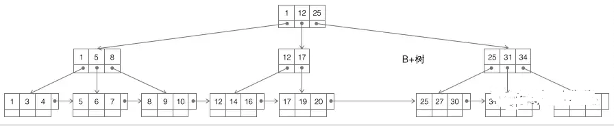

本文章来源于：<https://github.com/Zeb-D/my-review> ，请star 强力支持，你的支持，就是我的动力。

[TOC]


为什么MySQL的InnoDB中的索引要使用B+树，而不是其它树？比如B树？

### 一、提出点

InnoDB的一棵B+树可以存放多少行数据？

答案：约2千万

怎么计算出来的？先从InnoDB索引数据结构、数据组织、索引实现方式说起。


### 二、InnoDB存储引擎储存单元

计算机在存储数据的时候，有最小存储单元，这就好比现金的流通最小单位是一毛。

在计算机中，磁盘存储数据最小单元是扇区，一个扇区的大小是512字节，而文件系统（例如XFS/EXT4）的最小单元是块，一个块的大小是4k，而对于InnoDB存储引擎也有自己的最小储存单元，页（Page），一个页的大小是16K。

文件系统中一个文件大小只有1个字节，但不得不占磁盘上4KB的空间。

InnoDB的所有数据文件（后缀为ibd的文件），大小始终都是16384（16k）的整数倍。

磁盘扇区、文件系统、InnoDB存储引擎都有各自的最小存储单元。

InnoDB存储单元16k --> 文件系统4K --> 磁盘扇区512b 分别组成；


在MySQL中，InnoDB页的大小默认是16k，当然也可以通过参数设置：

```mysql
mysql> show variables like 'innodb_page_size'
```

表中的数据都是存储在页中的，**所以一个页中能存储多少行数据呢？**

InnoDB存储引擎的最小存储单元是页，页可以用于存放数据也可以用于存放键值+指针，在B+树中叶子节点存放数据，非叶子节点存放键值+指针。

索引组织表通过非叶子节点的二分查找法以及指针确定数据在哪个页中，进而在去数据页中查找到需要的数据；


### 三、B+树与B树差异

因为B树不管叶子节点还是非叶子节点，都会保存数据，这样导致在非叶子节点中能保存的指针数量变少（有些资料也称为扇出）

指针少的情况下要保存大量数据，只能增加树的高度，导致IO操作变多，查询性能变低；

#### B树分析


B树，如上图，它的特点是：

(1)不再是二叉搜索，而是m叉搜索；

(2)叶子节点，非叶子节点，都存储数据；

(3)中序遍历，可以获得所有节点；

*画外音，实在不想介绍这个特性：非根节点包含的关键字个数j满足，**(┌m/2┐)-1 <= j <= m-1**，节点分裂时要满足这个条件。*

 

B树被作为实现索引的数据结构被创造出来，是因为它能够完美的利用“局部性原理”。

 

**什么是局部性原理？**

局部性原理的逻辑是这样的：

(1)内存读写块，磁盘读写慢，而且慢很多；

(2)**磁盘预读**：磁盘读写并不是按需读取，而是按页预读，一次会读一页的数据，每次加载更多的数据，如果未来要读取的数据就在这一页中，可以避免未来的磁盘IO，提高效率；

*画外音：通常，一页数据是4K。*

(3)**局部性原理**：软件设计要尽量遵循“数据读取集中”与“使用到一个数据，大概率会使用其附近的数据”，这样磁盘预读能充分提高磁盘IO；

**B树为何适合做索引？**

(1)由于是m分叉的，高度能够大大降低；

(2)每个节点可以存储j个记录，如果将节点大小设置为页大小，例如4K，能够充分的利用预读的特性，极大减少磁盘IO；


#### B+树分析



B+树，如上图，仍是m叉搜索树，在B树的基础上，做了**一些改进**：

(1)非叶子节点不再存储数据，数据只存储在同一层的叶子节点上；

*画外音：B+树中根到每一个节点的路径长度一样，而B树不是这样。*

(2)叶子之间，增加了链表，获取所有节点，不再需要中序遍历；

 

这些改进让B+树比B树有更优的特性：

(1)范围查找，定位min与max之后，中间叶子节点，就是结果集，不用中序回溯；

*画外音：范围查询在SQL中用得很多，这是B+树比B树最大的优势。*

(2)叶子节点存储实际记录行，记录行相对比较紧密的存储，适合大数据量磁盘存储；非叶子节点存储记录的PK，用于查询加速，适合内存存储；

(3)非叶子节点，不存储实际记录，而只存储记录的KEY的话，那么在相同内存的情况下，B+树能够存储更多索引；

 

最后，量化说下，**为什么m叉的B+树比二叉搜索树的高度大大大大降低？**

**那么现在需要计算出非叶子节点能存放多少指针？**：

(1)局部性原理，将一个节点的大小设为一页，一页4K，假设一个KEY有8字节，一个节点可以存储500个KEY，即j=500

(2)m叉树，大概m/2<= j <=m，即可以差不多是1000叉树

(3)那么：

一层树：1个节点，1*500个KEY，大小4K

二层树：1000个节点，1000*500=50W个KEY，大小1000*4K=4M

三层树：1000*1000个节点，1000*1000*500=5亿个KEY，大小1000*1000*4K=4G

*画外音：额，帮忙看下有没有算错。*

可以看到，存储大量的数据（5亿），并不需要太高树的深度（高度3），索引也不是太占内存（4G）。


#### 哈希索引

对于InnoDB的哈希索引，确切的应该这么说：

（1）**InnoDB用户无法手动创建哈希索引**，这一层上说，InnoDB确实不支持哈希索引；

（2）InnoDB会自调优(self-tuning)，如果判定建立自适应哈希索引(Adaptive Hash Index, AHI)，能够提升查询效率，**InnoDB自己会建立相关哈希索引**，这一层上说，InnoDB又是支持哈希索引的；

 

那什么是自适应哈希索引(Adaptive Hash Index, AHI)呢？原理又是怎样的呢？

> 不妨设有InnoDB数据表：
>
> *t(id PK, name KEY, sex, flag)*
>
> *画外音：**id是主键，name建了普通索引。*

在主键id上会建立**聚集索引**(Clustered Index)，叶子存储记录本身，在name上会建立**普通索引**(Secondary Index)，叶子存储主键值。

发起主键id查询时，能够通过聚集索引(主键id如上图B+树的节点数字)，直接定位到行记录。

发起普通索引查询时：


（1）会先从普通索引查询出主键；

（2）再由主键，从聚集索引上二次遍历定位到记录。

不管聚集索引还是普通索引，记录定位的寻路路径(Search Path)都很长。

 

在MySQL运行的过程中，如果InnoDB发现，有很多SQL存在这类很长的寻路，并且有很多SQL会命中相同的页面(page)，InnoDB会在自己的内存缓冲区(Buffer)里，开辟一块区域，建立自适应哈希所有AHI，以加速查询。


从这个层面上来说，InnoDB的自使用哈希索引，更像“索引的索引”，毕竟其目的是为了加速索引寻路。

**既然是哈希，key是什么，value是什么？**

key是索引键值（或者键值前缀）。

value是索引记录页面位置。

 

**为啥叫“自适应**(adaptive) **”哈希索引？**

系统自己判断“应该可以加速查询”而建立的，不需要用户手动建立，故称“自适应”。

 

**系统会不会判断失误，是不是一定能加速？**

不是一定能加速，有时候会误判。

 

当业务场景为下面几种情况时：

- 很多单行记录查询（例如passport，用户中心等业务）
- 索引范围查询（此时AHI可以快速定位首行记录）
- 所有记录内存能放得下


AHI往往是有效的。
*画外音：**任何脱离业务的技术方案，都是耍流氓。***


当业务有大量like或者join，AHI的维护反而可能成为负担，降低系统效率，此时可以手动关闭AHI功能。


### **四、总结**

- 数据库索引用于加速查询
- 虽然哈希索引是O(1)，树索引是O(log(n))，但SQL有很多“有序”需求，故数据库使用树型索引
- InnoDB不支持哈希索引
- **数据预读**的思路是：磁盘读写并不是按需读取，而是按页预读，一次会读一页的数据，每次加载更多的数据，以便未来减少磁盘IO
- **局部性原理**：软件设计要尽量遵循“数据读取集中”与“使用到一个数据，大概率会使用其附近的数据”，这样磁盘预读能充分提高磁盘IO
- 数据库的索引最常用B+树：

(1)很适合磁盘存储，能够充分利用局部性原理，磁盘预读；

(2)很低的树高度，能够存储大量数据；

(3)索引本身占用的内存很小；

(4)能够很好的支持单点查询，范围查询，有序性查询；