本系列文章公众号（架构师那些事儿），可以通过公众号后台回复【MySQL】

[TOC]

------

**基础篇**

- [MySQL Server几个组件的作用](https://mp.weixin.qq.com/s/21giOA0T4T3EU6Sjgv4wYg)

- [MySQL 深入了解Innodb存储引擎的架构](https://mp.weixin.qq.com/s/09XhGIbDJhqTQ4fJCi7TnQ)

- [MySQL 基本常识，站在常规面试角度总结](https://mp.weixin.qq.com/s/TTOqUvqvdNv4TniwKUklrQ)


**进阶篇**

- [MySQL order by 那些有趣的事儿](https://mp.weixin.qq.com/s/JVmmlnkOKDTm2nYn3UhfCA)
- [MySQL 如何更优雅的删除表数据](https://mp.weixin.qq.com/s/M3HUatq2u3Kz0K0Yo2avCQ)
- [MySQL 一文讲透explain，再也不用翻其它资料](https://mp.weixin.qq.com/s/3mWf7Txg7ot6WWalIdO1Jw)
- [MySQL Innodb 从ACID深入浅析事务的实现](https://mp.weixin.qq.com/s/wivOgESEq1wdWBLd74T7Lg)
- [MySQL Innodb 深入浅析索引那些事儿](https://mp.weixin.qq.com/s/T4cclnx4np6U9nmyRtpMZw)
- [MySQL 最难懂的锁全文来啦](https://mp.weixin.qq.com/s/L8p8JBjAz4BVGuy24qzVag)
- [MySQL 日志与缓存之间的案例分析](https://mp.weixin.qq.com/s/aqK2EjVy7q_7KVFS5qjWDw)
- MySQL 如何找到死锁的SQL


**高阶篇**

- [MySQL InnoDB 关于行格式页结构表空间的数据结构](https://mp.weixin.qq.com/s/E3xb1Uoyh_jbftDIbgvBBQ)

- [MySQL 几种高可用集群方案解析](https://mp.weixin.qq.com/s/SywJT3plXma8p38JVDV4Xw)

- [MySQL 主从复制背后那些事儿](https://mp.weixin.qq.com/s/8SdxQutBifO8-f7qRd93kQ)

- MySQL 在几个云厂商的RDS具体升级实现


------

[^文章来着公众号（架构师那些事儿）]: 公众号（架构师那些事儿） MySQL系列

# 基础篇

## MySQL Server几个组件的作用

### 背景

未防止出现`不识庐山真面目，只缘身在此山中`，工作中存储设计是必不可少的，那么MySQL使用的概率还是比较大的；

从全局中去认识，再回到细节功能实现，这样更难达到完美的知识系统性学习；

看看里面都有哪些“零件”，希望借由这个拆解过程，让你对 MySQL 有更深入的理解。这样当我们碰到 MySQL 的一些异常或者问题时，就能够直戳本质，更为快速地定位并解决问题。


### MySQL的基本架构

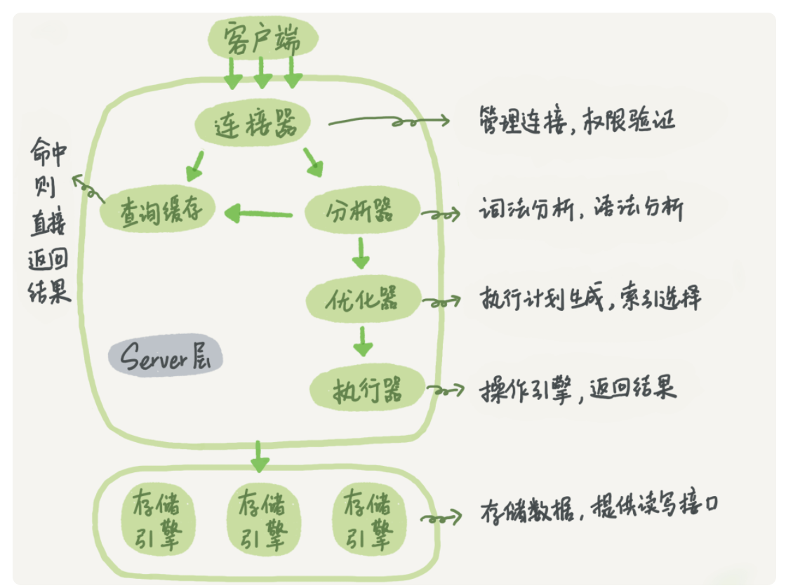

众所周知，MySQL采用存储计算分离，分为 Server 层和存储引擎层两部分。

从图可知，Server 层包括连接器、查询缓存、分析器、优化器、执行器等，涵盖 MySQL 的大多数核心服务功能，以及所有的内置函数（如日期、时间、数学和加密函数等），所有跨存储引擎的功能都在这一层实现，比如存储过程、触发器、视图等。

而存储引擎层负责数据的存储和提取。其架构模式是插件式的，支持 InnoDB、MyISAM、Memory 等多个存储引擎。

现在从 MySQL 5.5.5 版本开始成为了默认存储引擎是InnoDB，意味着 create table 建表的时候，如果不指定引擎类型，默认使用的就是 InnoDB。

不过，你也可以通过指定存储引擎的类型来选择别的引擎，比如在 create table 语句中使用 engine=memory, 来指定使用内存引擎创建表。不同存储引擎的表数据存取方式不同，支持的功能也不同，在后面的文章中，我们会讨论到引擎的选择。

接下来重点熟悉下MySQL 以及 InnoDB 在执行sql会遇到哪些组件或者模块。后面我会出篇内容索引方便大家从0到1的复习。

可能网上各位大神有比较多相似文章（比如一条sql的流畅是什么样的），它只是本文的一些子内容；毕竟MySQL涉及到比较多的日志模块；


#### 连接器

第一步，你会先连接到这个数据库上，这时候接待你的就是连接器。连接器负责跟客户端建立连接、获取权限、维持和管理连接。

我们一般用对应语言进行链接（比如JDBC），当然官网也提供的连接命令一般是这么写的：

```
mysql -h$ip -P$port -u$user -p
```

输完命令之后，你就需要在交互对话里面输入密码。虽然密码也可以直接跟在 -p 后面写在命令行中，但这样可能会导致你的密码泄露。

在完成经典的 TCP 握手后，连接器就要开始认证你的身份，这个时候用的就是你输入的用户名和密码。

如果用户名或密码不对，你就会收到一个"Access denied for user"的错误，然后客户端程序结束执行。如果用户名密码认证通过，连接器会到权限表里面查出你拥有的权限。

之后，这个连接里面的权限判断逻辑，都将依赖于此时读到的权限。

> 可能有人会问：
>
> 一个用户成功建立连接后，此时用管理员账号对这个用户的权限做了修改，也不会影响已经存在连接的权限。
>
> 修改完成后，只有再新建的连接才会使用新的权限设置。
>
> 连接完成后，如果你没有后续的动作，这个连接就处于空闲状态，你可以在 show processlist 命令中看到它，其中的 Command 列显示为“Sleep”的这一行，就表示现在系统里面有一个空闲连接。

客户端如果太长时间没动静，连接器就会自动将它断开。这个时间是由参数 wait_timeout 控制的，默认值是 8 小时。

如果在连接被断开之后，客户端再次发送请求的话，就会收到一个错误提醒： Lost connection to MySQL server during query。这时候如果你要继续，就需要重连，然后再执行请求了。

数据库里面，长连接是指连接成功后，如果客户端持续有请求，则一直使用同一个连接。

短连接则是指每次执行完很少的几次查询就断开连接，下次查询再重新建立一个。建立连接的过程通常是比较复杂的，所以我建议你在使用中要尽量减少建立连接的动作，也就是尽量使用长连接。

**但是**全部使用长连接后，有些时候 MySQL 占用内存涨得特别快，这是因为 MySQL 在执行过程中临时使用的内存是管理在连接对象里面的。

这些资源会在连接断开的时候才释放。所以如果长连接累积下来，可能导致内存占用太大，被系统强行杀掉（OOM），从现象看就是 MySQL 异常重启了。

怎么解决这个问题呢？你可以考虑以下两种方案。

> 1、定期断开长连接。使用一段时间，或者程序里面判断执行过一个占用内存的大查询后，断开连接，之后要查询再重连。
>
> 2、如果你用的是 MySQL 5.7 或更新版本，可以在每次执行一个比较大的操作后，通过执行 mysql_reset_connection 来重新初始化连接资源。这个过程不需要重连和重新做权限验证，但是会将连接恢复到刚刚创建完时的状态。
>
> 3、更多的是我们使用框架连接MySQL的url有参数来控制连接有效性；


#### 查询缓存

连接建立完成后，你就可以执行 select 语句了。

执行逻辑就会来到第二步：查询缓存。

MySQL 拿到一个查询请求后，会先到查询缓存看看，之前是不是执行过这条语句。

之前执行过的语句及其结果可能会以 key-value 对的形式，被直接缓存在内存中。

key 是查询的语句，value 是查询的结果。如果你的查询能够直接在这个缓存中找到 key，那么这个 value 就会被直接返回给客户端。如果语句不在查询缓存中，就会继续后面的执行阶段。执行完成后，执行结果会被存入查询缓存中。

你可以看到，如果查询命中缓存，MySQL 不需要执行后面的复杂操作，就可以直接返回结果，这个效率会很高。

> 需要注意的是，

但是大多数情况下我会建议你不要使用查询缓存，为什么呢？因为查询缓存往往弊大于利。

> 1。缓存需要语句完全相等，包括参数。
>
> 2。表更新后就会失效 因此，只有在表更新频率不高，查询语句完全一致的情况下，可以手动开启缓存，其他一律关闭。
>
> 注意：这个缓存要主动开启，在最新的版本是有废弃的现象。特别是mysql8之后，取消了缓存功能。


#### 分析器

首先，MySQL 需要知道你要做什么，因此需要对 SQL 语句做解析。

> 简单来说，这条要从哪里取出什么数据，
>
> 会像高级编程语言编译器的职责一样，词法分析、语义分析

分析器先会做“词法分析”。你输入的是由多个字符串和空格组成的一条 SQL 语句，MySQL 需要识别出里面的字符串分别是什么，代表什么。

MySQL 从你输入的"select"这个关键字识别出来，这是一个查询语句。它也要把字符串“T”识别成“表名 T”，把字符串“ID”识别成“列 ID”。

做完了这些识别以后，就要做“语法分析”。根据词法分析的结果，语法分析器会根据语法规则，判断你输入的这个 SQL 语句是否满足 MySQL 语法。

如果你的语句不对，就会收到`“You have an error in your SQL syntax”`的错误提醒，比如下面这个语句 select 少打了开头的字母“s”。

```
mysql> select * from t1 where ID=1;

ERROR 1064 (42000): You have an error in your SQL syntax; check the manual that corresponds to your MySQL server version for the right syntax to use near 'select * from t1 where ID=1' at line 1
```

一般语法错误会提示第一个出现错误的位置，所以你要关注的是紧接“use near”的内容。

> 分析器：
>
> 1.识别传进来的字符串
>
> 2.根据传进来的字符串用语法规则进行判断
>
> 3.如果有错误，将会收到You have an error in your SQL syntax的报错


#### 优化器

经过了分析器，在开始执行之前，还要先经过优化器的处理。

> 一条sql执行的方法有比较多，此时优化器作用会寻找相对优解（不一定百分百对）

优化器是在表里面有多个索引的时候，决定使用哪个索引；或者在一个语句有多表关联（join）的时候，决定各个表的连接顺序。

比如你执行下面这样的语句，这个语句是执行两个表的 join：

```
mysql> select * from t1 join t2 using(ID)  where t1.c=10 and t2.d=20;
```

既可以先从表 t1 里面取出 c=10 的记录的 ID 值，再根据 ID 值关联到表 t2，再判断 t2 里面 d 的值是否等于 20。也可以先从表 t2 里面取出 d=20 的记录的 ID 值，再根据 ID 值关联到 t1，再判断 t1 里面 c 的值是否等于 10。

这两种执行方法的逻辑结果是一样的，但是执行的效率会有不同，而优化器的作用就是决定选择使用哪一个方案。

> 如果连接字段没有索引的话，先将t1表的c=10的行和t2表b=20的进行全表扫描，得到小的数据放入到join_buffer中，然后全表扫描另外一张表，将其和内存中的行进行匹配

优化器阶段完成后，这个语句的执行方案就确定下来了，然后进入执行器阶段。


#### 执行器

MySQL 通过优化器知道了该怎么做，于是就进入了执行器阶段，开始执行语句。

开始执行的时候，

要先判断一下你对这个表 T 有没有执行查询的权限，如果没有，就会返回没有权限的错误，

如下所示 (在工程实现上，如果命中查询缓存，会在查询缓存返回结果的时候，做权限验证。查询也会在优化器之前调用 precheck 验证权限)。

```
mysql> select * from T where ID=10;
ERROR 1142 (42000): SELECT command denied to user 'b'@'localhost' for table 'T'
```

如果有权限，就打开表继续执行。

打开表的时候，执行器就会根据表的引擎定义，去使用这个引擎提供的接口。

比如我们这个例子中的表 T 中，ID 字段没有索引，那么执行器的执行流程是这样的：

1、调用 InnoDB 引擎接口取这个表的第一行，判断 ID 值是不是 10，如果不是则跳过，如果是则将这行存在结果集中；

2、调用引擎接口取“下一行”，重复相同的判断逻辑，直到取到这个表的最后一行。

3、执行器将上述遍历过程中所有满足条件的行组成的记录集作为结果集返回给客户端。

至此，这个语句就执行完成了。

> 对于有索引的表，执行的逻辑也差不多。
>
> 第一次调用的是“取满足条件的第一行”这个接口，之后循环取“满足条件的下一行”这个接口，这些接口都是引擎中已经定义好的。

你会在数据库的慢查询日志中看到一个 rows_examined 的字段，表示这个语句执行过程中扫描了多少行。

> 这个值就是在执行器每次调用引擎获取数据行的时候累加的。
>
> 在有些场景下，执行器调用一次，在引擎内部则扫描了多行，因此引擎扫描行数跟 rows_examined 并不是完全相同的。


### 日志模块

MySQL 整体来看，其实就有两块：

一块是 Server 层，它主要做的是 MySQL 功能层面的事情；

还有一块是引擎层，负责存储相关的具体事宜。

redo log 是 InnoDB 引擎特有的日志，而 Server 层也有自己的日志，称为 binlog（归档日志）。

为什么会有两份日志呢？

因为最开始 MySQL 里并没有 InnoDB 引擎。MySQL 自带的引擎是 MyISAM，但是 MyISAM 没有 crash-safe 的能力，binlog 日志只能用于归档。

而 InnoDB 是另一个公司以插件形式引入 MySQL 的，既然只依靠 binlog 是没有 crash-safe 能力的，所以 InnoDB 使用另外一套日志系统——也就是 redo log 来实现 crash-safe 能力。

这两种日志有以下三点不同。

我们知道，在MySQL中还存在binlog(二进制日志)也可以记录写操作并用于数据的恢复，但二者是有着根本的不同的：

（1）作用不同：redo log是用于crash recovery的，保证MySQL宕机也不会影响持久性；binlog是用于point-in-time recovery的，保证服务器可以基于时间点恢复数据，此外binlog还用于主从复制。

（2）层次不同：redo log是InnoDB存储引擎实现的，而binlog是MySQL的服务器层(可以参考文章前面对MySQL逻辑架构的介绍)实现的，同时支持InnoDB和其他存储引擎。

（3）内容不同：redo log是物理日志，内容基于磁盘的Page；binlog的内容是二进制的，根据binlog_format参数的不同，可能基于sql语句、基于数据本身或者二者的混合。

（4）写入时机不同：binlog在事务提交时写入；redo log的写入时机相对多元：

- 前面曾提到：当事务提交时会调用fsync对redo log进行刷盘；这是默认情况下的策略，修改innodb_flush_log_at_trx_commit参数可以改变该策略，但事务的持久性将无法保证。
- 除了事务提交时，还有其他刷盘时机：如master thread每秒刷盘一次redo log等，这样的好处是不一定要等到commit时刷盘，commit速度大大加快。


#### binlog 作用

当需要恢复到指定的某一秒时，比如某天下午两点发现中午十二点有一次误删表，需要找回数据，那你可以这么做：

首先，找到最近的一次全量备份，如果你运气好，可能就是昨天晚上的一个备份，从这个备份恢复到临时库；

然后，从备份的时间点开始，将备份的 binlog 依次取出来，重放到中午误删表之前的那个时刻。


#### 更新流程

来看执行器和 InnoDB 引擎在执行这个简单的 update 语句时的内部流程。

1、执行器先找引擎取 ID=2 这一行。ID 是主键，引擎直接用树搜索找到这一行。如果 ID=2 这一行所在的数据页本来就在内存中，就直接返回给执行器；否则，需要先从磁盘读入内存，然后再返回。

2、执行器拿到引擎给的行数据，把这个值加上 1，比如原来是 N，现在就是 N+1，得到新的一行数据，再调用引擎接口写入这行新数据。

3、引擎将这行新数据更新到内存中，同时将这个更新操作记录到 redo log 里面，此时 redo log 处于 prepare 状态。然后告知执行器执行完成了，随时可以提交事务。

4、执行器生成这个操作的 binlog，并把 binlog 写入磁盘。执行器调用引擎的提交事务接口，引擎把刚刚写入的 redo log 改成提交（commit）状态，更新完成。


#### 两阶段提交

最后三步看上去有点“绕”，将 redo log 的写入拆成了两个步骤：prepare 和 commit，这就是"两阶段提交"。

为什么必须有“两阶段提交”呢？这是为了让两份日志之间的逻辑一致。

binlog 会记录所有的逻辑操作，并且是采用“追加写”的形式。

如果你的 DBA 承诺说半个月内可以恢复，那么备份系统中一定会保存最近半个月的所有 binlog，同时系统会定期做整库备份。这里的“定期”取决于系统的重要性，可以是一天一备，也可以是一周一备。

由于 redo log 和 binlog 是两个独立的逻辑，如果不用两阶段提交，要么就是先写完 redo log 再写 binlog，或者采用反过来的顺序。我们看看这两种方式会有什么问题。

仍然用前面的 update 语句来做例子。假设当前 ID=2 的行，字段 c 的值是 0，再假设执行 update 语句过程中在写完第一个日志后，第二个日志还没有写完期间发生了 crash，会出现什么情况呢？

1、先写 redo log 后写 binlog。假设在 redo log 写完，binlog 还没有写完的时候，MySQL 进程异常重启。由于我们前面说过的，redo log 写完之后，系统即使崩溃，仍然能够把数据恢复回来，所以恢复后这一行 c 的值是 1。但是由于 binlog 没写完就 crash 了，这时候 binlog 里面就没有记录这个语句。因此，之后备份日志的时候，存起来的 binlog 里面就没有这条语句。然后你会发现，如果需要用这个 binlog 来恢复临时库的话，由于这个语句的 binlog 丢失，这个临时库就会少了这一次更新，恢复出来的这一行 c 的值就是 0，与原库的值不同。

2、先写 binlog 后写 redo log。如果在 binlog 写完之后 crash，由于 redo log 还没写，崩溃恢复以后这个事务无效，所以这一行 c 的值是 0。但是 binlog 里面已经记录了“把 c 从 0 改成 1”这个日志。所以，在之后用 binlog 来恢复的时候就多了一个事务出来，恢复出来的这一行 c 的值就是 1，与原库的值不同。


#### 恢复过程

恢复的时候的大致步骤可能如下，摘取下来仅供做设计思想的参考：

Step1. 按顺序扫描redolog，如果redolog中的事务既有prepare标识，又有commit标识，就直接提交（复制redolog disk中的数据页到磁盘数据页）

Step2 .如果redolog事务只有prepare标识，没有commit标识，则说明当前事务在commit阶段crash了，binlog中当前事务是否完整未可知，此时拿着redolog中当前事务的XID（redolog和binlog中事务落盘的标识），去查看binlog中是否存在此XID

 a. 如果binlog中有当前事务的XID，则提交事务（复制redolog disk中的数据页到磁盘数据页）

 b. 如果binlog中没有当前事务的XID，则回滚事务（使用undolog来删除redolog中的对应事务）

------

 


## MySQL 深入了解Innodb存储引擎的架构

### 序

本文主要通过mysql的主要架构设计，来普及下主要知识点，为接下来系列学习mysql更深次做普及如事物实现、B+ tree index 相关实现等；


### 一、innodb 架构


```
注：图片来自 mysql官方文档，8.0版本，InnoDB Architecture
```

mysql的InnoDB存储引擎架构，包括了内存架构和磁盘架构两部分。

其中，内存架构部分包括：

- 缓冲池（Buffer Poll）

- 修改缓冲区（Change Buffer）

- 自适应hash索引（Adaptive Hash Index）

- 日志缓冲区（Log Buffer）

磁盘架构包括：

- 表
- 索引
- 表空间
- 双写缓冲区(Doublewrite Buffer)
- 重做日志(Redo Log)
- 撤销日志(Undo Logs)


### 二、内存架构

#### 缓冲池（Buffer Poll）


缓冲池是InnoDB位于主存储器中的一片区域，用于缓存访问过的表和索引数据。缓冲池允许直接从内存处理频繁使用的数据，这加快了处理速度。在专用服务器上，通常高达80%的物理内存会分配给缓冲池。

为了提高大容量读操作的效率，缓冲池被分割成一个个可以容纳多行的页(pages)，缓冲池被实现成页的链表结构，即使用了一种从缓存中淘汰的变体LRU算法。

了解如何利用缓冲池将频繁访问的数据保存在内存中，是MySQL调优的一个重要方面。

> 关于图上所示该缓存出现了3/8、5/8对LRU的升级，其中因素有：
>
> 1、防止突发的冷数据挤占热数据；
>
> 2、冷数据多次读写才能升级成热数据；



#### 修改缓冲区


>  **修改缓冲区**是一个特殊的数据结构，用于缓存不在**缓冲池**中的那些二级索引页的变更。

由`insert、 update、delete`这些dml操作导致被缓存的变化，将在当这些页被其他读操作加载到缓冲池后合并，此时知道哪些change后进行WAL到redo log中。


#### 自适应hash索引

 自适应散列索引特性，使InnoDB在具有适当的负载组合和充足的缓冲池内存的系统上，执行得更像内存数据库，而不会牺牲事务特性或可靠性。

自适应hash索引需要注意一些点：

> 1、自适应哈希索引特性通过变量: innodb_adaptive_hash_index开启，
>
> 2、或在服务启动时通过--skip-innodb-adaptive-hash-index参数关闭。
>
> 3、hash索引是使用索引key的前缀来创建的，前缀可以是任意长度，并且可能只有B树中的一些值出现在哈希索引中。
>
> 4、哈希索引是根据需要为经常访问的索引页构建的。一般不会用到它。


#### 日志缓冲

> 日志缓冲区是保存即将写入磁盘上日志文件的数据的内存区域。

> 日志缓冲区大小由变量innodb_log_buffer_size定义。默认的大小是16MB。

日志缓冲区的内容定期刷新到磁盘（后面会出一片缓存与日志模块的刷脏过程），大的日志缓冲区能够在事务提交前无需写入redo日志数据到磁盘的情况下执行大事务。

可以通过一些参数来减少磁盘I/O：

> innodb_flush_log_at_trx_commit变量控制日志缓冲区的内容如果写入并刷新到磁盘。
>
> innodb_flush_log_at_timeout变量控制日志刷新频率。


### 三、磁盘架构

#### 表

- 创建InnoDB表
  - 即我们常用的create table t.... 会在InnoDB引擎内建表。
- 创建外表：
  - 有点类似hive。创建外表（即在数据目录之外建表）有几种不同的原因，例如：空间管理、I/O优化，或在具有特定性能或容量特征的存储设备上存放表，例如InnoDB支持下列方法来创建外表：
  - 使用DATA DIRECTORY语句（指定数据目录）`CREATE TABLE t1 (c1 INT PRIMARY KEY) DATA DIRECTORY = '/external/directory';`
  - 使用CREATE TABLE ... TABLESPACE语法；`CREATE TABLE t2 (c1 INT PRIMARY KEY) TABLESPACE = innodb_file_per_table DATA DIRECTORY = '/external/directory';`
  - 在外部通用表空间上建表
- 导入InnoDB表

- 移动或拷贝InnoDB表

- 将表从MyISAM转换为InnoDB

- InnoDB中的自动增量处理


#### 索引

包括：

- 聚簇索引和二级索引

- InnoDB索引的物理结构

- 排序索引生成

- InnoDB全文索引


#### 表空间

InnoDB中包含多种表空间，列举如下：

- 系统表空间（The System Tablespace）

- File-Per-Table Tablespaces

- 通用表空间（General Tablespaces）

- Undo表空间（Undo Tablespaces）

- 临时表空间（Temporary Tablespaces）

- Server离线时移动表空间文件

- 禁用表空间路径验证

- Linux系统表空间分配优化

- 表空间AUTOEXTEND_SIZE参数设置


#### 双写缓冲区（doublewrite buffer）

双写缓冲区（doublewrite buffer）是一个存储区域，InnoDB在将页面写入InnoDB数据文件中的适当位置之前，会在其中写入从缓冲池中刷新的页面。

> double write技术innodb为解决页断裂(partial write)问题而生，
>
> 所谓页断裂是数据库宕机时(OS重启，或主机掉电重启)，数据库页面只有部分写入磁盘，导致页面出现不一致的情况。
>
> 数据库，OS和磁盘读写的基本单位是块，也可以称之为(page size)block size。
>
> 我们知道数据库的块一般为8K，**16K**；
>
> 而OS的块则一般为**4K**；
>
> IO块则更小，linux内核要求IO block size<=OS block size。
>
> 磁盘IO除了IO block size，还有一个概念是扇区(IO sector)，扇区是磁盘物理操作的基本单位，而IO 块是磁盘操作的逻辑单位，一个IO块对应一个或多个扇区，扇区大小一般为**512个字节**。

尽管数据被写入两次，但双写缓冲区不需要两倍的I/O开销或两倍的I/O操作。

数据通过一次fsync()函数调用，在一个大的顺序块写入doublewrite缓冲区（除非`innodb_flush_method`被设置为`O_DIRECT_NO_FSYNC`）。

MySQL 8.0.20版本之前，双写缓冲区存储空间归属于InnoDB的系统表空间。MySQL 8.0.20开始，双写表空间存储区域放在了双写文件中。


#### 重做日志（redo log）

重做日志（redo log）是一种基于磁盘的数据结构，用于在崩溃恢复期间更正由不完整事务写入的数据。

在正常的操作中，重做日志对SQL语句或低级API调用产生的更改表数据的请求进行编码。在意外关闭之前未完成数据文件更新的修改，将在初始化期间和接受连接之前自动重放。

默认情况下，重做日志在磁盘上的物理标识是名为`ib_logfile0` 和 `ib_logfile1`的两个文件。

MySQL以循环方式写入重做日志文件。重做日志中的数据按照受影响的记录进行编码，这些数据统称为重做。重做日志的数据传递由不断增加的LSN值表示。

总结：重做日志，用于实现事务的持久性，即ACID中的D。

redo日志在存储体现上也由两部分组成：

- 内存中的重做日志缓冲（redo log buffer）：因为内存中是缓存，所以是易失的，server挂掉或机器断点等原因导致宕机后丢失；
- 重做日志文件（redo log file）：在磁盘上默认是两个文件存储。循环写入。


#### 撤销日志（undo log）

撤销日志（undo log）是与单个读写事务相关联的撤消日志记录的集合。撤消日志记录包含有关如何撤消事务对聚集索引记录的最新更改的信息。

如果另一个事务需要将原始数据视为一致读取操作的一部分，则会从撤消日志记录中检索未修改的数据。撤消日志存在于撤消日志段中，而撤消日志段包含在回滚段中。回滚段驻留在undo表空间和全局临时表空间中。

驻留在全局临时表空间中的撤消日志，用于用户定义的临时表中修改数据的事务。这些撤消日志不是重做日志，因为崩溃恢复不需要它们。它们仅用于服务器运行时的回滚。这种类型的撤消日志通过避免重做日志I/O而提高了性能。

总结：redo日志记录事务的行为，用于对页进行“重做”操作。但我们都知道事务还有rollback动作，回滚时需要undo，利用其信息把数据回滚到修改之前。undo是逻辑日志，只是将数据库逻辑地恢复到原来的样子，但数据结构和页本身在回滚之后可能大不相同。

另外，undo还有一个作用，就是在MVCC中提供快照。这需要借助一个名为history list的结构，把undo log组织成一个链表：


#### binlog

二进制日志，用于进行POINT-IN-TIME（PIT）恢复及主从复制（Replication）。与redo log区别：

（1）redo log是InnoDB存储引擎层产生的，而 binlog是Mysql数据库上层产生的；binlog不仅仅针对InnoDB引擎，MySQL数据库中的任何存储引擎对数据库的更改都会产生binlog。

（2）内容形式。binlog是一种逻辑日志，记录的是SQL语句。而InnoDB存储引擎层面的redo log是物理格式日志，记录的是对每个页的修改

（3）写入时间点：binlog只在事务提交完成后进行一次写入，而redo log在事务进行中不断被写入，表现：日志并不是随事务提交的顺序进行写入的。如下图所示：


我们知道，在MySQL中还存在binlog(二进制日志)也可以记录写操作并用于数据的恢复，但二者是有着根本的不同的：

（1）作用不同：redo log是用于crash recovery的，保证MySQL宕机也不会影响持久性；binlog是用于point-in-time recovery的，保证服务器可以基于时间点恢复数据，此外binlog还用于主从复制。

（2）层次不同：redo log是InnoDB存储引擎实现的，而binlog是MySQL的服务器层(可以参考文章前面对MySQL逻辑架构的介绍)实现的，同时支持InnoDB和其他存储引擎。

（3）内容不同：redo log是物理日志，内容基于磁盘的Page；binlog的内容是二进制的，根据binlog_format参数的不同，可能基于sql语句、基于数据本身或者二者的混合。

（4）写入时机不同：binlog在事务提交时写入；redo log的写入时机相对多元：

- 前面曾提到：当事务提交时会调用fsync对redo log进行刷盘；这是默认情况下的策略，修改innodb_flush_log_at_trx_commit参数可以改变该策略，但事务的持久性将无法保证。
- 除了事务提交时，还有其他刷盘时机：如master thread每秒刷盘一次redo log等，这样的好处是不一定要等到commit时刷盘，commit速度大大加快。


#### redo log 与doublewrite buffer 联系

我们知道，数据库异常重启时，自身有异常恢复机制，主流数据库恢复基本原理类似：

第一阶段，重做redo日志，恢复数据页和undo页到异常crash时的状态；

第二阶段，根据undo页的内容，回滚没有提交事务的修改。通过两个阶段保证了数据库的一致性。

对于mysql而言，在第一阶段，若出现页断裂问题，则无法通过重做redo日志恢复，进而导致恢复中断，数据库不一致。

> 什么是页断裂？
>
> 见本文的doublewrite buffer 章节。

这里大家可能会有疑问，数据库的redo不是记录了所有的变更，并且是物理的吗？

> 理论上来说，无论页面是否断裂，从上一个检查点对应的redo位置开始，一直重做redo，页面自然能恢复到正常状态。
>
> 发生页断裂后，对于利用纯物理日志实现redo的数据库不受影响，因为每一条redo日志完全不依赖物理页的状态，并且是幂等的(执行一次与N次，结果是一样的)。
>
> 另外要说明一点，redo日志的页大小一般设计为512个字节，因此redo日志页本身不会发生页断裂。
>
> 而逻辑物理日志则不行，比如修改页头信息，页内记录数加1，slot信息修改等都依赖于页面处于一个一致状态，否则就无法正确重做redo。而mysql正是采用这种日志类型，所以发生页面断裂时，异常恢复就会出现问题，需要借助于double write技术来辅助处理。

doublewrite是Innodb表空间内部分配的一片缓冲区，一般double write包含128个页，对于pagesize为16k的页，总共2MB，doublewrite页与数据页一样有物理存储空间，存在于共享表空间中。

Innodb在写出缓冲区中的数据页时采用的是一次写多个页的方式，这样多个页就可以先顺序写入到doublewrite缓冲区，并调用fsync()保证这些数据被写出到磁盘，然后数据页才被写出到它们实际的存储位置并再次调用fsync()。

故障恢复时Innodb检查doublewrite缓冲区与数据页原存储位置的内容：

> 若doublewrite页处于页断裂状态，则简单的丢弃；
>
> 若数据页不一致，则会从doublewrite页还原。

由于doublewrite页落盘与数据页落盘在不同的时间点，不会出现doublewrite页和数据页同时发生断裂的情况，因此doublewrite技术可以解决页断裂问题，进而保证了重做日志能顺利进行，数据库能恢复到一致的状态。


------


## MySQL 基本常识，站在常规面试角度总结

### 存储过程

#### 优点：

- 能够将代码封装起来
- 保存在数据库之中
- 让编程语言进行调用
- 存储过程是一个预编译的代码块，执行效率比较高
- 一个存储过程替代大量T_SQL语句 ，可以降低网络通信量，提高通信速率

#### 缺点：

- 每个数据库的存储过程语法几乎都不一样，十分难以维护（不通用）
- 业务逻辑放在数据库上，难以迭代


### 三范式

> 第一范式（1NF）：数据库表中的字段都是单一属性的，不可再分。这个单一属性由基本类型构成，包括整型、实数、字符型、逻辑型、日期型等。
>
> 第二范式（2NF）：数据库表中不存在非关键字段对任一候选关键字段的部分函数依赖（部分函数依赖指的是存在组合关键字中的某些字段决定非关键字段的情况），也即所有非关键字段都完全依赖于任意一组候选关键字。
>
> 第三范式（3NF）：在第二范式的基础上，数据表中如果不存在非关键字段对任一候选关键字段的传递函数依赖则符合第三范式。所谓传递函数依赖，指的是如果存在"A → B → C"的决定关系，则C传递函数依赖于A。因此，满足第三范式的数据库表应该不存在如下依赖关系： 关键字段 → 非关键字段x → 非关键字段y


### 视图

视图是一种基于数据表的一种**虚表**

- 视图是一种虚表
- 视图建立在已有表的基础上, 视图赖以建立的这些表称为基表
- **向视图提供数据内容的语句为 SELECT 语句,可以将视图理解为存储起来的 SELECT 语句**
- 视图向用户提供基表数据的另一种表现形式
- 视图没有存储真正的数据，真正的数据还是存储在基表中
- 程序员虽然操作的是视图，但最终视图还会转成操作基表
- 一个基表可以有0个或多个视图


### drop、delete与truncate

我们来对比一下他们的区别：

#### drop table

- 1)属于DDL
- 2)不可回滚
- 3)不可带where
- 4)表内容和结构删除
- 5)删除速度快

#### truncate table

- 1)属于DDL
- 2)不可回滚
- 3)不可带where
- 4)表内容删除
- 5)删除速度快

#### delete from

- 1)属于DML
- 2)可回滚
- 3)可带where
- 4)表结构在，表内容要看where执行的情况
- 5)删除速度慢,需要逐行删除
- 不再需要一张表的时候，用drop
- 想删除部分数据行时候，用delete，并且带上where子句
- 保留表而删除所有数据的时候用truncate


### 索引

什么是索引【Index】

- 是一种快速查询表中内容的机制，类似于新华字典的目录
- 运用在表中某个些字段上，但存储时，独立于表之外

#### rowid的特点

- 位于每个表中，但表面上看不见，例如：desc emp是看不见的
- 只有在select中，显示写出rowid，方可看见
- 它与每个表绑定在一起，表亡，该表的rowid亡，二张表rownum可以相同，但rowid必须是唯一的
- rowid是18位大小写加数字混杂体，唯一表代该条记录在DBF文件中的位置
- rowid可以参与=/like比较时，用''单引号将rowid的值包起来，且区分大小写
- rowid是联系表与DBF文件的桥梁

#### 索引的特点

- （1）索引一旦建立, DB管理系统会对其进行自动维护, 而且由DB管理系统决定何时使用索引
- （2）用户不用在查询语句中指定使用哪个索引
- （3）在定义primary key或unique约束后系统自动在相应的列上创建索引
- （4）用户也能按自己的需求，对指定单个字段或多个字段，添加索引

##### 什么时候【要】创建索引

- （1）表经常进行 SELECT 操作
- （2）表很大(记录超多)，记录内容分布范围很广
- （3）列名经常在 WHERE 子句或连接条件中出现

##### 什么时候【不要】创建索引

- （1）表经常进行 INSERT/UPDATE/DELETE 操作
- （2）表很小(记录超少)
- （3）列名不经常作为连接条件或出现在 WHERE 子句中

#### 索引优缺点：

- 索引加快数据库的检索速度
- 索引降低了插入、删除、修改等维护任务的速度(虽然索引可以提高查询速度，但是它们也会导致数据库系统更新数据的性能下降，**因为大部分数据更新需要同时更新索引**)
- 唯一索引可以确保每一行数据的唯一性，通过使用索引，可以在查询的过程中使用优化隐藏器，提高系统的性能
- 索引需要占物理和数据空间

#### 索引分类：

- **唯一索引**：唯一索引不允许两行具有相同的索引值
- **主键索引**：为表定义一个主键将自动创建主键索引，主键索引是唯一索引的特殊类型。主键索引要求主键中的每个值是唯一的，并且不能为空
- **聚集索引**(Clustered)：表中各行的物理顺序与键值的逻辑（索引）顺序相同，每个表只能有一个
- **非聚集索引**(Non-clustered)：非聚集索引指定表的逻辑顺序。数据存储在一个位置，索引存储在另一个位置，索引中包含指向数据存储位置的指针。可以有多个，小于249个

------


### 事务

事务简单来说：**一个Session中所进行所有的操作，要么同时成功，要么同时失败**

**ACID — 数据库事务正确执行的四个基本要素**

- 包含：原子性（Atomicity）
- 一致性（Consistency）
- 隔离性（Isolation）
- 持久性（Durability）

#### 事务隔离级别

数据库定义了4个隔离级别：

1. Serializable【可避免脏读，不可重复读，虚读】
2. Repeatable read【可避免脏读，不可重复读】
3. Read committed【可避免脏读】
4. Read uncommitted【级别最低，什么都避免不了】

分别对应Connection类中的4个常量

1. **TRANSACTION_READ_UNCOMMITTED**
2. **TRANSACTION_READ_COMMITTED**
3. **TRANSACTION_REPEATABLE_READ**
4. **TRANSACTION_SERIALIZABLE**

具体想深入了解[spring事务](../../java/spring/Spring事务管理详解.md)

脏读：**一个事务读取到另外一个事务未提交的数据**

例子：A向B转账，**A执行了转账语句，但A还没有提交事务，B读取数据，发现自己账户钱变多了**！B跟A说，我已经收到钱了。A回滚事务【rollback】，等B再查看账户的钱时，发现钱并没有多。

------

不可重复读：**一个事务读取到另外一个事务已经提交的数据，也就是说一个事务可以看到其他事务所做的修改**

注：**A查询数据库得到数据，B去修改数据库的数据，导致A多次查询数据库的结果都不一样【危害：A每次查询的结果都是受B的影响的，那么A查询出来的信息就没有意思了】**

------

虚读(幻读)：**是指在一个事务内读取到了别的事务插入的数据，导致前后读取不一致。**

注：**和不可重复读类似，但虚读(幻读)会读到其他事务的插入的数据，导致前后读取不一致**


### 乐观锁和悲观锁

确保在多个事务同时存取数据库中同一数据时不破坏事务的隔离性和统一性以及数据库的统一性，**乐观锁和悲观锁是并发控制主要采用的技术手段。**

- 悲观锁：假定会发生并发冲突，屏蔽一切可能违反数据完整性的操作
  - **在查询完数据的时候就把事务锁起来，直到提交事务**
  - 实现方式：使用数据库中的锁机制
- 乐观锁：假设不会发生并发冲突，只在提交操作时检查是否违反数据完整性。
  - **在修改数据的时候把事务锁起来，通过version的方式来进行锁定**
  - 实现方式：使用version版本或者时间戳


### 超键、候选键、主键、外键

**超键**：**在关系中能唯一标识元组的属性集称为关系模式的超键**。一个属性可以为作为一个超键，多个属性组合在一起也可以作为一个超键。**超键包含候选键和主键**。

**候选键(候选码)：是最小超键，即没有冗余元素的超键**。

**主键(主码)：数据库表中对储存数据对象予以唯一和完整标识的数据列或属性的组合**。一个数据列只能有一个主键，且主键的取值不能缺失，即不能为空值（Null）。

**外键：在一个表中存在的另一个表的主键称此表的外键**。


### SQL 约束

- NOT NULL: 用于控制字段的内容一定不能为空（NULL）。
- UNIQUE: 控件字段内容不能重复，一个表允许有多个 Unique 约束。
- PRIMARY KEY: 也是用于控件字段内容不能重复，但它在一个表只允许出现一个。
- FOREIGN KEY: 用于预防破坏表之间连接的动作，也能防止非法数据插入外键列，因为它必须是它指向的那个表中的值之一。
- CHECK: 用于控制字段的值范围。


### 防止数据库数据的丢失

在archivelog mode(归档模式)只要其归档日志文件不丢失，就可以有效地防止数据丢失。

延伸意思，日志不但但是错误日志，还有binlog等


### Mysql的存储引擎

常用的存储引擎有以下：

- **Innodb引擎**，Innodb引擎提供了对数据库ACID事务的支持。并且还提供了行级锁和外键的约束。它的设计的目标就是处理大数据容量的数据库系统。
- **MyIASM引擎**(原本Mysql的默认引擎),不提供事务的支持，也不支持行级锁和外键。
- **MEMORY引擎**：所有的数据都在内存中，数据的处理速度快，但是安全性不高。

更多的[了解Mysql的存储引擎](../../db/mysql/MySQL之MYISAM和INODB.md)


### 数据表损坏的修复方式

使用 myisamchk 来修复，具体步骤：

- 1）修复前将mysql服务停止。
- 2）打开命令行方式，然后进入到mysql的/bin目录。
- 3）执行myisamchk –recover 数据库所在路径/*.MYI

使用repair table 或者 OPTIMIZE table命令来修复，REPAIR TABLE table_name 修复表 OPTIMIZE TABLE table_name 优化表 REPAIR TABLE 用于修复被破坏的表。 OPTIMIZE TABLE 用于回收闲置的数据库空间，当表上的数据行被删除时，所占据的磁盘空间并没有立即被回收，使用了OPTIMIZE TABLE命令后这些空间将被回收，并且对磁盘上的数据行进行重排（注意：是磁盘上，而非数据库）

------


# 进阶篇

## MySQL order by 那些有趣的事儿

### 背景

在职业生涯中，关于mysql order by线上的问题有一些，其中关键的点就是 explain sql出现的`filesort` （被几个半桶水说成有慢sql问题），还有在某些老业务mysql低版本出现的数据重复问题。再加上自己对这块模棱两可就深入下总结；


### 概念

排序是数据库中的一个基本功能，MySQL也不例外。用户通过Order by语句即能达到将指定的结果集排序的目的，其实不仅仅是Order by语句，Group by语句，Distinct语句都会隐含使用排序。

> 本文首先会简单介绍SQL如何利用索引避免排序代价，
>
> 然后会介绍MySQL实现排序的内部原理，并介绍与排序相关的参数，
>
> 最后会给出几个“奇怪”排序例子，来谈谈排序一致性问题，并说明产生现象的本质原因。


### 排序优化与索引使用

 为了优化SQL语句的排序性能，最好的情况是避免排序，合理利用索引是一个不错的方法。因为索引本身也是有序的，如果在需要排序的字段上面建立了合适的索引，那么就可以跳过排序的过程，提高SQL的查询速度。

下面我通过一些典型的SQL来说明哪些SQL可以利用索引减少排序，哪些SQL不能。

假设t1表存在索引key1(key_part1,key_part2),key2(key2)

- a.可以利用索引避免排序的SQL

```
SELECT * FROM t1 ORDER BY key_part1,key_part2;

SELECT * FROM t1 WHERE key_part1 = constant ORDER BY key_part2;

SELECT * FROM t1 WHERE key_part1 > constant ORDER BY key_part1 ASC;

SELECT * FROM t1 WHERE key_part1 = constant1 AND key_part2 > constant2 ORDER BY key_part2;
```

- b.不能利用索引避免排序的SQL

```
//排序字段在多个索引中，无法使用索引排序
SELECT * FROM t1 ORDER BY key_part1,key_part2, key2;

//排序键顺序与索引中列顺序不一致，无法使用索引排序
SELECT * FROM t1 ORDER BY key_part2, key_part1;

//升降序不一致，无法使用索引排序
SELECT * FROM t1 ORDER BY key_part1 DESC, key_part2 ASC;

//key_part1是范围查询，key_part2无法使用索引排序
SELECT * FROM t1 WHERE key_part1> constant ORDER BY key_part2;
```


### 排序实现的算法

 对于不能利用索引避免排序的SQL，数据库不得不自己实现排序功能以满足用户需求，此时SQL的执行计划中会出现“Using filesort”，这里需要注意的是filesort并不意味着就是文件排序，其实也有可能是内存排序，这个主要由sort_buffer_size参数与结果集大小确定。

MySQL内部实现排序主要有3种方式，常规排序、优化排序和优先队列排序，

主要涉及3种排序算法：快速排序、归并排序和堆排序。

假设表结构和SQL语句如下：

```
CREATE TABLE t1(id int, col1 varchar(64), col2 varchar(64), col3 varchar(64), PRIMARY KEY(id),key(col1,col2));

SELECT col1,col2,col3 FROM t1 WHERE col1>100 ORDER BY col2;
```


#### 常规排序

(1).从表t1中获取满足WHERE条件的记录

(2).对于每条记录，将记录的主键+排序键(id,col2)取出放入sort buffer

(3).如果sort buffer可以存放所有满足条件的(id,col2)对，则进行排序；否则sort buffer满后，进行排序并固化到临时文件中。(排序算法采用的是快速排序算法)

(4).若排序中产生了临时文件，需要利用归并排序算法，保证临时文件中记录是有序的

(5).循环执行上述过程，直到所有满足条件的记录全部参与排序

(6).扫描排好序的(id,col2)对，并利用id去捞取SELECT需要返回的列(col1,col2,col3)

(7).将获取的结果集返回给用户。

 从上述流程来看，是否使用文件排序主要看sort buffer是否能容下需要排序的(id,col2)对，这个buffer的大小由s`ort_buffer_size`参数控制。

此外一次排序需要两次IO，一次是捞(id,col2),第二次是捞(col1,col2,col3)，由于返回的结果集是按col2排序，因此id是乱序的，通过乱序的id去捞(col1,col2,col3)时会产生大量的随机IO。

对于第二次MySQL本身一个优化，即在捞之前首先将id排序，并放入缓冲区，这个缓存区大小由参数`read_rnd_buffer_size`控制，然后有序去捞记录，将随机IO转为顺序IO。


#### 优化排序

 常规排序方式除了排序本身，还需要额外两次IO。优化的排序方式相对于常规排序，减少了第二次IO。主要区别在于，放入sort buffer不是(id,col2),而是(col1,col2,col3)。由于sort buffer中包含了查询需要的所有字段，因此排序完成后可以直接返回，无需二次捞数据。这种方式的代价在于，同样大小的sort buffer，能存放的(col1,col2,col3)数目要小于(id,col2)，如果sort buffer不够大，可能导致需要写临时文件，造成额外的IO。当然MySQL提供了参数max_length_for_sort_data，只有当排序元组小于max_length_for_sort_data时，才能利用优化排序方式，否则只能用常规排序方式。


#### 优先队列排序

 为了得到最终的排序结果，无论怎样，我们都需要将所有满足条件的记录进行排序才能返回。那么相对于优化排序方式，是否还有优化空间呢？5.6版本针对Order by limit M，N语句，在空间层面做了优化，加入了一种新的排序方式--优先队列，这种方式采用堆排序实现。

堆排序算法特征正好可以解limit M，N 这类排序的问题，虽然仍然需要所有元素参与排序，但是只需要M+N个元组的sort buffer空间即可，对于M，N很小的场景，基本不会因为sort buffer不够而导致需要临时文件进行归并排序的问题。对于升序，采用大顶堆，最终堆中的元素组成了最小的N个元素，对于降序，采用小顶堆，最终堆中的元素组成了最大的N的元素。


### 线上问题案例

#### 环境准备

环境准备（我是单独在ec2部署的）(本地电脑跳过)：

> yum remove docker
> docker-client
> docker-client-latest
> docker-common
> docker-latest
> docker-latest-logrotate
> docker-logrotate
> docker-engine
>
> yum-config-manager
> --add-repo
> https://mirrors.aliyun.com/docker-ce/linux/centos/docker-ce.repo
>
> sudo yum install docker-ce docker-ce-cli containerd.io docker-compose-plugin

配置国内镜像源(本地电脑跳过)：

> [root@iZwz9hxarfzj17lx1c3ameZ ~]# sudo tee /etc/docker/daemon.json <<-'EOF'
>
> > { "registry-mirrors": ["https://3tgljxkm.mirror.aliyuncs.com"] } EOF { "registry-mirrors": ["https://3tgljxkm.mirror.aliyuncs.com"] }
> >
> > [root@iZwz9hxarfzj17lx1c3ameZ ~]# sudo systemctl daemon-reload [root@iZwz9hxarfzj17lx1c3ameZ ~]# sudo systemctl restart docker [root@iZwz9hxarfzj17lx1c3ameZ ~]# [root@iZwz9hxarfzj17lx1c3ameZ ~]# docker info

// 启动测试mysql

```
docker run -p 3306:3306 --privileged=true -v ~/docker/mysql/test:/var/lib/mysql:rw --name ydMysql -e MYSQL_ROOT_PASSWORD=yd_mysql -d mysql:5.6
```

// 创建测试库：

> [root@iZwz9hxarfzj17lx1c3ameZ ~]# sudo docker exec -it ydMysql /bin/bash root@2864a8307e2b:/# mysql -uroot -pyd_mysql mysql> CREATE DATABASE IF NOT EXISTS test DEFAULT CHARACTER SET utf8mb4 -> ; Query OK, 1 row affected (0.00 sec)
>
> mysql> use test; Database changed


#### Mysql从5.5迁移到5.6以后，发现分页出现了重复值

测试表与数据准备：

> mysql> create table t1(id int primary key, c1 int, c2 varchar(128)); Query OK, 0 rows affected (0.01 sec)
>
> mysql> insert into t1 values(1,1,'a'); Query OK, 1 row affected (0.01 sec)
>
> mysql> insert into t1 values(2,2,'b'); Query OK, 1 row affected (0.00 sec)
>
> mysql> insert into t1 values(3,2,'c'); Query OK, 1 row affected (0.00 sec)
>
> mysql> insert into t1 values(4,2,'d'); Query OK, 1 row affected (0.01 sec)
>
> mysql> insert into t1 values(5,3,'e'); Query OK, 1 row affected (0.00 sec)
>
> mysql> insert into t1 values(6,4,'f'); Query OK, 1 row affected (0.00 sec)
>
> mysql> insert into t1 values(7,5,'g'); Query OK, 1 row affected (0.00 sec)

// 分页查询重复


现象分析：

我们可以看到 id为4的这条记录居然同时出现在两次查询中，这明显是不符合预期的，而且在5.5版本中没有这个问题。

产生这个现象的原因就是5.6针对limit M,N的语句采用了优先队列，而优先队列采用堆实现，

比如上述的例子order by c1 asc limit 0，3 需要采用大小为3的大顶堆；limit 3，3需要采用大小为6的大顶堆。

由于c1为2的记录有3条，而堆排序是非稳定的(对于相同的key值，无法保证排序后与排序前的位置一致)，所以导致分页重复的现象。

为了避免这个问题，我们可以在排序中加上唯一值，比如主键id，这样由于id是唯一的，确保参与排序的key值不相同。将SQL写成如下：

> select * from t1 order by c1,id asc limit 0,3; select * from t1 order by c1,id asc limit 3,3;


#### 两个类似的查询语句，除了返回列不同，其它都相同，但排序的结果不一致。

测试表与数据：

> create table t2(id int primary key, status int, c1 varchar(255),c2 varchar(255),c3 varchar(255),key(c1)); insert into t2 values(7,1,'a',repeat('b',255),repeat('c',255)); insert into t2 values(6,2,'b',repeat('b',255),repeat('c',255)); insert into t2 values(5,2,'c',repeat('b',255),repeat('c',255)); insert into t2 values(4,2,'a',repeat('b',255),repeat('c',255)); insert into t2 values(3,3,'b',repeat('b',255),repeat('c',255)); insert into t2 values(2,4,'c',repeat('b',255),repeat('c',255)); insert into t2 values(1,5,'a',repeat('b',255),repeat('c',255));

分别执行SQL语句：

> select id,status,c1,c2 from t2 force index(c1) where c1>='b' order by status; select id,status from t2 force index(c1) where c1>='b' order by status;

执行结果如下：


> 本来select id,status from t2 force index(c1) where c1>='b' order by status;
>
> 应该是 5 和 6 是反的，当时线上DMP发生了这种，当时忘记了截图，后面重试也不行。
>
> mysql> select id,status from t2 force index(c1) where c1>='b' order by status; +----+--------+ | id | status | +----+--------+ | 6 | 2 | | 5 | 2 | | 3 | 3 | | 2 | 4 | +----+--------+ 4 rows in set (0.00 sec)

看看两者的执行计划是否相同：

> explain select id,status,c1,c2 from t2 force index(c1) where c1>='b' order by status;
>
> explain select id,status from t2 force index(c1) where c1>='b' order by status;

> mysql> explain select id,status,c1,c2 from t2 force index(c1) where c1>='b' order by status; +----+-------------+-------+-------+---------------+------+---------+------+------+-----------------------------+ | id | select_type | table | type | possible_keys | key | key_len | ref | rows | Extra | +----+-------------+-------+-------+---------------+------+---------+------+------+-----------------------------+ | 1 | SIMPLE | t2 | range | c1 | c1 | 767 | NULL | 4 | Using where; Using filesort | +----+-------------+-------+-------+---------------+------+---------+------+------+-----------------------------+ 1 row in set (0.00 sec)
>
> mysql> explain select id,status from t2 force index(c1) where c1>='b' order by status; +----+-------------+-------+-------+---------------+------+---------+------+------+-----------------------------+ | id | select_type | table | type | possible_keys | key | key_len | ref | rows | Extra | +----+-------------+-------+-------+---------------+------+---------+------+------+-----------------------------+ | 1 | SIMPLE | t2 | range | c1 | c1 | 767 | NULL | 4 | Using where; Using filesort | +----+-------------+-------+-------+---------------+------+---------+------+------+-----------------------------+ 1 row in set (0.00 sec)

分析：

为了说明问题，我在语句中加了force index的hint，确保能走上c1列索引。语句通过c1列索引捞取id，然后去表中捞取返回的列。

根据c1列值的大小，记录在c1索引中的相对位置如下：

(c1,id)===(b,6),(b,3),(5,c),(c,2)，对应的status值分别为2 3 2 4。

从表中捞取数据并按status排序，则相对位置变为(6,2,b),(5,2,c),(3,3,c),(2,4,c)，这就是第二条语句查询返回的结果，那么为什么第一条查询语句(6,2,b),(5,2,c)是调换顺序的呢？

这里要看上面提到的**常规排序和优化排序**中的部分，就可以明白原因了。

由于第一条查询返回的列的字节数超过了max_length_for_sort_data，导致排序采用的是常规排序，而在这种情况下MYSQL将rowid排序，将随机IO转为顺序IO，所以返回的是5在前，6在后；而第二条查询采用的是优化排序，没有第二次捞取数据的过程，保持了排序后记录的相对位置。

对于第一条语句，若想采用优化排序，我们将max_length_for_sort_data设置调大即可，比如2048。


### 留几个问题

*可以通过公众号一起交流／留言。*

Q1：排序实现的地方是在MySQL Server 还是存储层实现的？

Q2：你认为最新版本如 `>= MySQL 8.0` 会有上面案例出现低级问题吗？为什么？

Q3：对于问题2 `两个类似的查询语句，除了返回列不同，其它都相同，但排序的结果不一致` ，大家有碰到过吗？

------


## MySQL 如何更优雅的删除表数据

### 背景

我的数据库占用空间太大，我把一个最大的表删掉了一半的数据，怎么表文件的大小还是没变？

一个 InnoDB 表包含两部分，即：表结构定义和数据。在 MySQL 8.0 版本以前，表结构是存在以.frm 为后缀的文件里。而 MySQL 8.0 版本，则已经允许把表结构定义放在系统数据表中了。因为表结构定义占用的空间很小，所以主要讨论的是表数据。

我们在删除整个表的时候，可以使用 drop table 命令回收表空间。但是，我们遇到的更多的删除数据的场景是删除某些行；


### 删除数据的几种方式

常见有drop、 truncate 、delete 这几种方式，接下来我们讨论的范围是删除表。

#### 相同点：

- truncate和不带where子句的delete、以及drop都会删除表内的数据。
- drop、truncate都是DDL语句(数据定义语言),执行后会自动提交。

#### 不同点：

- truncate 和 delete 只删除数据不删除表的结构(定义) drop 语句将删除表的结构被依赖的约束(constrain)、触发器(trigger)、索引(index)；依赖于该表的存储过程/函数将保留,但是变为 invalid 状态。
- delete 语句是数据库操作语言(dml)，这个操作会放到 rollback segement 中，事务提交之后才生效；如果有相应的 trigger，执行的时候将被触发。
  - truncate、drop 是数据库定义语言(ddl)，操作立即生效，原数据不放到 rollback segment 中，不能回滚，操作不触发 trigger。
- delete 语句不影响表所占用的 extent，高水线(high watermark)保持原位置不动 drop 语句将表所占用的空间全部释放。
  - truncate 语句缺省情况下见空间释放到 minextents个 extent，除非使用reuse storage；truncate 会将高水线复位(回到最开始)。
- 速度，一般来说: drop> truncate > delete
- 安全性：小心使用 drop 和 truncate，尤其没有备份的时候.否则哭都来不及
  - 使用上,想删除部分数据行用 delete，注意带上where子句. 回滚段要足够大. 想删除表,当然用 drop 想保留表而将所有数据删除，如果和事务无关，用truncate即可。如果和事务有关,或者想触发trigger,还是用delete。 如果是整理表内部的碎片，可以用truncate跟上reuse stroage，再重新导入/插入数据。
- delete是DML语句,不会自动提交。drop/truncate都是DDL语句,执行后会自动提交。
- TRUNCATE TABLE 在功能上与不带 WHERE 子句的 DELETE 语句相同：二者均删除表中的全部行。
  - 但 TRUNCATE TABLE 比 DELETE 速度快，且使用的系统和事务日志资源少。DELETE 语句每次删除一行，并在事务日志中为所删除的每行记录一项。TRUNCATE TABLE 通过释放存储表数据所用的数据页来删除数据，并且只在事务日志中记录页的释放。
- TRUNCATE TABLE 删除表中的所有行，但表结构及其列、约束、索引等保持不变。
  - 新行标识所用的计数值重置为该列的种子。如果想保留标识计数值，请改用 DELETE。如果要删除表定义及其数据，请使用 DROP TABLE 语句。
- 对于由 FOREIGN KEY 约束引用的表，不能使用 TRUNCATE TABLE，而应使用不带 WHERE 子句的 DELETE 语句。
  - 由于 TRUNCATE TABLE 不记录在日志中，所以它不能激活触发器。
- TRUNCATE TABLE 不能用于参与了索引视图的表。


### 正确回收空间

#### innodb_file_per_table

表数据既可以存在共享表空间里，也可以是单独的文件。

这个行为是由参数 innodb_file_per_table 控制的：

> 这个参数设置为 OFF 表示的是，表的数据放在系统共享表空间，也就是跟数据字典放在一起；
>
> 这个参数设置为 ON 表示的是，每个 InnoDB 表数据存储在一个以 .ibd 为后缀的文件中。

从 MySQL 5.6.6 版本开始，它的默认值就是 ON 了。

我建议你不论使用 MySQL 的哪个版本，都将这个值设置为 ON。

因为，一个表单独存储为一个文件更容易管理，而且在你不需要这个表的时候，通过 drop table 命令，系统就会直接删除这个文件。而如果是放在共享表空间中，即使表删掉了，空间也是不会回收的。


#### 数据删除流程

InnoDB 里的数据都是用 B+ 树的结构组织的。自带主键锁+双向链表；

我们要删掉 ID=4 这个记录，InnoDB 引擎只会把 ID=4 这个记录标记为删除。如果之后要再插入一个 ID 在 2和 6之间的记录时，可能会复用这个位置。但是，磁盘文件的大小并不会缩小。

> 那么如果我们删掉了一个数据页上的所有记录，会怎么样？
>
> 整个数据页就可以被复用了。

> 数据页的复用跟记录的复用是不同的。
>
> 记录的复用，只限于符合范围条件的数据。比如上面的这个例子，ID=4 这条记录被删除后，如果插入一个 ID 是 4的行，可以直接复用这个空间。但如果插入的是一个 ID 是 8的行，就不能复用这个位置了。

而当整个页从 B+ 树里面摘掉以后，可以复用到任何位置。以图 1 为例，如果将数据页 page A 上的所有记录删除以后，page A 会被标记为可复用。这时候如果要插入一条 ID=50 的记录需要使用新页的时候，page A 是可以被复用的。

如果相邻的两个数据页利用率都很小，系统就会把这两个页上的数据合到其中一个页上，另外一个数据页就被标记为可复用。

如果我们用 delete 命令把整个表的数据删除呢？结果就是，所有的数据页都会被标记为可复用。但是磁盘上，文件不会变小。

delete 命令其实只是把记录的位置，或者数据页标记为了“可复用”，但磁盘文件的大小是不会变的。也就是说，通过 delete 命令是不能回收表空间的。这些可以复用，而没有被使用的空间，看起来就像是“空洞”。

不止是删除数据会造成空洞，插入数据也会。

如果数据是按照索引递增顺序插入的，那么索引是紧凑的。但如果数据是随机插入的，就可能造成索引的数据页分裂。

另外，更新索引上的值，可以理解为删除一个旧的值，再插入一个新值。不难理解，这也是会造成空洞的。

经过大量增删改的表，都是可能是存在空洞的。所以，如果能够把这些空洞去掉，就能达到收缩表空间的目的。

而重建表，就可以达到这样的目的。


#### 重建表

你可以使用 alter table A engine=InnoDB 命令来重建表。

> 在 MySQL 5.5 版本之前，这个命令的执行流程区别只是这个临时表 B 不需要你自己创建，MySQL 会自动完成转存数据、交换表名、删除旧表的操作。
>
> 花时间最多的步骤是往临时表插入数据的过程，如果在这个过程中，有新的数据要写入到表 A 的话，就会造成数据丢失。因此，在整个 DDL 过程中，表 A 中不能有更新。也就是说，这个 DDL 不是 Online 的。

> MySQL 5.6 版本开始引入的 Online DDL，对这个操作流程做了优化。
>
> 建立一个临时文件，扫描表 A 主键的所有数据页；
>
> 用数据页中表 A 的记录生成 B+ 树，存储到临时文件中；
>
> 生成临时文件的过程中，将所有对 A 的操作记录在一个日志文件（row log）中，对应的是图中 state2 的状态；
>
> 临时文件生成后，将日志文件中的操作应用到临时文件，得到一个逻辑数据上与表 A 相同的数据文件，对应的就是图中 state3 的状态；
>
> 用临时文件替换表 A 的数据文件。

DDL 之前是要拿 MDL 写锁的，这样还能叫 Online DDL 吗？

alter 语句在启动的时候需要获取 MDL 写锁，但是这个写锁在真正拷贝数据之前就退化成读锁了。

为什么要退化呢？为了实现 Online，MDL 读锁不会阻塞增删改操作。

Online DDL 其实是会先获取MDL写锁, 再退化成MDL读锁；但MDL写锁持有时间比较短，所以可以称为Online； 而MDL读锁，不阻止数据增删查改，但会阻止其它线程修改表结构；

根据表 A 重建出来的数据是放在“tmp_file”里的，这个临时文件是 InnoDB 在内部创建出来的。整个 DDL 过程都在 InnoDB 内部完成。

对于 server 层来说，没有把数据挪动到临时表，是一个“原地”操作，这就是“**inplace**”名称的来源。

在存储引擎中实现，对于server端来说，无感知，这种方式叫做inplace;

如果你有一个 1TB 的表，现在磁盘间是 1.2TB，能不能做一个 inplace 的 DDL 呢？

答案是不能。因为，tmp_file 也是要占用临时空间的。

inplace 跟 Online 是不是就是一个意思？

DDL 的方式就两种，一种是COPY，一种是INPLACE。

mysql 5.6之前是 COPY 方式，mysql5.6引入 online，整个过程在引擎内部完成，对于 server 层没有创建临时表，就是 Inplace 方式。

所以，如果DDL过程是 online 的，那么一定是 Inplace 方式。反之不一定，比如添加全文索引

> 如何查看是否需要重建便呢。
>
> 可以通过show table [from|in db_name] status like '%table_name%'命令查看表的容量的信息
>
> 通过 Data_length 、Rows、Avg_row_length 计算碎片的大小： 碎片大小 = 数据总大小 - 实际表空间文件大小 数据总大小 = Data_length
>
> 实际表空间文件大小 = rows * Avg_row_length 碎片大小（M） = (Data_length - （rows * Avg_row_length）) / 1024 /1024

optimize table、analyze table 和 alter table 这三种方式重建表的区别

optimize table：重建表 analyze table：重新对表的索引信息统计 optimize table：optimize table + analyze table

> Q:假设现在有人碰到了一个“想要收缩表空间，结果适得其反”的情况，看上去是这样的：一个表 t 文件大小为 1TB；对这个表执行 alter table t engine=InnoDB；发现执行完成后，空间不仅没变小，还稍微大了一点儿，比如变成了 1.01TB。
>
> A：在重建表的时候，InnoDB 不会把整张表占满，每个页留了 1/16 给后续的更新用。也就是说，其实重建表之后不是“最”紧凑的。


### 留几个问题

Q1：假设你哪天想**删库跑路**，你觉得网上说的方法可行性吗？为什么？

Q2：你认为删库和删表，有哪些底层上的不同？

------


## MySQL 一文讲透explain，再也不用翻其它资料

### 1.简介

 使用EXPLAIN关键字可以模拟优化器执行SQL查询语句，从而知道MySQL是如何处理你的SQL语句的。分析你的查询语句或是表结构的性能瓶颈。

 在日常工作中，我们会有时会开慢查询去记录一些执行时间比较久的SQL语句，找出这些SQL语句并不意味着完事了，有时我们常常用到explain这个命令来查看一个这些SQL语句的执行计划。

 官网地址：https://dev.mysql.com/doc/refman/8.0/en/explain-output.html

 测试版本：8.0.26


#### 1.1 explain的主要作用

 1、表的读取顺序

 2、数据读取操作的操作类型

 3、哪些索引可以使用

 4、哪些索引被实际使用

 5、表之间的引用

 6、每张表有多少行被优化器查询


#### 1.2 SQL执行顺序

 下面是一条完成的sql：

```mysql
select distinct 
        <select_list>
from
    <left_table><join_type>
join <right_table> on <join_condition>
where
    <where_condition>
group by
    <group_by_list>
having
    <having_condition>
order by
    <order_by_condition>
limit <limit number>
```

执行顺序：

```
1、from <left_table><join_type>
2、on <join_condition>
3、<join_type> join <right_table>
4、where <where_condition>
5、group by <group_by_list>
6、having <having_condition>
7、select
8、distinct <select_list>
9、order by <order_by_condition>
10、limit <limit_number>
```

Sql执行步骤：

- 第一步：首先对from子句中的前两个表执行一个笛卡尔乘积，此时生成虚拟表 vt1（选择相对小的表做基础表）。

- 第二步：接下来便是应用on筛选器，on 中的逻辑表达式将应用到 vt1 中的各个行，筛选出满足on逻辑表达式的行，生成虚拟表 vt2 。



- 第三步：如果是outer join 那么这一步就将添加外部行，left outer jion 就把左表在第二步中过滤的添加进来，如果是right outer join 那么就将右表在第二步中过滤掉的行添加进来，这样生成虚拟表 vt3 。



- 第四步：如果 from 子句中的表数目多于两个表，那么就将vt3和第三个表连接从而计算笛卡尔乘积，生成虚拟表，该过程就是一个重复1-3的步骤，最终得到一个新的虚拟表 vt3。



- 第五步：应用where筛选器，对上一步生产的虚拟表引用where筛选器，生成虚拟表vt4，在这有个比较重要的细节不得不说一下，对于包含outer join子句的查询，就有一个让人感到困惑的问题，到底在on筛选器还是用where筛选器指定逻辑表达式呢？

on和where的最大区别在于，如果在on应用逻辑表达式那么在第三步outer join中还可以把移除的行再次添加回来，而where的移除的最终的。

> 举个简单的例子：
>
> 有一个学生表（班级,姓名）和一个成绩表(姓名,成绩)，我现在需要返回一个x班级的全体同学的成绩，但是这个班级有几个学生缺考，也就是说在成绩表中没有记录。
>
> 为了得到我们预期的结果我们就需要在on子句指定学生和成绩表的关系（学生.姓名=成绩.姓名）那么我们是否发现在执行第二步的时候，对于没有参加考试的学生记录就不会出现在vt2中，
>
> 因为他们被on的逻辑表达式过滤掉了,但是我们用left outer join就可以把左表（学生）中没有参加考试的学生找回来，
>
> 因为我们想返回的是x班级的所有学生，如果在on中应用学生.班级='x'的话，left outer join会把x班级的所有学生记录找回，所以只能在where筛选器中应用学生.班级='x' 因为它的过滤是最终的。



- 第六步：group by 子句将中的唯一的值组合成为一组，得到虚拟表vt5。如果应用了group by，那么后面的所有步骤都只能得到的vt5的列或者是聚合函数（count、sum、avg等）。原因在于最终的结果集中只为每个组包含一行。这一点请牢记。



- 第七步：应用cube或者rollup选项，为vt5生成超组，生成vt6.



- 第八步：应用having筛选器，生成vt7。having筛选器是第一个也是为唯一一个应用到已分组数据的筛选器。



- 第九步：处理select子句。将vt7中的在select中出现的列筛选出来。生成vt8.



- 第十步：应用distinct子句，vt8中移除相同的行，生成vt9。事实上如果应用了group by子句那么distinct是多余的，原因同样在于，分组的时候是将列中唯一的值分成一组，同时只为每一组返回一行记录，那么所以的记录都将是不相同的。



- 第十一步：应用order by子句。按照order_by_condition排序vt9，此时返回的一个游标，而不是虚拟表。sql是基于集合的理论的，集合不会预先对他的行排序，它只是成员的逻辑集合，成员的顺序是无关紧要的。对表进行排序的查询可以返回一个对象，这个对象包含特定的物理顺序的逻辑组织。这个对象就叫游标。正因为返回值是游标，那么使用order by 子句查询不能应用于表表达式。排序是很需要成本的，除非你必须要排序，否则最好不要指定order by，最后，在这一步中是第一个也是唯一一个可以使用select列表中别名的步骤。



- 第十二步：应用top选项。此时才返回结果给请求者即用户。


### 2.使用

在select语句前加上explain便可以进行分析，比如有如下sql语句：

```
explain select * from emp where name = 'tengyi';
```

执行结果：

结果中各个字段是什么意思呢？这里先贴出一个表格进行总述：

| 信息          | 描述                                                         |
| ------------- | ------------------------------------------------------------ |
| id            | 查询的序号，包含一组数字，表示查询中执行select子句或操作表的顺序**两种情况**id相同，执行顺序从上往下id不同，id值越大，优先级越高，越先执行 |
| select_type   | 查询类型，主要用于区别普通查询，联合查询，子查询等的复杂查询1、simple ——简单的select查询，查询中不包含子查询或者UNION2、primary ——查询中若包含任何复杂的子部分，最外层查询被标记3、subquery——在select或where列表中包含了子查询4、derived——在from列表中包含的子查询被标记为derived（衍生），MySQL会递归执行这些子查询，把结果放到临时表中5、union——如果第二个select出现在UNION之后，则被标记为UNION，如果union包含在from子句的子查询中，外层select被标记为derived6、union result:UNION 的结果 |
| table         | 输出的行所引用的表                                           |
| type          | 显示联结类型，显示查询使用了何种类型，按照从最佳到最坏类型排序 1、system：表中仅有一行（=系统表）这是const联结类型的一个特例。 2、const：表示通过索引一次就找到，const用于比较primary key或者unique索引。因为只匹配一行数据，所以如果将主键置于where列表中，mysql能将该查询转换为一个常量3、eq_ref:唯一性索引扫描，对于每个索引键，表中只有一条记录与之匹配。常见于唯一索引或者主键扫描 4、ref:非唯一性索引扫描，返回匹配某个单独值的所有行，本质上也是一种索引访问，它返回所有匹配某个单独值的行，可能会找多个符合条件的行，属于查找和扫描的混合体 5、range:只检索给定范围的行，使用一个索引来选择行。key列显示使用了哪个索引，一般就是where语句中出现了between,in等范围的查询。这种范围扫描索引扫描比全表扫描要好，因为它开始于索引的某一个点，而结束另一个点，不用全表扫描 6、index:index 与all区别为index类型只遍历索引树。通常比all快，因为索引文件比数据文件小很多。 7、all：遍历全表以找到匹配的行注意:一般保证查询至少达到range级别，最好能达到ref。 |
| possible_keys | 指出MySQL能使用哪个索引在该表中找到行                        |
| key           | 显示MySQL实际决定使用的键(索引)。如果没有选择索引,键是NULL。查询中如果使用覆盖索引，则该索引和查询的select字段重叠。 |
| key_len       | 表示索引中使用的字节数，该列计算查询中使用的索引的长度在不损失精度的情况下，长度越短越好。如果键是NULL,则长度为NULL。该字段显示为索引字段的最大可能长度，并非实际使用长度。 |
| ref           | 显示索引的哪一列被使用了，如果有可能是一个常数，哪些列或常量被用于查询索引列上的值 |
| rows          | 根据表统计信息以及索引选用情况，大致估算出找到所需的记录所需要读取的行数 |
| Extra         | 包含不适合在其他列中显示，但是十分重要的额外信息 1、Using filesort：说明mysql会对数据适用一个外部的索引排序。而不是按照表内的索引顺序进行读取。MySQL中无法利用索引完成排序操作称为“文件排序” 2、Using temporary:使用了临时表保存中间结果，mysql在查询结果排序时使用临时表。常见于排序order by和分组查询group by。 3、Using index:表示相应的select操作用使用覆盖索引，避免访问了表的数据行。如果同时出现using where，表名索引被用来执行索引键值的查找；如果没有同时出现using where，表名索引用来读取数据而非执行查询动作。 4、Using where :表明使用where过滤 5、using join buffer:使用了连接缓存 6、impossible where:where子句的值总是false，不能用来获取任何元组 7、select tables optimized away：在没有group by子句的情况下，基于索引优化Min、max操作或者对于MyISAM存储引擎优化count（*），不必等到执行阶段再进行计算，查询执行计划生成的阶段即完成优化。 8、distinct：优化distinct操作，在找到第一匹配的元组后即停止找同样值的动作。 |
| filtered      | 显示了通过条件过滤出的行数的百分比估计值                     |



文中用到的建表语句：

```
create table course(
cid int(3),
cname varchar(20),
tid int(3)
);
create table teacher(
tid int(3),
tname varchar(20),
tcid int(3)
);
create table teacherCard(
tcid int(3),
tcdesc varchar(200)
);
insert into course values(1,'java',1);
insert into course values(2,'html',1);
insert into course values(3,'sql',2);
insert into course values(4,'web',3);

insert into teacher values(1,'tz',1);
insert into teacher values(2,'tw',2);
insert into teacher values(3,'tl',3);

insert into teacherCard values(1,'tezdesc');
insert into teacherCard values(2,'twdesc');
insert into teacherCard values(3,'tldesc');
```



查询课程编号为2或教师证编号为3的老师信息：

```
select t.* from teacher t,course c,teacherCard tc where t.tid = c.tid and t.tcid = tc.tcid and (c.cid = 2 or tc.tcid = 3);

explain select t.* from teacher t,course c,teacherCard tc where t.tid = c.tid and t.tcid = tc.tcid and (c.cid = 2 or tc.tcid = 3);
```



```
mysql> explain select t.* from teacher t,course c,teacherCard tc where t.tid = c.tid and t.tcid = tc.tcid and (c.cid = 2 or tc.tcid = 3);
+----+-------------+-------+------------+------+---------------+------+---------+------+------+----------+--------------------------------------------+
| id | select_type | table | partitions | type | possible_keys | key  | key_len | ref  | rows | filtered | Extra                                      |
+----+-------------+-------+------------+------+---------------+------+---------+------+------+----------+--------------------------------------------+
|  1 | SIMPLE      | t     | NULL       | ALL  | NULL          | NULL | NULL    | NULL |    3 |   100.00 | NULL                                       |
|  1 | SIMPLE      | tc    | NULL       | ALL  | NULL          | NULL | NULL    | NULL |    3 |    33.33 | Using where; Using join buffer (hash join) |
|  1 | SIMPLE      | c     | NULL       | ALL  | NULL          | NULL | NULL    | NULL |    4 |    25.00 | Using where; Using join buffer (hash join) |
+----+-------------+-------+------------+------+---------------+------+---------+------+------+----------+--------------------------------------------+
3 rows in set, 1 warning (0.00 sec)
```



#### 2.1 id

**（1） id值相同，从上往下顺序执行。**--t3-tc3-c4

```
insert into teacher values(4,'ta',4);
insert into teacher values(5,'tb',5);
insert into teacher values(6,'tc',6);
explain select t.* from teacher t,course c,teacherCard tc where t.tid = c.tid and t.tcid = tc.tcid and (c.cid = 2 or tc.tcid = 3);
//tc3-t6-c4
mysql> insert into teacher values(4,'ta',4);
Query OK, 1 row affected (0.00 sec)

mysql> insert into teacher values(5,'tb',5);
Query OK, 1 row affected (0.00 sec)

mysql> insert into teacher values(6,'tc',6);
Query OK, 1 row affected (0.01 sec)

mysql> explain select t.* from teacher t,course c,teacherCard tc where t.tid = c.tid and t.tcid = tc.tcid and (c.cid = 2 or tc.tcid = 3);
+----+-------------+-------+------------+------+---------------+------+---------+------+------+----------+--------------------------------------------+
| id | select_type | table | partitions | type | possible_keys | key  | key_len | ref  | rows | filtered | Extra                                      |
+----+-------------+-------+------------+------+---------------+------+---------+------+------+----------+--------------------------------------------+
|  1 | SIMPLE      | tc    | NULL       | ALL  | NULL          | NULL | NULL    | NULL |    3 |   100.00 | NULL                                       |
|  1 | SIMPLE      | t     | NULL       | ALL  | NULL          | NULL | NULL    | NULL |    6 |    16.67 | Using where; Using join buffer (hash join) |
|  1 | SIMPLE      | c     | NULL       | ALL  | NULL          | NULL | NULL    | NULL |    4 |    25.00 | Using where; Using join buffer (hash join) |
+----+-------------+-------+------------+------+---------------+------+---------+------+------+----------+--------------------------------------------+
3 rows in set, 1 warning (0.00 sec)
```



表的执行顺序会根据数据量的改变而改变。原因是：比较笛卡尔积的大小。—小的先执行。

--笛卡尔积的元素是元组，关系A和B的笛卡尔积可以记为(AXB)，如果A为a目，B为b目，那么A和B的笛卡尔积为(a+b)列、(a*b)行的元组集合。

--简单解释一下笛卡尔积：

比如有两个集合A和B。

A = {0,1} B = {2,3,4}

集合 A×B 和 B×A的结果集就可以分别表示为以下这种形式：

A×B = {（0，2），（1，2），（0，3），（1，3），（0，4），（1，4）}；

B×A = {（2，0），（2，1），（3，0），（3，1），（4，0），（4，1）}；

以上A×B和B×A的结果就可以叫做两个集合相乘的‘笛卡尔积’。

从以上的数据分析我们可以得出以下两点结论：

1，两个集合相乘，不满足交换率，既 A×B ≠ B×A;

2，A集合和B集合相乘，包含了集合A中元素和集合B中元素相结合的所有的可能性。既两个集合相乘得到的新集合的元素个数是 A集合的元素个数 × B集合的元素个数;



验证：

```
delete from course where cid>2;
explain select t.* from teacher t,course c,teacherCard tc where t.tid = c.tid and t.tcid = tc.tcid and (c.cid = 2 or tc.tcid = 3);
mysql> delete from course where cid>2;
Query OK, 2 rows affected (0.00 sec)

mysql> explain select t.* from teacher t,course c,teacherCard tc where t.tid = c.tid and t.tcid = tc.tcid and (c.cid = 2 or tc.tcid = 3);
+----+-------------+-------+------------+------+---------------+------+---------+------+------+----------+--------------------------------------------+
| id | select_type | table | partitions | type | possible_keys | key  | key_len | ref  | rows | filtered | Extra                                      |
+----+-------------+-------+------------+------+---------------+------+---------+------+------+----------+--------------------------------------------+
|  1 | SIMPLE      | c     | NULL       | ALL  | NULL          | NULL | NULL    | NULL |    2 |   100.00 | NULL                                       |
|  1 | SIMPLE      | t     | NULL       | ALL  | NULL          | NULL | NULL    | NULL |    6 |    16.67 | Using where; Using join buffer (hash join) |
|  1 | SIMPLE      | tc    | NULL       | ALL  | NULL          | NULL | NULL    | NULL |    3 |    33.33 | Using where; Using join buffer (hash join) |
+----+-------------+-------+------------+------+---------------+------+---------+------+------+----------+--------------------------------------------+
3 rows in set, 1 warning (0.01 sec)
```

**（2） id值不同，id值越大月优先查询（本质：在嵌套子查询时，先查内层，再差外层）**

查询教授SQL课程的老师的描述（desc）

```
explain select tc.tcdesc from teacherCard tc,course c,teacher t where c.tid = t.tid and t.tcid = tc.tcid and c.cname = 'sql';
//c-t-tc
```

将以上多表查询改成子查询形式：

```
explain select tc.tcdesc from teacherCard tc where tc.tcid = (select t.tcid from teacher t where t.tid = (select c.tid from course c where cname = 'sql'));
mysql> explain select tc.tcdesc from teacherCard tc,course c,teacher t where c.tid = t.tid and t.tcid = tc.tcid and c.cname = 'sql';
+----+-------------+-------+------------+------+---------------+------+---------+------+------+----------+--------------------------------------------+
| id | select_type | table | partitions | type | possible_keys | key  | key_len | ref  | rows | filtered | Extra                                      |
+----+-------------+-------+------------+------+---------------+------+---------+------+------+----------+--------------------------------------------+
|  1 | SIMPLE      | c     | NULL       | ALL  | NULL          | NULL | NULL    | NULL |    2 |    50.00 | Using where                                |
|  1 | SIMPLE      | t     | NULL       | ALL  | NULL          | NULL | NULL    | NULL |    6 |    16.67 | Using where; Using join buffer (hash join) |
|  1 | SIMPLE      | tc    | NULL       | ALL  | NULL          | NULL | NULL    | NULL |    3 |    33.33 | Using where; Using join buffer (hash join) |
+----+-------------+-------+------------+------+---------------+------+---------+------+------+----------+--------------------------------------------+
3 rows in set, 1 warning (0.00 sec)

mysql>
mysql> explain select tc.tcdesc from teacherCard tc where tc.tcid = (select t.tcid from teacher t where t.tid = (select c.tid from course c where cname = 'sql'));
+----+-------------+-------+------------+------+---------------+------+---------+------+------+----------+-------------+
| id | select_type | table | partitions | type | possible_keys | key  | key_len | ref  | rows | filtered | Extra       |
+----+-------------+-------+------------+------+---------------+------+---------+------+------+----------+-------------+
|  1 | PRIMARY     | tc    | NULL       | ALL  | NULL          | NULL | NULL    | NULL |    3 |    33.33 | Using where |
|  2 | SUBQUERY    | t     | NULL       | ALL  | NULL          | NULL | NULL    | NULL |    6 |    16.67 | Using where |
|  3 | SUBQUERY    | c     | NULL       | ALL  | NULL          | NULL | NULL    | NULL |    2 |    50.00 | Using where |
+----+-------------+-------+------------+------+---------------+------+---------+------+------+----------+-------------+
3 rows in set, 1 warning (0.00 sec)
```

**（3）id值有相同，有不同（子查询+多表形式），id值越大越优先；id值相同，从上往下顺序执行**

```
explain select t.tname,tc.tcdesc from teacher t,teacherCard tc where t.tcid = tc.tcid and t.tid = (select c.tid from course c where cname = 'sql');
//c-t-tc
mysql> explain select t.tname,tc.tcdesc from teacher t,teacherCard tc where t.tcid = tc.tcid and t.tid = (select c.tid from course c where cname = 'sql');
+----+-------------+-------+------------+------+---------------+------+---------+------+------+----------+--------------------------------------------+
| id | select_type | table | partitions | type | possible_keys | key  | key_len | ref  | rows | filtered | Extra                                      |
+----+-------------+-------+------------+------+---------------+------+---------+------+------+----------+--------------------------------------------+
|  1 | PRIMARY     | t     | NULL       | ALL  | NULL          | NULL | NULL    | NULL |    6 |    16.67 | Using where                                |
|  1 | PRIMARY     | tc    | NULL       | ALL  | NULL          | NULL | NULL    | NULL |    3 |    33.33 | Using where; Using join buffer (hash join) |
|  2 | SUBQUERY    | c     | NULL       | ALL  | NULL          | NULL | NULL    | NULL |    2 |    50.00 | Using where                                |
+----+-------------+-------+------------+------+---------------+------+---------+------+------+----------+--------------------------------------------+
3 rows in set, 1 warning (0.00 sec)
```

#### 2.2 select_type:查询类型

PRIMARY :包含子查询SQL中的 主查询（最外层）

SUBQUERY:包含子查询SQL中的 子查询（非最外层）

SIMPLE:简单查询（不包含子查询、union）

DERIVED:衍生查询（使用到了临时表）

a.在from子查询中只有一张表

```
explain select cr.cname from (select * from course where tid in(1,2)) cr;
```

b.在from子查询中，如果有table1 union table2，则（左表）table1就是derived，（右表）table2就是union

```
 explain select cr.cname from (select * from course where tid = 1 union select * from course where tid = 2) cr;
mysql> explain select cr.cname from (select * from course where tid in(1,2)) cr;
+----+-------------+--------+------------+------+---------------+------+---------+------+------+----------+-------------+
| id | select_type | table  | partitions | type | possible_keys | key  | key_len | ref  | rows | filtered | Extra       |
+----+-------------+--------+------------+------+---------------+------+---------+------+------+----------+-------------+
|  1 | SIMPLE      | course | NULL       | ALL  | NULL          | NULL | NULL    | NULL |    2 |    50.00 | Using where |
+----+-------------+--------+------------+------+---------------+------+---------+------+------+----------+-------------+
1 row in set, 1 warning (0.00 sec)

mysql>  explain select cr.cname from (select * from course where tid = 1 union select * from course where tid = 2) cr;
+----+--------------+------------+------------+------+---------------+------+---------+------+------+----------+-----------------+
| id | select_type  | table      | partitions | type | possible_keys | key  | key_len | ref  | rows | filtered | Extra           |
+----+--------------+------------+------------+------+---------------+------+---------+------+------+----------+-----------------+
|  1 | PRIMARY      | <derived2> | NULL       | ALL  | NULL          | NULL | NULL    | NULL |    4 |   100.00 | NULL            |
|  2 | DERIVED      | course     | NULL       | ALL  | NULL          | NULL | NULL    | NULL |    2 |    50.00 | Using where     |
|  3 | UNION        | course     | NULL       | ALL  | NULL          | NULL | NULL    | NULL |    2 |    50.00 | Using where     |
| NULL | UNION RESULT | <union2,3> | NULL       | ALL  | NULL          | NULL | NULL    | NULL | NULL |     NULL | Using temporary |
+----+--------------+------------+------------+------+---------------+------+---------+------+------+----------+-----------------+
4 rows in set, 1 warning (0.01 sec)
```



**UNION**:上例中的table2就是union

**UNION RESULT**:告知开发人员，哪些表之间存在union查询



#### 2.3 table

实际在哪张表中查询，这里的表可能是实际存在的表，也可能是临时表（如衍生表（derived）、union表等）

#### 2.4 type：索引类型/类型

类型很多，这里只罗列常见常用的几个

system>const>eq_ref>ref>range>index>all（性能由高到低）

其中：system,const只是理想情况；实际能达到ref>range

- （1）system:只有一条数据的系统表或衍生表只有一条数据的主查询

```
create table test01(tid int(3),tname varchar(20));
insert into test01 values(1,'a');
//增加索引
alter table test01 add constraint tid_pk primary key(tid);
explain select * from (select * from test01)t where tid = 1;
```



```
mysql> create table test01(tid int(3),tname varchar(20));
Query OK, 0 rows affected, 1 warning (0.01 sec)

mysql> insert into test01 values(1,'a');
Query OK, 1 row affected (0.00 sec)

mysql> alter table test01 add constraint tid_pk primary key(tid);
Query OK, 0 rows affected (0.02 sec)
Records: 0  Duplicates: 0  Warnings: 0

mysql> explain select * from (select * from test01)t where tid = 1;
+----+-------------+--------+------------+-------+---------------+---------+---------+-------+------+----------+-------+
| id | select_type | table  | partitions | type  | possible_keys | key     | key_len | ref   | rows | filtered | Extra |
+----+-------------+--------+------------+-------+---------------+---------+---------+-------+------+----------+-------+
|  1 | SIMPLE      | test01 | NULL       | const | PRIMARY       | PRIMARY | 4       | const |    1 |   100.00 | NULL  |
+----+-------------+--------+------------+-------+---------------+---------+---------+-------+------+----------+-------+
1 row in set, 1 warning (0.00 sec)
```



- （2）const:仅仅能查到一条数据的SQL，并且用于Primary key或union索引（类型与索引类型有关）

```
explain select tid from test01 where tid = 1;//const
```

验证：

```
alter table test01 drop primary key;
create index test01_index on test01(tid);/alter table test01 add index test01_index(tid);
explain select tid from test01 where tid = 1; //不是const
mysql> explain select tid from test01 where tid = 1;
+----+-------------+--------+------------+-------+---------------+---------+---------+-------+------+----------+-------------+
| id | select_type | table  | partitions | type  | possible_keys | key     | key_len | ref   | rows | filtered | Extra       |
+----+-------------+--------+------------+-------+---------------+---------+---------+-------+------+----------+-------------+
|  1 | SIMPLE      | test01 | NULL       | const | PRIMARY       | PRIMARY | 4       | const |    1 |   100.00 | Using index |
+----+-------------+--------+------------+-------+---------------+---------+---------+-------+------+----------+-------------+
1 row in set, 1 warning (0.00 sec)

mysql> alter table test01 drop primary key;
Query OK, 1 row affected (0.02 sec)
Records: 1  Duplicates: 0  Warnings: 0

mysql> create index test01_index on test01(tid);
Query OK, 0 rows affected (0.02 sec)
Records: 0  Duplicates: 0  Warnings: 0

mysql> explain select tid from test01 where tid = 1;
+----+-------------+--------+------------+------+---------------+--------------+---------+-------+------+----------+-------------+
| id | select_type | table  | partitions | type | possible_keys | key          | key_len | ref   | rows | filtered | Extra       |
+----+-------------+--------+------------+------+---------------+--------------+---------+-------+------+----------+-------------+
|  1 | SIMPLE      | test01 | NULL       | ref  | test01_index  | test01_index | 4       | const |    1 |   100.00 | Using index |
+----+-------------+--------+------------+------+---------------+--------------+---------+-------+------+----------+-------------+
1 row in set, 1 warning (0.00 sec)
```



因为没有使用Primary key和Unique，所以不是const。

- （3）eq_ref:唯一性索引：对于每个索引键的查询，返回匹配唯一行数据（有且只有1个，不能多、不能0）

常见于唯一索引和主键索引

验证：

用teacher和teacherCard两张表关联查询

在teacherCard表tcid(与teacher外键关联)上添加主键：

```
alter table teacherCard add constraint pk_tcid primary key(tcid);
```

由于外键在语法上允许重复，而eq_ref需要数据唯一，所以也给teacher中tcid加上唯一索引：

```
alter table teacher add constraint uk_tcid unique index(tcid);
explain select t.tcid from teacher t,teacherCard tc where t.tcid = tc.tcid;
mysql> alter table teacherCard add constraint pk_tcid primary key(tcid);
Query OK, 0 rows affected (0.02 sec)
Records: 0  Duplicates: 0  Warnings: 0

mysql> alter table teacher add constraint uk_tcid unique index(tcid);
Query OK, 0 rows affected (0.02 sec)
Records: 0  Duplicates: 0  Warnings: 0

mysql> explain select t.tcid from teacher t,teacherCard tc where t.tcid = tc.tcid;
+----+-------------+-------+------------+--------+---------------+---------+---------+--------------+------+----------+-------------+
| id | select_type | table | partitions | type   | possible_keys | key     | key_len | ref          | rows | filtered | Extra       |
+----+-------------+-------+------------+--------+---------------+---------+---------+--------------+------+----------+-------------+
|  1 | SIMPLE      | tc    | NULL       | index  | PRIMARY       | PRIMARY | 4       | NULL         |    3 |   100.00 | Using index |
|  1 | SIMPLE      | t     | NULL       | eq_ref | uk_tcid       | uk_tcid | 5       | test.tc.tcid |    1 |   100.00 | Using index |
+----+-------------+-------+------------+--------+---------------+---------+---------+--------------+------+----------+-------------+
2 rows in set, 1 warning (0.00 sec)
```

- **（4）ref**:非唯一性索引，对于每个索引键的查询，**返回匹配的所有行（可以是0，多个）**

准备数据：

```
insert into teacher values(4,'tz',4);//为了有两个tz数据
insert into teacherCard values(4,'tzxxx');
```

测试：

```
alter table teacher add index index_name(tname);
explain select * from teacher where tname = 'tz';//type---ref
mysql> update teacher set tname = 'tz' where tid = 4;
Query OK, 1 row affected (0.00 sec)
Rows matched: 1  Changed: 1  Warnings: 0

mysql> alter table teacher add index index_name(tname);
Query OK, 0 rows affected (0.02 sec)
Records: 0  Duplicates: 0  Warnings: 0

mysql> explain select * from teacher where tname = 'tz';
+----+-------------+---------+------------+------+---------------+------------+---------+-------+------+----------+-------+
| id | select_type | table   | partitions | type | possible_keys | key        | key_len | ref   | rows | filtered | Extra |
+----+-------------+---------+------------+------+---------------+------------+---------+-------+------+----------+-------+
|  1 | SIMPLE      | teacher | NULL       | ref  | index_name    | index_name | 83      | const |    2 |   100.00 | NULL  |
+----+-------------+---------+------------+------+---------------+------------+---------+-------+------+----------+-------+
1 row in set, 1 warning (0.01 sec)
```

- **（5）range**:检索指定范围的行，where后面是一个范围查询（between,in,>,<,>=等）

```
alter table teacher add index tid_index(tid);

explain select t.* from teacher t where t.tid in (1,2);
//可能得到all(没有用到索引，因为in有时候会失效，从而没用到索引)
explain select t.* from teacher t where t.tid > 3;
//range
explain select t.* from teacher t where t.tid < 3;
//range
explain select t.* from teacher t where t.tid between 1 and 2;
//range
mysql> alter table teacher add index tid_index(tid);
Query OK, 0 rows affected (0.02 sec)
Records: 0  Duplicates: 0  Warnings: 0

mysql> explain select t.* from teacher t where t.tid in (1,2);
+----+-------------+-------+------------+-------+---------------+-----------+---------+------+------+----------+-----------------------+
| id | select_type | table | partitions | type  | possible_keys | key       | key_len | ref  | rows | filtered | Extra                 |
+----+-------------+-------+------------+-------+---------------+-----------+---------+------+------+----------+-----------------------+
|  1 | SIMPLE      | t     | NULL       | range | tid_index     | tid_index | 5       | NULL |    2 |   100.00 | Using index condition |
+----+-------------+-------+------------+-------+---------------+-----------+---------+------+------+----------+-----------------------+
1 row in set, 1 warning (0.00 sec)

mysql>
mysql> explain select t.* from teacher t where t.tid > 3;
+----+-------------+-------+------------+-------+---------------+-----------+---------+------+------+----------+-----------------------+
| id | select_type | table | partitions | type  | possible_keys | key       | key_len | ref  | rows | filtered | Extra                 |
+----+-------------+-------+------------+-------+---------------+-----------+---------+------+------+----------+-----------------------+
|  1 | SIMPLE      | t     | NULL       | range | tid_index     | tid_index | 5       | NULL |    3 |   100.00 | Using index condition |
+----+-------------+-------+------------+-------+---------------+-----------+---------+------+------+----------+-----------------------+
1 row in set, 1 warning (0.01 sec)

mysql>
mysql> explain select t.* from teacher t where t.tid < 3;
+----+-------------+-------+------------+-------+---------------+-----------+---------+------+------+----------+-----------------------+
| id | select_type | table | partitions | type  | possible_keys | key       | key_len | ref  | rows | filtered | Extra                 |
+----+-------------+-------+------------+-------+---------------+-----------+---------+------+------+----------+-----------------------+
|  1 | SIMPLE      | t     | NULL       | range | tid_index     | tid_index | 5       | NULL |    2 |   100.00 | Using index condition |
+----+-------------+-------+------------+-------+---------------+-----------+---------+------+------+----------+-----------------------+
1 row in set, 1 warning (0.00 sec)

mysql>
mysql> explain select t.* from teacher t where t.tid between 1 and 2;
+----+-------------+-------+------------+-------+---------------+-----------+---------+------+------+----------+-----------------------+
| id | select_type | table | partitions | type  | possible_keys | key       | key_len | ref  | rows | filtered | Extra                 |
+----+-------------+-------+------------+-------+---------------+-----------+---------+------+------+----------+-----------------------+
|  1 | SIMPLE      | t     | NULL       | range | tid_index     | tid_index | 5       | NULL |    2 |   100.00 | Using index condition |
+----+-------------+-------+------------+-------+---------------+-----------+---------+------+------+----------+-----------------------+
1 row in set, 1 warning (0.00 sec)
```



- （6）index:查询全部索引中的数据

```
explain select tid from teacher;
```

//tid是索引，只需要扫描索引表，不需要所有表中的所有数据

- （7）all:查询全部表中的数据

```
explain select cid from course;
```

//cid不是索引，需要全表扫描，即需要所有表中的所有数据

```
mysql> explain select tid from teacher;
+----+-------------+---------+------------+-------+---------------+-----------+---------+------+------+----------+-------------+
| id | select_type | table   | partitions | type  | possible_keys | key       | key_len | ref  | rows | filtered | Extra       |
+----+-------------+---------+------------+-------+---------------+-----------+---------+------+------+----------+-------------+
|  1 | SIMPLE      | teacher | NULL       | index | NULL          | tid_index | 5       | NULL |    6 |   100.00 | Using index |
+----+-------------+---------+------------+-------+---------------+-----------+---------+------+------+----------+-------------+
1 row in set, 1 warning (0.00 sec)

mysql> explain select cid from course;
+----+-------------+--------+------------+------+---------------+------+---------+------+------+----------+-------+
| id | select_type | table  | partitions | type | possible_keys | key  | key_len | ref  | rows | filtered | Extra |
+----+-------------+--------+------------+------+---------------+------+---------+------+------+----------+-------+
|  1 | SIMPLE      | course | NULL       | ALL  | NULL          | NULL | NULL    | NULL |    2 |   100.00 | NULL  |
+----+-------------+--------+------------+------+---------------+------+---------+------+------+----------+-------+
1 row in set, 1 warning (0.00 sec)
```

小结：

system/const:结果只有一条数据

eq_ref:结果多条，但是每条数据是唯一的

ref:结果多条，但是每条数据是0条或多条



#### 2.5 possible_key

可能用到的索引，是一种预测，不准。



#### 2.6 key

实际用到的索引

—possible_key/key如果是null,则是说明没有用到索引



#### 2.7 key_len:索引的长度

作用：

常用于判断复合索引是否被完全使用

```
create table test_k1(
 name char(20) not null default ''
);
//一个字段的情况
alter table test_k1 add index index_name(name);
explain select * from test_k1 where name = ''; 
//key_len:80
//在utf8:1个字符占4个字节

alter table test_k1 add column name1 char(20); 
//name1可以为null
alter table test_k1 add index index_name1(name1);
explain select * from test_k1 where name1 = '';
//key_len:81
//如果索引字段可以为null,则MySQL底层会使用1个字节用于标识name1可以为null。
mysql> create table test_k1(
    ->  name char(20) not null default ''
    -> );
Query OK, 0 rows affected (0.01 sec)

mysql> alter table test_k1 add index index_name(name);
Query OK, 0 rows affected (0.01 sec)
Records: 0  Duplicates: 0  Warnings: 0

mysql> explain select * from test_k1 where name = '';
+----+-------------+---------+------------+------+---------------+------------+---------+-------+------+----------+--------------------------+
| id | select_type | table   | partitions | type | possible_keys | key        | key_len | ref   | rows | filtered | Extra                    |
+----+-------------+---------+------------+------+---------------+------------+---------+-------+------+----------+--------------------------+
|  1 | SIMPLE      | test_k1 | NULL       | ref  | index_name    | index_name | 80      | const |    1 |   100.00 | Using where; Using index |
+----+-------------+---------+------------+------+---------------+------------+---------+-------+------+----------+--------------------------+
1 row in set, 1 warning (0.00 sec)

mysql> alter table test_k1 add column name char(20);
ERROR 1060 (42S21): Duplicate column name 'name'
mysql> alter table test_k1 add column name1 char(20);
Query OK, 0 rows affected (0.01 sec)
Records: 0  Duplicates: 0  Warnings: 0

mysql>
mysql> alter table test_k1 add index index_name1(name1);
Query OK, 0 rows affected (0.02 sec)
Records: 0  Duplicates: 0  Warnings: 0

mysql> explain select * from test_k1 where name1 = '';
+----+-------------+---------+------------+------+---------------+-------------+---------+-------+------+----------+-----------------------+
| id | select_type | table   | partitions | type | possible_keys | key         | key_len | ref   | rows | filtered | Extra                 |
+----+-------------+---------+------------+------+---------------+-------------+---------+-------+------+----------+-----------------------+
|  1 | SIMPLE      | test_k1 | NULL       | ref  | index_name1   | index_name1 | 81      | const |    1 |   100.00 | Using index condition |
+----+-------------+---------+------------+------+---------------+-------------+---------+-------+------+----------+-----------------------+
1 row in set, 1 warning (0.00 sec)
```



```
//把两个索引都删了：
drop index index_name on test_k1;
drop index index_name1 on test_k1;
//增加一个复合索引
alter table test_k1 add index name_name1_index(name,name1);
explain select * from test_k1 where name1 = '';
//key_len:121---组合索引要用到第二个，那必然用到了前面的索引，所以：20*4+20*4+1=161
explain select * from test_k1 where name = '';
//key_len:40---用组合索引的第一个索引即可，所以：20*4 = 80
mysql> drop index index_name on test_k1;
Query OK, 0 rows affected (0.01 sec)
Records: 0  Duplicates: 0  Warnings: 0

mysql> drop index index_name1 on test_k1;
Query OK, 0 rows affected (0.01 sec)
Records: 0  Duplicates: 0  Warnings: 0

mysql> alter table test_k1 add index name_name1_index(name,name1);
Query OK, 0 rows affected (0.02 sec)
Records: 0  Duplicates: 0  Warnings: 0

mysql> explain select * from test_k1 where name1 = '';
+----+-------------+---------+------------+-------+------------------+------------------+---------+------+------+----------+--------------------------+
| id | select_type | table   | partitions | type  | possible_keys    | key              | key_len | ref  | rows | filtered | Extra                    |
+----+-------------+---------+------------+-------+------------------+------------------+---------+------+------+----------+--------------------------+
|  1 | SIMPLE      | test_k1 | NULL       | index | name_name1_index | name_name1_index | 161     | NULL |    1 |   100.00 | Using where; Using index |
+----+-------------+---------+------------+-------+------------------+------------------+---------+------+------+----------+--------------------------+
1 row in set, 1 warning (0.00 sec)

mysql> explain select * from test_k1 where name = '';
+----+-------------+---------+------------+------+------------------+------------------+---------+-------+------+----------+--------------------------+
| id | select_type | table   | partitions | type | possible_keys    | key              | key_len | ref   | rows | filtered | Extra                    |
+----+-------------+---------+------------+------+------------------+------------------+---------+-------+------+----------+--------------------------+
|  1 | SIMPLE      | test_k1 | NULL       | ref  | name_name1_index | name_name1_index | 80      | const |    1 |   100.00 | Using where; Using index |
+----+-------------+---------+------------+------+------------------+------------------+---------+-------+------+----------+--------------------------+
1 row in set, 1 warning (0.00 sec)
```



```
varchar(20)的情况:
alter table test_k1 add column name2 varchar(20);
//可以为null

alter table test_k1 add index name2_index(name2);
explain select * from test_k1 where name2 = '';
//key_len:63
//20*4 = 80 + 1(null) +2(用2个字节 标识可变长度---char是固定长度，而varchar是可变长度，要用两个字节标识) = 83
mysql> alter table test_k1 add column name2 varchar(20);
Query OK, 0 rows affected (0.01 sec)
Records: 0  Duplicates: 0  Warnings: 0

mysql>
mysql> alter table test_k1 add index name2_index(name2);
Query OK, 0 rows affected (0.02 sec)
Records: 0  Duplicates: 0  Warnings: 0

mysql> explain select * from test_k1 where name2 = '';
+----+-------------+---------+------------+------+---------------+-------------+---------+-------+------+----------+-------+
| id | select_type | table   | partitions | type | possible_keys | key         | key_len | ref   | rows | filtered | Extra |
+----+-------------+---------+------------+------+---------------+-------------+---------+-------+------+----------+-------+
|  1 | SIMPLE      | test_k1 | NULL       | ref  | name2_index   | name2_index | 83      | const |    1 |   100.00 | NULL  |
+----+-------------+---------+------------+------+---------------+-------------+---------+-------+------+----------+-------+
1 row in set, 1 warning (0.00 sec)
```



**utf8**:1个字符3个字节

**gbk**:1个字符2个字节

**latin**:1个字符1个字节

#### 2.8 ref

注意与type中的ref区分

**作用**：

**指明当前表所参照的字段**

select…where a.c = b.x;(其中b.x可以是常量，则ref:const)

```
alter table course add index tid_index(tid);
explain select * from course c,teacher t where c.tid = t.tid and t.tname = 'tw';---检查两张表中的字段（这里用到的三个字段）是否有索引，没有的加上索引
mysql> alter table course add index tid_index(tid);
Query OK, 0 rows affected (0.03 sec)
Records: 0  Duplicates: 0  Warnings: 0

mysql> explain select * from course c,teacher t where c.tid = t.tid and t.tname = 'tw';
+----+-------------+-------+------------+------+----------------------+------------+---------+-------+------+----------+--------------------------------------------+
| id | select_type | table | partitions | type | possible_keys        | key        | key_len | ref   | rows | filtered | Extra                                      |
+----+-------------+-------+------------+------+----------------------+------------+---------+-------+------+----------+--------------------------------------------+
|  1 | SIMPLE      | t     | NULL       | ref  | index_name,tid_index | index_name | 83      | const |    1 |   100.00 | NULL                                       |
|  1 | SIMPLE      | c     | NULL       | ALL  | tid_index            | NULL       | NULL    | NULL  |    2 |   100.00 | Using where; Using join buffer (hash join) |
+----+-------------+-------+------------+------+----------------------+------------+---------+-------+------+----------+--------------------------------------------+
2 rows in set, 1 warning (0.00 sec)
```



#### 2.9 rows

被索引优化查询的数据个数（实际通过索引查到的数据个数）;

估算出结果集行数，表示MySQL根据表统计信息及索引选用情况，估算的找到所需的记录所需要读取的行数。

```
explain select * from course c,teacher t where c.tid = t.tid and t.tname = 'tz';
mysql> explain select * from course c,teacher t where c.tid = t.tid and t.tname = 'tz';
+----+-------------+-------+------------+------+----------------------+-----------+---------+------------+------+----------+-------------+
| id | select_type | table | partitions | type | possible_keys        | key       | key_len | ref        | rows | filtered | Extra       |
+----+-------------+-------+------------+------+----------------------+-----------+---------+------------+------+----------+-------------+
|  1 | SIMPLE      | c     | NULL       | ALL  | tid_index            | NULL      | NULL    | NULL       |    2 |   100.00 | Using where |
|  1 | SIMPLE      | t     | NULL       | ref  | index_name,tid_index | tid_index | 5       | test.c.tid |    1 |    33.33 | Using where |
+----+-------------+-------+------------+------+----------------------+-----------+---------+------------+------+----------+-------------+
2 rows in set, 1 warning (0.00 sec)
```



#### 2.10 Extra

```
create table user (
id int primary key,
name varchar(20),
sex varchar(5),
index(name)
)engine=innodb;
 
insert into user values(1, 'shenjian','no');
insert into user values(2, 'zhangsan','no');
insert into user values(3, 'lisi', 'yes');
insert into user values(4, 'lisi', 'no');
```

**数据说明**：

　　用户表：id**主键索引**，name**普通索引**（非唯一），sex**无索引**；

　　四行记录：其中name普通索引存在重复记录lisi；

**实验目的**：

通过构造各类SQL语句，对explain的Extra字段进行说明，启发式定位待优化低性能SQL语句。

##### **2.10.1 Using where**

**实验语句**：

```
explain select * from user where sex='no';
mysql> explain select * from user where sex='no';
+----+-------------+-------+------------+------+---------------+------+---------+------+------+----------+-------------+
| id | select_type | table | partitions | type | possible_keys | key  | key_len | ref  | rows | filtered | Extra       |
+----+-------------+-------+------------+------+---------------+------+---------+------+------+----------+-------------+
|  1 | SIMPLE      | user  | NULL       | ALL  | NULL          | NULL | NULL    | NULL |    4 |    25.00 | Using where |
+----+-------------+-------+------------+------+---------------+------+---------+------+------+----------+-------------+
1 row in set, 1 warning (0.00 sec)
```



**结果说明**：

　　Extra为Using where说明，SQL使用了where条件过滤数据。

需要注意的是：

（1）返回所有记录的SQL，不使用where条件过滤数据，大概率不符合预期，对于这类SQL往往需要进行优化；

（2）使用了where条件的SQL，并不代表不需要优化，往往需要配合explain结果中的type（连接类型）来综合判断；

　　本例虽然Extra字段说明使用了where条件过滤，但type属性是ALL，表示需要扫描全部数据，仍有优化空间。

　　常见的优化方法为，在where过滤属性上添加索引。

*注意**：**本例中，sex字段区分度不高，添加索引对性能提升有限。*

##### **2.10.2** Using index

**实验语句**：

```
explain select id,name from user where name='shenjian';
mysql> explain select id,name from user where name='shenjian';
+----+-------------+-------+------------+------+---------------+------+---------+-------+------+----------+-------------+
| id | select_type | table | partitions | type | possible_keys | key  | key_len | ref   | rows | filtered | Extra       |
+----+-------------+-------+------------+------+---------------+------+---------+-------+------+----------+-------------+
|  1 | SIMPLE      | user  | NULL       | ref  | name          | name | 83      | const |    1 |   100.00 | Using index |
+----+-------------+-------+------------+------+---------------+------+---------+-------+------+----------+-------------+
1 row in set, 1 warning (0.00 sec)
```

**结果说明**：

　　Extra为Using index说明，SQL所需要返回的所有列数据均在一棵索引树上，而无需访问实际的行记录。

　　这类SQL语句往往性能较好。

**问题来了，什么样的列数据，会包含在索引树上呢？**

##### **2.10.3** **Using index condition**

```
explain select id,name,sex from user where name='shenjian';
```

画外音：该SQL语句与上一个SQL语句不同的地方在于，被查询的列，多了一个sex字段。

```
mysql> explain select id,name,sex from user where name='shenjian';
+----+-------------+-------+------------+------+---------------+------+---------+-------+------+----------+-------+
| id | select_type | table | partitions | type | possible_keys | key  | key_len | ref   | rows | filtered | Extra |
+----+-------------+-------+------------+------+---------------+------+---------+-------+------+----------+-------+
|  1 | SIMPLE      | user  | NULL       | ref  | name          | name | 83      | const |    1 |   100.00 | NULL  |
+----+-------------+-------+------------+------+---------------+------+---------+-------+------+----------+-------+
1 row in set, 1 warning (0.01 sec)
```



**结果说明：**

Extra为Using index condition说明，确实命中了索引，但不是所有的列数据都在索引树上，还需要访问实际的行记录。

*注意：**聚集索引，普通索引的底层实现差异**。*

这类SQL语句性能也较高，但不如Using index。

##### **2.10.4** **Using filesort**

```
explain select * from user order by sex;
mysql> explain select * from user order by sex;
+----+-------------+-------+------------+------+---------------+------+---------+------+------+----------+----------------+
| id | select_type | table | partitions | type | possible_keys | key  | key_len | ref  | rows | filtered | Extra          |
+----+-------------+-------+------------+------+---------------+------+---------+------+------+----------+----------------+
|  1 | SIMPLE      | user  | NULL       | ALL  | NULL          | NULL | NULL    | NULL |    4 |   100.00 | Using filesort |
+----+-------------+-------+------------+------+---------------+------+---------+------+------+----------+----------------+
1 row in set, 1 warning (0.00 sec)
```

**结果说明：**

　　Extra为Using filesort说明，得到所需结果集，需要对所有记录进行文件排序。

　　这类SQL语句性能极差，需要进行优化。

　　典型的，在一个没有建立索引的列上进行了order by，就会触发filesort，常见的优化方案是，在order by的列上添加索引，避免每次查询都全量排序。

##### **2.10.5** **Using temporary**

```
explain select name from user group by name order by sex;
mysql> explain select * from user group by sex order by name;
ERROR 1055 (42000): Expression #1 of SELECT list is not in GROUP BY clause and contains nonaggregated column 'test.user.id' which is not functionally dependent on columns in GROUP BY clause; this is incompatible with sql_mode=only_full_group_by
mysql>
mysql> SHOW VARIABLES LIKE '%sql_mode%';
+---------------+-----------------------------------------------------------------------------------------------------------------------+
| Variable_name | Value                                                                                                                 |
+---------------+-----------------------------------------------------------------------------------------------------------------------+
| sql_mode      | ONLY_FULL_GROUP_BY,STRICT_TRANS_TABLES,NO_ZERO_IN_DATE,NO_ZERO_DATE,ERROR_FOR_DIVISION_BY_ZERO,NO_ENGINE_SUBSTITUTION |
+---------------+-----------------------------------------------------------------------------------------------------------------------+
1 row in set (0.02 sec)

mysql>
mysql> set sql_mode = '';
Query OK, 0 rows affected (0.00 sec)

mysql> set sql_mode = 'NO_ENGINE_SUBSTITUTION,STRICT_TRANS_TABLES';
Query OK, 0 rows affected, 1 warning (0.00 sec)

mysql>
mysql> explain select * from user group by sex order by name;
+----+-------------+-------+------------+------+---------------+------+---------+------+------+----------+---------------------------------+
| id | select_type | table | partitions | type | possible_keys | key  | key_len | ref  | rows | filtered | Extra                           |
+----+-------------+-------+------------+------+---------------+------+---------+------+------+----------+---------------------------------+
|  1 | SIMPLE      | user  | NULL       | ALL  | NULL          | NULL | NULL    | NULL |    4 |   100.00 | Using temporary; Using filesort |
+----+-------------+-------+------------+------+---------------+------+---------+------+------+----------+---------------------------------+
1 row in set, 1 warning (0.00 sec)
```

**结果说明：**

　　Extra为Using temporary说明，需要建立临时表(temporary table)来暂存中间结果。

　　这类SQL语句性能较低，往往也需要进行优化。

　　典型的，group by和order by同时存在，且作用于不同的字段时，就会建立临时表，以便计算出最终的结果集。



##### **2.10.6** **Using join buffer (Block Nested Loop)**

```
explain select * from user where id in(select id from user where sex='no');
mysql> explain select * from user where id in(select id from user where sex='no');
+----+-------------+-------+------------+--------+---------------+---------+---------+--------------+------+----------+-------------+
| id | select_type | table | partitions | type   | possible_keys | key     | key_len | ref          | rows | filtered | Extra       |
+----+-------------+-------+------------+--------+---------------+---------+---------+--------------+------+----------+-------------+
|  1 | SIMPLE      | user  | NULL       | ALL    | PRIMARY       | NULL    | NULL    | NULL         |    4 |    25.00 | Using where |
|  1 | SIMPLE      | user  | NULL       | eq_ref | PRIMARY       | PRIMARY | 4       | test.user.id |    1 |   100.00 | NULL        |
+----+-------------+-------+------------+--------+---------------+---------+---------+--------------+------+----------+-------------+
2 rows in set, 1 warning (0.00 sec)
```

**结果说明：**

　　Extra为Using join buffer (Block Nested Loop)说明，需要进行嵌套循环计算。

　　*注意：内层和外层的type均为ALL，rows均为4，需要循环进行4\*4次计算。*

　　这类SQL语句性能往往也较低，需要进行优化。

　　典型的，两个关联表join，关联字段均未建立索引，就会出现这种情况。常见的优化方案是，在关联字段上添加索引，避免每次嵌套循环计算。

结论：

1、Extra中的为Using index的情况:

　 where筛选列是索引的前导列 &&查询列被索引覆盖 && where筛选条件是一个基于索引前导列的查询，意味着通过索引超找就能直接找到符合条件的数据，并且无须回表

2、Extra中的为空的情况:

　　查询列存在未被索引覆盖&&where筛选列是索引的前导列，意味着通过索引超找并且通过“回表”来找到未被索引覆盖的字段，

3、Extra中的为Using where Using index：

　　出现Using where Using index意味着是通过索引扫描（或者表扫描）来实现sql语句执行的，即便是索引前导列的索引范围查找也有一点范围扫描的动作，不管是前非索引前导列引起的，还是非索引列查询引起的。

------


## MySQL Innodb 从ACID深入浅析事务的实现

### 背景

以下测试环境为`docker run -p 3306:3306 -v /data/docker/mysql/data:/var/lib/mysql:rw --name ydMysql -e MYSQL_ROOT_PASSWORD=yd_mysql -d mysql:8.0`

谈起MySQL的ACID这四个特性，大家都能张口说出它的概念，但又有多少人知道它又和几个MySQL组件有关系的，ACID特性是基于MySQL存储引擎中InnoDB实现的；

它涉及到较多组件，MySQL 引入了WAL（write ahead log）技术，是基于真实数据进行CRUD要进行随机IO，众所周知，一些redo log、undo log、binlog 跟大众一样，使用了MMP技术进行顺序写IO，中间也会加入了一些change buffer技术；

另外这些的实现是围绕着ACID不同的特性；


#### ACID特性

ACID是衡量事务的四个特性：

- 原子性（Atomicity，或称不可分割性）
- 一致性（Consistency）
- 隔离性（Isolation）
- 持久性（Durability）

按照严格的标准，只有同时满足ACID特性才是事务；但是在各大数据库厂商的实现中，真正满足ACID的事务少之又少。例如MySQL的NDB Cluster事务不满足持久性和隔离性；

InnoDB默认事务隔离级别是可重复读，不满足隔离性；Oracle默认的事务隔离级别为READ COMMITTED，不满足隔离性……因此与其说**ACID**是事务必须满足的条件，不如说它们是衡量事务的四个维度。


#### 事务的启动方式

MySQL 的事务启动方式有以下几种：

1、显式启动事务语句， begin 或 start transaction。配套的提交语句是 commit，回滚语句是 rollback。

```
start transaction;
……  #一条或多条sql语句
commit;
```

2、set autocommit=0，这个命令会将这个线程的自动提交关掉。意味着如果你只执行一个 select 语句，这个事务就启动了，而且并不会自动提交。这个事务持续存在直到你主动执行 commit 或 rollback 语句，或者断开连接。`需要注意的是，autocommit参数是针对连接的，在一个连接中修改了参数，不会对其他连接产生影响。`

```
mysql> show variables like 'autocommit';
+---------------+-------+
| Variable_name | Value |
+---------------+-------+
| autocommit    | ON    |
+---------------+-------+
1 row in set (0.00 sec)

mysql>
mysql> set autocommit=0;
Query OK, 0 rows affected (0.00 sec)

mysql> show variables like 'autocommit';
+---------------+-------+
| Variable_name | Value |
+---------------+-------+
| autocommit    | OFF   |
+---------------+-------+
1 row in set (0.00 sec)
```

有些客户端连接框架会默认连接成功后先执行一个 set autocommit=0 的命令，由此就导致接下来的查询都在事务中，如果是长连接，就导致了意外的长事务。

> **特殊操作**
>
> 在MySQL中，存在一些特殊的命令，如果在事务中执行了这些命令，会马上强制执行commit提交事务；如DDL语句(create table/drop table/alter/table)、lock tables语句等等。
>
> 不过，常用的select、insert、update和delete命令，都不会强制提交事务。

3、commit work and chain

提交事务并自动启动下一个事务，这样也省去了再次执行 begin 语句的开销。同时带来的好处是从程序开发的角度明确地知道每个语句是否处于事务中。

> 1、显示的开启事务有利于避免长事务，因为长事务出现的重要原因是程序员的误用
>
> 2、在开发过程中，尽可能的减小事务范围，少用长事务，如果无法避免，保证逻辑日志空间足够用，并且支持动态日志空间增长。监控Innodb_trx表，发现长事务报警。

4、避免长事务

开发侧：

> 1.确认是否使用了 set autocommit=0。这个确认工作可以在测试环境中开展，把 MySQL 的 general_log 开起来，然后随便跑一个业务逻辑，通过 general_log 的日志来确认。一般框架如果会设置这个值，也就会提供参数来控制行为，你的目标就是把它改成 1。
>
> 2.确认是否有不必要的只读事务。有些框架会习惯不管什么语句先用 begin/commit 框起来。我见过有些是业务并没有这个需要，但是也把好几个 select 语句放到了事务中。这种只读事务可以去掉。
>
> 3.业务连接数据库的时候，根据业务本身的预估，通过 SET MAX_EXECUTION_TIME 命令，来控制每个语句执行的最长时间，避免单个语句意外执行太长时间。

监控侧：

> 1.监控 information_schema.Innodb_trx 表，设置长事务阈值，超过就报警 / 或者 kill；
>
> 2.Percona 的 pt-kill 这个工具不错，推荐使用；
>
> 3.在业务功能测试阶段要求输出所有的 general_log，分析日志行为提前发现问题；
>
> 4.如果使用的是 MySQL 5.6 或者更新版本，把 innodb_undo_tablespaces 设置成 2（或更大的值）。如果真的出现大事务导致回滚段过大，这样设置后清理起来更方便。


### 解析ACID

在说明原子性原理之前，首先介绍一下MySQL的事务日志。

MySQL的日志有很多种，如二进制日志、错误日志、查询日志、慢查询日志等，此外InnoDB存储引擎还提供了两种事务日志：redo log(重做日志)和undo log(回滚日志)。

其中redo log用于保证事务持久性；undo log则是事务原子性和隔离性实现的基础。

先给出ACID特性及其实现原理：

- 原子性：语句要么全执行，要么全不执行，是事务最核心的特性，事务本身就是以原子性来定义的；实现主要基于undo log
- 持久性：保证事务提交后不会因为宕机等原因导致数据丢失；实现主要基于redo log
- 隔离性：保证事务执行尽可能不受其他事务影响；InnoDB默认的隔离级别是RR，RR的实现主要基于锁机制（包含next-key lock）、MVCC（包括数据的隐藏列、基于undo log的版本链、ReadView）
- 一致性：事务追求的最终目标，一致性的实现既需要数据库层面的保障，也需要应用层面的保障


#### 原子性

##### 定义

原子性是指一个事务是一个不可分割的工作单位，其中的操作要么都做，要么都不做；如果事务中一个sql语句执行失败，则已执行的语句也必须回滚，数据库退回到事务前的状态。


##### 实现原理：undo log

实现原子性的关键，是当事务回滚时能够撤销所有已经成功执行的sql语句。

InnoDB实现回滚，靠的是undo log：当事务对数据库进行修改时，InnoDB会生成对应的undo log；

如果事务执行失败或调用了rollback，导致事务需要回滚，便可以利用undo log中的信息将数据回滚到修改之前的样子。

undo log属于逻辑日志，它记录的是sql执行相关的信息。

> 当发生回滚时，InnoDB会根据undo log的内容做与之前相反的工作：对于每个insert，回滚时会执行delete；对于每个delete，回滚时会执行insert；对于每个update，回滚时会执行一个相反的update，把数据改回去。
>
> 以update操作为例：当事务执行update时，其生成的undo log中会包含被修改行的主键(以便知道修改了哪些行)、修改了哪些列、这些列在修改前后的值等信息，回滚时便可以使用这些信息将数据还原到update之前的状态。

回滚日志总不能一直保留吧，什么时候删除呢？

在不需要的时候才删除。也就是说，系统会判断，当没有事务再需要用到这些回滚日志时，回滚日志会被删除。

就是当系统里没有比这个回滚日志更早的 read-view 的时候。

> 注意：尽量不要使用长事务。
>
> 1、长事务意味着系统里面会存在很老的事务视图。
>
> 由于这些事务随时可能访问数据库里面的任何数据，所以这个事务提交之前，数据库里面它可能用到的回滚记录都必须保留，这就会导致大量占用存储空间。
>
> 2、长事务还占用锁资源，也可能拖垮整个库，这个我们会在后面讲锁的时候展开。


#### 持久性

##### 定义

持久性是指事务一旦提交，它对数据库的改变就应该是永久性的。接下来的其他操作或故障不应该对其有任何影响。


##### 实现原理：redo log

InnoDB作为MySQL的存储引擎，数据是存放在磁盘中的，但如果每次读写数据都需要磁盘IO，效率会很低。

为此，InnoDB提供了缓存(Buffer Pool)，Buffer Pool中包含了磁盘中部分数据页的映射，作为访问数据库的缓冲：当从数据库读取数据时，会首先从Buffer Pool中读取，如果Buffer Pool中没有，则从磁盘读取后放入Buffer Pool；当向数据库写入数据时，会首先写入Buffer Pool，Buffer Pool中修改的数据会定期刷新到磁盘中（这一过程称为刷脏）。

Buffer Pool的使用大大提高了读写数据的效率，但是也带了新的问题：如果MySQL宕机，而此时Buffer Pool中修改的数据还没有刷新到磁盘，就会导致数据的丢失，事务的持久性无法保证。

于是，redo log被引入来解决这个问题：

1、当数据修改时，除了修改Buffer Pool中的数据，还会在redo log记录这次操作；

2、当事务提交时，会调用fsync接口对redo log进行刷盘。如果MySQL宕机，重启时可以读取redo log中的数据，对数据库进行恢复。

redo log采用的是WAL（Write-ahead logging，预写式日志），所有修改先写入日志，再更新到Buffer Pool，保证了数据不会因MySQL宕机而丢失，从而满足了持久性要求。

既然redo log也需要在事务提交时将日志写入磁盘，为什么它比直接将Buffer Pool中修改的数据写入磁盘(即刷脏)要快呢？主要有以下两方面的原因：

（1）刷脏是随机IO，因为每次修改的数据位置随机，但写redo log是追加操作，属于顺序IO。

（2）刷脏是以数据页（Page）为单位的，MySQL默认页大小是16KB，一个Page上一个小修改都要整页写入；而redo log中只包含真正需要写入的部分，无效IO大大减少。

> 对于redo log与binlog可以看看[mysql-innodb架构解析.md](../../db/mysql/mysql-innodb架构解析.md#redo log与binlog)


#### 隔离性

##### 定义

**与原子性、持久性侧重于研究事务本身不同，隔离性研究的是不同事务之间的相互影响。**

隔离性是指，事务内部的操作与其他事务是隔离的，并发执行的各个事务之间不能互相干扰。

严格的隔离性，对应了事务隔离级别中的Serializable (可串行化)，但实际应用中出于性能方面的考虑很少会使用可串行化。

隔离性追求的是并发情形下事务之间互不干扰。简单起见，我们主要考虑最简单的读操作和写操作(加锁读等特殊读操作会特殊说明)，那么隔离性的探讨，主要可以分为两个方面：

- (一个事务)写操作对(另一个事务)写操作的影响：锁机制保证隔离性
- (一个事务)写操作对(另一个事务)读操作的影响：MVCC保证隔离性


##### 锁机制

首先来看两个事务的写操作之间的相互影响。隔离性要求同一时刻只能有一个事务对数据进行写操作，InnoDB通过锁机制来保证这一点。

锁机制的基本原理可以概括为：

1、事务在修改数据之前，需要先获得相应的锁；

2、获得锁之后，事务便可以修改数据；该事务操作期间，这部分数据是锁定的，其他事务如果需要修改数据，需要等待当前事务提交或回滚后释放锁。

**行锁与表锁**

按照粒度，锁可以分为表锁、行锁以及其他位于二者之间的锁。表锁在操作数据时会锁定整张表，并发性能较差；行锁则只锁定需要操作的数据，并发性能好。但是由于加锁本身需要消耗资源(获得锁、检查锁、释放锁等都需要消耗资源)，因此在锁定数据较多情况下使用表锁可以节省大量资源。MySQL中不同的存储引擎支持的锁是不一样的，例如MyIsam只支持表锁，而InnoDB同时支持表锁和行锁，且出于性能考虑，绝大多数情况下使用的都是行锁。

**如何查看锁信息**

有多种方法可以查看InnoDB中锁的情况，例如：

```
select * from performance_schema.data_locks; #锁的概况
show engine innodb status; #InnoDB整体状态，其中包括锁的情况
```

下面来看一个例子：

```
mysql> create table students(
    -> id int(11) not null auto_increment primary key,
    -> balance int(20) not null default 0
    -> )ENGINE=InnoDB DEFAULT CHARSET=utf8;
Query OK, 0 rows affected, 3 warnings (0.02 sec)
#在事务A中执行：
start transaction;
update students SET balance = 1000 where id = 1;
#在事务B中执行：
start transaction;
update students SET balance = 2000 where id = 1;
```

此时查看锁的情况：

```
mysql> select ENGINE_LOCK_ID,ENGINE_TRANSACTION_ID,THREAD_ID,OBJECT_NAME,LOCK_MODE,LOCK_TYPE from performance_schema.data_locks;
+---------------------------------------+-----------------------+-----------+-------------+---------------+-----------+
| ENGINE_LOCK_ID                        | ENGINE_TRANSACTION_ID | THREAD_ID | OBJECT_NAME | LOCK_MODE     | LOCK_TYPE |
+---------------------------------------+-----------------------+-----------+-------------+---------------+-----------+
| 140402510761984:1067:140402413879680  |                  1814 |        46 | students    | IX            | TABLE     |
| 140402510761176:1067:140402413873584  |                  1813 |        45 | students    | IX            | TABLE     |
| 140402510761176:2:4:2:140402413870592 |                  1813 |        45 | students    | X,REC_NOT_GAP | RECORD    |
+---------------------------------------+-----------------------+-----------+-------------+---------------+-----------+
3 rows in set (0.00 sec)
```

show engine innodb status查看锁相关的部分：

```
TRANSACTIONS
------------
Trx id counter 1815
Purge done for trx's n:o < 1811 undo n:o < 0 state: running but idle
History list length 0
LIST OF TRANSACTIONS FOR EACH SESSION:
---TRANSACTION 421877487471024, not started
0 lock struct(s), heap size 1128, 0 row lock(s)
---TRANSACTION 421877487470216, not started
0 lock struct(s), heap size 1128, 0 row lock(s)
---TRANSACTION 1814, ACTIVE 129 sec
1 lock struct(s), heap size 1128, 1 row lock(s)
MySQL thread id 9, OS thread handle 140402348717824, query id 254 localhost root
---TRANSACTION 1813, ACTIVE 136 sec
2 lock struct(s), heap size 1128, 1 row lock(s), undo log entries 1
MySQL thread id 8, OS thread handle 140402349774592, query id 257 localhost root starting
show engine innodb status
```

通过上述命令可以查看事务1814和1813占用锁的情况；其中lock_type为RECORD，代表锁为行锁(记录锁)；lock_mode为X，代表排它锁(写锁)。

除了排它锁(写锁)之外，MySQL中还有共享锁(读锁)的概念。由于本文重点是MySQL事务的实现原理，因此对锁的介绍到此为止，后续会专门写文章分析MySQL中不同锁的区别、使用场景等，


##### 脏读、不可重复读和幻读

首先来看并发情况下，读操作可能存在的三类问题：

（1）脏读：当前事务(A)中可以读到其他事务(B)未提交的数据（脏数据），这种现象是脏读。举例如下（以账户余额表为例）：

| time | transaction A                                                | transaction B                                    |
| ---- | ------------------------------------------------------------ | ------------------------------------------------ |
| t1   | start transaction;                                           | start transaction;                               |
| t2   |                                                              | update students SET balance = 1000 where id = 1; |
| t3   | select balance from students where id=1; ---- balance = 1000 |                                                  |
| t4   |                                                              | commit                                           |
|      | **脏读**                                                     |                                                  |

（2）不可重复读：在事务A中先后两次读取同一个数据，两次读取的结果不一样，这种现象称为不可重复读。脏读与不可重复读的区别在于：前者读到的是其他事务未提交的数据，后者读到的是其他事务已提交的数据。举例如下：

| time | transaction A                                                | transaction B                                    |
| ---- | ------------------------------------------------------------ | ------------------------------------------------ |
| t1   | start transaction;                                           | start transaction;                               |
| t2   | select balance from students where id=1; ---- balance = 1000 |                                                  |
| t3   |                                                              | update students SET balance = 2000 where id = 1; |
| t4   |                                                              | commit                                           |
| t5   | select balance from students where id=1; ---- balance = 2000 |                                                  |
|      | **不可重复读**                                               |                                                  |

（3）幻读：在事务A中按照某个条件先后两次查询数据库，两次查询结果的条数不同，这种现象称为幻读。不可重复读与幻读的区别可以通俗的理解为：前者是数据变了，后者是数据的行数变了。举例如下：

| time | transaction A                                             | transaction B                     |
| ---- | --------------------------------------------------------- | --------------------------------- |
| t1   | start transaction;                                        | start transaction;                |
| t2   | select id from students where id <=5; ---- id=1           |                                   |
| t3   |                                                           | insert into students values(2,0); |
| t4   |                                                           | commit                            |
| t5   | select id from students where id <=5; ---- id=1 ---- id=2 |                                   |
|      | **幻读**                                                  |                                   |


##### 事务隔离级别

SQL标准中定义了四种隔离级别，并规定了每种隔离级别下上述几个问题是否存在。一般来说，隔离级别越低，系统开销越低，可支持的并发越高，但隔离性也越差。隔离级别与读问题的关系如下：

| 事务隔离级别                 | 脏读 | 不可重复读 | 幻读 |
| ---------------------------- | ---- | ---------- | ---- |
| 读未提交（read-uncommitted） | 是   | 是         | 是   |
| 读已提交（read-committed）   | 否   | 是         | 是   |
| 可重复读（repeatable-read）  | 否   | 否         | 是   |
| 串行化（serializable）       | 否   | 否         | 否   |

在实际应用中，**读未提交**在并发时会导致很多问题，而性能相对于其他隔离级别提高却很有限，因此使用较少。**可串行化**强制事务串行，并发效率很低，只有当对数据一致性要求极高且可以接受没有并发时使用，因此使用也较少。因此在大多数数据库系统中，默认的隔离级别是读已提交(如Oracle)**或**可重复读（后文简称RR）。

可以通过如下两个命令分别查看全局隔离级别和本次会话的隔离级别：

```
mysql> select @@global.transaction_isolation;
+--------------------------------+
| @@global.transaction_isolation |
+--------------------------------+
| REPEATABLE-READ                |
+--------------------------------+
1 row in set (0.00 sec)
mysql> select @@transaction_isolation;
+-------------------------+
| @@transaction_isolation |
+-------------------------+
| REPEATABLE-READ         |
+-------------------------+
1 row in set (0.01 sec)
```

InnoDB默认的隔离级别是RR，后文会重点介绍RR。需要注意的是，在SQL标准中，RR是无法避免幻读问题的，但是InnoDB实现的RR避免了幻读问题。


##### MVCC

RR解决脏读、不可重复读、幻读等问题，使用的是MVCC：MVCC全称Multi-Version Concurrency Control，即多版本的并发控制协议。

MVCC最大的优点是读不加锁，因此读写不冲突，并发性能好。

InnoDB实现MVCC，多个版本的数据可以共存，主要基于以下技术及数据结构：

1）隐藏列：InnoDB中每行数据都有隐藏列，隐藏列中包含了本行数据的事务id、指向undo log的指针等。

2）基于undo log的版本链：前面说到每行数据的隐藏列中包含了指向undo log的指针，而每条undo log也会指向更早版本的undo log，从而形成一条版本链。

3）ReadView：通过隐藏列和版本链，MySQL可以将数据恢复到指定版本；但是具体要恢复到哪个版本，则需要根据ReadView来确定。所谓ReadView，是指事务（记做事务A）在某一时刻给整个事务系统（trx_sys）打快照，之后再进行读操作时，会将读取到的数据中的事务id与trx_sys快照比较，从而判断数据对该ReadView是否可见，即对事务A是否可见。

trx_sys中的主要内容，以及判断可见性的方法如下：

- low_limit_id：表示生成ReadView时系统中应该分配给下一个事务的id。如果数据的事务id大于等于low_limit_id，则对该ReadView不可见。
- up_limit_id：表示生成ReadView时当前系统中活跃的读写事务中最小的事务id。如果数据的事务id小于up_limit_id，则对该ReadView可见。
- rw_trx_ids：表示生成ReadView时当前系统中活跃的读写事务的事务id列表。如果数据的事务id在low_limit_id和up_limit_id之间，则需要判断事务id是否在rw_trx_ids中：如果在，说明生成ReadView时事务仍在活跃中，因此数据对ReadView不可见；如果不在，说明生成ReadView时事务已经提交了，因此数据对ReadView可见。


##### MVCC ReadView实现

在 MySQL 中，实际上每条记录在更新的时候都会同时记录一条回滚操作。记录上的最新值，通过回滚操作，都可以得到前一个状态的值。

假设一个值从 1 被按顺序改成了 2、3、4，在回滚日志里面就会有类似下面的记录：

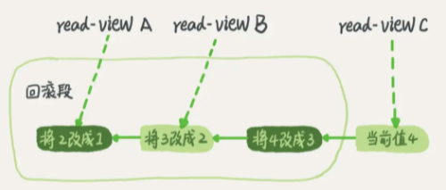

当前值是 4，但是在查询这条记录的时候，不同时刻启动的事务会有不同的 read-view。如图中看到的，在视图 A、B、C 里面，这一个记录的值分别是 1、2、4，同一条记录在系统中可以存在多个版本，就是数据库的多版本并发控制（MVCC）。对于 read-view A，要得到 1，就必须将当前值依次执行图中所有的回滚操作得到。

同时你会发现，即使现在有另外一个事务正在将 4 改成 5，这个事务跟 read-view A、B、C 对应的事务是不会冲突的。

下面以RR隔离级别为例，结合前文提到的几个问题分别说明。

（1）脏读：

| time | transaction A                                             | transaction B                                    |
| ---- | --------------------------------------------------------- | ------------------------------------------------ |
| t0   | start transaction;                                        | start transaction;                               |
| t1   | select balance from students where id=1; ---- balance = 0 |                                                  |
| t2   |                                                           | update students SET balance = 1000 where id = 1; |
| t3   | select balance from students where id=1; ---- balance = 0 |                                                  |
| t4   |                                                           | commit                                           |
|      | **避免了脏读**                                            |                                                  |

当事务A在T4时刻读取id=1的余额前，会生成ReadView，由于此时事务B没有提交仍然活跃，因此其事务id一定在ReadView的rw_trx_ids中，因此根据前面介绍的规则，事务B的修改对ReadView不可见。接下来，事务A根据指针指向的undo log查询上一版本的数据，得到id=1的余额为1000。这样事务A就避免了脏读。

（2）不可重复读：

| time | transaction A                                                | transaction B                                    |
| ---- | ------------------------------------------------------------ | ------------------------------------------------ |
| t1   | start transaction;                                           | start transaction;                               |
| t2   | select balance from students where id=1; ---- balance = 1000 |                                                  |
| t3   |                                                              | update students SET balance = 2000 where id = 1; |
| t4   |                                                              | commit                                           |
| t5   | select balance from students where id=1; ---- balance = 1000 |                                                  |
|      | **避免了不可重复读**                                         |                                                  |

当事务A在T2时刻读取id=1的余额前，会生成ReadView。

此时事务B分两种情况讨论：

一种是如表格所示，事务已经开始但没有提交，此时其事务id在ReadView的rw_trx_ids中；

一种是事务B还没有开始，此时其事务id大于等于ReadView的low_limit_id。无论是哪种情况，根据前面介绍的规则，事务B的修改对ReadView都不可见。

当事务A在T5时刻再次读取id=1的余额时，会根据T2时刻生成的ReadView对数据的可见性进行判断，从而判断出事务B的修改不可见；因此事务A根据指针指向的undo log查询上一版本的数据，得到id=1的余额为1000，从而避免了不可重复读。

（3）幻读：

| time | transaction A                                   | transaction B                     |
| ---- | ----------------------------------------------- | --------------------------------- |
| t1   | start transaction;                              | start transaction;                |
| t2   | select id from students where id <=5; ---- id=1 |                                   |
| t3   |                                                 | insert into students values(2,0); |
| t4   |                                                 | commit                            |
| t5   | select id from students where id <=5; ---- id=1 |                                   |
|      | **避免了幻读**                                  |                                   |

MVCC避免幻读的机制与避免不可重复读非常类似。

当事务A在T2时刻读取id<=5的用户余额前，会生成ReadView。此时事务B分两种情况讨论：

一种是如图中所示，事务已经开始但没有提交，此时其事务id在ReadView的rw_trx_ids中；

一种是事务B还没有开始，此时其事务id大于等于ReadView的low_limit_id。无论是哪种情况，根据前面介绍的规则，事务B的修改对ReadView都不可见。

当事务A在T5时刻再次读取id<=5的用户余额时，会根据T2时刻生成的ReadView对数据的可见性进行判断，从而判断出事务B的修改不可见。因此对于新插入的数据lisi(id=2)，事务A根据其指针指向的undo log查询上一版本的数据，发现该数据并不存在，从而避免了幻读。

**扩展**

前面介绍的MVCC，是RR隔离级别下“非加锁读”实现隔离性的方式。下面是一些简单的扩展。

（1）读已提交（RC）隔离级别下的非加锁读

RC与RR一样，都使用了MVCC，其主要区别在于：

**RR是在事务开始后第一次执行select前创建ReadView**，直到事务提交都不会再创建。根据前面的介绍，RR可以避免脏读、不可重复读和幻读。

**RC每次执行select前都会重新建立一个新的ReadView**，因此如果事务A第一次select之后，事务B对数据进行了修改并提交，那么事务A第二次select时会重新建立新的ReadView，因此事务B的修改对事务A是可见的。因此RC隔离级别可以避免脏读，但是无法避免不可重复读和幻读。

（2）加锁读与next-key lock

按照是否加锁，MySQL的读可以分为两种：

一种是非加锁读，也称作快照读、一致性读，使用普通的select语句，这种情况下使用MVCC避免了脏读、不可重复读、幻读，保证了隔离性。

另一种是加锁读，查询语句有所不同，如下所示：

```
#共享锁读取
select ...lock  in share mode
#排它锁读取
select ... for update
```

加锁读在查询时会对查询的数据加锁（共享锁或排它锁）。

由于锁的特性，当某事务对数据进行加锁读后，其他事务无法对数据进行写操作，因此可以避免脏读和不可重复读。而避免幻读，则需要通过next-key lock。

next-key lock是行锁的一种，实现相当于record lock(记录锁) + gap lock(间隙锁)；

其特点是不仅会锁住记录本身(record lock的功能)，还会锁定一个范围(gap lock的功能)。

因此，加锁读同样可以避免脏读、不可重复读和幻读，保证隔离性。


##### 总结

概括来说，InnoDB实现的RR，通过锁机制（包含next-key lock）、MVCC（包括数据的隐藏列、基于undo log的版本链、ReadView）等，实现了一定程度的隔离性，可以满足大多数场景的需要。

不过需要说明的是，RR虽然避免了幻读问题，但是毕竟不是Serializable，不能保证完全的隔离；


#### 一致性

##### 基本概念

一致性是指事务执行结束后，**数据库的完整性约束没有被破坏，事务执行的前后都是合法的数据状态。**

数据库的完整性约束包括但不限于：实体完整性（如行的主键存在且唯一）、列完整性（如字段的类型、大小、长度要符合要求）、外键约束、用户自定义完整性（如转账前后，两个账户余额的和应该不变）。


##### 实现

可以说，一致性是事务追求的最终目标：前面提到的原子性、持久性和隔离性，都是为了保证数据库状态的一致性。此外，除了数据库层面的保障，一致性的实现也需要应用层面进行保障。

实现一致性的措施包括：

- 保证原子性、持久性和隔离性，如果这些特性无法保证，事务的一致性也无法保证
- 数据库本身提供保障，例如不允许向整形列插入字符串值、字符串长度不能超过列的限制等
- 应用层面进行保障，例如如果转账操作只扣除转账者的余额，而没有增加接收者的余额，无论数据库实现的多么完美，也无法保证状态的一致

### 参考资料

> 《MySQL技术内幕：InnoDB存储引擎》
>
> 《高性能MySQL》
>
> 《MySQL运维内参》
>
> https://www.cnblogs.com/kismetv/p/10331633.html
>
> https://dev.mysql.com/doc/refman/5.6/en/glossary.html#glos_acid
>
> https://dev.mysql.com/doc/refman/5.6/en/innodb-next-key-locking.html
>
> http://blog.sina.com.cn/s/blog_499740cb0100ugs7.html
>
> https://mp.weixin.qq.com/s/2dwGBTmu_da2x-HiHlN0vw
>
> http://www.cnblogs.com/chenpingzhao/p/5065316.html
>
> https://juejin.im/entry/5ba0a254e51d450e735e4a1f
>
> http://hedengcheng.com/?p=771
>
> http://mysql.taobao.org/monthly/2018/03/01/
>
> https://blog.csdn.net/nmjhehe/article/details/98470570
>
> [https://elsef.com/2019/03/10/MySQL%E5%A6%82%E4%BD%95%E8%A7%A3%E5%86%B3%E5%90%84%E7%A7%8D%E4%B8%8D%E6%AD%A3%E5%B8%B8%E8%AF%BB/](https://elsef.com/2019/03/10/MySQL如何解决各种不正常读/)
>
> https://www.zhihu.com/question/372905832


------


## MySQL Innodb 深入浅析索引那些事儿

### 背景

索引只是为了更好的查询而已，在存储中间件中，有hash、数组、树、跳表、LSM等数据结构作为索引，每种索引方式的使用都有一定的场景方式；

哈希表这种结构适用于只有等值查询的场景，比如 Memcached 及其他一些 NoSQL 引擎。

有序数组会出现在一些等值查询和范围查询的场景，但有序数组不适合更新删除增加，故比较适合静态数组静态数据。

N叉树的出现为了能够很好地配合磁盘的读写特性，减少单次查询的磁盘访问次数，其中N是指这块内存能放多少数据，进而去指向真实的物理存储数据，故innodb的索引B+树的N叉也是取决于业务表索引设计；

跳表的话出现在redis的zset中； lsm日志合并树出现在hbase的memstore的内存维护HDFS的文件索引；


### 索引维护

B+ 树为了维护索引有序性，在插入新值的时候需要做必要的维护。

假设对应索引字段在插入时无序，现在ID为300、500、600共在一块索引数据区，且只能放三个ID索引：

如果插入新的行 ID 值为 700，则只需要在 ID=600的记录后面插入一个新记录。

如果新插入的 ID 值为 400，就相对麻烦了，需要逻辑上挪动后面的数据，空出位置。

而更糟的情况是，如果 ID=400 所在的数据页已经满了，根据 B+ 树的算法，这时候需要申请一个新的数据页，然后挪动部分数据过去。这个过程称为页分裂。

在这种情况下，性能自然会受影响。除了性能外，页分裂操作还影响数据页的利用率。

原本放在一个页的数据，现在分到两个页中，整体空间利用率降低大约 50%。当然有分裂就有合并。

当相邻两个页由于删除了数据，利用率很低之后，会将数据页做合并。合并的过程，可以认为是分裂过程的逆过程。

> 根据叶子节点的内容，索引类型分为主键索引和非主键索引。
>
> 主键索引的叶子节点存的是整行数据，在 InnoDB 里，主键索引也被称为聚簇索引（clustered index）。
>
> 非主键索引的叶子节点内容是主键的值，在 InnoDB 里，非主键索引也被称为二级索引（secondary index）。使用二级索引去某行数据这过程称为回表。

由于每个非主键索引的叶子节点上都是主键的值。如果用身份证号做主键，那么每个二级索引的叶子节点占用约 20 个字节，而如果用整型做主键，则只要 4 个字节，如果是长整型（bigint）则是 8 个字节。

主键长度越小，普通索引的叶子节点就越小，普通索引占用的空间也就越小。

重建索引

通过两个 alter 语句重建索引 k，以及通过两个 alter 语句重建主键索引是否合理。

> 索引可能因为删除，或者页分裂等原因，导致数据页有空洞，重建索引的过程会创建一个新的索引，把数据按顺序插入，这样页面的利用率最高，也就是索引更紧凑、更省空间。

重建索引 k 的做法是合理的，可以达到省空间的目的。

但是，重建主键的过程不合理。不论是删除主键还是创建主键，都会将整个表重建。所以连着执行这两个语句的话，第一个语句就白做了。

这两个语句，你可以用这个语句代替 ： alter table T engine=InnoDB。会触发mysql重建该表，并进行碎片处理。

记录日志的表最好是分区表，历史数据清理可以直接drop分区；

rename +新建表；

关于“用索引” 和 “用索引快速定位记录”的区别；

Multi-Range Read (MRR) ；


### 哈希索引

对于InnoDB的哈希索引，确切的应该这么说：

（1）**InnoDB用户无法手动创建哈希索引**，这一层上说，InnoDB确实不支持哈希索引；

（2）InnoDB会自调优(self-tuning)，如果判定建立自适应哈希索引(Adaptive Hash Index, AHI)，能够提升查询效率，**InnoDB自己会建立相关哈希索引**，这一层上说，InnoDB又是支持哈希索引的；

那什么是自适应哈希索引(Adaptive Hash Index, AHI)呢？原理又是怎样的呢？

> 不妨设有InnoDB数据表：
>
> *t(id PK, name KEY, sex, flag)*
>
> *画外音：**id是主键，name建了普通索引。*

在主键id上会建立**聚集索引**(Clustered Index)，叶子存储记录本身，在name上会建立**普通索引**(Secondary Index)，叶子存储主键值。

发起主键id查询时，能够通过聚集索引(主键id如上图B+树的节点数字)，直接定位到行记录。

发起普通索引查询时：


（1）会先从普通索引查询出主键；

（2）再由主键，从聚集索引上二次遍历定位到记录。

不管聚集索引还是普通索引，记录定位的寻路路径(Search Path)都很长。

在MySQL运行的过程中，如果InnoDB发现，有很多SQL存在这类很长的寻路，并且有很多SQL会命中相同的页面(page)，InnoDB会在自己的内存缓冲区(Buffer)里，开辟一块区域，建立自适应哈希所有AHI，以加速查询。

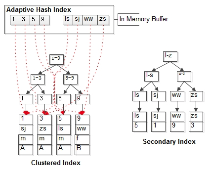

从这个层面上来说，InnoDB的自使用哈希索引，更像“索引的索引”，毕竟其目的是为了加速索引寻路。

**既然是哈希，key是什么，value是什么？**

key是索引键值（或者键值前缀）。

value是索引记录页面位置。

**为啥叫“自适应**(adaptive) **”哈希索引？**

系统自己判断“应该可以加速查询”而建立的，不需要用户手动建立，故称“自适应”。

**系统会不会判断失误，是不是一定能加速？**

不是一定能加速，有时候会误判。

当业务场景为下面几种情况时：

- 很多单行记录查询（例如passport，用户中心等业务）
- 索引范围查询（此时AHI可以快速定位首行记录）
- 所有记录内存能放得下

AHI往往是有效的。

当业务有大量like或者join，AHI的维护反而可能成为负担，降低系统效率，此时可以手动关闭AHI功能。


### 唯一索引


#### 查询过程

可以认为数据页内部通过二分法来定位记录。

对于普通索引来说，查找到满足条件的第一个记录 (5,500) 后，需要查找下一个记录，直到碰到第一个不满足 k=5 条件的记录。

对于唯一索引来说，由于索引定义了唯一性，查找到第一个满足条件的记录后，就会停止继续检索。那么，这个不同带来的性能差距会有多少呢？答案是，微乎其微。

InnoDB 的数据是按数据页为单位来读写的。也就是说，当需要读一条记录的时候，并不是将这个记录本身从磁盘读出来，而是以页为单位，将其整体读入内存。在 InnoDB 中，每个数据页的大小默认是 16KB。

因为引擎是按页读写的，所以说，当找到 k=5 的记录的时候，它所在的数据页就都在内存里了。那么，对于普通索引来说，要多做的那一次“查找和判断下一条记录”的操作，就只需要一次指针寻找和一次计算。

当然，如果 k=5 这个记录刚好是这个数据页的最后一个记录，那么要取下一个记录，必须读取下一个数据页，这个操作会稍微复杂一些。但是，我们之前计算过，对于整型字段，一个数据页可以放近千个 key，因此出现这种情况的概率会很低。所以，我们计算平均性能差异时，仍可以认为这个操作成本对于现在的 CPU 来说可以忽略不计。


#### 更新过程

change buffer

当需要更新一个数据页时，如果数据页在内存中就直接更新，而如果这个数据页还没有在内存中的话，在不影响数据一致性的前提下，InnoDB 会将这些更新操作缓存在 change buffer 中，这样就不需要从磁盘中读入这个数据页了。在下次查询需要访问这个数据页的时候，将数据页读入内存，然后执行 change buffer 中与这个页有关的操作。通过这种方式就能保证这个数据逻辑的正确性。

需要说明的是，虽然名字叫作 change buffer，实际上它是可以持久化的数据。也就是说，change buffer 在内存中有拷贝，也会被写入到磁盘上。

将 change buffer 中的操作应用到原数据页，得到最新结果的过程称为 merge。除了访问这个数据页会触发 merge 外，系统有后台线程会定期 merge。在数据库正常关闭（shutdown）的过程中，也会执行 merge 操作。

显然，如果能够将更新操作先记录在 change buffer，减少读磁盘，语句的执行速度会得到明显的提升。而且，数据读入内存是需要占用 buffer pool 的，所以这种方式还能够避免占用内存，提高内存利用率。

什么条件下可以使用 change buffer 呢？

对于唯一索引来说，所有的更新操作都要先判断这个操作是否违反唯一性约束。比如，要插入 (4,400) 这个记录，就要先判断现在表中是否已经存在 k=4 的记录，而这必须要将数据页读入内存才能判断。

如果都已经读入到内存了，那直接更新内存会更快，就没必要使用 change buffer 了。因此，唯一索引的更新就不能使用 change buffer，实际上也只有普通索引可以使用。

change buffer 用的是 buffer pool 里的内存，因此不能无限增大。change buffer 的大小，可以通过参数 innodb_change_buffer_max_size 来动态设置。这个参数设置为 50 的时候，表示 change buffer 的大小最多只能占用 buffer pool 的 50%。

如果要在这张表中插入一个新记录 (4,400) 的话，InnoDB 的处理流程是怎样的。

**第一种情况是，这个记录要更新的目标页在内存中**。这时，InnoDB 的处理流程如下：

对于唯一索引来说，找到 3 和 5 之间的位置，判断到没有冲突，插入这个值，语句执行结束；

对于普通索引来说，找到 3 和 5 之间的位置，插入这个值，语句执行结束。

这样看来，普通索引和唯一索引对更新语句性能影响的差别，只是一个判断，只会耗费微小的 CPU 时间。

> innodb 普通索引修改成唯一索引产生的生产事故：
>
> 写多读少使用 changebuffer 可以加快执行速度(减少数据页磁盘 io);
>
> 但是,如果业务模型是写后立马会做查询, 则会触发 changebuff 立即 merge 到磁盘, 这样 的场景磁盘 io 次数不会减少,反而会增加 changebuffer 的维护代价

**第二种情况是，这个记录要更新的目标页不在内存中**。这时，InnoDB 的处理流程如下：

对于唯一索引来说，需要将数据页读入内存，判断到没有冲突，插入这个值，语句执行结束；

对于普通索引来说，则是将更新记录在 change buffer，语句执行就结束了。

将数据从磁盘读入内存涉及随机 IO 的访问，是数据库里面成本最高的操作之一。change buffer 因为减少了随机磁盘访问，所以对更新性能的提升是会很明显的。

> 某个业务的库内存命中率突然从 99% 降低到了75%，整个系统处于阻塞状态，更新语句全部堵住。而探究其原因后，我发现这个业务有大量插入数据的操作，而他在前一天把其中的某个普通索引改成了唯一索引。

change buffer 的使用场景

通过上面的分析，你已经清楚了使用 change buffer 对更新过程的加速作用，也清楚了 change buffer 只限于用在普通索引的场景下，而不适用于唯一索引。那么，现在有一个问题就是：普通索引的所有场景，使用 change buffer 都可以起到加速作用吗？

因为 merge 的时候是真正进行数据更新的时刻，而 change buffer 的主要目的就是将记录的变更动作缓存下来，所以在一个数据页做 merge 之前，change buffer 记录的变更越多（也就是这个页面上要更新的次数越多），收益就越大。

因此，对于写多读少的业务来说，页面在写完以后马上被访问到的概率比较小，此时 change buffer 的使用效果最好。这种业务模型常见的就是账单类、日志类的系统。

反过来，假设一个业务的更新模式是写入之后马上会做查询，那么即使满足了条件，将更新先记录在 change buffer，但之后由于马上要访问这个数据页，会立即触发 merge 过程。这样随机访问 IO 的次数不会减少，反而增加了 change buffer 的维护代价。所以，对于这种业务模式来说，change buffer 反而起到了副作用。

索引选择和实践

普通索引和唯一索引应该怎么选择。其实，这两类索引在查询能力上是没差别的，主要考虑的是对更新性能的影响。所以，我建议你尽量选择普通索引。

如果所有的更新后面，都马上伴随着对这个记录的查询，那么你应该关闭 change buffer `innodb_change_buffer_max_size设置为0`。而在其他情况下，change buffer 都能提升更新性能。

在实际使用中，你会发现，普通索引和 change buffer 的配合使用，对于数据量大的表的更新优化还是很明显的。

特别地，在使用机械硬盘时，change buffer 这个机制的收效是非常显著的。所以，当你有一个类似“历史数据”的库，并且出于成本考虑用的是机械硬盘时，那你应该特别关注这些表里的索引，尽量使用普通索引，然后把 change buffer 尽量开大，以确保这个“历史数据”表的数据写入速度。

change buffer 和 redo log

redo log 和 change buffer。WAL 提升性能的核心机制，也的确是尽量减少随机读写；


#### 插入流程

```
mysql> insert into t(id,k) values(id1,k1),(id2,k2);
```

我们假设当前 k 索引树的状态，查找到位置后，k1 所在的数据页在内存 (InnoDB buffer pool) 中，k2 所在的数据页不在内存中。如图 2 所示是带 change buffer 的更新状态图。


分析这条更新语句，你会发现它涉及了四个部分：内存、redo log（ib_log_fileX）、 数据表空间（t.ibd）、系统表空间（ibdata1）。

这条更新语句做了如下的操作（按照图中的数字顺序）：

Page 1 在内存中，直接更新内存；

Page 2 没有在内存中，就在内存的 change buffer 区域，记录下“我要往 Page 2 插入一行”这个信息；

将上述两个动作记入 redo log 中（图中 3 和 4）。

做完上面这些，事务就可以完成了。所以，你会看到，执行这条更新语句的成本很低，就是写了两处内存，然后写了一处磁盘（两次操作合在一起写了一次磁盘），而且还是顺序写的。

同时，图中的两个虚线箭头，是后台操作，不影响更新的响应时间。

那在这之后的读请求，要怎么处理呢？

比如，我们现在要执行 select * from t where k in (k1, k2)。

这里，我画了这两个读请求的流程图。如果读语句发生在更新语句后不久，内存中的数据都还在，那么此时的这两个读操作就与系统表空间（ibdata1）和 redo log（ib_log_fileX）无关了。


 图 3 带 change buffer 的读过程

从图中可以看到：

1、读 Page 1 的时候，直接从内存返回。WAL 之后如果读数据，是不是一定要读盘，是不是一定要从 redo log 里面把数据更新以后才可以返回？其实是不用的。你可以看一下图 3 的这个状态，虽然磁盘上还是之前的数据，但是这里直接从内存返回结果，结果是正确的。

2、要读 Page 2 的时候，需要把 Page 2 从磁盘读入内存中，然后应用 change buffer 里面的操作日志，生成一个正确的版本并返回结果。可以看到，直到需要读 Page 2 的时候，这个数据页才会被读入内存。

可以看到，直到需要读 Page 2 的时候，这个数据页才会被读入内存。

> redo log 主要节省的是随机写磁盘的 IO 消耗（转成顺序写），而 change buffer 主要节省的则是随机读磁盘的 IO 消耗。

> Q：change buffer 一开始是写内存的，那么如果这个时候机器掉电重启，会不会导致 change buffer 丢失呢？change buffer 丢失可不是小事儿，再从磁盘读入数据可就没有了 merge 过程，就等于是数据丢失了。会不会出现这种情况呢？
>
> A：1.change buffer有一部分在内存有一部分在ibdata. 做purge操作,应该就会把change buffer里相应的数据持久化到ibdata
>
> 2.redo log里记录了数据页的修改以及change buffer新写入的信息 如果掉电,持久化的change buffer数据已经purge,不用恢复。
>
> 主要分析没有持久化的数据 情况又分为以下几种:
>
> (1)change buffer写入,redo log虽然做了fsync但未commit,binlog未fsync到磁盘,这部分数据丢失
>
> (2)change buffer写入,redo log写入但没有commit,binlog以及fsync到磁盘,先从binlog恢复redo log,再从redo log恢复change buffer
>
> (3)change buffer写入,redo log和binlog都已经fsync.那么直接从redo log里恢复。

> Q：如果某次写入使用了 change buffer 机制，之后主机异常重启，是否会丢失 change buffer 和数据。
>
> A：虽然是只更新内存，但是在事务提交的时候，我们把 change buffer 的操作也记录到 redo log 里了，所以崩溃恢复的时候，change buffer 也能找回来。

> Q：merge 的过程是否会把数据直接写回磁盘？
>
> A：merge 的执行流程是这样的：
>
> 1、从磁盘读入数据页到内存（老版本的数据页）；
>
> 2、从 change buffer 里找出这个数据页的 change buffer 记录 (可能有多个），依次应用，得到新版数据页；
>
> 3、写 redo log。这个 redo log 包含了数据的变更和 change buffer 的变更。

这时候，数据页和内存中 change buffer 对应的磁盘位置都还没有修改，属于脏页，之后各自刷回自己的物理数据，就是另外一个过程了。


### MySQL 选错了索引

一个简单的表，表里有 a、b 两个字段，并分别建上索引：

```
CREATE TABLE `t` (
  `id` int(11) NOT NULL AUTO_INCREMENT,
  `a` int(11) DEFAULT NULL,
  `b` int(11) DEFAULT NULL,
  PRIMARY KEY (`id`),
  KEY `a` (`a`),
  KEY `b` (`b`)
) ENGINE=InnoDB;
```

然后，我们往表 t 中插入 10 万行记录，取值按整数递增，即：(1,1,1)，(2,2,2)，(3,3,3) 直到 (100000,100000,100000)。

```
delimiter ;;
create procedure idata1()
begin
  declare i int;
  set i=1;
  while(i<=100000)do
    insert into t1 values(i, i, i);
    set i=i+1;
  end while;
end;;
delimiter ;
call idata1();
mysql> select * from t where a between 10000 and 20000;
mysql> explain select * from t where a between 10000 and 20000;
+----+-------------+-------+------------+-------+---------------+------+---------+------+-------+----------+-----------------------+
| id | select_type | table | partitions | type  | possible_keys | key  | key_len | ref  | rows  | filtered | Extra                 |
+----+-------------+-------+------------+-------+---------------+------+---------+------+-------+----------+-----------------------+
|  1 | SIMPLE      | t    | NULL       | range | a             | a    | 5       | NULL | 10001 |   100.00 | Using index condition |
+----+-------------+-------+------------+-------+---------------+------+---------+------+-------+----------+-----------------------+
1 row in set, 1 warning (0.00 sec)
```

这条查询语句的执行也确实符合预期，key 这个字段值是’a’，表示优化器选择了索引 a。不过别急，这个案例不会这么简单。在我们已经准备好的包含了 10 万行数据的表上，我们再做如下操作。


这里，session A 的操作你已经很熟悉了，它就是开启了一个事务。随后，session B 把数据都删除后，又调用了 idata 这个存储过程，插入了 10 万行数据。这时候，session B 的查询语句 select * from t where a between 10000 and 20000 就不会再选择索引 a 了。我们可以通过慢查询日志（slow log）来查看一下具体的执行情况。

为了说明优化器选择的结果是否正确，我增加了一个对照，即：使用 force index(a) 来让优化器强制使用索引 a;

下面的三条 SQL 语句，就是这个实验过程。

```
set long_query_time=0;
select * from t where a between 10000 and 20000; /*Q1*/
select * from t force index(a) where a between 10000 and 20000;/*Q2*/
```

> 开启慢查询和显示慢查询日志 文件路径运行
>
> show variables like '%slow_query_log%';
>
> set global slow_query_log=1;
>
> set long_query_time=0;

第一句，是将慢查询日志的阈值设置为 0，表示这个线程接下来的语句都会被记录入慢查询日志中；

第二句，Q1 是 session B 原来的查询；

第三句，Q2 是加了 force index(a) 来和 session B 原来的查询语句执行情况对比。

所示是这三条 SQL 语句执行完成后的慢查询日志。


可以看到，Q1 扫描了 10 万行，显然是走了全表扫描，执行时间是 40 毫秒。Q2 扫描了 10001 行，执行了 21 毫秒。也就是说，我们在没有使用 force index 的时候，MySQL 用错了索引，导致了更长的执行时间。

这个例子对应的是我们平常不断地删除历史数据和新增数据的场景。

> Q：而如果没有 session A 的配合，只是单独执行 delete from t 、call idata()、explain 这三句话，会看到 rows 字段其实还是 10000 左右。
>
> A：session A 开启的事务是 RR 级别，会创建一个一致性读视图； session B 的删除会产生记录的新版本（空记录），同时会产生新的 Undo Log；
>
> 一致性读视图需要的 Undo Log 是不会删除的，意味着 session B 产生的删除记录的 Undo Log 是不能删除的，意味着记录的当前版本（空记录）不能真的从磁盘上被删掉，因为如果记录都从磁盘上删掉了，那么空有 Undo Log 也无法回到 session A 应该看到的那个版本；就好比链表总得有个头结点把，如果失去了对头结点的引用，就失去了访问整个链表的起点；
>
> 不删除的情况下，记录还在数据页上占着空间呢，session B 又把数据加回来，导致索引的数据页出现大量的分裂； 大量的页分裂，导致了 cardinality 的不准；
>
> 一句话总结就是RR下的一致性视图需要保留原来的10万条记录，原来的数据只能是标记删除，所以session B新增的会开启新的空间，引起统计信息出现错误，导致优化器选择错误

> Q：delete 语句删掉了所有的数据，然后再通过 call idata() 插入了 10 万行数据，为什么经过这个操作序列，explain 的结果就不对了？使用 explain 命令看到的扫描行数为什么还是 100000 左右？
>
> A：session A 开启了事务并没有提交，所以之前插入的 10 万行数据是不能删除的。这样，之前的数据每一行数据都有两个版本，旧版本是 delete 之前的数据，新版本是标记为 deleted 的数据。
>
> 主键是直接按照表的行数来估计的。而表的行数，优化器直接用的是 show table status 的值。


### 优化器的逻辑

优化器选择索引的目的，是找到一个最优的执行方案，并用最小的代价去执行语句。在数据库里面，扫描行数是影响执行代价的因素之一。扫描的行数越少，意味着访问磁盘数据的次数越少，消耗的 CPU 资源越少。还会结合是否使用临时表、是否排序等因素进行综合判断。

我们这个简单的查询语句并没有涉及到临时表和排序，所以 MySQL 选错索引肯定是在判断扫描行数的时候出问题了。

扫描行数是怎么判断的？

MySQL 在真正开始执行语句之前，并不能精确地知道满足这个条件的记录有多少条，而只能根据统计信息来估算记录数。

这个统计信息就是索引的“区分度”。显然，一个索引上不同的值越多，这个索引的区分度就越好。而一个索引上不同的值的个数，我们称之为**“基数”（cardinality）**。也就是说，这个基数越大，索引的区分度越好。

我们可以使用 show index 方法，看到一个索引的基数。如图 4 所示，就是表 t 的 show index 的结果 。虽然这个表的每一行的三个字段值都是一样的，但是在统计信息中，这三个索引的基数值并不同，而且其实都不准确。

```
mysql> show index from t;
+-------+------------+----------+--------------+-------------+-----------+-------------+----------+--------+------+------------+---------+---------------+---------+------------+
| Table | Non_unique | Key_name | Seq_in_index | Column_name | Collation | Cardinality | Sub_part | Packed | Null | Index_type | Comment | Index_comment | Visible | Expression |
+-------+------------+----------+--------------+-------------+-----------+-------------+----------+--------+------+------------+---------+---------------+---------+------------+
| t1    |          0 | PRIMARY  |            1 | id          | A         |      100256 |     NULL |   NULL |      | BTREE      |         |               | YES     | NULL       |
| t1    |          1 | a        |            1 | a           | A         |       98190 |     NULL |   NULL | YES  | BTREE      |         |               | YES     | NULL       |
| t1    |          1 | b        |            1 | b           | A         |      100256 |     NULL |   NULL | YES  | BTREE      |         |               | YES     | NULL       |
+-------+------------+----------+--------------+-------------+-----------+-------------+----------+--------+------+------------+---------+---------------+---------+------------+
3 rows in set (0.01 sec)
```

**MySQL 是怎样得到索引的基数**的呢？这里，我给你简单介绍一下 MySQL 采样统计的方法。

采样统计的时候，InnoDB 默认会选择 N 个数据页，统计这些页面上的不同值，得到一个平均值，然后乘以这个索引的页面数，就得到了这个索引的基数。

而数据表是会持续更新的，索引统计信息也不会固定不变。所以，当变更的数据行数超过 1/M 的时候，会自动触发重新做一次索引统计。

在 MySQL 中，有两种存储索引统计的方式，可以通过设置参数 innodb_stats_persistent 的值来选择：

 设置为 on 的时候，表示统计信息会持久化存储。这时，默认的 N 是 20，M 是 10。

 设置为 off 的时候，表示统计信息只存储在内存中。这时，默认的 N 是 8，M 是 16。

```
mysql> show variables like '%innodb_stats_persistent%';
+--------------------------------------+-------+
| Variable_name                        | Value |
+--------------------------------------+-------+
| innodb_stats_persistent              | ON    |
| innodb_stats_persistent_sample_pages | 20    |
+--------------------------------------+-------+
2 rows in set (0.16 sec)
```

由于是采样统计，所以不管 N 是 20 还是 8，这个基数都是很容易不准的。

这次的索引统计值（cardinality 列）虽然不够精确，但大体上还是差不多的，选错索引一定还有别的原因。

其实索引统计只是一个输入，对于一个具体的语句来说，优化器还要判断，执行这个语句本身要扫描多少行。

我们再一起看看优化器预估的，这两个语句的扫描行数是多少。

rows 这个字段表示的是预计扫描行数。其中，Q1 的结果还是符合预期的，rows 的值是 104620；但是 Q2 的 rows 值是 37116，偏差就大了。而图 我们用 explain 命令看到的 rows 是只有 10001 行，是这个偏差误导了优化器的判断。

这是因为，如果使用索引 a，每次从索引 a 上拿到一个值，都要回到主键索引上查出整行数据，这个代价优化器也要算进去的。而如果选择扫描 10 万行，是直接在主键索引上扫描的，没有额外的代价。优化器会估算这两个选择的代价，从结果看来，优化器认为直接扫描主键索引更快。当然，从执行时间看来，这个选择并不是最优的。

使用普通索引需要把回表的代价算进去，在图 1 执行 explain 的时候，也考虑了这个策略的代价 ，但图 1 的选择是对的。也就是说，这个策略并没有问题。

> MySQL 选错索引，这件事儿还得归咎到没能准确地判断出扫描行数。至于为什么会得到错误的扫描行数?
>
> 因为另一个事务仍未提交，因此删除的数据只是标记删除，数据仍然在数据页中，后插入的数据需要找新的空位插入，这样查询时会扫描删除的数据+后插入的数据，同时算上回表扫描主键索引，因此扫描行数达到3万7千行


如果你发现 explain 的结果预估的 rows 值跟实际情况差距比较大，可以采用这个方法来处理。可以采用`analyze table t`

其实，如果只是索引统计不准确，通过 analyze 命令可以解决很多问题，但是前面我们说了，优化器可不止是看扫描行数。还有是否排序+是否使用临时表；

```
mysql> select * from t where (a between 1 and 1000)  and (b between 50000 and 100000) order by b limit 1;
```

从条件上看，这个查询没有符合条件的记录，因此会返回空集合。在开始执行这条语句之前，你可以先设想一下，如果你来选择索引，会选择哪一个呢？为了便于分析，我们先来看一下 a、b 这两个索引的结构图。


```
mysql> explain select * from t1 where (a between 1 and 1000) and (b between 50000 and 100000) order by b limit 1;
+----+-------------+-------+------------+-------+---------------+------+---------+------+-------+----------+------------------------------------+
| id | select_type | table | partitions | type  | possible_keys | key  | key_len | ref  | rows  | filtered | Extra                              |
+----+-------------+-------+------------+-------+---------------+------+---------+------+-------+----------+------------------------------------+
|  1 | SIMPLE      | t1    | NULL       | range | a,b           | b    | 5       | NULL | 50128 |     1.00 | Using index condition; Using where |
+----+-------------+-------+------------+-------+---------------+------+---------+------+-------+----------+------------------------------------+
1 row in set, 1 warning (0.00 sec)

mysql>
```

可以看到，返回结果中 key 字段显示，这次优化器选择了索引 b，而 rows 字段显示需要扫描的行数是 50198。从这个结果中，你可以得到两个结论：扫描行数的估计值依然不准确；这个例子里 MySQL 又选错了索引。

> 1）因为有 order by b，优化器认为走索引 b 可以避免排序； 2）又有 limit 1，优化器认为只要找到了 1 条满足条件的记录，索引 b 的遍历就可以提前终止，虽然可能要遍历 50001 条记录，但是优化器认为这是值得冒险的事，所以决定了走索引 b；


### 索引选择异常和处理

其实大多数时候优化器都能找到正确的索引，但偶尔你还是会碰到我们上面举例的这两种情况：原本可以执行得很快的 SQL 语句，执行速度却比你预期的慢很多，你应该怎么办呢？

一种方法是，像我们第一个例子一样，采用 force index 强行选择一个索引。MySQL 会根据词法解析的结果分析出可能可以使用的索引作为候选项，然后在候选列表中依次判断每个索引需要扫描多少行。如果 force index 指定的索引在候选索引列表中，就直接选择这个索引，不再评估其他索引的执行代价。

第二种方法就是，我们可以考虑修改语句，引导 MySQL 使用我们期望的索引。比如，在这个例子里，显然把“order by b limit 1” 改成 “order by b,a limit 1” ，语义的逻辑是相同的。

```
mysql> explain select * from t1 where (a between 1 and 1000) and (b between 50000 and 100000) order by b,a limit 1;
+----+-------------+-------+------------+-------+---------------+------+---------+------+------+----------+----------------------------------------------------+
| id | select_type | table | partitions | type  | possible_keys | key  | key_len | ref  | rows | filtered | Extra                                              |
+----+-------------+-------+------------+-------+---------------+------+---------+------+------+----------+----------------------------------------------------+
|  1 | SIMPLE      | t1    | NULL       | range | a,b           | a    | 5       | NULL | 1000 |    50.00 | Using index condition; Using where; Using filesort |
+----+-------------+-------+------------+-------+---------------+------+---------+------+------+----------+----------------------------------------------------+
1 row in set, 1 warning (0.01 sec)
```

第三种方法是，在有些场景下，我们可以新建一个更合适的索引，来提供给优化器做选择，或删掉误用的索引。

还有一个方法是删掉索引 b，你可能会觉得好笑。但实际上我碰到过两次这样的例子，最终是 DBA 跟业务开发沟通后，发现这个优化器错误选择的索引其实根本没有必要存在，于是就删掉了这个索引，优化器也就重新选择到了正确的索引。


### 字符串索引

#### 前缀索引

MySQL 是支持前缀索引的，也就是说，你可以定义字符串的一部分作为索引。默认地，如果你创建索引的语句不指定前缀长度，那么索引就会包含整个字符串。但前缀索引这同时带来的损失是，可能会增加额外的记录扫描次数。使用前缀索引后，可能会导致查询语句读数据的次数变多。

```
mysql> alter table SUser add index index1(email);
或
mysql> alter table SUser add index index2(email(6));
```

使用前缀索引，定义好长度，就可以做到既节省空间，又不用额外增加太多的查询成本。

我们在建立索引时关注的是区分度，区分度越高越好。因为区分度越高，意味着重复的键值越少。因此，我们可以通过统计索引上有多少个不同的值来判断要使用多长的前缀。

选取不同长度的前缀来看这个值，比如我们要看一下 4~7 个字节的前缀索引，可以用这个语句：

```
mysql> select 
  count(distinct left(email,4)）as L4,
  count(distinct left(email,5)）as L5,
  count(distinct left(email,6)）as L6,
  count(distinct left(email,7)）as L7,
from SUser;
```

> 前缀索引需要考虑到两点：1.对查询行的区分度（越大越好）；2.对索引覆盖，回表查询次数的影响。

使用前缀索引就用不上覆盖索引对查询性能的优化了，这也是你在选择是否使用前缀索引时需要考虑的一个因素，因为前缀索引没有全部包含该信息，需要进行回表。


#### 其他方式

第一种方式是使用倒序存储。如果你存储身份证号的时候把它倒过来存，每次查询的时候，你可以这么写：

```
mysql> select field_list from t where id_card = reverse('input_id_card_string');
```

由于身份证号的最后 6 位没有地址码这样的重复逻辑，所以最后这 6 位很可能就提供了足够的区分度。

第二种方式是使用 hash 字段。你可以在表上再创建一个整数字段，来保存身份证的校验码，同时在这个字段上创建索引。

```
mysql> alter table t add id_card_crc int unsigned, add index(id_card_crc);
```

然后每次插入新记录的时候，都同时用 crc32() 这个函数得到校验码填到这个新字段。由于校验码可能存在冲突，也就是说两个不同的身份证号通过 crc32() 函数得到的结果可能是相同的，所以你的查询语句 where 部分要判断 id_card 的值是否精确相同。mysql> select field_list from t where id_card_crc=crc32('input_id_card_string') and id_card='input_id_card_string'这样，索引的长度变成了 4 个字节，比原来小了很多。

使用倒序存储和使用 hash 字段这两种方法的异同点。

首先，它们的相同点是，都不支持范围查询。倒序存储的字段上创建的索引是按照倒序字符串的方式排序的，已经没有办法利用索引方式查出身份证号码在[ID_X, ID_Y]的所有市民了。同样地，hash 字段的方式也只能支持等值查询。

它们的区别，主要体现在以下三个方面：

1、从占用的额外空间来看，倒序存储方式在主键索引上，不会消耗额外的存储空间，而 hash 字段方法需要增加一个字段。当然，倒序存储方式使用 4 个字节的前缀长度应该是不够的，如果再长一点，这个消耗跟额外这个 hash 字段也差不多抵消了。

2、在 CPU 消耗方面，倒序方式每次写和读的时候，都需要额外调用一次 reverse 函数，而 hash 字段的方式需要额外调用一次 crc32() 函数。如果只从这两个函数的计算复杂度来看的话，reverse 函数额外消耗的 CPU 资源会更小些。

3、从查询效率上看，使用 hash 字段方式的查询性能相对更稳定一些。因为 crc32 算出来的值虽然有冲突的概率，但是概率非常小，可以认为每次查询的平均扫描行数接近 1。而倒序存储方式毕竟还是用的前缀索引的方式，也就是说还是会增加扫描行数。

> 字符串字段创建索引的场景：
>
> 1、直接创建完整索引，这样可能比较占用空间；
>
> 2、创建前缀索引，节省空间，但会增加查询扫描次数，并且不能使用覆盖索引；
>
> 3、倒序存储，再创建前缀索引，用于绕过字符串本身前缀的区分度不够的问题；
>
> 4、创建 hash 字段索引，查询性能稳定，有额外的存储和计算消耗，跟第三种方式一样，都不支持范围扫描。

> Q：如果你在维护一个学校的学生信息数据库，学生登录名的统一格式是”学号 @gmail.com", 而学号的规则是：十五位的数字，其中前三位是所在城市编号、第四到第六位是学校编号、第七位到第十位是入学年份、最后五位是顺序编号。系统登录的时候都需要学生输入登录名和密码，验证正确后才能继续使用系统。就只考虑登录验证这个行为的话，你会怎么设计这个登录名的索引呢？
>
> A：由于这个学号的规则，无论是正向还是反向的前缀索引，重复度都比较高。因为维护的只是一个学校的，因此前面 6 位（其中，前三位是所在城市编号、第四到第六位是学校编号）其实是固定的，邮箱后缀都是 @gamil.com，因此可以只存入学年份加顺序编号，它们的长度是 9 位。而其实在此基础上，可以用数字类型来存这 9 位数字。比如 201100001，这样只需要占 4 个字节。其实这个就是一种 hash，只是它用了最简单的转换规则：字符串转数字的规则，而刚好我们设定的这个背景，可以保证这个转换后结果的唯一性。

------


## MySQL 日志与缓存之间的案例分析

性能的影响。

其中，第三种情况是属于 MySQL 空闲时的操作，这时系统没什么压力，而第四种场景是数据库本来就要关闭了。这两种情况下，你不会太关注“性能”问题。所以这里，我们主要来分析一下前两种场景下的性能问题。

第一种是“redo log 写满了，要 flush 脏页”，这种情况是 InnoDB 要尽量避免的。因为出现这种情况的时候，整个系统就不能再接受更新了，所有的更新都必须堵住。如果你从监控上看，这时候更新数会跌为 0。

第二种是“内存不够用了，要先将脏页写到磁盘”，这种情况其实是常态。

InnoDB 用缓冲池（buffer pool）管理内存，缓冲池中的内存页有三种状态：

> 第一种是，还没有使用的；第二种是，使用了并且是干净页；第三种是，使用了并且是脏页。

InnoDB 的策略是尽量使用内存，因此对于一个长时间运行的库来说，未被使用的页面很少。

而当要读入的数据页没有在内存的时候，就必须到缓冲池中申请一个数据页。

这时候只能把最久不使用的数据页从内存中淘汰掉：如果要淘汰的是一个干净页，就直接释放出来复用；但如果是脏页呢，就必须将脏页先刷到磁盘，变成干净页后才能复用。

所以，刷脏页虽然是常态，但是出现以下这两种情况，都是会明显影响性能的：

一个查询要淘汰的脏页个数太多，会导致查询的响应时间明显变长；

日志写满，更新全部堵住，写性能跌为 0，这种情况对敏感业务来说，是不能接受的。

所以，InnoDB 需要有控制脏页比例的机制，来尽量避免上面的这两种情况。


### 刷脏页的控制策略

#### innodb_io_capacity

这就要用到 innodb_io_capacity 这个参数了，它会告诉 InnoDB 你的磁盘能力。这个值我建议你设置成磁盘的 IOPS。磁盘的 IOPS 可以通过 fio 这个工具来测试，下面的语句是我用来测试磁盘随机读写的命令：

```
fio -filename=$filename -direct=1 -iodepth 1 -thread -rw=randrw -ioengine=psync -bs=16k -size=500M -numjobs=10 -runtime=10 -group_reporting -name=mytest 
```

其实，因为没能正确地设置 innodb_io_capacity 参数，而导致的性能问题也比比皆是。

> 之前，就曾有其他公司的开发负责人找我看一个库的性能问题，说 MySQL 的写入速度很慢，TPS 很低，但是数据库主机的 IO 压力并不大。经过一番排查，发现罪魁祸首就是这个参数的设置出了问题。
>
> 他的主机磁盘用的是 SSD，但是 innodb_io_capacity 的值设置的是 300。于是，InnoDB 认为这个系统的能力就这么差，所以刷脏页刷得特别慢，甚至比脏页生成的速度还慢，这样就造成了脏页累积，影响了查询和更新性能。


#### innodb_max_dirty_pages_pct

如果刷太慢，会出现什么情况？首先是内存脏页太多，其次是 redo log 写满。

InnoDB 的刷盘速度就是要参考这两个因素：一个是脏页比例，一个是 redo log 写盘速度。

InnoDB 会根据这两个因素先单独算出两个数字。

参数 innodb_max_dirty_pages_pct 是脏页比例上限，默认值是 75%。InnoDB 会根据当前的脏页比例（假设为 M），算出一个范围在 0 到 100 之间的数字，计算这个数字的伪代码类似这样：

```
F1(M)
{
  if M>=innodb_max_dirty_pages_pct then
      return 100;
  return 100*M/innodb_max_dirty_pages_pct;
}
```

InnoDB 每次写入的日志都有一个序号，当前写入的序号跟 checkpoint 对应的序号之间的差值，我们假设为 N。InnoDB 会根据这个 N 算出一个范围在 0 到 100 之间的数字，这个计算公式可以记为 F2(N)。F2(N) 算法比较复杂，你只要知道 N 越大，算出来的值越大就好了。

然后，根据上述算得的 F1(M) 和 F2(N) 两个值，取其中较大的值记为 R，之后引擎就可以按照 innodb_io_capacity 定义的能力乘以 R% 来控制刷脏页的速度。

刷脏页的过程是要将内存页写入磁盘。所以，无论是你的查询语句在需要内存的时候可能要求淘汰一个脏页，还是由于刷脏页的逻辑会占用 IO 资源并可能影响到了你的更新语句，都可能是造成你从业务端感知到 MySQL“抖”了一下的原因。

要尽量避免这种情况，你就要合理地设置 innodb_io_capacity 的值，并且平时要多关注脏页比例，不要让它经常接近 75%。

其中，脏页比例是通过 `Innodb_buffer_pool_pages_dirty/Innodb_buffer_pool_pages_total`得到的，具体的命令参考下面的代码：

```
mysql> select VARIABLE_VALUE into @a from global_status where VARIABLE_NAME = 'Innodb_buffer_pool_pages_dirty';
select VARIABLE_VALUE into @b from global_status where VARIABLE_NAME = 'Innodb_buffer_pool_pages_total';
select @a/@b;
```


#### innodb_flush_neighbors

MySQL 中的一个机制，可能让你的查询会更慢：在准备刷一个脏页的时候，如果这个数据页旁边的数据页刚好是脏页，就会把这个“邻居”也带着一起刷掉；而且这个把“邻居”拖下水的逻辑还可以继续蔓延，也就是对于每个邻居数据页，如果跟它相邻的数据页也还是脏页的话，也会被放到一起刷。

在 InnoDB 中，innodb_flush_neighbors 参数就是用来控制这个行为的，值为 1 的时候会有上述的“连坐”机制，值为 0 时表示不找邻居，自己刷自己的。

找“邻居”这个优化在机械硬盘时代是很有意义的，可以减少很多随机 IO。机械硬盘的随机 IOPS 一般只有几百，相同的逻辑操作减少随机 IO 就意味着系统性能的大幅度提升。

而如果使用的是 SSD 这类 IOPS 比较高的设备的话，我就建议你把 innodb_flush_neighbors 的值设置成 0。因为这时候 IOPS 往往不是瓶颈，而“只刷自己”，就能更快地执行完必要的刷脏页操作，减少 SQL 语句响应时间。

> 在 MySQL 8.0 中，innodb_flush_neighbors 参数的默认值已经是 0 了。


#### 小结

> Q：一个内存配置为 128GB、innodb_io_capacity 设置为 20000 的大规格实例，正常会建议你将 redo log 设置成 4 个 1GB 的文件。
>
> 但如果你在配置的时候不慎将 redo log 设置成了 1 个 100M 的文件，会发生什么情况呢？又为什么会出现这样的情况呢？
>
> A：每次事务提交都要写 redo log，如果设置太小，很快就会被写满，也就是下面这个图的状态，这个“环”将很快被写满，write pos 一直追着 checkPoint；你看到的现象就是磁盘压力很小，但是数据库出现间歇性的性能下跌。
>
> 在这种情况下，连 change buffer 的优化也失效了。因为 checkpoint 一直要往前推，这个操作就会触发 merge 操作，然后又进一步地触发刷脏页操作；

> redo log是关系型数据库的核心,保证了ACID里的D。所以redo log是牵一发而动全身的操作
>
> 当内存数据页跟磁盘数据页不一致的时候,把内存页称为'脏页'。如果redo log
>
> 设置得太小,redo log写满.那么会涉及到哪些操作呢,我认为是以下几点:
>
> 1.把相对应的数据页中的脏页持久化到磁盘,checkpoint往前推
>
> 2.由于redo log还记录了undo的变化,undo log buffer也要持久化进undo log
>
> 3.当innodb_flush_log_at_trx_commit设置为非1,还要把内存里的redo log持久化到磁盘上
>
> 4.redo log还记录了change buffer的改变,那么还要把change buffer purge到idb
>
> 以及merge change buffer.merge生成的数据页也是脏页,也要持久化到磁盘
>
> 上述4种操作,都是占用系统I/O,影响DML,如果操作频繁,会导致'抖'得向现在我们过冬一样。
>
> 但是对于select操作来说,查询时间相对会更快。因为系统脏页变少了,不用去淘汰脏页,直接复用干净页即可。还有就是对于宕机恢复,速度也更快,因为checkpoint很接近LSN,恢复的数据页相对较少
>
> 所以要控制刷脏的频率,频率快了,影响DML I/O,频率慢了,会导致读操作耗时长。


### 刷脏流程

执行流程：


MySQL在事务执行的过程中，会记录相应SQL语句的UndoLog 和 Redo Log，然后在内存中更新数据并形成数据脏页。接下来RedoLog会根据一定规则触发刷盘操作，Undo Log 和数据脏页则通过刷盘机制刷盘。

事务提交时，会将当前事务相关的所有Redo Log刷盘，只有当前事务相关的所有Redo Log 刷盘成功，事务才算提交成功。

恢复流程：

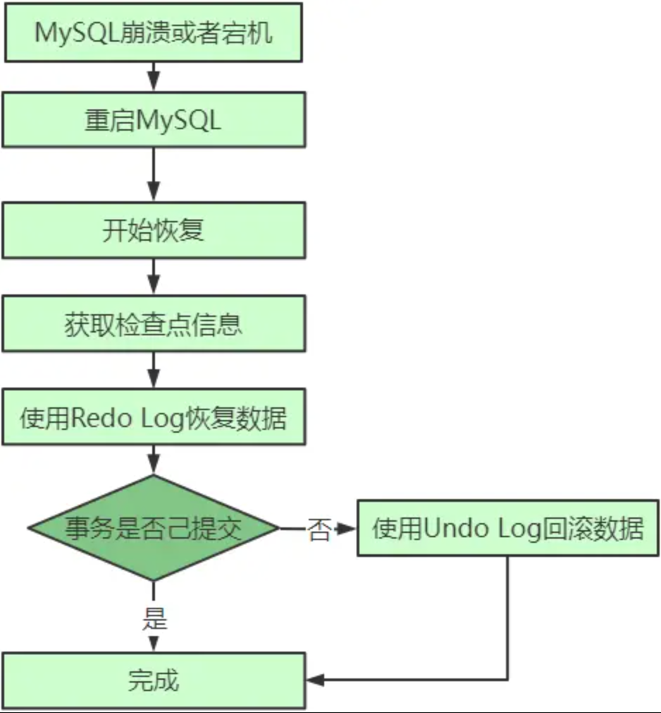


------


## MySQL 最难懂的锁全文来啦

### 背景

MySQL 里面的锁大致可以分成全局锁、表级锁和行锁三类，全局锁和表级锁实在server层实现的。


#### 数据库中锁相关的基本概念

1）乐观锁，悲观锁

 乐观锁和悲观锁都是一种并发控制策略。悲观锁假定多个事务会同时访问同一个资源，采用的策略是“先上锁，后访问”，这种策略会有死锁的风险。乐观锁相对于悲观锁而言，假定多个事务在运行过程中不会相互影响，写入在读取和写入记录时，不上锁，取而代之是产生一个时间戳或版本号，事务提交阶段，检查记录的版本号是否有被修改(若修改，则表示有其他事务读写)，确定是否需要回滚事务。目前在数据库领域，几乎所有的DBMS都是采用悲观锁机制。

1. MVCC(Multi-Version Concurrency Control)

 MVCC也是一种并发控制方法，MVCC对悲观锁控制机制做了改进，通过冗余数据的历史版本，达到“读不上锁，读写不冲突”的效果，提高了并发效果。MVCC主要作用于读提交和可重复读两种隔离级别上。

1. 两阶段锁协议

 所谓两段锁协议是指上锁分为两个阶段，加锁和解锁阶段，保证加锁和解锁阶段不交错。对于数据库系统而言，事务开始时，处于加锁阶段；事务提交或rollback时，事务进入解锁阶段。只有满足两段锁协议的数据库系统，并发调度的事务才是可以串行化的。

1. 意向锁

 意向锁机制约定如果对一个节点加锁，必需先对它的上一层节点加意向锁。比如，对一个记录加锁之前，首先对该记录所在的表加意向锁。意向锁主要包括IS和IX，他们与S和X的兼容关系不在这里赘述。意向锁的主要作用在于提高表锁和行锁冲突检测效率。

1. 表锁，记录(行)锁

 表锁和记录锁是锁系统里面最基本的锁。分别用于锁定表和记录。对于表而言，根据情况可以有S，X，IS和IX四种锁类别；对表上IS和IX，表示需要读记录和写记录；记录锁则主要包括X锁和S锁。

1. 字典锁(metadata lock)

 字典锁是保护元数据的一种锁，主要为了防止DDL和DML冲突的情况。

1. 死锁

 所谓死锁是指两个或多个事务，各自占有对方的期望获得的资源，形成的循环等待，彼此无法继续执行的一种状态。


### 全局锁

全局锁就是对整个数据库实例加锁。MySQL 提供了一个加全局读锁的方法，命令是 Flush tables with read lock (FTWRL)。当你需要让整个库处于只读状态的时候，可以使用这个命令，之后其他线程的以下语句会被阻塞：数据更新语句（数据的增删改）、数据定义语句（包括建表、修改表结构等）和更新类事务的提交语句。

如果执行flush tables with read lock命令行窗口退出后，则数据库会恢复为执行该命令之前的状态。

unlock tables可以解除。

全局锁的典型使用场景是，做全库逻辑备份。也就是把整库每个表都 select 出来存成文本。以前有一种做法，是通过 FTWRL 确保不会有其他线程对数据库做更新，然后对整个库做备份。注意，在备份过程中整个库完全处于只读状态。

但是让整库都只读：

如果你在主库上备份，那么在备份期间都不能执行更新，业务基本上就得停摆；

如果你在从库上备份，那么备份期间从库不能执行主库同步过来的 binlog，会导致主从延迟。

官方自带的逻辑备份工具是 mysqldump。当 mysqldump 使用参数–single-transaction 的时候，导数据之前就会启动一个事务，来确保拿到一致性视图。而由于 MVCC 的支持，这个过程中数据是可以正常更新的。

> mysqldump -h127.0.0.1 -uroot -p123456 --single-transaction --default-character-set=utf8 accounting_global zg_tenant_entity > /tmp/ccc.sql

为什么还需要 FTWRL 呢？一致性读是好，但前提是引擎要支持这个隔离级别。

比如，对于 MyISAM 这种不支持事务的引擎，如果备份过程中有更新，总是只能取到最新的数据，那么就破坏了备份的一致性。这时，我们就需要使用 FTWRL 命令了。

所以，single-transaction 方法只适用于所有的表使用事务引擎的库。如果有的表使用了不支持事务的引擎，那么备份就只能通过 FTWRL 方法。这往往是 DBA 要求业务开发人员使用 InnoDB 替代 MyISAM 的原因之一。

既然要全库只读，为什么不使用 set global readonly=true 的方式呢？确实 readonly 方式也可以让全库进入只读状态，但我还是会建议你用 FTWRL 方式，主要有两个原因：

一是，在有些系统中，readonly 的值会被用来做其他逻辑，比如用来判断一个库是主库还是备库。因此，修改 global 变量的方式影响面更大，我不建议你使用。

二是，在异常处理机制上有差异。如果执行 FTWRL 命令之后由于客户端发生异常断开，那么 MySQL 会自动释放这个全局锁，整个库回到可以正常更新的状态。而将整个库设置为 readonly 之后，如果客户端发生异常，则数据库就会一直保持 readonly 状态，这样会导致整个库长时间处于不可写状态，风险较高。

业务的更新不只是增删改数据（DML)，还有可能是加字段等修改表结构的操作（DDL）。不论是哪种方法，一个库被全局锁上以后，你要对里面任何一个表做加字段操作，都是会被锁住的。


### 表级锁

MySQL 里面表级别的锁有两种：一种是表锁，一种是元数据锁（meta data lock，MDL)。

表锁的语法是 lock tables … read/write。与 FTWRL 类似，可以用 unlock tables 主动释放锁，也可以在客户端断开的时候自动释放。需要注意，lock tables 语法除了会限制别的线程的读写外，也限定了本线程接下来的操作对象。

举个例子, 如果在某个线程 A 中执行 lock tables t1 read, t2 write; 这个语句，则其他线程写 t1、读写 t2 的语句都会被阻塞。同时，线程 A 在执行 unlock tables 之前，也只能执行读 t1、读写 t2 的操作。连写 t1 都不允许，自然也不能访问其他表。在还没有出现更细粒度的锁的时候，表锁是最常用的处理并发的方式。

而对于 InnoDB 这种支持行锁的引擎，一般不使用 lock tables 命令来控制并发，毕竟锁住整个表的影响面还是太大。

另一类表级的锁是 MDL（metadata lock)。MDL 不需要显式使用，在访问一个表的时候会被自动加上。MDL 的作用是，保证读写的正确性。你可以想象一下，如果一个查询正在遍历一个表中的数据，而执行期间另一个线程对这个表结构做变更，删了一列，那么查询线程拿到的结果跟表结构对不上，肯定是不行的。

因此，在 MySQL 5.5 版本中引入了 MDL，当对一个表做增删改查操作的时候，加 MDL 读锁；当要对表做结构变更操作的时候，加 MDL 写锁。

读锁之间不互斥，因此你可以有多个线程同时对一张表增删改查。

读写锁之间、写锁之间是互斥的，用来保证变更表结构操作的安全性。因此，如果有两个线程要同时给一个表加字段，其中一个要等另一个执行完才能开始执行。

虽然 MDL 锁是系统默认会加的，但却是你不能忽略的一个机制。比如下面这个例子，我经常看到有人掉到这个坑里：给一个小表加个字段，导致整个库挂了。

你肯定知道，给一个表加字段，或者修改字段，或者加索引，需要扫描全表的数据。在对大表操作的时候，你肯定会特别小心，以免对线上服务造成影响。而实际上，即使是小表，操作不慎也会出问题。我们来看一下下面的操作序列，假设表 t 是一个小表。

| sessionA               | sessionB        | sessionC                          | sessionD                  |
| ---------------------- | --------------- | --------------------------------- | ------------------------- |
| begin; select * from T |                 |                                   |                           |
|                        | select * from T |                                   |                           |
|                        |                 | alter table T add F int (blocked) |                           |
|                        |                 |                                   | select * from T (blocked) |

我们可以看到 session A 先启动，这时候会对表 t 加一个 MDL 读锁。由于 session B 需要的也是 MDL 读锁，因此可以正常执行。

之后 session C 会被 blocked，是因为 session A 的 MDL 读锁还没有释放，而 session C 需要 MDL 写锁，因此只能被阻塞。如果只有 session C 自己被阻塞还没什么关系，但是之后所有要在表 t 上新申请 MDL 读锁的请求也会被 session C 阻塞。

如果某个表上的查询语句频繁，而且客户端有重试机制，也就是说超时后会再起一个新 session 再请求的话，这个库的线程很快就会爆满。

> 申请MDL锁的操作会形成一个队列，队列中写锁获取优先级高于读锁。
>
> 一旦出现写锁等待，不但当前操作会被阻塞，同时还会阻塞后续该表的所有操作。
>
> 事务一旦申请到MDL锁后，直到事务执行完才会将锁释放。
>
> （这里有种特殊情况如果事务中包含DDL操作，mysql会在DDL操作语句执行前，隐式提交commit，以保证该DDL语句操作作为一个单独的事务存在，同时也保证元数据排他锁的释放

事务中的 MDL 锁，在语句执行开始时申请，但是语句结束后并不会马上释放，而会等到整个事务提交后再释放。


#### MDL的锁类型

| 锁名称                   | 锁类型                                                     | 说明                                               | 适用语句                                               |
| ------------------------ | ---------------------------------------------------------- | -------------------------------------------------- | ------------------------------------------------------ |
| MDL_INTENTION_EXCLUSIVE  | 共享锁                                                     | 意向锁，锁住一个范围                               | 任何语句都会获取MDL意向锁，然后再获取更强级别的MDL锁。 |
| MDL_SHARED               | 共享锁，表示只访问表结构                                   |                                                    |                                                        |
| MDL_SHARED_HIGH_PRIO     | 共享锁，只访问表结构                                       | show create table 等只访问INFORMATION_SCHEMA的语句 |                                                        |
| MDL_SHARED_READ          | 访问表结构并且读表数据                                     | select语句LOCK TABLE ... READ                      |                                                        |
| MDL_SHARED_WRITE         | 访问表结构并且写表数据                                     | SELECT ... FOR UPDATEDML语句                       |                                                        |
| MDL_SHARED_UPGRADABLE    | 可升级锁，访问表结构并且读写表数据                         | Alter语句中间过程会使用                            |                                                        |
| MDL_SHARED_NO_WRITE      | 可升级锁，访问表结构并且读写表数据，并且禁止其它事务写。   | Alter语句中间过程会使用                            |                                                        |
| MDL_SHARED_NO_READ_WRITE | 可升级锁，访问表结构并且读写表数据，并且禁止其它事务读写。 | LOCK TABLES ... WRITE                              |                                                        |
| MDL_EXCLUSIVE            | 写锁                                                       | 禁止其它事务读写。                                 | CREATE/DROP/RENAME TABLE等DDL语句。                    |


#### 几种典型语句的加(释放)锁流程

select语句操作MDL锁流程：

- Opening tables阶段，加共享锁
  - 加对象级别的MDL_SHARED_READ锁
- 事务提交阶段，释放MDL锁
  - 释放MDL_SHARED_READ锁

DML语句操作MDL锁流程：

- Opening tables阶段，加共享锁
  - 加global类型的MDL_INTENTION_EXCLUSIVE锁
  - 加对象级别MDL_SHARED_WRITE锁
- 事务提交阶段，释放MDL锁
  - 释放MDL_INTENTION_EXCLUSIVE锁
  - 释放MDL_SHARED_WRITE锁

alter操作MDL锁流程：

- Opening tables阶段，加共享锁
  - 加global类型的MDL_INTENTION_EXCLUSIVE锁
  - 加对象级别的MDL_SHARED_UPGRADABLE锁，升级到MDL_SHARED_NO_WRITE锁
- 操作数据，copy data，流程如下：
  - 创建临时表tmp，重定义tmp为修改后的表结构
  - 从原表读取数据插入到tmp表
- 将MDL_SHARED_NO_WRITE读锁升级到MDL_EXCLUSIVE锁
- 删除原表，将tmp重命名为原表名
- 事务提交阶段，释放MDL锁
- 释放MDL_INTENTION_EXCLUSIVE锁
- 释放MDL_EXCLUSIVE锁


#### 如何安全地给小表加字段？

1、首先我们要解决长事务，事务不提交，就会一直占着 MDL 锁。在 MySQL 的 information_schema 库的 innodb_trx 表中，你可以查到当前执行中的事务。如果你要做 DDL 变更的表刚好有长事务在执行，要考虑先暂停 DDL，或者 kill 掉这个长事务。

2、比较理想的机制是，在 alter table 语句里面设定等待时间，如果在这个指定的等待时间里面能够拿到 MDL 写锁最好，拿不到也不要阻塞后面的业务语句，先放弃。之后开发人员或者 DBA 再通过重试命令重复这个过程。

3、这里可以看出涉及到多线程，锁相关的部分，不管是java还是mysql，解决的办法都差不多，即为了防止死锁或者长时间卡顿，通过加入超时时间的方法来解决。

> ALTER TABLE tbl_name NOWAIT add column ... ALTER TABLE tbl_name WAIT N add column ...

Online DDL的过程是这样的：

1. 拿MDL写锁
2. 降级成MDL读锁
3. 真正做DDL
4. 升级成MDL写锁
5. 释放MDL锁

1、2、4、5如果没有锁冲突，执行时间非常短。第3步占用了DDL绝大部分时间，这期间这个表可以正常读写数据，是因此称为“online ”

> 当备库用–single-transaction 做逻辑备份的时候，如果从主库的 binlog 传来一个 DDL 语句会怎么样？
>
> ddl语句对备份的影响

> 假设这个 DDL 是针对表 t1 的， 这里我把备份过程中几个关键的语句列出来：
>
> Q1:SET SESSION TRANSACTION ISOLATION LEVEL REPEATABLE READ;
>
> Q2:START TRANSACTION WITH CONSISTENT SNAPSHOT；
>
> /* other tables */
>
> Q3:SAVEPOINT sp;
>
> /* 时刻 1 */
>
> Q4:show create table `t1`;
>
> /* 时刻 2 */
>
> Q5:SELECT * FROM `t1`;
>
> /* 时刻 3 */
>
> Q6:ROLLBACK TO SAVEPOINT sp; /* 时刻 4 */
>
> /* other tables */

> 在备份开始的时候，为了确保 RR（可重复读）隔离级别，再设置一次 RR 隔离级别 (Q1);
>
> 启动事务，这里用 WITH CONSISTENT SNAPSHOT 确保这个语句执行完就可以得到一个一致性视图（Q2)；
>
> 设置一个保存点，这个很重要（Q3）；
>
> show create 是为了拿到表结构 (Q4)，然后正式导数据 （Q5），回滚到 SAVEPOINT sp，在这里的作用是释放 t1 的 MDL 锁 （Q6）。

> DDL 从主库传过来的时间按照效果不同，我打了四个时刻。题目设定为小表，我们假定到达后，如果开始执行，则很快能够执行完成。

> 1、如果在 Q4 语句执行之前到达，现象：没有影响，备份拿到的是 DDL 后的表结构。
>
> 2、如果在“时刻 2”到达，则表结构被改过，Q5 执行的时候，报 Table definition has changed, please retry transaction，现象：mysqldump 终止；
>
> 3、如果在“时刻 2”和“时刻 3”之间到达，mysqldump 占着 t1 的 MDL 读锁，binlog 被阻塞，现象：主从延迟，直到 Q6 执行完成。
>
> 4、从“时刻 4”开始，mysqldump 释放了 MDL 读锁，现象：没有影响，备份拿到的是 DDL 前的表结构。


### 行锁

MySQL 的行锁是在引擎层由各个引擎自己实现的。但并不是所有的引擎都支持行锁，比如 MyISAM 引擎就不支持行锁。不支持行锁意味着并发控制只能使用表锁，对于这种引擎的表，同一张表上任何时刻只能有一个更新在执行，这就会影响到业务并发度。InnoDB 是支持行锁的，这也是 MyISAM 被 InnoDB 替代的重要原因之一。

> 锁粒度越大，开销越小，锁冲突的概率越小，安全性也就越高，但业务并发度以及性能越差；反之锁粒度越小，开销也就越大，锁冲突的概率越大（易导致死锁），安全性也就越低，但业务并发度以及性能越好。


#### 两阶段锁

在 InnoDB 事务中，行锁是在需要的时候才加上的，但并不是不需要了就立刻释放，而是要等到事务结束时才释放。这个就是两阶段锁协议。

如果你的事务中需要锁多个行，要把最可能造成锁冲突、最可能影响并发度的锁尽量往后放。

假设你负责实现一个电影票在线交易业务，顾客 A 要在影院 B 购买电影票。我们简化一点，这个业务需要涉及到以下操作：

> 1、从顾客 A 账户余额中扣除电影票价；
>
> 2、给影院 B 的账户余额增加这张电影票价；
>
> 3、记录一条交易日志。

也就是说，要完成这个交易，我们需要 update 两条记录，并 insert 一条记录。当然，为了保证交易的原子性，我们要把这三个操作放在一个事务中。那么，你会怎样安排这三个语句在事务中的顺序呢？

根据两阶段锁协议，不论你怎样安排语句顺序，所有的操作需要的行锁都是在事务提交的时候才释放的。所以，如果你把语句 2 安排在最后，比如按照 3、1、2 这样的顺序，那么影院账户余额这一行的锁时间就最少。这就最大程度地减少了事务之间的锁等待，提升了并发度。

> 如果你的事务中需要锁多个行，要把最可能造成锁冲突、最可能影响并发度的锁的申请时机尽量往后放。

> 如果这个影院做活动，可以低价预售一年内所有的电影票。于是在活动时间开始的时候，你的 MySQL 就挂了。CPU 消耗接近 100%，但整个数据库每秒就执行不到 100 个事务。这是什么原因呢？


#### 死锁和死锁检测

当并发系统中不同线程出现循环资源依赖，涉及的线程都在等待别的线程释放资源时，就会导致这几个线程都进入无限等待的状态，称为死锁。

当出现死锁以后，有两种策略：

一种策略是，直接进入等待，直到超时。这个超时时间可以通过参数 innodb_lock_wait_timeout 来设置，默认值是 50s。

另一种策略是，发起死锁检测，发现死锁后，主动回滚死锁链条中的某一个事务，让其他事务得以继续执行。将参数 innodb_deadlock_detect 设置为 on，表示开启这个逻辑。

第二种策略即主动死锁检测，而且 innodb_deadlock_detect 的默认值本身就是 on。主动死锁检测在发生死锁的时候，是能够快速发现并进行处理的，但是它也是有额外负担的。

> 每当一个事务被锁的时候，就要看看它所依赖的线程有没有被别人锁住，如此循环，最后判断是否出现了循环等待，也就是死锁。

所有事务都要更新同一行的场景呢？

> 每个新来的被堵住的线程，都要判断会不会由于自己的加入导致了死锁，这是一个时间复杂度是 O(n) 的操作。假设有 1000 个并发线程要同时更新同一行，那么死锁检测操作就是 100 万这个量级的。虽然最终检测的结果是没有死锁，但是这期间要消耗大量的 CPU 资源。因此，你就会看到 CPU 利用率很高，但是每秒却执行不了几个事务。

> Q：是每条事务执行前都会进行检测吗？如果是这样，即使简单的更新单个表的语句，当每秒的并发量达到上千的话，岂不是也会消耗大量资源用于死锁检测吗？
>
> A：如果他要加锁访问的行上有锁，他才要检测。
>
> 1. 一致性读不会加锁，就不需要做死锁检测；
>
> 2. 并不是每次死锁检测都都要扫所有事务。比如某个时刻，事务等待状态是这样的：
>
>    B在等A， D在等C， 现在来了一个E，发现E需要等D，那么E就判断跟D、C是否会形成死锁，这个检测不用管B和A

怎么解决由这种热点行更新导致的性能问题呢？问题的症结在于，死锁检测要耗费大量的 CPU 资源。

如果你能确保这个业务一定不会出现死锁，可以临时把死锁检测关掉。但是这种操作本身带有一定的风险，因为业务设计的时候一般不会把死锁当做一个严重错误，毕竟出现死锁了，就回滚，然后通过业务重试一般就没问题了，这是业务无损的。而关掉死锁检测意味着可能会出现大量的超时，这是业务有损的。

另一个思路是控制并发度。根据上面的分析，你会发现如果并发能够控制住，比如同一行同时最多只有 10 个线程在更新，那么死锁检测的成本很低，就不会出现这个问题。一个直接的想法就是，在客户端做并发控制。但是，你会很快发现这个方法不太可行，因为客户端很多。

因此，这个并发控制要做在数据库服务端。如果你有中间件，可以考虑在中间件实现；如果你的团队有能修改 MySQL 源码的人，也可以做在 MySQL 里面。基本思路就是，对于相同行的更新，在进入引擎之前排队。这样在 InnoDB 内部就不会有大量的死锁检测工作了。

如果团队里暂时没有数据库方面的专家，不能实现这样的方案，能不能从设计上优化这个问题呢？

> 你可以考虑通过将一行改成逻辑上的多行来减少锁冲突。
>
> 还是以影院账户为例，可以考虑放在多条记录上，比如 10 个记录，影院的账户总额等于这 10 个记录的值的总和。
>
> 这样每次要给影院账户加金额的时候，随机选其中一条记录来加。这样每次冲突概率变成原来的 1/10，可以减少锁等待个数，也就减少了死锁检测的 CPU 消耗。

高并发下避免死锁检测带来的负面影响：

1. 确保业务上不会产生死锁，直接将死锁检测关闭。（innodb 自带死锁检测）
2. 在数据库中间件中统一对更新同一行的请求进行排队，控制并发度。
3. 业务逻辑上进行优化，将一行数据分解成多行，降低写入压力。

如果你要删除一个表里面的前 10000 行数据，有以下三种方法可以做到：

> 第一种，直接执行 delete from T limit 10000;
>
> 第二种，在一个连接中循环执行 20 次 delete from T limit 500;
>
> 第三种，在 20 个连接中同时执行 delete from T limit 500。

你会选择哪一种方法呢？为什么呢？

> Q：innodb行级锁是通过锁索引记录实现的。如果update的列没建索引，即使只update一条记录也会锁定整张表吗？
>
> A：如果列上没有索引，更新就是走主键索引树，逐行扫描满足条件的行，等于将主键索引所有的行上了锁，假如加上limit 1,扫描主键索引树，直到找到第一条满足条件的行，扫描过的行都会被加上行锁。


### 行锁与事务隔离

如果是可重复读隔离级别，事务 T 启动的时候会创建一个视图 read-view，之后事务 T 执行期间，即使有其他事务修改了数据，事务 T 看到的仍然跟在启动时看到的一样。也就是说，一个在可重复读隔离级别下执行的事务，好像与世无争，不受外界影响。

一方面事务是可重复读，即整个事务期间都看到的是事务刚刚启动时候的视图；但是又因为行锁，事务在执行过程中可能需要等待别的事务更新同一行，那这时候如果该事务也要更新，看到的还是事务刚刚创建时事务的状态吗？ 显然不是，这里的关键就是对于更新操作来说，需要当前读。

> 不是一致性读，是当前读保证最新值；一致性读是RR级别下，整个事务中读取到数据一致

问题是，既然进入了等待状态，那么等到这个事务自己获取到行锁要更新数据的时候，它读到的值又是什么呢？

我给你举一个例子吧。下面是一个只有两行的表的初始化语句。

> mysql> CREATE TABLE `t` (
>
> `id` int(11) NOT NULL,
>
> `k` int(11) DEFAULT NULL,
>
> PRIMARY KEY (`id`)
>
> ) ENGINE=InnoDB;
>
> insert into t(id, k) values(1,1),(2,2);

| session A                                  | session B                                                 | session C                     |
| ------------------------------------------ | --------------------------------------------------------- | ----------------------------- |
| start transaction with consistent snapshot |                                                           |                               |
|                                            | start transaction with consistent snapshot                | update t set k=k+1 where id=1 |
|                                            | update t set k=k+1 where id=1 select k from t where id =1 |                               |
| select k from t where id =1 commit;        |                                                           |                               |
|                                            | commit;                                                   |                               |

> 第一种启动方式，一致性视图是在执行第一个快照读语句时创建的；
>
> 第二种启动方式，一致性视图是在执行 start transaction with consistent snapshot 时创建的。
>
> 第三种，默认 autocommit=1。即没有显式地使用 begin/commit，表示这个 update 语句本身就是一个事务，语句完成的时候会自动提交。

在 MySQL 里，有两个“视图”的概念：

一个是 view。它是一个用查询语句定义的虚拟表，在调用的时候执行查询语句并生成结果。创建视图的语法是 create view … ，而它的查询方法与表一样。

一个是 InnoDB 在实现 MVCC 时用到的一致性读视图，即 consistent read view，用于支持 RC（Read Committed，读提交）和 RR（Repeatable Read，可重复读）隔离级别的实现。

它没有物理结构，作用是事务执行期间用来定义“我能看到什么数据”。


### 理解 MVCC

“快照”在 MVCC 里是怎么工作的？

在可重复读隔离级别下，事务在启动的时候就“拍了个快照”。注意，这个快照是基于整库的。

> 生成ReadView时只要获取当前活跃的事务ID列表和系统下一个事务ID；

InnoDB 里面每个事务有一个唯一的事务 ID，叫作 transaction id。它是在事务开始的时候向 InnoDB 的事务系统申请的，是按申请顺序严格递增的。 只读事务的ID和非只读事务的ID是有些区别的。前者是一个很大的数，后者是一个从1自增的数值。

> 只读事务是不会分配事务ID的：
>
> 1. 减小活跃数组的长度；
> 2. 减少事务ID申请次数，即并发申请事务ID造成的锁冲突；
> 3. 也就防止了事务ID自增过快。

而每行数据也都是有多个版本的。每次事务更新数据的时候，都会生成一个新的数据版本，并且把 transaction id 赋值给这个数据版本的事务 ID，记为 row trx_id。

同时，旧的数据版本要保留，并且在新的数据版本中，能够有信息可以直接拿到它。

也就是说，数据表中的一行记录，其实可能有多个版本 (row)，每个版本有自己的 row trx_id。

一个记录被多个事务连续更新后的状态。

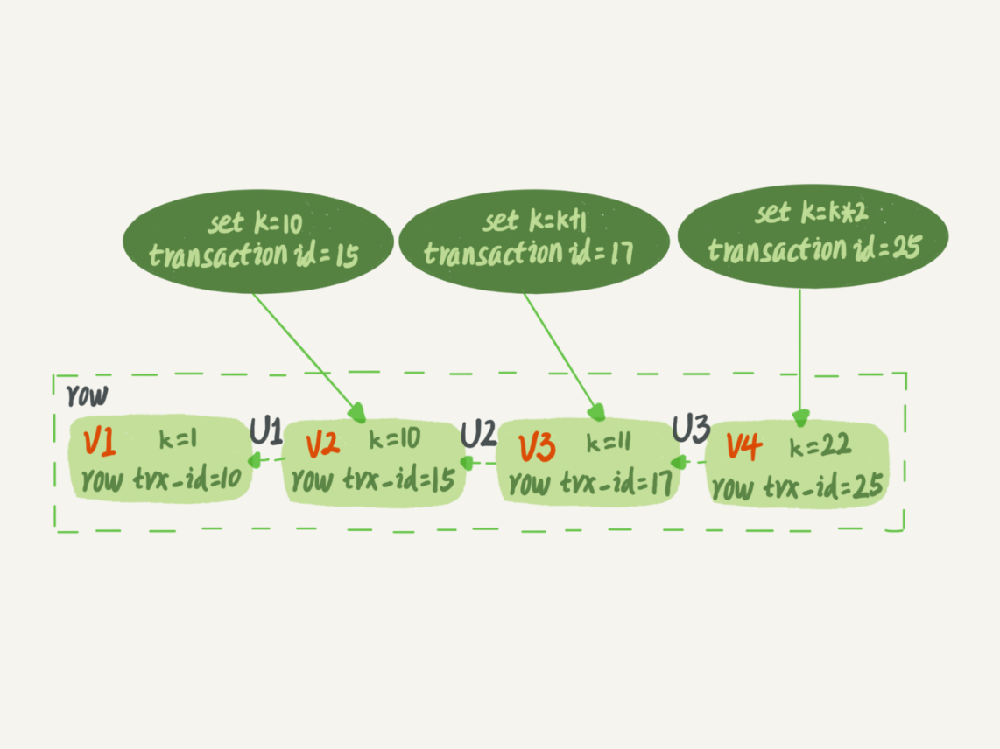

图中虚线框里是同一行数据的 4 个版本，当前最新版本是 V4，k 的值是 22，它是被 transaction id 为 25 的事务更新的，因此它的 row trx_id 也是 25。

语句更新会生成 undo log（回滚日志）吗？那么，undo log 在哪呢？

图中的三个虚线箭头，就是 undo log；而 V1、V2、V3 并不是物理上真实存在的，而是每次需要的时候根据当前版本和 undo log 计算出来的。比如，需要 V2 的时候，就是通过 V4 依次执行 U3、U2 算出来。

明白了多版本和 row trx_id 的概念后，我们再来想一下，InnoDB 是怎么定义那个“100G”的快照的。

按照可重复读的定义，一个事务启动的时候，能够看到所有已经提交的事务结果。但是之后，这个事务执行期间，其他事务的更新对它不可见。

因此，一个事务只需要在启动的时候声明说，“以我启动的时刻为准，如果一个数据版本是在我启动之前生成的，就认；如果是我启动以后才生成的，我就不认，我必须要找到它的上一个版本”。当然，如果“上一个版本”也不可见，那就得继续往前找。还有，如果是这个事务自己更新的数据，它自己还是要认的。

在实现上， InnoDB 为每个事务构造了一个数组，用来保存这个事务启动瞬间，当前正在“活跃”的所有事务 ID。“活跃”指的就是，启动了但还没提交。

数组里面事务 ID 的最小值记为低水位，当前系统里面已经创建过的事务 ID 的最大值加 1 记为高水位。

这个视图数组和高水位，就组成了当前事务的一致性视图（read-view）。

而数据版本的可见性规则，就是基于数据的 row trx_id 和这个一致性视图的对比结果得到的。

这个视图数组把所有的 row trx_id 分成了几种不同的情况。

这样，对于当前事务的启动瞬间来说，一个数据版本的 row trx_id，有以下几种可能：

 如果落在绿色部分，表示这个版本是已提交的事务或者是当前事务自己生成的，这个数据是可见的；

 如果落在红色部分，表示这个版本是由将来启动的事务生成的，是肯定不可见的；

 如果落在黄色部分，那就包括两种情况

 a. 若 row trx_id 在数组中，表示这个版本是由还没提交的事务生成的，不可见；

 b. 若 row trx_id 不在数组中，表示这个版本是已经提交了的事务生成的，可见。

比如，对于图 2 中的数据来说，如果有一个事务，它的低水位是 18，那么当它访问这一行数据时，就会从 V4 通过 U3 计算出 V3，所以在它看来，这一行的值是 11。

有了这个声明后，系统里面随后发生的更新，是不是就跟这个事务看到的内容无关了呢？因为之后的更新，生成的版本一定属于上面的 2 或者 3(a) 的情况，而对它来说，这些新的数据版本是不存在的，所以这个事务的快照，就是“静态”的了。

> 致性视图是在执行第一个快照'读语句'时创建的，说过事务开始就会向 InnoDB 的事务系统申请事务 ID，判断事物开启条件的一种是使用begin并且执行第一个'操作 'InnoDB 表的语句，所以我第一句只执行非select的dml语句就会生成事务id，但是并不会生成一致性视图，在我要执行select的时候 其它事物可能已经创建。
>
> 所以对于视图数组就会出现比当前事务id还大并且没有提交的事物，同理也会出现比当前事务还小且没有提交的事物。所以假如当前事务id为88 ，活跃数组就可能有[72,79,88,90,91] 不连续的原因也知道吧，就是因为在生成一致性视图的时候中间短事务早就提交了 对于可见性如果读取数据中事物id在当前活跃数组有，说明是我创建视图的时候还在活跃的事务我是不能看的。
>
> 如果不在并且在数组范围内说明是我在开启事务时到创建视图期间已经提交的事务，我是可以查看的。
>
> 如果小于活跃数组的最小值， 这个最小值也可以叫做已经提交事务的最大值,（也不绝对，其实数组最小值就是代表小于它的事务都是在我创建一致性视图的时候已经提交了）所以可见。
>
> 大于数组最大值 就是（我创建一致性视图时候当前已经分配的事务ID的最大值+1）那么就不可见

> 数据最终的版本只有一个，每次每个事物在进行快照读的时候，会先取出最终版本，然后根据事物ID判断当前事物是否能读取当前版本数据，如果不行，则通过undolog获取前一个版本，继续同样的判断，直到拿到数据为止。但是如果是更新操作，则必须要当前读，必须要拿到最新版本的数据，此时，如果有其他事物对当前数据加锁了，那就必须等待锁释放。即使是未提交读隔离级别下，更新数据也会加锁，更新的时候同样要等待锁释放。

InnoDB 利用了“所有数据都有多个版本”的这个特性，实现了“秒级创建快照”的能力。

接下来，我们继续看一下图 1 中的三个事务，分析下事务 A 的语句返回的结果，为什么是 k=1。这里，我们不妨做如下假设：

事务 A 开始前，系统里面只有一个活跃事务 ID 是 99；

事务 A、B、C 的版本号分别是 100、101、102，且当前系统里只有这四个事务；

三个事务开始前，(1,1）这一行数据的 row trx_id 是 90。这样，事务 A 的视图数组就是[99,100], 事务 B 的视图数组是[99,100,101], 事务 C 的视图数组是[99,100,101,102]。

为了简化分析，我先把其他干扰语句去掉，只画出跟事务 A 查询逻辑有关的操作：


从图中可以看到，第一个有效更新是事务 C，把数据从 (1,1) 改成了 (1,2)。这时候，这个数据的最新版本的 row trx_id 是 102，而 90 这个版本已经成为了历史版本。第二个有效更新是事务 B，把数据从 (1,2) 改成了 (1,3)。这时候，这个数据的最新版本（即 row trx_id）是 101，而 102 又成为了历史版本。

从图中可以看到，第一个有效更新是事务 C，把数据从 (1,1) 改成了 (1,2)。这时候，这个数据的最新版本的 row trx_id 是 102，而 90 这个版本已经成为了历史版本。

第二个有效更新是事务 B，把数据从 (1,2) 改成了 (1,3)。这时候，这个数据的最新版本（即 row trx_id）是 101，而 102 又成为了历史版本。

你可能注意到了，在事务 A 查询的时候，其实事务 B 还没有提交，但是它生成的 (1,3) 这个版本已经变成当前版本了。但这个版本对事务 A 必须是不可见的，否则就变成脏读了。好，现在事务 A 要来读数据了，它的视图数组是[99,100]。当然了，读数据都是从当前版本读起的。所以，事务 A 查询语句的读数据流程是这样的：找到 (1,3) 的时候，判断出 row trx_id=101，比高水位大，处于红色区域，不可见；接着，找到上一个历史版本，一看 row trx_id=102，比高水位大，处于红色区域，不可见；再往前找，终于找到了（1,1)，它的 row trx_id=90，比低水位小，处于绿色区域，可见。

这样执行下来，虽然期间这一行数据被修改过，但是事务 A 不论在什么时候查询，看到这行数据的结果都是一致的，所以我们称之为一致性读。

一个数据版本，对于一个事务视图来说，除了自己的更新总是可见以外，有三种情况：版本未提交，不可见；版本已提交，但是是在视图创建后提交的，不可见；版本已提交，而且是在视图创建前提交的，可见。现在，我们用这个规则来判断图 4 中的查询结果，事务 A 的查询语句的视图数组是在事务 A 启动的时候生成的，这时候：(1,3) 还没提交，属于情况 1，不可见；(1,2) 虽然提交了，但是是在视图数组创建之后提交的，属于情况 2，不可见；(1,1) 是在视图数组创建之前提交的，可见。你看，去掉数字对比后，只用时间先后顺序来判断，分析起来是不是轻松多了。所以，后面我们就都用这个规则来分析。


#### 更新逻辑

事务 B 的 update 语句，如果按照一致性读，好像结果不对哦？

你看图 5 中，事务 B 的视图数组是先生成的，之后事务 C 才提交，不是应该看不见 (1,2) 吗，怎么能算出 (1,3) 来？


是的，如果事务 B 在更新之前查询一次数据，这个查询返回的 k 的值确实是 1。但是，当它要去更新数据的时候，就不能再在历史版本上更新了，否则事务 C 的更新就丢失了。因此，事务 B 此时的 set k=k+1 是在（1,2）的基础上进行的操作。

> 更新数据都是先读后写的，而这个读，只能读当前的值，称为“当前读”（current read）。
>
> 其实就是针对buffer pool直接进行修改。 此时的update 为什么能够进行当前读呢，是依靠的行锁。 当前读保证读到的是已经提交的，因为行锁是两阶段锁。


#### 事务的可重复读的能力是怎么实现的？

可重复读的核心就是一致性读（consistent read）；而事务更新数据的时候，只能用当前读。如果当前的记录的行锁被其他事务占用的话，就需要进入锁等待。

而读提交的逻辑和可重复读的逻辑类似，它们最主要的区别是：

在可重复读隔离级别下，只需要在事务开始的时候创建一致性视图，之后事务里的其他查询都共用这个一致性视图；

在读提交隔离级别下，每一个语句执行前都会重新算出一个新的视图。

这里需要说明一下，“start transaction with consistent snapshot; ”的意思是从这个语句开始，创建一个持续整个事务的一致性快照。所以，在读提交隔离级别下，这个用法就没意义了，等效于普通的 start transaction。下面是读提交时的状态图，可以看到这两个查询语句的创建视图数组的时机发生了变化，就是图中的 read view 框。（注意：这里，我们用的还是事务 C 的逻辑直接提交，而不是事务 C’）


#### 小结

InnoDB 的行数据有多个版本，每个数据版本有自己的 row trx_id，每个事务或者语句有自己的一致性视图。普通查询语句是一致性读，一致性读会根据 row trx_id 和一致性视图确定数据版本的可见性。

对于可重复读，查询只承认在事务启动前就已经提交完成的数据；对于读提交，查询只承认在语句启动前就已经提交完成的数据；

而当前读，总是读取已经提交完成的最新版本。

表结构不支持“可重复读”是因为表结构没有对应的行数据，也没有 row trx_id，因此只能遵循当前读的逻辑。当然，MySQL 8.0 已经可以把表结构放在 InnoDB 字典里了，也许以后会支持表结构的可重复读。

现在，我要把所有“字段 c 和 id 值相等的行”的 c 值清零，但是却发现了一个“诡异”的、改不掉的情况。

> mysql> CREATE TABLE `t` (
>
> `id` int(11) NOT NULL,
>
> `c` int(11) DEFAULT NULL,
>
> PRIMARY KEY (`id`)
>
> ) ENGINE=InnoDB;
>
> insert into t(id, c) values(1,1),(2,2),(3,3),(4,4);


（1）事务A：begin;select * from t; 事务B：update t set c=0 where id=c；事务B隐式提交

（2）此时事务A执行update t set c=0 where id=c；这里update是当前读，读取的是最新版本的记录，那么id=c的记录已经在B事务中被修改了，此时update就失败了

（3）事务A继续执行查询select * from t；查询是一致性读，读的是begin后面执行的那句查询创建的视图

> 解决方法，第一个select改成select for update。

### 举例

面列了这么多种类的锁，下面通过一个简单的例子说明各种锁是如何作用的，它们加锁和释放锁的先后顺序如何。这里假设隔离级别是RC，ID为主键。


#### 更新sql解析示例

```
begin：
update t3 set c1=1 where id=1;
commit;
```

加锁的顺序：

| 流程 | 执行语句                                     | 执行内容                                    | 字典锁                                      | 行锁/表锁      |
| ---- | -------------------------------------------- | ------------------------------------------- | ------------------------------------------- | -------------- |
| 1    | Begin                                        |                                             | 释放MDLrelease_transactional_locks          | 释放表锁，行锁 |
| 2    | update t3 set c1=1 where id=1;               | 上字典锁                                    | GLOBAL:STATMENTMDL_INTENTION_EXCLUSIVE      |                |
| 3    | TABLE:TRANSACTIONMDL_SHARED_WRITE            |                                             |                                             |                |
| 4    | 上行锁                                       |                                             | LOCK_TABLE:IX(table:t3)                     |                |
| 5    |                                              | LOCK_REC:X(id=1)                            |                                             |                |
| 6    | 执行更新                                     |                                             |                                             |                |
| 7    | 释放MDL                                      | GLOBAL:STATMENT                             |                                             |                |
| 8    | commit;                                      | COMMIT字典锁                                | COMMIT: MDL_EXPLICITMDL_INTENTION_EXCLUSIVE |                |
| 9    | 执行提交                                     |                                             |                                             |                |
| 10   | 释放引擎锁                                   |                                             | lock_release                                |                |
| 11   | 释放MDL                                      | COMMIT: MDL_EXPLICITMDL_INTENTION_EXCLUSIVE |                                             |                |
| 12   | release_transactional_locksTABLE:TRANSACTION |                                             |                                             |                |


#### 常用语句加锁分析

假设隔离级别：RC，id为主键

| 典型语句                                                     | SQL层面（MDL锁）                   | 存储引擎innodb  |      |      |
| ------------------------------------------------------------ | ---------------------------------- | --------------- | ---- | ---- |
|                                                              |                                    |                 |      |      |
| 范围/对象                                                    | 持有时间                           | 表锁            | 行锁 |      |
| SELECT操作SELECT * FROM T                                    | TABLE：MDL_SHARED_READ             | MDL_TRANSACTION | None | None |
| Show create table T                                          | TABLE:MDL_SHARED_HIGH_PRIO         | MDL_TRANSACTION |      |      |
| LOCK TABLE T READ                                            | TABLE:MDL_SHARED_READ              | MDL_TRANSACTION | None | None |
| LOCK TABLE T WRITE                                           | GLOBAL：MDL_INTENTION_EXCLUSIVE    | MDL_STATEMENT   | None | None |
| SCHEMA:MDL_INTENTION_EXCLUSIVETABLE：MDL_SHARED_NO_READ_WRITE | TRANSACTION                        |                 |      |      |
| Flush table t with read lock                                 | TABLE:MDL_SHARED_NO_WRITE          | TRANSACTION     | None | None |
| Flush table with read lock                                   | GLOBAL:MDL_SHARED                  | MDL_EXPLICIT    | None | None |
| COMMIT:MDL_SHARED                                            | MDL_EXPLICIT                       |                 |      |      |
| DML操作 SELECT * FROM T FOR UPDATE;Update T set c1=? Where id=? | GLOBAL:MDL_INTENTION_EXCLUSIVE     | MDL_STATEMENT   | IX   | X    |
| TABLE:MDL_SHARED_WRITE                                       | TRANSACTION                        |                 |      |      |
| DDL操作Alter table t add column c1 int;Truncate table t;     | GLOBAL:MDL_INTENTION_EXCLUSIVE     | MDL_STATEMENT   | None | X    |
| SCHEMA:MDL_INTENTION_EXCLUSIVETABLE:MDL_EXCLUSIVE            | TRANSACTION                        |                 |      |      |
| COMMIT:MDL_INTENTION_EXCLUSIVE                               | MDL_EXPLICIT                       |                 |      |      |
| Set global read_only=1;                                      | GLOBAL:MDL_SHAREDCOMMIT:MDL_SHARED | MDL_EXPLICIT    | None | None |


### 留几个问题

欢迎大家公众号留言交流～～

Q1：当你看完这篇文章后，在不翻的情况下，你认为mysql有哪些类型锁？

Q2：你认为我们平时写的CRUD 这几种常见sql 的 锁流程是怎么样的？

Q3：市面上，有哪种存储中间件（有crud）我们觉得锁相对简单？为什么

[^]: 


## MySQL 如何找到死锁的SQL

### 查看当前连接Id（线程Id）

```
select` `connection_id();
```


### 可以通过查看表information_schema.innodb_lock，获取锁的状态

```
select * from information_schema.innodb_locks;
```


### 查看系统参数锁超时时间 innodb_lock_wait_timeout

```
show variables like innodb_lock_wait_timeout;
```


### 查看未提交的事务

```
SELECT * from information_schema.INNODB_TRX
```


### 获取事物的描述

```
show engine innodb status\G
```

主要看TRANSACTIONS 这部分


### 如何解决未提交的事务

1）如果能知道哪个用户在执行这个操作，让他提交一下（这种可能性很小）

2）kill掉这个线程id号，让事务回滚

 `show processlist;`

 获取所有处理线程，找到相对应引起死锁的线程Id

 `kill Id`


------


# 高阶篇

## MySQL InnoDB 关于行格式页结构表空间的数据结构

### 背景

我们都知道，InnoDB 是 MySQL 默认的存储引擎，那么它对于数据时如何处理的呢？

InnoDB 是一个将表中的数据存储到磁盘上的存储引擎，所以即使关机后重启我们的数据还是存在的。而真正处理数据的过程是发生在内存中的，所以需要把磁盘中的数据加载到内存中，如果是处理写入或修改请求的话，还需要把内存中的内容刷新到磁盘上。

而我们知道读写磁盘的速度非常慢，和内存读写差了几个数量级，所以当我们想从表中获取某些记录时，InnoDB 存储引擎需要一条一条的把记录从磁盘上读出来吗？这势必会耗费大量的时间。

因此，InnoDB 采取的方式是：将数据划分为若干个页，以页作为磁盘和内存之间交互的基本单位，InnoDB 中页的大小一般为 **16KB**（可以理解为 B+Tree 一个叶子节点存放的数据大小）。也就是在一般情况下，一次最少从磁盘中读取 16KB 的内容到内存中，一次最少把内存中的 16KB 内容刷新到磁盘中。

> 万物皆文件，平时用惯了MySQL一些API（包括sql），那么让我们看看它的背后是如何支撑这些的？


### 一、InnoDB 行格式

 我们平时都是以记录为单位向表中插入数据的，这些记录在磁盘上的存放形式就被称为行格式或者行记录格式。目前 InnoDB 存储引擎支持 4 种不同类型的行格式，分别是 COMPACT、REDUNDANT、DYNAMIC 以及 COMPRESSED。


#### 1 指定行格式的语法

```
CREATE TABLE 表名 （列信息）ROW_FORMAT=行格式名称;
ALTER TABLE 表名 ROW_FROMAT=行格式名称;
```

为了方便演示，创建一个用于演示的表，如下所示：

```
# 建表

CREATE TABLE row_format_demo (
	c1 VARCHAR(10),
	c2 VARCHAR(10) NOT NULL,
	c3 CHAR(10),
	c4 VARCHAR(10)
)CHARSET=ascii ROW_FORMAT=COMPACT;

# 这里字符集采用 ascii，这种字符集只包括空格、标点符号、数字、字母以及一些不可见字符，并且每一个字符都是占用 1 字节。

# 插入两条数据

INSERT INTO 
	row_format_demo (c1, c2, c3, c4) 
VALUES 
	('aaaa', 'bbb', 'cc', 'd'), 
	('eeee', 'fff', 'NULL', 'NULL');
```


#### 2 COMPACT行格式



COMPACT 行格式示意图

从 COMPACT 行格式的示意图中可以看出，一条记录其实被分为记录的额外信息和记录的真实数据两大部分。


##### 2.1 记录的额外信息

 这部分信息是为了更好地管理记录而不得不额外添加的信息。这些信息分为 3 个部分，分别是变长字段长度列表、NULL值列表和记录头信息。

###### 2.1.1 变长字段长度列表

 各个变长字段的真实数据所占用的字节数以十六进制的形式按照列顺序的逆序存放在变长字段长度列表中。第一条记录的变长字段长度列表存储的值如下图所示：




第一条记录的存储格式

 由于第一条记录中 c1、c2 和 c4 这三个字段中存储的字符串都比较短，所以用 1 个字节就可以表示字段存储的真实数据所占用的字节数了。但是如果字段存储的内容占用的字节数比较多，可能就需要用 2 字节来表示了。至于用 1 字节还是 2 字节，InnoDB 是这样规定的：

●假设某个字符集表示一个字符最多需要 W 字节。（可以通过执行 show charset；语句查看）

●对于变长类型 VARCHAR(M) 来说，这种类型表示最多能存储 M 个字符。那么，这种类型存储的数据最多占用 M × W 字节。

●假设该变长字段世纪存储的数据占用 L 字节。

规则如下：

●如果 M × W ≤ 255，那么使用 1 字节来表示真实数据占用的字节数。

●如果 M × W > 255，则分两种情况：

○如果 L ≤ 127，则使用 1 字节来表示；

○如果 L > 127，则使用 2 字节来表示。

> 总结一下就是：如果该变长字段允许存储的最大字节数超过 255 字节，并且真实数据占用的字节数超过 127 字节，则使用 2 字节来表示真实数据占用的字节数，否则使用 1 字节来表示。

 InnoDB在读取记录的变长字段长度列表时，会先查看表结构。如果某个变长字段允许存储的最大字节数大于 255，那么，怎么区分它正在读的某个字节是一个单独的字节来表示字段长度还是用 2 字节表示字段长度时其中的一个字节呢？其实在设计的时候，使用了该字节的第一个二进制位作为标志位：

●如果该字节的第一个位为 0，则该字节表示一个变长字段的长度；

●如果该字节的第一个位为 1，则需要两个字节来表示字段长度，该字节只是其中的一个字节。

另外需要注意的是：

●对于一条记录来说，如果某个字段占用的字节数非常多，那么 InnoDB 有可能把该字段的值的一部分数据存放到溢出页中。这样的话，该字段在记录的变长字段长度列表中只存储留在本页面中的数据的长度。

●变长字段长度列表中只存储值不为 NULL 的字段的内容长度。

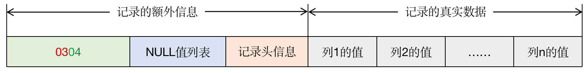

第二条记录的存储格式

●不是所有记录都有变长字段长度列表的，如果表中所有字段都不是变长的数据类型，或者有变长数据类型的字段，但值都是 NULL 的话，就不需要变长字段长度列表。

###### 2.1.2 NULL 值列表

 COMPACT 行格式设计了 NULL 值列表来统一管理记录中值为 NULL 的列，将值为 NULL 的列在 NULL 值列表中标识出来。具体的处理过程如下：

●首先统计表中允许存储 NULL 值的列。统计的时候主键以及用 NOT NULL 修饰的列是不需要统计的。

●如果表中没有允许存储 NULL 值的列，那么该条记录就不会有 NULL 值列表，否则将每个允许存储 NULL 值的列对应一个二进制位，二进制位按照列顺序的逆序排列。二进制位表示的意义如下：

○二进制位的值为 1 时，代表该列的值为 NULL；

○二进制位的值为 0 时，代表该列的值不为 NULL。

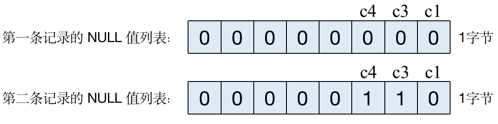



○NULL 值列表必须用整数个字节的位来表示，如果使用的二进制位个数不是整数个字节，则在该字节的高位补 0。



填充了 NULL 值列表后的示意图

###### 2.1.3 记录头信息

 记录头信息由固定的 5 字节组成，用于描述记录的一些属性。5 字节共 40 个二进制位，不同的位代表不同的意思。



记录头信息示意图

| 名称         | 大小（位） | 描述                                                         |
| ------------ | ---------- | ------------------------------------------------------------ |
| 预留位1      | 1          | 没有使用                                                     |
| 预留位2      | 1          | 没有使用                                                     |
| deleted_flag | 1          | 标记该记录是否被删除                                         |
| min_rec_flag | 1          | B+ 树的每层非叶子节点中最小的目录项目记录都会添加该标记      |
| n_owned      | 4          | 一个页面中的记录会被分成若干个组，每个组中有一个记录是“带头大哥“，其余的记录都是”小弟“。”带头大哥“记录的 n_owned 值表示该组中所有的记录条数，“小弟”记录的 n_owned 值都为 0 |
| heap_no      | 13         | 表示当前记录在页面堆中的相对位置                             |
| record_type  | 3          | 表示当前记录的类型，0 表示普通记录，1 表示 B+ 树非叶子节点的目录项记录，2 表示 Infimum 记录，3 表示Supremum 记录 |
| next_record  | 16         | 表示下一条记录的相对位置                                     |


##### 2.2 记录的真实数据

 对于存储引擎是 InnoDB 的表来说，MySQL 会为每条记录添加一些隐藏列：

| 列名        | 是否必需 | 占用空间 | 描述                    |
| ----------- | -------- | -------- | ----------------------- |
| DB_ROW_ID   | 否       | 6字节    | 行 ID，唯一标识一条记录 |
| DB_TRX_ID   | 是       | 6字节    | 事物 ID                 |
| DB_ROLL_PTR | 是       | 7字节    | 回滚指针                |

加上真实数据后，两条记录如下图所示：


根据以上我们的分析，我们通过hexdump（或者用notepad++ 插件方式HEX-editor）指令来分析一下示例表的数据文件。结果如下：这里只截了一部分，即包含行数据的部分。

> 文件位置在，mysql data 目录下，按照数据库名称为文件夹，表名为文件名，
>
> 比如test数据库的row_format_demo表，对应表数据在 data/test目录找到row_format_demo.ibd


因此我们可以得到前两行的行记录为：

| 说明   | 变长字段 | NULL值列表 | 记录头信息     | row_id            | trx_id            | roll_pointer         | c1列        | c2列     | c3列                          | c4列 |
| ------ | -------- | ---------- | -------------- | ----------------- | ----------------- | -------------------- | ----------- | -------- | ----------------------------- | ---- |
| 第一行 | 01 03 04 | 00         | 00 00 10 00 2d | 00 00 03 67 c5 78 | 00 00 13 82 3e 9e | a6 00 00 c0 2c 01 10 | 61 61 61 61 | 62 62 62 | 63 63 20 20 20 20 20 20 20 20 | 64   |
| 第二行 | 03 04    | 06         | 00 00 18 ff c2 | 00 00 03 67 c5 79 | 00 00 13 82 3e 9f | a7 00 00 01 ca 01 10 | 65 65 65 65 | 66 66 66 |                               |      |


##### 2.3 CHAR(M) 列的存储格式

 对于 CHAR(M) 类型的列来说，当采用的是定长编码字符集时，该列占用的字节数不会记录到变长字段长度列表中；而如果采用的是变长编码字符集时，该列占用的字节数会被记录到变长字段长度列表中。

 另外还有一点需要注意，在 COMPACT 行格式下，采用变长编码字符集时，CHAR(M) 类型的列要求至少占用 M 个字节长度。这样的话，在将来更新该列的值时，如果新值的字节长度大于旧值但不大于 M 字节时，可以在该记录处直接更新，不需要重新分配新的记录空间，一定程度上避免了内存碎片的产生。

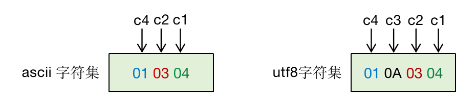



 第一条记录在不同字符集下变长字段长度列表的变化


#### 3 REDUNDANT 行格式

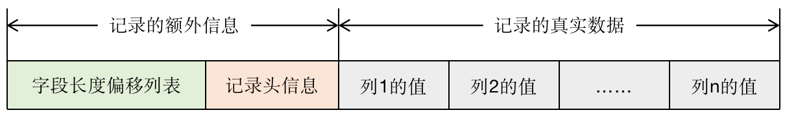

 REDUNDANT 行格式示意图


##### 3.1 记录的额外信息

###### 3.1.1 字段长度偏移列表

 字段长度偏移列表存储的偏移量指的是每个列的值占用的空间在记录的真实数据处结束的位置。

 字段长度偏移列表与变长字段长度列表相比，有两处不同：

●没有“变长”两个字，意味着 REDUNDANT 行格式会把该条记录中所有列（包括隐藏列）的长度信息都按照列顺序的逆序存储到字段长度偏移列表中；

●多了“偏移”两个字，意味着字段长度偏移列表不是记录字段存储值的长度，而是采用两个相邻偏移量的差值来计算各个列值的长度。



REDUNDANT 行格式下两条记录的具体格式

###### 3.1.2 记录头信息

 REDUNDANT 行格式的记录头信息占用 6 字节，总共 48 个二进制位。

| 名称            | 大小（位） | 描述                                                         |
| --------------- | ---------- | ------------------------------------------------------------ |
| 预留位1         | 1          | 没有使用                                                     |
| 预留位2         | 1          | 没有使用                                                     |
| deleted_flag    | 1          | 标记该记录是否被删除                                         |
| min_rec_flag    | 1          | B+ 树的每层非叶子节点中最小的目录项目记录都会添加该标记      |
| n_owned         | 4          | 一个页面中的记录会被分成若干个组，每个组中有一个记录是“带头大哥“，其余的记录都是”小弟“。”带头大哥“记录的 n_owned 值表示该组中所有的记录条数，“小弟”记录的 n_owned 值都为 0 |
| heap_no         | 13         | 表示当前记录在页面堆中的相对位置                             |
| n_field         | 10         | 表示记录中列的数量                                           |
| 1byte_offs_flag | 1          | 标记字段长度偏移列表中每个列对应的偏移量是使用 1 字节还是 2 字节来表示的。值为 1 时，表示使用 1 字节存储偏移量；值为 0 时，表示使用 2 字节存储偏移量。 |
| next_record     | 16         | 表示下一条记录的相对位置                                     |

与 COMPACT 行格式的记录头信息相比，有两处不同：

●REDUNDANT 行格式多了 n_field 和 1byte_offs_flag 两个属性；

●REDUNDANT 行格式没有 record_type 这个属性。


###### 3.1.3 1byte_offs_flag 的值怎么确定

●记录的真实数据占用的存储空间不大于 127 字节时，每个列对应的偏移量占用 1 字节。

●当记录的真实数据占用的存储空间大于 127 字节，但是不大于 32767 字节时，每个列对应的偏移量占用 2 字节。

●如果记录的真实数据占用的存储空间大于 32767 字节，此时该记录的一部分已经存储到溢出页中，在本页只保留前 768 字节和 20 字节的溢出页的地址。这种情况下，也是使用 2 字节来表示每个列对应的偏移量。

一个字节表示的范围是 0～255，为什么大于 127 就要采用 2 字节呢？这是为了对值为 NULL 的列进行特殊处理。


###### 3.1.4 REDUNDANT 行格式中 NULL 值的处理

 REDUNDANT 行格式中是没有 NULL 值列表的，但是在字段长度偏移列表中，将每个列对应的偏移量值的第一个比特位作为该条记录中该列是否为 NULL 值的标识，如果偏移量的第一个比特位为 1，那么该列的值为 NULL，否则该列的值不为 NULL。

 但是，对于值为 NULL 的列来说，该列的数据类型是否为变长类型决定了该列在记录中的真实数据中的存储方式：

●如果存储 NULL 值的列是定长类型的，比如 CHAR(M)，则在记录的真实数据中也会记录该列，并且用 0x00 填充。如第二条记录中，c3 列对应的偏移量为 0xA4，对应的二进制为 10100100，最高位为 1，说明 c3 列值为 NULL。去掉最高位后变成 0100100，对应的十进制值为 36，而 c2 列对应的偏移量为 1A，对应的十进制值为 26，所以 c3 列占用的存储空间为 36 - 26 = 10 字节。

●如果存储 NULL 值的列是变长的数据类型，则不在记录的真实数据中记录该列。如第二条记录中的 c4 列，偏移量为 0xA4，与 c3 列的偏移量相同，以为着 c4 列不在记录的真实数据出占用任何存储空间。


###### 3.1.5 CHAR(M) 列的存储格式

 不管使用什么字符集，只要使用 CHAR(M) 类型，那么该列在真实数据处占用的存储空间为 M × W 个字节（M 和 W 在上文中有解释）。这样虽然避免了在更新数据时，为记录申请新的存储空间，但是也可能会浪费一些存储空间。


#### 4 溢出列

 在 COMPACT 行格式和 REDUNDANT 行格式下，如果一条记录的某个列中存储的数据占用的字节数非常多，那么在记录的真实数据中只会存储该列的一部分数据（前768字节），剩余的数据分散存储在几个其他的页中，然后在记录的真实数据处用 20 字节存储指向这些页面的地址，当然也会记录在其他页面中的数据所占用的字节数。这个需要其他页面来存储数据的列就成为溢出列，而存储 768 字节外的数据的页面就成为溢出页。


#### 5 DYNAMIC 行格式和 COMPRESSED 行格式

 MySQL5.7版本的默认行格式就是 DYNAMIC。DYNAMIC 和 COMPRESSED 这两种行格式与 COMPACT 行格式很相似，只是在处理溢出列的数据时有点不同，它们不会在记录的真实数据中存储该溢出列的前 768 字节，而是把该列的所有真实 数据都存储到溢出页中，只是在记录的真实数据处存储 20 字节大小的指向溢出页的地址。而 COMPRESSED 行格式与 DYNAMIC 行格式的不同之处是：COMPRESSED 行格式会采用压缩算法对页面进行压缩，以节省空间。


### 二、InnoDB的数据页结构

 页是 InnoDB 管理存储空间的基本单位，一个页的大小一般是 16KB。

#### 1 数据页的结构

 数据页主要划分为 7 个部分，如下图所示：






#### 2 记录在页中的存储





##### 2.1 记录头信息

为了方便演示，创建一个用于演示的表，如下所示：

```
# 建表
CREATE TABLE page_demo (
	c1 INT,
	c2 INT,
	c3 VARCHAR(10000),
    PRIMARY KEY (c1)
)CHARSET=ascii ROW_FORMAT=COMPACT;

# 这里字符集采用 ascii，这种字符集只包括空格、标点符号、数字、字母以及一些不可见字符，并且每一个字符都是占用 1 字节。

# 插入4条数据
INSERT INTO 
	page_demo (c1, c2, c3) 
VALUES 
	(1, 100, 'aaaa'), 
	(2, 200, 'bbbb'),
	(3, 300, 'cccc'),
	(4, 400, 'dddd');
```

现在我们主要介绍记录头信息部分，所以将行格式简化一下，如下图所示：

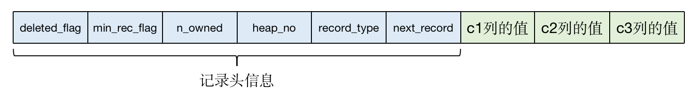



那么，四条记录的都示意图如下所示，为了方便，所有数值均用十进制表示。

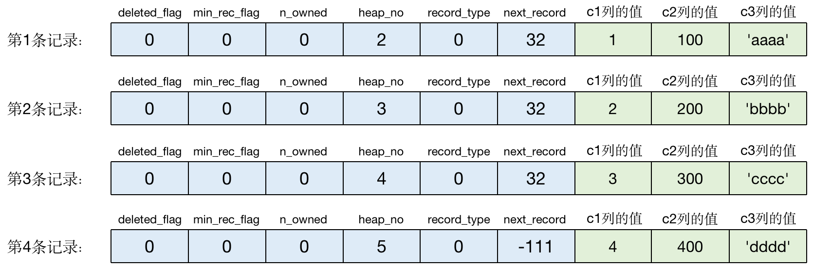

●deleted_flag：这个属性是用来标记当前记录是否被删除，值为 0 表示没有被删除，值为 1 表示记录已经被删除。记录被删除后不会真正将该条记录从磁盘上移除，因为移除后，还需要重新排列其他的记录，这样会带来性能上的消耗。

●min_rec_flag：这个属性这个以后介绍索引的时候再详细介绍。

●heap_no：记录在 User Records 中的相对位置。heap_no 的 0 和 1 这两个值比较特殊，InnoDB 默认给每个数据页加了两条虚拟记录，一条代表页面的最小记录（Infimum记录），另一条代表页面的最大记录（Supremum记录），这两条虚拟记录存储在页面的 Infimum + Supremum 部分。这里记录的大小是以记录的主键的大小做为判断依据的，并且规定任何用户记录都比 Infimum 记录大，比 Supremum 记录小。还有一点需要注意的是，heap_no 的值在分配之后就不会发生改变了，即使这条记录被删除也不会改变。

●record_type：这个属性用于区分当前记录的类型，上面表格有介绍。

●next_record：这个属性表示从当前记录的真实数据到下一条记录的真实数据的距离。如果值为正数，说明下一条记录在当前记录的后面；如果值为负数，说明下一条记录在当前记录的前面。需要注意的是，记录的前后位置不是按记录插入的先后顺序排列的，而是按照主键值由小到大的顺序来排列记录的前后顺序的。注意到 next_record 指针的指的位置上在记录头信息和记录的真实数据之间，这样设计的目的是：在这个位置，向左可以读取记录头信息，向右可以读取记录的真实数据。next_record 指针指在这个位置，也解释了为什么前面说的变长字段长度列表、NULL 值列表和字段长度偏移列表都是按照列顺序的逆序排列的，这样可以使记录中位置靠前的列和它们对应的字段长度信息在内存中的距离更近，从而提高高速缓存的命中率。





当然各位也可以通过代码读取：

```
import os

def get_innodb_page_type():
    f=open("page_demo.ibd",'rb')
    # 计算该表空间有多少页,以一页16K计算
    fsize=os.path.getsize(f.name) // (1024 * 16)
    # 遍历页数
    for i in range(fsize):
        # 每次读16K
        page=f.read(1024 * 16)
        # 取File Header中的FIL_PAGE_OFFSET
        page_offset=page[4:(4+4)].hex()
        # 取File Header中FIL_PAGE_TYPE
        page_type=page[24:(24+2)].hex()
        # 判断是否为数据页
        if page_type == '45bf':
            page_level=page[(38+26):(38+26+2)]
            print("page offset %s, page type <%s>, page level <%s>" %(page_offset,page_type,page_level))
        else:
            print("page offset %s, page type <%s>" %(page_offset,page_type))

if __name__ == '__main__':
	get_innodb_page_type()
```


#### 3 Page Directory（页目录）

 上文说到，页中的记录会按照主键由大到小串联成一个单链表，那么怎么在页中根据主键值查找某条记录呢？InnoDB 结合了目录以及二分查找算法的思想：

●将除了已被删除的记录外的所有记录（包括 Infimum 和 Supremum 记录）分成划分成几个组；

●每个组中最大的那条记录相当于“带头大哥”，组内其余记录相当于“小弟”。这个“带头大哥”记录的头信息中的 n_owned 属性就会记录该组内共有多少条记录，而“小弟”记录的头信息中的 n_owned 属性的值为 0；

●将每个组中的”带头大哥“在页面中的偏移量取出来，这些偏移量按顺序存储起来，就形成了页目录（Page Directory）。页目录中这些偏移量称为槽（Slot），每个槽占用 2 个字节，并且槽对应的记录越小，这个槽的位置就越靠近 File Trailer。

●Infimum 和 Supremum 记录的头信息中的 n_owned 属性比较特殊：●Infimum 记录独自成一个组，所以 Infimum 记录的头信息中的 n_owned 属性值为 1；●因为 Supremum 记录是页中最大的记录，所以 Supremum 记录永远是“带头大哥”。

InnoDB 对每个组中记录的数量是有规定的：

●Infimum 记录独自成一个组；

●Supremum 记录所在的组的记录条数为 1～8 条；

●其余分组中记录条数为 4～8 条；

●在插入一条用户记录时，都会从页目录中找到对应记录的主键值比待插入记录的主键值大且差值最小的槽，将槽对应记录的 n_owned 属性值加 1，表示组内新增了一条记录，直到该组中的记录数等于 8；

●当一个组内的记录数等于 8 后，此时如果再插入新记录，就会将这个组拆分成两个组，其中一个组有 4 条记录，另一个组有 5 条记录。

所以在页中根据主键值查找某条记录大致是这样做的：首先用过二分法确定记录所在的分组对应的槽，然后找到槽所在分组中主键最小的那条记录（上一个槽对应记录的下一条记录），然后通过记录的 next_record 属性遍历槽所在的组中的记录。


#### 4 Page Header（页面头部）

页面头部记录了数据页中记录的状态信息，固定占用 56 字节的存储空间，其包含的信息如下所示：

| 状态名称          | 占用空间大小 | 描述                                                         |
| ----------------- | ------------ | ------------------------------------------------------------ |
| PAGE_N_DIR_SLOTS  | 2字节        | 在页目录中的槽数量                                           |
| PAGE_HEAP_TOP     | 2字节        | 还未使用的空间最小地址，意味着从该地址之后就是Free Space     |
| PAGE_N_HEAP       | 2字节        | 第 1 位表示本记录是否为紧凑型的记录，剩余的 15 位表示本页的堆中记录的数量（包括Infimum 和 Supremum 记录以及标记为“已删除”的记录） |
| PAGE_FREE         | 2字节        | 各个已删除的记录通过 next_record 组成一个单向链表，这个单向链表中的记录占用的存储空间可以被重新利用；PAGE_FREE 表示该链表头节点对应记录在页面中的偏移量。 |
| PAGE_GARBAGE      | 2字节        | 已删除记录占用的字节数                                       |
| PAGE_LAST_INSERT  | 2字节        | 最后插入记录的位置                                           |
| PAGE_DIRECTION    | 2字节        | 记录插入的方向                                               |
| PAGE_N_DIRECTION  | 2字节        | 一个方向连续插入的记录数量                                   |
| PAGE_N_RECS       | 2字节        | 该页中用户记录的数量（不包括Infimum 和 Supremum 记录以及已删除的记录） |
| PAGE_MAX_TRX_ID   | 8字节        | 修改当前页的最大事物 id，该值仅在二级索引页面中定义          |
| PAGE_LEVEL        | 2字节        | 当前页在 B+ 树中所处的层级                                   |
| PAGE_INDEX_ID     | 8字节        | 索引 ID，表示当前页属于哪个索引                              |
| PAGE_BTR_SEG_LEAF | 10字节       | B+ 树叶子节点段的头部信息，仅在 B+ 树的根页面中定义          |
| PAGE_BTR_SEG_TOP  | 10字节       | B+ 树非叶子节点段的头部信息，仅在 B+ 树的根页面中定义        |



#### 5 File Header（文件头部）

 Page Header 是专门用户数据页的，而 File Header 则是各种类型的页都有，也是用于描述各种页的信息，固定占用 38 字节的存储空间，其包含的信息如下所示：

| 状态名称                         | 占用空间大小 | 描述                                                         |
| -------------------------------- | ------------ | ------------------------------------------------------------ |
| FIL_PAGE_SPACE_OR_CHKSUM         | 4字节        | 当 MySQL 的版本低于 4.0.14 时，该属性表示本页面所在的表空间 ID；在之后的版本中，该属性表示页的校验和 |
| FIL_PAGE_OFFSET                  | 4字节        | 页号：能唯一定位一个页                                       |
| FIL_PAGE_PREV                    | 4字节        | 上一个页的页号                                               |
| FIL_PAGE_NEXT                    | 4字节        | 下一个页的页号                                               |
| FIL_PAGE_LSN                     | 8字节        | 页面被最后修改时对应的LSN（Log Sequence Number，日志序列号）值 |
| FIL_PAGE_TYPE                    | 2字节        | 该页的类型                                                   |
| FIL_PAGE_FILE_FLUSH_LSN          | 8字节        | 仅在系统表空间的第一个页中定义，代表文件至少被刷新到了对应的 LSN 值 |
| FIL_PAGE_ARCH_LOG_NO_OR_SPACE_ID | 4字节        | 页属于哪个表空间                                             |




#### 6 File Trailer（文件尾部）

 InnoDB 最终会以页为单位将数据存储到磁盘上，但是磁盘速度太慢。这个 File Trailer 就可以配合 File Header 来对数据页进行校验。

 File Trailer 也是所有类型的页面都拥有的，占了 8 字节的空间，前 4 字节代表页的校验和，在将页刷到磁盘前会把页面的校验和算出来，存储到 File Header 的 FIL_PAGE_SPACE_OR_CHKSUM 中，因为 File Header 在页面头部，所以先被刷新到磁盘，当写完后，这个校验和也会被写到 File Trailer 中，如果页刷新成功，那么 File Header 和 File Trailer 的校验和应该是一样的。

 后面 4 字节 代表页面被最后修改时对应的 LSN 的后 4 字节，正常情况下也会和 File Header 中 FIL_PAGE_LSN 属性值的后 4 字节相同，这个部分也是用于校验页的完整性的。



### 三、InnoDB 的表空间

 InnoDB 支持许多种类型的表空间，像系统表空间、独立表空间等等。我们这里主要是介绍独立表空间。


#### 1 独立表空间

 每个独立表空间对应着文件系统中一个名为“表名.ibd”的实际文件，可以把表空间想象成一个存放着很多页的容器。表空间中每一个页都对应着一个页号，存放在 File Header 中的 FIL_PAGE_OFFSET 属性中，可以通过页号快速定位到指定的页面。FIL_PAGE_OFFSET 占用 4 字节的存储空间，所以一个表空间最多可以拥有 2^32 次方个页，按照每个页默认 16KB 来算，一个表空间最多支持 64TB 的数据。


##### 1.1 区、组的概念

 表空间最多可以拥有 2^32 个页面，为了更好地管理这些页面，就提出了区（extent）和组的概念。对于 16KB 的页来说，连续的 64 个页就是一个区，算下来一个区占用 1MB 存储空间，然后每 256 个区被划分成一个组。

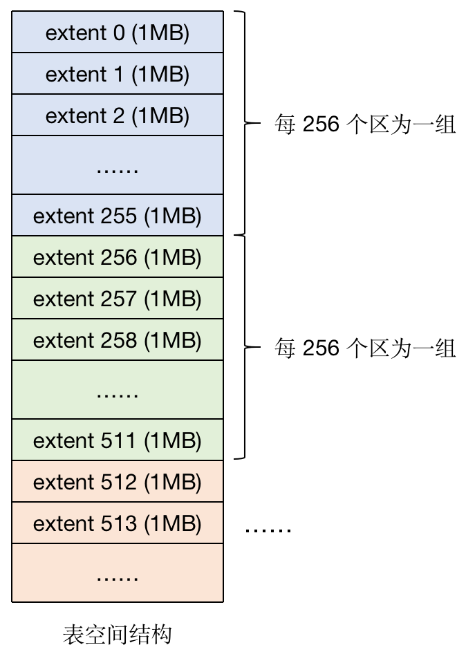



 第一个组最开始的 3 个页面的类型是固定的，分别是 FSP_HDR、IBUF_BITMAP 和 INODE，之后其他组最开始的 2 个页面也是固定的，分别是 XDES 和 IBUF_BITMAP。






●FSP_HDR：这个类型的页面上用来记录整个表空间的一些属性一个自己所在组的所有区的属性。整个表空间只有一个 FSP_HDR 页。

●IBUF_BITMAP：这个类型的页面用来存储关于 Change Buffer 的一些信息。

●INODE：这个页面用来存储许多 INODE Entry 这种数据结构的数据。

●XDES：用来记录本组 256 个区的属性。FSP_HDR 页面跟这种页面类似，只不过 FSP_HDR 多了存储整个表空间的信息的数据。


为什么要引入区这个概念？

我们知道 B+ 树中，每一层的页都会形成一个双向链表，如果以页为单位来分配存储空间，那么双向链表中相邻的两个页之间的物理位置不连续，这样在范围查找或者全表扫描时，就会产生随机 I/O，影响性能。

引入区之后，一个区就是物理位置相连的 64 个页，在数据非常大的时候，为某个索引分配空间就是以区为单位进行分配的，这样虽然可能造成空间浪费，但是可以减少很多随机 I/O。

所以引入区的概念，就是为了让逻辑上相邻的页，在物理上也尽量相邻。


##### 1.2 段的概念

 B+ 树在执行查询的时候，其实就是扫描叶子节点的记录，如果一个节点就是一个数据页，如果不区分叶子节点和非叶子节点，将这两种节点都放到同一个区中，扫描的效率就会大打折扣，所以一个区不会有相同类型的节点。

 段（segment）就是一个索引中存放相同类型节点的区的集合，也就是说存放叶子节点的区的集合是一个段，存放非叶子节点的区的集合也是一个段。

 默认情况下，一个表会有一个聚簇索引，一个索引有两个段，如果段是以区为单位申请空间的话，那么一个段至少占用 2MB，这样的话，对于记录很少的表来说，相当浪费存储空间，所以提出了碎片区的概念。在碎片区中，有些页属于段 A，有些页属于段 B，有些还没使用的页不属于任何段。为某个段分配存储空间的策略：

●在刚开始想表中插入数据的时候，段是从某个碎片区中以单个页面来分配存储空间的；

●当段占用的空间超过 32 个碎片区后，就会以完整的区为单位来分配存储空间，而原先分配的碎片区的数据页会继续占用。

段其实不对应表空间中某一个连续的物理区域，而是一个逻辑上的概念。

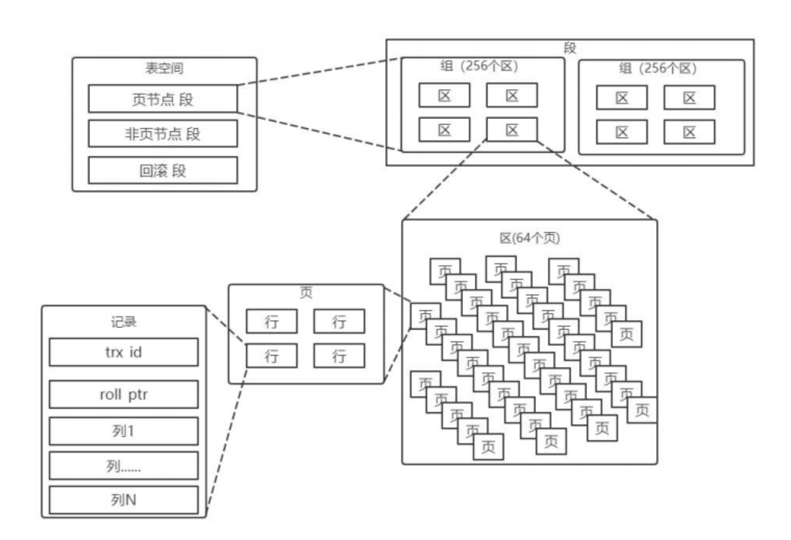


#### 2 系统表空间

系统表空间的结构和独立表空间基本类似，只不过由于整个 MySQL 进程只有一个系统表空间，在系统表空间中会额外记录一些有关整个系统信息的页面，所以会比独立表空间多出一些记录这些信息的页面，相当于是表空间之首，所以它的表空间 ID（Space ID）是 0。

系统表空间和独立表空间的前三个页面的类型是一致的，只是页号为 3～7 的页面是系统表空间特有的。分别包括：

系统表空间的 extent 1 和 extent 2 这两个区，也就是页号从 64~191 这 128 个页面被称为 Doublewrite buffer，也就是**双写缓冲区**。


### 问几个问题

欢迎大家公众号（架构师那些事儿）留言交流～～

Q0：看完后，这三大格式的存储实践文件，你能找到吗？是哪几个？

Q1：现在你知道这三大格式的存储数据排列（结构）方式，那么本文其他格式是否对了？哪方面呢？

Q2：如果让你联想之前mysql文章系列，你会想起哪篇文章呢？它们之际有什么关联？

------


## MySQL 几种高可用集群方案解析

### 背景

之前比较多文章都是基于mysql 单节点的元素进行分析的，但面试的时候，动不动`三高`问题（如高可用、高并发、高性能），可能大家很少遇到过，但在高级／专家碰到概率比较高。

本文限定范围是mysql 相关，不包括某些云厂商改造过后的RDS产品（如aws aurora是采用存储计算分离方式）；


### 高可用的定义

高可用架构对于互联网服务基本是标配，无论是应用服务还是数据库服务都需要做到高可用。

一般而言，衡量高可用做到什么程度可以通过一年内服务不可用时间作为参考即SLA，要做到3个9的可用性，一年内只能累计有8个小时不可服务，而如果要做到5个9的可用性，则一年内只能累计5分钟服务中断。

对于一个系统而言，可能包含很多模块，比如前端应用，缓存，数据库，搜索，消息队列等，每个模块都需要做到高可用，才能保证整个系统的高可用。

对于数据库服务而言，高可用可能更复杂，对用户的服务可用，不仅仅是能访问，还需要有正确性保证，因此讨论数据库的高可用方案时，一般会同时考虑方案中数据一致性问题。

今天这篇文章主要讨论MySQL数据库的高可用方案，介绍每种方案的特性以及优缺点，本文是对各种方案的总结，希望抛砖引玉，和大家一起讨论。


### 基于共享存储的方案SAN

#### 方案介绍

SAN(Storage Area Network)简单点说就是可以实现网络中不同服务器的数据共享，共享存储能够为数据库服务器和存储解耦。使用共享存储时，服务器能够正常挂载文件系统并操作，如果服务器挂了，备用服务器可以挂载相同的文件系统，执行需要的恢复操作，然后启动MySQL。

共享存储的架构如下:

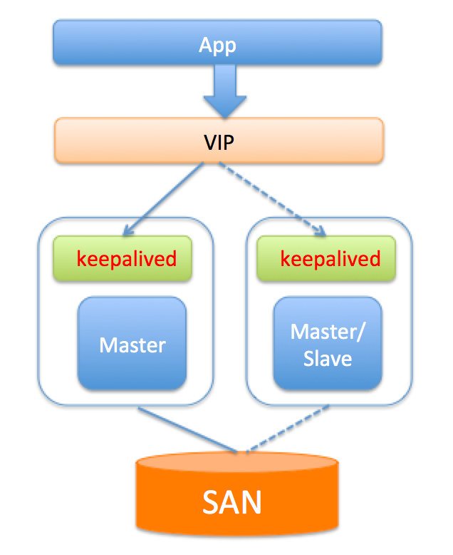


#### 优点

1.可以避免存储外的其它组件引起的数据丢失。

2.部署简单，切换逻辑简单，对应用透明。

3.保证主备数据的强一致。

#### 限制或缺点

1.共享存储是单点，若共享存储挂了，则会丢失数据。

2.价格比价昂贵。


### 基于磁盘复制的方案 DRBD

#### 方案介绍

DRBD(Distributed Replicated Block Device)是一种磁盘复制技术，可以获得和SAN类似的效果。

DBRD是一个以linux内核模块方式实现的块级别同步复制技术。

它通过网卡将主服务器的每个块复制到另外一个服务器块设备上，并在主设备提交块之前记录下来。

DRBD与SAN类似，也是有一个热备机器，开始提供服务时会使用和故障机器相同的数据，只不过DRBD的数据是复制存储，不是共享存储。DRBD的架构图如下：

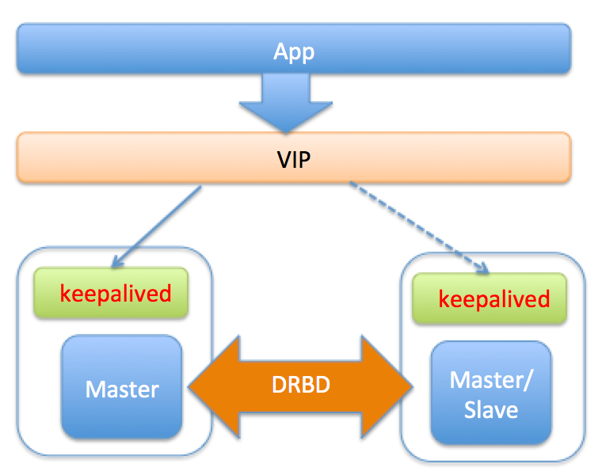


#### 优点

1.切换对应用透明

2.保证主备数据的强一致。

#### 限制或缺点

1.影响写入性能，由于每次写磁盘，实质都需要同步到网络服务器。

2.一般配置两节点同步，可扩展性比较差

3.备库不能提供读服务，资源浪费


### 基于主从复制(单点写)方案

前面讨论的两种方案分别依赖于底层的共享存储和磁盘复制技术，来解决MYSQL服务器单点和磁盘单点的问题。而实际生产环境中，高可用更多的是依赖MySQL本身的复制，通过复制为Master制作一个或多个热副本，在Master故障时，将服务切换到热副本。

下面的几种方案都是基于主从复制的方案，方案由简单到复杂，功能也越来越强大，实施难度由易到难，各位可以根据实际情况选择合适的方案。


#### keepalived/heartbeat

##### 方案介绍

 keepalived是一个HA软件，它的作用是检测服务器(web服务器，DB服务器等)状态，检查原理是模拟网络请求检测，检测方式包括HTTP_GET|SSL_GET|TCP_CHECK|SMTP_CHECK|MISC_CHECK等，对于DB服务器而言，主要就是IP,端口(TCP_CHECK)，但这可能不够(比如DB服务器ReadOnly)，因此keepalived也支持自定义脚本。

keepalived基于VRRP协议来实现高可用：

> 分别在主、从服务器上安装keepalived的软件，并配置同样的VIP，VIP层将真实IP屏蔽，应用服务器通过访问VIP来获取DB服务。
>
> Master定时向其它各个Slave keepalived服务发送心跳包(当不发送心跳包时，则认为主挂了，需要重新选主)，所有的服务器配置指向同一个VIP，正常情况下，应用访问VIP时，即访问的是master配置指向的真实IP；
>
> 而如果master所在keepalived服务挂了，则基于VRRP协议会重新选一个keepalived Master来提供服务，在这种情况下，如果master上的DB正常，而且上面有长连接，则会造成双写；
>
> keepalived通过监听来确认服务器的状态，如果发现服务器故障，则将故障服务器从系统中剔除(通过关掉自身的keepalived服务实现)；
>
> 当Master故障时，keepalived感知，并将Slave提升主，继续提供服务对应用层透明。

keepalived的高可用架构如下图：


##### 优点

1. 安装配置简单
2. Master故障时，Slave快速切换提供服务，并且对应用透明。

##### 限制或缺点

1.需要主备的IP在同一个网段。

2.提供的检测机制比较弱，需要自定义脚本来确定Master是否能提供服务，比如更新心跳表等。

3.无法保证数据的一致性，原生的MySQL采用异步复制，若Master故障，Slave数据可能不是最新，导致数据丢失，因此切换时要考虑Slave延迟的因素，确定切换策略。对于强一致需求的场景，可以开启(semi-sync)半同步，来减少数据丢失。

4.keepalived软件自身的HA无法保证。


#### MHA

##### 方案介绍

MHA(Master High Availability)是一位日本MySQL大牛用Perl写的一套MySQL故障切换方案，来保证数据库的高可用，MHA通过从宕机的主服务器上保存二进制日志来进行回补，能在最大程度上减少数据丢失。

MHA由两部分组成：MHA Manager（管理节点）和MHA Node（数据节点）。

MHA可以单独部署在一台独立的机器上管理多个master-slave集群，MHA Node运行在每台MySQL服务器上，主要作用是切换时处理二进制日志，确保切换尽量少丢数据。

MHA Manager会定时探测集群中的master节点，当master出现故障时，它可以自动将最新数据的slave提升为新的master，然后将所有其他的slave重新指向新的master，整个故障转移过程对应用程序完全透明。MHA的架构如下：


MHA failover过程： a.检测到 Master 异常，进行一系列判断，最后确定 Master 宕掉；

b.检查配置信息，罗列出当前架构中各节点的状态；

c.根据定义的脚本处理故障的 Master，VIP漂移或者关掉mysqld服务；

d.所有 Slave 比较位点，选出位点最新的 Slave，再与 Master 比较并获得 binlog 的差异，copy 到管理节点；

e.从候选节点中选择新的 Master，新的 Master 会和位点最新的 Slave 进行比较并获得 relaylog 的差异；

f.管理节点把 binlog 的差异 copy 到新 Master，新 Master 应用 binlog 差异和 relaylog 差异，最后获得位点信息，并接受写请求(read_only=0)；

g.其他 Slave 与位点最新的 Slave 进行比较，并获得 relaylog 的差异，copy 到对应的 Slave；

h.管理节点把 binlog 的差异 copy 到每个 Slave，比较 Exec_Master_Log_Pos 和 Read_Master_Log_Pos，获得差异日志；

i.每个Slave应用所有差异日志，然后 reset slave 并重新指向新 Master；

j.新 Master reset slave 来清除 Slave 信息。

##### 优点

1. 代码开源，方便结合业务场景二次开发
2. 故障切换时，可以修复多个Slave之间的差异日志，最终使所有Slave保持数据一致，然后从中选择一个充当新的Master，并将其它Slave指向它。
3. 可以灵活选择VIP方案或者全局目录数据库方案(更改Master IP映射)来进行切换。

##### 缺点

1.无法保证强一致，因为从故障Master上保存二进制日志并不总是可行，比如Master磁盘坏了，或者SSH认证失败等。

2.只支持一主多从架构，要求一个复制集群中必须最少有三台数据库服务器，一主二从，即一台充当master，一台充当备用master，另外一台充当从库。

3.采用全局目录数据库方案切换时，需要应用感知变化，因此对应用不透明，因此要保持切换对应用透明，依然依赖于VIP。

4.不适用于大规模集群部署，配置比较复杂。

5.MHA管理节点本身的HA无法保证。


#### 基于zookeeper的高可用

##### 方案介绍

 从前面的讨论可以看到，无论是keepalived方案还是MHA方案，都无法解决HA软件自身的高可用问题，因为HA本身是单点。

那么如果将HA也引入多个副本呢？那么又带来新的问题：

> 1.HA软件之间如何保证强同步。
>
> 2.如何确保不会有多个HA同时进行切换动作。

这两个问题实质都分布式系统一致性问题，为此，可以为HA软件引入类似Paxos，Raft这样的分布式一致性协议，保证HA软件的可用性。

> 具体可见本人关于zooKeeper的分享，部分简要如下：
>
> zooKeeper是一个典型的发布/订阅模式的分布式数据管理与协调框架，通过zookeeper中丰富的数据节点类型进行交叉使用，配合watcher事件通知机制，可以方便地构建一系列分布式应用涉及的核心功能，
>
> 比如：数据发布/订阅，负载均衡，分布式协调/通知，集群管理，Master选举，分布式锁和分布式队列等。zookeeper是一个很大话题，大家可以google去找更多的信息；

这里主要讨论zookeeper如何解决HA自身可用性问题。架构图如下：

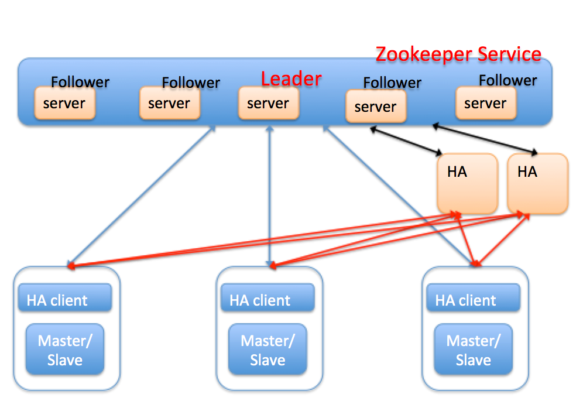

图中每个MySQL节点上面部署了一个HA client，用于实时向zookeeper汇报本地节点的心跳状态，比如主库crash，通过修改zookeeper(以下简称zk)上的节点信息，来通知HA。

HA节点在zk上注册监听事件，当zk节点发生变化时会自动让HA感知，HA节点可以部署一个或多个，主要用于容灾。

HA节点之间通过zookeeper服务来实现数据的一致性，通过分布式锁保证多个HA节点不会同时对一个主从节点进行切换。

HA本身是无状态的，所有MySQL节点状态信息全部保存在zookeeper服务器上，切换时，HA会对MySQL节点进行复检，然后切换。

我们看看引入zookeeper后的切换流程：

a.HA client 检测到 Master 异常，进行一系列判断，最后确定 Master 宕掉；

b.HA client 删除 Master在zk上的节点信息；

c.由于监听机制，HA会感知到有节点被删除；

d.HA对MySQL节点进行复检，比如建立连接，更新心跳表等；

e.确认异常后，则进行切换。

我们再看看这种架构下，是否能保证HA自身的高可用

- 如果HA-client本身挂了，MySQL节点正常？
  - HA-Client管理的MySQL节点无法与zookeeper保持心跳，zk服务将节点删除，HA会感知到这种变化，准备尝试一次切换，切换前，会进行复检，复检时发现MySQL节点是OK的，则不会切换。
- MySQL节点与zookeeper的网络断了，那么表现如何？
  - 由于HA-Client与节点在同一台主机，因此HA-client无法再定时向zk汇报心跳，zk会将对应的MySQL节点信息删除，HA尝试复检，依然失败，则进行切换。
- HA挂了，表现如何？
  - 由于HA无状态，并且有多个副本，因此一个HA挂了，不会对整个系统造成影响。

##### 优点

1. 保证了整个系统的高可用
2. 主从的强一致依赖于MySQL本身，比如半同步，或者外围工具的回补策略，类似MHA。
3. 扩展性非常好，可以管理大规模集群。

##### 缺点

1.引入zk，整个系统变得复杂。


#### 基于Cluster(多点写)方案

第3节讨论的方案基本是目前业内使用的主流方案，这类方案的特点是，单点写。

虽然我们可以借助中间件进行分片(sharding)，但是对于同一份数据，依然只允许一个节点写，从这个角度来说，上面的方案是伪分布式。

下面讨论的两种方案算是真正分布式，同一个数据理论上可以在多个节点写入，类似于Oracle的RAC，EMC的GreenPlum这种分布式数据库。

在MySQL领域，主要提供了2种解决方案：基于Galera的PXC和NDB Cluster。

MySQL Cluster实现基于NDB存储引擎，使用很多局限性，而PXC是基于innodb引擎，虽然也有局限性，但由于目前innodb使用非常广泛，所以有一定的参考价值。

目前比如去哪儿公司在他们的生产环境中使用了PXC方案。

PXC(Percona XtraDB Cluster)的架构图如下：


##### 优点

1.准同步复制

2.多个可同时读写节点，可实现写扩展，较分片方案更进一步

3.自动节点管理

4.数据严格一致

5.服务高可用

##### 缺点

1.只支持innodb引擎

2.所有表都要有主键

3.由于写要同步到其它节点，存在写扩大问题

4.非常依赖于网络稳定性，不适用于远距离同步

#### 基于中间件proxy的方案

准确地来说，中间件与高可用没有特别大的关系，因为切换都是在数据库层完成，但引入中间层后，使得对应用更透明。

在引入中间件之前，所有的方案，基本都依赖于VIP漂移机制，或者不依赖于VIP又不能保证对应用透明。

通过加入中间件层，可以同时实现对应用透明和高可用。此外中间层还可以做sharding，方便写扩展。

proxy的方案很多，比如mysql自带的mysql-proxy和fabric，阿里巴巴的cobar和tddl等。我们以fabric为例，其架构图如下:

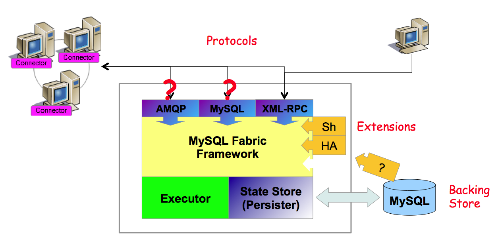

应用都请求 Fabric 连接器，然后通过使用 XML-RPC 协议访问 Fabric 节点， Fabric 节点依赖于备用存储 (backing store)，里面存储整个 HA 集群的元数据信息。

连接器读取 backing store 的信息，然后将元数据缓存到 cache，这样做的好处就是减少每次建立连接时与管理节点交互所带来的开销。

Fabric 节点可管理多个 HA Group，每个 HA Group 里有一个 Primary 和多个 Secondary(slave)，当 Primary 异常的时候会从 Secondary 中选出最合适的节点提升为新 Primary，其余 Secondary 都将重新指向新 Primary。

这些都是自动操作，对业务是无感知的，HA 切换之后还需要通知连接器更新的元数据信息。

##### 优点

1.切换对应用透明

2.可扩展性强，方便分片扩展

3.可以跨机房部署切换

##### 缺点

1.是一个比较新的组件，没有很多实际应用场景

2.没有解决强一致问题，主备强一致性依赖于MySQL自身(半同步)，以及回滚回补机制。


### 总结

以上介绍了目前MySQL几种典型的高可用架构，包括基于共享存储方案，基于磁盘复制方案和基于主从复制的方案。对于主从复制方案，分别介绍了keepalived，MHA以及引入zookeeper的方案。

对于每种方案，都从持续可用，数据强一致性，以及切换对应用的透明性进行说明。

个人觉得基于MySQL主从复制的方案是主流，也非常成熟，引入中间件和引入zookeeper虽然能将系统的可用性做地更好，可支撑的规模更大，但也对研发和运维也提出了更高的要求。

因此，在选择方案时，要根据业务场景和运维规模做抉择。


### 留几问题

欢迎大家一起留言交流～～

Q1：如果大数据量存储且有一定的IO的业务，那么你觉得哪种HA方案比较好？

Q2：你认为主从复制方案主要为了解决哪个问题？

Q3：你觉得云厂商RDS实现高可用需要注意哪些问题？

------


## MySQL 主从复制背后那些事儿

### 背景

主从复制引入是为了解决数据一致性的问题，之前一篇文章[MySQL--几种高可用方案](../../db/mysql/MySQL--几种高可用方案.md) 聊了好几种方案，但这些都依赖于mysql master需要将数据同步到slave节点，才能保证后面的灾备恢复；

如果讲到mysql 如何把数据同步到slave节点，网上有一堆资料手把手教你如何配置，还包括各种数据流；

复制对于mysql的重要性不言而喻，mysql集群的负载均衡，读写分离和高可用都是基于复制实现。

下文主要从4个复制方案展开，mysql的异步复制，半同步复制、并行复制、第三方复制工具，最后会给出些基于线上故障案例得到半同步复制一些理解。

由于生产环境中，innodb存储引擎支持事务，并且行级复制使用广泛，所以下文的讨论都是基于这种假设。


### 复制方案

#### 异步复制

异步复制是mysql自带的最原始的复制方式，主库和备库成功建立起复制关系后，在备库上会有一个IO线程去主库拉取binlog，并将binlog写到本地，就是图中的Relay log，然后备库会开启另外一个SQL线程去读取回放Relay log，通过这种方式达到Master-Slave数据同步的目的。

通常情况下，Slave是只读的，可以承担一部分读流量，而且可以根据实际需要，添加一个或多个Slave，这样在一定程度上可以缓解主库的读压力；

另一方面，若Master出现异常(crash，硬件故障等)，无法对外提供服务，此时Slave可以承担起Master的重任，避免了单点的产生，所以复制就是为容灾和提高性能而生。


#### 半同步复制

一般情况下，异步复制就已经足够应付了，但由于是异步复制，备库极有可能是落后于主库，特别是极端情况下，我们无法保证主备数据是严格一致的(即使我们观察到Seconds Behind Master 这个值为0)。

比如，当用户发起commit命令时，Master并不关心Slave的执行状态，执行成功后，立即返回给用户。

试想下，若一个事务提交后，Master成功返回给用户后crash，这个事务的binlog还没来得及传递到Slave，那么Slave相对于Master而言就少了一个事务，此时主备就不一致了。

对于要求强一致的业务是不可以接受的，半同步复制就是为了解决数据一致性而产生的。

##### 为什么叫半同步复制？

先说说同步复制，所谓同步复制就是一个事务在Master和Slave都执行后，才返回给用户执行成功。

这里核心是说Master和Slave要么都执行，要么都不执行，涉及到2PC(2 Phrase Commit)。

而MySQL只实现了本地redo-log和binlog的2PC，但并没有实现Master和Slave的2PC，所以不是严格意义上的同步复制。而MySQL半同步复制不要求Slave执行，而仅仅是接收到日志后，就通知Master可以返回了。

这里关键点是Slave接受日志后是否执行，若执行后才通知Master则是同步复制，若仅仅是接受日志成功，则是半同步复制。

对于Mysql而言，我们谈到的日志都是binlog，对于其他的关系型数据库可能是redo log或其他日志。

##### 与异步复制对比

相对于异步复制，半同步复制要求执行的每一个事务，都要求至少有一个备库成功接收后，才返回给用户。实现原理也很简单，主库本地执行完毕后，等待备库的响应消息(包含最新备库接收到的binlog(file,pos))，接收到备库响应消息后，再返回给用户，这样一个事务才算真正完成。

在主库实例上，有一个专门的线程(ack_receiver)接收备库的响应消息，并以通知机制告知主库备库已经接收的日志，可以继续执行。

##### 半同步复制如何实现？

半同步复制实现的关键点是Master对于事务提交过程特殊处理。

目前实现半同步复制主要有两种模式，AFTER_SYNC模式和AFTER_COMMIT模式。

两种方式的主要区别在于是否在存储引擎提交后等待Slave的ACK。

先来看看AFTER_COMMIT模式，如图，Start和End分别表示用户发起Commit命令和Master返回给用户的时间点，中间部分就是整个Commit过程Master和Slave做的事情。

> 具体实现见本文后面章节


Master提交时，会首先将该事务的redo log刷入磁盘，然后将事务的binlog刷入磁盘(这里其实还涉及到两阶段提交的问题，这里不展开讲)，

然后进入innodb commit流程，这个步骤主要是释放锁，标记事务为提交状态(其他用户可以看到该事务的更新)，这个过程完成后，等待Slave发送的ACK消息，等到Slave的响应后，Master才成功返回给用户。看到图中红色虚线部分，这段是Master和Slave的同步逻辑，是Master-Slave一致性的保证。

##### 半同步复制是否能保证不丢数据？

我们通过几种场景来简单分析下。

第一种情况：假设Master第1，2步执行成功后，binlog还没来得及传递给Slave，此时Master挂了，Slave作为新Master提供服务，那么备库比主库要少一个事务(因为主库的redo 和binlog已经落盘)，但是不影响用户，对于用户而言，这个事务没有成功返回，那么提交与否，用户都可以接受，用户一定会进行异常捕获而重试。

第二种情况：假设第3步innodb commit执行成功后，binlog还没来得及传递给Slave，此时Master挂了，此时与第一种情况一样，备库比主库少一个事务，但是其他用户在3执行完后，可以看到该事务的更新，而切换到备库后，却发现再次读这个更新又没了，这个就发生了“幻读”，如果其他事务依赖于这个更新，则会对业务逻辑产生影响。

对于第二种情况产生的影响，AFTER_SYNC模式可以解决这一问题。与AFTER_COMMIT相比，master在AFTER_SYNC模式下，Fsync binlog后，就开始等待SLAVE同步。

那么在进行第5步innodb commit后，即其它事务能看到该事务的更新时，Slave已经成功接收到binlog，即使发生切换，Slave拥有与Master同样的数据，不会发生“幻读”现象。但是对于上面描述的第一种情况，结果是一样的。

所以，在极端情况下，半同步复制的Master-Slave会有一个事务不一致，但是对于用户而言，由于这个事务并没有成功返回给用户，所以无论事务提交与否都是可以接受的，用户有必要进行查询或重试，判读是否更新成功。或者我们想想，对于单机而言，若事务执行成功后，返回给用户时，网络断了，用户也是面临一样的问题，所以，这不是半同步复制的问题。对于提交返回成功的事务，版同步复制保证Master-Slave一定是一致的，从这个角度来看，半同步复制不会丢数据，可以保证Master-Slave的强一致性。图3是AFTER_SYNC模式，事务提交过程。


#### 并行复制

半同步复制解决了Master-Slave的强一致问题，那么性能问题呢？从[异步复制]图中可以看到参与复制的主要有两个线程：IO线程和SQL线程，分别用于拉取和回放binlog。

对于Slave而言，所有拉取和解析binlog的动作都是串行的，相对于Master并发处理用户请求，在高负载下， 若Master产生binlog的速度超过Slave消费binlog的速度，导致Slave出现延迟。

如并行复制下图，可以看到，Users和Master之间的管道远远大于Master和Slave之间的管道。


那么如何并行化，并行IO线程，还是并行SQL线程？

其实两方面都可以并行，但是并行SQL线程的收益更大，因为SQL线程做的事情更多(解析，执行)。

并行IO线程，可以将从Master拉取和写Relay log分为两个线程；

并行SQL线程则可以根据需要做到库级并行，表级并行，事务级并行。

库级并行在mysql官方版本5.6已经实现。

如下图，并行复制框架实际包含了一个协调线程和若干个工作线程，协调线程负责分发和解决冲突，工作线程只负责执行。图中，DB1，DB2和DB3的事务就可以并发执行，提高了复制的性能。有时候库级并发可能不够，需要做表级并发，或更细粒度的事务级并发。


并行复制如何处理冲突？

并发的世界是美好的，但不能乱并发，否则数据就乱了。

Master上面通过锁机制来保证并发的事务有序进行，那么并行复制呢？

Slave必需保证回放的顺序与Master上事务执行顺序一致，因此只要做到顺序读取binlog，将不冲突的事务并发执行即可。

对于库级并发而言，协调线程要保证执行同一个库的事务放在一个工作线程串行执行；

对于表级并发而言，协调线程要保证同一个表的事务串行执行；对于事务级而言，则是保证操作同一行的事务串行执行。

是否粒度越细，性能越好？

这个并不是一定的。相对于串行复制而言，并行复制多了一个协调线程。协调线程一个重要作用是解决冲突，粒度越细的并发，可能会有更多的冲突，最终可能也是串行执行的，但消耗了大量的冲突检测代价。

#### 第三方复制工具

为什么会出现第三方复制工具？

第三方复制工具的出现一定是内嵌的复制功能不能满足用户需求，就像半同步复制和并行复制从无到有一样。既然现在mysql复制已经做地这么好了，为什么还有第三方复制工具，我能想到最重要的一点是异构复制。

在异构数据源迁移场景下，内嵌复制是无能为力的，第三方复制工具通过解析源端的数据库日志，然后在目的端回放，就能达到同步的目的，比如大名鼎鼎的GoldenGate就是一个例子。

第三方复制工具同样能很好地实现并发，在并行复制出现之前，这也是一个巨大的优势。另一方面，就是可以统一下游，避免所有下游都跑到DB上拉binlog，增大DB负载。


### 半同步复制线上问题排查

#### 问题背景

默认情况下，线上的mysql复制都是异步复制，因此在极端情况下，主备切换时，会有一定的概率备库比主库数据少，因此切换后，我们会通过工具进行回滚回补，确保数据不丢失。

半同步复制则要求主库执行每一个事务，都要求至少一个备库成功接收后，才真正执行完成，因此可以保持主备库的强一致性。

为了确保主备库数据强一致，减少数据丢失，尝试在生产环境中开启mysql的复制的半同步(semi-sync)特性。

实际操作过程中，发现大部分实例半同步都可以正常运行，但有少部分实例始终开不起来(只能以普通复制方式运行)，更奇葩的是同一个主机的两个实例，一个能开启，一个不能。最终定位的问题也很简单，但排查出来还是花了一番功夫，下文将描述整个问题的排查过程。


#### 问题分析

上文简单介绍了不止半同步复制的方案原理，现在来看看具体问题。

在主备库打开半同步开关后，问题实例的状态变量"Rpl_semi_sync_master_status"始终是OFF，表示复制一直运行在普通复制的状态。

##### (1).修改`rpl_semi_sync_master_timeout`参数。

 半同步复制参数中有一个`rpl_semi_sync_master_timeout`参数，用以控制主库等待备库响应消息的时间，如果超过该值，则认为备库一直没有收到(备库可能挂了，也可能备库执行很慢，较主库相差很远)，这个时候复制会切换为普通复制，避免主库的执行事务长时间等待。线上这个值默认是50ms，简单想是不是这个值太小了，遂将其改到10s，但问题依然不解。

##### (2).打印日志

 排查问题最简单最笨的方法就是打日志，看看到底是哪个环节出了问题。

主库和备库分别有`rpl_semi_sync_master_trace_level`和`rpl_semi_sync_slave_trace_level`参数来控制半同步复制打印日志。将两个参数值设置为80(64+16)，记录详细日志信息，以及进出的函数调用。

```
master:
2016-01-04 18:00:30 13212 [Note] ReplSemiSyncMaster::updateSyncHeader: server(-1721062019), (mysql-bin.000006, 500717950) sync(1), repl(1)
2016-01-04 18:00:40 13212 [Warning] Timeout waiting for reply of binlog (file: mysql-bin.000006, pos: 500717950), semi-sync up to file , position 0.
2016-01-04 18:00:40 13212 [Note] Semi-sync replication switched OFF.

slave:
2016-01-04 18:00:30 38932 [Note] ---> ReplSemiSyncSlave::slaveReply enter
2016-01-04 18:00:30 38932 [Note] ReplSemiSyncSlave::slaveReply: reply (mysql-bin.000006, 500717950)
2016-01-04 18:00:30 38932 [Note] <--- ReplSemiSyncSlave::slaveReply exit (0)
```

> 从master日志可以看到在2016-01-04 18:00:30时，主库设置了半同步标记，并开始等待备库的响应，等待10s后，仍然没有收到响应，则认为超时，遂将半同步模式关闭，切换为普通模式。
>
> 但从slave日志来看，在2016-01-04 18:00:30已经将(mysql-bin.000006, 500717950)发送给主库，表示已经收到该日志。这就说明，master日志已经打了semi-sync标，slave收到了日志，并且也回了包，master也确实等了10s，就是没有收到包，所以就切换为普通复制。

现在问题就变成了，为什么master没有收到？

##### (3)select函数

> 主库实例上有一个专门接收响应包的线程(ack_receiver)，它通过select函数监听socket，发现有slave的响应消息后，读取消息，通知工作线程可以继续执行。

那么问题是不是出现在select函数上面？

因为select是一个系统调用，一直没有怀疑，但已经跟到这里来了，那就得看看。与select函数相关的有几个重要的宏定义和说明。主要实现在`/usr/include/bits/typesizes.h，/usr/include/bits/select.h和/usr/include/sys/select.h这三个文件`中。

```
FD_ZERO(fd_set *fdset)：清空fdset与所有文件句柄的联系。FD_SET(int fd, fd_set *fdset)：建立文件句柄fd与fdset的联系。FD_CLR(int fd, fd_set *fdset)：清除文件句柄fd与fdset的联系。FD_ISSET(int fd, fd_set *fdset)：检查fdset联系的文件句柄fd是否可读写，当>0表示可读写。array
{
__fd_mask __fds_bits[__FD_SETSIZE / __NFDBITS]; 1024/64=16 (long int)
}fd_set

#define __FD_SET_SIZE 1024

typedef long int __fd_mask; //8个字节
#define __NFDBITS (8 * (int) sizeof (__fd_mask)) // 64位
#define __FDMASK(d)    ((__fd_mask) 1 << ((d) % __NFDBITS)) //fd%64=N,则在第N位设置为1
#define __FDELT(d)    ((d) / __NFDBITS) //表示在第几个long int
#define __FDS_BITS(set) ((set)->__fds_bits) 
#define __FD_SET(d, set) (__FDS_BITS (set)[__FDELT (d)] |= __FDMASK (d))
#define __FD_CLR(d, set) (__FDS_BITS (set)[__FDELT (d)] &= ~__FDMASK (d))
#define __FD_ISSET(d, set) \
((__FDS_BITS (set)[__FDELT (d)] & __FDMASK (d)) != 0)
```

> 大家需要对IO模型的select 模式了解下：
>
> 通过FD_SET可以设置我们想要监听的句柄，句柄信息存储在fd_set位数组中，数组元素的个数由__FD_SETSIZE/64决定，对于__FD_SETSIZE=1024而言，整个数组只有16个long int。
>
> 每个句柄占有一个位，就是1024个位，可以存储1024个句柄。假设句柄值为138，那么138/64=2,138%64=10，那么这个句柄在数组的标示在第2个long int的第10位置1。

那么如果句柄值超出1024呢，这里不就溢出了？仔细对比了下代码，发现根本就没有容错判断，如果句柄值超过1024就一定会溢出。

由于select函数是遍历数组中的每个位，然后去判断该句柄是否可读可写，因此对于超过1024的句柄，永远也不会去判断，因此主库永远不知道备库是否发送了响应包。

##### (4)验证

上面只是理论分析，如果实际运行的实例句柄确实是超过了1024，那么问题就定位到了。

1.得到mysql进程mysql-pid

```
ps –aux | grep mysqld | grep port
```

2.gdb attach到该进程

```
gdb –p mysql-pid
```

3.找到ack_receive线程，并切换

```
info thread
thread thread_id
```

4.打印socket的值，这里fd值为2344。

##### (5)如何解

 我们看到了由于__FD_SETSIZE的定义，一般是1024，导致select函数最多只能监听1024个句柄，并且最大句柄值不超过1024。

第一种方法是调大该参数，但这种方法需要重新编译linux内核。而且由于select机制，每次都需要遍历 的每一位来判断句柄上是否有消息到来，因此如果设置很大，将导致效率非常低。select是一种比较老的IO复用机制，比较先进的poll，epoll都有类似的功能，并且更强大，也没有句柄总数和最大句柄的限制，通过poll或者epoll实现监听这部分功能，就可以彻底解决问题。有关select，poll，epoll等机制，大家可以去网上查资料，这里不展开讨论。

第二种临时解决方法，前面提到的方法要么需要重新编译linux内核，要么需要改mysql内核代码，这里提供一种临时的解决方法。可以在slave端执行stop slave，start slave命令，重建主库与备库的socket连接，只要1-1024的fd没有被全部使用，新建的socket fd就有机会小于1024，这样select机制不会出问题，半同步也就能正常运行。但如果1-1024的fd全部被长连接使用，那么这种方法就无能为力了。

##### (6)官方版本

 看了最新oracle官方版本git上5.7的源代码，这块也是用select来实现的，所以也存在类似的问题。当然，由于句柄号有复用机制，当实例上连接数很少，或者长连接不多时，不容易出现fd>1024的情况，所以这个bug不是很容易出现，但问题是普遍存在的。

##### (7)问题延伸

 问题定位后，另外一个问题还困扰我了半天。

因为mysql内核中有监听的部分有3块，

1是监听端口的select，

2是线程池的监听epoll，

3是半同步的select监听。

slave binlog dump的线程就是普通的工作线程，而工作线程的socket会受epoll的监听，这样一来，binlog dump的socket会同时受半同步的select监听和线程池的epoll监听，这不乱了吗？

后来仔细看了看代码，才发现线程池的epoll监听采用的是EPOLLONESHOT模式，每次接收消息后会解绑，需要重新注册，因此不会出现同一个句柄被两种监听机制同时监听的情况。


### 半同步数据链路分析

上面我们讲了默认情况下的mysql复制都是异步复制，mysql通过参数来控制semi-sync开关。

#### 配置开启

具体而言，主库上通过rpl_semi_sync_master_enabled参数控制，备库上通过rpl_semi_sync_slave_enabled参数控制，打开这两个参数后，mysql semi-sync的特性就打开了。

注意对于备库而言，为了保证半同步立即生效，需要重启slave的IO线程。

另外，还有一个比较重要的参数是rpl_semi_sync_master_timeout，这个参数用于控制master等待semi-slave ack报文的时间，单位是毫秒，默认是10000。master等待超时，则切换为普通的异步复制。

```
master:
set global rpl_semi_sync_master_enabled=1;
set global rpl_semi_sync_master_timeout=xxx;

slave:
stop slave io_thread;
set global rpl_semi_sync_slave_enabled=1;
start slave io_thread;
```

另外需要注意的是，打开了上述两个参数只说明master-slave已经具备打开semi-sync的基本条件了，但复制是否依照半同步运行，还需要根据Rpl_semi_sync_master_status的状态值确定。

因为比如slave较master有很大延迟(超过rpl_semi_sync_master_timeout)，那么复制切换为普通复制。

对于需要调试代码的童鞋而言，rpl_semi_sync_master_trace_level和rpl_semi_sync_slave_trace_level非常重要，通过设置level取值，可以打印日志记录半同步的详细过程，方便定位问题。


#### 实现链路

semi-sync（半同步复制）说到底也是一种复制，只不过是在普通的复制基础上，添加了一些步骤来实现。因此semi-sync并没有改变复制的基本框架，我们的讨论也从master，slave两方面展开。

##### 1.master(主库)

主库上面主要包含三个部分：

(1).负责与slave-io线程对接的binlog dump线程，将binlog发送到slave；

(2).主库上写事务的工作线程；

(3).收取semi-slave报文的ack_receiver线程。

##### (1).binlog dump流程

主要执行逻辑在mysql_binlog_send函数中。

1.判断slave是否是semi_slave，调用add_slave将semi-slave加入到ack_receiver线程的监听队列中。

判断的逻辑是slave对应的会话上是否设置了参数rpl_semi_sync_slave；

2.根据slave的请求偏移和binlog文件，从指定位点读取binlog；

3.根据文件和位点，捞binlog文件中的数据；

4.调用updateSyncHeader设置数据包头semi-sync标记；

根据实时semi-sync运行状态来确定是否设置(这个状态由ack_receiver线程根据是否及时收到slave-ack报文设置)

5.调用my_net_write发送binlog；

6.调用net_flush确认网络包发送出去

如果当前所有产生的binlog已经处理完，需调用wait_for_update_bin_log等待binlog更新。

##### (2).半同步事务提交流程

mysql5.6以后提交采用组提交方式，主要分为三个阶段，每个阶段有一个队列，增加semi-sync后，又增加了一个semi-sync阶段。

1.flush阶段： 队列能保证写binlog的顺序与innodb-commit的顺序一致。通过队列，可以保证顺序写每个事务的binlog-cache，然后只进行一次write操作(flush_cache_to_file)。flush阶段后，如果sync_binlog不是1，则通知master有新binlog产生；如果sync_binlog为1，则等待sync阶段后，再通知dump线程有新binlog产生。这里我理解是因为如果不为1，则可能没有后续的sync阶段，而操作系统缓存也有binlog数据，所以可以在flush阶段后通知；而对于sync_binlog为1的情况，可以保证主库的binlog先落地，永远比备库多。但如果sync_binlog不为1，比如1000，则主机异常情况下，则可能出现备库的binlog比主库还多的情况。根据sync_binlog的设置，确认是否要跳过sync阶段。

2.sync阶段： sync_binlog_file

3.semi_sync阶段： call_after_sync,等待备库应答。调用cond_timewait等待条件变量&COND_binlog_send_，注意这里只是leader线程在等，将leader线程唤醒后，才会结束semi_sync阶段，进而唤醒其它的follower线程。_

4.commit阶段：

innodb-commit waitAfterCommit，等待备库应答。调用cond_timewait等待条件变量&COND_binlog_send_ 。

最终我们根据semi-sync复制模式的设置(AFTER_COMMIT,AFTER_SYNC)，来确定是第(3)步还是第(4)步进行等待。

(3).接收slave-ack报文流程

这个流程的工作主要在ack_receiver线程中，这个线程的主要作用是监听semi-slave的ack包，确认master-slave链路是否工作在半同步状态，并根据实际运行状态将普通复制与半同步复制进行切换。

打开主库rpl_semi_sync_master_enabled参数后，该线程启动，关闭参数后，该线程消亡。 master流程如下：

1.遍历semi-slave数组；

2.通过select函数监听每个slave是否有网络包过来；

3.调用my_net_read读取包数据；

4.调用reportReplyPacket处理semi-sync复制状态；

若备库已经获取了最新的binlog位点，则唤醒等待的工作线程；

5.调用reportReplyBinlog唤醒等待的线程，mysql_cond_broadcast(&COND_binlog_send_);

2.slave(备库)

主要实现在(handle_slave_io)

1.启动io-thread后，调用safe_connect建立与master的连接；

2.调用request_dump函数处理请求binlog逻辑：

 (1).执行命令SET @rpl_semi_sync_slave= 1，设置一个局部变量，通过这个参数标记slave为semi-slave；

 (2).发送命令COM_BINLOG_DUMP请求日志 循环从master端收取日志，处理日志

```
{
　　1.调用read_event，从master端收取日志(如果没有网络包，会阻塞等待)
　　2.调用slaveReadSyncHeader，确定网络包头是否有semi-sync标记
　　3.调用queue_event将日志写入relay-log，在这个过程中会过滤自身server-id的日志
　　4.如果有semi-sync标记，调用slaveReply函数，发送ack报文
}
```

### 问几个问题

欢迎大家公众号留言交流～～

Q1：你们线上用mysql是否有灾备即HA高可用集群，那么背后是怎么同步数据的？

Q2：为什么本文重点介绍的是半同步复制？它和其他两种有哪些优劣势？

Q3：你觉得如果设计一种复制方案，你认为需要考虑到哪些线上场景？

------


## MySQL 在几个云厂商的RDS具体升级实现

### 背景

在[MySQL--几种高可用方案](../../db/mysql/MySQL--几种高可用方案.md) 留了一个问题，里面提到*“Q3：你觉得云厂商RDS实现高可用需要注意哪些问题？”*，

平时我们云上服务器很少自己去部署RDS（mysql），一般会选择使用云厂商提供的RDS服务，比如国内阿里叫PolarDB、AWS叫Aurora、微软的是？？

对此，云上RDS服务一般需要重点考虑的灾备恢复、水平扩展以及性能方面；

在云上环境下，存储计算分离作为解决系统弹性和伸缩性的方案越来越普遍。

广义来说，任何数据库，底下文件系统挂一个分布式存储，即可以认为做到了存储计算分离。

通过存储计算分离，可以透明添加存储节点，剔除故障节点，进行故障切换，扩展存储空间等。

在这个背景下，IO不再成为数据库的瓶颈，因为IO压力可以打散在多个存储节点上，反而是网络成为瓶颈，因为数据库实例与所有存储节点的交互都需要通过网络，尤其是为了提升数据库性能，数据库实例与存储节点可能是并行交互的，这进一步加重了网络压力。传统数据库中的IO操作是需要同步执行的，当需要进行IO等待时，这往往会导致线程上下文切换，影响数据库性能。

比如IO读操作，当需要访问一个数据页时，如果在缓冲池没有命中，则需要进行磁盘IO，那么读线程需要等待IO完成才能继续其它操作，同时这种动作可能会进一步引发刷脏页等。

另外一个我们熟悉场景是事务提交操作(IO写操作)，事务提交成功返回前一定要等待事务对应日志刷盘才能返回，由于事务是串行提交，因此其它事务也必须同步等待这个事务提交。 **传统数据库中的两阶段事务尤其不适合与分布式云环境，因为二阶段提交协议对系统中参与的节点和网络要求很高，自身容错能力有限，这点与大规模分布式云环境中，软件和硬件故障是常态的特征是矛盾的。**


### PolarDB

PolarDB是阿里巴巴自研的新一代云原生关系型数据库，在存储计算分离架构下，利用了软硬件结合的优势，为用户提供具备极致弹性、海量存储、高性能、低成本的数据库服务。

X-Engine是阿里巴巴自研的新一代存储引擎，作为AliSQL的核心引擎之一已广泛用于阿里巴巴集团核心业务，包括交易历史库，钉钉历史库，图片空间等。

X-Engine基于LSM-tree架构，其核心特征是数据以追加写方式写入，高压缩低成本，适用于写多读少，有低成本诉求的业务场景。

传统MySQL基于binlog复制的主备架构有它的局限性，包括存储空间有限，备份恢复慢，主备复制延迟等问题，为了解决用户对于云上RDS(X-Engine)大容量存储，以及弹性伸缩的诉求，PolarDB推出了历史库(基于X-Engine引擎的一写多读)产品，支持物理复制，提供一写多读的能力，目前已经在阿里云官网售卖。

PolarDB(X-Engine)基于LSM-tree结构的存储引擎实现数据库的一写多读能力。

本节文章主要参考*《X-Engine: An Optimized Storage Engine for Large-scale E-commerce Transaction Processing》* 这是一篇有关X-Engine的核心技术可以参考发表在Sigmod19的论文。


#### LSM-tree数据库引擎

LSM-Tree全称是Log Structured Merge Tree，是一种分层，有序，面向磁盘设计的数据结构，其核心思想是利用磁盘批量的顺序写要比随机写性能高的特点，将所有更新操作都转化为追加写方式，提升写入吞吐。LSM-tree类的存储引擎最早源于Google三驾马车之一的BigTable的存储引擎以及它的开源实现LevelDB。

LSM-tree存储引擎有几个特点，首先增量数据像日志一样，通过追加方式写入，顺序落盘；其次，数据按照key来进行有序组织，这样在内存和磁盘中会形成一颗颗小的“有序树”；最后，各个“有序树”可以进行归并，将内存中的增量数据迁移到磁盘上，磁盘上的多个“有序树”可以进行归并，优化树的形状，整个LSM-tree是一个有序的索引组织结构。

在云原生数据库时代，一写多读技术已被广泛应用于生产环境中，主要云产商都有其标杆产品，典型代表包括亚马逊的Aurora，阿里云的PolarDB以及微软云的Socrates。

它的核心思想是计算存储分离，将有状态的数据和日志下推到分布式存储，计算节点无状态，多个计算节点共享一份数据，数据库可以低成本快速扩展读性能。

Aurora是这个领域的开山鼻祖，实现了业内第一个一写多读的数据库，计算节点Scale up，存储节点Scale out，并将日志模块下推到存储层，计算节点之间，计算与存储节点之间传输redo日志，计算节点基于Quorum协议写多副本保证可靠性，存储层提供多版本页服务。

PolarDB与Aurora类似，也采用了存储计算分离架构，与Aurora相比，PolarDB它自己的特色，存储基座是一个通用的分布式文件系统，大量采用OS-bypass和zero-copy技术，存储的多副本一致性由ParallelRaft协议保证。PolarDB计算节点与存储节点同时传输数据页和redo日志，计算节点与计算节点之间只传递位点信息。

与Aurora的“日志即数据库”理念一样，Socrates的节点之间只传输redo日志，也实现了多版本页服务，它的特点是将数据库存储层的持久性与可用性分开，抽象出一套日志服务。整个数据库分为3层，一层计算服务，一层page server服务和一层日志服务，这样设计的好处是可以分层进行优化，提供更灵活和细粒度的控制。

虽然Aurora，PolarDB和Socrates在设计上各有特点，但它们都共同践行了存储计算分离思想，数据库层面提供一写多读的能力。

深入到存储引擎这一层来说，这几个产品都是基于B+tree的存储引擎，如果基于LSM-tree存储引擎来做呢？

LSM-tree有它自己的特点，追加顺序写，数据分层存储，磁盘上数据块只读更有利于压缩。

X-Engine引擎云上产品RDS(X-Engine)已经充分发挥了LSM-tree高压缩低成本特点，同样的数据量，存储空间只占到RDS(InnoDB)的1/3甚至更少，RDS(X-Engine)传统的主备架构，依然面临着主备复制延迟大，备份恢复慢等问题。基于LSM-tree引擎实现一写多读，不仅计算资源和存储资源解耦，多个节点共享一份数据还能进一步压缩存储成本。

基于LSM-tree引擎实现一写多读面临着与B+tree引擎不一样的技术挑战，首先是存储引擎日志不一样，LSM-tree引擎是双日志流，需要解决双日志流的物理复制问题；

其次是数据组织方式不一样，LSM-tree引擎采用分层存储，追加写入新数据，需要解决多个计算节点一致性物理快照以及Compation问题。

最后，作为数据库引擎，还需要解决一写多读模式下DDL的物理复制问题。同时，为了产品化，充分发挥B+tree引擎和LSM-tree引擎的各自优势，还面临着新的挑战，即如何在一个数据库产品中同时实现两个存储引擎(InnoDB,X-Engine)的一写多读。


#### PolarDB整体架构

PolarDB支持X-Engine引擎后，X-Engine引擎与InnoDB引擎仍然独立存在。两个引擎各自接收写入请求，数据和日志均存储在底层的分布式存储上，其中idb文件表示的是InnoDB的数据文件，sst文件表示的是X-Engine的数据文件。

这里最主要的点在于InnoDB与XEngine共享一份redo日志，X-Engine写入时，将wal日志嵌入到InnoDB的redo中，Replica节点和Standby节点在解析redo日志后，分发给InnoDB引擎和XEngine引擎分别回放进行同步。


PolarDB(X-Engine)架构图


#### X-Engine引擎架构

X-Engine引擎采用LSM-tree结构，数据以追加写的方式写入内存，并周期性物化到磁盘上，内存中数据以memtable形式存在，包括一个活跃的active memtable和多个静态的immutable。

磁盘上数据分层存储，总共包括3层，L0，L1和L2，每一层数据按块有序组织。X-Engine最小空间分配单位是一个extent，默认是2M，每个extent包含若干个block，默认是16k。

数据记录紧凑存储在block中，由于追加写特点，磁盘上的数据块都是只读的，因此X-Engine引擎可以默认对block进行压缩，另外block中的记录还会进行前缀编码，综合这些使得X-Engine的存储空间相对于InnoDB引擎只有1/3，部分场景(比如图片空间)甚至能压缩到1/7。

有利就有弊，追加写带来了写入优势，对于历史版本数据需要通过Compaction任务来进行回收。有关X-Engine的核心技术可以参考发表在Sigmod19的论文，*《X-Engine: An Optimized Storage Engine for Large-scale E-commerce Transaction Processing》*


X-Engine整体架构


#### 物理复制架构

物理复制的核心是通过引擎自身的日志来完成复制，避免写额外的日志带来的成本和性能损失。

MySQL原生的复制架构是通过binlog日志进行复制，写事务需要同时写引擎日志和binlog日志，这带来的问题是一方面单个事务在关键写路径上需要写两份日志，写性能受制于二阶段提交和binlog的串行写入，另一方面binlog复制是逻辑复制，复制延迟问题也使得复制架构的高可用，以及只读库的读服务能力大打折扣，尤其是在做DDL操作时，这个延迟会进一步放大。

在InnoDB中有redo和undo两种日志，undo日志可以理解为一种特殊的“data”，所以实际上InnoDB的所有操作都能通过redo日志来保证持久性。

因此，在进行复制时，只需要在主从节点复制redo日志即可。X-Engine引擎包含两种日志，一种是wal日志(WriteAheadLog)，用于记录前台的事务的操作；另一种是Slog(StorageLog)，用于记录LSM-tree形状变化的操作，主要指Compaction/Flush等。

wal日志保证了前台事务的原子性和持久性，Slog则保证了X-Engine内部LSM-tree形状变化的原子性和持久性，这两个日志缺一不可，都需要复制同步。


#### 共享存储下的物理复制


Primary-Replica物理复制架构

LSM-tree引擎一写多读的能力是对PolarDB进行功能增强，体现在架构层面就是充分利用已有的复制链路，包括Primary->Replica传递日志信息链路和Replica->Primary传递协同控制信息链路。InnoDB事务由若干个mtr(Mini-Transaction)组成，写入redo日志的最小单位是mtr。

我们在Innodb的redo日志新增一种日志类型用于表示X-Engine日志，将X-Engine的事务内容作为一个mtr事务写入到redo日志中，这样Innodb的redo和X-Engine的wal日志能共享一条复制链路。

由于Primary和Replica共享一份日志和数据，Dump_thread只需要传递位点信息，由Replica根据位点信息去读redo日志。Replica解析日志，根据日志类型来分发日志给不同的回放引擎，这种架构使得所有复制框架与之前的复制保持一致，只需要新增解析、分发X-Engine日志逻辑，新增X-Engine的回放引擎，充分与InnoDB引擎解耦。

由于LSM-tree追加写特点，内存memtable中数据会周期性的Flush到磁盘，为了保证Primary和Replica读到一致性物理视图，Primary和Replica需要同步SwitchMemtable，需要新增一条SwitchMemtable控制日志来协调。redo日志持久化后，Primary通过日志方式将位点信息主动推送给Replica，以便Replica及时回放最新的日志，减少同步延迟。对于Slog日志，既可以采用类似于redo的日志方式来主动“push”方式来同步位点，也可以采用Replica主动“pull”的方式来同步。SLog是后台日志，相对于前台事务回放实时性要求不高，不必要将redo位点和SLog位点都放在一条复制链路增加复杂性，所以采用了Replica的“pull”的方式来同步SLog。


#### 灾备集群间的物理复制

****

Primary-Standby物理复制架构

与共享集群复制不同，灾备集群有独立一份存储，Primary—>Standby需要传递完整的redo日志。Stanby与Replica区别在于日志来源不同，Replica从共享存储上获取日志，Standy从复制链路获取日志，其它解析和回放路径是一样的。

是否将Slog日志作为redo日志一部分传递给Standby是一个问题，Slog日志由Flush/Compaction动作产生，记录的是LSM-tree形状的物理变化。

如果也通过redo日志链路同步给Standby，会带来一些复杂性：

一方面是X-Engine内部写日志的方式需要改动，需要新增新增文件操作相关的物理日志来确保主从物理结构一致，故障恢复的逻辑也需要适配；

另一方面，Slog作为后台任务的操作日志，意味着复制链路上的所有角色都需要同构；如果放弃同构，那么Standy节点可能会触发Flush/Compaction任务写日志，这与物理复制中，只允许Primary写日志是相违背的。

实际上，Slog同步写入到redo log中不是必须的，因为Slog是后台日志，这个动作不及时回放并不影响数据视图的正确性，因此，复制链路上只包含redo日志(X-Engine wal日志和InnoDB redo日志)，Standby自己控制Flush/Compaction产生Slog日志，这样Standby也不必与Primary节点物理同构，整个架构与现有体系相匹配，同时也更加灵活。


#### 并行物理复制加速

X-Engine的事务包括两个阶段，第一个阶段是读写阶段，这个阶段事务操作数据会缓存在事务上下文中，第二阶段是提交阶段，将操作数据写入到redo日志持久化，随后写到memtable中供读操作访问。

对于Standby/Replica节点而言，回放过程与Primary节点类似，从redo中解析到事务日志，然后将事务回放到memtable中。

事务之间不存在冲突，通过Sequence版本号来确定可见性。并行回放的粒度是事务，需要处理的一个关键问题就是可见性问题。事务串行回放时，Sequence版本号都是连续递增的，事务可见性不存在问题。

在并行回放场景下，我们仍然需要保序，通过引入“滑动窗口”机制，只有连续一段没有空洞的Sequence才能推进全局的Sequence版本号，这个全局Sequence用于读操作获取快照。


并行复制框架

一写多读架构下，为了保证同一数据库实例的Primary、Replica、Standby三个角色的内存镜像完全一致，新增了一种SwitchMemtableLog，该Log Record在RW的switch_memtable过程中产生，因此RO、Standby不再主动触发switch_memtable操作，而是通过从RW上同步SwitchMemtableLog进行switch_memtable。

SwitchMemtable操作是一个全局的屏障点，以防止当前可写memtable在插入过程中switch从而导致数据错乱。另外，对于2PC事务，并发控制也需要做适配。一个2PC事务除了数据本身的日志，还包括BeginPrepare、EndPrepare、Commit、Rollback四类日志，写入过程中保证BeginPrepare和EndPrepare写入到一个WriteBatch中并顺序落盘，因此可以保证同一个事务的Prepare日志都会被解析到一个ReplayTask中。

在并行回放过程中，由于无法保证Commit或Rollback日志一定后于Prepare日志被回放，因此如果Commit、Rollback日志先于Prepare日志被回放，那么在全局的recovered_transaction_map中插入一个key对xid的空事务，对应的事务状态为Commit或Rollback；

随后Prepare日志完成回放时，如果发现recovered_transaction_map中已经存在对应的事务，那么可以根据事务的状态来决定直接提交事务还是丢弃事务。

对于B+Tree的物理复制，LSM-tree的物理复制并不是真正的“物理”复制。因为B+Tree传递的redo的内容是数据页面的修改，而LSM-tree传递的redo内容是KeyValue值。

这带来的结果是，B+tree物理复制可以基于数据页粒度做并发回放，而LSM-tree的物理复制是基于事务粒度的并发回放。

B+tree并发回放有它自身的复杂性，比如需要解决系统页回放与普通数据页回放先后顺序问题，并且还需要解决同一个mtr中多个数据页并发回放可能导致的物理视图不一致问题。

LSM-tree需要解决多个节点在同样位置SwitchMemtable，以及2PC事务回放等问题。


#### MVCC(多版本并发控制)

物理复制技术解决了数据同步的问题，为存储计算分离打下了基础。为了实现弹性，动态升降配，增删只读节点的能力，需要只读节点具备一致性读的能力，另外RW节点和RO节点共享一份数据，历史版本回收也是必需要考虑的问题。

##### 一致性读

X-Engine提供快照读的能力，通过多版本机制来实现读写不互斥效果。从上述的X-Engine架构图可以看到，X-Engine的数据实际上包括了内存和磁盘两部分，不同于InnoDB引擎内存中page是磁盘上page的缓存，X-Engine中内存数据与磁盘数据完全异构，一份“快照”需要对应的是内存+磁盘数据。X-Engine采用追加写方式，新数据进来会产生新的memtable，后台任务做flush/compaction任务也会产生新的extent。

那么如何获取一致性视图呢？X-Engine内部实际上是通过MetaSnapshot+Snapshot来管理，首先每个MetaSnapshot对应一组memtable和L0，L1, L2的extents，这样在物理上确定了数据范围，然后通过Snapshot来处理行级版本的可见性，这里的Snapshot实际上就是一个事务提交序列号Sequence。不同于InnoDB事务编号采用开始序，需要通过活跃事务视图来判断记录的可见性；

X-Engine事务采用提交序，每条记录有一个唯一递增序列号Sequence，判断行级版本的可见性只需要比较Sequence即可。

在一写多读的模式下，Replica节点与Primary节点共享一份磁盘数据，而磁盘数据是有内存中数据定期dump出来的，因此需要保证Primary和Replica节点有相同的切memtable位点，从而保证数据视图的一致性。

##### 一写多读下的Compaction

在一写多读场景下，Replica可以通过类似于Primary的快照机制来实现快照读，需要处理的问题是历史版本回收问题。

历史版本的回收，依赖于Compaction任务来完成，这里的回收包括两部分：

一部分MetaSnapshot的回收，主要确认哪些memtable和extents可以被物理回收掉，

另一部分是行级多版本回收，这里主要是确认哪些历史版本行可以被回收掉。

对于MetaSnapshot的回收，Primary会收集所有Replica节点上的最小不再使用的MetaSnapshot版本号，X-Engine引擎的每个索引都是一个LSM-tree，因此汇报MetaSnaphot版本号是索引粒度的。

Primary收集完MetaSnapshot版本号，计算最小可以回收的MetaSnapshot进行资源回收操作，回收操作以Slog日志的方式同步给Replica节点。

Replica节点在回放日志进行资源回收时，需要将内存和磁盘资源分开，内存资源在各个节点是独立的，磁盘资源是共享的，因此Replica节点的内存资源可以独立释放，而磁盘资源则统一由Primary节点来释放。

对于行级多版本的回收，同样需要由Primary节点收集所有Replica节点最小序列号Sequence，由Primary节点通过Compaction任务来消除。这块汇报链路复用PolarDB的ACK链路，只是新增了X-Engine的汇报信息。


#### DDL的物理复制如何实现

物理复制相对于逻辑复制一个关键优势在于DDL，对于DDL而言，逻辑复制可以简单理解为复制SQL语句，DDL在从库上会重新再执行一遍。逻辑复制对于比较重的DDL操作，比如Alter table影响非常大，一个Alter变更操作在主库执行需要半小时，那么复制到从库也需要再执行半小时，那么主从延迟最大可能就会是1个小时，这个延迟对只读库提供读服务产生严重影响。


#### Server层复制

DDL操作同时涉及到Server层和引擎层，包括字典，缓存以及数据。

最基础的DDL操作，比如 Create/Drop操作，在一写多读架构下，要考虑数据与数据字典，数据与字典缓存一致性等问题。

一写多读的基础是物理复制，物理复制日志只在引擎层流动，不涉及到Server层，因此需要新增日志来解决DDL操作导致的不一致问题。

我们新增了meta信息变更的日志，并作为redo日志的一部分同步给从节点，这个meta信息变更日志主要包括两部分内容，一个是字典同步，主要是同步MDL锁，确保Primary/Replica节点字典一致；另一个是字典缓存同步，Replica上的内存是独立的，Server层缓存的字典信息也需要更新，因此要新增日志来处理，比如Drop Table/Drop db/Upate function/Upate precedure等操作。

另外，还需要同步失效Replica的QueryCache，避免使用错误的查询缓存。


#### 引擎层复制

X-Engine引擎与InnoDB引擎一样是索引组织表，在X-Engine内部，每个索引都是一个LSM-tree结构，内部称为Subtable，所有写入都是在Subtable中进行，Subtable的生命周期与DDL操作紧密相关。

用户发起建表动作会产生Subtable，这个是物理LSM-tree结构的载体，然后才能有后续的DML操作；同样的，用户发起删表动作后，所有这个Subtable的DML操作都应该执行完毕。

Create/Drop Table操作涉及到索引结构的产生和消亡，会同时产生redo控制日志和SLog日志，在回放时，需要解决redo控制日志和SLog日志回放的时序问题。

这里我们将对应Subtable的redo日志的LSN位点持久化到SLog中，作为一个同步位点，Replica回放时，两个回放链路做协调即可，redo日志记录的是前台操作，Slog记录的是后台操作，因此两个链路做协同时，需要尽量避免redo复制链路等待Slog复制链路。

比如，对于Create操作，回放Slog时，需要等待对应的redo日志的LSN位点回放完毕才推进；对于DROP操作，回放SLog也需要协同等待，避免回放前台事务找不到Subtable。


#### OnlineDDL复制技术

对于Alter Table操作，X-Engine实现了一套OnlineDDL机制，详细实现原理可以参考内核月报。在一写多读架构下，X-Engine引擎在处理这类Alter操作时采用了物理复制，实际上对于Replica而言，由于是同一份数据，并不需要重新生成物理extent，只需要同步元信息即可。

对于Standby节点，需要通过物理extent复制来重新构建索引。DDL复制时，实际上包含了基线和增量部分。DDL复制充分利用了X-Engine的分层存储以及LSM-tree结构追加写特点，在获取快照后，利用快照直接构建L2作为基线数据，这部分数据以extent块复制形式，通过redo通道传递给Standby，而增量数据则与普通的DML事务一样，所以整个操作都是通过物理复制进行，大大提高了复制效率。

这里需要限制的仅仅是在Alter操作过程中，禁止做到L2的compaction即可。整个OnlineDDL过程与InnoDB的OnlineDDL流程类似，也是包括3个阶段，prepare阶段，build阶段和commit阶段，其中prepare阶段需要获取快照，commit阶段元数据生效，需要通过MDL锁来确保字典一致。

与基于B+tree的OnlineDDL复制相比，基线部分，B+tree索引复制的是物理页，而LSM-tree复制的是物理extent；增量部分B+tree索引是通过记增量日志，回放增量日志到数据页写redo日志进行同步，LSM-tree则是通过DML前台操作写redo的方式同步。


OnlineDDL复制


#### 双引擎技术

##### Checkpoint位点推进

通过wal-in-redo技术，我们将X-Engine的wal日志嵌入到了InnoDB的redo中，首先要处理的一个问题就是redo日志的回收问题。日志回收首先涉及到一个位点问题，融合进redo日志后，X-Engine内部将RecoveryPoint定义为，lsn表示redo日志的位点，Sequence为对应的X-Engine的事务的版本号。Redo日志回收与Checkpoint(检查点)强相关，确保Checkpoint位点及时推进是需要考虑的问题，否则redo日志的堆积一方面影响磁盘空间，另一方面也影响恢复速度。这里有一个基本的原则是，Checkpoint=min(innodb-ckpt-lsn, xengine-ckpt-lsn)，xengine-ckpt-lsn就是来源于X-Engine的RecoveryPoint，确保任何引擎有内存数据没有落盘时，对应的redo日志不能被清理。为了避免X-Engine的checkpoint推进影响整体位点推进，内部会确保xengine-ckpt-lsn与全局的redo-lsn保持一定的阀值，超过阀值则会强制将memtable落盘，推进检查点。

##### 数据字典与DDL

X-Engine作为一个数据库引擎有自己独立的字典，InnoDB也有自己的字典，两份字典在一个系统里面肯定会存在问题。为了解决问题，这里有两种思路，一是X-Engine仍然保留自己的数据字典，在做DDL时，通过2PC事务来保证一致性，这带来的问题是需要有协调者。一般情况下，MySQL的协调者是binlog日志，在binlog关闭时是tclog日志。显然，从功能和性能角度，我们都不会强依赖binlog日志。

我们采用了另外一种思路，X-Engine不再用自身引擎存储元数据，所有元数据均通过InnoDB引擎持久化，X-Engine元数据实际上是InnoDB字典的一份缓存，那么在做DDL变更时，元数据部分实际上只涉及InnoDB引擎，通过事务能保证DDL的原子性。

通过元数据归一化我们解决了元数据的原子性问题，但X-Engine数据和InnoDB元数据如何保证一致也是个问题。比如一个DDL操作，alter table xxx engine = xengine，这个DDL是将innodb表转为xengine表，由于表结构变更是Innodb字典修改，数据是在修改X-Engine，是一个跨引擎事务，跨引擎事务需要通过协调者保证一致性。

为了避免引入binlog作为协调者依赖，tclog作为协调者没有经过大规模生产环境验证，我们选择了另外一种处理方式，具体来说，在涉及跨引擎事务时，优先提交X-Engine事务，然后再提交InnoDB事务。对于DDL来说，就是“先数据，后元数据”，元数据提交了，才真正表示这个DDL完成。如果中途失败，则结合“延迟删除”的机制，来保证垃圾数据能被最终清理掉，通过一个后台任务来周期性的对比X-Engine数据与InnoDB的字典，以InnoDB字典为准，结合X-Engine内存元信息，确认这部分数据是否有用。

##### CrashRecovery

X-Engine与InnoDB引擎一样是MySQL的一个插件，X-Enigne作为一个可选的插件，启动顺序在Innodb之后。每个引擎在恢复阶段都需要通过redo日志来将数据库恢复到宕机前状态。

在双引擎形态下，所有redo都在InnoDB中，那意味着无论是InnoDB引擎还是X-Engine引擎在读取日志恢复时，都需要扫描整个redo日志，相当于整个恢复阶段扫描了两遍redo，这可能使得整个宕机恢复过程非常长，降低了系统的可用性。

为了解决这个问题，我们将X-Engine的恢复阶段细分，并且调整引擎的启动顺序，在InnoDB启动前，先完成X-Engine的初始化以及Slog等恢复过程，处于恢复redo的状态。

在InnoDB启动时，根据类型将日志分发X-Engine引擎，整个流程与正常同步redo日志的过程一致。当redo日志分发完毕，相当于InnoDB引擎和X-Engine引擎自身的宕机恢复过程已经完成，然后走正常XA-Recovery和Post-Recovery阶段即可，这个流程与之前保持一致。

##### HA

PolarDB支持双引擎后，整个升降级流程中都会嵌套有X-Engine引擎的逻辑，比如在Standby升级为RW前，需要确保X-Engine的回放流水线完成，并将未决的事务保存起来，以便后续通过XA_Recovery继续推进。

RW降级为Standby的时候需要等待X-Engine写流水线回放，同时如果还残留有未决事务，需要在切换过程中将这部分未决事务遍历出来存入Recovered_transactions_集合供后续并发回放使用。


#### LSM-tree VS B+tree

上节我们详细描述了基于LSM-tree架构的存储引擎，实现一写多读所需要的关键技术，并结合PolarDB双引擎介绍了一些工程实现。现在我们跳出来看看基于B+tree和基于LSM-tree两种数据组织结构在实现技术上的对比。首先要回到一个基本点，B+tree是原地更新，而LSM-tree是追加写，这带来的区别就是B+tree的数据视图在内存和外存一个缓存映射关系，而LSM-tree是一个叠加的关系。

因而需要面对的技术问题也不同，B+tree需要刷脏，需要有double-write(在PolarFS支持16k原子写后，消除了这个限制)；LSM-tree需要Compaction来回收历史版本。

在一写多读的模式下面临的问题也不一样，比如，B+tree引擎复制是单redo日志流，LSM-tree引擎是双日志流；B+tree在处理并行回放时，可以做到更细粒度的页级并发，但是需要处理SMO(SplitMergeOperation)问题，避免读节点读到“过去页”或是“未来页”。

而LSM-tree是事务级别的并发，为了保证RW和RO节点“内存+磁盘”的一致性视图，需要RW和RO在相同的位点做Switch Memtable。下表以InnoDB引擎和X-Engine引擎为例，列出了一些关键的区别点。


#### LSM-tree引擎业内发展状况

目前业内LSM-tree类型引擎比较热的是Rocksdb，它的主要应用场景是作为一个KeyValue引擎使用。Facebook将Rocksdb引擎引入到了他们的MySQL8.0分支，类似于X-Engine之于AliSQL，主要服务于他们的用户数据库UDB业务，存储用户数据和消息数据，采用的仍然是基于binlog的主备复制结构，目前没有看到有做存储计算分离，以及一写多读的事情。

另外，github上有一个rocksdb-cloud项目，将rocksdb作为底座，架在AWS等云服务上提供NoSQL接口服务，相当于做了存储计算分离，但并不支持物理复制和一写多读。

在数据库领域，阿里巴巴的Oceanbase和谷歌的Spanner的底层存储引擎都是基于LSM-tree结构，这显示了LSM-tree作为数据库引擎的可行性，这两个数据库都是基于Share-Nothing的架构。

基于Share-Storage的数据库，到目前为止还没有成熟的产品，PolarDB(X-Engine)是业内第一个基于LSM-tree结构的实现的一写多读方案，对于后来者有很好的借鉴意义，LSM-tree这种结构天然将内存和磁盘存储分离，我们充分利用了磁盘存储只读的特点，通过压缩将其成本优势发挥出来，结合一写多读的能力，将成本优势发挥到极致。


#### 未来展望

PolarDB(X-Engine)解决方案很好解决了用户的归档存储问题，但目前来看还不够彻底。第一，技术上虽然PolarDB支持了双引擎，但我们还没有充分将两个引擎结合起来。

一个可行的思路是在线归档一体化，用户的在线数据采用默认的引擎InnoDB，通过设定一定的规则，PolarDB内部自动将部分历史数据进行归档并转换为X-Engine引擎存储，整个过程对用户透明。

第二，目前的存储都落在PolarDB的高性能存储PolarStore上，为了进一步降低成本，X-Engine引擎可以将部分冷数据存储在OSS上，这个对于分层存储是非常友好和自然的。

实际上，基于LSM-tree的存储引擎有很强的可塑性，我们目前的工作只是充分发挥了存储优势，未来还可以对内存中数据结构进行进一步探索，比如做内存数据库等都是可以探索的方向。


### Aurora

Amazon在SIGMOD 2017发表了论文[**《Amazon Aurora: DesignConsiderations for High Throughput Cloud-Native Relational Databases》**]，第一次公开介绍了Aurora的设计理念和内部实现，大家可以找下这篇论文，下文开始对论文的解读。

里面讲了比较多的事情，比如：

**传统数据库写放大问题：**

我们看看在传统数据库中写的流程。以单机MySQL为例，执行写操作会导致日志落盘，同时后台线程也会异步将脏页刷盘，另外为了避免页断裂，进行刷脏页的过程还需要将数据页写入double-write区域。

如果考虑生产环境中的主备复制，如图2所示，AZ1和AZ2分别部署一个MySQL实例做同步镜像复制，底层存储采用Elastic Block Store(EBS)，并且每个EBS还有自己的一份镜像，另外部署Simple Storage Service(S3)进行redo日志和binlog日志归档，以支持基于时间点的恢复。

从流程上来看，每个步骤都需要传递5种类型的数据，包括redo，binlog，data-page，double-write和frm元数据。

由于是基于镜像的同步复制，这里我理解是Distributed Replicated Block Device(DRBD)，因此**图中的1，3，5步骤是顺序的，这种模型响应时间非常糟糕，因为要进行4次网络IO，且其中3次是同步串行的。从存储角度来看，数据在EBS上存了4份，需要4份都写成功才能返回。**

所以在这种架构下，无论是IO量还是串行化模型都会导致性能非常糟糕。


#### 概要

本文介绍的Aurora是一个云上环境全新的数据库服务可以很好的解决上述传统数据库遇到的问题。 **它基于存储计算分离的架构，并将回放日志部分下推到分布式存储层，存储节点与数据库实例(计算节点)松耦合，并包含部分计算功能。**

Aurora体系下的数据库实例仍然包含了大部分核心功能，比如查询处理，事务，锁，缓存管理，访问接口和undo日志管理等；但redo日志相关的功能已经下推到存储层，包括日志处理，故障恢复，备份还原等。

Aurora相对于传统数据库有三大优势：

> 首先，底层数据库存储是一个分布式存储服务，可以轻松应对故障；
>
> 其次，数据库实例往底层存储层只写redo日志，因此数据库实例与存储节点之间的网络压力大大减小，这为提升数据库性能提供了保障；
>
> 第三，将部分核心功能(故障恢复，备份还原)下推到存储层，这些任务可以在后台不间歇地异步执行，并且不影响前台用户任务。

下文会详细介绍Aurora如何实现这些功能，主要包括三大块：

1. 如何基于Quorum模型保证底层存储的一致性
2. 如何将redo日志相关的功能下推到存储层
3. 如何消除同步点，分布式存储下如何做检查点和故障恢复


#### 存储计算分离

##### 日志处理下放到存储层

> 传统数据库中，修改一个数据页，会同步产生对应的redo日志，基于数据页的前镜像回放redo日志可以得到数据页的后镜像。事务提交时，需要事务对应的redo日志都写盘成功后才能返回。

在Aurora中，所有的写类型只有一种，那就是redo日志，任何时候都不会写数据页。存储节点接收redo日志，基于旧版本数据页回放日志，可以得到新版本的数据页。

为了避免每次都从头开始回放数据页变更产生的redo日志，存储节点会定期物化数据页版本。


如上图所示， Aurora由跨AZ的一个主实例和多个副本实例组成，主实例与副本实例或者存储节点间只传递redo日志和元信息。主实例并发向6个存储节点和副本实例发送日志，当4/6的存储节点应答后，则认为日志已经持久化，对于副本实例，则不依赖其应答时间点。

从sysbench测试(100G规模，只写场景，压测30分钟)的数据来看，Aurora是基于镜像MySQL吞吐能力的35倍，每个事务的日志量比基于镜像MySQL日志量要少7.7倍。

再来看看故障恢复速度，传统数据库宕机重启后，恢复从最近的一个检查点开始，读取检查点后的所有redo日志进行回放，确保已经提交的事务对应的数据页得到更新。

在Aurora中，redo日志相关的功能下推到存储层，回放日志的工作可以一直在后台做。任何一次读磁盘IO操作，如果数据页不是最新版本，都会触发存储节点回放日志，得到新版本的数据页。

因此类似传统数据库的故障恢复操作实质在后台一直不断地进行，而真正进行故障恢复时，需要做的事情很少，所以故障恢复的速度非常快。

##### 存储服务设计关键点

Aurora存储服务设计的一个关键原则是减少前台用户写的响应时间，因此将尽可能多的操作移到后台异步执行，并且存储节点会根据前台的请求压力，自适应分配资源做不同的工作。

比如，当前台请求很繁忙时，存储节点会减缓对旧版本数据页的回收。传统数据库中，后台线程需要不断地推进检查点，避免故障恢复时间消耗的时间过长，但会影响前台用户请求处理能力；

对于Aurora而言，分离的存储服务层使得后台线程推进检查点动作完全不影响数据库实例，并且是推进地越快，越有利于前台的磁盘IO读操作(减少了回放日志过程)。

Aurora写基于Quorum模型，存储分片后，按片达成多数派即可返回，由于分布足够离散，少数的磁盘IO压力大也不会影响到整体的写性能。


如上图所示，图中详细介绍了主要的写流程：

> 1. 存储节点接收数据库实例的日志，并追加到内存队列；
> 2. 将日志在本地持久化成功后，给实例应答；
> 3. 按分片归类日志，并确认丢失了哪些日志；
> 4. 与其它存储节点交互，填充丢失的日志；
> 5. 回放日志生成新的数据页；
> 6. 周期性地备份数据页和日志到S3系统；
> 7. 周期性地回收过期的数据页版本；
> 8. 周期性地对数据页进行CRC校验。

上述所有写相关的操作只有第1)和第2)步是串行同步的，会直接影响前台请求的响应时间，其它操作都是异步的。


#### 可扩展高可用存储

##### 复制和容错处理

Aurora存储层的复制基于Quorum协议（后面会专门出个来讲分布式相关知识），假设复制拓扑中有V个节点，每个节点有一个投票权，读 或 写 必须拿到Vr 或 Vw个投票才能返回。

为了满足一致性，需要满足两个条件：

> - 首先Vr + Vw > V，这个保证了每次读都能读到拥有最新数据的节点；
> - 第二，Vw > V/2，每次写都要保证能获取到上次写的最新数据，避免写冲突。比如V=3，那么为了满足上述两个条件，Vr=2，Vw=2。

为了保证各种异常情况下的系统高可用，Aurora的数据库实例部署在3个不同AZ(AvailablityZone)，每个AZ包含了2个副本，总共6个副本，每个AZ相当于一个机房，是一个独立的容错单元，包含独立的电源系统，网络，软件部署等。

结合Quorum模型以及前面提到的两条规则， V=6，Vw=4，Vr=3，Aurora可以容忍任何一个AZ出现故障，不会影响写服务；任何一个AZ出现故障，以及另外一个AZ中的一个节点出现故障，不会影响读服务且不会丢失数据。


##### 分片管理

通过Quorum协议，Aurora可以保证只要AZ级别的故障(火灾，洪水，网络故障)和节点故障(磁盘故障，掉电，机器损坏)不同时发生，就不会破坏协议本身，数据库可用性和正确性就能得到保证。

那么，如果想要数据库“永久可用”，问题变成如何降低两类故障同时发生的概率。

由于特定故障发生的频率(MTTF, Mean Time to Fail)是一定的，为了减少故障同时发生的概率，可以想办法提高故障的修复时间(MTTR,Mean Time To Repair)。

Aurora将存储进行分片管理，每个分片10G，6个10G副本构成一个PGs(Protection Groups)。Aurora存储由若干个PGs构成，这些PGs实际上是EC2(AmazonElastic Compute Cloud)服务器+本地SSD磁盘组成的存储节点构成，目前Aurora最多支持64T的存储空间。

分片后，每个分片作为一个故障单位，在10Gbps网络下，一个10G的分片可以在10s内恢复，因此当前仅当10s内同时出现大于2个的分片同时故障，才会影响数据库服务的可用性，实际上这种情况基本不会出现。 **通过分片管理，巧妙提高了数据库服务的可用性。**

##### 轻量级运维

基于分片管理，系统可以灵活应对故障和运维。比如，某个存储节点的磁盘IO压力比较大，可以人为将这个节点剔除，并快速新加一个节点到系统。

另外，在进行软件升级时，同样可以临时将存储节点剔除，待升级完毕后再将节点加入到系统。所有这些故障和运维管理都是分片粒度滚动进行的，对于用户完全透明。


#### 一致性原理

这节主要介绍Aurora如何在不利用2PC协议的情况下，如何通过在读副本，存储节点间传递redo日志保证数据一致性。

> 首先，我们会介绍如何做到在故障恢复时不需要回放redo日志；
>
> 其次，我们会介绍常见的操作，比如读，写和事务提交操作，然后会介绍Aurora如何保证从数据库副本实例读取的数据处于一致的状态；

最后会详细介绍故障恢复的流程。


##### 日志处理

目前市面上几乎所有的数据库都采用WAL(Write Ahead Logging)日志模型，任何数据页的变更，都需要先写修改数据页对应的redo日志，Aurora基于MySQL改造当然也不例外。

在实现中，每条redo日志拥有一个全局唯一的Log Sequence Number(LSN)。

为了保证多节点数据的一致性，我们并没有采用2PC协议，因为2PC对错误的容忍度太低，取而代之的是，我们基于Quorum协议来保证存储节点的一致性。

由于在生产环境中，各个节点可能会缺少部分日志，各个存储节点利用gossip协议补全本地的redo日志。 **在正常情况下，数据库实例处于一致的状态，进行磁盘IO读时，只需要访问redo日志全的存储节点即可；但在故障恢复过程中，需要基于Quorum协议进行读操作，重建数据库运行时的一致状态。**

数据库实例中活跃着很多事务，事务的开始顺序与提交顺序也不尽相同。当数据库异常宕机重启时，数据库实例需要确定每个事务最终要提交还是回滚。

这里介绍下Aurora中存储服务层redo日志相关几个关键的概念。Volumn Complete LSN(VCL)，表示存储服务拥有VCL之前的所有完整的日志。在故障恢复时，所有LSN大于VCL的日志都要被截断。

ConsistencyPoint LSNs(CPLs)，对于MySQL(InnoDB)而言，如下图所示， **每个事务在物理上由多个mini-transaction组成，而每个mini-transaction是最小原子操作单位，比如B树分裂可能涉及到多个数据页的修改，那么这些页修改对应的对应一组日志就是原子的，重做日志时，也需要以mini-transaction为单位。**

CPL表示一组日志中最后的一条日志的LSN，一个事务由多个CPL组成，所以称之为CPLs。Volumn Durable LSN(VDL)表示已持久化的最大LSN，是所有CPLs中最大的LSN，VDL<=VCL，为了保证不破坏mini-transaction原子性，所有大于VDL的日志，都需要被截断。比如，VCL是1007，LSN为900，1000，1100是CPLs，那么我们需要截断1000以前的日志。

VDL表示了数据库处于一致状态的最新位点，在故障恢复时，数据库实例以PG为单位确认VDL，截断所有大于VDL的日志。


##### 基本操作

###### Reads

在Aurora中，与大多数数据库一样，数据页的请求一般都从缓冲池中获得，当缓冲池中对应的数据页不存在时，才会从磁盘中获取。如果缓冲池满了，根据特定的淘汰算法(比如LRU)，系统会选择将一个数据页淘汰置换出去，如果被置换的数据页被修改过，则首先需要将这个数据页刷盘，确保下次访问这个页时，能读到最新的数据。但是Aurora不一样，淘汰出去的数据页并不会刷盘写出，而是直接丢弃。 **这就要求Aurora缓冲池中的数据页一定有最新数据，被淘汰的数据页的page-LSN需要小于或等于VDL。(注意，这里论文中描述有问题，page-LSN<=VDL才能被淘汰，而不是大于等于)** 这个约束保证了两点：1.这个数据页所有的修改都已经在日志中持久化，2.当缓存不命中时，通过数据页和VDL总能得到最新的数据页版本。

**在正常情况下，进行读操作时并不需要达成Quorum。当数据库实例需要读磁盘IO时，将当前最新的VDL作为一致性位点read-point，并选择一个拥有所有VDL位点的日志的节点作为请求节点，这样只需要访问这一个节点即可得到数据页的最新版本。** 从实现上来看，因为所有数据页通过分片管理，数据库实例记录了存储节点管理的分片以及SCL信息，因此进行IO操作时，通过元信息可以知道具体哪个存储节点有需要访问的数据页，并且SCL>read-point。数据库实例接收客户端的请求，以PG为单位计算Minimum Read Point LSN，在有读副本实例的情况下，每个实例都都可以作类似的计算得到位点，实例之间通过gossip协议得到全局的per-Group MRPL，称之为PGMRPL。PGMRPL是全局read-point的低水位，每个存储节点根据PGMRPL，不断推进数据页版本，并回收不再使用的日志。

###### Writes

**在Aurora中，数据库实例向存储节点传递redo日志，达成多数派后将事务标记为提交状态，然后推进VDL，使数据库进入一个新的一致状态。**

在任何时刻，数据库中都会并发运行着成千上万个事务，每个事务的每条redo日志都会分配一个唯一的LSN，这个LSN一定大于当前最新的VDL，为了避免前台事务并发执行太快，而存储服务的VDL推进不及时，我们定义了LSN Allocation Limit(LAL)，目前定义的是10,000,000，这个值表示新分配LSN与VDL的差值的最大阀值，设置这个值的目的是避免存储服务成为瓶颈，进而影响后续的写操作。

由于底层存储按segment分片，每个分片管理一部分页面，当一个事务涉及的修改跨多个分片时，事务对应的日志被打散，每个分片只能看到这个事务的部分日志。

**为了确保各个分片日志的完整性，每条日志都记录前一条日志的链接，通过前向链接确保分片拥有了完整的日志。Segment Complete LSN(SCL)表示分片拥有完整日志的位点，存储节点相互间通过gossip协议来弥补本地日志空洞，推进SCL** 。

###### Commits

在Aurora中，事务提交是完全异步的。每个事务由若干个日志组成，并包含有一个唯一的“commit LSN”，工作线程处理事务提交请求时，将事务相关的日志提交到持久化队列并将事务挂起，并继续处理其它数据库请求。

**当VDL的位点大于事务的commit LSN时，表示这个事务redo日志都已经持久化，可以向客户端回包，通知事务已经成功执行。在Aurora中，有一个独立的线程处理事务成功执行的回包工作，因此，从整个提交流程来看，所有工作线程不会因为事务提交等待日志推进而堵塞** ，他们会继续处理新的请求，通过这种异步提交方式，大大提高了系统的吞吐。这种异步化提交思想目前比较普遍，AliSQL也采用类似的方式。

###### Replicas

**在Aurora中，写副本实例和至多15个读副本实例共享一套分布式存储服务，因此增加读副本实例并不会消耗更多的磁盘IO写资源和磁盘空间。这也是共享存储的优势，零存储成本增加新的读副本。**读副本和写副本实例间通过日志同步。写副本实例往存储节点发送日志的同时向读副本发送日志，读副本按日志顺序回放， **如果回放日志时，对应数据页不在缓冲池中，则直接丢弃。可以丢弃的原因在于，存储节点拥有所有日志，当下次需要访问这个数据页时，存储节点根据read-point，可以构造出特定的数据页版本** 需要说明的是，写副本实例向读副本发送日志是异步的，写副本执行提交操作并不受读副本的影响。

副本回放日志时需要遵守两个基本原则：

> 1).回放日志的LSN需要小于或等于VDL，
>
> 2).回放日志时需要以MTR为单位，确保副本能看到一致性视图。
>
> 在实际场景下，读副本与写副本的延时不超过20ms。


##### 故障恢复

大多数数据库基于经典的ARIES协议处理故障恢复，通过WAL机制确保故障时已经提交的事务持久化，并回滚未提交的事务。这类系统通常会周期性地做检查点，并将检查点信息计入日志。故障时，数据页中同时可能包含了提交和未提交的数据，因此，在故障恢复时，系统首先需要从上一个检查点开始回放日志，将数据页恢复到故障时的状态，然后根据undo日志回滚未交事务。

从故障恢复的过程来看， **故障恢复是一个比较耗时的操作，并且与检查点操作频率强相关。通过提高检查点频率，可以减少故障恢复时间，但是这直接会影响系统处理前台请求吞吐，所以需要在检查点频率和故障恢复时间做一个权衡，而在Aurora中不需要做这种权衡。**

传统数据库中，故障恢复过程通过回放日志推进数据库状态，重做日志时整个数据库处于离线状态。

**Aurora也采用类似的方法，区别在于将回放日志逻辑下推到存储节点，并且在数据库在线提供服务时在后台常态运行。** 因此，当出现故障重启时，存储服务能快速恢复，即使在10wTPS的压力下，也能在10s以内恢复。数据库实例宕机重启后，需要故障恢复来获得运行时的一致状态，实例与Read Quorum个存储节点通信，这样确保能读到最新的数据，并重新计算新的VDL，超过VDL部分的日志都可以被截断丢弃。在Aurora中，对于新分配的LSN范围做了限制，LSN与VDL差值的范围不能超过10,000,000，这个主要是为了避免数据库实例上堆积过多的未提交事务，因为数据库回放完redo日志后还需要做undo recovery，将未提交的事务进行回滚。

在Aurora中，收集完所有活跃事务后即可提供服务，整个undo recovery过程可以在数据库online后再进行。


#### 云上Aurora体系

在社区InnoDB中，一个写操作会修改缓冲池中数据页内容，并将对应的redo日志按顺序写入WAL。事务提交时，WAL协议约定对应事务的日志需要持久化后才能返回。实际上，为了防止页断裂，缓冲池中修改的数据页也会写入double-write区域。数据页的写操作在后台进行，一般是在页面置换或是做检查点过程中发生。InnoDB除了IO子系统，还包括事务子系统，锁管理系统，B+Tress实现以及MTR等。MTR约定了最小事务，MTR中的日志必需以原子的方式执行(比如B+Tree分裂或合并相关的数据页)。

数据库引擎基于社区版InnoDB引擎改进，将磁盘IO读写分离到存储服务层。redo日志按照PG划分，每个MTR的最后一条日志是一致性位点。与社区的MySQL版本一样，支持标准的隔离级别和快照读。

Aurora数副本实例不断从写副本实例获取事务开始和提交信息，并利用该信息提供快照读功能。 **数据库实例与存储服务层相互独立，存储服务层向上为数据库实例提供统一的数据视图，数据库实例从存储服务层获取数据与从本地读取数据一样。**

下图展示了云上Aurora的部署架构，Aurora利用AmazonRelational Database Service (RDS)来管理元数据。RDS在每个实例部署一个agent，称之为Host Manager(HM)。

HM监控集群的健康状况并确定是否需要做异常切换，或者是一个实例是否需要重建。每个集群由一个写副本，0个或多个读副本组成。所有实例在都一个物理Region(比如美国东部，美国西部)，一般是跨AZ部署，并且分布式存储服务层也在同一个Region。为了保证安全，我们在数据库层，应用层和存储层做了隔离。实际上，数据库实例通过3类Amazon Virtual Private Cloud (VPC)网络可以相互通信。通过应用层VPC，应用程序可以访问数据库；通过RDS VPC，数据库可以和管控节点交互；通过存储层VPC，数据库可以和存储服务节点交互。 存储服务实际上是由一组EC2集群构成，这个集群横跨至少3个AZ，对多个用户提供存储，读写IO，备份恢复等服务。

存储节点管理本地SSD并与数据库实例和其它存储节点交互，备份/还原服务不断备份新数据到S3，在必要时从S3还原数据。存储服务的管控系统借助Amazon DynamoDB服务作为持久化存储，存储内容包括配置，元数据信息，备份到S3数据的信息等。

为了保证存储服务高可用，整个系统需要在异常影响到用户之前，主动快速发现问题。系统中的所有关键操作都被监控，一旦性能或者可用性方面出现问题，则立即会产生报警。


#### 其他方面

##### 性能数据

性能数据我这里不一一展开了，具体数据大家可以参考原论文。

##### 实践经验

我们发现越来越多的应用迁移到Aurora集群，他们有一些共通点，我们希望抽象出一些典型的场景，并总结经验。

##### 多租户

Aurora很多用户都在做Software-as-a-Service(SaaS)服务，这些服务底层存储模型一般比较稳定，通过多个用户共享一个数据库实例来减少成本。这种模式下，数据库实例上会有大量的表，导致元数据暴增，这加大了字典管理的负担。

这种架构下，用户一般会面临解决三类问题：

1. 维持实例上较高的吞吐和并发，
2. 能够灵活应对磁盘空间问题，提前评估磁盘空间并具备快速的扩展能力，
3. 不同租户间的影响要控制在最小。Aurora能完美解决这三类问题。

##### 表结构升级

由于表结构升级往往伴随着锁表和拷表，持续时间也比较长，而DDL是一个日常操作，因此需要有一套高效的online DDL机制。主要包括2点：

1. schema多版本，每个数据页都存储当时的schema信息，页内数据可以通过schema信息解析，
2. 对于修改的page采用modify-on-write机制来减少影响。

##### 软件升级

由于用户使用Aurora实例通常只有一个主实例，因此发生任何问题都特别严重。Aurora中，所有的持久化数据都在存储层，数据库实例的状态信息可以借助存储层和元数据获得，因此可以很方便的构造一个新的数据库实例，为了提高软件升级效率，我们通过Zero-Downtime Patch (ZDP)来滚动升级


#### 小结

Aurora诞生的原因是在弹性伸缩的云环境下，传统的高吞吐OLTP数据库既不能保证可用性，又不能保证持久性。 Aurora的关键点在于将传统数据库中的存储与计算分离：

- 将日志部分下推到一个独立的分布式存储服务层。
  - 由于这种分离架构下，所有IO操作都是通过网络，网络将成为最大的瓶颈，因此Aurora集中精力优化网络以便提高系统吞吐能力。
- Aurora依靠Quorum模型，在性能影响可控的前提下，解决云环境下的各种异常错误。

在Aurora中，日志处理技术减少了I/O写放大，异步提交协议避免了同步等待，同时分离的存储服务层还避免了离线故障恢复和检查点操作。 Aurora的存储计算分离方案使得系统整体架构非常简单，而且方便未来的演进。


#### Q&A

1. 一般了解到的Quorum算法只需要满足Vr + Vw > N即可，为啥Aurora还需要满足第2个条件？

从文中了解到Aurora中Quorum算法需要满足两个条件：

a).Vr + Vw > N，NWR算法，确保读和写有交集，能读到最新写入的数据。

 Quorum算法的基本含义是确保读副本数与写副本数有交集，能读到最新写入的数据。

b).Vw > N/2，避免更新冲突。

 Aurora加入第二条约束主要是为了保证每次写入集合都与上次写入的节点集合有交集，确保能读到最近一次的更新，这样日志能够以自增的方式追加，确保不会丢失更新。

从另外一个角度来说，写副本数设置为Vw > N/2也间接在读写性能做了均衡。假设N=5，W=1，R=5，满足第一个条件，每次写入一个节点即可返回成功，那么读取时则需要读取5个副本，才能拿到最新的数据。

**2.每个segment分片是10G，如果事务跨多个segment分片如何处理？**

每个事务实际是有若干个MTR(mini-transaction)构成，MTR是InnoDB中修改物理块的最小原子操作单位，MTR的redo日志作为一个整体写入到全局redo日志区。

在Aurora中存储按照segment分片管理，发送日志时，也按分片归类后发送，那么就存在一种情况，一个MTR跨多个segement分片，MTR日志被打散的情况。本质上来说，这种情况也不存在问题，因为 **事务提交时，如果事务跨多个segment分片，则会需要多个PG都满足Quorum协议才返回，进而推进VDL。所以如果VDL超过了事务的commit-LSN，则表示事务涉及到的日志已经全部持久化，不会存在部分segment日志丢失的问题，所以能够保证事务持久性。**

**3.Aurora读副本如何实现MVCC？**

在Aurora中，写副本实例往存储节点发送日志的同时会传递日志到读副本实例，读副本以MTR为单位回放日志；与此同时，写副本还会将事务开始和提交的信息传递给读副本，这样在读副本实例上也能构造出活跃的事务视图。在读副本上执行读操作时，会依据活跃事务视图作为记录可见习判断依据，进而能读到合适版本的数据。当然，Aurora读副本与写副本之间是异步复制，至多有20ms的延迟，因此在Aurora读副本上可能不能读到最新的提交数据。

**4.为什么Aurora有成本优势？**

Aurora中，多个数据库实例(写副本+多个读副本)共享一个分布式存储层。

对于数据库引擎而言，整个存储服务一个大的资源池，用户根据需求申请存储空间，最小粒度是10G，相对于单个实例的本地存储，存储空间利用率大大提升，而且非常方便扩展。

另一方面，所有数据库引擎公用一份存储，零存储成本增加数据库引擎，能大幅降低成本。

**5.Aurora的优势和缺陷？**

优势：

- 存储节点，计算节点弹性伸缩，按需配比
- 一份存储，对接多个计算节点，多租户存储服务，成本低。
- 只传递日志，巧妙的解决写放大问题。
- 实例快速故障恢复
- 架构简单，通过多副本能快速扩展读能力，单个写副本则巧妙地避免了分布式事务等复杂实现。

缺陷：

- 适合于读多写少的应用，写水平扩展依赖于中间件方案。
- SQL层与社区版MySQL一样，复杂查询能力(比如OLAP场景)较弱。
- 单个写副本，无分区多点写能力(用户维度+时间维度)
- 总容量有上限，64TB

**6.Aurora与Spanner的异同点？**


从对比来看，Aurora与Spanner走的两条不同的路线，Aurora以市场用户为导向，所以选择全面兼容MySQL/PostgreSQL,用户可以无缝迁移到Aurora。

另外就是，Aurora基于MySQL修改，并通过共享存储方案避免了二阶段提交，分布式事务等复杂的实现，因此开发周期相对较短，也更容易出成果。

反观Spanner，是一个重新设计的数据库，无论是基于Paxos的强同步还是分布式事务的支持，以及利用TrueTime机制实现全局一致性读等都是比较复杂的实现，功能非常强大，但是在SQL兼容性这块确做地不够好，这也可以解释为什么Aurora广泛用于云上业务，而Spanner则更多地是在Google内部使用，相信即使Spanner现在开放了云版本，其SQL兼容性也是一个很大的挑战。当然Aurora本身的数据库引擎就是MySQL，其对于复杂查询的短板还需要持续改进和优化。


### 参考资料

本文主要进行部分学习后的阐述，需要耐得住寂寞学习～

> https://www.cnblogs.com/cchust/p/15745517.html
>
> https://www.cnblogs.com/cchust/p/7476876.html

------

