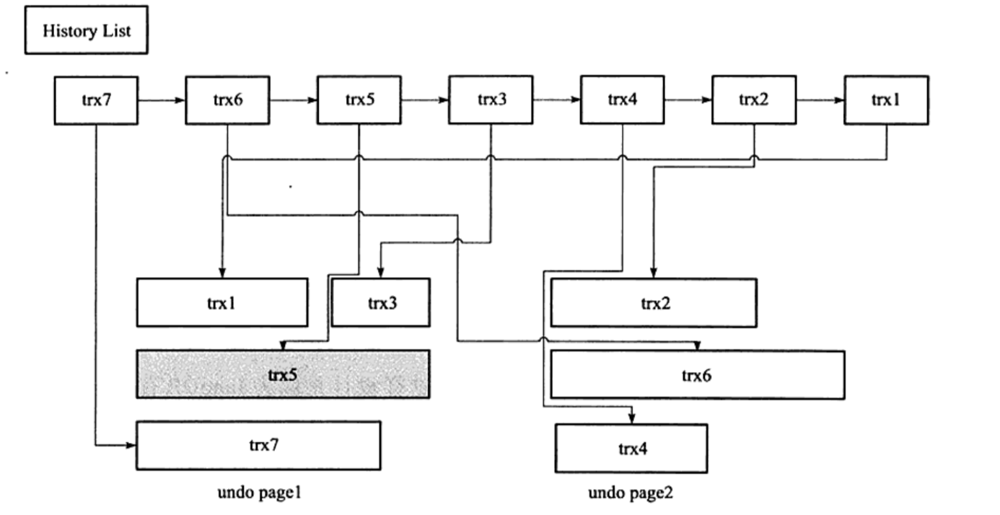
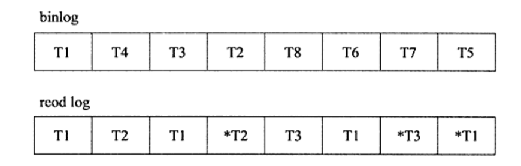

本文章来源于：<https://github.com/Zeb-D/my-review/tree/master/db/mysql> ，请star 强力支持，你的支持，就是我的动力。

[TOC]

------

### 序

本文主要通过mysql的主要架构设计，来普及下主要知识点，为接下来系列学习mysql更深次做普及如事物实现、B+ tree index 相关实现等


### 一、innodb 架构


```
注：图片来自 mysql官方文档，8.0版本，InnoDB Architecture
```

mysql的InnoDB存储引擎架构，包括了内存架构和磁盘架构两部分。

其中，内存架构部分包括：

缓冲池（Buffer Poll）、

修改缓冲区（Change Buffer）、

自适应hash索引（Adaptive Hash Index）、

日志缓冲区（Log Buffer）。

磁盘架构包括：表、索引、表空间、双写缓冲区(Doublewrite Buffer)、重做日志(Redo Log)、撤销日志(Undo Logs)。


### 二、内存架构

#### 缓冲池（Buffer Poll）

​    缓冲池是InnoDB位于主存储器中的一片区域，用于缓存访问过的表和索引数据。缓冲池允许直接从内存处理频繁使用的数据，这加快了处理速度。在专用服务器上，通常高达80%的物理内存会分配给缓冲池。

​    为了提高大容量读操作的效率，缓冲池被分割成一个个可以容纳多行的页(pages)。为了方便缓存管理，缓冲池被实现成页的链表结构；很少使用的数据会使用LRU算法的一种变体从缓存中淘汰。

​    了解如何利用缓冲池将频繁访问的数据保存在内存中，是MySQL调优的一个重要方面。





#### 修改缓冲区

​    **修改缓冲区**是一个特殊的数据结构，用于缓存不在**缓冲池**中的那些二级索引页的变更。由insert, update或delete这些dml操作导致被缓存的变化，将在当这些页被其他读操作加载到缓冲池后合并。




#### 自适应hash索引

​    自适应散列索引特性，使InnoDB在具有适当的负载组合和充足的缓冲池内存的系统上，执行得更像内存数据库，而不会牺牲事务特性或可靠性。自适应哈希索引特性通过变量: innodb_adaptive_hash_index开启，或在服务启动时通过--skip-innodb-adaptive-hash-index参数关闭。

​    根据观察到的搜索模式，hash索引是使用索引key的前缀来创建的。前缀可以是任意长度，并且可能只有B树中的一些值出现在哈希索引中。哈希索引是根据需要为经常访问的索引页构建的。


#### 日志缓冲

日志缓冲区是保存即将写入磁盘上日志文件的数据的内存区域。

日志缓冲区大小由变量innodb_log_buffer_size定义。默认的大小是16MB。

日志缓冲区的内容定期刷新到磁盘。大的日志缓冲区能够在事务提交前无需写入redo日志数据到磁盘的情况下执行大事务。

因此，如果你有更新、插入、删除很多行记录的事务，可以通过增加日志缓冲区的大小来减少磁盘I/O。

innodb_flush_log_at_trx_commit变量控制日志缓冲区的内容如果写入并刷新到磁盘。innodb_flush_log_at_timeout变量控制日志刷新频率。


### 三、磁盘架构

#### 表

1、创建InnoDB表：即我们常用的create table t.... 会在InnoDB引擎内建表。

2、创建外表：有点类似hive。创建外表（即在数据目录之外建表）有几种不同的原因，例如：空间管理、I/O优化，或在具有特定性能或容量特征的存储设备上存放表，例如InnoDB支持下列方法来创建外表：

2-1 使用DATA DIRECTORY语句（指定数据目录）

```
CREATE TABLE t1 (c1 INT PRIMARY KEY) DATA DIRECTORY = '/external/directory';
```



2-2 使用CREATE TABLE ... TABLESPACE语法；

```
CREATE TABLE t2 (c1 INT PRIMARY KEY) TABLESPACE = innodb_file_per_table DATA DIRECTORY = '/external/directory';
```



2-3 在外部通用表空间上建表

3、导入InnoDB表

4、移动或拷贝InnoDB表

5、将表从MyISAM转换为InnoDB

6、InnoDB中的自动增量处理


#### 索引

包括：

1、聚簇索引和二级索引

2、InnoDB索引的物理结构

3、排序索引生成

4、InnoDB全文索引


#### 表空间

InnoDB中包含多种表空间，列举如下：

1、系统表空间（The System Tablespace）

2、File-Per-Table Tablespaces

3、通用表空间（General Tablespaces）

4、Undo表空间（Undo Tablespaces）

5、临时表空间（Temporary Tablespaces）

6、Server离线时移动表空间文件

7、禁用表空间路径验证

8、Linux系统表空间分配优化

9、表空间AUTOEXTEND_SIZE参数设置


#### 双写缓冲区（doublewrite buffer）

双写缓冲区（doublewrite buffer）是一个存储区域，InnoDB在将页面写入InnoDB数据文件中的适当位置之前，会在其中写入从缓冲池中刷新的页面。

如果在页面写入过程中存在操作系统、存储子系统或意外的mysqld进程退出，InnoDB可以在崩溃恢复期间从双写缓冲区中找到页的完好副本。

尽管数据被写入两次，但双写缓冲区不需要两倍的I/O开销或两倍的I/O操作。数据通过一次fsync()函数调用，在一个大的顺序块写入doublewrite缓冲区（除非`innodb_flush_method`被设置为`O_DIRECT_NO_FSYNC`）。

MySQL 8.0.20版本之前，双写缓冲区存储空间归属于InnoDB的系统表空间。MySQL 8.0.20开始，双写表空间存储区域放在了双写文件中。


#### 重做日志（redo log）

重做日志（redo log）是一种基于磁盘的数据结构，用于在崩溃恢复期间更正由不完整事务写入的数据。

在正常的操作中，重做日志对SQL语句或低级API调用产生的更改表数据的请求进行编码。在意外关闭之前未完成数据文件更新的修改，将在初始化期间和接受连接之前自动重放。

默认情况下，重做日志在磁盘上的物理标识是名为`ib_logfile0` 和 `ib_logfile1`的两个文件。

MySQL以循环方式写入重做日志文件。重做日志中的数据按照受影响的记录进行编码，这些数据统称为重做。重做日志的数据传递由不断增加的LSN值表示。

总结：重做日志，用于实现事务的持久性，即ACID中的D。

redo日志在存储体现上也由两部分组成：

- 内存中的重做日志缓冲（redo log buffer）：因为内存中是缓存，所以是易失的，server挂掉或机器断点等原因导致宕机后丢失；
- 重做日志文件（redo log file）：在磁盘上默认是两个文件存储。循环写入。


#### 撤销日志（undo log）

撤销日志（undo log）是与单个读写事务相关联的撤消日志记录的集合。撤消日志记录包含有关如何撤消事务对聚集索引记录的最新更改的信息。

如果另一个事务需要将原始数据视为一致读取操作的一部分，则会从撤消日志记录中检索未修改的数据。撤消日志存在于撤消日志段中，而撤消日志段包含在回滚段中。回滚段驻留在undo表空间和全局临时表空间中。

驻留在全局临时表空间中的撤消日志，用于用户定义的临时表中修改数据的事务。这些撤消日志不是重做日志，因为崩溃恢复不需要它们。它们仅用于服务器运行时的回滚。这种类型的撤消日志通过避免重做日志I/O而提高了性能。

总结：redo日志记录事务的行为，用于对页进行“重做”操作。但我们都知道事务还有rollback动作，回滚时需要undo，利用其信息把数据回滚到修改之前。undo是逻辑日志，只是将数据库逻辑地恢复到原来的样子，但数据结构和页本身在回滚之后可能大不相同。

另外，undo还有一个作用，就是在MVCC中提供快照。这需要借助一个名为history list的结构，把undo log组织成一个链表：




#### binlog

二进制日志，用于进行POINT-IN-TIME（PIT）恢复及主从复制（Replication）。与redo log区别：

（1）redo log是InnoDB存储引擎层产生的，而 binlog是Mysql数据库上层产生的；binlog不仅仅针对InnoDB引擎，MySQL数据库中的任何存储引擎对数据库的更改都会产生binlog。

（2）内容形式。binlog是一种逻辑日志，记录的是SQL语句。而InnoDB存储引擎层面的redo log是物理格式日志，记录的是对每个页的修改

（3）写入时间点：binlog只在事务提交完成后进行一次写入，而redo log在事务进行中不断被写入，表现：日志并不是随事务提交的顺序进行写入的。如下图所示：



