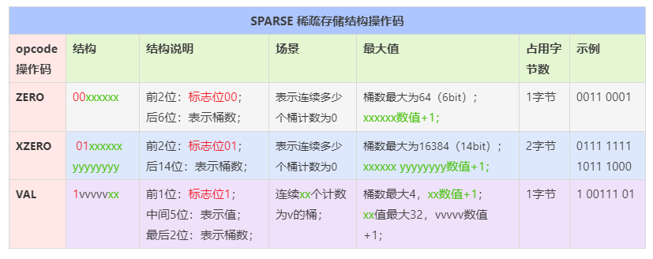

本文章来源于：<https://github.com/Zeb-D/my-review> ，请star 强力支持，你的支持，就是我的动力。

[TOC]

------

### 提问

日活数据统计面临哪些挑战

- Bitmaps可用于统计日活吗？
- 日活数据统计的特点

名词解释

- DAU(Daily Active User)日活跃用户数量
  常用于反映网站、互联网应用或网络游戏的运营情况。DAU通常统计一日（统计日）之内，登录或使用了某个产品的用户数（去除重复登录的用户）；
- 月活跃用户数量(Monthly Active User，MAU)
  月活跃用户数量通常统计一个月（统计月）之内，登录或使用了某个产品的用户数（去除重复登录的用户）；
- Note：日活、月活反映用户的活跃度，但是无法反映用户的粘性。


### 分析

#### Bitmaps可用于统计日活吗？

 Bitmaps 在大数据下的应用，那么Bitmaps可以用于统计日活数据吗？我们来做个计算分析（以一亿用户为例）：

| 统计方式  | 占用计算  | 1亿用户占用空间（M）   |
| ---- | ---- | ---- |
|MySQL  32bit的int数据类型 | 1个int所需存储空间为4字节，可存储32 bit位 |10^8 / (1024 * 1024 * 8 / 32) ≈ 381 M|
|Redis Bitmaps | Bitmaps单个支持512M，不像int单个仅存储32位  | 10^8 / (1024 * 1024 * 8) ≈ 12M |

使用Bitmaps计算日活月活：

- 计算日活：bitcount key获取key为1的数量；
- 计算月活：可把30天的所有bitmap做or计算，再进行bitcount计算；
- 计算留存率：昨日留存=昨天今天连续登录的人数/昨天登录的人数，即昨天的bitmap与今天的bitmap进行and计算，再除以昨天bitcount的数量。

通过以上计算，我们发现Bitmaps已经很节省空间了。统计一个网站的日活已不在话下，但是大型互联网公司除了日活，还有UV、PV等等需要统计。面对上千甚至更多的需统计模块，1个模块1天需要12M，一年就需要12M * 365 / 1024 ≈ 4.3G ，1000个模块一年就需要 12M * 365 / 1024 / 1024 ≈ 4.2T。So 革命尚未成功，我们还需再节省点！


#### 日活数据统计的特点

- 数据需要去重；
- 数据允许有一定的偏差，101W和102W差距不大；
- 占用空间尽可能小；


### HyperLogLog介绍

#### HyperLogLog必知

HyperLogLog（HLL）是一种用于基数计算的概率数据结构，通俗的说就是支持集合中不重复元素的统计。

常规基数计算需要准备一块内存空间用于存储已经计数的元素，避免某些元素被重复统计。Redis提供了一种用精度来换取内存空间的算法，标准误差低于1%。仅需要12K 就能完成统计（再加上HLL自身所需的一点bytes），如果HyperLogLog中的元素较少，所需内存空间更小。HyperLogLogs的标准误差是0.81%。

输入元素数量或体积非常大时，HLL所需空间固定且很小。12kb内存可计算接近 2^64 个不同元素的基数。

HyperLogLog虽然技术实现是一种 不同的数据结构，但底层依旧是Redis strings，所以可以使用GET命令获取序列化后的数据，使用SET命令反序列化数据存储到Redis。

#### HyperLogLog和Sets的区别

|对比/数据类型 |	Sets |	HyperLogLog |
| ---- | ---- | ---- |
|是否实际存储统计元素 |	存储 |	不存储元素，仅存储存在的标记 |
|增加元素 |	SADD |	PFADD |
|统计元素数量 |	SCARD |	PFCOUNT |
|删除元素 |	SREM |	不支持删除元素 |

### HyperLogLog如何使用

【HyperLogLog核心命令】：PFADD、PFCOUNT、PFMERGE；

#### HyperLogLog命令对比分析

|命令 |	功能 |	参数 |
| ---- | ---- | ---- |
|PFADD |	添加元素到HLL数据结构	| key element [element …] |
|PFCOUNT	| 返回HLL的基数值 |	key [key …] |
|PFMERGE	| 合并多个HLL结构数据到destkey	 | destkey sourcekey [sourcekey …] |

HLL操作命令中的PF含义：HyperLogLog 数据结构的发明人 Philippe Flajolet 的首字母缩写。


#### HyperLogLog命令详解


#### HyperLogLog命令注意事项

- PFADD仅存储标记，不存储元素本身；
- PFCOUNT实际是一个write命令，执行PFCOUNT时可能会重新计算计数值并存储；
- key有多个时，PFCOUNT会动态合并计算，并且计算结果不会被缓存，所以生产环境执行PFCOUNT时尽量避免带多个key；
- key有多个时，PFCOUNT是先合并再计算，结果为多个对象合并<去重>后的基数值（注意：不是基数值之和）；
- PFMERGE计算的是sourcekey的并集；
- 如果destkey已存在，则PFMERGE执行后destkey最终的结果是dest+source的并集；

#### HyperLogLog命令示例

```
127.0.0.1:6379> pfadd hll 1
(integer) 1
127.0.0.1:6379> pfadd hll 1
(integer) 0
127.0.0.1:6379> pfadd hll 2 3 4
(integer) 1
127.0.0.1:6379> pfcount hll
(integer) 4
127.0.0.1:6379> pfcount hll:notexist
(integer) 0
127.0.0.1:6379> pfadd hll2 a b
(integer) 1
127.0.0.1:6379> pfcount hll2
(integer) 2
127.0.0.1:6379> pfcount hll hll2
(integer) 6
127.0.0.1:6379> get hll
"HYLL\x01\x00\x00\x00\x04\x00\x00\x00\x00\x00\x00\x00A\xee\x84[v\x80Mt\x80Q,\x8cC\xf3"
127.0.0.1:6379> set hll:error error666
OK
127.0.0.1:6379> pfcount hll:error
(error) WRONGTYPE Key is not a valid HyperLogLog string value.
```


```
127.0.0.1:6379> pfadd hllm1 1 2 3 4 5
(integer) 1
127.0.0.1:6379> pfadd hllm2 5 6 7 8
(integer) 1
127.0.0.1:6379> pfmerge hllm3 hllm1 hllm2
OK
127.0.0.1:6379> pfcount hllm3
(integer) 8

127.0.0.1:6379> pfadd hllm4 7 8 9 10 11 12 14 14
(integer) 1
127.0.0.1:6379> pfmerge hllm4 hllm1 hllm2
OK
127.0.0.1:6379> pfcount hllm4
(integer) 13
```

### HyperLogLog应用场景

####  网站日活月活

日活：每天一个HLL，用户登录时则PFADD HLL20200719 userID;
月活：合并当月的所有日活数据，PFMERGE HLL202007 HLL20200701 HLL20200702 HLL20200703 …

#### 网页UV

UV（Unique Visitor）独立访客：1天内；cookie为标识；相同的客户端多次访问只计为1个访客。
比如老板想实时查看公司网站某些页面从今天0点到现在被多少独立访客访问。

#### 其他场景场景

搜索引擎关键词搜索量；
用户在线人数统计；
基于基数计数的数据分析场景。

### HyperLogLog 原理

HyperLogLog结构
HyperLogLog总体分为2大部分：对象头、寄存器（桶）。

|HYLL |	E |	N/U |	Cardin. |
| ---- | ---- | ---- | ---- |
|4 字节 |	1 字节 |	3 字节 |	8 字节|

HLL源码中结构体定义如下：

```
struct hllhdr {
    char magic[4];      /* "HYLL"，对应源码注释中的HYLL*/
    uint8_t encoding;   /* HLL_DENSE or HLL_SPARSE.稀疏/密集存储结构标记，对应源码注释中的E */
    uint8_t notused[3]; /* 保留3字节备用，目前未使用，值为0，对应源码注释中的N/U */
    uint8_t card[8];    /* Cached cardinality（基数缓存）, little endian. 对应源码注释中的Cardin，cardinality<基数> */
    uint8_t registers[]; /* Data bytes. */
};
```

HyperLogLog底层结构有 dense（密集存储结构） 和 sparse（稀疏存储结构） 2种，无论哪种存储结构，都有一个 16 byte 的对象头（header）；


#### HyperLogLog对象头（HLL header）

##### magic魔术字符串

从定义看，magic占用 4 byte ，存储的是“HYLL”标记，那么它究竟有什么用呢？使用过HyperLogLog的同学肯定对下面这个异常不陌生；

```
127.0.0.1:6379> set key1 e1
OK
127.0.0.1:6379> pfadd key1
(error) WRONGTYPE Key is not a valid HyperLogLog string value.

127.0.0.1:6379> pfadd hll1 a
(integer) 1
127.0.0.1:6379> get hll1
"HYLL\x01\x00\x00\x00\x00\x00\x00\x00\x00\x00\x00\x80q\xa6\x84NW"
```

当我们对一个普通字符串使用pfadd指令时，会提示string value 不是HyperLogLog类型；

由于HyperLogLog底层结构也是string，那么Redis如何区分一个string仅仅是基础的字符串还是HyperLogLog呢？

原来在执行pf相关指令前，会调用方法 isHLLObjectOrReply() 检查 value对象是否是 HyperLogLog 结构，如果不是则说明不是HyperLogLog结构，就会返回上述WRONGTYPE异常。

isHLLObjectOrReply() 其中一项校验就是检查 value 的magic魔术字符串是否是"HYLL"，不是则说明不是HyperLogLog结构。

细心的同学一定发现了，使用get指令获取HyperLogLog对象的值时，对象头是以“HYLL”开头的。

注意：

如果pfcount 一个 不存在的 key，返回结果是0；


##### encoding存储结构标记

encoding：单字节编码，HyperLogLog数据类型时值为0或1：

- 1表示 DENSE 密集存储结构；
- 0表示 SPARSE 稀疏存储结构；
  

先前提到的isHLLObjectOrReply()方法在检查value对象是否是 HyperLogLog 结构时，也会检查 encoding值：

- 检查encoding的值是否是0或1，不是则说明不是HyperLogLog结构；
- 如果是密集存储结构，还需要校验对象长度是否和密集计数器长度相同；

```
# HyperLogLog源码-校验encoding值
# HLL_MAX_ENCODING定义值为1，有趣的是此处不是用的( encoding !=0 || encoding != 1)，而是直接(encoding > 1)；
if (hdr->encoding > HLL_MAX_ENCODING) goto invalid;
```

##### notused和Cardin

notused：未使用的3个字节，目前未使用，值为0 。

Cardin：The “Cardin.” field is a 64 bit integer。8字节的 基数缓存，正因为有了基数缓存，才让pfcount更加高效；


#### 基数缓存

在执行pfcount指令时，会返回HLL对象的基数，那么这个基数是如何存储及返回的呢？让我们一探究竟：

HLL的对象头中有个Cardin基数缓存，存储着HLL的基数，便于快速返回基数值。

HyperLogLog 的基数值是由 16384 个寄存器（寄存器又可叫做桶，每个桶6bit）的基数值进行调和平均并修正而来。如果有桶位基数值改变，则将基数缓存标记置为过期，需要特别注意的是，此时并不会重新计算基数值，需等执行pfcount指令时才重新计算并刷新缓存；

```
// 1左移14位（2^14），值为 16384；

#define HLL_P 14 /* The greater is P, the smaller the error. */

#define HLL_REGISTERS (1<<HLL_P) /* With P=14, 16384 registers. */
```

执行pfcount指令时，先判断基数缓存是否过期，未过期则直接返回缓存值，已过期则重新计算并缓存后再返回；

但是这个基数并不一定是最新的，如果card最高位是0，则说明缓存有效。card共8位即64字节，1bit标记缓存是否有效，63bit存储基数值；


    void pfcountCommand(client *c) {
        
        if (多key) {
            // 合并多个HLL后计算基数并返回（注意：不是基数值之和）；
        }
    
        if (单key且value不存在) {
            // 单key且value不存在返回0；
        } else { // 单key且value存在
    		
            if (HLL_VALID_CACHE(hdr)) {// 缓存有效
                // 直接返回基数缓存值；
            } else {// 缓存无效
                // 计算基数值；
    			// 更新基数缓存标记及基数缓存值；
            }
        }
    }

```
// HLL_INVALIDATE_CACHE：将基数缓存置为失效状态（最高位设置为1）；
#define HLL_INVALIDATE_CACHE(hdr) (hdr)->card[7] |= (1<<7)


// HLL_VALID_CACHE：校验缓存是否有效；
// 最高位如果为0，表示缓存有效，pfcount查询基数时直接返回缓存值；
#define HLL_VALID_CACHE(hdr) (((hdr)->card[7] & (1<<7)) == 0)

```


#### pfadd底层逻辑

pfadd key value

HLL有2^14 = 16384个桶，每个桶有 6 bit；

pfadd时需要计算2个值：桶位（寄存器编号） regnum、桶值（寄存器计数值）count；

- 使用MurmurHash64A算法对value进行hash，结果为64bit的hash值（比特串）；
- 取hash值的前14位（低14位，从右边开始计算）用于计算桶编号，将14位的二进制值转为10进制，这个值就是 regnum；
- 从hash值第15位开始，统计第一个1出现的位置（从1开始计数）（源码中写的是连续0的个数+1），此值为 count，count最大为50；
- 根据 regnum 查询 对应桶位先前的值 oldcount；
- 如果 count 值大于 oldcount，则更新值为count；

让我们看个实际的例子：

假设hash值是 ：{此处省略45位}01100 00000000000101

- 前14位的二进制转为10进制，值为5（regnum），即我们把数据放在第5个桶；
- 后50位第一个1的位置是3，即count值为3；
- registers[5]取出历史值oldcount，
- 如果count > oldcount，则更新 registers[5] = count；
- 如果count <= oldcount，则不做任何处理；


#### 密集存储结构和稀疏存储结构

前文我们提到，HLL底层有2种存储结构：稀疏和密集。

##### 密集存储结构

密集存储结构相对很简单，由连续的16384个寄存器（桶）拼接而成，每个桶6 bit。

但由于一个桶只有6 bit，在计算一个桶的计数值时，可能需要 2个桶拼接计算，即会涉及到2个字节。

需要注意的是，HHL的字节都是左低位右高位，我们平时计算使用的字节都是左高位右低位（如二进制 0101 表示 十进制 5），所以需要倒置后进行计算。我们来个简单的图理解下，寄存器registers表示HLL的存储单元，字节buffer是底层存储结构。


以上图例仅为方便理解，HLL实际存储计算方式更加复杂，有兴趣的同学可以看看以下源码：

```
/* Store the value of the register at position 'regnum' into variable 'target'.
 * 'p' is an array of unsigned bytes. */
 
/* 获取密集存储结构指定寄存器的值
target：变量，用户存放指定寄存器编号regnum目前的计数值；
p：寄存器；
regnum：寄存器编号；
*/


#define HLL_BITS 6 /* Enough to count up to 63 leading zeroes. */
#define HLL_REGISTER_MAX ((1<<HLL_BITS)-1)


#define HLL_DENSE_GET_REGISTER(target,p,regnum) do { \
    uint8_t *_p = (uint8_t*) p; \
    unsigned long _byte = regnum*HLL_BITS/8; \
    unsigned long _fb = regnum*HLL_BITS&7; \
    unsigned long _fb8 = 8 - _fb; \
    unsigned long b0 = _p[_byte]; \
    unsigned long b1 = _p[_byte+1]; \
    target = ((b0 >> _fb) | (b1 << _fb8)) & HLL_REGISTER_MAX; \
} while(0)

/* Set the value of the register at position 'regnum' to 'val'.
 * 'p' is an array of unsigned bytes. */
 
/* 密集存储结构 设置寄存器指定编号（桶位）的值
p：寄存器；
regnum：寄存器编号；
val：待设置的计数值；
*/

#define HLL_DENSE_SET_REGISTER(p,regnum,val) do { \
    uint8_t *_p = (uint8_t*) p; \
    unsigned long _byte = regnum*HLL_BITS/8; \
    unsigned long _fb = regnum*HLL_BITS&7; \
    unsigned long _fb8 = 8 - _fb; \
    unsigned long _v = val; \
    _p[_byte] &= ~(HLL_REGISTER_MAX << _fb); \
    _p[_byte] |= _v << _fb; \
    _p[_byte+1] &= ~(HLL_REGISTER_MAX >> _fb8); \
    _p[_byte+1] |= _v >> _fb8; \
} while(0)

```


##### 稀疏存储结构

为什么会有稀疏存储结构呢？试想一下，在HLL初始化后，仅少量数据存入，此时大量的寄存器register（桶）的值都是0，大量的6bit寄存器空间也就完全浪费了。

Redis采用了如下opcode（指令）极致优化空间占用：

- ZERO：表示连续多少个桶计数为0（桶数最大64）；
  - 前2位：标志位00；
  - 后6位：表示桶数；
  - 占用1字节；
- XZERO：表示连续多少个桶计数为0（桶数最大16384）；
  - 前2位：标志位01；
  - 后14位：表示桶数；
  - 占用2字节；
- VAL：表示连续xx个计数为v的桶；
  - 前1位：标志位1；
  - 中间5位：表示值；
  - 最后2位：表示桶数；
  - 占用1字节；
  - 示例：1vvvvvxx，xx值最大32，vvvvv数值+1；



现在回过头来看看先前的HLL结构图是不是就更清晰了呢。


##### 稀疏存储结构何时转为密集存储结构

转换条件有2个，满足任意一个就会立即转换：

- 任意一个寄存器的值从32变成33（前面已经提到，稀疏存储结构下val的最大值是 32，代码中对应变量是 HLL_SPARSE_VAL_MAX_VALUE = 32）；
- 稀疏存储占用的总字节数超过 3000 字节（这个阈值可以通过redis.conf配置文件的 hll-sparse-max-bytes 进行调整）。

注意：

- 稀疏转为密集存储结构是不可逆的；
- hll-sparse-max-bytes 配置超过16000就没有意义了，如果CPU资源足够，但内存资源紧张时，建议设置成10000；

```
# this limit, it is converted into the dense representation.
#
# A value greater than 16000 is totally useless, since at that point the
# dense representation is more memory efficient.
#
# The suggested value is ~ 3000 in order to have the benefits of
# the space efficient encoding without slowing down too much PFADD,
# which is O(N) with the sparse encoding. The value can be raised to
# ~ 10000 when CPU is not a concern, but space is, and the data set is
# composed of many HyperLogLogs with cardinality in the 0 - 15000 range.

hll-sparse-max-bytes 3000


```


#### HyperLogLog引发的思考

首先补充一个非常实用的网站，可以在线动态观察HyperLogLog算法。
http://content.research.neustar.biz/blog/hll.html

需要注意的是，此网站 value hash后的值是24位，不是HyperLogLog MurmurHash64A()后的64位，不过也不影响观察学习其原理了。


##### pf 的内存占用为什么是 12k？

HyperLogLog实际使用了 2^14 = 16384 个桶，每个桶 6bit，最大占用内存即 2^14 * 6 / 8 = 12288 Byte = 12 KB（不多不少刚好12KB）。

补充1：HyperLogLog实际最大存储空间

HyperLogLog实际占用的空间为 【header】 + 【寄存器所占用的空间】，所以HyperLogLog实际占用空间会比12KB略多一点儿。

补充2：HyperLogLog实际最小存储空间

HyperLogLog最小存储空间是多少呢？当HHL基数为1时，1字节表示基数，XZERO占用2字节表示余下所有的零值计数器，所以 HyperLogLog最小存储空间是3字节略多一点儿（算上header占用）。


##### HyperLogLog最大统计的数量是 2^64 吗？

MurmurHash64A算法对value进行hash，结果为64bit的hash值，64位二进制最大表示的十进制是 2^64 ，所以最大可统计基数值就是 2^64 了吗？

但还需要注意的是，header中8字节的 基数缓存Cardin，1位表示缓存是否有效，63位表示基数值，所以HyperLogLog实际能统计的最大数量是 2^63。


##### 稀疏存储结构为什么既有ZERO又有XZERO呢？

ZERO：表示连续多少个桶计数为0（桶数最大64）；

XZERO：表示连续多少个桶计数为0（桶数最大16384）；

因为1个寄存器6bit，最多可表示 2^6 = 64 个 零值计数器，所以需要XZERO来表示更多的零值计数器。


##### 我们能从HyperLogLog中学到什么？

【需要才计算】

在计算基数缓存时，HLL并没有在每次寄存器更新时就计算，而是执行pfcount指令时才计算基数值并缓存。

HLL不立即计算本质上是因为pfadd的执行频率远高于pfcount，所以我们也不能一味的采用此种思想。

适合的才是最好的。

【存储结构转换】

为了最大化节省内存空间，也算是煞费苦心了。

##### HyperLogLog怎么读？

学原汁原味的读音，可前往YouTube的 Redis University 频道拜听[《Redis HyperLogLog Explained》](https://www.youtube.com/watch?v=UAL2dxl1fsE)

> 读音：[ˈhaɪpərlɔːɡlɔːɡ]。


------

> 参考资料
>
> 《Redis设计与实现》
>
> https://zxiaofan.blog.csdn.net/article/details/108041280
>
> https://zxiaofan.blog.csdn.net/article/details/107449335
