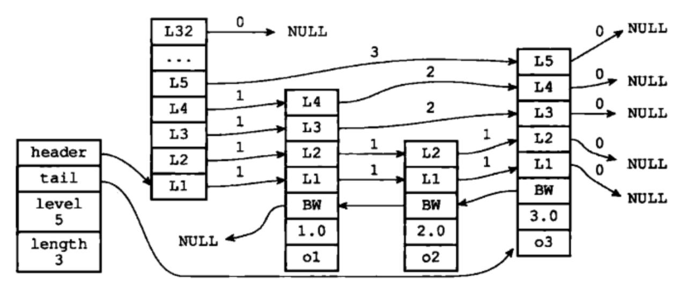
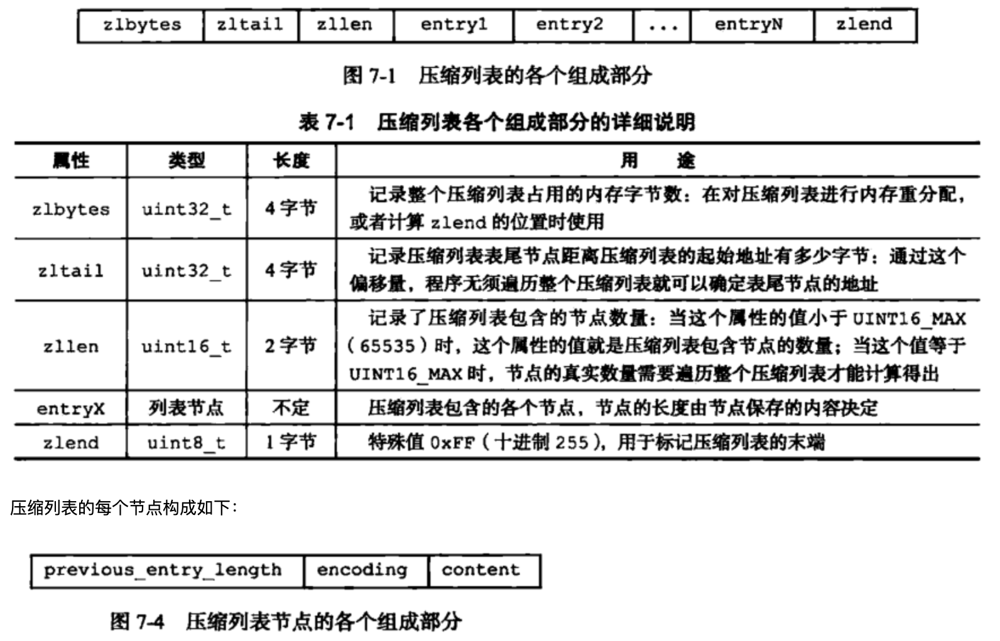
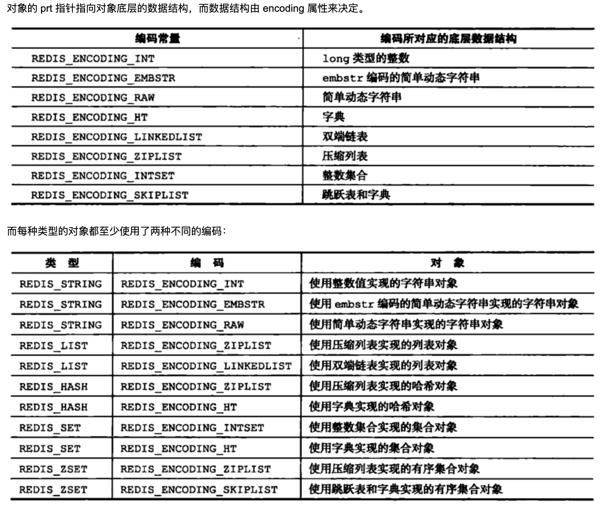
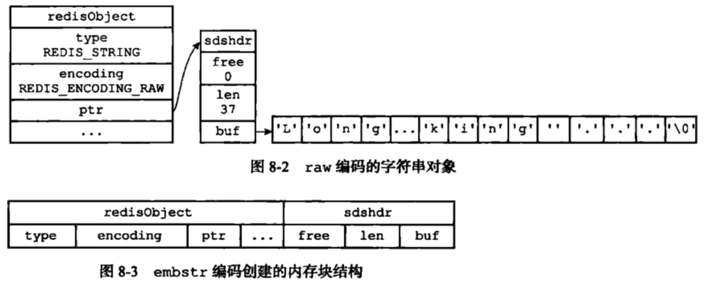
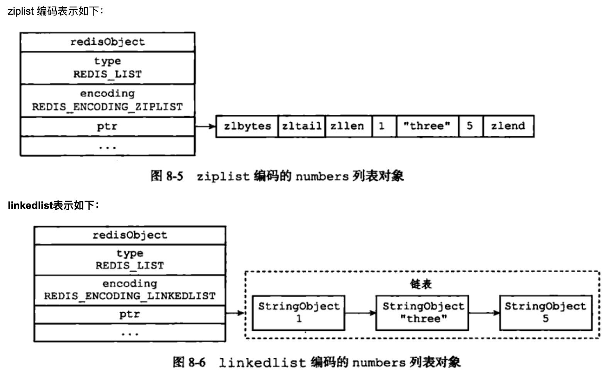
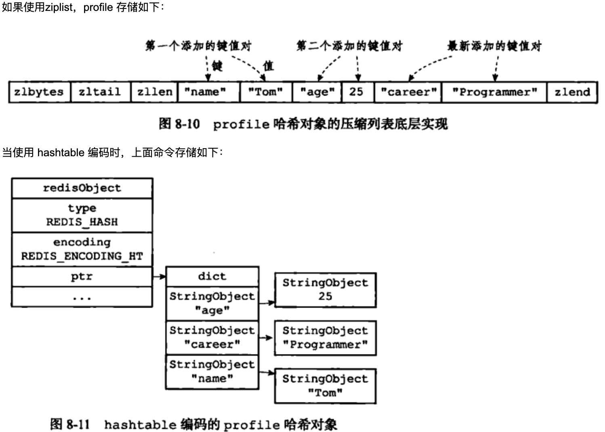
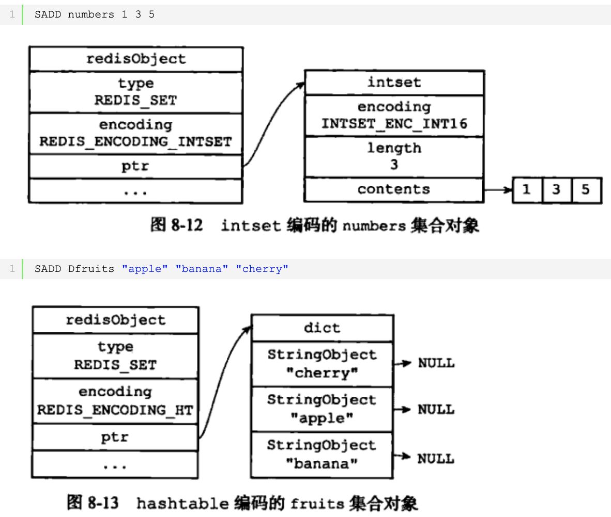
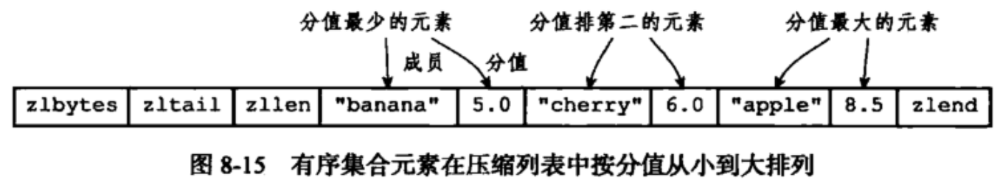

本文章来源于：<https://github.com/Zeb-D/my-review> ，请star 强力支持，你的支持，就是我的动力。

[TOC]

------

### 背景

redis的快除了表面上的内存操作、单线程无竞争，其实底层不同的数据结构实现做了很大的调优；

不同的操作类型也做了不同的内存优化；

```
docker run -p 6379:6379 -v /data/redis/data:/data:rw --name ydRedis -d redis:4.0.8 redis-server --appendonly yes --protected-mode no --requirepass "yd_redis"

docker exec -it ydRedis /bin/bash
redis-cli -a yd_redis
```

```
127.0.0.1:6379> set k1 1234
OK
127.0.0.1:6379> set k2 a
OK
127.0.0.1:6379> OBJECT ENCODING k1
"int"
127.0.0.1:6379> OBJECT ENCODING k2
"embstr"
127.0.0.1:6379>
```


本文主要分析redis `string` `hash` `list` `set` `sortset` ，需要了解基础命令可见：https://mp.weixin.qq.com/s/vsTLu0lsKNPkfNih52fGMw ；


### 六大数据结构

#### 简单动态字符串

Redis 是用 C 语言写的，但是对于Redis的字符串，却不是 C 语言中的字符串（即以空字符’\0’结尾的字符数组），它是自己构建了一种名为 简单动态字符串（simple dynamic string,SDS）的抽象类型，并将 SDS 作为 Redis的默认字符串表示。

　　**SDS 定义：**

```
struct sdshdr{
     //记录buf数组中已使用字节的数量
     //等于 SDS 保存字符串的长度
     int len;
     //记录 buf 数组中未使用字节的数量
     int free;
     //字节数组，用于保存字符串
     char buf[];
}
```

上面对于 SDS 数据类型的定义：

　　1、len 保存了SDS保存字符串的长度

　　2、buf[] 数组用来保存字符串的每个元素

　　3、free j记录了 buf 数组中未使用的字节数量

上面的定义相对于 C 语言对于字符串的定义，多出了 len 属性以及 free 属性。

为什么不使用C语言字符串实现，而是使用 SDS呢？这样实现有什么好处？

　　**①、常数复杂度获取字符串长度**

　　由于 len 属性的存在，我们获取 SDS 字符串的长度只需要读取 len 属性，时间复杂度为 O(1)。而对于 C 语言，获取字符串的长度通常是经过遍历计数来实现的，时间复杂度为 O(n)。通过 strlen key 命令可以获取 key 的字符串长度。

　　**②、杜绝缓冲区溢出**

　　我们知道在 C 语言中使用 strcat 函数来进行两个字符串的拼接，一旦没有分配足够长度的内存空间，就会造成缓冲区溢出。而对于 SDS 数据类型，在进行字符修改的时候，会首先根据记录的 len 属性检查内存空间是否满足需求，如果不满足，会进行相应的空间扩展，然后在进行修改操作，所以不会出现缓冲区溢出。

　　**③、减少修改字符串的内存重新分配次数**

　　C语言由于不记录字符串的长度，所以如果要修改字符串，必须要重新分配内存（先释放再申请），因为如果没有重新分配，字符串长度增大时会造成内存缓冲区溢出，字符串长度减小时会造成内存泄露。

　　而对于SDS，由于len属性和free属性的存在，对于修改字符串SDS实现了空间预分配和惰性空间释放两种策略：

　　1、空间预分配：对字符串进行空间扩展的时候，扩展的内存比实际需要的多，这样可以减少连续执行字符串增长操作所需的内存重分配次数。

　　2、惰性空间释放：对字符串进行缩短操作时，程序不立即使用内存重新分配来回收缩短后多余的字节，而是使用 free 属性将这些字节的数量记录下来，等待后续使用。（当然SDS也提供了相应的API，当我们有需要时，也可以手动释放这些未使用的空间。）

　　**④、二进制安全**

　　因为C字符串以空字符作为字符串结束的标识，而对于一些二进制文件（如图片等），内容可能包括空字符串，因此C字符串无法正确存取；而所有 SDS 的API 都是以处理二进制的方式来处理 buf 里面的元素，并且 SDS 不是以空字符串来判断是否结束，而是以 len 属性表示的长度来判断字符串是否结束。

　　**⑤、兼容部分 C 字符串函数**

　　虽然 SDS 是二进制安全的，但是一样遵从每个字符串都是以空字符串结尾的惯例，这样可以重用 C 语言库<string.h> 中的一部分函数。


#### 链表

链表是一种常用的数据结构，C 语言内部是没有内置这种数据结构的实现，所以Redis自己构建了链表的实现。

　　链表定义

```
typedef` `struct` `listNode{
    ``//前置节点
    ``struct` `listNode *prev;
    ``//后置节点
    ``struct` `listNode *next;
    ``//节点的值
    ``void` `*value; 
}listNode
```

　　通过多个 listNode 结构就可以组成链表，这是一个双向链表，Redis还提供了操作链表的数据结构：

```
typedef` `struct` `list{
   ``//表头节点
   ``listNode *head;
   ``//表尾节点
   ``listNode *tail;
   ``//链表所包含的节点数量
   ``unsigned ``long` `len;
   ``//节点值复制函数
   ``void` `(*``free``) (``void` `*ptr);
   ``//节点值释放函数
   ``void` `(*``free``) (``void` `*ptr);
   ``//节点值对比函数
   ``int` `(*match) (``void` `*ptr,``void` `*key);
}list;
```

Redis链表特性：

　　①、双端：链表具有前置节点和后置节点的引用，获取这两个节点时间复杂度都为O(1)。

　　②、无环：表头节点的 prev 指针和表尾节点的 next 指针都指向 NULL,对链表的访问都是以 NULL 结束。　　

　　③、带链表长度计数器：通过 len 属性获取链表长度的时间复杂度为 O(1)。

　　④、多态：链表节点使用 void* 指针来保存节点值，可以保存各种不同类型的值。


#### 字典

字典又称为符号表或者关联数组、或映射（map），是一种用于保存键值对的抽象数据结构。字典中的每一个键 key 都是唯一的，通过 key 可以对值来进行查找或修改。C 语言中没有内置这种数据结构的实现，所以字典依然是 Redis自己构建的。

　　Redis 的字典使用哈希表作为底层实现；

```
typedef` `struct` `dictht{
   ``//哈希表数组
   ``dictEntry **table;
   ``//哈希表大小
   ``unsigned ``long` `size;
   ``//哈希表大小掩码，用于计算索引值
   ``//总是等于 size-1
   ``unsigned ``long` `sizemask;
   ``//该哈希表已有节点的数量
   ``unsigned ``long` `used;
}dictht
```

 　　哈希表是由数组 table 组成，table 中每个元素都是指向 dict.h/dictEntry 结构，dictEntry 结构定义如下：

```
typedef struct dictEntry{
     //键
     void *key;
     //值
     union{
          void *val;
          uint64_tu64;
          int64_ts64;
     }v;
 
     //指向下一个哈希表节点，形成链表
     struct dictEntry *next;
}dictEntry
```

　　key 用来保存键，val 属性用来保存值，值可以是一个指针，也可以是uint64_t整数，也可以是int64_t整数。

注意这里还有一个指向下一个哈希表节点的指针，我们知道哈希表最大的问题是存在哈希冲突，如何解决哈希冲突，有开放地址法和链地址法。

这里采用的便是链地址法，通过next这个指针可以将多个哈希值相同的键值对连接在一起，用来解决**哈希冲突**。

**①、哈希算法：**Redis计算哈希值和索引值方法如下：

```
#1、使用字典设置的哈希函数，计算键 key 的哈希值
hash = dict->type->hashFunction(key);
#2、使用哈希表的sizemask属性和第一步得到的哈希值，计算索引值
index = hash & dict->ht[x].sizemask;
```

**②、解决哈希冲突：**这个问题上面我们介绍了，方法是链地址法。通过字典里面的 *next 指针指向下一个具有相同索引值的哈希表节点。

**③、扩容和收缩：**当哈希表保存的键值对太多或者太少时，就要通过 rerehash(重新散列）来对哈希表进行相应的扩展或者收缩。具体步骤：

　　　　　　1、如果执行扩展操作，会基于原哈希表创建一个大小等于 ht[0].used*2n 的哈希表（也就是每次扩展都是根据原哈希表已使用的空间扩大一倍创建另一个哈希表）。相反如果执行的是收缩操作，每次收缩是根据已使用空间缩小一倍创建一个新的哈希表。

　　　　　　2、重新利用上面的哈希算法，计算索引值，然后将键值对放到新的哈希表位置上。

　　　　　　3、所有键值对都迁徙完毕后，释放原哈希表的内存空间。

**④、触发扩容的条件：**

　　　　　　1、服务器目前没有执行 BGSAVE 命令或者 BGREWRITEAOF 命令，并且负载因子大于等于1。

　　　　　　2、服务器目前正在执行 BGSAVE 命令或者 BGREWRITEAOF 命令，并且负载因子大于等于5。

　　　　ps：负载因子 = 哈希表已保存节点数量 / 哈希表大小。

**⑤、渐近式 rehash**

　　　　什么叫渐进式 rehash？也就是说扩容和收缩操作不是一次性、集中式完成的，而是分多次、渐进式完成的。如果保存在Redis中的键值对只有几个几十个，那么 rehash 操作可以瞬间完成，但是如果键值对有几百万，几千万甚至几亿，那么要一次性的进行 rehash，势必会造成Redis一段时间内不能进行别的操作。所以Redis采用渐进式 rehash,这样在进行渐进式rehash期间，字典的删除查找更新等操作可能会在两个哈希表上进行，第一个哈希表没有找到，就会去第二个哈希表上进行查找。但是进行 增加操作，一定是在新的哈希表上进行的。


#### 跳跃表

关于跳跃表的趣味介绍：http://blog.jobbole.com/111731/

　　跳跃表（skiplist）是一种有序数据结构，它通过在每个节点中维持多个指向其它节点的指针，从而达到快速访问节点的目的。具有如下性质：

　　1、由很多层结构组成；

　　2、每一层都是一个有序的链表，排列顺序为由高层到底层，都至少包含两个链表节点，分别是前面的head节点和后面的nil节点；

　　3、最底层的链表包含了所有的元素；

　　4、如果一个元素出现在某一层的链表中，那么在该层之下的链表也全都会出现（上一层的元素是当前层的元素的子集）；

　　5、链表中的每个节点都包含两个指针，一个指向同一层的下一个链表节点，另一个指向下一层的同一个链表节点；


Redis中跳跃表节点定义如下：

```
typedef` `struct` `zskiplistNode {
   ``//层
   ``struct` `zskiplistLevel{
      ``//前进指针
      ``struct` `zskiplistNode *forward;
      ``//跨度
      ``unsigned ``int` `span;
   ``}level[];
   ``//后退指针
   ``struct` `zskiplistNode *backward;
   ``//分值
   ``double` `score;
   ``//成员对象
   ``robj *obj;
} zskiplistNode
```

 　　多个跳跃表节点构成一个跳跃表：

```
typedef` `struct` `zskiplist{
   ``//表头节点和表尾节点
   ``structz skiplistNode *header, *tail;
   ``//表中节点的数量
   ``unsigned ``long` `length;
   ``//表中层数最大的节点的层数
   ``int` `level;
}zskiplist;
```

 

①、搜索：从最高层的链表节点开始，如果比当前节点要大和比当前层的下一个节点要小，那么则往下找，也就是和当前层的下一层的节点的下一个节点进行比较，以此类推，一直找到最底层的最后一个节点，如果找到则返回，反之则返回空。

②、插入：首先确定插入的层数，有一种方法是假设抛一枚硬币，如果是正面就累加，直到遇见反面为止，最后记录正面的次数作为插入的层数。当确定插入的层数k后，则需要将新元素插入到从底层到k层。

③、删除：在各个层中找到包含指定值的节点，然后将节点从链表中删除即可，如果删除以后只剩下头尾两个节点，则删除这一层。


#### 整数集合

整数集合（intset）是Redis用于保存整数值的集合抽象数据类型，它可以保存类型为int16_t、int32_t 或者int64_t 的整数值，并且保证集合中不会出现重复元素。

　　定义如下：

```
typedef` `struct` `intset{
   ``//编码方式
   ``uint32_t encoding;
   ``//集合包含的元素数量
   ``uint32_t length;
   ``//保存元素的数组
   ``int8_t contents[];
}intset;
```

 整数集合的每个元素都是 contents 数组的一个数据项，它们按照从小到大的顺序排列，并且不包含任何重复项。

　　length 属性记录了 contents 数组的大小。

　　需要注意的是虽然 contents 数组声明为 int8_t 类型，但是实际上contents 数组并不保存任何 int8_t 类型的值，其真正类型有 encoding 来决定。

　　**①、升级**

　　当我们新增的元素类型比原集合元素类型的长度要大时，需要对整数集合进行升级，才能将新元素放入整数集合中。具体步骤：

　　1、根据新元素类型，扩展整数集合底层数组的大小，并为新元素分配空间。

　　2、将底层数组现有的所有元素都转成与新元素相同类型的元素，并将转换后的元素放到正确的位置，放置过程中，维持整个元素顺序都是有序的。

　　3、将新元素添加到整数集合中（保证有序）。

　　升级能极大地节省内存。

　　**②、降级**

　　整数集合不支持降级操作，一旦对数组进行了升级，编码就会一直保持升级后的状态。


#### 压缩列表

压缩列表（ziplist）是Redis为了节省内存而开发的，是由一系列特殊编码的连续内存块组成的顺序型数据结构，一个压缩列表可以包含任意多个节点（entry），每个节点可以保存一个字节数组或者一个整数值。

　　**压缩列表的原理：压缩列表并不是对数据利用某种算法进行压缩，而是将数据按照一定规则编码在一块连续的内存区域，目的是节省内存。**



　　①、previous_entry_ength：记录压缩列表前一个字节的长度。previous_entry_ength的长度可能是1个字节或者是5个字节，如果上一个节点的长度小于254，则该节点只需要一个字节就可以表示前一个节点的长度了，如果前一个节点的长度大于等于254，则previous length的第一个字节为254，后面用四个字节表示当前节点前一个节点的长度。利用此原理即当前节点位置减去上一个节点的长度即得到上一个节点的起始位置，压缩列表可以从尾部向头部遍历。这么做很有效地减少了内存的浪费。

　　②、encoding：节点的encoding保存的是节点的content的内容类型以及长度，encoding类型一共有两种，一种字节数组一种是整数，encoding区域长度为1字节、2字节或者5字节长。

　　③、content：content区域用于保存节点的内容，节点内容类型和长度由encoding决定。


#### 小结

大多数情况下，Redis使用简单字符串SDS作为字符串的表示，相对于C语言字符串，SDS具有常数复杂度获取字符串长度，杜绝了缓存区的溢出，减少了修改字符串长度时所需的内存重分配次数，以及二进制安全能存储各种类型的文件，并且还兼容部分C函数。

　　通过为链表设置不同类型的特定函数，Redis链表可以保存各种不同类型的值，除了用作列表键，还在发布与订阅、慢查询、监视器等方面发挥作用（后面会介绍）。

　　Redis的字典底层使用哈希表实现，每个字典通常有两个哈希表，一个平时使用，另一个用于rehash时使用，使用链地址法解决哈希冲突。

　　跳跃表通常是有序集合的底层实现之一，表中的节点按照分值大小进行排序。

　　整数集合是集合键的底层实现之一，底层由数组构成，升级特性能尽可能的节省内存。

　　压缩列表是Redis为节省内存而开发的顺序型数据结构，通常作为列表键和哈希键的底层实现之一。

　　以上介绍的简单字符串、链表、字典、跳跃表、整数集合、压缩列表等数据结构就是Redis底层的一些数据结构，用来实现介绍的Redis五大数据类型，那么每种数据类型是由哪些数据结构实现的呢？请继续看。


------

### 五大数据类型

#### 对象的类型与编码

Redis使用前面说的五大数据类型来表示键和值，每次在Redis数据库中创建一个键值对时，至少会创建两个对象，一个是键对象，一个是值对象，而Redis中的每个对象都是由 redisObject 结构来表示：

```
typedef struct redisObject{
     //类型
     unsigned type:4;
     //编码
     unsigned encoding:4;
     //指向底层数据结构的指针
     void *ptr;
     //引用计数
     int refcount;
     //记录最后一次被程序访问的时间
     unsigned lru:22;
}robj
```


##### **type属性**

　　对象的type属性记录了对象的类型，这个类型就是前面讲的五大数据类型：

```
string list hash set zset
```

　　可以通过如下命令来判断对象类型：

```
type key
```

```
127.0.0.1:6379> type k2
string
```

　　**注意：在Redis中，键总是一个字符串对象，而值可以是字符串、列表、集合等对象，所以我们通常说的键为字符串键，表示的是这个键对应的值为字符串对象，我们说一个键为集合键时，表示的是这个键对应的值为集合对象。**


##### encoding 属性和 *prt 指针

　　对象的 prt 指针指向对象底层的数据结构，而数据结构由 encoding 属性来决定。



　　可以通过如下命令查看值对象的编码：

```
OBJECT ENCODING  key
```

```
127.0.0.1:6379> OBJECT ENCODING k1
"int"
127.0.0.1:6379> OBJECT ENCODING k2
"embstr"
```


#### 字符串对象

字符串是Redis最基本的数据类型，不仅所有key都是字符串类型，其它几种数据类型构成的元素也是字符串。注意字符串的长度不能超过512M。

##### **①、编码**

　　字符串对象的编码可以是int，raw或者embstr。

　　1、int 编码：保存的是可以用 long 类型表示的整数值。

　　2、raw 编码：保存长度大于44字节的字符串（redis3.2版本之前是39字节，之后是44字节）。

　　3、embstr 编码：保存长度小于44字节的字符串（redis3.2版本之前是39字节，之后是44字节）。

由上可以看出，int 编码是用来保存整数值，raw编码是用来保存长字符串，而embstr是用来保存短字符串。其实 embstr 编码是专门用来保存短字符串的一种优化编码。

raw 和 embstr 的区别：



embstr与raw都使用redisObject和sds保存数据，区别在于，embstr的使用只分配一次内存空间（因此redisObject和sds是连续的），而raw需要分配两次内存空间（分别为redisObject和sds分配空间）。

因此与raw相比，embstr的好处在于创建时少分配一次空间，删除时少释放一次空间，以及对象的所有数据连在一起，寻找方便。

而embstr的坏处也很明显，如果字符串的长度增加需要重新分配内存时，整个redisObject和sds都需要重新分配空间，因此redis中的embstr实现为只读。

**ps：Redis中对于浮点数类型也是作为字符串保存的，在需要的时候再将其转换成浮点数类型。**

　

##### **②、编码的转换**

　　当 int 编码保存的值不再是整数，或大小超过了long的范围时，自动转化为raw。

　　对于 embstr 编码，由于 Redis 没有对其编写任何的修改程序（embstr 是只读的），在对embstr对象进行修改时，都会先转化为raw再进行修改，因此，只要是修改embstr对象，修改后的对象一定是raw的，无论是否达到了44个字节。

​		int编码和embstr编码如果做追加字符串等操作，满足条件下会被转换为raw编码；embstr编码的对象是只读的，一旦修改会先转码到raw。


#### 列表对象

list 列表，它是简单的字符串列表，按照插入顺序排序，你可以添加一个元素到列表的头部（左边）或者尾部（右边），它的底层实际上是个链表结构。

##### **①、编码**

　　列表对象的编码可以是 ziplist(压缩列表) 和 linkedlist(双端链表)。

　　比如我们执行以下命令，创建一个 key = ‘numbers’，value = ‘1 three 5’ 的三个值的列表。

```
rpush numbers 1 "three" 5
```



##### **②、编码转换**

当同时满足下面两个条件时，使用ziplist（压缩列表）编码：

　　1、列表保存元素个数小于512个

　　2、每个元素长度小于64字节

　　不能满足这两个条件的时候使用 linkedlist 编码。上面两个条件可以在redis.conf 配置文件中的 list-max-ziplist-value选项和 list-max-ziplist-entries 选项进行配置。


#### 哈希对象

哈希对象的键是一个字符串类型，值是一个键值对集合。

##### **①、编码**

　　哈希对象的编码可以是 ziplist 或者 hashtable。

　　当使用ziplist，也就是压缩列表作为底层实现时，新增的键值对是保存到压缩列表的表尾。比如执行以下命令：

```
hset profile name "Tom"
hset profile age 25
hset profile career "Programmer"
```



hashtable 编码的哈希表对象底层使用字典数据结构，哈希对象中的每个键值对都使用一个字典键值对。

　　在前面介绍压缩列表时，我们介绍过压缩列表是Redis为了节省内存而开发的，是由一系列特殊编码的连续内存块组成的顺序型数据结构，相对于字典数据结构，压缩列表用于元素个数少、元素长度小的场景。其优势在于集中存储，节省空间。

　　

##### **②、编码转换**

　　和上面列表对象使用 ziplist 编码一样，当同时满足下面两个条件时，使用ziplist（压缩列表）编码：

　　1、列表保存元素个数小于512个

　　2、每个元素长度小于64字节

不能满足这两个条件的时候使用 hashtable 编码。修改hash-max-ziplist-value选项和hash-max-ziplist-entries选项。


#### 集合对象

集合对象 set 是 string 类型（整数也会转换成string类型进行存储）的无序集合。注意集合和列表的区别：集合中的元素是无序的，因此不能通过索引来操作元素；集合中的元素不能有重复。

##### **①、编码**

　　集合对象的编码可以是 intset 或者 hashtable。

　　intset 编码的集合对象使用整数集合作为底层实现，集合对象包含的所有元素都被保存在整数集合中。

　　hashtable 编码的集合对象使用 字典作为底层实现，字典的每个键都是一个字符串对象，这里的每个字符串对象就是一个集合中的元素，而字典的值则全部设置为 null。这里可以类比Java集合中HashSet 集合的实现，HashSet 集合是由 HashMap 来实现的，集合中的元素就是 HashMap 的key，而 HashMap 的值都设为 null。



##### **②、编码转换**

　　当集合同时满足以下两个条件时，使用 intset 编码：

　　1、集合对象中所有元素都是整数

　　2、集合对象所有元素数量不超过512

不能满足这两个条件的就使用 hashtable 编码。第二个条件可以通过配置文件的 set-max-intset-entries 进行配置。


#### 有序集合对象

和上面的集合对象相比，有序集合对象是有序的。与列表使用索引下标作为排序依据不同，有序集合为每个元素设置一个分数（score）作为排序依据。

##### **①、编码**

　　有序集合的编码可以是 ziplist 或者 skiplist。

　　ziplist 编码的有序集合对象使用压缩列表作为底层实现，每个集合元素使用两个紧挨在一起的压缩列表节点来保存，第一个节点保存元素的成员，第二个节点保存元素的分值。并且压缩列表内的集合元素按分值从小到大的顺序进行排列，小的放置在靠近表头的位置，大的放置在靠近表尾的位置。

```
127.0.0.1:6379> ZADD price 8.5 apple 5.0 banana 6.0 cherry
(integer) 3
127.0.0.1:6379>
127.0.0.1:6379> zrange price 0 -1
1) "banana"
2) "cherry"
3) "apple"
```



 　skiplist 编码的有序集合对象使用 zet 结构作为底层实现，一个 zset 结构同时包含一个字典和一个跳跃表：

```
typedef struct zset{
     //跳跃表
     zskiplist *zsl;
     //字典
     dict *dice;
} zset;
```

字典的键保存元素的值，字典的值则保存元素的分值；跳跃表节点的 object 属性保存元素的成员，跳跃表节点的 score 属性保存元素的分值。

　　这两种数据结构会通过指针来共享相同元素的成员和分值，所以不会产生重复成员和分值，造成内存的浪费。

　　说明：其实有序集合单独使用字典或跳跃表其中一种数据结构都可以实现，但是这里使用两种数据结构组合起来，原因是假如我们单独使用 字典，虽然能以 O(1) 的时间复杂度查找成员的分值，但是因为字典是以无序的方式来保存集合元素，所以每次进行范围操作的时候都要进行排序；假如我们单独使用跳跃表来实现，虽然能执行范围操作，但是查找操作有 O(1)的复杂度变为了O(logN)。因此Redis使用了两种数据结构来共同实现有序集合。

　　

##### **②、编码转换**

　　当有序集合对象同时满足以下两个条件时，对象使用 ziplist 编码：

　　1、保存的元素数量小于128；

　　2、保存的所有元素长度都小于64字节。

　　不能满足上面两个条件的使用 skiplist 编码。以上两个条件也可以通过Redis配置文件zset-max-ziplist-entries 选项和 zset-max-ziplist-value 进行修改。


#### 小结

对于string 数据类型，因为string 类型是二进制安全的，可以用来存放图片，视频等内容，另外由于Redis的高性能读写功能，而string类型的value也可以是数字，可以用作计数器（INCR,DECR），比如分布式环境中统计系统的在线人数，秒杀等。

　　对于 hash 数据类型，value 存放的是键值对，比如可以做单点登录存放用户信息。

　　对于 list 数据类型，可以实现简单的消息队列，另外可以利用lrange命令，做基于redis的分页功能

　　对于 set 数据类型，由于底层是字典实现的，查找元素特别快，另外set 数据类型不允许重复，利用这两个特性我们可以进行全局去重，比如在用户注册模块，判断用户名是否注册；另外就是利用交集、并集、差集等操作，可以计算共同喜好，全部的喜好，自己独有的喜好等功能。

　　对于 zset 数据类型，有序的集合，可以做范围查找，排行榜应用，取 TOP N 操作等。

------


### 内存回收和内存共享

#### ①、内存回收

　　前面讲 Redis 的每个对象都是由 redisObject 结构表示：

```
typedef struct redisObject{
     //类型
     unsigned type:4;
     //编码
     unsigned encoding:4;
     //指向底层数据结构的指针
     void *ptr;
     //引用计数
     int refcount;
     //记录最后一次被程序访问的时间
     unsigned lru:22;
 
}robj
```

　　其中关键的 type属性，encoding 属性和 ptr 指针都介绍过了，那么 refcount 属性是干什么的呢？

　　因为 C 语言不具备自动回收内存功能，那么该如何回收内存呢？于是 Redis自己构建了一个内存回收机制，通过在 redisObject 结构中的 refcount 属性实现。这个属性会随着对象的使用状态而不断变化：

　　1、创建一个新对象，属性 refcount 初始化为1

　　2、对象被一个新程序使用，属性 refcount 加 1

　　3、对象不再被一个程序使用，属性 refcount 减 1

　　4、当对象的引用计数值变为 0 时，对象所占用的内存就会被释放。


引用计数的内存回收机制其实是不被Java采用的，因为不能克服循环引用的例子（比如 A 具有 B 的引用，B 具有 C 的引用，C 具有 A 的引用，除此之外，这三个对象没有任何用处了），这时候 A B C 三个对象会一直驻留在内存中，造成内存泄露。

那么 Redis 既然采用引用计数的垃圾回收机制，如何解决这个问题呢？

　　在前面介绍 redis.conf 配置文件时，在 MEMORY MANAGEMENT 下有个 maxmemory-policy 配置：

　　maxmemory-policy ：当内存使用达到最大值时，redis使用的清楚策略。有以下几种可以选择：

　　　　1）volatile-lru  利用LRU算法移除设置过过期时间的key (LRU:最近使用 Least Recently Used ) 

　　　　2）allkeys-lru  利用LRU算法移除任何key 

　　　　3）volatile-random 移除设置过过期时间的随机key 

　　　　4）allkeys-random 移除随机key

　　　　5）volatile-ttl  移除即将过期的key(minor TTL) 

　　　　6）noeviction noeviction  不移除任何key，只是返回一个写错误 ，默认选项

　　通过这种配置，也可以对内存进行回收。


#### 内存共享

refcount 属性除了能实现内存回收以外，还能用于内存共享。

　　比如通过如下命令 set k1 100,创建一个键为 k1，值为100的字符串对象，接着通过如下命令 set k2 100 ，创建一个键为 k2，值为100 的字符串对象，那么 Redis 是如何做的呢？

　　1、将数据库键的值指针指向一个现有值的对象

　　2、将被共享的值对象引用refcount 加 1

注意：Redis的共享对象目前只支持整数值的字符串对象。之所以如此，实际上是对内存和CPU（时间）的平衡：共享对象虽然会降低内存消耗，但是判断两个对象是否相等却需要消耗额外的时间。对于整数值，判断操作复杂度为O(1)；对于普通字符串，判断复杂度为O(n)；

而对于哈希、列表、集合和有序集合，判断的复杂度为O(n^2)。

虽然共享对象只能是整数值的字符串对象，但是5种类型都可能使用共享对象（如哈希、列表等的元素可以使用）。


#### 对象的空转时长

在 redisObject 结构中，前面介绍了 type、encoding、ptr 和 refcount 属性，最后一个 lru 属性，该属性记录了对象最后一次被命令程序访问的时间。

　　使用 OBJECT IDLETIME 命令可以打印给定键的空转时长，通过将当前时间减去值对象的 lru 时间计算得到。

```
127.0.0.1:6379> OBJECT IDLETIME price
(integer) 764
```

lru 属性除了计算空转时长以外，还可以配合前面内存回收配置使用。如果Redis打开了maxmemory选项，且内存回收算法选择的是volatile-lru或allkeys—lru，那么当Redis内存占用超过maxmemory指定的值时，Redis会优先选择空转时间最长的对象进行释放。


------

> 参考资料
>
> 《Redis设计与实现》
>
> https://www.cnblogs.com/ysocean/p/9102811.html
>
> https://www.cnblogs.com/qmillet/p/12494469.html
