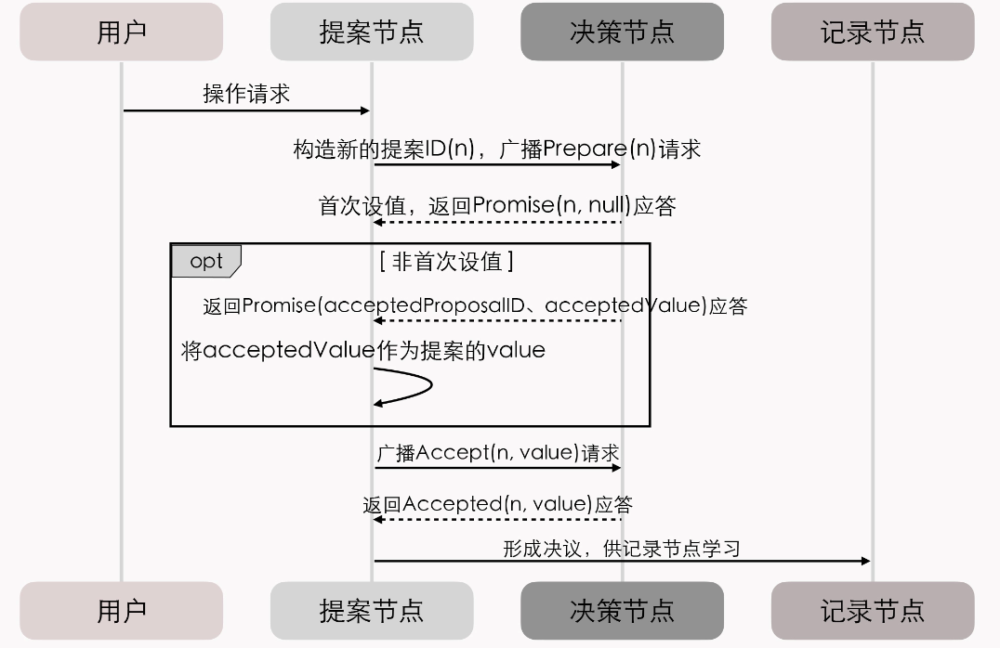
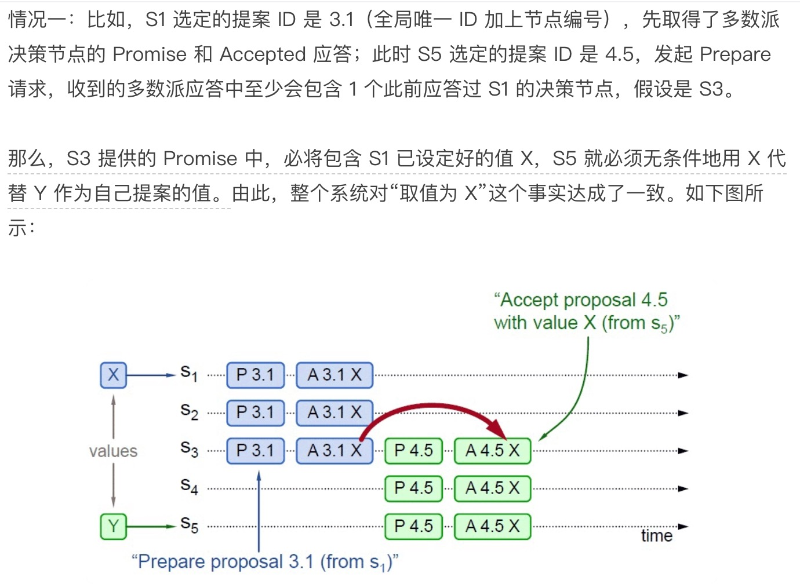
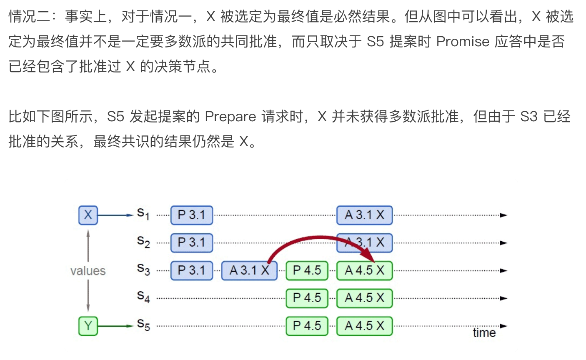
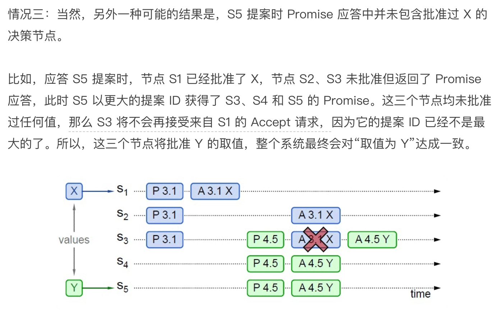
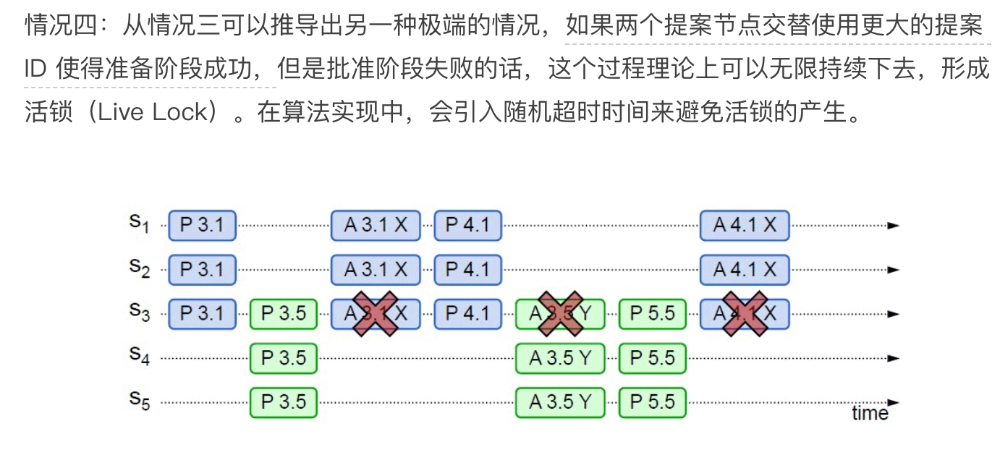
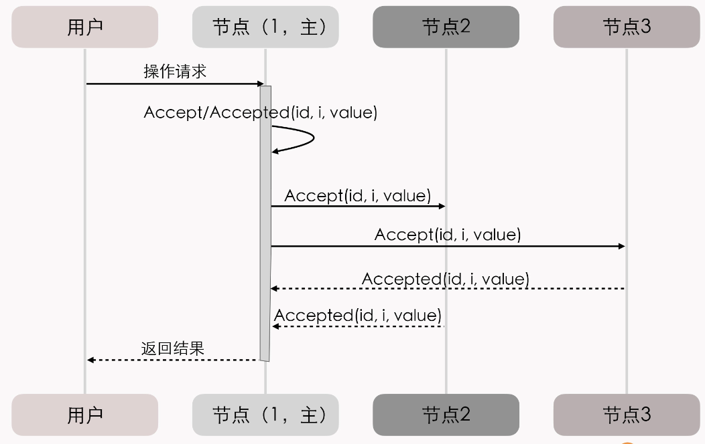

本文章来源于：<https://github.com/Zeb-D/my-review> ，请star 强力支持，你的支持，就是我的动力。

[TOC]

------

### 背景

下面介绍Paxos 协议，它是一个比两阶段提交要轻量的保证一致性的协议。

在分布式系统中，节点之间的信息交换有两种方式，

一种是通过共享内存共用一份数据；

另一种是通过消息投递来完成信息的传递。

而在分布式系统中，通过消息投递的方式会遇到很多意外的情况，

例如网络问题、进程挂掉、机器挂掉、进程很慢没有响应、进程重启等情况，这就会造成消息重复、一段时间内部不可达等现象。Paxos 协议是帮助我们解决分布式系统中一致性问题的一个方案。

### Paxos 算法的诞生之路

Paxos 算法，是由Leslie Lamport（就是大名鼎鼎的LaTeX中的“La”）提出的一种基于消息传递的协商共识算法。

现在，Paxos 算法已经成了分布式系统最重要的理论基础，几乎就是“共识”这两字的代名词了。这个极高的评价来自提出 Raft 算法的论文“In Search of an Understandable Consensus Algorithm”，更是显得分量十足。

关于 Paxos 在分布式共识算法中的地位，还有这么一种说法：

> There is only one consensus protocol, and that's “Paxos” — all other approaches are just broken versions of Paxos.世界上只有一种共识协议，就是 Paxos，其他所有共识算法都是 Paxos 的退化版本。—— Mike Burrows，Inventor of Google Chubby

虽然我认为“世界上只有 Paxos 一种分布式共识算法”的说法有些夸张，但是如果没有 Paxos，那后续的 Raft、ZAB 等算法，ZooKeeper、etcd 这些分布式协调框架，Hadoop、Consul 这些在此基础上的各类分布式应用，都很可能会延后好几年面世。

但 Paxos 算法从被第一次提出，到成为分布式系统最重要的理论基础，可谓是经历了一番波折。我们来具体看看。

### 拜占庭将军问题

使用Paxos 协议有一个前提，那就是不存在拜占庭将军问题。

拜占庭位于现在土耳其的伊斯坦布尔，是东罗马帝国的首都。当时拜占庭罗马帝国国土辽阔，防御敌人的各个军队都分隔很远，将军与将军之间只能靠信差传消息。

在战争时，拜占庭军队内所有将军和副官必须达成共识，决定出是否有赢的机会才去攻打敌人的阵营。但是，在军队内可能有叛徒或敌军的间谍，扰乱将军们的决定又扰乱整体军队的秩序，他们使得最终的决定结果并不代表大多数人的意见。这时，在已知有成员谋反的情况下，其余忠诚的将军应该如何不受叛徒的影响达成一致的协议？

拜占庭将军问题就此形成。也就是说，拜占庭将军问题是一个没有办法保证可信的通信环境的问题，Paxos 的前提是有一个可信的通信环境，也就是说信息都是准确的，没有被篡改。

### Paxos 算法 角色

Paxos 算法将分布式系统中的节点分为提案节点、决策节点和记录节点三类。

提案节点：称为 Proposer，提出对某个值进行设置操作的节点，设置值这个行为就是提案（Proposal）。

值一旦设置成功，就是不会丢失也不可变的。需要注意的是，Paxos 是典型的基于操作转移模型而非状态转移模型来设计的算法，所以这里的“设置值”不要类比成程序中变量的赋值操作，而应该类比成日志记录操作。

因此，我在后面介绍 Raft 算法时，就索性直接把“提案”叫做“日志”了。

决策节点：称为 Acceptor，是应答提案的节点，决定该提案是否可被投票、是否可被接受。提案一旦得到过半数决策节点的接受，就意味着这个提案被批准（Accept）。

提案被批准，就意味着该值不能再被更改，也不会丢失，且最终所有节点都会接受它。

记录节点：被称为 Learner，不参与提案，也不参与决策，只是单纯地从提案、决策节点中学习已经达成共识的提案。比如，少数派节点从网络分区中恢复时，将会进入这种状态。

在使用 Paxos 算法的分布式系统里，所有的节点都是平等的，它们都可以承担以上某一种或者多种角色。

Value ，决议，议案的内容，每个议案都是由一个{ 编号，决议} 对组成。在角色划分后，可以更精确地定义问题，如下所述：决议（Value ）只有在被Proposers 提出后才能被批准（未经批准的决议称为“议案（Proposal ）”）。在Paxos 算法的执行实例中，一次只能批准（Chosen ）一个Value 。Learners 只能获得被批准（Chosen ）的Value 。

不过，为了便于确保有明确的多数派，决策节点的数量应该被设定为奇数个，且在系统初始化时，网络中每个节点都知道整个网络所有决策节点的数量、地址等信息。另外，在分布式环境下，如果说各个节点“就某个值（提案）达成一致”，代表的意思就是“不存在某个时刻有一个值为 A，另一个时刻这个值又为 B 的情景”。

而如果要解决这个问题的复杂度，主要会受到下面两个因素的共同影响：

- 系统内部各个节点间的通讯是不可靠的。不论对于系统中企图设置数据的提案节点，抑或决定是否批准设置操作的决策节点来说，它们发出、收到的信息可能延迟送达、也可能会丢失，但不去考虑消息有传递错误的情况。

- 系统外部各个用户访问是可并发的。如果系统只会有一个用户，或者每次只对系统进行串行访问，那单纯地应用 Quorum 机制，少数节点服从多数节点，就已经足以保证值被正确地读写了。

第一点“系统内部各个节点间的通讯是不可靠的”，是网络通讯中客观存在的现象，也是所有共识算法都要重点解决的问题。

所以我们重点看下第二点“系统外部各个用户访问是可并发的”，即“分布式环境下并发操作的共享数据”问题。

> 为了方便理解，我们可以先不考虑是不是在分布式的环境下，只考虑并发操作。
>
> 假设有一个变量 i 当前在系统中存储的数值为 2，同时有外部请求 A、B 分别对系统发送操作指令，“把 i 的值加 1”和“把 i 的值乘 3”。
>
> 如果不加任何并发控制的话，将可能得到“(2+1)×3=9”和“2×3+1=7”这两种结果。
>
> 因此，对同一个变量的并发修改，必须先加锁后操作，不能让 A、B 的请求被交替处理。这，可以说是程序设计的基本常识了。

但是，在分布式的环境下，还要同时考虑到分布式系统内，可能在任何时刻出现的通讯故障。如果一个节点在取得锁之后、在释放锁之前发生崩溃失联，就会导致整个操作被无限期的等待所阻塞。

因此，算法中的加锁，就不完全等同于并发控制中以互斥量来实现的加锁，还必须提供一个其他节点能抢占锁的机制，以避免因通讯问题而出现死锁的问题。

### Basic Paxos 算法的工作流程

Paxos 算法包括“准备（Prepare）”和“批准（Accept）”两个阶段。

**第一阶段“准备”（Prepare）**就相当于抢占锁的过程。

如果某个提案节点准备发起提案，必须先向所有的决策节点广播一个许可申请（称为 Prepare 请求）。

提案节点的 Prepare 请求中会附带一个全局唯一的数字 n 作为提案 ID，决策节点收到后，会给提案节点**两个承诺和一个应答**。

> 两个承诺是指：
>
> 承诺不会再接受提案 ID 小于或等于 n 的 Prepare 请求；承诺不会再接受提案 ID 小于 n 的 Accept 请求。

> 一个应答是指：
>
> 在不违背以前作出的承诺的前提下，回复已经批准过的提案中 ID 最大的那个提案所设定的值和提案 ID，
>
> 如果该值从来没有被任何提案设定过，则返回空值。
>
> 如果违反此前做出的承诺，也就是说收到的提案 ID 并不是决策节点收到过的最大的，那就可以直接不理会这个 Prepare 请求。

当提案节点收到了多数派决策节点的应答（称为 Promise 应答）后，可以开始**第二阶段“批准”（Accept）**过程。这时有两种可能的结果：

- 如果提案节点发现所有响应的决策节点此前都没有批准过这个值（即为空），就说明它是第一个设置值的节点，可以随意地决定要设定的值；并将自己选定的值与提案 ID，构成一个二元组 (id, value)，再次广播给全部的决策节点（称为 Accept 请求）。

- 如果提案节点发现响应的决策节点中，已经有至少一个节点的应答中包含有值了，那它就不能够随意取值了，必须无条件地从应答中找出提案 ID 最大的那个值并接受，构成一个二元组 (id, maxAcceptValue)，然后再次广播给全部的决策节点（称为 Accept 请求）。

当每一个决策节点收到 Accept 请求时，都会在不违背以前作出的承诺的前提下，接收并持久化当前提案 ID 和提案附带的值。如果违反此前做出的承诺，即收到的提案 ID 并不是决策节点收到过的最大的，那允许直接对此 Accept 请求不予理会。

当提案节点收到了多数派决策节点的应答（称为 Accepted 应答）后，协商结束，共识决议形成，将形成的决议发送给所有记录节点进行学习。整个过程的时序图如下所示：

#### 具体的协议过程

对议员来说，每个议员有一个结实耐用的本子和擦不掉的墨水来记录议案，议员会把表决信息记在本子的背面，本子上的议案永远不会改变，但是背面的信息可能会被划掉。

每个议员必须（也只需要）在本子背面记录如下信息：

LastTried[p] ，由议员p 试图发起的最后一个议案的编号，如果议员p 没有发起过议案，则记录为负无穷大。

PreviousVote[p] ，由议员p 投票的所有表决中，编号最大的表决对应的投票，如果没有投过票则记录为负无穷大。

NextBallot[p] ，由议员p 发出的所有LastVote （b,v ）消息中，表决编号b 的最大值。

基本协议的完整过程如下。

> （1 ）议员p 选择一个比LastTried[p] 大的表决编号b ，设置LastTried[p] 的值为b ，然后将NextBallot （b ）消息发送给某些议员。
>
> （2 ）从p 收到一个b 大于NextBallot[q] 的NextBallot （b ）消息后，议员q 将NextBallot[q] 设置为b ，然后发送一个LastVote （b,v ）消息给p ，其中v 等于[q] （b≤NextBallot[q] 的NextBallot （b ）消息将被忽略）。
>
> （3 ）在某个多数集合Q 中的每个成员都收到一个LastVote （b,v ）消息后，议员p 发起一个编号为b 、法定人数集为Q 、议案为d 的新表决。然后它会给Q 中的每一个牧师发送一个BeginBallot （b,d ）消息。
>
> （4 ）在收到一个b=NextBallot[q] 的BeginBallot （b,d ）消息后，议员q 在编号为b 的表决中投出他的一票，设置[p] 为这一票，然后向p 发送Voted （b,q ）消息。
>
> （5 ）p 收到Q 中每一个q 的Voted （b,q ）消息后（这里Q 是表决b 的法定人数集合，b=LastTried[p] ），将d （这轮表决的法令）记录到他的本子上，然后发送一条Success （d ）消息给每个q 。
>
> （6 ）一个议员在接收到Success （d ）消息后，将决议d 写到他的本子上。
>

从上面的介绍可以看出，Paxos 不是那么容易理解的，不过总结一下核心的原则就是少数服从多数。

#### 示例

### Multi Paxos

Multi Paxos 对 Basic Paxos 的核心改进是，增加了“选主”的过程：

- 提案节点会通过定时轮询（心跳），确定当前网络中的所有节点里是否存在一个主提案节点；

- 一旦没有发现主节点存在，节点就会在心跳超时后使用 Basic Paxos 中定义的准备、批准的两轮网络交互过程，向所有其他节点广播自己希望竞选主节点的请求，希望整个分布式系统对“由我作为主节点”这件事情协商达成一致共识；

- 如果得到了决策节点中多数派的批准，便宣告竞选成功。

当选主完成之后，除非主节点失联会发起重新竞选，否则就只有主节点本身才能够提出提案。此时，无论哪个提案节点接收到客户端的操作请求，都会将请求转发给主节点来完成提案，而主节点提案的时候，也就无需再次经过准备过程，因为可以视作是经过选举时的那一次准备之后，后续的提案都是对相同提案 ID 的一连串的批准过程。

我们也可以通俗地理解为：选主过后，就不会再有其他节点与它竞争，相当于是处于无并发的环境当中进行的有序操作，所以此时系统中要对某个值达成一致，只需要进行一次批准的交互即可。

具体如下序列所示：

> 你可能会注意到：
>
> 二元组 (id, value) 已经变成了三元组 (id, i, value)，这是因为需要给主节点增加一个“任期编号”，这个编号必须是严格单调递增的，以应付主节点陷入网络分区后重新恢复，
>
> 但另外一部分节点仍然有多数派，且已经完成了重新选主的情况，此时必须以任期编号大的主节点为准。

从整体来看，当节点有了选主机制的支持后，就可以进一步简化节点角色，不必区分提案节点、决策节点和记录节点了，可以统称为“节点”，节点只有主（Leader）和从（Follower）的区别。

此时的协商共识的时序图如下：

在这个理解的基础上，我们换一个角度来重新思考“分布式系统中如何对某个值达成一致”这个问题，可以把它分为下面三个子问题来考虑：

- 如何选主（Leader Election）

- 如何把数据复制到各个节点上（Entity Replication）

- 如何保证过程是安全的（Safety）

可以证明（具体证明就不列在这里了，感兴趣的读者可参考结尾给出的论文），当这三个问题同时被解决时，就等价于达成共识。

关于“如何选主”，虽然选主问题会涉及到许多工程上的细节，比如心跳、随机超时、并行竞选等，但从原理上来说，只要你能够理解 Paxos 算法的操作步骤，就不会有啥问题了。

因为，选主问题的本质，仅仅是分布式系统对“谁来当主节点”这件事情的达成的共识而已。

#### 数据（Paxos 中的提案、Raft 中的日志）在网络各节点间的复制问题

在正常情况下，当客户端向主节点发起一个操作请求后，比如提出“将某个值设置为 X”，数据复制的过程为：

1. 主节点将 X 写入自己的变更日志，但先不提交，接着把变更 X 的信息在下一次心跳包中广播给所有的从节点，并要求从节点回复“确认收到”的消息；
2. 从节点收到信息后，将操作写入自己的变更日志，然后给主节点发送“确认签收”的消息；
3. 主节点收到过半数的签收消息后，提交自己的变更、应答客户端并且给从节点广播“可以提交”的消息；
4. 从节点收到提交消息后提交自己的变更，数据在节点间的复制宣告完成。

那异常情况下的数据复制问题怎么解决呢？

网络出现了分区，部分节点失联，但只要仍能正常工作的节点数量能够满足多数派（过半数）的要求，分布式系统就仍然可以正常工作。

假设有 S1、S2、S3、S4 和 S5 共 5 个节点，我们来看下数据复制过程：

- 假设由于网络故障，形成了 S1、S2 和 S3、S4、S5 两个分区。

- 一段时间后，S3、S4、S5 三个节点中的某一个节点比如 S3，最先达到心跳超时的阈值，获知当前分区中已经不存在主节点了；于是，S3 向所有节点发出自己要竞选的广播，并收到了 S4、S5 节点的批准响应，加上自己一共三票，竞选成功。此时，系统中同时存在 S1 和 S3 两个主节点，但由于网络分区，它们都不知道对方的存在。

- 这种情况下，客户端发起操作请求的话，可能出现这么两种情况：
  - 第一种，如果客户端连接到了 S1、S2 中的一个，都将由 S1 处理，但由于操作只能获得最多两个节点的响应，无法构成多数派的批准，所以任何变更都无法成功提交
  - 第二种，如果客户端连接到了 S3、S4、S5 中的一个，都将由 S3 处理，此时操作可以获得最多三个节点的响应，构成多数派的批准，变更就是有效的可以被提交，也就是说系统可以继续提供服务。

事实上，这两种“如果”的场景同时出现的机会非常少。为什么呢？

网络分区是由软、硬件或者网络故障引起的，内部网络出现了分区，但两个分区都能和外部网络的客户端正常通讯的情况，极为少见。

更多的场景是，算法能容忍网络里下线了一部分节点，针对咱们这个例子来说，如果下线了两个节点系统可以正常工作，但下线了三个节点的话，剩余的两个节点也不可能继续提供服务了。

假设现在故障恢复，分区解除，五个节点可以重新通讯了：

> - S1 和 S3 都向所有节点发送心跳包，从它们的心跳中可以得知 S3 的任期编号更大、是最新的，所以五个节点均只承认 S3 是唯一的主节点。
>
> - S1、S2 回滚它们所有未被提交的变更。
>
> - S1、S2 从主节点发送的心跳包中获得它们失联期间发生的所有变更，将变更提交写入本地磁盘。
>
> - 此时分布式系统各节点的状态达成最终一致。

#### 如何保证过程是安全的

你可能要说了，选主和数据复制这两个问题都是很具体的行为，但“安全”这个表述很模糊啊，怎么判断什么是安全或者不安全呢？

要想搞明白这个问题，我们需要先看下 Safety 和 Liveness 这两个术语。

在专业资料中，Safety 和 Liveness 通常会被翻译为“协定性”和“终止性”。它们也是由 Lamport 最先提出的，定义是：

> - 协定性（Safety）：所有的坏事都不会发生（Something "bad" will never happen）。
>
> - 终止性（Liveness）：所有的好事都终将发生，但不知道是啥时候（Something "good" will must happen, but we don't know when）。

我们不用去纠结严谨的定义，可以通过例子来理解它们的具体含义。

还是以选主问题为例：

Safety 保证了选主的结果一定是有且只有唯一的一个主节点，不可能同时出现两个主节点；而 Liveness 则要保证选主过程是一定可以在某个时刻能够结束的。

再回想一下活锁的内容的话，可以发现，在 Liveness 这个属性上，选主问题是存在理论上的瑕疵的，可能会由于活锁而导致一直无法选出明确的主节点。所以，Raft 论文中只写了对 Safety 的保证，但由于工程实现上的处理，现实中是几乎不可能会出现终止性的问题。

以上这种把共识问题分解为“Leader Election”、“Entity Replication”和“Safety”三个问题来思考、解决的解题思路，就是咱们这一节标题中的“Raft 算法”即Multi Paxos。

### 总结

大家会发现，如果系统中同时有人提议案的话，可能会出现碰撞失败，然后双方都需要增加议案的编号再提交的过程。而再次提交可能仍然存在编号冲突，因此双方需要再增加编号去提交。这就会产生活锁。

解决的办法是在整个集群当中设一个Leader ，所有的议案都由他来提，这样就可以避免这种冲突了。这其实是把提案的工作变为一个单点，而引发的新问题是如果这个Leader 出问题了该如何处理，那就需要再选一个Leader 出来。

#### 参考

以上对于Paxos 的介绍只是一个非常基础的介绍，读者如果想对此有更深入的了解，可以阅读The Part-Time Parliament 、Made Simple 、on Transaction Commit 、Paxos 、Paxos 等论文，也可以参考维基百科上Paxos 的资料，网址为-http://en.wikipedia.org/wiki/Paxos_ （computer_science ）。

#### 延伸

有兴趣的小伙伴可以参考下 [ZAB算法与paxos算法对比](../中间件/zk/ZAB与Paxos.md)，也可以了解下[数据一致性算法](./集群内数据一致性的算法.md)