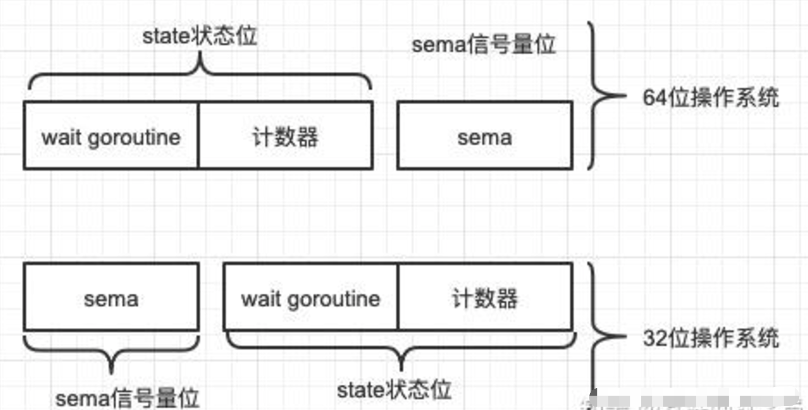
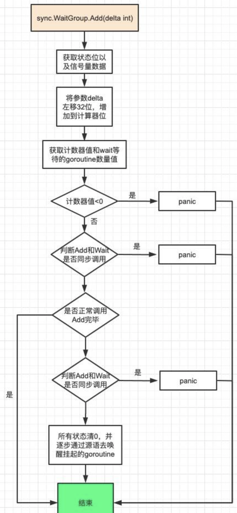
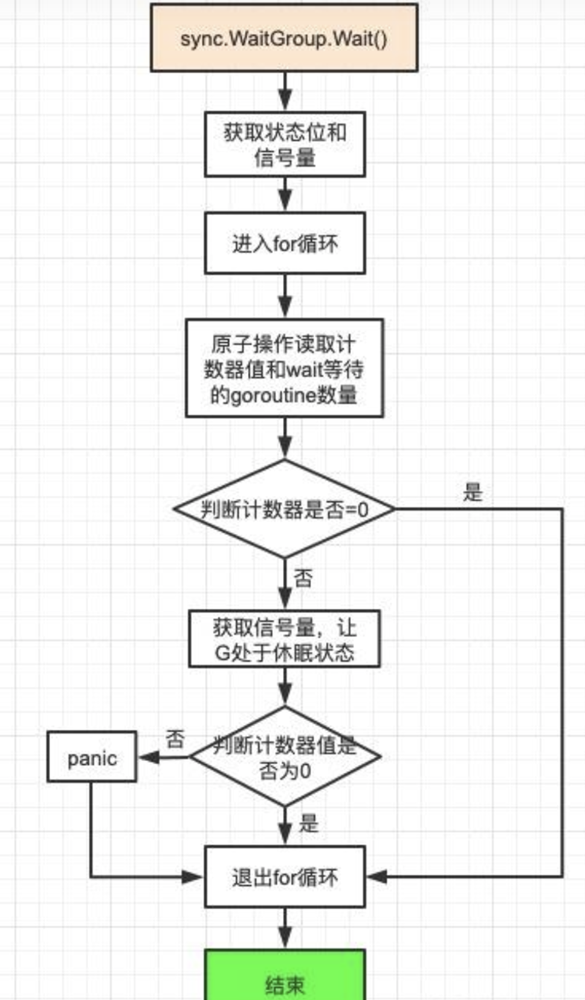

本文章来源于：<https://github.com/Zeb-D/my-review> ，请star 强力支持，你的支持，就是我的动力。

[TOC]

------

### 序

golang并发库本文最后一篇，这些实现大同小异，本文讲些我们常见的最后两个工具的解析，最后算是对golang源码的结束了，准备分享go的一些实际开发。


### sync.Once

> 官方文档对它的描述是：一个对象将完全执行一次，不得复制。
>
> 常常用来**单例对象**的初始化场景，或者并发访问只需要初始化一次的共享资源。
>
> sync.Once只暴露了一个方法Do，可以多次调用，但是只有第一次调用Do方法时f参数才会执行，这里的f是一个无参数无返回值的函数。


> 下面来看下官方给出来的demo

```go
package main

import (
	"fmt"
	"sync"
)

func main() {
	var once sync.Once
	onceBody := func() {
		fmt.Println("Only once")
	}
	done := make(chan bool)
	for i := 0; i < 10; i++ {
		go func() {
			once.Do(onceBody)
			done <- true
		}()
	}
	for i := 0; i < 10; i++ {
		<-done
	}
}
// 结果只打印一次：only once
```


#### 源码分析

> sync.Once的源代码还很少的，直接在代码里面作分析

```go
package sync
 
import (
     "sync/atomic"
 )
type Once struct {
     done uint32 // 初始值为0表示还未执行过，1表示已经执行过
     m    Mutex  // m为互斥锁
}
func (o *Once) Do(f func()) {
    // 判断done是否为0.若为0，表示未执行过，调用doSlow方法
    if atomic.LoadUint32(&o.done) == 0 {
        o.doSlow(f)
    }
}
func (o *Once) doSlow(f func()) {
    // 互斥锁加锁解锁
    o.m.Lock()
    defer o.m.Unlock()
    // 加锁判断done是否为0
    if o.done == 0 {
        // 执行完f()函数后，将done值设置为1
        defer atomic.StoreUint32(&o.done, 1)
        f()
    }
}
```

- 为什么在do方法的时候没有用到cas原子判断？

> 在do方法源码注释中的时候有这么一段话，说如果是使用atomic.CompareAndSwapUint32(&o.done, 0, 1）此方法不会保证实现f[函数调用]完成为什么会这么说，同时进行两次调用，cas的获胜者将调用[f函数]，失败者将立即返回，而无需等待第一个对f的调用完成。此时f函数还在执行过程中，你就已经回复了once.Do成功了。此时全局变量还没有创建出来，行为是无法定义的。


> 那么怎么解决呢？
>
> 有以下两个思路：1）[热路径]：用原子读done的值，保证[竞态条件]正确；2） 加锁：既然不能用cas[原子操作]，那就用加锁的方式来保证原子性，如果done==0，那么走慢路径，先加锁，然后在执行f函数，最后将done设置为1，并解锁。

- 千万不要把同一sync.Once用在嵌套结构中，这样非常容易形成死锁！

```go
func once() {
    once := &sync.Once{}
    once.Do(func() {
        once.Do(func() {
            fmt.Println("test nestedDo")
        })
    })
    //输出：fatal error: all goroutines are asleep - deadlock!
```


### sync.WaitGroup

> 官方文档对其的描述是：WaitGroup等待一组goroutine的任务完成。
>
> 主goroutine调用添加以设置要等待的goroutine的数量。
>
> 然后，每个goroutine都会运行并在完成后调用Done。
>
> 同时，可以使用Wait来阻塞，直到所有goroutine完成。
>
> 我们来看官网给的一个例子:

```go
package main
 
import (
    "sync"
)
 
type httpPkg struct{}
 
func (httpPkg) Get(url string) {}

var http httpPkg

func main() {
    var wg sync.WaitGroup
    var urls = []string{
        "http://www.golang.org/",
        "http://www.google.com/",
        "http://www.somestupidname.com/",
    }
    for _, url := range urls {
        // 增加waitGroup计数
        wg.Add(1)
        // 启动goroutine获取url
        go func(url string) {
            //等获取url的goroutine完成，将waitGroup计数减1
            defer wg.Done()
            // 获取url
            http.Get(url)
        }(url)
    }
    // 等待所有goroutine完成
    wg.Wait()
}
```

#### 源码分析

```
// A WaitGroup waits for a collection of goroutines to finish.
// The main goroutine calls Add to set the number of
// goroutines to wait for. Then each of the goroutines
// runs and calls Done when finished. At the same time,
// Wait can be used to block until all goroutines have finished.
//
// A WaitGroup must not be copied after first use.
type WaitGroup struct {
	noCopy noCopy

	// 64-bit value: high 32 bits are counter, low 32 bits are waiter count.
	// 64-bit atomic operations require 64-bit alignment, but 32-bit
	// compilers do not ensure it. So we allocate 12 bytes and then use
	// the aligned 8 bytes in them as state, and the other 4 as storage
	// for the sema.
	state1 [3]uint32
}
```


##### onCopy机制

> Go中没有原生的禁止拷贝的方式，所以如果有的结构体，你希望使用者无法拷贝，只能指针传递保证全局唯一的话，可以这么干，定义一个结构体叫noCopy，要实现sync.Locker 这个接口。

```go
type noCopy struct{}

// nocopy 只有在使用 go vet 检查时才能显示错误，编译正常
func (*noCopy) Lock() {}
func (*noCopy) UnLock() {}
```


##### state1字段处理

> 总共分配了12个字节，在这里被设计成三种状态。其中对齐的8个字节作为状态位(state)，高32位为记录计数器的数量，低32位为等待goroutine的数量值。其余的4个字节作为信号量存储(sema)。由于操作系统分为32位和64位，64位的原子操作需要64位对齐，但是32位编译器保证不了，于是这里就采用了动态识别当前我们操作的64位数到底是不是在8字节对齐的位置上面。具体见源码state方法

```go
 // 得到state1的状态位和信号量
 func (wg *WaitGroup) state() (statep *uint64, semap *uint32) {
     if uintptr(unsafe.Pointer(&wg.state1))%8 == 0 {
         // 如果地址是64bit对齐的，数组前两个元素做state，后一个元素做信号量
         return (*uint64)(unsafe.Pointer(&wg.state1)), &wg.state1[2]
     } else {
         // 如果地址是32bit对齐的，数组后两个元素用来做state，它可以用来做64bit的原子操作，第一个元素32bit用来做信号量
         return (*uint64)(unsafe.Pointer(&wg.state1[1])), &wg.state1[0]
     }
}
```




##### Add方法实现

> 主要操作的state1字段中计数值部分，计数器部分的逻辑主要是通过state()，在上面有提及。每次调用Add方法就会增加相应数量的计数器。如果计数器为零，则释放等待时阻塞的所有goroutine。如果计数器变为负数，请添加恐慌。如果计数器值大于0，说明此时还有任务没有完成，那么调用者就变成等待者，需要加入wait队列，并且阻塞自己。参数可正可负数。

```go
func (wg *WaitGroup) Add(delta int) {
    //获取state1中的状态位和信号量位
    statep, semap := wg.state()
    //用来goroutine的竞争检测，可忽略。
    if race.Enabled {
        _ = *statep 
        if delta < 0 {
            race.ReleaseMerge(unsafe.Pointer(wg))
        }
        race.Disable()
        defer race.Enable()
    }
    // uint64(delta)<<32 将delta左移32
    // 因为高32位表示计数器，所以delta左移32位，
    // 增加到计数位。
    state := atomic.AddUint64(statep, uint64(delta)<<32)
    // 当前计数器的值
    v := int32(state >> 32)
    // 阻塞的wait goroutine数量
    w := uint32(state)
    if race.Enabled && delta > 0 && v == int32(delta) {
        race.Read(unsafe.Pointer(semap))
    }
    // 计数器的值<0,panic
    if v < 0 {
        panic("sync: negative WaitGroup counter")
    }
    // 当wait goroutine数量不为0时，累加后的counter值和delta相等,
    // 说明Add()和Wait()同时调用了,所以发生panic,
    // 因为正确的做法是先Add()后Wait()，
    // 也就是已经调用了wait()就不允许再添加任务了
    if w != 0 && delta > 0 && v == int32(delta) {
        panic("sync: WaitGroup misuse: Add called concurrently with Wait")
    }
    // add调用结束
    if v > 0 || w == 0 {
        return
    }
    // 能走到这里说明当前Goroutine Counter计数器为0，
    // Waiter Counter计数器大于0, 
    // 到这里数据也就是允许发生变动了，如果发生变动了，则出发panic
    if *statep != state {
        panic("sync: WaitGroup misuse: Add called concurrently with Wait")
    }
    // 所有的状态位清0
    *statep = 0
    for ; w != 0; w-- {
        // 首先让信号量加一，然后检查是否有正在等待的Goroutine，如果没有，直接返回；
        // 如果有，调用goready函数唤醒一个Goroutine。
        runtime_Semrelease(semap, false, 0)
    }
}
```




##### Done方法实现

> 内部调用了Add(-1)的操作，具体看Add方法实现部分

```go
//Done方法其实就是Add（-1）
func (wg *WaitGroup) Done() {
    wg.Add(-1)
}
```


##### Wait方法实现

> 阻塞主goroutine直到WaitGroup计数器变为0。

```go
// 等待并阻塞，直到WaitGroup计数器为0
func (wg *WaitGroup) Wait() {
    // 获取waitgroup状态位和信号量
    statep, semap := wg.state() 
    if race.Enabled { 
        _ = *statep 
        race.Disable()
    }
    for {
        // 使用原子操作读取state，是为了保证Add中的写入操作已经完成
        state := atomic.LoadUint64(statep)
        v := int32(state >> 32) //获取计数器(高32位)
        w := uint32(state) //获取wait goroutine数量（低32位）
        if v == 0 { // 计数器为0，跳出死循环,不用阻塞
            if race.Enabled {
                race.Enable()
                race.Acquire(unsafe.Pointer(wg))
            }
            return
        }
        // 使用CAS操作对`waiter Counter`计数器进行+1操作，
        // 外面有for循环保证这里可以进行重试操作
        if atomic.CompareAndSwapUint64(statep, state, state+1) {
            if race.Enabled && w == 0 {
                race.Write(unsafe.Pointer(semap))
            }
            // 在这里获取信号量，使线程进入睡眠状态，
            // 与Add方法中runtime_Semrelease增加信号量相对应，
            // 也就是当最后一个任务调用Done方法
            // 后会调用Add方法对goroutine counter的值减到0，
            // 就会走到最后的增加信号量
            runtime_Semacquire(semap)
            // 在Add方法中增加信号量时已经将statep的值设为0了，
            // 如果这里不是0，说明在wait之后又调用了Add方法，
            // 使用时机不对，触发panic
            if *statep != 0 {
                panic("sync: WaitGroup is reused before previous Wait has returned")
            }
            if race.Enabled {
                race.Enable()
                race.Acquire(unsafe.Pointer(wg))
            }
            return
        }
    }
}
```

