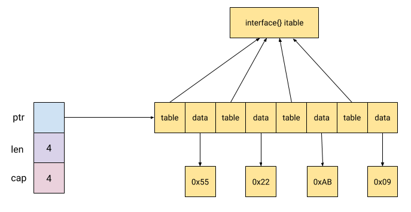

本文章来源于：<https://github.com/Zeb-D/my-review> ，请star 强力支持，你的支持，就是我的动力。

[TOC]

------

在 Go 中，如果 `interface{}` 作为函数参数的话，是可以传任意参数的，然后通过**类型断言**来转换。

举个例子：

```
package main

import "fmt"

func foo(v interface{}) {
    if v1, ok1 := v.(string); ok1 {
        fmt.Println(v1)
    } else if v2, ok2 := v.(int); ok2 {
        fmt.Println(v2)
    }
}

func main() {
    foo(233)
    foo("666")
}
```

不管是传 `int` 还是 `string`，最终都能输出正确结果。

那么，既然是这样的话，我就有一个疑问了，拿出我举一反三的能力。是否可以将 `[]T` 转换为 `[]interface` 呢？

比如下面这段代码：

```
func foo([]interface{}) { /* do something */ }

func main() {
    var a []string = []string{"hello", "world"}
    foo(a)
}
```

很遗憾，这段代码是不能编译通过的，如果想直接通过 `b := []interface{}(a)` 的方式来转换，还是会报错：

```
cannot use a (type []string) as type []interface {} in function argument
```

正确的转换方式需要这样写：

```
b := make([]interface{}, len(a), len(a))
for i := range a {
    b[i] = a[i]
}
```

本来一行代码就能搞定的事情，却非要让人写四行，是不是感觉很麻烦？那为什么 Go 不支持呢？我们接着往下看。


## 官方解释

这个问题在官方 Wiki 中是有回答的，我复制出来放在下面：

> The first is that a variable with type `[]interface{}` is not an interface! It is a slice whose element type happens to be interface{}. But even given this, one might say that the meaning is clear. Well, is it? A variable with type `[]interface{}` has a specific memory layout, known at compile time. Each interface{} takes up two words (one word for the type of what is contained, the other word for either the contained data or a pointer to it). As a consequence, a slice with length N and with type `[]interface{}` is backed by a chunk of data that is N*2 words long. This is different than the chunk of data backing a slice with type `[]MyType` and the same length. Its chunk of data will be `N*sizeof(MyType)` words long. The result is that you cannot quickly assign something of type `[]MyType` to something of type `[]interface{}`; the data behind them just look different.
>
> -----对应中文翻译
>
> 首先，一个类型为[]interface{}的变量不是一个接口！它是一个切片，其元素类型恰好是interface{}。它是一个片断，其元素类型恰好是interface{}。但即使如此，人们还是会说，这个意思很清楚。那么，是这样吗？
>
> 一个类型为[]interface{}的变量有一个特定的内存布局，在编译时就已经知道。每个interface{}占用两个字（一个字表示所包含的类型，另一个字表示所包含的数据或指向它的指针）。
>
> 因此，一个长度为N、类型为[]interface{}的片子是由N2个字的数据块支持的。这与支持类型为[]MyType且长度相同的片断的数据块不同。
>
> 它的数据块将是`Nsizeof(MyType)字长。其结果是，你无法快速地将类型[]MyTyp的东西分配给类型[]interface{}`的东西；它们背后的数据只是看起来不同。

大概意思就是说，主要有两方面原因：

1. `[]interface{}` 类型并不是 `interface`，它是一个切片，只不过碰巧它的元素是 `interface`；
2. `[]interface{}` 是有特殊内存布局的，跟 `interface` 不一样。

下面就来详细说说，是怎么个不一样。


## 内存布局

首先来看看 slice 在内存中是如何存储的。在源码中，它是这样定义的：

```
// src/runtime/slice.go

type slice struct {
    array unsafe.Pointer
    len   int
    cap   int
}
```

- `array` 是指向底层数组的指针；
- `len` 是切片的长度；
- `cap` 是切片的容量，也就是 `array` 数组的大小。

举个例子，创建如下一个切片：

```
is := []int64{0x55, 0x22, 0xab, 0x9}
len :=4
cap :=4
```


假设程序运行在 64 位的机器上，那么每个「字节」所占空间是 8 bytes。

上面的 `ptr` 所指向的底层数组占用空间就是 4 个「字节」，也就是 32 bytes。

接下来再看看 `[]interface{}` 在内存中是什么样的。

回答这个问题之前先看一下 `interface{}` 的结构，Go 中的接口类型分成两类：

1. `iface` 表示包含方法的接口；
2. `eface` 表示不包含方法的空接口。

源码中的定义分别如下：

```
type iface struct {
    tab  *itab
    data unsafe.Pointer
}
type eface struct {
    _type *_type
    data  unsafe.Pointer
}
```

具体细节我们不去深究，但可以明确的是，每个 `interface{}` 包含两个指针， 会占据两个「字节」。第一个指针指向 `itab` 或者 `_type`；第二个指针指向实际的数据。

所以它在内存中的布局如下图所示：



因此，不能直接将 `[]int64` 直接传给 `[]interface{}`。


## 程序运行中的内存布局

接下来换一个更形象的方式，从程序实际运行过程中，看看内存的分布是怎么样的？

看下面这样一段代码：

```
package main

var sum int64

func addUpDirect(s []int64) {
 for i := 0; i < len(s); i++ {
  sum += s[i]
 }
}

func addUpViaInterface(s []interface{}) {
 for i := 0; i < len(s); i++ {
  sum += s[i].(int64)
 }
}

func main() {
 is := []int64{0x55, 0x22, 0xab, 0x9}

 addUpDirect(is)

 iis := make([]interface{}, len(is))
 for i := 0; i < len(is); i++ {
  iis[i] = is[i]
 }

 addUpViaInterface(iis)
}
```

我们使用 **Delve** 来进行调试，可以点击这里进行安装。

```
dlv debug slice-layout.go
Type 'help' for list of commands.
(dlv) break slice-layout.go:27
Breakpoint 1 set at 0x105a3fe for main.main() ./slice-layout.go:27
(dlv) c
> main.main() ./slice-layout.go:27 (hits goroutine(1):1 total:1) (PC: 0x105a3fe)
    22:  iis := make([]interface{}, len(is))
    23:  for i := 0; i < len(is); i++ {
    24:   iis[i] = is[i]
    25:  }
    26:
=>  27:  addUpViaInterface(iis)
    28: }
```

打印 `is` 的地址：

```
(dlv) p &is
(*[]int64)(0xc00003a740)
```

接下来看看 slice 在内存中都包含了哪些内容：

```
(dlv) x -fmt hex -len 32 0xc00003a740
0xc00003a740:   0x10   0xa7   0x03   0x00   0xc0   0x00   0x00   0x00
0xc00003a748:   0x04   0x00   0x00   0x00   0x00   0x00   0x00   0x00
0xc00003a750:   0x04   0x00   0x00   0x00   0x00   0x00   0x00   0x00
0xc00003a758:   0x00   0x00   0x09   0x00   0xc0   0x00   0x00   0x00
```

每行有 8 个字节，也就是上文说的一个「字节」。

第一行是指向数据的地址；

第二行是 4，表示切片长度；

第三行也是 4，表示切片容量。

再来看看指向的数据到底是怎么存的：

```
(dlv) x -fmt hex -len 32 0xc00003a710
0xc00003a710:   0x55   0x00   0x00   0x00   0x00   0x00   0x00   0x00
0xc00003a718:   0x22   0x00   0x00   0x00   0x00   0x00   0x00   0x00
0xc00003a720:   0xab   0x00   0x00   0x00   0x00   0x00   0x00   0x00
0xc00003a728:   0x09   0x00   0x00   0x00   0x00   0x00   0x00   0x00
```

这就是一片连续的存储空间，保存着实际数据。


接下来用同样的方式，再来看看 `iis` 的内存布局。

```
(dlv) p &iis
(*[]interface {})(0xc00003a758)
(dlv) x -fmt hex -len 32 0xc00003a758
0xc00003a758:   0x00   0x00   0x09   0x00   0xc0   0x00   0x00   0x00
0xc00003a760:   0x04   0x00   0x00   0x00   0x00   0x00   0x00   0x00
0xc00003a768:   0x04   0x00   0x00   0x00   0x00   0x00   0x00   0x00
0xc00003a770:   0xd0   0xa7   0x03   0x00   0xc0   0x00   0x00   0x00
```

切片的布局和 `is` 是一样的，主要的不同是所指向的数据：

```
(dlv) x -fmt hex -len 64 0xc000090000
0xc000090000:   0x00   0xe4   0x05   0x01   0x00   0x00   0x00   0x00
0xc000090008:   0xa8   0xee   0x0a   0x01   0x00   0x00   0x00   0x00
0xc000090010:   0x00   0xe4   0x05   0x01   0x00   0x00   0x00   0x00
0xc000090018:   0x10   0xed   0x0a   0x01   0x00   0x00   0x00   0x00
0xc000090020:   0x00   0xe4   0x05   0x01   0x00   0x00   0x00   0x00
0xc000090028:   0x58   0xf1   0x0a   0x01   0x00   0x00   0x00   0x00
0xc000090030:   0x00   0xe4   0x05   0x01   0x00   0x00   0x00   0x00
0xc000090038:   0x48   0xec   0x0a   0x01   0x00   0x00   0x00   0x00
```

仔细观察上面的数据，偶数行内容都是相同的，这个是 `interface{}` 的 `itab` 地址。奇数行内容是不同的，指向实际的数据。

打印地址内容：

```
(dlv) x -fmt hex -len 8 0x010aeea8
0x10aeea8:   0x55   0x00   0x00   0x00   0x00   0x00   0x00   0x00
(dlv) x -fmt hex -len 8 0x010aed10
0x10aed10:   0x22   0x00   0x00   0x00   0x00   0x00   0x00   0x00
(dlv) x -fmt hex -len 8 0x010af158
0x10af158:   0xab   0x00   0x00   0x00   0x00   0x00   0x00   0x00
(dlv) x -fmt hex -len 8 0x010aec48
0x10aec48:   0x09   0x00   0x00   0x00   0x00   0x00   0x00   0x00
```

很明显，通过打印程序运行中的状态，和我们的理论分析是一致的。


## 通用方法

通过以上分析，我们知道了不能转换的原因，那有没有一个通用方法呢？

因为我实在是不想每次多写那几行代码。

也是有的，用反射 `reflect`，但是缺点也很明显，效率会差一些，不建议使用。

```
func InterfaceSlice(slice interface{}) []interface{} {
 s := reflect.ValueOf(slice)
 if s.Kind() != reflect.Slice {
  panic("InterfaceSlice() given a non-slice type")
 }

 // Keep the distinction between nil and empty slice input
 if s.IsNil() {
  return nil
 }

 ret := make([]interface{}, s.Len())

 for i := 0; i < s.Len(); i++ {
  ret[i] = s.Index(i).Interface()
 }

 return ret
}
```

还有其他方式吗？答案就是 Go 1.18 支持的**泛型**.


## 参考文章

- https://mp.weixin.qq.com/s/jsdGV31yT5AR07BzRovWVw
- https://stackoverflow.com/questions/12753805/type-converting-slices-of-interfaces
- https://github.com/golang/go/wiki/InterfaceSlice
- https://eli.thegreenplace.net/2021/go-internals-invariance-and-memory-layout-of-slices/