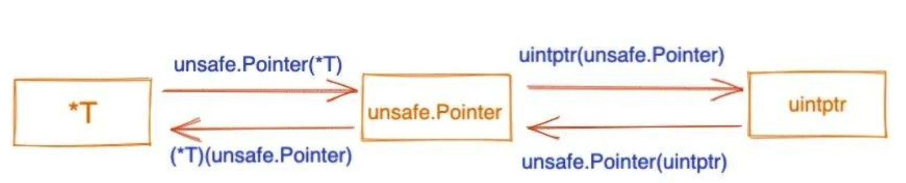

本文章来源于：<https://github.com/Zeb-D/my-review> ，请star 强力支持，你的支持，就是我的动力。

[TOC]

------

### 背景

如果看了不少go底层代码如`reflect`，或者一些github上大佬写的开源项目，会发现有不少`地方使用了 unsafe.Pointer 和 uintptr`；

单从类型名称看，这些与“指针”是不是有什么关系？或者它们之间又有什么区别？


先附上一张关系图，后面我们再展开解析。




### 普通指针类型

我们一般将 *T 看作指针类型，表示一个指向 T 类型变量的指针。我们都知道 Go 是强类型语言，声明变量之后，变量的类型是不可以改变的，不同类型的指针也不允许相互转化。例如下面这样：

```
func main(){
 i := 30
 iPtr1 := &i

 var iPtr2 *int64 = (*int64)(iPtr1)

 fmt.Println(iPtr2)
}
```

编译报错：cannot convert iPtr1 (type *int) to type *int64，提示不能进行强制转化。

那怎么办，如何实现相互转化？

还好 Go 官方提供了 unsafe 包，有相关的解决方案。


### unsafe.Pointer

unsafe.Pointer **通用指针类型**，一种特殊类型的指针，可以包含任意类型的地址，能实现不同的指针类型之间进行转换，类似于 C 语言里的 void* 指针。

```
type ArbitraryType int

type Pointer *ArbitraryType
```

从定义可以看出，Pointer 实际上是 *int。

官方文档里还描述了 Pointer 的四种操作规则：

1. 任何类型的指针都可以转化成 unsafe.Pointer；
2. unsafe.Pointer 可以转化成任何类型的指针；
3. uintptr 可以转换为 unsafe.Pointer；
4. unsafeP.ointer 可以转换为 uintptr；

不同类型的指针允许相互转化实际上是运用了第 1、2 条规则，我们就着例子看下：

```
func main(){
 i := 30
 iPtr1 := &i

 var iPtr2 *int64 = (*int64)(unsafe.Pointer(iPtr1))

 *iPtr2 = 8

 fmt.Println(i)
}
```

输出：

```
8
```

上面的代码，我们可以把 *int 转为 *int64，并且对新的 *int64 进行操作，从输出会发现 i 的值被改变了。

可以说 unsafe.Pointer 是桥梁，可以让任意类型的指针实现相互转换。

我们知道 Go 语言是不支持指针运算，想要实现该怎么办？

看看第 3、4 条规则，uintptr 就可以派上用场了。

### uintptr

源码定义：

```
// uintptr is an integer type that is large enough to hold the bit pattern of
// any pointer.
type uintptr uintptr
```

uintptr 是 Go 内置类型，表示无符号整数，可存储一个完整的地址。常用于指针运算，只需将 unsafe.Pointer 类型转换成 uintptr 类型，做完加减法后，转换成 unsafe.Pointer，通过 * 操作，取值或者修改值都可以。

下面是一个通过指针偏移修改结构体成员的例子，演示下 uintptr 的用法：

```
type Admin struct {
 Name string
 Age int
}

func main(){
 admin := Admin{
  Name: "seekload",
  Age: 18,
 }
 ptr := &admin
 name := (*string)(unsafe.Pointer(ptr))   // 1

 *name = "Yd"

 fmt.Println(*ptr)

 age := (*int)(unsafe.Pointer(uintptr(unsafe.Pointer(ptr)) + unsafe.Offsetof(ptr.Age)))  // 2
 *age = 35

 fmt.Println(*ptr)
}
```

输出：

```
{Yd 18}
{Yd 35}
```

特别提下，**unsafe.Offsetof** 的作用是返回成员变量 x 在结构体当中的偏移量，即返回结构体初始内存地址到 x 之间的字节数。

​	1 因为**结构体初始地址就是第一个成员的地址**，又 Name 是结构体第一个成员变量，所以此处不用偏移，我们拿到 admin 的地址，然后通过 unsafe.Pointer 转为 *string，再进行赋值操作即可。

​	2 成员变量 Age 不是第一个字段，想要修改它的值就需要内存偏移。我们先将 admin 的指针转化为 uintptr，再通过 unsafe.Offsetof() 获取到 Age 的偏移量，两者都是 uintptr，进行相加指针运算获取到成员 Age 的地址，最后需要将 uintptr 转化为 unsafe.Pointer，再转化为 *int，才能对 Age 操作。


### 区别

Go 有两样东西或多或少是无类型指针的表示：uintptr 和 unsafe.Pointer （和外表相反，它们是内置类型）。

从表面上看这有点奇怪，因为 unsafe.Pointer 和 uintptr 可以彼此来回转换。为什么不只有一种指针表现形式？两者之间有什么区别？

表面的区别是可以对 uintptr 进行算数运算，但不能对 unsafe.Pointer（或任何其他 Go 指针）进行运算。

unsafe 包的文档指出了重要的区别：

> uintptr 是整数，不是引用。
>
> 将 Pointer 转换为 uintptr 会创建一个没有指针语义的整数值。
>
> 即使 uintptr 持有某个对象的地址，如果对象移动，垃圾收集器并不会更新 uintptr 的值，uintptr 也无法阻止该对象被回收。

尽管 unsafe.Pointer 是通用指针，但 Go 垃圾收集器知道它们指向 Go 对象；

换句话说，它们是真正的 Go 指针。通过内部魔法，垃圾收集器可以并且将使用它们来防止活动对象被回收并发现更多活动对象（如果 unsafe.Pointer 指向的对象自身持有指针）。

因此，对 unsafe.Pointer 的合法操作上的许多限制归结为“在任何时候，它们都必须指向真正的 Go 对象”。

如果创建的 unsafe.Pointer 并不符合，即使很短的时间，Go 垃圾收集器也可能会在该时刻扫描，然后由于发现了无效的 Go 指针而崩溃。

相比之下，uintptr 只是一个数字。这种特殊的垃圾收集魔法机制并不适用于 uintptr 所“引用”的对象，因为它仅仅是一个数字，一个 uintptr 不会引用任何东西。

反过来，这导致在将 unsafe.Pointer 转换为 uintptr，对其进行操作然后再将其转回的各种方式上存在许多微妙的限制。

基本要求是以这种方式进行操作，使编译器和运行时可以屏蔽不安全的指针的临时非指针性，使其免受垃圾收集器的干扰，因此这种临时转换对于垃圾收集将是原子的。

> PS：从 Go 1.8 开始，即使当时没有运行垃圾回收，所有 Go 指针必须始终有效（我相信也包括 unsafe.Pointer）。
>
> 如果您在变量或字段中存储了无效的指针，则仅通过将字段更新为包括 nil 在内的完全有效的值即可使代码崩溃。


### 总结

这篇文章我们简单介绍了普通指针类型、unsafe.Pointer 和 uintptr 之间的关系（见文章开头关系图），记住两点：

1. unsafe.Pointer 可以实现不同类型指针之间相互转化；
2. uintptr 搭配着 unsafe.Pointer 使用，实现指针运算；

不过，官方不推荐使用 unsafe 包，正如它的命名一样，是不安全的，比如涉及到内存操作，这是绕过 Go 本身设计的安全机制的，不当的操作，可能会破坏一块内存，而且这种问题非常不好定位。


参考资料：

https://mp.weixin.qq.com/s/NG0k9KpBry9bC_m30tmu1A

