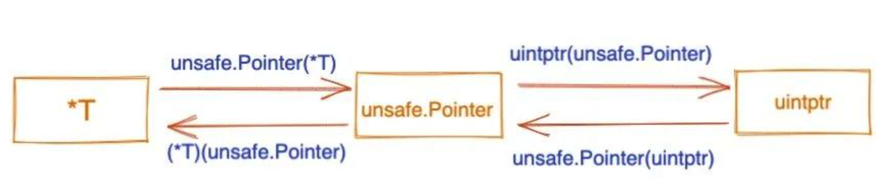

本文章来源于：<https://github.com/Zeb-D/my-review> ，请star 强力支持，你的支持，就是我的动力。

[TOC]

------

### 序

可能有人会问，既然有reflect神器，为什么还要这种unsafe门户大开的不安全行为呢？

在[golang reflect神器——这篇不枯燥 很好理解](https://mp.weixin.qq.com/s?__biz=Mzg5NDc0Mzc4MQ==&mid=2247483989&idx=1&sn=4450b39756900eee2eacc2edcce136c4&chksm=c01ba7dff76c2ec90c3f057d6fe97dec3f86d691ed483a865cc1e09973ea7a7d30c998d36242&token=511696912&lang=zh_CN#rd) 有个列子，只能对那些大写的属性/方法才能进行反射使用，如果要更深次做点其它的，那么本文聊的这些可以涉及到这些。

在这篇文章最后也讲到了 `reflect.TypeOf + uintptr+unsafe.Pointer` 可以做比较多的组合动作，但没讲这几者联系。

unsafe在一些深度层次的内存优化方面是个神器，比如内存对齐(减少内存)与高性能是有一定的关系。

注：unsafe并不是golang单独有的功能，java与rust都该功能（大道统一）。


### 背景

如果看了不少go底层代码如`reflect`，或者一些github上大佬写的开源项目，会发现有不少`地方使用了 unsafe.Pointer 和 uintptr`；

单从类型名称看，这些与“指针”是不是有什么关系？或者它们之间又有什么区别？


先附上一张关系图，后面我们再展开解析。




### 概念

#### 普通指针(*T)

> 普通指针类型，用于传递对象地址，不能进行指针运算； 可以用 &(取地址) *(根据地址取值)。
>
> 我们一般将 *T 看作指针类型，表示一个指向 T 类型变量的指针。


我们都知道 Go 是强类型语言，声明变量之后，变量的类型是不可以改变的，不同类型的指针也不允许相互转化。

简单示例如下：

```
func main(){
 i := 30
 iPtr1 := &i

 var iPtr2 *int64 = (*int64)(iPtr1)

 fmt.Println(iPtr2)
}
```

> 编译报错：cannot convert iPtr1 (type *int) to type *int64，提示不能进行强制转化。
>


那怎么办，如何实现相互转化？

> 还好 Go 官方提供了 unsafe 包，有相关的解决方案。
>


#### unsafe.Pointer

> unsafe.Pointer可以指向任意类型的指针。
> 不能进行指针运算，不能读取内存存储的值(想读取的话需要转成相对应类型的指针)。
> 它是桥梁，让任意类型的指针实现相互转换, 也可以转换成uintptr 进行指针运算。

unsafe.Pointer 通用指针类型，一种特殊类型的指针，可以包含任意类型的地址，能实现不同的指针类型之间进行转换，类似于 C 语言里的 void* 指针。


unsafe.Pointer 在源码文档是这么说的：

```go
type Pointer *ArbitraryType

Pointer represents a pointer to an arbitrary type. There are four special operations
available for type Pointer that are not available for other types:    //  Pointer代表了一个任意类型的指针。Pointer类型有四种特殊的操作是其他类型不能使用的:
   - A pointer value of any type can be converted to a Pointer.       //  任意类型的指针可以被转换为Pointer
   - A Pointer can be converted to a pointer value of any type.       //  Pointer可以被转换为任务类型的值的指针
   - A uintptr can be converted to a Pointer.                         //  uintptr可以被转换为Pointer
   - A Pointer can be converted to a uintptr.                         //  Pointer可以被转换为uintptr
Pointer therefore allows a program to defeat the type system and read and write
arbitrary memory. It should be used with extreme care.                //  因此Pointer允许程序不按类型系统的要求来读写任意的内存，应该非常小心地使用它。
```

从定义可以看出，Pointer 实际上是 *int。


官方文档里还描述了 Pointer 的四种操作规则：

> 1. 任何类型的指针都可以转化成 unsafe.Pointer；
> 2. unsafe.Pointer 可以转化成任何类型的指针；
> 3. uintptr 可以转换为 unsafe.Pointer；
> 4. unsafeP.ointer 可以转换为 uintptr；
>


不同类型的指针允许相互转化实际上是运用了第 1、2 条规则，我们就着例子看下：

```
func main(){
 i := 30
 iPtr1 := &i

 var iPtr2 *int64 = (*int64)(unsafe.Pointer(iPtr1))

 *iPtr2 = 8

 fmt.Println(i) //输出 8
}
```


上面的代码，我们可以把 *int 转为 *int64，并且对新的 *int64 进行操作，从输出会发现 i 的值被改变了。

可以说 unsafe.Pointer 是桥梁，可以让任意类型的指针实现相互转换。

我们知道 Go 语言是不支持指针运算，想要实现该怎么办？

看看第 3、4 条规则，uintptr 就可以派上用场了。


#### uintptr

> uintptr是一个无符号的整型，它可以保存一个指针地址。
>
> 它可以进行指针运算。
>
> uintptr无法持有对象, GC不把uintptr当指针, 所以uintptr类型的目标会被回收。
>
> 想取值需要转成unsafe.Pointer后, 需再转到相对应的指针类型。


源码定义：

```go
package builtin

//uintptr is an integer type that is large enough to hold the bit pattern of any pointer.
//uintptr是一个能足够容纳指针位数大小的整数类型
type uintptr uintptr
```


下面是一个通过指针偏移修改结构体成员的例子，演示下 uintptr 的用法：

```
type Admin struct {
 Name string
 Age int
}

func main(){
 admin := Admin{
  Name: "seekload",
  Age: 18,
 }
 ptr := &admin
 name := (*string)(unsafe.Pointer(ptr))   // 1

 *name = "Yd"

 fmt.Println(*ptr) // {Yd 18}

 age := (*int)(unsafe.Pointer(uintptr(unsafe.Pointer(ptr)) + unsafe.Offsetof(ptr.Age)))  // 2
 *age = 35

 fmt.Println(*ptr) // {Yd 35}
}
```


特别提下，`unsafe.Offsetof `的作用是返回成员变量 x 在结构体当中的偏移量，即返回结构体初始内存地址到 x 之间的字节数。

> ​	1、因为结构体初始地址就是第一个成员的地址，又 Name 是结构体第一个成员变量，所以此处不用偏移，我们拿到 admin 的地址，然后通过 `unsafe.Pointer` 转为 *string，再进行赋值操作即可。
>
> ​	2、成员变量 Age 不是第一个字段，想要修改它的值就需要内存偏移。我们先将 admin 的指针转化为 uintptr，再通过 `unsafe.Offsetof() `获取到 Age 的偏移量，两者都是 uintptr，进行相加指针运算获取到成员 Age 的地址，最后需要将 uintptr 转化为 `unsafe.Pointer`，再转化为 *int，才能对 Age 操作。
>


#### 区别

Go 有两样东西或多或少是无类型指针的表示：uintptr 和 unsafe.Pointer （和外表相反，它们是内置类型）。

从表面上看这有点奇怪，因为 unsafe.Pointer 和 uintptr 可以彼此来回转换。为什么不只有一种指针表现形式？两者之间有什么区别？


uintptr和unsafe.Pointer的区别在哪里？

> - unsafe.Pointer只是单纯的通用指针类型，用于转换不同类型指针，它不可以参与指针运算；
> - 而uintptr是用于指针运算的，GC 不把 uintptr 当指针，也就是说 uintptr 无法持有对象， uintptr 类型的目标会被回收；
> - unsafe.Pointer 可以和 普通指针 进行相互转换；
> - unsafe.Pointer 可以和 uintptr 进行相互转换。


unsafe 包的文档指出了重要的区别：

> uintptr 是整数，不是引用。
>
> 将 Pointer 转换为 uintptr 会创建一个没有指针语义的整数值。
>
> 即使 uintptr 持有某个对象的地址，如果对象移动，垃圾收集器并不会更新 uintptr 的值，uintptr 也无法阻止该对象被回收。


接下来让我们慢慢地重点理解GC这块领域知识：

尽管 unsafe.Pointer 是通用指针，但 Go 垃圾收集器知道它们指向 Go 对象；

> 换句话说，它们是真正的 Go 指针。通过内部魔法，垃圾收集器可以并且将使用它们来防止活动对象被回收并发现更多活动对象（如果 unsafe.Pointer 指向的对象自身持有指针）。
>

因此，对 unsafe.Pointer 的合法操作上的许多限制归结为“在任何时候，它们都必须指向真正的 Go 对象”。

如果创建的 unsafe.Pointer 并不符合，即使很短的时间，Go 垃圾收集器也可能会在该时刻扫描，然后由于发现了无效的 Go 指针而崩溃。

相比之下，uintptr 只是一个数字。这种特殊的垃圾收集魔法机制并不适用于 uintptr 所“引用”的对象，因为它仅仅是一个数字，一个 uintptr 不会引用任何东西。

反过来，这导致在将 unsafe.Pointer 转换为 uintptr，对其进行操作然后再将其转回的各种方式上存在许多微妙的限制。

基本要求是以这种方式进行操作，使编译器和运行时可以屏蔽不安全的指针的临时非指针性，使其免受垃圾收集器的干扰，因此这种临时转换对于垃圾收集将是原子的。

> PS：从 Go 1.8 开始，即使当时没有运行垃圾回收，所有 Go 指针必须始终有效（我相信也包括 unsafe.Pointer）。
>
> 如果您在变量或字段中存储了无效的指针，则仅通过将字段更新为包括 nil 在内的完全有效的值即可使代码崩溃。


#### 小结

这篇文章我们简单介绍了普通指针类型、unsafe.Pointer 和 uintptr 之间的关系（见文章开头关系图），记住两点：

1. unsafe.Pointer 可以实现不同类型指针之间相互转化；
2. uintptr 搭配着 unsafe.Pointer 使用，实现指针运算；

不过，官方不推荐使用 unsafe 包，正如它的命名一样，是不安全的，比如涉及到内存操作，这是绕过 Go 本身设计的安全机制的，不当的操作，可能会破坏一块内存，而且这种问题非常不好定位。


### 常见面试

#### 字符串地址占用了几个字节？

如果我们数一下大约有 40位二进制，那么是 5个字节？
正确答案是8个字节，我们可以转为unsafe.Pointer然后使用size方法打印出来

```go
func TestPtr(t *testing.T) {
    s := "hello ptr"
    fmt.Printf("s的地址为%p ,地址的10进制表示为%d 值为%s \n", &s, &s, s)
    fmt.Printf("s地址的2进制表示为%b \n", &s)

    var p unsafe.Pointer
    p = unsafe.Pointer(&s)
    fmt.Printf("p地址的2进制表示为%b \n", p)
    size := unsafe.Sizeof(p)
    fmt.Printf("p地址的大小为几个字节 %d \n", size)
}
输出为：
s的地址为0xc00008e4d0 ,地址的10进制表示为824634303696 值为hello ptr 
s地址的2进制表示为1100000000000000000010001110010011010000 
p地址的2进制表示为1100000000000000000010001110010011010000 
p地址的大小为几个字节 8 
```


#### 如何对小写属性进行修改值

其实在上面的代码`uintptr` 也讲了，但只不过用的大写属性，但这次换个结构体来验证该功能。

```css
f := unsafe.Pointer(uintptr(unsafe.Pointer(&s)) + unsafe.Offsetof(s.f))
// 等价于 f := unsafe.Pointer(&s.f)
```

指针的运算思想是：第一个的地址+偏移量(unsafe.Offsetof) 得到偏移后的地址。

```reasonml
func TestPointer2(t *testing.T) {
    var abc struct {
        a bool
        b int32
        c []int
    }
    //1 结构体abc的地址为
    fmt.Println(unsafe.Pointer(&abc))
    //2 结构体abc.a 的地址为
    fmt.Println(unsafe.Pointer(&abc.a))
    //3 指针运算得出 abc.a的地址为
    fmt.Println(unsafe.Pointer(uintptr(unsafe.Pointer(&abc)) + unsafe.Offsetof(abc.a)))
}
输出为：
=== RUN   TestPointer2
0xc00008e060
0xc00008e060
0xc00008e060
0xc00008e064
0xc00008e064
--- PASS: TestPointer2 (0.00s)
```

1. 我们可以得出结构体的地址为，第一个元素的地址
2. 结构体的指针运算 没问题


#### 取出unsafe内存外的数据会怎么样？

我们以数组为例子：取出index为10，公共才有4，超出了数组的范围

```stylus
func TestPointer4(t *testing.T) {
    var i [4]uint32 = [4]uint32{}
    //5 通过指针运算 最后一个 数组i[3] 的地址为
    fmt.Println(unsafe.Pointer(uintptr(unsafe.Pointer(&i)) + 3*unsafe.Sizeof(i[0])))
    //6 超出的数组元素的范围会发生什么？--得到一个数组外其他内容的地址
    fmt.Println(unsafe.Pointer(uintptr(unsafe.Pointer(&i)) + 10*unsafe.Sizeof(i[0])))
}
输出：
=== RUN   TestPointer4
0xc00011e1cc
0xc00011e1e8
--- PASS: TestPointer4 (0.00s)
```

当我们试图打印超出的地址的内容时候，会报错！需要注意


### unsafe源码介绍

#### unsafe包常用方法

```go
type ArbitraryType int
type Pointer *ArbitraryType
func Alignof(x ArbitraryType) uintptr
func Offsetof(x ArbitraryType) uintptr
func Sizeof(x ArbitraryType) uintptr
```

1. Alignof返回变量对齐字节数量
2. Offsetof返回变量指定属性的偏移量，所以如果变量是一个struct类型，不能直接将这个struct类型的变量当作参数，只能将这个struct类型变量的属性当作参数。
3. Sizeof 返回变量在内存中占用的字节数，切记，如果是slice，则不会返回这个slice在内存中的实际占用长度。

关于返回值 uintptr类型 在go源代码里

```go
type uintptr uintptr
```

uintptr 是一个整数类型，它足够大，可以存储. 只有将Pointer转换成uintptr才能进行指针的相关操作。

uintptr是可以用于指针运算的，但是GC并不把uintptr当做指针，所以uintptr不能持有对象, 可能会被GC回收, 导致出现无法预知的错误. Pointer指向一个对象时, GC是不会回收这个内存的。


#### ArbitraryType 任意类型

ArbitraryType 表示任意类型，如同interface{}，因为用来存储指针地址的，所以相当于存储任意类型。

```ada
type ArbitraryType int
```


#### Pointer 指针类型

unsafe中，ArbitraryType任意类型的的指针类型就是Pointer类型。

可以将其他类型都转换过来，然后通过这三个函数，分别能取长度，偏移量，对齐字节数，就可以在内存地址映射中，来回游走。

我们可以用强制类型转化type(a)语法把任意一个指针类型转成`unsafe.Pointer(a)`
语法如下：

```reasonml
func TestPointer(t *testing.T) {
    //把一个int类型强制转成 unsafe.Pointer 任意type指针类型
    var i int = 10
    fmt.Println(unsafe.Pointer(&i)) //0xc0000a61a8

    //把一个string类型强制转成 unsafe.Pointer 任意type指针类型
    var s string = "hello"
    fmt.Println(unsafe.Pointer(&s)) //0xc00008e4f0

    //把一个array类型强制转成 unsafe.Pointer 任意type指针类型
    var a [5]int = [5]int{0, 1, 2, 3, 4}
    fmt.Println(unsafe.Pointer(&a)) //0xc0000b0030

    //把一个map类型强制转成 unsafe.Pointer 任意type指针类型
    var m map[string]int8 = map[string]int8{"a": 1, "b": 10, "c": 20, "d": 30}
    fmt.Println(unsafe.Pointer(&m)) //0xc0000a0028

    //把一个slice类型强制转成 unsafe.Pointer 任意type指针类型
    var sli []int8 = []int8{0, 1, 3, 4, 5, 6}
    fmt.Println(unsafe.Pointer(&sli)) //0xc0000b40a0

    //把一个struct类型强制转成 unsafe.Pointer 任意type指针类型
    type st struct {
        w int8
        h int8
    }
    var st1 = st{
        w: 40,
        h: 50,
    }
    fmt.Println(unsafe.Pointer(&st1)) //0xc0000a61b6
}
```


#### Sizeof 占用的内存大小

##### int等数字类型占用的内存大小

```reasonml
func TestSizeofInt(t *testing.T) {
    //int8,int16,int32,int64,int类型占用的内存地址
    var i8 int8 = 10
    var i16 int16 = 10
    var i32 int32 = 10
    var i64 int64 = 10
    var i int = 10
    fmt.Println(unsafe.Sizeof(i8), unsafe.Sizeof(i16), unsafe.Sizeof(i32), unsafe.Sizeof(i64), unsafe.Sizeof(i))
    //输出为 1 2 4 8 8

    //uint8,uint16,uint32,uint64,uint类型占用的内存地址
    var u8 uint8 = 10
    var u16 uint16 = 10
    var u32 uint32 = 10
    var u64 uint64 = 10
    var u uint = 10
    fmt.Println(unsafe.Sizeof(u8), unsafe.Sizeof(u16), unsafe.Sizeof(u32), unsafe.Sizeof(u64), unsafe.Sizeof(u))
    //输出为 1 2 4 8 8
}
```

| 类型type      | 占用内存大小bit | 占用内存大小byte字节 |
| ------------- | --------------- | -------------------- |
| int8、uint8   | 8               | 1                    |
| int16、uint16 | 16              | 2                    |
| int32、uint32 | 32              | 4                    |
| int64、uint64 | 64              | 8                    |
| int、uint     | 64              | 8                    |

注意：int，uint是根据cpu来的，我这里是64位的cpu，所以这里占用了64bit内存，也有32位，16位的。


##### string类型占用的内存大小

```stylus
func TestSizeofString(t *testing.T) {
    //string类型占用的内存地址
    var s string = "a"
    fmt.Println(unsafe.Sizeof(s)) //16

    //string类型编译后的存储类型为StringHeader,我们可以强制转化看一下
    stringHeader := (*reflect.StringHeader)(unsafe.Pointer(&s))
    fmt.Println(unsafe.Sizeof(stringHeader.Data)) //8
    fmt.Println(unsafe.Sizeof(stringHeader.Len))  //8

    byteStr := (*byte)(unsafe.Pointer(stringHeader.Data))
    fmt.Println(byteStr)                 //0x11435f6 存储"a"的地址
    fmt.Println(*byteStr)                //97 十进制97
    fmt.Println(string(*byteStr))        // "a" 字符串a
    fmt.Printf("%b", *byteStr)           //1100001 二进制标识的97
    fmt.Println(unsafe.Sizeof(*byteStr)) //1 "a"存储占用的内存地址为1个字节
}
```

我们保存一个string类型的变量s，值为”a“
问题：此时使用unsafe.Sizeof(s)函数，得出内存占用为16个字节，为什么不是1？
答案：因为s在编译后的类型为 reflect.StringHeader 如下结构

```elm
type StringHeader struct {
    Data uintptr
    Len  int
}
```

此时我们unsafe.Sizeof(s)，其实是unsafe.Sizeof(StringHeader)

因为StringHeader.Data为uintptr类型占用8个字节，存储的字符串值的内存地址

StringHeader.Len为int类型也占用8个字节，所以总共16字节。


##### slice类型占用内存大小

```stylus
func TestSizeofSlice(t *testing.T) {
    //slice类型占用内存地址
    var sli []int8 = []int8{0, 1, 2, 3, 4, 5}
    fmt.Println(unsafe.Sizeof(sli)) //24

    sliceHeader := (*reflect.SliceHeader)(unsafe.Pointer(&sli))
    fmt.Println(unsafe.Sizeof(sliceHeader.Data)) //8 uintptr类型
    fmt.Println(unsafe.Sizeof(sliceHeader.Len))  //8 int类型
    fmt.Println(unsafe.Sizeof(sliceHeader.Cap))  //8 int类型
}
```


##### 自定义struct占用内存大小

```stylus
func TestSizeofStruct(t *testing.T) {
    //struct类型占用的内存地址
    type arrT struct {
        v [100]int8
    }
    type ST struct {
        b     byte
        i8    int8
        sli   []int8
        s     string
        arrSt arrT
    }

    st := ST{
        b:     1,
        i8:    127,
        sli:   []int8{0, 1, 2, 3, 4},
        s:     "hello",
        arrSt: arrT{v: [100]int8{5, 6, 7, 8}},
    }
    fmt.Println(unsafe.Sizeof(st))       //152 为结构体各个字段的内存之和
    fmt.Println(unsafe.Sizeof(st.b))     //1 byte类型和uint8 一样占用1个字节
    fmt.Println(unsafe.Sizeof(st.i8))    //1 int8类型占用1个字节
    fmt.Println(unsafe.Sizeof(st.sli))   //24 slice类型占用24个字节
    fmt.Println(unsafe.Sizeof(st.s))     //16 string类型16个字节
    fmt.Println(unsafe.Sizeof(st.arrSt)) //100 [100]int8 数组类型为100*int8 为100个字节
}
```

一个结构体类型占用的内存为组成的各个字段的占用的内存之和。


#### Offsetof 指针的位移

Offsetof返回变量指定属性的偏移量，所以如果变量是一个struct类型，不能直接将这个struct类型的变量当作参数，只能将这个struct类型变量的属性当作参数。

```reasonml
func TestOffsetof(t *testing.T) {
    var abc struct {
        a bool
        b int32
        c []int
    }
    fmt.Println("SIZE")
    fmt.Println(unsafe.Sizeof(abc.a)) //1
    fmt.Println(unsafe.Sizeof(abc.b)) //4
    fmt.Println(unsafe.Sizeof(abc.c)) //24
    fmt.Println(unsafe.Sizeof(abc))   //32
    fmt.Println("OFFSET")
    fmt.Println(unsafe.Offsetof(abc.a)) //0
    fmt.Println(unsafe.Offsetof(abc.b)) //4
    fmt.Println(unsafe.Offsetof(abc.c)) //8
}
```


### go的指针运算

go指针运算的语法：

```ini
pNew = unsafe.Pointer(uintptr(p) + offset)
```

p和pNew都是unsafe.Pointer类型
这里的p转成了uintptr然后和offset相加，是因为，以下两个用到的函数计算offset，返回值都是uintptr

```go
func Offsetof(x ArbitraryType) uintptr
func Sizeof(x ArbitraryType) uintptr
```

最常见的用法是访问结构体中的字段或则数组的元素。

