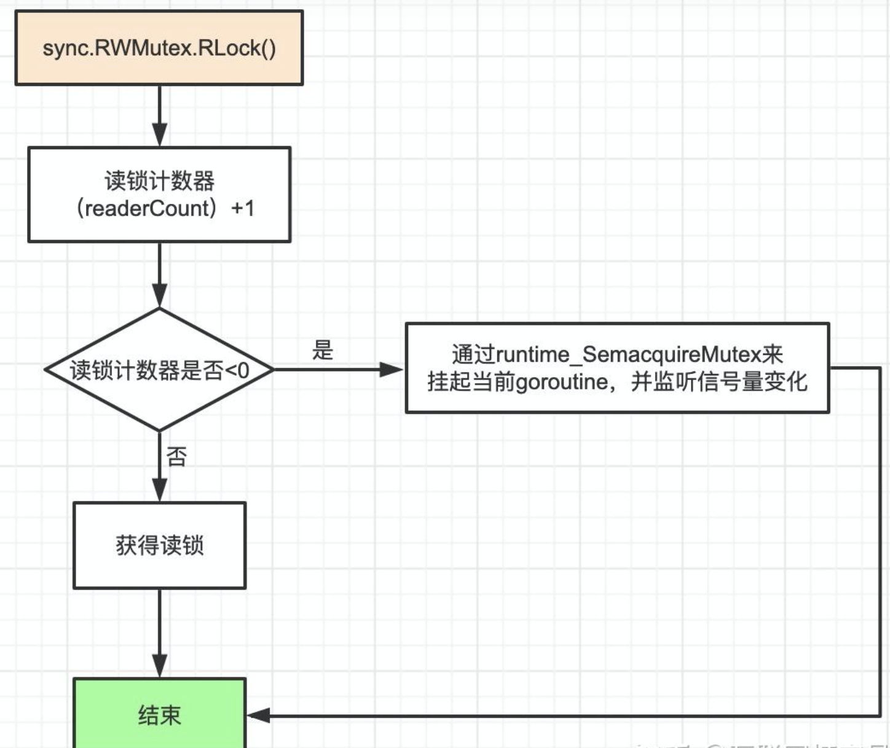
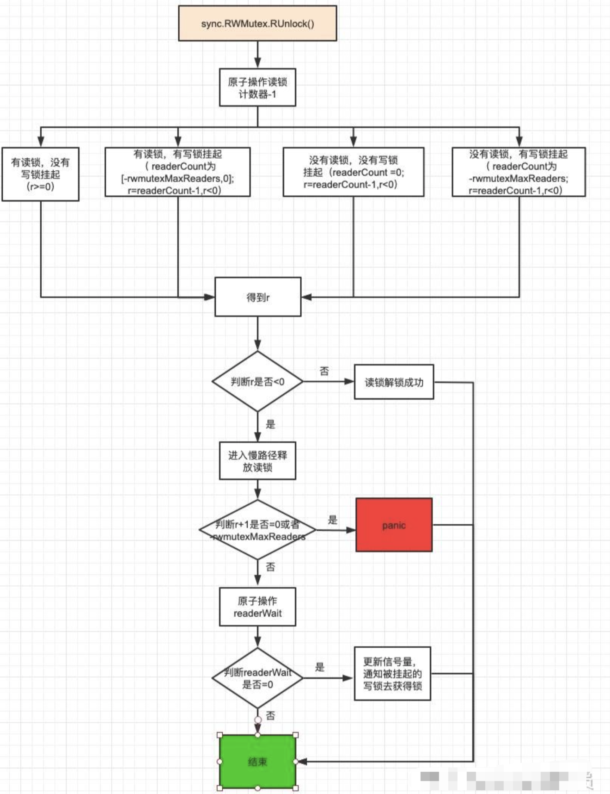
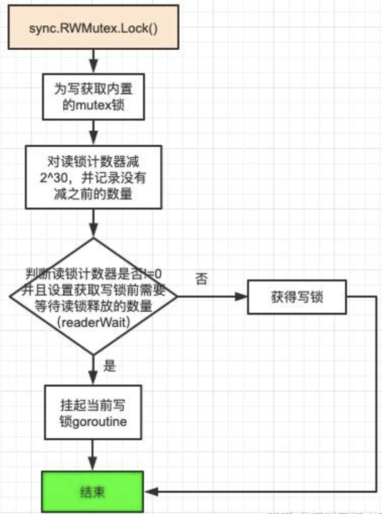
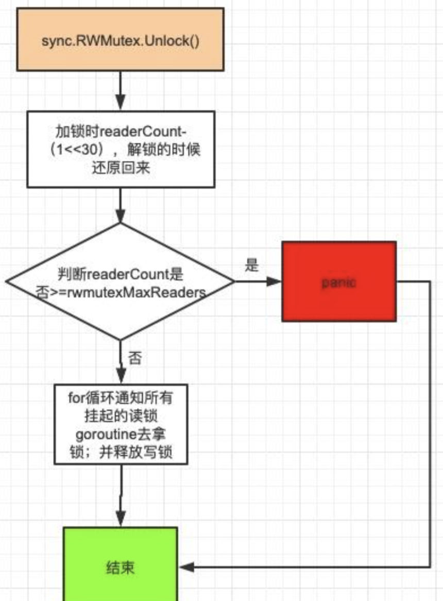
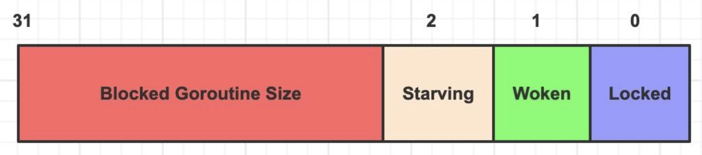
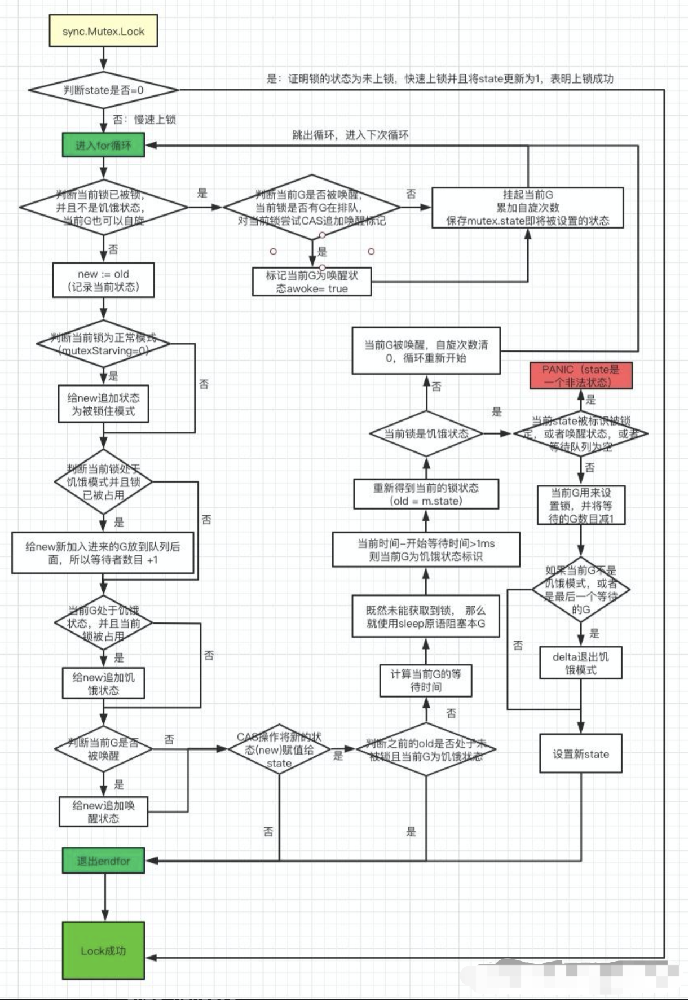
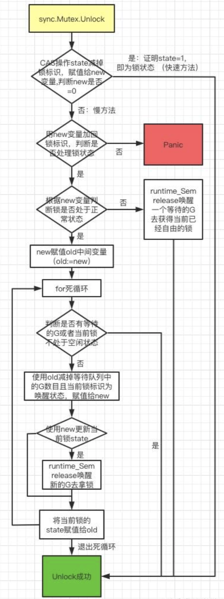

本文章来源于：<https://github.com/Zeb-D/my-review> ，请star 强力支持，你的支持，就是我的动力。

[TOC]

------

### 序

谈到高性能就意味着单个执行需要更快的RT，但大家不要和高并发混合在一起。

在谈到高性能场景时，难免会需要对一些竞态资源，众所周知，基本上任何一门语言的底层结构比如基本数据类型，甚至List、Map、Array如果在多请求线程/协程下都不允许同时读写的。

用我多年的经验来说，高并发速度：单线程的变量 > 多线程的atomic相关原子类 > 多线程的RWMutex > 多线程的Mutex。

接下来我们按照这个顺序由浅入深解开高性能的编程，数据竞态就涉及到并发安全。

在go lang 底层有比较多的并发类，但他们的最基础的就是`atomic`的cas机制、上一篇说的[golang 用unsafe 无所畏惧](https://mp.weixin.qq.com/s/wUuPr3gcj8-AmFGfnk77Mg)。


### 常见面试点

本次还是跟之前一样，答案都可以在本文中找到，或者可以vx后台咨询。

Q0：你认为高性能的需要解决问题的本质是什么？


Q1：golang 对变量有可见性这么一说法吗？那么底层用的是什么？


Q2：`atomic`的cas 机制能保证 ABA问题吗？如果有则需要怎么实现？


Q3：RWMutex 支持可重入（即连续获取两次锁）吗？这是为什么？


### 单线程的变量

以一个整型变量自增的语句为例：

```
var i int
i++
```

i++这行语句需要以下3条普通机器指令来完成变量i的自增。

```
LOAD：将变量从内存加载到CPU寄存器。
ADD：执行加法指令。
STORE：将结果存储回原内存地址。
```

这3条普通指令在执行过程中是可中断的，是不能达到原子操作的命令，这意味着不能用于并发同步。


并发与非并发得到了不同的值

```
func TestI100(t *testing.T) {
    sum := 0
    for i := 0; i < 100; i++ {
        sum += i
    }
    t.Log(sum) //sum = 4950
}
func TestGoroutineI100(t *testing.T) {
    sum := 0
    for i := 0; i < 100; i++ {
        go func(j int) {
            sum += j
        }(i)
    }
    t.Log(sum) //sum = 2421
}
func TestAtomicI100(t *testing.T) {
    var sum int32
    for i := 0; i < 100; i++ {
        go func(j int) {
            atomic.AddInt32(&sum, int32(j))
        }(i)
    }
    t.Log(sum) //4278
}
```

sum的正确值是 4950，TestGoroutineI100() 为啥错误？

> 并发的情况下，不同的协程goroutine同时拿到一个 sum值，然后执行 += 此时就会出现上面的问题。


### atomic.Value

熟悉的人会经常拿着这个牛逼地会说`lock free` 即无锁。

*src/sync/atomic* 目前只有一个atomic.Value 实现，但在其他语言有很多变种。

因为`atomic.Value`内部的字段是一个interface{}类型，所以atomic.Value被设计用来存储任意类型的数据。

```
type Value struct {
    v interface{}
}
```

除了atomic.Value外，atomic包内部定义了一个ifaceWords类型，这其实是interface{}的内部表示 (runtime.eface)，它的作用是将interface{}类型分解，得到其原始类型（typ）和真正的值（data）。

```elm
// ifaceWords is interface{} internal representation.
type ifaceWords struct {
  typ  unsafe.Pointer
  data unsafe.Pointer
}
```

把 atomic.Value转换成ifaceWords使用强制类型转化如下

```css
v := atomic.Value{}
vp := (*atomic.ifaceWords)(unsafe.Pointer(v))
```

这样我们就可以得到 atomic.Value 对应的 ifaceWords格式，然后获取对应的typ以及data两个字段属性。


#### 使用

我们使用go doc atomic.Value的到 atomic.Value的主要使用方法有 Load以及store,查询和存储两个方法。

```
func (v *Value) Load() (x interface{})
func (v *Value) Store(x interface{})
```

示例：

```
func atomic_value(a uint32) {
	var v atomic.Value
	v.Store(a)
	a = 666
	fmt.Println(a)
	fmt.Println(v.Load())
}

// 引用类型
func atomic_slice(s []uint32) {
	var v atomic.Value
	v.Store(s) 
	s[0] = 666
	fmt.Println(s)
	fmt.Println(v.Load()) //切片的地址，严格意义上来讲地址后面的不能保证并发安全
}
```


#### 原理解析

##### 数据结构

```go
// A Value provides an atomic load and store of a consistently typed value.
// The zero value for a Value returns nil from Load.
// Once Store has been called, a Value must not be copied.
//
// A Value must not be copied after first use.
type Value struct {
	v any
}
```

any是interface{}的别名，`aotomic.Value`维护的是一个interface{},提供一些原子的方法来更新这个interface{}

`atomic.Value`中Stroe的类型要与第一次Store的是同一个类型，并且Store被调用以后不能被复制，在第一次被使用后也是不能被复制的。

```go
// efaceWords is interface{} internal representation.
type efaceWords struct {
	typ  unsafe.Pointer
	data unsafe.Pointer
}
```

注释说明，efaceWords结构体是interface{}的内部表示，后面在使用interface{}的时候，会转化成efaceWords进行操作。

接口的底层数据结构

```go
type iface struct {
	tab  *itab
	data unsafe.Pointer
}

type eface struct {
	_type *_type
	data  unsafe.Pointer
}
```


##### Store

```go
// Store sets the value of the Value v to val.
// All calls to Store for a given Value must use values of the same concrete type.
// Store of an inconsistent type panics, as does Store(nil).
func (v *Value) Store(val any) {
	if val == nil {
		panic("sync/atomic: store of nil value into Value")
	}
	vp := (*efaceWords)(unsafe.Pointer(v))
	vlp := (*efaceWords)(unsafe.Pointer(&val))
	for {
		typ := LoadPointer(&vp.typ)
		if typ == nil {
			// Attempt to start first store.
			// Disable preemption so that other goroutines can use
			// active spin wait to wait for completion.
			runtime_procPin()
			if !CompareAndSwapPointer(&vp.typ, nil, unsafe.Pointer(&firstStoreInProgress)) {
				runtime_procUnpin()
				continue
			}
			// Complete first store.
			StorePointer(&vp.data, vlp.data)
			StorePointer(&vp.typ, vlp.typ)
			runtime_procUnpin()
			return
		}
		if typ == unsafe.Pointer(&firstStoreInProgress) {
			// First store in progress. Wait.
			// Since we disable preemption around the first store,
			// we can wait with active spinning.
			continue
		}
		// First store completed. Check type and overwrite data.
		if typ != vlp.typ {
			panic("sync/atomic: store of inconsistently typed value into Value")
		}
		StorePointer(&vp.data, vlp.data)
		return
	}
}
```


##### Store流程

1. 判断要Store的值是否为空，如果为空直接panic

2. 将Value和要存入的值都转换成efaceWords的指针类型

3. 使用for循环，首先取出Value的typ

   1. 如果typ为空，表明这是第一次进行Store操作，runtime_procPin()是在运行时实现的方法，可以禁止其他协程抢占M，然后通过cas操作来更新typ的值，这里改为

      ```
      firstStoreInProgress
      ```

      ，说明正在第一次Store的过程中

      1. 如果cas操作失败，说明已经有其他协程将typ的值改变了，那么解除禁止抢占，回到循环的最开始，重新取typ
      2. 如果cas成功，那么更新data值和typ，解除禁止抢占，这里先更新data的值再更新typ，是因为这里是由typ的值来确定是否更新成功的，如果先更新typ，有可能出现data没有存，但是typ已经存好的情况。

   2. 如果typ的值为`firstStoreInProgress`，说明其他协程在第一次Store的过程中，那么自旋等待。

   3. 走到这里，typ的值既不为nil也不为中间状态，那么直接与要存入的vlp的typ进行比较，如果不同那么panic，如果相同则进行存值

这里通过typ的值来表示程序进行Store的完成情况。

```go
TEXT runtime∕internal∕atomic·Cas(SB),NOSPLIT,$0-17
	MOVQ	ptr+0(FP), BX
	MOVL	old+8(FP), AX
	MOVL	new+12(FP), CX
	LOCK
	CMPXCHGL	CX, 0(BX)
	SETEQ	ret+16(FP)
	RET
```

atomic包中的cas通过LOCK指令来保证原子性，对于P6之前的处理器，LOCK 指令会总是锁总线，但是 P6 之后可能会执行“缓存锁定”，如果被锁定的内存区域被缓存在了处理器中，这个时候会通过缓存一致性来保证操作的原子性


##### Load

```go
// Load returns the value set by the most recent Store.
// It returns nil if there has been no call to Store for this Value.
func (v *Value) Load() (val any) {
	vp := (*efaceWords)(unsafe.Pointer(v))
	typ := LoadPointer(&vp.typ)
	if typ == nil || typ == unsafe.Pointer(&firstStoreInProgress) {
		// First store not yet completed.
		return nil
	}
	data := LoadPointer(&vp.data)
	vlp := (*efaceWords)(unsafe.Pointer(&val))
	vlp.typ = typ
	vlp.data = data
	return
}
```

Load返回最近一次存的值，如果没有Store过或者typ为`firstStoreInProgress`的话，返回nil


##### 小结

1. 从atomic.Value的实现可以看到，Value的更新并没有使用锁，而是通过原子操作和cas和自旋实现。
2. 对于同一个atomic.Value不能存入类型不同的值。


### sync.RWMutex

官方文档对它的描述是：

> RWMutex是一把读取器/写入器的互斥锁，可以由任意数量的读取器或单个写入器持有，RWMutex的零值是没有上锁的互斥锁，第一次使用后不得复制RWMutex。
>
> 如果goroutine拥有RWMutex进行读取，而另一个goroutine可能会调用Lock，则在释放初始读取锁之前，任何goroutine都不应期望能够获取读取锁。
>
> 特别是，这禁止了递归读取锁定。这是为了确保锁最终可用。锁定的锁定调用被阻止，使新读者无法获得锁定。
>
> 其经常用于读次数远远多于写次数的场景。


示例：

```
package main

import (
    "testing"
    "fmt"
    "sync"
    "time"
)

var rwlock = &sync.RWMutex{}
var wg = &sync.WaitGroup{}

func TestRWMutex(t *testing.T) {
    //读
    wg.Add(1)
    go rlockwork()

    time.Sleep(2 * time.Second)
    //读
    wg.Add(1)
    go rlock()
    //写
    wg.Add(1)
    go wlock()

    wg.Wait()
}
func wlock() {
    rwlock.Lock()
    fmt.Println("加写锁")
    fmt.Println("写任务执行")
    defer func() {
        rwlock.Unlock()
        fmt.Println("最后写解锁完毕")
        wg.Done()
    }()
    fmt.Println("准备解开写锁")
}
func rlock() {
    rwlock.RLock()
    fmt.Println("加读锁")
    fmt.Println("读任务执行")
    defer func() {
        rwlock.RUnlock()
        fmt.Println("最后读解锁完毕")
        wg.Done()
    }()
    fmt.Println("准备解开读锁")
}
func rlockwork() {
    rwlock.RLock()
    fmt.Println("加读锁====首先获取读锁")
    fmt.Println("读任务执行")
    time.Sleep(4 * time.Second)
    defer func() {
        rwlock.RUnlock()
        fmt.Println("最后读解锁完毕")
        wg.Done()
    }()
    fmt.Println("准备解开读锁")
}

```


#### RWMutex结构体

```go
// 读写互斥锁结构体
type RWMutex struct {
    w           Mutex  // 互斥锁
    writerSem   uint32 // 写锁信号量
    readerSem   uint32 // 读锁信号量
    readerCount int32  // 读锁计数器
    readerWait  int32  // 获取写锁时需要等待的读锁释放数量
}
const rwmutexMaxReaders = 1 << 30 //支持最多2^30个读
```


> w：Mutex互斥锁
>
> writeSem：写锁信号量，用来唤醒或睡眠goroutine。
>
> readerSem：读锁信号量，用来唤醒或睡眠goroutine。
>
> readerCount：类型是int32，它表示当前启用的读者数量，包括了所有正在临界区里面的读者或者被写锁阻塞的等待进入临界区读者的数量。相当于是当前调用了 RLock 函数并且还没调用 RUnLock 函数的读者的数量。
> readerWait：字段是int32，它用来记录在获取写锁之前，需要等待多少读锁释放的数量。
>
> rwmutexMaxReaders：表示最多支持的读者数量。​


#### 读锁实现

##### 读加锁源码分析

```go
func (rw *RWMutex) RLock() {
    // 竞态检测，可忽略
    if race.Enabled {
        _ = rw.w.state
        race.Disable()
    }
    // 每次goroutine获得读锁，readerCount+1
    // 1）如果写锁被获取，那么readerCount在 -rwmutexMaxReaders与0之间
    // 这时挂起获取读锁的goroutine。
    // 2）如果写锁未被获取，那么readerCount>=0，获取读锁,不阻塞。

    // 通过readerCount的正负判断读锁与写锁互斥,
    // 如果有写锁存在就挂起读锁的goroutine,多个读锁可以并行
    if atomic.AddInt32(&rw.readerCount, 1) < 0 {
        runtime_SemacquireMutex(&rw.readerSem, false, 0)
    }

    if race.Enabled {
        race.Enable()
        race.Acquire(unsafe.Pointer(&rw.readerSem))
    }
}
```




##### 读解锁源码分析

```go
func (rw *RWMutex) RUnlock() {
    // 竞态检测
    if race.Enabled {
        _ = rw.w.state
        race.ReleaseMerge(unsafe.Pointer(&rw.writerSem))
        race.Disable()
    }
    // 释放读锁，将readerCount-1
    // 1）有读锁，没有写锁挂起，r>=0，释放锁成功
    // 2）有读锁，有写锁挂起 readerCount为[-rwmutexMaxReaders,0]; r=readerCount-1,<0
    // 3）没有读锁，没有写锁挂起 readerCount =0;r=readerCount-1,<0
    // 4）没有读锁，有写锁挂起。readerCount为-rwmutexMaxReaders; r=readerCount-1,<0
    if r := atomic.AddInt32(&rw.readerCount, -1); r < 0 {
        // 后面三种进入慢路径
        rw.rUnlockSlow(r)
    }
    if race.Enabled {
        race.Enable()
    }
}

func (rw *RWMutex) rUnlockSlow(r int32) {
    //经过RUnlock atomic.AddInt32(&rw.readerCount, 1)到这里已经没有读锁了
    // 但是r分上面三种情况下
    // 1）有读锁，没有写锁挂起，r>=0；进入下面逻辑
    // 2）没有读锁，没有写锁挂起 r+1=0;panic
    // 3）没有读锁，有写锁挂起 r+1 = -rwmutexMaxReaders;panic
    if r+1 == 0 || r+1 == -rwmutexMaxReaders {
        race.Enable()
        throw("sync: RUnlock of unlocked RWMutex")
    }
    // 有读锁，有写锁挂起的这种情况
    // 更新获得写锁需要等待的读锁的数量
    // 当其==0时证明，所有等待的读锁全部释放掉
    if atomic.AddInt32(&rw.readerWait, -1) == 0 {
        // 更新信号量，通知被挂起的写锁去获取锁
        runtime_Semrelease(&rw.writerSem, false, 1)
    }
}
```




#### 写锁实现

##### 写加锁源码分析

```go
func (rw *RWMutex) Lock() {
    // 竞态检测
    if race.Enabled {
        _ = rw.w.state
        race.Disable()
    }
    //获得互斥锁，用来与其他goroutine互斥
    rw.w.Lock()
    // 告诉其他来获取读锁操作的goroutine，已经有人获取了写锁
    // 此时readerCount应该介于-rwmutexMaxReaders～0之间
    // r为读锁数量
    r := atomic.AddInt32(&rw.readerCount, -rwmutexMaxReaders) + rwmutexMaxReaders
    // 设置需要等待释放的读锁数量，
    // 如果有，则挂起当前写锁的goroutine，并监听写锁信号量
    // 如果没有，写加锁成功
    if r != 0 && atomic.AddInt32(&rw.readerWait, r) != 0 {
        runtime_SemacquireMutex(&rw.writerSem, false, 0)
    }
    // 竞态检测
    if race.Enabled {
        race.Enable()
        race.Acquire(unsafe.Pointer(&rw.readerSem))
        race.Acquire(unsafe.Pointer(&rw.writerSem))
    }
}
```




##### 写解锁源码分析

```go
func (rw *RWMutex) Unlock() {
    // 竞态检测
    if race.Enabled {
        _ = rw.w.state
        race.Release(unsafe.Pointer(&rw.readerSem))
        race.Disable()
    }
    // 还原加锁时减去的那一部分readerCoun
    r := atomic.AddInt32(&rw.readerCount, rwmutexMaxReaders)
    // 读锁数目超过了 最大允许数
    if r >= rwmutexMaxReaders {
        race.Enable()
        throw("sync: Unlock of unlocked RWMutex")
    }
    // 唤醒获取读锁期间所有被阻塞的goroutine
    for i := 0; i < int(r); i++ {
        runtime_Semrelease(&rw.readerSem, false, 0)
    }
    // 释放互斥量资源，允许其他写操作。
    rw.w.Unlock()
    if race.Enabled {
        race.Enable()
    }
}
```




### sync.Mutex

> sync.Mutex即为互斥锁，是传统的并发程序对共享资源进行访问控制的主要手段。
>
> 只有两个公开方法 Lock 和 Unlock，顾名思义，前者被用于锁定当前的互斥量，而后者则用来对当前互斥量进行解锁。互斥锁的零值是未被锁定的互斥锁。接下来分析它的实现。


示例：

```
var (
    Cnt int
    mu sync.Mutex
)

func Add(iter int) {
    mu.Lock()
    for i := 0; i < iter; i++ {
        Cnt++
    }
    mu.Unlock()
}
```


#### Mutex结构体

```go
type Mutex struct {
	state int32
	sema  uint32
}
const (
	mutexLocked = 1 << iota  // 1 << 0 = 1
	mutexWoken  //  1 << 1 = 2
	mutexStarving // 1 << 2 = 4
	mutexWaiterShift = iota //3

	starvationThresholdNs = 1e6 
) 
```


##### state

> 定义为int32 类型，允许为其调用原子方法来实现原子化的设定锁的状态 。一共32位，右起第一位表示锁定位，右起第二位表示唤醒位，右起第三位表示饥饿位。其余29位标识等待唤醒的goroutine的数量，下图为state结构图。




sema

> 信号量，用于唤醒或者挂起goroutine，具体用在四种信号处理函数那里。


mutexLocked

> 值为 1，用mutex.state&mutexLocked的结果来判断mutex锁的状态，1表示已加锁，0表示未加锁


mutexWoken

> 值为 2，用mutex.state&mutexWoken的结果判断mutex是否被唤醒，1被唤醒，0未被唤醒。


mutexStarving

> 值为 4 ，用mutex.state&mutexStarving的结果判断mutex是否处于饥饿模式：1表示处于饥饿模式，0表示正常模式。


mutexWaiterShift

> 值为 3，表示mutex.state >>3 即为阻塞的goroutine 的数量。


starvationThresholdNs

> 值为 1e6。切换为饥饿模式的等待时间。


#### Mutex两种操作模式

##### 正常模式

> 等待的goroutines按照FIFO（先进先出）顺序排队，但是goroutine被唤醒之后并不能立即得到mutex锁，它需要与新到达的goroutine争夺mutex锁。
>
> 因为新到达的goroutine已经在CPU上运行了，所以被唤醒的goroutine很大概率是争夺mutex锁是失败的。出现这种情况的时候，被唤醒goroutine需要排队在队列的前面。
>
> 如果被唤醒的goroutine有超过1ms没有获取到mutex锁，那么它就会变为饥饿模式。


##### 饥饿模式

> 锁的所有权将从解锁的gorutine直接交给等待队列中的第一个。新来的goroutine将不会尝试去获得锁，而是放在等待队列的尾部。如果有一个等待的goroutine获取到mutex锁了，并且是等待队列中的最后一个goroutine或者它的等待时间不超过1ms。则会将mutex的模式切换回正常模式。
> 正常模式：有更好的性能，因为goroutine可以获取到锁，即使有阻塞的goroutine，也要连续数次执行互斥锁。
> 饥饿模式：是对正常模式的补充，防止等待队列中的goroutine永远没有机会获取锁。


#### 四种信号处理函数

runtime_canSpin

> 在src/runtime/proc.go中被实现sync_runtime_canSpin；表示比较保守的自旋，golang中自旋锁并不会一直自旋下去，在runtime包中runtime_canSpin方法做了一些限制,传递过来的iter大等于4或者cpu核数小等于1，最大逻辑处理器大于1，至少有个本地的P队列，并且本地的P队列可运行G队列为空。


runtime_doSpin

> 在src/runtime/proc.go中被实现sync_runtime_doSpin；表示会调用procyield函数，该函数也是汇编语言实现。函数内部循环调用PAUSE指令。PAUSE指令什么都不做，但是会消耗CPU时间，在执行PAUSE指令时，CPU不会对它做不必要的优化。


runtime_SemacquireMutex

> 在src/runtime/sema.go中被实现sync_runtime_SemacquireMutex，表示通过信号量阻塞当前协程，函数首先检查信号量是否为0：如果大于0，让信号量减1，返回；如果等于0，就调用goparkunlock函数，把当前Goroutine放入该sema的等待队列，并设为等待状态。


runtime_Semrelease

> 在src/runtime/sema.go 中被实现 sync_runtime_Semrelease。首先让信号量加一，然后检查是否有正在等待的Goroutine，如果没有，直接返回；如果有，调用goready函数唤醒一个Goroutine。


#### 源码实现

##### 加锁源码分析

```go
func (m *Mutex) Lock() {
	// 快速路径，加锁
        // CAS比较state和0是否相等，如果相等则说明mutex锁未获得锁。
        // 此时将state赋值为1，表明加锁成功。
	if atomic.CompareAndSwapInt32(&m.state, 0, mutexLocked) {
                // 竞态检测
		if race.Enabled {
			race.Acquire(unsafe.Pointer(m))
		}
		return
	}
	// 表明已经锁在使用中，则调用goroutine直到互斥锁可用为止
	m.lockSlow()
}

func (m *Mutex) lockSlow() {
	var waitStartTime int64   // 标记当前goroutine的开始等待时间戳
	starving := false // 标记当前goroutine的饥饿模式，true:饥饿模式，false:正常模式
	awoke := false // 标记当前goroutine是否已唤醒，true:被唤醒，flase:未被唤醒
	iter := 0 // 自旋次数
	old := m.state // 保存当前对象锁状态赋值给old变量，做对比用 
	for {
                // mutexLocked:      0001   锁定状态
                // mutexWoken:       0010   唤醒状态
                // mutexStarving:    0100   饥饿模式
                // mutexWaiterShift: 3      等待上锁的goroutine数量

                // old&(mutexLocked|mutexStarving) == mutexLocked,于是old只能有以下两种状态：
                // 1) old = 0011时，说明mutex锁被锁定并且被唤醒，此时 0011&(0001|0100) = 0001
                // 2) old = 0001时，说明mutex锁被锁定，此时0001&(0001|0100) = 0001 
                // 间接说明了mutex不能处于饥饿模式下。
                
                // runtime_canSpin 见文末尾

                // 判断：被锁定状态；正常模式；可以自旋。（不要在饥饿模式下自旋）
		if old&(mutexLocked|mutexStarving) == mutexLocked && runtime_canSpin(iter) {
                        // !awoke: 当前goroutine未被唤醒
                        // old&mutexWoken == 0：当前mutex锁是否被唤醒。
                        // 只有当old=0001时，才有0001&0010=0，说明当前mutex没有被唤醒
                        // old>>mutexWaiterShift != 0：查看当前mutex锁排队的goroution数量
                        // atomic.CompareAndSwapInt32(&m.state, old, old|mutexWoken)：state追加唤醒状态
			// 为mutex锁和当前goroutine追加唤醒状态
                        if !awoke && old&mutexWoken == 0 && old>>mutexWaiterShift != 0 &&
				atomic.CompareAndSwapInt32(&m.state, old, old|mutexWoken) {
				awoke = true //此时当前goroutine被唤醒
			}
			runtime_doSpin() //runtime_canSpin 见文末尾
			iter++ // 自旋次数+1
			old = m.state // 将old重新赋值
			continue //跳出本次循环，开始下次循环
		}
                // 不使用自旋锁或者自旋失败还是没有获得锁。
		new := old
                // old&mutexStarving == 0即 old&(0100)=0,满足条件的old只有以下两种
                // 1） 当old = 0011，0011&0100=0，即old处于被锁定，被唤醒状态。
                // 2） 当old = 0001，0011&0100=0，即old处于被锁定状态。
                // 也说明了只有在正常模式下，才能标记new为被锁定状态，准备抢占锁
		if old&mutexStarving == 0 {
			new |= mutexLocked 
		}
                // 当前mutex锁处于饥饿模式并且加锁状态
                // 新加入进来的goroutine放到队列后面，所以等待者数目+1
		if old&(mutexLocked|mutexStarving) != 0 {
			new += 1 << mutexWaiterShift 
		}
                // 当前goroutine处于饥饿模式，并且当前锁被占用,标记new变量为饥饿状态
		if starving && old&mutexLocked != 0 {
			new |= mutexStarving 
		}
                // 当前goroutine被唤醒
		if awoke {
                        // 一定要将mutex标识为唤醒状态，不然panic
			if new&mutexWoken == 0 {
				throw("sync: inconsistent mutex state")
			}
			new &^= mutexWoken
		}
                // 将state与old比较，如果相同就将state赋值为new
		if atomic.CompareAndSwapInt32(&m.state, old, new) {
                        // 只有mutex处于未加锁状态，正常模式下，才加锁成功。
			if old&(mutexLocked|mutexStarving) == 0 {
				break //使用cas方法成功抢占到锁。
			}
			// waitStartTime != 0 说明当前goroutine是等待状态唤醒的 ，
                        // 此时queueLifo为true，反之为false。
			queueLifo := waitStartTime != 0
			if waitStartTime == 0 {
                                // 记录当前goroutine等待时间
				waitStartTime = runtime_nanotime()
			}
                        // 
			runtime_SemacquireMutex(&m.sema, queueLifo, 1)
                        // 当goroutine等待时间超过starvationThresholdNs，mutex进入饥饿模式
			starving = starving || runtime_nanotime()-waitStartTime > starvationThresholdNs
			old = m.state //得到mutex锁的状态
			if old&mutexStarving != 0 { //当前mutex处于饥饿模式
                                // 如果当前的state已加锁，已唤醒，或者等待的队列中为空,那么state是一个非法状态，panic
				if old&(mutexLocked|mutexWoken) != 0 || old>>mutexWaiterShift == 0 {
					throw("sync: inconsistent mutex state")
				}
                                // 等待状态的goroutine - 1
				delta := int32(mutexLocked - 1<<mutexWaiterShift)
				// 如果本goroutine并不处于饥饿状态（等待时间小于1ms），或者它是最后一个等待者
                                if !starving || old>>mutexWaiterShift == 1 {
                                        // 退出饥饿模式
					delta -= mutexStarving
				}
                                // 设置新state, 因为已经获得了锁，退出、返回
				atomic.AddInt32(&m.state, delta)
				break
			}
                        // 修改为本goroutine为唤醒状态，并且自旋次数清0
			awoke = true
			iter = 0
		} else {
                        //如果CAS不成功，重新获取锁的state, 从for循环开始处重新开始 继续上述动作
			old = m.state
		}
	}
	if race.Enabled {
		race.Acquire(unsafe.Pointer(m))
	}
}
```





##### 解锁源码分析

```go
func (m *Mutex) Unlock() {
        // 竞态检测
	if race.Enabled {
		_ = m.state
		race.Release(unsafe.Pointer(m))
	}
	//  快速路径解锁
        //  原子操作移除state锁定标识。
	new := atomic.AddInt32(&m.state, -mutexLocked)
	if new != 0 { //存在其他goroutine等待
                // 慢路径解锁
		m.unlockSlow(new)
	}
}

func (m *Mutex) unlockSlow(new int32) {
        // 将state追加锁定标志，判断是否处于锁定状态
        // 未加锁状态下解锁会panic
	if (new+mutexLocked)&mutexLocked == 0 {
		throw("sync: unlock of unlocked mutex")
	}
	if new&mutexStarving == 0 { // 正常模式下
		old := new
		for {
                        // 没有等待唤醒的goroutine
                        // 或者加锁状态、被唤醒、饥饿状态下不需要唤醒等待的goroutine
			if old>>mutexWaiterShift == 0 || old&(mutexLocked|mutexWoken|mutexStarving) != 0 {
				return
			}
			// 等待goroutine个数-1，并添加唤醒标识
			new = (old - 1<<mutexWaiterShift) | mutexWoken
			if atomic.CompareAndSwapInt32(&m.state, old, new) {
                                // 唤醒一个阻塞的goroutine 但不是第一个等待者
				runtime_Semrelease(&m.sema, false, 1)
				return
			}
			old = m.state
		}
	} else {
                // 饥饿模式下
                // 将锁交给队列第一个等待的goroutine
                // 即使期间有新来的goroutine到来，只要处于饥饿模式 
                // 锁就不会被新来的goroutine抢占
		runtime_Semrelease(&m.sema, true, 1)
	}
}
```


