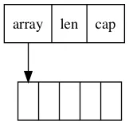
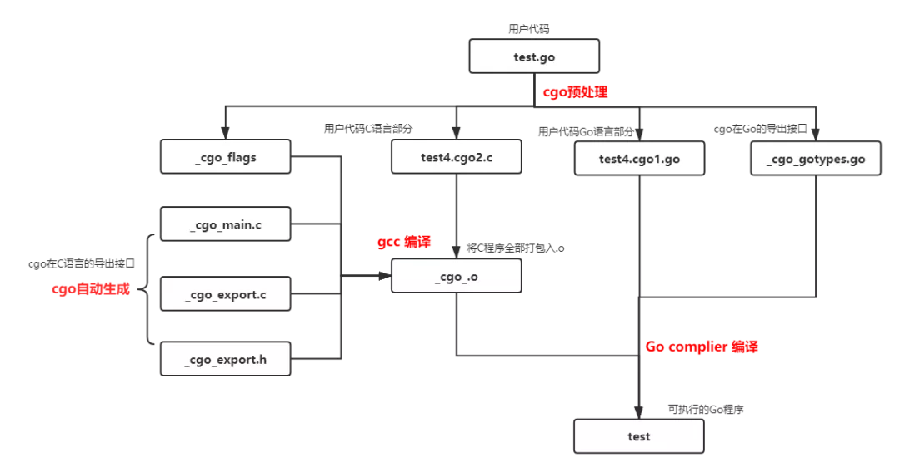
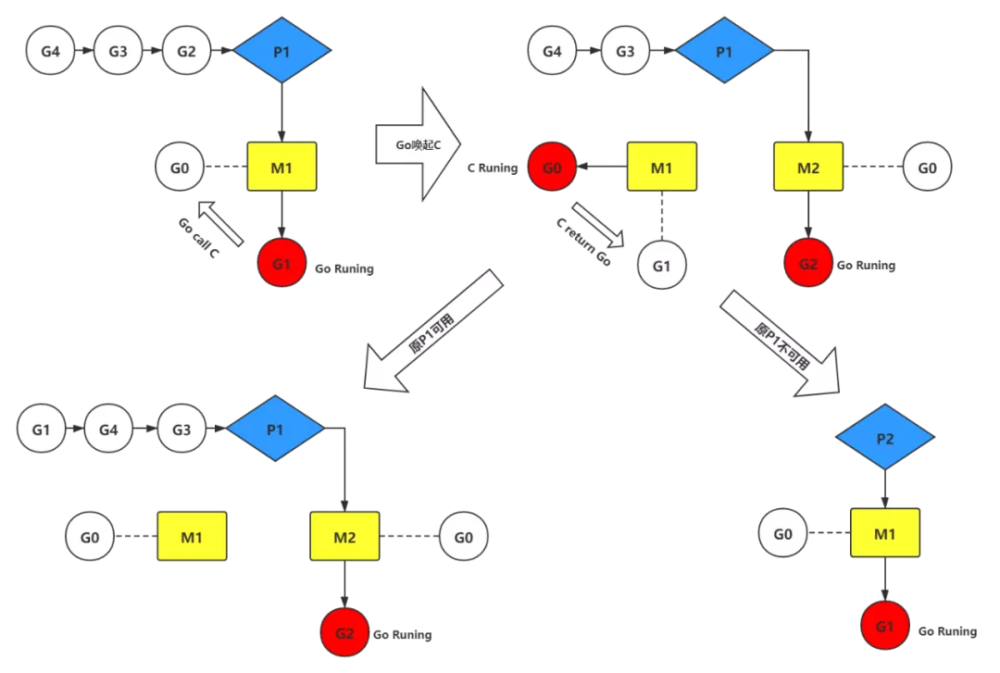

本文章来源于：<https://github.com/Zeb-D/my-review> ，请star 强力支持，你的支持，就是我的动力。

[TOC]

------

### 背景

有好几次进行业务coding需要使用到一些c使用，接触后发现，比java耦合c更方便快捷；

对此我们开始由浅入深的研究下cgo与c如何在go中运用，部分可见[测试代码](https://github.com/Zeb-D/go-util/tree/master/todo/main/cgo/main)；


### 启用CGO特性

在golang代码中加入import “C”语句就可以启动CGO特性。

这样在进行go build命令时，就会在编译和连接阶段启动gcc编译器。

```
// go.1.15
//cgo.go

//#include <stdio.h>        //  序文中可以链接标准C程序库
import "C" // import "C"更像是一个关键字，CGO工具在预处理时会删掉这一行

//通过import“C”语句启用CGO特性后，CGO会将上一行代码所处注释块的内容视为C代码块，
//被称为序文（preamble）。
func main() {
	C.puts(C.CString("Hello, Cgo\n"))
}
```

使用-x选项可以查看go程序编译过程中执行的所有指令。可以看到golang编译器已经为test1.go创建了CGO编译选项：

```
➜  main git:(master) ✗ go build -x cgo.go
WORK=/var/folders/06/djtxbl7j0x585l4k0hf2mnmm0000gn/T/go-build2513209967
mkdir -p $WORK/b001/
cat >$WORK/b001/importcfg.link << 'EOF' # internal
packagefile command-line-arguments=/Users/zouyongdong/Library/Caches/go-build/59/593af31c688f3f0135adccd9ea2238b8546728458597cc105902639d6d91712f-d
packagefile runtime/cgo=/Users/yd/Library/Caches/go-build/2d/2d55962157bb40b34af38f2eb1b27fa8bc9489c18cc596b628745c7209ab66eb-d
packagefile syscall=/usr/local/go/pkg/darwin_amd64/syscall.a
packagefile runtime=/usr/local/go/pkg/darwin_amd64/runtime.a
... ...
```


通过import “C”语句启用CGO特性后，CGO会将上一行代码所处注释块的内容视为C代码块，被称为**序文（preamble）**。


在序文中可以使用C.func的方式调用C代码块中的函数，包括库文件中的函数。对于C代码块的变量，类型也可以使用相同方法进行调用。


cgo.go通过CGO提供的C.CString函数将Go语言字符串转化为C语言字符串，最后再通过C.puts 调用<stdio.h>中的puts函数向标准输出打印字符串。

```
Hello, Cgo
```


### cgo工具

当你在包中引用import “C”，go build就会做很多额外的工作来构建你的代码，构建就不仅仅是向go tool compile传递一堆.go文件了，而是要先进行以下步骤：

- cgo工具就会被调用，在C转换Go、Go转换C的之间生成各种文件。

- 系统的C编译器会被调用来处理包中所有的C文件。

- 所有独立的编译单元会被组合到一个.o文件。

- 生成的.o文件会在系统的连接器中对它的引用进行一次检查修复。

cgo是一个Go语言自带的特殊工具，可以使用命令go tool cgo来运行。它可以生成能够调用C语言代码的Go语言源文件，也就是说所有启用了CGO特性的Go代码，都会首先经过cgo的“预处理”。

对cgo.go，cgo工具会在同目录生成以下文件：

```
-obj--|
      |--_cgo.o             // C代码编译出的链接库
      |--_cgo_main.c        // C代码部分的main函数
      |--_cgo_flags         // C代码的编译和链接选项
      |--_cgo_export.c      // 
      |--_cgo_export.h      // 导出到C语言的Go类型
      |--_cgo_gotypes.go    // 导出到Go语言的C类型
      |--cgo.cgo1.go      // 经过“预处理”的Go代码
      |--cgo.cgo2.c       // 经过“预处理”的C代码
```


### CGO的N种用法

CGO作为Go语言和C语言之间的桥梁，其使用场景可以分为两种：Go调用C程序和C调用Go程序。


#### Go调用自定义C程序

```
//self-c.go
package main

/*
#cgo LDFLAGS: -L/usr/local/lib

#include <stdio.h>
#include <stdlib.h>
#define REPEAT_LIMIT 3              // CGO会保留C代码块中的宏定义
typedef struct{                     // 自定义结构体
    int repeat_time;
    char* str;
}blob;
int SayHello(blob* pblob) {  // 自定义函数
    for ( ;pblob->repeat_time < REPEAT_LIMIT; pblob->repeat_time++){
        puts(pblob->str);
    }
    return 0;
}
*/
import "C"
import (
	"fmt"
	"unsafe"
)

func main() {
	cblob := C.blob{} // 在GO程序中创建的C对象，存储在Go的内存空间
	cblob.repeat_time = 0

	cblob.str = C.CString("Hello, C\n") // C.CString 会在C的内存空间申请一个C语言字符串对象，再将Go字符串拷贝到C字符串

	ret := C.SayHello(&cblob) // &cblob 取C语言对象cblob的地址

	fmt.Println("ret", ret)
	fmt.Println("repeat_time", cblob.repeat_time)

	C.free(unsafe.Pointer(cblob.str)) // C.CString 申请的C空间内存不会自动释放，需要显示调用C中的free释放
}
```

```
ret 0
repeat_time 2
Hello, C

Hello, C
```

CGO会保留序文中的宏定义，但是并不会保留注释，也不支持#program，**C代码块中的#program语句极可能产生未知错误**。

CGO中**使用#cgo关键字可以设置编译阶段和链接阶段的相关参数**，可以使用${SRCDIR}来表示Go包当前目录的绝对路径。

使用C.结构名或C.struct_结构名可以在Go代码段中定义C对象，并通过成员名访问结构体成员。


self-c.go中使用C.CString将Go字符串对象转化为C字符串对象，并将其传入C程序空间进行使用，由于C的内存空间不受Go的GC管理，因此需要显示的调用C语言的free来进行回收。


#### Go调用C/C++模块

##### 简单Go调C

直接将完整的C代码放在Go源文件中，这种编排方式便于开发人员快速在C代码和Go代码间进行切换。

```
//simple-c.go
package main

/*
#include <stdio.h>
int SayHello() {
  puts("Hello World");
    return 0;
}
*/
import "C"
import (
	"fmt"
)

func main() {
	ret := C.SayHello()
	fmt.Println(ret)
}

```

```
0
Hello World
```

但是当CGO中使用了大量的C语言代码时，将所有的代码放在同一个go文件中即不利于代码复用，也会影响代码的可读性。此时可以将C代码抽象成模块，再将C模块集成入Go程序中。


##### Go调用C模块

将C代码进行抽象，放到相同目录下的C语言源文件hello.c中：

```
//hello.c
#include <stdio.h>
int SayHelloV2() {
  puts("Hello go 2 c");
    return 0;
}
```

在Go代码中，声明SayHello()函数，再引用hello.c源文件，就可以调起外部C源文件中的函数了。同理也可以将**C源码编译打包为静态库或动态库**进行使用。

```
package main

/*
#include "hello.c"
int SayHelloV2();
*/
import "C"
import (
	"fmt"
)

func main() {
	ret := C.SayHelloV2()
	fmt.Println(ret)
}
```

go2c.go中只对SayHello函数进行了声明，然后再通过链接C程序库的方式加载函数的实现。那么同样的，也可以通过**链接C++程序库**的方式，来实现Go调用C++程序。


##### Go调用C++模块

基于go2c.go。可以抽象出一个hello模块，将模块的接口函数在hello.h头文件进行定义：

```
//helloc.h
int SayHelloV3();
```

 再使用C++来重新实现这个C函数：

```
//helloc.cpp
#include <iostream>

extern "C" {
    #include "helloc.h"
}

int SayHelloV3() {
  std::cout<<"Hello World";
    return 0;
}
```

最后再在Go代码中，引用helloc.h头文件，就可以调用C++实现的SayHelloV3函数了：

```
//go2cpp.go
package main

/*
#include "helloc.h"
int SayHelloV3();
*/
import "C"
import (
	"fmt"
)


//编译失败，要使用// go run ../main才能运行
//CGO提供的这种面向C语言接口的编程方式，
//使得开发者可以使用是任何编程语言来对接口进行实现，只要最终满足C语言接口即可。
func main() {
	ret := C.SayHelloV3()
	fmt.Println(ret)
}
```


#### C调用Go模块

C调用Go相对于Go调C来说要复杂多，可以分为两种情况。

一是原生Go进程调用C，C中再反调Go程序。

另一种是原生C进程直接调用Go。

```
//c2go.h
void SayHelloV4(char* s);
```

##### Go实现的C函数

如前述，开发者可以用任何编程语言来编写程序，只要支持CGO的C接口标准，就可以被CGO接入。那么同样可以用**Go实现C函数接口**。

在c2go_impl.go中，已经定义了C接口模块c2go.h：

```
//c2go_impl.go
package main

//#include <c2go.h>
import "C"
import "fmt"

//export SayHelloV4
func SayHelloV4(str *C.char) {
	fmt.Println(C.GoString(str))
}

//CGO的//export SayHello指令将Go语言实现的SayHello函数导出为C语言函数。
```

CGO的//export SayHello指令将Go语言实现的SayHello函数导出为C语言函数。

这样再Go中调用C.SayHello时，最终调用的是c2go_impl.go中定义的Go函数SayHello：

```

// go run ../main
package main

//#include "c2go.h"
import "C"

func main() {
	C.SayHelloV4(C.CString("Hello World"))
}
```

Go程序先调用C的SayHello接口，由于SayHello接口链接在Go的实现上，又调到Go。

看起来调起方和实现方都是Go，但实际执行顺序是Go的main函数，调到CGO生成的C桥接函数，最后C桥接函数再调到Go的SayHello。


##### 原生C调用Go

C调用到Go这种情况比较复杂，Go一般是便以为c-shared/c-archive的库给C调用。

```
package main

import "C"

//export helloV5
func helloV5(value string) *C.char { // 如果函数有返回值，则要将返回值转换为C语言对应的类型
	return C.CString("helloV5" + value)
}

//C调用到Go这种情况比较复杂，Go一般是便以为c-shared/c-archive的库给C调用。
func main() {
	// 此处一定要有main函数，有main函数才能让cgo编译器去把包编译成C的库
}
//如果Go函数有多个返回值，会生成一个C结构体进行返回，结构体定义参考生成的.h文件
//go build -buildmode=c-shared -o oc2go.so oc2go.go
```

如果Go函数有多个返回值，会生成一个C结构体进行返回，结构体定义参考生成的.h文件

生成c-shared文件命令：

```
go build -buildmode=c-shared -o oc2go.so oc2go.go
```

在C代码中，只需要引用go build生成的.h文件，并在编译时链接对应的.so程序库，即可从C调用Go程序

```
//oc2go.c
#include <stdio.h>
#include <string.h>
#include "oc2go.h"                       //此处为上一步生成的.h文件

int main(){
    char c1[] = "did";
    GoString s1 = {c1,strlen(c1)};       //构建Go语言的字符串类型
    char *c = helloV5(s1);
    printf("r:%s",c);
    return 0;
}
```

编译命令：

```
gcc -o oc2go oc2go.c oc2go.so 
```

C函数调入进Go，必须按照Go的规则执行，当主程序是C调用Go时，也同样有一个Go的runtime与C程序并行执行。

这个runtime的初始化在对应的c-shared的库加载时就会执行。

因此，在进程启动时就有两个线程执行，一个C的，一 (多)个是Go的。


### 类型转换

想要更好的使用CGO必须了解Go和C之间类型转换的规则。


#### （一）数值类型

在Go语言中访问C语言的符号时，一般都通过虚拟的“C”包进行。比如C.int，C.char就对应与C语言中的int和char，对应于Go语言中的int和byte。

C语言和Go语言的数值类型对应如下：


Go语言的int和uint在32位和64位系统下分别是4个字节和8个字节大小。它在C语言中的导出类型GoInt和GoUint在不同位数系统下内存大小也不同。


如下是64位系统中，Go数值类型在C语言的导出列表：

```
// cgo_export.h
typedef signed char GoInt8;
typedef unsigned char GoUint8;
typedef short GoInt16;
typedef unsigned short GoUint16;
typedef int GoInt32;
typedef unsigned int GoUint32;
typedef long long GoInt64;
typedef unsigned long long GoUint64;
typedef GoInt64 GoInt;
typedef GoUint64 GoUint;
typedef __SIZE_TYPE__ GoUintptr;
typedef float GoFloat32;
typedef double GoFloat64;
typedef float _Complex GoComplex64;
typedef double _Complex GoComplex128;
```

> 需要注意的是在C语言符号名前加上`_Ctype_`，便是其在Go中的导出名，因此在启用CGO特性后，Go语言中禁止出现以`_Ctype_`开头的自定义符号名，类似的还有`_Cfunc_`等。

可以在序文中引入_obj/_cgo_export.h来显式使用cgo在C中的导出类型：

```
//cgo_export.go
package main

/*
#include "cgo_export.h"                       // _cgo_export.h由cgo工具动态生成
GoInt32 Add(GoInt32 param1, GoInt32 param2) {       // GoInt32即为cgo在C语言的导出类型
  return param1 + param2;
}

*/
import "C"
import "fmt"

func main() {
	// _Ctype_                      // _Ctype_ 会在cgo预处理阶段触发异常，
	fmt.Println(C.Add(1, 2)) //output 3
}
```

如下是64位系统中，C数值类型在Go语言的导出列表：

```
//cgo_gotypes.go
package main

type _Ctype_char int8
type _Ctype_double float64
type _Ctype_float float32
type _Ctype_int int32
type _Ctype_long int64
type _Ctype_longlong int64
type _Ctype_schar int8
type _Ctype_short int16
type _Ctype_size_t = _Ctype_ulong
type _Ctype_uchar uint8
type _Ctype_uint uint32
type _Ctype_ulong uint64
type _Ctype_ulonglong uint64
type _Ctype_void [0]byte
```

为了提高C语言的可移植性，更好的做法是**通过C语言的C99标准引入的<stdint.h>头文件**，不但每个数值类型都提供了明确内存大小，而且和Go语言的类型命名更加一致。


#### （二）切片

Go中切片的使用方法类似C中的数组，但是内存结构并不一样。C中的数组实际上指的是一段连续的内存，而Go的切片在存储数据的连续内存基础上，还有一个头结构体，其内存结构如下：



因此Go的切片不能直接传递给C使用，而是需要取切片的内部缓冲区的首地址(即首个元素的地址)来传递给C使用。

使用这种方式把Go的内存空间暴露给C使用，可以大大减少Go和C之间参数传递时内存拷贝的消耗。

```
//cgo-slice.go
package main
//因此Go的切片不能直接传递给C使用，而是需要取切片的内部缓冲区的首地址(即首个元素的地址)来传递给C使用。
// 使用这种方式把Go的内存空间暴露给C使用，可以大大减少Go和C之间参数传递时内存拷贝的消耗。

/*
int SayHelloV6(char* buff, int len) {
    char hello[] = "Hello Cgo!";
    int movnum = len < sizeof(hello) ? len:sizeof(hello);
    memcpy(buff, hello, movnum);                        // go字符串没有'\0'，所以直接内存拷贝
    return movnum;
}

*/
import "C"
import (
	"fmt"
	"unsafe"
)

func main() {
	buff := make([]byte, 8)
	C.SayHelloV6((*C.char)(unsafe.Pointer(&buff[0])), C.int(len(buff)))
	a := string(buff)
	fmt.Println(a)
}
```


#### **（三）字符串**

Go的字符串与C的字符串在底层的内存模型也不一样：


Go的字符串并没有以'\0'结尾，因此使用类似切片的方式，直接将Go字符串的首元素地址传递给C是不可行的。


##### **Go与C的字符串传递**

cgo给出的解决方案是标准库函数C.CString()，它会在C内存空间内申请足够的空间，并将Go字符串拷贝到C空间中。因此C.CString申请的内存在C空间中，因此需要显式的调用C.free来释放空间，如test3。

如下是C.CString()的底层实现：

```
func _Cfunc_CString(s string) *_Ctype_char {        // 从Go string 到 C char* 类型转换
  p := _cgo_cmalloc(uint64(len(s)+1))             
  pp := (*[1<<30]byte)(p)
  copy(pp[:], s)
  pp[len(s)] = 0
  return (*_Ctype_char)(p)
}

//go:cgo_unsafe_args
func _cgo_cmalloc(p0 uint64) (r1 unsafe.Pointer) {
  _cgo_runtime_cgocall(_cgo_bb7421b6328a_Cfunc__Cmalloc, uintptr(unsafe.Pointer(&p0)))
  if r1 == nil {
    runtime_throw("runtime: C malloc failed")
  }
  return
}
```

**_Cfunc_CString**

_Cfunc_CString是cgo定义的从Go string到C char*的类型转换函数。

- 使用_cgo_cmalloc在C空间内申请内存(即不受Go GC控制的内存)。

- 使用该段C内存初始化一个[]byte对象。

- 将string拷贝到[]byte对象。

- 将该段C空间内存的地址返回。

它的实现方式类似前述，切片的类型转换。不同在于切片的类型转换，是将Go空间内存暴露给C函数使用。而_Cfunc_CString是将C空间内存暴露给Go使用。


**_cgo_cmalloc**

定义了一个暴露给Go的C函数，用于在C空间申请内存。

与C.CString()对应的是从C字符串转Go字符串的转换函数C.GoString()。C.GoString()函数的实现较为简单，检索C字符串长度，然后申请相同长度的Go-string对象，最后内存拷贝。      

如下是C.GoString()的底层实现：

```
//go:linkname _cgo_runtime_gostring runtime.gostring
func _cgo_runtime_gostring(*_Ctype_char) string 

func _Cfunc_GoString(p *_Ctype_char) string {           // 从C char* 到 Go string 类型转换
  return _cgo_runtime_gostring(p)
}

//go:linkname gostring
func gostring(p *byte) string {             // 底层实现
  l := findnull(p)
  if l == 0 {
    return ""
  }
  s, b := rawstring(l)
  memmove(unsafe.Pointer(&b[0]), unsafe.Pointer(p), uintptr(l))
  return s
}
```


##### 更高效的字符串传递方法

C.CString简单安全，但是它涉及了一次从Go到C空间的内存拷贝，对于长字符串而言这会是难以忽视的开销。

Go官方文档中声称string类型是“不可改变的”，但是在实操中可以发现，除了常量字符串会在编译期被分配到只读段，其他的动态生成的字符串实际上都是在堆上。

因此如果能够获得string的内存缓存区地址，那么就可以使用类似切片传递的方式将字符串指针和长度直接传递给C使用。

查阅源码，可知String实际上是由缓冲区首地址和长度构成的。这样就可以通过一些方式拿到缓存区地址。

```
type stringStruct struct {
  str unsafe.Pointer  //str首地址
  len int             //str长度
}
```

test11.go将fmt动态生成的string转为自定义类型MyString便可以获得缓冲区首地址，将地址传入C函数，

这样就可以在C空间直接操作Go-String的内存空间了，这样可以免去内存拷贝的消耗。

```
// test11.go
package main

/*
#include <string.h>
int SayHello(char* buff, int len) {
    char hello[] = "Hello Cgo!";
    int movnum = len < sizeof(hello) ? len:sizeof(hello);
    memcpy(buff, hello, movnum);
    return movnum;
}
*/
import "C"
import (
    "fmt"
    "unsafe"
)

type MyString struct {
  Str *C.char
  Len int
}
func main() {
    s := fmt.Sprintf("             ")
    C.SayHello((*MyString)(unsafe.Pointer(&s)).Str, C.int((*MyString)(unsafe.Pointer(&s)).Len))
    fmt.Print(s)
}
```

这种方法背离了Go语言的设计理念，如非必要，不要把这种代码带入你的工程，

这里只是作为一种“黑科技”进行分享。


#### **（四）结构体，联合，枚举**


cgo中结构体，联合，枚举的使用方式类似，可以通过C.struct_XXX来访问 C语言中struct XXX类型。union，enum也类似。


##### **结构体**

如果结构体的成员名字中碰巧是Go语言的关键字，可以通过在成员名开头添加下划线来访问。

如果有2个成员：一个是以Go语言关键字命名，另一个刚好是以下划线和Go语言关键字命名，那么以Go语言关键字命名的成员将无法访问（被屏蔽）。

C语言结构体中位字段对应的成员无法在Go语言中访问，如果需要操作位字段成员，需要通过在C语言中定义辅助函数来完成。

对应零长数组的成员(C中经典的变长数组)，无法在Go语言中直接访问数组的元素，但同样可以通过在C中定义辅助函数来访问。

结构体的内存布局按照C语言的通用对齐规则，在32位Go语言环境C语言结构体也按照32位对齐规则，在64位Go语言环境按照64位的对齐规则。**对于指定了特殊对齐规则的结构体，无法在CGO中访问**。

```
// test11.go
package main
/*
struct Test {
    int a;
    float b;
    double type;
    int size:10;
    int arr1[10];
    int arr2[];
};
int Test_arr2_helper(struct Test * tm ,int pos){
    return tm->arr2[pos];
}
#pragma  pack(1)
struct Test2 {
    float a;
    char b;
    int c;
};
*/
import "C"
import "fmt"
func main() {
    test := C.struct_Test{}
    fmt.Println(test.a)
    fmt.Println(test.b)
    fmt.Println(test._type)
    //fmt.Println(test.size)        // 位数据
    fmt.Println(test.arr1[0])
    //fmt.Println(test.arr)         // 零长数组无法直接访问
    //Test_arr2_helper(&test, 1)
    
    test2 := C.struct_Test2{}
    fmt.Println(test2.c)
    //fmt.Println(test2.c)          // 由于内存对齐，该结构体部分字段Go无法访问
}
```

#####  联合

Go语言中并不支持C语言联合类型，它们会被转为对应大小的字节数组。

如果需要操作C语言的联合类型变量，一般有三种方法：第一种是在C语言中定义辅助函数；第二种是通过Go语言的“encoding/binary”手工解码成员(需要注意大端小端问题)；第三种是使用unsafe包强制转型为对应类型(这是性能最好的方式)。

test12给出了union的三种访问方式：

```
// test12.go
package main
/*
#include <stdint.h>
union SayHello {
  int Say;
  float Hello;
};
union SayHello init_sayhello(){
    union SayHello us;
    us.Say = 100;
    return us;
}
int SayHello_Say_helper(union SayHello * us){
    return us->Say;
}
*/
import "C"
import (
    "fmt"
    "unsafe"
    "encoding/binary"
)

func main() {
    SayHello := C.init_sayhello()
    fmt.Println("C-helper ",C.SayHello_Say_helper(&SayHello))           // 通过C辅助函数
    buff := C.GoBytes(unsafe.Pointer(&SayHello), 4)     
    Say2 := binary.LittleEndian.Uint32(buff)
    fmt.Println("binary ",Say2)                 // 从内存直接解码一个int32
    fmt.Println("unsafe modify ", *(*C.int)(unsafe.Pointer(&SayHello)))     // 强制类型转换
}
```

##### 枚举

对于枚举类型，可以通过C.enum_xxx来访问C语言中定义的enum xxx结构体类型。使用方式和C相同，这里就不列例子了。


##### 指针

在Go语言中两个指针的类型完全一致则不需要转换可以直接通用。如果一个指针类型是用type命令在另一个指针类型基础之上构建的，换言之两个指针底层是相同完全结构的指针，那么也可以通过直接强制转换语法进行指针间的转换。

但是C语言中，不同类型的指针是可以显式或隐式转换。cgo经常要面对的是2个完全不同类型的指针间的转换，实现这一转换的关键就是unsafe.Pointer，类似于C语言中的Void*类型指针。


### 内部机制

go tool cgo是分析CGO内部运行机制的重要工具，本章根据cgo工具生成的中间代码，再辅以Golang源码中runtime部分，来对cgo的内部运行机制进行分析。

cgo的工作流程为：代码预处理->gcc编译->Go Complier编译。其产生的中间文件如图所示：



#### （一）Go调C

Go调C的过程比较简单。test13中定义了一个C函数sum，并在Go中调用了C.sum。

```
package main

//int sum(int a, int b) { return a+b; }
import "C"

func main() {
  println(C.sum(1, 1))
}
```

下面是cgo工具产生的中间文件，最重要的是test13.cgo1.go，test13.cgo1.c，_cgo_gotypes.go。

##### **test13.cgo1.go**

test13.cgo1.go是原本test13.go被cgo处理之后的文件。

```
// Code generated by cmd/cgo; DO NOT EDIT.

//line test4.go:1:1
package main

//int sum(int a, int b) { return a+b; }
import _ "unsafe"

func main() {
  println(( /*line :7:10*/_Cfunc_sum /*line :7:14*/)(1, 1))
}
```

这个文件才是go complier真正编译的代码。可以看到原本的C.sum被改写为_Cfunc_sum，_Cfunc_sum的定义在_cgo_gotypes.go中。

##### **_cgo_gotypes.go**

```
// Code generated by cmd/cgo; DO NOT EDIT.

package main

import "unsafe"

import _ "runtime/cgo"

import "syscall"

var _ syscall.Errno
func _Cgo_ptr(ptr unsafe.Pointer) unsafe.Pointer { return ptr }

//go:linkname _Cgo_always_false runtime.cgoAlwaysFalse
var _Cgo_always_false bool              //  永远为 false
//go:linkname _Cgo_use runtime.cgoUse
func _Cgo_use(interface{})              // 返回一个 Error
type _Ctype_int int32                   // CGO类型导出

type _Ctype_void [0]byte                // CGO类型导出

//go:linkname _cgo_runtime_cgocall runtime.cgocall
func _cgo_runtime_cgocall(unsafe.Pointer, uintptr) int32            // Go调C的入口函数

//go:linkname _cgo_runtime_cgocallback runtime.cgocallback
func _cgo_runtime_cgocallback(unsafe.Pointer, unsafe.Pointer, uintptr, uintptr)     //  回调入口

//go:linkname _cgoCheckPointer runtime.cgoCheckPointer
func _cgoCheckPointer(interface{}, interface{})             // 检查传入C的指针，防止传入了指向Go指针的Go指针

//go:linkname _cgoCheckResult runtime.cgoCheckResult
func _cgoCheckResult(interface{})               //  检查返回值，防止返回了一个Go指针

//go:cgo_import_static _cgo_53efb99bd95c_Cfunc_sum
//go:linkname __cgofn__cgo_53efb99bd95c_Cfunc_sum _cgo_53efb99bd95c_Cfunc_sum
var __cgofn__cgo_53efb99bd95c_Cfunc_sum byte                // 指向C空间的sum函
var _cgo_53efb99bd95c_Cfunc_sum = unsafe.Pointer(&__cgofn__cgo_53efb99bd95c_Cfunc_sum)  // 将sum函数指针赋值给_cgo_53efb99bd95c_Cfunc_sum

//go:cgo_unsafe_args
func _Cfunc_sum(p0 _Ctype_int, p1 _Ctype_int) (r1 _Ctype_int) {
  _cgo_runtime_cgocall(_cgo_53efb99bd95c_Cfunc_sum, uintptr(unsafe.Pointer(&p0))) // 将参数塞到列表中，调用C函数
  if _Cgo_always_false {
    _Cgo_use(p0)            // 针对编译器的优化操作，为了将C函数的参数分配在堆上，实际永远不会执行
    _Cgo_use(p1)
  }
  return
}
```

_cgo_gotypes.go是Go调C的精髓，这里逐段分析。

##### _Cgo_always_false&_Cgo_use

```
//go:linkname _Cgo_always_false runtime.cgoAlwaysFalse
var _Cgo_always_false bool              //  永远为 false
//go:linkname _Cgo_use runtime.cgoUse
func _Cgo_use(interface{})              // 返回一个 Error

..........

if _Cgo_always_false {
  _Cgo_use(p0)            // 针对编译器的优化操作，为了将C函数的参数分配在堆上，实际永远不会执行
  _Cgo_use(p1)
}
```

_Cgo_always_false 是一个“常量”，正常情况下永远为false。

_Cgo_use的函数实现如下

```
// runtime/cgo.go
func cgoUse(interface{}) { throw("cgoUse should not be called") }
```

Go中变量可以分配在栈或者堆上。栈中变量的地址会随着go程调度，发生变化。堆中变量则不会。

而程序进入到C空间后，会脱离Go程的调度机制，所以必须保证C函数的参数分配在堆上。

Go通过在编译器里做逃逸分析来决定一个对象放栈上还是放堆上，不逃逸的对象放栈上，可能逃逸的放堆上。

由于栈上内存存在不需要gc，内存碎片少，分配速度快等优点，所以Go会将变量更多的放在栈上。

_Cgo_use以interface类型为入参，编译器很难在编译期知道，变量最后会是什么类型，因此它的参数都会被分配在堆上。


##### _cgo_runtime_cgocall

```
//go:linkname _cgo_runtime_cgocall runtime.cgocall
func _cgo_runtime_cgocall(unsafe.Pointer, uintptr) int32            // Go调C的入口函数
```

_cgo_runtime_cgocall是从Go调C的关键函数，这个函数里面做了一些调度相关的安排。

```

// Call from Go to C.
//
// This must be nosplit because it's used for syscalls on some
// platforms. Syscalls may have untyped arguments on the stack, so
// it's not safe to grow or scan the stack.
//
//go:nosplit
func cgocall(fn, arg unsafe.Pointer) int32 {
  if !iscgo && GOOS != "solaris" && GOOS != "illumos" && GOOS != "windows" {      
    throw("cgocall unavailable")
  }

  if fn == nil {          
    throw("cgocall nil")
  }

  if raceenabled {                // 数据竞争检测，与CGO无瓜
    racereleasemerge(unsafe.Pointer(&racecgosync))
  }

  mp := getg().m
  mp.ncgocall++           // 统计 M 调用CGO次数
  mp.ncgo++               // 周期内调用次数

  // Reset traceback.
  mp.cgoCallers[0] = 0    // 如果在cgo中creash，记录CGO的Traceback

  // Announce we are entering a system call
  // so that the scheduler knows to create another
  // M to run goroutines while we are in the
  // foreign code.
  //
  // The call to asmcgocall is guaranteed not to
  // grow the stack and does not allocate memory,
  // so it is safe to call while "in a system call", outside
  // the $GOMAXPROCS accounting.
  //
  // fn may call back into Go code, in which case we'll exit the
  // "system call", run the Go code (which may grow the stack),
  // and then re-enter the "system call" reusing the PC and SP
  // saved by entersyscall here.
  entersyscall()      // 将M与P剥离，防止系统调用阻塞P的调度，保存上下文

  // Tell asynchronous preemption that we're entering external
  // code. We do this after entersyscall because this may block
  // and cause an async preemption to fail, but at this point a
  // sync preemption will succeed (though this is not a matter
  // of correctness).
  osPreemptExtEnter(mp)   // 关闭异步抢占

  mp.incgo = true
  errno := asmcgocall(fn, arg)            // 调用C函数fn

  // Update accounting before exitsyscall because exitsyscall may
  // reschedule us on to a different M.
  mp.incgo = false
  mp.ncgo--

  osPreemptExtExit(mp)    // 打开异步抢占

  exitsyscall()       // 寻找P来承载从C空间返回的Go程

  // Note that raceacquire must be called only after exitsyscall has
  // wired this M to a P.
  if raceenabled {
    raceacquire(unsafe.Pointer(&racecgosync))
  }

  // From the garbage collector's perspective, time can move
  // backwards in the sequence above. If there's a callback into
  // Go code, GC will see this function at the call to
  // asmcgocall. When the Go call later returns to C, the
  // syscall PC/SP is rolled back and the GC sees this function
  // back at the call to entersyscall. Normally, fn and arg
  // would be live at entersyscall and dead at asmcgocall, so if
  // time moved backwards, GC would see these arguments as dead
  // and then live. Prevent these undead arguments from crashing
  // GC by forcing them to stay live across this time warp.
  KeepAlive(fn)               // 防止Go的gc，在C函数执行期间，回收相关参数，用法与前述_Cgo_use类似
  KeepAlive(arg)
  KeepAlive(mp)

  return errno
}
```

Go调入C之后，程序的运行将不受Go的runtime的管控。一个正常的Go函数是需要runtime的管控的，即函数的运行时间过长会导致goroutine的抢占，以及GC的执行会导致所有的goroutine被拉齐。

C程序的执行，限制了Go的runtime的调度行为。为此，Go的runtime会在进入到C程序之后，会标记这个运行C的线程M将其排除出调度。

此外，由于正常的Go程序运行在一个2K的栈上，而C程序需要一个无穷大的栈。因此在进去C函数之前需要把当前线程的栈从2K的栈切换到线程本身的系统栈上，即切换到g0。


cgocall中几个重要函数功能说明：

- entersyscall()将当前的M与P剥离，防止C程序独占M时，阻塞P的调度。

- asmcgocall()将栈切换到g0的系统栈，并执行C函数调用。

- exitsyscall()寻找合适的P来运行从C函数返回的Go程，优先选择调用C之前依附的P，其次选择其他空闲的P。

下图是Go调C函数过程中，MPG的调度过程。



> 当Go程在调用C函数时，会单独占用一个系统线程。
>
> 因此如果在Go程中并发调用C函数，而C函数中又存在阻塞操作，就很可能会造成Go程序不停的创建新的系统线程，而Go并不会回收系统线程，过多的线程数会拖垮整个系统。


##### _cgoCheckPointer&_cgoCheckResult

```
//go:linkname _cgoCheckPointer runtime.cgoCheckPointer
func _cgoCheckPointer(interface{}, interface{})             // 检查传入C的指针，防止传入了指向Go指针的Go指针

//go:linkname _cgoCheckResult runtime.cgoCheckResult
func _cgoCheckResult(interface{})               //  检查返回值，防止返回了一个Go指针
```

_cgoCheckPointer检查传入C函数的参数，防止其中包含了指向Go指针的Go指针，防止间接指向的对象在Go调度中发生内存位置变化。

_cgoCheckResult与_cgoCheckPointer类似用于检测C函数调Go函数后，Go函数的返回值。防止其包含了Go指针。


##### `__cgofn__cgo_53efb99bd95c_Cfunc_sum`

```
//go:cgo_import_static _cgo_53efb99bd95c_Cfunc_sum//go:linkname __cgofn__cgo_53efb99bd95c_Cfunc_sum _cgo_53efb99bd95c_Cfunc_sumvar __cgofn__cgo_53efb99bd95c_Cfunc_sum byte                // 指向C空间的sum函var _cgo_53efb99bd95c_Cfunc_sum = unsafe.Pointer(&__cgofn__cgo_53efb99bd95c_Cfunc_sum)  // 将sum函数指针赋值给_cgo_53efb99bd95c_Cfunc_sum
```

- go:cgo_import_static将C函数_cgo_53efb99bd95c_Cfunc_sum加载到Go空间中。

- go:linkname将Go的byte对象__cgofn__cgo_53efb99bd95c_Cfunc_sum的内存空间链接到C函数 _cgo_53efb99bd95c_Cfunc_sum的内存空间。

- 创建Go对象_cgo_53efb99bd95c_Cfunc_sum并赋值C函数地址。前两行的_cgo_53efb99bd95c_Cfunc_sum指的是C函数的符号。最后一行的_cgo_53efb99bd95c_Cfunc_sum指的是Go的unsafe指针。

通过上面三步，cgo将C函数_cgo_53efb99bd95c_Cfunc_sum的地址赋值给了Go指针_cgo_53efb99bd95c_Cfunc_sum。


##### _Cfunc_sum

_Cfunc_sum是C函数sum在Go空间的入口。它的参数p0，p1通过_Cgo_use逃逸到了堆上。

再将存储C函数地址的指针和参数列表传入_cgo_runtime_cgocall，即可完成从Go调C函数。

```
//go:cgo_unsafe_args
func _Cfunc_sum(p0 _Ctype_int, p1 _Ctype_int) (r1 _Ctype_int) {
  _cgo_runtime_cgocall(_cgo_53efb99bd95c_Cfunc_sum, uintptr(unsafe.Pointer(&p0))) // 将参数塞到列表中，调用C函数
  if _Cgo_always_false {
    _Cgo_use(p0)            // 针对编译器的优化操作，为了将C函数的参数分配在堆上，实际永远不会执行
    _Cgo_use(p1)
  }
  return
}
```

其函数调用流程如图示：


#### （二）C调Go

C调Go的过程相对Go调C来说更为复杂，又可以分为两种情况。一种是从Go调用C，然后C再调Go。另一种是原生的C线程调Go。

在test14中，分别创建了test14.go和hello.go，两者之间通过C函数调起。

```
// demo/hello.go
package main 

/*
*/
import "C" 
import "fmt"

//export GSayHello
func GSayHello(value *C.char) C.int{   // 如果函数有返回值，则要将返回值转换为C语言对应的类型
  fmt.Print(C.GoString(value))
  return C.int(1)
}
```

```
// demo/test14.go
package main 

/*
void CSayHello(char * s, int a){
  GSayHello(s, a);
}
*/
import "C" 


func main(){
  buff := C.CString("hello cgo")
    C.CSayHello(buff, C.int(10))
}
```

可以看到test14的工作流程是，从Go调到C的CSayHello函数，再从CSayHello调用Go的GSayHello函数。

从Go调C的流程上节已经分析，这里主要关注从C调Go的部分。

使用cgo工具对hello.go进行分析，C调Go函数主要在`_cgo_gotypes.go(Go函数导出) 和_cgo_export.c`(C调Go入口)。

##### _cgo_gotypes.go

首先对被C调用的GSayHello函数的分析。GSayHello的实现在_cgo_gotypes.go，剔除与4.1中重复部分，_cgo_gotypes.go源码如下：

```
// _cgo_gotypes.go

//go:cgo_export_dynamic GSayHello
//go:linkname _cgoexp_25bb4eb897ab_GSayHello _cgoexp_25bb4eb897ab_GSayHello
//go:cgo_export_static _cgoexp_25bb4eb897ab_GSayHello
//go:nosplit
//go:norace
func _cgoexp_25bb4eb897ab_GSayHello(a unsafe.Pointer, n int32, ctxt uintptr) {
  fn := _cgoexpwrap_25bb4eb897ab_GSayHello
  _cgo_runtime_cgocallback(**(**unsafe.Pointer)(unsafe.Pointer(&fn)), a, uintptr(n), ctxt);
}

func _cgoexpwrap_25bb4eb897ab_GSayHello(p0 *_Ctype_char) (r0 _Ctype_int) {
  return GSayHello(p0)
}
```

- `go:cgo_export_dynamic在内链模式(internal linking)下将Go的hello函数符号暴露给C。`

- `go:linkname _cgoexp_bb7421b6328a_hello _cgoexp_bb7421b6328a_hello将Go函数_cgoexp_bb7421b6328a_hello链接到符号_cgoexp_bb7421b6328a_hello上。`

- `go:cgo_export_static _cgoexp_bb7421b6328a_hello在外链模式(external linking)下将_cgoexp_bb7421b6328a_hello符号暴露给C。`

- `go:nosplit go:norace关闭溢出检测，关闭竞态管理。`


`_cgoexp_bb7421b6328a_hello`即为C调用Go函数的入口函数，之后调用到`_cgoexpwrap_25bb4eb897ab_GSayHello`，最后调用到用户定义的Go函数GSayHello。


##### _cgo_export.c

`_cgo_export.c包含了C调用Go函数的入口和暴露给Go的内存分配函数_Cfunc__Cmalloc(void*v)。`

C代码较为简单，不过多分析：

```
/* Code generated by cmd/cgo; DO NOT EDIT. */

#include <stdlib.h>
#include "_cgo_export.h"

#pragma GCC diagnostic ignored "-Wunknown-pragmas"
#pragma GCC diagnostic ignored "-Wpragmas"
#pragma GCC diagnostic ignored "-Waddress-of-packed-member"
extern void crosscall2(void (*fn)(void *, int, __SIZE_TYPE__), void *, int, __SIZE_TYPE__);         // 保存C环境的上下文，并调起Go函数
extern __SIZE_TYPE__ _cgo_wait_runtime_init_done(void);
extern void _cgo_release_context(__SIZE_TYPE__);

extern char* _cgo_topofstack(void);
#define CGO_NO_SANITIZE_THREAD
#define _cgo_tsan_acquire()
#define _cgo_tsan_release()


#define _cgo_msan_write(addr, sz)

extern void _cgoexp_25bb4eb897ab_GSayHello(void *, int, __SIZE_TYPE__);

CGO_NO_SANITIZE_THREAD
int GSayHello(char* value)          // test1.cgo2.c中调用的 GSayHello
{
  __SIZE_TYPE__ _cgo_ctxt = _cgo_wait_runtime_init_done();
  struct {
    char* p0;
    int r0;
    char __pad0[4];
  } __attribute__((__packed__, __gcc_struct__)) _cgo_a;
  _cgo_a.p0 = value;
  _cgo_tsan_release();
  crosscall2(_cgoexp_25bb4eb897ab_GSayHello, &_cgo_a, 16, _cgo_ctxt);
  _cgo_tsan_acquire();
  _cgo_release_context(_cgo_ctxt);
  return _cgo_a.r0;
}
```

crosscall2对应的底层函数是runtime.cgocallback，cgocallback会恢复Golang运行时所需的环境包括Go函数地址，栈帧和上下文，然后会调用到cgocallback_gofunc。

cgocallback_gofunc，首先判断当前线程是否为Go线程，再讲线程栈切到Go程栈，再将函数地址，参数地址等信息入Go程栈，最后调用到cgocallbackg。

cgocallbackg确认Go程准备完毕后，就将线程从系统调用状态退出(见上节 exitsyscall)，此时程序运行在G栈上，进入cgocallbackg1函数。

cgocallbackg1调用reflectcall，正式进入到用户定义的Go函数。


如下是函数调用关系：


从Go调入到C函数时，系统线程会被切到G0运行，之后从C再回调到Go时，会直接在同一个M上从G0切回到普通的Go程，在这个过程中并不会创建新的系统线程。

从原生C线程调用Go函数的流程与这个类似，C程序在一开始就有两个线程，一个是C原生线程，一个是Go线程，当C函数调起Go函数时，会切到Go线程运行。

如下是Go调C，C再调Go过程中，MPG的调度流程。


### 总结

CGO是一个非常优秀的工具，大部分使用CGO所造成的问题，都是因为使用方法不规范造成的。希望本文可以帮助大家更好的使用CGO。

**参考资料：**

1. Golang源码

2. Go语言高级编程
3. https://mp.weixin.qq.com/s/I9IvJnKeJY8IpVB4lcWXNA
