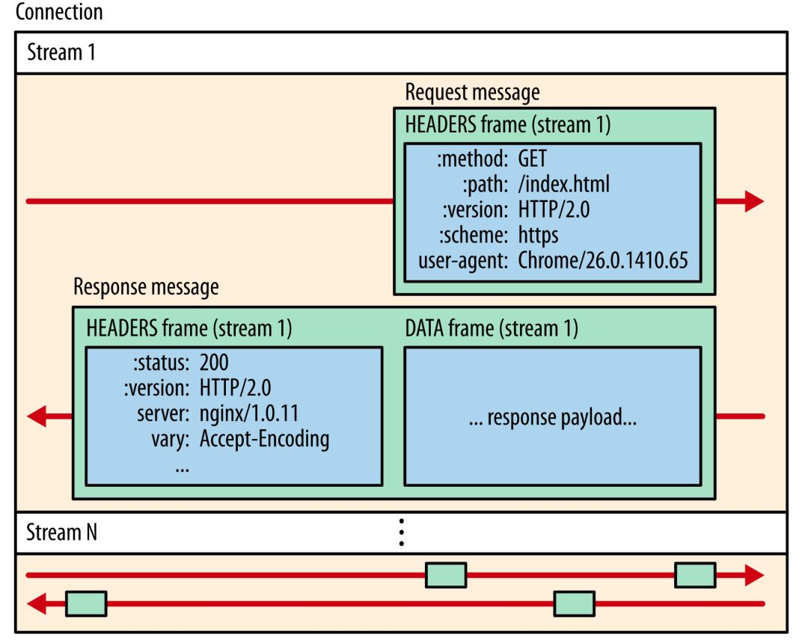

本文章来源于：<https://github.com/Zeb-D/my-review> ，请star 强力支持，你的支持，就是我的动力。

[TOC]

------

### 引子

有个业务方反馈说日志中偶尔出现 xorm 抛出来的“context deadline exceeded”的报错，想咨询下是什么原因。业务方实现的 gRPC Handler 大概代码如下：


```go
func (s Svc) BizHandler(ctx context.Context, r *projectv1.BizHandlerRequest) (*projectv1.BizHandlerResponse, error) {
  var bean dao.Bean
  // 查询某个记录
  if err := db.W().Find(ctx, &bean); err != nil {
    return nil, err
  }
  ...
}
```

目前业务方使用过的 xorm 是我们改造过的，函数签名中都添加了 ctx 参数，目的是为了接入 OpenTracing 做分布式追踪。


业务方反馈的这个“context deadline execcded”问题应该是出在查询 bean 的时候使用了带 timeout 的 ctx，如果这个 ctx 的 timeout 时间很短，有可能会在执行查询操作前就抛出“context deadline execcded”错误。


xorm 底层使用的标准包“database/sql”，最终执行查询的函数可能是“ctxDriverQuery”或“ctxDriverStmtQuery”这两个函数。以“ctxDriverQuery”为例：

```go
func ctxDriverQuery(ctx context.Context, queryerCtx driver.QueryerContext, queryer driver.Queryer, query string, nvdargs []driver.NamedValue) (driver.Rows, error) {
  ...
  select {
  default:
  // 若 ctx 超时或用户主动 cancel()，则抛出错误
  // 如果只因为 ctx 超时，此时错误就是 `context deadline execcded` 
  case <-ctx.Done():
    return nil, ctx.Err()
  }
  // 否则继续执行查询
  return queryer.Query(query, dargs)
}
```

可以看到如果“db.W().Find(ctx, &bean)”使用的 ctx 是设置了 timeout 的 ctx，那么是有可能在经过 xorm 的一些冗长的前置处理后，调用标准包的 “ctxDriver”系列函数时产生“context deadline execcded”错误。


这个很好理解，但是业务方声称并未在 gRPC Handler 中主动为 context 设置 timeout。那么这个带 timeout 的 context 到底怎么产生的呢？


### 谁构造的带 timeout 的 context？


业务方的 gRPC handler 中对传入的 ctx 明显未做 “context.WithTimeout()”处理，我们把目光投向客户端。业务方的 service graph 是这样：

```
sh
ServiceA -> ServiceB -> ServiceC -> xorm
```

当前反馈查询 xorm 报错的是 ServiceC，我们找到 ServiceB 看了下调用 ServiceC gRPC Handler 代码。**ServiceB 中 ctx 来自 ServiceA，ServiceB 中拿到 ctx 后，也并未设置 timeout。**


看来设置 timeout 的只可能是整个调用链发起方（即 ServiceA），通过 Review 代码我们发现 ServiceA 发起 RPC 调用时，确实传入了带 timeout 的 ctx：

```go
// InvokeServiceB 发起对 SerivceB 的 RPC 调用
func InvokeServiceB() {
...
  ctx,_ := context.WithTimeout(ctx, 3*time.Second) // 设置了 3 秒超时
  response, err := grpcClient.ServicebBiz(ctx, request) // 调用 ServiceB 的 RPC 时，使用的是上方定义的带 timeout 的 ctx
...
}
```


我们将 ServiceA 中发起 RPC 调用的 ctx 超时设置成 10 秒，再测试发现 ServiceC 反馈的“context deadline execcded”报错消失了。


### gRPC 超时如何做到跨进程传递？


我们测试发现，不仅是 Go gRPC 服务之间超时可以传递（如果你拿到上游的 ctx 继续往下透传的话）。**Go 和 Java 服务之间，超时也会随着调用链传递。**

**那么 gRPC 的超时是如何做到跨进程跨语言传递的？**


有朋友可能想到了 metadata，是否 gRPC 请求链上游设置了超时后，gRPC 框架底层将过期时间放在 metadata 里了？遗憾的是我们打印 metadata 后发现并未发现 timeout 字段踪迹。那么超时时间到底是怎样传递的呢？以 “grpc-go”源码为例，我们来找下线索。


我们知道 gRPC 基于 HTTP2，HTTP2 传输的最小单位是 Frame（帧）。HTTP2 的帧包含很多类型：“DATA Frame”、“HEADERS Frame”、“PRIORITY Frame”、“RST_STREAM Frame”、“CONTINUATON Frame”等。一个 HTTP2 请求/响应可以被拆成多个帧并行发送，每一帧都有一个 StreamID 来标记属于哪个 Stream。服务端收到 Frame 后，根据 StreamID 组装出原始请求数据。



对于 gRPC 而言，Data Frame 用来存放请求的 response payload；Headers Frame 可用来存放一些需要进行跨进程传递的数据，比如“grpc-status（RPC 请求状态码）”、“:path（RPC 完整路径）”等。那么超时时间是否也通过 HEADERS Frame 传递呢？


### 客户端设置 timeout

我们知道，用户定义好 protobuf 并通过 protoc 生成桩代码后，桩代码中已经包含了 gRPCCient 接口的实现，每一个在 protobuf 中定义的 RPC，底层都会通过 ClientConn. Invoke 向服务端发起调用：


比如对于这样的 protobuf：

```protobuf
syntax = "proto3";

package proto;

service DemoService {
  rpc SayHi(HiRequest) returns (HiResponse);
}

message HiRequest {
  string name = 1;
}

message HiResponse {
  string message = 1;
}
```

生成的桩代码中已经包含了 Client 实现：

```go
type DemoServiceClient interface {
  SayHiOK(ctx context.Context, in *HiRequest, opts ...grpc.CallOption) (*HiResponse, error)
}

type demoServiceClient struct {
  cc *grpc.ClientConn
}

func NewDemoServiceClient(cc *grpc.ClientConn) DemoServiceClient {
  return &demoServiceClient{cc}
}

func (c *demoServiceClient) SayHiOK(ctx context.Context, in *HiRequest, opts ...grpc.CallOption) (*HiResponse, error) {
  out := new(HiResponse)
  // 调用 grpc.ClientConn.Invoke() 函数，grpc.ClientConn.Invoke() 内部最终会调用 invoke() 函数
  err := c.cc.Invoke(ctx, "/proto.DemoService/SayHi", in, out, opts...)
  if err != nil {
    return nil, err
  }
  return out, nil
}
```

客户端发起 gRPC 请求时，最终会调用 invoke() 方法，invoke() 源码大概如下：

```go
func invoke(ctx context.Context, method string, req, reply interface{}, cc *ClientConn, opts ...CallOption) error {
  // 构造 clientStream
  cs, err := newClientStream(ctx, unaryStreamDesc, cc, method, opts...)
  if err != nil {
    return err
  }
  // 发送 RPC 请求
  if err := cs.SendMsg(req); err != nil {
    return err
  }
  return cs.RecvMsg(reply)
}
```

我们看下 newClientStream 源码，newClientStream 源码比较复杂，我们挑重点看：

```go
func newClientStream(ctx context.Context, desc *StreamDesc, cc *ClientConn, method string, opts ...CallOption) (_ ClientStream, err error) {
  ...
  // 等待 resolver 解析出可用地址
  if err := cc.waitForResolvedAddrs(ctx); err != nil {
    return nil, err
  }
  ...


  // 构造 *clientStream
  cs := &clientStream{
    callHdr:      callHdr,
    ctx:          ctx,
    ...
  }


  // 构造新的 *csAttempt，newAttemptLocked 内部会获取 grpc.ClientTransport 并赋值给 *csAttemp.t
  if err := cs.newAttemptLocked(sh, trInfo); err != nil {
    cs.finish(err)
    return nil, err
  }
  ...
  return cs, nil
}
```

其中 csAttempt.newStream 实现如下：

```go
type csAttempt struct {
  cs   *clientStream
  t    transport.ClientTransport // 客户端 Transport
  s    *transport.Stream         // 真正处理RPC 的 Stream
  ...
}

func (a *csAttempt) newStream() error {
  ...
  // 通过 Transport.NewStream 构造RPC Stream
  s, err := a.t.NewStream(cs.ctx, cs.callHdr)
  cs.attempt.s = s
  ...
  return nil
}
```

“transport.ClientTransport”是一个接口，gRPC 内部“internal/transport.http2Client”实现了此接口。

“http2Client.NewStream()”源码如下：

```go
func (t *http2Client) NewStream(ctx context.Context, callHdr *CallHdr) (_ *Stream, err error) {
  ctx = peer.NewContext(ctx, t.getPeer())
  headerFields, err := t.createHeaderFields(ctx, callHdr)
  ...
  hdr := &headerFrame{
    hf:        headerFields,
    endStream: false,
    ...
  }
  ...
  for {
    success, err := t.controlBuf.executeAndPut(func(it interface{}) bool {
      if !checkForStreamQuota(it) {
        return false
      }
      if !checkForHeaderListSize(it) {
        return false
      }
      return true
    }, hdr)
    ...
  return s, nil
}
```

“createHeaderFields”实现如下：

```go
func (t *http2Client) createHeaderFields(ctx context.Context, callHdr *CallHdr) ([]hpack.HeaderField, error) {
  ...
  // 如果透传过来的 ctx 被设置了 timeout/deadline，则在 HTTP2 headers frame 中添加 grpc-timeout 字段，
  // grpc-timeout 字段值被转化成 XhYmZs 字符串形式的超时时间
  if dl, ok := ctx.Deadline(); ok {
    timeout := time.Until(dl)
    headerFields = append(headerFields, hpack.HeaderField{Name: "grpc-timeout", Value: encodeTimeout(timeout)})
  }
  ...
  return headerFields, nil
}
```

可以看到客户端发起请求时，如果设置了带 timeout 的ctx，则会导致底层 HTTP2 HEADERS Frame 中追加“grpc-timeout”字段。

### 服务端解析 timeout

服务端通过“Serve”方法启动 grpc Server，监听来自客户端连接。

```go
func (s *Server) Serve(lis net.Listener) error {
  ...
  for {
    // 接收客户端的连接
    rawConn, err := lis.Accept()
    ...
    s.serveWG.Add(1)
    go func() {
      // 对每一个客户端的连接单独开一个协程来处理
      s.handleRawConn(rawConn)
      s.serveWG.Done()
    }()
  }
}
```

```go
func (s *Server) handleRawConn(rawConn net.Conn) {
  ...
  // 构造 HTTP2 Transport
  st := s.newHTTP2Transport(conn, authInfo)
  go func() {
    // 处理 HTTP2 Stream
    s.serveStreams(st)
    s.removeConn(st)
  }()
}


func (s *Server) serveStreams(st transport.ServerTransport) {
  defer st.Close()
  var wg sync.WaitGroup
  // http2Server 实现了 transport.ServerTransport 接口，此处会调用 http2Server.HandleSteams方法
  // st.HandleStreams 方法签名中第一个参数 handle func(stream *transport.Stream) {}为函数类型，
  // handle 随后会在 operateHeaders 中被调用
  st.HandleStreams(func(stream *transport.Stream) {
    wg.Add(1)
    go func() {
      defer wg.Done()
      // 解析出 gPRC Service, gRPC method, gRPC request message，执行注册到 gRPC.Server 中的 RPC 方法
      s.handleStream(st, stream, s.traceInfo(st, stream))
    }()
  }, ...)
  wg.Wait()
}
```

```go

// http2Server.HandleStreams 会调用传入的 handle 处理 HTTP2 Stream
func (t *http2Server) HandleStreams(handle func(*Stream), traceCtx func(context.Context, string) context.Context) {
  defer close(t.readerDone)
  for {
    t.controlBuf.throttle()
    frame, err := t.framer.fr.ReadFrame()
    ...
    switch frame := frame.(type) {
    // 如果是 Headers 帧，则调用 operateHeaders 方法处理 Headers
    case *http2.MetaHeadersFrame:
      if t.operateHeaders(frame, handle, traceCtx) {
        t.Close()
        break
      }
    // 如果是 Data 帧，则调用 handleData 方法处理
    case *http2.DataFrame:
      t.handleData(frame)
      ...
    }
  }
}


// operateHeaders 解析 Headers 帧
func (t *http2Server) operateHeaders(frame *http2.MetaHeadersFrame, handle func(*Stream), traceCtx func(context.Context, string) context.Context) (fatal bool) {
  // 从HTTP2 Headers 帧中获取 StreamID
  streamID := frame.Header().StreamID
  state := &decodeState{
    serverSide: true,
  }
  // 从HTTP2 Headers 帧中解析出Header。如果其中包含 grpc-timeout HEADER，
  // 则解析出其值并赋值给 state.data.timeout，并将 state.data.timeoutSet 设成 true
  if err := state.decodeHeader(frame); err != nil {
    if se, ok := status.FromError(err); ok {
      ...
  }


  buf := newRecvBuffer()
  // 构造 HTTP2 Stream
  s := &Stream{
    id:             streamID,
    st:             t,
    buf:            buf,
    fc:             &inFlow{limit: uint32(t.initialWindowSize)},
    recvCompress:   state.data.encoding,
    method:         state.data.method,
    contentSubtype: state.data.contentSubtype,
  }
  ...
  // 如果 state.data.timeoutSet 为 true，则构造一个新的带 timeout 的 ctx 覆盖原 s.ctx
  // s.ctx 最终会透传到用户实现的 gRPC Handler 中，参与业务逻辑处理
  // 见 server.go 中 processUnaryRPC 内:
  //    ctx := NewContextWithServerTransportStream(stream.Context(), stream)
  //    reply, appErr := md.Handler(srv.server, ctx, df, s.opts.unaryInt)
  // 此处不再赘述
  if state.data.timeoutSet {
    s.ctx, s.cancel = context.WithTimeout(t.ctx, state.data.timeout)
  } else {
    s.ctx, s.cancel = context.WithCancel(t.ctx)
  }
  ...
  t.controlBuf.put(&registerStream{
    streamID: s.id,
    wq:       s.wq,
  })
  // 调用 serveStreams 定义好的 handle，执行gRPC调用
  handle(s)
  return false
}
```

“decodeHeader”会遍历 frame 中所有 Fields，并调用“processHeaderField”对 HTTP2 HEADERS 帧中的特定的 Field 进行处理。


- 比如可以从“:path”中解析出包含 protobuf package、service name 和 RPC method name 的完整路径；
- 比如可以从“grpc-timeout” 中解析出上游传递过来的 timeout；


“decodeHeader”内部实现如下：

```go
func (d *decodeState) decodeHeader(frame *http2.MetaHeadersFrame) error {
  ...
  // 遍历Headers帧，解析Field
  for _, hf := range frame.Fields {
    d.processHeaderField(hf)
  }
}

func (d *decodeState) processHeaderField(f hpack.HeaderField) {
  switch f.Name {
    ...
    // 解析出 grpc-timeout
    case "grpc-timeout":
      d.data.timeoutSet = true
      var err error
      if d.data.timeout, err = decodeTimeout(f.Value); err != nil {
        d.data.grpcErr = status.Errorf(codes.Internal, "transport: malformed time-out: %v", err)
      }
    ...
    // 解析出 grpc 带 protobuf package path、Service name、RPC method name 的完整路径
    // 形如 /package.service/method
    case ":path":
      d.data.method = f.Value
  }
}
```

至此可以看到，gRPC 框架确实是通过 HTTP2 HEADERS Frame 中的 “grpc-timeout”字段来实现跨进程传递超时时间。


### 总结

- 客户端客户端发起 RPC 调用时传入了带 timeout 的 ctx
- gRPC 框架底层通过 HTTP2 协议发送 RPC 请求时，将 timeout 值写入到 “grpc-timeout” HEADERS Frame 中
- 服务端接收 RPC 请求时，gRPC 框架底层解析 HTTP2 HEADERS 帧，读取 “grpc-timeout”值，并覆盖透传到实际处理 RPC 请求的业务 gPRC Handle 中
- 如果此时服务端又发起对其他 gRPC 服务的调用，且使用的是透传的 ctx，这个 timeout 会减去在本进程中耗时，从而导致这个 timeout 传递到下一个 gRPC 服务端时变短，这样即实现了所谓的 `超时传递` 。目前这个功能测试发现在“grpc-go”和“grpc-java”中实现，“grpc-python”貌似暂未实现此功能（见 <https://github.com/grpc/grpc/issues/18358>）。