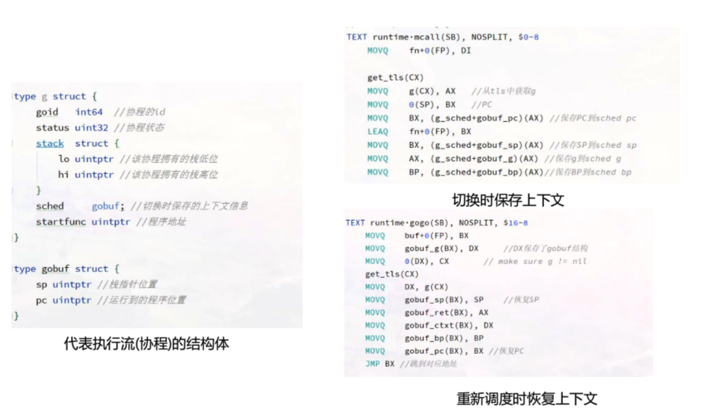
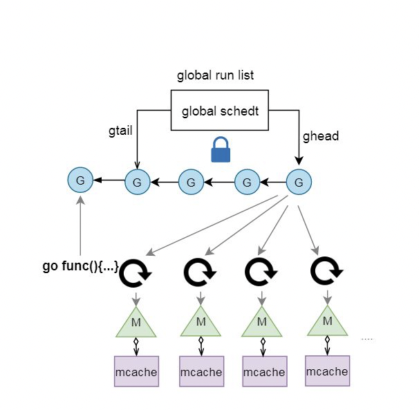

本文章来源于：<https://github.com/Zeb-D/my-review> ，请star 强力支持，你的支持，就是我的动力。

[TOC]

------

### 为什么去了解Runtime?

1. 解决疑难杂症&&优化
2.  好奇心
3. 技术深度的一种

运行时到底是个什么东西?

Go的调度为什么说是轻量的? Go调度都发生了啥? Go的网络和锁会不会阻塞线程? 什么时候会阻塞线程?

Go的对象在内存中是怎样的? Go的内存分配是怎样的? 栈的内存是怎么分配的?

GC是怎样的?
 GC怎么帮我们回收对象? Go的GC会不会漏掉对象或者回收还在用的对象?
 Go GC什么时候开始?
 Go GC啥时候结束?
 Go GC会不会太慢, 跟不上内存分配的速度?
 Go GC会不会暂停我们的应用? 暂停多久? 影不影响我的 请求?
 ....

### Golang Runtime简介

Golang Runtime是go语言运行所需要的基础设施.

1. 协程调度, 内存分配, GC;

2. 操作系统及CPU相关的操作的封装(信号处理, 系统调用, 寄存器操作, 原子操作等), CGO; 

3. pprof, trace, race检测的支持;
4. map, channel, string等内置类型及反射的实现.

1. 与Java, Python不同, Go并没有虚拟机的概念, Runtime也直接被编译 成native code.
2. Go的Runtime与用户代码一起打包在一个可执行文件中
3. 用户代码与Runtime代码在执行的时候并没有明显的界限, 都是函数调用
4. go对系统调用的指令进行了封装, 可不依赖于glibc
5. 一些go的关键字被编译器编译成runtime包下的函数.

| **关键字** | **函数**                                       |
| ---------- | ---------------------------------------------- |
| go         | newproc                                        |
| new        | newobject                                      |
| make       | makeslice, makechan, makemap, makemap_small... |
| <- ->      | gcStart                                        |
|            | chansend1, chanrecv1                           |
| 等等       |                                                |

### Runtime发展历程

| **版本** | **发布时间** | **改进特征**                                                 | **GC STW时间**         |
| -------- | ------------ | ------------------------------------------------------------ | ---------------------- |
| 1.0      | 2012/3       | 调度GM模型, GC STW                                           | 百ms级别-秒级          |
| 1.2      | 2013/5       | **调度G-P-M模型**                                            | 同上                   |
| 1.2      | 2013/12      | 实现合作式的抢占                                             | 同上                   |
| 1.3      | 2014/6       | GC实现Mark STW, Sweep 并行.栈扩容由split stack改为复制方式的continus stack. 添加sync.Pool | 百m-几百ms级别         |
| 1.4      | 2014/12      | Runtime移除大部分C代码; 实现准确式GC. 引入写屏障, 为1.5的并发GC做准备. | 同上                   |
| 1.5      | 2015/8       | Runtime完全移除C代码, 实现了Go的自举.  **GC 并发标记清除, 三色标记法**; GOMAXPROCS默认为CPU核数, go tool trace引入 | 10ms级别               |
| 1.6      | 2016/2       | 1.5中一些与并发GC不协调的地方更改. 集中式的GC协调协程, 改为状态机实现 | 5ms级别                |
| 1.7      | 2016/8       | GC时由mark栈收缩改为并发, 引入dense bitmap, SSA引入          | ms级                   |
| 1.8      | 2017/2       | **hybrid write barrier**, 消除re-scanning stack, **GC进入sub ms.** defer和cgo调用开销减少一半 | sub ms(18GB堆)         |
| 1.9      | 2017/8       | 保留用于debug的rescan stack代码移除, runtime.GC, debug.SetGCPercent, and debug.FreeOSMemory等触发STW GC改为并发GC | 基本同上               |
| 1.10     | 2018/2       | 不再限制最大GOMAXPROCS(Go 1.9为1024), LockOSThread的线程在运行的G结束后可以释放. | 基本同上               |
| 1.11     | 2018/8       | 连续的arena改为稀疏索引的方式                                | 基本同上               |
| 1.12     | 2019/2       | Mark Termination流程优化                                     | Sub ms, 但几乎减少一半 |

注: GC STW时间与堆大小, 机器性能, 应用分配偏好, 对象数量均有关. 较早的版本来自网络上的数据. 1.4- 1.9数据来源于twitter工程师. 这里是以较大的堆测试, 数据仅供参考. 普通应用的情况好于上述的数值.

### Golang调度简述

-   PMG模型, M:N调度模型.

-   调度在计算机中是分配工作所需资源的方法. linux的调度为CPU找到可运行的线程. 而Go的调度是为

  M(线程)找到P(内存, 执行票据)和可运行的G.

-   轻量级协程G, 栈初始2KB, 调度不涉及系统调用.

-   用户函数调用前会检查栈空间是否足够, 不够的话, 会进行栈扩容.

-   用户代码中的协程同步造成的阻塞, 仅仅是切换协程, 而不阻塞线程.

-   网络操作封装了epoll, 为NonBlocking模式, 未ready, 切换协程, 不阻塞线程.

-   每个p均有local runq, 大多数时间仅与local runq无锁交互. 实现work stealing.

-   用户协程无优先级, 基本遵循FIFO.

-   版本(1.12), go支持协作的抢占调度, 还不支持非协作的抢占调度.

#### Goroutine

Process -> Thread(LWP, lightweight process) -> Goroutine (一种lightweight userspace thread) 不断共享, 不断减少切换成本

**Go实现有栈协程**

代表协程这种执行流的结构体
 保护和恢复上下文的函数
 运行队列
 编译器将go关键字编译为生成一个协程结构体, 并放入运行队列 解决网络IO阻塞问题

协程级别的同步结构 调度: findrunnable ...

#### 协程结构体和切换函数

#### GM模型

一开始, 实现一个简单一点的, 一个全局队列放待运行的g.
 新生成G, 阻塞的G变为待运行, M寻找可运行的G等操作都在全局队列中 操作, 需要加线程级别的锁.

-   调度锁问题. 单一的全局调度锁(Sched.Lock)和集中的状态, 导致伸缩

  性下降.

-   G传递问题. 在工作线程M之间需要经常传递runnable的G, 会加大调

  度延迟, 并带来额外的性能损耗.

-   Per-M的内存问题. 类似TCMalloc结构的内存结构, 每个M都需要

  memory cache和其他类型的cache(比如stack alloc), 然而实际上只 有M在运行Go代码时才需要这些Per-M Cache, 阻塞在系统调用的M 并不需要这些cache. 正在运行Go代码的M与进行系统调用的M的比 例可能高达1:100, 这造成了很大的内存消耗.

是不是可以给运行的M加个本地队列? 

是不是可以剥夺阻塞的M的mcache给其他M使用?

#### GPM模型

Golang 1.1中调度为GPM模型. 通过引入逻辑Processer P来解决GM模型的几个问题.

- mcache从M中移到P中.
-   不再是单独的全局runq. 每个P拥有自己的runq. 新的g放入自己的runq. 满了后再批量放入全局runq中. 优先从自己的runq获取g执行
-   实现work stealing, 当某个P的runq中没有可运行G时, 可以从全局获取, 从其他P获取
-   当G因为网络或者锁切换, 那么G和M分离, M通过调度执行新的G
-   当M因为系统调用阻塞或cgo运行一段时间后, sysmon协程会将P与M分离. 由其他的M来结合P进行调度.

|             | **数据结构**                              | **数量**                                        | **意义**                |
| ----------- | ----------------------------------------- | ----------------------------------------------- | ----------------------- |
| G Goroutine | runtime.g 运行的函数指针, stack, 上下文等 | 每次都go func都代 表一个G, 无限制               | 代表一个用户 代码执行流 |
| P Processor | runtime.p per-P的cache, runq和free g等    | 默认为机器核数. 可通过 GOMAXPROCS环境 变量调整. | 表示执行所需 的资源     |
| M Machine   | runtime.m 对应一个由clone 创建的线程      | 比P多, 一般不会多太 多. 最大1万个               | 代表执行者, 底层线程    |

#### G状态流转

| **G状态**  | **值**  | **说明**                                                     |
| ---------- | ------- | ------------------------------------------------------------ |
| Gidle      | 0       | 刚刚被分配, 还没有初始化                                     |
| Grunnabel  | 1       | 表示在runqueue上, 还没有被运行                               |
| Grunning   | 2       | go协程可能在执行go代码, 不在runqueue上, 与M, P已绑定         |
| Gsyscall   | 3       | go协程在执行系统调用, 没执行go代码, 没有在runqueue上, 只与M绑定 |
| Gwaiting   | 4       | go协程被阻塞(IO, GC, chan阻塞, 锁等). 不在runqueue上, 但是一定在某个地 方, 比如channel中, 锁排队中等. |
| Gdead      | 6       | 协程现在没有在使用, 也许执行完, 或者在free list中, 或者正在被初始化. 可能 有stack或者没有 |
| Gcopystack | 8       | 栈正在复制, 此时没有go代码, 也不在runqueue上                 |
| Gscan      | 0x10 00 | 与runnable, running, syscall, waiting等状态结合, 表示GC正在扫描这个G的 栈 |
|            |         |                                                              |

#### 调度

golang调度的职责就是为需要执行的Go代码(G)寻找执行者(M)以及执行的准许和资源(P).

并没有一个调度器的实体, 调度是需要发生调度时由m执行runtime.schedule方法进行的.

调度时机:
  channel, mutex等sync操作发生了协程阻塞  time.sleep
  网络操作暂时未ready
  gc
  主动yield
  运行过久或系统调用过久
  等等

**调度流程:**

实际调度代码复杂很多.

如果有分配到gc mark的工作需要做gc mark. local runq有就运行local的, 没有再看全局的runq是否有, 再看能否从net中poll出来,

从其他P steal一部分过来. ....
 实在没有就stopm

#### sysmon协程

P的数量影响了同时运行go代码的协程数. 如果P被占用很久, 就会影响调度. sysmon协程的一个功能就是进行抢占.

sysmon协程是在go runtime初始化之后, 执行用户编写的代码之前, 由runtime启动的不与任何P绑定, 直接由一个M执行的协程. 类似于 linux中的执行一些系统任务的内核线程.
 可认为是10ms执行一次. (初始运行间隔为20us, sysmon运行1ms后逐渐翻倍, 最终每10ms运行一次. 如果有发生过抢占成功, 则又恢复成 初始20us的运行间隔, 如此循环)

- 每sysmon tick进行一次netpoll(在STW结束,和M执 行查找可运行的G时也会执行netpoll)获取fd事件, 将 与之相关的G放入全局runqueue
-   每次sysmon运行都执行一次抢占, 如果某个P的G执 行超过1个sysmon tick, 则执行抢占. 正在执行系统调 用的话, 将P与M脱离(handoffp); 正在执行Go代码, 则通知抢占(preemptone).
-   每2分钟如果没有执行过GC, 则通知gchelper协程执 行一次GC
-   如果开启schdule trace的debug信息(例如 GODEBUG=schedtrace=5000,scheddetail=1), 则 按照给定的间隔打印调度信息
-   每5分钟归还GC后不再使用的span给操作系统 (scavenge)

#### 协作式抢占

retake()调用preemptone()将被抢占的G的stackguard0设为stackPreempt, 被设置抢占标记的G进行下一次函数调用时, 检查栈空间失败. 进而触发morestack()(汇编代码，位于 asm_XXX.s中)然后进行一连串的函数调用，主要的调用过程如下:

morestack()(汇编代码)-> newstack() -> gopreempt_m() -> goschedImpl() -> schedule()

#### 网络

JavaScript网络操作是异步非阻塞的, 通过事件循环, 回调对应的函数. 一些状态机模式的框架, 每次网络操作都有一个新的状态. 代码执行流被打散.

用户态的协程: 结合 epoll, nonblock模式的fd操作; 网络操作未ready时的切换协程和ready后把相关协程添加到待运行队列. 网络操作达到既不阻 塞线程, 又是同步执行流的效果.

1. 封装epoll, 有网络操作时会epollcreate一个epfd.

2. 所有网络fd均通过fcntl设置为NONBLOCK模式, 以边

   缘触发模式放入epoll节点中.

3. 对网络fd执行Accept(syscall.accept4),

   Read(syscall.read), Write(syscall.write)操作时, 相关 操作未ready, 则系统调用会立即返回EAGAIN; 使用 gopark切换该协程

4. 在不同的时机, 通过epollwait来获取ready的 epollevents, 通过其中data指针可获取对应的g, 将其 置为待运行状态, 添加到runq

#### 调度相关结构体

#### 调度综合

- 轻量级的协程, 栈初始2KB, 调度不涉及系统调用.

-   调度在计算机中是分配工作所需资源的方法. linux的调度为CPU找到可运行的线程. 而Go的调度是为M(线程)找到P(内存, 执行

  票据)和可运行的G.

-   用户函数调用前会检查栈空间是否足够, 不够的话, 会进行*2 栈扩容. 最大栈1G, 超出panic.

-   用户代码中的协程同步造成的阻塞, 仅仅是切换(gopark)协程, 而不阻塞线程, m和p仍结合, 去寻找新的可执行的g.

-   每个P均有local runq, 大多数时间仅与local runq无锁交互. 新生成的g, 放入到local runq中.

-   调度时会随机从全局runq取g. 然后local runq, global runq... 均没有g的话, work stealing从其他P中取.

-   sysmon: 对于运行过久的g设置抢占标识; 对于过久syscall的p, 进行m和p的分离. 防止p被占用过久影响调度.

-   封装了epoll, 网络fd会设置成NonBlocking模式, 网络fd的read, write, accept操作, 会以NonBlocking模式操作, 返回

  EAGAIN则gopark当前协程. 在m调度, sysmon中, gc start the world等阶段均会poll出ready的协程进行运行或者添加到全

  局runq中

-   版本(1.12), go还不支持非协作的抢占调度, 在密集CPU运算时, 可能会导致调度延迟. 官方已在解决.

#### 未涉及的点

 G状态流转
  具体调度流程
  栈扩容
  合作式抢占
  sysmon
  P状态流转
  M的spin与unspin  LockOSThread
 等

### 内存

#### golang内存分配简介

- 类似于TCMalloc的结构

-   使用span机制来减少碎片. 每个span至少为一个页(go中的一个page为8KB). 每一种span用于一个范围的内存分配需求. 比

  如16-32byte使用分配32byte的span, 112-128使用分配128byte的span.

-   一共有67个size范围, 8byte-32KB, 每个size有两种类型(scan和noscan, 表示分配的对象是否会包含指针)

-   多层次Cache来减少分配的冲突. per-P无锁的mcache, 全局67*2个对应不同size的span的后备mcentral, 全局1个的mheap.

-   mheap中以treap的结构维护空闲连续page. 归还内存到heap时, 连续地址会进行合并.

-   stack分配也是多层次和多class的.

-   对象由GC进行回收. sysmon会定时把空余的内存归还给操作系统

#### golang内存结构

**1.10及以前**

以下内存并不是初始化时就分配虚拟内存的:

arena的大小为512G, 为了方便管理把arena区域划分成一个个的page, 每个page 8KB, 一共有512GB/8KB个页

spans区域存放指向span的指针, 表示arean中对应的Page所属的span, 所以span区域的大小为(512GB/8KB)*指针大小8byte = 512M

bitmap主要用于GC, 用两个bit表示 arena中一个字的可用状态, 所以是 (512G/8个字节一个字)*2/8个bit每个字节=16G

**1.11及以后:**

改成了两阶稀疏索引的方式. 内存可以超过512G, 也可以允许不连续的内 存.
 mheap中的areans字段是一个指针数组, 每个heapArena管理64M的内 存.

bitmap和spans和上面的功能一致.

#### mspan

使用span机制来减少碎片. 每个span至少分配1个page(8KB), 划分成固定大小的slot, 用于分配一定大小范围的内存需求.

runtime/sizeclasses.go

