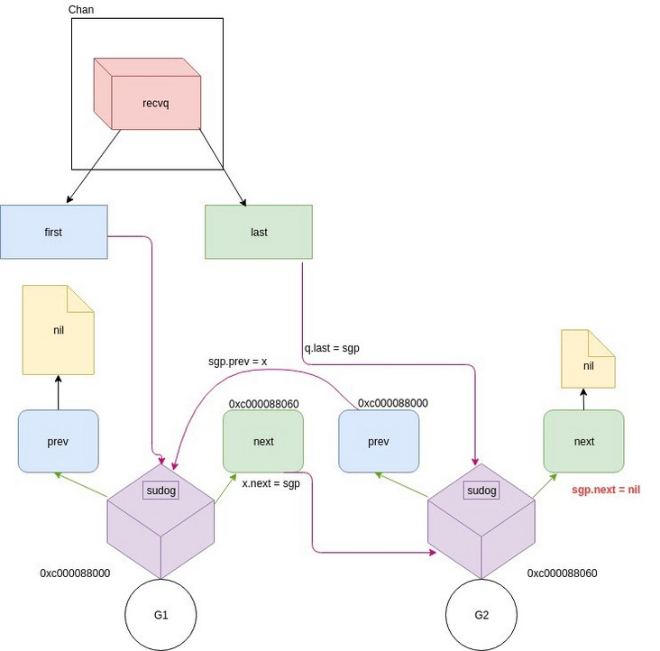
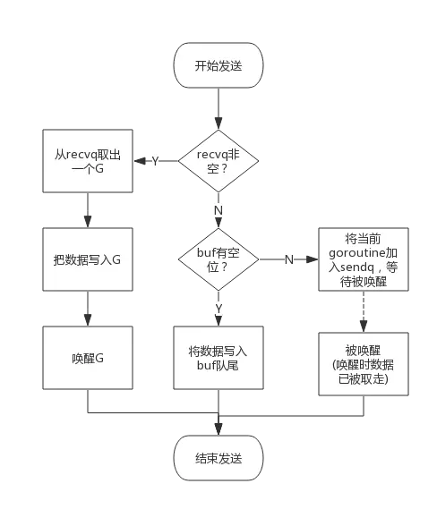
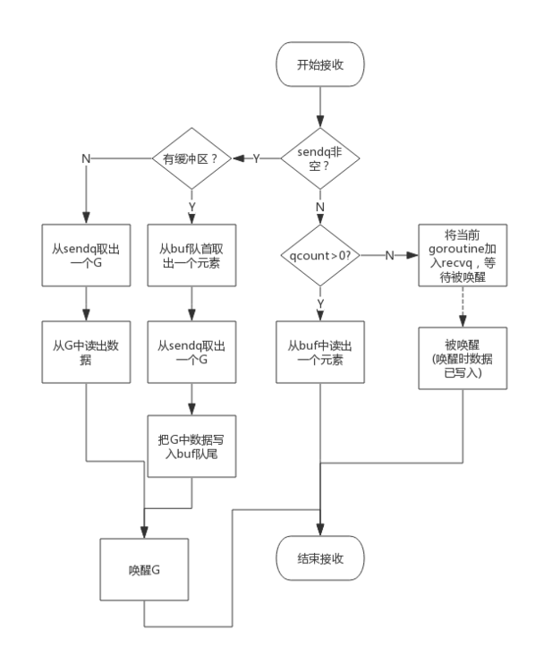

本文章来源于：<https://github.com/Zeb-D/my-review> ，请star 强力支持，你的支持，就是我的动力。

[TOC]

------

> 本文会尝试解释 go runtime 中 channel 和 select 的具体实现，部分内容来自 gophercon2017。Go版本为1.8.3

## 1. 结构概览

### 1.1. hchan

这个就是channel的结构体了

```go
type hchan struct {
   qcount   uint           // 队列中数据总量
   dataqsiz uint           // 环形队列的大小，> 0表示有缓冲，= 0表示无缓冲
   buf      unsafe.Pointer // 指向元素数组的指针
   elemsize uint16         // 单个元素的大小
   closed   uint32         // 表明是否close了
   elemtype *_type                  // 元素类型，后面写interface的时候再具体介绍
   sendx    uint                    // send数组的索引, c <- i
   recvx    uint                    // receive 数组的索引 <- c
   recvq    waitq                   // 等待recv 数据的goroutine的链表
   sendq    waitq                   // 等待send数据的goroutine链表
   lock mutex
}
```

### 1.2. waitq

```go
type waitq struct {
   first *sudog
   last  *sudog
}
```

### 1.3. sudog

sudog 代表了一个在等待中的g

```go
type sudog struct {
   g *g

   // isSelect indicates g is participating in a select, so
   // g.selectDone must be CAS'd to win the wake-up race.
   isSelect bool
   next     *sudog
   prev     *sudog
   elem     unsafe.Pointer // 数据元素， c <- 1, 此时就是 1

   // The following fields are never accessed concurrently.
   // For channels, waitlink is only accessed by g.
   // For semaphores, all fields (including the ones above)
   // are only accessed when holding a semaRoot lock.

   acquiretime int64
   releasetime int64
   ticket      uint32
   parent      *sudog // semaRoot binary tree
   waitlink    *sudog // g.waiting list or semaRoot
   waittail    *sudog // semaRoot
   c           *hchan // channel
}
```

### 1.4. hcase

这个是 select 中一个case生成的结构体

```go
type scase struct {
   c           *hchan         // chan
   elem        unsafe.Pointer // data element
   kind        uint16  // 当前case的类型，nil recv send 还是 default
   pc          uintptr // race pc (for race detector / msan)
   releasetime int64
}
```

通过上面的结构，我们可以看出，channel的内部实质就是一个缓冲池+两个队列（send recv）;

 那么channel 的send recv流程

1. 如果是recv（<-channel ）请求，则先去判断一个sendq队列里有没有人等待这放数据
   1. 如果sendq队列不为空且缓冲池不为空，那么这个sendq队列是在等待着放数据，recv的这个g从缓冲池拿数据，然后把sendq的第一个g携带的数据放入到buf缓冲池里面即可
   2. 如果sendq不为空但是缓冲池为空，那么这个是不带缓冲池的chan，我从sendq里面拿第一个g的数据就ok了
   3. 如果sendq为空，那就去缓冲池看看，缓冲池有数据，那就拿了就走了
   4. 如果sendq为空，缓冲池也没有数据，那就在这等着吧
2. 如果send，流程跟recv是一样的
3. 如果此时 channel 被close了，唤醒所有等待的队列 （sendq 或 recvq）里面的等待的g，告诉他们channel.close = true

## 2. 源码分析

### 2.1. 收发

#### 2.1.1. main

我们使用 go tool 工具分析一下，channel 生成， c <- i， <- c 在底层都是通过什么方法实现的

```go
func main() {
    c1 := make(chan int)
    c2 := make(chan int, 2)
    go func() {
        c1 <- 1
        c2 <- 2
    }()
    <-c1
    <-c2
    close(c1)
    close(c2)
}
```

> go build -gcflags=all="-N -l" main.go
>
> go tool objdump -s "main.main" main

我们把 CALL 过滤出来后

```go
▶ go tool objdump -s "main\.main" main | grep CALL
  main.go:4             0x4548d5                e806fbfaff              CALL runtime.makechan(SB)               
  main.go:5             0x4548f8                e8e3fafaff              CALL runtime.makechan(SB)               
  main.go:6             0x454929                e822a1fdff              CALL runtime.newproc(SB)                
  main.go:10            0x454940                e81b08fbff              CALL runtime.chanrecv1(SB)              
  main.go:11            0x454957                e80408fbff              CALL runtime.chanrecv1(SB)              
  main.go:12            0x454965                e82605fbff              CALL runtime.closechan(SB)              
  main.go:13            0x454973                e81805fbff              CALL runtime.closechan(SB)              
  main.go:3             0x454982                e8d981ffff              CALL runtime.morestack_noctxt(SB)       
  main.go:7             0x454a32                e899fcfaff              CALL runtime.chansend1(SB)              
  main.go:8             0x454a4c                e87ffcfaff              CALL runtime.chansend1(SB)              
  main.go:6             0x454a5b                e80081ffff              CALL runtime.morestack_noctxt(SB) 
```

- makechan: 创建channel的函数，有无缓冲区的都是一样的
- chanrecv1: <- c1 时，调用的函数
- closechan: close(c1) 时调用的函数，关闭channel使用
- chansend1: c1 <- 1 时，也就是发送数据用到的函数

#### 2.1.2. makechan

创建channel这一块主要就是给结构体和bug缓冲池分配内存，然后初始化一下hchan的结构体

```go
func makechan(t *chantype, size int) *hchan {
    elem := t.elem

    // compiler checks this but be safe.
    // 校验elem的大小限制
    if elem.size >= 1<<16 {
        throw("makechan: invalid channel element type")
    }
    // 对齐限制
    if hchanSize%maxAlign != 0 || elem.align > maxAlign {
        throw("makechan: bad alignment")
    }
    // size，即make(chan int, 2)中的2，默认不传为0， 判断size的上限和下限
    if size < 0 || uintptr(size) > maxSliceCap(elem.size) || uintptr(size)*elem.size > maxAlloc-hchanSize {
        panic(plainError("makechan: size out of range"))
    }

    var c *hchan
    switch {
    case size == 0 || elem.size == 0:
        // 队列或者元素size为0，不分配缓冲池
        // Queue or element size is zero.
        c = (*hchan)(mallocgc(hchanSize, nil, true))
        // Race detector uses this location for synchronization.
        // buf指向自身，没有分配内存
        c.buf = c.raceaddr()
    case elem.kind&kindNoPointers != 0:
        // Elements do not contain pointers.
        // Allocate hchan and buf in one call.
        // 分配一整块内存，用于存储hchan和 buf
        c = (*hchan)(mallocgc(hchanSize+uintptr(size)*elem.size, nil, true))
        c.buf = add(unsafe.Pointer(c), hchanSize)
    default:
        // Elements contain pointers.
        // 是指针类型，那正常分配hchan结构体即可，buf单独分配
        c = new(hchan)
        c.buf = mallocgc(uintptr(size)*elem.size, elem, true)
    }
    // 初始化 hchan的属性
    c.elemsize = uint16(elem.size)
    c.elemtype = elem
    c.dataqsiz = uint(size)

    return c
}
```

#### 2.1.3. chanrecv1

`chanrecv1` 调用了`chanrecv` 实现，`chanrecv` 监听channel并接收 channel里面的数据，并写入到 ep 里面

```go
func chanrecv1(c *hchan, elem unsafe.Pointer) {
    chanrecv(c, elem, true)
}

func chanrecv(c *hchan, ep unsafe.Pointer, block bool) (selected, received bool) {
    lock(&c.lock)
    if c.closed != 0 && c.qcount == 0 {
        unlock(&c.lock)
        if ep != nil {
            // 清空地址里面的数据值，但不会改变类型
            typedmemclr(c.elemtype, ep)
        }
        return true, false
    }

    if sg := c.sendq.dequeue(); sg != nil {
        // 获取一个等待send的sudog，然后判断channel是否有缓冲区，如果有无缓冲区，获取sudog里面的数据即可， 如果channel有缓冲区，则获取缓冲区的头元素，把获取到的sudog的元素添加到缓冲区的队尾
        recv(c, sg, ep, func() { unlock(&c.lock) }, 3)
        return true, true
    }

    if c.qcount > 0 {
        // Receive directly from queue
        // 缓冲区有数据，且send队列没有等待发送数据的sudog，（异步且缓冲区刚满或未满的情况），根据recvx索引，获取数据
        qp := chanbuf(c, c.recvx)
        // 如果ep不为nil，拷贝 gp 到 ep
        if ep != nil {
            typedmemmove(c.elemtype, ep, qp)
        }
        // gp地址里的数据清除
        typedmemclr(c.elemtype, qp)
        // 更新下一次recv的索引
        c.recvx++
        if c.recvx == c.dataqsiz {
            c.recvx = 0
        }
        // 更新 qcount计数
        c.qcount--
        unlock(&c.lock)
        return true, true
    }

    if !block {
        unlock(&c.lock)
        return false, false
    }

    // no sender available: block on this channel.
    // 找不到send 的sudog，缓冲区也没有数据，需要阻塞
    gp := getg()
    // 获取一个sudog的结构，并更新这个sudog的属性
    mysg := acquireSudog()
    mysg.releasetime = 0
    // No stack splits between assigning elem and enqueuing mysg
    // on gp.waiting where copystack can find it.
    mysg.elem = ep
    mysg.waitlink = nil
    gp.waiting = mysg
    mysg.g = gp
    mysg.isSelect = false
    mysg.c = c
    gp.param = nil
    // 把这个sudog放入到recv的队列
    c.recvq.enqueue(mysg)
    // 休眠这个g，当g被唤醒后，从这里继续执行
    goparkunlock(&c.lock, waitReasonChanReceive, traceEvGoBlockRecv, 3)

    // someone woke us up
    if mysg != gp.waiting {
        throw("G waiting list is corrupted")
    }
    gp.waiting = nil
    if mysg.releasetime > 0 {
        blockevent(mysg.releasetime-t0, 2)
    }
    closed := gp.param == nil
    gp.param = nil
    mysg.c = nil
    // 清理完sudog的属性后，把sudog释放
    releaseSudog(mysg)
    return true, !closed
}
```

通过上面的逻辑，可以看出来数据传输的四种可能

- sendq队列不为空，但是buf为空（同步有阻塞g的情况）: 获取sendq队列头的sudog，并把sudog.elem数据拷贝目标地址 ep
- sendq队列不为空，buf也不为空（异步有阻塞g的情况）：把buf头元素拷贝到目标地址ep， 获取sendq队列头的sudog，然后把sudog.elem的数据拷贝到buf队尾，释放sudog
- sendq队列为空，但是buf不为空（异步无阻塞g的情况）：把buf头元素拷贝到目标地址ep即可
- sendq队列为空，buf也为空（同步无阻塞g的情况）：这时候就需要就需要阻塞自身，获取一个sudog的结构，放到channel的recvq队列里，等待send的g来唤醒自己，并把自己的数据拷贝到目标地址

这里细想一下，其实会发现一个问题，在上面L66 `goparkunlock(&c.lock, waitReasonChanReceive, traceEvGoBlockRecv, 3)` 休眠g后，g被唤醒后从这里开始继续往下执行，好像没有什么逻辑显示，这个recv g获取到了数据，这个g阻塞在这里是为了等数据来的，但是下面的逻辑，竟然没有一个是操作数据的？

接下来分析的 `recv` 这个方法就能理解了

##### 2.1.3.1. recv

```go
func recv(c *hchan, sg *sudog, ep unsafe.Pointer, unlockf func(), skip int) {
    // 如果是无缓冲区的channel
    if c.dataqsiz == 0 {
        if ep != nil {
            // copy data from sender
            // 直接在两个g之间进行数据拷贝
            recvDirect(c.elemtype, sg, ep)
        }
    } else {
        // 这里是有缓冲区才会走到的逻辑
        // Queue is full. Take the item at the
        // head of the queue. Make the sender enqueue
        // its item at the tail of the queue. Since the
        // queue is full, those are both the same slot.
        // 因为在sendq队列获取到了等待发送数据的sudog，所以说明缓冲区已经满了，根据rcvx获取buf里面队列首元素的地址
        qp := chanbuf(c, c.recvx)
        // copy data from queue to receiver
        if ep != nil {
            // 把buf里面的数据拷贝到ep里面
            typedmemmove(c.elemtype, ep, qp)
        }
        // copy data from sender to queue
        // 把从sendq队列获取到的sudog的数据拷贝到刚刚的buf地址里面，并更新buf里面recvx的索引，也就是表名，buf队列的首元素地址后移
        typedmemmove(c.elemtype, qp, sg.elem)
        c.recvx++
        if c.recvx == c.dataqsiz {
            c.recvx = 0
        }
        c.sendx = c.recvx // c.sendx = (c.sendx+1) % c.dataqsiz
    }
    // 清空sudog的数据
    sg.elem = nil
    gp := sg.g
    unlockf()
    gp.param = unsafe.Pointer(sg)
    if sg.releasetime != 0 {
        sg.releasetime = cputicks()
    }
    // 唤醒sendq里面获取的sugog对应的g
    goready(gp, skip+1)
}
```

结合上面的逻辑就发现，g在被唤醒之前，跟g相关的sudog的数据就已经被channel使用掉了，所以当g被唤醒时，无需处理跟数据传输相关的逻辑了

##### 2.1.3.2. acquireSudog

获取一个sudog的结构，这里跟cache和scheduler调度待运行g的队列一样，使用了 p sched 的两级缓存，也就是本地缓存一个sudog的数组，同时在全局的 sched结构上面也维护了一个sudogcache的链表，当p本地的sudog不足或者过多的时候，就去跟全局的sched 进行平衡

```go
func acquireSudog() *sudog {
    // 加锁
    mp := acquirem()
    pp := mp.p.ptr()
    // 如果当前缓存的没有sudog了，则去全局的sched中批量拉取一些sudog缓存到当前p
    if len(pp.sudogcache) == 0 {
        lock(&sched.sudoglock)
        // First, try to grab a batch from central cache.
        for len(pp.sudogcache) < cap(pp.sudogcache)/2 && sched.sudogcache != nil {
            s := sched.sudogcache
            sched.sudogcache = s.next
            s.next = nil
            pp.sudogcache = append(pp.sudogcache, s)
        }
        unlock(&sched.sudoglock)
        // If the central cache is empty, allocate a new one.
        if len(pp.sudogcache) == 0 {
            pp.sudogcache = append(pp.sudogcache, new(sudog))
        }
    }
    // 从本地缓存的sudog里面，获取第一个返回，并更新sudogcache slice
    n := len(pp.sudogcache)
    s := pp.sudogcache[n-1]
    pp.sudogcache[n-1] = nil
    pp.sudogcache = pp.sudogcache[:n-1]
    if s.elem != nil {
        throw("acquireSudog: found s.elem != nil in cache")
    }
    // 去锁
    releasem(mp)
    return s
}
```

##### 2.1.3.3. releaseSudog

`releaseSudog` 就是释放当前使用的sudog，并平衡p本地缓存的sudog和全局队列的sudog

```go
func releaseSudog(s *sudog) {
    mp := acquirem() // avoid rescheduling to another P
    pp := mp.p.ptr()
    // 如果 p本地缓存的sudog的数量超出这个slice的最大长度，则平衡一般的sudog到全局的sched上面
    if len(pp.sudogcache) == cap(pp.sudogcache) {
        // Transfer half of local cache to the central cache.
        var first, last *sudog
        for len(pp.sudogcache) > cap(pp.sudogcache)/2 {
            n := len(pp.sudogcache)
            p := pp.sudogcache[n-1]
            pp.sudogcache[n-1] = nil
            pp.sudogcache = pp.sudogcache[:n-1]
            if first == nil {
                first = p
            } else {
                last.next = p
            }
            last = p
        }
        lock(&sched.sudoglock)
        last.next = sched.sudogcache
        sched.sudogcache = first
        unlock(&sched.sudoglock)
    }
    // 把释放的sudog放到本地缓存的slice里面
    pp.sudogcache = append(pp.sudogcache, s)
    releasem(mp)
}
```

#### 2.1.4. chansend1

发送逻辑跟接收的逻辑差不多

```go
func chansend1(c *hchan, elem unsafe.Pointer) {
    chansend(c, elem, true, getcallerpc())
}

func chansend(c *hchan, ep unsafe.Pointer, block bool, callerpc uintptr) bool {
    lock(&c.lock)
    // 从recvq队列获取一个 sudog
    if sg := c.recvq.dequeue(); sg != nil {
        // Found a waiting receiver. We pass the value we want to send
        // directly to the receiver, bypassing the channel buffer (if any).
        send(c, sg, ep, func() { unlock(&c.lock) }, 3)
        return true
    }
    // 如果qcount < dataqsiz，说明这个channel是带buf的channel，而且buf没有满，直接把数据ep添加到buf队尾即可
    if c.qcount < c.dataqsiz {
        // Space is available in the channel buffer. Enqueue the element to send.
        qp := chanbuf(c, c.sendx)
        typedmemmove(c.elemtype, qp, ep)
        c.sendx++
        if c.sendx == c.dataqsiz {
            c.sendx = 0
        }
        // 更新qcount
        c.qcount++
        unlock(&c.lock)
        return true
    }

    if !block {
        unlock(&c.lock)
        return false
    }

    // Block on the channel. Some receiver will complete our operation for us.
    // 走到这里说明，buf满了或者没有buf，而且recvq队列为空，就需要阻塞当前的g，等待有其他的g接收数据
    gp := getg()
    // 获取一个sudog，并初始化相关属性
    mysg := acquireSudog()
    mysg.releasetime = 0
    if t0 != 0 {
        mysg.releasetime = -1
    }
    // No stack splits between assigning elem and enqueuing mysg
    // on gp.waiting where copystack can find it.
    mysg.elem = ep
    mysg.waitlink = nil
    mysg.g = gp
    mysg.isSelect = false
    mysg.c = c
    gp.waiting = mysg
    gp.param = nil
    // 把sudog入队sendq
    c.sendq.enqueue(mysg)
    // 休眠当前g，等待其他的g recv数据，recv数据后，唤醒这个g
    goparkunlock(&c.lock, waitReasonChanSend, traceEvGoBlockSend, 3)

    // someone woke us up.
    if mysg != gp.waiting {
        throw("G waiting list is corrupted")
    }
    gp.waiting = nil
    if gp.param == nil {
        if c.closed == 0 {
            throw("chansend: spurious wakeup")
        }
        panic(plainError("send on closed channel"))
    }
    gp.param = nil
    if mysg.releasetime > 0 {
        blockevent(mysg.releasetime-t0, 2)
    }
    mysg.c = nil
    // 释放sudog
    releaseSudog(mysg)
    return true
}
```

##### 2.1.4.1. send

`send` 跟 `recv` 的逻辑也是大致相同的，而且因为从recvq里面拿到了一个sudog，所以说明缓冲区为空，那么`send`方法就不需要考虑往缓冲区添加数据了，`send`比`recv`更加简单，只需要交换数据、唤醒g即可

```go
func send(c *hchan, sg *sudog, ep unsafe.Pointer, unlockf func(), skip int) {
    if sg.elem != nil {
        sendDirect(c.elemtype, sg, ep)
        sg.elem = nil
    }
    gp := sg.g
    unlockf()
    gp.param = unsafe.Pointer(sg)
    if sg.releasetime != 0 {
        sg.releasetime = cputicks()
    }
    goready(gp, skip+1)
}
```

#### 2.1.5. closechan

收发数据已经结束了，最后就是关闭channel了

```go
func closechan(c *hchan) {
    // nil chan 检查
    if c == nil {
        panic(plainError("close of nil channel"))
    }

    lock(&c.lock)
    // closed chan 检查
    if c.closed != 0 {
        unlock(&c.lock)
        panic(plainError("close of closed channel"))
    }
    // 设置c为closed状态
    c.closed = 1

    var glist *g

    // release all readers
    // 遍历 recvq，清除sudog的数据，并把recvq中sudog对应的g串成一个链表
    for {
        sg := c.recvq.dequeue()
        if sg == nil {
            break
        }
        if sg.elem != nil {
            typedmemclr(c.elemtype, sg.elem)
            sg.elem = nil
        }
        if sg.releasetime != 0 {
            sg.releasetime = cputicks()
        }
        gp := sg.g
        gp.param = nil
        gp.schedlink.set(glist)
        glist = gp
    }

    // release all writers (they will panic)
    // 遍历sendq，清除sudog的数据，并把sendq中的sudog中的g和recvq中的sudog一起串成一个链表
    for {
        sg := c.sendq.dequeue()
        if sg == nil {
            break
        }
        sg.elem = nil
        if sg.releasetime != 0 {
            sg.releasetime = cputicks()
        }
        gp := sg.g
        gp.param = nil
        if raceenabled {
            raceacquireg(gp, c.raceaddr())
        }
        gp.schedlink.set(glist)
        glist = gp
    }
    unlock(&c.lock)

    // Ready all Gs now that we've dropped the channel lock.
    // 唤醒上面收集的所有的g
    for glist != nil {
        gp := glist
        glist = glist.schedlink.ptr()
        gp.schedlink = 0
        goready(gp, 3)
    }
}
```

chan close之后，所有阻塞的recvq 和 sendq（recvq和sendq只有有一个队列存在）中的sudog，清除sudog的一些数据和状态，设置 `gp.param = nil`， 让上层逻辑知道这是因为 close chan导致的

唤醒所有的g之后，g就会 继续执行 `chansend` 或者 `chanrecv` 中剩余的逻辑，也就是释放sudog（这也就是为什么 closechan 不需要释放sudog的原因）


#### 2.1.6 recvq和sendq 结构

recvq和sendq基本上是链表，看起来基本如下



#### 2.1.7. 小结

语言的表述总是苍白的，在网上找资料的时候正好看到了两张流程图，可以结合着来看

发送流程（send）



发送操作概要

1、锁定整个通道结构。

2、确定写入。尝试`recvq`从等待队列中等待goroutine，然后将元素直接写入goroutine。

3、如果recvq为Empty，则确定缓冲区是否可用。如果可用，从当前goroutine复制数据到缓冲区。

4、如果缓冲区已满，**则要**写入的元素将保存在当前正在执行的goroutine的结构中，并且当前goroutine将在**sendq中**排队并从运行时挂起。


接收流程（recv）



读取操作概要：

1、先获取channel全局锁

2、尝试sendq从等待队列中获取等待的goroutine，

3、 如有等待的goroutine，没有缓冲区，取出goroutine并读取数据，然后唤醒这个goroutine，结束读取释放锁。

4、如有等待的goroutine，且有缓冲区（此时缓冲区已满），从缓冲区队首取出数据，再从sendq取出一个goroutine，将goroutine中的数据存入buf队尾，结束读取释放锁。

5、如没有等待的goroutine，且缓冲区有数据，直接读取缓冲区数据，结束读取释放锁。

6、如没有等待的goroutine，且没有缓冲区或缓冲区为空，将当前的goroutine加入**recvq**排队，进入睡眠，等待被写goroutine唤醒。结束读取释放锁。


### 2.2. select

#### 2.2.1. main

channel的收发流程在上面已经追踪了，流程也已经清晰了，但是跟channel一起使用的还有一个select，那select的流程又是什么呢

我们还是用go tool工具分析一下

```go
func main() {
    c1 := make(chan int)
    c2 := make(chan int)
    go func() {
        time.Sleep(time.Second)
        <-c2
        c1 <- 1
    }()
    select {
    case v := <-c1:
        fmt.Printf("%d <- c1", v)
    case c2 <- 1:
        fmt.Println("c2 <- 1")
    }
}
```

分析结果过滤一下CALL

```stylus
  main.go:9             0x4a05c6                e81542f6ff                      CALL runtime.makechan(SB)               
  main.go:10            0x4a05ec                e8ef41f6ff                      CALL runtime.makechan(SB)               
  main.go:11            0x4a0620                e82b3bf9ff                      CALL runtime.newproc(SB)                
  main.go:16            0x4a0654                e82c94fbff                      CALL 0x459a85                           
  main.go:16            0x4a06e3                e8d8b7f9ff                      CALL runtime.selectgo(SB)               
  main.go:18            0x4a074c                e8df8df6ff                      CALL runtime.convT2E64(SB)              
  main.go:18            0x4a07ec                e8cf89ffff                      CALL fmt.Printf(SB)                     
  main.go:18            0x4a0806                e8f587fbff                      CALL runtime.gcWriteBarrier(SB)         
  main.go:20            0x4a088c                e87f8bffff                      CALL fmt.Println(SB)                    
  main.go:8             0x4a0898                e85369fbff                      CALL runtime.morestack_noctxt(SB)       
  main.go:12            0x4a0945                e8868efaff              CALL time.Sleep(SB)                     
  main.go:13            0x4a095c                e8ff4bf6ff              CALL runtime.chanrecv1(SB)              
  main.go:14            0x4a0976                e85541f6ff              CALL runtime.chansend1(SB)              
  main.go:11            0x4a0985                e86668fbff              CALL runtime.morestack_noctxt(SB) 
```

可以看出来，select 的实现是靠 `selectgo` 函数的

以为就这样吗，然后我们就开始分析 `selectgo` 函数了，不，在我手贱的时候还发现了另一种情况

```go
func main() {
    c1 := make(chan int)
    go func() {
        time.Sleep(time.Second)
        c1 <- 1
    }()
    select {
    case <-c1:
        fmt.Printf("c1 <- 1")
    default:
        fmt.Println("default")
    }
}
```

分析结果如下：

```stylus
  main.go:9             0x49eca8                e8335bf6ff              CALL runtime.makechan(SB)               
  main.go:11            0x49eccf                e85c54f9ff              CALL runtime.newproc(SB)                
  main.go:17            0x49ece6                e83570f6ff              CALL runtime.selectnbrecv(SB)           
  main.go:18            0x49ed1c                e88f8bffff              CALL fmt.Printf(SB)                     
  main.go:22            0x49ed8f                e86c8dffff              CALL fmt.Println(SB)                    
  main.go:8             0x49ed96                e8556cfbff              CALL runtime.morestack_noctxt(SB)       
  main.go:12            0x49ee35                e87692faff              CALL time.Sleep(SB)                     
  main.go:13            0x49ee4f                e87c5cf6ff              CALL runtime.chansend1(SB)              
  main.go:11            0x49ee5e                e88d6bfbff              CALL runtime.morestack_noctxt(SB) 
```

可以看到，这里 select 的实现是依靠底层的 `selectnbrecv` 的函数的，如果，既然有 `selectnbrecv` 函数，会不会有 `selectnbsend` 函数呢，继续试验一下

```go
func main() {
    c1 := make(chan int)
    go func() {
        time.Sleep(time.Second)
        <- c1
    }()
    select {
    case c1 <- 1:
        fmt.Printf("c1 <- 1")
    default:
        fmt.Println("default")
    }
}
```

分析j结果

```stylus
  main.go:9             0x49ecb3                e8285bf6ff                      CALL runtime.makechan(SB)               
  main.go:11            0x49ecda                e85154f9ff                      CALL runtime.newproc(SB)                
  main.go:17            0x49ed05                e81670f6ff                      CALL runtime.selectnbsend(SB)           
  main.go:18            0x49ed3b                e8708bffff                      CALL fmt.Printf(SB)                     
  main.go:22            0x49edb4                e8478dffff                      CALL fmt.Println(SB)                    
  main.go:8             0x49edbb                e8306cfbff                      CALL runtime.morestack_noctxt(SB)       
  main.go:12            0x49ee65                e84692faff              CALL time.Sleep(SB)                     
  main.go:13            0x49ee7c                e8df66f6ff              CALL runtime.chanrecv1(SB)              
  main.go:11            0x49ee8b                e8606bfbff              CALL runtime.morestack_noctxt(SB)
```

这里就是用 `selectnbsend` 函数实现了 select 语句，然后继续试验，得出结论如下：

- 如果select语句中只有**一个** case在等待从channel中接收数据，则调用 `selectnbrecv`实现
- 如果select语句中只有**一个** case在等待向channel发送数据，则调用 `selectnbsend`实现
- 如果select语句中有多个case，在等待向一个或多个channel发送或接收数据，则调用 `selectgo` 实现

好了，我们开始从 `selectgo` 开始跟踪了，但是跟踪selectgo之前，我们需要选跟踪一下 `reflect_rselect` ， 不然看着 `selectgo` 函数的参数，完全就是一脸懵逼啊

#### 2.2.2. reflect_rselect

```go
func reflect_rselect(cases []runtimeSelect) (int, bool) {
    // 如果没有case的select，休眠当前goroutine
    if len(cases) == 0 {
        block()
    }
    sel := make([]scase, len(cases))
    order := make([]uint16, 2*len(cases))
    for i := range cases {
        rc := &cases[i]
        switch rc.dir {
        case selectDefault:
            sel[i] = scase{kind: caseDefault}
        case selectSend:
            // 如果是发送的话，c <- 1, rc.val 就是1的地址
            sel[i] = scase{kind: caseSend, c: rc.ch, elem: rc.val}
        case selectRecv:
            // 如果是接收的话，v:= <- c, rc.val 就是v的地址
            sel[i] = scase{kind: caseRecv, c: rc.ch, elem: rc.val}
        }
    }
    return selectgo(&sel[0], &order[0], len(cases))
}
```

#### 2.2.3. selectgo

```go
func selectgo(cas0 *scase, order0 *uint16, ncases int) (int, bool) {
    cas1 := (*[1 << 16]scase)(unsafe.Pointer(cas0))
    order1 := (*[1 << 17]uint16)(unsafe.Pointer(order0))
    // order是 2*ncases长度的slice，然后把 order[0-ncases] 给 pollorder用，order[ncases-2ncases] 给lockorder用
    scases := cas1[:ncases:ncases]
    pollorder := order1[:ncases:ncases]
    lockorder := order1[ncases:][:ncases:ncases]

    // Replace send/receive cases involving nil channels with
    // caseNil so logic below can assume non-nil channel.
    for i := range scases {
        cas := &scases[i]
        if cas.c == nil && cas.kind != caseDefault {
            *cas = scase{}
        }
    }

    // The compiler rewrites selects that statically have
    // only 0 or 1 cases plus default into simpler constructs.
    // The only way we can end up with such small sel.ncase
    // values here is for a larger select in which most channels
    // have been nilled out. The general code handles those
    // cases correctly, and they are rare enough not to bother
    // optimizing (and needing to test).

    // generate permuted order
    // 确定轮询的顺序
    for i := 1; i < ncases; i++ {
        j := fastrandn(uint32(i + 1))
        pollorder[i] = pollorder[j]
        pollorder[j] = uint16(i)
    }

    // sort the cases by Hchan address to get the locking order.
    // simple heap sort, to guarantee n log n time and constant stack footprint.
    // 通过hchan的地址来确定加锁顺序，使用堆排序减少时间复杂度
    for i := 0; i < ncases; i++ {
        j := i
        // Start with the pollorder to permute cases on the same channel.
        c := scases[pollorder[i]].c
        for j > 0 && scases[lockorder[(j-1)/2]].c.sortkey() < c.sortkey() {
            k := (j - 1) / 2
            lockorder[j] = lockorder[k]
            j = k
        }
        lockorder[j] = pollorder[i]
    }
    for i := ncases - 1; i >= 0; i-- {
        o := lockorder[i]
        c := scases[o].c
        lockorder[i] = lockorder[0]
        j := 0
        for {
            k := j*2 + 1
            if k >= i {
                break
            }
            if k+1 < i && scases[lockorder[k]].c.sortkey() < scases[lockorder[k+1]].c.sortkey() {
                k++
            }
            if c.sortkey() < scases[lockorder[k]].c.sortkey() {
                lockorder[j] = lockorder[k]
                j = k
                continue
            }
            break
        }
        lockorder[j] = o
    }

    // lock all the channels involved in the select
    // 根据上面确定的加锁顺序 lockorder，来逐个对case进行加锁
    sellock(scases, lockorder)

    var (
        gp     *g
        sg     *sudog
        c      *hchan
        k      *scase
        sglist *sudog
        sgnext *sudog
        qp     unsafe.Pointer
        nextp  **sudog
    )

loop:
    // pass 1 - look for something already waiting
    var dfli int
    var dfl *scase
    var casi int
    var cas *scase
    var recvOK bool
    for i := 0; i < ncases; i++ {
        // 根据pollorder，获取当前轮询到的case
        casi = int(pollorder[i])
        cas = &scases[casi]
        c = cas.c

        switch cas.kind {
        // nil类型的case，无视，继续下一个
        case caseNil:
            continue

        case caseRecv:
            // recv类型的case，判断sendq的队列中有没有等待发送数据的sudog，如果获取到的话，跳转到 recv
            sg = c.sendq.dequeue()
            if sg != nil {
                goto recv
            }
            // 没有sudog在sendq队列排队，然后检查buf里面是否有数据，如果buf里有，则跳转到bufrecv
            if c.qcount > 0 {
                goto bufrecv
            }
            // 最后 sendq buf都拿不到数据，则判断这个channel是否为关闭状态了
            // 所以 可以看出来，如果我们关闭一个带buf的channel，在关闭之后还是能把之前存储的数据读完的
            if c.closed != 0 {
                goto rclose
            }

        case caseSend:
            // send 类型的case，首先确认channel是否关闭
            if c.closed != 0 {
                goto sclose
            }
            // 然后判断，recvq队列里面有没有等待接收数据的sudog，有则跳转到 send 标签
            sg = c.recvq.dequeue()
            if sg != nil {
                goto send
            }
            // 判断是否有空余的buf位置，可以让自己把数据放上去，如果有，则跳转到bufsend标签
            if c.qcount < c.dataqsiz {
                goto bufsend
            }

        case caseDefault:
            // 更新并记录 case的索引及地址
            dfli = casi
            dfl = cas
        }
    }
    // 根据 dfl 来判断是否有 default，并且走到了
    // 在所有 case遍历完成后，如果不需要等待，都会跳转到相应的标签，例如 recv bufrecv send等，如果走到这里，说明所有的case都无法直接获取或发送数据，等待另一个g的就绪
    if dfl != nil {
        selunlock(scases, lockorder)
        casi = dfli
        cas = dfl
        // 如果有default，直接执行default
        goto retc
    }

    // pass 2 - enqueue on all chans
    // 流程执行到这里，所有的case都需要等待，且没有default执行
    gp = getg()
    if gp.waiting != nil {
        throw("gp.waiting != nil")
    }
    nextp = &gp.waiting
    // 按照lockorder，对每个case，创建相应的sudog并放入case对应的channel的recvq或sendq队列
    for _, casei := range lockorder {
        casi = int(casei)
        cas = &scases[casi]
        if cas.kind == caseNil {
            continue
        }
        c = cas.c
        // 每一个case获取一个sudog，绑定到case对应的cahnnel的sendq或recvq队列
        sg := acquireSudog()
        sg.g = gp
        sg.isSelect = true
        // No stack splits between assigning elem and enqueuing
        // sg on gp.waiting where copystack can find it.
        sg.elem = cas.elem
        sg.releasetime = 0
        if t0 != 0 {
            sg.releasetime = -1
        }
        sg.c = c
        // Construct waiting list in lock order.
        // 按照lockorder，把这些sudog，依赖sudog.waitlink串联起来
        *nextp = sg
        nextp = &sg.waitlink

        switch cas.kind {
        case caseRecv:
            // 如果recv，放入到recvq队列
            c.recvq.enqueue(sg)

        case caseSend:
            // 如果是send，放入到sendq队列
            c.sendq.enqueue(sg)
        }
    }

    // wait for someone to wake us up
    // 休眠等待唤醒
    gp.param = nil
    gopark(selparkcommit, nil, waitReasonSelect, traceEvGoBlockSelect, 1)
    // 
    sellock(scases, lockorder)

    gp.selectDone = 0
    sg = (*sudog)(gp.param)
    gp.param = nil

    // pass 3 - dequeue from unsuccessful chans
    // otherwise they stack up on quiet channels
    // record the successful case, if any.
    // We singly-linked up the SudoGs in lock order.
    casi = -1
    cas = nil
    sglist = gp.waiting
    // Clear all elem before unlinking from gp.waiting.
    // 在解散waiting这个队列前，先把数据清空，因为执行到这列，肯定是因为另一个goroutine在recv或send 某个channel，并且拿到数据导致的，所以，执行到这里后，数据都没用了
    for sg1 := gp.waiting; sg1 != nil; sg1 = sg1.waitlink {
        sg1.isSelect = false
        sg1.elem = nil
        sg1.c = nil
    }
    gp.waiting = nil

    for _, casei := range lockorder {
        k = &scases[casei]
        if k.kind == caseNil {
            continue
        }
        if sglist.releasetime > 0 {
            k.releasetime = sglist.releasetime
        }
        if sg == sglist {
            // sg has already been dequeued by the G that woke us up.
            // 确定这个sudog导致的自身被唤醒
            casi = int(casei)
            cas = k
        } else {
            // 把其他还在等待的sudog从等待队列中移除
            c = k.c
            if k.kind == caseSend {
                c.sendq.dequeueSudoG(sglist)
            } else {
                c.recvq.dequeueSudoG(sglist)
            }
        }
        sgnext = sglist.waitlink
        sglist.waitlink = nil
        releaseSudog(sglist)
        sglist = sgnext
    }

    if cas == nil {
        // 如果cas为nil，说明有可能因为其他因素被唤醒，再循环一次
        goto loop
    }

    c = cas.c
    if cas.kind == caseRecv {
        recvOK = true
    }
    selunlock(scases, lockorder)
    goto retc

bufrecv:
    // can receive from buffer
    // recv操作，并buf不为空，从buf中获取数据即可
    recvOK = true
    qp = chanbuf(c, c.recvx)
    if cas.elem != nil {
        typedmemmove(c.elemtype, cas.elem, qp)
    }
    typedmemclr(c.elemtype, qp)
    // 更新buf中recvx的索引
    c.recvx++
    if c.recvx == c.dataqsiz {
        c.recvx = 0
    }
    // 更新buf中数据的数量
    c.qcount--
    // 解锁当前case
    selunlock(scases, lockorder)
    goto retc

bufsend:
    // can send to buffer
    // send操作，且buf有空余位置存储，把自己的数据拷贝到buf队尾
    typedmemmove(c.elemtype, chanbuf(c, c.sendx), cas.elem)
    // 更新buf中sendx的索引
    c.sendx++
    if c.sendx == c.dataqsiz {
        c.sendx = 0
    }
    // 更新buf中数据的数量
    c.qcount++
    // 解锁当前case
    selunlock(scases, lockorder)
    goto retc

recv:
    // can receive from sleeping sender (sg)
    // recv操作，但是sendq中有sudog在等待，通过recv方法，获取数据
    recv(c, sg, cas.elem, func() { selunlock(scases, lockorder) }, 2)
    recvOK = true
    goto retc

rclose:
    // read at end of closed channel
    // recv 操作，但是这个channel已经close了
    selunlock(scases, lockorder)
    recvOK = false
    if cas.elem != nil {
        typedmemclr(c.elemtype, cas.elem)
    }
    goto retc

send:
    // can send to a sleeping receiver (sg)
    // send操作，但是recvq队列中有在等待的sudog
    send(c, sg, cas.elem, func() { selunlock(scases, lockorder) }, 2)
    goto retc

retc:
    // 返回
    return casi, recvOK

sclose:
    // send on closed channel
    selunlock(scases, lockorder)
    panic(plainError("send on closed channel"))
}
```

#### 2.2.4. selectnbrecv

当一个select里面只有一个 case，且这个case 是接收数据的操作的时候，select就会调用 `selectnbrecv` 函数来实现

```go
func selectnbrecv(elem unsafe.Pointer, c *hchan) (selected bool) {
    selected, _ = chanrecv(c, elem, false)
    return
}
```

这里就会发现 `selectnbrecv` 就是调用了 `chanrecv` 来实现，也就是我们上面解析的 `<- c1` 是一样的，就相当于 select 退变 成单独的 `<- c` 的表达了

#### 2.2.5. selectnbsend

同 `selectnbrecv` 一样，当select只有一个case，且这个case是发送数据到channel的，就会退变成 `c <- 1` 的表达了

```go
func selectnbsend(c *hchan, elem unsafe.Pointer) (selected bool) {
    return chansend(c, elem, false, getcallerpc())
}
```

#### 2.2.6. 小结

所以，select的流程大致如下

1. 对每个case进行收发判断，是否需要阻塞，不需要，直接跳转执行
2. 如果每个case的收发操作都需要阻塞等待，则判断有没有default，如果有，执行default
3. 如果每个case的收发操作都需要阻塞等待，且没有default，那就为每个case创建一个sudog，绑定到case对应的channel的sendq或recvq队列
4. 如果某个sudog被临幸，然后被唤醒了，清空所有sudog的数据等属性，并把其他的sudog从队列中移除
5. 至此，一个select操作结束

## 3. 总结

我还是很像吐槽一下，`selectgo` 函数华丽丽的写了300多行，里面还使用了若干的 `goto` 去进行跳转，真的不可以分拆一下吗，不过大神的代码，还是真的需要膜拜的

## 4. 参考文档

- 《Go语言学习笔记》-- 雨痕
- [Go Channel 源码剖析](https://link.segmentfault.com/?enc=bqvAPJirCUObMdWZW77LJA%3D%3D.RDz0FfCdZVF6GyO499TnnfpjcHhBOYTkNCuaJ640kbnTnEr117r%2ByNZyVAb%2B2wGQl%2FdJ4BQZie6wOuiqzzlx%2BQ%3D%3D)
- [深入理解 Go Channel](https://link.segmentfault.com/?enc=FJCOn%2FglQEA0QMsRSwlPZg%3D%3D.bSTmxM4nk4u%2BUO9yaWXzh1MDTYTUdgy59QtyahUI6NX5o32t2QSmvKElbNBeQUtWPEz2msLMdblCFY32xwDQaQ%3D%3D)
- [Go channel实现原理剖析](https://link.segmentfault.com/?enc=%2B0i%2FgZmh4z%2FHg2ynJpKYew%3D%3D.F6J1z5jz1D6Z2kXjWpyz9u9qawNOgtEbigj5gLEwUXFgs2RdEwfLPjxaLfVJ3CP7)
- [深入理解go-channel和select的原理](https://segmentfault.com/a/1190000020286676)