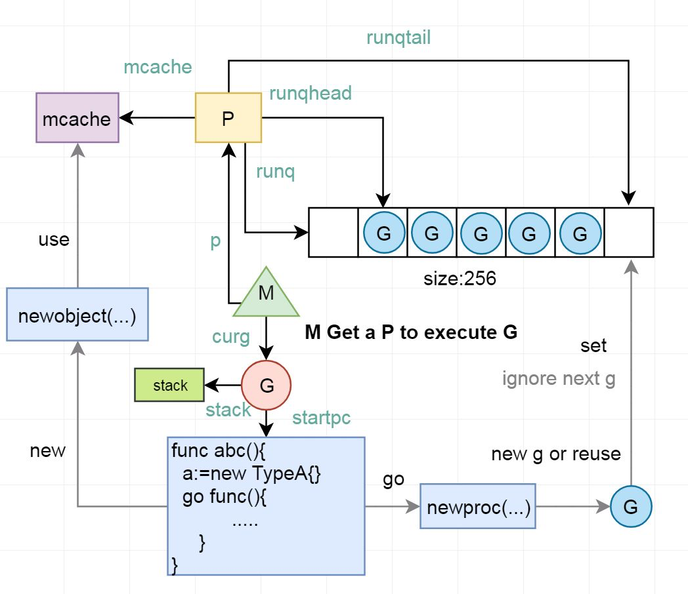
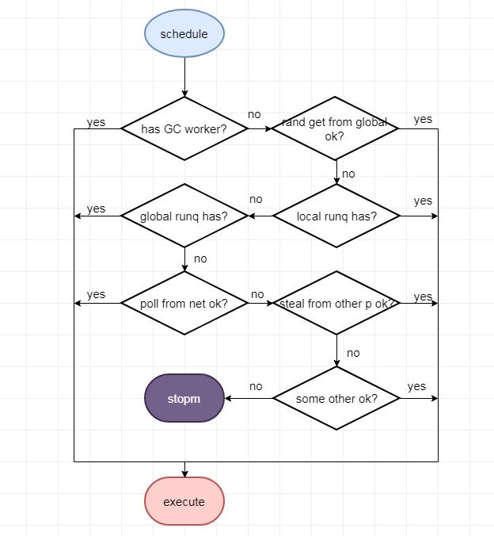
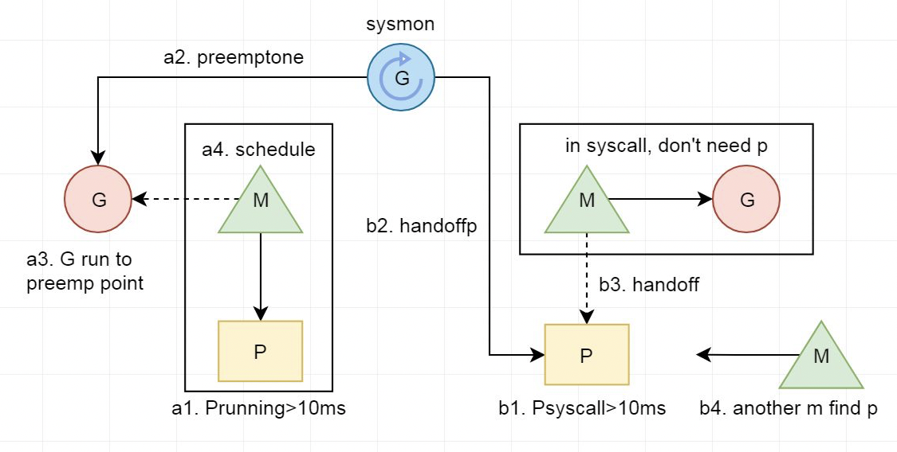
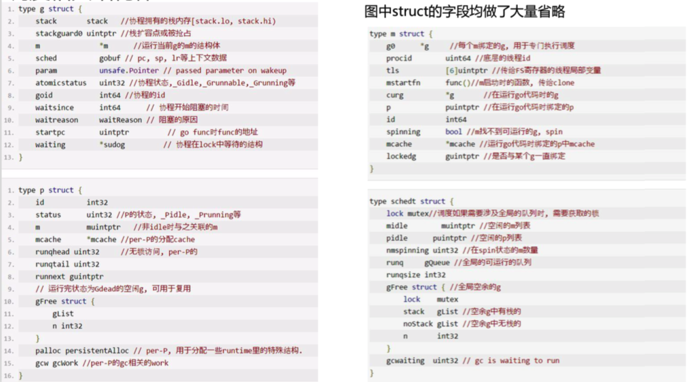
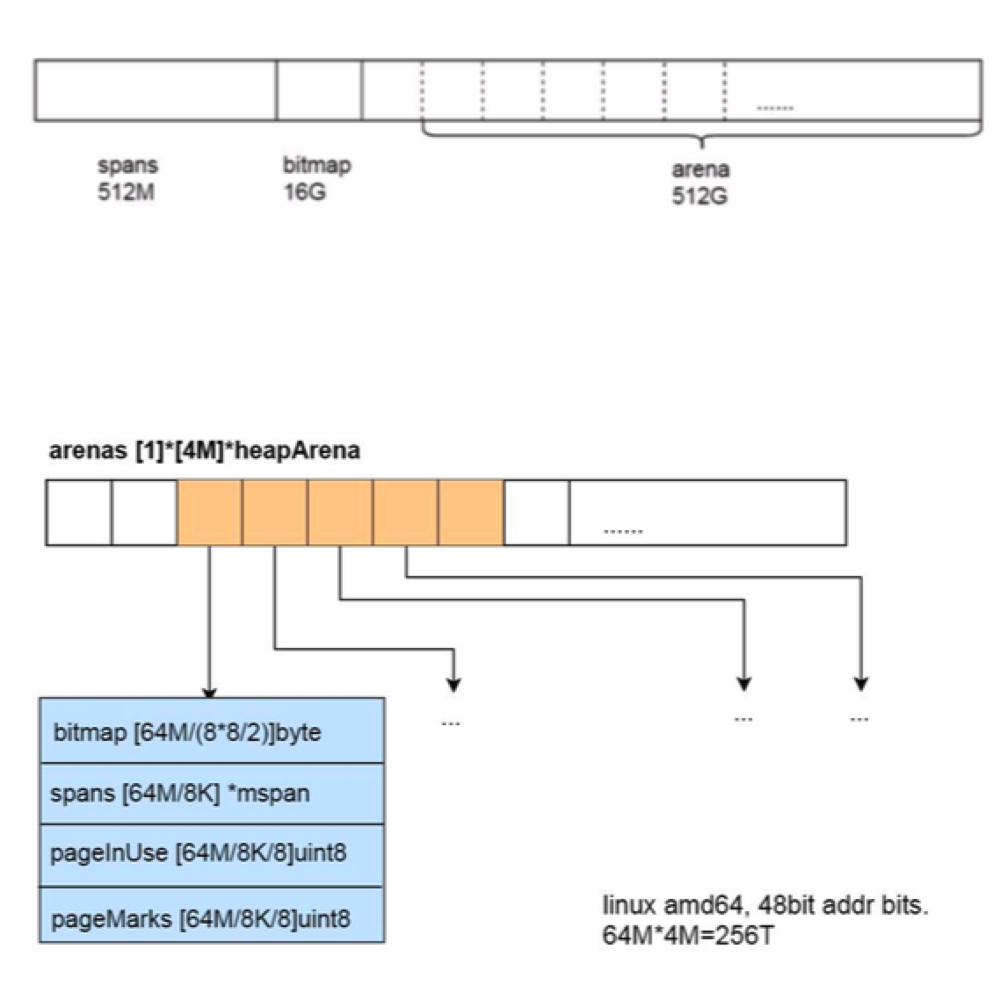

本文章来源于：<https://github.com/Zeb-D/my-review> ，请star 强力支持，你的支持，就是我的动力。

[TOC]

------


### 为什么去了解Runtime?

1. 解决疑难杂症&&优化
2.  好奇心
3. 技术深度的一种

运行时到底是个什么东西?

Go的调度为什么说是轻量的? 

Go调度都发生了啥? 

Go的网络和锁会不会阻塞线程? 什么时候会阻塞线程?

Go的对象在内存中是怎样的? 

Go的内存分配是怎样的? 栈的内存是怎么分配的?

GC是怎样的?

GC怎么帮我们回收对象? 

Go的GC会不会漏掉对象或者回收还在用的对象?

Go GC什么时候开始?

Go GC啥时候结束?

Go GC会不会太慢, 跟不上内存分配的速度?

Go GC会不会暂停我们的应用? 暂停多久? 影不影响我的 请求?
 ....


### Golang Runtime简介

Golang Runtime是go语言运行所需要的基础设施.

1. 协程调度, 内存分配, GC;

2. 操作系统及CPU相关的操作的封装(信号处理, 系统调用, 寄存器操作, 原子操作等), CGO; 

3. pprof, trace, race检测的支持;
4. map, channel, string等内置类型及反射的实现.


1. 与Java, Python不同, Go并没有虚拟机的概念, Runtime也直接被编译 成native code.
2. Go的Runtime与用户代码一起打包在一个可执行文件中
3. 用户代码与Runtime代码在执行的时候并没有明显的界限, 都是函数调用
4. go对系统调用的指令进行了封装, 可不依赖于glibc
5. 一些go的关键字被编译器编译成runtime包下的函数.

| **关键字** | **函数**                                       |
| ---------- | ---------------------------------------------- |
| go         | newproc                                        |
| new        | newobject                                      |
| make       | makeslice, makechan, makemap, makemap_small... |
|            | gcStart                                        |
| <- ->      | chansend1, chanrecv1                           |
| 等等       |                                                |


### Runtime发展历程

| **版本** | **发布时间** | **改进特征**                                                 | **GC STW时间**         |
| -------- | ------------ | ------------------------------------------------------------ | ---------------------- |
| 1.0      | 2012/3       | 调度GM模型, GC STW                                           | 百ms级别-秒级          |
| 1.2      | 2013/5       | **调度G-P-M模型**                                            | 同上                   |
| 1.2      | 2013/12      | 实现合作式的抢占                                             | 同上                   |
| 1.3      | 2014/6       | GC实现Mark STW, Sweep 并行.栈扩容由split stack改为复制方式的continus stack. 添加sync.Pool | 百m-几百ms级别         |
| 1.4      | 2014/12      | Runtime移除大部分C代码; 实现准确式GC. 引入写屏障, 为1.5的并发GC做准备. | 同上                   |
| 1.5      | 2015/8       | Runtime完全移除C代码, 实现了Go的自举.<br/> **GC 并发标记清除, 三色标记法**; GOMAXPROCS默认为CPU核数, go tool trace引入 | 10ms级别               |
| 1.6      | 2016/2       | 1.5中一些与并发GC不协调的地方更改. 集中式的GC协调协程, 改为状态机实现 | 5ms级别                |
| 1.7      | 2016/8       | GC时由mark栈收缩改为并发, 引入dense bitmap, SSA引入          | ms级                   |
| 1.8      | 2017/2       | **hybrid write barrier**, 消除re-scanning stack, **GC进入sub ms.** defer和cgo调用开销减少一半 | sub ms(18GB堆)         |
| 1.9      | 2017/8       | 保留用于debug的rescan stack代码移除, runtime.GC, debug.SetGCPercent, and debug.FreeOSMemory等触发STW GC改为并发GC | 基本同上               |
| 1.10     | 2018/2       | 不再限制最大GOMAXPROCS(Go 1.9为1024), LockOSThread的线程在运行的G结束后可以释放. | 基本同上               |
| 1.11     | 2018/8       | 连续的arena改为稀疏索引的方式                                | 基本同上               |
| 1.12     | 2019/2       | Mark Termination流程优化                                     | Sub ms, 但几乎减少一半 |

注: GC STW时间与堆大小, 机器性能, 应用分配偏好, 对象数量均有关. 较早的版本来自网络上的数据. 1.4- 1.9数据来源于twitter工程师. 这里是以较大的堆测试, 数据仅供参考. 普通应用的情况好于上述的数值.


### Golang调度简述

-   PMG模型, M:N调度模型.

-   调度在计算机中是分配工作所需资源的方法. linux的调度为CPU找到可运行的线程. 而Go的调度是为

  M(线程)找到P(内存, 执行票据)和可运行的G.

-   轻量级协程G, 栈初始2KB, 调度不涉及系统调用.

-   用户函数调用前会检查栈空间是否足够, 不够的话, 会进行栈扩容.

-   用户代码中的协程同步造成的阻塞, 仅仅是切换协程, 而不阻塞线程.

-   网络操作封装了epoll, 为NonBlocking模式, 未ready, 切换协程, 不阻塞线程.

-   每个p均有local runq, 大多数时间仅与local runq无锁交互. 实现work stealing.

-   用户协程无优先级, 基本遵循FIFO.

-   版本(1.12), go支持协作的抢占调度, 还不支持非协作的抢占调度.


#### Goroutine

Process -> Thread(LWP, lightweight process) -> Goroutine (一种lightweight userspace thread) 不断共享, 不断减少切换成本

**Go实现有栈协程**

代表协程这种执行流的结构体

保护和恢复上下文的函数

运行队列

编译器将go关键字编译为生成一个协程结构体, 并放入运行队列 解决网络IO阻塞问题

协程级别的同步结构 调度: findrunnable 

...


#### 协程结构体和切换函数


#### GM模型

一开始, 实现一个简单一点的, 一个全局队列放待运行的g.

新生成G, 阻塞的G变为待运行, M寻找可运行的G等操作都在全局队列中 操作, 需要加线程级别的锁.

-   调度锁问题. 单一的全局调度锁(Sched.Lock)和集中的状态, 导致伸缩性下降.

-   G传递问题. 在工作线程M之间需要经常传递runnable的G, 会加大调度延迟, 并带来额外的性能损耗.

-   Per-M的内存问题. 类似TCMalloc结构的内存结构, 

  每个M都需要memory cache和其他类型的cache(比如stack alloc), 
  
  然而实际上只 有M在运行Go代码时才需要这些Per-M Cache, 阻塞在系统调用的M 并不需要这些cache. 
  
  正在运行Go代码的M与进行系统调用的M的比 例可能高达1:100, 这造成了很大的内存消耗.


是不是可以给运行的M加个本地队列? 

是不是可以剥夺阻塞的M的mcache给其他M使用?


#### GPM模型

Golang 1.1中调度为GPM模型. 通过引入逻辑Processer P来解决GM模型的几个问题.




- mcache从M中移到P中.
-   不再是单独的全局runq. 每个P拥有自己的runq. 新的g放入自己的runq. 满了后再批量放入全局runq中. 优先从自己的runq获取g执行
-   实现work stealing, 当某个P的runq中没有可运行G时, 可以从全局获取, 从其他P获取
-   当G因为网络或者锁切换, 那么G和M分离, M通过调度执行新的G
-   当M因为系统调用阻塞或cgo运行一段时间后, sysmon协程会将P与M分离. 由其他的M来结合P进行调度.

|             | **数据结构**                              | **数量**                                        | **意义**                |
| ----------- | ----------------------------------------- | ----------------------------------------------- | ----------------------- |
| G Goroutine | runtime.g 运行的函数指针, stack, 上下文等 | 每次都go func都代 表一个G, 无限制               | 代表一个用户 代码执行流 |
| P Processor | runtime.p per-P的cache, runq和free g等    | 默认为机器核数. 可通过 GOMAXPROCS环境 变量调整. | 表示执行所需 的资源     |
| M Machine   | runtime.m 对应一个由clone 创建的线程      | 比P多, 一般不会多太 多. 最大1万个               | 代表执行者, 底层线程    |


#### G状态流转


| **G状态**  | **值**  | **说明**                                                     |
| ---------- | ------- | ------------------------------------------------------------ |
| Gidle      | 0       | 刚刚被分配, 还没有初始化                                     |
| Grunnabel  | 1       | 表示在runqueue上, 还没有被运行                               |
| Grunning   | 2       | go协程可能在执行go代码, 不在runqueue上, 与M, P已绑定         |
| Gsyscall   | 3       | go协程在执行系统调用, 没执行go代码, 没有在runqueue上, 只与M绑定 |
| Gwaiting   | 4       | go协程被阻塞(IO, GC, chan阻塞, 锁等). 不在runqueue上, 但是一定在某个地 方, 比如channel中, 锁排队中等. |
| Gdead      | 6       | 协程现在没有在使用, 也许执行完, 或者在free list中, 或者正在被初始化. 可能 有stack或者没有 |
| Gcopystack | 8       | 栈正在复制, 此时没有go代码, 也不在runqueue上                 |
| Gscan      | 0x10 00 | 与runnable, running, syscall, waiting等状态结合, 表示GC正在扫描这个G的 栈 |
|            |         |                                                              |


#### 调度

golang调度的职责就是为需要执行的Go代码(G)寻找执行者(M)以及执行的准许和资源(P).

并没有一个调度器的实体, 调度是需要发生调度时由m执行runtime.schedule方法进行的.

调度时机:

  channel, mutex等sync操作发生了协程阻塞  time.sleep

  网络操作暂时未ready

  gc

  主动yield

  运行过久或系统调用过久

  等等

**调度流程:**

实际调度代码复杂很多.

如果有分配到gc mark的工作需要做gc mark. local runq有就运行local的, 没有再看全局的runq是否有, 再看能否从net中poll出来,

从其他P steal一部分过来. ....

实在没有就stopm




#### sysmon协程

P的数量影响了同时运行go代码的协程数. 如果P被占用很久, 就会影响调度. sysmon协程的一个功能就是进行抢占.

sysmon协程是在go runtime初始化之后, 执行用户编写的代码之前, 由runtime启动的不与任何P绑定, 直接由一个M执行的协程. 类似于 linux中的执行一些系统任务的内核线程.

可认为是10ms执行一次. (初始运行间隔为20us, sysmon运行1ms后逐渐翻倍, 最终每10ms运行一次. 

如果有发生过抢占成功, 则又恢复成 初始20us的运行间隔, 如此循环)



- 每sysmon tick进行一次netpoll(在STW结束,和M执 行查找可运行的G时也会执行netpoll)获取fd事件, 将 与之相关的G放入全局runqueue
-   每次sysmon运行都执行一次抢占, 如果某个P的G执 行超过1个sysmon tick, 则执行抢占. 正在执行系统调 用的话, 将P与M脱离(handoffp); 正在执行Go代码, 则通知抢占(preemptone).
-   每2分钟如果没有执行过GC, 则通知gchelper协程执 行一次GC
-   如果开启schdule trace的debug信息(例如 GODEBUG=schedtrace=5000,scheddetail=1), 则 按照给定的间隔打印调度信息
-   每5分钟归还GC后不再使用的span给操作系统 (scavenge)


#### 协作式抢占

retake()调用preemptone()将被抢占的G的stackguard0设为stackPreempt, 被设置抢占标记的G进行下一次函数调用时, 检查栈空间失败. 

进而触发morestack()(汇编代码，位于 asm_XXX.s中)然后进行一连串的函数调用，

主要的调用过程如下:

```
morestack()(汇编代码)-> newstack() -> gopreempt_m() -> goschedImpl() -> schedule()
```


#### 网络

JavaScript网络操作是异步非阻塞的, 通过事件循环, 回调对应的函数. 

一些状态机模式的框架, 每次网络操作都有一个新的状态. 

代码执行流被打散.

用户态的协程: 结合 epoll, nonblock模式的fd操作;

网络操作未ready时的切换协程和ready后把相关协程添加到待运行队列. 

网络操作达到既不阻 塞线程, 又是同步执行流的效果.


1. 封装epoll, 有网络操作时会epollcreate一个epfd.

2. 所有网络fd均通过fcntl设置为NONBLOCK模式, 以边缘触发模式放入epoll节点中.

3. 对网络fd执行Accept(syscall.accept4),Read(syscall.read), Write(syscall.write)操作时, 相关 操作未ready, 则系统调用会立即返回EAGAIN; 使用 gopark切换该协程

4. 在不同的时机, 通过epollwait来获取ready的 epollevents, 通过其中data指针可获取对应的g, 将其 置为待运行状态, 添加到runq


#### 调度相关结构体




#### 调度综合

- 轻量级的协程, 栈初始2KB, 调度不涉及系统调用.

-   调度在计算机中是分配工作所需资源的方法. linux的调度为CPU找到可运行的线程. 而Go的调度是为M(线程)找到P(内存, 执行票据)和可运行的G.

-   用户函数调用前会检查栈空间是否足够, 不够的话, 会进行*2 栈扩容. 最大栈1G, 超出panic.

-   用户代码中的协程同步造成的阻塞, 仅仅是切换(gopark)协程, 而不阻塞线程, m和p仍结合, 去寻找新的可执行的g.

-   每个P均有local runq, 大多数时间仅与local runq无锁交互. 新生成的g, 放入到local runq中.

-   调度时会随机从全局runq取g. 然后local runq, global runq... 均没有g的话, work stealing从其他P中取.

-   sysmon: 对于运行过久的g设置抢占标识; 对于过久syscall的p, 进行m和p的分离. 防止p被占用过久影响调度.

-   封装了epoll, 网络fd会设置成NonBlocking模式, 网络fd的read, write, accept操作, 会以NonBlocking模式操作, 返回EAGAIN则gopark当前协程. 

  在m调度, sysmon中, gc start the world等阶段均会poll出ready的协程进行运行或者添加到全局runq中

-   版本(1.12), go还不支持非协作的抢占调度, 在密集CPU运算时, 可能会导致调度延迟. 官方已在解决.


#### 未涉及的点

  G状态流转

  具体调度流程

  栈扩容

  合作式抢占

  sysmon

  P状态流转

  M的spin与unspin

  LockOSThread

 等


### 内存

#### golang内存分配简介

- 类似于TCMalloc的结构

-   使用span机制来减少碎片. 每个span至少为一个页(go中的一个page为8KB). 

  每一种span用于一个范围的内存分配需求.

   比如16-32byte使用分配32byte的span, 112-128使用分配128byte的span.

-   一共有67个size范围, 8byte-32KB, 每个size有两种类型(scan和noscan, 表示分配的对象是否会包含指针)

-   多层次Cache来减少分配的冲突. per-P无锁的mcache, 全局67*2个对应不同size的span的后备mcentral, 全局1个的mheap.

-   mheap中以treap的结构维护空闲连续page. 归还内存到heap时, 连续地址会进行合并.

-   stack分配也是多层次和多class的.

-   对象由GC进行回收. sysmon会定时把空余的内存归还给操作系统


#### golang内存结构



**1.10及以前**

以下内存并不是初始化时就分配虚拟内存的:

arena的大小为512G, 为了方便管理把arena区域划分成一个个的page, 每个page 8KB, 一共有512GB/8KB个页

spans区域存放指向span的指针, 表示arean中对应的Page所属的span, 所以span区域的大小为(512GB/8KB)*指针大小8byte = 512M

bitmap主要用于GC, 用两个bit表示 arena中一个字的可用状态, 所以是 (512G/8个字节一个字)*2/8个bit每个字节=16G

**1.11及以后:**

改成了两阶稀疏索引的方式. 内存可以超过512G, 也可以允许不连续的内存.

mheap中的areans字段是一个指针数组, 每个heapArena管理64M的内 存.

bitmap和spans和上面的功能一致.


#### mspan

使用span机制来减少碎片. 每个span至少分配1个page(8KB), 划分成固定大小的slot, 用于分配一定大小范围的内存需求.

`runtime/sizeclasses.go`


class0表示单独分配一个>32KB对象的span, 有67个 size, 

每个size两种, 用于分配有指针和无指针对象, 所以 有67*2=134个class.


span结构体主要字段如上.

1. 这里表示slot大小为32byte的span, 上一次gc之后, 前8个slot使用如上.
2. freeindex表示 <该位置的都被分配了, >=该位置的可能被分配, 也可能没有. 配 合allocCache来寻找. 每次分配后, freeindex设置为分配的slot+1.
3. allocBits表示上一次GC之后哪一些slot被使用了. 0未使用或释放, 1已分配.
4. allocCache表示从freeindex开始的64个slot的分配情况, 1为未分配, 0为分配. 使 用ctz(Count Trailing Zeros指令)来找到第一个非0位. 使用完了就从allocBits加载, 取 反.
5. 每次gc完之后, sweep阶段, 将allocBits设置为gcmarkBits.


#### 全景及分配策略


多层次Cache来减少分配的冲突, 加快分配. 从无锁到粒度较低的锁, 再到全局一个锁, 或系统调用.

**分配策略**

1. new, make最终调用mallocgc
2. `>`32KB对象, 直接从mheap中分配, 构成一个span
3. `<`16byte且无指针(noscan), 使用tiny分配器, 合并分配.
4. `<`16byte有指针或16byte-32KB, 如果mcache中有对应 class的空闲mspan, 则直接从该mspan中分配一个slot.
5. (mcentral.cacheSpan) mcache没有对应的空余span, 则从 对应mcentral中申请一个有空余slot的span到mcache中. 再进 行分配
6. ( mcentral.grow)对应mcentral没有空余span, 则向 mheap( mheap_.alloc)中申请一个span, 能sweep出span则返 回. 否则看mheap的free mTreap能否分配最大于该size的连续 页, 能则分配, 多的页放回 .
7. mheap的free mTreap无可用, 则调用sysAlloc(mmap)向系统申请.
8. 6, 7步中获得的内存构建成span, 返回给mcache, 分配对象.


#### 几种特殊分配器

##### **tiny**分配器


对于小于maxTinySize(16B)无指针对象的内存分配请求.

go采取了将 小对象合并存储的解决方案.

每个P在本地维护了专门的memory block来存储tiny object, 

分配时根 据tinyoffset和需要的size及对齐来判断该block内是否可容纳该object, 

如果可以, 返回放入的地址.


##### **fixalloc**

spanalloc fixalloc 

cachealloc fixalloc 

treapalloc fixalloc 

specialfinalizeralloc fixalloc 

specialprofilealloc fixalloc

这些都是mheap中的字段.

 fixalloc用于分配runtime中固定大小的一些结构, 比如mspan, mcache. 

主要思路是一次性分配一大块内存(persistentalloc方法, 

使用 的是mmap, 不指定地址, 分配的内存不在arena范围中), 

每次 请求对应结构体的大小, 释放时放在list链表中.


##### **stackcache**


stackcache是per-P的. 用于分配groutines的stack.

 和普通对象内存一样, 栈分配也有多级和 多个层次.

 `>`16K的直接从全局的stackLarge分配.

否则先从p的stackcache中分配,

如果无法分配除, 则需要从全局的stackpool分配出一批 stack (stackpoolalloc), 

赋给该p的stackcache, 再从local stackcache中分配.


#### Golang内存分配综合

-   类似于TCMalloc的结构

-   使用span机制来减少碎片. 每个span至少为一个页(go中的一个page为8KB). 每一种span用于一个范围的内存分配需求. 比如16-32byte使用分配32byte的span, 112-128使用分配128byte的span.

-   一共有67个size范围, 8byte-32KB, 每个size有两种类型(scan和noscan, 表示分配的对象是否会包含指针)

-   多阶Cache来减少分配的冲突. per-P无锁的mcache, 对应不同size(67*2)的全局mcentral, 全局的mheap.

-   go代码分配内存优先从当前p的mcache对应size的span中获取; 有的话, 再从对应size的mcentral中获取一个span; 

  还没有的话, 从mheap中sweep一个span; sweep不出来, 则从mheap中空闲块找到对应span大小的内存. mheap中如果还没有,

   则从系统申请内存. 从无锁到全局1/(67*2)粒度的锁, 再到全局锁, 再到系统调用.

-   stack的分配也是多层次和多class的. 减少分配的锁争抢, 减少栈浪费.

-   mheap中以treap的结构维护空闲连续page. 归还内存到mheap时, 连续地址会进行合并. (1.11之前采用类似伙伴系统维护<1MB的连续page, treap维护>1MB的连续page)

-   对象由GC进行释放. sysmon会定时把mheap空余的内存归还给操作系统


未涉及的点:
 fixalloc和persistentalloc具体流程、 scavtreap、逃逸分析(可了解[go的逃逸分析.md](go的逃逸分析.md))


### GC

#### Golang GC简述

-   GC是一种自动内存管理方式
-   GC三大基础算法: Mark-Sweep, Mark-Sweep-Compact, Mark-Copy. 这三个基础算法GC时需要一直STW(stop the world)
-   GC算法是一个综合的考虑: 程序吞吐量, GC吞吐量, STW时间, STW的频率, 压缩, 分配性能, 并发, 伸缩, 调优复杂度等等.
-   当前Go GC特征: 三色标记, 并发标记和清扫, 非分代, 非紧缩, 混合写屏障.
-   1.5之后Go的GC是基于三色标记法的Concurrent Mark-Sweep(并发标记-清扫)算法. 生产上基本没什么问题.
-   1.5之后Golang Runtime中调整最多的就是GC的部分.
-   1.8之后Go的GC STW可以比较稳定在sub ms
-   Go的GC并不是完美的


#### 何为GC

对象是否存活是由整体应用其他部分是否对其有引用决定的, 是一个全局性的信息, 而手动管理内存只能由开发人 员根据当前上下文的局部信息来判断.

 Garbage Collection (GC)是一种自动管理内存的方式. 支持GC的语言无需手动管理内存, **程序后台自动判断对象 是否存活并回收其内存空间, 使开发人员从内存管理上解脱出来**.

1959年, GC由 John McCarthy发明, 用于简化Lisp中的手动内存管理. 到现在很多语言都提供了GC. 不过GC的 原理和基本算法都没有太大的改变.

**哪些语言提供GC(基本上90年代后的语言都提供GC):**

ML, Haskell, Lisp等大多数函数式编程语言;

Python, Ruby, JS等动态类型语言;

Smalltalk, Java, C#等面向对象语言;


**C++**

```
for(int i = 0; i < 100; i++)
{
Person * p = new Person(); .......
delete p;
}
//调用者需要自己new Person并负责释 放
test(p *Person){
p->name=”yifhao” }
```


**Go**

```
for i:=0;i<100 ;i++ { o:=new(Person)
}
......
func test() *Person {
p := new(Person)
p.Name = "yifhao"
return p }
```


**注意:**

(1)对象被回收时间即GC发生时间是不可知 的

(2)垃圾回收不是析构函数. 

(3)垃圾回收只与内存有关, 不会回收连接资 源, 文件资源.

(4) GC时自动调用对象的某个方法, 来关闭 一些资源, 是否可行?


#### GC相关术语

**并发和并行:** 通常在GC领域中, 并发收集器则指垃圾回收的同时应用程序也在执行; 

​	并行收集器指垃圾回收采取多个线 程利用多个CPU一起进行GC. 不过一般我们说并发回收器, 就包含了这两层意思.

**Safepoint**: 安全点(Safepoint)是收集器能够识别出线程执行栈上的所有引用的一点或一段时间.

**Stop The World(STW):** 某些垃圾回收算法或者某个阶段进行时需要将应用程序完全暂停.

**准确式GC和保守式GC:** 准确式(precise或exact) GC指GC能够知道一块内存区域是引用还是非引用, 

​	如一个64位的区域可以是一个int64整形数字也可以是一个对象引用, 

​	当一个对象进行执行时, 需要修改指向这个内存的引用的指, 

​	非准确式GC也就是保守式GC不能完成这个任务.

**Mark:** 从Root对象开始扫描, 标记出其引用的对象, 及这些对象引用的对象, 如此循环, 标记所有可达的对象.

**Sweep**: Sweep清除阶段扫描堆区域, 回收在标记阶段标记为Dead的对象, 通常通过空闲链表(free list)的方式.

​	需要的 工作量和堆大小成正比.

**Compact**: 压缩的方式是将存活对象移动到一起来获得一段连续的空闲空间, 

​	也叫做重定位.这样需要将所有对象的引用 指向新的位置.工作量和存活对象量成正比.

**Copy**: 复制算法将所有存活对象从一个From区域移动到一个To区域, 然后回收From区域. 

​	之后From和To交换角色, 由于From和To是对等的, 所以需要两块大小相同的区域, 

​	而同一时间只能利用其中一块来存放对象.工作量和存活对象量成正比.


#### GC关心什么

**程序吞吐量**: 回收算法会在多大程度上拖慢程序? 

​	可以通过GC占用的CPU与其他CPU时间的百分比描述 

**GC吞吐量**: 在给定的CPU时间内, 回收器可以回收多少垃圾?

**堆内存开销**: 回收器最少需要多少额外的内存开销?

**停顿时间**: 回收器会造成多大的停顿?

**停顿频率**: 回收器造成的停顿频率是怎样的?

**停顿分布**: 停顿有时候很长, 有时候很短? 还是选择长一点但保持一致的停顿时间?

**分配性能**: 新内存的分配是快, 慢还是无法预测?

**压缩**: 当堆内存里还有小块碎片化的内存可用时, 回收器是否仍然抛出内存不足(OOM)的错误?

​	如果不是, 那么你是否 发现程序越来越慢, 并最终死掉, 尽管仍然还有足够的内存可用?

**并发**:回收器是如何利用多核机器的?

**伸缩**:当堆内存变大时, 回收器该如何工作?

**调优**:回收器的默认使用或在进行调优时, 它的配置有多复杂? 

**预热时间**:回收算法是否会根据已发生的行为进行自我调节?如果是, 需要多长时间?

**页释放**:回收算法会把未使用的内存释放回给操作系统吗?如果会, 会在什么时候发生?


**没有十全十美的GC算法, 折衷无处不在**


#### Golang GC发展

Golang早期版本GC可能问题比较多 . 但每一个版本的发布都伴随着 GC 的改进.

1.5版本之后, Go的GC已经能满足大部分大部分生产环境使用要求. 

1.8通过hybrid write barrier, 使得STW降到了sub ms. 

下面列出一些GC方面比较重大的改动:

| **版本** | **发布时间** | **GC**                   | **STW时间(见备注twitter数据)** |
| -------- | ------------ | ------------------------ | ------------------------------ |
| v1.1     | 2013/5       | STW                      | 百ms-几百ms级别                |
| v1.3     | 2014/6       | Mark STW, Sweep 并行     | 百ms级别                       |
| v1.5     | 2015/8       | 三色标记法, 并发标记清除 | 10ms级别                       |
| v1.8     | 2017/2       | hybrid write barrier     | sub ms                         |


#### 三色标记


> 图来自https://en.wikipedia.org/wiki/Tracing_garbage_collection


1. 有黑白灰三个集合. 初始时所有对象都是白色
2. 从Root对象开始标记, 将所有可达对象标记为灰色 
3. 从灰色对象集合取出对象, 将其引用的对象标记为 灰色, 放入灰色集合, 并将自己标记为黑色
4. 重复第三步, 直到灰色集合为空, 即所有可达对象都 被标记
5. 标记结束后, 不可达的白色对象即为垃圾. 对内存进 行迭代清扫, 回收白色对象.
6. 重置GC状态

```
和JVM的ZGC很相似
```

**go和java不同, go的对象在内存中并没有header.**

1. 标记和程序并发, 会漏标记对象吗? 如何解决的?

2. 哪里记录了对象的三色标记状态?

3. 标记时, 拿到一个指针, 怎么知道它是哪个对象? 也许是某个对象的内部指针? 

   这个对象的内存哪些地方代表 了它引用的对象呢?


##### Go三色标记实现的一点细节: 写屏障

```go
var A Wb
var B Wb
type Wb struct {
	Obj *int
}

func simpleSet(c *int) {
	A.Obj = nil
	B.Obj = c
	//if GC Begin
	A.Obj = c
	B.Obj = nil
	//scan B
}
```


三色标记需要维护(弱)不变性条件: 黑色对象不能引用无法被灰色对象 可达的白色对象.

并发标记时, 如果没有做正确性保障措施, 可能会导致漏标记对象, 导 致实际上可达的对象被清扫掉.

为了解决这个问题, go使用了写屏障(和内存写屏障不是同一个概念). 

写屏障是在写入指针前执行的一小段代码, 用以防止并发标记时指针 丢失, 这一小段代码Go是在编译时加入的.

Golang写屏障在mark和marktermination阶段处于开启状态.

记上面图, 第3步,A.obj=C时, 会将C进行标记, 加入写屏障buf, 最终会flush到待扫描队列, 这样就不会丢失C及C引用的对象.


我们进一步研究写屏障的底层实现：

```
➜  main git:(master) ✗ go build -gcflags "-N -l"                         
➜  main git:(master) ✗ go tool objdump -s 'main\.simpleSet' -S ./main
TEXT main.simpleSet(SB) /Users/zouyongdong/GolandProjects/go-util/todo/main/main.go
func simpleSet(c *int) {
  0x105e1a0             65488b0c2530000000      MOVQ GS:0x30, CX        
  0x105e1a9             483b6110                CMPQ 0x10(CX), SP       
  0x105e1ad             0f86ad000000            JBE 0x105e260           
  0x105e1b3             4883ec08                SUBQ $0x8, SP           
  0x105e1b7             48892c24                MOVQ BP, 0(SP)          
  0x105e1bb             488d2c24                LEAQ 0(SP), BP          
        A.Obj = nil
  0x105e1bf             833dbaa4090000          CMPL $0x0, runtime.writeBarrier(SB)     
  0x105e1c6             7402                    JE 0x105e1ca                            
  0x105e1c8             eb7f                    JMP 0x105e249                           
  0x105e1ca             48c705b3cf060000000000  MOVQ $0x0, main.A(SB)                   
  0x105e1d5             eb00                    JMP 0x105e1d7                           
        B.Obj = c
  0x105e1d7             488b442410              MOVQ 0x10(SP), AX                       
  0x105e1dc             833d9da4090000          CMPL $0x0, runtime.writeBarrier(SB)     
  0x105e1e3             7402                    JE 0x105e1e7                            
  0x105e1e5             eb54                    JMP 0x105e23b                           
  0x105e1e7             488905a2cf0600          MOVQ AX, main.B(SB)                     
  0x105e1ee             eb00                    JMP 0x105e1f0                           
        A.Obj = c
  0x105e1f0             488b442410              MOVQ 0x10(SP), AX                       
  0x105e1f5             833d84a4090000          CMPL $0x0, runtime.writeBarrier(SB)     
  0x105e1fc             7404                    JE 0x105e202                            
  0x105e1fe             6690                    NOPW                                    
  0x105e200             eb1d                    JMP 0x105e21f                           
  0x105e202             4889057fcf0600          MOVQ AX, main.A(SB)                     
        B.Obj = nil
  0x105e209             48c7057ccf060000000000  MOVQ $0x0, main.B(SB)   
        A.Obj = c
  0x105e214             eb00                    JMP 0x105e216           
}
  0x105e216             488b2c24                MOVQ 0(SP), BP          
  0x105e21a             4883c408                ADDQ $0x8, SP           
  0x105e21e             c3                      RET                     
        A.Obj = c
  0x105e21f             488d3d62cf0600          LEAQ main.A(SB), DI             
  0x105e226             e895cdffff              CALL runtime.gcWriteBarrier(SB) 
        B.Obj = nil
  0x105e22b             488d3d5ecf0600          LEAQ main.B(SB), DI             
  0x105e232             31c0                    XORL AX, AX                     
  0x105e234             e887cdffff              CALL runtime.gcWriteBarrier(SB) 
        A.Obj = c
  0x105e239             ebdb                    JMP 0x105e216           
        B.Obj = c
  0x105e23b             488d3d4ecf0600          LEAQ main.B(SB), DI             
  0x105e242             e879cdffff              CALL runtime.gcWriteBarrier(SB) 
  0x105e247             eba7                    JMP 0x105e1f0                   
        A.Obj = nil
  0x105e249             488d3d38cf0600          LEAQ main.A(SB), DI             
  0x105e250             31c0                    XORL AX, AX                     
  0x105e252             e869cdffff              CALL runtime.gcWriteBarrier(SB) 
  0x105e257             e97bffffff              JMP 0x105e1d7                   
func simpleSet(c *int) {
  0x105e25c             0f1f4000                NOPL 0(AX)                              
  0x105e260             e83bb2ffff              CALL runtime.morestack_noctxt(SB)       
  0x105e265             e936ffffff              JMP main.simpleSet(SB) 
```


栈中指针slot的操作没有写屏障.

Dijkstra写屏障是对被写入的指针进行grey操作, 不能防止指针从 heap被隐藏到黑色的栈中, 需要STW重扫描栈. 

Yuasa写屏障是对将被覆盖的指针进行grey操作, 不能防止指针从栈被 隐藏到黑色的heap对象中, 需要在GC开始时保存栈的快照.

go 1.8写屏障混合了两者, 既不需要GC开始时保存栈快照, 也不需要 STW重扫描栈, 原型如下:

```
writePointer(slot, ptr):
shade(*slot)
if current stack is grey:
shade(ptr) *slot = ptr
```

> Proposal: Eliminate STW stack re-scanning https://github.com/golang/proposal/blob/master/design/17503-eliminate-rescan.md


##### Go三色标记实现的一点细节: 三色状态

**哪里记录了对象的三色标记状态?**


并没有真正的三个集合来分别装三色对象.

前面分析内存的时候, 介绍了go的对象是分配在span中, span里还 有一个字段是gcmarkBits, mark阶段里面每个bit代表一个slot已 被标记.

白色对象该bit为0, 灰色或黑色为1. (runtime.markBits) 每个p中都有wbBuf和gcw gcWork, 以及全局的workbuf标记队列, 实现生产者-消费者模型, 

在这些队列中的指针为灰色对象, 表示已 标记, 待扫描.

从队列中出来并把其引用对象入队的为黑色对象, 表示已标记, 已扫 描. (runtime.scanobject).


##### Go三色标记实现的一点细节: 扫描与元信息

回到前面所提到的内存结构图. 


go的gc heap通过右图的arenas进 行划分, 每个heapArena管理了64M内存. heapArena存储着 pointer, span, bitmap的索引关系.

**p1指向的对象所属heapArena**: `arenas[0][p+constbase/64M]`

**找到对象所属span:** p1%64M/8K就知道了该对象在该 heapArena中的页index, 通过spans[index]即可找到其所属的 span(runtime.spanOf )

**对象首地址:** 找到对象所属的span, 根据span的elemsize和span 的startAddr, 即可知道其为该span中第几个对象以及其地址 (runtime.findObject)

**对象的gcmarkBits:** 知道了obj在span中属于第几个对象, 即可知 道如何设置其gcmarkBits.

**对象引用的对象:** bitmap每两个bit分别表示某8个字节是否是指 针, 以及该字节所属对象后续字节是否还包含指针, 以此知道其引用 的对象和减少扫描工作量. 这些bit是分配对象时, 根据对象type信息设置的.


#### Golang GC流程


**GC Trigger**

gcTriggerHeap: 分配内存时, 当前已分配内存与上一次GC结束 时存活对象的内存达到某个比例时就触发GC.

gcTriggerTime: sysmon检测2min内是否运行过GC, 没运行过 则执行GC.

gcTriggerAlways: runtime.GC()强制触发GC.

当然1.5的Mark和Sweep都是Concurrent的, 只不过下图我特地 注明了下.

**改进点:**

Go 1.5是Go转为并发三色标记清除法的版本. 大部分情况下能够 将STW控制在10ms以下.

1.5中GC流程及状态的转换由一个协程集中式控制, 容易导致调 度延迟.

1.6中采用了分布式检测, 其他协程也可以进行检测并状态转换.

1.5中栈收缩在Mark Termination(STW), 如果协程很多, 会导致 STW时间暴增.

1.7将栈收缩移入并发Mark阶段.

1.5只采用了Dijkstra写屏障, 在Mark Termination(STW)阶段需 要重新扫描栈, 这个是STW最大的来源.

1.8采用了混合写屏障, 消除了重新扫描栈, STW进入sub ms.

 .....

1.12对Mark Terminiation阶段进行了优化


#### Golang GC Pacer

Go何时开始GC, 何时结束GC? 分配太快怎么办?

Go GC Pacer机制决定这些阈值, GC Pacer基于Go程序大致稳定的假定, 并且有负反馈机制.

Go的GC触发与Java不同, Java是当内存某个具体值时(比如2G)触发GC. 而Go与上一次GC之后存活的对象占用的内存Hm(n-1)成 一个比例.

比如Hm(n-1)为1000M, default GOGC=100, 那么大概会在小于但比较接近2000M(比如1850, 1900M) Ht的时候开始GC; 

结束GC时, 使得GC堆大小Ha(比如1990, 2010M)趋向于等于目标值Hg 2000M.

GC结束后, 会根据当前数据计算下一次GC触发值Hm(n+1).


如何保证**GC**按时开始**?** 

在GC结束后, 下一次GC开始前, 需要sweep完所有的span. 

有一个后台清扫协程, 同时用户协程也需要辅助sweep.

假设有k page的span需要sweep, 那么距离下一次GC开始还有Ht-Hm(n-1) 的内存可分配, 

那么平均分配1bytes内存需要sweep k/(Ht-Hm(n-1)) page的span (会根据sweep进度进行比例更改)


如何保证**GC**按时结束**?** 

GC在Ht开始, 到达到目标堆大小Hg时, 尽量mark完所有待mark的对象. 

除了后台并发的标记协程, 程序分配内存时也需要辅助mark. 

从Ht到Hg还有Hg-Ht的内存可分配, 这个时候还有scanWorkExpected的对 象需要scan, 

那么平均分配1byte内存, 需要辅助mark scanWorkExpected/(Hg-Ht)的对象(会根据mark进度进行比例更改)


下一次**GC**啥时候开始**?** 

下一次GC的触发值由反馈公式计算. 定性如下:

如果本次GC mark消耗的CPU高于目标值(30%), 则下次GC提前一点. 如果本次GC的Ha高于Hg, 则下次GC提前一点.


#### **未涉及的点**

  栈分配

  fixalloc, tinyalloc

  逃逸分析

  内存归还

  清扫与辅助清扫

  go gc mark任务分配

  辅助标记

  revise

  mark termination流程

  GC Pacer, trigger计算, goal计算 

....


### 实践

#### 观察一下调度

通过godoc来开启一个go进程, 用ab来调用, 加上debug trace观察其状态

```
GOMAXPROCS=8 GODEBUG=schedtrace=500 godoc -http=:6060 (加上scheddetail=1观察更详细信息) 

ab -c 1000 -n 100000 'http://localhost:6060/'
```


观察一下GC

这是一个服务通过调用debug.SetGCPercent设置GOGC(类似JVM的阈值), 分别是100, 550, 1650时的表现. 

GOGC越大, GC频次越低, 但是触发GC的堆内存也越大. 


#### 一些优化

> **premature optimization is the root of all evil.**

**GODEBUG, GOMAXPROCS, GOGC 涉及文件, CGO较多的程序, 可以将P增大几个.**

runtime.GOMAXPROCS(GOMAXPROCS(0)+1)


**协程池的重要性远没有Java, CPP中线程池那么重要.**

协程的生成不涉及系统调用, 需要的栈资源也很少. 同时P和全局都做了dead G的缓存. 协程池实现的不好, 

反而因为协程池里的一把锁影响了扩展性. 

至于并发控制, 保护其他资源, 可以选用其他方式.

**什么时候需要协程池?** 

主要还是隔离减少栈扩容和缩容. 有些场景下栈扩容和缩容消耗CPU(可结合pprof查看morestack)的确比较多. 

比如长连接, 大量维持连接的协程可以不 用扩容栈, 复杂任务交给任务协程处理, 此类协程的数量比较少.


**GOGC=200或更多,:**

GC Pacer会根据GC情况和GOGC参数来计算gc trigger, 增大GOGC, 可降低GC频率, 注意, 会增加触发GC的堆大小. 

**sync.Pool:** 

对于频繁分配的对象, 可以使用sync.Pool, 减少分配频次, 进而降低GC频率 (1.13对sync.Pool进行了优化)

**全局缓存对象有大量的key的情况, value少用指针**

GC并发Mark需要mark存活的对象, 如果value里指针多, 导致mark消耗的CPU很大, 使用一个struct内嵌数据消除指针.

**一点点拷贝胜过传指针:** 

对象在栈上分配, 减少GC频率.

 **[]byte和string的magic: 慎用, 仅用在不会修改的地方 **

**slice和map的容量初始化: 减少不断加元素时的扩容 **

**json-iterator替换encoding/json等等**


#### 框架或模板集成gops及默认开启pprof

往往有问题才想起没引入pprof, 无法查看stack, 又需要保留现场.


**服务模板代码默认引入一个库开启pprof, 集成到服务列表页.**

有问题, 点一点, 通过一个agent, 直接获取idc机器上服务的pprof 图.


**服务模板默认引入一个库封装gops**

gops:=golang版( jps + jstack + jstat + jinfo ) https://github.com/google/gops

gops和pprof占用的端口根据服务端口+1, +2.


#### 问题排查的一点思路

和Runtime相关的几类问题

1. 内存慢慢增长OOM: 结合memory inuse_space的pprof和 list, 加上源码流程即可定位出. 一直把新对象放到全局对象 或者长生命周期对象中. 比如长连接, 连接池应用或者忘记close http resp body, sql Stmt等.

2. 内存突增OOM: 如果多次分配才OOM, 可使用方法1排查. 对于一次就OOM的, 比较难抓, 可结合go无法分配内存时 throw输出的协程栈排查.

   比如没有校验参数, 调用者填错或恶意, 使用传过来的length 来进行make([]byte, length)用于编解码

3. 性能问题: 结合火焰图, 查看影响性能的热点部分, 进行优化: GC频繁, 编解码效率低等.


#### 一次有趣的排查

一同学找我说自己的服务突然超时很多, 频繁出现页面拉 不出数据, 排查了很久, 实在找不出来问题.

1. 查看负载, 内存, 依赖的服务也均正常
2. 框架会捕捉panic, 目前也没有panic发生过
3.  cpu的pprof也比较正常
4.  日志打的有点多, 但日志是由业务协程通过channel发给 单独一个协程异步打印, 没有channel满的情况.
5.  服务开启了GODEBUG=gctrace=1, 标准输出重定向到 一个文件, tail看GC的stw没什么问题, 监控上的GC数据也正常.

看监控发现个很神奇的地方: 内存cache获取>800ms很多. 但是缓存的数据也不多.


关键词: 日志多, gctrace, 重定向

1. Golang gc最后一步gcMarkTermination会判断是否需要 打印gctrace信息

   此时还是处于STW中

2.  如果是输出console, 纯内存操作, 没影响

3. 早期的服务模板做了重定向操作到文件, 而这个同学的服 务现网日志很多, 导致阻塞了gc完成.

GC的STW统计时间反映不出来这个问题


#### Runtime的一点总结

| 思想          | 作用                                                         | 示例                                                         |
| ------------- | ------------------------------------------------------------ | ------------------------------------------------------------ |
| 并行          | 减少操作的wall time和阻塞                                    | stw mark -> concurrent mark,<br />stw stack scan, shrink->  并发mark阶 段的逐个g 等 |
| 纵向多层次    | 尽量减少锁竞争和冲突.<br />Per-P无锁 -> 粒度范围比较小的锁->最后  才全局和系统调用 | 调度findrunnable, 内存分配mallocgc, stack分配等              |
| 横向多个class | 找到最适配的, 减少内存浪费和碎片                             | tinyalloc, 内存分配span机制, 多个 class的stack分配等         |
| 缓存          | 减少重新申请                                                 | sync.Pool, per-P的mcache, deadg的 free list等,  延缓释放归还给mheap的 pages |
| 缓冲          | 放入队列, 减少阻塞, 操作异步化                               | 写屏障的wbBuf, GC标记队列                                    |
| 均衡          | 负载均衡, 不会因为work太多的而成为瓶颈                       | 调度时从全局runq获取, 从其他P进行 work stealing; GC标记工作的本地和全  局之间的flush和get. |


### 参考文档

描述并发正确性和happens before规则 https://golang.org/ref/mem

Scalable Go Scheduler Design Doc GM模型转为GPM模型 https://docs.google.com/document/d/1TTj4T2JO42uD5ID9e89oa0sLKhJYD0Y_kqxDv3I3XMw/edit#heading=h.mmq8lm48qfcw 

Go Preemptive Scheduler Design Doc Golang支持对运行Go代码的协程进行协作式抢占调度 https://docs.google.com/document/d/1ETuA2IOmnaQ4j81AtTGT40Y4_Jr6_IDASEKg0t0dBR8/edit#heading=h.3pilqarbrc9h 

Contiguous stacks 将之前的分裂栈改为连续栈, 大大减少链式栈的创建和destory带来的性能消耗. https://docs.google.com/document/d/1wAaf1rYoM4S4gtnPh0zOlGzWtrZFQ5suE8qr2sD8uWQ/pub

Golang调度器源码分析 https://colobu.com/2017/05/04/golang-runtime-scheduler/

也谈goroutine调度器 https://tonybai.com/2017/06/23/an-intro-about-goroutine-scheduler/

Golang 内存管理 http://legendtkl.com/2017/04/02/golang-alloc/

runtime: decentralize concurrent sweep termination GC状态检测由集中式改为分布到多个协程 https://go-review.googlesource.com/c/go/+/16391/8

Getting to Go: The Journey of Go's Garbage Collector https://blog.golang.org/ismmkeynote

复盘 GC 算法的发展历程及现状
 https://www.infoq.cn/article/development-history-and-current-situation-of-gc-algorithm

Go 1.5 concurrent garbage collector pacing https://docs.google.com/document/d/1wmjrocXIWTr1JxU- 3EQBI6BK6KgtiFArkG47XK73xIQ/edit#

Proposal: Eliminate STW stack re-scanning 1.8消除栈重新扫描, 进入sub ms https://github.com/golang/proposal/blob/master/design/17503-eliminate-rescan.md

twitter golang服务的不同版本golang gc时间对比 https://twitter.com/brianhatfield/status/634166123605331968 

Golang源码探索(三) GC的实现原理 https://www.cnblogs.com/zkweb/p/7880099.html
 ....
