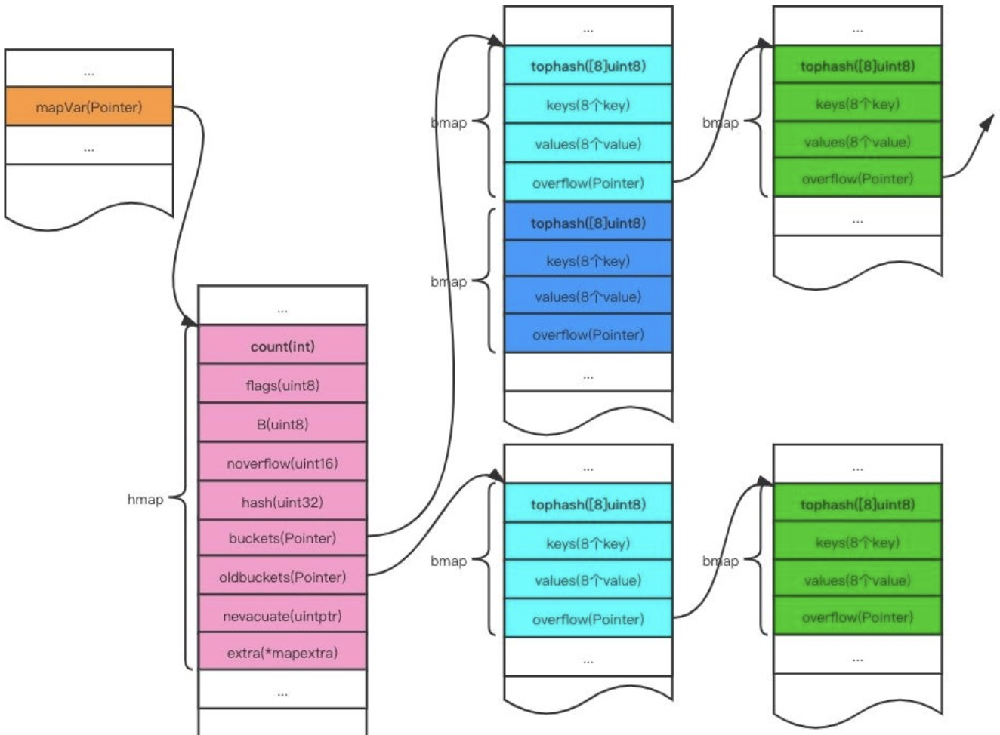
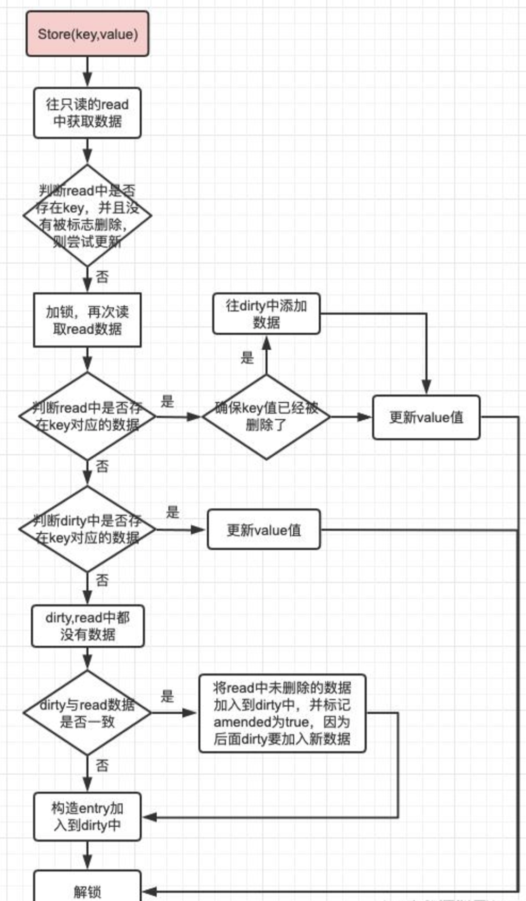

本文章来源于：<https://github.com/Zeb-D/my-review> ，请star 强力支持，你的支持，就是我的动力。

[TOC]

------

### 序

在上节中我们聊了些golang底层库开发了一些并发安全下的工具类，[golang 底层基石unsafe](https://mp.weixin.qq.com/s/wUuPr3gcj8-AmFGfnk77Mg)、[golang 一文搞懂高性能从lock free到锁](https://mp.weixin.qq.com/s/-R4PxUKrbpTy7_ebai5Iuw)。

那么本节开始聊聊golang常用的并发安全sync.Map的演变到深入理解。


### 常见面试题

Q1：golang底层提供了哪些map？

Q2：map为什么是不安全的，不安全的报错底层是怎么看出来的？

Q3：sync.Map 底层结构是什么？满足高并发用到了哪些科技点？

Q4：sync.Map 讲讲读写流程是什么样的？

> 欢迎留言交流，大家一起点亮技能点。


### 原生map

> map是一系列键值对的存储数据结构，提供快速的读写操作。map数据结构的核心是如何实现一个高效的hash寻址方式，以便程序能快速的读写数据。目前主流的寻址方式有两种，**开放寻址**和**拉链法**。
>
> 原生map在并发读写的时候，容易造成panic，这是因为原生map并不是线程安全的，对它进行并发读写操作的时候，会导致map里的数据发生错乱，因而导致panic。


#### 例子

```go
package main

import "time"

func main() {
	m := make(map[int]int)
	go func() {
		for {
			m[1] = 1
		}
	}()
	go func() {
		for {
			_, _ = m[1]
		}
	}()
	time.Sleep(2 * time.Second)
}
// 返回结果：fatal error: concurrent map read and map write
```


#### 源码解析

go底层map到底怎么存储呢?

map的源码位于 src/runtime/map.go中 ，map同样也是数组存储的的，每个数组下标处存储的是一个bucket,

每个bucket中可以存储8个kv键值对，当每个bucket存储的kv对到达8个之后，会通过overflow指针指向一个新的bucket，从而形成一个链表,看bmap的结构，我想大家应该很纳闷，没看见kv的结构和overflow指针啊，事实上，这两个结构体并没有显示定义，是通过指针运算进行访问的。


#### 数据结构

```
// A header for a Go map.
type hmap struct {    // 代表哈希表中元素个数，点那个调用len函数时候就会返回该字段的值
    count     int     // 状态标准，表示是否处于正在写入状态等，用于读写时候的冲突
    flags     uint8      // buckets桶的对数，  2^B ，如果B是5，则有32个桶
    B         uint8      // 溢出桶等数量
    noverflow uint16     // 生成hash的随机因子（seed），用来哈希函数对key求哈希值初始化这个随机数种子。
    hash0     uint32 
    // 指向Buckets数组的指针，数组大小为2^B，如果元素个数等于0，则它为nil （ nil if count==0）
    buckets    unsafe.Pointer     // 底层实现是个bmap，如果发生扩容，oldbuckets是指向老的buckets数组的指针，老的buckets数组大小是新的buckets的1/2，在非扩容状态下，它为nil
    oldbuckets unsafe.Pointer     // 表示扩容进度，小于此地址的buckets则代表已经迁移完毕
    nevacuate  uintptr        
    // 用于保存溢出桶的地址，这个字段是为了优化GC扫描设计的
    extra *mapextra 
}
```



```go
//bucket结构体定义 b就是bucket
type bmap{
    // tophash generally contains the top byte of the hash value
    // for each key  in this bucket. If tophash[0] < minTopHash,
    // tophash[0] is a bucket               evacuation state instead.
    //翻译：top hash通常包含该bucket中每个键的hash值的高八位。
    如果tophash[0]小于mintophash，则tophash[0]为桶疏散状态    //bucketCnt 的初始值是8
    tophash [bucketCnt]uint8
    // Followed by bucketCnt keys and then bucketCnt values.
    // NOTE: packing all the keys together and then all the values together makes the    // code a bit more complicated than alternating key/value/key/value/... but it allows    // us to eliminate padding which would be needed for, e.g., map[int64]int8.// Followed by an overflow pointer.    //翻译：接下来是bucketcnt键，然后是bucketcnt值。
    注意：将所有键打包在一起，然后将所有值打包在一起，    使得代码比交替键/值/键/值/更复杂。但它允许//我们消除可能需要的填充，    例如map[int64]int8./后面跟一个溢出指针
}
```


bmap就是上面说的桶(bucket)，一个bucket里会存放最多8个key/value，落入到同一个bucket的key是因为它们进过哈希计算后，哈希结果的低B位是相同的，什么意思呢？就是说比如第32号桶，然后B是5，那么就取哈希结果的低5位，低5位如果相同这些key就是命中同一个桶。

　上面决定落在哪个bucket，在bucket内，又会根据key计算出来的哈希值的高8位来决定key到底落入到bucket内具体位置(一个bucket内最多有8个位置)。

  在编译器编译之前bmap只有tophash这一个字段，是一个8位长度的数组，用来快速定位key是否在这个bucket内。

 编译后，会给bmap会多处几个字段，如下：

```
type bmap struct{
    tophash [8]uint8
    keys [8]keytype 
    // 8个key，keytype 由编译器编译时候确定
    values [8]elemtype 
    // 8个value，elemtype 由编译器编译时候确定
    overflow uintptr 
    // 如果桶溢出，overflow指向下一个bmap，overflow是uintptr而不是*bmap类型，保证bmap完全不含指针，是为了减少gc，    // 溢出桶存储到extra字段中。这个uintptr最终可以转换成指针，这个指针就指向了extra。
}
```

bmap结构体字段说明：

> - tophash字段是用于快速查找key是否在该bucket中，在实现过程中会使用key的hash值的高8位作tophash值，存放在bmap tophash字段中。tophash字段不仅存储key哈希值的高8位，还会存储一些状态值，用来表明当前桶单元状态。这些状态值都是小于minTopHash的。
>
> 　　　为了避免key哈希值高8位和这些状态相等，产生混淆情况，所以当key哈希值高8位若小于minTopHash时候，自动将其值添加加上minTopHash作为该key的tophash。


tophash状态值的定义

```
emptyRest      = 0 // 表示此桶单元为空，并且更高的索引单位也是空
emptyOne       = 1 // 此桶单元为空，但更高层索引下表单元不一定是空
evacuatedX     = 2 // 扩容相关：用于表示扩容迁移到新桶前半段区间
evacuatedY     = 3 // 扩容相关：用于表示扩容迁移到新桶后半段区间evacuatedEmpty = 4 // 表示此单元已经迁移minTopHash = 5     // key的tophash值和桶状态值分割线值，小于此值的一定代表桶单元的状态，当大于此值的一定是key对应的tophash值
```

当tophash[i] < 5时，表示存的是状态；

当tophash[i] >= 5时，表示存的是哈希值；


tophash字段计算代码

```
// tophash calculates the tophash value for hash.
func tophash(hash uintptr) uint8 {
    top := uint8(hash >> (sys.PtrSize*8 - 8))
    if top < minTopHash {
        top += minTopHash
    }
    return top
}
```

 看上面3-5行代码可以知道，当计算的哈希值小于minTopHash时，会直接在原有哈希值基础上加上minTopHash，确保哈希值一定大于minTopHash。

当map需要扩容的时候，一般有等量扩容和翻倍扩容，具体这两种扩容方式的设计下面再说。扩容方式都是新建一个桶列表（等量或翻倍），将数据从旧桶驱逐到新桶。

这样设计的好处，当等量时，一个桶里的数据全部映射到一个新的桶里。当翻倍扩容时。则B值一定是+1的，则原来在一个桶里的数据一定是被一分为二的分到两个桶里，简单方便，而且相对比较均匀。


mapextra结构体

```
type mapextra struct {
    //记录所有使用的溢出桶
    overflow    *[]*bmap 
    //用于在扩容阶段存储旧桶用到的溢出桶的地址
    oldoverflow *[]*bmap
    // 指向下一个空闲溢出桶
    nextOverflow *bmap
}
```


#### mapassign

扩容的时机是什么，增加元素触发 runtime.mapassign() 可能触发扩容，原码中是这样的条件：

overLoadFactor() || tooManOverflowBuckets() 即装载因子过大（超过6.5，平均每个Buckets6.5Key），或是有太多的溢处桶（超出8）就需要扩容了。

装载因子过大，表示数据的确很多了。每个桶都可能装了很多数据了。再往里写数据冲突的可能性会很大了，所以需要扩容了。

> 太多的溢出桶数据表示map数据经过一段时间的使用，主要是一些增删操作后数据很稀疏但有些数据因为增加的时候放到了溢出队列，删除的时候又删除了非溢出队列的数据。
>
> 虽然装载因子不大，但因为溢出队列多，此时会导致严重的性能下降，需要整理一下了。将在溢出桶的数据迁移到普通桶中以提高性能。

当然也有可能两个原因都满足的情况，总之上述两个条件满足一个就会触发扩容。


操作步骤大致如下：

> 先按扩容的容量创建一组新桶，可能是等量也可能是增量。然后将oldbuckets指向原有的桶数组，bucekets指向新的桶数组，并将map标记为扩容状态。此为第一步，完成后，虽然并没有扩容完成，但可以正常进行读写操作了。
>
> 扩容的整个操作并不是立即全量执行的，而是采用的渐进的方式进行驱逐，读取时不进行驱逐操作，只判断读取新桶还是旧桶。
>
> 只有当有写操作时才会对旧桶数据进行驱逐迁移。当所有数据都迁移完后，将旧桶数据删除，完成数据扩容。

```
func mapassign(t *maptype, h *hmap, key unsafe.Pointer) unsafe.Pointer {
    //获取hash算法
    alg := t.key.alg
    //计算hash值
    hash := alg.hash(key, uintptr(h.hash0))
    //如果bucket数组一开始为空，则初始化
    if h.buckets == nil {
        h.buckets = newobject(t.bucket) // newarray(t.bucket, 1)
    }
again:
    // 定位存储在哪一个bucket中
    bucket := hash & bucketMask(h.B)
    //得到bucket的结构体
    b := (*bmap)(unsafe.Pointer(uintptr(h.buckets) +bucket*uintptr(t.bucketsize)))
    //获取高八位hash值
    top := tophash(hash)
    var inserti *uint8
    var insertk unsafe.Pointer
    var val unsafe.Pointer
bucketloop:
    //死循环
    for {
        //循环bucket中的tophash数组
        for i := uintptr(0); i < bucketCnt; i++ {
            //如果hash不相等
            if b.tophash[i] != top {
             //判断是否为空，为空则插入
                if isEmpty(b.tophash[i]) && inserti == nil {
                    inserti = &b.tophash[i]
                    insertk = add(unsafe.Pointer(b), dataOffset+i*uintptr(t.keysize))
                    val = add( unsafe.Pointer(b), 
                    dataOffset+bucketCnt*uintptr(t.keysize)+i*uintptr(t.valuesize) )
                }
              //插入成功，终止最外层循环
                if b.tophash[i] == emptyRest {
                    break bucketloop
                }
                continue
            }
            //到这里说明高八位hash一样，获取已存在的key
            k := add(unsafe.Pointer(b), dataOffset+i*uintptr(t.keysize))
            if t.indirectkey() {
                k = *((*unsafe.Pointer)(k))
            }
            //判断两个key是否相等，不相等就循环下一个
            if !alg.equal(key, k) {
                continue
            }
            // 如果相等则更新
            if t.needkeyupdate() {
                typedmemmove(t.key, k, key)
            }
            //获取已存在的value
            val = add(unsafe.Pointer(b), dataOffset+bucketCnt*uintptr(t.keysize)+i*uintptr(t.valuesize))
            goto done
        }
        //如果上一个bucket没能插入，则通过overflow获取链表上的下一个bucket
        ovf := b.overflow(t)
        if ovf == nil {
            break
        }
        b = ovf
    }

    if inserti == nil {
        // all current buckets are full, allocate a new one.
        newb := h.newoverflow(t, b)
        inserti = &newb.tophash[0]
        insertk = add(unsafe.Pointer(newb), dataOffset)
        val = add(insertk, bucketCnt*uintptr(t.keysize))
    }

    // store new key/value at insert position
    if t.indirectkey() {
        kmem := newobject(t.key)
        *(*unsafe.Pointer)(insertk) = kmem
        insertk = kmem
    }
    if t.indirectvalue() {
        vmem := newobject(t.elem)
        *(*unsafe.Pointer)(val) = vmem
    }
    typedmemmove(t.key, insertk, key)
    //将高八位hash值存储
    *inserti = top
    h.count++
    return val
}

```


### sync.Map

map 不是并发安全的结构，并发读写会引发严重的错误，sync 标准包下的 sync.Map 能解决 map 并发读写的问题。

```
// 创建一个字符串到整数的 sync.Map
var m sync.Map

// 初始化 sync.Map
m.Store("one", 1)
m.Store("two", 2)
m.Store("three", 3)

// 打印 sync.Map
m.Range(func(key, value interface{}) bool {
    fmt.Printf("key: %s, value: %d\n", key, value)
    return true
})
```


#### 数据结构

```
type Map struct {
    mu Mutex
    read atomic.Value 
    dirty map[any]*entry
    misses int
}
```


sync.Map 主类中包含以下核心字段

| 字段    | 类型                   | 说明                                                         |
| ------- | ---------------------- | ------------------------------------------------------------ |
| mu      | Mutex                  | 互斥锁，保护dirty字段                                        |
| read    | atomic.Value           | 存读的数据。因为是atomic.Value类型，只读，所以并发是安全的。实际存的是readOnly的数据结构。 |
| misses  | int                    | 计数作用。每次从read中读失败，则计数+1。                     |
| dirty   | map[interface{}]*entry | 包含最新写入的数据。当misses计数达到一定值，将其赋值给read。 |
| m       | map[interface{}]*entry | 单纯的map结构                                                |
| amended | bool                   | Map.dirty的数据和这里的 m 中的数据不一样的时候，为true       |
| p       | unsafe.Pointer         | 指针类型                                                     |


可见，sync.Map 的特点是冗余了两份 map：read map 和 dirty map，后续的所介绍的交互流程也和这两个 map 息息相关，基本可以归结为两条主线：

> 主线一：首先基于无锁操作访问 read map；倘若 read map 不存在该 key，则加锁并使用 dirty map 兜底；
>
> 主线二：read map 和 dirty map 之间会交替轮换更新.


##### entry

```
type entry struct {
    p unsafe.Pointer 
}
```

kv 对中的 value，统一采用 unsafe.Pointer 的形式进行存储，通过 entry.p 的指针进行链接.


entry.p 的指向分为三种情况：

> I 存活态：正常指向元素；
>
> II 软删除态：指向 nil；
>
> III 硬删除态：指向固定的全局变量 expunged.


```text
var expunged = unsafe.Pointer(new(any))
```

> （1）存活态很好理解，即 key-entry 对仍未删除；
>
> （2）nil 态表示软删除，read map 和 dirty map 底层的 map 结构仍存在 key-entry 对，但在逻辑上该 key-entry 对已经被删除，因此无法被用户查询到；
>
> （3）expunged 态表示硬删除，dirty map 中已不存在该 key-entry 对.


##### readOnly

```
type readOnly struct {
    m       map[any]*entry
    amended bool // true if the dirty map contains some key not in m.
}
```

sync.Map 中的只读 map：read 内部包含两个成员属性：

> （1）m：真正意义上的 read map，实现从 key 到 entry 的映射；
>
> （2）amended：标识 read map 中的 key-entry 对是否存在缺失，需要通过 dirty map 兜底.


#### Load 读取数据流程


接下来代码解读：


##### sync.Map.Load()

```
func (m *Map) Load(key any) (value any, ok bool) {
    read, _ := m.read.Load().(readOnly)
    e, ok := read.m[key]
    if !ok && read.amended {
        m.mu.Lock()
        read, _ = m.read.Load().(readOnly)
        e, ok = read.m[key]
        if !ok && read.amended {
            e, ok = m.dirty[key]
            m.missLocked()
        }
        m.mu.Unlock()
    }
    if !ok {
        return nil, false
    }
    return e.load()
}
```

> （1）查看 read map 中是否存在 key-entry 对，若存在，则直接读取 entry 返回；
>
> （2）倘若第一轮 read map 查询 miss，且 read map 不全，则需要加锁 double check；
>
> （3）第二轮 read map 查询仍 miss（加锁后），且 read map 不全，则查询 dirty map 兜底；
>
> （4）查询操作涉及到与 dirty map 的交互，misses 加一；
>
> （5）解锁，返回查得的结果.


##### entry.load()

```text
func (e *entry) load() (value any, ok bool) {
    p := atomic.LoadPointer(&e.p)
    if p == nil || p == expunged {
        return nil, false
    }
    return *(*any)(p), true
}
```

> （1）sync.Map 中，kv 对的 value 是基于 entry 指针封装的形式；
>
> （2）从 map 取得 entry 后，最终需要调用 entry.load 方法读取指针指向的内容；
>
> （3）倘若 entry 的指针状态为 nil 或者 expunged，说明 key-entry 对已被删除，则返回 nil；
>
> （4）倘若 entry 未被删除，则读取指针内容，并且转为 any 的形式进行返回.


##### sync.Map.missLocked()

```text
func (m *Map) missLocked() {
    m.misses++
    if m.misses < len(m.dirty) {
        return
    }
    m.read.Store(readOnly{m: m.dirty})
    m.dirty = nil
    m.misses = 0
}
```

> （1）在读流程中，倘若未命中 read map，且由于 read map 内容存在缺失需要和 dirty map 交互时，会走进 missLocked 流程；
>
> （2）在 missLocked 流程中，首先 misses 计数器累加 1；
>
> （3）倘若 miss 次数小于 dirty map 中存在的 key-entry 对数量，直接返回即可；
>
> （4）倘若 miss 次数大于等于 dirty map 中存在的 key-entry 对数量，则使用 dirty map 覆盖 read map，并将 read map 的 amended flag 置为 false；
>
> （5）新的 dirty map 置为 nil，misses 计数器清零.


#### Store写流程




##### sync.Map.Store()

```text
func (m *Map) Store(key, value any) {
    read, _ := m.read.Load().(readOnly)
    if e, ok := read.m[key]; ok && e.tryStore(&value) {
        return
    }


    m.mu.Lock()
    read, _ = m.read.Load().(readOnly)
    if e, ok := read.m[key]; ok {
        if e.unexpungeLocked() {
            m.dirty[key] = e
        }
        e.storeLocked(&value)
    } else if e, ok := m.dirty[key]; ok {
        e.storeLocked(&value)
    } else {
        if !read.amended {
            m.dirtyLocked()
            m.read.Store(readOnly{m: read.m, amended: true})
        }
        m.dirty[key] = newEntry(value)
    }
    m.mu.Unlock()
}


func (e *entry) storeLocked(i *any) {
    atomic.StorePointer(&e.p, unsafe.Pointe
}
```

> （1）倘若 read map 存在拟写入的 key，且 entry 不为 expunged 状态，说明这次操作属于更新而非插入，直接基于 CAS 操作进行 entry 值的更新，并直接返回（存活态或者软删除，直接覆盖更新）；
>
> （2）倘若未命中（1）的分支，则需要加锁 double check；
>
> （3）倘若第二轮检查中发现 read map 或者 dirty map 中存在 key-entry 对，则直接将 entry 更新为新值即可（存活态或者软删除，直接覆盖更新）；
>
> （4）在第（3）步中，如果发现 read map 中该 key-entry 为 expunged 态，需要在 dirty map 先补齐 key-entry 对，再更新 entry 值（从硬删除中恢复，然后覆盖更新）；
>
> （5）倘若 read map 和 dirty map 均不存在，则在 dirty map 中插入新 key-entry 对，并且保证 read map 的 amended flag 为 true.（插入）
>
> （6）第（5）步的分支中，倘若发现 dirty map 未初始化，需要前置执行 dirtyLocked 流程；
>
> （7）解锁返回.


##### entry.tryStore()

```text
func (m *Map) Store(key, value any) {
    read, _ := m.read.Load().(readOnly)
    if e, ok := read.m[key]; ok && e.tryStore(&value) {
        return
    }


    m.mu.Lock()
   // ...
}


func (e *entry) tryStore(i *any) bool {
    for {
        p := atomic.LoadPointer(&e.p)
        if p == expunged {
            return false
        }
        if atomic.CompareAndSwapPointer(&e.p, p, unsafe.Pointer(i)) {
            return true
        }
    }
}
```

> （1）在写流程中，倘若发现 read map 中已存在对应的 key-entry 对，则会对调用 tryStore 方法尝试进行更新；
>
> （2）倘若 entry 为 expunged 态，说明已被硬删除，dirty 中缺失该项数据，因此 tryStore 执行失败，回归主干流程；
>
> （3）倘若 entry 非 expunged 态，则直接执行 CAS 操作完成值的更新即可.


##### entry.unexpungeLocked()

```text
func (m *Map) Store(key, value any) {
    // ...
    m.mu.Lock()
    read, _ = m.read.Load().(readOnly)
    if e, ok := read.m[key]; ok {
        if e.unexpungeLocked() {
            m.dirty[key] = e
        }
        e.storeLocked(&value)
    } 
    // ...
}


func (e *entry) unexpungeLocked() (wasExpunged bool) {
    return atomic.CompareAndSwapPointer(&e.p, expunged, nil)
}
```

> （1）在写流程加锁 double check 的过程中，倘若发现 read map 中存在对应的 key-entry 对，会执行该方法；
>
> （2）倘若 key-entry 为硬删除 expunged 态，该方法会基于 CAS 操作将其更新为软删除 nil 态，然后进一步在 dirty map 中补齐该 key-entry 对，实现从硬删除到软删除的恢复.


##### entry.storeLocked()

```text
func (m *Map) Store(key, value any) {
    // ...
    m.mu.Lock()
    read, _ = m.read.Load().(readOnly)
    if e, ok := read.m[key]; ok {
       // ...
        e.storeLocked(&value)
    } else if e, ok := m.dirty[key]; ok {
        e.storeLocked(&value)
    } 
    // ...
}


func (e *entry) storeLocked(i *any) {
    atomic.StorePointer(&e.p, unsafe.Pointer)
}
```

写流程中，倘若 read map 或者 dirty map 存在对应 key-entry，最终会通过原子操作，将新值的指针存储到 entry.p 当中.


##### sync.Map.dirtyLocked()

```text
func (m *Map) dirtyLocked() {
    if m.dirty != nil {
        return
    }


    read, _ := m.read.Load().(readOnly)
    m.dirty = make(map[any]*entry, len(read.m))
    for k, e := range read.m {
        if !e.tryExpungeLocked() {
            m.dirty[k] = e
        }
    }
}


func (e *entry) tryExpungeLocked() (isExpunged bool) {
    p := atomic.LoadPointer(&e.p)
    for p == nil {
        if atomic.CompareAndSwapPointer(&e.p, nil, expunged) {
            return true
        }
        p = atomic.LoadPointer(&e.p)
    }
    return p == expunged
}
```

> （1）在写流程中，倘若需要将 key-entry 插入到兜底的 dirty map 中，并且此时 dirty map 为空（从未写入过数据或者刚发生过 missLocked），会进入 dirtyLocked 流程；
>
> （2）此时会遍历一轮 read map ，将未删除的 key-entry 对拷贝到 dirty map 当中；
>
> （3）在遍历时，还会将 read map 中软删除 nil 态的 entry 更新为硬删除 expunged 态，因为在此流程中，不会将其拷贝到 dirty map.


#### Delete删流程

LoadAndDelete、Delete 他们是共用一套的。

```
// 删除数据
func (m *Map) LoadAndDelete(key interface{}) (value interface{}, loaded bool) {
	read, _ := m.read.Load().(readOnly) //往只读read总获得数据
	e, ok := read.m[key]
        // 如果read没有，并且dirty有新数据，那么去dirty中查找
        // read.amended=true说明dirty和read中的数据不一致，有新数据
	if !ok && read.amended { 
		m.mu.Lock() //加锁
                //二次读取，以防read在加锁过程中发生变化
		read, _ = m.read.Load().(readOnly) 
		e, ok = read.m[key]
                // 如果read没有，并且dirty有新数据，那么去dirty中查找
		if !ok && read.amended {
                        // 直接删除数据
			e, ok = m.dirty[key]
			delete(m.dirty, key)
			m.missLocked() // 不管m.dirty中是否有数据，都将misses计数+1
		}
		m.mu.Unlock() //解锁
	}
        // 如果read中有数据
	if ok {
		return e.delete() //尝试删除数据
	}
	return nil, false
}
// 尝试删除数据
func (e *entry) delete() (value interface{}, ok bool) {
	for {
		p := atomic.LoadPointer(&e.p)
		if p == nil || p == expunged {
			return nil, false
		}
		if atomic.CompareAndSwapPointer(&e.p, p, nil) {
			return *(*interface{})(p), true
		}
	}
}
// 调用了LoadAndDelete来删除
func (m *Map) Delete(key interface{}) {
	m.LoadAndDelete(key)
}
```


##### sync.Map.Delete()

```text
func (m *Map) Delete(key any) {
    m.LoadAndDelete(key)
}


func (m *Map) LoadAndDelete(key any) (value any, loaded bool) {
    read, _ := m.read.Load().(readOnly)
    e, ok := read.m[key]
    if !ok && read.amended {
        m.mu.Lock()
        read, _ = m.read.Load().(readOnly)
        e, ok = read.m[key]
        if !ok && read.amended {
            e, ok = m.dirty[key]
            delete(m.dirty, key)
            m.missLocked()
        }
        m.mu.Unlock()
    }
    if ok {
        return e.delete()
    }
    return nil, false
}
```

> （1）倘若 read map 中存在 key，则直接基于 cas 操作将其删除；
>
> （2）倘若read map 不存在 key，且 read map 有缺失（amended flag 为 true），则加锁 dou check；
>
> （3）倘若加锁 double check 时，read map 仍不存在 key 且 read map 有缺失，则从 dirty map 中取元素，并且将 key-entry 对从 dirty map 中物理删除；
>
> （4）走入步骤（3），删操作需要和 dirty map 交互，需要走进 3.3 小节介绍的 missLocked 流程；
>
> （5）解锁；
>
> （6）倘若从 read map 或 dirty map 中获取到了 key 对应的 entry，则走入 entry.delete() 方法逻辑删除 entry；
>
> （7）倘若 read map 和 dirty map 中均不存在 key，返回 false 标识删除失败.


##### entry.delete()

```text
func (e *entry) delete() (value any, ok bool) {
    for {
        p := atomic.LoadPointer(&e.p)
        if p == nil || p == expunged {
            return nil, false
        }
        if atomic.CompareAndSwapPointer(&e.p, p, nil) {
            return *(*any)(p), true
        }
    }
}
```

> （1）该方法是 entry 的逻辑删除方法；
>
> （2）倘若 entry 此前已被删除，则直接返回 false 标识删除失败；
>
> （3）倘若 entry 当前仍存在，则通过 CAS 将 entry.p 指向 nil，标识其已进入软删除状态.


#### Range遍历流程


```
// 遍历调用时刻 map 中的所有 k-v 对，将它们传给 f 函数，如果 f 返回 false，将停止遍历
func (m *Map) Range(f func(key, value interface{}) bool) {
	read, _ := m.read.Load().(readOnly)
        // read和dirty数据不一致时为true 
	if read.amended {
		m.mu.Lock()
		read, _ = m.read.Load().(readOnly)
		if read.amended {
                        // 将dirty赋值给read
			read = readOnly{m: m.dirty}
			m.read.Store(read)
			m.dirty = nil
			m.misses = 0
		}
		m.mu.Unlock()
	}
        // 遍历, for range是安全的
	for k, e := range read.m {
		v, ok := e.load()
		if !ok {
			continue
		}
		if !f(k, v) { //按照传入的func退出循环
			break
		}
	}
}
```

> （1）在遍历过程中，倘若发现 read map 数据不全（amended flag 为 true），会额外加一次锁，并使用 dirty map 覆盖 read map；
>
> （2）遍历 read map（通过步骤（1）保证 read map 有全量数据），执行用户传入的回调函数，倘若某次回调时返回值为 false，则会终止全流程.


#### 小结


为什么需要使用 entry 的 expunged 态 态来区分软硬删除呢？仅用 nil 一种状态来标识删除不可以吗？

**回答：**

首先需要明确，无论是软删除(nil)还是硬删除(expunged),都表示在逻辑意义上 key-entry 对已经从 sync.Map 中删除，nil 和 expunged 的区别在于：

> （1）软删除态（nil）：read map 和 dirty map 在物理上仍保有该 key-entry 对，因此倘若此时需要对该 entry 执行写操作，可以直接 CAS 操作；
>
> （2）硬删除态（expunged）： dirty map 中已经没有该 key-entry 对，倘若执行写操作，必须加锁（dirty map 必须含有全量 key-entry 对数据）.


设计 expunged 和 nil 两种状态的原因，就是为了优化在 dirtyLocked 前，针对同一个 key 先删后写的场景. 通过 expunged 态额外标识出 dirty map 中是否仍具有指向该 entry 的能力，这样能够实现对一部分 nil 态 key-entry 对的解放，能够基于 CAS 完成这部分内容写入操作而无需加锁.


##### read map 和 dirty map 的数据流转

sync.Map 由两个 map 构成：

（1）read map：访问时全程无锁；

（2）dirty map：是兜底的读写 map，访问时需要加锁.

之所以这样处理，是希望能根据对读、删、更新、写操作频次的探测，来实时动态地调整操作方式，希望在读、更新、删频次较高时，更多地采用 CAS 的方式无锁化地完成操作；在写操作频次较高时，则直接了当地采用加锁操作完成.

因此， sync.Map 本质上采取了一种以空间换时间 + 动态调整策略的设计思路，下面对两个 map 间的数据流转过程进行详细介绍：


##### 两个 map

（1）总体思想，希望能多用 read map，少用 dirty map，因为操作前者无锁，后者需要加锁；

（2）除了 expunged 态的 entry 之外，read map 的内容为 dirty map 的子集；


##### dirty map -> read map

（3）记录读/删流程中，通过 misses 记录访问 read map miss 由 dirty 兜底处理的次数，当 miss 次数达到阈值，则进入 missLocked 流程，进行新老 read/dirty 替换流程；此时将老 dirty 作为新 read，新 dirty map 则暂时为空，直到 dirtyLocked 流程完成对 dirty 的初始化；


##### read map -> dirty map

（4）发生 dirtyLocked 的前置条件： I dirty 暂时为空（此前没有写操作或者近期进行过 missLocked 流程）；II 接下来一次写操作访问 read 时 miss，需要由 dirty 兜底；

（5）在 dirtyLocked 流程中，需要对 read 内的元素进行状态更新，因此需要遍历，是一个线性时间复杂度的过程，可能存在性能抖动；

（6）dirtyLocked 遍历中，会将 read 中未被删除的元素（非 nil 非 expunged）拷贝到 dirty 中；会将 read 中所有此前被删的元素统一置为 expunged 态.


##### 适用场景与注意问题

> （1）sync.Map 适用于读多、更新多、删多、写少的场景；
>
> （2）倘若写操作过多，sync.Map 基本等价于互斥锁 + map；
>
> （3）sync.Map 可能存在性能抖动问题，主要发生于在读/删流程 miss 只读 map 次数过多时（触发 missLocked 流程），下一次插入操作的过程当中（dirtyLocked 流程）.


