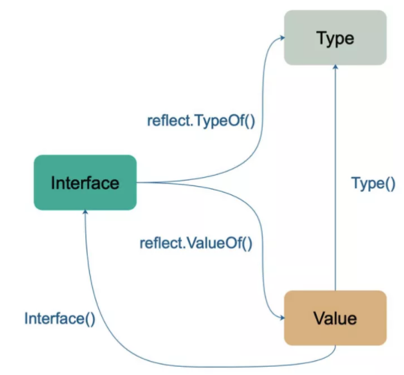
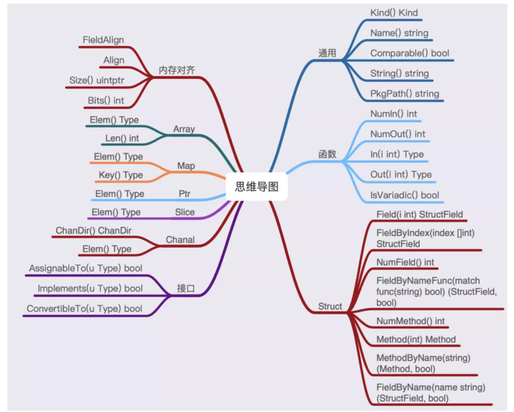
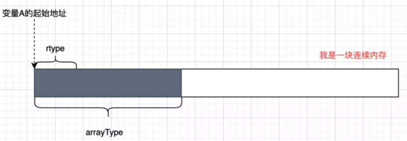
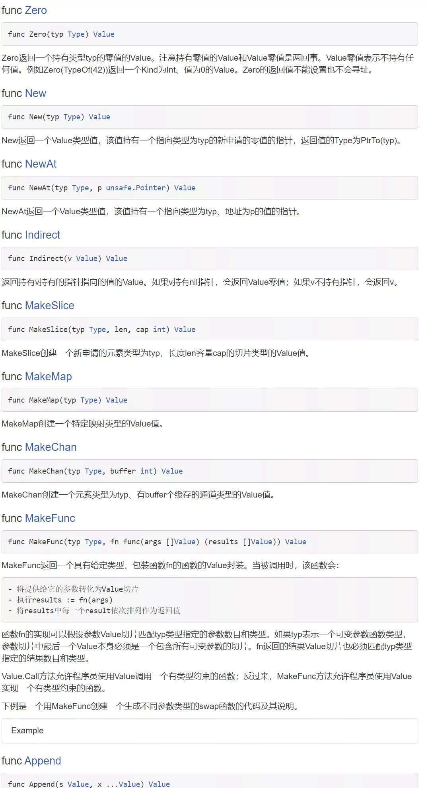

本文章来源于：<https://github.com/Zeb-D/my-review> ，请star 强力支持，你的支持，就是我的动力。

[TOC]

------

### 背景

reflect包是个神器，每种工具(方法)都有自己空间时间取舍，不同的方法会有自己的使用范围；

另外Java的反射是基于方法区，对象的初始化也基于此，Java的对象头就在运行时可以定位到方法区；


#### 与Java用法对比

golang 的反射很慢。这个和它的 api 设计有关。在 java 里面，我们一般使用反射都是这样来弄的。

##### Java

```
Field field = clazz.getField("hello");
field.get(obj1);
field.get(obj2);
```

这个取得的反射对象类型是 java.lang.reflect.Field。它是可以复用的。只要传入不同的obj，就可以取得这个obj上对应的 field。但是 golang 的反射不是这样设计的；


##### Go

```
type_ := reflect.TypeOf(obj)
field, _ := type_.FieldByName("hello")
```

这里取出来的 field 对象是 reflect.StructField 类型，但是它没有办法用来取得对应对象上的值。如果要取值，得用另外一套对object，而不是type的反射；

```
type_ := reflect.ValueOf(obj)
fieldValue := type_.FieldByName("hello")
```

虽然通过reflect.TypeOf可以获得对象的类型信息，

然后通过类型信息以及reflect.ValueOf获得的值信息来进行对象中成员或者对象值的设置。

但是，golang每设置一个对象的值就需要新生成一个对应的reflect.Value值，

每次反射都需要malloc这个reflect.Value结构体（堆逃逸）。golang的反射性能怎么可能快？


#### 缘由

go语言的类型系统是非常重要的，你掌握的程度在一定程度上决定了对go编程的精通度；

> Go 的反射机制带来很多动态特性，一定程度上弥补了 Go 缺少自定义范型而导致的不便利。
>
> Go 反射机制设计的目标之一是**任何操作（非反射）都可以通过反射机制来完成**。


### 概念与原理

变量是由两部分组成：变量的类型和变量的值。

#### 简单示例

我想知道一个struct对象，有什么field？我们可以简单实用`reflect.TypeOf`实现些；

```go
func TestStructOffset(t *testing.T) {
	type testObj struct {
		f1 string
	}
	testObj_ := testObj{}
	testObjType_ := reflect.TypeOf(testObj_)
	fmt.Printf("%v,%v,%v\n", testObjType_.NumField(), testObjType_.Size(), testObjType_.Kind())
	for i := 0; i < testObjType_.NumField(); i++ {
		fmt.Printf("%v,%v,%v \n", testObjType_.Field(i).Name, testObjType_.Field(i).Offset, testObjType_.Field(i).Type)
	}
}
```

```
1,16,struct
f1,0,string
```

外层对象类型及大小输出，内部field名词类型输出；


#### 类型和值

`reflect.Type`和`reflect.Value`是反射的两大基本要素，他们的关系如下：

- 任意类型都可以转换成`Type`和`Value`
- `Value`可以转换成`Type`
- `Value`可以转换成`Interface`

我们来简单看下他们是怎么转换的：




#### Type

**类型系统**

`Type`描述的是变量的类型，关于类型请参考下面这个文章：

**Go 类型系统概述**

Go 语言的类型系统非常重要，如果不熟知这些概念，则很难精通 Go 编程。


##### Type 是什么？

`reflect.Type`实际上是一个接口，它提供很多`api`(方法)让你获取变量的各种信息。

比如对于数组提供了`Len`和`Elem`两个方法分别获取数组的长度和元素。

它提供了几十个方法，我们来进行方法分类下：



每种类型可以使用的方法都是不一样的，错误的使用会引发`panic`。

**思考**：为什么`array`支持`Len`方法，而`slice`不支持？


##### Type的实现原理

使用`reflect.TypeOf`可以获取变量的`Type`

```go
func TypeOf(i interface{}) Type {
 eface := *(*emptyInterface)(unsafe.Pointer(&i)) // 强制转换成*emptyInterface类型
 return toType(eface.typ)
}
```

TypeOf 反射的是变量的类型，而不是变量的值（这点非常的重要）。

- `unsafe.Pointer(&i)`，先将`i`的地址转换成`Pointer`类型
- `(*emptyInterface)(unsafe.Pointer(&i))`，强制转换成`*emptyInterface`类型
- `*(*emptyInterface)(unsafe.Pointer(&i))`，解引用，所以`eface`就是`emptyInterface`

通过`unsafe`的骚操作，我们可以将任意类型转换成`emptyInterface`类型。因为`emptyInterface`是不可导出的，所以使用`toType`方法将`*rtype`包装成可导出的`reflect.Type`。

```go
// emptyInterface is the header for an interface{} value.
type emptyInterface struct {
 typ  *rtype
 word unsafe.Pointer
}

// toType converts from a *rtype to a Type that can be returned
// to the client of package reflect. In gc, the only concern is that
// a nil *rtype must be replaced by a nil Type, but in gccgo this
// function takes care of ensuring that multiple *rtype for the same
// type are coalesced into a single Type.
func toType(t *rtype) Type {
 if t == nil {
  return nil
 }
 return t
}
```

`rtype`就是`reflect.Type`的一种实现。


##### rtype 结构解析

```go
type rtype struct {
   size       uintptr // 类型占用空间大小
   ptrdata    uintptr // size of memory prefix holding all pointers
   hash       uint32 // 唯一hash，表示唯一的类型
   tflag      tflag // 标志位
   align      uint8 // 内存对其
   fieldAlign uint8
   kind       uint8 //
   /**
  func (t *rtype) Comparable() bool {
   return t.equal != nil
  }
  */
   equal func(unsafe.Pointer, unsafe.Pointer) bool // 比较函数，是否可以比较
   // gcdata stores the GC type data for the garbage collector.
   // If the KindGCProg bit is set in kind, gcdata is a GC program.
   // Otherwise it is a ptrmask bitmap. See mbitmap.go for details.
   gcdata    *byte
   str       nameOff // 字段名称
   ptrToThis typeOff
}
```

`rtype`里面的信息包括了：

- size：类型占用空间的大小（大小特指类型的直接部分，什么是直接部分请参考**值部**）

- tflag：标志位

- - tflagUncommon: 是否包含一个指针，比如`slice`会引用一个`array`
  - tflagNamed：是否是命名变量，如`var a = []string`，`[]string`就匿名的，a 是命名变量

- hash：类型的 hash 值，每一种类型在 runtime 里面都是唯一的

- kind：底层类型，一定是官方库定义的**26 个基本内置类型**[3]其中之一

- equal：确定类型是否可以比较

- ...

看到这里发现`rtype`类型描述的信息是有限的，

比如一个`array`的`len`是多长，数组元素的类型，都无法体现。你知道这些问题的答案么？

看下`Elem`方法的实现——根据`Kind`的不同，可以再次强制转换类型。

```go
func (t *rtype) Elem() Type {
 switch t.Kind() {
 case Array:
  tt := (*arrayType)(unsafe.Pointer(t))
  return toType(tt.elem)
 case Chan:
  tt := (*chanType)(unsafe.Pointer(t))
  return toType(tt.elem)
 ...
}
```

观察下`arrayType`和`chanType`的定义，第一位都是一个`rtype`。

我们可以简单理解，就是一块内存空间，最开头就是`rtype`，

后面根据类型不同跟着的结构也是不同的。

`(*rtype)(unsafe.Pointer(t))`只读取开头的`rtype`，

`(*arrayType)(unsafe.Pointer(t))`强制转换之后，

不仅读出了`rtype`还读出了数组特有的`elem`、`slice`和`len`的值。

```go
// arrayType represents a fixed array type.
type arrayType struct {
 rtype
 elem  *rtype // array element type
 slice *rtype // slice type
 len   uintptr
}

// chanType represents a channel type.
type chanType struct {
 rtype
 elem *rtype  // channel element type
 dir  uintptr // channel direction (ChanDir)
}
```




##### Type入门用法

```go
type f struct {
}

func (p f) Run(a string) {

}

func TestReflectMethod(tt *testing.T) {
	p := f{}
	t := reflect.TypeOf(p)
	fmt.Printf("f有%d个方法\n", t.NumMethod())

	m := t.Method(0)
	mt := m.Type
	fmt.Printf("%s方法有%d个参数\n", m.Name, mt.NumIn())
	for i := 0; i < mt.NumIn(); i++ {
		fmt.Printf("\t第%d个参数是%#v\n", i, mt.In(i).String())
	}
}
```

```
=== RUN   TestReflectMethod
f有1个方法
Run方法有2个参数
	第0个参数是"todo.f"
	第1个参数是"string"
--- PASS: TestReflectMethod (0.00s)
PASS
```

**思考：**如果我们将 Run 方法定义为`func (p *f) Run(a string) {}`，结果会是什么样呢？

> t := reflect.TypeOf(p) 要改成t := reflect.TypeOf(&p)才能反射出


#### Value

明白了`Type`之后，`Value`就非常好理解了。


##### Value 是什么

`value`是一个超级简单的结构体，简单到只有 3 个`field`：

```go
type Value struct {
 // 类型元数据
 typ *rtype

 // 值的地址
 ptr unsafe.Pointer

 // 标识位
 flag
}
```

看到`Value`中也包含了`*rtype`，这就解释了为什么`reflect.Value`可以直接转换成`reflect.Type`。


##### value的实现原理

```go
func ValueOf(i interface{}) Value {
 if i == nil {
  return Value{}
 }

 // TODO: Maybe allow contents of a Value to live on the stack.
 // For now we make the contents always escape to the heap. It
 // makes life easier in a few places (see chanrecv/mapassign
 // comment below).
 escapes(i)

 return unpackEface(i)
}

// unpackEface converts the empty interface i to a Value.
func unpackEface(i interface{}) Value {
 e := (*emptyInterface)(unsafe.Pointer(&i))
 // NOTE: don't read e.word until we know whether it is really a pointer or not.
 t := e.typ
 if t == nil {
  return Value{}
 }
 f := flag(t.Kind())
 if ifaceIndir(t) {
  f |= flagIndir
 }
 return Value{t, e.word, f}
}
```

`ValueOf`函数很简单，先将`i`主动逃逸到堆上，然后将 i 通过`unpackEface`函数转换成`Value`。

`unpackEface`函数，`(*emptyInterface)(unsafe.Pointer(&i))`将`i`强制转换成`eface`，然后变为`Value`返回。


##### 堆逃逸

逃逸到堆意味着将值拷贝一份到堆上，这也是反射`慢`的主要原因。

```go
//reflect.ValueOf //逃逸到堆意味着将值拷贝一份到堆上
	var aa = "xxx"
	_ = reflect.ValueOf(&aa)

	var bb = "xxx2"
	_ = reflect.TypeOf(&bb)
```

然后想要看到是否真的逃逸，可以使用`go build -gcflags -m`编译，输出如下：

```
./main.go:9:21: inlining call to reflect.ValueOf
./main.go:9:21: inlining call to reflect.escapes
./main.go:9:21: inlining call to reflect.unpackEface
./main.go:9:21: inlining call to reflect.(*rtype).Kind
./main.go:9:21: inlining call to reflect.ifaceIndir
./main.go:12:20: inlining call to reflect.TypeOf
./main.go:12:20: inlining call to reflect.toType
./main.go:8:6: moved to heap: a
```


##### Value settable 的问题

```go
func main() {
 a := "aaa"
 v := reflect.ValueOf(a)
 v.SetString("bbb")
 println(v.String())
}

// panic: reflect: reflect.Value.SetString using unaddressable value
```

上面的代码会发生`panic`，原因是`a`的值不是一个可以`settable`的值。

`v := reflect.ValueOf(a)`将`a`传递给了`ValueOf`函数，

在`go`语言中都是值传递，意味着需要将变量`a`对应的值复制一份当成函数入参数。

此时反射的`value`已经不是曾今的`a`了，那我通过反射修改值是不会影响到`a`。

当然这种修改是令人困惑的、毫无意义的，所以 go 语言选择了报错提醒。


##### 通过反射修改值

既然不能直接传递值，那么就传递变量地址吧！

```go
func main() {
   a := "aaa"
   v := reflect.ValueOf(&a)
    v = v.Elem()
   v.SetString("bbb")
   println(v.String())
}

// bbb
```

- `v := reflect.ValueOf(&a)`，将`a`的地址传递给了`ValueOf`，值传递复制的就是`a`的地址。
- `v = v.Elem()`，这部分很关键，因为传递的是`a`的地址，那么对应`ValueOf函数`的入参的值就是一个地址，地址是禁止修改的。`v.Elem()`就是解引用，返回的`v`就是变量`a`真正的`reflection Value`。


##### Value入门用法

参考Java中的	`com.google.common.collect.Lists#partition` 对数组按照大小进行切割；

大批量操作的时候，出于性能考虑我们经常需要先进行分片，然后分批写入数据库。那么有没有一个函数可以对任意类型（T）进行分片呢？

详细代码请看[reflect_type_get_value_test.go](https://github.com/Zeb-D/go-util/blob/master/todo/reflect_type_get_value_test.go)

```go
// SliceChunk 任意类型分片
// list： []T
// ret: [][]T
func SliceChunk(list interface{}, chunkSize int) (ret interface{}) {
	v := reflect.ValueOf(list)
	ty := v.Type() // []T

	// 先判断输入的是否是一个slice
	if ty.Kind() != reflect.Slice {
		fmt.Println("the parameter list must be an array or slice")
		return nil
	}

	// 获取输入slice的长度
	l := v.Len()

	// 计算分块之后的大小
	chunkCap := l/chunkSize + 1

	// 通过反射创建一个类型为[][]T的slice
	chunkSlice := reflect.MakeSlice(reflect.SliceOf(ty), 0, chunkCap)
	if l == 0 {
		return chunkSlice.Interface()
	}

	var start, end int
	for i := 0; i < chunkCap; i++ {
		end = chunkSize * (i + 1)
		if i+1 == chunkCap {
			end = l
		}
		// 将切片的append到chunk中
		chunkSlice = reflect.Append(chunkSlice, v.Slice(start, end))
		start = end
	}
	return chunkSlice.Interface()
}
```

自测：

```go
func TestSliceChunk(t *testing.T) {
	slice := []int{1, 2, 3, 4, 5, 6, 7, 8}
	s := SliceChunk(slice[1:], 3)
	fmt.Println(s)
	//看看这里面的类型
	st := reflect.TypeOf(slice)
	fmt.Printf("Elem:%v,Size:%v,Kind:%v,Align:%v,FieldAlign:%v \n", st.Elem(), st.Size(),
		st.Kind(), st.Align(), st.FieldAlign())
	st = reflect.TypeOf(s)
	fmt.Printf("Elem:%v,Size:%v,Kind:%v,Align:%v,FieldAlign:%v \n", st.Elem(), st.Size(),
		st.Kind(), st.Align(), st.FieldAlign())
	_, ok := s.([][]int)
	fmt.Println(ok)
}
```

```
=== RUN   TestSliceChunk
[[2 3 4] [5 6 7] [8]]
Elem:int,Size:24,Kind:slice,Align:8,FieldAlign:8 
Elem:[]int,Size:24,Kind:slice,Align:8,FieldAlign:8 
true
--- PASS: TestSliceChunk (0.00s)
PASS
```


##### 注意点

- 里面的属性必须可导出，属性名必须大写，由`CanSet()`可以知道是否可以导出；
- 每次导出会生成一个新的reflect.value，内存分配及堆逃逸；


#### 小结

有三点建议：

- 可以只使用`reflect.TypeOf`的话，就不要使用`reflect.ValueOf`；
- 可以使用断言代替的话，就不要使用反射
- 如果有可能应当**避免使用反射**


### 高级用法

#### 常见用法

可参考[reflect_unsafe_test.go](https://github.com/Zeb-D/go-util/blob/master/todo/reflect_unsafe_test.go)，主要学习常用方法调用如`TestValue`和`TestType`；

`reflect.TypeOf` + `uintptr`+`unsafe.Pointer`


此处代码请看[reflect_uintptr_test.go](https://github.com/Zeb-D/go-util/blob/master/todo/reflect_uintptr_test.go)，此处参考了`json-iterator/go`开源代码；


##### reflect_struct

怎么利用 reflect.StructField 取得对象上的值？

在 reflect.StructField 上有一个 Offset 的属性。利用这个可以计算出字段的指针值。

```go
func TestReflectStruct(t *testing.T) {
	type TestObj struct {
		field1 string
	}
	struct_ := &TestObj{}
	field, _ := reflect.TypeOf(struct_).Elem().FieldByName("field1")
	field1Ptr := uintptr(unsafe.Pointer(struct_)) + field.Offset
	*((*string)(unsafe.Pointer(field1Ptr))) = "hello"
	fmt.Println(struct_)
}
```

```
=== RUN   TestReflectStruct
&{hello}
--- PASS: TestReflectStruct (0.00s)
PASS
```


##### reflect_interface

如果对应的结构体是以 interface{} 传进来的。还需要从 interface{} 上取得结构体的指针

```go
func TestReflectInterface(t *testing.T) {
	type TestObj struct {
		field1 string
	}
	struct_ := &TestObj{}
	structInter := (interface{})(struct_)
	// emptyInterface is the header for an interface{} value.
	type emptyInterface struct {
		typ  *struct{}
		word unsafe.Pointer
	}
	structPtr := (*emptyInterface)(unsafe.Pointer(&structInter)).word
	field, _ := reflect.TypeOf(structInter).Elem().FieldByName("field1")
	field1Ptr := uintptr(structPtr) + field.Offset
	*((*string)(unsafe.Pointer(field1Ptr))) = "hello"
	fmt.Println(struct_)
}
```

```
=== RUN   TestReflectInterface
&{hello}
--- PASS: TestReflectInterface (0.00s)
PASS
```


##### reflect_array

```go
func TestReflectSlice(t *testing.T) {
   slice := []string{"hello", "world", "china"}
   type sliceHeader struct {
      Data unsafe.Pointer
      Len  int
      Cap  int
   }
   header := (*sliceHeader)(unsafe.Pointer(&slice)) //数组开始地址
   fmt.Println(header.Len) //输出数组大小
   elementType := reflect.TypeOf(slice).Elem()//数组内元素类型
   fmt.Printf("Kind:%v,Size:%v \n", elementType.Kind(), elementType.Size())
   secondElementPtr := uintptr(header.Data) + elementType.Size() //第二个元素
   *((*string)(unsafe.Pointer(secondElementPtr))) = "!!!"
   fmt.Println(slice)
   firstElementPtr := uintptr(header.Data) //开始地址即第一个元素
   *((*string)(unsafe.Pointer(firstElementPtr))) = "```"
   fmt.Println(slice)
   threeElementPtr := secondElementPtr + elementType.Size() //第三个元素
   *((*string)(unsafe.Pointer(threeElementPtr))) = "aaa"
   fmt.Println(slice)
}
```

```
=== RUN   TestReflectSlice
3
Kind:string,Size:16 
[hello !!! china]
[``` !!! china]
[``` !!! aaa]
--- PASS: TestReflectSlice (0.00s)
PASS
```


##### reflect_map

对于 Map 类型来说，没有 reflect.ValueOf 之外的获取其内容的方式。
所以还是只能老老实实地用golang自带的值反射api。

```go
func TestReflectMap(t *testing.T) {
	// map由于结构比较复杂，关于map中元素的修改不太可能
	var mmap = make(map[int]string)
	mmap[1] = "hello"
	mmap[2] = "world"
	var value_map = reflect.ValueOf(&mmap)
	fmt.Println("canset of value_map:", value_map.CanSet())

	var value_of_map = value_map.Elem().MapIndex(reflect.ValueOf(1))
	fmt.Println("canset of value_of_map:", value_of_map.CanSet())
	fmt.Println("Interface of value_of_map:", value_of_map.Interface())
}
```

```
=== RUN   TestReflectMap
canset of value_map: false
canset of value_of_map: false
Interface of value_of_map: hello
--- PASS: TestReflectMap (0.00s)
PASS
```


##### reflect 一些util

在本章的Value小节中[Value入门用法](#Value入门用法)，通过reflect进行创建slice type，进而Append；

> 类型Java的 class.newInstance，然后将值不同的method invoke；

通过下图中的api可以通过reflect.Type新建reflect.Value值：




#### 属性偏移量

此处的内容和[`reflect.TypeOf` + `uintptr`+`unsafe.Pointer`](#`reflect.TypeOf` + `uintptr`+`unsafe.Pointer`) 实现也就那么三板斧子，所以此处偏总结；


##### 基本类型的内存占用

golang的基本类型的内存占用可以通过其底层数据类型得出。

1. int 在64位机器中占用8个字节，在32位机器中占用4个字节

2. int32占用4个字节

3. int64占用8个字节

4. float64占用8个字节
5. float32占用4个字节 
6. 指针或者uintptr在64位机器中占用8个字节，而在32位机器中占用4个字节

7. string的底层类型是reflect.StringHeader，64位机器占用16个字节， 32位机器占用8个字节

   定义如下：

   ```
   type StringHeader struct {
        Data uintptr
        Len  int
    }
   ```

8. slice的底层类型是reflect.SliceHeader，64位机器占用24个字节，32位机器中占用12个字节

   定义如下：

   ```
   type SliceHeader struct {
        Data uintptr
        Len  int
        Cap  int
    }
   ```

9. bool占用一个字节


##### 内存的字节对齐

在计算机底层中，为了提高空间利用率，会进行内存的字节对齐（一般是为了**对齐8个字节**），

例如bool，int32和int64三个数据放置在一起总共会占用16个字节，而不是1+4+8=13个字节。其实际内存分布如下：

```
 |--bool-- 1 byte| |--hole-- 3byte| |--int32-- 4byte| |--int-- 8 byte|
```

其中，hole是为了字节对齐而添加的空洞；

如下代码中，A_Struct的内存分布如下。

```go
type B_struct struct {
    B_int    int
    B_string string
    B_slice  []string
    B_map    map[int]string
  }
  type A_struct struct {
    a_int   int
    A_float float32
    A_bool  bool
    A_BPtr  *B_struct
    A_Bean  B_struct
  }
```

内存分布（作者的mac是64位）：

```
|--a_int-- 8 byte|
|--A_float-- 4 byte| |--A_bool-- 1 byte| |-- hole -- 3byte|
|--A_BPtr-- 8 byte|
|--B_int of A_Bbean-- 8byte|
|-- B_string of A_Bbean-- 16 byte|
|-- B_slice of A_Bbean-- 24 byte|
|-- B_map of A_Bbean-- 8 byte|
```


##### 内存不对齐造成内存浪费

细节代码请看[size_test.go](https://github.com/Zeb-D/go-util/blob/master/todo/size_test.go)，通过`unsafe.Sizeof`知道整个struct的大小，通过`unsafe.Offsetof`每个属性的漂移量；

```go
type T1 struct {
	b bool
	i int64
	f float32
}

type T2 struct {
	b bool
	f float32
	i int64
}
```

```go
  t1 := T1{}
	t2 := T2{}
	fmt.Println(unsafe.Sizeof(t1)) //24
	fmt.Println(unsafe.Sizeof(t2))	//16

	// unsafe.Alignof 函數返迴對應參數的類型需要對齊的倍數. 和 Sizeof 類似, Alignof 也是返迴一個常量表達式,
	// 對應一個常量.
	// 通常情況下布爾和數字類型需要對齊到它們本身的大小(最多8個字節), 其它的類型對齊到機器字大小.
	fmt.Println(unsafe.Alignof(t1))	//8
	fmt.Println(unsafe.Alignof(t2))	//8

	// unsafe.Offsetof 函數的參數必鬚是一個字段 x.f, 然後返迴 f 字段相對於 x 起始地址的偏移量, 包括可能的空洞.
	fmt.Println(unsafe.Offsetof(t1.f))	//16
	fmt.Println(unsafe.Offsetof(t1.b))	//0
```


注意：后续文章会提供内存不对齐会造成浪费外，也会造成高并发性能问题；


##### 对齐规则

结构体的成员变量，第一个成员变量的偏移量为 0。往后的每个成员变量的对齐值必须为编译器默认对齐长度（#pragma pack(n)）或当前成员变量类型的长度（unsafe.Sizeof），取最小值作为当前类型的对齐值。
其偏移量必须为对齐值的整数倍

结构体本身，对齐值必须为编译器默认对齐长度（#pragma pack(n)）或结构体的所有成员变量类型中的最大长度，取最大数的最小整数倍作为对齐值

结合以上两点，可得知若编译器默认对齐长度（#pragma pack(n)）超过结构体内成员变量的类型最大长度时，默认对齐长度是没有任何意义的


###### 实战

```
type Part1 struct {
	a bool
	b int32
	c int8
	d int64
	e byte
}
```

接下来我们一起分析一下，“它” 到底经历了些什么，影响了 “预期” 结果

| 成员变量   | 类型  | 偏移量 | 自身占用 |
| ---------- | ----- | ------ | -------- |
| a          | bool  | 0      | 1        |
| 字节对齐   | 无    | 1      | 3        |
| b          | int32 | 4      | 4        |
| c          | int8  | 8      | 1        |
| 字节对齐   | 无    | 9      | 7        |
| d          | int64 | 16     | 8        |
| e          | byte  | 24     | 1        |
| 字节对齐   | 无    | 25     | 7        |
| 总占用大小 | -     | -      | 32       |

###### **成员对齐**

- 第一个成员 a
  - 类型为 bool
  - 大小/对齐值为 1 字节
  - 初始地址，偏移量为 0。占用了第 1 位
- 第二个成员 b
  - 类型为 int32
  - 大小/对齐值为 4 字节
  - 根据规则 1，其偏移量必须为 4 的整数倍。确定偏移量为 4，因此 2-4 位为 Padding。而当前数值从第 5 位开始填充，到第 8 位。如下：axxx|bbbb
- 第三个成员 c
  - 类型为 int8
  - 大小/对齐值为 1 字节
  - 根据规则 1，其偏移量必须为 1 的整数倍。当前偏移量为 8。不需要额外对齐，填充 1 个字节到第 9 位。如下：axxx|bbbb|c...
- 第四个成员 d
  - 类型为 int64
  - 大小/对齐值为 8 字节
  - 根据规则 1，其偏移量必须为 8 的整数倍。确定偏移量为 16，因此 9-16 位为 Padding。而当前数值从第 17 位开始写入，到第 24 位。如下：axxx|bbbb|cxxx|xxxx|dddd|dddd
- 第五个成员 e
  - 类型为 byte
  - 大小/对齐值为 1 字节
  - 根据规则 1，其偏移量必须为 1 的整数倍。当前偏移量为 24。不需要额外对齐，填充 1 个字节到第 25 位。如下：axxx|bbbb|cxxx|xxxx|dddd|dddd|e...

###### **整体对齐**

在每个成员变量进行对齐后，根据规则 2，整个结构体本身也要进行字节对齐，因为可发现它可能并不是 `2^n`，不是偶数倍。显然不符合对齐的规则

根据规则 2，可得出对齐值为 8。现在的偏移量为 25，不是 8 的整倍数。因此确定偏移量为 32。对结构体进行对齐

###### **结果**

```
Part1 内存布局：axxx|bbbb|cxxx|xxxx|dddd|dddd|exxx|xxxx
```

