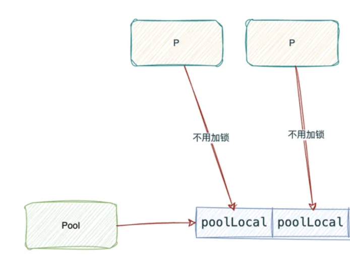
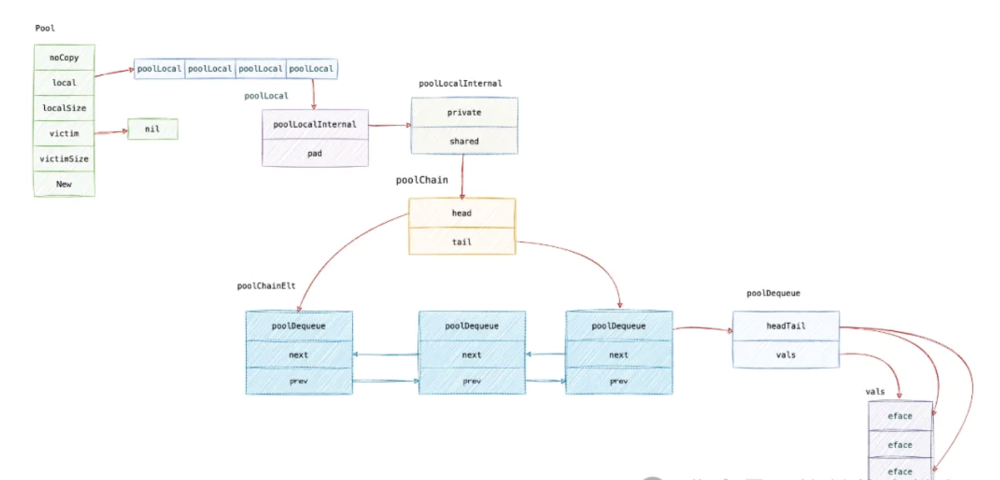
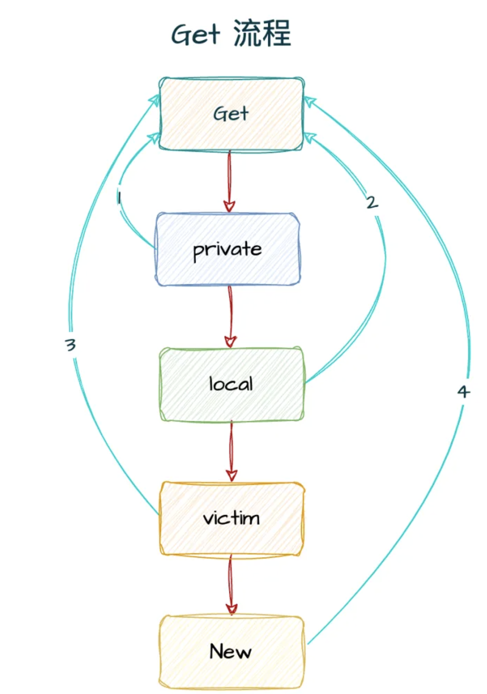

本文章来源于：<https://github.com/Zeb-D/my-review> ，请star 强力支持，你的支持，就是我的动力。

[TOC]

------

### 序

系统优化三板斧：堆机器、加缓存、升配置，其中缓存抽象成池化技术的一种，近一点的说本地缓存，内核一点的话就有比较多种（比如TCP的receive\accept 队列），分布式一点的话说分布式缓存。

那么golang也提供了底层池化技术sync.Pool，这是一门利器，在一些性能优化（特别是一些尖刺问题）它可以作为第一个参考推荐物。


### 常见面试题

回答隐藏在这篇文章中，耐心方能寻得真爱～

Q0：基础题：你平时有直接/间接用过sync.Pool吗？用它的理由是什么？


Q1：中阶题：sync.Pool 是如何减少重复分配的？又是如何避免GC的？


Q2：中阶题：sync.Pool 它的并发度是多少？你的参考是什么？


Q3：高阶题：你认为sync.Pool 有哪些缺点，你有重构思路吗？


注：欢迎留言/后台交流，知无不言～


### sync.Pool 是什么

> 官方解释是这样的：
>
> Pool是一组可以单独保存和检索的临时对象。目的是缓存已分配但未使用的对象供以后重用，从而减轻了垃圾回收器的压力，也就是说，它使构建高效，线程安全的空闲列表变得容易，但它并不适合所有空闲列表。
>
> 池的适当用法是管理一组临时项目，它们在程序包的并发独立客户端之间静默共享并有可能被重用。池提供了一种摊销许多客户端上的分配开销的方法。
>
> 很好地使用Pool的一个示例是fmt软件包，该软件包维护着动态大小的临时输出缓冲区存储。之前也有一篇文章也介绍这篇文章：[深入理解最常见的fmt方法实现](https://mp.weixin.qq.com/s/eZG5zxBBe4ZLbhw0x5UyAQ)。


sync.Pool是 Go 语言标准库中提供的一个用于对象复用的工具，它具有以下特点：

> **对象缓存**：使用 Get、Put 方法可以获取和归还sync.Pool中的数据，从而减轻内存分配与垃圾回收的压力；
>
> **自动回收**：sync.Pool中的对象可能会被自动回收。这意味着即使你将对象放入池中，也不能保证该对象会一直存在于池中。当内存紧张或者垃圾回收器运行时，sync.Pool中的对象可能会被回收，所以 sync.Pool 适用于存储那些临时使用、生命周期较短的对象；
>
> **并发安全**：sync.Pool对于并发访问是安全的。多个 goroutine 可以同时从池中获取和放回对象，而不需要额外的同步机制；
>
> **状态不可靠**：由于sync.Pool中的对象可能会被自动回收，所以不能依赖池中对象的状态。在从池中获取对象后，应该根据具体的使用场景对对象进行初始化，以确保对象处于正确的状态。


#### sync.Pool 适用场景

##### 频繁创建和销毁对象的场景

```
func (engine *Engine) ServeHTTP(w http.ResponseWriter, req *http.Request) {
    // 从 Pool 中获取 Context
    c := engine.pool.Get().(*Context)
    // 重置 writermem
    c.writermem.reset(w)
    // 重置 Request
    c.Request = req
    // 重置其他字段
    c.reset()
    
    engine.handleHTTPRequest(c)
    
    // 将 Context 对象放回 Pool
    engine.pool.Put(c)
}
```

- 比如在处理大量并发请求的服务器中，可能需要频繁地创建和销毁一些临时的结构体来存储请求数据。使用`sync.Pool`可以复用这些结构体，减少内存分配和垃圾回收的开销。

- 又如在一些数据处理程序中，可能需要频繁地创建和销毁一些临时的切片来存储中间结果。使用`sync.Pool`可以提高程序的性能，例如 [fmt 包里面的 pp 对象](https://mp.weixin.qq.com/s/eZG5zxBBe4ZLbhw0x5UyAQ)。
- 减少内存分配压力的场景
  - 在一些对内存分配比较敏感的场景中，如嵌入式系统或者资源受限的环境中，使用`sync.Pool`可以有效地减少内存分配的次数，从而降低内存占用。


#### sync.Pool 用法

##### 基础用法

```go
package main

import (
	"bytes"
	"io"
	"os"
	"sync"
	"time"
)

var bufPool = sync.Pool{
	New: func() interface{} {
		// 初始化，通常返回指针类型
		return new(bytes.Buffer)
	},
}

func timeNow() time.Time {
	return time.Unix(1136214245, 0)
}

func Log(w io.Writer, key, val string) {
	b := bufPool.Get().(*bytes.Buffer)
	b.Reset()
	b.WriteString(timeNow().UTC().Format(time.RFC3339))
	b.WriteByte(' ')
	b.WriteString(key)
	b.WriteByte('=')
	b.WriteString(val)
	w.Write(b.Bytes())
	bufPool.Put(b)
}

func main() {
	Log(os.Stdout, "path", "/search?q=flowers")
}

```

> 通常会把 sync.Pool 对象声明成全局变量，因为sync.Pool 对象作为缓存池通常不需要频繁创建和回收；
>
> 在需要临时对象时使用 Get 方法获取，通常 Get 之后需要进行断言和一些初始化操作，Get 之后的数据状态是不确定的。
>
> 使用完临时对象后需要使用 Put 方法将临时对象重新放入缓存池中，比较好的做法是在 Put 前要对临时对象做一些清理工作，以免影响下一次复用。


##### 性能对比

```go

var bufPool = sync.Pool{
	New: func() interface{} {
		// 初始化，通常返回指针类型
		return new(bytes.Buffer)
	},
}

func withoutPool() {
	buf := bytes.Buffer{}
	// 模拟对对象的使用
	buf.Write([]byte(`aaaadsdsdasdasdasdasd`))
}

func withPool() {
	buf := bufPool.Get().(*bytes.Buffer)
	// 模拟对对象的使用
	buf.Write([]byte(`aaaadsdsdasdasdasdasd`))
	bufPool.Put(buf)
}

func BenchmarkWithoutPool(b *testing.B) {
	b.ReportAllocs()
	for i := 0; i < b.N; i++ {
		withoutPool()
	}
}

func BenchmarkWithPool(b *testing.B) {
	b.ReportAllocs()
	for i := 0; i < b.N; i++ {
		withPool()
	}
}

```

```go
cpu: Intel(R) Core(TM) i7-9750H CPU @ 2.60GHz
BenchmarkWithoutPool-12         30305481                34.72 ns/op           64 B/op          1 allocs/op
BenchmarkWithPool-12            67764316                18.29 ns/op            0 B/op          0 allocs/op

```

通过基准测试可以看出，使用 sync.Pool 可以提高大概 40% 的性能，在实际开发中我们也可以使用sync.Pool提高我们服务的性能。


### 注意事项

1、由于sync.Pool中的对象可能会被随时回收和复用，不能依赖池中对象的初始状态。当从池中获取一个对象时，它可能处于任何状态，不能假定其字段已经被正确初始化。

2、例如，如果你从池中获取一个结构体对象用于存储数据，在使用前**必须明确地对其进行初始化操作**，以确保数据的准确性和一致性。否则，可能会出现不可预测的错误结果。

由于 GC 的执行时机和 Put 的内容我们很难掌控，所以通过 Get 得到数据的状态是不确定的，需要自己对对象重置为0。


#### 适用场景特定

1、sync.Pool适用于存储那些临时使用、生命周期较短的对象。对于需要长期保存状态或者具有复杂生命周期管理需求的对象，不适合使用sync.Pool。

2、例如，对于需要在多个不同的操作阶段都保持一致状态的业务对象，使用sync.Pool可能会导致状态丢失和不可预测的行为。而对于一些纯粹的临时计算结果的存储对象，sync.Pool则可以有效地提高性能和减少内存分配压力。


### sync.Pool 的工作原理

#### Pool 结构体

```go
type Pool struct {
    // noCopy 用于防止 Pool 被复制（可以使用 go vet 检测）
    noCopy noCopy
    
    // local 的主要作用是，多个 goroutine 同时访问 Pool 时，可以减少竞争，提升性能。
    // 实际类型是 [P]poolLocal。长度是 localSize。
    local unsafe.Pointer
    // []poolLocal 的长度。也就是 local 数组的长度
    localSize uintptr
    
    // 存放的是上一轮 GC 时的 local 字段的值。
    victim unsafe.Pointer
    // victim 数组的长度
    victimSize uintptr
    
    // 新建对象的方法。
    // Get 的时候如果 Pool 中没有对象可用，会调用这个方法来新建一个对象。
    New func() any
}
```

字段说明：



- local：底层类型是 poolLocal 类型的数组，长度是 runtime.GOMAXPROCS(0)，也就是当前 P 的数量。

  之所以local 是长度为 runtime.GOMAXPROCS(0) 的数组是为了提高性能，上面提到 sync.Pool 是可以被多个 goroutine 并发访问，如果使用锁防止竞态问题，那么sync.Pool 的访问就会变成串行的，会带来较大的性能问题。为了提高性能 sync.Pool 为每个 P 都分配了一个 poolLocal ，这样就避免了竞态问题。

- localSize：local 的长度。

- victim：上一轮 GC 时的 local 字段的值。

  victim 的作用是在 GC 的时候，将 local 的值赋值给 victim，然后将 local 置为 nil，这样就可以避免在 GC 的时候，local 中的对象被回收掉。当然，并不是完全不会回收，在经历一次 GC 之后，victim 中的对象就会被回收掉。这样做的好处是，**可以避免 GC 的时候清除 Pool 中的所有对象， 这样在 GC 之后如果需要大量地从 Pool 中获取对象也不至于产生瞬时的性能抖动**。

- victimSize：victim 的长度。

- New：新建对象的方法。


##### poolLocal 结构体

```go
type poolLocal struct {
    poolLocalInternal

    // Prevents false sharing on widespread platforms with
    // 128 mod (cache line size) = 0 .
    pad [128 - unsafe.Sizeof(poolLocalInternal{})%128]byte
}
```

> `poolLocalInternal`：本地pool池。
> `pad`：防止在缓存行上分配多个poolLocalInternal从而造成false sharing（[伪共享]）


##### poolLocalInternal 结构体

```go
type poolLocalInternal struct {
    private any       // Can be used only by the respective P.
    shared  poolChain // Local P can pushHead/popHead; any P can popTail.
}

type poolChain struct {
    head *poolChainElt
    tail *poolChainElt
}
```

> `private`：本地私有池，只能被对应的P(goroutine执行占用的处理器)使用。不会有并发问题，不用加锁。
>
> share：本地共享池，本地能通过pushHead和popHead，其他任何P通过popTail使用。因为可能有多个goroutine同时操作，所以需要加锁。类型为poolChain,是被实现为poolDequeue的[双向队列]。具体见下图。


##### poolChainElt 结构体

```go
type poolChainElt struct {
    poolDequeue
    next, prev *poolChainElt
}

type poolDequeue struct {
    headTail uint64
    vals []eface
}
```

poolChainElt 是链表的一个节点，prev 和 next 是指向前后节点的指针，poolDequeue 是一个环形队列，vals 是环形队列保存数据的地方，headTail 的高32位保存 head 节点的索引，低 32 位保存 tail 节点的索引。


poolDequeue


headTail：是环状队列的首位位置的指针，可以通过位运算解析出首尾的位置。生产者可以从 head 插入、head 删除，而消费者仅可从 tail 删除

> vals ：是存储 interface{} 值,这个的大小必须是2的幂。


eface

> typ,val：存储eface值，是一个无特殊意义的指针，可以包含任意类型的地址。


##### 整体数据结构




#### runtime 函数处理

##### runtime_procUnpin

> 在src/runtime/proc.go中被实现sync_runtime_procUnpin；表示获取当前goroutine，并解除禁止抢占。


##### runtime_procPin

> 在src/runtime/proc.go中被实现sync_runtime_procPin；表示获取当前goroutine绑定的M，获取M绑定的P的id，并且禁止抢占。


##### runtime_registerPoolCleanup

> 在src/runtime/proc.go中被实现sync_runtime_registerPoolCleanup；表示在GC之前调用该函数。


#### Put 方法

```go
func (p *Pool) Put(x interface{}) {
        // 对象x 不能为nil
	if x == nil {
		return
	}
        // 竞态检测
	if race.Enabled {
		if fastrand()%4 == 0 {
			return
		}
		race.ReleaseMerge(poolRaceAddr(x))
		race.Disable()
	}
        // 获取当前P对应的poolLocal对象池
	l, _ := p.pin() 
        // 本地私有池为空
	if l.private == nil {
                // 赋值
		l.private = x
		x = nil
	}
        // x不为空
	if x != nil {
                // 添加至本地共享池
		l.shared.pushHead(x)
	}
        // 调用方必须在完成取值后调用 runtime_procUnpin() 来取消禁止抢占
	runtime_procUnpin()
	if race.Enabled {
		race.Enable()
	}
}
```

Pool Put 的流程：

> 1、如果 Put 的值是 nil，则直接返回。
>
> 2、将当前的 goroutine 和 P 绑定，禁止被抢占，返回当前 P 的本地缓存（poolLocal）和 P 的 ID。
>
> 3、如果本地 private 为空，则将 x 放入本地 private。
>
> 4、如果本地 private 不为空，则将 x 放入本地 shared 的头部。
>
> 5、将当前的 goroutine 和 P 解绑，允许被抢占。


##### pin()

```go
// 将当前的 goroutine 和 P 绑定，禁止被抢。
func (p *Pool) pin() (*poolLocal, int) {
    // procPin 函数的目的是为了当前 G 绑定到 P 上。
    pid := runtime_procPin() // 返回当前 P 的 id。
    
    // 在 pinSlow 中，我们会存储 local，然后再存储 localSize，
    // 这里我们以相反的顺序读取。 由于我们禁用了抢占，
    // 因此 GC 不能在两者之间发生。
    s := runtime_LoadAcquintptr(&p.localSize) // load-acquire
    l := p.local                              // load-consume
    if uintptr(pid) < s {                     // pid < s，说明当前 P 已经初始化过了。
        return indexLocal(l, pid), pid // 返回当前 P 的 poolLocal。
    }
    
    return p.pinSlow() // 如果当前 P 没有初始化过，那么就调用 pinSlow()。
}
```

> 1、调用 runtime_procPin 将当前协程与 P 绑定，禁用抢占，并返回当前 P 的 id，完成后需要调用 runtime_procUnpin() 进行解绑，禁止抢占的目的是防止发生 GC 导致 p.local 的长度和 p.localSize 不一致；
>
> 2、pid < s 时说明当前 P 已经初始化过了，调用 indexLocal 返回当前 P 的 poolLocal。
>
> 3、如果当前 P 没有初始化过，那么就调用 pinSlow()

indexLocal 逻辑比较简单，通过偏移量来获取对应 pid 的 poolLocal，之前的文章《[深入理解 go unsafe](https://mp.weixin.qq.com/s/wUuPr3gcj8-AmFGfnk77Mg)》介绍过如何通过偏移量来获取数组的元素。

```go
func indexLocal(l unsafe.Pointer, i int) *poolLocal {
    lp := unsafe.Pointer(uintptr(l) + uintptr(i)*unsafe.Sizeof(poolLocal{}))
    return (*poolLocal)(lp)
}
```


##### pinSlow()

```go
func (p *Pool) pinSlow() (*poolLocal, int) {
    // 在互斥锁下重试。
    // 在固定时无法锁定互斥锁。
    runtime_procUnpin()       // 解除当前 P 的绑定。
    allPoolsMu.Lock()         // 加全局锁。
    defer allPoolsMu.Unlock() // 解锁。
    pid := runtime_procPin()  // 重新绑定当前 P。
    // 在绑定时不会调用 poolCleanup。（无法被抢占，GC 不会发生）
    s := p.localSize
    l := p.local
    
    if uintptr(pid) < s { // 这其实是一个 double-checking，如果在加锁期间，其他 goroutine 已经初始化过了，就直接返回。
        return indexLocal(l, pid), pid
    }
    
    // p.local == nil 说明 pool 还没有初始化过。
    if p.local == nil { // 如果当前 P 没有初始化过，那么就将当前 P 添加到 allPools 中。
        allPools = append(allPools, p)
    }
    
    // 当 local 数组为空，或者和当前的 runtime.GOMAXPROCS 不一致时，
    // 将触发重新创建 local 数组，以和 P 的个数保持一致。
    // 如果在 GC 之间更改了 GOMAXPROCS，我们将重新分配数组并丢弃旧数组。
    size := runtime.GOMAXPROCS(0)                            // 获取当前 GOMAXPROCS（也就是 P 的个数）
    local := make([]poolLocal, size)                         // 创建一个 poolLocal 数组
    atomic.StorePointer(&p.local, unsafe.Pointer(&local[0])) // 原子操作：将数组的地址赋值给 p.local, &local[0] 的地址就是数组的起始地址
    runtime_StoreReluintptr(&p.localSize, uintptr(size))     // 原子操作：将 local 的长度赋值给 p.localSize
    return &local[pid], pid                                  // 返回当前 P 关联的 poolLocal，以及当前 P 的 id。
}
```

pinSlow 的流程：

> 1、解除当前 P 的绑定。
>
> 2、加全局 Pool 的锁。
>
> 3、重新绑定当前 P，重新绑定的目的是防止抢占，以免发生GC时localSize 和 local 的长度不一致。
>
> 4、如果当前 P 的 id 小于 localSize，那么就返回当前 P 的 poolLocal。（典型的 double-checking）
>
> 5、如果 local 还没初始化，那么将当前 P 的 poolLocal 添加到 allPools 中。
>
> 6、初始化 local。最后返回当前 P 的 poolLocal。


##### shared.pushHead()

```go
// 添加一个元素到队列头部
func (c *poolChain) pushHead(val any) {
    // 链表头
    d := c.head
    if d == nil { // 链表为空
        // 初始化链表。
        // 新建 poolChainElt，然后 c 的 head 和 tail 都指向这个新建的元素。
        const initSize = 8 // 初始化大小为 8
        // 新建一个节点，类型为 poolChainElt
        d = new(poolChainElt)
        d.vals = make([]eface, initSize)
        // 将 c 的 head 和 tail 都指向这个新建的元素
        c.head = d
        // 使用原子操作保存 c.tail，因为其他 goroutine 也可能会修改 c.tail。
        storePoolChainElt(&c.tail, d)
    }
    
    // poolQueue 还没满的时候可以成功 push，pushHead 会返回 true。
    // poolQueue 满的时候 pushHead 返回 false。
    if d.pushHead(val) {
        return
    }
    
    // 当前 dequeue 已满。分配一个两倍大小的新 dequeue。
    newSize := len(d.vals) * 2
    if newSize >= dequeueLimit { // 限制单个 dequeue 的最大大小
        newSize = dequeueLimit
    }
    
    // 新建 poolChainElt，然后 c 的 head 指向这个新建的元素。
    // 同时，d 的 next 指向这个新建的元素。
    d2 := &poolChainElt{prev: d} // 因为是加到队列头，所以 prev 指向 d
    d2.vals = make([]eface, newSize)
    c.head = d2
    storePoolChainElt(&d.next, d2)
    d2.pushHead(val)
}
```

1. 如果链表为空时，初始化链表，新建一个 poolChainElt 的链表节点并放入链表中，链表节点内部的 poolQueue 是一个环形队列。

   


> 1、然后尝试将 val 添加到链表头部，头部节点的 poolQueue 还没满的时候可以成功 push，pushHead 会返回 true，poolQueue 满的时候 pushHead 返回 false。
>
> 2、如果头部节点的 poolQueue 已经满了，就会再生成一个链表节点，新生成的链表节点的环形队列长度是前一个节点环形队列长度的两倍。


#### Get 方法

```go
// Get 从 Pool 中获取一个对象
func (p *Pool) Get() any {
    // ...
    // pin 将当前的 goroutine 和 P 绑定，禁止被抢占，返回当前 P 的本地缓存（poolLocal）和 P 的 ID。
    l, pid := p.pin()
    // 先看 private 是否为 nil，如果不为 nil，就直接返回 private，并将 private 置为 nil。
    x := l.private
    l.private = nil
    if x == nil {
        // 尝试从本地 shared 的头部取。
        x, _ = l.shared.popHead()
        if x == nil { // 如果本地 shared 的头部取不到，就从其他 P 的 shared 的尾部取。
            x = p.getSlow(pid)
        }
    }
    // 将当前的 goroutine 和 P 解绑，允许被抢占。
    runtime_procUnpin()
    // ...
    // 如果 x 为 nil 并且 p.New 不为 nil，则返回 p.New() 的结果。
    // 没有就 New 一个。
    if x == nil && p.New != nil {
        x = p.New()
    }
    
    return x
}
```

Pool Get 的流程可以总结如下：

> 1、将当前的 goroutine 和 P 绑定，禁止被抢占，返回当前 P 的本地缓存（poolLocal）和 P 的 ID；
>
> 2、从本地 private 取，如果取不到，就从本地 shared 的头部取，如果取不到，再调用 getSlow 获取；
>
> 3、将当前的 goroutine 和 P 解绑，允许被抢占；
>
> 4、如果 p.New 不为 nil，则返回 p.New 的结果。


##### getSlow

```go
// 从其他 P 的 shared 的尾部取。
func (p *Pool) getSlow(pid int) any {
    // 获取 local 的大小和 local。
    size := runtime_LoadAcquintptr(&p.localSize) // load-acquire
    locals := p.local                            // load-consume
    // 尝试从其他 P 的 shared 的尾部取。
    for i := 0; i < int(size); i++ {
        l := indexLocal(locals, (pid+i+1)%int(size)) // pid+i+1 的用途从下一个 P 开始取。
        if x, _ := l.shared.popTail(); x != nil { // 尝试从每一个 P 的 shared 的尾部取，获取到则返回。
            return x
        }
    }
    
    // 尝试从 victim cache 取。
    // 我们在尝试从所有主缓存中偷取之后执行此操作，
    // 因为我们希望 victim cache 中的对象尽可能地老化。
    size = atomic.LoadUintptr(&p.victimSize)
    if uintptr(pid) >= size { // 如果 pid 大于 size，会发生越界，直接返回 nil。这意味着 gomaxprocs 相比上一次 poolCleanup 的时候变大了。
        return nil
    }
    
    locals = p.victim
    l := indexLocal(locals, pid)
    if x := l.private; x != nil { // victim 实际上也是一个 poolLocal 数组，每个 poolLocal 都有一个 private 字段，这个字段就是 victim cache。
        l.private = nil
        return x
    }
    for i := 0; i < int(size); i++ {
        l := indexLocal(locals, (pid+i)%int(size))
        if x, _ := l.shared.popTail(); x != nil {
            return x
        }
    }
    
    // 将 victim cache 标记为空，以便将来的 Get 不会再考虑它。
    atomic.StoreUintptr(&p.victimSize, 0)
    
    return nil
}
```

getSlow 的主要流程：

1、从其他 P 对应的 poolLocal 中获取缓存对象；

2、如果获取不到再从 victim 中获取缓存对象。




#### poolCleanup() 函数

```go
var (
    allPoolsMu Mutex

    allPools []*Pool

    oldPools []*Pool
)


func poolCleanup() {
    for _, p := range oldPools {
       p.victim = nil
       p.victimSize = 0
    }

    // Move primary cache to victim cache.
    for _, p := range allPools {
       p.victim = p.local
       p.victimSize = p.localSize
       p.local = nil
       p.localSize = 0
    }

    oldPools, allPools = allPools, nil
}
```

poolCleanup 函数会在 GC 开始之前 STW 时被调用，主要功能：

> 1、清理所有 pool 的 victim 和 victimSize；
>
> 2、将所有 pool 的 local 和 localSize 赋值给 victim 和 victimSize；
>
> 3、清理所有 pool 的 local 和 localSize；

