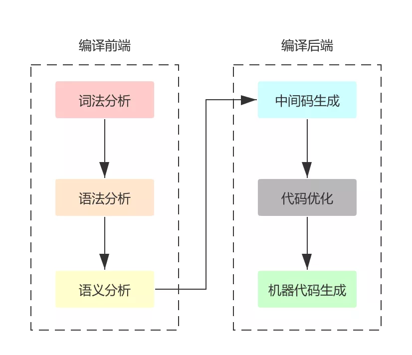

本文章来源于：<https://github.com/Zeb-D/my-review> ，请star 强力支持，你的支持，就是我的动力。

[TOC]

参考地址：https://mp.weixin.qq.com/s/VtRIEpUHn1vavT_FYkL86w

### 认识go build

当我们敲下 `go build` 的时候，我们写的源码文件究竟经历了哪些事情，最终变成了可执行文件？

这个命令会编译 go 代码，今天就来一起看看 go 的编译过程吧！

首先先来认识以下 go 的代码源文件分类

- 命令源码文件：简单说就是含有 main 函数的那个文件，通常一个项目一个该文件，我也没想过需要两个命令源文件的项目
- 测试源码文件：就是我们写的单元测试的代码，都是以 `_test.go` 结尾
- 库源码文件：没有上面特征的就是库源码文件，像我们使用的很多第三方包都属于这部分

`go build` 命令就是用来编译这其中的 **命令源码文件** 以及它依赖的 **库源码文件**。下面表格是一些常用的选项在这里集中说明以下。

| 可选项 | 说明                                                         |
| ------ | ------------------------------------------------------------ |
| -a     | 将命令源码文件与库源码文件全部重新构建，即使是最新的         |
| -n     | 把编译期间涉及到的命令全部打印出来，但不会真的执行，非常方便我们学习 |
| -race  | 开启竞态条件的检测，支持的平台有限制                         |
| -x     | 打印编译期间用到的命名，它与-n的区别是，它不仅打印还会执行   |

接下来就用一个普通程序来演示一下上面的命令选项：

```go
package main

import "fmt"

func main() {
	a := 1 + 2
	b := 10
	c := a * b
	fmt.Println(c)
}
```

如果对上面的代码执行 `go build -n` 我们看一下输出信息：

```c++
wind:awesomeProject wind$ go build -n
mkdir -p $WORK/b001/
cat >$WORK/b001/importcfg.link << 'EOF' # internal
packagefile test=/Users/wind/Library/Caches/go-build/11/117d92c7c82922055a2ffb4a84a4f878874c222087838dad5fc7b1b2b986b549-d
packagefile fmt=/usr/local/go/pkg/darwin_amd64/fmt.a
packagefile runtime=/usr/local/go/pkg/darwin_amd64/runtime.a
packagefile errors=/usr/local/go/pkg/darwin_amd64/errors.a
packagefile internal/fmtsort=/usr/local/go/pkg/darwin_amd64/internal/fmtsort.a
packagefile io=/usr/local/go/pkg/darwin_amd64/io.a
......
......
```

这一部分是编译的核心，通过 `compile`、 `buildid`、 `link` 三个命令会编译出可执行文件 `a.out`。

然后通过 `mv` 命令把 a.out 移动到当前文件夹下面，并改成跟项目文件一样的名字（这里也可以自己指定名字）。

文章的后面部分，我们主要讲的就是 `compile`、 `buildid、` `link` 这三个命令涉及的编译过程。


### 编译器原理

这是 go 编译器的源码路径



整个编译器可以分为：编译前端与编译后端；现在我们看看每个阶段编译器都做了些什么事情。先来从前端部分开始。

#### 词法分析

词法分析简单来说就是将我们写的源代码翻译成 `Token`，这是个什么意思呢？

为了理解 `Golang` 从源代码翻译到 `Token` 的过程，我们用一段代码来看一下翻译的一一对应情况。

