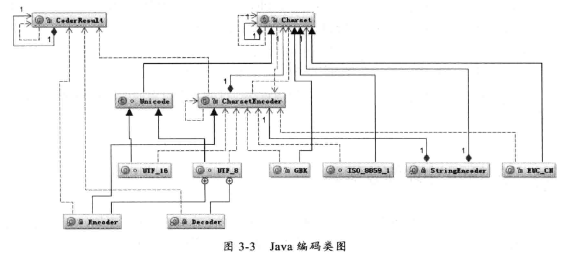
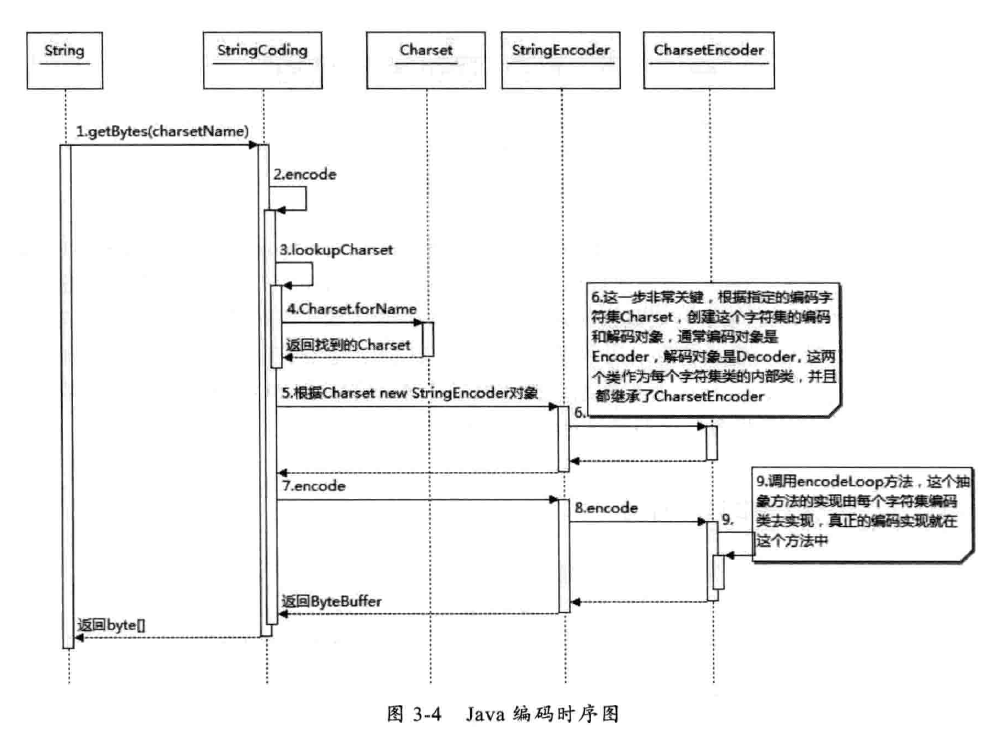

文章来源：https://github.com/Zeb-D/my-review ，请star 强力支持。

# Java中常见编码格式

在平常项目开发经常碰到过编码问题，这是因为Java是跨平台语言，不同平台的编码风格不一样，最常见的在开发Web项目比如HTTP请求编码，避免出现中文编码问题；

## 为什么要编码

这个问题需要理解计算机是如何表示人类能够理解的符号。由于全球国家、名族众多，这些语言符号不能单纯使用一个基本的存储单元——字节byte来表示，你可以这么理解展示给人类是字符（各国的语言字符），存储在计算机是字节bit。这个时候必须需要一个能满足各国语言的Char，而这Char到Byte就会编码方式不一样。

## 常见的编码格式

这里会涉及到存储空间重要，还是编码速率重要。那我们开始熟悉下常见编码格式吧。

###ASCII码

在C++入门的时候接触最多的是ASCII码，总共有128个，用1个字节的低7位表示，0~31是控制字符如何换行、回车、删除等，32~126是打印字符，可以通过键盘输入并且能够显示出来。

### ISO-8859-1

128个字符显然是不够用的，于是ISO组织在ASCII码基础上又指定了来扩展ASCII编码，它们是ISO-8859-1至ISO-8859-15，其中ISO-8859-1涵盖了大多数西欧语言字符，应用也最广泛。ISO-8859-1仍然是单字节编码，总共能表示256个字符。

### GB2312

全称《信息技术 中文编码字符集》，它是双字节编码，总的编码范围是A1-F7，其中A1-A9是符号区，总共包含682个符号；B0-F7是汉子区，包含6763个汉字。

### GBK

全称《汉字内码扩展规范》，是国家技术监督局为window95 指定的，是为了扩展GB2312，并加入更多的汉字。编码范围是8140~FEFE （去除XX7E），总共有23940个码位，它能表示21003个汉字，它兼容GB2312，也可以这么理解，GB2312的汉字可以用GBK解码。

### UTF-16

说到UTF必须提到Unicode 统一码，ISO试图创建一个全新的超语言字典，世界上所有语言字符都在这个字典，这是一个强大但复杂的字典。Unicode是Java和XML的基础。

UTF-16 具体定义了Unicode字符在计算机的存取方法。UTF-16用两个字节来表示Unicode的转化格式，采用定长的表示方法，及不论什么字符都可以用两个字节表示。两个字节是16个bit，所以叫UTF-16。每两个字节表示一个字符，简化了字符串操作。

### UTF-8

UTF-16对所有的字符采用两个字节来表示一个字节，虽然表示比较简单，但会有很大一部分字符会用一个字节表示，却要两个字节表示，使得存储空间放大了一倍，在一定程度上增大网络传输。

那UTF-8采用一种变长技术，每个编码区域有不同的字码长度。不同类型的字符可以由1~6个字节组成。

UTF-8编码规则如下：

- 如果是1个字节，最高位为0，则表示这是1个ASCII字符（00~7F）。
- 如果是1个字节，以11开头，则连续的1个的个数暗示这个字符的字节数。
- 如果是1个字节，以10开始，表示它不是首字节，则需要向前查找才能得到当前字符的首字节。

## Java中编码方式

在进行字节流 到 字符流 相互 转化时候，一般需要InputStreamReader或者OutputStreamWriter 进行转化。其实这两个类采用了适配模式， 转化核心 如字符转字节，使用到StreamEncoder 进行适配。

在字符串 和 字节进行操作时候，String类提供了相互转化功能。不过String 编码解码使用到了StringCoding 这私有包类，这类底层使用了Buffer各种实现类编解码。

我们可以看下String编码需要的类图：

我们可以根据String.getBytes(String charSetName) 这方法是如何操作的：

 

## Java中文编码格式对比

处理中文字符，GB2312、GBK、UTF-16、UTF-8都能处理。

GB2312与GBK编码规则相似，但是GBK支持的范围大，能处理所有的汉字字符。

UTF-8和UTF-16 都是处理Unicode 编码，它们的编码规则不太相同。对于UTF-16 编码效率较高，从字符到字节 相互转化更简单，进行字符串操作更好。但它适合在本地磁盘和内存之间使用，可以进行字符和字节之间的快速切换，在Java内存编码就采用UTF-16 编码；但是它不适合在网络之间传输，因为网络传输容易损坏字节流，一旦字节流损坏很难恢复。

UTF-8适合网络传输，对ASCII码采用单字节存储，另外单字节损坏也不会影响后面的其他字符，在编码效率上介于GBK和UTF-16之间，所以UTF-8在编码效率上和编码安全性上做了平衡，是理想的中文编码方式。

