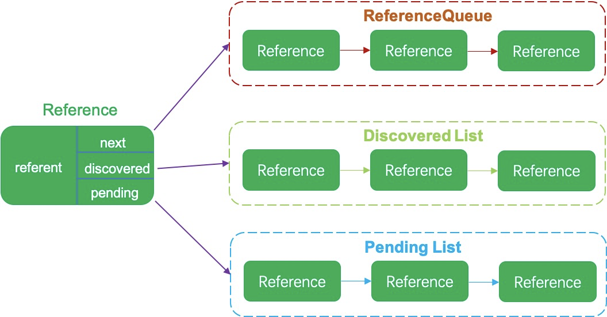
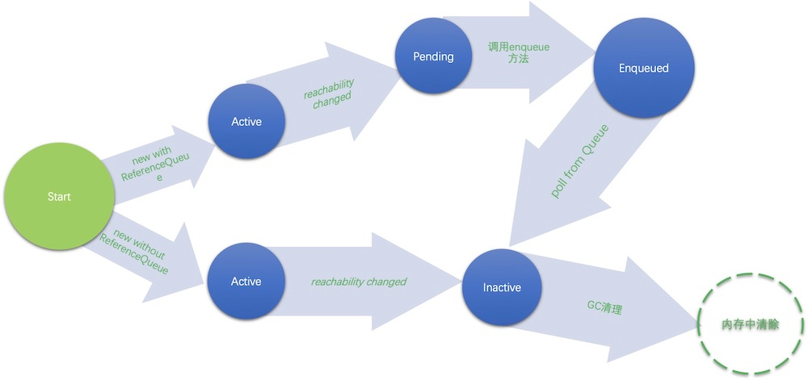
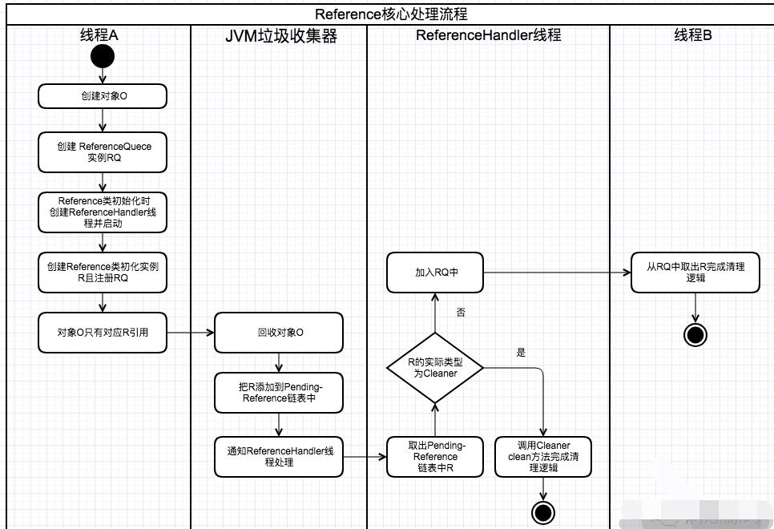

本文章来源于：<https://github.com/Zeb-D/my-review> ，请star 强力支持，你的支持，就是我的动力。

[TOC]

------

### 一、背景

在`ThreadLocal`与`周志明神作JVM书籍`都均提到过Reference这类，不同的引用类型在GC过程中发生的动作也是不一样的；

如果想深入理解JVM的GC，那么阅读 本篇文章中的探讨Reference的实现 是非常有必要的；


### 二、四种引用类型

java中的四种引用类型分别是：强引用，软引用，弱引用和虚引用。


#### 强引用Strong Reference

```java
@Test
    public void stringReference(){
        Object obj = new Object();
    }
```

这个obj就是new Object()的强引用。

强引用的特性是只要有强引用存在，被引用的对象就不会被垃圾回收。


#### 软引用Soft Reference

软引用的意思是只有在内存不足(OOM)的情况下，被引用的对象才会被回收。

SoftReference的定义：

```
public class SoftReference<T> extends Reference<T>
```

SoftReference继承自Reference。它有两种构造函数：

```
    public SoftReference(T referent) 
    public SoftReference(T referent, ReferenceQueue<? super T> q) 
```

第一个参数很好理解，就是软引用的对象，

第二个参数叫做ReferenceQueue，是用来存储封装的待回收Reference对象的，

ReferenceQueue中的对象是由Reference类中的ReferenceHandler内部类进行处理的。

```java
@Test
public void softReference(){
    Object obj = new Object();
    SoftReference<Object> soft = new SoftReference<>(obj);
    obj = null;
    log.info("{}",soft.get());
    System.gc();
    log.info("{}",soft.get());
}
```

```
22:50:43.733 [main] INFO com.flydean.SoftReferenceUsage - java.lang.Object@71bc1ae4
22:50:43.749 [main] INFO com.flydean.SoftReferenceUsage - java.lang.Object@71bc1ae4
```

可以看到在内存充足的情况下，SoftReference引用的对象是不会被回收的。


#### 弱引用weak Reference

weakReference和softReference很类似，不同的是weekReference引用的对象只要垃圾回收执行(每次GC)，就会被回收，而不管是否内存不足。

同样的WeakReference也有两个构造函数：

```
public WeakReference(T referent)；
public WeakReference(T referent, ReferenceQueue<? super T> q)；
```

```java
@Test
public void weakReference() throws InterruptedException {
    Object obj = new Object();
    WeakReference<Object> weak = new WeakReference<>(obj);
    obj = null;
    log.info("{}",weak.get());
    System.gc();
    log.info("{}",weak.get());
}
```

```
22:58:02.019 [main] INFO com.flydean.WeakReferenceUsage - java.lang.Object@71bc1ae4
22:58:02.047 [main] INFO com.flydean.WeakReferenceUsage - null
```

gc过后，弱引用的对象被回收掉了。


#### 虚引用PhantomReference

PhantomReference的作用是跟踪垃圾回收器收集对象的活动，

在GC的过程中，如果发现有PhantomReference，GC则会将引用放到ReferenceQueue中，

由程序员自己处理，当程序员调用ReferenceQueue.pull()方法，将引用出ReferenceQueue移除之后，

Reference对象会变成Inactive状态，意味着被引用的对象可以被回收了。


和SoftReference和WeakReference不同的是，PhantomReference只有一个构造函数，必须传入ReferenceQueue：

```
public PhantomReference(T referent, ReferenceQueue<? super T> q)
```

```java
@Test
    public void usePhantomReference(){
        ReferenceQueue<Object> rq = new ReferenceQueue<>();
        Object obj = new Object();
        PhantomReference<Object> phantomReference = new PhantomReference<>(obj,rq);
        obj = null;
        log.info("{}",phantomReference.get());
        System.gc();
        Reference<Object> r = (Reference<Object>)rq.poll();
        log.info("{}",r);
    }
```

```java
07:06:46.336 [main] INFO com.flydean.PhantomReferenceUsage - null
07:06:46.353 [main] INFO com.flydean.PhantomReferenceUsage - java.lang.ref.PhantomReference@136432db
```

我们看到get的值是null，而GC过后，poll是有值的。

因为PhantomReference引用的是需要被垃圾回收的对象，所以在类的定义中，get一直都是返回null：

```java
    public T get() {
        return null;
    }
```


### 三、Reference和ReferenceQueue

核心理解点：

1. 两个队列pending与ReferenceQueue的作用；

2. Reference对象4种状态的转换；

3. ReferenceHander线程的处理过程，它是如何将Pending与ReferenceQueue关联起来的；

4. Pending队列数据来源;


上面的四种引用都是依赖他们的父类Reference和ReferenceQueue的作用。

Reference是一个抽象类，每个Reference都有一个指向的对象，

在Reference中有5个非常重要的属性：`referent，next，discovered，pending，queue`。

```java
private T referent;         /* Treated specially by GC */
volatile ReferenceQueue<? super T> queue;
Reference next;
transient private Reference<T> discovered;  /* used by VM */
private static Reference<Object> pending = null;
```

pending队列由JVM的垃圾回收器维护，负责初始化discovered和 pending，并不断将新的Reference追加到队列当中。

每个Reference都可以看成是一个节点，多个Reference通过next，discovered和pending这三个属性进行关联。

先用一张图来对Reference有个整体的概念：



referent就是Reference实际引用的对象。

通过next属性，可以构建ReferenceQueue。

通过discovered属性，可以构建Discovered List。

通过pending属性，可以构建Pending List。


#### 四大状态

这三个Queue/List会涉及到Reference的四个状态：



可以看到一个Reference可以有四个状态。

因为Reference有两个构造函数，一个带ReferenceQueue,一个不带。

```java
    Reference(T referent) {
        this(referent, null);
    }

    Reference(T referent, ReferenceQueue<? super T> queue) {
        this.referent = referent;
        this.queue = (queue == null) ? ReferenceQueue.NULL : queue;
    }
```

ReferenceQueue的构造区别：

- 对于带ReferenceQueue的Reference，GC会把要回收对象的Reference放到ReferenceQueue中，后续该Reference需要程序员自己处理（调用poll方法）。
- 不带ReferenceQueue的Reference，由GC自己处理，待回收的对象其Reference状态会变成Inactive。


状态流转：

- 创建好了Reference，就进入active状态。
- active状态下，如果引用对象的可到达状态发送变化就会转变成Inactive或Pending状态。
- Inactive状态很好理解，到达Inactive状态的Reference状态不能被改变，会等待GC回收。
- Pending状态代表等待入Queue，Reference内部有个ReferenceHandler，会调用enqueue方法，将Pending对象入到Queue中。
- 入Queue的对象，其状态就变成了Enqueued。
- Enqueued状态的对象，如果调用poll方法从ReferenceQueue拿出，则该Reference的状态就变成了Inactive，等待GC的回收。

这就是Reference的一个完整的生命周期。


#### 三个Queue/List

有了上面四个状态的概念，我们接下来讲三个Queue/List：ReferenceQueue，discovered List和pending List。


ReferenceQueue的状态我们大概理解了，它本质是由Reference中的next连接而成的。用来存储GC待回收的对象。

pending List就是待入ReferenceQueue的list。


discovered List这个有点特别：

在Pending状态时候，discovered List就等于pending List。

在Active状态的时候，discovered List实际上维持的是一个引用链。通过这个引用链，我们可以获得引用的链式结构，当某个Reference状态不再是Active状态时，需要将这个Reference从discovered List中删除。


#### 核心处理流程

Reference类静态初始化块代码中有个GC清理的handler：

```
static {
//省略部分代码...
Thread handler = new ReferenceHandler(tg, "Reference Handler");
        /* If there were a special system-only priority greater than
         * MAX_PRIORITY, it would be used here
         */
        handler.setPriority(Thread.MAX_PRIORITY);
        handler.setDaemon(true);
        handler.start();
//省略部分代码...
}
```

而ReferenceHandler线程内部的run方法会不断地从Reference构成的pending链表上获取Reference对象，

如果能获取则根据Reference的具体类型进行不同的处理，

不能则调用wait方法等待GC回收对象处理pending链表的通知。

ReferenceHandler线程run方法源码:

```
public void run() {
            while (true) {
                tryHandlePending(true);
            }
        }
```

```
static boolean tryHandlePending(boolean waitForNotify) {
        Reference<Object> r;
        Cleaner c;
        try {
            synchronized (lock) {
                if (pending != null) {
                    r = pending;
                    // 'instanceof' might throw OutOfMemoryError sometimes
                    // so do this before un-linking 'r' from the 'pending' chain...
                    //instanceof 可能会抛出OOME，所以在将r从pending链上断开前，做这个处理
                    c = r instanceof Cleaner ? (Cleaner) r : null;
                    // unlink 'r' from 'pending' chain 将将r从pending链上断开
                    pending = r.discovered;
                    r.discovered = null;
                } else {
                    // The waiting on the lock may cause an OutOfMemoryError
                    // because it may try to allocate exception objects.
                    if (waitForNotify) { 等待CG后的通知
                        lock.wait();
                    }
                    // retry if waited 重试
                    return waitForNotify;
                }
            }
        } catch (OutOfMemoryError x) {
            // Give other threads CPU time so they hopefully drop some live references
            // and GC reclaims some space.
            // Also prevent CPU intensive spinning in case 'r instanceof Cleaner' above
            // persistently throws OOME for some time...
            //当抛出OOME时，放弃CPU的运行时间，这样有希望收回一些存活的引用并且GC能回收部分空间。同时能避免频繁地自旋重试，导致连续的OOME异常
            Thread.yield();
            // retry
            return true;
        } catch (InterruptedException x) {
            // retry
            return true;
        }

        // Fast path for cleaners
        if (c != null) {如果是Cleaner类型的Reference调用其clean方法并退出。
            c.clean();
            return true;
        }

        ReferenceQueue<? super Object> q = r.queue;
        //如果Reference有注册ReferenceQueue，则处理pending指向的Reference结点将其加入ReferenceQueue中
        if (q != ReferenceQueue.NULL) q.enqueue(r);
        return true;
    }
```

对应的处理流程：




#### Cleaner分析

```
//继承了PhantomReference类也就是虚引用，PhantomReference源码很简单只是重写了get方法返回null
public class Cleaner extends PhantomReference<Object> {

/* 虚队列，命名很到位。之前说CG把ReferenceQueue加入pending-Reference链中后，ReferenceHandler线程在处理时
* 是不会将对应的Reference加入列队的，而是调用Cleaner.clean方法。但如果Reference不注册ReferenceQueue，GC处理时
* 又无法把他加入到pending-Reference链中，所以Cleaner里面有了一个dummyQueue成员变量。
*/
private static final ReferenceQueue<Object> dummyQueue = new ReferenceQueue();

//Cleaner链表的头结点
private static Cleaner first = null;

//当前Cleaner节点的后续节点
private Cleaner next = null;

//当前Cleaner节点的前续节点
private Cleaner prev = null;

//真正执行清理工作的Runnable对象，实际clean内部调用thunk.run()方法
private final Runnable thunk;

}
```

构造器：

```
//私有方法，不能直接new
private Cleaner(Object var1, Runnable var2) {
super(var1, dummyQueue);
this.thunk = var2;
}

//创建Cleaner对象，同时加入Cleaner链中。
public static Cleaner create(Object var0, Runnable var1) {
return var1 == null ? null : add(new Cleaner(var0, var1));

}
```

可以看到Cleaner的实现还是比较简单，Cleaner实现为PhantomReference类型的引用。

当JVM GC时如果发现当前处理的对象只被PhantomReference类型对象引用，

同之前说的一样其会将该Reference加pending-Reference链中上，

只是ReferenceHandler线程在处理时如果PhantomReference类型实际类型又是Cleaner的话。

其就是调用Cleaner.clean方法做清理逻辑处理。

Cleaner实际是DirectByteBuffer分配的堆外内存收回的实现；


### DirectByteBuffer堆外内存回收

先来看一下分配给DirectByteBuffer堆外内存是如何回收的。

在创建DirectByteBuffer时我们实际是调用ByteBuffer#allocateDirect方法，而其实现如下：

```
public static ByteBuffer allocateDirect(int capacity) {
        return new DirectByteBuffer(capacity);
    }
```

```
DirectByteBuffer(int cap) {                   // package-private

        super(-1, 0, cap, cap);
        boolean pa = VM.isDirectMemoryPageAligned();
        int ps = Bits.pageSize();
        long size = Math.max(1L, (long)cap + (pa ? ps : 0));
        Bits.reserveMemory(size, cap);

        long base = 0;
        try {
            base = unsafe.allocateMemory(size);//调用unsafe分配内存
        } catch (OutOfMemoryError x) {
            Bits.unreserveMemory(size, cap);
            throw x;
        }
        unsafe.setMemory(base, size, (byte) 0);
        if (pa && (base % ps != 0)) {
            // Round up to page boundary
            address = base + ps - (base & (ps - 1));
        } else {
            address = base;
        }
        //前面分析中的Cleaner对象创建，持有当前DirectByteBuffer的引用
        cleaner = Cleaner.create(this, new Deallocator(base, size, cap));
        att = null;
    }
```

直接看Deallocator.run方法源码：

```
public void run() {
            if (address == 0) {
                // Paranoia
                return;
            }
            unsafe.freeMemory(address);//通过unsafe.freeMemory释放创建的堆外内存
            address = 0;
            Bits.unreserveMemory(size, capacity);
        }
```

总结一下，

创建DirectByteBuffer对象时会创建一个Cleaner对象，Cleaner对象持有了DirectByteBuffer对象的引用。

当JVM在GC时，如果发现DirectByteBuffer被地方法没被引用啦，

JVM会将其对应的Cleaner加入到pending-reference链表中，

同时通知ReferenceHandler线程处理，

ReferenceHandler收到通知后，会调用Cleaner#clean方法，

而对于DirectByteBuffer创建的Cleaner对象其clean方法内部会调用`Deallocator.run`unsafe.freeMemory释放堆外内存。

最终达到了DirectByteBuffer对象被GC回收其对应的堆外内存也被回收的目的。


### WeakHashMap敏感内存回收

WeakHashMap跟WeakReference有点类似，在WeakHashMap如果key不再被使用，被赋值为null的时候，该key对应的Entry会自动从WeakHashMap中删除。

```java
    @Test
    public void useWeakHashMap(){
        WeakHashMap<Object, Object> map = new WeakHashMap<>();
        Object key1= new Object();
        Object value1= new Object();
        Object key2= new Object();
        Object value2= new Object();

        map.put(key1, value1);
        map.put(key2, value2);
        log.info("{}",map);

        key1 = null;
        System.gc();
        log.info("{}",map);

    }
```

```java
[main] INFO com.flydean.WeakHashMapUsage - {java.lang.Object@14899482=java.lang.Object@2437c6dc, java.lang.Object@11028347=java.lang.Object@1f89ab83}
[main] INFO com.flydean.WeakHashMapUsage - {java.lang.Object@14899482=java.lang.Object@2437c6dc}
```

可以看到gc过后，WeakHashMap只有一个Entry了。