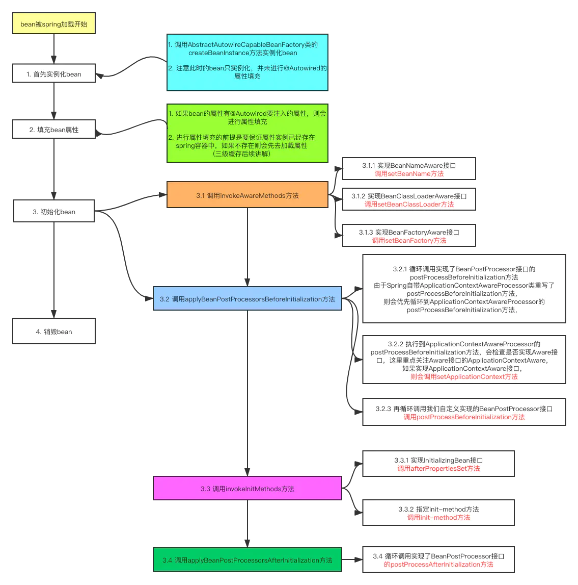
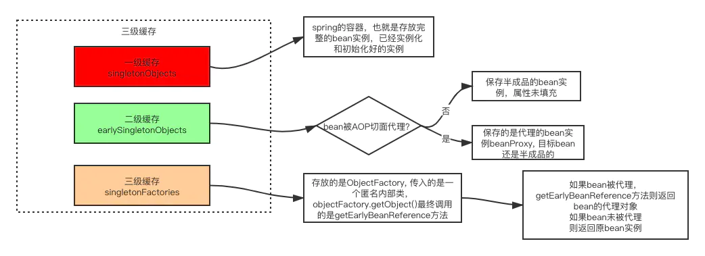

本文章来源于：<https://github.com/Zeb-D/my-review> ，请star 强力支持，你的支持，就是我的动力。

[TOC]

------

## 一、背景

天天接触Spring，天天不知道，作为三进宫源码，输出一些spring源码的体会；


## 二、简要流程

### 2.1、角色

- **BeanFactory**：用于访问容器中bean的接口，使用的是工厂模式，我们这次学习中，重点注意**DefaultListableBeanFactory**
-  **BeanDefinition**：BeanDefinition是bean在Spring中的描述，先读取到bean的各种元素，然后利用BeanDefinition去初始化bean
-  **BeanDefinitionRegistry接口**：注册bean定义到Spring容器中
-  **BeanFactoryPostProcessor接口**：bean工厂的后置处理器，该接口的作用主要是提供扩展点，用于各种bean定义的注册，我们主要关注**ConfigurationClassPostProcessor**该类；
-  **BeanPostProcessor接口**：bean的后置处理器，该接口提供的扩展点，用于初始化bean，以及初始化完成后的各种扩展；


### 2.2、IOC容器初始化的大致流程

其实IOC主要流程就是先读取BeanDefinition放到容器中，

然后根据BeanDefinition去初始化bean，然后提供后置处理器作为扩展，来实现各种不同的功能；我们来看看，Spring IOC容器初始化大致的一个流程，主要是看AnnotationConfigApplicationContext和refresh

```java
public AnnotationConfigApplicationContext(Class<?>... componentClasses) {
    //初始化容器，创建bean工厂，加载各种内部重要类的bean定义，用于初始化我们或者其他引入类
    this();
    //注册我们配置类的bean定义，初始化容器，从这个类开始
    register(componentClasses);
    //准备工作做好后，开始初始化容器
    refresh();
}
public void refresh() throws BeansException, IllegalStateException {
    synchronized (this.startupShutdownMonitor) {
        //设置容器状态，准备刷新容器
        prepareRefresh();
        //获取到容器的bean工厂
        ConfigurableListableBeanFactory beanFactory = obtainFreshBeanFactory();
        //填充bean工厂的各种属性
        prepareBeanFactory(beanFactory);

        try {
            //留给子类实现，我们看的AnnotationConfigApplicationContext继承了GenericApplicationContext，该类主要是注册了ServletContextAwareProcessor
            postProcessBeanFactory(beanFactory);
            //主要是调用bean工厂的后置处理器，把我们的类，注册成bean定义
            invokeBeanFactoryPostProcessors(beanFactory);
            //注册bean的后置处理器
            registerBeanPostProcessors(beanFactory);
            //初始化国际化资源（这个方法不重要）
            initMessageSource();
            //Spring事件相关，主要是创建一个事件多播器
            initApplicationEventMulticaster();
            //留给子类实现
            onRefresh();
            //把我们的事件注册到容器中
            registerListeners();
            //实例化我们需要的bean，放入IOC容器
            finishBeanFactoryInitialization(beanFactory);
            //完成容器IOC容器初始化，并且发布初始化完成事件
            finishRefresh();
        }

        catch (BeansException ex) {
            if (logger.isWarnEnabled()) {
                logger.warn("Exception encountered during context initialization - " +"cancelling refresh attempt: " + ex);
            }
            destroyBeans();
            cancelRefresh(ex);
            throw ex;
        }
        finally {
            resetCommonCaches();
        }
    }
}
```


## 三、分析

### 3.1、注册spring内部重要的BeanDefinition

传入配置类的构造函数

```java
public AnnotationConfigApplicationContext(Class<?>... componentClasses) {
    this();
  //路径扫描不是使用下面这个，是使用另外一个构造器的scan(basePackages)
    register(componentClasses);
    refresh();
}
```

接下来所有，我们主要是来看下代码注释；我们先看下this()这一行代码

```java
public AnnotationConfigApplicationContext() {
    //初始化读取bean定义的读取器，完成Spring内部bean定义的注册
    this.reader = new AnnotatedBeanDefinitionReader(this);
    //初始化一个类扫描器，主要是读取basePackages下
    this.scanner = new ClassPathBeanDefinitionScanner(this);
}

//值得注意的是，AnnotationConfigApplicationContext继承了GenericApplicationContext，调用构造方法时，肯定会先调用父类的构造器
public GenericApplicationContext() {
    /**
     *初始化了Bean工厂
     *DefaultListableBeanFactory该类是功能最全的bean工厂
     *bean定义还有bean都是注册到bean工厂中
     */
    this.beanFactory = new DefaultListableBeanFactory();
}
```

AnnotatedBeanDefinitionReader 这里做了很多事情，注册各种注解后置处理器：

```java
//从上面创建bean定义读取器，看下构造方法
public AnnotatedBeanDefinitionReader(BeanDefinitionRegistry registry) {
    this(registry, getOrCreateEnvironment(registry));
}

public AnnotatedBeanDefinitionReader(BeanDefinitionRegistry registry, Environment environment) {
    Assert.notNull(registry, "BeanDefinitionRegistry must not be null");
    Assert.notNull(environment, "Environment must not be null");
    //把ApplicationContext对象赋值给bean定义读取器
    this.registry = registry;
    this.conditionEvaluator = new ConditionEvaluator(registry, environment, null);
    //主要是看这个方法，注册Spring内部重要的bean定义
    AnnotationConfigUtils.registerAnnotationConfigProcessors(this.registry);
}

public static void registerAnnotationConfigProcessors(BeanDefinitionRegistry registry) {
    registerAnnotationConfigProcessors(registry, null);
}
```

```java
public static Set<BeanDefinitionHolder> registerAnnotationConfigProcessors(
            BeanDefinitionRegistry registry, @Nullable Object source) {

    //获取bean工厂，方便bean定义的注册
    DefaultListableBeanFactory beanFactory = unwrapDefaultListableBeanFactory(registry);
    if (beanFactory != null) {
        if (!(beanFactory.getDependencyComparator() instanceof AnnotationAwareOrderComparator)) {
            //注册了一个排序器
            beanFactory.setDependencyComparator(AnnotationAwareOrderComparator.INSTANCE);
        }
        //注册了@Autowired的候选解析器
        if (!(beanFactory.getAutowireCandidateResolver() instanceof ContextAnnotationAutowireCandidateResolver)) {
            beanFactory.setAutowireCandidateResolver(new ContextAnnotationAutowireCandidateResolver());
        }
    }
    //其实并没有用到这个返回
    Set<BeanDefinitionHolder> beanDefs = new LinkedHashSet<>(8);
    //注册了解析配置的后置处理器ConfigurationClassPostProcessor，我们主要来看这个registerPostProcessor注册bean定义的过程，很多如@Component @ComponentScan @Import @ImportResource @Configuration @Bean
    if (!registry.containsBeanDefinition(CONFIGURATION_ANNOTATION_PROCESSOR_BEAN_NAME)) {
        /**
         *使用类名创建该类的bean定义
         *BeanDefinition中可以获取以下的信息
         *该bean的Class，可以根据该类来获取该类依赖的其他bean的属性
         *可以获取是否是单例的bean等等。。。
         **/
        RootBeanDefinition def = new RootBeanDefinition(ConfigurationClassPostProcessor.class);
        def.setSource(source);
        beanDefs.add(registerPostProcessor(registry, def, CONFIGURATION_ANNOTATION_PROCESSOR_BEAN_NAME));
    }
    //注册了处理@Autowired注解 @Value的后置处理器AutowiredAnnotationBeanPostProcessor
    if (!registry.containsBeanDefinition(AUTOWIRED_ANNOTATION_PROCESSOR_BEAN_NAME)) {
        RootBeanDefinition def = new RootBeanDefinition(AutowiredAnnotationBeanPostProcessor.class);
        def.setSource(source);
        beanDefs.add(registerPostProcessor(registry, def, AUTOWIRED_ANNOTATION_PROCESSOR_BEAN_NAME));
    }
    //我们主要看下registerPostProcessor的注册流程，如@PostConstruct @PreDestroy @Resource
    if (jsr250Present && !registry.containsBeanDefinition(COMMON_ANNOTATION_PROCESSOR_BEAN_NAME)) {
        RootBeanDefinition def = new RootBeanDefinition(CommonAnnotationBeanPostProcessor.class);
        def.setSource(source);
        beanDefs.add(registerPostProcessor(registry, def, COMMON_ANNOTATION_PROCESSOR_BEAN_NAME));
    }
  //jpa相关的注解，orm.jpa，引入了jpaPresent才true
    if (jpaPresent && !registry.containsBeanDefinition(PERSISTENCE_ANNOTATION_PROCESSOR_BEAN_NAME)) {
        RootBeanDefinition def = new RootBeanDefinition();
        try {
            def.setBeanClass(ClassUtils.forName(PERSISTENCE_ANNOTATION_PROCESSOR_CLASS_NAME,
                    AnnotationConfigUtils.class.getClassLoader()));
        }
        catch (ClassNotFoundException ex) {
            throw new IllegalStateException(
                    "Cannot load optional framework class: " + PERSISTENCE_ANNOTATION_PROCESSOR_CLASS_NAME, ex);
        }
        def.setSource(source);
        beanDefs.add(registerPostProcessor(registry, def, PERSISTENCE_ANNOTATION_PROCESSOR_BEAN_NAME));
    }
  //事件监听MethodProcessor @EventListener
    if (!registry.containsBeanDefinition(EVENT_LISTENER_PROCESSOR_BEAN_NAME)) {
        RootBeanDefinition def = new RootBeanDefinition(EventListenerMethodProcessor.class);
        def.setSource(source);
        beanDefs.add(registerPostProcessor(registry, def, EVENT_LISTENER_PROCESSOR_BEAN_NAME));
    }
  //为了支持上面的@EventListener DefaultEventListenerFactory
    if (!registry.containsBeanDefinition(EVENT_LISTENER_FACTORY_BEAN_NAME)) {
        RootBeanDefinition def = new RootBeanDefinition(DefaultEventListenerFactory.class);
        def.setSource(source);
        beanDefs.add(registerPostProcessor(registry, def, EVENT_LISTENER_FACTORY_BEAN_NAME));
    }
    return beanDefs;
}
```

从上面看，会去对应路径下，先注册了一堆 能读取各种注解的BeanProcessor，他们也是放到统一的BeanDefinition的Map；

```java
//注册bean定义
private static BeanDefinitionHolder registerPostProcessor(
        BeanDefinitionRegistry registry, RootBeanDefinition definition, String beanName) {
    //这个角色属性，代表是spring内部的bean
    definition.setRole(BeanDefinition.ROLE_INFRASTRUCTURE);
    //主要是看这个方法，这个就是注册bean定义的
    registry.registerBeanDefinition(beanName, definition);
    return new BeanDefinitionHolder(definition, beanName);
}

public void registerBeanDefinition(String beanName, BeanDefinition beanDefinition)
            throws BeanDefinitionStoreException {
    //把bean定义，注册到beanFactory中去，一开始在GenericApplicationContext 初始化了个DefaultListableBeanFactory
    this.beanFactory.registerBeanDefinition(beanName, beanDefinition);
}
//registerBeanDefinition方法主要是看这句，就是把bean定义放入缓存beanDefinitionMap中
this.beanDefinitionMap.put(beanName, beanDefinition);
```

以上的流程就是 主要就是**注册spring内部重要的bean定义**；


### 3.2、读取代码中的BeanDefinition

#### 3.2.1、指定class注册：register(componentClasses)

下面我们来看下register(componentClasses);方法

这个方法最终会把对应Class转化成一个个definitionHolder；

```java
public void register(Class<?>... annotatedClasses) {
    Assert.notEmpty(annotatedClasses, "At least one annotated class must be specified");
    //使用上面初始化的bean定义读取器，去注册我们配置类的bean定义
    this.reader.register(annotatedClasses);
}
//遍历去注册
public void register(Class<?>... annotatedClasses) {
    for (Class<?> annotatedClass : annotatedClasses) {
        registerBean(annotatedClass);
    }
}
public void registerBean(Class<?> annotatedClass) {
    doRegisterBean(annotatedClass, null, null, null);
}
//注册bean定义
private <T> void doRegisterBean(Class<T> beanClass, @Nullable String name,
        @Nullable Class<? extends Annotation>[] qualifiers, @Nullable Supplier<T> supplier,
        @Nullable BeanDefinitionCustomizer[] customizers) {
    //根据配置类创建一个bean定义
    AnnotatedGenericBeanDefinition abd = new AnnotatedGenericBeanDefinition(beanClass);
    if (this.conditionEvaluator.shouldSkip(abd.getMetadata())) {
        return;
    }

    abd.setInstanceSupplier(supplier);
    //解析bean的作用域，如果没有设置，则默认是单例
    ScopeMetadata scopeMetadata = this.scopeMetadataResolver.resolveScopeMetadata(abd);
    abd.setScope(scopeMetadata.getScopeName());
    String beanName = (name != null ? name : this.beanNameGenerator.generateBeanName(abd, this.registry));
    //解析该bean是否有Lazy，Primary，DependsOn，Description等注解，有则填充进去
    AnnotationConfigUtils.processCommonDefinitionAnnotations(abd);
    if (qualifiers != null) {
        for (Class<? extends Annotation> qualifier : qualifiers) {
            if (Primary.class == qualifier) {
                abd.setPrimary(true);
            }
            else if (Lazy.class == qualifier) {
                abd.setLazyInit(true);
            }
            else {
                abd.addQualifier(new AutowireCandidateQualifier(qualifier));
            }
        }
    }
    if (customizers != null) {
        for (BeanDefinitionCustomizer customizer : customizers) {
            customizer.customize(abd);
        }
    }

    BeanDefinitionHolder definitionHolder = new BeanDefinitionHolder(abd, beanName);
    definitionHolder = AnnotationConfigUtils.applyScopedProxyMode(scopeMetadata, definitionHolder, this.registry);
    //最后把该bean定义注册到Bean工厂中去
    BeanDefinitionReaderUtils.registerBeanDefinition(definitionHolder, this.registry);
}
```


#### 3.2.2、类路径扫描：scan(basePackages)

这个方法是比较复杂涉及到模糊路径读取，然后找到对应符合规则的扫描成definitionHolder

```java
//使用ClassPathBeanDefinitionScanner 进行扫描
public void scan(String... basePackages) {
		Assert.notEmpty(basePackages, "At least one base package must be specified");
		this.scanner.scan(basePackages);
	}
```

```java
public int scan(String... basePackages) {
		int beanCountAtScanStart = this.registry.getBeanDefinitionCount();
		//精髓
		doScan(basePackages);

		// Register annotation config processors, if necessary.
		//默认true，生成一些默认spring自带的注册器
		if (this.includeAnnotationConfig) {
			AnnotationConfigUtils.registerAnnotationConfigProcessors(this.registry);
		}

		return (this.registry.getBeanDefinitionCount() - beanCountAtScanStart);
	}
```

```java
protected Set<BeanDefinitionHolder> doScan(String... basePackages) {
		Assert.notEmpty(basePackages, "At least one base package must be specified");
		Set<BeanDefinitionHolder> beanDefinitions = new LinkedHashSet<>();
		for (String basePackage : basePackages) {
      //路径转化成一个个BeanDefinition
			Set<BeanDefinition> candidates = findCandidateComponents(basePackage);
      
      //批量做和doRegisterBean 一样的事情
			for (BeanDefinition candidate : candidates) {
        //解析bean的作用域，如果没有设置，则默认是单例
				ScopeMetadata scopeMetadata = this.scopeMetadataResolver.resolveScopeMetadata(candidate);
				candidate.setScope(scopeMetadata.getScopeName());
				String beanName = this.beanNameGenerator.generateBeanName(candidate, this.registry);
				if (candidate instanceof AbstractBeanDefinition) {
					postProcessBeanDefinition((AbstractBeanDefinition) candidate, beanName);
				}
				if (candidate instanceof AnnotatedBeanDefinition) {
          //解析该bean是否有Lazy，Primary，DependsOn，Description等注解，有则填充进去
					AnnotationConfigUtils.processCommonDefinitionAnnotations((AnnotatedBeanDefinition) candidate);
				}
				if (checkCandidate(beanName, candidate)) {
					BeanDefinitionHolder definitionHolder = new BeanDefinitionHolder(candidate, beanName);
					definitionHolder =
							AnnotationConfigUtils.applyScopedProxyMode(scopeMetadata, definitionHolder, this.registry);
					beanDefinitions.add(definitionHolder);
          //最后把该bean定义注册到Bean工厂中去
					registerBeanDefinition(definitionHolder, this.registry);
				}
			}
		}
		return beanDefinitions;
	}
```

findCandidateComponents(basePackage) 这个方法会使用路径匹配器进行扫描：

```java
public Set<BeanDefinition> findCandidateComponents(String basePackage) {
		//componentsIndex默认为空
		if (this.componentsIndex != null && indexSupportsIncludeFilters()) {
			return addCandidateComponentsFromIndex(this.componentsIndex, basePackage);
		}
		else {
			return scanCandidateComponents(basePackage);
		}
	}


//扫描满足条件的BeanDefinition
private Set<BeanDefinition> scanCandidateComponents(String basePackage) {
		Set<BeanDefinition> candidates = new LinkedHashSet<>();
		try {
      //最终拼接了个匹配路径classpath*:a/b/c/**/*.class
			String packageSearchPath = ResourcePatternResolver.CLASSPATH_ALL_URL_PREFIX +
					resolveBasePackage(basePackage) + '/' + this.resourcePattern;
      //这个模糊路径下到底有多少大家写的class，要用规则解析器来处理
			Resource[] resources = getResourcePatternResolver().getResources(packageSearchPath);
			boolean traceEnabled = logger.isTraceEnabled();
			boolean debugEnabled = logger.isDebugEnabled();
			for (Resource resource : resources) {
				if (traceEnabled) {
					logger.trace("Scanning " + resource);
				}
				if (resource.isReadable()) {
					try {
						MetadataReader metadataReader = getMetadataReaderFactory().getMetadataReader(resource);
            //此处关键，因为这个目录下不止有spring的class，会去判断是非满足spring的一些注解，
            //class级别的判断有点复杂
						if (isCandidateComponent(metadataReader)) {
							ScannedGenericBeanDefinition sbd = new ScannedGenericBeanDefinition(metadataReader);
							sbd.setResource(resource);
							sbd.setSource(resource);
              //一些java常见的isStatic、isAbstract、isInterface、@Lookup判断
							if (isCandidateComponent(sbd)) {
								if (debugEnabled) {
									logger.debug("Identified candidate component class: " + resource);
								}
								candidates.add(sbd);
							}
							else {
								if (debugEnabled) {
									logger.debug("Ignored because not a concrete top-level class: " + resource);
								}
							}
						}
						else {
							if (traceEnabled) {
								logger.trace("Ignored because not matching any filter: " + resource);
							}
						}
					}
					catch (Throwable ex) {
						throw new BeanDefinitionStoreException(
								"Failed to read candidate component class: " + resource, ex);
					}
				}
				else {
					if (traceEnabled) {
						logger.trace("Ignored because not readable: " + resource);
					}
				}
			}
		}
		catch (IOException ex) {
			throw new BeanDefinitionStoreException("I/O failure during classpath scanning", ex);
		}
		return candidates;
	}
```

getResources 最终是调用

```java
public Resource[] getResources(String locationPattern) throws IOException {
        Assert.notNull(locationPattern, "Location pattern must not be null");
  //走的是this.findPathMatchingResources(locationPattern)方法
        if (locationPattern.startsWith("classpath*:")) {
            return this.getPathMatcher().isPattern(locationPattern.substring("classpath*:".length())) ?
              this.findPathMatchingResources(locationPattern) : this.findAllClassPathResources(locationPattern.substring("classpath*:".length()));
        } else {
          //看这里也是支持war包加载
            int prefixEnd = locationPattern.startsWith("war:") ? locationPattern.indexOf("*/") + 1 : locationPattern.indexOf(58) + 1;
            return this.getPathMatcher().isPattern(locationPattern.substring(prefixEnd)) ? this.findPathMatchingResources(locationPattern) : new Resource[]{this.getResourceLoader().getResource(locationPattern)};
        }
    }
```

```java
protected Resource[] findPathMatchingResources(String locationPattern) throws IOException {
        String rootDirPath = this.determineRootDir(locationPattern);
        String subPattern = locationPattern.substring(rootDirPath.length());
  			//总的路径
        Resource[] rootDirResources = this.getResources(rootDirPath);
        Set<Resource> result = new LinkedHashSet(16);
        Resource[] var6 = rootDirResources;
        int var7 = rootDirResources.length;

        for(int var8 = 0; var8 < var7; ++var8) {
            Resource rootDirResource = var6[var8];
            Resource rootDirResource = this.resolveRootDirResource(rootDirResource);
            URL rootDirUrl = ((Resource)rootDirResource).getURL();
            ....
            if (!ResourceUtils.isJarURL(rootDirUrl) && !this.isJarResource((Resource)rootDirResource)) {
//结合全路径rootDirResource，加上 子格式subPattern如**/*.class，最终实现是this.retrieveMatchingFiles(rootDir, subPattern);
              //原理是 listDirectory(dir)，再进行格式匹配
              result.addAll(this.doFindPathMatchingFileResources((Resource)rootDirResource, subPattern));
            } else {
                result.addAll(this.doFindPathMatchingJarResources((Resource)rootDirResource, rootDirUrl, subPattern));
            }
        }
        return (Resource[])result.toArray(new Resource[0]);
    }
```

```java
//这个模糊路径的全路径，没细化具体某个class
protected Resource[] findAllClassPathResources(String location) throws IOException {
        String path = location;
        if (location.startsWith("/")) {
            path = location.substring(1);
        }

				//最终这里进行路径扫描出 是一个编译后的class的全路径，包括系统文件的路径
        Set<Resource> result = this.doFindAllClassPathResources(path);
        if (logger.isTraceEnabled()) {
            logger.trace("Resolved classpath location [" + location + "] to resources " + result);
        }

        return (Resource[])result.toArray(new Resource[0]);
    }
```

```java
protected Set<Resource> doFindAllClassPathResources(String path) throws IOException {
        Set<Resource> result = new LinkedHashSet(16);
        ClassLoader cl = this.getClassLoader();
        // 哈哈，说白了，jdk自带的路径扫描，一组class的url地址
        Enumeration resourceUrls = cl != null ? cl.getResources(path) : ClassLoader.getSystemResources(path);

        while(resourceUrls.hasMoreElements()) {
            URL url = (URL)resourceUrls.nextElement();
          	//将地址转化成Resource，其实持有这个路径
            result.add(this.convertClassLoaderURL(url));
        }

        if ("".equals(path)) {
            this.addAllClassLoaderJarRoots(cl, result);
        }

        return result;
    }
```


### 3.3、初始化容器

我们继续看下AnnotationConfigApplicationContext构造器的refresh() 是如何初始化容器的：

```java
public void refresh() throws BeansException, IllegalStateException {
    synchronized (this.startupShutdownMonitor) {
        //设置容器一些状态，准备刷新容器
        prepareRefresh();
        //获取到容器的bean工厂，这里的是DefaultListableBeanFactory，如果是xml方式，此处会触发
        ConfigurableListableBeanFactory beanFactory = obtainFreshBeanFactory();
       //流程进入节奏
        //填充bean工厂的各种属性
        prepareBeanFactory(beanFactory);
        try {
            //留给子类实现，我们看的AnnotationConfigApplicationContext继承了GenericApplicationContext，该类主要是注册了ServletContextAwareProcessor
            postProcessBeanFactory(beanFactory);
            //主要是调用bean工厂的后置处理器，把我们的类，注册成bean定义
            invokeBeanFactoryPostProcessors(beanFactory);
            //注册bean的后置处理器
            registerBeanPostProcessors(beanFactory);
            //初始化国际化资源（这个方法不重要）
            initMessageSource();
            //Spring事件相关，主要是创建一个事件多播器
            initApplicationEventMulticaster();
            //留给子类实现
            onRefresh();
            //把我们的事件注册到容器中
            registerListeners();
            //实例化我们需要的bean，放入IOC容器
            finishBeanFactoryInitialization(beanFactory);
            //完成容器IOC容器初始化，并且发布初始化完成事件
            finishRefresh();
        }
        catch (BeansException ex) {
            if (logger.isWarnEnabled()) {
                logger.warn("Exception encountered during context initialization - " +
                        "cancelling refresh attempt: " + ex);
            }
            destroyBeans();
            cancelRefresh(ex);
            throw ex;
        }
        finally {
            resetCommonCaches();
        }
    }
}
```


#### 3.3.1、填充bean工厂的各种属性：prepareBeanFactory(beanFactory)

```java
protected void prepareBeanFactory(ConfigurableListableBeanFactory beanFactory) {
    //设置类加载器，为当前应用的application的类加载器
    beanFactory.setBeanClassLoader(getClassLoader());
    //为bean工厂设置一个标准的SPEL表达式解析器
    beanFactory.setBeanExpressionResolver(new StandardBeanExpressionResolver(beanFactory.getBeanClassLoader()));
    //为bean工厂设置一个资源编辑器，为了后面bean初始化时，给bean对象赋值，比如@Value
    beanFactory.addPropertyEditorRegistrar(new ResourceEditorRegistrar(this, getEnvironment()));
    beanFactory.addBeanPostProcessor(new ApplicationContextAwareProcessor(this));
  //忽略以下接口的bean，这些bean都有set方法，不会对这些bean进行属性赋值
    beanFactory.ignoreDependencyInterface(EnvironmentAware.class);
    beanFactory.ignoreDependencyInterface(EmbeddedValueResolverAware.class);
    beanFactory.ignoreDependencyInterface(ResourceLoaderAware.class);
    beanFactory.ignoreDependencyInterface(ApplicationEventPublisherAware.class);
    beanFactory.ignoreDependencyInterface(MessageSourceAware.class);
    beanFactory.ignoreDependencyInterface(ApplicationContextAware.class);
    //注册了工厂实例，如果我们在程序中注入BeanFactory，就是从这里注册的获取到的
    beanFactory.registerResolvableDependency(BeanFactory.class, beanFactory);
    beanFactory.registerResolvableDependency(ResourceLoader.class, this);
    beanFactory.registerResolvableDependency(ApplicationEventPublisher.class, this);
    beanFactory.registerResolvableDependency(ApplicationContext.class, this);
    //注册事件监听器的bean后置处理接口
    beanFactory.addBeanPostProcessor(new ApplicationListenerDetector(this));
    //处理AOP的后置处理器
    if (beanFactory.containsBean(LOAD_TIME_WEAVER_BEAN_NAME)) {
        beanFactory.addBeanPostProcessor(new LoadTimeWeaverAwareProcessor(beanFactory));
        beanFactory.setTempClassLoader(new ContextTypeMatchClassLoader(beanFactory.getBeanClassLoader()));
    }
    //注册bean工厂的环境属性
    if (!beanFactory.containsLocalBean(ENVIRONMENT_BEAN_NAME)) {
        beanFactory.registerSingleton(ENVIRONMENT_BEAN_NAME, getEnvironment());
    }
    if (!beanFactory.containsLocalBean(SYSTEM_PROPERTIES_BEAN_NAME)) {
        beanFactory.registerSingleton(SYSTEM_PROPERTIES_BEAN_NAME, getEnvironment().getSystemProperties());
    }
    if (!beanFactory.containsLocalBean(SYSTEM_ENVIRONMENT_BEAN_NAME)) {
        beanFactory.registerSingleton(SYSTEM_ENVIRONMENT_BEAN_NAME, getEnvironment().getSystemEnvironment());
    }
}
```

以上可以看出，主要做了一些系统支持的准备操作；


#### 3.3.2、postProcessBeanFactory(beanFactory)

子类实现的扩展，如AnnotationConfigApplicationContext是

```java
//该方法其实没有做实际的事情，主要是把ServletContextAwareProcessor后置处理器，给注册进去
//当我们实现ServletContextAware接口获取上下文容器，就是从这里注入的
protected void postProcessBeanFactory(ConfigurableListableBeanFactory beanFactory) {
    if (this.servletContext != null) {
        beanFactory.addBeanPostProcessor(new ServletContextAwareProcessor(this.servletContext));
        beanFactory.ignoreDependencyInterface(ServletContextAware.class);
    }
    WebApplicationContextUtils.registerWebApplicationScopes(beanFactory, this.servletContext);
    WebApplicationContextUtils.registerEnvironmentBeans(beanFactory, this.servletContext);
}
```


#### 3.3.3、调用bean工厂的后置处理器：invokeBeanFactoryPostProcessors(beanFactory)

这里把所有的Bean定义捞出来，上面那个一些系统工厂自带的PostProcessors

```java
protected void invokeBeanFactoryPostProcessors(ConfigurableListableBeanFactory beanFactory) {
    //获取FactoryPostProcessors，Spring内置的和我们自己设置的，然后供接下来的调用
    PostProcessorRegistrationDelegate.invokeBeanFactoryPostProcessors(beanFactory, getBeanFactoryPostProcessors());
    if (beanFactory.getTempClassLoader() == null && beanFactory.containsBean(LOAD_TIME_WEAVER_BEAN_NAME)) {
        beanFactory.addBeanPostProcessor(new LoadTimeWeaverAwareProcessor(beanFactory));
        beanFactory.setTempClassLoader(new ContextTypeMatchClassLoader(beanFactory.getBeanClassLoader()));
    }
}
```

```java
public static void invokeBeanFactoryPostProcessors(
        ConfigurableListableBeanFactory beanFactory, List<BeanFactoryPostProcessor> beanFactoryPostProcessors) {
    //放入已经被处理过的bean
    Set<String> processedBeans = new HashSet<>();
    //当前bean工厂是否实现了BeanDefinitionRegistry，如果有的话，则可以注册bean定义
    if (beanFactory instanceof BeanDefinitionRegistry) {
        BeanDefinitionRegistry registry = (BeanDefinitionRegistry) beanFactory;
        List<BeanFactoryPostProcessor> regularPostProcessors = new ArrayList<>();
        List<BeanDefinitionRegistryPostProcessor> registryProcessors = new ArrayList<>();
        //循环我们传入的bean工厂后置处理器，并加入到处理器集合中
        for (BeanFactoryPostProcessor postProcessor : beanFactoryPostProcessors) {
            if (postProcessor instanceof BeanDefinitionRegistryPostProcessor) {
                BeanDefinitionRegistryPostProcessor registryProcessor =
                        (BeanDefinitionRegistryPostProcessor) postProcessor;
                registryProcessor.postProcessBeanDefinitionRegistry(registry);
                registryProcessors.add(registryProcessor);
            }
            else {
                regularPostProcessors.add(postProcessor);
            }
        }
        //保存当前实例化的BeanDefinitionRegistryPostProcessor
        List<BeanDefinitionRegistryPostProcessor> currentRegistryProcessors = new ArrayList<>();

        //从bean工厂中获取到继承了BeanDefinitionRegistryPostProcessor的bean
        String[] postProcessorNames =
                beanFactory.getBeanNamesForType(BeanDefinitionRegistryPostProcessor.class, true, false);
        for (String ppName : postProcessorNames) {
            //实例化优先级最高的BeanDefinitionRegistryPostProcessor
            if (beanFactory.isTypeMatch(ppName, PriorityOrdered.class)) {
                //实例化出BeanDefinitionRegistryPostProcessor的类，我们正常初始化这里只有ConfigurationClassPostProcessor
                currentRegistryProcessors.add(beanFactory.getBean(ppName, BeanDefinitionRegistryPostProcessor.class));
                processedBeans.add(ppName);
            }
        }
        //对实例化出来的BeanDefinitionRegistryPostProcessor进行排序
        sortPostProcessors(currentRegistryProcessors, beanFactory);
        //把实例化出来的BeanDefinitionRegistryPostProcessor添加进总的集合中供后面调用
        registryProcessors.addAll(currentRegistryProcessors);
        //调用刚实例化出来的bean，注册bean定义
        invokeBeanDefinitionRegistryPostProcessors(currentRegistryProcessors, registry);
        //清空调用后的BeanDefinitionRegistryPostProcessor
        currentRegistryProcessors.clear();

        
        postProcessorNames = beanFactory.getBeanNamesForType(BeanDefinitionRegistryPostProcessor.class, true, false);
        for (String ppName : postProcessorNames) {
            //实例化实现了Ordered接口的BeanDefinitionRegistryPostProcessor
            if (!processedBeans.contains(ppName) && beanFactory.isTypeMatch(ppName, Ordered.class)) {
                currentRegistryProcessors.add(beanFactory.getBean(ppName, BeanDefinitionRegistryPostProcessor.class));
                processedBeans.add(ppName);
            }
        }
        sortPostProcessors(currentRegistryProcessors, beanFactory);
        registryProcessors.addAll(currentRegistryProcessors);
        invokeBeanDefinitionRegistryPostProcessors(currentRegistryProcessors, registry);
        currentRegistryProcessors.clear();
        //调用没有实现任何优先级接口的BeanDefinitionRegistryPostProcessor
        boolean reiterate = true;
        while (reiterate) {
            reiterate = false;
            postProcessorNames = beanFactory.getBeanNamesForType(BeanDefinitionRegistryPostProcessor.class, true, false);
            for (String ppName : postProcessorNames) {
                if (!processedBeans.contains(ppName)) {
                    currentRegistryProcessors.add(beanFactory.getBean(ppName, BeanDefinitionRegistryPostProcessor.class));
                    processedBeans.add(ppName);
                    reiterate = true;
                }
            }
            sortPostProcessors(currentRegistryProcessors, beanFactory);
            registryProcessors.addAll(currentRegistryProcessors);
            invokeBeanDefinitionRegistryPostProcessors(currentRegistryProcessors, registry);
            currentRegistryProcessors.clear();
        }

        //调用 BeanDefinitionRegistryPostProcessor.postProcessBeanFactory方法
        invokeBeanFactoryPostProcessors(registryProcessors, beanFactory);
        //调用自己实现的BeanDefinitionRegistryPostProcessor.postProcessBeanFactory方法
        invokeBeanFactoryPostProcessors(regularPostProcessors, beanFactory);
    }

    else {
        //没有实现BeanDefinitionRegistry接口的bean工厂，直接调用invokeBeanFactoryPostProcessors
        invokeBeanFactoryPostProcessors(beanFactoryPostProcessors, beanFactory);
    }
    //调用所有的BeanDefinitionRegistryPostProcessor完毕
    //获取容器中所有的 BeanFactoryPostProcessor
    String[] postProcessorNames =
            beanFactory.getBeanNamesForType(BeanFactoryPostProcessor.class, true, false);
    //执行所有BeanFactoryPostProcessor.postProcessBeanFactory方法，按照order接口排序
    List<BeanFactoryPostProcessor> priorityOrderedPostProcessors = new ArrayList<>();
    List<String> orderedPostProcessorNames = new ArrayList<>();
    List<String> nonOrderedPostProcessorNames = new ArrayList<>();
    for (String ppName : postProcessorNames) {
        if (processedBeans.contains(ppName)) {
        }
        else if (beanFactory.isTypeMatch(ppName, PriorityOrdered.class)) {
            priorityOrderedPostProcessors.add(beanFactory.getBean(ppName, BeanFactoryPostProcessor.class));
        }
        else if (beanFactory.isTypeMatch(ppName, Ordered.class)) {
            orderedPostProcessorNames.add(ppName);
        }
        else {
            nonOrderedPostProcessorNames.add(ppName);
        }
    }

    sortPostProcessors(priorityOrderedPostProcessors, beanFactory);
    invokeBeanFactoryPostProcessors(priorityOrderedPostProcessors, beanFactory);

    List<BeanFactoryPostProcessor> orderedPostProcessors = new ArrayList<>(orderedPostProcessorNames.size());
    for (String postProcessorName : orderedPostProcessorNames) {
        orderedPostProcessors.add(beanFactory.getBean(postProcessorName, BeanFactoryPostProcessor.class));
    }
    sortPostProcessors(orderedPostProcessors, beanFactory);
    invokeBeanFactoryPostProcessors(orderedPostProcessors, beanFactory);

    List<BeanFactoryPostProcessor> nonOrderedPostProcessors = new ArrayList<>(nonOrderedPostProcessorNames.size());
    for (String postProcessorName : nonOrderedPostProcessorNames) {
        nonOrderedPostProcessors.add(beanFactory.getBean(postProcessorName, BeanFactoryPostProcessor.class));
    }
    invokeBeanFactoryPostProcessors(nonOrderedPostProcessors, beanFactory);
    //执行完成所有BeanFactoryPostProcessor.postProcessBeanFactory方法，清除所有缓存信息
    beanFactory.clearMetadataCache();
}
```

```java
//我们接下来主要是看ConfigurationClassPostProcessor调用postProcessBeanDefinitionRegistry方法
private static void invokeBeanDefinitionRegistryPostProcessors(
        Collection<? extends BeanDefinitionRegistryPostProcessor> postProcessors, BeanDefinitionRegistry registry) {
    for (BeanDefinitionRegistryPostProcessor postProcessor : postProcessors) {
        postProcessor.postProcessBeanDefinitionRegistry(registry);
    }
}
public void postProcessBeanDefinitionRegistry(BeanDefinitionRegistry registry) {
    int registryId = System.identityHashCode(registry);
    if (this.registriesPostProcessed.contains(registryId)) {
        throw new IllegalStateException(
                "postProcessBeanDefinitionRegistry already called on this post-processor against " + registry);
    }
    if (this.factoriesPostProcessed.contains(registryId)) {
        throw new IllegalStateException(
                "postProcessBeanFactory already called on this post-processor against " + registry);
    }
    this.registriesPostProcessed.add(registryId);
    processConfigBeanDefinitions(registry);
}
public void processConfigBeanDefinitions(BeanDefinitionRegistry registry) {
    List<BeanDefinitionHolder> configCandidates = new ArrayList<>();
    String[] candidateNames = registry.getBeanDefinitionNames();
    //循环最开始初始化的所有bean定义
    for (String beanName : candidateNames) {
        BeanDefinition beanDef = registry.getBeanDefinition(beanName);
        //对配置类（带有@Configuration标签）进行标记，后续实例化时有用
        if (beanDef.getAttribute(ConfigurationClassUtils.CONFIGURATION_CLASS_ATTRIBUTE) != null) {
            if (logger.isDebugEnable()) {
                logger.debug("Bean definition has already been processed as a configuration class: " + beanDef);
            }
        }
        //进行标记，添加到配置类，候选集合中
        else if (ConfigurationClassUtils.checkConfigurationClassCandidate(beanDef, this.metadataReaderFactory)) {
            configCandidates.add(new BeanDefinitionHolder(beanDef, beanName));
        }
    }
    if (configCandidates.isEmpty()) {
        return;
    }
    //对所有配置类进行排序
    configCandidates.sort((bd1, bd2) -> {
        int i1 = ConfigurationClassUtils.getOrder(bd1.getBeanDefinition());
        int i2 = ConfigurationClassUtils.getOrder(bd2.getBeanDefinition());
        return Integer.compare(i1, i2);
    });
    // 创建我们通过@CompentScan导入进来的bean name的生成器
    // 创建我们通过@Import导入进来的bean的名称
    SingletonBeanRegistry sbr = null;
    if (registry instanceof SingletonBeanRegistry) {
        sbr = (SingletonBeanRegistry) registry;
        if (!this.localBeanNameGeneratorSet) {
            BeanNameGenerator generator = (BeanNameGenerator) sbr.getSingleton(
                    AnnotationConfigUtils.CONFIGURATION_BEAN_NAME_GENERATOR);
            if (generator != null) {
                this.componentScanBeanNameGenerator = generator;
                this.importBeanNameGenerator = generator;
            }
        }
    }
    if (this.environment == null) {
        this.environment = new StandardEnvironment();
    }
    //创建一个类解析器
    ConfigurationClassParser parser = new ConfigurationClassParser(
            this.metadataReaderFactory, this.problemReporter, this.environment,
            this.resourceLoader, this.componentScanBeanNameGenerator, registry);

    Set<BeanDefinitionHolder> candidates = new LinkedHashSet<>(configCandidates);
    Set<ConfigurationClass> alreadyParsed = new HashSet<>(configCandidates.size());
    do {
        /**解析配置类，包括@Component、@ComponentScans等需要扫描的类，都会被解析出来放入bean定义容器
         *@Configuration配置类为full配置类，其他的为lite配置类
         **/
        parser.parse(candidates);
        parser.validate();
        //获取到解析出来的配置类
        Set<ConfigurationClass> configClasses = new LinkedHashSet<>(parser.getConfigurationClasses());
        configClasses.removeAll(alreadyParsed);
        
        if (this.reader == null) {
            this.reader = new ConfigurationClassBeanDefinitionReader(
                    registry, this.sourceExtractor, this.resourceLoader, this.environment,
                    this.importBeanNameGenerator, parser.getImportRegistry());
        }
        //把所有@Import、@Bean解析出来的bean定义放入容器
        this.reader.loadBeanDefinitions(configClasses);
        alreadyParsed.addAll(configClasses);

        candidates.clear();
        if (registry.getBeanDefinitionCount() > candidateNames.length) {
            String[] newCandidateNames = registry.getBeanDefinitionNames();
            Set<String> oldCandidateNames = new HashSet<>(Arrays.asList(candidateNames));
            Set<String> alreadyParsedClasses = new HashSet<>();
            for (ConfigurationClass configurationClass : alreadyParsed) {
                alreadyParsedClasses.add(configurationClass.getMetadata().getClassName());
            }
            for (String candidateName : newCandidateNames) {
                if (!oldCandidateNames.contains(candidateName)) {
                    BeanDefinition bd = registry.getBeanDefinition(candidateName);
                    if (ConfigurationClassUtils.checkConfigurationClassCandidate(bd, this.metadataReaderFactory) &&
                            !alreadyParsedClasses.contains(bd.getBeanClassName())) {
                        candidates.add(new BeanDefinitionHolder(bd, candidateName));
                    }
                }
            }
            candidateNames = newCandidateNames;
        }
    }
    while (!candidates.isEmpty());
    if (sbr != null && !sbr.containsSingleton(IMPORT_REGISTRY_BEAN_NAME)) {
        sbr.registerSingleton(IMPORT_REGISTRY_BEAN_NAME, parser.getImportRegistry());
    }
    if (this.metadataReaderFactory instanceof CachingMetadataReaderFactory) {
        ((CachingMetadataReaderFactory) this.metadataReaderFactory).clearCache();
    }
}
```

```
//我们再来看看ConfigurationClassPostProcessor.invokeBeanFactoryPostProcessors(registryProcessors, beanFactory);
public void postProcessBeanFactory(ConfigurableListableBeanFactory beanFactory) {
    int factoryId = System.identityHashCode(beanFactory);
    if (this.factoriesPostProcessed.contains(factoryId)) {
        throw new IllegalStateException(
                "postProcessBeanFactory already called on this post-processor against " + beanFactory);
    }
    this.factoriesPostProcessed.add(factoryId);
    if (!this.registriesPostProcessed.contains(factoryId)) {
        processConfigBeanDefinitions((BeanDefinitionRegistry) beanFactory);
    }
    //这里会修改@Configuration配置类的bean定义，到时候实例化bean时，会使用CGLIB创建动态代理，@Bean中调用获取的bean都是容器中的bean，其他配置类的bean，获取的都是new出来的
    enhanceConfigurationClasses(beanFactory);
    beanFactory.addBeanPostProcessor(new ImportAwareBeanPostProcessor(beanFactory));
}
```


#### 3.3.4 bean的实例化：finishBeanFactoryInitialization(beanFactory)

```java
protected void finishBeanFactoryInitialization(ConfigurableListableBeanFactory beanFactory) {
    //bean工厂创建转化器
    if (beanFactory.containsBean(CONVERSION_SERVICE_BEAN_NAME) &&
            beanFactory.isTypeMatch(CONVERSION_SERVICE_BEAN_NAME, ConversionService.class)) {
        beanFactory.setConversionService(
                beanFactory.getBean(CONVERSION_SERVICE_BEAN_NAME, ConversionService.class));
    }
    if (!beanFactory.hasEmbeddedValueResolver()) {
        beanFactory.addEmbeddedValueResolver(strVal -> getEnvironment().resolvePlaceholders(strVal));
    }
    //实例化AOP相关的组件
    String[] weaverAwareNames = beanFactory.getBeanNamesForType(LoadTimeWeaverAware.class, false, false);
    for (String weaverAwareName : weaverAwareNames) {
        //调用工厂实例化方法，这个方法我们后面来分析
        getBean(weaverAwareName);
    }
    beanFactory.setTempClassLoader(null);
    //冻结所有bean定义，在实例化时，不允许再修改bean定义
    beanFactory.freezeConfiguration();
    //实例化所有bean
    beanFactory.preInstantiateSingletons();
}
//实例化所有bean
public void preInstantiateSingletons() throws BeansException {
    if (logger.isTraceEnabled()) {
        logger.trace("Pre-instantiating singletons in " + this);
    }
    //获取到容器中所有bean定义
    List<String> beanNames = new ArrayList<>(this.beanDefinitionNames);
    //循环去实例化
    for (String beanName : beanNames) {
        //把各种不同类型的bean定义转换成RootBeanDefinition类型
        RootBeanDefinition bd = getMergedLocalBeanDefinition(beanName);
        //只有不是抽象类，必须是单例类，并且不是懒加载才会去实例化
        if (!bd.isAbstract() && bd.isSingleton() && !bd.isLazyInit()) {
            //判断是不是工厂类
            if (isFactoryBean(beanName)) {
                //工厂类会先生存实际的bean，用 &+bean名称
                Object bean = getBean(FACTORY_BEAN_PREFIX + beanName);
                if (bean instanceof FactoryBean) {
                    FactoryBean<?> factory = (FactoryBean<?>) bean;
                    boolean isEagerInit;
                    if (System.getSecurityManager() != null && factory instanceof SmartFactoryBean) {
                        isEagerInit = AccessController.doPrivileged(
                                (PrivilegedAction<Boolean>) ((SmartFactoryBean<?>) factory)::isEagerInit,
                                getAccessControlContext());
                    }
                    else {
                        isEagerInit = (factory instanceof SmartFactoryBean &&
                                ((SmartFactoryBean<?>) factory).isEagerInit());
                    }
                    //实际去实例化bean
                    if (isEagerInit) {
                        getBean(beanName);
                    }
                }
            }
            else {
                //调用实例化bean
                getBean(beanName);
            }
        }
    }
    //遍历所有的bean，如果实现了SmartInitializingSingleton接口，调用afterSingletonsInstantiated方法
    for (String beanName : beanNames) {
        Object singletonInstance = getSingleton(beanName);
        if (singletonInstance instanceof SmartInitializingSingleton) {
            SmartInitializingSingleton smartSingleton = (SmartInitializingSingleton) singletonInstance;
            if (System.getSecurityManager() != null) {
                AccessController.doPrivileged((PrivilegedAction<Object>) () -> {
                    smartSingleton.afterSingletonsInstantiated();
                    return null;
                }, getAccessControlContext());
            }
            else {
                smartSingleton.afterSingletonsInstantiated();
            }
        }
    }
}
public Object getBean(String name) throws BeansException {
    //真实去实例化bean
    return doGetBean(name, null, null, false);
}
//这个方法就是最重要的实例化过程，最主要是关注spring是怎么解决循环依赖的
protected <T> T doGetBean(
        String name, @Nullable Class<T> requiredType, @Nullable Object[] args, boolean typeCheckOnly)
        throws BeansException {
    String beanName = transformedBeanName(name);
    Object bean;
    //先从一级缓存中去获取bean，可以看下getSingleton方法
    Object sharedInstance = getSingleton(beanName);
    if (sharedInstance != null && args == null) {
        if (logger.isTraceEnabled()) {
            if (isSingletonCurrentlyInCreation(beanName)) {
                logger.trace("Returning eagerly cached instance of singleton bean '" + beanName +
                        "' that is not fully initialized yet - a consequence of a circular reference");
            }
            else {
                logger.trace("Returning cached instance of singleton bean '" + beanName + "'");
            }
        }
        //如果是普通单例bean则会直接返回，如果是工厂bean。则会调用getObject获取真正的bean实例
        bean = getObjectForBeanInstance(sharedInstance, name, beanName, null);
    }
    else {
        //Spring只解决单例bean的循环依赖，如果非单例，循环依赖则会直接报错
        if (isPrototypeCurrentlyInCreation(beanName)) {
            throw new BeanCurrentlyInCreationException(beanName);
        }
        BeanFactory parentBeanFactory = getParentBeanFactory();
        //获取到父工厂，如果当前工厂中没有当前bean，则委托给父工厂实例化
        if (parentBeanFactory != null && !containsBeanDefinition(beanName)) {
            String nameToLookup = originalBeanName(name);
            if (parentBeanFactory instanceof AbstractBeanFactory) {
                return ((AbstractBeanFactory) parentBeanFactory).doGetBean(
                        nameToLookup, requiredType, args, typeCheckOnly);
            }
            else if (args != null) {
                return (T) parentBeanFactory.getBean(nameToLookup, args);
            }
            else if (requiredType != null) {
                return parentBeanFactory.getBean(nameToLookup, requiredType);
            }
            else {
                return (T) parentBeanFactory.getBean(nameToLookup);
            }
        }
        //如果不仅仅做类型检查，而是创建bean，则标记这个bean
        if (!typeCheckOnly) {
            markBeanAsCreated(beanName);
        }

        try {
            //把不同类型的bean定义转换成RootBeanDefinition
            RootBeanDefinition mbd = getMergedLocalBeanDefinition(beanName);
            //如果是抽象类，则会报错
            checkMergedBeanDefinition(mbd, beanName, args);
            //处理dependsOn依赖
            String[] dependsOn = mbd.getDependsOn();
            if (dependsOn != null) {
                for (String dep : dependsOn) {
                    //如果依赖的bean是正在创建的bean，就是循环依赖问题，这个直接抛异常，这种是@Bean依赖，不给解决循环依赖
                    if (isDependent(beanName, dep)) {
                        throw new BeanCreationException(mbd.getResourceDescription(), beanName,
                                "Circular depends-on relationship between '" + beanName + "' and '" + dep + "'");
                    }
                    registerDependentBean(dep, beanName);
                    try {
                        getBean(dep);
                    }
                    catch (NoSuchBeanDefinitionException ex) {
                        throw new BeanCreationException(mbd.getResourceDescription(), beanName,
                                "'" + beanName + "' depends on missing bean '" + dep + "'", ex);
                    }
                }
            }
            //如果是单例bean放进三级缓存，并且获取依赖注入的bean
            if (mbd.isSingleton()) {
                sharedInstance = getSingleton(beanName, () -> {
                    try {
                        //这段逻辑可以看下面createBean的详解
                        return createBean(beanName, mbd, args);
                    }
                    catch (BeansException ex) {
                        //创建bean的逻辑报异常，则销毁当前bean相关的所有信息
                        destroySingleton(beanName);
                        throw ex;
                    }
                });
                bean = getObjectForBeanInstance(sharedInstance, name, beanName, mbd);
            }

            else if (mbd.isPrototype()) {
                Object prototypeInstance = null;
                try {
                    beforePrototypeCreation(beanName);
                    prototypeInstance = createBean(beanName, mbd, args);
                }
                finally {
                    afterPrototypeCreation(beanName);
                }
                bean = getObjectForBeanInstance(prototypeInstance, name, beanName, mbd);
            }

            else {
                String scopeName = mbd.getScope();
                if (!StringUtils.hasLength(scopeName)) {
                    throw new IllegalStateException("No scope name defined for bean ´" + beanName + "'");
                }
                Scope scope = this.scopes.get(scopeName);
                if (scope == null) {
                    throw new IllegalStateException("No Scope registered for scope name '" + scopeName + "'");
                }
                try {
                    Object scopedInstance = scope.get(beanName, () -> {
                        beforePrototypeCreation(beanName);
                        try {
                            return createBean(beanName, mbd, args);
                        }
                        finally {
                            afterPrototypeCreation(beanName);
                        }
                    });
                    bean = getObjectForBeanInstance(scopedInstance, name, beanName, mbd);
                }
                catch (IllegalStateException ex) {
                    throw new BeanCreationException(beanName,
                            "Scope '" + scopeName + "' is not active for the current thread; consider " +
                            "defining a scoped proxy for this bean if you intend to refer to it from a singleton",
                            ex);
                }
            }
        }
        catch (BeansException ex) {
            cleanupAfterBeanCreationFailure(beanName);
            throw ex;
        }
    }
    if (requiredType != null && !requiredType.isInstance(bean)) {
        try {
            T convertedBean = getTypeConverter().convertIfNecessary(bean, requiredType);
            if (convertedBean == null) {
                throw new BeanNotOfRequiredTypeException(name, requiredType, bean.getClass());
            }
            return convertedBean;
        }
        catch (TypeMismatchException ex) {
            throw new BeanNotOfRequiredTypeException(name, requiredType, bean.getClass());
        }
    }
    return (T) bean;
}

protected Object getSingleton(String beanName, boolean allowEarlyReference) {
    //第一步先从缓存中获取bean
    Object singletonObject = this.singletonObjects.get(beanName);
    //如果没有获取到bean，并且这个bean正在实例化过程中
    if (singletonObject == null && isSingletonCurrentlyInCreation(beanName)) {
        //从二级缓存中获取bean
        singletonObject = this.earlySingletonObjects.get(beanName);
        //如果未获取到
        if (singletonObject == null && allowEarlyReference) {
            //先对一级缓存加锁，保证获取到的是一个实例化完成的bean
            synchronized (this.singletonObjects) {
                //因为获取到锁，可能这个bean已经放入到一级缓存，如果不去获取一次，可能出现多个bean
                singletonObject = this.singletonObjects.get(beanName);
                if (singletonObject == null) {
                    //然后再去从二级缓存中获取
                    singletonObject = this.earlySingletonObjects.get(beanName);
                    if (singletonObject == null) {
                        //然后从三级缓存中获取生成bean的方法，这是解决循环依赖的关键，生成代理类，也是这个方法调用后才生成的
                        ObjectFactory<?> singletonFactory = this.singletonFactories.get(beanName);
                        if (singletonFactory != null) {
                            //调用这个钩子方法，我们在上一个方法doGetBean中可以找到这个钩子方法
                            singletonObject = singletonFactory.getObject();
                            //然后把这个类放到二级缓存中
                            this.earlySingletonObjects.put(beanName, singletonObject);
                            //再从三级缓存中移除这个bean
                            this.singletonFactories.remove(beanName);
                        }
                    }
                }
            }
        }
    }
}
//获取单例bean
public Object getSingleton(String beanName, ObjectFactory<?> singletonFactory) {
    Assert.notNull(beanName, "Bean name must not be null");
    //加锁，如果同时有多线程在获取bean，保证不会获取到不完成的bean
    synchronized (this.singletonObjects) {
        //获取到锁后先从一级缓存中获取
        Object singletonObject = this.singletonObjects.get(beanName);
        if (singletonObject == null) {
            if (this.singletonsCurrentlyInDestruction) {
                throw new BeanCreationNotAllowedException(beanName,
                        "Singleton bean creation not allowed while singletons of this factory are in destruction “);
            }
            //标记当前bean正在被创建，用于判断是否是循环依赖，就是加入到set集合中
            beforeSingletonCreation(beanName);
            boolean newSingleton = false;
            boolean recordSuppressedExceptions = (this.suppressedExceptions == null);
            if (recordSuppressedExceptions) {
                this.suppressedExceptions = new LinkedHashSet<>();
            }
            try {
                //调用外面传入进来的createBean钩子方法
                singletonObject = singletonFactory.getObject();
                newSingleton = true;
            }
            catch (IllegalStateException ex) {
                singletonObject = this.singletonObjects.get(beanName);
                if (singletonObject == null) {
                    throw ex;
                }
            }
            catch (BeanCreationException ex) {
                if (recordSuppressedExceptions) {
                    for (Exception suppressedException : this.suppressedExceptions) {
                        ex.addRelatedCause(suppressedException);
                    }
                }
                throw ex;
            }
            finally {
                if (recordSuppressedExceptions) {
                    this.suppressedExceptions = null;
                }
                afterSingletonCreation(beanName);
            }
            if (newSingleton) {
                addSingleton(beanName, singletonObject);
            }
        }
        //返回实例化后的bean
        return singletonObject;
    }
}
//实例化bean
protected Object createBean(String beanName, RootBeanDefinition mbd, @Nullable Object[] args)
        throws BeanCreationException {
    if (logger.isTraceEnabled()) {
        logger.trace("Creating instance of bean '" + beanName + "'");
    }
    RootBeanDefinition mbdToUse = mbd;
    if (resolvedClass != null && !mbd.hasBeanClass() && mbd.getBeanClassName() != null) {
        mbdToUse = new RootBeanDefinition(mbd);
        mbdToUse.setBeanClass(resolvedClass);
    }
    try {
        mbdToUse.prepareMethodOverrides();
    }
    catch (BeanDefinitionValidationException ex) {
        throw new BeanDefinitionStoreException(mbdToUse.getResourceDescription(),
                beanName, "Validation of method overrides failed", ex);
    }
    try {
        //调用第一个bean的后置处理器，生成代理对象，我们一般的AOP是不会在这里生成代理的，因为还没实例化出对象
        //这里这里是AOP和事务的关键，会生成切面信息进行缓存
        Object bean = resolveBeforeInstantiation(beanName, mbdToUse);
        if (bean != null) {
            return bean;
        }
    }
    catch (Throwable ex) {
        throw new BeanCreationException(mbdToUse.getResourceDescription(), beanName,
                "BeanPostProcessor before instantiation of bean failed", ex);
    }
    try {
        //真正去创建bean，进行实例化
        Object beanInstance = doCreateBean(beanName, mbdToUse, args);
        if (logger.isTraceEnabled()) {
            logger.trace("Finished creating instance of bean '" + beanName + "'");
        }
        return beanInstance;
    }
    catch (BeanCreationException | ImplicitlyAppearedSingletonException ex) {
        throw ex;
    }
    catch (Throwable ex) {
        throw new BeanCreationException(
                mbdToUse.getResourceDescription(), beanName, "Unexpected exception during bean creation", ex);
    }
}

protected Object doCreateBean(String beanName, RootBeanDefinition mbd, @Nullable Object[] args)
        throws BeanCreationException {
    BeanWrapper instanceWrapper = null;
    if (mbd.isSingleton()) {
        instanceWrapper = this.factoryBeanInstanceCache.remove(beanName);
    }
    if (instanceWrapper == null) {
        instanceWrapper = createBeanInstance(beanName, mbd, args);
    }
    //获取早期对象
    Object bean = instanceWrapper.getWrappedInstance();
    Class<?> beanType = instanceWrapper.getWrappedClass();
    if (beanType != NullBean.class) {
        mbd.resolvedTargetType = beanType;
    }
    synchronized (mbd.postProcessingLock) {
        if (!mbd.postProcessed) {
            try {
                applyMergedBeanDefinitionPostProcessors(mbd, beanType, beanName);
            }
            catch (Throwable ex) {
                throw new BeanCreationException(mbd.getResourceDescription(), beanName,
                        "Post-processing of merged bean definition failed", ex);
            }
            mbd.postProcessed = true;
        }
    }
    /**
     * 这一段就是循环依赖最关键的点，会先放一个早期对象到钩子方法（getEarlyBeanReference）中
     * 这个钩子方法如果这个对象不用创建动态代理，则会直接返回当前对象
     * 把这个钩子方法放入三级缓存，等真正来获取bean时，执行
     * 过了这段逻辑，才开始去注入各种属性，如果有需要循环获取的属性，则会从三级缓存中获取
     **/
    boolean earlySingletonExposure = (mbd.isSingleton() && this.allowCircularReferences &&
            isSingletonCurrentlyInCreation(beanName));
    if (earlySingletonExposure) {
        if (logger.isTraceEnabled()) {
            logger.trace("Eagerly caching bean '" + beanName +
                    "' to allow for resolving potential circular references");
        }
       // 这是个fuction，要用的时候进行使用，AOP代理这里有涉及到
        addSingletonFactory(beanName, () -> getEarlyBeanReference(beanName, mbd, bean));
    }

    Object exposedObject = bean;
    try {
        //去注入属性，比如有依赖的属性，则是从这里去注入，会循环调用getBean
        populateBean(beanName, mbd, instanceWrapper);
        /**
         * 到这一步，对象已经实例化完成
         * 如果有经过循环依赖的话，需要进行动态代理的类，已经生成了动态代理
         * 但是，未经过循环依赖的类，需要我们实例化完成后，进行动态代理
         * 动态代理时，还需判断是否是接口，需要用JDK的动态代理，还是CGLIB的动态代理
         **/
        exposedObject = initializeBean(beanName, exposedObject, mbd);
    }
    catch (Throwable ex) {
        if (ex instanceof BeanCreationException && beanName.equals(((BeanCreationException) ex).getBeanName())) {
            throw (BeanCreationException) ex;
        }
        else {
            throw new BeanCreationException(
                    mbd.getResourceDescription(), beanName, "Initialization of bean failed", ex);
        }
    }
    if (earlySingletonExposure) {
        //如果是正常bean，一般只会从一级或者二级缓存中获取，不会把bean存入三级缓存
        Object earlySingletonReference = getSingleton(beanName, false);
        if (earlySingletonReference != null) {
            if (exposedObject == bean) {
                exposedObject = earlySingletonReference;
            }
            else if (!this.allowRawInjectionDespiteWrapping && hasDependentBean(beanName)) {
                String[] dependentBeans = getDependentBeans(beanName);
                Set<String> actualDependentBeans = new LinkedHashSet<>(dependentBeans.length);
                for (String dependentBean : dependentBeans) {
                    if (!removeSingletonIfCreatedForTypeCheckOnly(dependentBean)) {
                        actualDependentBeans.add(dependentBean);
                    }
                }
                if (!actualDependentBeans.isEmpty()) {
                    throw new BeanCurrentlyInCreationException(beanName,
                            "Bean with name '" + beanName + "' has been injected into other beans [" +
                            StringUtils.collectionToCommaDelimitedString(actualDependentBeans) +
                            "] in its raw version as part of a circular reference, but has eventually been " +
                            "wrapped. This means that said other beans do not use the final version of the " +
                            "bean. This is often the result of over-eager type matching - consider using " +
                            "'getBeanNamesForType' with the 'allowEagerInit' flag turned off, for example.");
                }
            }
        }
    }
    try {
        //注册销毁的bean的销毁接口
        registerDisposableBeanIfNecessary(beanName, bean, mbd);
    }
    catch (BeanDefinitionValidationException ex) {
        throw new BeanCreationException(
                mbd.getResourceDescription(), beanName, "Invalid destruction signature", ex);
    }
    return exposedObject;
}
```


### 3.4 小结

#### 3.4.1、bean IOC 生命周期

spring的bean生命周期其实最核心的分为4个步骤，只要理清三个关键的步骤，其他的只是在这三个细节中添加不同的细节实现,也就是spring的bean生明周期：

**实例化和初始化的区别**：实例化是在jvm的堆中创建了这个对象实例，此时它只是一个空的对象，所有的属性为null。而初始化的过程就是讲对象依赖的一些属性进行赋值之后，调用某些方法来开启一些默认加载。比如spring中配置的数据库属性Bean，在初始化的时候就会将这些属性填充，比如driver、jdbcurl等,然后初始化连接


##### 实例化 Instantiation

AbstractAutowireCapableBeanFactory.doCreateBean中会调用createBeanInstance()方法,该阶段主要是从beanDefinitionMap循环读取bean,获取它的属性，然后利用反射(core包下有ReflectionUtil会先强行将构造方法setAccessible(true))读取对象的构造方法(spring会自动判断是否是有参数还是无参数，以及构造方法中的参数是否可用),然后再去创建实例


##### 初始化

初始化主要包括两个步骤,一个是属性填充，另一个就是具体的初始化过程：

**属性赋值**

PopulateBean()会对bean的依赖属性进行填充，@AutoWired注解注入的属性就发生这个阶段，假如我们的bean有很多依赖的对象，那么spring会依次调用这些依赖的对象进行实例化，注意这里可能会有循环依赖的问题。后面我们会讲到spring是如何解决循环依赖的问题。

**初始化 Initialization**

初始化的过程包括将初始化好的bean放入到spring的缓存中、填充我们预设的属性进一步做后置处理等；


##### 使用和销毁 Destruction

在Spring将所有的bean都初始化好之后，我们的业务系统就可以调用了。而销毁主要的操作是销毁bean，主要是伴随着spring容器的关闭，此时会将spring的bean移除容器之中。此后spring的生命周期到这一步彻底结束，不再接受spring的管理和约束。


##### 代码中的生命周期

```java
 /**
 *@since 13 April 2001
 * @see BeanNameAware#setBeanName
 * @see BeanClassLoaderAware#setBeanClassLoader
 * @see BeanFactoryAware#setBeanFactory
 * @see org.springframework.context.ResourceLoaderAware#setResourceLoader
 * @see org.springframework.context.ApplicationEventPublisherAware#setApplicationEventPublisher
 * @see org.springframework.context.MessageSourceAware#setMessageSource
 * @see org.springframework.context.ApplicationContextAware#setApplicationContext
 * @see org.springframework.web.context.ServletContextAware#setServletContext
 * @see org.springframework.beans.factory.config.BeanPostProcessor#postProcessBeforeInitialization
 * @see InitializingBean#afterPropertiesSet
 * @see org.springframework.beans.factory.support.RootBeanDefinition#getInitMethodName
 * @see org.springframework.beans.factory.config.BeanPostProcessor#postProcessAfterInitialization
 * @see DisposableBean#destroy
 * @see org.springframework.beans.factory.support.RootBeanDefinition#getDestroyMethodName
 */
public interface BeanFactory {
//...略
}
```

spring源码的注释仔细看下 对我们研究源码是非常有帮助的，另外在spring的BeanFactory工厂列举了很多接口，代表着bean的生命周期，我们主要记住的是：

- ```
  BeanNameAware#setBeanName
  ```

- ```
  BeanFactoryAware#setBeanFactory
  ```

- ```
  org.springframework.context.ApplicationContextAware#setApplicationContext
  ```

- ```
  org.springframework.beans.factory.config.BeanPostProcessor#postProcessBeforeInitialization
  ```

- ```
  InitializingBean#afterPropertiesSet
  ```

- ```
  org.springframework.beans.factory.config.BeanPostProcessor#postProcessAfterInitialization
  ```

- ```
  DisposableBean#destroy
  ```


简要代码细节展示实例化和初始化：

```dart
protected Object doCreateBean(final String beanName, final RootBeanDefinition mbd, final @Nullable Object[] args)
			throws BeanCreationException {

		// Instantiate the bean.
		BeanWrapper instanceWrapper = null;
		if (mbd.isSingleton()) {
			instanceWrapper = this.factoryBeanInstanceCache.remove(beanName);
		}
		if (instanceWrapper == null) {
      //第一步：分配内存，创建Bean实例
			instanceWrapper = createBeanInstance(beanName, mbd, args);
		}
    // .... 代码略N行

		// Initialize the bean instance.
		Object exposedObject = bean;
		try {
      // 第二步：填充Bean属性，比如有注入属性的注解，
			populateBean(beanName, mbd, instanceWrapper);
      //第三步：初始化bean，会调用调用我们上述所提到的接口，如xxAware、before、init-Method、after
			exposedObject = initializeBean(beanName, exposedObject, mbd);
		}
		catch (Throwable ex) {
			//略N行....
		}
		//略N行....

		return exposedObject;
	}
```

初始化initializeBean方法：

```dart
protected Object initializeBean(final String beanName, final Object bean, @Nullable RootBeanDefinition mbd) {
		if (System.getSecurityManager() != null) {
			AccessController.doPrivileged((PrivilegedAction<Object>) () -> {
				invokeAwareMethods(beanName, bean);
				return null;
			}, getAccessControlContext());
		}
		else {
      //第三步：3.1 调用实现XxxAware接口的方法，三个BeanNameAware、BeanClassLoaderAware、BeanFactoryAware
			invokeAwareMethods(beanName, bean);
		}

		Object wrappedBean = bean;
		if (mbd == null || !mbd.isSynthetic()) {
      //第三步：3.2 调用before接口，getBeanPostProcessors() 列表的processor.postProcessBeforeInitialization(result, beanName)，最常见的ApplicationContextAwareProcessor，会进行触发invokeAwareInterfaces(bean)，如EnvironmentAware、EmbeddedValueResolverAware、ResourceLoaderAware、ApplicationEventPublisherAware、MessageSourceAware、ApplicationContextAware，也会在CommonAnnotationBeanPostProcessor执行javax相关的注解如PostConstruct，invoke执行方式
			wrappedBean = applyBeanPostProcessorsBeforeInitialization(wrappedBean, beanName);
		}

		try {
      //第三步：3.3 如果实现了InitializingBean接口，重写了afterPropertiesSet方法；否指定了init-method 则invoke
			invokeInitMethods(beanName, wrappedBean, mbd);
		}
		catch (Throwable ex) {
			throw new BeanCreationException(
					(mbd != null ? mbd.getResourceDescription() : null),
					beanName, "Invocation of init method failed", ex);
		}
		if (mbd == null || !mbd.isSynthetic()) {
      //第三步：3.4 循环遍历实现了BeanPostProcessor的接口实现类，执行postProcessAfterInitialization方法
			wrappedBean = applyBeanPostProcessorsAfterInitialization(wrappedBean, beanName);
		}

		return wrappedBean;
	}
```


##### 用图来总结生命周期




#### 3.4.2、BeanPostProcessor处理器相关作用

上面讲了大概的一些代码及流程，稍微细节的流程在这里：

spring的另一个强大之处就是允许开发者自定义扩展bean的初始化过程，最主要的实现思路就是通过BeanPostProcessor来实现的,spring有各种前置和后置处理器，这些处理器渗透在bean创建的前前后后,穿插在spring生命周期的各个阶段，每一步都会影响着spring的bean加载过程。接下来我们就来分析具体的过程：


##### 实例化阶段

该阶段会调用对象的空构造方法进行对象的实例化，在进行实例化之后，会调用InstantiationAwareBeanPostProcessor的postProcessBeforeInstantiation方法

**BeanPostProcessor(具体实现是InstantiationAwareBeanPostProcessor). postProcessBeforeInstantiation();**

这个阶段允许在Bena进行实例化之前，允许开发者自定义逻辑，如返回一个代理对象。不过需要注意的是假如在这个阶段返回了一个不为null的实例，spring就会中断后续的过程。

BeanPostProcessor.postProcessAfterInstantiation();

这个阶段是Bean实例化完毕后执行的后处理操作，所有在初始化逻辑、装配逻辑之前执行


##### 初始化阶段

1. **BeanPostProcessor.postProcessBeforeInitialization**：该方法在bean初始化方法前被调用，Spring AOP的底层处理也是通过实现BeanPostProcessor来执行代理逻辑的

2. **InitializingBean.afterPropertiesSet**：自定义属性值 该方法允许我们进行对对象中的属性进行设置，假如在某些业务中，一个对象的某些属性为null,但是不能显示为null，比如显示0或者其他的固定数值，我们就可以在这个方法实现中将null值转换为特定的值

3. **BeanPostProcessor.postProcessAfterInitialization(Object bean, String beanName)**：可以在这个方法中进行bean的实例化之后的处理，比如我们的自定义注解，对依赖对象的版本控制自动路由切换。比如有一个服务依赖了两种版本的实现，我们如何实现自动切换呢？

   这时候可以自定义一个路由注解,假如叫@RouteAnnotaion，然后实现BeanPostProcessor接口，在其中通过反射拿到自定义的注解@RouteAnnotaion再进行路由规则的设定。

4. **SmartInitializingSingleton.afterSingletonsInstantiated**


#### 3.4.3、解决循环依赖问题

##### 问题抛出

循环依赖问题就是A->B->A，spring在创建A的时候,发现需要依赖B,因为去创建B实例,发现B又依赖于A,又去创建A,因为形成一个闭环，无法停止下来就可能会导致cpu计算飙升？


spring解决这个问题主要靠巧妙的三层缓存，所谓的缓存主要是指这三个map：

singletonObjects主要存放的是单例对象，属于第一级缓存；

singletonFactories属于单例工厂对象，属于第三级缓存；

earlySingletonObjects属于第二级缓存，如何理解early这个标识呢？

它表示只是经过了实例化尚未初始化的对象。Spring首先从singletonObjects（一级缓存）中尝试获取，如果获取不到并且对象在创建中，则尝试从earlySingletonObjects(二级缓存)中获取，如果还是获取不到并且允许从singletonFactories通过getObject获取，则通过singletonFactory.getObject()(三级缓存)获取。


如果获取到了则移除对应的singletonFactory,将singletonObject放入到earlySingletonObjects，其实就是将三级缓存提升到二级缓存,这个就是缓存升级。spring在进行对象创建的时候，会依次从一级、二级、三级缓存中寻找对象，如果找到直接返回。


由于是初次创建，只能从第三级缓存中找到(实例化阶段放入进去的)，创建完实例，然后将缓存放到第一级缓存中。下次循环依赖的再直接从一级缓存中就可以拿到实例对象了。

| 等级 | 名称                  | 说明             | 作用                                                         |
| ---- | --------------------- | ---------------- | ------------------------------------------------------------ |
| 一级 | singletonObjects      | 可以理解为单例池 | 存放初始化后的单例对象，也就是完成的bean对象                 |
| 二级 | earlySingletonObjects | 早期单例对象缓存 | 存放实例化，未完成初始化的单例对象（未完成属性注入的对象），也是用来解决性能问题 |
| 三级 | singletonFactories    | 单例工厂缓存     | 存放ObjectFactory对象，存放的是工厂对象，主要用来解决循环依赖和aop的问题 |




##### **解决循环依赖的主要代码**

假设情景A依赖于B，B依赖于A：

首先A通过getBean调到doCreateBean（Spring通过getBean方法获取bean），初步实例化即调用createBeanInstance()方法后，属性注入之前进入到下边代码中：

```java
public abstract class AbstractAutowireCapableBeanFactory extends AbstractBeanFactory
        implements AutowireCapableBeanFactory {
        
    protected Object doCreateBean(final String beanName, final RootBeanDefinition mbd, final @Nullable Object[] args)
            throws BeanCreationException {

        //省略前面的部分代码

        
        // even when triggered by lifecycle interfaces like BeanFactoryAware.
        // 7.判断是否需要提早曝光实例：单例 && 允许循环依赖 && 当前bean正在创建中
        boolean earlySingletonExposure = (mbd.isSingleton() && this.allowCircularReferences &&
                isSingletonCurrentlyInCreation(beanName));
        if (earlySingletonExposure) {
            if (logger.isTraceEnabled()) {
                logger.trace("Eagerly caching bean '" + beanName +
                        "' to allow for resolving potential circular references");
            }
            // 8.提前曝光beanName的ObjectFactory，用于解决循环引用
            // 8.1 应用后置处理器SmartInstantiationAwareBeanPostProcessor，允许返回指定bean的早期引用，若没有则直接返回bean
            addSingletonFactory(beanName, () -> getEarlyBeanReference(beanName, mbd, bean));
        }

        // Initialize the bean instance.
        // 初始化bean实例。
        Object exposedObject = bean;
        try {
            // 9.对bean进行属性填充；其中，可能存在依赖于其他bean的属性，则会递归初始化依赖的bean实例
            populateBean(beanName, mbd, instanceWrapper);
            // 10.对bean进行初始化
            //初始化bean，过程如下：
            //1：判断是否实现了BeanNameAware，BeanClassLoaderAware，
            //   BeanFactoryAware方法，如果有，则设置相关的属性
            //2: 调用bean初始化的前置（BeanPostProcessor）操作
            //3: 执行初始化的方法。
            //  如果有initializingBean，则调用afterPropertiesSet
            //  如果有InitMethod，则调用初始方法
            //4: 调用bean初始化的后置（BeanPostProcessor）操作
            exposedObject = initializeBean(beanName, exposedObject, mbd);
        }
      
        //省略中间的部分代码
        
        // 13.完成创建并返回
        return exposedObject;
    }
}
```

属性注入之前Spring将Bean包装成一个工厂添加进了三级缓存中，即调用addSingletonFactory()方法：

```java
public class DefaultSingletonBeanRegistry extends SimpleAliasRegistry implements SingletonBeanRegistry {

    // 这里传入的参数也是一个lambda表达式，() -> getEarlyBeanReference(beanName, mbd, bean)
    protected void addSingletonFactory(String beanName, ObjectFactory<?> singletonFactory) {
        Assert.notNull(singletonFactory, "Singleton factory must not be null");
        synchronized (this.singletonObjects) {
            // 1.如果beanName不存在于singletonObjects缓存中
            if (!this.singletonObjects.containsKey(beanName)) {
                //往三级缓存里添加
                // 2.将beanName和singletonFactory注册到singletonFactories缓存（beanName -> 该beanName的单例工厂）
                this.singletonFactories.put(beanName, singletonFactory);
                //清除此Bean在二级缓存里的缓存信息
                // 3.移除earlySingletonObjects缓存中的beanName（beanName -> beanName的早期单例对象）
                this.earlySingletonObjects.remove(beanName);
                //这里为了记录注册单例的顺序
                // 4.将beanName注册到registeredSingletons缓存（已经注册的单例集合）
                this.registeredSingletons.add(beanName);
            }
        }
    }
}
```

这里只是添加了一个工厂（通过这个工厂（ObjectFactory）的getObject方法可以得到一个对象），执行工厂的getObject相当于执行getEarlyBeanReference。那么，什么时候会去调用这个工厂的getObject方法呢？

当A开始属性注入，B开始实例化时，同样会通过getBean，同样会跟A一样属性注入，再次实例化A，此时再次实例化A时，getBean经过getSingleton会从三级缓存中拿出ObjectFactory，调用getObject会拿到A的对象。

到此为止，循环依赖被解决。

解决循环依赖后，会在doCreateBean()方法中调用populateBean()方法填充属性，完成对bean的依赖属性进行注入(@Autowired)。

即在AbstractBeanFactory类中：

- 通过 getBean(String name)方法、调用doGetBean()方法、在doGetBean()方法内部调用`Object sharedInstance = getSingleton(beanName);`代码，在getSingleton()方法中会从三级缓存中拿出ObjectFactory
- 通过ObjectFactory单例对象工厂创建的单例对象，放到早期单例对象缓存中即二级缓存earlySingletonObjects，并在三级缓存中移除beanName对应的单例对象工厂


```java
public class DefaultSingletonBeanRegistry extends SimpleAliasRegistry implements SingletonBeanRegistry {

    //一级缓存：单例对象缓存池，beanName->Bean，其中存储的就是实例化，属性赋值成功之后的单例对象
    private final Map<String, Object> singletonObjects = new ConcurrentHashMap<>(256);

    //三级缓存：单例工厂的缓存，beanName->ObjectFactory，添加进去的时候实例还未具备属性
    // 用于保存beanName和创建bean的工厂之间的关系map，单例Bean在创建之初过早的暴露出去的Factory，
    // 为什么采用工厂方式，是因为有些Bean是需要被代理的，总不能把代理前的暴露出去那就毫无意义了
    private final Map<String, ObjectFactory<?>> singletonFactories = new HashMap<>(16);

    //二级缓存：早期的单例对象，beanName->Bean，其中存储的是实例化之后，属性未赋值的单例对象
    // 执行了工厂方法生产出来的Bean，bean被放进去之后，
    // 那么当bean在创建过程中，就可以通过getBean方法获取到
    private final Map<String, Object> earlySingletonObjects = new HashMap<>(16);

    //三级缓存是用来解决循环依赖，而这个缓存就是用来检测是否存在循环依赖的
    private final Set<String> singletonsCurrentlyInCreation =
            Collections.newSetFromMap(new ConcurrentHashMap<>(16));

    @Nullable
    protected Object getSingleton(String beanName, boolean allowEarlyReference) {
        // 1.从单例对象缓存中获取beanName对应的单例对象
        Object singletonObject = this.singletonObjects.get(beanName);
        // 2.如果单例对象缓存中没有，并且该beanName对应的单例bean正在创建中
        if (singletonObject == null && isSingletonCurrentlyInCreation(beanName)) {
            //尝试给一级缓存对象加锁，因为接下来就要对缓存对象操作了
            synchronized (this.singletonObjects) {
                // 4.从早期单例对象缓存中获取单例对象（之所称成为早期单例对象，是因为earlySingletonObjects里
                // 的对象的都是通过提前曝光的ObjectFactory创建出来的，还未进行属性填充等操作）
                //尝试从二级缓存earlySingletonObjects这个存储还没进行属性添加操作的Bean实例缓存中获取
                singletonObject = this.earlySingletonObjects.get(beanName);
                // 5.如果在早期单例对象缓存中也没有，并且允许创建早期单例对象引用
                //如果还没有获取到并且第二个参数为true，为true则表示bean允许被循环引用
                if (singletonObject == null && allowEarlyReference) {
                    // 6.从单例工厂缓存中获取beanName的单例工厂
                    //从三级缓存singletonFactories这个ObjectFactory实例的缓存里尝试获取创建此Bean的单例工厂实例
                    ObjectFactory<?> singletonFactory = this.singletonFactories.get(beanName);
                    //如果获取到工厂实例
                    if (singletonFactory != null) {
                        // 7.如果存在单例对象工厂，则通过工厂创建一个单例对象
                        singletonObject = singletonFactory.getObject();
                        // 8.将通过单例对象工厂创建的单例对象，放到早期单例对象缓存中
                        this.earlySingletonObjects.put(beanName, singletonObject);
                        // 9.移除该beanName对应的单例对象工厂，因为该单例工厂已经创建了一个实例对象，并且放到earlySingletonObjects缓存了，
                        // 因此，后续获取beanName的单例对象，可以通过earlySingletonObjects缓存拿到，不需要在用到该单例工厂
                        this.singletonFactories.remove(beanName);
                    }
                }
            }
        }
        // 10.返回单例对象
        return singletonObject;
    }
}
```

循环依赖确实被解决了，但是从过程看，似乎ObjectFactory缓存没什么存在的必要？似乎singletonObjects和earlySingletonObjects已经可以解决依赖问题了？
 那么三级缓存到底有什么作用呢？我们再仔细分析下singletonFactories

在doCreateBean()方法调用addSingletonFactory()方法，提前曝光beanName的ObjectFactory，

用于解决循环引用的时候，会调用getEarlyBeanReference()方法，即`addSingletonFactory(beanName, () -> getEarlyBeanReference(beanName, mbd, bean));`方法的时候

```java
public abstract class AbstractAutowireCapableBeanFactory extends AbstractBeanFactory
        implements AutowireCapableBeanFactory {
        
    protected Object getEarlyBeanReference(String beanName, RootBeanDefinition mbd, Object bean) {
        Object exposedObject = bean;
        // 1.如果bean不为空 && mbd不是合成 && 存在InstantiationAwareBeanPostProcessors
        if (!mbd.isSynthetic() && hasInstantiationAwareBeanPostProcessors()) {
            for (BeanPostProcessor bp : getBeanPostProcessors()) {
                // 2.应用所有SmartInstantiationAwareBeanPostProcessor，调用getEarlyBeanReference方法
                if (bp instanceof SmartInstantiationAwareBeanPostProcessor) {
                    SmartInstantiationAwareBeanPostProcessor ibp = (SmartInstantiationAwareBeanPostProcessor) bp;
                    // 3.允许SmartInstantiationAwareBeanPostProcessor返回指定bean的早期引用
                    exposedObject = ibp.getEarlyBeanReference(exposedObject, beanName);
                }
            }
        }
        // 4.返回要作为bean引用公开的对象，如果没有SmartInstantiationAwareBeanPostProcessor修改，则返回的是入参的bean对象本身
        return exposedObject;
    }
}
```

它实际上就是调用了后置处理器的**getEarlyBeanReference**，而真正实现了这个方法的后置处理器只有一个，

就是通过@EnableAspectJAutoProxy注解导入的AnnotationAwareAspectJAutoProxyCreator。

也就是说如果在不考虑AOP的情况下，上面的代码等价于：

```java
public abstract class AbstractAutowireCapableBeanFactory extends AbstractBeanFactory
        implements AutowireCapableBeanFactory {
        
    protected Object getEarlyBeanReference(String beanName, RootBeanDefinition mbd, Object bean) {
        Object exposedObject = bean;
    
        return exposedObject;
    }
}
```

在普通的循环依赖的情况下，使用二级缓存也能解决循环依赖，那么三级缓存就显得可有可无了。其实、三级缓存实际上跟Spring中的AOP相关，我们再来看一看**getEarlyBeanReference**的代码：

```dart
public abstract class AbstractAutowireCapableBeanFactory extends AbstractBeanFactory
        implements AutowireCapableBeanFactory {
        
    protected Object getEarlyBeanReference(String beanName, RootBeanDefinition mbd, Object bean) {
        Object exposedObject = bean;
        // 1.如果bean不为空 && mbd不是合成 && 存在InstantiationAwareBeanPostProcessors
        if (!mbd.isSynthetic() && hasInstantiationAwareBeanPostProcessors()) {
            for (BeanPostProcessor bp : getBeanPostProcessors()) {
                // 2.应用所有SmartInstantiationAwareBeanPostProcessor，调用getEarlyBeanReference方法
                if (bp instanceof SmartInstantiationAwareBeanPostProcessor) {
                    SmartInstantiationAwareBeanPostProcessor ibp = (SmartInstantiationAwareBeanPostProcessor) bp;
                    // 3.允许SmartInstantiationAwareBeanPostProcessor返回指定bean的早期引用
                    exposedObject = ibp.getEarlyBeanReference(exposedObject, beanName);
                }
            }
        }
        // 4.返回要作为bean引用公开的对象，如果没有SmartInstantiationAwareBeanPostProcessor修改，则返回的是入参的bean对象本身
        return exposedObject;
    }
}
```

如果在开启AOP的情况下，那么就是调用到AnnotationAwareAspectJAutoProxyCreator的父类的AbstractAutoProxyCreator的getEarlyBeanReference方法，对应的源码如下：

```dart
public abstract class AbstractAutoProxyCreator extends ProxyProcessorSupport
        implements SmartInstantiationAwareBeanPostProcessor, BeanFactoryAware {
        
    @Override
    public Object getEarlyBeanReference(Object bean, String beanName) {
        Object cacheKey = getCacheKey(bean.getClass(), beanName);
        this.earlyProxyReferences.put(cacheKey, bean);
        // 如果需要代理，返回一个代理对象，不需要代理，直接返回当前传入的这个bean对象
        return wrapIfNecessary(bean, beanName, cacheKey);
    }
}
```

##### wrapIfNecessary为Spring实现Bean代理的核心方法

- wrapIfNecessary在两处会被调用，一处是getEarlyBeanReference，另一处是postProcessAfterInitialization
- 在wrapIfNecessary方法内部调用getAdvicesAndAdvisorsForBean()返回匹配当前Bean的所有Advice\Advisor\Interceptor，用于判断此该类是否需要创建代理。

```kotlin
public abstract class AbstractAutoProxyCreator extends ProxyProcessorSupport
        implements SmartInstantiationAwareBeanPostProcessor, BeanFactoryAware {
        
    /**
     * Spring实现Bean代理的核心方法。wrapIfNecessary在两处会被调用，一处是getEarlyBeanReference，
     * 另一处是postProcessAfterInitialization
     */
    protected Object wrapIfNecessary(Object bean, String beanName, Object cacheKey) {
        //已经被处理过
        // 1.判断当前bean是否在targetSourcedBeans缓存中存在（已经处理过），如果存在，则直接返回当前bean
        if (StringUtils.hasLength(beanName) && this.targetSourcedBeans.contains(beanName)) {
            return bean;
        }
        //不需要被织入逻辑的
        // 2.在advisedBeans缓存中存在，并且value为false，则代表无需处理
        if (Boolean.FALSE.equals(this.advisedBeans.get(cacheKey))) {
            return bean;
        }
        //是不是基础的bean 是不是需要跳过的
        // 3.bean的类是aop基础设施类 || bean应该跳过，则标记为无需处理，并返回
        if (isInfrastructureClass(bean.getClass()) || shouldSkip(bean.getClass(), beanName)) {
            this.advisedBeans.put(cacheKey, Boolean.FALSE);
            return bean;
        }

        // Create proxy if we have advice.
        // 返回匹配当前Bean的所有Advice\Advisor\Interceptor
        Object[] specificInterceptors = getAdvicesAndAdvisorsForBean(bean.getClass(), beanName, null);
        // 5.如果存在增强器则创建代理
        if (specificInterceptors != DO_NOT_PROXY) {
            this.advisedBeans.put(cacheKey, Boolean.TRUE);
            //创建Bean对应的代理，SingletonTargetSource用于封装实现类的信息
            // 5.1 创建代理对象：这边SingletonTargetSource的target属性存放的就是我们原来的bean实例（也就是被代理对象），
            // 用于最后增加逻辑执行完毕后，通过反射执行我们真正的方法时使用（method.invoke(bean, args)）
            Object proxy = createProxy(
                    bean.getClass(), beanName, specificInterceptors, new SingletonTargetSource(bean));
            // 5.2 创建完代理后，将cacheKey -> 代理类的class放到缓存
            this.proxyTypes.put(cacheKey, proxy.getClass());
            // 返回代理对象
            return proxy;
        }
        //该Bean是不需要进行代理的，下次就不需要重复生成了
        this.advisedBeans.put(cacheKey, Boolean.FALSE);
        return bean;
    }
}
```

回到上面的例子，我们对A进行了AOP代理的话，那么此时getEarlyBeanReference将返回一个代理后的对象，而不是实例化阶段创建的对象，这样就意味着B中注入的A将是一个代理对象而不是A的实例化阶段创建后的对象。

如果不用三级缓存，使用二级缓存，违背了Spring在结合AOP跟Bean的生命周期的设计！Spring结合AOP跟Bean的生命周期本身就是通过AbstractAutoProxyCreator这个后置处理器来完成的，在这个后置处理的postProcessAfterInitialization方法中对初始化后的Bean完成AOP代理。

如果出现了循环依赖，那没有办法，只有给Bean先创建代理，但是没有出现循环依赖的情况下，设计之初就是让Bean在生命周期的最后一步完成代理而不是在实例化后就立马完成代理。

对于循环依赖[详见](https://blog.csdn.net/yangjnsjbad/article/details/124984561)。


