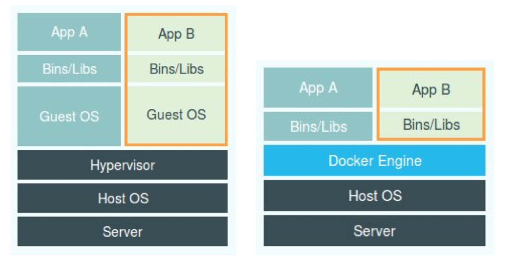
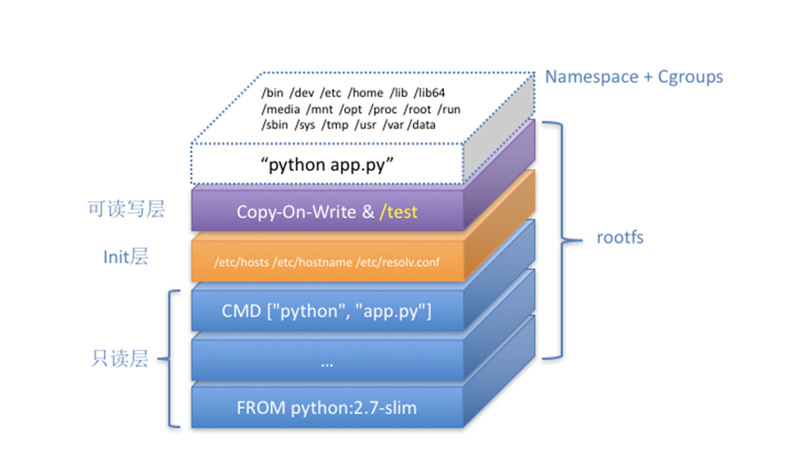

[toc]

------


> 容器本身没有价值，有价值的是“容器编排”。

### 进程

容器其实是一种沙盒技术。顾名思义，沙盒就是能够像一个集装箱一样，把你的应用“装”起来的技术。这样，应用与应用之间，就因为有了边界而不至于相互干扰；而被装进集装箱的应用，也可以被方便地搬来搬去，这不就是 PaaS 最理想的状态嘛。

不过，这两个能力说起来简单，但要用技术手段去实现它们，可能大多数人就无从下手了。

由于计算机只认识 0 和 1，所以无论用哪种语言编写这段代码，最后都需要通过某种方式翻译成二进制文件，才能在计算机操作系统中运行起来。

而为了能够让这些代码正常运行，我们往往还要给它提供数据，比如我们这个加法程序所需要的输入文件。这些数据加上代码本身的二进制文件，放在磁盘上，就是我们平常所说的一个“程序”，也叫代码的可执行镜像（executable image）

然后，我们就可以在计算机上运行这个“程序”了。

首先，操作系统从“程序”中发现输入数据保存在一个文件中，所以这些数据就会被加载到内存中待命。同时，操作系统又读取到了计算加法的指令，这时，它就需要指示 CPU 完成加法操作。而 CPU 与内存协作进行加法计算，又会使用寄存器存放数值、内存堆栈保存执行的命令和变量。同时，计算机里还有被打开的文件，以及各种各样的 I/O 设备在不断地调用中修改自己的状态。

就这样，一旦“程序”被执行起来，它就从磁盘上的二进制文件，变成了计算机内存中的数据、寄存器里的值、堆栈中的指令、被打开的文件，以及各种设备的状态信息的一个集合。

**像这样一个程序运行起来后的计算机执行环境的总和，那就是：进程。**


对于进程来说，它的静态表现就是程序，平常都安安静静地待在磁盘上；而一旦运行起来，它就变成了计算机里的数据和状态的总和，这就是它的动态表现。

**而容器技术的核心功能，就是通过约束和修改进程的动态表现，从而为其创造出一个“边界”。**


对于 Docker 等大多数 Linux 容器来说，Cgroups 技术是用来制造约束的主要手段，而 Namespace 技术则是用来修改进程视图的主要方法。

你可能会觉得 Cgroups 和 Namespace 这两个概念很抽象，别担心，接下来我们一起动手实践一下，你就很容易理解这两项技术了。

假设你已经有了一个 Linux 操作系统上的 Docker 项目在运行，比如我的环境是 Ubuntu 16.04 和 Docker CE 18.05。接下来，让我们首先创建一个容器来试试。

> $ docker run -it busybox /bin/sh
> / #

而 -it 参数告诉了 Docker 项目在启动容器后，需要给我们分配一个文本输入 / 输出环境，也就是 TTY，跟容器的标准输入相关联，这样我们就可以和这个 Docker 容器进行交互了。而 /bin/sh 就是我们要在 Docker 容器里运行的程序。

所以，上面这条指令翻译成人类的语言就是：请帮我启动一个容器，在容器里执行 /bin/sh，并且给我分配一个命令行终端跟这个容器交互。这样，我的 Ubuntu 16.04 机器就变成了一个宿主机，而一个运行着 /bin/sh 的容器，就跑在了这个宿主机里面。

上面的例子和原理，如果你已经玩过 Docker，一定不会感到陌生。此时，如果我们在容器里执行一下 ps 指令，就会发现一些更有趣的事情：

> / # ps
> PID  USER   TIME COMMAND
>   1 root   0:00 /bin/sh
>   10 root   0:00 ps


可以看到，我们在 Docker 里最开始执行的 /bin/sh，就是这个容器内部的第 1 号进程（PID=1），而这个容器里一共只有两个进程在运行。这就意味着，前面执行的 /bin/sh，以及我们刚刚执行的 ps，已经被 Docker 隔离在了一个跟宿主机完全不同的世界当中。


本来，每当我们在宿主机上运行了一个 /bin/sh 程序，操作系统都会给它分配一个进程编号，比如 PID=100。这个编号是进程的唯一标识，就像员工的工牌一样。所以 PID=100，可以粗略地理解为这个 /bin/sh 是我们公司里的第 100 号员工，而第 1 号员工就自然是比尔 · 盖茨这样统领全局的人物。

而现在，我们要通过 Docker 把这个 /bin/sh 程序运行在一个容器当中。这时候，Docker 就会在这个第 100 号员工入职时给他施一个“障眼法”，让他永远看不到前面的其他 99 个员工，更看不到比尔 · 盖茨。这样，他就会错误地以为自己就是公司里的第 1 号员工。

这种机制，其实就是对被隔离应用的进程空间做了手脚，使得这些进程只能看到重新计算过的进程编号，比如 PID=1。可实际上，他们在宿主机的操作系统里，还是原来的第 100 号进程。

这种技术，就是 Linux 里面的 Namespace 机制。而 Namespace 的使用方式也非常有意思：它其实只是 Linux 创建新进程的一个可选参数。我们知道，在 Linux 系统中创建线程的系统调用是 clone()，比如：

> int pid = clone(main_function, stack_size, SIGCHLD, NULL); 


这个系统调用就会为我们创建一个新的进程，并且返回它的进程号 pid。而当我们用 clone() 系统调用创建一个新进程时，就可以在参数中指定 CLONE_NEWPID 参数，比如：

> int pid = clone(main_function, stack_size, CLONE_NEWPID | SIGCHLD, NULL);

这时，新创建的这个进程将会“看到”一个全新的进程空间，在这个进程空间里，它的 PID 是 1。之所以说“看到”，是因为这只是一个“障眼法”，在宿主机真实的进程空间里，这个进程的 PID 还是真实的数值，比如 100。

当然，我们还可以多次执行上面的 clone() 调用，这样就会创建多个 PID Namespace，而每个 Namespace 里的应用进程，都会认为自己是当前容器里的第 1 号进程，它们既看不到宿主机里真正的进程空间，也看不到其他 PID Namespace 里的具体情况。

而除了我们刚刚用到的 PID Namespace，Linux 操作系统还提供了 Mount、UTS、IPC、Network 和 User 这些 Namespace，用来对各种不同的进程上下文进行“障眼法”操作。

比如，Mount Namespace，用于让被隔离进程只看到当前 Namespace 里的挂载点信息；Network Namespace，用于让被隔离进程看到当前 Namespace 里的网络设备和配置。

**这，就是 Linux 容器最基本的实现原理了。**

所以，Docker 容器这个听起来玄而又玄的概念，实际上是在创建容器进程时，指定了这个进程所需要启用的一组 Namespace 参数。这样，容器就只能“看”到当前 Namespace 所限定的资源、文件、设备、状态，或者配置。而对于宿主机以及其他不相关的程序，它就完全看不到了。

**所以说，容器，其实是一种特殊的进程而已。**



这幅图的左边，画出了虚拟机的工作原理。其中，名为 Hypervisor 的软件是虚拟机最主要的部分。它通过硬件虚拟化功能，模拟出了运行一个操作系统需要的各种硬件，比如 CPU、内存、I/O 设备等等。然后，它在这些虚拟的硬件上安装了一个新的操作系统，即 Guest OS。

这样，用户的应用进程就可以运行在这个虚拟的机器中，它能看到的自然也只有 Guest OS 的文件和目录，以及这个机器里的虚拟设备。这就是为什么虚拟机也能起到将不同的应用进程相互隔离的作用。


而这幅图的右边，则用一个名为 Docker Engine 的软件替换了 Hypervisor。这也是为什么，很多人会把 Docker 项目称为“轻量级”虚拟化技术的原因，实际上就是把虚拟机的概念套在了容器上。

**可是这样的说法，却并不严谨。**

在理解了 Namespace 的工作方式之后，你就会明白，跟真实存在的虚拟机不同，在使用 Docker 的时候，并没有一个真正的“Docker 容器”运行在宿主机里面。Docker 项目帮助用户启动的，还是原来的应用进程，只不过在创建这些进程时，Docker 为它们加上了各种各样的 Namespace 参数。

这时，这些进程就会觉得自己是各自 PID Namespace 里的第 1 号进程，只能看到各自 Mount Namespace 里挂载的目录和文件，只能访问到各自 Network Namespace 里的网络设备，就仿佛运行在一个个“容器”里面，与世隔绝。


### 隔离与限制

Namespace 技术实际上修改了应用进程看待整个计算机“视图”，即它的“视线”被操作系统做了限制，只能“看到”某些指定的内容。但对于宿主机来说，这些被“隔离”了的进程跟其他进程并没有太大区别。

在之前虚拟机与容器技术的对比图里，不应该把 Docker Engine 或者任何容器管理工具放在跟 Hypervisor 相同的位置，因为它们并不像 Hypervisor 那样对应用进程的隔离环境负责，也不会创建任何实体的“容器”，真正对隔离环境负责的是宿主机操作系统本身：

在这个对比图里，我们应该把 Docker 画在跟应用同级别并且靠边的位置。这意味着，用户运行在容器里的应用进程，跟宿主机上的其他进程一样，都由宿主机操作系统统一管理，只不过这些被隔离的进程拥有额外设置过的 Namespace 参数。而 Docker 项目在这里扮演的角色，更多的是旁路式的辅助和管理工作。

这样的架构也解释了为什么 Docker 项目比虚拟机更受欢迎的原因。

这是因为，使用虚拟化技术作为应用沙盒，就必须要由 Hypervisor 来负责创建虚拟机，这个虚拟机是真实存在的，并且它里面必须运行一个完整的 Guest OS 才能执行用户的应用进程。这就不可避免地带来了额外的资源消耗和占用。

根据实验，一个运行着 CentOS 的 KVM 虚拟机启动后，在不做优化的情况下，虚拟机自己就需要占用 100~200 MB 内存。此外，用户应用运行在虚拟机里面，它对宿主机操作系统的调用就不可避免地要经过虚拟化软件的拦截和处理，这本身又是一层性能损耗，尤其对计算资源、网络和磁盘 I/O 的损耗非常大。

而相比之下，容器化后的用户应用，却依然还是一个宿主机上的普通进程，这就意味着这些因为虚拟化而带来的性能损耗都是不存在的；而另一方面，使用 Namespace 作为隔离手段的容器并不需要单独的 Guest OS，这就使得容器额外的资源占用几乎可以忽略不计。

所以说，“敏捷”和“高性能”是容器相较于虚拟机最大的优势，也是它能够在 PaaS 这种更细粒度的资源管理平台上大行其道的重要原因。

不过，有利就有弊，基于 Linux Namespace 的隔离机制相比于虚拟化技术也有很多不足之处，其中最主要的问题就是：隔离得不彻底。

首先，既然容器只是运行在宿主机上的一种特殊的进程，那么多个容器之间使用的就还是同一个宿主机的操作系统内核。

尽管你可以在容器里通过 Mount Namespace 单独挂载其他不同版本的操作系统文件，比如 CentOS 或者 Ubuntu，但这并不能改变共享宿主机内核的事实。这意味着，如果你要在 Windows 宿主机上运行 Linux 容器，或者在低版本的 Linux 宿主机上运行高版本的 Linux 容器，都是行不通的。

而相比之下，拥有硬件虚拟化技术和独立 Guest OS 的虚拟机就要方便得多了。最极端的例子是，Microsoft 的云计算平台 Azure，实际上就是运行在 Windows 服务器集群上的，但这并不妨碍你在它上面创建各种 Linux 虚拟机出来。

其次，在 Linux 内核中，有很多资源和对象是不能被 Namespace 化的，最典型的例子就是：时间。

这就意味着，如果你的容器中的程序使用 settimeofday(2) 系统调用修改了时间，整个宿主机的时间都会被随之修改，这显然不符合用户的预期。相比于在虚拟机里面可以随便折腾的自由度，在容器里部署应用的时候，“什么能做，什么不能做”，就是用户必须考虑的一个问题。

此外，由于上述问题，尤其是共享宿主机内核的事实，容器给应用暴露出来的攻击面是相当大的，应用“越狱”的难度自然也比虚拟机低得多。

更为棘手的是，尽管在实践中我们确实可以使用 Seccomp 等技术，对容器内部发起的所有系统调用进行过滤和甄别来进行安全加固，但这种方法因为多了一层对系统调用的过滤，必然会拖累容器的性能。何况，默认情况下，谁也不知道到底该开启哪些系统调用，禁止哪些系统调用。

所以，在生产环境中，没有人敢把运行在物理机上的 Linux 容器直接暴露到公网上。当然，我后续会讲到的基于虚拟化或者独立内核技术的容器实现，则可以比较好地在隔离与性能之间做出平衡。


**在介绍完容器的“隔离”技术之后，我们再来研究一下容器的“限制”问题。**

也许你会好奇，我们不是已经通过 Linux Namespace 创建了一个“容器”吗，为什么还需要对容器做“限制”呢？

虽然容器内的第 1 号进程在“障眼法”的干扰下只能看到容器里的情况，但是宿主机上，它作为第 100 号进程与其他所有进程之间依然是平等的竞争关系。这就意味着，虽然第 100 号进程表面上被隔离了起来，但是它所能够使用到的资源（比如 CPU、内存），却是可以随时被宿主机上的其他进程（或者其他容器）占用的。当然，这个 100 号进程自己也可能把所有资源吃光。这些情况，显然都不是一个“沙盒”应该表现出来的合理行为。

**而 Linux Cgroups 就是 Linux 内核中用来为进程设置资源限制的一个重要功能。**


有意思的是，Google 的工程师在 2006 年发起这项特性的时候，曾将它命名为“进程容器”（process container）。实际上，在 Google 内部，“容器”这个术语长期以来都被用于形容被 Cgroups 限制过的进程组。后来 Google 的工程师们说，他们的 KVM 虚拟机也运行在 Borg 所管理的“容器”里，其实也是运行在 Cgroups“容器”当中。这和我们今天说的 Docker 容器差别很大。

**Linux Cgroups 的全称是 Linux Control Group。它最主要的作用，就是限制一个进程组能够使用的资源上限，包括 CPU、内存、磁盘、网络带宽等等。**

此外，Cgroups 还能够对进程进行优先级设置、审计，以及将进程挂起和恢复等操作。

与容器关系最紧密的“限制”能力，并通过一组实践来认识一下 Cgroups。

在 Linux 中，Cgroups 给用户暴露出来的操作接口是文件系统，即它以文件和目录的方式组织在操作系统的 /sys/fs/cgroup 路径下。在 Ubuntu 16.04 机器里，我可以用 mount 指令把它们展示出来，这条命令是：

> $ mount -t cgroup 
> cpuset on /sys/fs/cgroup/cpuset type cgroup (rw,nosuid,nodev,noexec,relatime,cpuset)
> cpu on /sys/fs/cgroup/cpu type cgroup (rw,nosuid,nodev,noexec,relatime,cpu)
> cpuacct on /sys/fs/cgroup/cpuacct type cgroup (rw,nosuid,nodev,noexec,relatime,cpuacct)
> blkio on /sys/fs/cgroup/blkio type cgroup (rw,nosuid,nodev,noexec,relatime,blkio)
> memory on /sys/fs/cgroup/memory type cgroup (rw,nosuid,nodev,noexec,relatime,memory)
> ...

它的输出结果，是一系列文件系统目录。如果你在自己的机器上没有看到这些目录，那你就需要自己去挂载 Cgroups，具体做法可以自行 Google。

可以看到，在 /sys/fs/cgroup 下面有很多诸如 cpuset、cpu、 memory 这样的子目录，也叫子系统。这些都是我这台机器当前可以被 Cgroups 进行限制的资源种类。而在子系统对应的资源种类下，你就可以看到该类资源具体可以被限制的方法。比如，对 CPU 子系统来说，我们就可以看到如下几个配置文件，这个指令是：

> $ ls /sys/fs/cgroup/cpu
> cgroup.clone_children cpu.cfs_period_us cpu.rt_period_us  cpu.shares notify_on_release
> cgroup.procs      cpu.cfs_quota_us  cpu.rt_runtime_us cpu.stat  tasks

如果熟悉 Linux CPU 管理的话，你就会在它的输出里注意到 cfs_period 和 cfs_quota 这样的关键词。

这两个参数需要组合使用，可以用来限制进程在长度为 cfs_period 的一段时间内，只能被分配到总量为 cfs_quota 的 CPU 时间。

而这样的配置文件又如何使用呢？你需要在对应的子系统下面创建一个目录，比如，我们现在进入 /sys/fs/cgroup/cpu 目录下：

> root@ubuntu:/sys/fs/cgroup/cpu$ mkdir container
> root@ubuntu:/sys/fs/cgroup/cpu$ ls container/
> cgroup.clone_children cpu.cfs_period_us cpu.rt_period_us  cpu.shares notify_on_release
> cgroup.procs      cpu.cfs_quota_us  cpu.rt_runtime_us cpu.stat  tasks

这个目录就称为一个“控制组”。你会发现，操作系统会在你新创建的 container 目录下，自动生成该子系统对应的资源限制文件。现在，我们在后台执行这样一条脚本：

> $ while : ; do : ; done &
> [1] 226

显然，它执行了一个死循环，可以把计算机的 CPU 吃到 100%，根据它的输出，我们可以看到这个脚本在后台运行的进程号（PID）是 226。这样，我们可以用 top 指令来确认一下 CPU 有没有被打满：

> $ top
> %Cpu0 :100.0 us, 0.0 sy, 0.0 ni, 0.0 id, 0.0 wa, 0.0 hi, 0.0 si, 0.0 st

在输出里可以看到，CPU 的使用率已经 100% 了（%Cpu0 :100.0 us）。而此时，我们可以通过查看 container 目录下的文件，看到 container 控制组里的 CPU quota 还没有任何限制（即：-1），CPU period 则是默认的 100 ms（100000 us）：

```

$ cat /sys/fs/cgroup/cpu/container/cpu.cfs_quota_us 
-1
$ cat /sys/fs/cgroup/cpu/container/cpu.cfs_period_us 
100000
```

接下来，我们可以通过修改这些文件的内容来设置限制。比如，向 container 组里的 cfs_quota 文件写入 20 ms（20000 us）：

```

$ echo 20000 > /sys/fs/cgroup/cpu/container/cpu.cfs_quota_us
```

结合前面的介绍，你应该能明白这个操作的含义，它意味着在每 100 ms 的时间里，被该控制组限制的进程只能使用 20 ms 的 CPU 时间，也就是说这个进程只能使用到 20% 的 CPU 带宽。接下来，我们把被限制的进程的 PID 写入 container 组里的 tasks 文件，上面的设置就会对该进程生效了：

```

$ echo 226 > /sys/fs/cgroup/cpu/container/tasks 
```

我们可以用 top 指令查看一下

可以看到，计算机的 CPU 使用率立刻降到了 20%（%Cpu0 : 20.3 us）。

除 CPU 子系统外，Cgroups 的每一个子系统都有其独有的资源限制能力，比如：

- blkio，为块设备设定I/O 限制，一般用于磁盘等设备；
- cpuset，为进程分配单独的 CPU 核和对应的内存节点；
- memory，为进程设定内存使用的限制。

Linux Cgroups 的设计还是比较易用的，简单粗暴地理解呢，它就是一个子系统目录加上一组资源限制文件的组合。而对于 Docker 等 Linux 容器项目来说，它们只需要在每个子系统下面，为每个容器创建一个控制组（即创建一个新目录），然后在启动容器进程之后，把这个进程的 PID 填写到对应控制组的 tasks 文件中就可以了。

而至于在这些控制组下面的资源文件里填上什么值，就靠用户执行 docker run 时的参数指定了，比如这样一条命令：

```

$ docker run -it --cpu-period=100000 --cpu-quota=20000 ubuntu /bin/bash
```

在启动这个容器后，我们可以通过查看 Cgroups 文件系统下，CPU 子系统中，“docker”这个控制组里的资源限制文件的内容来确认：

```

$ cat /sys/fs/cgroup/cpu/docker/5d5c9f67d/cpu.cfs_period_us 
100000
$ cat /sys/fs/cgroup/cpu/docker/5d5c9f67d/cpu.cfs_quota_us 
20000
```

这就意味着这个 Docker 容器，只能使用到 20% 的 CPU 带宽。

除了创建 Namespace 之外，在后续关于容器网络的介绍一些其他 Namespace 的操作，比如看不见摸不着的 Linux Namespace 在计算机中到底如何表示、一个进程如何“加入”到其他进程的 Namespace 当中，等等。

通过以上讲述，你现在应该能够理解，一个正在运行的 Docker 容器，其实就是一个启用了多个 Linux Namespace 的应用进程，而这个进程能够使用的资源量，则受 Cgroups 配置的限制。

这也是容器技术中一个非常重要的概念，即：**容器是一个“单进程”模型。**


由于一个容器的本质就是一个进程，用户的应用进程实际上就是容器里 PID=1 的进程，也是其他后续创建的所有进程的父进程。这就意味着，在一个容器中，你没办法同时运行两个不同的应用，除非你能事先找到一个公共的 PID=1 的程序来充当两个不同应用的父进程，这也是为什么很多人都会用 systemd 或者 supervisord 这样的软件来代替应用本身作为容器的启动进程。

这是因为容器本身的设计，就是希望容器和应用能够同生命周期，这个概念对后续的容器编排非常重要。否则，一旦出现类似于“容器是正常运行的，但是里面的应用早已经挂了”的情况，编排系统处理起来就非常麻烦了。

另外，跟 Namespace 的情况类似，Cgroups 对资源的限制能力也有很多不完善的地方，被提及最多的自然是 /proc 文件系统的问题。

众所周知，Linux 下的 /proc 目录存储的是记录当前内核运行状态的一系列特殊文件，用户可以通过访问这些文件，查看系统以及当前正在运行的进程的信息，比如 CPU 使用情况、内存占用率等，这些文件也是 top 指令查看系统信息的主要数据来源。

但是，你如果在容器里执行 top 指令，就会发现，它显示的信息居然是宿主机的 CPU 和内存数据，而不是当前容器的数据。

造成这个问题的原因就是，/proc 文件系统并不知道用户通过 Cgroups 给这个容器做了什么样的资源限制，即：/proc 文件系统不了解 Cgroups 限制的存在。

在生产环境中，这个问题必须进行修正，否则应用程序在容器里读取到的 CPU 核数、可用内存等信息都是宿主机上的数据，这会给应用的运行带来非常大的困惑和风险。这也是在企业中，容器化应用碰到的一个常见问题，也是容器相较于虚拟机另一个不尽如人意的地方。

```
1、top 是从 /prof/stats 目录下获取数据，所以道理上来讲，容器不挂载宿主机的该目录就可以了。
lxcfs就是来实现这个功能的，做法是把宿主机的 /var/lib/lxcfs/proc/memoinfo 文件挂载到Docker容器的/proc/meminfo位置后。
容器中进程读取相应文件内容时，LXCFS的FUSE实现会从容器对应的Cgroup中读取正确的内存限制。从而使得应用获得正确的资源约束设定。kubernetes环境下，也能用，以ds 方式运行 lxcfs ，自动给容器注入争取的 proc 信息。
2、用的是vanilla kubernetes，遇到的主要挑战就是性能损失和多租户隔离问题，性能损失目前没想到好办法，可能的方案是用ipvs 替换iptables ，以及用 RPC 替换 rest。多租户隔离也没有很好的方法，现在是让不同的namespace调度到不同的物理机上。也许 rancher和openshift已经多租户隔离。
```


### 容器镜像


Namespace 的作用是“隔离”，它让应用进程只能看到该 Namespace 内的“世界”；而 Cgroups 的作用是“限制”，它给这个“世界”围上了一圈看不见的墙。这么一折腾，进程就真的被“装”在了一个与世隔绝的房间里，而这些房间就是 PaaS 项目赖以生存的应用“沙盒”。

这个房间四周虽然有了墙，但是如果容器进程低头一看地面，又是怎样一副景象呢？

换句话说，**容器里的进程看到的文件系统又是什么样子的呢？**

可能你立刻就能想到，这一定是一个关于 Mount Namespace 的问题：容器里的应用进程，理应看到一份完全独立的文件系统。这样，它就可以在自己的容器目录（比如 /tmp）下进行操作，而完全不会受宿主机以及其他容器的影响。

那么，真实情况是这样吗？

下面，我们不妨使用小程序来验证一下刚刚提到的问题。在创建子进程时开启指定的 Namespace。

```

#define _GNU_SOURCE
#include <sys/mount.h> 
#include <sys/types.h>
#include <sys/wait.h>
#include <stdio.h>
#include <sched.h>
#include <signal.h>
#include <unistd.h>
#define STACK_SIZE (1024 * 1024)
static char container_stack[STACK_SIZE];
char* const container_args[] = {
  "/bin/bash",
  NULL
};

int container_main(void* arg)
{  
  printf("Container - inside the container!\n");
  execv(container_args[0], container_args);
  printf("Something's wrong!\n");
  return 1;
}

int main()
{
  printf("Parent - start a container!\n");
  int container_pid = clone(container_main, container_stack+STACK_SIZE, CLONE_NEWNS | SIGCHLD , NULL);
  waitpid(container_pid, NULL, 0);
  printf("Parent - container stopped!\n");
  return 0;
}
```

这段代码的功能非常简单：在 main 函数里，我们通过 clone() 系统调用创建了一个新的子进程 container_main，并且声明要为它启用 Mount Namespace（即：CLONE_NEWNS 标志）。

而这个子进程执行的，是一个“/bin/bash”程序，也就是一个 shell。所以这个 shell 就运行在了 Mount Namespace 的隔离环境中。

```

$ gcc -o ns ns.c
$ ./ns
Parent - start a container!
Container - inside the container!
```

这样，我们就进入了这个“容器”当中。可是，如果在“容器”里执行一下 ls 指令的话，我们就会发现一个有趣的现象： /tmp 目录下的内容跟宿主机的内容是一样的。

```

$ ls /tmp
# 你会看到好多宿主机的文件
```

也就是说：

> 即使开启了 Mount Namespace，容器进程看到的文件系统也跟宿主机完全一样。


仔细思考一下，你会发现这其实并不难理解：Mount Namespace 修改的，是容器进程对文件系统“挂载点”的认知。但是，这也就意味着，只有在“挂载”这个操作发生之后，进程的视图才会被改变。而在此之前，新创建的容器会直接继承宿主机的各个挂载点。

这时，你可能已经想到了一个解决办法：创建新进程时，除了声明要启用 Mount Namespace 之外，我们还可以告诉容器进程，有哪些目录需要重新挂载，就比如这个 /tmp 目录。于是，我们在容器进程执行前可以添加一步重新挂载 /tmp 目录的操作：

```

int container_main(void* arg)
{
  printf("Container - inside the container!\n");
  // 如果你的机器的根目录的挂载类型是shared，那必须先重新挂载根目录
  // mount("", "/", NULL, MS_PRIVATE, "");
  mount("none", "/tmp", "tmpfs", 0, "");
  execv(container_args[0], container_args);
  printf("Something's wrong!\n");
  return 1;
}
```

可以看到，在修改后的代码里，我在容器进程启动之前，加上了一句 mount(“none”, “/tmp”, “tmpfs”, 0, “”) 语句。就这样，我告诉了容器以 tmpfs（内存盘）格式，重新挂载了 /tmp 目录。

这段修改后的代码，编译执行后的结果又如何呢？我们可以试验一下：

```

$ gcc -o ns ns.c
$ ./ns
Parent - start a container!
Container - inside the container!
$ ls /tmp
```

可以看到，这次 /tmp 变成了一个空目录，这意味着重新挂载生效了。我们可以用 mount -l 检查一下：

```

$ mount -l | grep tmpfs
none on /tmp type tmpfs (rw,relatime)
```

可以看到，容器里的 /tmp 目录是以 tmpfs 方式单独挂载的。更重要的是，因为我们创建的新进程启用了 Mount Namespace，所以这次重新挂载的操作，只在容器进程的 Mount Namespace 中有效。如果在宿主机上用 mount -l 来检查一下这个挂载，你会发现它是不存在的：

```

# 在宿主机上
$ mount -l | grep tmpfs
```

这就是 Mount Namespace 跟其他 Namespace 的使用略有不同的地方：它对容器进程视图的改变，一定是伴随着挂载操作（mount）才能生效。

可是，作为一个普通用户，我们希望的是一个更友好的情况：每当创建一个新容器时，我希望容器进程看到的文件系统就是一个独立的隔离环境，而不是继承自宿主机的文件系统。怎么才能做到这一点呢？

不难想到，我们可以在容器进程启动之前重新挂载它的整个根目录“/”。而由于 Mount Namespace 的存在，这个挂载对宿主机不可见，所以容器进程就可以在里面随便折腾了。

在 Linux 操作系统里，有一个名为 chroot 的命令可以帮助你在 shell 中方便地完成这个工作。顾名思义，它的作用就是帮你“change root file system”，即改变进程的根目录到你指定的位置。它的用法也非常简单。

假设，我们现在有一个 $HOME/test 目录，想要把它作为一个 /bin/bash 进程的根目录。首先，创建一个 test 目录和几个 lib 文件夹：

```

$ mkdir -p $HOME/test
$ mkdir -p $HOME/test/{bin,lib64,lib}
$ cd $T
```

然后，把 bash 命令拷贝到 test 目录对应的 bin 路径下：

```

$ cp -v /bin/{bash,ls} $HOME/test/bin
```

接下来，把 bash 命令需要的所有 so 文件，也拷贝到 test 目录对应的 lib 路径下。找到 so 文件可以用 ldd 命令：

```

$ T=$HOME/test
$ list="$(ldd /bin/ls | egrep -o '/lib.*\.[0-9]')"
$ for i in $list; do cp -v "$i" "${T}${i}"; done
```

最后，执行 chroot 命令，告诉操作系统，我们将使用 $HOME/test 目录作为 /bin/bash 进程的根目录：

```

$ chroot $HOME/test /bin/bash
```

这时，你如果执行 "ls /"，就会看到，它返回的都是 `$HOME/test` 目录下面的内容，而不是宿主机的内容。更重要的是，对于被 chroot 的进程来说，它并不会感受到自己的根目录已经被“修改”成 $HOME/test 了。这种视图被修改的原理，是不是跟之前的 Linux Namespace 很类似呢？

**实际上，Mount Namespace 正是基于对 chroot 的不断改良才被发明出来的，它也是 Linux 操作系统里的第一个 Namespace。**

当然，为了能够让容器的这个根目录看起来更“真实”，我们一般会在这个容器的根目录下挂载一个完整操作系统的文件系统，比如 Ubuntu16.04 的 ISO。这样，在容器启动之后，我们在容器里通过执行 "ls /" 查看根目录下的内容，就是 Ubuntu 16.04 的所有目录和文件。

而这个挂载在容器根目录上、用来为容器进程提供隔离后执行环境的文件系统，就是所谓的“容器镜像”。它还有一个更为专业的名字，叫作：rootfs（根文件系统）。

所以，一个最常见的 rootfs，或者说容器镜像，会包括如下所示的一些目录和文件，比如 /bin，/etc，/proc 等等：

```

$ ls /
bin dev etc home lib lib64 mnt opt proc root run sbin sys tmp usr var
```


而你进入容器之后执行的 /bin/bash，就是 /bin 目录下的可执行文件，与宿主机的 /bin/bash 完全不同。

现在，你应该可以理解，对 Docker 项目来说，它最核心的原理实际上就是为待创建的用户进程：

- 启用 Linux Namespace 配置；
- 设置指定的 Cgroups 参数；
- 切换进程的根目录（Change Root）。


这样，一个完整的容器就诞生了。不过，Docker 项目在最后一步的切换上会优先使用 pivot_root 系统调用，如果系统不支持，才会使用 chroot。这两个系统调用虽然功能类似，但是也有细微的区别，这一部分小知识就交给你课后去探索了。

另外，需要明确的是，rootfs 只是一个操作系统所包含的文件、配置和目录，并不包括操作系统内核。在 Linux 操作系统中，这两部分是分开存放的，操作系统只有在开机启动时才会加载指定版本的内核镜像。

所以说，rootfs 只包括了操作系统的“躯壳”，并没有包括操作系统的“灵魂”。

那么，对于容器来说，这个操作系统的“灵魂”又在哪里呢？

实际上，同一台机器上的所有容器，都共享宿主机操作系统的内核。

这就意味着，如果你的应用程序需要配置内核参数、加载额外的内核模块，以及跟内核进行直接的交互，你就需要注意了：这些操作和依赖的对象，都是宿主机操作系统的内核，它对于该机器上的所有容器来说是一个“全局变量”，牵一发而动全身。

这也是容器相比于虚拟机的主要缺陷之一：毕竟后者不仅有模拟出来的硬件机器充当沙盒，而且每个沙盒里还运行着一个完整的 Guest OS 给应用随便折腾。

**不过，正是由于 rootfs 的存在，容器才有了一个被反复宣传至今的重要特性：一致性。**

什么是容器的“一致性”呢？

由于云端与本地服务器环境不同，应用的打包过程，一直是使用 PaaS 时最“痛苦”的一个步骤。但有了容器之后，更准确地说，有了容器镜像（即 rootfs）之后，这个问题被非常优雅地解决了。

由于 rootfs 里打包的不只是应用，而是整个操作系统的文件和目录，也就意味着，应用以及它运行所需要的所有依赖，都被封装在了一起。

事实上，对于大多数开发者而言，他们对应用依赖的理解，一直局限在编程语言层面。比如 Golang 的 Godeps.json。但实际上，一个一直以来很容易被忽视的事实是，对一个应用来说，操作系统本身才是它运行所需要的最完整的“依赖库”。

有了容器镜像“打包操作系统”的能力，这个最基础的依赖环境也终于变成了应用沙盒的一部分。这就赋予了容器所谓的一致性：无论在本地、云端，还是在一台任何地方的机器上，用户只需要解压打包好的容器镜像，那么这个应用运行所需要的完整的执行环境就被重现出来了。

**这种深入到操作系统级别的运行环境一致性，打通了应用在本地开发和远端执行环境之间难以逾越的鸿沟。**

不过，这时你可能已经发现了另一个非常棘手的问题：难道我每开发一个应用，或者升级一下现有的应用，都要重复制作一次 rootfs 吗？

比如，我现在用 Ubuntu 操作系统的 ISO 做了一个 rootfs，然后又在里面安装了 Java 环境，用来部署我的 Java 应用。那么，我的另一个同事在发布他的 Java 应用时，显然希望能够直接使用我安装过 Java 环境的 rootfs，而不是重复这个流程。

一种比较直观的解决办法是，我在制作 rootfs 的时候，每做一步“有意义”的操作，就保存一个 rootfs 出来，这样其他同事就可以按需求去用他需要的 rootfs 了。但是，这个解决办法并不具备推广性。原因在于，一旦你的同事们修改了这个 rootfs，新旧两个 rootfs 之间就没有任何关系了。这样做的结果就是极度的碎片化。

那么，既然这些修改都基于一个旧的 rootfs，我们能不能以增量的方式去做这些修改呢？这样做的好处是，所有人都只需要维护相对于 base rootfs 修改的增量内容，而不是每次修改都制造一个“fork”。

这也正是为何，Docker 公司在实现 Docker 镜像时并没有沿用以前制作 rootfs 的标准流程，而是做了一个小小的创新：

> Docker 在镜像的设计中，引入了层（layer）的概念。也就是说，用户制作镜像的每一步操作，都会生成一个层，也就是一个增量 rootfs。


当然，这个想法不是凭空臆造出来的，而是用到了一种叫作联合文件系统（Union File System）的能力。Union File System 也叫 UnionFS，最主要的功能是将多个不同位置的目录联合挂载（union mount）到同一个目录下。比如，我现在有两个目录 A 和 B，它们分别有两个文件：

```

$ tree
.
├── A
│  ├── a
│  └── x
└── B
  ├── b
  └── x
```

然后，我使用联合挂载的方式，将这两个目录挂载到一个公共的目录 C 上：

```

$ mkdir C
$ mount -t aufs -o dirs=./A:./B none ./C
```

这时，我再查看目录 C 的内容，就能看到目录 A 和 B 下的文件被合并到了一起：

```

$ tree ./C
./C
├── a
├── b
└── x
```

可以看到，在这个合并后的目录 C 里，有 a、b、x 三个文件，并且 x 文件只有一份。这，就是“合并”的含义。此外，如果你在目录 C 里对 a、b、x 文件做修改，这些修改也会在对应的目录 A、B 中生效。

那么，在 Docker 项目中，又是如何使用这种 Union File System 的呢？

我的环境是 Ubuntu 16.04 和 Docker CE 18.05，这对组合默认使用的是 AuFS 这个联合文件系统的实现。你可以通过 docker info 命令，查看到这个信息。

AuFS 的全称是 Another UnionFS，后改名为 Alternative UnionFS，再后来干脆改名叫作 Advance UnionFS，从这些名字中你应该能看出这样两个事实：

- 它是对 Linux 原生 UnionFS 的重写和改进；
- 它的作者怨气好像很大。猜是 Linus Torvalds（Linux 之父）一直不让 AuFS 进入 Linux 内核主干的缘故，所以我们只能在 Ubuntu 和 Debian 这些发行版上使用它。

对于 AuFS 来说，它最关键的目录结构在 /var/lib/docker 路径下的 diff 目录：

```

/var/lib/docker/aufs/diff/<layer_id>
```

**而这个目录的作用，我们不妨通过一个具体例子来看一下。**

现在，我们启动一个容器，比如：

```

$ docker run -d ubuntu:latest sleep 3600
```

这时候，Docker 就会从 Docker Hub 上拉取一个 Ubuntu 镜像到本地。

这个所谓的“镜像”，实际上就是一个 Ubuntu 操作系统的 rootfs，它的内容是 Ubuntu 操作系统的所有文件和目录。不过，与之前我们讲述的 rootfs 稍微不同的是，Docker 镜像使用的 rootfs，往往由多个“层”组成：

```

$ docker image inspect ubuntu:latest
...
     "RootFS": {
      "Type": "layers",
      "Layers": [
        "sha256:f49017d4d5ce9c0f544c...",
        "sha256:8f2b771487e9d6354080...",
        "sha256:ccd4d61916aaa2159429...",
        "sha256:c01d74f99de40e097c73...",
        "sha256:268a067217b5fe78e000..."
      ]
    }
```

可以看到，这个 Ubuntu 镜像，实际上由五个层组成。这五个层就是五个增量 rootfs，每一层都是 Ubuntu 操作系统文件与目录的一部分；而在使用镜像时，Docker 会把这些增量联合挂载在一个统一的挂载点上（等价于前面例子里的“/C”目录）。

这个挂载点就是 /var/lib/docker/aufs/mnt/，比如：

```

/var/lib/docker/aufs/mnt/6e3be5d2ecccae7cc0fcfa2a2f5c89dc21ee30e166be823ceaeba15dce645b3e
```

不出意外的，这个目录里面正是一个完整的 Ubuntu 操作系统：

```

$ ls /var/lib/docker/aufs/mnt/6e3be5d2ecccae7cc0fcfa2a2f5c89dc21ee30e166be823ceaeba15dce645b3e
bin boot dev etc home lib lib64 media mnt opt proc root run sbin srv sys tmp usr var
```

那么，前面提到的五个镜像层，又是如何被联合挂载成这样一个完整的 Ubuntu 文件系统的呢？

这个信息记录在 AuFS 的系统目录 /sys/fs/aufs 下面。

首先，通过查看 AuFS 的挂载信息，我们可以找到这个目录对应的 AuFS 的内部 ID（也叫：si）：

```

$ cat /proc/mounts| grep aufs
none /var/lib/docker/aufs/mnt/6e3be5d2ecccae7cc0fc... aufs rw,relatime,si=972c6d361e6b32ba,dio,dirperm1 0 0
```

即，si=972c6d361e6b32ba。

然后使用这个 ID，你就可以在 /sys/fs/aufs 下查看被联合挂载在一起的各个层的信息：

```

$ cat /sys/fs/aufs/si_972c6d361e6b32ba/br[0-9]*
/var/lib/docker/aufs/diff/6e3be5d2ecccae7cc...=rw
/var/lib/docker/aufs/diff/6e3be5d2ecccae7cc...-init=ro+wh
/var/lib/docker/aufs/diff/32e8e20064858c0f2...=ro+wh
/var/lib/docker/aufs/diff/2b8858809bce62e62...=ro+wh
/var/lib/docker/aufs/diff/20707dce8efc0d267...=ro+wh
/var/lib/docker/aufs/diff/72b0744e06247c7d0...=ro+wh
/var/lib/docker/aufs/diff/a524a729adadedb90...=ro+wh
```

从这些信息里，我们可以看到，镜像的层都放置在 /var/lib/docker/aufs/diff 目录下，然后被联合挂载在 /var/lib/docker/aufs/mnt 里面。

而且，从这个结构可以看出来，这个容器的 rootfs 由如下图所示的三部分组成：


**第一部分，只读层。**

它是这个容器的 rootfs 最下面的五层，对应的正是 ubuntu:latest 镜像的五层。可以看到，它们的挂载方式都是只读的（ro+wh，即 readonly+whiteout，至于什么是 whiteout，我下面马上会讲到）。

这时，我们可以分别查看一下这些层的内容：

```

$ ls /var/lib/docker/aufs/diff/72b0744e06247c7d0...
etc sbin usr var
$ ls /var/lib/docker/aufs/diff/32e8e20064858c0f2...
run
$ ls /var/lib/docker/aufs/diff/a524a729adadedb900...
bin boot dev etc home lib lib64 media mnt opt proc root run sbin srv sys tmp usr var
```

可以看到，这些层，都以增量的方式分别包含了 Ubuntu 操作系统的一部分。


**第二部分，可读写层。**

它是这个容器的 rootfs 最上面的一层（6e3be5d2ecccae7cc），它的挂载方式为：rw，即 read write。在没有写入文件之前，这个目录是空的。而一旦在容器里做了写操作，你修改产生的内容就会以增量的方式出现在这个层中。

可是，你有没有想到这样一个问题：如果我现在要做的，是删除只读层里的一个文件呢？

为了实现这样的删除操作，AuFS 会在可读写层创建一个 whiteout 文件，把只读层里的文件“遮挡”起来。

比如，你要删除只读层里一个名叫 foo 的文件，那么这个删除操作实际上是在可读写层创建了一个名叫.wh.foo 的文件。这样，当这两个层被联合挂载之后，foo 文件就会被.wh.foo 文件“遮挡”起来，“消失”了。这个功能，就是“ro+wh”的挂载方式，即只读 +whiteout 的含义。我喜欢把 whiteout 形象地翻译为：“白障”。

所以，最上面这个可读写层的作用，就是专门用来存放你修改 rootfs 后产生的增量，无论是增、删、改，都发生在这里。而当我们使用完了这个被修改过的容器之后，还可以使用 docker commit 和 push 指令，保存这个被修改过的可读写层，并上传到 Docker Hub 上，供其他人使用；而与此同时，原先的只读层里的内容则不会有任何变化。这，就是增量 rootfs 的好处。

**第三部分，Init 层。**

它是一个以“-init”结尾的层，夹在只读层和读写层之间。Init 层是 Docker 项目单独生成的一个内部层，专门用来存放 /etc/hosts、/etc/resolv.conf 等信息。

需要这样一层的原因是，这些文件本来属于只读的 Ubuntu 镜像的一部分，但是用户往往需要在启动容器时写入一些指定的值比如 hostname，所以就需要在可读写层对它们进行修改。

可是，这些修改往往只对当前的容器有效，我们并不希望执行 docker commit 时，把这些信息连同可读写层一起提交掉。

所以，Docker 做法是，在修改了这些文件之后，以一个单独的层挂载了出来。而用户执行 docker commit 只会提交可读写层，所以是不包含这些内容的。

最终，这 7 个层都被联合挂载到 /var/lib/docker/aufs/mnt 目录下，表现为一个完整的 Ubuntu 操作系统供容器使用。

通过结合使用 Mount Namespace 和 rootfs，容器就能够为进程构建出一个完善的文件系统隔离环境。当然，这个功能的实现还必须感谢 chroot 和 pivot_root 这两个系统调用切换进程根目录的能力。

而在 rootfs 的基础上，Docker 公司创新性地提出了使用多个增量 rootfs 联合挂载一个完整 rootfs 的方案，这就是容器镜像中“层”的概念。

通过“分层镜像”的设计，以 Docker 镜像为核心，来自不同公司、不同团队的技术人员被紧密地联系在了一起。而且，由于容器镜像的操作是增量式的，这样每次镜像拉取、推送的内容，比原本多个完整的操作系统的大小要小得多；而共享层的存在，可以使得所有这些容器镜像需要的总空间，也比每个镜像的总和要小。这样就使得基于容器镜像的团队协作，要比基于动则几个 GB 的虚拟机磁盘镜像的协作要敏捷得多。

更重要的是，一旦这个镜像被发布，那么你在全世界的任何一个地方下载这个镜像，得到的内容都完全一致，可以完全复现这个镜像制作者当初的完整环境。这，就是容器技术“强一致性”的重要体现。

而这种价值正是支撑 Docker 公司在 2014~2016 年间迅猛发展的核心动力。容器镜像的发明，不仅打通了“开发 - 测试 - 部署”流程的每一个环节，更重要的是：

> 容器镜像将会成为未来软件的主流发布方式。


### 容器

用 Docker 部署一个用 Python 编写的 Web 应用。

而将这样一个应用容器化的第一步，是制作容器镜像。

不过，相较于我之前介绍的制作 rootfs 的过程，Docker 为你提供了一种更便捷的方式，叫作 Dockerfile，如下所示。

```

# 使用官方提供的Python开发镜像作为基础镜像
FROM python:2.7-slim

# 将工作目录切换为/app
WORKDIR /app

# 将当前目录下的所有内容复制到/app下
ADD . /app

# 使用pip命令安装这个应用所需要的依赖
RUN pip install --trusted-host pypi.python.org -r requirements.txt

# 允许外界访问容器的80端口
EXPOSE 80

# 设置环境变量
ENV NAME World

# 设置容器进程为：python app.py，即：这个Python应用的启动命令
CMD ["python", "app.py"]
```

通过这个文件的内容，你可以看到 Dockerfile 的设计思想，是使用一些标准的原语（即大写高亮的词语），描述我们所要构建的 Docker 镜像。并且这些原语，都是按顺序处理的。

比如 FROM 原语，指定了“python:2.7-slim”这个官方维护的基础镜像，从而免去了安装 Python 等语言环境的操作。否则，这一段我们就得这么写了：

```

FROM ubuntu:latest
RUN apt-get update -yRUN apt-get install -y python-pip python-dev build-essential
...
```

其中，RUN 原语就是在容器里执行 shell 命令的意思。

而 WORKDIR，意思是在这一句之后，Dockerfile 后面的操作都以这一句指定的 /app 目录作为当前目录。

所以，到了最后的 CMD，意思是 Dockerfile 指定 python app.py 为这个容器的进程。这里，app.py 的实际路径是 /app/app.py。所以，CMD ["python", "app.py"]等价于

```
docker run <image> python app.py
```

另外，在使用 Dockerfile 时，你可能还会看到一个叫作 ENTRYPOINT 的原语。实际上，它和 CMD 都是 Docker 容器进程启动所必需的参数，完整执行格式是：“ENTRYPOINT CMD”。

但是，默认情况下，Docker 会为你提供一个隐含的 ENTRYPOINT，即：/bin/sh -c。所以，在不指定 ENTRYPOINT 时，比如在我们这个例子里，实际上运行在容器里的完整进程是：/bin/sh -c "python app.py"，即 CMD 的内容就是 ENTRYPOINT 的参数。

> 备注：基于以上原因，我们后面会统一称 Docker 容器的启动进程为 ENTRYPOINT，而不是 CMD。

需要注意的是，Dockerfile 里的原语并不都是指对容器内部的操作。就比如 ADD，它指的是把当前目录（即 Dockerfile 所在的目录）里的文件，复制到指定容器内的目录当中。

读懂这个 Dockerfile 之后，我再把上述内容，保存到当前目录里一个名叫“Dockerfile”的文件中：

```
$ ls
Dockerfile  app.py   requirements.txt
```

接下来，我就可以让 Docker 制作这个镜像了，在当前目录执行：

```
$ docker build -t helloworld .
```

其中，-t 的作用是给这个镜像加一个 Tag，即：起一个好听的名字。docker build 会自动加载当前目录下的 Dockerfile 文件，然后按照顺序，执行文件中的原语。而这个过程，实际上可以等同于 Docker 使用基础镜像启动了一个容器，然后在容器中依次执行 Dockerfile 中的原语。

需要注意的是，Dockerfile 中的每个原语执行后，都会生成一个对应的镜像层。即使原语本身并没有明显地修改文件的操作（比如，ENV 原语），它对应的层也会存在。只不过在外界看来，这个层是空的。

docker build 操作完成后，我可以通过 docker images 命令查看结果：

```

$ docker image ls

REPOSITORY            TAG                 IMAGE ID
helloworld         latest              653287cdf998
```

通过这个镜像 ID，你就可以查看这些新增的层在 AuFS 路径下对应的文件和目录了。

接下来，我使用这个镜像，通过 docker run 命令启动容器：

```

$ docker run -p 4000:80 helloworld
```


在这一句命令中，镜像名 helloworld 后面，我什么都不用写，因为在 Dockerfile 中已经指定了 CMD。否则，我就得把进程的启动命令加在后面：

```

$ docker run -p 4000:80 helloworld python app.py
```


容器启动之后，我可以使用 docker ps 命令看到：

```

$ docker ps
CONTAINER ID        IMAGE               COMMAND             CREATED
4ddf4638572d        helloworld       "python app.py"     10 seconds ago
```

同时，我已经通过 -p 4000:80 告诉了 Docker，请把容器内的 80 端口映射在宿主机的 4000 端口上。

否则，我就得先用 docker inspect 命令查看容器的 IP 地址，然后访问“http://< 容器 IP 地址 >:80”才可以看到容器内应用的返回。

至此，我已经使用容器完成了一个应用的开发与测试，如果现在想要把这个容器的镜像上传到 DockerHub 上分享给更多的人，我要怎么做呢？

为了能够上传镜像，我首先需要注册一个 Docker Hub 账号，然后使用 docker login 命令登录。

接下来，我要用 docker tag 命令给容器镜像起一个完整的名字：

```

$ docker tag helloworld aa/helloworld:v1
```

> 注意：你自己做实验时，请将"geektime"替换成你自己的 Docker Hub 账户名称，比如 zhangsan/helloworld:v1

```

$ docker push aa/helloworld:v1
```

此外，我还可以使用 docker commit 指令，把一个正在运行的容器，直接提交为一个镜像。一般来说，需要这么操作原因是：这个容器运行起来后，我又在里面做了一些操作，并且要把操作结果保存到镜像里，比如：

```

$ docker exec -it 4ddf4638572d /bin/sh
# 在容器内部新建了一个文件
root@4ddf4638572d:/app# touch test.txt
root@4ddf4638572d:/app# exit

#将这个新建的文件提交到镜像中保存
$ docker commit 4ddf4638572d aa/helloworld:v2
```

这里，我使用了 docker exec 命令进入到了容器当中。

在了解了 Linux Namespace 的隔离机制后，你应该会很自然地想到一个问题：

**docker exec 是怎么做到进入容器里的呢？**

实际上，Linux Namespace 创建的隔离空间虽然看不见摸不着，但一个进程的 Namespace 信息在宿主机上是确确实实存在的，并且是以一个文件的方式存在。

比如，通过如下指令，你可以看到当前正在运行的 Docker 容器的进程号（PID）是 25686：

```

$ docker inspect --format '{{ .State.Pid }}'  4ddf4638572d
25686
```


这时，你可以通过查看宿主机的 proc 文件，看到这个 25686 进程的所有 Namespace 对应的文件：

```

$ ls -l  /proc/25686/ns
total 0
lrwxrwxrwx 1 root root 0 Aug 13 14:05 cgroup -> cgroup:[4026531835]
lrwxrwxrwx 1 root root 0 Aug 13 14:05 ipc -> ipc:[4026532278]
lrwxrwxrwx 1 root root 0 Aug 13 14:05 mnt -> mnt:[4026532276]
lrwxrwxrwx 1 root root 0 Aug 13 14:05 net -> net:[4026532281]
lrwxrwxrwx 1 root root 0 Aug 13 14:05 pid -> pid:[4026532279]
lrwxrwxrwx 1 root root 0 Aug 13 14:05 pid_for_children -> pid:[4026532279]
lrwxrwxrwx 1 root root 0 Aug 13 14:05 user -> user:[4026531837]
lrwxrwxrwx 1 root root 0 Aug 13 14:05 uts -> uts:[4026532277]
```

可以看到，一个进程的每种 Linux Namespace，都在它对应的 /proc/[进程号]/ns 下有一个对应的虚拟文件，并且链接到一个真实的 Namespace 文件上。

有了这样一个可以“hold 住”所有 Linux Namespace 的文件，我们就可以对 Namespace 做一些很有意义事情了，比如：加入到一个已经存在的 Namespace 当中。

这也就意味着：一个进程，可以选择加入到某个进程已有的 Namespace 当中，从而达到“进入”这个进程所在容器的目的，这正是 docker exec 的实现原理。

而这个操作所依赖的，乃是一个名叫 setns() 的 Linux 系统调用。它的调用方法，我可以用如下一段小程序为你说明：

```

#define _GNU_SOURCE
#include <fcntl.h>
#include <sched.h>
#include <unistd.h>
#include <stdlib.h>
#include <stdio.h>

#define errExit(msg) do { perror(msg); exit(EXIT_FAILURE);} while (0)

int main(int argc, char *argv[]) {
    int fd;
    
    fd = open(argv[1], O_RDONLY);
    if (setns(fd, 0) == -1) {
        errExit("setns");
    }
    execvp(argv[2], &argv[2]); 
    errExit("execvp");
}
```

这段代码功能非常简单：它一共接收两个参数，第一个参数是 argv[1]，即当前进程要加入的 Namespace 文件的路径，比如 /proc/25686/ns/net；而第二个参数，则是你要在这个 Namespace 里运行的进程，比如 /bin/bash。

这段代码的核心操作，则是通过 open() 系统调用打开了指定的 Namespace 文件，并把这个文件的描述符 fd 交给 setns() 使用。在 setns() 执行后，当前进程就加入了这个文件对应的 Linux Namespace 当中了。

 现在，你可以编译执行一下这个程序，加入到容器进程（PID=25686）的 Network Namespace 中：

```

$ gcc -o set_ns set_ns.c 
$ ./set_ns /proc/25686/ns/net /bin/bash 
$ ifconfig
eth0      Link encap:Ethernet  HWaddr 02:42:ac:11:00:02  
          inet addr:172.17.0.2  Bcast:0.0.0.0  Mask:255.255.0.0
          inet6 addr: fe80::42:acff:fe11:2/64 Scope:Link
          UP BROADCAST RUNNING MULTICAST  MTU:1500  Metric:1
          RX packets:12 errors:0 dropped:0 overruns:0 frame:0
          TX packets:10 errors:0 dropped:0 overruns:0 carrier:0
     collisions:0 txqueuelen:0 
          RX bytes:976 (976.0 B)  TX bytes:796 (796.0 B)

lo        Link encap:Local Loopback  
          inet addr:127.0.0.1  Mask:255.0.0.0
          inet6 addr: ::1/128 Scope:Host
          UP LOOPBACK RUNNING  MTU:65536  Metric:1
          RX packets:0 errors:0 dropped:0 overruns:0 frame:0
          TX packets:0 errors:0 dropped:0 overruns:0 carrier:0
    collisions:0 txqueuelen:1000 
          RX bytes:0 (0.0 B)  TX bytes:0 (0.0 B)
```

正如上所示，当我们执行 ifconfig 命令查看网络设备时，我会发现能看到的网卡“变少”了：只有两个。而我的宿主机则至少有四个网卡。这是怎么回事呢？

实际上，在 setns() 之后我看到的这两个网卡，正是我在前面启动的 Docker 容器里的网卡。也就是说，我新创建的这个 /bin/bash 进程，由于加入了该容器进程（PID=25686）的 Network Namepace，它看到的网络设备与这个容器里是一样的，即：/bin/bash 进程的网络设备视图，也被修改了。

而一旦一个进程加入到了另一个 Namespace 当中，在宿主机的 Namespace 文件上，也会有所体现。

在宿主机上，你可以用 ps 指令找到这个 set_ns 程序执行的 /bin/bash 进程，其真实的 PID 是 28499：

```

# 在宿主机上
ps aux | grep /bin/bash
root     28499  0.0  0.0 19944  3612 pts/0    S    14:15   0:00 /bin/bash
```

这时，如果按照前面介绍过的方法，查看一下这个 PID=28499 的进程的 Namespace，你就会发现这样一个事实：

```

$ ls -l /proc/28499/ns/net
lrwxrwxrwx 1 root root 0 Aug 13 14:18 /proc/28499/ns/net -> net:[4026532281]

$ ls -l  /proc/25686/ns/net
lrwxrwxrwx 1 root root 0 Aug 13 14:05 /proc/25686/ns/net -> net:[4026532281]
```

在 /proc/[PID]/ns/net 目录下，这个 PID=28499 进程，与我们前面的 Docker 容器进程（PID=25686）指向的 Network Namespace 文件完全一样。这说明这两个进程，共享了这个名叫 net:[4026532281]的 Network Namespace。

此外，Docker 还专门提供了一个参数，可以让你启动一个容器并“加入”到另一个容器的 Network Namespace 里，这个参数就是 -net，比如:

```

$ docker run -it --net container:4ddf4638572d busybox ifconfig
```

这样，我们新启动的这个容器，就会直接加入到 ID=4ddf4638572d 的容器，也就是我们前面的创建的 Python 应用容器（PID=25686）的 Network Namespace 中。所以，这里 ifconfig 返回的网卡信息，跟我前面那个小程序返回的结果一模一样，你也可以尝试一下。

而如果我指定–net=host，就意味着这个容器不会为进程启用 Network Namespace。这就意味着，这个容器拆除了 Network Namespace 的“隔离墙”，所以，它会和宿主机上的其他普通进程一样，直接共享宿主机的网络栈。这就为容器直接操作和使用宿主机网络提供了一个渠道。

**为你详细解读了 docker exec 这个操作背后，Linux Namespace 更具体的工作原理。**

**这种通过操作系统进程相关的知识，逐步剖析 Docker 容器的方法，是理解容器的一个关键思路，希望你一定要掌握。**

现在，我们再一起回到前面提交镜像的操作 docker commit 上来吧。

docker commit，实际上就是在容器运行起来后，把最上层的“可读写层”，加上原先容器镜像的只读层，打包组成了一个新的镜像。当然，下面这些只读层在宿主机上是共享的，不会占用额外的空间。

而由于使用了联合文件系统，你在容器里对镜像 rootfs 所做的任何修改，都会被操作系统先复制到这个可读写层，然后再修改。这就是所谓的：Copy-on-Write。

而正如前所说，Init 层的存在，就是为了避免你执行 docker commit 时，把 Docker 自己对 /etc/hosts 等文件做的修改，也一起提交掉。

有了新的镜像，我们就可以把它推送到 Docker Hub 上了.

你可能还会有这样的问题：我在企业内部，能不能也搭建一个跟 Docker Hub 类似的镜像上传系统呢？

当然可以，这个统一存放镜像的系统，就叫作 Docker Registry。感兴趣的话，你可以查看Docker 的官方文档，以及VMware 的 Harbor 项目。

最后，再来讲解一下 Docker 项目另一个重要的内容：Volume（数据卷）。


### Volume（数据卷）

容器技术使用了 rootfs 机制和 Mount Namespace，构建出了一个同宿主机完全隔离开的文件系统环境。这时候，我们就需要考虑这样两个问题：

- 容器里进程新建的文件，怎么才能让宿主机获取到？
- 宿主机上的文件和目录，怎么才能让容器里的进程访问到？

这正是 Docker Volume 要解决的问题：**Volume 机制，允许你将宿主机上指定的目录或者文件，挂载到容器里面进行读取和修改操作。**

在 Docker 项目里，它支持两种 Volume 声明方式，可以把宿主机目录挂载进容器的 /test 目录当中：

```

$ docker run -v /test ...
$ docker run -v /home:/test ...
```

而这两种声明方式的本质，实际上是相同的：都是把一个宿主机的目录挂载进了容器的 /test 目录。

只不过，在第一种情况下，由于你并没有显示声明宿主机目录，那么 Docker 就会默认在宿主机上创建一个临时目录 /var/lib/docker/volumes/[VOLUME_ID]/_data，然后把它挂载到容器的 /test 目录上。而在第二种情况下，Docker 就直接把宿主机的 /home 目录挂载到容器的 /test 目录上。

那么，Docker 又是如何做到把一个宿主机上的目录或者文件，挂载到容器里面去呢？难道又是 Mount Namespace 的黑科技吗？

实际上，并不需要这么麻烦。

当容器进程被创建之后，尽管开启了 Mount Namespace，但是在它执行 chroot（或者 pivot_root）之前，容器进程一直可以看到宿主机上的整个文件系统。

而宿主机上的文件系统，也自然包括了我们要使用的容器镜像。这个镜像的各个层，保存在 /var/lib/docker/aufs/diff 目录下，在容器进程启动后，它们会被联合挂载在 /var/lib/docker/aufs/mnt/ 目录中，这样容器所需的 rootfs 就准备好了。

所以，我们只需要在 rootfs 准备好之后，在执行 chroot 之前，把 Volume 指定的宿主机目录（比如 /home 目录），挂载到指定的容器目录（比如 /test 目录）在宿主机上对应的目录（即 /var/lib/docker/aufs/mnt/[可读写层 ID]/test）上，这个 Volume 的挂载工作就完成了。

更重要的是，由于执行这个挂载操作时，“容器进程”已经创建了，也就意味着此时 Mount Namespace 已经开启了。所以，这个挂载事件只在这个容器里可见。你在宿主机上，是看不见容器内部的这个挂载点的。这就保证了容器的隔离性不会被 Volume 打破。

> 注意：这里提到的"容器进程"，是 Docker 创建的一个容器初始化进程 (dockerinit)，而不是应用进程 (ENTRYPOINT + CMD)。dockerinit 会负责完成根目录的准备、挂载设备和目录、配置 hostname 等一系列需要在容器内进行的初始化操作。最后，它通过 execv() 系统调用，让应用进程取代自己，成为容器里的 PID=1 的进程。

而这里要使用到的挂载技术，就是 Linux 的绑定挂载（bind mount）机制。它的主要作用就是，允许你将一个目录或者文件，而不是整个设备，挂载到一个指定的目录上。并且，这时你在该挂载点上进行的任何操作，只是发生在被挂载的目录或者文件上，而原挂载点的内容则会被隐藏起来且不受影响。

其实，如果你了解 Linux 内核的话，就会明白，绑定挂载实际上是一个 inode 替换的过程。在 Linux 操作系统中，inode 可以理解为存放文件内容的“对象”，而 dentry，也叫目录项，就是访问这个 inode 所使用的“指针”。

mount --bind /home /test，会将 /home 挂载到 /test 上。其实相当于将 /test 的 dentry，重定向到了 /home 的 inode。这样当我们修改 /test 目录时，实际修改的是 /home 目录的 inode。这也就是为何，一旦执行 umount 命令，/test 目录原先的内容就会恢复：因为修改真正发生在的，是 /home 目录里。

**所以，在一个正确的时机，进行一次绑定挂载，Docker 就可以成功地将一个宿主机上的目录或文件，不动声色地挂载到容器中。**

这样，进程在容器里对这个 /test 目录进行的所有操作，都实际发生在宿主机的对应目录（比如，/home，或者 /var/lib/docker/volumes/[VOLUME_ID]/_data）里，而不会影响容器镜像的内容。那么，这个 /test 目录里的内容，既然挂载在容器 rootfs 的可读写层，它会不会被 docker commit 提交掉呢？也不会。

这个原因：容器的镜像操作，比如 docker commit，都是发生在宿主机空间的。而由于 Mount Namespace 的隔离作用，宿主机并不知道这个绑定挂载的存在。所以，在宿主机看来，容器中可读写层的 /test 目录（/var/lib/docker/aufs/mnt/[可读写层 ID]/test），始终是空的。

不过，由于 Docker 一开始还是要创建 /test 这个目录作为挂载点，所以执行了 docker commit 之后，你会发现新产生的镜像里，会多出来一个空的 /test 目录。毕竟，新建目录操作，又不是挂载操作，Mount Namespace 对它可起不到“障眼法”的作用。

现在来亲自验证一下：

```

$ docker run -d -v /test helloworld
cf53b766fa6f
```

容器启动之后，我们来查看一下这个 Volume 的 ID：

```

$ docker volume ls
DRIVER              VOLUME NAME
local               cb1c2f7221fa9b0971cc35f68aa1034824755ac44a034c0c0a1dd318838d3a6d
```

然后，使用这个 ID，可以找到它在 Docker 工作目录下的 volumes 路径：

```

$ ls /var/lib/docker/volumes/cb1c2f7221fa/_data/
```


这个 _data 文件夹，就是这个容器的 Volume 在宿主机上对应的临时目录了。接下来，我们在容器的 Volume 里，添加一个文件 text.txt：

```

$ docker exec -it cf53b766fa6f /bin/sh
cd test/
touch text.txt
```


这时，我们再回到宿主机，就会发现 text.txt 已经出现在了宿主机上对应的临时目录里：

```

$ ls /var/lib/docker/volumes/cb1c2f7221fa/_data/
text.txt
```

可是，如果你在宿主机上查看该容器的可读写层，虽然可以看到这个 /test 目录，但其内容是空的

```

$ ls /var/lib/docker/aufs/mnt/6780d0778b8a/test
```

可以确认，容器 Volume 里的信息，并不会被 docker commit 提交掉；但这个挂载点目录 /test 本身，则会出现在新的镜像当中。



