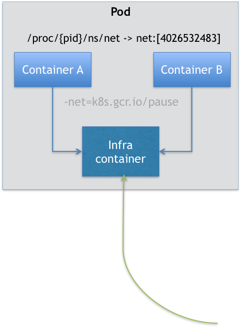

[toc]

------


### Pod的由来

在学习和使用 Kubernetes 项目的过程中，已经不止一次地想要问这样一个问题：为什么我们会需要 Pod？

“Namespace 做隔离，Cgroups 做限制，rootfs 做文件系统”这样的“三句箴言”可以朗朗上口了，为什么 Kubernetes 项目又突然搞出一个 Pod 来呢？

容器的本质到底是什么？容器的本质是进程。


容器，就是未来云计算系统中的进程；容器镜像就是这个系统里的“.exe”安装包。那么 Kubernetes 呢？

Kubernetes 就是操作系统！

现在，就让我们登录到一台 Linux 机器里，执行一条如下所示的命令：

```

$ pstree -g
```

这条命令的作用，是展示当前系统中正在运行的进程的树状结构。它的返回结果如下所示：

```

systemd(1)-+-accounts-daemon(1984)-+-{gdbus}(1984)
           | `-{gmain}(1984)
           |-acpid(2044)
          ...      
           |-lxcfs(1936)-+-{lxcfs}(1936)
           | `-{lxcfs}(1936)
           |-mdadm(2135)
           |-ntpd(2358)
           |-polkitd(2128)-+-{gdbus}(2128)
           | `-{gmain}(2128)
           |-rsyslogd(1632)-+-{in:imklog}(1632)
           |  |-{in:imuxsock) S 1(1632)
           | `-{rs:main Q:Reg}(1632)
           |-snapd(1942)-+-{snapd}(1942)
           |  |-{snapd}(1942)
           |  |-{snapd}(1942)
           |  |-{snapd}(1942)
           |  |-{snapd}(1942)
```

不难发现，在一个真正的操作系统里，进程并不是“孤苦伶仃”地独自运行的，而是以进程组的方式，“有原则地”组织在一起。比如，这里有一个叫作 rsyslogd 的程序，它负责的是 Linux 操作系统里的日志处理。可以看到，rsyslogd 的主程序 main，和它要用到的内核日志模块 imklog 等，同属于 1632 进程组。这些进程相互协作，共同完成 rsyslogd 程序的职责。

> rsyslogd 对应的 imklog，imuxsock 和 main，严格意义上来说，其实是 Linux 操作系统语境下的“线程”。这些线程，或者说，轻量级进程之间，可以共享文件、信号、数据内存、甚至部分代码，从而紧密协作共同完成一个程序的职责。所以同理，我提到的“进程组”，对应的也是 Linux 操作系统语境下的“线程组”。这种命名关系与实际情况的不一致，是 Linux 发展历史中的一个遗留问题。
>
> 有兴趣的可以看下[Linux 线程实现机制分析](https://www.ibm.com/developerworks/cn/linux/kernel/l-thread/index.html)

而 Kubernetes 项目所做的，其实就是将“进程组”的概念映射到了容器技术中，并使其成为了这个云计算“操作系统”里的“一等公民”。

Kubernetes 项目之所以要这么做的原因，在 Borg 项目的开发和实践过程中，Google 公司的工程师们发现，他们部署的应用，往往都存在着类似于“进程和进程组”的关系。更具体地说，就是这些应用之间有着密切的协作关系，使得它们必须部署在同一台机器上。

而如果事先没有“组”的概念，像这样的运维关系就会非常难以处理。

以前面的 rsyslogd 为例子。已知 rsyslogd 由三个进程组成：一个 imklog 模块，一个 imuxsock 模块，一个 rsyslogd 自己的 main 函数主进程。这三个进程一定要运行在同一台机器上，否则，它们之间基于 Socket 的通信和文件交换，都会出现问题。

现在，要把 rsyslogd 这个应用给容器化，由于受限于容器的“单进程模型”，这三个模块必须被分别制作成三个不同的容器。而在这三个容器运行的时候，它们设置的内存配额都是 1 GB。

> 强调一下：容器的“单进程模型”，并不是指容器里只能运行“一个”进程，而是指容器没有管理多个进程的能力。这是因为容器里 PID=1 的进程就是应用本身，其他的进程都是这个 PID=1 进程的子进程。可是，用户编写的应用，并不能够像正常操作系统里的 init 进程或者 systemd 那样拥有进程管理的功能。比如，你的应用是一个 Java Web 程序（PID=1），然后你执行 docker exec 在后台启动了一个 Nginx 进程（PID=3）。可是，当这个 Nginx 进程异常退出的时候，你该怎么知道呢？这个进程退出后的垃圾收集工作，又应该由谁去做呢？


假设我们的 Kubernetes 集群上有两个节点：node-1 上有 3 GB 可用内存，node-2 有 2.5 GB 可用内存。这时，假设我要用 Docker Swarm 来运行这个 rsyslogd 程序。为了能够让这三个容器都运行在同一台机器上，我就必须在另外两个容器上设置一个 affinity=main（与 main 容器有亲密性）的约束，即：它们俩必须和 main 容器运行在同一台机器上。然后，我顺序执行：“docker run main”“docker run imklog”和“docker run imuxsock”，创建这三个容器。这样，这三个容器都会进入 Swarm 的待调度队列。然后，main 容器和 imklog 容器都先后出队并被调度到了 node-2 上（这个情况是完全有可能的）。

可是，当 imuxsock 容器出队开始被调度时，Swarm 就有点懵了：node-2 上的可用资源只有 0.5 GB 了，并不足以运行 imuxsock 容器；可是，根据 affinity=main 的约束，imuxsock 容器又只能运行在 node-2 上。

这就是一个典型的成组调度（gang scheduling）没有被妥善处理的例子。

在工业界和学术界，关于这个问题的讨论可谓旷日持久，也产生了很多可供选择的解决方案。

比如，Mesos 中就有一个资源囤积（resource hoarding）的机制，会在所有设置了 Affinity 约束的任务都达到时，才开始对它们统一进行调度。而在 Google Omega 论文中，则提出了使用乐观调度处理冲突的方法，即：先不管这些冲突，而是通过精心设计的回滚机制在出现了冲突之后解决问题。可是这些方法都谈不上完美。资源囤积带来了不可避免的调度效率损失和死锁的可能性；而乐观调度的复杂程度，则不是常规技术团队所能驾驭的。

但是，到了 Kubernetes 项目里，这样的问题就迎刃而解了：Pod 是 Kubernetes 里的原子调度单位。这就意味着，Kubernetes 项目的调度器，是统一按照 Pod 而非容器的资源需求进行计算的。

所以，像 imklog、imuxsock 和 main 函数主进程这样的三个容器，正是一个典型的由三个容器组成的 Pod。Kubernetes 项目在调度时，自然就会去选择可用内存等于 3 GB 的 node-1 节点进行绑定，而根本不会考虑 node-2。

像这样容器间的紧密协作，我们可以称为“超亲密关系”。这些具有“超亲密关系”容器的典型特征包括但不限于：互相之间会发生直接的文件交换、使用 localhost 或者 Socket 文件进行本地通信、会发生非常频繁的远程调用、需要共享某些 Linux Namespace（比如，一个容器要加入另一个容器的 Network Namespace）等等。

这也就意味着，并不是所有有“关系”的容器都属于同一个 Pod。比如，PHP 应用容器和 MySQL 虽然会发生访问关系，但并没有必要、也不应该部署在同一台机器上，它们更适合做成两个 Pod。

相信此时你可能会有**第二个疑问：**

对于初学者来说，一般都是先学会了用 Docker 这种单容器的工具，才会开始接触 Pod。而如果 Pod 的设计只是出于调度上的考虑，那么 Kubernetes 项目似乎完全没有必要非得把 Pod 作为“一等公民”吧？这不是故意增加用户的学习门槛吗？

没错，如果只是处理“超亲密关系”这样的调度问题，有 Borg 和 Omega 论文珠玉在前，Kubernetes 项目肯定可以在调度器层面给它解决掉。

不过，Pod 在 Kubernetes 项目里还有更重要的意义，那就是：**容器设计模式。**


### Pod 的实现原理

为了理解这容器设计模式含义，就必须理清楚Pod 的实现原理。

首先，关于 Pod 最重要的一个事实是：它只是一个逻辑概念。

也就是说，Kubernetes 真正处理的，还是宿主机操作系统上 Linux 容器的 Namespace 和 Cgroups，而并不存在一个所谓的 Pod 的边界或者隔离环境。那么，Pod 又是怎么被“创建”出来的呢？答案是：Pod，其实是一组共享了某些资源的容器。

具体的说：Pod 里的所有容器，共享的是同一个 Network Namespace，并且可以声明共享同一个 Volume。

那这么来看的话，一个有 A、B 两个容器的 Pod，不就是等同于一个容器（容器 A）共享另外一个容器（容器 B）的网络和 Volume 的玩儿法么？

这好像通过 docker run --net --volumes-from 这样的命令就能实现嘛，比如：

```

$ docker run --net=B --volumes-from=B --name=A image-A ...
```

但是，你有没有考虑过，如果真这样做的话，容器 B 就必须比容器 A 先启动，这样一个 Pod 里的多个容器就不是对等关系，而是拓扑关系了。

所以，在 Kubernetes 项目里，Pod 的实现需要使用一个中间容器，这个容器叫作 Infra 容器。在这个 Pod 中，Infra 容器永远都是第一个被创建的容器，而其他用户定义的容器，则通过 Join Network Namespace 的方式，与 Infra 容器关联在一起。这样的组织关系，可以用下面这样一个示意图来表达：



如上图所示，这个 Pod 里有两个用户容器 A 和 B，还有一个 Infra 容器。很容易理解，在 Kubernetes 项目里，Infra 容器一定要占用极少的资源，所以它使用的是一个非常特殊的镜像，叫作：k8s.gcr.io/pause。这个镜像是一个用汇编语言编写的、永远处于“暂停”状态的容器，解压后的大小也只有 100~200 KB 左右。

如上图所示，这个 Pod 里有两个用户容器 A 和 B，还有一个 Infra 容器。很容易理解，在 Kubernetes 项目里，Infra 容器一定要占用极少的资源，所以它使用的是一个非常特殊的镜像，叫作：k8s.gcr.io/pause。这个镜像是一个用汇编语言编写的、永远处于“暂停”状态的容器，解压后的大小也只有 100~200 KB 左右。


对于 Pod 里的容器 A 和容器 B 来说：

- 它们可以直接使用 localhost 进行通信；
- 它们看到的网络设备跟 Infra 容器看到的完全一样；
- 一个 Pod 只有一个 IP 地址，也就是这个 Pod 的 Network Namespace 对应的 IP 地址；
- 当然，其他的所有网络资源，都是一个 Pod 一份，并且被该 Pod 中的所有容器共享；
- Pod 的生命周期只跟 Infra 容器一致，而与容器 A 和 B 无关。

而对于同一个 Pod 里面的所有用户容器来说，它们的进出流量，也可以认为都是通过 Infra 容器完成的。这一点很重要，**因为将来如果你要为 Kubernetes 开发一个网络插件时，应该重点考虑的是如何配置这个 Pod 的 Network Namespace，而不是每一个用户容器如何使用你的网络配置，这是没有意义的。**

这就意味着，如果你的网络插件需要在容器里安装某些包或者配置才能完成的话，是不可取的：Infra 容器镜像的 rootfs 里几乎什么都没有，没有你随意发挥的空间。当然，这同时也意味着你的网络插件完全不必关心用户容器的启动与否，而只需要关注如何配置 Pod，也就是 Infra 容器的 Network Namespace 即可。

有了这个设计之后，共享 Volume 就简单多了：Kubernetes 项目只要把所有 Volume 的定义都设计在 Pod 层级即可。

这样，一个 Volume 对应的宿主机目录对于 Pod 来说就只有一个，Pod 里的容器只要声明挂载这个 Volume，就一定可以共享这个 Volume 对应的宿主机目录。比如下面这个例子：

```

apiVersion: v1
kind: Pod
metadata:
  name: two-containers
spec:
  restartPolicy: Never
  volumes:
  - name: shared-data
    hostPath:      
      path: /data
  containers:
  - name: nginx-container
    image: nginx
    volumeMounts:
    - name: shared-data
      mountPath: /usr/share/nginx/html
  - name: debian-container
    image: debian
    volumeMounts:
    - name: shared-data
      mountPath: /pod-data
    command: ["/bin/sh"]
    args: ["-c", "echo Hello from the debian container > /pod-data/index.html"]
```

在这个例子中，debian-container 和 nginx-container 都声明挂载了 shared-data 这个 Volume。而 shared-data 是 hostPath 类型。所以，它对应在宿主机上的目录就是：/data。而这个目录，其实就被同时绑定挂载进了上述两个容器当中。这就是为什么，nginx-container 可以从它的 /usr/share/nginx/html 目录中，读取到 debian-container 生成的 index.html 文件的原因。

这就是**Pod 的实现原理**


Pod 这种“超亲密关系”容器的设计思想，实际上就是希望，当用户想在一个容器里跑多个功能并不相关的应用时，应该优先考虑它们是不是更应该被描述成一个 Pod 里的多个容器。

为了能够掌握这种思考方式，你就应该尽量尝试使用它来描述一些用单个容器难以解决的问题。

**第一个最典型的例子是：WAR 包与 Web 服务器。**

现在有一个 Java Web 应用的 WAR 包，它需要被放在 Tomcat 的 webapps 目录下运行起来。假如，你现在只能用 Docker 来做这件事情，那该如何处理这个组合关系呢？

- 一种方法是，把 WAR 包直接放在 Tomcat 镜像的 webapps 目录下，做成一个新的镜像运行起来。可是，这时候，如果你要更新 WAR 包的内容，或者要升级 Tomcat 镜像，就要重新制作一个新的发布镜像，非常麻烦。
- 另一种方法是，你压根儿不管 WAR 包，永远只发布一个 Tomcat 容器。不过，这个容器的 webapps 目录，就必须声明一个 hostPath 类型的 Volume，从而把宿主机上的 WAR 包挂载进 Tomcat 容器当中运行起来。不过，这样你就必须要解决一个问题，即：如何让每一台宿主机，都预先准备好这个存储有 WAR 包的目录呢？这样来看，你只能独立维护一套分布式存储系统了。

实际上，有了 Pod 之后，这样的问题就很容易解决了。我们可以把 WAR 包和 Tomcat 分别做成镜像，然后把它们作为一个 Pod 里的两个容器“组合”在一起。这个 Pod 的配置文件如下所示：

```

apiVersion: v1
kind: Pod
metadata:
  name: javaweb-2
spec:
  initContainers:
  - image: geektime/sample:v2
    name: war
    command: ["cp", "/sample.war", "/app"]
    volumeMounts:
    - mountPath: /app
      name: app-volume
  containers:
  - image: geektime/tomcat:7.0
    name: tomcat
    command: ["sh","-c","/root/apache-tomcat-7.0.42-v2/bin/start.sh"]
    volumeMounts:
    - mountPath: /root/apache-tomcat-7.0.42-v2/webapps
      name: app-volume
    ports:
    - containerPort: 8080
      hostPort: 8001 
  volumes:
  - name: app-volume
    emptyDir: {}
```

在这个 Pod 中，我们定义了两个容器，第一个容器使用的镜像是 geektime/sample:v2，这个镜像里只有一个 WAR 包（sample.war）放在根目录下。而第二个容器则使用的是一个标准的 Tomcat 镜像。不过，你可能已经注意到，WAR 包容器的类型不再是一个普通容器，而是一个 Init Container 类型的容器。在 Pod 中，所有 Init Container 定义的容器，都会比 spec.containers 定义的用户容器先启动。并且，Init Container 容器会按顺序逐一启动，而直到它们都启动并且退出了，用户容器才会启动。

所以，这个 Init Container 类型的 WAR 包容器启动后，我执行了一句"cp /sample.war /app"，把应用的 WAR 包拷贝到 /app 目录下，然后退出。而后这个 /app 目录，就挂载了一个名叫 app-volume 的 Volume。接下来就很关键了。Tomcat 容器，同样声明了挂载 app-volume 到自己的 webapps 目录下。

所以，等 Tomcat 容器启动时，它的 webapps 目录下就一定会存在 sample.war 文件：这个文件正是 WAR 包容器启动时拷贝到这个 Volume 里面的，而这个 Volume 是被这两个容器共享的。像这样，我们就用一种“组合”方式，解决了 WAR 包与 Tomcat 容器之间耦合关系的问题。实际上，这个所谓的“组合”操作，正是容器设计模式里最常用的一种模式，它的名字叫：sidecar。

顾名思义，sidecar 指的就是我们可以在一个 Pod 中，启动一个辅助容器，来完成一些独立于主进程（主容器）之外的工作。比如，在我们的这个应用 Pod 中，Tomcat 容器是我们要使用的主容器，而 WAR 包容器的存在，只是为了给它提供一个 WAR 包而已。所以，我们用 Init Container 的方式优先运行 WAR 包容器，扮演了一个 sidecar 的角色。

**第二个例子，则是容器的日志收集。**

比如，我现在有一个应用，需要不断地把日志文件输出到容器的 /var/log 目录中。这时，我就可以把一个 Pod 里的 Volume 挂载到应用容器的 /var/log 目录上。然后，我在这个 Pod 里同时运行一个 sidecar 容器，它也声明挂载同一个 Volume 到自己的 /var/log 目录上。

这样，接下来 sidecar 容器就只需要做一件事儿，那就是不断地从自己的 /var/log 目录里读取日志文件，转发到 MongoDB 或者 Elasticsearch 中存储起来。这样，一个最基本的日志收集工作就完成了。

这个例子中的 sidecar 的主要工作也是使用共享的 Volume 来完成对文件的操作。

但不要忘记，Pod 的另一个重要特性是，它的所有容器都共享同一个 Network Namespace。这就使得很多与 Pod 网络相关的配置和管理，也都可以交给 sidecar 完成，而完全无须干涉用户容器。

这里最典型的例子莫过于 Istio 这个微服务治理项目了。Istio 项目使用 sidecar 容器完成微服务治理的原理。

> [Kubernetes 社区的“容器设计模式”理论](https://www.usenix.org/conference/hotcloud16/workshop-program/presentation/burns)

> Pod，实际上是在扮演传统基础设施里“虚拟机”的角色；而容器，则是这个虚拟机里运行的用户程序。

当你需要把一个运行在虚拟机里的应用迁移到 Docker 容器中时，一定要仔细分析到底有哪些进程（组件）运行在这个虚拟机里。然后，你就可以把整个虚拟机想象成为一个 Pod，把这些进程分别做成容器镜像，把有顺序关系的容器，定义为 Init Container。这才是更加合理的、松耦合的容器编排诀窍，也是从传统应用架构，到“微服务架构”最自然的过渡方式。

> Pod 这个概念，提供的是一种编排思想，而不是具体的技术方案。所以，如果愿意的话，你完全可以使用虚拟机来作为 Pod 的实现，然后把用户容器都运行在这个虚拟机里。


### 基本概念

Pod，而不是容器，才是 Kubernetes 项目中的最小编排单位。将这个设计落实到 API 对象上，容器（Container）就成了 Pod 属性里的一个普通的字段。那么，一个很自然的问题就是：到底哪些属性属于 Pod 对象，而又有哪些属性属于 Container 呢？

> Pod 扮演的是传统部署环境里“虚拟机”的角色。这样的设计，是为了使用户从传统环境（虚拟机环境）向 Kubernetes（容器环境）的迁移，更加平滑。
>
> 而如果你能把 Pod 看成传统环境里的“机器”、把容器看作是运行在这个“机器”里的“用户程序”，那么很多关于 Pod 对象的设计就非常容易理解了。


**比如，凡是调度、网络、存储，以及安全相关的属性，基本上是 Pod 级别的。**

这些属性的共同特征是，它们描述的是“机器”这个整体，而不是里面运行的“程序”。比如，配置这个“机器”的网卡（即：Pod 的网络定义），配置这个“机器”的磁盘（即：Pod 的存储定义），配置这个“机器”的防火墙（即：Pod 的安全定义）。更不用说，这台“机器”运行在哪个服务器之上（即：Pod 的调度）。

接下来，我就先为你介绍 Pod 中几个重要字段的含义和用法。

**NodeSelector：是一个供用户将 Pod 与 Node 进行绑定的字段**，用法如下所示：

```

apiVersion: v1
kind: Pod
...
spec:
 nodeSelector:
   disktype: ssd
```

这个 Pod 永远只能运行在携带了“disktype: ssd”标签（Label）的节点上；否则，它将调度失败。

**NodeName**：一旦 Pod 的这个字段被赋值，Kubernetes 项目就会被认为这个 Pod 已经经过了调度，调度的结果就是赋值的节点名字。所以，这个字段一般由调度器负责设置，但用户也可以设置它来“骗过”调度器，当然这个做法一般是在测试或者调试的时候才会用到。

**HostAliases**：定义了 Pod 的 hosts 文件（比如 /etc/hosts）里的内容，用法如下：

```

apiVersion: v1
kind: Pod
...
spec:
  hostAliases:
  - ip: "10.1.2.3"
    hostnames:
    - "foo.remote"
    - "bar.remote"
...
```

在这个 Pod 的 YAML 文件中，我设置了一组 IP 和 hostname 的数据。这样，这个 Pod 启动后，/etc/hosts 文件的内容将如下所示：

```

cat /etc/hosts
# Kubernetes-managed hosts file.
127.0.0.1 localhost
...
10.244.135.10 hostaliases-pod
10.1.2.3 foo.remote
10.1.2.3 bar.remote
```

最下面两行记录，就是通过 HostAliases 字段为 Pod 设置的。需要指出的是，在 Kubernetes 项目中，如果要设置 hosts 文件里的内容，一定要通过这种方法。否则，如果直接修改了 hosts 文件的话，在 Pod 被删除重建之后，kubelet 会自动覆盖掉被修改的内容。

除了上述跟“机器”相关的配置外，你可能也会发现，凡是跟容器的 Linux Namespace 相关的属性，也一定是 Pod 级别的。这个原因也很容易理解：Pod 的设计，就是要让它里面的容器尽可能多地共享 Linux Namespace，仅保留必要的隔离和限制能力。这样，Pod 模拟出的效果，就跟虚拟机里程序间的关系非常类似了。

举个例子，在下面这个 Pod 的 YAML 文件中，我定义了 shareProcessNamespace=true：

```

apiVersion: v1
kind: Pod
metadata:
  name: nginx
spec:
  shareProcessNamespace: true
  containers:
  - name: nginx
    image: nginx
  - name: shell
    image: busybox
    stdin: true
    tty: true
```


这个 Pod 里的容器要共享 PID Namespace。

在这个 YAML 文件中，还定义了两个容器：一个是 nginx 容器，一个是开启了 tty 和 stdin 的 shell 容器。

在 Pod 的 YAML 文件里声明开启tty 和 stdin，其实等同于设置了 docker run 里的 -it（-i 即 stdin，-t 即 tty）参数。

可以直接认为 tty 就是 Linux 给用户提供的一个常驻小程序，用于接收用户的标准输入，返回操作系统的标准输出。当然，为了能够在 tty 中输入信息，你还需要同时开启 stdin（标准输入流）。

这个 Pod 被创建后，你就可以使用 shell 容器的 tty 跟这个容器进行交互了。

```

$ kubectl create -f nginx.yaml
```

接下来，我们使用 kubectl attach 命令，连接到 shell 容器的 tty 上：

```

$ kubectl attach -it nginx -c shell
```

这样，我们就可以在 shell 容器里执行 ps 指令，查看所有正在运行的进程：

```

$ kubectl attach -it nginx -c shell
/ # ps ax
PID   USER     TIME  COMMAND
    1 root      0:00 /pause
    8 root      0:00 nginx: master process nginx -g daemon off;
   14 101       0:00 nginx: worker process
   15 root      0:00 sh
   21 root      0:00 ps ax
```

可以看到，在这个容器里，我们不仅可以看到它本身的 ps ax 指令，还可以看到 nginx 容器的进程，以及 Infra 容器的 /pause 进程。这就意味着，整个 Pod 里的每个容器的进程，对于所有容器来说都是可见的：它们共享了同一个 PID Namespace。

**凡是 Pod 中的容器要共享宿主机的 Namespace，也一定是 Pod 级别的定义**，比如：

```

apiVersion: v1
kind: Pod
metadata:
  name: nginx
spec:
  hostNetwork: true
  hostIPC: true
  hostPID: true
  containers:
  - name: nginx
    image: nginx
  - name: shell
    image: busybox
    stdin: true
    tty: true
```

定义了共享宿主机的 Network、IPC 和 PID Namespace。这就意味着，这个 Pod 里的所有容器，会直接使用宿主机的网络、直接与宿主机进行 IPC 通信、看到宿主机里正在运行的所有进程。

除了这些属性，Pod 里最重要的字段当属“Containers”了。还有“Init Containers”。其实，这两个字段都属于 Pod 对容器的定义，内容也完全相同，只是 Init Containers 的生命周期，会先于所有的 Containers，并且严格按照定义的顺序执行。

Kubernetes 项目中对 Container 的定义，和 Docker 相比并没有什么太大区别。Image（镜像）、Command（启动命令）、workingDir（容器的工作目录）、Ports（容器要开发的端口），以及 volumeMounts（容器要挂载的 Volume）都是构成 Kubernetes 项目中 Container 的主要字段。


**首先，是 ImagePullPolicy 字段。**它定义了镜像拉取的策略。而它之所以是一个 Container 级别的属性，是因为容器镜像本来就是 Container 定义中的一部分。ImagePullPolicy 的值默认是 Always，即每次创建 Pod 都重新拉取一次镜像。另外，当容器的镜像是类似于 nginx 或者 nginx:latest 这样的名字时，ImagePullPolicy 也会被认为 Always。而如果它的值被定义为 Never 或者 IfNotPresent，则意味着 Pod 永远不会主动拉取这个镜像，或者只在宿主机上不存在这个镜像时才拉取。

**其次，是 Lifecycle 字段。**它定义的是 Container Lifecycle Hooks。顾名思义，Container Lifecycle Hooks 的作用，是在容器状态发生变化时触发一系列“钩子”。我们来看这样一个例子：

```

apiVersion: v1
kind: Pod
metadata:
  name: lifecycle-demo
spec:
  containers:
  - name: lifecycle-demo-container
    image: nginx
    lifecycle:
      postStart:
        exec:
          command: ["/bin/sh", "-c", "echo Hello from the postStart handler > /usr/share/message"]
      preStop:
        exec:
          command: ["/usr/sbin/nginx","-s","quit"]
```

这是一个来自 Kubernetes 官方文档的 Pod 的 YAML 文件。它其实非常简单，只是定义了一个 nginx 镜像的容器。不过，在这个 YAML 文件的容器（Containers）部分，你会看到这个容器分别设置了一个 postStart 和 preStop 参数。这是什么意思呢？先说 postStart 吧。它指的是，在容器启动后，立刻执行一个指定的操作。需要明确的是，postStart 定义的操作，虽然是在 Docker 容器 ENTRYPOINT 执行之后，但它并不严格保证顺序。也就是说，在 postStart 启动时，ENTRYPOINT 有可能还没有结束。当然，如果 postStart 执行超时或者错误，Kubernetes 会在该 Pod 的 Events 中报出该容器启动失败的错误信息，导致 Pod 也处于失败的状态。

而类似地，preStop 发生的时机，则是容器被杀死之前（比如，收到了 SIGKILL 信号）。而需要明确的是，preStop 操作的执行，是同步的。所以，它会阻塞当前的容器杀死流程，直到这个 Hook 定义操作完成之后，才允许容器被杀死，这跟 postStart 不一样。所以，在这个例子中，我们在容器成功启动之后，在 /usr/share/message 里写入了一句“欢迎信息”（即 postStart 定义的操作）。而在这个容器被删除之前，我们则先调用了 nginx 的退出指令（即 preStop 定义的操作），从而实现了容器的“优雅退出”。


#### Pod 对象在 Kubernetes 中的生命周期

- Pod 生命周期的变化，主要体现在 Pod API 对象的 Status 部分，这是它除了 Metadata 和 Spec 之外的第三个重要字段。其中，pod.status.phase，就是 Pod 的当前状态，它有如下几种可能的情况：
- Pending。这个状态意味着，Pod 的 YAML 文件已经提交给了 Kubernetes，API 对象已经被创建并保存在 Etcd 当中。但是，这个 Pod 里有些容器因为某种原因而不能被顺利创建。比如，调度不成功。
- Running。这个状态下，Pod 已经调度成功，跟一个具体的节点绑定。它包含的容器都已经创建成功，并且至少有一个正在运行中。
- Succeeded。这个状态意味着，Pod 里的所有容器都正常运行完毕，并且已经退出了。这种情况在运行一次性任务时最为常见。
- Failed。这个状态下，Pod 里至少有一个容器以不正常的状态（非 0 的返回码）退出。这个状态的出现，意味着你得想办法 Debug 这个容器的应用，比如查看 Pod 的 Events 和日志。
- Unknown。这是一个异常状态，意味着 Pod 的状态不能持续地被 kubelet 汇报给 kube-apiserver，这很有可能是主从节点（Master 和 Kubelet）间的通信出现了问题。

更进一步地，Pod 对象的 Status 字段，还可以再细分出一组 Conditions。这些细分状态的值包括：PodScheduled、Ready、Initialized，以及 Unschedulable。它们主要用于描述造成当前 Status 的具体原因是什么。

比如，Pod 当前的 Status 是 Pending，对应的 Condition 是 Unschedulable，这就意味着它的调度出现了问题。

而其中，Ready 这个细分状态非常值得我们关注：它意味着 Pod 不仅已经正常启动（Running 状态），而且已经可以对外提供服务了。这两者之间（Running 和 Ready）是有区别的。

Pod 的这些状态信息，是我们判断应用运行情况的重要标准，尤其是 Pod 进入了非“Running”状态后，你一定要能迅速做出反应，根据它所代表的异常情况开始跟踪和定位，而不是去手忙脚乱地查阅文档。

> 希望你能仔细阅读 $GOPATH/src/k8s.io/kubernetes/vendor/k8s.io/api/core/v1/types.go 里，type Pod struct ，尤其是 PodSpec 部分的内容


### 使用进阶

作为 Kubernetes 项目里最核心的编排对象，Pod 携带的信息非常丰富。

先从一种特殊的 Volume 开始，来更加深入地理解 Pod 对象各个重要字段的含义。

这种特殊的 Volume，叫作 Projected Volume，你可以把它翻译为“投射数据卷”。

> Projected Volume 是 Kubernetes v1.11 之后的新特性

在 Kubernetes 中，有几种特殊的 Volume，它们存在的意义不是为了存放容器里的数据，也不是用来进行容器和宿主机之间的数据交换。这些特殊 Volume 的作用，是为容器提供预先定义好的数据。所以，从容器的角度来看，这些 Volume 里的信息就是仿佛是被 Kubernetes“投射”（Project）进入容器当中的。这正是 Projected Volume 的含义。

到目前为止，Kubernetes 支持的 Projected Volume 一共有四种：

- Secret；
- ConfigMap；
- Downward API；
- ServiceAccountToken。


#### Secret

它的作用，是帮你把 Pod 想要访问的加密数据，存放到 Etcd 中。然后，你就可以通过在 Pod 的容器里挂载 Volume 的方式，访问到这些 Secret 里保存的信息了。

Secret 最典型的使用场景，莫过于存放数据库的 Credential 信息，比如下面这个例子：

```

apiVersion: v1
kind: Pod
metadata:
  name: test-projected-volume 
spec:
  containers:
  - name: test-secret-volume
    image: busybox
    args:
    - sleep
    - "86400"
    volumeMounts:
    - name: mysql-cred
      mountPath: "/projected-volume"
      readOnly: true
  volumes:
  - name: mysql-cred
    projected:
      sources:
      - secret:
          name: user
      - secret:
          name: pass
```

它声明挂载的 Volume，并不是常见的 emptyDir 或者 hostPath 类型，而是 projected 类型。而这个 Volume 的数据来源（sources），则是名为 user 和 pass 的 Secret 对象，分别对应的是数据库的用户名和密码。

这里用到的数据库的用户名、密码，正是以 Secret 对象的方式交给 Kubernetes 保存的。完成这个操作的指令，如下所示：

```

$ cat ./username.txt
admin
$ cat ./password.txt
c1oudc0w!

$ kubectl create secret generic user --from-file=./username.txt
$ kubectl create secret generic pass --from-file=./password.txt
```

其中，username.txt 和 password.txt 文件里，存放的就是用户名和密码；而 user 和 pass，则是我为 Secret 对象指定的名字。而我想要查看这些 Secret 对象的话，只要执行一条 kubectl get 命令就可以了：

```

$ kubectl get secrets
NAME           TYPE                                DATA      AGE
user          Opaque                                1         51s
pass          Opaque                                1         51s
```

当然，除了使用 kubectl create secret 指令外，我也可以直接通过编写 YAML 文件的方式来创建这个 Secret 对象，比如：

```

apiVersion: v1
kind: Secret
metadata:
  name: mysecret
type: Opaque
data:
  user: YWRtaW4=
  pass: MWYyZDFlMmU2N2Rm
```

可以看到，通过编写 YAML 文件创建出来的 Secret 对象只有一个。但它的 data 字段，却以 Key-Value 的格式保存了两份 Secret 数据。其中，“user”就是第一份数据的 Key，“pass”是第二份数据的 Key。需要注意的是，Secret 对象要求这些数据必须是经过 Base64 转码的，以免出现明文密码的安全隐患。这个转码操作也很简单，比如：

```

$ echo -n 'admin' | base64
YWRtaW4=
$ echo -n '1f2d1e2e67df' | base64
MWYyZDFlMmU2N2Rm
```

这里需要注意的是，像这样创建的 Secret 对象，它里面的内容仅仅是经过了转码，而并没有被加密。在真正的生产环境中，你需要在 Kubernetes 中开启 Secret 的加密插件，增强数据的安全性。关于开启 Secret 加密插件的内容，我会在后续专门讲解 Secret 的时候，再做进一步说明。

接下来，我们尝试一下创建这个 Pod：

```

$ kubectl create -f test-projected-volume.yaml
```

当 Pod 变成 Running 状态之后，我们再验证一下这些 Secret 对象是不是已经在容器里了：

```

$ kubectl exec -it test-projected-volume -- /bin/sh
$ ls /projected-volume/
user
pass
$ cat /projected-volume/user
root
$ cat /projected-volume/pass
1f2d1e2e67df
```

从返回结果中，我们可以看到，保存在 Etcd 里的用户名和密码信息，已经以文件的形式出现在了容器的 Volume 目录里。而这个文件的名字，就是 kubectl create secret 指定的 Key，或者说是 Secret 对象的 data 字段指定的 Key。

更重要的是，像这样通过挂载方式进入到容器里的 Secret，一旦其对应的 Etcd 里的数据被更新，这些 Volume 里的文件内容，同样也会被更新。其实，这是 kubelet 组件在定时维护这些 Volume。

需要注意的是，这个更新可能会有一定的延时。所以在编写应用程序时，**在发起数据库连接的代码处写好重试和超时的逻辑，绝对是个好习惯。**


#### ConfigMap

它与 Secret 的区别在于，ConfigMap 保存的是不需要加密的、应用所需的配置信息。而 ConfigMap 的用法几乎与 Secret 完全相同：你可以使用 kubectl create configmap 从文件或者目录创建 ConfigMap，也可以直接编写 ConfigMap 对象的 YAML 文件。

比如，一个 Java 应用所需的配置文件（.properties 文件），就可以通过下面这样的方式保存在 ConfigMap 里：

```

# .properties文件的内容
$ cat example/ui.properties
color.good=purple
color.bad=yellow
allow.textmode=true
how.nice.to.look=fairlyNice

# 从.properties文件创建ConfigMap
$ kubectl create configmap ui-config --from-file=example/ui.properties

# 查看这个ConfigMap里保存的信息(data)
$ kubectl get configmaps ui-config -o yaml
apiVersion: v1
data:
  ui.properties: |
    color.good=purple
    color.bad=yellow
    allow.textmode=true
    how.nice.to.look=fairlyNice
kind: ConfigMap
metadata:
  name: ui-config
  ...
```

> kubectl get -o yaml 这样的参数，会将指定的 Pod API 对象以 YAML 的方式展示出来。


#### Downward API

它的作用是：让 Pod 里的容器能够直接获取到这个 Pod API 对象本身的信息。

```

apiVersion: v1
kind: Pod
metadata:
  name: test-downwardapi-volume
  labels:
    zone: us-est-coast
    cluster: test-cluster1
    rack: rack-22
spec:
  containers:
    - name: client-container
      image: k8s.gcr.io/busybox
      command: ["sh", "-c"]
      args:
      - while true; do
          if [[ -e /etc/podinfo/labels ]]; then
            echo -en '\n\n'; cat /etc/podinfo/labels; fi;
          sleep 5;
        done;
      volumeMounts:
        - name: podinfo
          mountPath: /etc/podinfo
          readOnly: false
  volumes:
    - name: podinfo
      projected:
        sources:
        - downwardAPI:
            items:
              - path: "labels"
                fieldRef:
                  fieldPath: metadata.labels
```

在这个 Pod 的 YAML 文件中，我定义了一个简单的容器，声明了一个 projected 类型的 Volume。只不过这次 Volume 的数据来源，变成了 Downward API。而这个 Downward API Volume，则声明了要暴露 Pod 的 metadata.labels 信息给容器。通过这样的声明方式，当前 Pod 的 Labels 字段的值，就会被 Kubernetes 自动挂载成为容器里的 /etc/podinfo/labels 文件。

而这个容器的启动命令，则是不断打印出 /etc/podinfo/labels 里的内容。所以，当我创建了这个 Pod 之后，就可以通过 kubectl logs 指令，查看到这些 Labels 字段被打印出来，如下所示：

```

$ kubectl create -f dapi-volume.yaml
$ kubectl logs test-downwardapi-volume
cluster="test-cluster1"
rack="rack-22"
zone="us-est-coast"
```

目前，Downward API 支持的字段已经非常丰富了，比如：

```

1. 使用fieldRef可以声明使用:
spec.nodeName - 宿主机名字
status.hostIP - 宿主机IP
metadata.name - Pod的名字
metadata.namespace - Pod的Namespace
status.podIP - Pod的IP
spec.serviceAccountName - Pod的Service Account的名字
metadata.uid - Pod的UID
metadata.labels['<KEY>'] - 指定<KEY>的Label值
metadata.annotations['<KEY>'] - 指定<KEY>的Annotation值
metadata.labels - Pod的所有Label
metadata.annotations - Pod的所有Annotation

2. 使用resourceFieldRef可以声明使用:
容器的CPU limit
容器的CPU request
容器的memory limit
容器的memory request

....
```

不过，需要注意的是，Downward API 能够获取到的信息，一定是 Pod 里的容器进程启动之前就能够确定下来的信息。而如果你想要获取 Pod 容器运行后才会出现的信息，比如，容器进程的 PID，那就肯定不能使用 Downward API 了，而应该考虑在 Pod 里定义一个 sidecar 容器。

其实，Secret、ConfigMap，以及 Downward API 这三种 Projected Volume 定义的信息，大多还可以通过环境变量的方式出现在容器里。但是，通过环境变量获取这些信息的方式，不具备自动更新的能力。所以，一般情况下，我都建议你使用 Volume 文件的方式获取这些信息。


#### Service Account

我现在有了一个 Pod，我能不能在这个 Pod 里安装一个 Kubernetes 的 Client，这样就可以从容器里直接访问并且操作这个 Kubernetes 的 API 了呢？

这当然是可以的。

不过，你首先要解决 API Server 的授权问题。

Service Account 对象的作用，就是 Kubernetes 系统内置的一种“服务账户”，它是 Kubernetes 进行权限分配的对象。比如，Service Account A，可以只被允许对 Kubernetes API 进行 GET 操作，而 Service Account B，则可以有 Kubernetes API 的所有操作权限。

像这样的 Service Account 的授权信息和文件，实际上保存在它所绑定的一个特殊的 Secret 对象里的。这个特殊的 Secret 对象，就叫作 ServiceAccountToken。任何运行在 Kubernetes 集群上的应用，都必须使用这个 ServiceAccountToken 里保存的授权信息，也就是 Token，才可以合法地访问 API Server。所以说，Kubernetes 项目的 Projected Volume 其实只有三种，因为第四种 ServiceAccountToken，只是一种特殊的 Secret 而已。

另外，为了方便使用，Kubernetes 已经为你提供了一个默认“服务账户”（default Service Account）。并且，任何一个运行在 Kubernetes 里的 Pod，都可以直接使用这个默认的 Service Account，而无需显示地声明挂载它。

**这是如何做到的呢？**

当然还是靠 Projected Volume 机制。如果你查看一下任意一个运行在 Kubernetes 集群里的 Pod，就会发现，每一个 Pod，都已经自动声明一个类型是 Secret、名为 default-token-xxxx 的 Volume，然后 自动挂载在每个容器的一个固定目录上。比如：

```

$ kubectl describe pod nginx-deployment-5c678cfb6d-lg9lw
Containers:
...
  Mounts:
    /var/run/secrets/kubernetes.io/serviceaccount from default-token-s8rbq (ro)
Volumes:
  default-token-s8rbq:
  Type:       Secret (a volume populated by a Secret)
  SecretName:  default-token-s8rbq
  Optional:    false
```

这个 Secret 类型的 Volume，正是默认 Service Account 对应的 ServiceAccountToken。所以说，Kubernetes 其实在每个 Pod 创建的时候，自动在它的 spec.volumes 部分添加上了默认 ServiceAccountToken 的定义，然后自动给每个容器加上了对应的 volumeMounts 字段。这个过程对于用户来说是完全透明的。

这样，一旦 Pod 创建完成，容器里的应用就可以直接从这个默认 ServiceAccountToken 的挂载目录里访问到授权信息和文件。这个容器内的路径在 Kubernetes 里是固定的，即：/var/run/secrets/kubernetes.io/serviceaccount ，而这个 Secret 类型的 Volume 里面的内容如下所示：

```

$ ls /var/run/secrets/kubernetes.io/serviceaccount 
ca.crt namespace  token
```

所以，你的应用程序只要直接加载这些授权文件，就可以访问并操作 Kubernetes API 了。而且，如果你使用的是 Kubernetes 官方的 Client 包（k8s.io/client-go）的话，它还可以自动加载这个目录下的文件，你不需要做任何配置或者编码操作。这种把 Kubernetes 客户端以容器的方式运行在集群里，然后使用 default Service Account 自动授权的方式，被称作“InClusterConfig”，也是我最推荐的进行 Kubernetes API 编程的授权方式。

当然，考虑到自动挂载默认 ServiceAccountToken 的潜在风险，Kubernetes 允许你设置默认不为 Pod 里的容器自动挂载这个 Volume。除了这个默认的 Service Account 外，我们很多时候还需要创建一些我们自己定义的 Service Account，来对应不同的权限设置。这样，我们的 Pod 里的容器就可以通过挂载这些 Service Account 对应的 ServiceAccountToken，来使用这些自定义的授权信息。在后面讲解为 Kubernetes 开发插件的时候，我们将会实践到这个操作。

接下来，我们再来看 Pod 的另一个重要的配置：**容器健康检查和恢复机制。**


### 容器健康检查和恢复机制

在 Kubernetes 中，你可以为 Pod 里的容器定义一个健康检查“探针”（Probe）。这样，kubelet 就会根据这个 Probe 的返回值决定这个容器的状态，而不是直接以容器进行是否运行（来自 Docker 返回的信息）作为依据。这种机制，是生产环境中保证应用健康存活的重要手段。我们一起来看一个 Kubernetes 文档中的例子。

```

apiVersion: v1
kind: Pod
metadata:
  labels:
    test: liveness
  name: test-liveness-exec
spec:
  containers:
  - name: liveness
    image: busybox
    args:
    - /bin/sh
    - -c
    - touch /tmp/healthy; sleep 30; rm -rf /tmp/healthy; sleep 600
    livenessProbe:
      exec:
        command:
        - cat
        - /tmp/healthy
      initialDelaySeconds: 5
      periodSeconds: 5
```

在这个 Pod 中，我们定义了一个有趣的容器。它在启动之后做的第一件事，就是在 /tmp 目录下创建了一个 healthy 文件，以此作为自己已经正常运行的标志。而 30 s 过后，它会把这个文件删除掉。与此同时，我们定义了一个这样的 livenessProbe（健康检查）。它的类型是 exec，这意味着，它会在容器启动后，在容器里面执行一条我们指定的命令，比如：“cat /tmp/healthy”。这时，如果这个文件存在，这条命令的返回值就是 0，Pod 就会认为这个容器不仅已经启动，而且是健康的。这个健康检查，在容器启动 5 s 后开始执行（initialDelaySeconds: 5），每 5 s 执行一次（periodSeconds: 5）。

现在，让我们来具体实践一下这个过程。

```

$ kubectl create -f test-liveness-exec.yaml
```

```

$ kubectl get pod
NAME                READY     STATUS    RESTARTS   AGE
test-liveness-exec   1/1       Running   0          10s
```

可以看到，由于已经通过了健康检查，这个 Pod 就进入了 Running 状态。

而 30 s 之后，我们再查看一下 Pod 的 Events：

```

$ kubectl describe pod test-liveness-exec
```

```

FirstSeen LastSeen    Count   From            SubobjectPath           Type        Reason      Message
--------- --------    -----   ----            -------------           --------    ------      -------
2s        2s      1   {kubelet worker0}   spec.containers{liveness}   Warning     Unhealthy   Liveness probe failed: cat: can't open '/tmp/healthy': No such file or directory
```

显然，这个健康检查探查到 /tmp/healthy 已经不存在了，所以它报告容器是不健康的。那么接下来会发生什么呢？我们不妨再次查看一下这个 Pod 的状态：

```

$ kubectl get pod test-liveness-exec
NAME           READY     STATUS    RESTARTS   AGE
liveness-exec   1/1       Running   1          1m
```

这时我们发现，Pod 并没有进入 Failed 状态，而是保持了 Running 状态。这是为什么呢？

其实，如果你注意到 RESTARTS 字段从 0 到 1 的变化，就明白原因了：这个异常的容器已经被 Kubernetes 重启了。在这个过程中，Pod 保持 Running 状态不变

需要注意的是：Kubernetes 中并没有 Docker 的 Stop 语义。所以虽然是 Restart（重启），但实际却是重新创建了容器。这个功能就是 Kubernetes 里的 **Pod 恢复机制**，也叫 restartPolicy。它是 Pod 的 Spec 部分的一个标准字段（pod.spec.restartPolicy），默认值是 Always，即：任何时候这个容器发生了异常，它一定会被重新创建。

但一定要强调的是，Pod 的恢复过程，永远都是发生在当前节点上，而不会跑到别的节点上去。事实上，一旦一个 Pod 与一个节点（Node）绑定，除非这个绑定发生了变化（pod.spec.node 字段被修改），否则它永远都不会离开这个节点。这也就意味着，如果这个宿主机宕机了，这个 Pod 也不会主动迁移到其他节点上去。

而如果你想让 Pod 出现在其他的可用节点上，就必须使用 Deployment 这样的“控制器”来管理 Pod，哪怕你只需要一个 Pod 副本。

而作为用户，你还可以通过设置 restartPolicy，改变 Pod 的恢复策略。除了 Always，它还有 OnFailure 和 Never 两种情况：

- Always：在任何情况下，只要容器不在运行状态，就自动重启容器；
- OnFailure: 只在容器 异常时才自动重启容器；
- Never: 从来不重启容器。

在实际使用时，我们需要根据应用运行的特性，合理设置这三种恢复策略。

比如，一个 Pod，它只计算 1+1=2，计算完成输出结果后退出，变成 Succeeded 状态。这时，你如果再用 restartPolicy=Always 强制重启这个 Pod 的容器，就没有任何意义了。

而如果你要关心这个容器退出后的上下文环境，比如容器退出后的日志、文件和目录，就需要将 restartPolicy 设置为 Never。因为一旦容器被自动重新创建，这些内容就有可能丢失掉了（被垃圾回收了）。

值得一提的是，[Kubernetes 的官方文档](https://kubernetes.io/docs/concepts/workloads/pods/pod-lifecycle/#example-states)，把 restartPolicy 和 Pod 里容器的状态，以及 Pod 状态的对应关系，总结了非常复杂的一大堆情况。实际上，你根本不需要死记硬背这些对应关系，只要记住如下两个基本的设计原理即可：

- 只要 Pod 的 restartPolicy 指定的策略允许重启异常的容器（比如：Always），那么这个 Pod 就会保持 Running 状态，并进行容器重启。否则，Pod 就会进入 Failed 状态 。
- 对于包含多个容器的 Pod，只有它里面所有的容器都进入异常状态后，Pod 才会进入 Failed 状态。在此之前，Pod 都是 Running 状态。此时，Pod 的 READY 字段会显示正常容器的个数，比如：

```

$ kubectl get pod test-liveness-exec
NAME           READY     STATUS    RESTARTS   AGE
liveness-exec   0/1       Running   1          1m
```

所以，假如一个 Pod 里只有一个容器，然后这个容器异常退出了。那么，只有当 restartPolicy=Never 时，这个 Pod 才会进入 Failed 状态。而其他情况下，由于 Kubernetes 都可以重启这个容器，所以 Pod 的状态保持 Running 不变。而如果这个 Pod 有多个容器，仅有一个容器异常退出，它就始终保持 Running 状态，哪怕即使 restartPolicy=Never。只有当所有容器也异常退出之后，这个 Pod 才会进入 Failed 状态。其他情况，都可以以此类推出来。

除了在容器中执行命令外，livenessProbe 也可以定义为发起 HTTP 或者 TCP 请求的方式，定义格式如下：

```

...
livenessProbe:
     httpGet:
       path: /healthz
       port: 8080
       httpHeaders:
       - name: X-Custom-Header
         value: Awesome
       initialDelaySeconds: 3
       periodSeconds: 3
```

```

    ...
    livenessProbe:
      tcpSocket:
        port: 8080
      initialDelaySeconds: 15
      periodSeconds: 20
```

所以，你的 Pod 其实可以暴露一个健康检查 URL（比如 /healthz），或者直接让健康检查去检测应用的监听端口。这两种配置方法，在 Web 服务类的应用中非常常用。

在 Kubernetes 的 Pod 中，还有一个叫 readinessProbe 的字段。虽然它的用法与 livenessProbe 类似，但作用却大不一样。readinessProbe 检查结果的成功与否，决定的这个 Pod 是不是能被通过 Service 的方式访问到，而并不影响 Pod 的生命周期。


**Pod 的字段这么多，我又不可能全记住，Kubernetes 能不能自动给 Pod 填充某些字段呢？**


#### Pod 预设置

比如，开发人员只需要提交一个基本的、非常简单的 Pod YAML，Kubernetes 就可以自动给对应的 Pod 对象加上其他必要的信息，比如 labels，annotations，volumes 等等。而这些信息，可以是运维人员事先定义好的。

所以，这个叫作 PodPreset（Pod 预设置）的功能 已经出现在了 v1.11 版本的 Kubernetes 中。

```

apiVersion: v1
kind: Pod
metadata:
  name: website
  labels:
    app: website
    role: frontend
spec:
  containers:
    - name: website
      image: nginx
      ports:
        - containerPort: 80
```

作为 Kubernetes 的初学者，你肯定眼前一亮：这不就是我最擅长编写的、最简单的 Pod 嘛。没错，这个 YAML 文件里的字段，想必你现在闭着眼睛也能写出来。

可是，如果运维人员看到了这个 Pod，他一定会连连摇头：这种 Pod 在生产环境里根本不能用啊！所以，这个时候，运维人员就可以定义一个 PodPreset 对象。在这个对象中，凡是他想在开发人员编写的 Pod 里追加的字段，都可以预先定义好。比如这个 preset.yaml：

```

apiVersion: settings.k8s.io/v1alpha1
kind: PodPreset
metadata:
  name: allow-database
spec:
  selector:
    matchLabels:
      role: frontend
  env:
    - name: DB_PORT
      value: "6379"
  volumeMounts:
    - mountPath: /cache
      name: cache-volume
  volumes:
    - name: cache-volume
      emptyDir: {}
```

在这个 PodPreset 的定义中，首先是一个 selector。这就意味着后面这些追加的定义，只会作用于 selector 所定义的、带有“role: frontend”标签的 Pod 对象，这就可以防止“误伤”。然后，我们定义了一组 Pod 的 Spec 里的标准字段，以及对应的值。比如，env 里定义了 DB_PORT 这个环境变量，volumeMounts 定义了容器 Volume 的挂载目录，volumes 定义了一个 emptyDir 的 Volume。

接下来，我们假定运维人员先创建了这个 PodPreset，然后开发人员才创建 Pod：

```

$ kubectl create -f preset.yaml
$ kubectl create -f pod.yaml
```

这时，Pod 运行起来之后，我们查看一下这个 Pod 的 API 对象：

```

$ kubectl get pod website -o yaml
apiVersion: v1
kind: Pod
metadata:
  name: website
  labels:
    app: website
    role: frontend
  annotations:
    podpreset.admission.kubernetes.io/podpreset-allow-database: "resource version"
spec:
  containers:
    - name: website
      image: nginx
      volumeMounts:
        - mountPath: /cache
          name: cache-volume
      ports:
        - containerPort: 80
      env:
        - name: DB_PORT
          value: "6379"
  volumes:
    - name: cache-volume
      emptyDir: {}
```

清楚地看到，这个 Pod 里多了新添加的 labels、env、volumes 和 volumeMount 的定义，它们的配置跟 PodPreset 的内容一样。此外，这个 Pod 还被自动加上了一个 annotation 表示这个 Pod 对象被 PodPreset 改动过。

需要说明的是，**PodPreset 里定义的内容，只会在 Pod API 对象被创建之前追加在这个对象本身上，而不会影响任何 Pod 的控制器的定义。**

比如，我们现在提交的是一个 nginx-deployment，那么这个 Deployment 对象本身是永远不会被 PodPreset 改变的，被修改的只是这个 Deployment 创建出来的所有 Pod。这一点请务必区分清楚。这里有一个问题：如果你定义了同时作用于一个 Pod 对象的多个 PodPreset，会发生什么呢？实际上，Kubernetes 项目会帮你合并（Merge）这两个 PodPreset 要做的修改。而如果它们要做的修改有冲突的话，这些冲突字段就不会被修改。


> 在使用PodPreset对象时,发现并未生效,最终才知道是因为当初安装时未启用 Pod Preset.然后参考[https://kubernetes.io/docs/concepts/workloads/pods/podpreset/#enable-pod-preset] 修改 [/etc/kubernetes/manifests/kube-apiserver.yaml] 中的spec.containers.command: 修改原[ - --runtime-config=api/all=true]为[- --runtime-config=api/all=true,settings.k8s.io/v1alpha1=true], 新加一行[- --enable-admission-plugins=PodPreset] 可以等自动生效也可以强制重启[systemctl restart kubelet]. 然后再重新创建,就可以在pod中看见spec.containers.env.name:DB_PORT等信息了.

