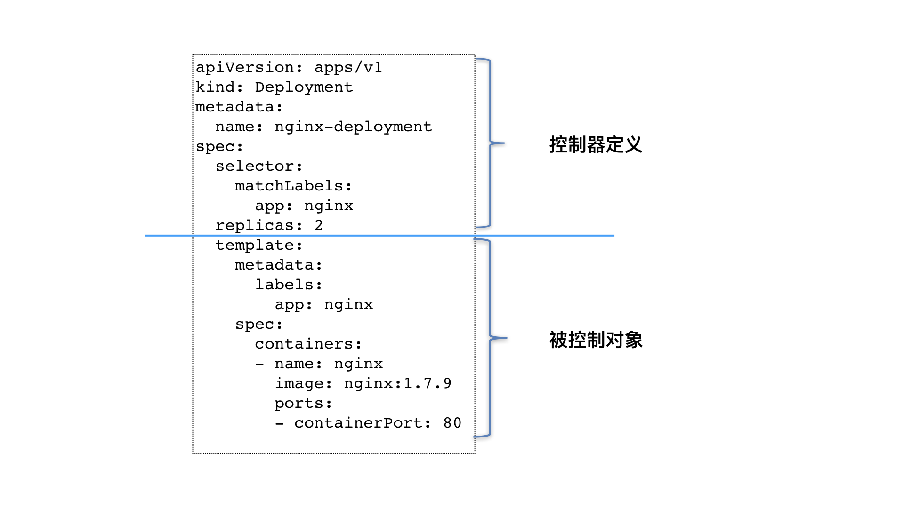

[toc]

------


### 编排概念

Pod 这个看似复杂的 API 对象，实际上就是对容器的进一步抽象和封装而已。

说得更形象些，“容器”镜像虽然好用，但是容器这样一个“沙盒”的概念，对于描述应用来说，还是太过简单了。这就好比，集装箱固然好用，但是如果它四面都光秃秃的，吊车还怎么把这个集装箱吊起来并摆放好呢？

所以，Pod 对象，其实就是容器的升级版。它对容器进行了组合，添加了更多的属性和字段。这就好比给集装箱四面安装了吊环，使得 Kubernetes 这架“吊车”，可以更轻松地操作它。


而 Kubernetes 操作这些“集装箱”的逻辑，都由控制器（Controller）完成。

回顾一下这个名叫 nginx-deployment 的例子：

```

apiVersion: apps/v1
kind: Deployment
metadata:
  name: nginx-deployment
spec:
  selector:
    matchLabels:
      app: nginx
  replicas: 2
  template:
    metadata:
      labels:
        app: nginx
    spec:
      containers:
      - name: nginx
        image: nginx:1.7.9
        ports:
        - containerPort: 80
```

这个 Deployment 定义的编排动作非常简单，即：确保携带了 app=nginx 标签的 Pod 的个数，永远等于 spec.replicas 指定的个数，即 2 个。这就意味着，如果在这个集群中，携带 app=nginx 标签的 Pod 的个数大于 2 的时候，就会有旧的 Pod 被删除；反之，就会有新的 Pod 被创建。

这时，你也许就会好奇：究竟是 Kubernetes 项目中的哪个组件，在执行这些操作呢？我在前面介绍 Kubernetes 架构的时候，曾经提到过一个叫作 kube-controller-manager 的组件。

实际上，这个组件，就是一系列控制器的集合。我们可以查看一下 Kubernetes 项目的 pkg/controller 目录：

> https://github.com/kubernetes/kubernetes

```

$ cd kubernetes/pkg/controller/
$ ls -d */              
deployment/             job/                    podautoscaler/          
cloud/                  disruption/             namespace/              
replicaset/             serviceaccount/         volume/
cronjob/                garbagecollector/       nodelifecycle/          replication/            statefulset/            daemon/
...
```

这个目录下面的每一个控制器，都以独有的方式负责某种编排功能。而我们的 Deployment，正是这些控制器中的一种。实际上，这些控制器之所以被统一放在 pkg/controller 目录下，就是因为它们都遵循 Kubernetes 项目中的一个通用编排模式，即：控制循环（control loop）。


比如，现在有一种待编排的对象 X，它有一个对应的控制器。那么，我就可以用一段 Go 语言风格的伪代码，为你描述这个控制循环：

```

for {
  实际状态 := 获取集群中对象X的实际状态（Actual State）
  期望状态 := 获取集群中对象X的期望状态（Desired State）
  if 实际状态 == 期望状态{
    什么都不做
  } else {
    执行编排动作，将实际状态调整为期望状态
  }
}
```

在**具体实现**中，实际状态往往来自于 Kubernetes 集群本身。

比如，kubelet 通过心跳汇报的容器状态和节点状态，或者监控系统中保存的应用监控数据，或者控制器主动收集的它自己感兴趣的信息，这些都是常见的实际状态的来源。

而**期望状态**，一般来自于用户提交的 YAML 文件。

比如，Deployment 对象中 Replicas 字段的值。很明显，这些信息往往都保存在 Etcd 中。


### 控制器模型

接下来，以 Deployment 为例，简单描述一下它对控制器模型的实现：

- Deployment 控制器从 Etcd 中获取到所有携带了“app: nginx”标签的 Pod，然后统计它们的数量，这就是实际状态；
- Deployment 对象的 Replicas 字段的值就是期望状态；
- Deployment 控制器将两个状态做比较，然后根据比较结果，确定是创建 Pod，还是删除已有的 Pod。

可以看到，一个 Kubernetes 对象的主要编排逻辑，实际上是在第三步的“对比”阶段完成的。

这个操作，通常被叫作调谐（Reconcile）。这个调谐的过程，则被称作“Reconcile Loop”（调谐循环）或者“Sync Loop”（同步循环）。

所以，如果你以后在文档或者社区中碰到这些词，都不要担心，它们其实指的都是同一个东西：控制循环。

而调谐的最终结果，往往都是对被控制对象的某种写操作。

比如，增加 Pod，删除已有的 Pod，或者更新 Pod 的某个字段。这也是 Kubernetes 项目“**面向 API 对象编程**”的一个直观体现。

其实，像 Deployment 这种控制器的设计原理，就是我们前面提到过的，“用一种对象管理另一种对象”的“艺术”。其中，这个控制器对象本身，负责定义被管理对象的期望状态。比如，Deployment 里的 replicas=2 这个字段。而被控制对象的定义，则来自于一个“模板”。比如，Deployment 里的 template 字段。

可以看到，Deployment 这个 template 字段里的内容，跟一个标准的 Pod 对象的 API 定义，丝毫不差。而所有被这个 Deployment 管理的 Pod 实例，其实都是根据这个 template 字段的内容创建出来的。

像 Deployment 定义的 template 字段，在 Kubernetes 项目中有一个专有的名字，叫作 PodTemplate（Pod 模板）。这个概念非常重要，因为后面我要讲解到的大多数控制器，都会使用 PodTemplate 来统一定义它所要管理的 Pod。更有意思的是，我们还会看到其他类型的对象模板，比如 Volume 的模板。

故可以对 Deployment 以及其他类似的控制器，做一个简单总结了：



类似 Deployment 这样的一个控制器，实际上都是由上半部分的控制器定义（包括期望状态），加上下半部分的被控制对象的模板组成的。

这就是为什么，在所有 API 对象的 Metadata 里，都有一个字段叫作 ownerReference，用于保存当前这个 API 对象的拥有者（Owner）的信息。


### 控制器模式与事件驱动

这两者的区别，相当于select和epoll的区别：

事件驱动：只要触发事件则执行，对执行后不负责，无论成功与否，没有对一次操作的后续进行“监控”

控制器模式：自身在不断地获取信息，起到事后“监控”作用，知道同步完成，实际状态与期望状态一致


### Deployment

Kubernetes 里第一个控制器模式的完整实现：Deployment。

Deployment 看似简单，但实际上，它实现了 Kubernetes 项目中一个非常重要的功能：Pod 的“水平扩展 / 收缩”（horizontal scaling out/in）。这个功能，是从 PaaS 时代开始，一个平台级项目就必须具备的编排能力。

如果你更新了 Deployment 的 Pod 模板（比如，修改了容器的镜像），那么 Deployment 就需要遵循一种叫作“滚动更新”（rolling update）的方式，来升级现有的容器。

而这个能力的实现，依赖的是 Kubernetes 项目中的一个非常重要的概念（API 对象）：ReplicaSet。

ReplicaSet 的结构非常简单，我们可以通过这个 YAML 文件查看一下：

```

apiVersion: apps/v1
kind: ReplicaSet
metadata:
  name: nginx-set
  labels:
    app: nginx
spec:
  replicas: 3
  selector:
    matchLabels:
      app: nginx
  template:
    metadata:
      labels:
        app: nginx
    spec:
      containers:
      - name: nginx
        image: nginx:1.7.9
```

一个 ReplicaSet 对象，其实就是由副本数目的定义和一个 Pod 模板组成的。它的定义其实是 Deployment 的一个子集。

更重要的是，Deployment 控制器实际操纵的，正是这样的 ReplicaSet 对象，而不是 Pod 对象。

对于一个 Deployment 所管理的 Pod，它的 ownerReference 是ReplicaSet。

一起分析一个如下所示的 Deployment：

```

apiVersion: apps/v1
kind: Deployment
metadata:
  name: nginx-deployment
  labels:
    app: nginx
spec:
  replicas: 3
  selector:
    matchLabels:
      app: nginx
  template:
    metadata:
      labels:
        app: nginx
    spec:
      containers:
      - name: nginx
        image: nginx:1.7.9
        ports:
        - containerPort: 80
```

它定义的 Pod 副本个数是 3（spec.replicas=3）。在具体的实现上，这个 Deployment，与 ReplicaSet，以及 Pod 的关系是怎样的呢？


一个定义了 replicas=3 的 Deployment，与它的 ReplicaSet，以及 Pod 的关系，实际上是一种“层层控制”的关系。

其中，ReplicaSet 负责通过“控制器模式”，保证系统中 Pod 的个数永远等于指定的个数（比如，3 个）。这也正是 Deployment 只允许容器的 restartPolicy=Always 的主要原因：只有在容器能保证自己始终是 Running 状态的前提下，ReplicaSet 调整 Pod 的个数才有意义。

而在此基础上，Deployment 同样通过“控制器模式”，来操作 ReplicaSet 的个数和属性，进而实现“水平扩展 / 收缩”和“滚动更新”这两个编排动作。

其中，“水平扩展 / 收缩”非常容易实现，Deployment Controller 只需要修改它所控制的 ReplicaSet 的 Pod 副本个数就可以了。

比如，把这个值从 3 改成 4，那么 Deployment 所对应的 ReplicaSet，就会根据修改后的值自动创建一个新的 Pod。这就是“水平扩展”了；“水平收缩”则反之。

而用户想要执行这个操作的指令也非常简单，就是 kubectl scale，比如：

```

$ kubectl scale deployment nginx-deployment --replicas=4
deployment.apps/nginx-deployment scaled
```

那么，“滚动更新”又是什么意思，是如何实现的呢？

```

$ kubectl create -f nginx-deployment.yaml --record
```

注意，在这里额外加了一个–record 参数。它的作用，是记录下你每次操作所执行的命令，以方便后面查看。

```

$ kubectl get deployments
NAME               DESIRED   CURRENT   UP-TO-DATE   AVAILABLE   AGE
nginx-deployment   3         0         0            0           1s
```

可以看到四个状态字段，它们的含义如下所示:

- DESIRED：用户期望的 Pod 副本个数（spec.replicas 的值）；
- CURRENT：当前处于 Running 状态的 Pod 的个数；
- UP-TO-DATE：当前处于最新版本的 Pod 的个数，所谓最新版本指的是 Pod 的 Spec 部分与 Deployment 里 Pod 模板里定义的完全一致；
- AVAILABLE：当前已经可用的 Pod 的个数，即：既是 Running 状态，又是最新版本，并且已经处于 Ready（健康检查正确）状态的 Pod 的个数。

可以看到，只有这个 AVAILABLE 字段，描述的才是用户所期望的最终状态。

而 Kubernetes 项目还为我们提供了一条指令，让我们可以实时查看 Deployment 对象的状态变化。这个指令就是 kubectl rollout status：

```

$ kubectl rollout status deployment/nginx-deployment
Waiting for rollout to finish: 2 out of 3 new replicas have been updated...
deployment.apps/nginx-deployment successfully rolled out
```

“2 out of 3 new replicas have been updated”意味着已经有 2 个 Pod 进入了 UP-TO-DATE 状态。

等待一会儿，我们就能看到这个 Deployment 的 3 个 Pod，就进入到了 AVAILABLE 状态：

```

NAME               DESIRED   CURRENT   UP-TO-DATE   AVAILABLE   AGE
nginx-deployment   3         3         3            3           20s
```

可以尝试查看一下这个 Deployment 所控制的 ReplicaSet：

```

$ kubectl get rs
NAME                          DESIRED   CURRENT   READY   AGE
nginx-deployment-3167673210   3         3         3       20s
```

在用户提交了一个 Deployment 对象后，Deployment Controller 就会立即创建一个 Pod 副本个数为 3 的 ReplicaSet。这个 ReplicaSet 的名字，则是由 Deployment 的名字和一个随机字符串共同组成。这个随机字符串叫作 pod-template-hash：3167673210。ReplicaSet 会把这个随机字符串加在它所控制的所有 Pod 的标签里，从而保证这些 Pod 不会与集群里的其他 Pod 混淆。

而 ReplicaSet 的 DESIRED、CURRENT 和 READY 字段的含义，和 Deployment 中是一致的。所以，相比之下，Deployment 只是在 ReplicaSet 的基础上，添加了 UP-TO-DATE 这个跟版本有关的状态字段。

这个时候，如果我们修改了 Deployment 的 Pod 模板，“滚动更新”就会被自动触发。

修改 Deployment 有很多方法。比如，我可以直接使用 kubectl edit 指令编辑 Etcd 里的 API 对象。

```

$ kubectl edit deployment/nginx-deployment
... 
    spec:
      containers:
      - name: nginx
        image: nginx:1.9.1 # 1.7.9 -> 1.9.1
        ports:
        - containerPort: 80
...
deployment.extensions/nginx-deployment edited
```

这个 kubectl edit 指令，会帮你直接打开 nginx-deployment 的 API 对象。然后，你就可以修改这里的 Pod 模板部分了。比如，在这里，我将 nginx 镜像的版本升级到了 1.9.1。

> 备注：kubectl edit 并不神秘，它不过是把 API 对象的内容下载到了本地文件，让你修改完成后再提交上去。

kubectl edit 指令编辑完成后，保存退出，Kubernetes 就会立刻触发“滚动更新”的过程。你还可以通过 kubectl rollout status 指令查看 nginx-deployment 的状态变化：

```

$ kubectl rollout status deployment/nginx-deployment
Waiting for rollout to finish: 2 out of 3 new replicas have been updated...
deployment.extensions/nginx-deployment successfully rolled out
```

这时，你可以通过查看 Deployment 的 Events，看到这个“滚动更新”的流程：

```

$ kubectl describe deployment nginx-deployment
...
Events:
  Type    Reason             Age   From                   Message
  ----    ------             ----  ----                   -------
...
  Normal  ScalingReplicaSet  24s   deployment-controller  Scaled up replica set nginx-deployment-1764197365 to 1
  Normal  ScalingReplicaSet  22s   deployment-controller  Scaled down replica set nginx-deployment-3167673210 to 2
  Normal  ScalingReplicaSet  22s   deployment-controller  Scaled up replica set nginx-deployment-1764197365 to 2
  Normal  ScalingReplicaSet  19s   deployment-controller  Scaled down replica set nginx-deployment-3167673210 to 1
  Normal  ScalingReplicaSet  19s   deployment-controller  Scaled up replica set nginx-deployment-1764197365 to 3
  Normal  ScalingReplicaSet  14s   deployment-controller  Scaled down replica set nginx-deployment-3167673210 to 0
```

该步骤流程为：

- 首先，当你修改了 Deployment 里的 Pod 定义之后，Deployment Controller 会使用这个修改后的 Pod 模板，创建一个新的 ReplicaSet（hash=1764197365），这个新的 ReplicaSet 的初始 Pod 副本数是：0。
- 然后，在 Age=24 s 的位置，Deployment Controller 开始将这个新的 ReplicaSet 所控制的 Pod 副本数从 0 个变成 1 个，即：“水平扩展”出一个副本。
- 紧接着，在 Age=22 s 的位置，Deployment Controller 又将旧的 ReplicaSet（hash=3167673210）所控制的旧 Pod 副本数减少一个，即：“水平收缩”成两个副本。
- 如此交替进行，新 ReplicaSet 管理的 Pod 副本数，从 0 个变成 1 个，再变成 2 个，最后变成 3 个。而旧的 ReplicaSet 管理的 Pod 副本数则从 3 个变成 2 个，再变成 1 个，最后变成 0 个。这样，就完成了这一组 Pod 的版本升级过程。


像这样，将一个集群中正在运行的多个 Pod 版本，交替地逐一升级的过程，就是“滚动更新”。

```

$ kubectl get rs
NAME                          DESIRED   CURRENT   READY   AGE
nginx-deployment-1764197365   3         3         3       6s
nginx-deployment-3167673210   0         0         0       30s
```

其中，旧 ReplicaSet（hash=3167673210）已经被“水平收缩”成了 0 个副本。

这种“滚动更新”的好处是显而易见的。

注意：

比如，在升级刚开始的时候，集群里只有 1 个新版本的 Pod。如果这时，新版本 Pod 有问题启动不起来，那么“滚动更新”就会停止，从而允许开发和运维人员介入。而在这个过程中，由于应用本身还有两个旧版本的 Pod 在线，所以服务并不会受到太大的影响。


当然，这也就要求你一定要使用 Pod 的 Health Check 机制检查应用的运行状态，而不是简单地依赖于容器的 Running 状态。要不然的话，虽然容器已经变成 Running 了，但服务很有可能尚未启动，“滚动更新”的效果也就达不到了。

而为了进一步保证服务的连续性，Deployment Controller 还会确保，在任何时间窗口内，只有指定比例的 Pod 处于离线状态。同时，它也会确保，在任何时间窗口内，只有指定比例的新 Pod 被创建出来。这两个比例的值都是可以配置的，默认都是 DESIRED 值的 25%。

在上面这个 Deployment 的例子中，它有 3 个 Pod 副本，那么控制器在“滚动更新”的过程中永远都会确保至少有 2 个 Pod 处于可用状态，至多只有 4 个 Pod 同时存在于集群中。这个策略，是 Deployment 对象的一个字段，名叫 RollingUpdateStrategy，如下所示：

```

apiVersion: apps/v1
kind: Deployment
metadata:
  name: nginx-deployment
  labels:
    app: nginx
spec:
...
  strategy:
    type: RollingUpdate
    rollingUpdate:
      maxSurge: 1
      maxUnavailable: 1
```

这个 RollingUpdateStrategy 的配置中，maxSurge 指定的是除了 DESIRED 数量之外，在一次“滚动”中，Deployment 控制器还可以创建多少个新 Pod；而 maxUnavailable 指的是，在一次“滚动”中，Deployment 控制器可以删除多少个旧 Pod。

同时，这两个配置还可以用前面我们介绍的百分比形式来表示，比如：maxUnavailable=50%，指的是我们最多可以一次删除“50%*DESIRED 数量”个 Pod。

结合以上讲述，现在可以扩展一下 Deployment、ReplicaSet 和 Pod 的关系图了。


Deployment 的控制器，实际上控制的是 ReplicaSet 的数目，以及每个 ReplicaSet 的属性。而一个应用的版本，对应的正是一个 ReplicaSet；这个版本应用的 Pod 数量，则由 ReplicaSet 通过它自己的控制器（ReplicaSet Controller）来保证。

通过这样的多个 ReplicaSet 对象，Kubernetes 项目就实现了对多个“应用版本”的描述。


### Deployment版本控制

使用一个叫 kubectl set image 的指令，直接修改 nginx-deployment 所使用的镜像。这个命令的好处就是，你可以不用像 kubectl edit 那样需要打开编辑器。

不过这一次，把这个镜像名字修改成为了一个错误的名字，比如：nginx:1.91。这样，这个 Deployment 就会出现一个升级失败的版本。

```

$ kubectl set image deployment/nginx-deployment nginx=nginx:1.91
deployment.extensions/nginx-deployment image updated
```

由于这个 nginx:1.91 镜像在 Docker Hub 中并不存在，所以这个 Deployment 的“滚动更新”被触发后，会立刻报错并停止。

```

$ kubectl get rs
NAME                          DESIRED   CURRENT   READY   AGE
nginx-deployment-1764197365   2         2         2       24s
nginx-deployment-3167673210   0         0         0       35s
nginx-deployment-2156724341   2         2         0       7s
```

新版本的 ReplicaSet（hash=2156724341）的“水平扩展”已经停止。而且此时，它已经创建了两个 Pod，但是它们都没有进入 READY 状态。这当然是因为这两个 Pod 都拉取不到有效的镜像。与此同时，旧版本的 ReplicaSet（hash=1764197365）的“水平收缩”，也自动停止了。此时，已经有一个旧 Pod 被删除，还剩下两个旧 Pod。

如何让这个 Deployment 的 3 个 Pod，都回滚到以前的旧版本呢？

只需要执行一条 kubectl rollout undo 命令，就能把整个 Deployment 回滚到上一个版本：

```

$ kubectl rollout undo deployment/nginx-deployment
deployment.extensions/nginx-deployment
```

在具体操作上，Deployment 的控制器，其实就是让这个旧 ReplicaSet（hash=1764197365）再次“扩展”成 3 个 Pod，而让新的 ReplicaSet（hash=2156724341）重新“收缩”到 0 个 Pod。

**更进一步地，如果我想回滚到更早之前的版本，要怎么办呢？**

首先，我需要使用 kubectl rollout history 命令，查看每次 Deployment 变更对应的版本。而由于我们在创建这个 Deployment 的时候，指定了–record 参数，所以我们创建这些版本时执行的 kubectl 命令，都会被记录下来。这个操作的输出如下所示：

```

$ kubectl rollout history deployment/nginx-deployment
deployments "nginx-deployment"
REVISION    CHANGE-CAUSE
1           kubectl create -f nginx-deployment.yaml --record
2           kubectl edit deployment/nginx-deployment
3           kubectl set image deployment/nginx-deployment nginx=nginx:1.91
```

前面执行的创建和更新操作，分别对应了版本 1 和版本 2，而那次失败的更新操作，则对应的是版本 3。

可以通过这个 kubectl rollout history 指令，看到每个版本对应的 Deployment 的 API 对象的细节，具体命令如下所示：

```

$ kubectl rollout history deployment/nginx-deployment --revision=2
```

然后，我们就可以在 kubectl rollout undo 命令行最后，加上要回滚到的指定版本的版本号，就可以回滚到指定版本了。这个指令的用法如下：

```

$ kubectl rollout undo deployment/nginx-deployment --to-revision=2
deployment.extensions/nginx-deployment
```

这样，Deployment Controller 还会按照“滚动更新”的方式，完成对 Deployment 的降级操作。

我们对 Deployment 进行的每一次更新操作，都会生成一个新的 ReplicaSet 对象，是不是有些多余，甚至浪费资源呢？

所以，Kubernetes 项目还提供了一个指令，使得我们对 Deployment 的多次更新操作，最后 只生成一个 ReplicaSet。

具体的做法是，在更新 Deployment 前，你要先执行一条 kubectl rollout pause 指令。它的用法如下所示：

```

$ kubectl rollout pause deployment/nginx-deployment
deployment.extensions/nginx-deployment paused
```

这个 kubectl rollout pause 的作用，是让这个 Deployment 进入了一个“暂停”状态。

就可以随意使用 kubectl edit 或者 kubectl set image 指令，修改这个 Deployment 的内容了。

由于此时 Deployment 正处于“暂停”状态，所以我们对 Deployment 的所有修改，都不会触发新的“滚动更新”，也不会创建新的 ReplicaSet。

而等到我们对 Deployment 修改操作都完成之后，只需要再执行一条 kubectl rollout resume 指令，就可以把这个 Deployment“恢复”回来，如下所示：

```

$ kubectl rollout resume deploy/nginx-deployment
deployment.extensions/nginx-deployment resumed
```

而在这个 kubectl rollout resume 指令执行之前，在 kubectl rollout pause 指令之后的这段时间里，我们对 Deployment 进行的所有修改，最后只会触发一次“滚动更新”。当然，我们可以通过检查 ReplicaSet 状态的变化，来验证一下 kubectl rollout pause 和 kubectl rollout resume 指令的执行效果，如下所示：

```

$ kubectl get rs
NAME               DESIRED   CURRENT   READY     AGE
nginx-1764197365   0         0         0         2m
nginx-3196763511   3         3         3         28s
```

通过返回结果，我们可以看到，只有一个 hash=3196763511 的 ReplicaSet 被创建了出来。

不过，即使你像上面这样小心翼翼地控制了 ReplicaSet 的生成数量，随着应用版本的不断增加，Kubernetes 中还是会为同一个 Deployment 保存很多很多不同的 ReplicaSet。

Deployment 对象有一个字段，叫作 spec.revisionHistoryLimit，就是 Kubernetes 为 Deployment 保留的“历史版本”个数。所以，如果把它设置为 0，你就再也不能做回滚操作了。


**自定义控制器**

在实际使用场景中，应用发布的流程往往千差万别，也可能有很多的定制化需求。比如，我的应用可能有会话黏连（session sticky），这就意味着“滚动更新”的时候，哪个 Pod 能下线，是不能随便选择的。

这种场景，光靠 Deployment 自己就很难应对了。对于这种需求，我们需要实现一个功能更加强大的 Deployment Controller。

Kubernetes 项目本身，也提供了另外一种抽象方式，帮我们应对其他一些用 Deployment 无法处理的应用编排场景。

金丝雀发布（Canary Deployment）和蓝绿发布（Blue-Green Deployment）：

金丝雀部署：优先发布一台或少量机器升级，等验证无误后再更新其他机器。优点是用户影响范围小，不足之处是要额外控制如何做自动更新。
蓝绿部署：2组机器，蓝代表当前的V1版本，绿代表已经升级完成的V2版本。通过LB将流量全部导入V2完成升级部署。优点是切换快速，缺点是影响全部用户。